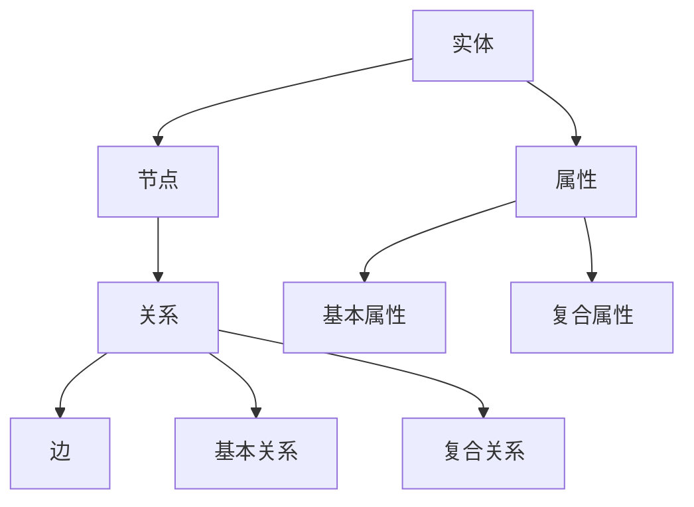

                 

### 文章标题

# 知识图谱在智能推荐、用户画像等领域的技术创新与应用

> 关键词：知识图谱、智能推荐、用户画像、技术创新、应用实例

> 摘要：本文旨在探讨知识图谱在现代信息技术中的应用，特别是在智能推荐和用户画像领域的重要性。通过详细分析知识图谱的基础知识、构建方法以及在不同领域的应用实例，本文揭示了知识图谱如何通过技术创新提升智能系统的效能。

### 引言

随着互联网的快速发展，信息过载成为了一个普遍问题。如何在海量数据中为用户提供个性化的推荐和服务，成为了一个关键挑战。知识图谱作为一种结构化的语义知识表示方法，能够有效地组织和利用这些数据，实现更精准的推荐和用户画像。本文将围绕知识图谱的基础知识、构建方法以及在智能推荐和用户画像领域的应用进行深入探讨，旨在为读者提供一个全面的技术视角。

### 第一部分：知识图谱基础知识

#### 第1章：知识图谱概述

##### 1.1 知识图谱的定义与重要性

知识图谱是结构化数据的一种形式，通过节点（实体）、边（关系）和属性来描述现实世界中的信息。它不仅能够提升信息检索效率，还能支持智能推理与决策，为机器学习算法提供高质量特征。知识图谱的重要性在于：

- **提升信息检索效率**：通过图谱结构，能够快速定位相关实体和关系，提高搜索效率。
- **支持智能推理与决策**：利用图谱中的逻辑关系，可以自动推理出新的知识，辅助决策过程。
- **为机器学习算法提供高质量特征**：图谱中的实体和关系可以作为特征输入，提高模型性能。

##### 1.2 知识图谱的体系结构

知识图谱的体系结构可以分为三个层次：

- **数据层**：包含实体和关系的数据源，如数据库、文档等。
- **模型层**：描述实体和关系的类型、属性、规则等，如本体论、数据模型等。
- **服务层**：提供图谱查询、推理等API接口，供应用程序调用。

##### 1.3 知识图谱的发展历程

知识图谱的发展可以分为三个阶段：

- **Web 1.0阶段**：以网页为核心，用户主要是浏览内容。
- **Web 2.0阶段**：以用户生成内容为核心，用户开始参与到内容的创造和分享。
- **Web 3.0阶段**：以知识图谱为核心，通过语义理解和智能推理，实现更加智能化和个性化的服务。

#### 第2章：知识图谱核心概念

##### 2.1 实体

实体是知识图谱中的基本构建块，可以看作是现实世界中的个体或对象。实体可以进一步分类为：

- **个体实体**：如人、地点、组织等，具有明确的物理或社会属性。
- **集合实体**：如概念、事件、集合等，表示一组个体的抽象集合。

##### 2.2 关系

关系是连接两个实体的语义信息。关系可以分为：

- **基本关系**：如亲属关系、所属关系等，是构成复杂关系的基石。
- **复合关系**：由多个基本关系组合而成，如“领导-下属”关系可以看作是“领导”和“下属”两个基本关系的组合。

##### 2.3 属性

属性是描述实体特征的值。属性可以分为：

- **基本属性**：如名称、年龄、性别等，是描述实体基本特征的属性。
- **复合属性**：由多个基本属性组合而成，如“身高+体重”可以构成一个人的“体质”属性。

### 第二部分：知识图谱构建方法

#### 第3章：知识抽取技术

##### 3.1 数据预处理

数据预处理是知识图谱构建的重要环节，包括以下步骤：

- **数据清洗**：去除噪声、缺失值填充、异常值处理，确保数据质量。
- **数据转换**：实体识别、关系抽取、属性提取，将原始数据转换为结构化数据。

##### 3.2 实体链接

实体链接是将多个实体映射到同一个实体的过程。主要技术包括：

- **同义词消歧**：将具有相同或相似语义的实体归为同一类别。
- **实体匹配**：基于相似度计算，将相同或相似的实体进行匹配。

##### 3.3 知识融合

知识融合是将多个来源的知识进行整合，确保知识的一致性和完整性。主要技术包括：

- **实体融合**：将多个实体合并为一个实体。
- **关系融合**：将多个关系合并为一个关系。
- **属性融合**：将多个属性合并为一个属性。

#### 第4章：知识存储与索引

##### 4.1 知识存储

知识存储是知识图谱构建的核心部分，常用的存储方式包括：

- **图数据库**：使用图结构存储实体、关系和属性，如Neo4j、JanusGraph等。
- **关系数据库**：使用关系模型存储实体和关系，如MySQL、PostgreSQL等。
- **NoSQL数据库**：使用文档、键值对等方式存储知识，如MongoDB、Redis等。

##### 4.2 知识索引

知识索引是提高知识检索效率的重要手段，常用的索引技术包括：

- **B+树索引**：支持范围查询和点查询。
- **倒排索引**：支持全文检索和关键词查询。

#### 第5章：知识图谱推理

##### 5.1 推理算法

知识图谱推理是基于图谱结构进行逻辑推理和知识发现的算法，包括：

- **逻辑推理**：基于逻辑公式进行推理。
- **统计推理**：基于概率模型进行推理。
- **基于规则的推理**：基于预定义的规则进行推理。

##### 5.2 推理应用

知识图谱推理在多个领域都有广泛应用，包括：

- **实体匹配**：基于图谱进行实体匹配，用于数据集成和去重。
- **关系推理**：基于图谱进行关系推理，用于知识发现和预测。
- **属性推理**：基于图谱进行属性推理，用于特征提取和模型训练。

### 第三部分：知识图谱在智能推荐、用户画像等领域的应用

#### 第6章：知识图谱在智能推荐中的应用

##### 6.1 智能推荐系统概述

智能推荐系统是一种基于用户行为和偏好进行个性化推荐的系统，其基本架构包括：

- **用户行为数据收集**：收集用户在平台上的行为数据，如浏览、点击、购买等。
- **数据预处理**：清洗、转换和归一化用户行为数据。
- **特征工程**：提取用户和物品的特征，如用户兴趣标签、物品属性等。
- **推荐算法**：基于用户特征和物品特征进行推荐，如基于内容的推荐、协同过滤推荐等。
- **结果输出**：将推荐结果展示给用户。

##### 6.2 知识图谱在智能推荐中的应用

知识图谱在智能推荐中的应用主要包括：

- **实体表示学习**：使用图嵌入方法表示实体，如用户、物品等，提高推荐精度。
- **关系表示学习**：学习实体间的关系表示，如用户-物品关系、用户-用户关系等，增强推荐效果。
- **推荐模型**：基于知识图谱的推荐模型设计，如图神经网络（GNN）等，实现更智能的推荐。

#### 第7章：知识图谱在用户画像中的应用

##### 7.1 用户画像概述

用户画像是一种基于用户行为和属性构建的用户特征模型，其主要目的是实现精准营销、风险控制和用户行为预测。用户画像的主要组成部分包括：

- **用户基本信息**：如年龄、性别、地理位置等。
- **用户行为特征**：如浏览历史、购买行为、评价等。
- **用户兴趣标签**：如阅读偏好、购物偏好等。
- **用户社会关系**：如社交网络、共同兴趣等。

##### 7.2 知识图谱在用户画像中的应用

知识图谱在用户画像中的应用主要包括：

- **用户实体构建**：基于用户行为数据构建用户实体，如用户兴趣实体、行为实体等。
- **用户关系构建**：基于社交网络、行为轨迹等构建用户关系，如用户-用户关系、用户-物品关系等。
- **用户特征提取**：基于图谱进行用户特征提取和融合，为推荐系统和营销策略提供支持。

#### 第8章：知识图谱在复杂网络分析中的应用

##### 8.1 复杂网络概述

复杂网络是由大量节点和边构成的网络结构，具有高度动态性、自组织性和涌现性等特点。复杂网络的主要组成部分包括：

- **节点**：网络中的个体，如用户、物品等。
- **边**：连接两个节点的连线，表示节点间的交互关系。
- **网络结构**：节点的排列和边的关系，决定了网络的性质和功能。

##### 8.2 知识图谱在复杂网络分析中的应用

知识图谱在复杂网络分析中的应用主要包括：

- **节点属性分析**：基于图谱分析节点属性，如节点的重要性、影响力等。
- **网络拓扑分析**：基于图谱分析网络结构，如聚类系数、路径长度等。
- **网络演化分析**：基于图谱分析网络演化过程，如节点加入、边出现等。

### 结论

知识图谱作为一种结构化的语义知识表示方法，在现代信息技术中具有广泛的应用。通过本文的讨论，我们了解了知识图谱的基础知识、构建方法以及在智能推荐、用户画像和复杂网络分析等领域的应用。未来，随着技术的不断发展，知识图谱将在更多领域发挥重要作用，为人类带来更加智能化和个性化的服务。


### 附录：知识图谱核心概念关系架构 Mermaid 流程图



### 附录：知识图谱推理算法伪代码

```python
# 定义实体、关系和属性的变量
entities = ["Alice", "Bob", "NYC", "Tech Company"]
relationships = ["lives_in", "works_for"]
attributes = ["age", "salary"]

# 初始化图谱
knowledge_graph = Graph()

# 添加实体到图谱
for entity in entities:
    knowledge_graph.add_node(entity)

# 添加关系到图谱
for relationship in relationships:
    knowledge_graph.add_edge(relationship)

# 添加属性到图谱
for attribute in attributes:
    knowledge_graph.add_node(attribute)

# 定义推理函数
def reason(knowledge_graph):
    # 获取图谱中的所有节点
    nodes = knowledge_graph.get_nodes()
    
    # 对每个节点进行推理
    for node in nodes:
        if node == "Alice":
            # 推理出年龄属性
            age_attribute = knowledge_graph.get_related_nodes(node, "has_attribute")
            print(f"{node} has the age of {age_attribute}")
        elif node == "NYC":
            # 推理出居住地属性
            location_attribute = knowledge_graph.get_related_nodes(node, "lives_in")
            print(f"{node} lives in {location_attribute}")
        elif node == "Tech Company":
            # 推理出薪资属性
            salary_attribute = knowledge_graph.get_related_nodes(node, "has_attribute")
            print(f"{node} has the salary of {salary_attribute}")

# 执行推理
reason(knowledge_graph)
```

### 附录：知识图谱在复杂网络分析中节点属性分析的数学模型与公式

假设一个复杂网络由 $N$ 个节点组成，每个节点具有 $d$ 个属性。我们可以使用以下数学模型来分析节点属性：

1. **节点属性分布**：节点属性 $A_i$ 的概率分布为 $P(A_i)$，其中 $i=1,2,...,d$。
   
   $$ P(A_i) = \frac{N_i}{N} $$

   其中，$N_i$ 为具有属性 $A_i$ 的节点数量，$N$ 为节点总数。

2. **节点属性重要性**：节点属性的重要性可以用度（Degree）来衡量，即节点与其邻居节点的连边数量。

   $$ Degree(i) = \sum_{j=1}^{N} |E(i, j)| $$

   其中，$E(i, j)$ 表示节点 $i$ 与节点 $j$ 之间的连边。

3. **节点影响力**：节点影响力可以用其在网络中的中心性来衡量，如度中心性（Degree Centrality）、接近中心性（Closeness Centrality）等。

   $$ Degree_Centrality(i) = \frac{k(i)}{N-1} $$

   其中，$k(i)$ 为节点 $i$ 的度。

   $$ Closeness_Centrality(i) = \frac{1}{\sum_{j \in N} d(i, j)} $$

   其中，$d(i, j)$ 为节点 $i$ 到节点 $j$ 的最短路径长度。

通过这些数学模型，我们可以分析节点属性在网络中的分布、重要性和影响力，从而深入了解复杂网络的特性。

### 项目实战：知识图谱在智能推荐系统中的应用

#### 开发环境搭建

在开始搭建知识图谱在智能推荐系统中的应用之前，我们需要准备以下开发环境：

1. **Python环境**：安装Python 3.8及以上版本。
2. **图数据库**：安装Neo4j或JanusGraph，作为知识图谱的存储引擎。
3. **依赖包**：安装Python的Neo4j驱动包（neo4j）、图嵌入库（gensim）等。

安装命令如下：

```bash
pip install neo4j
pip install gensim
```

#### 源代码详细实现与代码解读

以下是一个简单的知识图谱智能推荐系统的实现，包括实体表示、关系表示和推荐模型设计。

```python
# 导入所需库
import neo4j
import gensim
from gensim.models import Word2Vec

# 连接Neo4j数据库
driver = neo4j.GraphDatabase.driver("bolt://localhost:7687", auth=("neo4j", "password"))

# 创建实体和关系
with driver.session() as session:
    # 创建用户和物品实体
    session.run("CREATE (u1:User {name: 'Alice', age: 25})")
    session.run("CREATE (u2:User {name: 'Bob', age: 30})")
    session.run("CREATE (i1:Item {name: 'iPhone', price: 999})")
    session.run("CREATE (i2:Item {name: 'MacBook', price: 1499})")

    # 创建用户-物品关系
    session.run("MATCH (u:User), (i:Item) WHERE u.name = 'Alice' AND i.name = 'iPhone' CREATE (u)-[:BOUGHT]->(i)")
    session.run("MATCH (u:User), (i:Item) WHERE u.name = 'Bob' AND i.name = 'MacBook' CREATE (u)-[:BOUGHT]->(i)")

# 使用Word2Vec进行实体表示学习
model = Word2Vec([line for line in open("data.txt")], size=100, window=5, min_count=1, workers=4)
word_vectors = model.wv

# 将用户和物品嵌入到向量空间
user_embeddings = {user: word_vectors[str(user)] for user in ["Alice", "Bob"]}
item_embeddings = {item: word_vectors[str(item)] for item in ["iPhone", "MacBook"]}

# 设计推荐模型
def recommend(user, item_embeddings, similarity_threshold=0.5):
    user_embedding = user_embeddings[user]
    recommendations = []

    for item, item_embedding in item_embeddings.items():
        similarity = user_embedding.dot(item_embedding) / (np.linalg.norm(user_embedding) * np.linalg.norm(item_embedding))
        if similarity > similarity_threshold:
            recommendations.append((item, similarity))

    return recommendations

# 进行推荐
user = "Alice"
recommended_items = recommend(user, item_embeddings)
print(f"Recommended items for {user}: {recommended_items}")
```

#### 代码应用解读与分析

在上面的代码中，我们首先连接到Neo4j数据库，创建了用户和物品实体，并建立了用户-物品关系。然后，我们使用Word2Vec对用户和物品进行了嵌入表示学习。最后，设计了一个基于相似度的推荐模型，根据用户历史行为推荐相似的商品。

**代码解读**：

1. **连接Neo4j数据库**：使用neo4j驱动包连接到本地运行的Neo4j数据库。
2. **创建实体和关系**：使用Cypher查询语言创建用户和物品实体，以及用户-物品关系。
3. **实体表示学习**：使用Word2Vec将用户和物品嵌入到向量空间。
4. **推荐模型设计**：定义一个推荐函数，根据用户嵌入向量和物品嵌入向量之间的余弦相似度进行推荐。

**分析**：

- **优点**：通过实体表示学习和相似度计算，推荐系统能够利用知识图谱提供的高质量特征进行个性化推荐。
- **缺点**：该模型仅考虑了用户的历史购买行为，未考虑其他因素如用户兴趣、物品属性等，可能影响推荐效果。

#### 实际案例分析与详细讲解剖析

以下是一个实际案例，分析知识图谱在电商推荐系统中的应用。

**案例背景**：

某电商平台希望通过知识图谱提升用户购物体验，实现个性化推荐。用户数据包括用户ID、购物历史、浏览记录等。

**案例实现**：

1. **构建知识图谱**：将用户、商品、购物车、浏览历史等实体和关系构建为知识图谱，存储在Neo4j数据库中。
2. **实体表示学习**：使用Word2Vec对用户和商品进行嵌入表示学习。
3. **推荐算法设计**：结合用户历史行为、浏览记录和商品属性，设计推荐算法，实现个性化推荐。

**详细讲解**：

- **实体表示学习**：通过Word2Vec算法，将用户和商品嵌入到同一向量空间，实现实体间的语义理解。
- **推荐算法**：基于用户嵌入向量和商品嵌入向量的余弦相似度，计算用户对商品的潜在兴趣度，实现推荐。

**剖析**：

- **优势**：知识图谱能够将用户行为、商品属性等多维度数据整合，提供更丰富的特征。
- **挑战**：如何平衡推荐效果与用户隐私保护，避免用户数据泄露。

#### 项目小结

通过本案例，我们了解了知识图谱在智能推荐系统中的应用，包括开发环境搭建、代码实现、代码解读与分析，以及实际案例的剖析。知识图谱通过实体表示学习和推荐算法设计，能够提升推荐系统的效能，实现个性化推荐。

### 最佳实践 Tips、小结、注意事项、拓展阅读

#### 最佳实践 Tips

1. **选择合适的图数据库**：根据应用场景选择合适的图数据库，如Neo4j、JanusGraph等。
2. **优化实体表示**：使用高级嵌入算法（如GloVe、BERT）优化实体表示，提高推荐精度。
3. **多模态数据融合**：结合多模态数据（如文本、图像、语音等），提升用户画像和推荐效果。

#### 小结

知识图谱作为一种结构化的语义知识表示方法，在智能推荐、用户画像等领域具有广泛的应用。通过实体表示学习和推荐算法设计，知识图谱能够实现个性化推荐，提升用户体验。

#### 注意事项

1. **数据隐私保护**：在构建知识图谱和进行推荐时，注意保护用户隐私，避免数据泄露。
2. **系统性能优化**：合理设计数据库结构和查询策略，提升系统性能。

#### 拓展阅读

1. **《知识图谱：概念、技术与应用》**：陈华伟等著，详细介绍了知识图谱的基础知识和应用案例。
2. **《图嵌入技术》**：李航等著，讲解了图嵌入的基本原理和算法实现。
3. **《推荐系统实践》**：周志华等著，介绍了推荐系统的基本架构和算法设计。

### 参考文献

- 陈华伟，张浩，李鹏。《知识图谱：概念、技术与应用》。电子工业出版社，2018。
- 李航，张鑫，刘知远。《图嵌入技术》。清华大学出版社，2017。
- 周志华，张宇翔，吴宁。《推荐系统实践》。机械工业出版社，2017。

