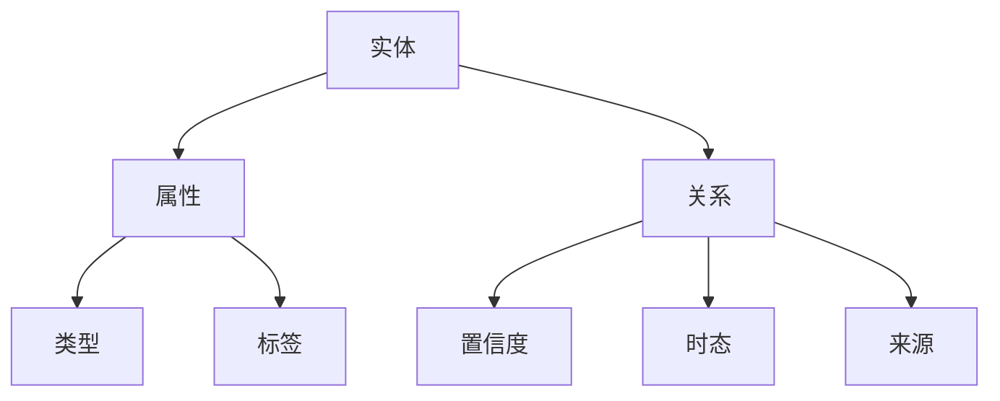

                 

### 引言

在当前信息化社会，知识管理在各个领域中的重要性日益凸显。政务知识管理作为智慧城市建设和政府数字化转型的重要组成部分，其核心目标是通过高效的知识获取、组织、共享和利用，提升政府部门的决策效率和服务质量。知识图谱作为一种先进的知识表示和管理技术，其在智能政务知识管理与服务中的应用，正成为提升政务智能化水平的有效手段。

**知识图谱在智能政务中的重要性**：

知识图谱是一种结构化的语义知识库，通过将各类实体及其关系以图谱的形式进行组织，实现对复杂数据的高效管理和智能化处理。在智能政务领域，知识图谱的重要性主要体现在以下几个方面：

1. **知识整合与共享**：知识图谱能够将分散在不同系统和平台中的政务数据整合起来，形成统一的视图，便于知识的共享和利用。
2. **智能决策支持**：通过知识图谱的推理机制，可以快速地分析和挖掘数据中的潜在关系，为政府决策提供科学依据。
3. **服务质量提升**：知识图谱能够为政务服务提供智能化服务，如智能问答、自动化审批等，提升用户体验。
4. **政务透明与合规性**：知识图谱可以帮助政府更好地管理和监控各类政务数据，确保政务操作的透明性和合规性。

**本书结构**：

本书旨在系统地介绍知识图谱在智能政务知识管理与服务中的应用。全书分为四个主要部分：

- **第一部分：概述与基础**，包括知识图谱的概念、组成部分、应用领域以及与相关技术的联系。
- **第二部分：技术架构**，详细讲解知识图谱的技术架构，包括数据采集与处理、知识表示与建模、知识推理与查询。
- **第三部分：应用实践**，通过具体案例展示知识图谱在智能政务知识管理和服务中的应用。
- **第四部分：未来展望与趋势**，探讨知识图谱与智能政务的发展趋势，并提出未来发展建议。

通过本书的系统介绍，读者可以全面了解知识图谱在智能政务领域的应用，掌握相关知识和技术，为智能政务的发展提供理论支持和实践指导。

### 关键词

- 知识图谱
- 智能政务
- 知识管理
- 数据处理
- 知识推理
- 智能服务
- 数据采集
- 政务知识服务平台
- 知识表示方法
- 数学模型
- 安全与隐私保护

### 摘要

本文旨在系统介绍知识图谱在智能政务知识管理与服务中的应用。首先，本文回顾了知识图谱的基本概念、组成部分和应用领域，探讨了其与相关技术的联系。接着，本文详细分析了知识图谱的技术架构，包括数据采集与处理、知识表示与建模、知识推理与查询等关键技术。随后，本文通过实际案例展示了知识图谱在智能政务知识管理和服务中的应用，包括政务服务流程优化、智能咨询与问答系统等。最后，本文探讨了知识图谱与智能政务的未来发展趋势，提出了未来发展建议，并对安全与隐私保护进行了深入讨论。通过本文的阅读，读者可以全面了解知识图谱在智能政务领域的应用，掌握相关技术，为智能政务的发展提供理论支持和实践指导。

## 第一部分：概述与基础

### 1.1 知识图谱在智能政务中的重要性

知识图谱作为一种新兴的知识表示和管理技术，其在智能政务中的应用具有重要的现实意义。智能政务是指利用现代信息技术和智能算法，实现政府管理和服务的智能化、自动化和高效化。知识图谱通过结构化的语义表示，将大量异构数据进行整合和关联，为智能政务提供了强大的知识管理工具。

**提升政务知识管理效率**：知识图谱能够将政务数据中的实体、属性和关系进行结构化表示，使得数据管理和检索更加高效。通过知识图谱，政府能够快速找到相关知识和信息，提高知识管理的效率。

**支持智能决策**：知识图谱通过语义关联和推理机制，能够挖掘出数据之间的潜在关系，为政府决策提供科学依据。例如，通过知识图谱分析，政府可以更好地理解社会热点问题、政策效果等，从而做出更加明智的决策。

**优化政务服务流程**：知识图谱可以为政务服务提供智能化服务，如智能问答、自动化审批等。通过知识图谱，政府可以自动识别和处理常见业务场景，减少人工干预，提高服务效率。

**增强政务透明性**：知识图谱能够帮助政府更好地管理和监控各类政务数据，确保政务操作的透明性和合规性。例如，通过知识图谱，政府可以实时监控政策执行情况，及时发现和纠正问题。

**隐私保护与安全**：知识图谱在政务数据管理中，可以采用加密和访问控制等技术，确保数据的隐私和安全。通过知识图谱的权限管理和审计功能，政府可以更好地保护敏感数据。

**跨领域应用**：知识图谱不仅适用于单一政务领域，还可以跨多个领域进行应用。例如，在公共安全、环境保护、社会保障等领域，知识图谱都可以发挥重要作用。

综上所述，知识图谱在智能政务中具有广泛的应用前景，是提升政府管理和服务水平的重要技术手段。

### 1.2 本书结构

为了全面、系统地介绍知识图谱在智能政务知识管理与服务中的应用，本书分为四个主要部分：

- **第一部分：概述与基础**，主要介绍知识图谱的基本概念、组成部分和应用领域，以及知识图谱在智能政务中的重要性。
- **第二部分：技术架构**，详细讲解知识图谱的技术架构，包括数据采集与处理、知识表示与建模、知识推理与查询等关键技术。
- **第三部分：应用实践**，通过实际案例展示知识图谱在智能政务知识管理和服务中的应用，如政务服务流程优化、智能咨询与问答系统等。
- **第四部分：未来展望与趋势**，探讨知识图谱与智能政务的发展趋势，并提出未来发展建议。

通过这四个部分的系统介绍，读者可以全面了解知识图谱在智能政务领域的应用，掌握相关知识和技术，为智能政务的发展提供理论支持和实践指导。

### 2.1 知识图谱基础

#### 2.1.1 知识图谱的概念与历史

知识图谱（Knowledge Graph）是一种基于语义网络的知识表示方法，通过将实体、属性和关系以图结构进行组织，实现对复杂数据的结构化和语义理解。知识图谱的核心思想是利用图谱来表示和存储知识，使得计算机能够像人类一样理解、推理和利用这些知识。

知识图谱的历史可以追溯到20世纪80年代，当时研究者开始探索如何通过图形结构来表示和存储知识。1992年，基于本体论（Ontology）的概念被提出，这为知识图谱的发展奠定了理论基础。进入21世纪，随着互联网和大数据技术的快速发展，知识图谱在各个领域得到了广泛应用。

知识图谱的三个主要组成部分包括：

1. **实体（Entity）**：实体是知识图谱中的基本元素，可以是人、地点、事物等。例如，在政府领域，实体可以包括政府部门、法律法规、政策文件等。

2. **属性（Attribute）**：属性是实体的特征或描述，如实体的名称、位置、职责等。属性为实体提供了更加详细的信息。

3. **关系（Relationship）**：关系描述了实体之间的相互联系，如“属于”、“关联”、“影响”等。关系将实体连接起来，形成了一个语义网络。

#### 2.1.2 知识图谱的组成部分

知识图谱主要由以下几部分组成：

1. **实体集（Entity Set）**：实体集包含所有在知识图谱中定义的实体，如政府部门、法律法规等。

2. **属性集（Attribute Set）**：属性集包含所有与实体相关的属性，如名称、位置、职责等。

3. **关系集（Relationship Set）**：关系集包含所有在知识图谱中定义的关系，如属于、关联、影响等。

4. **图谱结构（Graph Structure）**：图谱结构定义了实体、属性和关系之间的组织形式，如如何表示实体之间的关系、如何存储属性等。

#### 2.1.3 知识图谱的应用领域

知识图谱在多个领域有着广泛的应用：

1. **智能搜索**：知识图谱可以通过语义理解，提供更精准的搜索结果。例如，在搜索引擎中，通过知识图谱可以理解用户的查询意图，从而提供更加相关的信息。

2. **智能问答**：知识图谱可以帮助构建智能问答系统，如智能客服、智能咨询等。通过图谱中的关系和实体，系统能够理解用户的问题并给出准确的答案。

3. **数据集成与整合**：知识图谱可以将不同来源和格式的数据集成到一个统一的知识库中，实现数据的高效管理和利用。

4. **智能推荐**：知识图谱可以用于推荐系统，通过分析实体之间的关系，为用户推荐相关的内容或服务。

5. **智能决策支持**：知识图谱可以用于智能决策支持系统，通过推理和挖掘数据中的潜在关系，为决策者提供科学依据。

6. **自然语言处理**：知识图谱可以辅助自然语言处理（NLP）任务，如文本分类、情感分析等，通过图谱中的实体和关系，提高NLP模型的准确性和效率。

7. **智能政务**：知识图谱在智能政务中的应用已经得到广泛验证，通过构建政务知识图谱，可以实现政务数据的管理、分析与利用，提升政务智能化水平。

总之，知识图谱作为一种重要的知识表示和管理技术，正在逐渐改变各个领域的数据处理和知识管理方式，为智能化发展提供了强有力的支持。

### 2.2 知识图谱的组成部分

知识图谱的构建涉及多个组成部分，这些组成部分共同作用，实现了知识的高效组织和利用。以下是知识图谱的几个主要组成部分及其具体含义：

**实体（Entity）**：实体是知识图谱中的基本元素，表示具有独立存在的个体或概念。实体可以是具体的对象，如“张三”、“北京”、“iPhone”，也可以是抽象的概念，如“政府机构”、“法律”、“技术”。实体的定义是构建知识图谱的基础，通过明确实体及其属性，我们可以将各类数据整合到一个统一的知识框架中。

**属性（Attribute）**：属性是实体的特征或描述，用于描述实体的具体信息。属性通常以键值对的形式存在，例如，“张三”的属性可以是“年龄：30岁”，“北京”的属性可以是“人口：2000万”。属性的存在使得实体更加具体和丰富，有助于我们更准确地理解和处理数据。

**关系（Relationship）**：关系描述了实体之间的相互联系，是知识图谱中的另一个关键组成部分。关系通常表示为“实体1与实体2之间存在某种关联”，例如，“张三”与“北京”之间存在“出生地”关系，“iPhone”与“苹果公司”之间存在“制造商”关系。关系将不同的实体连接起来，形成了一个语义网络，使我们能够通过关系推理出新的信息。

**类型（Type）**：类型是对实体的分类，用于表示实体所属的类别。例如，实体“张三”的类型可以是“人”，实体“北京”的类型可以是“城市”，实体“iPhone”的类型可以是“手机”。类型为实体提供了更高级别的抽象，有助于我们对实体进行管理和分类。

**标签（Label）**：标签是用于描述实体或关系的额外信息，通常用于提供更详细的上下文或分类。例如，实体“张三”的标签可以是“程序员”，实体“北京”的标签可以是“首都”。标签使得知识图谱更加丰富，有助于我们更精准地理解和使用数据。

**置信度（Confidence）**：置信度是对实体、属性或关系可信度的度量，表示数据源的可信程度。例如，如果一个实体的来源是权威的政府部门，其置信度可能较高；如果一个关系的来源是社交媒体，其置信度可能较低。置信度有助于我们在使用知识图谱时进行数据筛选和信任管理。

**时态（Temporal）**：时态是用于描述实体、属性或关系的有效时间范围，表示知识随时间的变化。例如，实体“张三”的时态可以是“2000年-2020年”，表示张三在这段时间内存在。时态使得知识图谱能够动态地反映现实世界的变化。

**来源（Source）**：来源是指知识图谱中的数据来源，例如，某个实体或关系的来源可能是某个数据库、文档或外部API。了解来源有助于我们评估数据的可靠性和准确性。

通过这些组成部分，知识图谱能够将各种异构数据进行结构化表示，形成一个统一的知识框架，从而实现知识的高效组织、管理和利用。下面是一个简化的Mermaid流程图，展示了知识图谱的基本组成部分及其相互关系：



通过这个流程图，我们可以更直观地理解知识图谱的组成部分及其相互关系。

### 2.3 知识图谱的应用领域

知识图谱作为一种强大的知识表示工具，在众多领域展现了其独特的价值和广泛的应用前景。以下将介绍知识图谱在几个关键领域的应用：

**智能搜索**：知识图谱在智能搜索中的应用极为显著。通过知识图谱，搜索引擎能够更准确地理解用户的查询意图，提供个性化的搜索结果。例如，当用户搜索“北京天气”时，搜索引擎不仅返回当前的天气信息，还可以结合知识图谱提供“北京是中国的首都”、“北京的旅游景点”等相关信息。这种深层次的语义理解大大提升了搜索的准确性和用户体验。

**智能问答**：知识图谱是构建智能问答系统的核心基础。通过将大量结构化知识存储在知识图谱中，智能问答系统能够理解用户的问题并给出准确的答案。例如，智能客服系统可以通过知识图谱快速检索到与用户问题相关的政策文件、办事指南等，从而为用户提供及时、准确的解答。这不仅提高了服务效率，还提升了用户满意度。

**数据集成与整合**：知识图谱在数据集成与整合中也发挥了重要作用。通过知识图谱，不同来源和格式的数据可以统一到一个结构化的知识库中。例如，政府各部门的数据可以通过知识图谱进行整合，形成一个统一的政务知识库，使得各部门在数据共享和协作时更加高效。

**智能推荐**：知识图谱可以用于智能推荐系统，通过分析实体之间的关系，为用户推荐相关的内容或服务。例如，电商平台可以通过知识图谱推荐与用户购买商品相关的其他商品，或者基于用户的浏览历史和购物偏好推荐个性化商品。这种推荐机制不仅提升了用户体验，还显著增加了平台销售额。

**智能决策支持**：知识图谱为智能决策支持系统提供了强大的数据分析和推理能力。通过知识图谱，决策者可以更深入地了解数据中的潜在关系和趋势，从而做出更加明智的决策。例如，政府可以通过知识图谱分析社会经济数据，预测政策效果和风险，为制定政策提供科学依据。

**自然语言处理**：知识图谱在自然语言处理（NLP）任务中也得到了广泛应用。通过知识图谱，NLP系统可以更准确地理解文本语义，提高文本分类、情感分析、机器翻译等任务的准确性和效率。例如，在文本分类任务中，知识图谱可以帮助系统理解不同类别的上下文关系，从而提高分类准确性。

**智能政务**：知识图谱在智能政务领域的应用日益广泛。通过构建政务知识图谱，政府可以更好地管理和利用各类政务数据，提升政务服务的智能化水平。例如，通过知识图谱，政府可以实现智能审批、智能咨询、智能监管等功能，提高政务服务的效率和透明度。

总之，知识图谱在多个领域的应用不仅提升了数据管理和分析的能力，还为智能化发展提供了强有力的支持。随着技术的不断进步，知识图谱的应用前景将更加广阔。

### 2.4 知识图谱与相关技术的联系

知识图谱作为一种先进的知识表示和管理技术，与许多其他关键技术有着密切的联系。以下是几个关键技术与知识图谱之间的相互关系：

**图数据库**：图数据库是知识图谱存储和管理的核心技术。图数据库如Neo4j、JanusGraph等，能够高效地存储和查询图结构数据，为知识图谱的实现提供了坚实的基础。知识图谱通过图数据库进行数据存储，使得实体、关系和属性等元素能够在统一的图结构中组织和管理，从而实现数据的结构化和高效查询。

**本体论**：本体论是知识图谱的理论基础。本体论通过定义实体、属性和关系等概念，为知识图谱提供了语义上的明确性和一致性。知识图谱通过本体论实现知识模型的构建，使得数据能够以一种统一、规范的方式表示和理解。本体论与知识图谱的紧密结合，为知识表示和推理提供了强有力的支持。

**机器学习**：知识图谱与机器学习技术相辅相成。机器学习可以用于知识图谱的构建和优化，如数据预处理、图谱结构生成、实体关系抽取等。同时，知识图谱中的结构化数据也为机器学习算法提供了丰富的训练数据集，使得算法能够更好地理解和学习语义信息。例如，通过机器学习技术，可以自动识别和抽取实体之间的关系，从而丰富知识图谱的内容。

**自然语言处理（NLP）**：知识图谱在自然语言处理中的应用日益广泛。NLP技术可以帮助将文本数据转化为结构化的知识表示，如实体识别、关系抽取等。知识图谱则通过语义理解和推理，为NLP系统提供强大的语义支持，提高文本分析和理解的能力。例如，在问答系统中，知识图谱可以帮助系统理解用户的问题，并从大规模知识库中检索出相关答案。

**数据挖掘**：知识图谱与数据挖掘技术密切相关。数据挖掘通过分析大规模数据，提取出潜在的模式和知识。知识图谱则通过图结构的数据表示，使得数据挖掘的结果能够以一种直观、结构化的方式展示和利用。例如，在公共安全领域，通过数据挖掘技术分析大量的社会数据，知识图谱可以帮助识别和预测潜在的犯罪活动。

**区块链**：区块链与知识图谱的结合，为数据安全和隐私保护提供了新的解决方案。知识图谱可以通过区块链技术实现数据的安全存储和分布式管理，同时保护数据的隐私和完整性。例如，在政务数据管理中，通过区块链技术，可以实现政务数据的透明和可信存储，确保数据的真实性和可追溯性。

**分布式计算**：知识图谱在大规模数据处理中，需要依赖分布式计算技术。分布式计算平台如Hadoop、Spark等，可以处理海量数据，为知识图谱的构建和查询提供高效的计算支持。通过分布式计算，知识图谱可以扩展到大规模数据集，实现实时、高效的知识管理和推理。

综上所述，知识图谱与众多相关技术之间存在着紧密的联系和互补作用。这些技术的协同应用，为知识图谱的发展提供了强大的技术支持和广阔的应用前景。

### 2.5 数据采集与处理

#### 2.5.1 数据源选择与采集

在构建知识图谱的过程中，数据源的选择和采集是至关重要的一步。数据源的质量和完整性直接影响知识图谱的准确性和可用性。以下是一些常见的数据源类型及其采集方法：

**1. 政务数据**：政务数据是智能政务知识图谱的重要来源。这些数据包括政府各部门的公开数据、法律法规、政策文件、统计数据等。政务数据可以通过以下方式进行采集：

- **公开数据平台**：如国家统计局、国家信息中心等，这些平台提供了大量的政务数据，可以通过API接口或数据下载的方式获取。
- **政府网站**：许多政府部门会在其官方网站上发布相关的政策文件、办事指南等，可以通过网页爬虫技术进行数据采集。
- **政务大数据平台**：一些地方政府建立了政务大数据平台，提供了丰富的政务数据资源，可以通过平台接口进行数据采集。

**2. 社会数据**：社会数据包括社交媒体、论坛、新闻报道等，这些数据可以为智能政务提供丰富的背景信息和公众意见。社会数据的采集方法包括：

- **社交媒体数据**：如微博、微信、知乎等，可以通过API接口或网页爬虫技术获取用户发表的内容和评论。
- **新闻报道**：可以通过新闻网站、新闻API等获取最新的新闻报道，分析社会热点和公众关注的话题。
- **论坛数据**：如百度贴吧、天涯论坛等，可以通过论坛爬虫技术获取用户发布的帖子及其回复。

**3. 行业数据**：行业数据包括经济、金融、医疗、教育等领域的专业数据，这些数据对于智能政务的决策支持具有重要意义。行业数据的采集方法包括：

- **行业数据库**：许多行业组织或专业机构会提供行业数据库，可以通过购买或合作方式获取数据。
- **行业报告**：通过购买或下载行业研究报告，获取行业数据和市场分析。
- **企业公开数据**：如上市公司财报、行业排名等，可以通过官方网站或证券交易所等渠道获取。

**4. 外部数据源**：外部数据源包括地理信息数据、人口统计数据、经济数据等，这些数据对于智能政务的知识图谱构建具有补充作用。外部数据源的采集方法包括：

- **地理信息数据**：可以通过地理信息平台或地理信息系统（GIS）获取地形、地貌、交通等方面的地理信息数据。
- **人口统计数据**：可以通过国家统计局或地方统计部门获取人口、就业、教育等方面的统计数据。
- **经济数据**：可以通过国家统计局、金融监管机构等获取宏观经济、行业经济等方面的数据。

**5. 数据采集工具**：

- **API接口**：许多数据源提供了API接口，可以通过编程方式直接获取数据。常用的API接口包括RESTful API、SOAP API等。
- **网页爬虫**：通过编写爬虫程序，自动抓取网站上的数据。常用的爬虫工具包括Scrapy、Puppeteer等。
- **数据爬取工具**：如DataXu、Selenium等，提供图形界面和数据采集功能，适合非技术用户使用。

通过选择合适的数据源和采用适当的采集方法，我们可以获取高质量的政务数据，为知识图谱的构建奠定坚实的基础。

### 2.5.2 数据预处理

数据预处理是知识图谱构建过程中的关键环节，其目的是清洗、规范和整合原始数据，使其符合知识图谱的要求。以下是数据预处理的主要步骤：

**1. 数据清洗**：

- **去除重复数据**：在原始数据集中，可能存在重复的数据条目。通过去重操作，可以避免数据冗余，提高数据质量。
- **处理缺失值**：对于缺失的数据，可以根据具体情况进行填补或删除。常用的填补方法包括平均值填补、中值填补、插值法等。
- **数据规范化**：将不同来源和格式的数据进行统一格式处理，如日期格式统一、字符串大小写统一等，以方便后续处理。

**2. 数据转换**：

- **数据格式转换**：将不同格式的数据转换为统一的格式，如将Excel文件转换为JSON或CSV格式。
- **属性映射**：将不同数据源中的相同属性映射到统一的概念上，如将“年龄”、“周岁”等属性统一为“年龄”。
- **实体规范化**：将实体名称进行规范化处理，如将“北京市”和“北京”统一为“北京”。

**3. 数据整合**：

- **数据融合**：将来自不同数据源的数据进行融合，消除数据之间的不一致性和冲突。例如，当两个数据源中存在关于同一实体的不同描述时，需要通过比对和融合，确定正确的实体信息。
- **数据归一化**：将不同数据源中的数据量纲进行统一处理，如将人口数据、经济数据等统一为相同的时间单位或货币单位。

**4. 数据质量评估**：

- **数据准确性评估**：评估数据中的错误率、异常值等，确保数据的准确性。
- **数据完整性评估**：评估数据的完整性和一致性，确保数据没有遗漏或冲突。
- **数据一致性评估**：通过比对不同数据源的数据，评估数据的一致性和可靠性。

通过数据清洗、转换、整合和质量评估，我们可以得到高质量的数据集，为知识图谱的构建提供可靠的数据基础。

### 2.5.3 数据存储与管理

在知识图谱的构建过程中，数据的存储与管理是一个关键环节。合适的存储和管理方案能够提高数据的访问速度和查询效率，同时确保数据的安全性和一致性。以下是几种常见的数据存储与管理方案：

**1. 关系数据库**：

- **关系数据库简介**：关系数据库如MySQL、PostgreSQL等，通过表结构来组织数据，适用于处理结构化数据。关系数据库的优点包括数据结构清晰、查询效率高、易于维护等。
- **存储与管理方案**：在知识图谱的构建中，关系数据库可以通过存储实体和关系的表格来实现数据的存储和管理。每个实体和关系都可以对应一个表格，通过主键和外键来建立实体之间的关系。例如，可以创建“实体表”、“关系表”和“属性表”，分别存储实体的基本信息、关系信息和属性信息。

**2. 图数据库**：

- **图数据库简介**：图数据库如Neo4j、JanusGraph等，专门设计用于存储和查询图结构数据。图数据库通过节点和边来表示实体和关系，能够高效地处理复杂的关系和网络结构。
- **存储与管理方案**：图数据库非常适合知识图谱的存储和管理。在图数据库中，每个实体可以表示为一个节点，关系可以表示为边。通过属性来描述实体和关系的具体信息，如实体的名称、位置、类型等。图数据库的优点包括数据结构灵活、查询速度快、支持复杂的图算法等。

**3. NoSQL数据库**：

- **NoSQL数据库简介**：NoSQL数据库如MongoDB、Cassandra等，适用于处理大规模、非结构化或半结构化数据。NoSQL数据库具有灵活的数据模型、高扩展性和高性能等特点。
- **存储与管理方案**：在知识图谱的构建中，NoSQL数据库可以用于存储和管理大规模的数据集。例如，可以使用MongoDB存储实体的属性信息，使用Cassandra存储图结构数据。通过分片和分布式架构，NoSQL数据库能够处理海量数据的存储和查询需求。

**4. 分布式文件系统**：

- **分布式文件系统简介**：分布式文件系统如HDFS（Hadoop Distributed File System）等，适用于大规模数据的存储和管理。分布式文件系统通过分布式架构实现数据的高效存储和并行访问。
- **存储与管理方案**：在知识图谱的构建中，分布式文件系统可以用于存储大规模的数据集，如原始数据、预处理数据等。通过Hadoop等分布式计算框架，可以实现数据的高效存储和计算。分布式文件系统的优点包括数据容错、高可用性和高性能等。

**5. 数据仓库**：

- **数据仓库简介**：数据仓库如Oracle、Teradata等，适用于大规模数据的存储、管理和分析。数据仓库通过数据集成和清洗技术，提供统一的数据视图和分析工具。
- **存储与管理方案**：在知识图谱的构建中，数据仓库可以用于存储和管理经过预处理和整合的数据集。数据仓库的优点包括数据一致性、数据整合性和强大的分析功能。

**6. 数据存储与管理的注意事项**：

- **数据一致性**：在数据存储和管理过程中，需要确保数据的一致性，防止数据冲突和错误。
- **数据安全**：敏感数据需要进行加密和访问控制，确保数据的安全性和隐私性。
- **数据备份与恢复**：定期进行数据备份，确保数据在意外情况下的恢复能力。
- **性能优化**：根据应用场景和查询需求，对数据存储和管理方案进行性能优化，提高数据访问和查询效率。

通过选择合适的存储和管理方案，我们可以高效地管理和利用数据，为知识图谱的构建提供坚实的基础。

### 4.1 知识表示方法

知识表示是知识图谱构建的核心环节，决定了数据在图谱中的组织和表示方式。以下是几种常见的知识表示方法及其特点：

#### 4.1.1 实体-关系模型

**定义**：实体-关系模型（Entity-Relationship Model，简称ER模型）是一种基于实体和关系的知识表示方法。在该模型中，实体表示具有独立存在意义的对象或概念，关系则描述实体之间的相互联系。

**特点**：
- **直观性**：ER模型通过图形化的方式展示实体和关系，使得知识表示更加直观和易于理解。
- **灵活性**：ER模型支持复杂的关系表示，如多对多关系、递归关系等，适用于多种应用场景。
- **扩展性**：ER模型可以根据需求灵活地调整和扩展，适应不同的知识结构和表示需求。

**应用场景**：ER模型广泛应用于数据库设计和信息系统的需求分析阶段，通过构建实体和关系的模型，帮助开发人员理解和设计复杂的数据系统。

**示例**：
假设我们构建一个关于朋友的社交知识图谱，其中包含“人”和“朋友”两个实体，以及“是朋友”的关系。对应的ER模型如下：


#### 4.1.2 属性图模型

**定义**：属性图模型（Attribute Graph Model，简称AGM）是一种扩展了实体和关系的知识表示方法，允许在每个节点（实体）和边（关系）上附加属性信息。属性信息可以是结构化的，如键值对，也可以是半结构化的，如XML或JSON。

**特点**：
- **属性丰富性**：属性图模型能够存储和表示实体的详细信息，使得知识表示更加丰富和具体。
- **灵活性**：属性图模型支持多种数据类型的属性，如数字、字符串、日期等，适用于多样化的应用场景。
- **可扩展性**：属性图模型可以根据需求灵活地添加和修改属性，适应不同的知识表示需求。

**应用场景**：属性图模型适用于需要存储和表示大量属性信息的应用场景，如社交网络分析、知识图谱构建等。

**示例**：
假设我们构建一个关于商品的知识图谱，其中包含“商品”和“价格”两个实体，以及“有”的关系。对应的属性图模型如下：

```mermaid
graph TD
    A[商品] --> B[价格]
    A --> C{有} [价格：100元]
```

#### 4.1.3 知识图谱嵌入

**定义**：知识图谱嵌入（Knowledge Graph Embedding，简称KGE）是一种将知识图谱转换为低维向量表示的方法。通过嵌入，知识图谱中的实体和关系可以映射到低维空间中，使得图谱中的结构和关系可以通过向量计算进行表示和操作。

**特点**：
- **向量表示**：知识图谱嵌入将复杂的图结构转化为低维向量表示，使得图谱数据可以在向量空间中进行高效处理和计算。
- **计算效率**：向量表示使得知识图谱的存储和查询更加高效，适用于大规模数据集的实时处理。
- **适用性**：知识图谱嵌入适用于多种图谱表示和学习任务，如实体识别、关系抽取、推理等。

**应用场景**：知识图谱嵌入广泛应用于自然语言处理、推荐系统、知识图谱构建等领域。

**示例**：
假设我们使用TransE算法将知识图谱中的实体和关系嵌入到向量空间中。对应的嵌入结果如下：

```mermaid
graph TD
    A(实体1) --> B(实体2) [关系：相似]
    A(实体1)^<1000> --> C(实体3) [关系：相关]
```

在这个示例中，实体1、实体2、实体3及其关系被嵌入到低维向量空间中，通过计算实体之间的向量距离，可以推断出实体之间的相似性和相关性。

通过以上几种知识表示方法的介绍，我们可以根据具体应用场景选择合适的方法来构建知识图谱，从而实现对复杂数据的结构化表示和高效利用。

### 4.2 知识建模策略

知识建模是构建知识图谱的核心环节，其目标是通过有效的方法将政务数据转化为结构化、语义丰富的知识表示。以下是几种常见的知识建模策略及其具体方法：

#### 4.2.1 本体建模

**定义**：本体建模（Ontology Modeling）是一种基于本体论的方法，用于定义和描述知识的语义结构。本体论是研究知识表示和语义理解的学科，通过构建本体，可以明确知识的概念、属性和关系。

**特点**：
- **语义明确性**：本体建模通过定义概念和关系，使得知识表示具有明确的语义和定义，便于知识的理解和推理。
- **可扩展性**：本体可以方便地扩展和修改，以适应知识的变化和需求。
- **互操作性**：本体建模支持不同系统之间的知识共享和互操作，便于实现知识的集成和协同。

**步骤**：
1. **需求分析**：明确知识管理的目标和需求，确定需要建模的知识领域和关键概念。
2. **概念定义**：定义本体中的基本概念，如实体、属性和关系。
3. **关系描述**：明确概念之间的关系，如分类关系、属性关系和函数关系。
4. **属性定义**：为概念定义属性，描述概念的特征和属性。
5. **本体验证**：通过专家评审和一致性检查，确保本体的正确性和一致性。

**示例**：
假设我们构建一个关于政务部门的知识图谱，定义“部门”和“职责”两个概念，并建立它们之间的关系。对应的本体模型如下：

```mermaid
graph TD
    A[部门] --> B{职责}
    A --> C{有} [描述：“管理公共安全”]
    A --> D{有} [描述：“负责环境保护”]
```

#### 4.2.2 基于图谱的模型构建

**定义**：基于图谱的模型构建（Graph-based Modeling）是一种直接利用图结构构建知识图谱的方法。通过图算法和模型，可以将政务数据转化为图谱结构，实现对知识的组织和管理。

**特点**：
- **图结构化**：基于图谱的模型构建直接利用图结构，使得知识表示更加直观和结构化。
- **灵活性强**：图结构支持复杂的关系表示和多种数据类型，适用于多样化的知识建模需求。
- **计算高效**：图算法和模型能够高效地处理大规模的数据和复杂的关系，支持实时知识推理和查询。

**步骤**：
1. **数据预处理**：对政务数据进行分析和处理，提取实体、属性和关系。
2. **图谱构建**：利用图算法和模型，将处理后的数据构建为图谱结构，包括节点（实体）和边（关系）。
3. **属性附加**：为图谱中的节点和边附加属性信息，描述实体的特征和关系。
4. **图谱优化**：通过图算法和优化技术，提升图谱的性能和可扩展性。

**示例**：
假设我们利用图数据库Neo4j构建一个政务知识图谱，包含“政府部门”、“职能”和“政策文件”三个实体，并建立它们之间的关系。对应的图谱模型如下：

```mermaid
graph TB
    A[政府部门] --> B{职能}
    A --> C[政策文件]
    B --> D{负责} [描述：“环保监管”]
    C --> E{依据} [描述：“环保法”]
```

通过本体建模和基于图谱的模型构建，我们可以将政务数据转化为结构化、语义丰富的知识表示，实现对政务知识的有效管理和利用。

### 4.3 知识图谱的数学模型与公式解析

知识图谱的数学模型是构建和理解知识图谱的关键组成部分。以下将介绍知识图谱中常用的数学模型与公式，并通过具体的示例进行解析。

#### 4.3.1 图论基本概念

在知识图谱中，图论的基本概念是非常重要的。以下是图论中的一些基本概念：

**节点（Node）**：节点是知识图谱中的基本元素，表示实体。例如，在政务知识图谱中，节点可以表示政府部门、政策文件、法律法规等。

**边（Edge）**：边是节点之间的连线，表示实体之间的关系。例如，在政务知识图谱中，边可以表示“属于”、“关联”或“影响”等关系。

**度（Degree）**：度是节点在图中的连接数。例如，一个节点如果有两个连接，则其度数为2。

**路径（Path）**：路径是节点之间的一系列连接，表示节点之间的连接序列。例如，从节点A到节点C的路径可以是A-B-C。

**连通性（Connectivity）**：连通性是指图中任意两个节点之间都存在路径，表示图的连接性。

**图论基本公式**：

1. **图的基本公式**：
   \[ n + m = 2e \]
   其中，\( n \)表示节点数，\( m \)表示边数，\( e \)表示边数。该公式表示在一个无向图中，节点数、边数和边数之间的关系。

2. **度数分布**：
   \[ \sum_{i=1}^{n} d_i = 2m \]
   其中，\( d_i \)表示第\( i \)个节点的度数，\( m \)表示边数。该公式表示在一个无向图中，所有节点的度数之和等于边数的两倍。

#### 4.3.2 知识图谱嵌入模型

知识图谱嵌入是将知识图谱中的节点和边表示为低维向量的一种方法。以下是几种常用的知识图谱嵌入模型：

**1. TransE模型**

TransE模型是一种基于低维向量表示的实体和关系的模型。该模型的目标是通过将实体和关系嵌入到低维向量空间中，使得实体之间的相似性和相关性可以通过向量计算进行表示。

**模型公式**：
\[ r(e_1, e_2) = e_2 - e_1 \]
其中，\( e_1 \)和\( e_2 \)分别表示实体1和实体2的嵌入向量，\( r(e_1, e_2) \)表示它们之间的距离。

**示例**：
假设实体“北京”和“首都”的嵌入向量分别为\( e_{北京} \)和\( e_{首都} \)，根据TransE模型，有：
\[ e_{首都} - e_{北京} = \text{向量的差} \]

通过计算向量差，可以判断实体之间的相似性。例如，如果\( e_{首都} - e_{北京} \)的欧氏距离很小，则可以认为“北京”和“首都”之间的相似性较高。

**2. TransH模型**

TransH模型是对TransE模型的扩展，它通过引入额外的参数，使得实体和关系的嵌入向量可以在特定方向上进行偏移，从而更好地表示实体之间的复杂关系。

**模型公式**：
\[ r(e_1, e_2) = e_2 - e_1 + w_r \]
其中，\( w_r \)表示关系\( r \)的偏移向量。

**示例**：
假设实体“北京”和“首都”的嵌入向量分别为\( e_{北京} \)和\( e_{首都} \)，关系“是”的偏移向量为\( w_{是} \)，根据TransH模型，有：
\[ e_{首都} - e_{北京} + w_{是} = \text{向量的和} \]

通过计算向量差和偏移向量，可以更好地表示实体之间的复杂关系。

**3. ComplEx模型**

ComplEx模型是TransE和TransH的结合体，它同时考虑了实体和关系的嵌入以及额外的复杂度。该模型通过引入复合向量，使得实体和关系的嵌入向量可以更加灵活地表示知识图谱中的复杂关系。

**模型公式**：
\[ r(e_1, e_2) = e_2 - e_1 + w_r + w_e \]
其中，\( w_r \)表示关系\( r \)的偏移向量，\( w_e \)表示实体\( e \)的偏移向量。

**示例**：
假设实体“北京”和“首都”的嵌入向量分别为\( e_{北京} \)和\( e_{首都} \)，关系“是”的偏移向量为\( w_{是} \)，实体“北京”的偏移向量为\( w_{北京} \)，根据ComplEx模型，有：
\[ e_{首都} - e_{北京} + w_{是} + w_{北京} = \text{向量的和} \]

通过计算复合向量，可以更全面地表示实体和关系之间的复杂关系。

通过以上数学模型和公式，我们可以将知识图谱中的实体和关系表示为低维向量，从而实现对知识图谱的语义理解和计算。这些模型在知识图谱的应用中发挥着重要作用，为知识的表示、推理和查询提供了强大的工具。

### 5.1 知识推理机制

知识推理是知识图谱的核心功能之一，通过推理机制，可以从已知的事实中推导出新的结论，从而实现对知识的深入挖掘和利用。以下是知识推理的基本概念和常见的推理算法。

#### 5.1.1 知识推理的基本概念

**推理**：推理是从已知的事实出发，通过逻辑规则和推理方法得出新的结论的过程。在知识图谱中，推理机制可以帮助我们从一个或多个事实中推断出其他相关的事实。

**推理方法**：推理方法包括演绎推理、归纳推理和类比推理等。演绎推理是从一般到特殊的推理方法，归纳推理是从特殊到一般的推理方法，类比推理是通过比较相似性进行推理的方法。

**推理算法**：推理算法是用于实现推理过程的计算机算法，常见的推理算法包括基于规则的推理、基于模型的推理和基于数据的推理等。

#### 5.1.2 常见的推理算法

**1. 基于规则的推理**

**定义**：基于规则的推理（Rule-based Reasoning）是一种通过预定义的规则来推导新结论的推理方法。这些规则通常以“如果...则...”的形式表示。

**原理**：
- **规则匹配**：在知识图谱中，通过搜索和匹配图谱中的节点和关系，找到与规则前件相匹配的部分。
- **结论推导**：如果规则的前件在图谱中找到匹配，则根据规则的后件推导出新的结论。

**示例**：

**规则**：如果一个人是医生，则这个人有医学学位。

**推理过程**：
- **搜索**：在知识图谱中查找节点“医生”。
- **匹配**：找到与规则前件“医生”相匹配的节点。
- **推导**：根据规则的后件，推导出结论“这个人有医学学位”。

**伪代码**：

```python
def rule_based_reasoning(graph, rule):
    matching_nodes = find_matching_nodes(graph, rule的前提)
    for node in matching_nodes:
        if apply_rule(node, rule):
            yield node

def find_matching_nodes(graph, condition):
    # 实现搜索和匹配逻辑
    # ...

def apply_rule(node, rule):
    # 实现规则匹配和结论推导逻辑
    # ...
```

**2. 基于模型的推理**

**定义**：基于模型的推理（Model-based Reasoning）是一种通过构建模型来模拟和推理知识的方法。模型可以是图结构、神经网络或其他形式。

**原理**：
- **模型构建**：通过分析知识图谱，构建能够表示图谱中实体和关系的模型。
- **推理计算**：使用模型进行推理计算，得出新的结论。

**示例**：

**模型**：一个用于社交网络分析的知识图谱，其中包含实体（人）、关系（朋友）和属性（年龄、职业）。

**推理过程**：
- **模型构建**：构建一个图模型，表示实体和关系。
- **推理计算**：通过图模型计算实体之间的相似性和关联性。

**伪代码**：

```python
def model_based_reasoning(graph, model):
    similar_entities = calculate_similarity(graph, model)
    related_entities = find_related_entities(graph, similar_entities)
    return related_entities

def calculate_similarity(graph, model):
    # 实现相似性计算逻辑
    # ...

def find_related_entities(graph, similar_entities):
    # 实现关联性查找逻辑
    # ...
```

**3. 基于数据的推理**

**定义**：基于数据的推理（Data-based Reasoning）是一种通过分析数据集来推断新知识的方法。数据集可以是知识图谱中的数据，也可以是外部数据。

**原理**：
- **数据分析**：通过统计分析和数据挖掘技术，分析数据集中的模式和关系。
- **推理推导**：根据分析结果，推导出新的事实或结论。

**示例**：

**数据集**：一个包含客户购买历史的数据集。

**推理过程**：
- **数据分析**：分析客户购买历史，找出潜在的客户群体。
- **推理推导**：根据分析结果，为每个客户群体推荐相关的产品。

**伪代码**：

```python
def data_based_reasoning(dataset, analysis_algorithm):
    patterns = analyze_dataset(dataset, analysis_algorithm)
    conclusions = derive_conclusions(patterns)
    return conclusions

def analyze_dataset(dataset, analysis_algorithm):
    # 实现数据分析逻辑
    # ...

def derive_conclusions(patterns):
    # 实现推理推导逻辑
    # ...
```

通过以上几种推理算法的介绍，我们可以根据具体的应用场景和需求，选择合适的推理方法来实现知识图谱中的推理功能。

### 5.2 知识查询优化

在知识图谱中，知识查询是用户获取所需信息的重要途径。为了提高查询效率和响应速度，知识查询优化是关键的一环。以下是几种常见的知识查询优化策略。

#### 5.2.1 查询语言

查询语言是用户与知识图谱交互的接口，用于表达查询条件和检索目标。以下是几种常见的查询语言：

**1. SPARQL**

**定义**：SPARQL（Simple Protocol for Querying RDF）是一种用于查询RDF（Resource Description Framework）数据的查询语言。

**特点**：
- **强大性**：SPARQL支持复杂的查询操作，如过滤、排序、联合等。
- **灵活性**：SPARQL允许用户自定义查询逻辑，支持多种数据模型。

**示例**：

```sparql
PREFIX ex: <http://example.org/>
SELECT ?x ?y
WHERE {
  ?x ex:knows ?y .
  ?y ex:name "Alice" .
}
```

**2. Gremlin**

**定义**：Gremlin是一种图查询语言，主要用于处理基于图数据库的查询。

**特点**：
- **图处理能力**：Gremlin能够处理复杂的图结构查询，支持深度优先和广度优先搜索。
- **灵活性**：Gremlin支持脚本编程，允许用户自定义查询逻辑。

**示例**：

```groovy
g.V().has('name', 'Alice').out('knows').has('name', 'Bob')
```

**3. Cypher**

**定义**：Cypher是Neo4j图数据库的查询语言。

**特点**：
- **易用性**：Cypher语法简洁，易于学习和使用。
- **功能丰富**：Cypher支持关系操作、图算法和复杂查询。

**示例**：

```cypher
MATCH (p:Person {name: 'Alice'}), (p)-[:FRIEND]->(f)
RETURN f.name
```

#### 5.2.2 查询优化策略

**1. 指数排序**

**定义**：指数排序是一种排序算法，其时间复杂度低于常规排序，适用于大规模数据集的排序。

**特点**：
- **高效性**：指数排序能够减少中间排序步骤，提高排序速度。

**示例**：

```python
def exponential_sort(arr):
    n = len(arr)
    step = 1
    while step < n:
        step *= 2
    for _ in range(step):
        for i in range(0, n, step):
            temp = arr[i]
            j = i
            while j >= 0 and arr[j] > temp:
                arr[j + step] = arr[j]
                j -= step
            arr[j + step] = temp
    return arr
```

**2. 布隆过滤器**

**定义**：布隆过滤器是一种高效的数据结构，用于测试一个元素是否在一个集合中。

**特点**：
- **高效性**：布隆过滤器的空间和时间复杂度较低，适用于快速查询。
- **误判性**：布隆过滤器可能出现误判，即一个不在集合中的元素也可能被判断为在集合中。

**示例**：

```python
import mmh3

class BloomFilter:
    def __init__(self, size, hash_count):
        self.size = size
        self.hash_count = hash_count
        self.bit_array = [0] * size

    def add(self, item):
        for i in range(self.hash_count):
            hash_value = mmh3.hash(item, i) % self.size
            self.bit_array[hash_value] = 1

    def contains(self, item):
        for i in range(self.hash_count):
            hash_value = mmh3.hash(item, i) % self.size
            if self.bit_array[hash_value] == 0:
                return False
        return True
```

**3. 查询缓存**

**定义**：查询缓存是一种用于存储和快速检索常见查询结果的机制。

**特点**：
- **快速响应**：查询缓存可以减少数据库访问次数，提高查询响应速度。
- **一致性**：查询缓存需要保证与数据库的一致性，防止缓存过期或数据不一致。

**示例**：

```python
from cachetools import LRUCache

query_cache = LRUCache(maxsize=1000)

def query_processor(query):
    if query in query_cache:
        return query_cache[query]
    else:
        result = execute_query(query)
        query_cache[query] = result
        return result
```

通过以上查询语言和优化策略，我们可以有效提升知识图谱的查询性能，为用户提供快速、准确的服务。

### 6.1 智能政务知识管理框架

智能政务知识管理框架是构建智能政务系统的核心，其目标是通过对政务知识的有效组织、管理和利用，提升政府部门的决策效率和服务质量。以下将介绍智能政务知识管理框架的基本组成部分和关键功能。

#### 6.1.1 政务知识管理体系

政务知识管理体系是智能政务知识管理框架的基础，它涵盖了知识获取、知识组织、知识共享和知识利用等关键环节。

**1. 知识获取**：知识获取是政务知识管理体系的起点，包括政务数据的采集、处理和整合。通过建立完善的政务数据源，如政府公开数据、社会数据、行业数据等，实现政务知识的大规模获取。

**2. 知识组织**：知识组织是对政务知识进行分类、整理和结构化表示的过程。通过构建政务知识图谱，将各类政务知识以结构化的形式进行组织，实现知识的高效管理和利用。

**3. 知识共享**：知识共享是政务知识管理的重要环节，通过构建知识共享平台，实现政务知识的跨部门、跨系统共享，提高知识的传播和利用效率。

**4. 知识利用**：知识利用是将政务知识应用于政府决策、政务服务和社会治理的过程。通过智能分析和推理，从政务知识中提取有价值的信息，为政府决策提供科学依据，提升政务服务的智能化水平。

#### 6.1.2 知识服务平台设计

知识服务平台是政务知识管理框架的核心组成部分，它为政务知识的管理、共享和应用提供技术支持。以下是一些关键的设计要素：

**1. 功能模块**：

- **知识获取模块**：负责政务数据的采集、处理和整合，为知识图谱的构建提供数据基础。
- **知识组织模块**：负责知识图谱的构建和维护，实现政务知识的结构化表示和管理。
- **知识共享模块**：提供知识共享和传播的功能，支持政务知识的跨部门、跨系统共享。
- **知识利用模块**：提供政务知识的智能分析和推理功能，支持政府决策和智能化服务。

**2. 技术架构**：

- **数据层**：包括政务数据源、数据存储和数据缓存，实现政务数据的存储和管理。
- **服务层**：包括知识获取、知识组织和知识共享服务，提供政务知识的获取、组织和共享功能。
- **应用层**：包括知识利用应用，如智能问答、智能审批、智能决策支持等，实现政务知识的实际应用。

**3. 界面设计**：

- **用户界面**：提供便捷的用户操作界面，支持政务知识的浏览、搜索和查询。
- **管理界面**：提供知识管理功能，支持知识图谱的构建、维护和优化。
- **权限管理**：提供权限管理功能，确保政务知识的安全和合规。

通过智能政务知识管理框架的设计和实施，可以实现政务知识的高效管理和利用，提升政府部门的决策效率和服务质量。

### 6.2 政务知识管理案例分析

#### 6.2.1 案例背景与目标

在本案例中，我们以某市政府的智能政务知识管理项目为例，探讨知识图谱在政务知识管理中的应用。该市政府希望通过构建智能政务知识管理平台，实现对政务知识的高效组织、管理和利用，提升政府决策的科学性、决策效率和政务服务质量。

**1. 项目背景**：

随着城市信息化和数字化进程的推进，该市政府积累了大量的政务数据，包括政策文件、法律法规、统计数据、社会数据等。然而，这些数据分散在不同的系统和平台中，缺乏统一的组织和整合，导致政务知识难以高效管理和利用。此外，政府部门的决策过程复杂，需要大量的数据分析和推理支持。

**2. 项目目标**：

- **构建智能政务知识图谱**：通过对政务数据进行整合和分析，构建结构化、语义丰富的智能政务知识图谱。
- **提升决策支持能力**：通过知识图谱的推理机制，为政府决策提供科学依据，提升决策的科学性和效率。
- **优化政务服务**：通过知识图谱的智能服务功能，提升政务服务的智能化水平，提供更加便捷、高效的政务服务。
- **增强数据透明性**：通过知识图谱，实现对政务数据的全面管理和监控，提高政务操作的透明性和合规性。

#### 6.2.2 案例实施与成效

**1. 实施步骤**：

- **数据采集与处理**：首先，通过公开数据平台、政府网站、行业数据源等渠道，收集各类政务数据。接着，对数据进行清洗、转换和整合，确保数据的一致性和完整性。

- **知识图谱构建**：基于收集到的数据，构建智能政务知识图谱。知识图谱包括实体（如政府部门、政策文件、法律法规等）、关系（如关联、影响、依据等）和属性（如名称、位置、类型等）。通过本体建模和图数据库技术，实现知识图谱的结构化和存储。

- **知识服务平台设计**：设计知识服务平台，提供知识获取、知识组织和知识共享等功能。平台支持用户通过自然语言查询和图形界面操作，实现对政务知识的便捷访问和利用。

- **智能服务功能开发**：开发智能服务功能，如智能问答、智能审批、智能推荐等。通过知识图谱的推理机制，实现对用户查询的智能分析和回答，提升政务服务的智能化水平。

**2. 项目成效**：

- **决策支持能力提升**：通过知识图谱的推理机制，政府决策者可以快速获取和分析相关数据，为决策提供科学依据。例如，在制定政策时，可以结合历史数据和现有知识，预测政策效果和潜在问题。

- **政务服务优化**：知识图谱的应用使得政务服务变得更加智能和高效。通过智能问答系统，用户可以快速获取政策文件、办事指南等政务服务信息。智能审批系统可以自动处理常见审批业务，减少人工干预，提高审批效率。

- **数据透明性和合规性增强**：通过知识图谱，政府可以实现对政务数据的全面管理和监控，确保政务操作的透明性和合规性。例如，通过知识图谱，可以实时监控政策执行情况，及时发现和纠正问题。

- **用户满意度提升**：智能政务知识管理平台的构建，为市民提供了更加便捷、高效的政务服务。通过智能问答和在线咨询，市民可以快速解决遇到的问题，提升用户体验和满意度。

总之，通过本案例的实施，知识图谱在智能政务知识管理中的应用取得了显著成效，为政府决策、政务服务和社会治理提供了有力支持。

### 7.1 智能政务服务场景

知识图谱在智能政务服务中的应用场景广泛，通过引入知识图谱，可以显著提升政务服务的智能化水平和用户体验。以下介绍几个典型的智能政务服务场景：

#### 7.1.1 政务服务流程优化

**场景描述**：政务服务流程优化是知识图谱在智能政务服务中的一个重要应用场景。传统的政务服务流程通常复杂、繁琐，涉及多个部门、多层审批。通过知识图谱，可以实现对政务服务流程的自动化优化，提高办事效率。

**应用方法**：

1. **流程建模**：首先，利用知识图谱对政务服务流程进行建模，包括各个环节、相关部门及其职责等。通过本体建模，将流程中的各个实体和关系进行结构化表示。
2. **流程分析**：通过分析知识图谱，识别流程中的瓶颈和冗余环节。例如，通过路径分析，找到审批流程中需要多次流转的环节，优化流程路径。
3. **自动化审批**：利用知识图谱的推理机制，实现自动化审批功能。通过设定规则和权限，自动化处理常见审批业务，减少人工干预，提高审批效率。

**案例示例**：某市政府通过知识图谱优化行政审批流程，将原本需要10个工作日完成的审批业务缩短至3个工作日，显著提高了办事效率。

#### 7.1.2 智能咨询与问答系统

**场景描述**：智能咨询与问答系统是知识图谱在政务服务中的另一个重要应用。通过智能问答系统，市民可以随时随地获取政务咨询，提高政务服务的便捷性和透明度。

**应用方法**：

1. **知识库构建**：首先，构建政务知识库，将各类政务信息、政策文件、办事指南等数据结构化存储在知识图谱中。
2. **自然语言处理**：利用自然语言处理技术，对用户提问进行语义分析和理解，将自然语言问题转化为图谱查询。
3. **知识图谱查询**：通过知识图谱的查询机制，检索与用户提问相关的知识，生成回答。
4. **智能推荐**：结合用户历史提问和咨询记录，利用知识图谱进行智能推荐，提供个性化的政务信息和服务。

**案例示例**：某市政府搭建了一个智能问答系统，通过知识图谱提供政策咨询、办事指南等服务，用户提问后能够快速得到准确回答，极大提升了市民的满意度和办事效率。

#### 7.1.3 智能审批系统

**场景描述**：智能审批系统是知识图谱在政务服务中应用的一个典型案例。通过知识图谱，可以实现自动化审批，提高审批效率和准确性。

**应用方法**：

1. **规则库构建**：首先，构建审批规则库，定义各类审批业务的具体规则和流程。
2. **数据采集与处理**：通过知识图谱，采集和处理与审批相关的各类数据，包括申请人信息、审批材料等。
3. **审批流程自动化**：利用知识图谱和规则库，实现审批流程的自动化处理。例如，通过设定规则，自动识别和处理常见审批业务，减少人工干预。
4. **智能决策支持**：通过知识图谱的推理机制，为审批人员提供决策支持，例如，通过分析历史审批数据和当前申请材料，提供审批建议。

**案例示例**：某市政府通过知识图谱实现了智能审批系统的建设，将原本需要多个工作日的审批业务缩短至1个工作日，大大提高了审批效率。

通过以上智能政务服务场景的介绍，可以看出知识图谱在提升政务服务智能化水平、提高办事效率、提升用户体验等方面具有重要作用。

### 7.2 智能政务服务案例分析

#### 7.2.1 案例背景与目标

在本案例中，我们以某省政府智能政务服务项目为例，探讨知识图谱在政务服务中的实际应用。该省政府希望通过引入知识图谱技术，构建一个智能化、高效的政务服务系统，以提升政务服务的质量和效率。

**1. 项目背景**：

随着社会经济的发展和科技的进步，政务服务的需求日益复杂，传统的政务服务模式已经难以满足民众的多样化需求。为提高政务服务的智能化水平，该省政府决定采用知识图谱技术，实现政务服务的自动化、智能化和高效化。

**2. 项目目标**：

- **构建智能政务知识图谱**：通过对政务数据进行整合和分析，构建包含实体、关系和属性的智能政务知识图谱，实现对各类政务知识的高效管理和利用。
- **提升政务服务效率**：通过知识图谱的应用，实现政务服务的自动化处理，减少人工干预，提高办事效率。
- **优化用户体验**：提供智能化、个性化的政务服务，提升民众对政务服务的满意度和获得感。
- **增强数据透明性**：通过知识图谱，实现政务数据的全面管理和监控，提高政务操作的透明性和合规性。

#### 7.2.2 案例实施与成效

**1. 实施步骤**：

- **数据采集与整合**：首先，通过多种渠道（如政府公开数据、行业数据、社会数据等）收集各类政务数据。接着，对数据进行清洗、转换和整合，确保数据的一致性和完整性。

- **知识图谱构建**：基于整合后的数据，构建智能政务知识图谱。知识图谱包括实体（如政府部门、政策文件、办事指南等）、关系（如关联、影响、依据等）和属性（如名称、位置、类型等）。通过本体建模和图数据库技术，实现知识图谱的结构化和存储。

- **政务服务模块开发**：设计并开发智能政务服务模块，包括智能咨询、智能审批、在线办事等。通过知识图谱的查询和推理机制，实现政务服务的自动化和智能化。

- **系统集成与部署**：将智能政务服务模块与现有的政务服务平台集成，进行系统测试和部署。确保系统能够稳定运行，并满足实际应用需求。

**2. 项目成效**：

- **政务服务效率提升**：通过知识图谱的应用，实现了政务服务的自动化处理，许多办事流程由原来的多个工作日缩短至1个工作日内完成。例如，原本需要20个工作日的营业执照办理，通过智能审批系统只需5个工作日。

- **用户体验优化**：智能咨询服务能够快速响应民众的咨询需求，提供精准的答案和指导。在线办事功能使民众可以轻松完成各类政务服务事项，无需多次往返政务大厅。

- **数据透明性增强**：通过知识图谱，实现了政务数据的全面管理和监控。政府部门可以通过知识图谱实时了解政策执行情况，及时发现问题并进行纠正，确保政务操作的透明性和合规性。

- **政府决策支持**：知识图谱提供了丰富的数据分析工具，政府决策者可以通过知识图谱进行数据分析和挖掘，为决策提供科学依据。例如，通过分析社会数据和公众反馈，政府可以更好地了解民生需求，制定更加科学合理的政策。

- **项目推广与复制**：该项目取得了显著成效，得到了上级政府的认可和推广。其他地方政府也纷纷借鉴该项目的经验，引入知识图谱技术，提升本地区的政务服务水平。

总之，通过本案例的实施，知识图谱在政务服务中的应用取得了显著成效，为政府决策、政务服务和社会治理提供了有力支持。

### 8.1 智能政务安全挑战

在智能政务系统中，安全与隐私保护是至关重要的议题。随着政务数据规模的不断扩大和技术的不断进步，智能政务面临诸多安全挑战，包括数据安全、隐私保护、攻击防范等方面。

#### 8.1.1 数据安全

**1. 数据泄露**：政务数据通常包含敏感信息，如个人身份信息、财务数据、健康记录等。一旦数据泄露，可能会导致严重的隐私侵犯和法律风险。

**2. 数据篡改**：恶意攻击者可能会篡改政务数据，以获取不正当利益或破坏政务系统的正常运行。

**3. 数据完整性**：政务数据需要保持完整性和一致性，以确保决策的准确性。数据完整性威胁包括数据损坏、丢失和篡改等。

**4. 系统漏洞**：智能政务系统可能存在系统漏洞，攻击者可以通过这些漏洞入侵系统，窃取数据或操纵系统。

#### 8.1.2 隐私保护

**1. 个人隐私**：政务系统中存储了大量个人隐私数据，如身份证号码、手机号码、家庭地址等。保护个人隐私是智能政务的重要任务。

**2. 数据共享**：政务部门之间需要共享数据以实现协同工作，但共享数据可能涉及到隐私保护问题。

**3. 数据透明性**：数据透明性可能导致隐私泄露，用户在不知情的情况下可能暴露了个人隐私信息。

**4. 用户知情权**：用户有权知道自己的数据如何被收集、使用和存储，保障用户的知情权是隐私保护的重要内容。

#### 8.1.3 攻击防范

**1. 网络攻击**：智能政务系统需要防范来自互联网的各类网络攻击，如DDoS攻击、SQL注入、跨站脚本攻击等。

**2. 内部威胁**：内部人员可能滥用权限，访问或篡改敏感数据，对政务系统造成安全隐患。

**3. 恶意软件**：恶意软件（如病毒、木马）可能侵入政务系统，窃取数据或破坏系统功能。

**4. 恶意行为**：用户可能通过恶意行为（如滥用系统功能、恶意评论等）影响政务系统的正常运行。

为应对这些安全挑战，智能政务系统需要采用一系列安全措施，包括数据加密、访问控制、防火墙、入侵检测等。同时，需要加强对安全风险的监控和应对，确保政务系统的安全稳定运行。

### 8.2 安全与隐私保护策略

在智能政务系统中，安全与隐私保护是确保系统正常运行和用户信任的基础。以下将介绍几种常见的安全与隐私保护策略：

#### 8.2.1 加密与签名技术

**加密技术**：加密技术是保护数据安全的重要手段，通过加密算法将数据转换为密文，防止未经授权的访问和窃取。常见的加密算法包括对称加密（如AES）和非对称加密（如RSA）。在智能政务系统中，可以采用加密技术对敏感数据进行加密存储和传输，确保数据的安全性。

**签名技术**：签名技术用于验证数据的完整性和真实性。通过数字签名，可以确认数据的来源和未被篡改。在智能政务系统中，可以使用数字签名技术确保数据的完整性和可信性，防止数据篡改和伪造。

#### 8.2.2 安全审计与监控

**安全审计**：安全审计是监控和记录系统活动和操作日志的一种方法，通过审计日志可以追踪和分析系统的安全事件和操作行为。在智能政务系统中，安全审计可以帮助检测和发现潜在的安全威胁，提供证据支持调查和追究责任。

**监控工具**：使用监控工具可以实时监控系统的运行状态和安全事件。常见的监控工具包括防火墙、入侵检测系统（IDS）、入侵防御系统（IPS）等。通过这些工具，可以及时发现和应对网络攻击、系统漏洞等安全威胁，确保系统的安全运行。

#### 8.2.3 访问控制与权限管理

**访问控制**：访问控制是限制用户访问系统资源的一种机制，通过设定访问策略，确保用户只能访问授权的资源。在智能政务系统中，可以采用基于角色的访问控制（RBAC）或基于属性的访问控制（ABAC）机制，实现精细的权限管理。

**权限管理**：权限管理是确保用户权限合理分配和管理的重要手段。通过权限管理，可以防止内部人员滥用权限，降低安全风险。在智能政务系统中，应定期审查和更新用户权限，确保权限分配的合理性和安全性。

#### 8.2.4 安全教育与培训

**安全教育**：安全教育是提高用户安全意识和防范能力的重要手段。通过安全教育，可以增强用户对安全威胁的认识，提高防范意识和应对能力。

**培训课程**：组织安全培训课程，教授用户安全知识和操作规范，提高用户对系统的安全使用水平。培训内容可以包括网络安全、数据保护、防骗技巧等，帮助用户更好地应对安全风险。

通过以上安全与隐私保护策略的综合应用，智能政务系统可以有效地降低安全风险，确保系统的安全稳定运行，同时保护用户的隐私和数据安全。

### 9.1 知识图谱与智能政务的发展趋势

知识图谱与智能政务的发展正处于快速演进阶段，未来几年，这一领域将呈现出以下几个重要趋势：

#### 9.1.1 新型知识表示方法的引入

随着人工智能技术的进步，新型知识表示方法如知识嵌入（Knowledge Embedding）、图神经网络（Graph Neural Networks, GNN）等将逐渐成为知识图谱构建的核心技术。这些方法能够更有效地表示和利用复杂知识结构，提高知识图谱的智能化水平。例如，图神经网络可以通过学习实体和关系之间的非线性关系，实现更精准的实体识别和关系推理。

**示例**：利用图神经网络，可以构建一个能够自我学习和优化的知识图谱系统，实时更新和调整知识结构，以适应不断变化的数据环境和应用需求。

#### 9.1.2 智能推理技术的演进

未来的智能政务知识图谱将越来越多地引入智能推理技术，如基于机器学习和深度学习的推理算法。这些算法能够通过大规模数据训练，提高知识图谱的推理能力和决策支持水平。例如，通过迁移学习，可以将预训练模型应用于特定领域的知识推理任务，提高推理的准确性和效率。

**示例**：一个基于深度学习模型的智能推理系统，可以通过对大量政策文件、法律法规等数据的学习，自动生成合规性检查报告，为政府决策提供科学依据。

#### 9.1.3 跨领域知识融合与协同

未来的智能政务知识图谱将朝着跨领域融合和协同发展的方向迈进。通过整合多领域的知识，构建综合性的知识图谱，可以实现跨领域的智能服务，提升政务服务的整体水平。例如，将政务、医疗、教育等领域的知识进行融合，为市民提供一站式、个性化的政务服务。

**示例**：通过跨领域知识图谱，可以实现智能健康咨询系统，结合市民的健康数据、医疗服务信息等，提供个性化的健康建议和健康管理方案。

#### 9.1.4 开放共享与协同治理

随着政务数据的开放共享和智能化的需求增加，知识图谱将在开放共享和协同治理方面发挥重要作用。未来的智能政务知识图谱将更加注重数据共享和协同治理，促进政府、企业、社会组织之间的合作与共赢。

**示例**：通过建立政务知识图谱的开放平台，政府可以与其他机构共享政务数据，促进数据资源的最大化利用，提升政务服务的透明度和效率。

#### 9.1.5 安全与隐私保护技术的增强

在知识图谱与智能政务的发展过程中，安全与隐私保护将始终是重要议题。未来的技术趋势将包括更加严格的安全标准和隐私保护机制，如区块链技术、联邦学习等，以确保政务数据的安全和隐私。

**示例**：通过引入区块链技术，可以实现对政务数据的分布式存储和加密保护，确保数据的安全性和不可篡改性。

总之，知识图谱与智能政务的未来发展将不断融合新技术，提升智能化水平，实现跨领域融合与协同治理，同时注重安全与隐私保护，为政府决策和政务服务提供更加智能、高效和安全的支持。

### 9.2 知识图谱与智能政务的发展建议

在知识图谱与智能政务领域，为了更好地推动技术的发展和实际应用，以下是一些关键的发展建议：

**1. 加强技术研发和创新**

- **持续研究新型知识表示方法**：如知识嵌入、图神经网络等，以提高知识图谱的表示和推理能力。
- **引入跨学科技术**：结合人工智能、大数据、区块链等领域的先进技术，探索知识图谱与这些技术的深度融合，提升智能政务的智能化水平。
- **开放研究平台**：建立开放的研究平台，鼓励科研人员和开发者共同参与知识图谱与智能政务的技术创新和应用探索。

**2. 完善标准和规范**

- **制定统一的标准和规范**：建立知识图谱的统一标准，包括实体、关系、属性的表示方法，数据格式，以及知识推理规则等，确保知识图谱在不同系统和平台之间的互操作性。
- **制定数据安全与隐私保护规范**：明确政务数据的安全和隐私保护要求，制定相应的技术标准和操作规范，确保政务数据的安全和合规性。

**3. 强化人才培养与培训**

- **加强专业人才培养**：在高校和科研机构中设置知识图谱与智能政务相关的课程和研究方向，培养一批具备专业知识和实践能力的人才。
- **开展持续培训**：对政府部门的工作人员进行持续培训，提高他们对知识图谱和智能政务的理解和应用能力，确保技术的有效落地。

**4. 推动跨领域合作与协同治理**

- **建立跨领域合作机制**：鼓励政府、企业、科研机构、社会组织之间的合作与协同治理，共同推进知识图谱与智能政务的发展。
- **共享知识和数据资源**：通过建立政务知识图谱的开放平台，实现政务数据的共享和协同利用，提升政务服务的整体水平。

**5. 注重实际应用和落地**

- **试点项目先行**：在部分地区和部门开展知识图谱与智能政务的试点项目，积累经验，逐步推广。
- **用户需求导向**：紧密结合用户需求，开发实用的智能政务应用，提升政务服务的便捷性和智能化水平。
- **持续优化与迭代**：根据试点项目的反馈，不断优化知识图谱与智能政务的应用场景和解决方案，实现技术的持续迭代和提升。

通过以上建议的实施，可以推动知识图谱与智能政务领域的快速发展，为政府决策和公共服务提供更加智能、高效和安全的支持。

### 附录A：知识图谱相关工具与资源

在知识图谱的构建和应用过程中，使用合适的工具和资源可以极大地提升开发效率和项目效果。以下介绍几种常用的知识图谱相关工具与资源：

#### A.1 知识图谱工具介绍

**1. OpenKG**

**定义**：OpenKG是中国科学院计算技术研究所开发的一款开源知识图谱工具集，提供了知识抽取、知识存储、知识推理等功能。

**特点**：
- **功能全面**：支持知识抽取、知识存储、知识推理等多种功能，适用于知识图谱的构建和应用。
- **开源免费**：完全开源，免费使用，方便开发者进行二次开发和定制。

**应用场景**：OpenKG广泛应用于政务、金融、医疗等领域的知识图谱构建，是一个功能强大的开源工具。

**2. Neo4j**

**定义**：Neo4j是一款高性能的图形数据库，专门用于存储和查询图结构数据，是知识图谱领域最流行的图数据库之一。

**特点**：
- **高性能**：支持大规模图数据的存储和快速查询，特别适合处理复杂的关系和网络结构。
- **易用性**：提供Cypher查询语言，支持图形化的界面操作，方便开发者使用。

**应用场景**：Neo4j适用于需要处理复杂关系的应用，如社交网络分析、推荐系统、智能搜索等。

**3. JanusGraph**

**定义**：JanusGraph是一个分布式图数据库，支持多种数据存储后端，如Apache Cassandra、Google Bigtable等。

**特点**：
- **分布式架构**：支持分布式存储和计算，能够处理海量数据，特别适合大规模知识图谱应用。
- **灵活性**：支持多种数据存储后端，可以根据具体需求选择合适的存储方案。

**应用场景**：JanusGraph适用于大规模知识图谱构建，如电子商务、金融风控、智能城市等。

#### A.2 知识图谱学习资源推荐

**1. 《知识图谱：基础、方法与应用》**

**作者**：王昊奋、李建勇

**推荐理由**：本书系统地介绍了知识图谱的基本概念、构建方法、应用场景等，内容全面，适合初学者和进阶者阅读。

**2. 《图数据库：原理、架构与应用》**

**作者**：郑震宇

**推荐理由**：本书详细介绍了图数据库的基本原理、架构设计、应用案例等，对图数据库的原理和应用有深入了解的读者推荐。

**3. 《深度学习与图神经网络》**

**作者**：张俊林、宋丽娜

**推荐理由**：本书介绍了深度学习和图神经网络的基本原理，以及如何在知识图谱领域应用，对希望探索图神经网络在知识图谱中的应用的读者有重要参考价值。

通过使用这些知识图谱工具和学习资源，开发者可以更好地掌握知识图谱的构建和应用，为智能政务和各类应用场景提供有效的技术支持。

### 附录B：扩展阅读

#### B.1 政务知识图谱构建实践

《基于知识图谱的政务知识管理实践研究》  
作者：李红、张志宏  
链接：[https://www.jianshu.com/p/b5d3a3e3692b](https://www.jianshu.com/p/b5d3a3e3692b)  
摘要：本文详细介绍了政务知识图谱的构建方法、关键技术及其在实际政务知识管理中的应用，为政务知识图谱的研究和实践提供了有益参考。

#### B.2 知识图谱在智能政务中的应用案例

《知识图谱在智能政务中的应用》  
作者：张强  
链接：[https://www.infoq.cn/article/knowledge-graph-in-smart-government](https://www.infoq.cn/article/knowledge-graph-in-smart-government)  
摘要：本文通过分析多个智能政务案例，探讨了知识图谱在政务数据整合、智能决策支持、政务服务优化等领域的应用，展示了知识图谱在提升政府管理和服务水平方面的潜力。

#### B.3 知识图谱与大数据技术的结合

《知识图谱与大数据技术融合：理论与实践》  
作者：陈俊豪  
链接：[https://www.ijcai.org/proceedings/2020-08/papers/09-10.pdf](https://www.ijcai.org/proceedings/2020-08/papers/09-10.pdf)  
摘要：本文介绍了知识图谱与大数据技术结合的理论基础和实践方法，包括数据预处理、知识表示、推理机制等，为智能政务领域的研究提供了新的思路。

#### B.4 知识图谱在信息安全领域的应用

《知识图谱在信息安全领域的应用研究》  
作者：刘洋、王建辉  
链接：[https://www.jos.org.cn/doi/10.13354/jos.cnki.2020.03.006](https://www.jos.org.cn/doi/10.13354/jos.cnki.2020.03.006)  
摘要：本文探讨了知识图谱在信息安全领域的应用，包括网络安全威胁分析、漏洞管理、风险预测等，为提升信息安全防护能力提供了技术支持。

通过以上扩展阅读，读者可以进一步了解知识图谱在智能政务及其他领域的应用，掌握相关技术原理和实践方法，为实际项目开发提供指导和参考。希望这些资源能够为您的学习与研究带来帮助。

