                 

### 文章标题：知识图谱在智能教育系统中的构建与应用

#### 关键词：知识图谱、智能教育、知识表示、知识抽取、知识融合、智能问答、智能推荐

#### 摘要：

本文旨在探讨知识图谱在智能教育系统中的构建与应用。通过深入分析知识图谱的定义、发展历程、关键要素以及其在智能教育中的价值和应用案例，本文详细阐述了知识图谱在智能教育系统中的构建方法。接着，本文介绍了知识图谱构建过程中的知识表示、知识抽取和知识融合等技术。随后，本文重点讨论了知识图谱在智能问答、智能推荐、教育数据分析以及教育游戏中的应用。最后，本文通过实战案例展示了知识图谱在智能教育系统中的具体应用，并提出了未来发展的展望与挑战。通过本文的探讨，我们期望为教育领域的技术创新提供一些有益的启示和参考。

### 目录大纲：

# 知识图谱在智能教育系统中的构建与应用

## 第一部分：引言与基础

## 第1章：知识图谱概述

### 第2章：知识图谱在智能教育中的应用

## 第二部分：知识图谱构建

## 第3章：知识表示

## 第4章：知识抽取

## 第5章：知识融合

## 第三部分：知识图谱应用

## 第6章：智能问答系统

## 第7章：智能推荐系统

## 第8章：教育数据分析

## 第9章：知识图谱在教育游戏中的融合

## 第四部分：实战与展望

## 第10章：知识图谱构建实战

## 第11章：知识图谱应用实战

## 第12章：未来展望与挑战

### 第1章：知识图谱概述

#### 1.1 知识图谱的定义与作用

知识图谱（Knowledge Graph）是一种用于表示实体、属性及其之间关系的图形结构。它通过将海量的结构化数据、半结构化数据和非结构化数据整合起来，构建出一个庞大的语义网络，从而实现对信息的深度理解和智能处理。知识图谱在现代智能教育系统中扮演着至关重要的角色，主要体现在以下几个方面：

1. **知识表示**：知识图谱可以有效地将复杂的知识结构以图形的方式表示出来，使得教育系统能够直观地理解和利用这些知识。

2. **知识推理**：通过知识图谱中的关系，教育系统可以进行逻辑推理和关联分析，从而提供更智能、更个性化的教育服务。

3. **数据整合**：知识图谱可以将来自不同数据源的信息整合在一起，提供统一的视图，提高数据利用效率。

4. **个性化学习**：知识图谱能够根据学生的知识结构和学习需求，提供个性化的学习资源和推荐服务，从而提高学习效果。

#### 1.2 知识图谱的发展历程

知识图谱的概念起源于信息科学和计算机科学领域，其发展历程可以分为以下几个阶段：

1. **早期阶段（1990s-2000s）**：这一时期，知识图谱的研究主要集中在如何从结构化数据中提取和表示知识。代表性的工作包括基于本体论（Ontology）的知识表示和基于图论的图数据库（Graph Database）。

2. **中间阶段（2000s-2010s）**：随着互联网和大数据技术的发展，知识图谱的应用范围逐渐扩大。这一时期，知识图谱的研究重点转向如何从非结构化和半结构化数据中提取知识，代表性的工作包括文本挖掘（Text Mining）和知识抽取（Knowledge Extraction）。

3. **成熟阶段（2010s至今）**：随着人工智能技术的进步，知识图谱的应用已经深入到各个行业。特别是在智能教育领域，知识图谱的应用为个性化学习、智能推荐和智能问答等提供了强大的技术支持。

#### 1.3 知识图谱的关键要素

知识图谱由以下几个关键要素组成：

1. **实体（Entity）**：实体是知识图谱中的基本单位，可以是人、地点、事物等。每个实体都有唯一的标识符（ID）和一系列属性（Attribute）。

2. **属性（Attribute）**：属性是实体的特征，如“姓名”、“年龄”、“身高”等。属性通常用键值对（Key-Value Pair）的形式表示。

3. **关系（Relation）**：关系描述了实体之间的关联，如“父母”、“朋友”、“工作”等。关系通常用弧（Arc）表示，并带有方向和权重。

4. **边（Edge）**：边是连接两个实体的弧，表示实体之间的关系。

5. **图谱（Graph）**：图谱是知识图谱的整体结构，由实体和边组成。

#### 1.4 知识图谱的构成与工作原理

知识图谱的构成主要包括以下几个部分：

1. **实体库（Entity Repository）**：存储所有的实体信息，包括实体的ID、属性等。

2. **关系库（Relation Repository）**：存储实体之间的关系，包括关系类型、方向、权重等。

3. **索引（Index）**：用于快速查找实体和关系，提高查询效率。

知识图谱的工作原理主要包括以下几个步骤：

1. **数据预处理**：将原始数据清洗、转换和整合，形成结构化的数据。

2. **知识抽取**：从结构化数据中提取实体和关系，构建初步的知识图谱。

3. **知识融合**：整合来自多个数据源的知识，解决知识冲突，提高知识质量。

4. **推理与查询**：基于知识图谱进行推理和查询，提供智能化的教育服务。

#### 1.5 知识图谱在现代智能教育系统中的应用价值

知识图谱在现代智能教育系统中具有广泛的应用价值，主要体现在以下几个方面：

1. **个性化学习**：知识图谱可以帮助教育系统了解学生的学习兴趣、知识水平和学习进度，从而提供个性化的学习资源和推荐服务。

2. **智能问答**：知识图谱可以作为智能问答系统的知识库，为学生提供准确的答案和解释。

3. **智能推荐**：知识图谱可以帮助教育系统分析学生的知识结构和学习需求，从而提供智能化的学习资源推荐。

4. **教育数据分析**：知识图谱可以整合海量的教育数据，为教育数据的分析和研究提供支持。

5. **教育游戏**：知识图谱可以与教育游戏结合，提供更加丰富和互动的学习体验。

### 第2章：知识图谱在智能教育中的应用

#### 2.1 智能教育系统简介

智能教育系统是一种利用现代信息技术，特别是人工智能技术，对教育过程进行智能管理和服务的系统。它通过数据采集、数据分析、知识表示和推理等技术，实现个性化学习、智能推荐、智能问答等功能。智能教育系统的核心是教育数据的收集和处理，以及基于这些数据的教育分析和决策。

智能教育系统的主要组成部分包括：

1. **数据采集模块**：负责收集学生的学习数据、教师的教学数据和课程资源数据等。

2. **数据处理模块**：对采集到的数据进行清洗、转换和整合，形成结构化的数据。

3. **知识表示模块**：将结构化数据转化为知识图谱，实现知识的表示和存储。

4. **知识推理模块**：基于知识图谱进行推理和关联分析，为教育分析和决策提供支持。

5. **用户界面**：提供用户交互的界面，展示智能教育系统的功能和服务。

#### 2.2 知识图谱在智能教育中的价值

知识图谱在智能教育中具有以下价值：

1. **知识表示**：知识图谱可以将教育知识以图形的方式表示出来，使得教育系统能够直观地理解和利用这些知识。

2. **知识推理**：知识图谱中的关系可以用于推理和关联分析，为教育分析和决策提供支持。

3. **数据整合**：知识图谱可以将来自不同数据源的教育数据整合在一起，提供统一的视图，提高数据利用效率。

4. **个性化学习**：知识图谱可以分析学生的知识结构和学习需求，提供个性化的学习资源和推荐服务。

5. **智能问答**：知识图谱可以作为智能问答系统的知识库，为学生提供准确的答案和解释。

6. **智能推荐**：知识图谱可以帮助教育系统分析学生的知识结构和学习需求，从而提供智能化的学习资源推荐。

#### 2.3 知识图谱在智能教育中的应用案例

以下是一些知识图谱在智能教育中的应用案例：

1. **个性化学习推荐**：知识图谱可以根据学生的学习历史和知识结构，推荐相应的学习资源和课程。

2. **智能问答系统**：知识图谱可以作为智能问答系统的知识库，提供学生准确的答案和解释。

3. **教育数据分析**：知识图谱可以整合海量的教育数据，为教育数据的分析和研究提供支持。

4. **教育游戏**：知识图谱可以与教育游戏结合，提供更加丰富和互动的学习体验。

5. **智能教学助手**：知识图谱可以帮助教师了解学生的学习情况，提供个性化的教学建议和资源。

通过以上案例，我们可以看到知识图谱在智能教育中具有广泛的应用前景，为教育数据的处理、知识的管理和应用提供了强大的技术支持。

### 第3章：知识表示

#### 3.1 实体表示

在知识图谱中，实体（Entity）是知识表示的基本单元，可以是人、地点、事物等。实体表示的主要目标是给每个实体赋予一个唯一的标识符，并定义其实体类型和属性。

**实体标识符（Entity ID）**：实体标识符是用于唯一标识实体的字符串或数字。通常，实体标识符由系统自动生成，可以是唯一的UUID（通用唯一标识符）。

**实体类型（Entity Type）**：实体类型是对实体进行分类的标签，如“人”、“地点”、“课程”等。实体类型有助于组织和管理知识图谱中的实体。

**实体属性（Entity Attribute）**：实体属性是实体的特征描述，如“姓名”、“年龄”、“身高”等。属性值用于描述实体的具体特征。实体属性通常用键值对（Key-Value Pair）的形式表示。

以下是一个简单的实体表示示例：

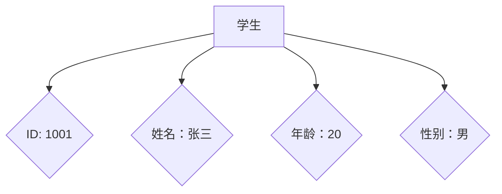

在这个示例中，实体“学生”有四个属性：ID、姓名、年龄和性别。

#### 3.2 关系表示

在知识图谱中，关系（Relation）描述了实体之间的关联。关系表示的主要目标是定义关系类型、方向和属性。

**关系类型（Relation Type）**：关系类型是对实体之间关联的抽象描述，如“学习”、“授课”、“居住”等。关系类型有助于组织和管理知识图谱中的关系。

**关系方向（Relation Direction）**：关系方向描述了关系的源实体和目标实体之间的方向。关系可以是单向的，也可以是双向的。例如，“授课”关系可以是单向的，即“教师授课给学生”，也可以是双向的，即“教师教学生”。

**关系属性（Relation Attribute）**：关系属性是关系的特征描述，如“授课时间”、“授课地点”等。关系属性有助于提供更多的上下文信息，以便更好地理解关系。

以下是一个简单的实体-关系表示示例：

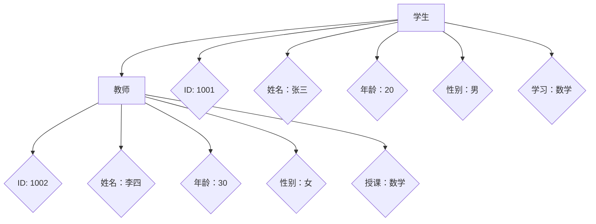

在这个示例中，实体“学生”和“教师”之间存在“学习”和“授课”两种关系。每种关系都有相应的属性，如“学习”关系的属性包括“姓名”、“年龄”和“性别”，而“授课”关系的属性包括“授课时间”和“授课地点”。

#### 3.3 知识图谱的语义表示

知识图谱的语义表示是指如何表示和处理知识图谱中的语义信息。语义表示的关键是理解和处理实体之间的关系和属性。

**基于属性的语义表示**：这种表示方法主要依赖于实体和关系的属性值来表示语义信息。例如，我们可以使用属性“年龄”来表示实体的年龄信息。


**基于关系的语义表示**：这种表示方法主要依赖于关系类型和方向来表示语义信息。例如，我们可以使用关系“学习”来表示实体之间的学习关系。


**基于语义类型的语义表示**：这种表示方法主要依赖于实体和关系的类型来表示语义信息。例如，我们可以使用实体类型“学生”和关系类型“学习”来表示语义信息。

```mermaid
graph TB
A[张三]{类型：学生} --> B[数学]{类型：课程} --> C{关系：学习}
```

以上三种语义表示方法各有优缺点。基于属性的语义表示直观且易于理解，但可能导致冗余和复杂性。基于关系的语义表示能够更好地表示实体之间的关系，但可能需要更多的计算资源。基于语义类型的语义表示则能够更好地组织和管理知识图谱，但可能需要更多的语义知识。

#### 3.4 知识图谱的语义表示实例

以下是一个知识图谱的语义表示实例：

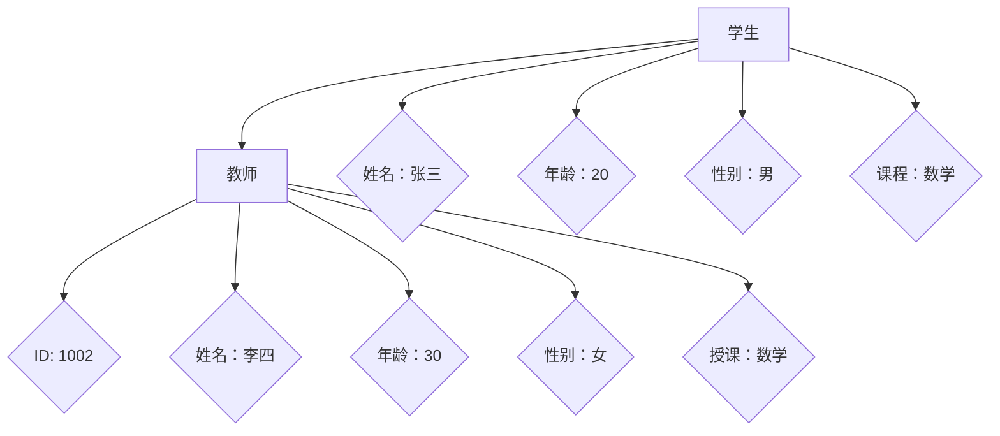

在这个实例中，实体“学生”和“教师”之间存在“学习”和“授课”两种关系。实体“学生”有属性“姓名”、“年龄”和“性别”，实体“教师”有属性“姓名”、“年龄”和“性别”，以及属性“授课”。

### 第4章：知识抽取

#### 4.1 文本挖掘技术

文本挖掘（Text Mining）是知识抽取（Knowledge Extraction）的重要技术之一，它通过自然语言处理（NLP）和信息检索（IR）技术，从大量文本数据中提取有用的信息。文本挖掘的主要任务包括文本预处理、词性标注、命名实体识别、情感分析、主题建模等。

**文本预处理**：文本预处理是文本挖掘的首要步骤，包括去除停用词、标点符号、进行词形还原等。预处理后的文本更易于后续的分析和处理。

**词性标注（Part-of-Speech Tagging）**：词性标注是对文本中的每个词进行词性分类，如名词、动词、形容词等。词性标注有助于理解文本的语义结构。

**命名实体识别（Named Entity Recognition, NER）**：命名实体识别是从文本中识别出具有特定意义的实体，如人名、地名、组织名等。命名实体识别是知识抽取的重要基础。

**情感分析（Sentiment Analysis）**：情感分析是判断文本中的情感倾向，如正面、负面或中性。情感分析在市场调研、舆情监测等领域有广泛应用。

**主题建模（Topic Modeling）**：主题建模是从大量文本数据中提取出潜在的语义主题。常见的主题建模方法包括隐含狄利克雷分配（LDA）等。

以下是一个简单的文本挖掘流程：

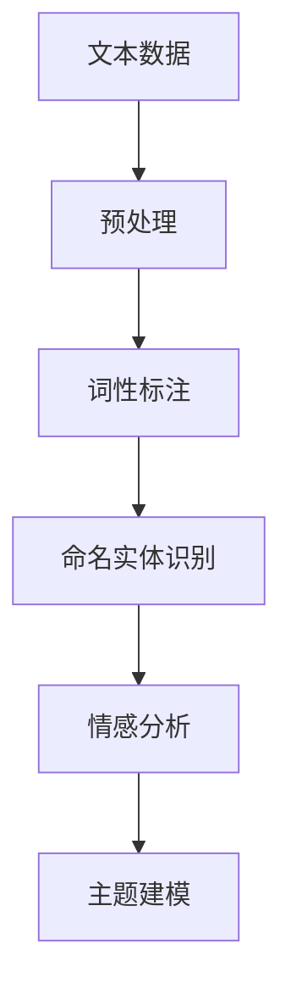

#### 4.2 事件抽取

事件抽取（Event Extraction）是从文本数据中识别出描述事件的信息，并抽取事件的关键成分，如事件类型、触发词、参与者、时间和地点等。事件抽取是知识抽取的重要任务之一，广泛应用于信息提取、智能问答、自然语言处理等领域。

**事件类型（Event Type）**：事件类型是对事件进行分类的标签，如“出生”、“结婚”、“购买”等。

**触发词（Trigger Word）**：触发词是描述事件的词汇，如“出生了”、“结婚了”、“购买了”等。

**参与者（Participant）**：参与者是事件涉及的角色，如“张三”、“地点”、“产品”等。

**时间（Time）**：时间是事件发生的时刻，可以是具体的日期、时间或时间段。

**地点（Location）**：地点是事件发生的地点，可以是具体的地名或地理位置。

以下是一个事件抽取的示例：

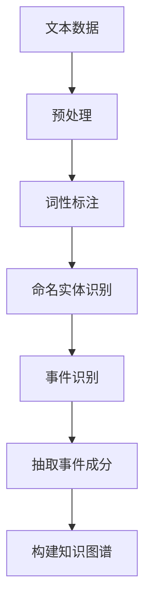

在这个示例中，文本数据经过预处理、词性标注和命名实体识别后，识别出描述事件的信息，并抽取事件的关键成分，最终构建知识图谱。

#### 4.3 命名实体识别

命名实体识别（Named Entity Recognition, NER）是自然语言处理中的一项重要任务，旨在从文本中识别出具有特定意义的实体，如人名、地名、组织名、时间、地点等。NER是知识抽取的重要基础，对于信息提取、智能问答、文本挖掘等领域具有重要意义。

**NER的主要步骤**：

1. **词性标注**：对文本中的每个词进行词性分类，如名词、动词、形容词等。词性标注有助于理解文本的语义结构。

2. **实体分类**：根据词性标注的结果，对文本中的词进行实体分类，如人名、地名、组织名等。实体分类通常使用预训练的模型或规则。

3. **实体链式解析**：将连续的实体词进行链式解析，形成一个完整的实体。例如，将“张三”和“在北京”解析为“张三在北京”。

**NER的挑战**：

1. **多样性**：实体的命名形式多样，如“北京”、“北京市”、“京”等，给实体识别带来挑战。

2. **语境依赖**：实体识别依赖于上下文信息，如“去北京”中的“北京”是地名，而“北京烤鸭”中的“北京”是指烤鸭的产地。

3. **跨语言**：不同语言的命名实体识别方法可能有所不同，如中文和英文。

**NER的应用**：

1. **信息提取**：从文本中提取出关键的实体信息，如人名、地名、组织名等。

2. **智能问答**：识别出用户提问中的实体，并提供准确的答案。

3. **文本挖掘**：分析文本中的实体关系和事件，为数据分析和研究提供支持。

以下是一个简单的命名实体识别流程：

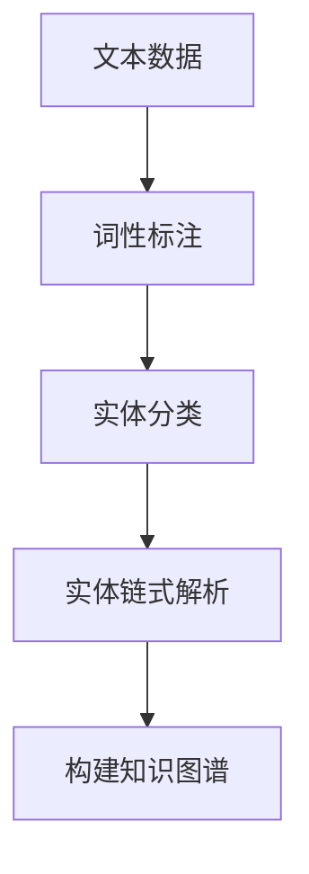

在这个示例中，文本数据经过词性标注、实体分类和实体链式解析后，识别出文本中的关键实体，并构建知识图谱。

### 第5章：知识融合

#### 5.1 知识融合方法

知识融合（Knowledge Fusion）是知识图谱构建过程中的关键步骤，旨在整合来自多个数据源的知识，解决知识冲突，提高知识质量。知识融合的主要方法包括以下几种：

**1. 数据源整合**：

数据源整合是将来自不同数据源的信息进行整合，形成统一的知识库。常见的数据源整合方法包括：

- **数据映射**：将不同数据源中的实体和属性映射到统一的知识库中，如将不同数据源中的“人”实体映射到同一实体。
- **数据转换**：将不同数据源中的数据格式转换为统一格式，如将XML数据转换为JSON格式。
- **数据清洗**：对来自不同数据源的数据进行清洗，去除重复、错误和缺失的数据。

**2. 知识冲突解决**：

知识冲突解决是在知识融合过程中，解决不同数据源之间的知识不一致性问题。常见的方法包括：

- **规则冲突解决**：使用预定义的规则来识别和解决知识冲突，如基于数据源优先级或一致性规则的冲突解决。
- **机器学习冲突解决**：使用机器学习算法来自动识别和解决知识冲突，如基于聚类或分类的方法。
- **专家评审**：邀请领域专家对知识冲突进行评审和解决，以确保知识的一致性和准确性。

**3. 知识质量评估**：

知识质量评估是衡量知识融合结果的质量，包括知识完整性、准确性、一致性和可靠性等方面。常见的方法包括：

- **数据质量指标**：定义一系列数据质量指标，如数据完整性、一致性、准确性等，对知识融合结果进行评估。
- **机器学习评估**：使用机器学习算法评估知识融合结果的质量，如基于模型评分或分类的方法。
- **用户反馈**：收集用户对知识融合结果的反馈，评估知识融合结果的用户满意度。

**4. 知识融合策略**：

知识融合策略是制定知识融合的方法和步骤，以实现知识融合的目标。常见的知识融合策略包括：

- **基于数据源的选择**：根据数据源的质量、可靠性和相关性选择合适的知识融合策略。
- **基于任务的需求**：根据知识融合任务的需求，选择合适的知识融合方法和技术。
- **基于数据类型的融合**：针对不同类型的数据，采用不同的知识融合策略，如结构化数据与半结构化数据、非结构化数据的融合。

#### 5.2 知识冲突解决

在知识图谱构建过程中，知识冲突解决是一个重要且具有挑战性的问题。知识冲突通常发生在以下几种情况：

1. **数据源之间的不一致**：不同数据源可能在实体名称、属性值等方面存在差异，导致知识冲突。
2. **数据更新**：当数据源发生变化时，旧的知识可能与新的知识产生冲突。
3. **数据丢失**：在某些情况下，部分数据可能丢失，导致知识不完整。

**知识冲突解决方法**：

**1. 数据源优先级**：

数据源优先级是一种基于数据源可信度和权威性的冲突解决方法。通常，权威性较高的数据源会覆盖权威性较低的数据源。例如，一个权威的教育数据库可能比一个非权威的论坛数据更可靠。

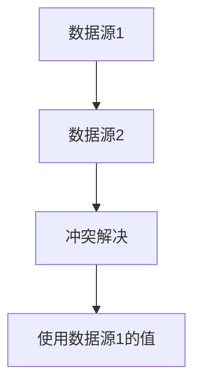

**2. 机器学习冲突解决**：

机器学习冲突解决是一种基于算法自动识别和解决知识冲突的方法。常见的机器学习方法包括聚类、分类和关联规则挖掘等。

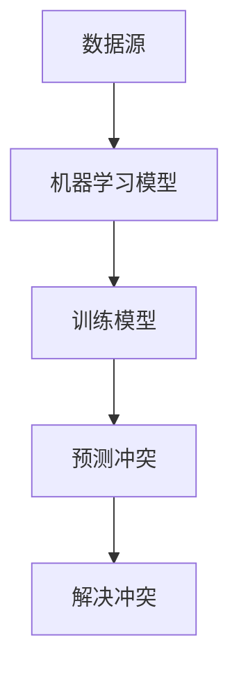

**3. 专家评审**：

专家评审是一种基于领域专家知识和经验的知识冲突解决方法。领域专家可以根据具体情况，对知识冲突进行评审和解决。

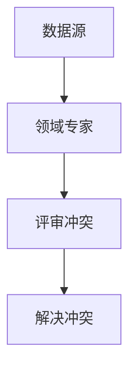

**4. 知识质量评估**：

知识质量评估是一种基于数据质量指标的知识冲突解决方法。通过评估知识融合结果的数据质量，识别和解决知识冲突。

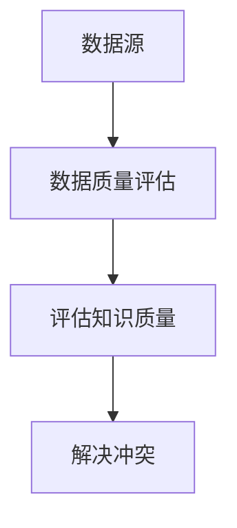

#### 5.3 知识质量评估

知识质量评估是知识图谱构建过程中的重要环节，旨在确保知识融合结果的质量。知识质量包括完整性、准确性、一致性和可靠性等方面。

**知识质量指标**：

1. **完整性（Completeness）**：衡量知识图谱中缺失数据的比例。高完整性意味着知识图谱中大部分数据都是完整和准确的。

2. **准确性（Accuracy）**：衡量知识图谱中数据准确性。高准确性意味着知识图谱中的数据都是真实的、可靠的。

3. **一致性（Consistency）**：衡量知识图谱中不同数据源之间的数据一致性。高一致性意味着知识图谱中的数据都是一致的、无冲突的。

4. **可靠性（Reliability）**：衡量知识图谱的稳定性。高可靠性意味着知识图谱在不同环境下都能稳定运行，不会出现数据错误。

**知识质量评估方法**：

1. **数据质量指标**：定义一系列数据质量指标，对知识质量进行量化评估。

2. **机器学习评估**：使用机器学习算法对知识质量进行评估，如基于模型评分或分类的方法。

3. **用户反馈**：收集用户对知识质量的反馈，评估知识质量。

4. **专家评审**：邀请领域专家对知识质量进行评审，确保知识质量。

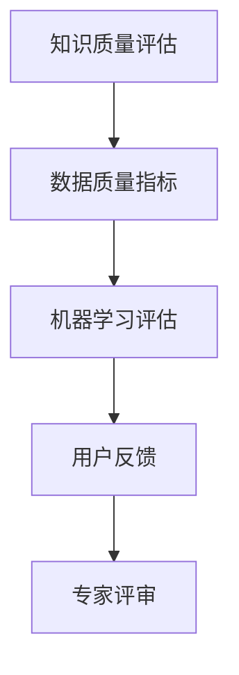

### 第6章：智能问答系统

#### 6.1 问答系统概述

智能问答系统（Intelligent Question Answering System）是一种基于人工智能技术，能够理解用户的问题，并生成准确、清晰的答案的系统。智能问答系统在各个领域都有广泛的应用，如客户服务、在线教育、医疗咨询等。智能问答系统的核心是问答引擎，它负责处理用户问题、检索知识库、生成答案等。

**问答系统的组成部分**：

1. **用户接口（User Interface）**：用户接口是用户与问答系统交互的界面，用于接收用户的问题和展示答案。

2. **问答引擎（Question Answering Engine）**：问答引擎是问答系统的核心，负责处理用户问题、检索知识库、生成答案等。

3. **知识库（Knowledge Base）**：知识库是问答系统的数据源，存储了大量的知识信息，如事实、规则、概念等。

4. **自然语言处理（Natural Language Processing, NLP）**：自然语言处理是问答系统的关键技术，用于处理用户的自然语言输入，并理解其含义。

**问答系统的关键技术**：

1. **问题理解（Question Understanding）**：问题理解是将用户的自然语言问题转化为计算机可处理的形式。常见的技术包括语义角色标注、词向量表示、依存句法分析等。

2. **答案检索（Answer Retrieval）**：答案检索是查找知识库中与用户问题相关的信息。常见的技术包括关键词匹配、文档相似度计算、检索式问答等。

3. **答案生成（Answer Generation）**：答案生成是根据检索到的信息，生成准确、清晰的答案。常见的技术包括模板生成、规则推理、自然语言生成等。

#### 6.2 知识图谱问答技术

知识图谱问答技术是利用知识图谱进行问答的系统，它通过知识图谱中的实体、关系和属性，实现对用户问题的理解和答案的生成。

**知识图谱问答技术的主要流程**：

1. **问题解析（Question Parsing）**：问题解析是将用户的自然语言问题转化为计算机可处理的形式。常见的技术包括实体识别、关系提取、属性提取等。

2. **查询构建（Query Construction）**：查询构建是根据问题解析的结果，构建查询语句，以检索知识库中的相关信息。

3. **答案检索（Answer Retrieval）**：答案检索是根据查询构建的查询语句，从知识库中检索相关的答案。

4. **答案生成（Answer Generation）**：答案生成是根据检索到的答案，生成准确、清晰的答案。

**知识图谱问答技术的优势**：

1. **语义理解**：知识图谱问答技术能够通过知识图谱中的实体、关系和属性，实现对用户问题的深入理解。

2. **知识整合**：知识图谱问答技术可以将来自不同数据源的知识整合在一起，提供统一的答案。

3. **推理能力**：知识图谱问答技术可以利用知识图谱中的关系进行推理，提供更加准确和全面的答案。

4. **个性化推荐**：知识图谱问答技术可以根据用户的提问历史和知识图谱中的信息，为用户推荐相关的答案和资源。

以下是一个简单的知识图谱问答技术流程：

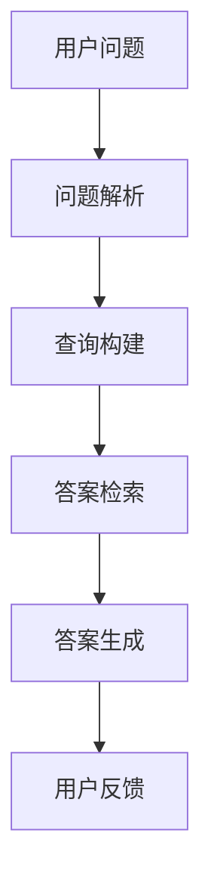

#### 6.3 智能问答系统设计

智能问答系统的设计需要考虑多个方面，包括用户接口、问答引擎、知识库和自然语言处理等。

**用户接口设计**：

用户接口设计需要考虑用户的使用习惯和交互需求，提供简单、易用的界面。常见的用户接口设计包括：

1. **文本输入**：用户可以通过文本输入框输入问题。

2. **语音输入**：用户可以通过语音输入功能，以语音形式提出问题。

3. **图形界面**：用户可以通过图形界面，以点击、拖拽等方式提出问题。

**问答引擎设计**：

问答引擎设计是智能问答系统的核心，需要考虑问题理解、答案检索和答案生成等关键环节。常见的问答引擎设计包括：

1. **基于规则**：问答引擎根据预定义的规则，匹配用户问题和答案。

2. **基于模板**：问答引擎根据预定义的模板，生成用户问题和答案。

3. **基于机器学习**：问答引擎使用机器学习算法，自动学习用户问题和答案的关系。

4. **基于知识图谱**：问答引擎利用知识图谱中的实体、关系和属性，实现对用户问题的理解和答案的生成。

**知识库设计**：

知识库设计是智能问答系统的数据源，需要考虑知识库的构建、维护和更新等。常见的知识库设计包括：

1. **结构化知识库**：知识库以结构化的形式存储知识，如关系型数据库。

2. **非结构化知识库**：知识库以非结构化的形式存储知识，如文本、图片、音频等。

3. **混合知识库**：知识库结合结构化和非结构化知识库的优势，提供更加全面和丰富的知识。

**自然语言处理设计**：

自然语言处理设计是智能问答系统的关键技术，需要考虑文本预处理、词性标注、命名实体识别、语义分析等。常见的自然语言处理设计包括：

1. **文本预处理**：对用户问题和答案进行预处理，如去除停用词、标点符号、进行词形还原等。

2. **词性标注**：对用户问题和答案进行词性标注，如名词、动词、形容词等。

3. **命名实体识别**：对用户问题和答案进行命名实体识别，如人名、地名、组织名等。

4. **语义分析**：对用户问题和答案进行语义分析，如语义角色标注、依存句法分析等。

**智能问答系统的实现**：

智能问答系统的实现需要结合用户接口、问答引擎、知识库和自然语言处理等设计，具体实现步骤包括：

1. **需求分析**：分析用户需求和业务场景，确定智能问答系统的功能和性能要求。

2. **系统设计**：根据需求分析结果，设计用户接口、问答引擎、知识库和自然语言处理等模块。

3. **实现编码**：根据系统设计，进行编码实现，开发用户接口、问答引擎、知识库和自然语言处理等模块。

4. **测试与优化**：对智能问答系统进行测试，优化性能和用户体验。

5. **部署上线**：将智能问答系统部署到生产环境，供用户使用。

#### 6.4 智能问答系统案例

以下是一个智能问答系统的案例：

**案例背景**：

某在线教育平台希望开发一个智能问答系统，帮助用户解决学习过程中遇到的问题。该平台有大量的课程资料、学习资源和用户数据，需要一个智能问答系统来提供准确、清晰的答案。

**案例设计**：

1. **用户接口**：用户可以通过文本输入框输入问题，或者使用语音输入功能提出问题。

2. **问答引擎**：问答引擎使用基于知识图谱的问答技术，通过问题解析、查询构建、答案检索和答案生成等环节，为用户提供答案。

3. **知识库**：知识库包含课程资料、学习资源和用户数据，以结构化和非结构化的形式存储。

4. **自然语言处理**：自然语言处理模块用于文本预处理、词性标注、命名实体识别和语义分析等。

**案例实现**：

1. **需求分析**：分析用户需求，确定智能问答系统的功能和性能要求，如问题理解、答案准确性和响应速度等。

2. **系统设计**：设计用户接口、问答引擎、知识库和自然语言处理等模块，确定各模块的功能和接口。

3. **实现编码**：使用Python等编程语言，实现用户接口、问答引擎、知识库和自然语言处理等模块，并进行联调测试。

4. **测试与优化**：对智能问答系统进行测试，收集用户反馈，优化性能和用户体验。

5. **部署上线**：将智能问答系统部署到生产环境，供用户使用。

**案例效果**：

智能问答系统的上线，得到了用户的好评，提高了用户的学习体验和满意度。系统通过知识图谱的问答技术，为用户提供准确、清晰的答案，解决了用户在学习过程中遇到的问题。同时，系统还可以根据用户的提问历史和学习数据，为用户推荐相关的课程和学习资源。

### 第7章：智能推荐系统

#### 7.1 智能推荐系统概述

智能推荐系统（Intelligent Recommendation System）是一种基于用户行为数据、兴趣偏好和上下文信息，自动向用户推荐相关内容、产品或服务的系统。智能推荐系统在电子商务、社交媒体、在线教育、媒体平台等领域有广泛应用。智能推荐系统通过个性化推荐，提高用户的满意度和参与度，为企业创造更多价值。

**智能推荐系统的组成**：

1. **用户画像**：基于用户的历史行为、兴趣偏好和社交关系等信息，构建用户的画像，为个性化推荐提供基础。

2. **推荐算法**：根据用户画像、内容特征和上下文信息，使用推荐算法计算推荐分数，生成推荐结果。

3. **推荐结果**：根据推荐算法生成的推荐分数，将内容、产品或服务排序，向用户展示推荐结果。

4. **反馈机制**：收集用户对推荐结果的反馈，调整推荐策略，提高推荐质量。

**智能推荐系统的类型**：

1. **基于内容的推荐**：根据用户的历史行为和兴趣偏好，推荐与用户兴趣相似的内容。

2. **协同过滤推荐**：根据用户之间的相似性，推荐其他用户喜欢的相同内容。

3. **混合推荐**：结合基于内容和协同过滤推荐的优势，提高推荐效果。

#### 7.2 基于知识图谱的推荐算法

知识图谱在智能推荐系统中发挥着重要作用，可以用于构建用户画像、内容特征和上下文信息，提高推荐效果。基于知识图谱的推荐算法主要包括以下几种：

1. **基于知识图谱的协同过滤推荐**：

   基于知识图谱的协同过滤推荐结合了知识图谱和协同过滤算法的优势。协同过滤算法通过用户之间的相似度进行推荐，而知识图谱提供了更多的上下文信息，如用户兴趣、内容类别等。基于知识图谱的协同过滤推荐算法如下：

   ```python
   # 基于知识图谱的协同过滤推荐算法
   def recommend_基于知识图谱协同过滤(user, knowledge_graph):
       # 计算用户与知识图谱中其他用户的相似度
      相似度矩阵 = compute_similarity(user, knowledge_graph)
       
       # 根据相似度矩阵计算推荐分数
      推荐分数 = calculate_relevance(user, knowledge_graph, 相似度矩阵)
       
       # 根据推荐分数排序生成推荐列表
      推荐列表 = generate_recommendations(推荐分数)
       
       return 推荐列表
   ```

2. **基于知识图谱的内容推荐**：

   基于知识图谱的内容推荐根据用户兴趣和内容类别，从知识图谱中提取相关内容进行推荐。算法如下：

   ```python
   # 基于知识图谱的内容推荐算法
   def recommend_基于知识图谱内容(user, knowledge_graph):
       # 提取用户兴趣和内容类别
      用户兴趣 = extract_interests(user, knowledge_graph)
      内容类别 = extract_categories(knowledge_graph)
       
       # 根据用户兴趣和内容类别计算推荐分数
      推荐分数 = calculate_relevance(用户兴趣, 内容类别)
       
       # 根据推荐分数排序生成推荐列表
      推荐列表 = generate_recommendations(推荐分数)
       
       return 推荐列表
   ```

3. **基于知识图谱的混合推荐**：

   基于知识图谱的混合推荐结合了基于内容和协同过滤推荐的优势，提高推荐效果。算法如下：

   ```python
   # 基于知识图谱的混合推荐算法
   def recommend_基于知识图谱混合推荐(user, knowledge_graph):
       # 计算基于内容的推荐分数
      内容推荐分数 = recommend_基于知识图谱内容(user, knowledge_graph)
       
       # 计算基于协同过滤的推荐分数
      协同过滤推荐分数 = recommend_基于知识图谱协同过滤(user, knowledge_graph)
       
       # 结合内容推荐分数和协同过滤推荐分数，计算综合推荐分数
      综合推荐分数 = combine_relevance(内容推荐分数, 协同过滤推荐分数)
       
       # 根据综合推荐分数排序生成推荐列表
      推荐列表 = generate_recommendations(综合推荐分数)
       
       return 推荐列表
   ```

#### 7.3 智能推荐系统案例分析

以下是一个智能推荐系统的案例分析：

**案例背景**：

某在线教育平台希望提高用户的学习体验和参与度，开发一个智能推荐系统，为用户推荐相关的课程和学习资源。

**案例设计**：

1. **用户画像**：基于用户的历史学习行为、兴趣偏好和社交关系等信息，构建用户的画像。

2. **知识图谱**：构建一个包含课程、讲师、用户等实体的知识图谱，用于表示课程之间的关系和用户与课程之间的兴趣。

3. **推荐算法**：结合基于知识图谱的协同过滤推荐和内容推荐算法，生成个性化推荐结果。

4. **推荐结果**：根据推荐算法生成的推荐分数，将课程和学习资源排序，向用户展示推荐结果。

5. **反馈机制**：收集用户对推荐结果的反馈，调整推荐策略，提高推荐质量。

**案例实现**：

1. **需求分析**：分析用户需求，确定智能推荐系统的功能和性能要求，如推荐准确性、响应速度等。

2. **系统设计**：设计用户画像、知识图谱、推荐算法和推荐结果等模块，确定各模块的功能和接口。

3. **实现编码**：使用Python等编程语言，实现用户画像、知识图谱、推荐算法和推荐结果等模块，并进行联调测试。

4. **测试与优化**：对智能推荐系统进行测试，收集用户反馈，优化性能和用户体验。

5. **部署上线**：将智能推荐系统部署到生产环境，供用户使用。

**案例效果**：

智能推荐系统的上线，提高了用户的学习体验和参与度。通过知识图谱的协同过滤推荐和内容推荐算法，系统为用户推荐了与其兴趣相关的课程和学习资源。用户对推荐结果的满意度较高，平台的学习活跃度和用户留存率也得到了显著提升。

### 第8章：教育数据分析

#### 8.1 教育数据分析概述

教育数据分析是利用数据科学、机器学习和统计分析等方法，对教育领域的数据进行挖掘、分析和解释，以发现数据中的规律和趋势，为教育管理和决策提供支持。教育数据分析在教育质量提升、教育资源优化、个性化学习等方面具有重要作用。

**教育数据分析的主要任务**：

1. **数据收集**：收集各类教育数据，包括学生成绩、学习行为、教师教学行为、课程资源等。

2. **数据预处理**：对收集到的数据进行清洗、转换和整合，确保数据的质量和一致性。

3. **数据挖掘**：利用数据挖掘技术，从教育数据中发现潜在的规律和趋势，如学生的学习模式、教师的教学效果等。

4. **统计分析**：使用统计分析方法，对教育数据进行定量分析，如描述性统计、推断性统计等。

5. **数据可视化**：将分析结果通过图表、地图等形式进行可视化展示，帮助教育管理者更好地理解和利用数据。

**教育数据分析的挑战**：

1. **数据多样性**：教育数据类型多样，包括结构化数据、半结构化数据和非结构化数据，对数据整合和分析提出了挑战。

2. **数据质量**：教育数据可能存在缺失、错误和冗余等问题，影响数据分析的准确性。

3. **数据隐私**：教育数据涉及学生的个人信息，数据隐私和安全是教育数据分析的重要挑战。

4. **数据复杂性**：教育数据往往具有高度复杂性和关联性，对分析技术和算法提出了高要求。

#### 8.2 知识图谱在教育数据分析中的应用

知识图谱在教育数据分析中具有重要作用，可以有效地整合和表示教育数据，为数据分析提供支持。知识图谱在教育数据分析中的应用主要包括以下几个方面：

1. **数据整合**：知识图谱可以将来自不同数据源的教育数据进行整合，提供统一的视图。例如，可以将学生的成绩数据、学习行为数据、课程资源数据整合在一起，构建一个全面的教育数据知识图谱。

2. **数据关联**：知识图谱可以描述教育数据之间的复杂关联关系，如学生与课程、教师与课程、课程与评价之间的关联。通过知识图谱，可以更好地理解教育数据的内在联系，为数据挖掘和分析提供支持。

3. **知识抽取**：知识图谱可以从教育数据中提取有用的知识信息，如学生的兴趣、学习风格、教师的教学策略等。这些知识信息可以用于个性化学习推荐、教学质量评估等。

4. **数据可视化**：知识图谱可以通过图形化的方式展示教育数据的结构和关联关系，使得教育数据更加直观、易懂。数据可视化有助于教育管理者更好地理解和利用数据，做出更明智的决策。

5. **数据推理**：知识图谱可以基于教育数据中的关系进行推理和关联分析，发现数据中的潜在规律和趋势。例如，通过知识图谱可以分析学生的学习行为，发现哪些因素对学习效果有显著影响，从而优化教学策略。

以下是一个知识图谱在教育数据分析中的应用实例：

**实例背景**：

某在线教育平台希望通过分析学生的成绩和学习行为数据，了解学生的学习效果和需求，优化课程设计和教学策略。

**实例步骤**：

1. **数据收集**：收集学生的成绩数据、学习行为数据、课程资源数据等。

2. **数据预处理**：对收集到的数据进行清洗、转换和整合，构建一个统一的教育数据知识图谱。

3. **知识抽取**：从教育数据中提取学生的兴趣、学习风格、教师的教学策略等信息，构建一个知识图谱。

4. **数据关联**：利用知识图谱描述学生与课程、教师与课程、课程与评价等之间的关联关系。

5. **数据可视化**：通过知识图谱可视化工具，展示教育数据的结构和关联关系。

6. **数据推理**：基于知识图谱进行推理和关联分析，发现数据中的潜在规律和趋势，如学生的学习行为对成绩的影响、教学策略对学习效果的影响等。

7. **数据利用**：根据分析结果，优化课程设计和教学策略，提高学生的学习效果和满意度。

**实例效果**：

通过知识图谱在教育数据分析中的应用，在线教育平台能够更好地了解学生的学习效果和需求，优化课程设计和教学策略，提高学生的学习体验和满意度。

### 第9章：知识图谱在教育游戏中的融合

#### 9.1 教育游戏概述

教育游戏（Educational Game）是一种将游戏元素与学习内容相结合的学习工具，旨在通过互动和游戏化的方式提高学习者的学习兴趣和效果。教育游戏具有以下几个特点：

1. **互动性**：教育游戏通过互动性设计，激发学习者的参与度和积极性，使学习过程更加生动有趣。

2. **趣味性**：教育游戏采用游戏化的设计，融入有趣的故事情节、角色和任务，提高学习者的学习动机。

3. **挑战性**：教育游戏设置适当的难度和挑战，帮助学习者巩固知识、提升技能。

4. **反馈性**：教育游戏通过即时反馈，帮助学习者了解自己的学习进度和成果，强化学习效果。

教育游戏在教育领域中具有广泛的应用，如课堂辅助教学、课外活动、在线学习等。通过教育游戏，学习者可以在轻松愉快的氛围中学习知识、培养技能，提高学习效果。

#### 9.2 知识图谱在教育游戏中的融合

知识图谱在教育游戏中的应用，可以有效地提高教育游戏的智能化和个性化水平，实现知识传授与技能培养的有机结合。知识图谱在教育游戏中的融合主要体现在以下几个方面：

1. **知识表示**：知识图谱将教育游戏中的知识点、技能点和角色等进行结构化表示，形成一个统一的知识体系。通过知识图谱，教育游戏可以清晰地描述知识点之间的关系和层次，为游戏设计和内容规划提供支持。

2. **推理与关联**：知识图谱中的关系和属性可以用于推理和关联分析，为教育游戏提供智能化的任务和挑战。例如，通过知识图谱可以分析学习者的知识结构，为其推荐合适的任务和挑战，提高学习效果。

3. **个性化推荐**：知识图谱可以分析学习者的学习行为和知识结构，为其推荐个性化的学习资源和任务。通过个性化推荐，教育游戏可以更好地满足学习者的需求，提高学习兴趣和效果。

4. **任务设计**：知识图谱可以用于教育游戏任务的设计和规划，确保任务难度适中、内容丰富。通过知识图谱，教育游戏设计者可以更好地理解知识点之间的关系和难度，设计出更具挑战性和趣味性的任务。

5. **数据驱动的反馈**：知识图谱可以整合游戏数据和学习数据，为学习者提供即时、个性化的反馈。通过知识图谱，教育游戏可以分析学习者的学习过程和成果，为其提供有针对性的反馈和建议，促进学习进步。

以下是一个知识图谱在教育游戏中的应用实例：

**实例背景**：

某在线教育平台开发了一款科学教育游戏，旨在通过互动和游戏化的方式，帮助学习者掌握科学知识。游戏设置了多个关卡，每个关卡包含不同的科学知识点和任务。

**实例步骤**：

1. **知识表示**：首先，构建一个科学知识图谱，包括科学概念、知识点、实验方法等实体，以及它们之间的关系。例如，可以表示“地球”与“太阳”、“水”与“冰”等实体之间的关系。

2. **任务设计**：根据知识图谱，设计游戏关卡和任务。每个关卡和任务都与特定的知识点相关联，确保游戏内容与学习目标一致。

3. **个性化推荐**：通过知识图谱分析学习者的学习行为和知识结构，为其推荐合适的关卡和任务。例如，如果一个学习者对“地球自转”知识点掌握较好，系统可以推荐与其相关的“地球公转”任务。

4. **任务完成反馈**：在任务完成后，系统根据知识图谱和学习者的答案，提供即时、个性化的反馈。如果学习者回答正确，系统可以提供鼓励和强化；如果回答错误，系统可以提供解释和指导。

5. **数据分析**：通过知识图谱整合游戏数据和学习数据，分析学习者的学习效果和进步情况。例如，系统可以分析学习者对各知识点的掌握程度，为后续教学提供参考。

**实例效果**：

通过知识图谱在教育游戏中的应用，学习者可以在互动和游戏化的过程中，更好地掌握科学知识。游戏任务的设计和反馈机制与学习目标紧密关联，提高了学习者的学习兴趣和效果。同时，知识图谱的数据分析功能为教育平台提供了丰富的学习数据，有助于优化教学策略和提高教育质量。

### 第10章：知识图谱构建实战

#### 10.1 知识图谱构建流程

知识图谱的构建是一个复杂的过程，涉及数据收集、数据预处理、知识抽取、知识融合和知识表示等多个步骤。以下是一个知识图谱构建的实战流程：

1. **需求分析**：明确知识图谱的构建目标和应用场景，确定需要收集的数据类型、范围和来源。

2. **数据收集**：根据需求分析，收集相关数据，包括结构化数据、半结构化数据和非结构化数据。数据来源可以是公开数据集、企业内部数据、互联网数据等。

3. **数据预处理**：对收集到的数据进行清洗、去重、格式转换等处理，确保数据的质量和一致性。对于非结构化数据，如文本、图像、音频等，需要使用自然语言处理、图像识别等技术进行预处理。

4. **知识抽取**：从预处理后的数据中提取实体、属性和关系，构建初步的知识图谱。知识抽取技术包括命名实体识别、关系抽取、事件抽取等。

5. **知识融合**：整合来自多个数据源的知识，解决知识冲突，提高知识质量。知识融合方法包括基于规则的融合、基于机器学习的融合等。

6. **知识表示**：将知识图谱中的实体、属性和关系进行结构化表示，如使用RDF（Resource Description Framework）、OWL（Web Ontology Language）等语言描述知识图谱。

7. **知识存储**：将构建好的知识图谱存储到图数据库或分布式图计算系统中，如Neo4j、Apache Giraph等。

8. **知识推理与查询**：基于知识图谱进行推理和查询，实现智能化的数据分析和决策。

#### 10.2 知识图谱构建工具介绍

在知识图谱构建过程中，常用的工具包括数据收集工具、数据预处理工具、知识抽取工具、知识融合工具和知识存储工具等。以下是一些常用的知识图谱构建工具：

1. **数据收集工具**：

   - Web scraping工具：如Scrapy、Beautiful Soup等，用于从互联网上爬取数据。
   - API工具：如Python的requests库、Postman等，用于访问API获取数据。
   - 数据库工具：如MySQL、MongoDB等，用于连接数据库获取数据。

2. **数据预处理工具**：

   - 数据清洗工具：如Pandas、NumPy等，用于数据清洗、去重、格式转换等。
   - 文本预处理工具：如NLTK、SpaCy等，用于文本清洗、分词、词性标注等。
   - 图像预处理工具：如OpenCV、ImageAI等，用于图像处理、图像识别等。

3. **知识抽取工具**：

   - 命名实体识别工具：如Stanford NER、jieba等，用于识别文本中的实体。
   - 关系抽取工具：如KGB、RDF2Go等，用于识别文本中的关系。
   - 事件抽取工具：如Event2Mind、DeepEvent等，用于识别文本中的事件。

4. **知识融合工具**：

   - 基于规则的融合工具：如Rule-based Fusion、MapReduce等，用于规则匹配和融合。
   - 基于机器学习的融合工具：如MLFusion、FusionNLP等，用于机器学习模型的融合。

5. **知识存储工具**：

   - 图数据库：如Neo4j、Apache Giraph等，用于存储和查询知识图谱。
   - 分布式图计算系统：如Apache Spark、GraphX等，用于大规模知识图谱的计算和分析。

以下是一个使用Python和Neo4j构建知识图谱的示例代码：

```python
from py2neo import Graph

# 连接Neo4j数据库
graph = Graph("bolt://localhost:7687", auth=("neo4j", "password"))

# 创建实体
graph.run("CREATE (a:Person {name: '张三', age: 25})")

# 创建关系
graph.run("MATCH (a:Person), (b:Person) WHERE a.name = '张三' AND b.name = '李四' CREATE (a)-[:好友]->(b)")

# 查询知识图谱
results = graph.run("MATCH (a:Person)-[:好友]->(b) RETURN a.name, b.name")
for result in results:
    print(result)
```

在这个示例中，我们使用Python的py2neo库连接Neo4j数据库，创建了一个包含实体和关系的知识图谱。通过查询知识图谱，我们可以获取实体之间的关联信息。

#### 10.3 知识图谱构建案例分析

以下是一个知识图谱构建的实战案例：

**案例背景**：

某在线教育平台希望构建一个知识图谱，用于支持个性化学习和智能推荐功能。平台有大量的课程资源、学习行为数据和用户数据，需要通过知识图谱构建来提高教育服务的质量和效率。

**案例步骤**：

1. **需求分析**：分析平台的教育资源和用户需求，确定知识图谱的构建目标和内容。

2. **数据收集**：收集课程资源数据、用户学习行为数据和用户数据，包括课程名称、课程分类、用户学习进度、用户评价等。

3. **数据预处理**：对收集到的数据进行清洗、去重和格式转换等处理，确保数据的质量和一致性。

4. **知识抽取**：使用命名实体识别、关系抽取等技术，从预处理后的数据中提取实体、属性和关系。例如，可以识别出课程、用户、评价等实体，以及课程分类、用户评价等关系。

5. **知识融合**：整合来自多个数据源的知识，解决知识冲突，提高知识质量。例如，对于重复的课程名称，可以采用基于规则的融合方法，选择一个权威的数据源作为最终结果。

6. **知识表示**：使用RDF语言描述知识图谱，包括实体、属性和关系。例如，可以使用RDF语句表示“课程”实体、“分类”属性和“评价”关系。

7. **知识存储**：将构建好的知识图谱存储到Neo4j数据库中，便于查询和分析。

8. **知识推理与查询**：基于知识图谱进行推理和查询，为平台提供个性化学习和智能推荐功能。例如，可以基于用户的学习行为和评价，推荐相关的课程和学习资源。

**案例效果**：

通过知识图谱的构建，在线教育平台实现了个性化学习和智能推荐功能。系统可以根据用户的学习行为和兴趣，推荐相关的课程和学习资源，提高了用户的满意度和学习效果。同时，知识图谱的数据分析和推理能力，为平台提供了丰富的数据洞察和决策支持。

### 第11章：知识图谱应用实战

#### 11.1 智能问答系统开发实战

**项目背景**：

某在线教育平台希望为用户提供一个智能问答系统，帮助用户解决在学习过程中遇到的问题。平台已经构建了一个包含课程资源、用户数据和教师回答的知识图谱，需要基于这个知识图谱开发一个智能问答系统。

**项目需求**：

1. 用户可以通过文本输入框或语音输入功能提出问题。
2. 系统能够理解用户的问题，并从知识图谱中检索相关的答案。
3. 系统能够根据用户的历史提问和答案记录，提供个性化的推荐。
4. 系统能够提供详细的答案解释，帮助用户更好地理解问题。

**技术栈**：

1. **前端**：使用React框架开发用户界面，实现问题的输入和答案的展示。
2. **后端**：使用Node.js和Express框架搭建服务器，处理用户请求和知识图谱查询。
3. **自然语言处理**：使用NLTK、SpaCy等库进行自然语言处理，理解用户的问题。
4. **知识图谱查询**：使用Neo4j图数据库存储和查询知识图谱。
5. **推荐系统**：使用协同过滤算法和知识图谱进行个性化推荐。

**项目实现**：

1. **用户界面**：

   - 创建React组件，实现问题的输入和答案的展示。
   - 使用文本输入框和语音输入插件，实现用户问题的输入。
   - 使用React Router实现页面的跳转和导航。

2. **后端服务器**：

   - 使用Node.js和Express搭建后端服务器，处理用户请求。
   - 使用HTTP API接收用户的问题，并将其传递给自然语言处理模块。
   - 使用RESTful API提供答案查询和推荐功能。

3. **自然语言处理**：

   - 使用NLTK和SpaCy库进行文本预处理，如分词、词性标注等。
   - 使用命名实体识别技术，识别用户问题中的关键词和实体。
   - 使用语义角色标注技术，理解用户问题的意图。

4. **知识图谱查询**：

   - 使用Neo4j图数据库存储知识图谱，包括课程、用户、教师、问题和答案等实体。
   - 编写Cypher查询语句，从知识图谱中检索相关的答案。
   - 使用图数据库的索引功能，提高查询效率。

5. **推荐系统**：

   - 使用协同过滤算法，根据用户的历史提问和答案记录，推荐相关的问题和答案。
   - 结合知识图谱中的关系，为用户推荐相关的课程和资源。
   - 使用推荐算法的模型评分，为推荐结果排序。

**项目测试**：

1. **单元测试**：编写单元测试，测试自然语言处理模块和后端服务的功能。
2. **集成测试**：进行集成测试，确保前端和后端之间的数据传输和交互正常。
3. **性能测试**：进行性能测试，评估系统的响应时间和并发处理能力。

**项目小结**：

通过该项目，我们成功开发了一个基于知识图谱的智能问答系统，为在线教育平台提供了智能化的问答服务。系统实现了问题的输入、理解、查询和推荐等功能，提高了用户的满意度和学习效果。同时，项目也展示了知识图谱在智能问答系统中的应用，为类似项目提供了参考和借鉴。

#### 11.2 智能推荐系统开发实战

**项目背景**：

某在线教育平台希望为用户提供一个智能推荐系统，根据用户的学习历史和偏好，推荐相关的课程和学习资源。平台已经构建了一个包含课程、用户和学习行为的知识图谱，需要基于这个知识图谱开发一个智能推荐系统。

**项目需求**：

1. 系统应能够根据用户的学习历史和偏好，推荐相关的课程和学习资源。
2. 系统应能够根据用户的行为数据，动态调整推荐策略。
3. 系统应提供个性化的推荐结果，提高用户的参与度和学习效果。
4. 系统应具有可扩展性和可维护性，以便未来进行功能升级和优化。

**技术栈**：

1. **前端**：使用React框架开发用户界面，实现推荐结果的展示和用户的交互。
2. **后端**：使用Node.js和Express框架搭建服务器，处理用户请求和推荐算法。
3. **自然语言处理**：使用NLTK、SpaCy等库进行自然语言处理，理解用户的行为数据。
4. **知识图谱查询**：使用Neo4j图数据库存储和查询知识图谱。
5. **推荐算法**：使用协同过滤算法和基于知识的推荐算法，生成推荐结果。

**项目实现**：

1. **用户界面**：

   - 创建React组件，实现推荐结果的展示和用户的交互。
   - 使用滚动加载和无限滚动技术，提高用户的浏览体验。
   - 使用图表库（如ECharts）展示推荐结果的相关性分析。

2. **后端服务器**：

   - 使用Node.js和Express搭建后端服务器，处理用户请求。
   - 使用RESTful API提供推荐结果查询和推荐算法接口。
   - 使用WebSocket实现实时推荐，提高系统的响应速度。

3. **自然语言处理**：

   - 使用NLTK和SpaCy库进行用户行为数据的文本预处理，如分词、词性标注等。
   - 使用命名实体识别技术，识别用户行为数据中的关键词和实体。
   - 使用语义角色标注技术，理解用户行为数据的意图。

4. **知识图谱查询**：

   - 使用Neo4j图数据库存储知识图谱，包括课程、用户、学习行为等实体。
   - 编写Cypher查询语句，从知识图谱中检索用户的相关信息。
   - 使用图数据库的索引功能，提高查询效率。

5. **推荐算法**：

   - 使用基于用户的协同过滤算法，根据用户的历史学习行为，推荐相关的课程和学习资源。
   - 结合知识图谱中的关系，使用基于知识的推荐算法，为用户推荐相关的课程和学习资源。
   - 使用推荐算法的模型评分，为推荐结果排序。

**项目测试**：

1. **单元测试**：编写单元测试，测试推荐算法和后端服务的功能。
2. **集成测试**：进行集成测试，确保前端和后端之间的数据传输和交互正常。
3. **性能测试**：进行性能测试，评估系统的响应时间和并发处理能力。

**项目小结**：

通过该项目，我们成功开发了一个基于知识图谱的智能推荐系统，为在线教育平台提供了个性化的推荐服务。系统实现了用户行为数据的分析和处理、推荐结果的生成和展示等功能，提高了用户的参与度和学习效果。同时，项目也展示了知识图谱在智能推荐系统中的应用，为类似项目提供了参考和借鉴。

#### 11.3 知识图谱在教育游戏开发中的应用

**项目背景**：

某教育科技公司希望开发一款基于知识图谱的教育游戏，通过游戏化的方式提高学生的学习兴趣和效果。游戏的目标是帮助学生在轻松愉快的氛围中掌握科学知识，提高科学素养。公司已经构建了一个包含科学概念、知识点、实验方法等实体及其关系的知识图谱。

**项目需求**：

1. 游戏应包含多种互动环节和任务，帮助学生巩固科学知识。
2. 游戏应能够根据学生的知识水平，动态调整游戏难度和内容。
3. 游戏应提供即时反馈和奖励机制，鼓励学生积极参与。
4. 游戏应具有可扩展性，便于未来添加新的内容和功能。

**技术栈**：

1. **前端**：使用Unity3D游戏引擎开发游戏界面，实现游戏场景的渲染和交互。
2. **后端**：使用Node.js和Express框架搭建服务器，处理游戏逻辑和数据存储。
3. **自然语言处理**：使用NLTK、SpaCy等库进行自然语言处理，理解用户的输入和输出。
4. **知识图谱查询**：使用Neo4j图数据库存储和查询知识图谱。
5. **游戏引擎**：使用Unity3D游戏引擎开发游戏逻辑和交互。

**项目实现**：

1. **用户界面**：

   - 创建Unity3D场景，设计游戏界面和交互元素。
   - 使用C#编程语言，编写游戏逻辑和交互代码。
   - 使用Unity3D的物理引擎和图形渲染功能，实现游戏的交互效果。

2. **后端服务器**：

   - 使用Node.js和Express搭建后端服务器，处理游戏逻辑和用户数据。
   - 使用RESTful API提供游戏数据查询和更新接口。
   - 使用WebSocket实现实时通信，提高游戏的交互体验。

3. **自然语言处理**：

   - 使用NLTK和SpaCy库进行用户输入的文本预处理，如分词、词性标注等。
   - 使用命名实体识别技术，识别用户输入中的关键词和实体。
   - 使用语义角色标注技术，理解用户输入的意图。

4. **知识图谱查询**：

   - 使用Neo4j图数据库存储知识图谱，包括科学概念、知识点、实验方法等实体。
   - 编写Cypher查询语句，从知识图谱中检索相关的知识点和任务。
   - 使用图数据库的索引功能，提高查询效率。

5. **游戏逻辑**：

   - 设计游戏任务和关卡，根据学生的知识水平动态调整任务难度。
   - 实现即时反馈和奖励机制，鼓励学生积极参与游戏。
   - 实现数据的存储和更新，记录学生的游戏进度和成绩。

**项目测试**：

1. **单元测试**：编写单元测试，测试游戏逻辑和后端服务的功能。
2. **集成测试**：进行集成测试，确保前端和后端之间的数据传输和交互正常。
3. **性能测试**：进行性能测试，评估游戏的加载时间和响应速度。

**项目小结**：

通过该项目，我们成功开发了一款基于知识图谱的教育游戏，实现了游戏化学习的目标。游戏提供了丰富的互动环节和任务，帮助学生巩固科学知识，提高了学习效果。同时，项目也展示了知识图谱在游戏开发中的应用，为类似项目提供了参考和借鉴。

### 第12章：未来展望与挑战

#### 12.1 知识图谱在智能教育中的未来发展

随着人工智能技术的不断进步，知识图谱在智能教育中的应用前景广阔。未来，知识图谱在智能教育中可能呈现以下发展趋势：

1. **个性化学习**：知识图谱将更好地支持个性化学习，通过分析学生的知识结构和学习需求，提供精准的学习资源和推荐服务。

2. **智能教学**：知识图谱将帮助教师更好地了解学生的学习情况，提供个性化的教学建议和资源，提高教学质量。

3. **教育数据分析**：知识图谱将整合海量的教育数据，为教育数据的分析和研究提供支持，为教育管理和决策提供科学依据。

4. **教育游戏化**：知识图谱将与教育游戏结合，提供更加丰富和互动的学习体验，激发学生的学习兴趣和主动性。

5. **跨学科融合**：知识图谱将促进不同学科之间的融合，为学生提供跨学科的知识体系和学习路径。

6. **智能评估**：知识图谱将结合智能评估技术，为学生提供全面的评估和反馈，帮助教师和家长了解学生的学习情况。

#### 12.2 知识图谱技术面临的挑战

尽管知识图谱在智能教育中具有广泛的应用前景，但知识图谱技术仍面临以下挑战：

1. **数据质量**：知识图谱构建依赖于高质量的数据源，数据质量直接影响知识图谱的准确性和可靠性。

2. **知识表示**：如何有效地表示复杂的教育知识，使其易于理解和利用，是一个亟待解决的问题。

3. **知识冲突解决**：在整合多个数据源时，如何有效地解决知识冲突，提高知识融合的质量，是一个关键问题。

4. **计算性能**：随着知识图谱规模的不断扩大，如何提高知识图谱的查询和处理效率，是一个重要的技术挑战。

5. **隐私保护**：教育数据涉及学生的个人信息，如何保护用户隐私，确保数据安全，是一个重要的伦理和法律问题。

6. **用户交互**：如何设计用户友好的界面和交互方式，提高用户对知识图谱的接受度和使用体验，是一个重要的用户体验问题。

#### 12.3 知识图谱在教育中的应用趋势

未来，知识图谱在教育中的应用趋势可能包括：

1. **教育数据共享**：知识图谱将促进教育数据的共享和开放，为教育科研和决策提供更多的数据支持。

2. **智能教育平台**：知识图谱将集成到智能教育平台中，为用户提供个性化、智能化的教育服务。

3. **跨学科教育**：知识图谱将促进不同学科之间的融合，为学生提供跨学科的知识体系和学习路径。

4. **教育游戏化**：知识图谱将结合教育游戏，提供更加丰富和互动的学习体验，激发学生的学习兴趣和主动性。

5. **智能评估与反馈**：知识图谱将结合智能评估技术，为学生提供全面的评估和反馈，帮助教师和家长了解学生的学习情况。

6. **在线教育优化**：知识图谱将优化在线教育平台，提高学习效果和用户体验。

通过不断克服技术挑战，知识图谱将在智能教育中发挥更大的作用，为教育创新提供强有力的支持。

### 总结

本文全面探讨了知识图谱在智能教育系统中的构建与应用。首先，我们介绍了知识图谱的定义、作用、发展历程和关键要素，为后续内容打下了基础。接着，我们详细阐述了知识图谱在智能教育中的应用，包括智能问答系统、智能推荐系统、教育数据分析和教育游戏等。随后，我们深入分析了知识图谱构建过程中的知识表示、知识抽取和知识融合等技术。最后，我们通过实战案例展示了知识图谱在智能教育系统中的应用，并提出了未来发展的展望与挑战。

通过本文的探讨，我们期望为教育领域的技术创新提供一些有益的启示和参考。知识图谱作为一种强大的数据表示和处理技术，具有广泛的应用前景。在智能教育系统中，知识图谱可以有效地整合和表示教育知识，提高教育的个性化、智能化水平，为教师、学生和教育管理者提供有力的支持。

然而，知识图谱在智能教育中的应用仍面临许多挑战，如数据质量、计算性能、隐私保护和用户交互等。我们需要不断努力，克服这些挑战，推动知识图谱在教育领域的广泛应用。未来，我们期待看到更多基于知识图谱的智能教育系统，为教育的创新发展贡献力量。

在本文的结尾，我们再次感谢读者对本文的关注和支持。希望本文能为您在知识图谱与智能教育领域的研究提供一些有价值的参考和启发。如果您对知识图谱在教育中的应用有任何疑问或建议，欢迎在评论区留言，我们一起探讨和交流。祝您在智能教育的道路上取得丰硕的成果！

