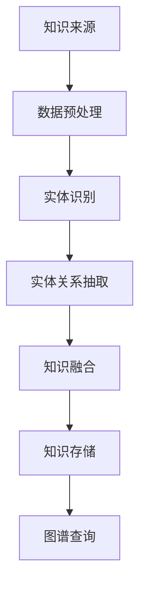
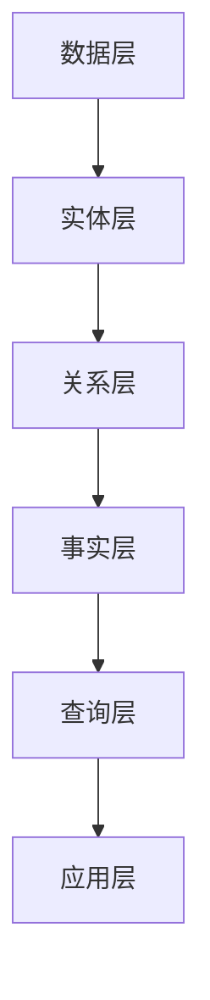

                 

# 知识图谱在智能法律服务、案例推理等领域的应用场景分析

## 关键词
知识图谱，智能法律服务，案例推理，法律知识管理，法律事实发现，智能合同管理，智能判决预测，医疗知识管理，信用评估，教育应用，智能交通。

## 摘要
本文旨在探讨知识图谱在现代信息技术中的应用，特别是其在智能法律服务和案例推理等领域的应用。首先，我们将对知识图谱的基本概念、架构以及构建技术进行详细阐述。接着，本文将分析知识图谱在智能法律服务中的重要性，包括法律知识管理、法律案例推理和智能法律咨询等应用场景。此外，还将探讨知识图谱在其他领域的广泛应用，如医疗、金融和教育等。通过本文的讨论，我们希望读者能够对知识图谱的应用有更深入的理解，并为相关领域的进一步研究提供参考。

## 第一部分: 知识图谱概述

### 第1章: 知识图谱基本概念与架构

#### 1.1 知识图谱的定义与作用

知识图谱（Knowledge Graph）是一种用于表示实体及其相互关系的数据结构，它通过图形的方式来组织数据，使数据之间的关系更加直观和易于理解。知识图谱的核心作用在于通过实体和关系来构建一个知识网络，从而实现数据之间的关联和推理。

知识图谱在多个领域都展现了其强大的应用价值，尤其在智能法律服务和案例推理等领域，它能够极大地提升法律工作的效率和准确性。以下是一个简化的Mermaid流程图，展示了知识图谱的基本构建过程：

#### 1.2 知识图谱的架构

知识图谱的架构可以分为数据层、实体层、关系层、事实层、查询层和应用层。每一层都有其特定的功能和作用，共同构成了一个完整的知识图谱系统。以下是一个Mermaid流程图，展示了知识图谱的层级架构：

在数据层，数据源包括结构化数据、非结构化数据以及半结构化数据。数据预处理主要包括数据清洗、数据整合和数据标准化等步骤，为实体层和关系层的构建奠定基础。

实体层是知识图谱的核心，它将数据源中的数据抽象为实体，为每个实体赋予唯一的标识符（ID）。属性层则描述实体的特征，如姓名、年龄、地址等。

关系层定义实体之间的相互作用和依赖关系，如“是”、“属于”、“属于”等。事实层则记录实体之间的具体关系实例，如“张三属于上海人”。

查询层提供对知识图谱的查询功能，使用户能够根据需求检索和利用知识图谱中的信息。应用层则是知识图谱的实际应用场景，如智能搜索、语义理解和智能推荐等。

#### 1.3 知识图谱的核心概念

知识图谱中的核心概念包括实体（Entity）、属性（Attribute）、关系（Relationship）、事实（Fact）和图谱（Graph）。

- **实体（Entity）**: 知识图谱中的主体，可以是人、地点、事物等。实体具有唯一性和稳定性，是知识图谱中的基本单元。
- **属性（Attribute）**: 实体的特征，用于描述实体的特定信息。例如，一个人的属性包括姓名、年龄、性别等。
- **关系（Relationship）**: 实体之间的相互作用和依赖关系。例如，“是”、“属于”、“与”等都是关系。
- **事实（Fact）**: 实体之间的关系实例。例如，“张三出生在北京”就是一个事实。
- **图谱（Graph）**: 由实体、关系、事实构成的知识结构。知识图谱通过图数据结构来组织这些元素，实现数据之间的关联和推理。

### 第2章: 知识图谱构建技术

#### 2.1 数据预处理

数据预处理是知识图谱构建的关键步骤，它主要包括数据清洗、数据整合和数据标准化等环节。

- **数据清洗**: 数据清洗旨在去除数据中的噪声和冗余信息，确保数据的质量。具体步骤包括去除重复数据、填补缺失值、修正错误数据等。
- **数据整合**: 数据整合是将来自不同来源的数据进行合并，形成一个统一的数据集。数据整合的关键在于数据的一致性和完整性。
- **数据标准化**: 数据标准化是将数据转换为统一格式和标准，便于后续处理。例如，将不同格式的时间转换为标准的时间戳格式。

#### 2.2 实体识别与抽取

实体识别与抽取是知识图谱构建的核心步骤，它主要包括命名实体识别（NER）和实体抽取。

- **命名实体识别（NER）**: 命名实体识别是从文本中识别出具有特定意义的实体。例如，从一段文本中识别出人名、地名、组织名等。
- **实体抽取**: 实体抽取是从文本中提取具体的实体实例。例如，从一段文本中提取出具体的姓名、地址、日期等。

#### 2.3 关系抽取与构建

关系抽取与构建是知识图谱构建的关键步骤，它主要包括规则方法和机器学习方法。

- **规则方法**: 规则方法是基于预定义的规则来抽取关系。这种方法适用于规则明确、关系较为简单的场景。
- **机器学习方法**: 机器学习方法是基于数据驱动的方式来抽取关系。这种方法适用于关系复杂、规则难以明确描述的场景。

### 第3章: 知识图谱表示与存储

#### 3.1 图论基础

图论基础是知识图谱构建的理论基础，它主要包括图的基本概念和图的存储结构。

- **图的基本概念**: 图由节点（Node）和边（Edge）组成。节点表示实体，边表示实体之间的关系。度（Degree）是衡量节点重要性的指标。
- **图的存储结构**: 图的存储结构包括邻接矩阵、邻接表和哈希表等。不同的存储结构具有不同的优点和适用场景。

#### 3.2 图数据库介绍

图数据库是专门用于存储和管理图结构数据的数据库。它具有以下特点：

- **定义**: 图数据库是一种以图结构存储数据的数据库管理系统。
- **类型**: 图数据库可分为基于属性图的数据库和基于图论的数据库。前者以实体和属性为核心，后者以节点和边为核心。

#### 3.3 知识图谱存储与查询

知识图谱的存储与查询是知识图谱应用的核心环节。知识图谱的存储通常采用图数据库，以便高效地管理和查询图结构数据。图数据库提供了一系列查询语言和算法，如SPARQL等，用于对知识图谱进行高效查询和推理。

### 第二部分: 知识图谱在智能法律服务领域的应用

#### 第5章: 知识图谱在智能法律服务中的重要性

知识图谱在智能法律服务中具有重要地位，它能够极大地提升法律工作的效率和质量。知识图谱在法律服务中的应用主要体现在以下几个方面：

- **法律知识管理**: 知识图谱可以帮助法律机构和管理人员高效地管理法律知识，包括法律法规、案例、法条等。
- **法律事实发现**: 知识图谱能够通过分析法律文本和案例，自动发现和提取法律事实，为法律分析和决策提供依据。
- **法律智能咨询**: 知识图谱可以为用户提供智能法律咨询服务，回答用户关于法律问题的查询。

#### 第6章: 知识图谱在法律案例推理中的应用

法律案例推理是法律工作中的一项重要任务，它旨在通过分析过去的案例，为当前案件提供参考和指导。知识图谱在法律案例推理中的应用主要包括以下几个方面：

- **案例检索**: 知识图谱可以高效地检索与当前案件相关的案例，提高案件检索的准确性和效率。
- **案例分析**: 知识图谱可以自动分析案例之间的相似性和差异性，为法律分析和决策提供支持。
- **案例预测**: 知识图谱可以通过分析历史案例，预测当前案件的裁决结果，为法官和律师提供参考。

#### 第7章: 知识图谱在智能法律咨询中的应用

智能法律咨询是近年来兴起的一项法律服务模式，它通过人工智能技术为用户提供法律咨询服务。知识图谱在智能法律咨询中的应用主要包括以下几个方面：

- **法律问答**: 知识图谱可以自动回答用户关于法律问题的查询，提供准确的法律法规和案例参考。
- **合同审查**: 知识图谱可以自动审查合同条款，发现潜在的法律风险，为用户提供法律建议。
- **法律文本分析**: 知识图谱可以自动分析法律文本，提取关键信息和法律事实，为用户提供法律分析报告。

#### 第8章: 知识图谱在法律流程自动化中的应用

法律流程自动化是提高法律工作效率和降低成本的重要手段，知识图谱在法律流程自动化中的应用主要包括以下几个方面：

- **智能合同管理**: 知识图谱可以自动化管理合同，包括合同起草、审批、执行和存档等环节。
- **智能判决预测**: 知识图谱可以通过分析历史判决数据，预测案件的裁决结果，为司法决策提供参考。
- **法律文件生成**: 知识图谱可以自动生成法律文件，如起诉状、答辩状、判决书等，提高法律文件生成的效率和准确性。

### 第三部分: 知识图谱在其他领域的应用

#### 第9章: 知识图谱在医疗领域的应用

知识图谱在医疗领域具有广泛的应用前景，它能够为医疗诊断、治疗和研究提供支持。知识图谱在医疗领域的应用主要包括以下几个方面：

- **医学知识管理**: 知识图谱可以帮助医疗机构高效地管理医学知识，包括疾病、症状、治疗方法等。
- **疾病诊断支持**: 知识图谱可以通过分析患者的病历和医疗数据，提供疾病诊断支持，帮助医生做出准确的诊断。
- **药物研发**: 知识图谱可以整合药物和疾病的信息，为药物研发提供支持，提高药物研发的效率。

#### 第10章: 知识图谱在金融领域的应用

知识图谱在金融领域具有广泛的应用，它能够为金融机构提供数据分析和风险管理支持。知识图谱在金融领域的应用主要包括以下几个方面：

- **金融知识管理**: 知识图谱可以帮助金融机构高效地管理金融知识，包括金融产品、法律法规、市场动态等。
- **信用评估**: 知识图谱可以通过分析借款人的信用数据，提供信用评估支持，帮助金融机构降低信用风险。
- **投资决策**: 知识图谱可以整合投资相关的信息，为投资者提供投资决策支持，提高投资的成功率。

#### 第11章: 知识图谱在教育领域的应用

知识图谱在教育领域具有巨大的应用潜力，它能够为教育机构和学生提供个性化教育服务。知识图谱在教育领域的应用主要包括以下几个方面：

- **知识图谱在教育中的应用**: 知识图谱可以整合课程、教材、试卷等教育资源，为教师和学生提供知识图谱驱动的教育服务。
- **智能推荐**: 知识图谱可以根据学生的兴趣和学习情况，提供个性化的课程推荐和学习资源。
- **教学评估**: 知识图谱可以通过分析学生的学习数据，提供教学评估支持，帮助教师优化教学方法和策略。

#### 第12章: 知识图谱在智能交通领域的应用

知识图谱在智能交通领域具有广泛的应用前景，它能够为交通管理和出行服务提供支持。知识图谱在智能交通领域的应用主要包括以下几个方面：

- **交通知识管理**: 知识图谱可以帮助交通管理部门高效地管理交通知识，包括交通规则、路况信息、车辆数据等。
- **智能交通信号控制**: 知识图谱可以通过分析交通数据，提供智能交通信号控制支持，提高交通流量和效率。
- **出行服务推荐**: 知识图谱可以根据用户的出行需求，提供个性化的出行服务推荐，如最优路线规划、实时路况信息等。

### 总结

知识图谱作为一种高效的数据组织和管理方法，在智能法律服务和案例推理等领域具有广泛的应用。通过本文的讨论，我们了解到知识图谱在法律知识管理、法律案例推理、智能法律咨询和法律流程自动化等方面的重要作用。同时，知识图谱在其他领域的应用也展示了其巨大的潜力。随着人工智能技术的不断发展，知识图谱在各个领域的应用将会更加深入和广泛。

### 作者信息

作者：AI天才研究院/AI Genius Institute & 禅与计算机程序设计艺术 /Zen And The Art of Computer Programming

本文由AI天才研究院撰写，旨在探讨知识图谱在智能法律服务、案例推理等领域的应用。我们致力于通过深入的研究和分享，推动人工智能技术的发展和应用。同时，本文也参考了《禅与计算机程序设计艺术》的相关理论，为读者提供了有益的思考和启示。希望本文能够对您在知识图谱领域的研究和应用有所帮助。如有任何疑问或建议，欢迎联系我们。感谢您的阅读！

