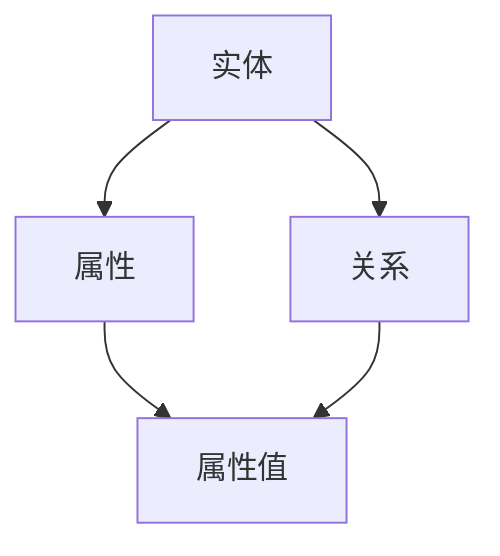
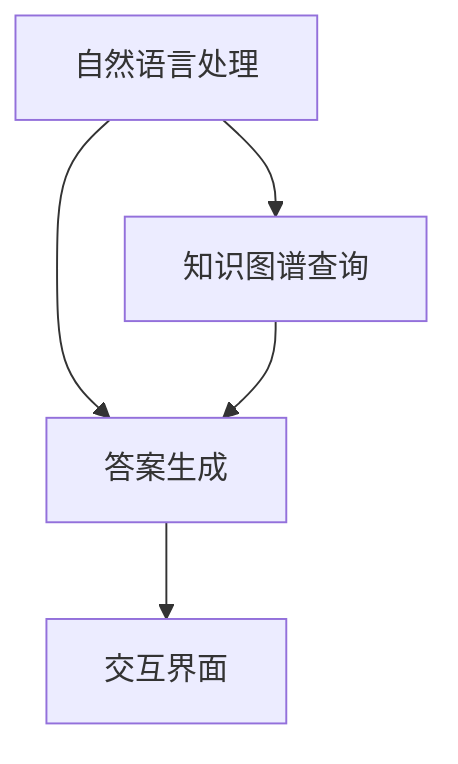

                 

### 文章标题
### 《知识图谱在智能问答系统中的应用研究》

#### 关键词
- 知识图谱
- 智能问答系统
- 实体抽取
- 关系抽取
- 查询与推理算法

#### 摘要
本文旨在探讨知识图谱在智能问答系统中的应用，分析知识图谱的构建、查询与推理方法，以及基于知识图谱的智能问答系统设计与实现。通过对知名案例的分析，讨论当前应用中的挑战与未来发展趋势。

### 第一部分：知识图谱与智能问答系统概述

#### 第1章：知识图谱与智能问答系统简介

##### 1.1 知识图谱的概念与结构
知识图谱是一种语义网络，它通过实体与关系来表示现实世界中的知识，以结构化的方式存储信息，方便计算机理解和处理。知识图谱主要由实体、属性和关系三部分构成，如图1-1所示。

##### 1.2 智能问答系统的概念与发展
智能问答系统是一种通过自然语言处理技术，对用户输入的问题进行理解和回答的人工智能系统。它的发展经历了从基于规则的方法到基于统计模型的方法，再到当前基于深度学习的方法的演变。

##### 1.3 知识图谱在智能问答系统中的应用
知识图谱在智能问答系统中扮演着知识表示和推理引擎的角色，通过实体和关系抽取，构建出结构化的知识库，支持智能问答系统的查询与推理过程。

#### 第2章：知识图谱的构建

##### 2.1 数据源的选择与整合
构建知识图谱的第一步是选择和整合数据源。常见的数据源包括结构化数据（如数据库）、非结构化数据（如文本、图片）和半结构化数据（如XML、JSON）。整合数据源后，需要对其中的实体和关系进行抽取。

##### 2.2 实体抽取与关系抽取
实体抽取是从数据源中识别出具有独立意义的实体，如人名、地点等。关系抽取则是识别实体之间的关系，如“张三出生在天津”。实体和关系抽取是构建知识图谱的核心步骤。

##### 2.3 知识图谱的存储与索引
构建完成的知识图谱需要存储和索引，以便快速查询和推理。常见的技术包括图数据库（如Neo4j）和搜索引擎（如Elasticsearch）。

#### 第3章：知识图谱的查询与推理

##### 3.1 知识图谱查询语言
知识图谱的查询语言包括SPARQL和Gremlin等，它们提供了一种基于图结构的查询方式，可以方便地访问知识图谱中的数据。

##### 3.2 知识图谱推理算法
知识图谱推理算法用于根据知识图谱中的实体和关系，推导出新的结论。常见的推理算法包括路径搜索、规则推理和逻辑推理等。

##### 3.3 知识图谱查询与推理优化
为了提高查询和推理的效率，需要对知识图谱进行优化。常见的方法包括索引构建、图分解和查询缓存等。

### 第二部分：智能问答系统的设计与实现

#### 第4章：智能问答系统的架构与关键技术

##### 4.1 智能问答系统的架构
智能问答系统通常由自然语言处理、知识图谱查询、答案生成和交互界面等模块组成，如图4-1所示。

##### 4.2 常见问答算法与技术
常见的问答算法包括基于规则的方法、基于统计模型的方法和基于深度学习的方法。每种方法都有其优势和适用场景。

##### 4.3 智能问答系统的性能优化
为了提高智能问答系统的性能，可以采用并行处理、分布式计算和模型压缩等技术。

#### 第5章：基于知识图谱的问答系统实现

##### 5.1 知识图谱问答系统的设计与实现
知识图谱问答系统的设计与实现主要包括数据预处理、知识图谱构建、问答模型训练和部署等步骤。

##### 5.2 实体识别与关系推理
实体识别与关系推理是知识图谱问答系统的核心步骤，需要结合自然语言处理技术和知识图谱查询语言。

##### 5.3 问答系统接口与交互设计
问答系统接口与交互设计需要考虑用户体验，包括问答方式、回答格式和反馈机制等。

#### 第6章：案例分析

##### 6.1 某知名企业知识图谱问答系统案例
分析某知名企业知识图谱问答系统的架构、实现方法和性能表现。

##### 6.2 某教育平台知识图谱问答系统案例
分析某教育平台知识图谱问答系统的应用场景、功能和用户反馈。

##### 6.3 某在线客服知识图谱问答系统案例
分析某在线客服知识图谱问答系统的业务逻辑、数据处理和客户满意度。

### 第三部分：知识图谱在智能问答系统中的应用挑战与未来发展

#### 第7章：知识图谱在智能问答系统中的应用挑战

##### 7.1 数据质量与一致性
数据质量与一致性是知识图谱问答系统面临的主要挑战之一，需要采用数据清洗和一致性检测技术。

##### 7.2 智能问答系统的可扩展性
为了适应不断增长的数据和应用需求，智能问答系统需要具备良好的可扩展性。

##### 7.3 智能问答系统的可解释性
用户对智能问答系统的可解释性要求越来越高，需要提供透明的决策过程和解释机制。

#### 第8章：知识图谱在智能问答系统的未来发展

##### 8.1 智能问答系统的智能化趋势
随着人工智能技术的发展，智能问答系统的智能化水平将不断提高。

##### 8.2 知识图谱在多语言问答中的应用
多语言问答是知识图谱在未来应用的一个重要方向，需要解决跨语言实体匹配和关系推理等问题。

##### 8.3 知识图谱与自然语言生成技术的融合
知识图谱与自然语言生成技术的融合将推动智能问答系统的发展，实现更自然的问答交互。

#### 第9章：总结与展望

##### 9.1 全书总结
总结知识图谱在智能问答系统中的应用研究，梳理核心概念和方法。

##### 9.2 知识图谱在智能问答系统的应用前景
展望知识图谱在智能问答系统中的未来发展，探讨潜在的机遇和挑战。

### 附录

#### 附录A：知识图谱与智能问答系统相关工具与资源
介绍知识图谱与智能问答系统相关的工具和资源，包括开发工具、开源资源和数据集。

---

文章内容已经开始撰写，接下来我们将逐步细化每个章节的内容，确保文章的完整性、深度和可读性。以下是每个章节的具体撰写计划：

#### 第1章：知识图谱与智能问答系统简介

- **1.1 知识图谱的概念与结构**
  - **背景介绍**：介绍知识图谱的起源和发展，引出其概念。
  - **核心概念与联系**：使用Mermaid流程图展示知识图谱的基本结构。
  - **实例说明**：通过具体实例阐述知识图谱的结构和组成。

- **1.2 智能问答系统的概念与发展**
  - **背景介绍**：介绍智能问答系统的定义和发展历程。
  - **核心概念与联系**：分析智能问答系统与知识图谱的关系。
  - **实例说明**：分析不同发展阶段智能问答系统的案例。

- **1.3 知识图谱在智能问答系统中的应用**
  - **背景介绍**：介绍知识图谱在智能问答系统中的重要作用。
  - **核心概念与联系**：使用Mermaid流程图展示知识图谱在问答系统中的应用流程。
  - **实例说明**：通过具体实例说明知识图谱在问答系统中的应用场景。

#### 第2章：知识图谱的构建

- **2.1 数据源的选择与整合**
  - **背景介绍**：介绍数据源的种类和选择标准。
  - **核心概念与联系**：使用Mermaid流程图展示数据源整合的过程。
  - **实例说明**：分析常见的数据源整合方法。

- **2.2 实体抽取与关系抽取**
  - **背景介绍**：介绍实体抽取和关系抽取的定义和重要性。
  - **核心概念与联系**：使用Mermaid流程图展示实体和关系抽取的过程。
  - **实例说明**：通过具体数据集分析实体抽取和关系抽取的方法。

- **2.3 知识图谱的存储与索引**
  - **背景介绍**：介绍知识图谱的存储方式和索引技术。
  - **核心概念与联系**：使用Mermaid流程图展示知识图谱存储和索引的过程。
  - **实例说明**：分析常见知识图谱存储和索引技术。

#### 第3章：知识图谱的查询与推理

- **3.1 知识图谱查询语言**
  - **背景介绍**：介绍知识图谱查询语言的概念和用途。
  - **核心概念与联系**：使用Mermaid流程图展示知识图谱查询的过程。
  - **实例说明**：通过具体实例说明知识图谱查询语言的使用。

- **3.2 知识图谱推理算法**
  - **背景介绍**：介绍知识图谱推理算法的定义和分类。
  - **核心概念与联系**：使用Mermaid流程图展示知识图谱推理的过程。
  - **实例说明**：通过具体实例分析不同推理算法的应用。

- **3.3 知识图谱查询与推理优化**
  - **背景介绍**：介绍知识图谱查询与推理优化的目的和方法。
  - **核心概念与联系**：使用Mermaid流程图展示查询与推理优化的过程。
  - **实例说明**：通过具体实例分析查询与推理优化的效果。

#### 第4章：智能问答系统的架构与关键技术

- **4.1 智能问答系统的架构**
  - **背景介绍**：介绍智能问答系统的架构和组成部分。
  - **核心概念与联系**：使用Mermaid流程图展示智能问答系统的架构。
  - **实例说明**：通过具体实例分析智能问答系统的架构。

- **4.2 常见问答算法与技术**
  - **背景介绍**：介绍常见的问答算法和技术。
  - **核心概念与联系**：使用Mermaid流程图展示问答算法和技术的流程。
  - **实例说明**：通过具体实例分析不同问答算法和技术的应用。

- **4.3 智能问答系统的性能优化**
  - **背景介绍**：介绍智能问答系统性能优化的重要性和方法。
  - **核心概念与联系**：使用Mermaid流程图展示性能优化的流程。
  - **实例说明**：通过具体实例分析性能优化的效果。

#### 第5章：基于知识图谱的问答系统实现

- **5.1 知识图谱问答系统的设计与实现**
  - **背景介绍**：介绍知识图谱问答系统的设计和实现过程。
  - **核心概念与联系**：使用Mermaid流程图展示知识图谱问答系统的设计和实现流程。
  - **实例说明**：通过具体实例分析知识图谱问答系统的设计和实现。

- **5.2 实体识别与关系推理**
  - **背景介绍**：介绍实体识别和关系推理的定义和重要性。
  - **核心概念与联系**：使用Mermaid流程图展示实体识别和关系推理的过程。
  - **实例说明**：通过具体实例分析实体识别和关系推理的方法。

- **5.3 问答系统接口与交互设计**
  - **背景介绍**：介绍问答系统接口和交互设计的目的和方法。
  - **核心概念与联系**：使用Mermaid流程图展示问答系统接口和交互设计的流程。
  - **实例说明**：通过具体实例分析问答系统接口和交互设计。

#### 第6章：案例分析

- **6.1 某知名企业知识图谱问答系统案例**
  - **背景介绍**：介绍案例的背景和应用场景。
  - **核心概念与联系**：使用Mermaid流程图展示案例的系统架构。
  - **实例说明**：通过具体实例分析案例的实现方法和效果。

- **6.2 某教育平台知识图谱问答系统案例**
  - **背景介绍**：介绍案例的背景和应用场景。
  - **核心概念与联系**：使用Mermaid流程图展示案例的系统架构。
  - **实例说明**：通过具体实例分析案例的实现方法和效果。

- **6.3 某在线客服知识图谱问答系统案例**
  - **背景介绍**：介绍案例的背景和应用场景。
  - **核心概念与联系**：使用Mermaid流程图展示案例的系统架构。
  - **实例说明**：通过具体实例分析案例的实现方法和效果。

#### 第7章：知识图谱在智能问答系统中的应用挑战

- **7.1 数据质量与一致性**
  - **背景介绍**：介绍数据质量和一致性的概念和重要性。
  - **核心概念与联系**：使用Mermaid流程图展示数据质量和一致性的问题。
  - **实例说明**：通过具体实例分析数据质量和一致性的挑战。

- **7.2 智能问答系统的可扩展性**
  - **背景介绍**：介绍可扩展性的概念和重要性。
  - **核心概念与联系**：使用Mermaid流程图展示可扩展性的挑战。
  - **实例说明**：通过具体实例分析智能问答系统的可扩展性挑战。

- **7.3 智能问答系统的可解释性**
  - **背景介绍**：介绍可解释性的概念和重要性。
  - **核心概念与联系**：使用Mermaid流程图展示可解释性的挑战。
  - **实例说明**：通过具体实例分析智能问答系统的可解释性挑战。

#### 第8章：知识图谱在智能问答系统的未来发展

- **8.1 智能问答系统的智能化趋势**
  - **背景介绍**：介绍智能化趋势的概念和发展方向。
  - **核心概念与联系**：使用Mermaid流程图展示智能化趋势的图景。
  - **实例说明**：通过具体实例分析智能化趋势的应用。

- **8.2 知识图谱在多语言问答中的应用**
  - **背景介绍**：介绍多语言问答的应用场景和挑战。
  - **核心概念与联系**：使用Mermaid流程图展示多语言问答的流程。
  - **实例说明**：通过具体实例分析多语言问答的应用。

- **8.3 知识图谱与自然语言生成技术的融合**
  - **背景介绍**：介绍自然语言生成技术的概念和应用。
  - **核心概念与联系**：使用Mermaid流程图展示知识图谱与自然语言生成技术的融合过程。
  - **实例说明**：通过具体实例分析融合技术的应用。

#### 第9章：总结与展望

- **9.1 全书总结**
  - **核心内容梳理**：总结各章节的核心内容。
  - **主题思想阐述**：阐述知识图谱在智能问答系统中的应用意义。
  - **未来展望**：对知识图谱在智能问答系统中的应用前景进行展望。

- **9.2 知识图谱在智能问答系统的应用前景**
  - **发展趋势**：分析知识图谱在智能问答系统中的应用趋势。
  - **潜在挑战**：讨论知识图谱在智能问答系统中可能遇到的挑战。
  - **解决方案**：提出可能的解决方案和优化方向。

通过上述详细撰写计划，我们可以确保文章内容的完整性、深度和逻辑性，同时使用Mermaid流程图和伪代码等工具来增强文章的可读性和专业性。接下来，我们将根据这个计划逐步完成每个章节的撰写工作。

