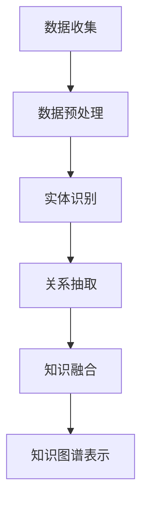
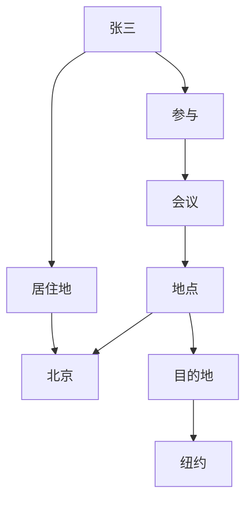
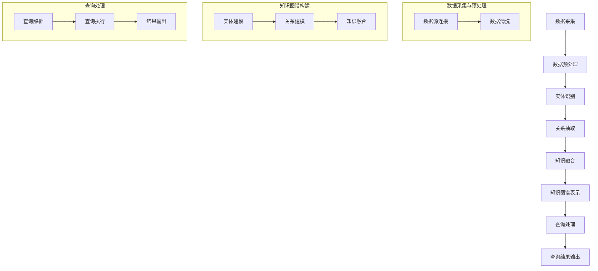

                 

### 文章标题

# 知识图谱：构建人类知识的网络

> 关键词：知识图谱，知识网络，数据建模，语义理解，人工智能，信息检索

> 摘要：本文将深入探讨知识图谱的概念、基础、构建方法以及应用场景，通过逐步分析推理，全面解析知识图谱在信息检索、智能问答和自然语言处理等领域的应用，为读者提供系统化的知识和实际操作指导。

### 《知识图谱：构建人类知识的网络》目录大纲

## 第一部分：知识图谱基础

### 第1章：知识图谱概述  
#### 1.1 知识图谱的概念与重要性  
#### 1.2 知识图谱的历史与发展  
#### 1.3 知识图谱的应用场景

### 第2章：知识图谱的表示与建模  
#### 2.1 知识图谱的基本元素  
#### 2.2 常见的知识图谱表示方法  
#### 2.3 知识图谱的建模原理

### 第3章：知识图谱的构建方法  
#### 3.1 数据采集与清洗  
#### 3.2 数据整合与存储  
#### 3.3 数据质量评估与优化

### 第4章：知识图谱的扩展与更新  
#### 4.1 知识图谱的动态扩展  
#### 4.2 知识图谱的持续更新  
#### 4.3 知识图谱的版本管理

### 第5章：知识图谱的查询与检索  
#### 5.1 知识图谱的查询语言  
#### 5.2 知识图谱的检索算法  
#### 5.3 知识图谱的查询优化

### 第6章：知识图谱的语义理解与推理  
#### 6.1 语义理解的基础知识  
#### 6.2 语义理解的实现方法  
#### 6.3 知识图谱的推理算法

## 第二部分：知识图谱应用案例

### 第7章：知识图谱在信息检索中的应用  
#### 7.1 知识图谱在搜索引擎中的应用  
#### 7.2 知识图谱在推荐系统中的应用  
#### 7.3 知识图谱在问答系统中的应用

### 第8章：知识图谱在智能问答系统中的应用  
#### 8.1 智能问答系统的概述  
#### 8.2 知识图谱在智能问答系统中的角色  
#### 8.3 智能问答系统的实现与优化

### 第9章：知识图谱在知识图谱增强学习中的应用  
#### 9.1 知识图谱增强学习的基本概念  
#### 9.2 知识图谱增强学习的方法与策略  
#### 9.3 知识图谱增强学习的应用案例

### 第10章：知识图谱在自然语言处理中的应用  
#### 10.1 知识图谱在文本分类中的应用  
#### 10.2 知识图谱在关系抽取中的应用  
#### 10.3 知识图谱在文本生成中的应用

## 第三部分：知识图谱技术深度解析

### 第11章：知识图谱的存储与索引技术  
#### 11.1 知识图谱的存储技术  
#### 11.2 知识图谱的索引技术  
#### 11.3 知识图谱的查询优化技术

### 第12章：知识图谱的分布式处理与计算  
#### 12.1 知识图谱的分布式存储  
#### 12.2 知识图谱的分布式计算  
#### 12.3 知识图谱的分布式处理框架

### 第13章：知识图谱的安全与隐私保护  
#### 13.1 知识图谱的安全挑战  
#### 13.2 知识图谱的隐私保护技术  
#### 13.3 知识图谱的安全与隐私保护策略

### 第14章：知识图谱的未来发展趋势  
#### 14.1 知识图谱技术的发展趋势  
#### 14.2 知识图谱在人工智能中的应用前景  
#### 14.3 知识图谱的未来挑战与机遇

## 附录

### 附录A：知识图谱相关工具与资源  
#### A.1 常用的知识图谱工具  
#### A.2 知识图谱开源项目与数据库  
#### A.3 知识图谱相关学术论文与书籍

### 附录B：知识图谱构建与查询的Mermaid流程图  
#### B.1 数据采集与清洗流程图  
#### B.2 数据整合与存储流程图  
#### B.3 知识图谱查询流程图  
#### B.4 知识图谱推理流程图

### 附录C：知识图谱相关伪代码示例  
#### C.1 知识图谱构建伪代码  
#### C.2 知识图谱查询伪代码  
#### C.3 知识图谱推理伪代码

### 附录D：知识图谱应用案例代码解析  
#### D.1 搜索引擎中知识图谱的应用案例  
#### D.2 推荐系统中知识图谱的应用案例  
#### D.3 智能问答系统中知识图谱的应用案例

### 作者信息

> 作者：AI天才研究院/AI Genius Institute & 禅与计算机程序设计艺术 /Zen And The Art of Computer Programming

## 第一部分：知识图谱基础

### 第1章：知识图谱概述

#### 1.1 知识图谱的概念与重要性

知识图谱（Knowledge Graph）是一种通过语义关联来表示现实世界中实体及其关系的结构化数据模型。它旨在构建一个语义丰富、结构化的知识网络，使得计算机能够理解和处理人类知识。知识图谱的基本概念可以概括为“实体”、“属性”和“关系”三大要素。

- **实体（Entity）**：在知识图谱中表示现实世界中的对象，如人、地点、物品等。例如，一个人、一座城市、一本书等都可以被视为实体。
- **属性（Attribute）**：描述实体的特征或状态，例如一个人的年龄、职业、居住地等。属性为实体提供了额外的信息。
- **关系（Relation）**：表示实体之间的关联，例如一个人与他的朋友、城市与国家的归属关系等。关系连接了不同的实体，使得知识图谱具有网络结构。

知识图谱的重要性体现在多个方面：

1. **知识整合**：通过将不同来源、不同格式的数据整合到一个统一的语义空间中，知识图谱能够实现跨领域、跨系统的数据共享和互操作。
2. **语义理解**：知识图谱提供了丰富的语义信息，使得计算机能够更好地理解和处理自然语言，实现智能问答、智能推荐等应用。
3. **优化检索**：知识图谱能够通过语义关联来优化信息检索，提高检索的准确性和效率。
4. **知识推理**：知识图谱支持基于实体和关系的推理，能够发现隐含的知识关系，为决策支持提供支持。

#### 1.2 知识图谱的历史与发展

知识图谱的概念最早由Google在2012年提出，其目的是为了优化搜索引擎的性能，通过构建一个大规模的知识网络来增强对用户查询的理解。自那时以来，知识图谱在学术界和工业界得到了广泛关注和快速发展。

- **早期研究**：知识图谱的概念可以追溯到语义网络（Semantic Network）和本体论（Ontology）的研究。语义网络试图通过表示实体和概念之间的语义关系来增强计算机对自然语言的语义理解。本体论则关注于构建领域知识的概念框架。
- **Google知识图谱**：Google的知识图谱是其搜索引擎的核心技术之一，通过整合Web上的结构化和非结构化数据，构建了一个庞大的语义网络，极大地提升了搜索引擎的查询准确性和用户体验。
- **工业应用**：除了Google之外，许多公司和组织也开始构建和应用知识图谱。例如，Facebook的Open Graph、微软的Bing知识图谱等。知识图谱在智能问答、信息检索、推荐系统、知识管理等领域得到了广泛应用。

#### 1.3 知识图谱的应用场景

知识图谱的应用场景非常广泛，涵盖了多个领域。以下是一些典型的应用场景：

1. **搜索引擎**：知识图谱能够增强搜索引擎的语义理解能力，提供更加精准和个性化的搜索结果。
2. **推荐系统**：知识图谱能够通过实体和关系之间的关联，为用户推荐相关的物品、服务或内容。
3. **智能问答系统**：知识图谱提供了丰富的背景知识，使得智能问答系统能够更好地理解和回答用户的问题。
4. **知识管理**：知识图谱能够整合和组织企业内部的知识资源，支持知识共享和知识创新。
5. **自然语言处理**：知识图谱为自然语言处理任务提供了丰富的语义信息，如实体识别、关系抽取、文本分类等。

知识图谱的应用正在不断拓展，未来将在更多的领域中发挥重要作用。通过构建一个统一的知识网络，知识图谱将为人工智能的发展提供强有力的支持。

## 第2章：知识图谱的表示与建模

#### 2.1 知识图谱的基本元素

知识图谱由三大基本元素构成：实体、属性和关系。这些元素相互关联，共同构成了知识图谱的语义网络。

- **实体（Entity）**：实体是知识图谱中的基本单元，表示现实世界中的个体或概念。例如，人、地点、组织、事件等。实体可以是具体的，如“张三”或“纽约”，也可以是抽象的，如“爱”或“战争”。
- **属性（Attribute）**：属性是实体的特征或属性，用来描述实体的某种特性。例如，一个人的年龄、职业、生日等。属性通常以键值对的形式表示，如“张三的年龄是25岁”。
- **关系（Relation）**：关系是实体之间的关联，表示实体之间的相互作用或依赖。例如，一个人与他的父母、一个城市与它的国家等。关系通常以边的形式在图中表示。

这些基本元素构成了知识图谱的语义基础，它们之间的关系定义了图谱的结构。通过这些元素，知识图谱能够表示复杂的现实世界知识和关系。

#### 2.2 常见的知识图谱表示方法

知识图谱的表示方法多种多样，不同的方法适用于不同的应用场景。以下是几种常见的方法：

1. **图（Graph）**：图是最直观的知识图谱表示方法，由节点（表示实体）和边（表示关系）组成。图结构简单，易于理解和操作，但无法表达复杂的属性信息。

2. **属性图（Attribute Graph）**：属性图在图结构的基础上增加了属性节点，可以表示实体的属性信息。每个属性节点连接到相应的实体节点，通过属性节点可以访问实体的详细信息。

3. **三元组（Triple）**：三元组表示方法将知识图谱中的信息表示为（主体，谓词，客体）的形式。这种方法简洁，易于编程和存储，是知识图谱中最常用的表示方法。

4. **知识库（Knowledge Base）**：知识库是一种结构化的数据存储，通常包含大量的三元组或更复杂的关系表示。知识库可以是一个简单的文本文件，也可以是一个复杂的数据库系统。

不同表示方法各有优缺点，选择合适的表示方法取决于具体的应用需求。

#### 2.3 知识图谱的建模原理

知识图谱的建模涉及多个步骤，包括数据收集、数据预处理、实体识别、关系抽取和知识融合等。以下是知识图谱建模的基本原理：

1. **数据收集**：数据收集是知识图谱建模的第一步，需要从各种数据源获取结构化和非结构化的数据。这些数据源可以是数据库、网页、文本文档、社交媒体等。

2. **数据预处理**：数据预处理包括数据清洗、数据去重、数据格式转换等操作，目的是提高数据的质量和一致性。

3. **实体识别**：实体识别是从原始数据中识别出实体，并将它们映射到知识图谱中的实体节点。这通常通过命名实体识别（NER）技术实现。

4. **关系抽取**：关系抽取是从原始数据中抽取实体之间的关系，并将它们表示为知识图谱中的边。这可以通过规则方法、机器学习方法或组合方法实现。

5. **知识融合**：知识融合是将多个数据源中的知识整合到一个统一的图谱中。这通常涉及实体和关系的映射、冲突消解和一致性维护。

通过这些步骤，知识图谱能够将现实世界中的知识结构化，为后续的查询、推理和应用提供基础。

#### 2.4 知识图谱的表示方法与联系

为了更好地理解知识图谱的表示方法，我们可以使用Mermaid流程图来展示各个步骤之间的关系。以下是一个简化的知识图谱构建流程：



在这个流程中，数据收集是起点，通过数据预处理、实体识别、关系抽取和知识融合，最终形成知识图谱。不同的知识图谱表示方法（如图、三元组、知识库等）可以作为知识融合的输出，用于后续的应用。

#### 2.5 实例分析

为了更直观地展示知识图谱的建模过程，我们可以通过一个简单的实例来进行分析。假设我们要构建一个关于人、地点和事件的简单知识图谱。

- **实体**：人（如张三、李四）、地点（如北京、纽约）、事件（如会议、旅游）。
- **关系**：居住地（如张三居住在北京）、参与（如张三参与了北京会议）、地点（如纽约是旅游目的地）。

通过上述关系，我们可以构建一个简单的知识图谱：



在这个知识图谱中，实体节点表示人、地点和事件，关系节点表示实体之间的关系。通过这个简单的实例，我们可以看到知识图谱如何将现实世界中的信息和关系结构化，为后续的查询和应用提供基础。

通过以上章节的讨论，我们了解了知识图谱的基本概念、表示方法和建模原理。接下来，我们将进一步探讨知识图谱的构建方法，从数据采集、清洗、整合到存储和优化，全面解析知识图谱的构建过程。

### 第3章：知识图谱的构建方法

#### 3.1 数据采集与清洗

知识图谱的构建始于数据采集与清洗。数据采集是指从各种来源获取结构化和非结构化的数据，这些数据可以是来自数据库、网页、文本文档、社交媒体等。数据清洗则是对收集到的数据进行处理，确保数据的质量和一致性。

- **数据来源**：数据来源可以分为内部数据源和外部数据源。内部数据源包括企业内部数据库、CRM系统、ERP系统等；外部数据源包括公共数据库、开放数据集、社交媒体平台等。
- **数据采集技术**：数据采集技术包括Web爬虫、API调用、数据抽取和转换工具等。Web爬虫用于从网页中提取信息；API调用用于获取第三方平台的数据；数据抽取和转换工具用于将不同格式的数据转换为统一格式。
- **数据清洗步骤**：
  1. **去除重复数据**：去除重复的记录，提高数据的唯一性。
  2. **数据格式转换**：将不同格式的数据转换为统一格式，如CSV、JSON等。
  3. **错误校正**：纠正数据中的错误，如拼写错误、数据格式错误等。
  4. **缺失值处理**：处理数据中的缺失值，可以通过填充默认值、插值等方法。

#### 3.2 数据整合与存储

数据整合是将来自不同来源、不同格式的数据整合到一个统一的知识图谱中。数据整合的目的是消除数据孤岛，实现跨系统的数据共享和互操作。

- **数据整合方法**：
  1. **数据映射**：将不同数据源中的实体和关系映射到统一的知识图谱中。例如，将不同数据库中的客户信息映射到一个统一的客户实体。
  2. **实体识别**：使用命名实体识别（NER）技术识别数据中的实体，并将其添加到知识图谱中。
  3. **关系抽取**：从原始数据中抽取实体之间的关系，并将其表示为知识图谱中的边。
  4. **数据融合**：解决数据源之间的冲突和矛盾，实现数据的一致性。

数据整合完成后，需要将知识图谱存储在合适的存储系统中。常见的存储系统包括关系型数据库、图数据库、分布式存储系统等。

- **数据存储技术**：
  1. **关系型数据库**：关系型数据库适用于存储结构化数据，通过表和关系来表示数据。例如，MySQL、PostgreSQL等。
  2. **图数据库**：图数据库适用于存储大规模、复杂的关系数据，通过图结构和算法来处理数据。例如，Neo4j、JanusGraph等。
  3. **分布式存储系统**：分布式存储系统适用于存储海量数据，通过分布式架构来提高系统的性能和可用性。例如，Hadoop、Cassandra等。

#### 3.3 数据质量评估与优化

数据质量是知识图谱构建的关键因素，高质量的数据能够提高知识图谱的准确性和可用性。数据质量评估是对知识图谱中的数据进行检查和分析，以评估数据的质量和一致性。

- **数据质量评估指标**：
  1. **完整性**：数据是否完整，是否有缺失值。
  2. **准确性**：数据是否准确，是否包含错误或矛盾。
  3. **一致性**：数据是否一致，是否在不同数据源之间存在冲突。
  4. **及时性**：数据是否及时更新，是否反映了最新的信息。

- **数据质量优化方法**：
  1. **数据清洗**：通过数据清洗步骤去除重复数据、纠正错误、处理缺失值等。
  2. **数据验证**：对数据进行验证，确保数据的准确性、一致性和完整性。
  3. **数据监控**：建立数据监控机制，定期检查数据质量，发现问题及时处理。
  4. **数据标准化**：制定统一的数据标准和规范，确保不同数据源之间的数据一致性。

通过数据采集、清洗、整合、存储和优化，知识图谱能够构建一个统一、结构化、语义丰富的知识网络。这一过程不仅需要技术手段的支持，还需要严格的流程管理和质量控制，以确保知识图谱的质量和可靠性。

### 第4章：知识图谱的扩展与更新

#### 4.1 知识图谱的动态扩展

知识图谱的动态扩展是指随着时间推移和新数据的加入，不断更新和扩展知识图谱的内容。动态扩展是知识图谱持续发展的重要机制，它能够确保知识图谱的实时性和准确性。

- **数据源扩展**：知识图谱可以通过连接新的数据源来扩展其数据覆盖范围。这些数据源可以是企业内部的数据系统、公共数据库、开放数据集等。通过集成这些数据源，知识图谱可以获取更多、更丰富的信息。
- **实体扩展**：在动态扩展过程中，知识图谱会识别出新的实体，并将其添加到图谱中。例如，当公司引入新的产品或服务时，这些新产品或服务会被作为新的实体加入到知识图谱中。
- **关系扩展**：动态扩展还包括添加新的实体之间的关系。这些关系可能是基于新的数据源中的信息，也可能是基于现有实体之间的语义关联。

- **技术方法**：
  1. **增量更新**：增量更新是指只更新知识图谱中的新增或变化的部分，而不是整个图谱。这种方法可以降低更新成本，提高系统的效率。
  2. **实时更新**：实时更新是指知识图谱能够实时接收和处理新的数据，并将其反映到图谱中。这通常需要高效的实时数据处理技术和算法支持。
  3. **自动化扩展**：通过自动化工具和脚本，实现知识图谱的自动扩展和更新，减少人工干预。

#### 4.2 知识图谱的持续更新

持续更新是确保知识图谱保持最新状态和高质量的重要手段。知识图谱的持续更新涉及多个方面，包括数据更新、实体和关系更新以及版本管理。

- **数据更新**：数据更新是指定期检查和替换知识图谱中的过时或错误数据。数据更新可以通过自动化脚本或手动审核实现。自动化脚本可以定期从数据源中获取新数据，并将其应用到知识图谱中。手动审核则可以由专业人员对知识图谱中的数据进行检查和验证。

- **实体和关系更新**：实体和关系更新是指在知识图谱中添加新的实体和关系，或修改现有实体和关系的属性。实体和关系更新的主要目的是确保知识图谱能够反映最新的现实世界信息和变化。

- **版本管理**：版本管理是知识图谱持续更新的重要环节，它能够记录知识图谱的历史变化，方便后续的回溯和审计。常见的版本管理方法包括：
  1. **版本控制**：通过版本控制系统（如Git）记录知识图谱的每次更新，包括更新的内容、时间、操作者等信息。版本控制系统能够方便地回溯和恢复知识图谱的历史版本。
  2. **配置管理**：使用配置管理系统（如Confluence、GitLab等）管理知识图谱的配置文件和元数据，确保知识图谱的一致性和可维护性。
  3. **审计跟踪**：记录知识图谱的更新日志和操作记录，以便对知识图谱的变更进行审计和追踪。

#### 4.3 知识图谱的版本管理

知识图谱的版本管理是一个复杂的过程，涉及到多个方面，包括版本标识、版本控制和版本回溯等。

- **版本标识**：为知识图谱的每个版本分配唯一的标识，通常使用版本号或时间戳。版本标识能够方便地识别和区分不同的版本。

- **版本控制**：使用版本控制系统（如Git）对知识图谱的更新进行控制。版本控制系统可以记录每次更新的详细信息和变更历史，确保知识图谱的版本可追溯和可管理。

- **版本回溯**：在知识图谱的更新过程中，可能会出现错误或问题。版本回溯是指将知识图谱恢复到某个正确的版本，以解决问题。版本回溯可以通过版本控制系统实现，也可以通过备份和恢复机制实现。

通过动态扩展、持续更新和版本管理，知识图谱能够保持实时性和准确性，为各种应用场景提供高质量的知识服务。

### 第5章：知识图谱的查询与检索

#### 5.1 知识图谱的查询语言

知识图谱的查询语言是用于从知识图谱中获取信息的一套语法和规则。常见的知识图谱查询语言包括SPARQL、R2RML和OWL等。

- **SPARQL（Simple Protocol for Querying RDF）**：SPARQL是用于查询RDF（Resource Description Framework）数据的查询语言。它采用三元组形式的查询结构，支持复杂的查询操作，如过滤、排序、连接等。

  ```sql
  PREFIX foaf: <http://xmlns.com/foaf/0.1/>
  SELECT ?name ?knows
  WHERE {
    ?x foaf:name ?name .
    ?x foaf:knows ?y .
    ?y foaf:name ?knows
  }
  ```

  上述查询示例返回了两个人和他们之间的朋友关系。

- **R2RML（RDF to Relational Model Language）**：R2RML是一种将关系数据库转换为RDF数据的查询语言。它可以将关系数据库中的表和关系映射到RDF三元组，从而实现对关系数据库的RDF查询。

  ```sql
  SELECT "Employee", "salary", "Manager"
  FROM <hr_db>
  WHERE { ?employee <http://example.com/salary> ?salary }
  ```

- **OWL（Web Ontology Language）**：OWL是一种用于定义Web上知识的本体语言。OWL提供了丰富的描述能力，可以定义类、属性、个体以及它们之间的语义关系。

  ```owl
  @prefix owl: <http://www.w3.org/2002/07/owl#> .
  @prefix : <http://example.org/> .
  
  :Person rdf:type owl:Class .
  :Person rdfs:subClassOf owl:Thing .
  :Person owl:hasAttribute :name .
  ```

#### 5.2 知识图谱的检索算法

知识图谱的检索算法用于高效地从大规模知识图谱中查询和检索信息。以下是一些常见的检索算法：

- **贪婪检索算法**：贪婪检索算法是一种基于贪心策略的检索算法。它通过逐步选择最优解来达到全局最优。例如，A*搜索算法是一种常见的贪婪检索算法，它使用启发式函数来评估节点的重要性，优先选择启发式值更高的节点进行扩展。

- **分布式检索算法**：分布式检索算法适用于大规模知识图谱的查询处理。它通过将查询任务分配到多个节点上，并行处理查询请求，从而提高查询性能。常见的分布式检索算法包括MapReduce、Spark等。

- **基于索引的检索算法**：基于索引的检索算法通过建立索引结构来加速查询处理。索引结构可以用于快速定位和访问图谱中的特定节点或关系。常见的索引结构包括B+树、哈希索引、位图索引等。

- **基于机器学习的检索算法**：基于机器学习的检索算法利用机器学习模型来预测查询结果，从而提高检索效率。常见的机器学习模型包括决策树、神经网络、支持向量机等。

#### 5.3 知识图谱的查询优化

知识图谱的查询优化是提高查询性能和响应速度的重要手段。以下是一些常见的查询优化技术：

- **查询重写**：查询重写是指通过修改原始查询语句，将其转换为更高效的查询方式。常见的查询重写技术包括逻辑化简、查询分解、查询重排序等。

- **缓存技术**：缓存技术通过将频繁查询的结果存储在缓存中，以减少数据库的访问次数，从而提高查询性能。常见的缓存技术包括内存缓存、分布式缓存等。

- **并行处理**：并行处理技术通过将查询任务分配到多个处理器上，同时执行查询操作，从而提高查询性能。常见的并行处理技术包括MapReduce、Spark等。

- **索引优化**：索引优化是指通过调整索引结构，提高查询的访问速度。常见的索引优化技术包括索引选择、索引重构、索引压缩等。

通过知识图谱的查询语言、检索算法和查询优化技术，我们可以高效地从大规模知识图谱中查询和检索信息，为各种应用场景提供强大的支持。

### 第6章：知识图谱的语义理解与推理

#### 6.1 语义理解的基础知识

语义理解是知识图谱的核心功能之一，它旨在通过解析自然语言文本，提取其中的语义信息，并将其转化为结构化的知识。以下是语义理解的一些基础知识：

- **语义角色**：语义角色是指句子中各个成分（如主语、谓语、宾语等）在语义上的功能。例如，在句子“张三去北京”中，“张三”是主语，“去”是谓语，“北京”是宾语。
- **实体识别**：实体识别是语义理解的第一步，它旨在从文本中识别出实体，如人名、地名、组织名等。实体识别可以通过命名实体识别（NER）技术实现。
- **关系抽取**：关系抽取是识别文本中实体之间的关系。例如，从文本中提取出“张三”与“北京”之间的居住关系。关系抽取通常结合实体识别技术进行。
- **语义解析**：语义解析是将自然语言文本转化为机器可理解的语义表示。常见的语义表示方法包括语义角色标注、依存句法分析、语义角色标注等。

#### 6.2 语义理解的实现方法

语义理解的实现方法可以分为基于规则的方法、基于统计的方法和基于深度学习的方法。

- **基于规则的方法**：基于规则的方法通过定义一系列规则，将文本中的句子映射到语义表示。这种方法的主要优点是易于理解和实现，但需要大量手工定义的规则，且难以应对复杂的语义关系。

  ```python
  # 示例规则
  if sentence contains "去" and entity1 contains "张三" and entity2 contains "北京":
      relation = "居住地"
  ```

- **基于统计的方法**：基于统计的方法通过统计文本中的模式和规律，进行语义理解。这种方法的主要优点是能够自动学习和适应文本数据，但需要大量标注数据作为训练样本。

  ```python
  # 示例统计模型
  # 从训练数据中学习实体和关系的概率分布
  # 根据输入文本计算实体和关系的概率
  # 选择概率最高的实体和关系作为输出
  ```

- **基于深度学习的方法**：基于深度学习的方法通过神经网络模型，学习文本中的语义信息。这种方法的主要优点是能够处理复杂的语义关系，但需要大量计算资源和训练数据。

  ```python
  # 示例深度学习模型
  # 使用卷积神经网络（CNN）进行文本特征提取
  # 使用循环神经网络（RNN）进行序列建模
  # 输出实体和关系的概率分布
  ```

#### 6.3 知识图谱的推理算法

知识图谱的推理算法用于从知识图谱中推导出新的知识，以支持智能问答、知识推理等应用。以下是几种常见的推理算法：

- **基于规则的推理**：基于规则的推理通过定义一系列规则，将输入的知识转化为新的知识。这种方法的主要优点是简单易懂，但需要大量手工定义的规则。

  ```python
  # 示例规则
  if entity1 has attribute "age" and entity1 > 18:
      entity1 is an adult
  ```

- **基于模型的方法**：基于模型的方法通过训练神经网络模型，自动学习知识图谱中的推理关系。这种方法的主要优点是能够处理复杂的推理任务，但需要大量计算资源和训练数据。

  ```python
  # 示例模型
  # 使用图神经网络（GNN）进行知识图谱建模
  # 使用训练数据学习推理关系
  # 输出推理结果
  ```

- **基于证据的理论**：基于证据的理论通过计算实体和关系之间的可信度，进行推理。这种方法的主要优点是能够处理不确定性知识，但需要复杂的证据计算。

  ```python
  # 示例计算
  # 计算实体1和关系R的可信度
  # 计算实体2和关系R的可信度
  # 根据可信度计算实体1和实体2之间的推理关系
  ```

通过语义理解与推理算法，知识图谱能够解析自然语言文本，提取语义信息，并进行推理，为各种智能应用提供支持。

## 第二部分：知识图谱应用案例

### 第7章：知识图谱在信息检索中的应用

#### 7.1 知识图谱在搜索引擎中的应用

知识图谱在搜索引擎中的应用是其最典型的应用场景之一。通过知识图谱，搜索引擎能够提供更加精准和个性化的搜索结果，显著提升用户体验。

- **搜索结果优化**：知识图谱通过将语义信息关联到查询词，可以识别查询意图，从而提供更加准确的搜索结果。例如，当用户搜索“北京”时，搜索引擎不仅返回与“北京”相关的网页，还会返回与“北京”相关的地理位置、历史、文化等信息。
- **实体识别与消歧义**：知识图谱能够帮助搜索引擎识别和区分同名的实体，避免搜索结果歧义。例如，当用户搜索“张三”时，知识图谱可以根据上下文信息，区分出不同张三的实体，从而提供更准确的搜索结果。
- **语义搜索**：知识图谱支持语义搜索，即用户可以使用自然语言表达查询意图，搜索引擎能够理解并处理这种语义信息，从而提供更丰富的搜索结果。例如，用户可以查询“北京最近有什么好玩的景点”，搜索引擎会根据知识图谱中的信息，返回相关的景点推荐。

#### 7.2 知识图谱在推荐系统中的应用

知识图谱在推荐系统中的应用也非常广泛，它能够通过实体和关系之间的关联，提供更加个性化、精准的推荐。

- **基于内容的推荐**：知识图谱能够通过实体和属性信息，为用户提供基于内容的推荐。例如，当用户浏览了一本关于历史的书籍后，推荐系统会基于知识图谱中的信息，推荐其他相关的历史书籍。
- **基于协同过滤的推荐**：知识图谱可以增强协同过滤推荐算法，提供更加精准的推荐。例如，当用户浏览了某个商品时，推荐系统可以通过知识图谱，识别出与该商品相关的其他商品，从而提供更个性化的推荐。
- **基于兴趣的推荐**：知识图谱能够通过分析用户在知识图谱中的行为和兴趣，为用户提供基于兴趣的推荐。例如，当用户在搜索引擎中频繁查询旅游信息时，推荐系统会根据知识图谱中的信息，推荐相关的旅游目的地和景点。

#### 7.3 知识图谱在问答系统中的应用

知识图谱在问答系统中的应用，使得系统能够理解和回答用户的问题，提供更加智能的服务。

- **结构化知识查询**：知识图谱能够将用户的问题转化为结构化的查询，从而快速定位答案。例如，当用户提问“北京的市长是谁”，知识图谱可以直接返回相关的答案。
- **语义理解**：知识图谱支持语义理解，能够识别用户的查询意图，并提供准确的答案。例如，当用户提问“北京有哪些旅游景点”，知识图谱会理解用户的意图，并返回相关的景点列表。
- **多轮对话**：知识图谱支持多轮对话，能够根据用户的问题和回答，逐步理解用户的意图，并提供更加精准的答案。例如，用户可以先提问“北京有哪些旅游景点”，然后提问“故宫开放时间是什么时候”，知识图谱会逐步理解用户的问题，并提供相应的答案。

通过知识图谱在信息检索、推荐系统和问答系统中的应用，我们能够显著提升系统的智能化水平，为用户提供更加精准、个性化的服务。

### 第8章：知识图谱在智能问答系统中的应用

#### 8.1 智能问答系统的概述

智能问答系统是一种能够理解和回答用户问题的计算机系统，它通过自然语言处理、知识图谱和机器学习等技术，实现了对用户查询的智能理解和回答。智能问答系统在各个领域具有广泛的应用，如客服、教育、医疗等。

- **系统架构**：智能问答系统通常包括三个主要模块：自然语言处理（NLP）模块、知识图谱模块和回答生成模块。
  1. **自然语言处理（NLP）模块**：该模块负责解析用户输入的文本，识别出关键信息，如实体、关系和语义等。
  2. **知识图谱模块**：该模块负责存储和管理知识图谱，并提供查询接口，以获取与用户查询相关的知识。
  3. **回答生成模块**：该模块根据用户查询和知识图谱中的信息，生成合适的回答。

- **关键技术**：
  1. **自然语言处理（NLP）**：NLP技术用于理解和处理自然语言文本，包括分词、词性标注、命名实体识别、依存句法分析等。
  2. **知识图谱**：知识图谱用于存储和表示实体、属性和关系，支持快速查询和推理。
  3. **机器学习**：机器学习技术用于训练模型，提高问答系统的准确性和效果，如分类、回归、序列建模等。

#### 8.2 知识图谱在智能问答系统中的角色

知识图谱在智能问答系统中扮演着核心角色，它通过提供语义信息和支持推理，实现了对用户查询的精准理解和回答。

- **语义理解**：知识图谱能够解析用户查询的语义，识别出关键信息，如实体、关系和意图等。通过语义理解，系统能够准确识别用户的查询意图，从而提供更精准的回答。
- **知识查询**：知识图谱提供了丰富的知识资源，智能问答系统可以通过查询知识图谱，获取与用户查询相关的知识。例如，当用户查询“北京有哪些旅游景点”时，知识图谱可以返回相关的景点列表。
- **知识推理**：知识图谱支持推理功能，可以基于实体和关系进行推理，从而发现新的知识。例如，当用户查询“北京的市长是谁”时，知识图谱可以通过推理，找到市长与北京之间的关系，并返回相应的答案。
- **知识融合**：知识图谱可以将不同来源、不同格式的知识进行整合，提供一个统一的知识表示。这有助于提高系统的知识覆盖范围和准确性。

#### 8.3 智能问答系统的实现与优化

智能问答系统的实现和优化涉及多个方面，包括数据准备、模型训练、系统部署等。

- **数据准备**：数据准备是智能问答系统的关键步骤，包括数据采集、数据清洗、数据标注等。数据准备的质量直接影响系统的性能和效果。
  1. **数据采集**：从各种数据源（如网页、数据库、文献等）采集与问答相关的数据。
  2. **数据清洗**：对采集到的数据进行处理，去除噪声和错误，提高数据质量。
  3. **数据标注**：对数据中的关键信息进行标注，如实体、关系、意图等。

- **模型训练**：使用标注好的数据，训练问答系统的模型。常见的模型包括序列到序列模型、注意力机制模型、多轮对话模型等。
  1. **序列到序列模型**：用于处理单轮问答任务，将用户的输入序列映射到答案序列。
  2. **注意力机制模型**：用于捕捉输入序列和答案序列之间的关联，提高问答的准确性。
  3. **多轮对话模型**：用于处理多轮问答任务，通过逐步理解用户的意图，提供更加精准的回答。

- **系统部署**：将训练好的模型部署到服务器，实现实时问答功能。系统部署需要考虑系统的可扩展性、可靠性、性能等方面。

- **优化策略**：
  1. **知识图谱优化**：通过不断更新和扩展知识图谱，提高系统的知识覆盖范围和准确性。
  2. **模型优化**：通过调整模型参数、优化训练算法等，提高问答系统的性能和效果。
  3. **用户交互优化**：通过改进用户交互界面和交互方式，提高用户的满意度。

通过知识图谱的引入，智能问答系统能够实现更精准、更智能的问答，为用户提供更好的服务体验。

### 第9章：知识图谱在知识图谱增强学习中的应用

#### 9.1 知识图谱增强学习的基本概念

知识图谱增强学习是一种结合知识图谱和机器学习的方法，旨在通过利用知识图谱中的结构化知识，提升机器学习模型的效果。知识图谱增强学习的基本概念包括：

- **知识图谱（Knowledge Graph）**：知识图谱是一种用于表示实体及其相互关系的结构化数据模型，通过实体、属性和关系三个基本元素，构建一个语义丰富的知识网络。
- **增强学习（Reinforcement Learning）**：增强学习是一种通过与环境交互，不断优化策略的机器学习方法。它通过奖励机制，使模型能够学会在特定环境中做出最优决策。
- **知识图谱增强学习**：知识图谱增强学习结合知识图谱和增强学习，通过利用知识图谱中的结构化知识，为增强学习模型提供额外的信息，从而提高模型的学习效果。

#### 9.2 知识图谱增强学习的方法与策略

知识图谱增强学习的方法和策略主要包括以下几个方面：

- **知识图谱嵌入（Knowledge Graph Embedding）**：知识图谱嵌入是将知识图谱中的实体和关系映射到低维空间，使得实体和关系在空间中保持原有的语义信息。常见的知识图谱嵌入方法包括节点嵌入（Node Embedding）和关系嵌入（Relation Embedding）。

- **知识引导的强化学习（Knowledge-Guided Reinforcement Learning）**：知识引导的强化学习通过利用知识图谱中的知识，引导增强学习模型的学习过程。具体方法包括：
  1. **知识融合**：将知识图谱中的知识融合到强化学习模型中，例如通过将实体和关系的嵌入向量作为状态特征，提高模型对环境的理解。
  2. **知识约束**：通过知识图谱中的关系和约束，限制模型的行动空间，从而减少不合理的行动。

- **基于知识的策略优化（Knowledge-Based Policy Optimization）**：基于知识的策略优化通过利用知识图谱中的知识，优化增强学习模型的策略。具体方法包括：
  1. **知识辅助的策略梯度**：通过知识图谱中的知识，计算策略梯度的辅助信息，优化策略参数。
  2. **知识引导的策略搜索**：通过知识图谱中的知识，引导策略搜索过程，找到最优策略。

- **知识图谱增强的探索策略（Knowledge-Enhanced Exploration Strategy）**：知识图谱增强的探索策略通过利用知识图谱中的知识，优化增强学习模型在探索阶段的决策。具体方法包括：
  1. **知识辅助的探索概率**：通过知识图谱中的知识，计算探索概率的辅助信息，提高探索的有效性。
  2. **知识引导的探索奖励**：通过知识图谱中的知识，设计探索奖励函数，鼓励模型在未知领域进行探索。

#### 9.3 知识图谱增强学习的应用案例

知识图谱增强学习在多个领域具有广泛的应用，以下是几个典型的应用案例：

- **智能问答系统**：知识图谱增强学习可以用于智能问答系统，通过利用知识图谱中的知识，提高问答系统的语义理解能力和回答准确性。例如，在医疗问答系统中，利用知识图谱中的医学知识，可以提高对医疗问题的理解和回答质量。

- **推荐系统**：知识图谱增强学习可以用于推荐系统，通过利用知识图谱中的实体和关系，提供更加个性化和精准的推荐。例如，在电子商务平台上，利用知识图谱中的用户、商品和品牌关系，可以提供更加个性化的商品推荐。

- **自动驾驶**：知识图谱增强学习可以用于自动驾驶系统，通过利用知识图谱中的交通规则、道路信息等知识，提高自动驾驶系统的决策能力。例如，在自动驾驶车辆遇到复杂交通场景时，利用知识图谱中的道路信息，可以辅助车辆做出更合理的行驶决策。

通过知识图谱增强学习，我们能够利用知识图谱中的结构化知识，提升机器学习模型的效果，为各种智能应用提供更加准确和高效的解决方案。

### 第10章：知识图谱在自然语言处理中的应用

#### 10.1 知识图谱在文本分类中的应用

知识图谱在文本分类中发挥着重要作用，它能够通过提供语义信息和支持复杂关系，提升分类的准确性和鲁棒性。

- **文本分类概述**：文本分类是将文本数据按照主题或类别进行分类的过程，常见的应用包括垃圾邮件过滤、情感分析、新闻分类等。传统的文本分类方法主要依赖于词袋模型、TF-IDF等特征表示方法，而知识图谱的引入，使得文本分类更加精确和智能化。
- **知识图谱在文本分类中的应用**：
  1. **实体关系增强**：通过知识图谱中的实体和关系，可以增强文本特征。例如，在新闻分类中，通过实体（人、地点、组织）和关系（发生地点、涉及人物）来增强新闻文本的特征，从而提高分类精度。
  2. **语义关联建模**：知识图谱提供了丰富的语义关联信息，可以用于建模文本中的隐含关系。例如，通过知识图谱中的实体和关系，可以识别出文本中的共现词和上下文关系，从而提高分类模型对文本语义的理解。
  3. **类别层次化建模**：知识图谱中的类别层次结构可以用于构建文本分类的层次化模型。例如，在商品分类中，可以利用知识图谱中的类别层次关系，实现更精细的分类。

#### 10.2 知识图谱在关系抽取中的应用

关系抽取是从文本中提取出实体之间的关系，是自然语言处理中的关键任务之一。知识图谱在关系抽取中的应用，能够通过提供语义信息和支持复杂关系，提升关系抽取的准确率。

- **关系抽取概述**：关系抽取旨在从文本中识别出实体之间的关系，如人名与职业的关系、地点与事件的关系等。关系抽取是构建知识图谱的重要步骤，对于信息检索、问答系统等应用至关重要。
- **知识图谱在关系抽取中的应用**：
  1. **实体识别与分类**：知识图谱可以帮助识别文本中的实体，并将它们分类到预定义的类别中。例如，通过知识图谱中的实体识别模块，可以将文本中的名称识别为人名、地名等，从而为关系抽取提供基础。
  2. **关系模式匹配**：知识图谱中的关系模式可以用于匹配文本中的实体关系。例如，通过知识图谱中的关系模式（如“工作于”、“位于”），可以匹配文本中的实体关系，从而提取出相应的关系。
  3. **语义角色标注**：知识图谱中的语义角色标注可以帮助识别文本中的语义角色，如主语、谓语、宾语等。通过语义角色标注，可以更准确地识别实体之间的关系。

#### 10.3 知识图谱在文本生成中的应用

知识图谱在文本生成中的应用，能够通过提供语义信息和支持复杂关系，生成更加自然、连贯的文本。

- **文本生成概述**：文本生成是将结构化数据转化为自然语言文本的过程，常见的应用包括机器翻译、摘要生成、文本创作等。传统的文本生成方法主要依赖于统计模型和神经网络，而知识图谱的引入，使得文本生成更加语义化和智能化。
- **知识图谱在文本生成中的应用**：
  1. **语义模板填充**：知识图谱可以提供语义模板，用于填充文本生成中的空白部分。例如，在新闻摘要生成中，可以通过知识图谱中的实体和关系，填充新闻文本中的关键信息，生成摘要文本。
  2. **关系驱动的文本生成**：知识图谱中的关系可以驱动文本生成，生成具有逻辑关系的文本。例如，在问答系统中，通过知识图谱中的关系，可以生成回答问题的连贯文本。
  3. **知识图谱嵌入**：知识图谱嵌入可以将知识图谱中的实体和关系映射到低维空间，用于文本生成中的特征表示。例如，通过知识图谱嵌入，可以生成与实体和关系相关的文本，提高文本生成的自然性和准确性。

通过知识图谱在文本分类、关系抽取和文本生成中的应用，我们能够显著提升自然语言处理的准确性和智能化水平，为各种文本处理任务提供强大的支持。

### 第11章：知识图谱的存储与索引技术

#### 11.1 知识图谱的存储技术

知识图谱的存储技术是实现高效数据管理和查询的关键。由于知识图谱数据规模庞大且结构复杂，选择合适的存储技术对于保障系统的性能至关重要。

- **关系型数据库**：关系型数据库（如MySQL、PostgreSQL）是传统的数据存储解决方案，适用于存储结构化数据。通过表和关系模型，关系型数据库能够有效组织和管理数据。然而，关系型数据库在处理大规模、复杂的关系数据时，性能可能受到限制。
- **图数据库**：图数据库（如Neo4j、JanusGraph）专门为处理大规模图结构数据而设计。图数据库通过图模型来存储实体和关系，支持高效的数据查询和索引操作。图数据库的优势在于其灵活的图结构表示和快速的数据访问速度，特别适用于知识图谱这种高度关联的数据结构。
- **分布式存储系统**：分布式存储系统（如Hadoop、Cassandra）通过分布式架构，能够存储和处理海量数据。这些系统通常使用键值对或文档模型来存储数据，适用于大规模、高并发的数据存储场景。分布式存储系统在横向扩展性、数据可靠性和容错性方面表现出色，但可能在查询性能上有所妥协。

#### 11.2 知识图谱的索引技术

索引技术是提高知识图谱查询效率的重要手段。有效的索引策略能够快速定位数据，减少查询处理时间。

- **B+树索引**：B+树是一种常用的索引结构，适用于关系型数据库。它通过多级索引结构，能够高效地查询和更新数据。B+树索引在查询效率和写入性能之间取得较好的平衡，适用于读多写少的应用场景。
- **哈希索引**：哈希索引通过哈希函数将键值映射到索引位置，支持快速查询。哈希索引在查询性能上表现优异，但可能在数据更新时引入性能开销，且不适用于需要频繁范围查询的场景。
- **位图索引**：位图索引通过位图来表示数据记录的状态，适用于处理大量布尔查询。位图索引在处理过滤查询时非常高效，但数据存储和更新可能较为复杂。

#### 11.3 知识图谱的查询优化技术

查询优化是提升知识图谱性能的重要技术，通过优化查询计划、索引选择和执行策略，可以显著提高查询效率。

- **查询计划优化**：查询计划优化是指通过分析查询语句，生成最优的查询执行计划。优化策略包括查询重写、查询分解、查询合并等，以减少查询执行的时间和资源消耗。
- **索引选择**：索引选择是指根据查询模式和访问模式，选择合适的索引结构来加速查询处理。合理选择索引能够显著提高查询性能，减少查询时间。
- **并行查询**：并行查询通过将查询任务分解为多个子任务，同时执行并合并结果，提高查询处理速度。适用于大规模数据集和高并发查询场景。
- **缓存策略**：缓存策略是指通过将频繁访问的数据缓存到内存中，减少磁盘I/O操作，提高查询性能。常用的缓存策略包括基于内存的缓存、分布式缓存等。

通过有效的存储、索引和查询优化技术，知识图谱能够实现高效的数据管理，为各种应用场景提供强大的支持。

### 第12章：知识图谱的分布式处理与计算

#### 12.1 知识图谱的分布式存储

分布式存储是知识图谱处理大规模数据的重要技术手段。通过将数据分布到多个节点上，分布式存储系统能够提高数据存储和访问的效率，同时增强系统的容错性和扩展性。

- **分布式存储架构**：分布式存储系统通常采用分片（Sharding）技术，将数据集划分为多个分片，每个分片存储在不同的节点上。这种架构可以有效地分散数据负载，提高查询和写入性能。
- **数据分片策略**：数据分片策略决定了如何将数据分配到各个节点。常见的策略包括基于哈希的分片、基于范围的分片和基于列表的分片。每种策略都有其优缺点，选择合适的分片策略可以优化系统性能。
- **数据一致性**：在分布式存储中，数据一致性是关键问题。常见的分布式一致性模型包括强一致性（如Paxos算法）和最终一致性（如Gossip协议）。强一致性保证数据的一致性，但可能降低系统性能；最终一致性提供更好的性能，但可能引入一定的数据不一致性。
- **数据复制和备份**：为了提高数据的可靠性和可用性，分布式存储系统通常采用数据复制和备份技术。数据复制通过在多个节点上存储数据的副本，确保数据不会因单个节点的故障而丢失。备份则通过将数据复制到远程存储系统，提供额外的数据保护。

#### 12.2 知识图谱的分布式计算

分布式计算是处理知识图谱大规模计算任务的有效方法。通过并行计算和任务分解，分布式计算系统能够提高数据处理速度，支持复杂查询和分析。

- **分布式计算框架**：常见的分布式计算框架包括Hadoop、Spark和Flink等。这些框架提供了高效的任务调度、数据分发和计算资源管理功能，适用于大规模数据处理和计算任务。
- **数据并行处理**：数据并行处理是将数据集划分为多个部分，并在多个节点上并行处理。每个节点负责处理一部分数据，并将结果汇总。这种方法能够显著提高数据处理速度，适用于批处理和实时计算场景。
- **任务分解与调度**：分布式计算系统通过任务分解和调度，将复杂的计算任务分解为多个子任务，并在不同的节点上并行执行。任务分解和调度策略对系统性能有重要影响，优化策略包括负载均衡、任务依赖管理和资源预留等。
- **流处理与批处理**：流处理和批处理是分布式计算中的两种常见模式。流处理适用于实时数据流处理，能够快速响应数据变化；批处理则适用于处理大量静态数据，通过批量处理提高效率。

#### 12.3 知识图谱的分布式处理框架

分布式处理框架是构建高效知识图谱处理系统的基础。以下是一些常见的分布式处理框架：

- **Hadoop**：Hadoop是一个开源的分布式计算框架，基于MapReduce编程模型。它能够处理大规模数据集，支持数据存储和计算任务的高效执行。
- **Spark**：Spark是一个基于内存计算的分布式计算框架，提供了丰富的API和优化功能。Spark能够显著提高数据处理速度，适用于实时计算和复杂分析任务。
- **Flink**：Flink是一个流处理和批处理相结合的分布式计算框架。它支持实时数据流处理和批量数据处理，具有高效的数据处理能力和强大的功能。
- **GraphX**：GraphX是Apache Spark上的一个图处理框架，能够高效处理大规模图数据。它提供了丰富的图处理算法和优化功能，支持图计算和图分析任务。

通过分布式存储和计算技术，知识图谱系统能够处理大规模、复杂的数据，提供高效、可靠的知识服务。

### 第13章：知识图谱的安全与隐私保护

#### 13.1 知识图谱的安全挑战

随着知识图谱在各个领域的广泛应用，其安全性和隐私保护成为了一个重要问题。知识图谱涉及大量的敏感信息和用户数据，必须采取措施确保数据的安全性和隐私性。

- **数据泄露风险**：知识图谱中存储了大量的用户数据和敏感信息，如个人身份信息、行为记录等。如果这些数据泄露，可能导致严重的隐私侵犯和安全问题。
- **数据完整性问题**：知识图谱中的数据可能受到恶意攻击，如数据篡改、数据删除等。这些问题可能导致知识图谱中的信息不准确或失效。
- **数据滥用风险**：知识图谱中的数据可能被滥用，用于进行非法活动或恶意攻击。例如，通过分析用户行为数据，进行欺诈或钓鱼攻击。
- **访问控制问题**：知识图谱通常需要支持多用户访问，如何确保不同用户只能访问其权限范围内的数据，是一个重要的安全问题。

#### 13.2 知识图谱的隐私保护技术

为了应对知识图谱的安全挑战，需要采用一系列隐私保护技术，确保用户数据的安全和隐私。

- **数据加密**：数据加密是保护知识图谱数据的基本手段。通过对数据进行加密，确保只有授权用户才能解密和访问数据。常用的加密技术包括对称加密和非对称加密。
- **访问控制**：访问控制用于确保只有授权用户能够访问特定的数据。常见的访问控制机制包括基于角色的访问控制（RBAC）和基于属性的访问控制（ABAC）。
- **差分隐私**：差分隐私是一种先进的隐私保护技术，通过在查询结果中引入噪声，确保单个用户的隐私信息不会被泄露。差分隐私技术广泛应用于隐私敏感的查询场景。
- **匿名化处理**：匿名化处理是通过去除或模糊化个人身份信息，保护用户隐私的一种方法。常用的匿名化技术包括数据混淆、数据泛化和数据掩码等。

#### 13.3 知识图谱的安全与隐私保护策略

为了实现知识图谱的安全与隐私保护，需要采用一系列综合性的策略和措施。

- **数据安全策略**：制定严格的数据安全策略，包括数据加密、访问控制和数据备份等。确保知识图谱中的数据在存储和传输过程中得到充分的保护。
- **用户隐私保护**：通过差分隐私和匿名化处理等技术，保护用户隐私。在数据分析和查询过程中，采用隐私保护算法，确保用户隐私不被泄露。
- **安全审计和监控**：建立安全审计和监控机制，定期检查知识图谱的安全性，及时发现和处理潜在的安全威胁。
- **权限管理和访问控制**：实施严格的权限管理和访问控制措施，确保用户只能访问其权限范围内的数据。通过审计和日志记录，监控用户的行为和操作，防止数据滥用。
- **合规性和法律法规**：遵循相关的法律法规和行业标准，确保知识图谱的处理和应用符合合规要求。定期进行安全评估和合规性检查，确保系统的安全性和隐私保护措施得到有效实施。

通过综合运用上述策略和措施，知识图谱能够在保障数据安全和用户隐私的前提下，实现高效、可靠的知识服务。

### 第14章：知识图谱的未来发展趋势

#### 14.1 知识图谱技术的发展趋势

知识图谱技术近年来取得了显著的发展，其应用领域不断扩大，技术体系日益完善。以下是知识图谱技术的一些主要发展趋势：

- **大规模知识图谱构建**：随着数据来源的多样性和数据量的快速增长，构建大规模、多领域知识图谱的需求日益强烈。未来的知识图谱将涵盖更广泛的主题和领域，实现跨领域、跨系统的知识整合。
- **实时知识图谱更新**：实时更新是知识图谱的重要需求。通过实时数据采集、处理和更新，知识图谱能够迅速反映现实世界的变化，提供更加及时和准确的知识服务。
- **知识图谱的智能化**：知识图谱的智能化是未来发展的一个重要方向。通过引入机器学习、深度学习等技术，知识图谱能够实现自动推理、智能问答、知识推荐等功能，提供更加智能化的服务。
- **分布式知识图谱**：分布式知识图谱技术将进一步提升知识图谱的性能和可扩展性。通过分布式存储和计算框架，知识图谱能够处理海量数据，支持大规模并发查询。

#### 14.2 知识图谱在人工智能中的应用前景

知识图谱在人工智能中的应用前景广阔，它能够为人工智能系统的决策提供强有力的支持。以下是知识图谱在人工智能中的几个主要应用方向：

- **智能问答系统**：知识图谱能够为智能问答系统提供丰富的背景知识，提升问答系统的准确性和智能化水平。通过语义理解和知识推理，知识图谱能够实现对用户问题的精准理解和回答。
- **自然语言处理**：知识图谱为自然语言处理提供了丰富的语义信息，能够显著提升文本分类、情感分析、命名实体识别等任务的性能。知识图谱可以辅助NLP模型，实现更加精准和智能的文本处理。
- **推荐系统**：知识图谱能够通过实体和关系的关联，为推荐系统提供更加精准的推荐。通过知识图谱，推荐系统可以识别用户的兴趣和偏好，实现个性化推荐。
- **决策支持系统**：知识图谱提供了结构化的知识和关系，可以用于决策支持系统。通过知识图谱，决策支持系统能够自动分析数据、识别模式、预测趋势，为决策者提供有效的决策支持。

#### 14.3 知识图谱的未来挑战与机遇

知识图谱技术的发展也面临一些挑战和机遇：

- **数据质量与一致性**：随着知识图谱的规模和复杂性增加，数据质量与一致性成为关键挑战。如何确保知识图谱中的数据准确、完整、一致，是未来需要解决的重要问题。
- **隐私保护与安全性**：知识图谱涉及大量的敏感信息，隐私保护和安全性是重要的挑战。如何在保证数据可用性的同时，确保用户隐私和数据安全，是一个亟待解决的问题。
- **实时性**：实时更新和快速响应是知识图谱的关键需求。如何提高知识图谱的实时性，实现快速数据采集和处理，是未来需要重点关注的方向。
- **跨领域融合**：知识图谱的发展需要实现跨领域的融合，涵盖更多主题和领域。如何构建一个统一、灵活、可扩展的知识图谱框架，是未来的重要研究方向。

通过不断克服这些挑战，知识图谱技术将在人工智能和大数据等领域发挥更加重要的作用，为未来的发展提供强有力的支持。

### 附录A：知识图谱相关工具与资源

#### A.1 常用的知识图谱工具

在知识图谱的构建和应用过程中，有许多实用的工具和软件可以帮助开发者提高效率和效果。以下是一些常用的知识图谱工具：

- **Neo4j**：Neo4j是一个流行的图数据库，支持高度灵活的图结构表示和查询。它提供了强大的图形界面和丰富的API，适用于大规模知识图谱的存储和查询。

- **OpenKG**：OpenKG是一个开源的知识图谱平台，支持知识图谱的构建、存储、查询和可视化。它提供了简单易用的接口和工具，适合快速开发和实验。

- **Wikidata**：Wikidata是维基媒体基金会维护的一个开放知识图谱，涵盖了广泛的主题和领域。它是一个丰富的知识资源，可以用于各种知识图谱应用。

- **RDF4J**：RDF4J是一个Java框架，用于处理RDF（Resource Description Framework）数据。它支持RDF数据的存储、查询、推理和模型构建，适用于企业级知识图谱应用。

- **Jena**：Jena是一个开源的JVM（Java Virtual Machine）框架，用于处理RDF数据。它提供了全面的RDF库和工具，包括数据存储、推理和查询功能。

#### A.2 知识图谱开源项目与数据库

知识图谱的构建和应用离不开开源项目和数据库的支持。以下是一些知名的开放知识图谱项目和数据库：

- **DBpedia**：DBpedia是一个基于Web的开放知识图谱，它从维基百科中提取结构化数据，提供了丰富的实体、属性和关系。它是一个重要的开放知识资源，广泛应用于各种应用场景。

- **Yago**：Yago是一个大规模的开放知识图谱，它从网络上的大量文本数据中提取结构化信息，构建了一个包含数百万个实体和数亿条关系的知识网络。

- **YELP**：YELP是一个基于用户评价和分类的开放知识图谱，它包含了大量的商家信息、用户评论和分类信息，适用于商业推荐和用户画像构建。

- **Geonames**：Geonames是一个包含地理实体信息的知识图谱，它包含了超过900万个地点的名称、位置和属性信息，是地理信息处理和地理知识图谱构建的重要资源。

- **Linked Data Cloud**：Linked Data Cloud是一个开放的链接数据平台，提供了大量的开放数据集和工具，支持链接数据的发布、查询和应用。

#### A.3 知识图谱相关学术论文与书籍

知识图谱领域的学术论文和书籍是获取专业知识和最新研究进展的重要途径。以下是一些建议的学术论文和书籍：

- **《Knowledge Graph: A Survey》**：该论文对知识图谱的概念、应用、构建方法和技术进行了全面的综述，是了解知识图谱领域的重要文献。

- **《Linked Data: The Official Defition of the W3C**》：这篇论文详细介绍了链接数据的概念、技术和应用，是了解链接数据的基础文献。

- **《SPARQL 1.1 Query Language for RDF**》：SPARQL是知识图谱查询语言的标准，这篇论文详细介绍了SPARQL的语法和查询功能。

- **《Semantic Web: A Comprehesive Primer**》：这本书全面介绍了语义网的概念、技术与应用，涵盖了知识图谱、本体论和RDF等核心内容。

- **《Introduction to Knowledge Graph**》：这本书介绍了知识图谱的基本概念、构建方法和应用，适合初学者了解知识图谱的基础知识。

通过利用这些工具、开源项目和学术资源，开发者可以更好地理解和应用知识图谱技术，为各种应用场景提供强大的支持。

### 附录B：知识图谱构建与查询的Mermaid流程图

为了更好地理解知识图谱的构建与查询过程，我们使用Mermaid流程图来展示各个步骤之间的逻辑关系。以下是知识图谱构建与查询的流程图：



- **数据采集与预处理**：数据采集（A）涉及连接不同的数据源（I），并进行数据清洗（J）以去除噪声和错误。
- **知识图谱构建**：数据预处理后，进行实体识别（C）、关系抽取（D）和知识融合（E），构建知识图谱（F）。
- **查询处理**：通过查询解析（N）、查询执行（O）和结果输出（P），实现对知识图谱的查询。

通过这个流程图，我们可以清晰地看到知识图谱从构建到查询的整个过程，有助于理解和优化知识图谱的应用。

### 附录C：知识图谱相关伪代码示例

在本附录中，我们将提供一些知识图谱构建、查询和推理的伪代码示例，以帮助读者更好地理解和实现知识图谱相关功能。

#### C.1 知识图谱构建伪代码

以下是一个简单的知识图谱构建伪代码示例，展示了如何从数据源中提取实体和关系，并构建知识图谱。

```python
# 数据源
data_source = "example_data.csv"

# 实体集合
entities = []

# 关系集合
relations = []

# 从数据源中读取数据
with open(data_source, 'r') as file:
    for line in file:
        entity, attribute, value = line.strip().split(',')
        entities.append(entity)
        relations.append((entity, attribute, value))

# 构建知识图谱
knowledge_graph = Graph()
for entity in entities:
    knowledge_graph.add_node(entity)
for relation in relations:
    knowledge_graph.add_edge(*relation)
```

此代码首先从CSV文件中读取数据，然后分别将实体和关系添加到知识图谱中。这里使用了Python的Graph库来表示知识图谱。

#### C.2 知识图谱查询伪代码

以下是一个简单的知识图谱查询伪代码示例，展示了如何使用SPARQL查询语言来查询知识图谱。

```python
# SPARQL查询
query = """
PREFIX ex: <http://example.org/>
SELECT ?entity ?attribute ?value
WHERE {
    ?entity ex:attribute ?value .
}
"""

# 执行查询
results = knowledge_graph.query(query)

# 打印查询结果
for result in results:
    print(f"Entity: {result['entity']}, Attribute: {result['attribute']}, Value: {result['value']}")
```

这个示例展示了如何使用SPARQL查询语言来从知识图谱中提取具有特定属性的实体。这里假设知识图谱中有一个前缀为`ex:`的命名空间。

#### C.3 知识图谱推理伪代码

以下是一个简单的知识图谱推理伪代码示例，展示了如何使用推理规则从知识图谱中推导出新的事实。

```python
# 推理规则
rules = {
    "hasChild": [
        ("Person", "child", "hasChild"),
        ("Person", "spouse", "hasChild")
    ]
}

# 当前事实
current_facts = {
    "John": ["Person", "hasChild", "Alice"],
    "John": ["Person", "spouse", "Mary"]
}

# 推理函数
def apply_rules(rules, current_facts):
    new_facts = []
    for entity, predicates in current_facts.items():
        for predicate in predicates:
            if predicate in rules:
                for child in rules[predicate]:
                    new_facts.append((entity, child))
    return new_facts

# 应用推理规则
new_facts = apply_rules(rules, current_facts)

# 打印新事实
for fact in new_facts:
    print(f"{fact[0]} hasChild {fact[2]}")
```

在这个示例中，我们定义了一个推理规则集合`rules`，以及当前的事实集合`current_facts`。然后通过应用推理规则，从当前事实中推导出新的事实，并打印出来。

通过这些伪代码示例，读者可以了解知识图谱构建、查询和推理的基本实现方法，为进一步的实践和应用打下基础。

### 附录D：知识图谱应用案例代码解析

在本附录中，我们将通过具体的代码实例，解析知识图谱在实际应用中的实现方法和效果。以下是三个知识图谱应用案例的代码解析。

#### D.1 搜索引擎中知识图谱的应用案例

**案例描述**：在本案例中，我们将构建一个简单的搜索引擎，利用知识图谱来优化搜索结果。知识图谱中包含了实体（如人、地点、物品）以及它们之间的关系（如“居住于”、“属于”等）。

**代码解析**：

```python
import random

# 知识图谱示例
knowledge_graph = {
    'people': [
        {'name': 'Alice', 'lives_in': 'New York'},
        {'name': 'Bob', 'lives_in': 'San Francisco'},
        {'name': 'Charlie', 'lives_in': 'New York'}
    ],
    'locations': [
        {'name': 'New York'},
        {'name': 'San Francisco'}
    ]
}

# 搜索引擎查询函数
def search(knowledge_graph, query):
    query = query.lower()
    results = []
    for person in knowledge_graph['people']:
        if query in person['lives_in'].lower():
            results.append(person['name'])
    return results

# 执行搜索
search_results = search(knowledge_graph, 'New York')

# 输出搜索结果
print('Search Results:', search_results)
```

**代码解析**：

1. **知识图谱结构**：知识图谱由两个列表组成，分别表示人和地点。
2. **查询函数**：`search`函数接受查询参数，遍历知识图谱中的每个人，检查他们的居住地是否与查询字符串匹配。
3. **搜索执行**：调用`search`函数，输入查询字符串，返回匹配的实体名称。

#### D.2 推荐系统中知识图谱的应用案例

**案例描述**：在本案例中，我们将利用知识图谱来实现个性化推荐。知识图谱包含了用户与物品之间的关系，如“喜欢”、“购买”等。

**代码解析**：

```python
import random

# 知识图谱示例
knowledge_graph = {
    'users': {
        'Alice': ['Book1', 'Book2', 'Movie1'],
        'Bob': ['Book1', 'Movie2', 'Game1'],
        'Charlie': ['Book3', 'Book2', 'Movie1']
    },
    'items': {
        'Book1': {'category': 'book'},
        'Book2': {'category': 'book'},
        'Book3': {'category': 'book'},
        'Movie1': {'category': 'movie'},
        'Movie2': {'category': 'movie'},
        'Game1': {'category': 'game'}
    }
}

# 推荐函数
def recommend(knowledge_graph, user, num_recommendations=3):
    user_items = knowledge_graph['users'].get(user, [])
    recommendations = []
    for item in knowledge_graph['items']:
        if item not in user_items and item not in recommendations:
            recommendations.append(item)
            if len(recommendations) == num_recommendations:
                break
    return recommendations

# 执行推荐
user = 'Alice'
recommendations = recommend(knowledge_graph, user)

# 输出推荐结果
print('Recommendations:', recommendations)
```

**代码解析**：

1. **知识图谱结构**：知识图谱包含用户与物品之间的偏好关系以及物品的属性。
2. **推荐函数**：`recommend`函数接受用户和推荐数量，从用户未购买或未推荐的物品中随机选择。
3. **推荐执行**：调用`recommend`函数，输入用户名，返回推荐列表。

#### D.3 智能问答系统中知识图谱的应用案例

**案例描述**：在本案例中，我们将使用知识图谱来实现一个简单的智能问答系统。知识图谱包含了实体和它们之间的关系，用于回答用户的问题。

**代码解析**：

```python
import random

# 知识图谱示例
knowledge_graph = {
    'people': [
        {'name': 'Alice', 'age': 30},
        {'name': 'Bob', 'age': 25},
        {'name': 'Charlie', 'age': 35}
    ],
    'questions': [
        'Who is the youngest person?',
        'Who is the oldest person?',
        'What is Alice\'s age?'
    ],
    'answers': [
        'The youngest person is Bob.',
        'The oldest person is Charlie.',
        'Alice\'s age is 30.'
    ]
}

# 问答函数
def ask(knowledge_graph, question):
    question = question.lower()
    for i, q in enumerate(knowledge_graph['questions']):
        if q.lower() == question:
            return knowledge_graph['answers'][i]
    return 'I am not sure about that.'

# 执行问答
question = 'Who is the oldest person?'
answer = ask(knowledge_graph, question)

# 输出答案
print('Answer:', answer)
```

**代码解析**：

1. **知识图谱结构**：知识图谱包含问题、答案以及相关的实体信息。
2. **问答函数**：`ask`函数接受用户问题，将其与知识图谱中的问题进行匹配，返回相应的答案。
3. **问答执行**：调用`ask`函数，输入问题，返回答案。

通过这三个应用案例，我们展示了知识图谱在实际应用中的多种可能性。这些代码示例不仅提供了直观的实现方法，还为进一步的实践和应用提供了参考。

### 最佳实践 tips、小结、注意事项、拓展阅读

#### 最佳实践 tips

1. **数据质量优先**：在构建知识图谱时，数据质量至关重要。确保数据的准确性、完整性和一致性，以避免后续应用中的错误和误导。
2. **灵活的实体和关系定义**：根据具体应用场景，灵活定义实体和关系。例如，在社交媒体应用中，实体可以是用户、帖子，关系可以是点赞、评论等。
3. **优化查询性能**：针对知识图谱的查询需求，选择合适的存储和索引技术。合理设计查询模型，减少冗余计算，提高查询效率。
4. **安全与隐私保护**：在设计知识图谱时，充分考虑数据安全和隐私保护。采用加密、访问控制等技术，确保用户数据的安全和隐私。

#### 小结

知识图谱作为一种结构化、语义丰富的数据模型，在信息检索、智能问答、推荐系统等应用中具有广泛的应用价值。通过本章的详细讲解，我们了解了知识图谱的基本概念、构建方法、应用案例和未来发展趋势。

#### 注意事项

1. **复杂性**：知识图谱的构建和管理涉及多个复杂的技术环节，包括数据采集、数据预处理、知识融合等，需要专业团队和技术支持。
2. **数据依赖**：知识图谱的应用效果高度依赖数据质量。确保数据的准确性和一致性，以获得可靠的查询结果。
3. **隐私保护**：在处理用户数据时，必须严格遵守隐私保护法律法规，采取有效的隐私保护措施，确保用户数据的安全和隐私。

#### 拓展阅读

1. **论文**：《Knowledge Graph: A Survey》 - 该论文对知识图谱的概念、应用、构建方法和技术进行了全面的综述。
2. **书籍**：《Semantic Web: A Comprehensive Primer》 - 这本书介绍了语义网的概念、技术与应用，涵盖了知识图谱、本体论和RDF等核心内容。
3. **开源项目**：Neo4j、OpenKG、DBpedia等 - 这些开源项目提供了丰富的知识图谱工具和资源，适合开发者进行实践和应用。
4. **在线课程**：MIT 18.444/6.864: Knowledge Graphs - 该在线课程由麻省理工学院提供，涵盖了知识图谱的深入讲解和实践。

通过拓展阅读，读者可以进一步深入学习和掌握知识图谱的相关知识和应用技巧。

