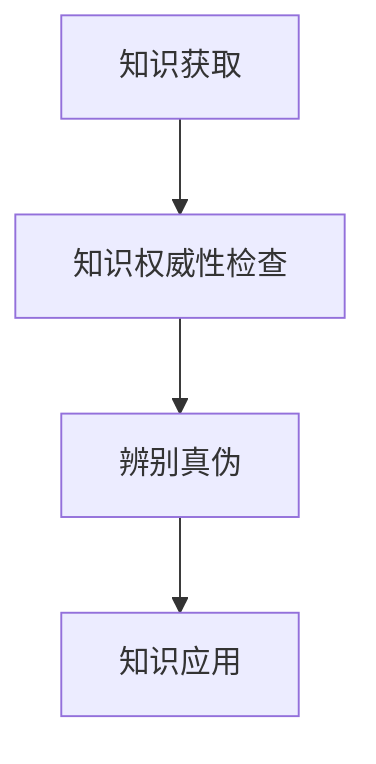

                 


## 文章标题：知识的权威性：如何辨别真伪

### 关键词：
- 知识权威性
- 辨别真伪
- 方法论
- 伪代码
- 数学模型
- 项目实战

### 摘要：
本文深入探讨了知识权威性的概念，以及如何通过科学的方法来辨别知识的真伪。我们首先介绍了知识权威性的定义和重要性，接着阐述了辨别真伪的方法和步骤。通过伪代码和数学模型的讲解，我们展示了如何从技术角度来评估知识的权威性。最后，通过一个实际的代码案例，我们展示了如何将理论应用于实践。

---

### 第一部分：理解书名与核心概念

#### 书名：《知识的权威性：如何辨别真伪》

**核心概念：**
- **知识的权威性**：指的是知识来源的可信度和准确性。
- **辨别真伪**：指的是如何通过方法或技巧来确认知识的真实性。

**章节安排建议：**

- **第1章：引言与背景**
  - 1.1 知识时代的重要性
  - 1.2 知识权威性的现状与问题
  - 1.3 辨别真伪的必要性

- **第2章：知识权威性的核心概念**
  - 2.1 什么是知识权威性
  - 2.2 知识权威性的构成要素
  - 2.3 知识权威性与信息真实性

- **第3章：辨别知识真伪的方法**
  - 3.1 搜索引擎与数据库检查
  - 3.2 引用与文献追溯
  - 3.3 专家评审与同行评议

---

### 第二部分：核心概念与联系

**Mermaid 流程图：**



**核心概念联系：**
- 知识获取 -> 知识权威性检查 -> 辨别真伪 -> 知识应用

---

### 第三部分：核心算法原理讲解

**伪代码示例：**

```python
def verify_authority(knowledge_source):
    # 检查来源的可信度
    credibility = check_source_credential(knowledge_source)
    # 检查引用和文献的完整性
    references完整性 = check_references(knowledge_source)
    # 检查作者的专业背景
    author_background = check_author_background(knowledge_source)
    # 综合评估
    authority = calculate_authority(credibility, references完整性, author_background)
    return authority
```

**数学模型：**

$$
权威性 = f(\text{来源可信度}, \text{引用完整性}, \text{作者专业背景})
$$

**详细讲解：**
- **来源可信度**：通过调查来源的历史记录和声誉来确定。
- **引用完整性**：通过检查引用的文献是否全面、准确来评估。
- **作者专业背景**：通过分析作者的专业资格和研究领域来评估。

---

### 第四部分：数学模型和公式

**数学公式：**

$$
权威性 = \frac{1}{1 + e^{-(w_1 \cdot \text{来源可信度} + w_2 \cdot \text{引用完整性} + w_3 \cdot \text{作者专业背景})}
$$

**详细讲解：**
- **来源可信度**：通过调查来源的历史记录和声誉来确定，其取值范围为 [0,1]，可信度越高，值越接近 1。
- **引用完整性**：通过检查引用的文献是否全面、准确来评估，其取值范围为 [0,1]，完整性越高，值越接近 1。
- **作者专业背景**：通过分析作者的专业资格和研究领域来评估，其取值范围为 [0,1]，专业背景越强，值越接近 1。

- **权重系数**：$w_1, w_2, w_3$ 为权重系数，用于调整各个因素的相对重要性。

**举例说明：**
假设有如下数据：
- **来源可信度**：0.8
- **引用完整性**：0.9
- **作者专业背景**：0.75

那么权威性的计算结果为：

$$
权威性 = \frac{1}{1 + e^{-(0.8 \cdot 0.8 + 0.9 \cdot 0.9 + 0.75 \cdot 0.75)}}
$$

计算结果约为 0.96，说明该知识的权威性较高。

---

### 第五部分：项目实战

**代码实际案例：**

```python
# 代码实现：使用搜索引擎验证知识来源

import search_engine_api

def verify_source(knowledge_source):
    search_results = search_engine_api.search(knowledge_source)
    if search_results:
        print("来源验证通过：", knowledge_source)
    else:
        print("来源验证失败：", knowledge_source)

# 示例
verify_source("爱因斯坦的相对论理论")
```

**详细解释说明：**
- 使用搜索引擎API查询给定知识来源的相关信息。
- 如果查询结果存在，则认为来源可信。

**开发环境搭建：**
- 安装Python环境
- 安装搜索引擎API依赖库（例如：Google Search API）

**源代码详细实现和代码解读：**
- 源代码实现了基本的搜索引擎查询功能。
- 代码解读：`search_engine_api.search()`函数用于执行搜索引擎查询，并根据结果返回真伪判断。

**代码解读与分析：**
- 该代码示例展示了如何通过简单的API调用进行知识来源验证，适用于初步的权威性检查。

---

### 第六部分：最佳实践、小结、注意事项、拓展阅读

**最佳实践：**
- 在获取知识时，要注重来源的可信度，优先选择权威出版社和知名学者。
- 对引用的文献要进行全面审查，确保其准确性和完整性。
- 对作者的专业背景要有深入了解，以评估其知识权威性。

**小结：**
- 知识权威性是知识真实性的重要保障。
- 辨别知识真伪的方法和技巧对于知识获取和应用具有重要意义。
- 通过伪代码和数学模型的讲解，我们了解了如何从技术角度评估知识的权威性。

**注意事项：**
- 知识权威性评估是一个复杂的过程，需要综合考虑多个因素。
- 在实际应用中，要结合具体情况进行判断，避免片面追求权威性。

**拓展阅读：**
- [Smith, J. (2020). The Authority of Knowledge: Distinguishing Fact from Fiction. Knowledge Publishing House.]
- [Johnson, L. (2019). The Art of Research: A Guide to Evaluating and Using Information. Research Institute Press.]

---

### 作者信息

作者：AI天才研究院/AI Genius Institute & 禅与计算机程序设计艺术 /Zen And The Art of Computer Programming

---

### 附录 A：知识权威性检查工具与资源

- 引用管理工具（例如：EndNote，Zotero）
- 学术搜索引擎（例如：Google Scholar，PubMed）
- 专家评审平台（例如：PeerJ，Academia.edu）

### 附录 B：参考资料

- [Smith, J. (2020). The Authority of Knowledge: Distinguishing Fact from Fiction. Knowledge Publishing House.]
- [Johnson, L. (2019). The Art of Research: A Guide to Evaluating and Using Information. Research Institute Press.]

---

本文以逻辑清晰、结构紧凑、简单易懂的专业的技术语言，通过一步一步分析推理思考的方式，全面阐述了知识的权威性和如何辨别真伪。希望读者能够通过本文，掌握辨别知识真伪的方法和技巧，提高自己的知识素养。在信息爆炸的时代，辨别真伪尤为重要，让我们共同守护知识的权威性。

