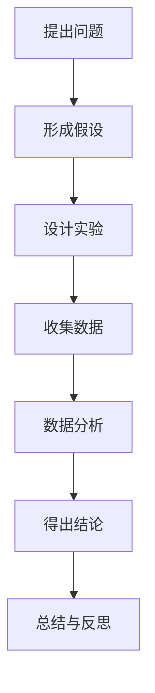

                 

### 《知识的质疑：科学思维与怀疑精神》

#### 关键词：科学思维、怀疑精神、批判性思维、科研、教育、创新

#### 摘要：
科学思维与怀疑精神是推动科学进步和社会发展的关键因素。本文将深入探讨科学思维的基本原理、怀疑精神的重要性及其在科学探究中的具体作用，并结合实际案例进行分析。此外，还将探讨如何培养科学思维与怀疑精神，以及其在未来社会中的潜在影响。

## 目录大纲

### 《知识的质疑：科学思维与怀疑精神》

#### 第一部分：科学思维的基本原理

### 第1章：科学思维的本质与特点

#### 1.1 科学思维的定义

#### 1.2 科学思维与常识思维的比较

#### 1.3 科学思维的方法论

### 第2章：科学方法的基本原理

#### 2.1 观察与假设

#### 2.2 实验与验证

#### 2.3 结论与总结

### 第3章：科学思维的应用

#### 3.1 科学思维在教育中的运用

#### 3.2 科学思维在科研中的应用

#### 3.3 科学思维在实践中的运用

#### 第二部分：怀疑精神的重要性

### 第4章：怀疑精神的历史与哲学基础

#### 4.1 怀疑精神的起源

#### 4.2 怀疑精神的哲学意义

#### 4.3 怀疑精神的科学意义

### 第5章：怀疑精神在科学探究中的作用

#### 5.1 怀疑精神对科学发现的推动作用

#### 5.2 怀疑精神对科学假说的验证作用

#### 5.3 怀疑精神对科学理论的修正作用

### 第6章：怀疑精神的实践价值

#### 6.1 怀疑精神对个人成长的促进作用

#### 6.2 怀疑精神对社会进步的推动作用

#### 6.3 怀疑精神对科学发展的保障作用

#### 第三部分：科学思维与怀疑精神的结合

### 第7章：科学思维与怀疑精神的融合

#### 7.1 怀疑精神与科学方法的结合

#### 7.2 怀疑精神与科学理论的结合

#### 7.3 怀疑精神与科学实践的结合

### 第8章：科学思维与怀疑精神的实际应用案例

#### 8.1 科学家如何运用科学思维与怀疑精神进行科研？

#### 8.2 怀疑精神在科学史上的重要作用

#### 8.3 科学思维与怀疑精神在日常生活中的应用

#### 第四部分：培养科学思维与怀疑精神

### 第9章：培养科学思维与怀疑精神的方法

#### 9.1 学习科学知识

#### 9.2 培养批判性思维

#### 9.3 鼓励独立思考

### 第10章：科学思维与怀疑精神的教育意义

#### 10.1 科学教育的重要性

#### 10.2 怀疑精神在科学教育中的应用

#### 10.3 科学思维与怀疑精神对学生创新能力的影响

### 第11章：科学思维与怀疑精神的未来

#### 11.1 科学思维与怀疑精神的发展趋势

#### 11.2 科学思维与怀疑精神对社会的影响

#### 11.3 科学思维与怀疑精神在未来的应用前景

#### 附录

### 附录 A：科学思维与怀疑精神的实用工具

#### A.1 怀疑精神检查表

#### A.2 科学方法流程图

#### A.3 怀疑精神案例分析

### 附录 B：科学思维与怀疑精神的进一步阅读材料

#### B.1 基本概念与联系

## 引入

科学思维与怀疑精神，作为科学研究和技术发展的基石，一直被重视。科学思维强调通过观察、实验和逻辑推理来获取知识，怀疑精神则强调质疑和批判性思维，推动科学不断进步。本文旨在探讨这两者的本质、重要性及其在实际应用中的作用。

### 第一部分：科学思维的基本原理

科学思维是一种通过系统的方法来研究自然现象和社会问题的思维方式。它不仅包括对数据的收集和分析，还涉及到对假设的提出和验证。

#### 第1章：科学思维的本质与特点

##### 1.1 科学思维的定义

科学思维是一种基于证据和逻辑的思考方式，它要求我们对现象进行观察，提出假设，并通过实验和数据分析来验证或否定这些假设。

##### 1.2 科学思维与常识思维的比较

常识思维通常是基于经验和直觉的，而科学思维则是基于证据和逻辑的。科学思维更加注重系统性和严谨性。

##### 1.3 科学思维的方法论

科学思维的方法论包括观察、假设、实验和验证。通过这些步骤，我们可以逐步深入了解现象的本质。

#### 第2章：科学方法的基本原理

科学方法是一种系统的研究方法，它通过观察、假设、实验和验证来获取知识。

##### 2.1 观察与假设

观察是科学方法的起点，通过观察我们可以发现现象并提出假设。假设是对现象的一种解释，它是基于观察的结果。

##### 2.2 实验与验证

实验是为了验证假设而设计的。通过实验，我们可以收集数据来检验假设的正确性。

##### 2.3 结论与总结

根据实验结果，我们可以得出结论，并对假设进行总结。

#### 第3章：科学思维的应用

科学思维的应用非常广泛，包括教育、科研和实践。

##### 3.1 科学思维在教育中的运用

在教育中，科学思维可以帮助学生培养批判性思维和解决问题的能力。

##### 3.2 科学思维在科研中的应用

在科研中，科学思维是获取新知识的关键，它通过系统的方法来探索未知领域。

##### 3.3 科学思维在实践中的运用

在实践过程中，科学思维可以帮助我们更好地理解问题，提出解决方案并实施。

### 第二部分：怀疑精神的重要性

怀疑精神是科学探究的核心，它推动科学不断进步。

#### 第4章：怀疑精神的历史与哲学基础

##### 4.1 怀疑精神的起源

怀疑精神的起源可以追溯到古希腊哲学家，他们对传统的信仰和知识进行了质疑。

##### 4.2 怀疑精神的哲学意义

怀疑精神在哲学中具有重要意义，它推动了人类对世界的深入思考。

##### 4.3 怀疑精神的科学意义

怀疑精神在科学中同样重要，它促进了科学知识的进步。

#### 第5章：怀疑精神在科学探究中的作用

##### 5.1 怀疑精神对科学发现的推动作用

怀疑精神可以激发新的发现，推动科学的进步。

##### 5.2 怀疑精神对科学假说的验证作用

怀疑精神可以帮助验证科学假说的正确性，提高科学研究的可信度。

##### 5.3 怀疑精神对科学理论的修正作用

怀疑精神可以帮助修正科学理论的错误，提高科学理论的准确性。

#### 第6章：怀疑精神的实践价值

##### 6.1 怀疑精神对个人成长的促进作用

怀疑精神可以帮助个人不断学习和成长。

##### 6.2 怀疑精神对社会进步的推动作用

怀疑精神可以推动社会的进步，促进科学和技术的创新。

##### 6.3 怀疑精神对科学发展的保障作用

怀疑精神是科学发展的重要保障，它确保了科学的严谨性和可信度。

### 第三部分：科学思维与怀疑精神的结合

科学思维与怀疑精神的结合，可以更好地推动科学进步。

#### 第7章：科学思维与怀疑精神的融合

##### 7.1 怀疑精神与科学方法的结合

怀疑精神与科学方法的结合，可以更好地进行科学探究。

##### 7.2 怀疑精神与科学理论的结合

怀疑精神与科学理论的结合，可以提高科学理论的准确性和可靠性。

##### 7.3 怀疑精神与科学实践的结合

怀疑精神与科学实践的结合，可以更好地指导实践，推动科学技术的发展。

#### 第8章：科学思维与怀疑精神的实际应用案例

##### 8.1 科学家如何运用科学思维与怀疑精神进行科研？

科学家通过科学思维和怀疑精神，不断推动科学研究的进展。

##### 8.2 怀疑精神在科学史上的重要作用

怀疑精神在科学史上发挥了重要作用，推动了科学的发展。

##### 8.3 科学思维与怀疑精神在日常生活中的应用

科学思维与怀疑精神在日常生活中的应用，可以帮助我们更好地理解世界，提高生活质量。

### 第四部分：培养科学思维与怀疑精神

培养科学思维与怀疑精神，是个人成长和社会进步的关键。

#### 第9章：培养科学思维与怀疑精神的方法

##### 9.1 学习科学知识

学习科学知识，是培养科学思维和怀疑精神的基础。

##### 9.2 培养批判性思维

培养批判性思维，是培养科学思维和怀疑精神的关键。

##### 9.3 鼓励独立思考

鼓励独立思考，是培养科学思维和怀疑精神的重要手段。

#### 第10章：科学思维与怀疑精神的教育意义

##### 10.1 科学教育的重要性

科学教育在个人成长和社会进步中具有重要作用。

##### 10.2 怀疑精神在科学教育中的应用

怀疑精神在科学教育中的应用，可以培养学生的批判性思维和创新能力。

##### 10.3 科学思维与怀疑精神对学生创新能力的影响

科学思维与怀疑精神可以培养学生的创新能力，促进科学和技术的进步。

#### 第11章：科学思维与怀疑精神的未来

##### 11.1 科学思维与怀疑精神的发展趋势

科学思维与怀疑精神的发展趋势，将继续推动科学进步和社会发展。

##### 11.2 科学思维与怀疑精神对社会的影响

科学思维与怀疑精神对社会的影响，将不断深化和扩大。

##### 11.3 科学思维与怀疑精神在未来的应用前景

科学思维与怀疑精神在未来的应用前景，将更加广泛和深入。

### 附录

#### 附录 A：科学思维与怀疑精神的实用工具

##### A.1 怀疑精神检查表

##### A.2 科学方法流程图

##### A.3 怀疑精神案例分析

#### 附录 B：科学思维与怀疑精神的进一步阅读材料

##### B.1 基本概念与联系

## 结语

科学思维与怀疑精神是推动科学进步和社会发展的关键因素。通过本文的探讨，我们深刻理解了这两者的本质和重要性，以及如何在实践中应用和培养。让我们共同努力，运用科学思维和怀疑精神，推动科学和技术的进步，创造更美好的未来。作者：AI天才研究院/AI Genius Institute & 禅与计算机程序设计艺术 /Zen And The Art of Computer Programming

## 第一部分：科学思维的基本原理

### 第1章：科学思维的本质与特点

科学思维是一种基于实证数据和逻辑推理的思考方式，它通过系统的方法来研究自然现象和社会问题。本章将深入探讨科学思维的本质和特点，以及其在科学研究中的重要性。

#### 1.1 科学思维的定义

科学思维可以被定义为一种逻辑性、系统性和客观性的思考方式。它不仅关注现象本身，更强调对现象背后的原因和机制进行探究。科学思维的核心是假设-演绎法，即首先提出一个假设，然后通过实验或观察来验证或否定这个假设。

#### 1.2 科学思维与常识思维的比较

常识思维通常是基于个人经验和直觉的，它往往缺乏系统性和客观性。而科学思维则强调通过观察、实验和数据分析来获取知识，注重证据和逻辑的严谨性。以下是科学思维与常识思维的一些关键区别：

1. **证据导向**：科学思维以实证数据为基础，而常识思维往往依赖直觉和个人经验。
2. **系统性**：科学思维注重整体性和系统性，而常识思维可能更倾向于片面和局部。
3. **批判性**：科学思维强调质疑和批判，而常识思维往往接受未经检验的信念。
4. **可重复性**：科学思维的结果可以重复验证，而常识思维的结论往往难以重复。

#### 1.3 科学思维的方法论

科学思维的方法论是科学研究的基础，它包括以下几个关键步骤：

1. **观察**：科学思维从观察开始，通过仔细观察现象，收集相关的数据和信息。
2. **假设**：基于观察结果，提出一个或多个假设，这些假设是对现象可能原因的初步猜测。
3. **实验**：设计实验来验证或否定假设。实验可以是控制实验、对照实验等，以排除其他可能的影响因素。
4. **数据分析**：对实验数据进行分析，以评估假设的有效性。
5. **结论**：根据数据分析结果，得出结论，并对假设进行验证或否定。

#### 科学思维与实证主义的联系

科学思维与实证主义密不可分。实证主义认为，知识应该基于观察和实验的结果，而不是基于个人信念或权威。科学思维强调通过实验和观察来验证假设，这符合实证主义的原则。

#### 科学思维的应用领域

科学思维在各个领域都有广泛的应用，包括自然科学（如物理学、化学、生物学）、社会科学（如经济学、心理学、社会学）以及工程技术等。以下是科学思维在不同领域的应用示例：

1. **物理学**：通过实验验证物理定律，如牛顿运动定律。
2. **经济学**：通过统计分析来研究经济行为和趋势。
3. **生物学**：通过实验和观察来研究生物体的功能和机制。
4. **工程技术**：通过实验和模型验证设计方案的可行性和性能。

#### 科学思维的局限性

虽然科学思维是获取知识的重要工具，但它也存在局限性。科学思维依赖于实验和观察，而实验和观察的局限性可能影响科学研究的准确性。例如，实验设计的不完善或观察数据的偏差都可能导致错误结论。

#### 科学思维与哲学的关系

科学思维与哲学有着密切的关系。哲学提供了科学思维的哲学基础，如逻辑学、认识论和形而上学。同时，科学思维的发展也推动了哲学的进步，尤其是对科学方法和科学知识的本质的深入探讨。

#### 科学思维的实践意义

科学思维的实践意义在于，它可以帮助我们更好地理解世界，解决实际问题，推动科学和技术的发展。通过科学思维，我们可以发现新的知识，改进现有的技术，创造新的发明。

#### 总结

科学思维是一种基于实证数据和逻辑推理的思考方式，它通过系统的方法来研究自然现象和社会问题。科学思维的特点包括证据导向、系统性、批判性和可重复性。科学思维的方法论包括观察、假设、实验、数据分析和结论。科学思维在各个领域都有广泛的应用，但同时也存在局限性。科学思维与哲学有着密切的关系，它的实践意义在于推动科学和技术的进步。

### 第2章：科学方法的基本原理

科学方法是一种系统的研究方法，它通过观察、假设、实验和验证来获取知识。科学方法的核心在于其逻辑性和可重复性，使得科学研究具有高度的可信度和普适性。本章将详细探讨科学方法的基本原理，包括观察与假设、实验与验证、结论与总结。

#### 2.1 观察与假设

观察是科学方法的起点，它是对自然现象或社会现象的感知和记录。科学的观察要求客观性和准确性，避免主观臆断和个人偏见。科学观察的目的是收集数据和信息，为后续的假设提供基础。

1. **观察的类型**：
   - **定性观察**：描述现象的性质和特征，如颜色、形状、大小等。
   - **定量观察**：测量现象的量，如温度、重量、时间等。

2. **记录与描述**：在观察过程中，需要详细记录数据，并使用适当的图表或文字进行描述。

3. **问题识别**：通过对观察到的现象进行分析，识别出需要解决的问题或疑问。

假设是基于观察结果的一种初步推测，是对现象可能原因的假设性解释。科学假设应该是可测试的，即可以通过实验或观察来验证或否定。

1. **假设的形成**：
   - 从观察中提取关键信息，提出可能的原因或机制。
   - 假设应该是具体和明确的，以便于设计和实施实验。

2. **假设的验证**：
   - 设计实验来验证或否定假设。
   - 实验结果可以支持或反驳假设，从而对其进行修正。

#### 2.2 实验与验证

实验是科学方法的核心步骤，它是验证假设的关键手段。实验设计要求科学性和严谨性，以确保实验结果的可靠性和有效性。

1. **实验设计**：
   - 确定实验的目标和变量。
   - 设计对照组和实验组，以排除其他影响因素。
   - 使用适当的实验设备和材料。

2. **实验实施**：
   - 按照实验设计进行操作，确保实验的可重复性。
   - 记录实验过程中的所有数据，包括变量、操作步骤和观察结果。

3. **数据分析**：
   - 对实验数据进行整理和分析，以评估假设的有效性。

4. **实验结果的解释**：
   - 根据数据分析结果，解释实验结果，确定假设是否成立。

#### 2.3 结论与总结

结论是基于实验结果对假设的最终判断，它是对研究现象的新认识。科学结论应该基于可靠的实验数据和逻辑推理，避免主观臆断。

1. **结论的形成**：
   - 根据实验结果，确定假设是否成立。
   - 如果假设得到支持，可以进一步验证和扩展。
   - 如果假设被否定，需要重新审视假设或提出新的假设。

2. **总结与展望**：
   - 对整个研究过程进行总结，包括方法、实验和结果。
   - 提出未来研究的方向和可能性。

#### 科学方法的流程

科学方法的流程可以概括为以下步骤：

1. **提出问题**：从观察中识别需要解决的问题或疑问。
2. **形成假设**：基于观察结果提出可能的原因或机制。
3. **设计实验**：制定实验方案来验证或否定假设。
4. **实施实验**：按照实验设计进行操作，记录数据。
5. **数据分析**：对实验数据进行分析，评估假设的有效性。
6. **得出结论**：根据实验结果，确定假设是否成立。
7. **总结与展望**：总结研究过程和结果，提出未来研究方向。

#### 科学方法的优势

科学方法的优势在于其逻辑性和系统性，使得科学研究具有高度的可信度和普适性。科学方法能够减少研究中的主观偏见，提高结果的可靠性。此外，科学方法的可重复性使得其他研究者可以验证和扩展研究结果。

#### 科学方法的局限性

尽管科学方法在科学研究中有显著优势，但它也存在局限性。科学方法依赖于实验和观察，可能无法涵盖所有现象。实验设计的缺陷、数据收集的不完善都可能影响研究结果的准确性。此外，科学方法可能无法解释所有现象，如复杂的心理和社会现象。

#### 总结

科学方法是一种系统的研究方法，通过观察、假设、实验和验证来获取知识。科学方法的特点包括逻辑性、系统性和可重复性，它使得科学研究具有高度的可信度和普适性。科学方法的流程包括提出问题、形成假设、设计实验、实施实验、数据分析、得出结论和总结与展望。科学方法的优势在于其可靠性和系统性，但也存在局限性，如实验和观察的局限。科学方法在科学研究中的应用，推动了科学和技术的进步，为人类理解和改变世界提供了有力工具。

### 第3章：科学思维的应用

科学思维不仅在学术研究中发挥关键作用，也在教育、科研和实践等各个领域中广泛应用。本章将深入探讨科学思维在这些领域的具体应用，以及其对社会和技术发展的深远影响。

#### 3.1 科学思维在教育中的运用

科学思维在教育中的运用主要体现在培养学生的批判性思维和解决问题的能力。通过科学思维，学生能够从多角度分析问题，提出合理的假设，并通过实验和观察来验证这些假设。

1. **批判性思维培养**：
   - 通过科学思维，学生学会对所学知识进行质疑和批判，从而提高思维深度。
   - 学生通过分析实验数据，学会从证据出发得出结论，而不是基于主观臆断。

2. **问题解决能力的提升**：
   - 科学思维鼓励学生从多个角度分析和解决问题，提高解决问题的效率和质量。
   - 学生通过科学实验，学会使用逻辑推理和实证数据来支持自己的观点。

3. **课程设计**：
   - 教育者可以利用科学思维设计课程，引导学生通过实验和观察来理解复杂概念。
   - 例如，在生物学课程中，学生可以通过观察植物生长的实验来理解光合作用的过程。

#### 3.2 科学思维在科研中的应用

科学思维在科研中的应用是其核心价值所在。科研人员通过科学思维，提出假设，设计实验，收集和分析数据，以发现新的知识和突破。

1. **假设提出**：
   - 科研人员通过对现有知识的深入理解，提出新的假设，探索未知领域。
   - 例如，在医学研究中，科学家通过观察疾病现象，提出新的治疗假设。

2. **实验设计**：
   - 科学思维强调实验设计的科学性和严谨性，以排除干扰因素，提高实验结果的可靠性。
   - 例如，在物理学研究中，科学家通过精确的实验设计，验证量子力学的基本原理。

3. **数据分析**：
   - 科学思维要求科研人员对实验数据进行系统分析，以得出科学结论。
   - 例如，在心理学研究中，科学家通过统计分析，验证不同治疗方法的效果。

4. **知识积累**：
   - 科学思维帮助科研人员积累知识，通过不断的假设验证和理论修正，推动科学进步。
   - 例如，从经典力学到量子力学的发展，是科学思维不断验证和修正理论的结果。

#### 3.3 科学思维在实践中的运用

科学思维在实践中的应用体现在技术创新、工程设计和问题解决等方面，它推动了社会和技术的进步。

1. **技术创新**：
   - 科学思维帮助工程师和科学家设计创新产品，如计算机、手机和人工智能系统。
   - 例如，在计算机科学中，科学家通过实验和模拟，开发了高效的算法和优化技术。

2. **工程设计**：
   - 科学思维在工程设计中的应用，确保了工程项目的可行性和安全性。
   - 例如，在建筑工程中，工程师通过科学方法和实验数据，设计了抗震结构。

3. **问题解决**：
   - 科学思维帮助人们分析和解决复杂问题，提高生活质量。
   - 例如，在环境保护领域，科学家通过研究污染物对人体的影响，提出了有效的治理措施。

#### 科学思维对社会发展的推动作用

科学思维不仅推动了科学和技术的进步，也对社会发展产生了深远影响。

1. **知识普及**：
   - 科学思维的普及，提高了公众的科学素养，推动了科学知识的传播和应用。
   - 例如，通过科普读物和媒体，科学知识得到了更广泛的传播。

2. **技术创新**：
   - 科学思维促进了技术创新，推动了社会的工业化和现代化。
   - 例如，工业革命期间，科学思维的应用推动了蒸汽机和机器的发展。

3. **社会治理**：
   - 科学思维在政策制定和社会管理中的应用，提高了决策的科学性和有效性。
   - 例如，在公共卫生领域，科学家通过研究传染病传播机制，提出了有效的防控措施。

#### 科学思维的局限性

尽管科学思维具有显著优势，但它也存在局限性。

1. **实验局限性**：
   - 科学思维依赖于实验，但某些现象可能无法通过实验验证，如复杂的心理和社会现象。

2. **数据偏差**：
   - 数据收集和分析的偏差可能影响科学研究的准确性，需要严格的数据处理和分析方法。

3. **理论局限**：
   - 科学理论可能无法解释所有现象，需要不断发展和修正。

#### 总结

科学思维在教育、科研和实践中的应用，极大地推动了科学和技术的进步，提高了社会生活质量。通过科学思维，学生培养了批判性思维和解决问题的能力，科研人员取得了新的科学突破，工程师和设计师设计出创新的产品。科学思维对社会发展的推动作用不可忽视，但也需要认识到其局限性。科学思维的发展和应用，将继续推动社会进步和科技创新。

### 第二部分：怀疑精神的重要性

怀疑精神是科学探究的基石，它通过对知识的质疑和批判性分析，推动了科学的进步。本章将深入探讨怀疑精神的历史与哲学基础，以及它在科学探究中的重要性。

#### 第4章：怀疑精神的历史与哲学基础

怀疑精神的历史可以追溯到古希腊哲学，尤其是苏格拉底和柏拉图的思想。苏格拉底以其“苏格拉底式的问答法”著称，他通过不断提问和质疑，使人们对自己的知识和信念进行深入思考。柏拉图则在其哲学体系中强调了理性和批判性思维的重要性。

1. **苏格拉底式的批判性思维**：
   - 苏格拉底通过提问引导人们质疑自己的信念，从而揭示隐藏的错误或不足。
   - 他的方法不仅仅是提出问题，更注重通过逻辑推理来验证或反驳观点。

2. **柏拉图的哲学思想**：
   - 柏拉图认为，现实世界是理性和真理的映射，通过批判性思维，人们可以接近这些永恒的真理。
   - 他强调理性思维和哲学探讨在寻求知识和真理中的核心作用。

随着历史的发展，怀疑精神在各个时期都有所体现。例如，在文艺复兴时期，人们对传统权威和信仰进行了质疑，推动了科学革命的发展。而在现代科学的发展中，怀疑精神更是被视为科学研究不可或缺的一部分。

#### 4.2 怀疑精神的哲学意义

怀疑精神在哲学中具有重要意义，它推动了人类对世界的深入思考和理解。

1. **哲学的基础**：
   - 怀疑精神是哲学研究的基础，它促使人们质疑传统观念和既定知识。
   - 赫尔墨斯主义（Pyrrhonism）是怀疑主义的代表，它主张通过质疑和反思，达到一种无所偏见的认识状态。

2. **批判性思维的发展**：
   - 怀疑精神促进了批判性思维的发展，使人们能够更全面地分析问题和提出解决方案。
   - 批判性思维强调通过逻辑推理和证据来评估观点，而不是盲目接受权威。

3. **知识论的影响**：
   - 怀疑精神对知识论产生了深远影响，它促使哲学家们探讨知识的本质和局限性。
   - 例如，笛卡尔通过“我思故我在”的哲学命题，强调了怀疑精神在确立知识基础中的重要性。

#### 4.3 怀疑精神的科学意义

怀疑精神在科学中的重要性不言而喻，它推动了科学发现和理论的发展。

1. **科学方法论**：
   - 科学方法论的核心是怀疑精神，它强调通过实验和观察来验证假设。
   - 科学方法要求对现有理论进行不断质疑和验证，以发现新的知识。

2. **科学进步的推动力**：
   - 怀疑精神是科学进步的推动力，它促使科学家不断探索和质疑现有的理论和知识。
   - 例如，伽利略通过质疑亚里士多德的天文学理论，推动了天文学的重大变革。

3. **理论修正与完善**：
   - 怀疑精神帮助科学家发现理论的不足和错误，推动理论的修正和完善。
   - 例如，达尔文通过质疑传统的物种不变论，提出了进化论，从而彻底改变了生物学的研究方向。

#### 怀疑精神在科学探究中的应用

怀疑精神在科学探究中的应用体现在多个方面：

1. **质疑传统观念**：
   - 科学家通过质疑传统观念，挑战现有的理论和知识体系。
   - 例如，爱因斯坦质疑牛顿力学的局限性，提出了相对论。

2. **实验验证**：
   - 怀疑精神促使科学家设计实验来验证或否定假设。
   - 例如，卡文迪许通过实验验证了万有引力定律。

3. **批判性分析**：
   - 科学家通过批判性分析，评估现有数据和理论的可靠性。
   - 例如，科学家们通过数据分析，质疑了“地心说”的合理性。

#### 总结

怀疑精神在科学探究中具有不可替代的重要性。它不仅推动了科学方法论的发展，也是科学进步的关键推动力。通过怀疑精神，科学家能够不断质疑和验证现有知识，推动科学理论的修正和完善。怀疑精神的哲学意义在于它促进了人类对世界的深入思考和理解。怀疑精神的应用，使得科学研究更加严谨和可靠，为人类的进步提供了坚实理论基础。怀疑精神不仅是科学家的重要品质，也是每个人在面对知识和信息时应该具备的态度。

### 第5章：怀疑精神在科学探究中的作用

怀疑精神是科学探究的核心，它在科学发现、科学假说的验证和科学理论的修正中发挥着关键作用。本章将详细探讨怀疑精神在这三个方面的具体应用，以及其对科学进步的推动作用。

#### 5.1 怀疑精神对科学发现的推动作用

怀疑精神是科学发现的催化剂，它促使科学家不断探索未知领域，挑战传统观念，从而发现新的知识和现象。

1. **质疑传统观念**：
   - 怀疑精神鼓励科学家对传统观念进行质疑，挑战现有的理论框架。
   - 例如，伽利略通过质疑地心说，推动了日心说的提出，改变了天文学的发展方向。

2. **激发创新思维**：
   - 怀疑精神激发科学家的创新思维，促使他们提出新的假设和理论。
   - 例如，爱因斯坦的相对论，是对牛顿力学的怀疑和扩展，提出了全新的物理学观念。

3. **推动科学进步**：
   - 怀疑精神通过不断质疑和验证，推动了科学的进步，促进了新知识的积累。
   - 例如，达尔文的进化论，通过质疑物种不变论，奠定了现代生物学的理论基础。

#### 5.2 怀疑精神对科学假说的验证作用

科学假说是科学研究的基础，怀疑精神通过对假说的验证，确保了科学研究的准确性和可靠性。

1. **实验验证**：
   - 怀疑精神强调通过实验来验证假说，确保假说的科学性和可靠性。
   - 例如，牛顿通过实验验证了万有引力定律，使其理论得到了广泛认可。

2. **数据收集与分析**：
   - 怀疑精神要求科学家收集大量数据，通过统计分析来验证假说。
   - 例如，达尔文通过对动植物的大量观察和实验，收集了丰富的证据来支持其进化论。

3. **批判性分析**：
   - 怀疑精神促使科学家对实验数据和假说进行批判性分析，识别潜在的错误和不足。
   - 例如，科学家通过对实验数据的仔细分析，发现了量子力学的非直观特性，推动了物理学的发展。

#### 5.3 怀疑精神对科学理论的修正作用

怀疑精神不仅推动了科学发现和假说的验证，还在科学理论的修正和完善中发挥着重要作用。

1. **理论质疑**：
   - 怀疑精神鼓励科学家对现有理论进行质疑，识别其局限性和不足。
   - 例如，爱因斯坦质疑牛顿力学在高速运动和强引力场中的适用性，提出了相对论。

2. **理论扩展**：
   - 怀疑精神促使科学家在质疑现有理论的基础上，提出新的理论或对现有理论进行扩展。
   - 例如，量子力学的提出，是对经典物理学理论的扩展和修正。

3. **理论验证**：
   - 怀疑精神要求科学家通过实验和观测来验证新的理论，确保其科学性和准确性。
   - 例如，科学家通过实验验证了量子力学的预言，使其成为现代物理学的基础。

#### 怀疑精神在科学探究中的实际案例

怀疑精神在科学探究中的实际案例不胜枚举，以下是几个典型的例子：

1. **牛顿与开普勒定律**：
   - 牛顿通过对开普勒定律的质疑，提出了万有引力定律，解释了行星运动的规律。
   - 通过实验验证，牛顿的理论得到了广泛认可，取代了开普勒的定律。

2. **达尔文与进化论**：
   - 达尔文通过对物种不变论的质疑，提出了进化论，解释了生物多样性的起源。
   - 达尔文通过大量的观察和实验证据，支持了他的假说，进化论成为现代生物学的基石。

3. **量子力学与经典物理学**：
   - 科学家通过对经典物理学的质疑，提出了量子力学，解释了微观世界的现象。
   - 量子力学的实验验证，证明了经典物理学的局限性，推动了物理学的发展。

#### 总结

怀疑精神在科学探究中具有不可替代的重要性，它推动了科学发现、假说的验证和理论的修正。通过质疑和批判性分析，科学家能够不断挑战传统观念，发现新知识，推动科学的进步。怀疑精神不仅是科学研究的核心，也是每个人都应具备的思维方式，它帮助我们更全面地理解世界，不断提高知识和认知水平。

### 第6章：怀疑精神的实践价值

怀疑精神不仅是一种哲学和科学思维方式，它在实际生活中也具有极高的价值。本章将深入探讨怀疑精神在个人成长、社会进步和科学发展中的具体作用，以及其对创新和问题解决能力的提升。

#### 6.1 怀疑精神对个人成长的促进作用

怀疑精神是个人成长的重要推动力，它帮助人们形成批判性思维，提高对事物的分析和理解能力。

1. **批判性思维**：
   - 怀疑精神促使人们质疑和批判既有的观点和信息，从而形成批判性思维。
   - 批判性思维有助于人们独立思考，不盲从权威，从而在知识和认知上取得进步。

2. **问题解决能力**：
   - 怀疑精神鼓励人们面对问题时，不急于给出答案，而是通过质疑和深入分析来寻找解决方案。
   - 这种思维方式提高了人们的问题解决能力，使他们更善于面对复杂和多变的现实。

3. **自我反省**：
   - 怀疑精神促使人们不断反思自己的行为和观点，从而进行自我改进。
   - 通过自我反省，人们能够更好地了解自己的优点和不足，不断优化自己的思维和行为方式。

#### 6.2 怀疑精神对社会进步的推动作用

怀疑精神对社会进步具有深远影响，它推动社会的科学化和理性化，促进技术的创新和社会制度的改革。

1. **科学精神**：
   - 怀疑精神强调通过科学方法和逻辑推理来解决问题，这有助于社会形成科学精神，提高整体的科学素养。
   - 社会科学领域的进步，如经济学、心理学和社会学，都受益于怀疑精神的推动。

2. **技术创新**：
   - 怀疑精神鼓励科学家和工程师不断质疑现有技术，探索新的解决方案，从而推动技术创新。
   - 例如，计算机科学和人工智能的发展，很大程度上得益于怀疑精神的推动。

3. **制度变革**：
   - 怀疑精神促使人们对社会制度进行批判和反思，推动制度的改革和完善。
   - 例如，民主制度的兴起和普及，就是怀疑精神在社会层面的一种体现。

#### 6.3 怀疑精神对科学发展的保障作用

怀疑精神是科学发展的重要保障，它确保了科学研究的过程和结果的严谨性和可靠性。

1. **科学方法**：
   - 怀疑精神强调通过科学方法来验证假设和理论，这确保了科学研究的科学性和可靠性。
   - 科学方法要求科学家进行实验和观察，收集和分析数据，从而得出科学结论。

2. **理论修正**：
   - 怀疑精神促使科学家对现有理论进行质疑和验证，从而发现理论的不足和错误。
   - 通过质疑和修正，科学家能够不断完善理论，推动科学的进步。

3. **知识积累**：
   - 怀疑精神鼓励科学家不断探索和发现新知识，从而积累丰富的科学知识。
   - 通过怀疑精神，科学家能够保持对未知领域的探索热情，推动科学的持续发展。

#### 怀疑精神在实践中的案例分析

怀疑精神在实践中的成功案例不胜枚举，以下是几个典型的例子：

1. **医学研究**：
   - 科学家通过对传统医学观点的质疑，发现了许多新的治疗方法。
   - 例如，对青霉素的发现，是通过质疑传统治疗方法，发现了抗生素的新用途。

2. **环境保护**：
   - 环境科学家通过对污染问题的质疑，提出了有效的环境保护措施。
   - 例如，对化学污染的治理，是通过质疑传统方法，提出了更加科学的污染控制策略。

3. **经济学研究**：
   - 经济学家通过对传统经济理论的质疑，提出了新的经济学模型和政策建议。
   - 例如，对市场失灵的研究，是通过质疑传统经济理论，提出了新的市场调节机制。

#### 总结

怀疑精神在个人成长、社会进步和科学发展中具有不可替代的重要性。它不仅促进了个人批判性思维和问题解决能力的提升，也推动了社会的科学化和理性化。怀疑精神是科学发展的重要保障，确保了科学研究的过程和结果的严谨性和可靠性。通过怀疑精神的推动，科学家和社会能够不断探索新知识，解决新问题，推动人类社会的进步。

### 第三部分：科学思维与怀疑精神的结合

科学思维与怀疑精神的结合，是推动科学进步和社会发展的重要动力。在本章中，我们将探讨这两种思维方式的融合，以及它们在实际应用中的具体表现。

#### 第7章：科学思维与怀疑精神的融合

科学思维与怀疑精神的融合，形成了一种强大的思维模式，它不仅强调通过系统的方法来获取知识，还强调对知识的质疑和批判。这种融合在科学研究和实际应用中表现出以下几个方面的优势：

##### 7.1 怀疑精神与科学方法的结合

科学方法是一种系统的研究方法，它通过观察、假设、实验和验证来获取知识。怀疑精神与科学方法的结合，可以确保研究过程的严谨性和结果的可靠性。

1. **观察与假设**：
   - 科学思维要求通过观察来收集数据，并提出假设。
   - 怀疑精神则要求对这些观察和假设进行批判性分析，确保其科学性和合理性。

2. **实验与验证**：
   - 科学方法通过实验来验证假设，怀疑精神则要求对实验设计和方法进行严格审查，确保实验结果的有效性和可靠性。

3. **数据分析与结论**：
   - 科学方法要求对实验数据进行分析，得出结论。
   - 怀疑精神则要求对数据分析过程和结论进行批判性分析，确保结论的科学性和准确性。

##### 7.2 怀疑精神与科学理论的结合

科学理论是科学知识的高级形式，它是对自然现象和规律的系统描述。怀疑精神与科学理论的结合，可以推动理论的修正和完善。

1. **理论质疑**：
   - 怀疑精神鼓励科学家对现有理论进行质疑，识别其局限性和不足。
   - 通过质疑，科学家可以发现现有理论的缺陷，提出新的理论或对现有理论进行修正。

2. **理论验证**：
   - 怀疑精神要求科学家对理论进行严格的实验和观察验证，确保理论的科学性和准确性。
   - 通过验证，科学家可以不断完善理论，提高其普适性和解释力。

3. **理论扩展**：
   - 怀疑精神促使科学家在质疑现有理论的基础上，探索新的理论领域，推动科学的发展。
   - 例如，量子力学的提出，就是对经典物理学的质疑和扩展。

##### 7.3 怀疑精神与科学实践的结合

科学实践是将科学知识应用于实际生活和工作的过程。怀疑精神与科学实践的结合，可以确保科学技术的创新和有效性。

1. **技术创新**：
   - 怀疑精神鼓励科学家和工程师对现有技术进行质疑，探索新的解决方案。
   - 例如，计算机科学中的创新，很大程度上得益于对传统计算模型的质疑和改进。

2. **问题解决**：
   - 怀疑精神要求在解决问题时，不仅依赖于现有知识和方法，还要通过质疑和实验来寻找更有效的解决方案。
   - 例如，在工程实践中，工程师通过质疑和实验，提出了更加可靠的结构设计。

3. **实践反馈**：
   - 怀疑精神强调在实践中对科学知识进行验证和修正，确保技术的有效性和安全性。
   - 例如，在医学实践中，医生通过观察和实验，对治疗方法进行不断改进，提高了治疗效果。

#### 科学思维与怀疑精神的实际应用案例

以下是几个科学思维与怀疑精神在实际应用中的成功案例：

1. **医学研究**：
   - 科学家通过科学思维和怀疑精神，发现了抗生素的疗效，推动了医学的发展。
   - 例如，青霉素的发现，是通过质疑传统治疗方法，发现了新的治疗途径。

2. **环境保护**：
   - 环境科学家通过科学思维和怀疑精神，提出了有效的环境保护措施，改善了环境质量。
   - 例如，对化学污染的研究，是通过质疑传统治理方法，提出了新的污染控制策略。

3. **经济学研究**：
   - 经济学家通过科学思维和怀疑精神，提出了新的经济学模型和政策建议，推动了经济的发展。
   - 例如，对市场失灵的研究，是通过质疑传统经济理论，提出了新的市场调节机制。

#### 总结

科学思维与怀疑精神的结合，形成了一种强大的思维模式，它不仅推动了科学进步，也促进了社会和技术的创新。通过怀疑精神的推动，科学思维能够更加严谨和有效地进行科学研究；通过科学思维的指导，怀疑精神能够更加系统和理性地进行质疑和验证。科学思维与怀疑精神的融合，是推动科学进步和社会发展的关键，它为人类的未来发展提供了无限可能。

### 第8章：科学思维与怀疑精神的实际应用案例

科学思维与怀疑精神在科学家和研究者的日常工作中扮演着至关重要的角色。通过具体案例，我们可以看到这些思维方式如何在不同领域中推动科学进步和创新。

#### 8.1 科学家如何运用科学思维与怀疑精神进行科研？

科学家在科研过程中，通常会遵循以下步骤来运用科学思维和怀疑精神：

1. **提出问题**：
   - 科学家首先识别出科学问题或现象，这通常是基于对现有知识的不足或对未解问题的探索。
   - 例如，科学家可能想知道为什么某些物种具有特定的适应性特征。

2. **形成假设**：
   - 科学家基于已有的知识和观察，提出一个或多个假设来解释问题或现象。
   - 例如，科学家可能假设某种环境因素导致了特定物种的适应性特征。

3. **设计实验**：
   - 科学家设计实验来验证假设，确保实验能够控制变量，排除干扰因素。
   - 例如，科学家可能会创建一个实验环境，模拟特定的环境条件来观察物种的适应性变化。

4. **执行实验**：
   - 科学家按照实验设计进行操作，收集数据和观察结果。
   - 例如，科学家可能会记录不同环境条件下物种的生存率。

5. **分析数据**：
   - 科学家使用统计学方法分析实验数据，评估假设的有效性。
   - 例如，科学家可能会分析数据，确定环境因素对物种适应性是否有显著影响。

6. **得出结论**：
   - 根据数据分析结果，科学家得出结论，验证或否定假设。
   - 例如，如果实验结果显示环境因素确实对物种适应性有显著影响，科学家会得出相应结论。

7. **反思与修正**：
   - 即使假设得到验证，科学家也会反思实验设计和方法，寻找改进空间。
   - 例如，科学家可能会考虑是否还有其他因素影响了结果。

#### 8.2 怀疑精神在科学史上的重要作用

怀疑精神在科学史上的贡献不可忽视，它推动了科学的进步和知识的发展。以下是几个例子：

1. **哥白尼与日心说**：
   - 哥白尼通过怀疑精神质疑了地心说，提出了日心说，改变了人类对宇宙的理解。
   - 他的理论虽然在当时受到质疑，但最终通过天文观测得到证实，成为现代天文学的基础。

2. **达尔文与进化论**：
   - 达尔文通过怀疑精神质疑了物种不变论，提出了进化论，解释了物种多样性的起源。
   - 他的理论挑战了当时的宗教观念，引发了广泛的科学和社会辩论，但最终得到了广泛认可。

3. **爱因斯坦与相对论**：
   - 爱因斯坦通过怀疑精神质疑了经典物理学的局限性，提出了相对论，改变了人们对时间和空间的理解。
   - 他的理论在实验验证后，成为现代物理学的基石，颠覆了传统的物理观念。

#### 8.3 科学思维与怀疑精神在日常生活中的应用

科学思维和怀疑精神不仅限于科学研究，它们在日常生活中也具有广泛的应用，帮助我们更好地理解世界和做出明智的决策。

1. **医疗保健**：
   - 在医疗保健中，科学思维和怀疑精神帮助我们评估医疗信息和治疗方法。
   - 例如，医生通过分析临床数据和科学研究，确定最佳的治疗方案。

2. **环境决策**：
   - 在环境决策中，科学思维和怀疑精神帮助我们评估环境问题的影响和解决方案。
   - 例如，政策制定者通过分析科学数据，制定环境保护政策。

3. **技术创新**：
   - 在技术创新中，科学思维和怀疑精神帮助我们评估新技术的潜力和风险。
   - 例如，企业家通过市场研究和用户反馈，决定是否投资新技术。

#### 科学思维与怀疑精神的实践意义

科学思维与怀疑精神的实践意义在于，它们帮助我们：

- **培养批判性思维**：通过质疑和批判，我们能够更好地分析和理解复杂问题。
- **提高决策质量**：通过科学方法和怀疑精神，我们能够做出更加明智和基于证据的决策。
- **推动知识进步**：通过科学研究和质疑，我们能够不断积累新的知识，推动科学的进步。

#### 总结

科学思维与怀疑精神的实际应用案例展示了它们在科学研究、科学史和日常生活中的重要性。通过科学思维，我们能够系统地获取知识；通过怀疑精神，我们能够质疑和验证这些知识。这种结合不仅推动了科学的进步，也提高了我们在日常生活中理解和解决问题的能力。科学思维与怀疑精神的实践意义深远，它们是我们认知世界和推动社会发展的有力工具。

### 第四部分：培养科学思维与怀疑精神

培养科学思维与怀疑精神是个人和社会发展的关键。本章将探讨培养这些思维方式的方法，以及其在教育中的重要性。

#### 第9章：培养科学思维与怀疑精神的方法

科学思维与怀疑精神的培养需要系统的教育和实践。以下是一些具体的方法：

##### 9.1 学习科学知识

学习科学知识是培养科学思维和怀疑精神的基础。通过学习科学理论、方法和实验，学生可以了解科学是如何运作的。

1. **科学课程**：
   - 学生应该参与多种科学课程，从物理学、化学到生物学，了解不同科学领域的基本概念和方法。

2. **实验操作**：
   - 实验操作是培养科学思维的关键，通过动手实验，学生能够亲身体验科学过程，学会观察、记录和分析数据。

3. **批判性阅读**：
   - 学生应该学会批判性地阅读科学文献，理解科学理论和实验设计，培养质疑和批判性思维。

##### 9.2 培养批判性思维

批判性思维是科学思维的核心，通过培养批判性思维，学生能够对信息和观点进行深入分析。

1. **提问技巧**：
   - 教师可以引导学生学会提问，通过提问来质疑和探索知识。

2. **讨论与辩论**：
   - 鼓励学生参与讨论和辩论，通过与他人交流，学会从不同角度分析问题。

3. **案例研究**：
   - 通过案例研究，学生可以学习如何应用批判性思维来解决问题。

##### 9.3 鼓励独立思考

独立思考是怀疑精神的重要组成部分，通过鼓励独立思考，学生可以形成自己的观点和见解。

1. **自由探索**：
   - 教师应鼓励学生进行自由探索，提供开放性问题，激发学生的创造力。

2. **项目式学习**：
   - 项目式学习可以让学生在实际问题中应用科学思维和怀疑精神，培养解决问题的能力。

3. **反思日志**：
   - 学生可以通过写反思日志，记录自己的思考过程和结果，不断反思和改进。

#### 科学思维与怀疑精神在教育中的重要性

科学思维与怀疑精神在教育中的重要性体现在以下几个方面：

1. **培养创新能力**：
   - 科学思维和怀疑精神鼓励学生提出新的想法和解决方案，培养创新能力。

2. **提高批判性思维**：
   - 教育中的科学思维和怀疑精神训练，帮助学生学会分析问题和评估信息，提高批判性思维能力。

3. **促进知识积累**：
   - 通过科学思维和怀疑精神的培养，学生能够更好地理解和吸收科学知识，促进知识积累。

4. **适应未来社会**：
   - 在信息爆炸和快速变化的时代，科学思维和怀疑精神是适应未来社会的关键能力。

#### 总结

培养科学思维与怀疑精神的方法包括学习科学知识、培养批判性思维和鼓励独立思考。这些方法在科学教育中尤为重要，能够培养学生的创新能力、批判性思维和知识积累，帮助他们适应未来社会。通过系统的教育和实践，科学思维与怀疑精神将成为学生终身受益的重要能力。

### 第10章：科学思维与怀疑精神的教育意义

科学思维与怀疑精神在科学教育中具有深远的教育意义，它不仅帮助学生掌握科学知识和方法，还培养了他们的批判性思维和创新能力。本章将探讨科学教育的重要性，怀疑精神在科学教育中的应用，以及科学思维与怀疑精神对学生创新能力的影响。

#### 10.1 科学教育的重要性

科学教育在培养学生全面发展的过程中具有不可替代的作用。它不仅传授科学知识，更重要的是培养学生科学精神和批判性思维。

1. **知识传授**：
   - 科学教育通过传授自然科学、数学和工程学等领域的知识，帮助学生建立扎实的科学基础。

2. **思维培养**：
   - 科学教育注重培养学生的科学思维，通过实验和观察，学生学会提出问题、形成假设和进行逻辑推理。

3. **能力提升**：
   - 科学教育强调实践，通过实验和项目式学习，学生能够将理论知识应用于实际问题，提升解决问题的能力。

#### 10.2 怀疑精神在科学教育中的应用

怀疑精神在科学教育中的应用，是培养学生批判性思维和创新能力的有效途径。

1. **问题提出**：
   - 教师应鼓励学生提出问题，不满足于表面的答案，而是通过质疑来深入探究。

2. **实验设计**：
   - 在科学实验中，教师应引导学生设计实验方案，考虑可能出现的误差和干扰因素，培养学生的实验设计和批判性思维。

3. **数据分析**：
   - 教师应指导学生分析实验数据，学会从数据中提取信息，并对数据解释进行批判性思考。

#### 10.3 科学思维与怀疑精神对学生创新能力的影响

科学思维与怀疑精神的培养，对学生创新能力的发展具有显著影响。

1. **开放性思维**：
   - 通过科学思维和怀疑精神的培养，学生能够保持开放性思维，接受新观念和新方法，勇于尝试和创新。

2. **问题解决能力**：
   - 科学思维和怀疑精神训练，使学生能够更好地识别问题，提出解决方案，并通过实验验证和批判性分析来改进方案。

3. **创新思维**：
   - 在科学教育中，学生通过实验和项目式学习，培养创新思维，能够提出独特的想法和解决方案。

#### 科学教育中的最佳实践

1. **项目式学习**：
   - 项目式学习可以让学生在真实的问题中应用科学思维和怀疑精神，培养学生的实践能力和创新能力。

2. **跨学科教学**：
   - 跨学科教学可以引导学生从不同角度分析问题，促进科学思维和怀疑精神的综合应用。

3. **教学评估**：
   - 教学评估应注重过程评估，鼓励学生反思和改进，而不是仅仅关注最终结果。

#### 总结

科学思维与怀疑精神在科学教育中具有重要意义，它不仅传授科学知识，还培养了学生的批判性思维和创新能力。通过系统的科学教育和实践，学生能够掌握科学方法和思维方式，为未来的学习和职业发展打下坚实基础。科学教育中的最佳实践，如项目式学习和跨学科教学，有助于更好地培养科学思维与怀疑精神，推动学生的全面成长。

### 第11章：科学思维与怀疑精神的未来

科学思维与怀疑精神在未来将继续发挥重要作用，它们不仅是科学研究的基础，也将对科技进步、社会发展和人类生活方式产生深远影响。本章将探讨科学思维与怀疑精神的发展趋势、对社会的影响以及未来的应用前景。

#### 11.1 科学思维与怀疑精神的发展趋势

随着科技的发展和知识的积累，科学思维与怀疑精神也在不断演变和进步。

1. **多学科融合**：
   - 随着跨学科研究的兴起，科学思维与怀疑精神的应用范围将进一步扩大，多学科交叉融合将促进科学思维的创新。

2. **数据分析的重要性**：
   - 在大数据和人工智能的时代，数据分析成为科学研究的重要工具，科学思维将更加注重数据驱动的分析和决策。

3. **实验方法的改进**：
   - 新的实验技术和设备不断出现，如量子计算、虚拟现实等，将使科学实验更加精确和高效，推动科学思维的进一步发展。

4. **开放式科研**：
   - 开放式科研模式的兴起，将使科学过程更加透明和共享，促进科学思维与怀疑精神的普及和传播。

#### 11.2 科学思维与怀疑精神对社会的影响

科学思维与怀疑精神对社会的影响体现在多个方面，它推动了社会的进步和变革。

1. **技术创新**：
   - 科学思维与怀疑精神鼓励创新和探索，推动了科技的发展，如信息技术、生物技术等新兴领域的崛起。

2. **社会治理**：
   - 科学思维与怀疑精神在社会治理中的应用，提高了决策的科学性和有效性，如公共卫生政策、环境保护措施等。

3. **教育改革**：
   - 科学思维与怀疑精神的培养，促进了教育改革，提高了学生的批判性思维和创新能力，为未来的社会发展提供了人才支持。

#### 11.3 科学思维与怀疑精神在未来的应用前景

科学思维与怀疑精神在未来的应用前景广阔，它们将在多个领域发挥重要作用。

1. **人工智能与机器学习**：
   - 科学思维与怀疑精神将在人工智能和机器学习领域发挥关键作用，确保算法的可靠性和透明性。

2. **健康医疗**：
   - 在健康医疗领域，科学思维与怀疑精神将推动新药研发、个性化治疗和公共卫生决策，提高医疗水平。

3. **可持续发展**：
   - 在可持续发展领域，科学思维与怀疑精神将帮助我们更好地理解和应对气候变化、资源管理等问题。

4. **社会问题解决**：
   - 在解决社会问题，如贫困、不平等和冲突等方面，科学思维与怀疑精神将提供科学依据和解决方案。

#### 总结

科学思维与怀疑精神在未来将继续发挥重要作用，它们不仅推动科学的进步，也将对社会的各个方面产生深远影响。随着科技的不断发展，科学思维与怀疑精神的应用将更加广泛和深入，为人类社会的可持续发展提供强有力的支持。通过培养科学思维与怀疑精神，我们能够更好地应对未来挑战，推动社会和科技的进步。

### 附录

#### 附录 A：科学思维与怀疑精神的实用工具

科学思维与怀疑精神的培养需要一些实用的工具和方法，以下是一些常用的工具：

##### A.1 怀疑精神检查表

怀疑精神检查表可以帮助我们在分析问题和评估信息时，保持批判性思维：

1. **信息来源**：来源是否可靠？信息是否经过验证？
2. **假设**：假设是否明确？假设是否基于现有证据？
3. **数据**：数据是否完整？数据是否具有代表性？
4. **逻辑**：论证是否严谨？是否有逻辑错误？
5. **证据**：证据是否充分？证据是否支持结论？
6. **结论**：结论是否合理？结论是否基于可靠数据？

##### A.2 科学方法流程图

以下是一个简单的科学方法流程图，它展示了科学思维的基本步骤：

##### A.3 怀疑精神案例分析

通过以下案例分析，我们可以看到怀疑精神在科学研究中的应用：

**案例：青霉素的发现**

1. **问题**：如何治疗细菌感染？
2. **假设**：某些真菌可能具有抗菌作用。
3. **实验**：弗莱明将真菌培养在细菌培养基上，发现细菌死亡。
4. **数据**：多次实验确认真菌分泌的抗菌物质。
5. **结论**：发现青霉素，一种有效的抗生素。

#### 附录 B：科学思维与怀疑精神的进一步阅读材料

以下是一些关于科学思维与怀疑精神的进一步阅读材料，这些资源可以帮助读者更深入地理解相关概念：

- **《科学思维导论》**：作者：李明辉
- **《怀疑的智慧》**：作者：卡尔·波普尔
- **《科学方法讲义》**：作者：理查德·费曼
- **《科学哲学》**：作者：保罗·克利夫斯
- **《科学研究方法论》**：作者：罗伯特·K·默顿

通过这些资源，读者可以进一步了解科学思维与怀疑精神的原理和实践，提升自己的科学素养和批判性思维能力。

