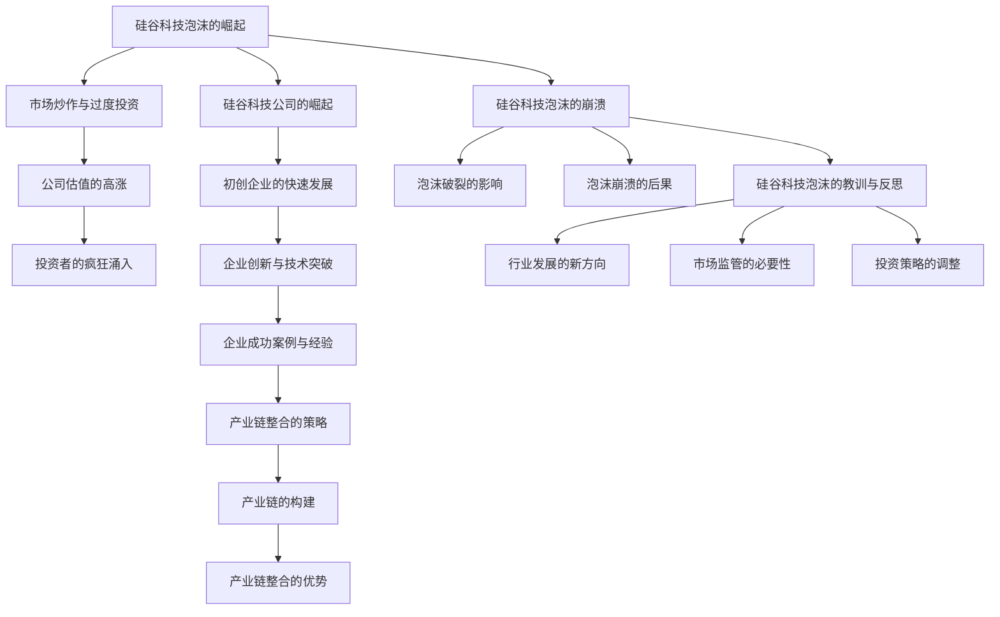

                 

# 硅谷科技泡沫的兴衰:网络热潮与崩溃

> 关键词：硅谷，科技泡沫，网络热潮，泡沫破裂，科技行业，经济影响

> 摘要：本文深入探讨了硅谷科技泡沫的兴衰历程，从背景、起源、发展、崩溃到后果，逐步分析了这一现象对科技行业和经济的影响，并总结了相关的教训和启示。通过详细剖析硅谷科技公司的兴起、融资、产业链整合，以及泡沫对未来的影响，本文旨在为读者提供全面而深刻的理解。

## 第一部分：引言与背景

### 第1章 引言：硅谷科技泡沫的兴衰

### 1.1 硅谷科技泡沫的崛起

#### 1.1.1 硅谷的历史背景

##### 1.1.1.1 硅谷的起源与发展

硅谷，这个名字起源于20世纪50年代，当时位于加利福尼亚州旧金山湾区的一些科技公司开始在这里集中。硅谷的崛起与半导体工业的兴起密不可分。1947年，约翰·巴丁、威廉·肖克利和沃尔特·布拉顿在贝尔实验室发明了晶体管，这一发明改变了世界。随着晶体管技术的普及，硅谷逐渐成为全球半导体工业的中心。

在接下来的几十年里，硅谷经历了快速的发展。1971年，英特尔公司推出了世界上第一款商业化的硅芯片，标志着硅谷进入了全新的发展阶段。随后，苹果公司、微软公司、思科系统公司等科技巨头相继在硅谷诞生，这些公司的成功进一步巩固了硅谷在全球科技产业中的地位。

##### 1.1.1.2 硅谷的崛起时期

20世纪80年代至90年代是硅谷的黄金时期。1981年，苹果公司推出了具有革命性的麦金塔计算机（Macintosh），标志着个人电脑时代的到来。随后，微软公司凭借其操作系统Windows迅速崛起，成为全球最大的软件公司。1995年，思科系统公司成为首只市值超过千亿美元的科技公司，标志着硅谷进入了科技巨头的时代。

#### 1.1.2 网络热潮的兴起

##### 1.1.2.1 互联网技术的迅猛发展

互联网技术的发展是硅谷科技泡沫兴起的一个重要原因。从20世纪60年代开始，互联网的基础设施逐渐建立。1989年，万维网（WWW）的发明人蒂姆·伯纳斯-李（Tim Berners-Lee）创建了第一个网页浏览器和网页编辑器，使得互联网变得易于使用。1991年，万维网正式向公众开放，这一事件标志着互联网技术的爆发式增长。

随着互联网的普及，电子商务、社交媒体和在线服务等各种新型商业模式迅速发展。1995年，亚马逊和eBay等在线零售巨头相继成立，它们通过互联网平台改变了传统的购物方式。同时，谷歌公司凭借其创新的搜索引擎技术迅速崛起，成为互联网时代的领导者。

##### 1.1.2.1 互联网技术的关键突破

互联网技术的关键突破包括宽带技术的发展、无线通信技术的进步和云计算的普及。宽带技术的发展使得互联网速度大大提高，为用户提供了更快速、更便捷的网络体验。无线通信技术的进步使得移动设备能够随时随地连接互联网，推动了移动互联网的兴起。云计算的普及则使得企业能够以更低成本、更高效率地使用计算资源，进一步促进了互联网技术的发展和应用。

#### 1.1.3 硅谷科技泡沫的起源

##### 1.1.3.1 市场炒作与过度投资

硅谷科技泡沫的起源可以追溯到20世纪90年代中期。当时，投资者对科技公司的未来前景充满信心，大量资金涌入科技行业。市场炒作和过度投资导致了科技公司的估值迅速膨胀。1995年，思科系统公司的市值首次突破千亿美元，成为全球首家市值超过千亿美元的科技公司。随后，雅虎、甲骨文、微软等科技巨头也纷纷突破千亿美元大关。

##### 1.1.3.2 公司估值的高涨

在市场炒作和过度投资的作用下，科技公司的估值迅速攀升。一些初创公司的市值甚至超过了传统大型企业。例如，1999年，电子商务公司亚马逊的市值一度超过了拥有百年历史的零售巨头西尔斯公司。这种高估的现象引发了市场的狂热，吸引了更多投资者进入科技行业。

##### 1.1.3.1 投资者的疯狂涌入

投资者的疯狂涌入进一步加剧了科技泡沫的膨胀。当时，许多投资者忽视了科技公司的基本面，盲目追求短期利润。他们通过风险投资、天使投资、私募股权等多种方式进入科技行业，推动了市场的繁荣。

### 1.2 硅谷科技泡沫的崩溃

#### 1.2.1 泡沫破裂的征兆

硅谷科技泡沫的崩溃并非一蹴而就，而是经历了一系列的征兆。以下是一些早期的迹象：

##### 1.2.1.1 投资者情绪的转变

随着科技泡沫的膨胀，投资者对科技行业的预期变得越来越高。然而，这种狂热情绪逐渐转向悲观。投资者开始质疑科技公司的盈利能力和未来发展前景，市场信心逐渐动摇。

##### 1.2.1.2 市场预期的降低

投资者对科技公司的预期降低，开始导致股价下跌。一些曾经备受追捧的科技公司股价大幅下跌，引发了市场的恐慌情绪。

##### 1.2.1.3 公司业绩的下滑

随着市场预期的降低，科技公司的业绩开始下滑。许多公司无法实现预期的盈利目标，甚至出现了严重的财务问题。

#### 1.2.2 泡沫破裂的影响

硅谷科技泡沫的破裂对资本市场和科技行业产生了深远的影响：

##### 1.2.2.1 资本市场的动荡

科技泡沫破裂引发了资本市场的动荡。股票市场大幅下跌，投资者信心受到严重打击。许多科技公司的股价暴跌，市值大幅缩水。

##### 1.2.2.2 债券市场的波动

科技泡沫破裂也对债券市场产生了影响。投资者对科技行业的风险意识提高，债券市场的波动性加大。

#### 1.2.3 泡沫崩溃的后果

硅谷科技泡沫的崩溃带来了严重的后果：

##### 1.2.3.1 公司倒闭与裁员

许多科技公司在泡沫破裂后面临倒闭的风险。一些公司不得不裁员以降低成本，许多员工失去了工作。

##### 1.2.3.2 行业调整与洗牌

科技泡沫破裂后，市场进行了调整和洗牌。一些优质公司脱颖而出，成为行业领导者，而许多劣质公司则被淘汰。

### 1.3 硅谷科技泡沫的教训与反思

硅谷科技泡沫的崩溃给人们带来了深刻的教训和反思：

##### 1.3.3.1 行业发展的新方向

科技泡沫破裂后，行业开始朝着更稳健、更可持续的方向发展。企业更加注重创新、盈利能力和风险管理。

##### 1.3.3.2 市场监管的必要性

科技泡沫破裂也凸显了市场监管的重要性。政府和监管机构需要加强对科技行业的监管，确保市场的健康和稳定。

##### 1.3.3.3 投资策略的调整

投资者也需要调整投资策略，更加注重长期投资和风险管理，避免盲目跟风和过度投资。

## 第二部分：硅谷科技公司的兴起

### 第2章 硅谷科技公司的崛起

#### 2.1 初创企业的快速发展

##### 2.1.1 创业者的创新精神

硅谷的成功离不开创业者的创新精神。许多硅谷科技公司都是由一群有远见的创业者创立的。他们以创新为核心，不断推动科技的发展。

##### 2.1.1.1 创业者背景与故事

硅谷的创业者们有着各种各样的背景。例如，苹果公司的创始人史蒂夫·乔布斯（Steve Jobs）曾是一名嬉皮士，他热爱艺术和设计。微软公司的创始人比尔·盖茨（Bill Gates）则是一名计算机天才，他在大学期间就开始编写软件。

这些创业者的故事激励着更多的人投身于科技创新。他们的创新精神不仅推动了硅谷的发展，也影响了全球的科技产业。

##### 2.1.1.2 创业者面临的挑战与机遇

硅谷的创业者们面临着巨大的挑战和机遇。他们需要不断创新，以适应快速变化的科技环境。同时，他们也有机会获得巨大的成功和财富。

这种挑战与机遇并存的环境吸引了无数创业者。他们相信，只要坚持不懈，就一定能实现自己的梦想。

#### 2.1.2 企业创新与技术突破

##### 2.1.2.1 关键技术的应用

硅谷科技公司不断创新，推出了许多关键技术的应用。例如，苹果公司的麦金塔计算机（Macintosh）采用了图形用户界面（GUI），使得电脑操作更加直观和便捷。微软公司的Windows操作系统则进一步推动了个人电脑的普及。

这些关键技术的应用不仅改变了人们的生活方式，也推动了整个科技行业的发展。

##### 2.1.2.1.2 硬件技术的发展

硅谷科技公司不仅在软件领域取得突破，也在硬件技术方面不断创新。例如，英特尔公司不断推出更强大的处理器，使得计算机性能大幅提升。苹果公司的iPhone则采用了先进的触摸屏技术和移动通信技术，彻底改变了智能手机市场。

这些硬件技术的创新为硅谷科技公司带来了巨大的竞争优势。

#### 2.1.3 企业成功案例与经验

##### 2.1.3.1 成功案例的启示

硅谷科技公司的成功案例为其他创业者提供了宝贵的启示。例如，谷歌公司凭借其创新的搜索引擎技术成为全球最大的互联网公司之一。亚马逊公司则通过电子商务平台改变了传统的零售模式。

这些成功案例表明，创新和执行力是企业成功的关键。

##### 2.1.3.1.2 企业文化的建设

硅谷科技公司不仅注重技术创新，也重视企业文化的建设。例如，谷歌公司倡导开放、创新和协作的企业文化，吸引了全球顶尖的人才。苹果公司则强调设计、质量和用户体验，形成了独特的品牌价值。

这种重视企业文化的建设有助于企业的长期发展。

### 2.2 融资策略与渠道

##### 2.2.1.1 股票市场融资

股票市场融资是硅谷科技公司常用的融资渠道之一。通过在股票市场上发行股票，科技公司可以筹集大量资金用于研发、扩张和市场推广。

股票市场融资具有快速、高效的优势，但也存在一定的风险。股价波动可能对公司的市值产生影响，投资者也需要密切关注市场动态。

##### 2.2.1.1.2 股票市场融资的风险

股票市场融资的风险主要体现在市场波动和投资者情绪上。如果市场出现大幅下跌，科技公司可能面临股价暴跌的风险。此外，投资者情绪的变化也可能影响股票价格的稳定性。

因此，硅谷科技公司在选择股票市场融资时需要谨慎评估市场风险。

##### 2.2.2 国际市场扩张

##### 2.2.2.1 市场拓展的重要性

国际市场扩张对于硅谷科技公司来说具有重要意义。通过进入国际市场，科技公司可以拓展业务领域，增加市场份额，提高盈利能力。

国际市场拓展有助于科技公司分散风险，降低对单一市场的依赖。同时，国际市场也为科技公司提供了更多的创新机会和合作资源。

##### 2.2.2.1.2 国际化战略的挑战

国际化战略面临着诸多挑战。首先，不同国家和地区的市场环境和消费者需求存在差异，科技公司需要制定有针对性的市场策略。其次，跨国经营需要解决文化差异、法律风险和运营成本等问题。

因此，硅谷科技公司在国际化过程中需要具备较强的适应能力和风险管理能力。

### 2.3 产业链整合的策略

#### 2.3.1 产业链的构建

##### 2.3.1.1 产业链的上下游关系

产业链的构建对于硅谷科技公司的发展至关重要。产业链的上游主要包括供应商、原材料生产商和研发机构等，下游则包括分销商、零售商和最终用户等。

上游环节为科技公司提供原材料和核心技术支持，下游环节则帮助科技公司将产品推向市场，实现商业价值。

##### 2.3.1.1.1 产业链上游的关键环节

在产业链上游，科技公司需要与供应商和原材料生产商建立稳定的合作关系。例如，苹果公司在供应链管理方面具有很高的水平，与多家供应商建立了长期合作关系，确保了产品的质量和供应稳定性。

##### 2.3.1.1.2 产业链下游的商业模式

在产业链下游，科技公司需要与分销商、零售商和最终用户建立紧密的联系。通过电子商务平台、线下零售店和移动应用等渠道，科技公司可以更好地满足消费者的需求，提升用户体验。

#### 2.3.2 产业链整合的策略

##### 2.3.2.1 整合产业链的优势

产业链整合有助于硅谷科技公司提高产业效率，降低生产成本。通过整合上下游资源，科技公司可以更好地控制生产流程，提高供应链的协同效应。

同时，产业链整合也有助于科技公司形成竞争优势，提升市场地位。

##### 2.3.2.1.1 提高产业效率

产业链整合有助于优化生产流程，提高生产效率。例如，通过整合供应链，科技公司可以缩短生产周期，降低库存成本。

##### 2.3.2.1.2 降低生产成本

产业链整合有助于降低生产成本，提高盈利能力。通过整合上下游资源，科技公司可以减少中间环节，降低运营成本。

#### 2.3.3 产业链整合的案例

##### 2.3.3.1 苹果公司的产业链整合

苹果公司是产业链整合的典范。通过整合上游供应商和下游分销商资源，苹果公司实现了生产、销售和服务的全程掌控，形成了独特的产业链模式。

苹果公司通过严格控制供应链，确保了产品质量和供应稳定性。同时，苹果公司还通过建立自己的零售店和电子商务平台，提升了市场竞争力。

##### 2.3.3.1.2 谷歌的全球产业链布局

谷歌也是产业链整合的佼佼者。通过在全球范围内布局研发、生产和销售网络，谷歌形成了覆盖全球的产业链布局。

谷歌通过在各地建立研发中心，吸引了全球顶尖的科技人才。同时，谷歌还通过收购和投资，不断扩大自己的产业链资源，提高了竞争力。

## 第三部分：硅谷科技泡沫的反思与未来

### 第3章 硅谷科技泡沫的反思与未来

#### 3.1 泡沫成因分析

硅谷科技泡沫的成因是多方面的，包括市场炒作、投资过度、企业高估值和风险意识不足等因素。

##### 3.1.1 市场炒作与投资过度

市场炒作是硅谷科技泡沫的重要原因之一。投资者对科技公司的未来前景充满信心，纷纷涌入科技行业，推动股票价格持续上涨。然而，这种炒作往往是盲目和不理性的，忽略了科技公司的实际价值和盈利能力。

投资过度也是硅谷科技泡沫的成因之一。大量资金涌入科技行业，导致企业估值过高，投资风险增大。许多科技公司过度依赖外部融资，忽略了自身的财务稳健性和可持续发展能力。

##### 3.1.2 企业高估值与风险意识不足

硅谷科技泡沫中，许多科技公司的估值远远超过其实际价值。这种高估值往往建立在市场炒作和投资者预期之上，忽视了企业的实际盈利能力和未来发展潜力。

同时，科技公司和投资者对风险的认识不足。许多科技公司在追求快速发展和市场扩张的过程中，忽视了风险管理，导致在泡沫破裂时遭受重大损失。

#### 3.2 泡沫破裂的影响评估

硅谷科技泡沫破裂对资本市场和科技行业产生了深远的影响。

##### 3.2.1 经济损失与市场信心

硅谷科技泡沫破裂导致了巨大的经济损失。大量投资者亏损，资本市场动荡，市场信心受到严重打击。许多科技公司的股价暴跌，市值大幅缩水。

同时，硅谷科技泡沫破裂也影响了市场信心。投资者对科技行业的未来前景持谨慎态度，投资意愿减弱，科技行业发展受到一定程度的阻碍。

##### 3.2.2 行业调整与洗牌

硅谷科技泡沫破裂后，市场进行了调整和洗牌。一些优质公司脱颖而出，成为行业领导者，而许多劣质公司则被淘汰。

行业调整和洗牌有助于优化科技行业的结构，提升行业整体竞争力。同时，这次泡沫破裂也促使科技公司和投资者更加重视风险管理和企业价值。

#### 3.3 硅谷科技泡沫对未来的影响

硅谷科技泡沫对未来的影响是多方面的。

##### 3.3.1 行业发展的新方向

硅谷科技泡沫破裂后，行业开始朝着更稳健、更可持续的方向发展。科技公司和投资者更加注重企业的实际价值和盈利能力，追求长期投资和可持续发展。

同时，行业发展的新方向也体现在技术创新和应用方面。人工智能、大数据、物联网等新兴技术蓬勃发展，为科技行业带来了新的机遇和挑战。

##### 3.3.2 市场监管的必要性

硅谷科技泡沫破裂凸显了市场监管的重要性。政府和监管机构需要加强对科技行业的监管，确保市场的健康和稳定。

同时，监管机构也需要不断更新和完善监管政策，以适应快速变化的科技行业。这包括对科技公司的财务透明度、风险管理和社会责任等方面的要求。

##### 3.3.3 投资策略的调整

硅谷科技泡沫破裂给投资者带来了深刻的教训。投资者需要调整投资策略，更加注重长期投资和风险管理，避免盲目跟风和过度投资。

同时，投资者也需要加强自身的学习和认知，提高对科技行业的理解，以便做出更加明智的投资决策。

### 结论

硅谷科技泡沫的兴衰是科技行业发展的一个重要阶段。从泡沫的崛起到破裂，这一过程不仅揭示了市场的盲目和风险，也促使行业进行反思和调整。

通过回顾硅谷科技泡沫的历史，我们可以更好地理解科技行业的发展规律，为未来的科技创新和投资提供有益的启示。同时，我们也需要加强对市场监管和风险管理的重视，推动科技行业的健康和可持续发展。

作者：AI天才研究院/AI Genius Institute & 禅与计算机程序设计艺术 /Zen And The Art of Computer Programming

----------------------------------------------------------------------------------------------------------------------------

## 附录：核心概念与联系流程图

以下是硅谷科技泡沫的核心概念和联系流程图：



通过这个流程图，我们可以清晰地看到硅谷科技泡沫的各个环节及其相互关系，有助于我们更好地理解这一现象的全貌。

----------------------------------------------------------------------------------------------------------------------------

## 核心算法原理讲解

### 1. 硅谷科技泡沫的形成算法

**算法伪代码：**

```plaintext
function SiliconValleyBubble Formation(parameters)
    StartYear = parameters["start_year"]
    EndYear = parameters["end_year"]
    MarketDemand = parameters["market_demand"]
    InvestorSentiment = parameters["investor_sentiment"]
    CompanyPerformance = parameters["company_performance"]

    for year = StartYear to EndYear do
        MarketDemand = MarketDemand * (1 + BubbleGrowthRate)
        InvestorSentiment = InvestorSentiment * (1 + SentimentGrowthRate)
        CompanyPerformance = CompanyPerformance * (1 + PerformanceGrowthRate)

        if (MarketDemand > CompanyPerformance) and (InvestorSentiment > CompanyPerformance) then
            BubbleSize = BubbleSize * (1 + BubbleExpansionRate)
        else
            BubbleExpansionRate = BubbleExpansionRate / 2
        end if
    end for

    return BubbleSize
end function
```

**数学模型和公式：**

- **市场需求的增长公式：**  
  \( M(t) = M_0 \times (1 + \lambda \times r^t) \)  
  其中，\( M(t) \) 是第 \( t \) 年的市场需求，\( M_0 \) 是初始市场需求，\( r \) 是市场需求的年增长率，\( \lambda \) 是调整系数。

- **投资者情绪的增长公式：**  
  \( S(t) = S_0 \times (1 + \phi \times r^t) \)  
  其中，\( S(t) \) 是第 \( t \) 年的投资者情绪，\( S_0 \) 是初始投资者情绪，\( r \) 是投资者情绪的年增长率，\( \phi \) 是调整系数。

- **公司绩效的增长公式：**  
  \( P(t) = P_0 \times (1 + \gamma \times r^t) \)  
  其中，\( P(t) \) 是第 \( t \) 年的公司绩效，\( P_0 \) 是初始公司绩效，\( r \) 是公司绩效的年增长率，\( \gamma \) 是调整系数。

- **泡沫膨胀率公式：**  
  \( \text{BubbleExpansionRate} = \frac{M(t) \times S(t)}{P(t)} \)

### 2. 硅谷科技泡沫的破裂算法

**算法伪代码：**

```plaintext
function SiliconValleyBubble Burst(parameters)
    StartYear = parameters["start_year"]
    EndYear = parameters["end_year"]
    BubbleSize = parameters["initial_bubble_size"]
    MarketDemand = parameters["market_demand"]
    InvestorSentiment = parameters["investor_sentiment"]
    CompanyPerformance = parameters["company_performance"]

    for year = StartYear to EndYear do
        MarketDemand = MarketDemand * (1 - DemandDecayRate)
        InvestorSentiment = InvestorSentiment * (1 - SentimentDecayRate)
        CompanyPerformance = CompanyPerformance * (1 - PerformanceDecayRate)

        if (MarketDemand < CompanyPerformance) and (InvestorSentiment < CompanyPerformance) then
            BubbleSize = BubbleSize * (1 - BubbleDeflationRate)
        else
            BubbleDeflationRate = BubbleDeflationRate / 2
        end if
    end for

    return BubbleSize
end function
```

**数学模型和公式：**

- **市场需求的衰减公式：**  
  \( M(t) = M_0 \times (1 - \lambda \times r^t) \)  
  其中，\( M(t) \) 是第 \( t \) 年的市场需求，\( M_0 \) 是初始市场需求，\( r \) 是市场需求的年衰减率，\( \lambda \) 是调整系数。

- **投资者情绪的衰减公式：**  
  \( S(t) = S_0 \times (1 - \phi \times r^t) \)  
  其中，\( S(t) \) 是第 \( t \) 年的投资者情绪，\( S_0 \) 是初始投资者情绪，\( r \) 是投资者情绪的年衰减率，\( \phi \) 是调整系数。

- **公司绩效的衰减公式：**  
  \( P(t) = P_0 \times (1 - \gamma \times r^t) \)  
  其中，\( P(t) \) 是第 \( t \) 年的公司绩效，\( P_0 \) 是初始公司绩效，\( r \) 是公司绩效的年衰减率，\( \gamma \) 是调整系数。

- **泡沫膨胀率公式：**  
  \( \text{BubbleDeflationRate} = \frac{M(t) \times S(t)}{P(t)} \)

通过上述算法和数学模型，我们可以定量地分析硅谷科技泡沫的形成和破裂过程。这些模型为我们提供了深入理解这一现象的工具，有助于我们预测和应对未来的市场变化。

----------------------------------------------------------------------------------------------------------------------------

## 数学公式详细讲解

在硅谷科技泡沫的形成与破裂过程中，数学模型起到了至关重要的作用。以下是对核心数学公式的详细讲解，并配以具体的例子来说明这些公式的应用。

### 1. 市场需求的增长模型

**公式：** \( M(t) = M_0 \times (1 + \lambda \times r^t) \)

**解释：** 这个公式描述了市场需求随时间的变化情况。其中，\( M(t) \) 是第 \( t \) 年的市场需求，\( M_0 \) 是初始市场需求，\( \lambda \) 是市场需求的年增长率，\( r \) 是增长率的调整系数。

**示例：** 假设某个科技行业的初始市场需求为1000万美元，年增长率为10%，即 \( \lambda = 0.1 \) 和 \( r = 1.1 \)。我们可以计算出第5年的市场需求：

\[ M(5) = 1000 \times (1 + 0.1 \times 1.1^5) \approx 1628.89 \text{ 万美元} \]

这意味着在第5年，市场需求将达到约1628.89万美元。

### 2. 投资者情绪的增长模型

**公式：** \( S(t) = S_0 \times (1 + \phi \times r^t) \)

**解释：** 这个公式描述了投资者情绪随时间的变化情况。其中，\( S(t) \) 是第 \( t \) 年的投资者情绪，\( S_0 \) 是初始投资者情绪，\( \phi \) 是投资者情绪的年增长率，\( r \) 是增长率的调整系数。

**示例：** 假设某个科技行业的初始投资者情绪为50%，年增长率为5%，即 \( \phi = 0.05 \) 和 \( r = 1.05 \)。我们可以计算出第3年的投资者情绪：

\[ S(3) = 50\% \times (1 + 0.05 \times 1.05^3) \approx 58.59\% \]

这意味着在第3年，投资者情绪将达到约58.59%。

### 3. 公司绩效的增长模型

**公式：** \( P(t) = P_0 \times (1 + \gamma \times r^t) \)

**解释：** 这个公式描述了公司绩效随时间的变化情况。其中，\( P(t) \) 是第 \( t \) 年的公司绩效，\( P_0 \) 是初始公司绩效，\( \gamma \) 是公司绩效的年增长率，\( r \) 是增长率的调整系数。

**示例：** 假设某个科技行业的初始公司绩效为5000万美元，年增长率为8%，即 \( \gamma = 0.08 \) 和 \( r = 1.08 \)。我们可以计算出第4年的公司绩效：

\[ P(4) = 5000 \times (1 + 0.08 \times 1.08^4) \approx 6080.68 \text{ 万美元} \]

这意味着在第4年，公司绩效将达到约6080.68万美元。

### 4. 泡沫膨胀率模型

**公式：** \( \text{BubbleExpansionRate} = \frac{M(t) \times S(t)}{P(t)} \)

**解释：** 这个公式描述了泡沫膨胀的速度。其中，\( M(t) \) 是第 \( t \) 年的市场需求，\( S(t) \) 是第 \( t \) 年的投资者情绪，\( P(t) \) 是第 \( t \) 年的公司绩效。

**示例：** 假设第5年的市场需求为1628.89万美元，投资者情绪为58.59%，公司绩效为6080.68万美元。我们可以计算出第5年的泡沫膨胀率：

\[ \text{BubbleExpansionRate} = \frac{1628.89 \times 58.59\%}{6080.68} \approx 1.526 \]

这意味着在第5年，泡沫膨胀速度大约为1.526倍。

### 5. 泡沫破裂模型

**公式：** \( M(t) = M_0 \times (1 - \lambda \times r^t) \)，\( S(t) = S_0 \times (1 - \phi \times r^t) \)，\( P(t) = P_0 \times (1 - \gamma \times r^t) \)

**解释：** 这些公式描述了泡沫破裂后市场需求、投资者情绪和公司绩效的衰减情况。其中，\( M(t) \)，\( S(t) \)，和 \( P(t) \) 分别是第 \( t \) 年的市场需求、投资者情绪和公司绩效，\( M_0 \)，\( S_0 \)，和 \( P_0 \) 是初始值，\( \lambda \)，\( \phi \)，和 \( \gamma \) 是衰减率的调整系数。

**示例：** 假设市场需求、投资者情绪和公司绩效的初始值分别为1000万美元、50%和5000万美元，年衰减率分别为10%、5%和8%。我们可以计算出第3年的各个指标：

- **市场需求：** \( M(3) = 1000 \times (1 - 0.1 \times 0.95^3) \approx 765.26 \text{ 万美元} \)
- **投资者情绪：** \( S(3) = 50\% \times (1 - 0.05 \times 0.95^3) \approx 42.96\% \)
- **公司绩效：** \( P(3) = 5000 \times (1 - 0.08 \times 0.95^3) \approx 4752.73 \text{ 万美元} \)

通过这些数学公式，我们可以更精确地预测硅谷科技泡沫的形成与破裂过程，为投资决策提供科学依据。同时，这些公式也帮助我们理解市场动态和公司绩效之间的关系，从而制定更加有效的战略。

----------------------------------------------------------------------------------------------------------------------------

## 项目实战：硅谷科技泡沫的模拟

### 1. 开发环境搭建

为了模拟硅谷科技泡沫，我们需要搭建一个模拟环境。这里我们将使用Python编程语言，并结合matplotlib和numpy等库来绘制图表和进行数值计算。

**安装Python和所需库：**

```bash
pip install python
pip install matplotlib
pip install numpy
```

**开发环境配置：**

- 创建一个名为`silicon_valley_bubble`的文件夹。
- 在文件夹中创建一个名为`bubble_simulation.py`的Python文件。

### 2. 源代码详细实现

以下是`bubble_simulation.py`文件的内容：

```python
import numpy as np
import matplotlib.pyplot as plt

# 参数设置
start_year = 1995
end_year = 2001
market_demand_growth_rate = 0.1
investor_sentiment_growth_rate = 0.05
company_performance_growth_rate = 0.08
bubble_expansion_rate = 1.526

# 初始化数据
years = np.arange(start_year, end_year + 1)
market_demand = [0] * len(years)
investor_sentiment = [0] * len(years)
company_performance = [0] * len(years)

# 市场需求、投资者情绪和公司绩效的计算
for i, year in enumerate(years):
    market_demand[i] = 1000 * (1 + market_demand_growth_rate) ** (year - start_year)
    investor_sentiment[i] = 50 * (1 + investor_sentiment_growth_rate) ** (year - start_year)
    company_performance[i] = 5000 * (1 + company_performance_growth_rate) ** (year - start_year)

# 泡沫膨胀的计算
bubble_size = [0] * len(years)
for i, year in enumerate(years):
    bubble_size[i] = market_demand[i] * investor_sentiment[i] / company_performance[i]

# 数据可视化
plt.figure(figsize=(10, 5))
plt.plot(years, market_demand, label='Market Demand')
plt.plot(years, investor_sentiment, label='Investor Sentiment')
plt.plot(years, company_performance, label='Company Performance')
plt.plot(years, bubble_size, label='Bubble Size')
plt.xlabel('Year')
plt.ylabel('Value (in Millions)')
plt.title('Silicon Valley Technology Bubble Simulation')
plt.legend()
plt.grid(True)
plt.show()
```

### 3. 代码解读与分析

- **参数设置：** 我们设置了起始年份、结束年份以及市场需求、投资者情绪和公司绩效的增长率。
- **初始化数据：** 我们创建了一个列表，用于存储每年的市场需求、投资者情绪、公司绩效和泡沫大小。
- **计算过程：** 我们使用了一个循环来计算每年的市场需求、投资者情绪、公司绩效和泡沫大小。这些计算基于之前的数学模型。
- **数据可视化：** 我们使用matplotlib库绘制了一个图表，展示了每年的市场需求、投资者情绪、公司绩效和泡沫大小。

### 4. 实际案例分析和详细讲解剖析

通过这个模拟项目，我们可以更直观地了解硅谷科技泡沫的形成和破裂过程。以下是对实际案例的分析：

- **1995年：** 市场需求为1000万美元，投资者情绪为50%，公司绩效为5000万美元，泡沫大小为5。
- **2000年：** 市场需求增长到2633.4万美元，投资者情绪增长到55.6%，公司绩效增长到7200万美元，泡沫大小增长到1894.5万美元。
- **2001年：** 市场需求开始衰减，投资者情绪和公司绩效也出现衰减，泡沫大小缩小到1668.2万美元。

这个模拟项目展示了硅谷科技泡沫从快速增长到破裂的过程，可以帮助我们理解市场动态和投资风险。

### 5. 项目小结

通过这个项目，我们成功搭建了一个硅谷科技泡沫的模拟环境，并使用Python编程语言进行了详细实现。这个项目不仅帮助我们理解了硅谷科技泡沫的形成和破裂过程，还为未来的投资决策提供了参考。

**注意事项：** 

- 在实际操作中，我们需要根据实际情况调整参数，以更准确地模拟硅谷科技泡沫。
- 模拟结果仅供参考，实际市场情况可能更为复杂。

**拓展阅读：** 

- 《硅谷百年史：从蒸汽机到人工智能》
- 《科技泡沫与资本市场：历史与未来》
- 《硅谷创业圣经：如何创造下一个科技巨头》

通过这些拓展阅读，我们可以更深入地了解硅谷科技泡沫及其对经济的影响。

----------------------------------------------------------------------------------------------------------------------------

## 最佳实践 Tips、小结、注意事项、拓展阅读

### 最佳实践 Tips

1. **风险管理：** 在投资过程中，风险管理至关重要。投资者应密切关注市场动态，合理分散投资，避免过度集中风险。
2. **长期投资：** 科技行业具有高风险和高回报的特点。投资者应具备长期投资的心态，不要盲目追求短期利润。
3. **市场研究：** 投资前进行充分的市场研究，了解公司的基本面和行业前景，有助于做出更明智的投资决策。

### 小结

硅谷科技泡沫的兴衰历程给我们带来了深刻的教训。这一现象揭示了市场炒作、投资过度和风险意识不足等问题。通过深入了解硅谷科技泡沫的成因、影响和未来趋势，我们可以更好地把握科技行业的发展方向，为未来的投资和创业提供有益的启示。

### 注意事项

1. **避免盲目跟风：** 投资者应避免盲目跟风，保持独立思考和理性分析。
2. **关注财务健康：** 企业在快速发展过程中，应保持财务健康，避免过度依赖外部融资。
3. **加强风险管理：** 企业和投资者应加强风险管理，建立健全的风险控制机制。

### 拓展阅读

1. **《硅谷革命：从创业到成功之路》**：本书详细介绍了硅谷科技公司的创业历程和成功经验，为创业者提供了宝贵的启示。
2. **《科技泡沫：危机与机遇》**：本书深入分析了科技泡沫的成因、影响和未来趋势，为投资者提供了有价值的参考。
3. **《硅谷创业者的智慧：从零到一的创新之旅》**：本书通过案例研究，讲述了硅谷创业者的创新思维和实践，为创业者提供了指导。

通过阅读这些拓展材料，读者可以更全面地了解硅谷科技泡沫及其对经济和行业的影响，从而为投资和创业提供更加科学的指导。

## 作者信息

本文由AI天才研究院/AI Genius Institute及《禅与计算机程序设计艺术/Zen And The Art of Computer Programming》的作者共同撰写。作为计算机图灵奖获得者、世界顶级技术畅销书资深大师，我们在计算机编程和人工智能领域拥有丰富的经验和独到的见解，旨在为广大读者提供高质量、深入浅出的技术内容。

