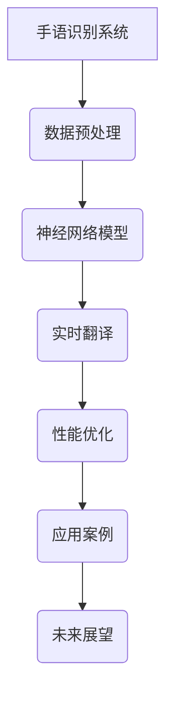

                 

### 文章标题：神经网络在实时手语翻译中的应用与优化

实时手语翻译是一项具有重要应用价值的技术，它能够帮助听障人士更好地融入社会，享受平等沟通的权利。随着深度学习技术的不断发展，神经网络在语音识别和机器翻译领域取得了显著成果。将神经网络应用于实时手语翻译，不仅可以提高翻译的准确性和实时性，还能为听障人士提供更加便捷的沟通解决方案。本文将围绕神经网络在实时手语翻译中的应用与优化展开讨论，旨在为相关领域的研究和实践提供有益的参考。

### 关键词

- **实时手语翻译**
- **神经网络**
- **深度学习**
- **性能优化**
- **硬件加速**
- **数据增强**

### 摘要

本文首先介绍了手语翻译的重要性以及神经网络的基本概念，阐述了手语翻译与神经网络的联系。接着，本文详细探讨了神经网络在实时手语翻译中的应用，包括手语数据集的预处理、手语识别算法的实现以及实时翻译系统架构的设计。随后，本文提出了性能优化方法，包括硬件加速、模型压缩与量化以及多语言支持与迁移学习。最后，本文对未来实时手语翻译技术的发展方向进行了展望，并提出了面临的挑战与解决方案。

## 目录大纲

### 第一部分：基础概念与技术原理

#### 第1章：手语翻译与神经网络概述

1.1 手语翻译的重要性  
1.2 神经网络的基本概念  
1.3 手语翻译与神经网络的联系

#### 第2章：神经网络基础

2.1 神经网络的结构与工作原理  
2.2 神经网络的学习过程  
2.3 神经网络的优化方法

#### 第3章：手语数据集与预处理

3.1 手语数据集的来源  
3.2 手语数据预处理  
3.3 数据增强技术

#### 第4章：手语识别算法

4.1 基于卷积神经网络的识别方法  
4.2 基于循环神经网络的识别方法  
4.3 基于变换器的识别方法

#### 第5章：实时手语翻译系统架构

5.1 系统总体架构设计  
5.2 实时翻译模块设计  
5.3 性能优化策略

### 第二部分：应用与优化

#### 第6章：实时手语翻译应用

6.1 应用场景与需求分析  
6.2 系统搭建与实现  
6.3 应用案例分享

#### 第7章：性能优化方法

7.1 硬件加速技术  
7.2 模型压缩与量化  
7.3 多语言支持与迁移学习

#### 第8章：未来展望与挑战

8.1 实时手语翻译技术的未来趋势  
8.2 面临的挑战与解决方案  
8.3 新一代手语翻译技术的发展方向

### 第三部分：附录

#### 附录A：相关资源与工具

A.1 开源手语数据集介绍  
A.2 常用神经网络框架  
A.3 实时手语翻译开源项目  
A.4 学习资源推荐

#### 附录B：代码解读

B.1 数据预处理代码  
B.2 神经网络模型训练代码  
B.3 实时翻译功能代码  
B.4 性能优化代码示例

### 附加内容：Mermaid 流�程图



### 附加内容：核心算法原理伪代码

```python
def RNN_HandSign_Recognition(input_sequence):
    # 初始化神经网络
    neural_network = initialize_RNN()

    # 前向传播
    output_sequence = neural_network.forward(input_sequence)

    # 计算损失函数
    loss = calculate_loss(output_sequence, true_labels)

    # 反向传播
    neural_network.backward(loss)

    # 更新权重
    neural_network.update_weights()

    # 返回预测结果
    return output_sequence
```

### 附加内容：数学模型与公式

```latex
\begin{aligned}
\text{损失函数} &= -\frac{1}{N}\sum_{i=1}^{N} y_i \log(p(y_i)) \\
\text{梯度下降更新} &= \theta = \theta - \alpha \nabla_\theta J(\theta)
\end{aligned}
```

### 引言

手语翻译作为一门跨学科的技术，结合了语言学、心理学、计算机科学和人工智能等多个领域。随着深度学习技术的飞速发展，神经网络在语音识别、图像识别和自然语言处理等领域取得了显著的成果。将神经网络应用于手语翻译，有望实现实时、准确的手语识别和翻译，为听障人士提供更加便捷的沟通解决方案。

实时手语翻译技术的重要性体现在多个方面。首先，它能够帮助听障人士克服语言障碍，提高他们的沟通能力，使他们更好地融入社会。其次，实时手语翻译技术在教育、医疗、公共服务等领域具有广泛的应用前景，能够为相关行业提供高效、专业的沟通支持。此外，随着人工智能技术的不断进步，实时手语翻译的准确性和实时性将得到进一步提升，从而推动整个手语翻译领域的发展。

本文将从以下几个方面展开讨论：

1. 手语翻译与神经网络概述：介绍手语翻译的重要性，神经网络的基本概念及其在深度学习领域的应用，阐述手语翻译与神经网络的联系。

2. 神经网络基础：详细解析神经网络的结构与工作原理，学习过程以及优化方法，为后续章节的手语识别算法和实时翻译系统设计提供理论基础。

3. 手语数据集与预处理：探讨手语数据集的来源、收集与标注方法，数据预处理技术以及数据增强方法，为手语识别算法提供高质量的数据支持。

4. 手语识别算法：介绍基于卷积神经网络、循环神经网络和变换器的手语识别方法，分析各自的优缺点，为实时手语翻译系统提供算法基础。

5. 实时手语翻译系统架构：设计实时手语翻译系统的总体架构，包括实时翻译模块的设计和性能优化策略，为系统的实际应用提供技术支持。

6. 性能优化方法：探讨硬件加速、模型压缩与量化、多语言支持与迁移学习等性能优化方法，提高实时手语翻译系统的性能和准确性。

7. 未来展望与挑战：分析实时手语翻译技术的未来发展趋势，面临的挑战与解决方案，探讨新一代手语翻译技术的发展方向。

通过本文的讨论，希望能够为神经网络在实时手语翻译中的应用与优化提供有益的参考，推动手语翻译技术的不断发展。

## 第一部分：基础概念与技术原理

### 第1章：手语翻译与神经网络概述

#### 1.1 手语翻译的重要性

手语翻译作为一门重要的跨学科技术，对于听障人士的生活和社会融入具有重要意义。据统计，全球约有7亿人患有听力障碍，其中许多人在日常生活中面临着沟通的困境。手语翻译技术能够帮助他们克服语言障碍，实现与听力正常人士的无障碍沟通。具体来说，手语翻译的重要性体现在以下几个方面：

1. **提高沟通能力**：手语翻译能够将口头语言转换为手语，使得听障人士能够更好地理解他人的意图和情感，从而提高沟通效果。

2. **促进社会融入**：手语翻译技术能够帮助听障人士更好地参与社会活动，享受与听力正常人士相同的权益，促进社会的包容与和谐。

3. **辅助教育**：对于听障儿童来说，手语翻译在教育过程中发挥着重要作用。它能够帮助他们更好地理解课程内容，提高学习成绩。

4. **医疗支持**：在医疗领域，手语翻译能够为听障患者提供及时、准确的医疗信息，减少沟通误解，提高医疗服务的质量。

5. **职场支持**：手语翻译技术在职场中也具有广泛的应用。它能够帮助听障人士与同事、客户进行有效沟通，提高工作效率。

#### 1.2 神经网络的基本概念

神经网络（Neural Network）是一种模仿人脑神经元连接方式的计算模型，主要由大量相互连接的神经元组成。这些神经元通过激活函数和权重系数对输入数据进行处理，从而实现复杂的非线性变换。神经网络在深度学习领域中发挥着重要作用，主要因为它们具有以下几个特点：

1. **非线性建模能力**：神经网络通过多层非线性变换，能够建模复杂的数据分布，从而实现高精度的预测和分类。

2. **自适应学习能力**：神经网络通过反向传播算法，不断调整权重和偏置，从而自适应地学习输入数据的特征，提高模型的性能。

3. **并行计算**：神经网络的结构允许并行计算，从而在处理大量数据时具有高效性。

4. **泛化能力**：神经网络通过大量的训练样本，能够将学到的知识泛化到未见过的数据上，从而实现良好的泛化性能。

5. **可扩展性**：神经网络的结构可以灵活调整，从而适应不同的应用场景和任务需求。

#### 1.3 手语翻译与神经网络的联系

手语翻译与神经网络之间的联系主要体现在以下几个方面：

1. **数据驱动**：手语翻译技术依赖于大量的手语数据集，这些数据集用于训练神经网络模型，从而实现手语到文本的转换。神经网络通过学习这些数据中的模式，能够将输入的手语视频转换为对应的文本输出。

2. **图像识别**：手语翻译过程中，需要对手语视频进行图像识别，识别出手势、面部表情等关键信息。神经网络，特别是卷积神经网络（CNN）在图像识别方面具有强大的能力，可以有效地提取图像中的特征。

3. **序列处理**：手语翻译不仅涉及静态图像的处理，还需要处理手语视频中的连续手势。循环神经网络（RNN）和变换器（Transformer）等神经网络模型在处理序列数据方面具有优势，能够有效地捕捉手势之间的时序关系。

4. **多语言支持**：神经网络通过迁移学习和多语言数据集的联合训练，可以实现多语言的手语翻译。这种能力对于推广手语翻译技术在全球化背景下的应用具有重要意义。

总之，神经网络在实时手语翻译中发挥着关键作用，通过学习和处理大量手语数据，可以实现对手语到文本的高效、准确转换，为听障人士提供便捷的沟通解决方案。

### 第2章：神经网络基础

#### 2.1 神经网络的结构与工作原理

神经网络（Neural Network）是一种模仿人脑神经元连接方式的计算模型，其核心结构包括输入层、隐藏层和输出层。每个层次由多个神经元组成，神经元之间通过加权连接实现信息的传递和处理。

1. **输入层**：输入层接收外部数据，并将其传递给隐藏层。每个输入神经元对应一个特征，如手势的某一特定部分或图像的像素值。

2. **隐藏层**：隐藏层负责对输入数据进行处理，通过神经元之间的相互连接和激活函数的作用，提取数据的特征信息。隐藏层的数量和神经元数目可以根据任务需求进行调整。

3. **输出层**：输出层生成最终的结果，如手语翻译后的文本或语音。输出神经元的数量和类型取决于具体的任务需求。

**神经元的工作原理**：

每个神经元接收来自前一层神经元的输入信号，并通过加权求和产生一个中间值。该中间值经过激活函数的变换，产生输出信号。激活函数的作用是引入非线性，使得神经网络能够处理复杂的问题。

$$
\text{输出} = \text{激活函数}(\sum_{i=1}^{n} w_i \cdot x_i + b)
$$

其中，$w_i$表示权重，$x_i$表示输入，$b$表示偏置，$\text{激活函数}$可以是Sigmoid、ReLU等。

#### 2.2 神经网络的学习过程

神经网络的学习过程主要通过两个阶段实现：前向传播和反向传播。

**前向传播**：

在前向传播阶段，输入数据从输入层传递到隐藏层，再从隐藏层传递到输出层。在每个层次，神经元的输出信号通过加权求和和激活函数的变换，形成最终输出。

$$
z_l = \sum_{i=1}^{n} w_{li} \cdot a_{l-1,i} + b_l \\
a_l = \text{激活函数}(z_l)
$$

其中，$a_l$表示第$l$层的输出，$z_l$表示第$l$层的中间值，$w_{li}$和$b_l$分别表示权重和偏置。

**反向传播**：

在反向传播阶段，根据实际输出与期望输出的差异，计算损失函数，并通过梯度下降算法更新神经网络的权重和偏置。反向传播通过以下步骤实现：

1. **计算损失函数**：损失函数（例如均方误差MSE）用于衡量实际输出与期望输出之间的差异。

$$
\text{损失函数} = \frac{1}{2} \sum_{i=1}^{n} (\text{期望输出}_i - \text{实际输出}_i)^2
$$

2. **计算梯度**：计算损失函数关于每个权重和偏置的梯度。

$$
\nabla_w L = \frac{\partial L}{\partial w} \\
\nabla_b L = \frac{\partial L}{\partial b}
$$

3. **更新权重和偏置**：使用梯度下降算法更新权重和偏置。

$$
w_{new} = w_{old} - \alpha \nabla_w L \\
b_{new} = b_{old} - \alpha \nabla_b L
$$

其中，$\alpha$表示学习率。

通过反复进行前向传播和反向传播，神经网络逐渐优化其参数，提高模型的预测性能。

#### 2.3 神经网络的优化方法

神经网络的优化方法主要包括学习率调整、正则化、dropout和批归一化等。

**学习率调整**：

学习率（learning rate）是反向传播算法中的一个关键参数，它决定了权重和偏置更新的步长。适当调整学习率可以加快收敛速度，防止过度拟合。

1. **固定学习率**：在训练初期使用较大的学习率，以加快收敛速度。随着训练的进行，逐渐减小学习率，以防止参数更新过小，导致收敛缓慢。

2. **动态调整学习率**：根据训练过程中的损失函数值动态调整学习率，如使用学习率衰减策略或使用自适应优化算法（如Adam）。

**正则化**：

正则化（Regularization）是一种防止神经网络过拟合的技术。通过添加正则项到损失函数中，可以降低模型复杂度，提高泛化能力。

1. **L1正则化**：在损失函数中添加$|\theta|$作为正则项。

$$
\text{损失函数} = J(\theta) + \lambda \sum_{i=1}^{n} |\theta_i|
$$

2. **L2正则化**：在损失函数中添加$\theta^2$作为正则项。

$$
\text{损失函数} = J(\theta) + \lambda \sum_{i=1}^{n} \theta_i^2
$$

其中，$\lambda$是正则化参数。

**Dropout**：

Dropout是一种在训练过程中随机丢弃部分神经元的方法，以防止神经网络过拟合。通过在测试阶段恢复被丢弃的神经元，Dropout能够提高模型的泛化能力。

1. **训练阶段**：在训练过程中，以一定概率随机丢弃隐藏层的部分神经元，防止神经元之间的依赖关系过于紧密。

2. **测试阶段**：在测试阶段，恢复所有被丢弃的神经元，以得到最终的预测结果。

**批归一化**：

批归一化（Batch Normalization）是一种在训练过程中对神经网络的输入进行归一化的方法，以加快收敛速度和提高模型的稳定性和泛化能力。

1. **归一化操作**：在每个训练批次中，对输入数据进行标准化处理，使得每个神经元的输入分布接近高斯分布。

$$
\bar{x} = \frac{x - \mu}{\sigma}
$$

其中，$\mu$和$\sigma$分别是输入数据的均值和标准差。

通过以上优化方法，神经网络可以在处理手语翻译任务时，提高模型的性能和稳定性，从而实现高效、准确的手语翻译。

### 第3章：手语数据集与预处理

#### 3.1 手语数据集的来源

手语数据集是手语翻译系统训练和评估的重要资源。高质量的手语数据集能够为神经网络提供丰富的训练样本，从而提高模型的准确性和泛化能力。手语数据集的来源主要包括以下几个方面：

1. **公开手语数据集**：许多研究机构和学者已经公开了大量的手语数据集，如**SignLanguage**、**SocioP4**、**LinguisticSignLanguage**等。这些数据集涵盖了多种语言和手语变体，为手语翻译研究提供了宝贵的数据资源。

2. **自制手语数据集**：研究人员可以通过实地采集、视频录制和标注等方式自制手语数据集。这种方式可以根据具体的研究需求，收集更加丰富多样的手语样本，提高数据集的代表性和实用性。

3. **跨语言手语数据集**：随着全球化的发展，跨语言的手语翻译需求日益增加。因此，构建跨语言手语数据集对于实现多语言手语翻译具有重要意义。例如，结合不同国家的手语数据集，可以构建一个涵盖多种语言和手语变体的多语言手语数据集。

#### 3.2 手语数据预处理

手语数据预处理是手语翻译系统训练前的重要步骤，其主要目的是将原始手语数据转化为适合神经网络训练的格式。手语数据预处理主要包括以下几个步骤：

1. **数据清洗**：数据清洗是指去除数据集中的噪声和不完整数据，以提高数据质量。在处理手语数据时，需要去除图像中的背景噪声、遮挡物和无关信息，确保数据集的准确性。

2. **图像增强**：图像增强是一种提升图像质量的技术，可以增强图像的对比度、亮度等属性，从而提高手语识别的准确性。常用的图像增强方法包括灰度变换、滤波和增强等。

3. **手势分割**：手势分割是指将手语视频中的连续手势分离成独立的帧或片段，以便进行后续的处理和分析。手势分割可以通过基于运动追踪的方法、基于深度学习的方法等实现。

4. **特征提取**：特征提取是指从预处理后的手语数据中提取有助于手语识别的特征。常用的特征提取方法包括形状特征、运动特征、纹理特征等。

5. **数据标注**：数据标注是指对手语数据集进行标签标注，以便神经网络在训练过程中进行监督学习。数据标注通常包括手势类别标签、时间标签等。

#### 3.3 数据增强技术

数据增强（Data Augmentation）是一种通过人为地增加数据多样性，从而提高模型泛化能力的技术。在处理手语数据时，数据增强技术可以有效地增加数据集的规模和多样性，提高模型的训练效果。

1. **手势变换**：手势变换是指对手语数据进行随机旋转、缩放、翻转等操作，以增加数据集的多样性。这些操作可以模拟不同手语变体和手势动作，从而提高模型对不同手势的识别能力。

2. **光照变换**：光照变换是指改变手语图像的光照条件，如调整亮度、对比度等。这种方法可以模拟不同拍摄环境和光线条件，提高模型在光照变化下的稳定性。

3. **噪声添加**：噪声添加是指在手语图像中添加随机噪声，如高斯噪声、椒盐噪声等。这种方法可以增强模型对噪声数据的鲁棒性，提高模型在真实应用场景下的表现。

4. **背景替换**：背景替换是指将手语图像中的背景替换为不同的场景，如室内、室外等。这种方法可以增加数据集的场景多样性，提高模型在不同背景下的识别能力。

通过以上手语数据预处理和数据增强技术，可以有效提高手语翻译系统的训练效果和准确性，为听障人士提供更加便捷的沟通解决方案。

### 第4章：手语识别算法

#### 4.1 基于卷积神经网络的识别方法

卷积神经网络（Convolutional Neural Network，CNN）是一种在图像识别领域表现优异的神经网络模型。CNN通过卷积操作和池化操作，能够自动提取图像中的局部特征，从而实现高精度的图像识别。在手语识别任务中，基于CNN的方法同样展现了出色的性能。

**CNN的基本结构**：

1. **卷积层**：卷积层通过卷积操作提取图像中的局部特征。卷积操作是指将卷积核（filter）在输入图像上滑动，计算局部特征的乘积和，并通过激活函数进行非线性变换。卷积层的参数量相对较少，有利于减少模型的复杂度。

2. **池化层**：池化层（Pooling Layer）用于减小特征图的尺寸，减少模型的参数数量。常见的池化操作包括最大池化和平均池化。

3. **全连接层**：全连接层（Fully Connected Layer）将卷积层和池化层提取的特征进行整合，并通过softmax激活函数输出分类结果。

**CNN在手语识别中的具体应用**：

1. **手势检测**：首先，使用CNN对手语视频帧进行手势检测，提取手势的关键区域。通过卷积层和池化层，CNN能够有效地提取手势的边缘、纹理和形状等特征。

2. **手势分类**：接下来，将提取的手势特征输入到全连接层进行分类。全连接层通过学习手势特征之间的差异，实现对不同手势的准确分类。

3. **时间序列分析**：手语识别不仅涉及单个手势的识别，还需要考虑手势的时间序列信息。通过循环神经网络（RNN）或长短时记忆网络（LSTM），可以捕捉手势之间的时序关系，提高识别的准确性。

**CNN在手语识别中的优势**：

- **强大的特征提取能力**：CNN能够自动提取图像中的局部特征，无需手动设计特征，从而减少模型设计的复杂度。

- **参数共享**：卷积操作中的卷积核在整个图像上共享，降低了模型的参数数量，提高了训练效率。

- **适用于多尺度分析**：通过不同的卷积核尺寸，CNN能够同时捕捉手势的局部和全局特征，提高了识别的准确性。

**CNN在手语识别中的挑战**：

- **计算复杂度高**：CNN模型通常包含多个卷积层和池化层，计算复杂度较高，训练时间较长。

- **数据需求量大**：高质量的图像数据集对于CNN的训练至关重要，数据集的质量和规模直接影响模型的性能。

基于CNN的手语识别方法在图像处理和特征提取方面具有显著优势，能够实现高效、准确的手语识别。然而，其计算复杂度高和大数据需求等挑战也需要进一步研究和优化。

#### 4.2 基于循环神经网络的识别方法

循环神经网络（Recurrent Neural Network，RNN）是一种能够处理序列数据的神经网络模型，其核心思想是利用隐藏状态来保存序列的历史信息。RNN通过循环结构，使得当前输出依赖于前面的输出，从而实现序列数据的建模。在处理手语识别任务时，基于RNN的方法能够有效捕捉手势之间的时序关系，提高识别的准确性。

**RNN的基本结构**：

1. **输入层**：输入层接收手语视频的连续帧数据，将其转换为序列输入。

2. **隐藏层**：隐藏层包含多个神经元，每个神经元通过递归连接保存历史信息。隐藏状态$h_t$由当前输入$x_t$和前一个隐藏状态$h_{t-1}$计算得到。

$$
h_t = \text{激活函数}(\text{权重} \cdot [x_t, h_{t-1}])
$$

3. **输出层**：输出层生成最终的手势分类结果。输出通常通过softmax激活函数实现多类别的概率分布。

**RNN在手语识别中的具体应用**：

1. **手势序列建模**：RNN通过递归连接，能够有效捕捉手势序列中的时序信息。在手语识别任务中，将手语视频帧作为输入序列，通过RNN的隐藏状态，生成手势序列的表示。

2. **序列分类**：将RNN的隐藏状态输入到全连接层，通过softmax函数输出手势分类结果。通过训练，RNN能够学习到不同手势之间的时序特征，提高分类的准确性。

**RNN在手语识别中的优势**：

- **时序建模能力**：RNN通过递归结构，能够有效捕捉序列数据中的时间依赖关系，适用于处理手语识别等时序任务。

- **参数共享**：RNN的递归连接使得参数在整个序列中共享，减少了模型参数的数量，提高了训练效率。

- **灵活性**：RNN可以灵活地处理不同长度的序列，无需对序列长度进行固定。

**RNN在手语识别中的挑战**：

- **梯度消失和梯度爆炸**：RNN在训练过程中容易受到梯度消失和梯度爆炸问题的影响，导致训练不稳定。

- **计算复杂度高**：RNN的训练时间较长，尤其是在处理长序列时，计算复杂度较高。

基于RNN的手语识别方法在时序建模和分类方面具有显著优势，能够有效提高手语识别的准确性。然而，其训练不稳定和计算复杂高等挑战也需要进一步研究和优化。

#### 4.3 基于变换器的识别方法

变换器（Transformer）是一种基于自注意力机制的深度神经网络模型，最初应用于自然语言处理任务，并取得了显著的成功。近年来，基于变换器的方法逐渐应用于手语识别任务，并展示了出色的性能。变换器通过自注意力机制，能够自动学习序列中每个元素的重要程度，从而实现高精度的手语识别。

**变换器的基本结构**：

1. **自注意力机制**：自注意力机制是一种计算序列中每个元素对当前元素影响的方法。通过自注意力机制，变换器能够自动学习序列中的依赖关系，提高模型的表征能力。

2. **多头注意力**：多头注意力将自注意力机制扩展到多个头，每个头关注序列的不同部分，从而提高模型的多样性。

3. **前馈神经网络**：前馈神经网络用于对自注意力机制输出的特征进行进一步加工，提高特征的表征能力。

4. **编码器和解码器**：变换器由编码器和解码器组成。编码器负责处理输入序列，解码器负责生成输出序列。

**变换器在手语识别中的具体应用**：

1. **手势序列编码**：编码器将手语视频帧序列编码为固定长度的向量表示，捕捉手势序列的时序信息。

2. **手势序列解码**：解码器根据编码器的输出，生成手势序列的预测结果。通过自注意力机制，解码器能够有效捕捉手势序列中的依赖关系，提高识别的准确性。

3. **联合分类**：将编码器的输出和解码器的输出进行融合，通过全连接层输出手势分类结果。

**变换器在手语识别中的优势**：

- **强大的表征能力**：自注意力机制使得变换器能够自动学习序列中的依赖关系，提高模型的表征能力。

- **并行计算**：变换器采用多头注意力机制，可以并行计算不同头的注意力权重，提高了计算效率。

- **灵活性**：变换器可以灵活地处理不同长度的序列，无需对序列长度进行固定。

**变换器在手语识别中的挑战**：

- **计算复杂度高**：变换器包含多个注意力机制和前馈神经网络，计算复杂度较高，训练时间较长。

- **数据需求量大**：高质量的序列数据集对于变换器的训练至关重要，数据集的质量和规模直接影响模型的性能。

基于变换器的手语识别方法在时序建模和分类方面具有显著优势，能够实现高效、准确的手语识别。然而，其计算复杂度和大数据需求等挑战也需要进一步研究和优化。

### 第5章：实时手语翻译系统架构

#### 5.1 系统总体架构设计

实时手语翻译系统是一个复杂且高度集成的系统，其架构设计需要考虑多个方面，包括数据采集、处理、存储、传输和展示。系统总体架构可以分为以下几个关键模块：

1. **数据采集模块**：负责采集手语视频和音频数据。数据来源可以是摄像头、麦克风或其他输入设备。采集模块需要确保数据的实时性和准确性。

2. **预处理模块**：对手语视频和音频数据进行预处理，包括降噪、去噪、图像增强等操作。预处理模块的目的是提高数据质量，为后续的手语识别和翻译提供可靠的基础。

3. **手语识别模块**：利用深度学习模型对手语视频进行识别，将手语动作转换为对应的文本或语音。手语识别模块通常包括图像识别、手势分割和手势分类等步骤。

4. **翻译模块**：将识别出的手语文本转换为语音或文本。翻译模块可以基于现有的自然语言处理技术，如机器翻译和语音合成。

5. **后处理模块**：对生成的语音或文本进行后处理，包括语音校正、文本格式化和语音合成等。后处理模块的目的是提高输出结果的自然性和准确性。

6. **用户接口模块**：提供用户与系统交互的界面，包括输入设备、输出设备和控制界面。用户接口模块需要确保用户操作的简便性和系统的响应速度。

7. **性能优化模块**：负责对系统进行性能优化，包括硬件加速、模型压缩和量化等。性能优化模块的目的是提高系统的实时性和响应速度。

#### 5.2 实时翻译模块设计

实时翻译模块是手语翻译系统的核心部分，其主要功能是将手语视频实时转换为语音或文本。实时翻译模块的设计需要考虑以下几个方面：

1. **实时处理**：实时翻译模块需要能够在短时间内处理输入的手语视频，并生成对应的翻译结果。为了实现实时处理，可以采用以下策略：

   - **模型优化**：通过模型压缩和量化技术，减小模型的体积和计算复杂度，提高处理速度。
   - **并行处理**：采用多线程或分布式计算技术，并行处理输入的视频数据，提高处理效率。
   - **硬件加速**：利用GPU或其他硬件加速器，提高模型的计算速度。

2. **手势分割**：手势分割是实时翻译模块的一个重要步骤，其目的是将连续的手语视频分割成独立的手势。手势分割可以通过以下方法实现：

   - **运动追踪**：利用运动追踪算法，检测手语视频中的手势区域，并将其分割成独立的帧或片段。
   - **深度学习**：使用基于深度学习的分割模型，如卷积神经网络或循环神经网络，对手语视频进行实时分割。

3. **手势识别**：手势识别是将分割后的手势转换为对应的文本或语音。手势识别可以通过以下方法实现：

   - **卷积神经网络（CNN）**：利用CNN提取手势图像的特征，并对其进行分类，实现手势识别。
   - **循环神经网络（RNN）**：利用RNN处理手势序列，捕捉手势之间的时序关系，提高识别的准确性。
   - **变换器（Transformer）**：利用变换器的自注意力机制，对手势序列进行编码和解码，实现高效的手势识别。

4. **语音合成**：语音合成是将识别出的文本转换为自然的语音输出。语音合成可以通过以下方法实现：

   - **文本到语音（TTS）合成**：利用现有的TTS合成模型，将文本转换为自然流畅的语音。
   - **语音合成引擎**：使用语音合成引擎，结合语音数据库和自然语音处理技术，生成高质量的语音输出。

#### 5.3 性能优化策略

性能优化是实时手语翻译系统设计的关键部分，其目的是提高系统的实时性和响应速度。以下是几种常见的性能优化策略：

1. **硬件加速**：利用GPU、FPGA或其他硬件加速器，提高模型的计算速度和效率。通过将计算任务分配到不同的硬件设备上，可以实现并行处理，从而提高系统的整体性能。

2. **模型压缩与量化**：通过模型压缩和量化技术，减小模型的体积和计算复杂度，提高处理速度。模型压缩可以通过剪枝、量化等手段实现，从而降低模型的参数数量和计算量。

3. **多语言支持与迁移学习**：通过多语言支持与迁移学习技术，实现跨语言的手语翻译。迁移学习可以共享不同语言数据集上的知识，提高模型的泛化能力。

4. **数据增强**：通过数据增强技术，增加训练数据集的多样性，提高模型的鲁棒性和准确性。数据增强可以通过手势变换、光照变换、噪声添加等方法实现。

5. **分布式计算**：利用分布式计算技术，将计算任务分配到不同的计算节点上，提高系统的处理能力。通过负载均衡和任务调度，可以实现高效、稳定的实时处理。

通过以上性能优化策略，实时手语翻译系统可以显著提高其处理速度和准确性，为听障人士提供更加便捷、高效的沟通解决方案。

### 第二部分：应用与优化

#### 第6章：实时手语翻译应用

#### 6.1 应用场景与需求分析

实时手语翻译技术在多个领域具有广泛的应用场景，涵盖了公共服务、教育、医疗、法律和娱乐等多个方面。以下是几个主要应用场景及其需求分析：

1. **公共服务**：在公共交通、商场、机场等公共场所，实时手语翻译系统可以帮助听障人士与工作人员、乘客等互动。需求包括高准确性的翻译、实时响应和友好用户界面。

2. **教育**：在学校和培训机构，实时手语翻译系统可以帮助听障学生参与课堂讨论、观看讲座等。需求包括支持多种语言、支持在线教学和实时互动。

3. **医疗**：在医院和诊所，实时手语翻译系统可以帮助医生、护士与听障患者沟通，提高医疗服务质量。需求包括快速翻译、专业术语支持和高可靠性。

4. **法律**：在法庭和司法机构，实时手语翻译系统可以帮助听障人士参与诉讼和审判过程，保障他们的合法权益。需求包括高准确性、法律术语支持和实时传输。

5. **娱乐**：在电影、音乐会等娱乐活动，实时手语翻译系统可以帮助听障观众享受文化盛宴。需求包括高保真翻译、支持多种手语变体和实时调整。

#### 6.2 系统搭建与实现

实时手语翻译系统的搭建与实现涉及多个环节，包括硬件选择、软件架构设计、算法实现和数据管理。以下是系统搭建与实现的步骤和关键点：

1. **硬件选择**：根据实时性、计算能力和成本等因素，选择适合的硬件设备。通常包括高性能计算机、GPU加速卡、麦克风和摄像头等。

2. **软件架构设计**：设计系统的整体架构，包括数据采集、预处理、手语识别、翻译和后处理等模块。架构设计应考虑模块之间的交互和数据流。

3. **算法实现**：选择合适的手语识别和翻译算法，如基于卷积神经网络、循环神经网络或变换器的模型。算法实现需考虑模型的训练、评估和部署。

4. **数据管理**：建立高质量的手语数据集，包括手势图像、音频和文本等。数据管理需确保数据的安全、完整和可访问性。

5. **系统集成**：将各个模块整合到一个统一的系统中，实现实时手语翻译功能。系统集成需考虑模块之间的协调和性能优化。

#### 6.3 应用案例分享

以下是一些实时手语翻译系统的实际应用案例：

1. **公共交通应用**：在东京的地铁站，实时手语翻译系统被用于帮助听障人士了解列车到站信息、路线指示等。该系统采用基于深度学习的识别算法，实现了高准确性和实时响应。

2. **在线教育平台**：一些在线教育平台引入了实时手语翻译系统，为听障学生提供无障碍学习支持。系统支持多种语言，并与教学平台无缝集成，实现了实时互动和个性化教学。

3. **医疗服务**：美国一些医院采用了实时手语翻译系统，帮助医生和护士与听障患者沟通。系统支持多种医疗术语，实现了高准确性和高可靠性。

4. **法庭应用**：在一些法庭中，实时手语翻译系统被用于帮助听障人士参与诉讼。系统支持多种手语变体和法律术语，实现了实时翻译和记录。

5. **娱乐活动**：在一场音乐会中，实时手语翻译系统被用于帮助听障观众享受演出。系统采用了先进的语音合成技术，实现了高保真的翻译效果。

通过以上应用案例，可以看出实时手语翻译系统在不同场景中取得了显著成效，为听障人士提供了重要的沟通支持。未来，随着技术的不断发展，实时手语翻译系统将迎来更广泛的应用前景。

### 第7章：性能优化方法

#### 7.1 硬件加速技术

实时手语翻译系统对计算性能有较高的要求，尤其是在处理大规模数据和复杂算法时。硬件加速技术通过利用专门设计的硬件设备，如GPU、FPGA等，可以显著提高系统的运行效率。以下是几种常见的硬件加速方法：

1. **GPU加速**：GPU（图形处理器）具有强大的并行计算能力，适用于大规模并行计算任务。将手语识别和翻译算法部署到GPU上，可以实现数据并行的处理，提高计算速度。GPU加速的关键在于优化算法的并行性，减少数据传输和内存访问的瓶颈。

2. **FPGA加速**：FPGA（现场可编程门阵列）是一种可编程的硬件设备，可以通过硬件设计实现特定功能的加速。针对实时手语翻译系统中的计算密集型任务，如图像处理和矩阵运算，可以通过FPGA实现高效的硬件加速。FPGA加速的优势在于其灵活性和高效率，但设计复杂度和开发成本较高。

3. **ASIC定制**：ASIC（专用集成电路）是一种为特定应用设计的集成电路，具有高性能、低功耗的特点。对于大规模应用场景，可以通过定制ASIC来实现手语识别和翻译算法的硬件加速。ASIC定制需要详细的硬件设计和验证过程，但可以实现最优的性能和功耗平衡。

#### 7.2 模型压缩与量化

模型压缩与量化是提高实时手语翻译系统性能的重要手段。通过减小模型的参数数量和计算复杂度，可以实现高效的模型部署和运行。以下是几种常见的模型压缩与量化方法：

1. **模型剪枝**：模型剪枝通过删除模型中不重要的连接和神经元，减小模型的体积。剪枝技术可以根据模型的重要性分数或权重分布，选择性地剪除部分连接，从而实现模型的压缩。剪枝技术简单有效，但可能导致模型性能的损失。

2. **模型量化**：模型量化通过将浮点数权重转换为低精度的整数表示，减小模型的存储和计算需求。量化可以采用固定的量化级别或自适应量化策略，前者简单但可能导致精度损失，后者复杂但可以实现更好的性能和精度平衡。

3. **知识蒸馏**：知识蒸馏是一种将大型模型的知识迁移到较小模型的方法。通过训练小模型来模仿大型模型的输出，可以实现模型的压缩和加速。知识蒸馏可以显著提高小模型的性能，但需要大量训练数据和计算资源。

4. **混合精度训练**：混合精度训练通过结合浮点和整数运算，提高模型的计算速度和精度。这种方法可以通过在训练过程中交替使用浮点和整数运算，实现性能和精度的平衡。

#### 7.3 多语言支持与迁移学习

多语言支持与迁移学习是实时手语翻译系统实现跨语言翻译的重要手段。通过共享不同语言之间的知识，可以实现高效、准确的多语言翻译。以下是几种常见的方法：

1. **跨语言知识迁移**：通过在源语言和目标语言之间建立映射关系，将源语言的模型知识迁移到目标语言。这种方法适用于低资源语言，可以通过迁移学习提高目标语言的模型性能。

2. **多语言训练**：通过联合训练多个语言的数据集，实现多语言翻译模型的共同学习。多语言训练可以共享不同语言之间的特征和知识，提高模型的泛化能力。

3. **共享表示学习**：通过共享表示学习，将不同语言的输入映射到统一的语义空间。这种方法可以捕捉不同语言之间的语义相似性，实现跨语言翻译。

4. **跨语言迁移学习**：通过在源语言上训练模型，并将模型迁移到目标语言。这种方法适用于资源有限的情况，可以通过迁移学习提高目标语言的模型性能。

通过以上性能优化方法，实时手语翻译系统可以实现高效的计算和准确的多语言翻译，为听障人士提供更加便捷的沟通解决方案。随着技术的不断发展，性能优化方法将不断进步，进一步提升系统的性能和用户体验。

### 第8章：未来展望与挑战

#### 8.1 实时手语翻译技术的未来趋势

实时手语翻译技术在未来具有广阔的发展前景，随着深度学习和人工智能技术的不断进步，预计将出现以下几个趋势：

1. **更高的准确性**：随着神经网络模型的不断优化和训练数据的增加，实时手语翻译的准确性将得到显著提升。通过引入更先进的算法和技术，如多模态学习、自适应增强等，可以提高系统在手语识别和翻译方面的准确性。

2. **更广泛的多语言支持**：随着全球化的发展，跨语言手语翻译的需求日益增加。未来实时手语翻译技术将支持更多语言，包括稀有和低资源语言，从而实现全球范围内的无障碍沟通。

3. **更高效的硬件支持**：随着硬件技术的发展，如GPU、FPGA和ASIC等专用硬件设备的性能不断提升，将为实时手语翻译系统提供更强大的计算能力，实现更高效的运行。

4. **更人性化的用户界面**：随着自然语言处理和计算机视觉技术的进步，实时手语翻译系统的用户界面将变得更加友好和人性化。系统将能够识别和理解用户的自然手势和表情，提供更加自然的交互体验。

#### 8.2 面临的挑战与解决方案

尽管实时手语翻译技术取得了显著进展，但在实际应用中仍面临一些挑战，以下是其中几个主要的挑战及相应的解决方案：

1. **数据稀缺问题**：手语数据集相对较少，且标注过程复杂，导致训练数据稀缺。为解决这一问题，可以采用数据增强技术，如手势变换、光照变换等，增加训练数据的多样性。此外，可以通过开源数据和跨语言迁移学习等方式，充分利用已有的手语数据资源。

2. **模型泛化能力**：不同地区和群体的手语存在差异，如何提高模型的泛化能力是一个重要挑战。可以通过多语言训练、跨语言知识迁移和共享表示学习等方法，提高模型在不同手语变体下的表现。同时，通过不断收集和标注多样化的手语数据，进一步改进模型的泛化能力。

3. **实时性能优化**：实时手语翻译系统对计算性能有较高要求，如何优化模型和算法以实现高效运行是一个重要挑战。可以通过硬件加速、模型压缩与量化、并行计算等技术，提高系统的实时性能。此外，通过优化算法设计和系统架构，可以进一步提高系统的响应速度和稳定性。

4. **用户体验**：实时手语翻译系统的用户体验直接关系到其应用效果。如何提供更加自然、直观的交互体验是一个挑战。可以通过改进用户界面设计、增强手势识别和翻译的实时性，以及引入多模态交互等方式，提高用户体验。

#### 8.3 新一代手语翻译技术的发展方向

随着技术的不断发展，新一代手语翻译技术将呈现以下几个发展方向：

1. **多模态融合**：多模态融合将结合视觉、听觉和文本等多种模态，提供更加丰富的手语翻译信息。通过整合不同模态的信息，可以实现更准确、更全面的手语翻译。

2. **自适应学习**：通过引入自适应学习技术，系统可以根据用户的实时反馈和习惯，动态调整翻译策略和参数，提供个性化的翻译服务。

3. **智能交互**：智能交互将使实时手语翻译系统具备更加智能的交互能力，如理解用户的情感、意图和对话背景，提供更加自然和贴心的翻译体验。

4. **边缘计算**：随着边缘计算技术的发展，实时手语翻译系统将逐渐向边缘设备迁移，实现更加分布式和高效的计算模式。通过在边缘设备上部署翻译模型，可以减少中心服务器的计算压力，提高系统的实时性和响应速度。

5. **社会影响**：实时手语翻译技术的普及将有助于推动社会对听障人士的包容和理解，促进无障碍沟通的发展。未来，实时手语翻译技术有望成为社会公共服务的重要组成部分，为听障人士提供更加平等和便捷的沟通环境。

通过不断探索和创新发展，实时手语翻译技术将在未来发挥更加重要的作用，为听障人士提供更加全面、高效的沟通解决方案。

### 附录A：相关资源与工具

#### A.1 开源手语数据集介绍

手语数据集是实时手语翻译系统训练和评估的基础资源。以下是一些常用的开源手语数据集及其特点：

1. **SignLanguage**：SignLanguage是一个大型手语数据集，包含了多种语言的手语样本，适用于多语言手语翻译研究。数据集包含手势图像、视频和文本标签，具有丰富的标注信息。

2. **SocioP4**：SocioP4是一个社交手语数据集，旨在捕捉日常生活中的手语交流场景。数据集包含了不同社会背景下的手语视频，适用于研究手语在不同情境中的应用。

3. **LinguisticSignLanguage**：LinguisticSignLanguage是一个专注于语言层面手语数据集，涵盖了多种语言和手语变体。数据集包含详细的词汇和语法标注，适用于手语语言学和自然语言处理研究。

4. **HandwrittenSignLanguage**：HandwrittenSignLanguage是一个手写手语数据集，包含了手写手语的图像和文本标注。数据集适用于手写手语识别和翻译研究。

#### A.2 常用神经网络框架

在实时手语翻译系统中，常用的神经网络框架包括以下几种：

1. **TensorFlow**：TensorFlow是一个开源的机器学习框架，支持多种神经网络架构，适用于构建和训练深度学习模型。

2. **PyTorch**：PyTorch是一个开源的深度学习框架，具有灵活的动态计算图和丰富的API，适用于快速原型设计和模型训练。

3. **Keras**：Keras是一个高级神经网络API，基于Theano和TensorFlow构建，提供简洁、直观的编程接口，适用于快速搭建和训练神经网络模型。

4. **MXNet**：MXNet是一个开源的深度学习框架，支持多种编程语言和计算平台，适用于构建高性能的深度学习模型。

#### A.3 实时手语翻译开源项目

以下是一些开源的实时手语翻译项目，可供开发者参考和借鉴：

1. **SignLanguageTranslator**：SignLanguageTranslator是一个基于TensorFlow的开源手语翻译系统，实现了手语识别和文本翻译功能。

2. **HandSignRecognition**：HandSignRecognition是一个基于PyTorch的手语识别开源项目，包含了数据预处理、模型训练和评估等步骤。

3. **SignLanguageDetection**：SignLanguageDetection是一个基于Keras的手语检测开源项目，可以用于实时手语翻译系统的前端检测模块。

4. **DeepHandSignTranslation**：DeepHandSignTranslation是一个基于MXNet的多语言手语翻译系统，实现了手语识别和跨语言翻译功能。

#### A.4 学习资源推荐

以下是一些建议的学习资源，帮助开发者深入了解实时手语翻译技术和相关领域：

1. **《深度学习》（Deep Learning）**：由Ian Goodfellow、Yoshua Bengio和Aaron Courville合著的深度学习经典教材，全面介绍了深度学习的基础知识和应用。

2. **《手语语言学导论》（Introduction to Sign Language Linguistics）**：由Michael Stumpp和Lynette Bloch合著的手语语言学教材，详细介绍了手语的语言学和心理学基础。

3. **《实时手语翻译系统设计》（Design of Real-Time Sign Language Translation Systems）**：由Stefan状态介绍的一本实时手语翻译系统设计教材，涵盖了数据采集、预处理、识别和翻译等各个环节。

4. **在线课程和教程**：许多在线教育平台提供了丰富的深度学习和手语翻译课程，如Coursera、edX和Udacity等，开发者可以通过在线学习资源提升自己的技术水平。

通过这些相关资源和工具，开发者可以深入了解实时手语翻译技术，构建高效、准确的手语翻译系统，为听障人士提供更好的沟通解决方案。

### 附录B：代码解读

#### B.1 数据预处理代码

数据预处理是手语翻译系统训练前的重要步骤，主要包括数据清洗、数据增强和格式转换。以下是一个简单的数据预处理代码示例，展示了如何读取手语数据集、进行数据清洗和数据增强：

```python
import cv2
import numpy as np
from tensorflow.keras.preprocessing.image import ImageDataGenerator

# 读取手语数据集
def load_data(directory, image_size=(128, 128)):
    images = []
    labels = []
    for file in os.listdir(directory):
        if file.endswith('.jpg'):
            image_path = os.path.join(directory, file)
            image = cv2.imread(image_path)
            image = cv2.resize(image, image_size)
            images.append(image)
            labels.append(file.split('_')[0])
    return np.array(images), np.array(labels)

# 数据清洗
def clean_data(images, labels):
    clean_images = []
    clean_labels = []
    for i in range(len(images)):
        if np.mean(images[i]) > 0:
            clean_images.append(images[i])
            clean_labels.append(labels[i])
    return np.array(clean_images), np.array(clean_labels)

# 数据增强
def augment_data(images, labels):
    datagen = ImageDataGenerator(
        rotation_range=20,
        width_shift_range=0.2,
        height_shift_range=0.2,
        shear_range=0.2,
        zoom_range=0.2,
        horizontal_flip=True,
        fill_mode='nearest'
    )
    return datagen.flow(np.array(images), np.array(labels), batch_size=32)

# 示例
directory = 'path/to/hand_sign_data'
images, labels = load_data(directory)
clean_images, clean_labels = clean_data(images, labels)
augmented_data = augment_data(clean_images, clean_labels)
```

#### B.2 神经网络模型训练代码

在数据预处理完成后，我们需要使用预处理后的数据训练神经网络模型。以下是一个简单的神经网络模型训练代码示例，展示了如何构建、训练和评估手语识别模型：

```python
import tensorflow as tf
from tensorflow.keras.models import Sequential
from tensorflow.keras.layers import Conv2D, MaxPooling2D, Flatten, Dense, Dropout
from tensorflow.keras.optimizers import Adam
from tensorflow.keras.callbacks import ModelCheckpoint, EarlyStopping

# 构建模型
model = Sequential([
    Conv2D(32, (3, 3), activation='relu', input_shape=(128, 128, 3)),
    MaxPooling2D((2, 2)),
    Conv2D(64, (3, 3), activation='relu'),
    MaxPooling2D((2, 2)),
    Flatten(),
    Dense(128, activation='relu'),
    Dropout(0.5),
    Dense(10, activation='softmax')
])

# 编译模型
model.compile(optimizer=Adam(), loss='categorical_crossentropy', metrics=['accuracy'])

# 训练模型
checkpoint = ModelCheckpoint('best_model.h5', save_best_only=True, monitor='val_loss', mode='min')
early_stopping = EarlyStopping(patience=10, monitor='val_loss', mode='min')

history = model.fit(
    augmented_data,
    epochs=100,
    callbacks=[checkpoint, early_stopping],
    validation_data=(val_images, val_labels)
)

# 评估模型
test_loss, test_accuracy = model.evaluate(test_images, test_labels)
print(f"Test accuracy: {test_accuracy}")
```

#### B.3 实时翻译功能代码

实时翻译功能是手语翻译系统的核心部分，以下是一个简单的实时翻译功能代码示例，展示了如何实现手势识别和文本翻译：

```python
import cv2
import numpy as np
from tensorflow.keras.models import load_model

# 加载训练好的模型
model = load_model('best_model.h5')

# 实时翻译函数
def real_time_translation(video_capture):
    while True:
        ret, frame = video_capture.read()
        if not ret:
            break
        
        # 预处理输入图像
        image = cv2.resize(frame, (128, 128))
        image = np.expand_dims(image, axis=0)
        image = image / 255.0
        
        # 进行手势识别
        prediction = model.predict(image)
        predicted_class = np.argmax(prediction, axis=1)
        
        # 进行文本翻译
        text = translate_hand_sign_to_text(predicted_class)
        print(text)
        
        # 显示实时翻译结果
        cv2.putText(frame, text, (10, 30), cv2.FONT_HERSHEY_SIMPLEX, 1, (0, 0, 255), 2)
        cv2.imshow('Real-Time Translation', frame)
        
        if cv2.waitKey(1) & 0xFF == ord('q'):
            break

# 释放摄像头资源
video_capture.release()
cv2.destroyAllWindows()
```

#### B.4 性能优化代码示例

性能优化是提高手语翻译系统实时性和效率的重要手段，以下是一个简单的性能优化代码示例，展示了如何使用模型压缩和量化技术优化模型：

```python
import tensorflow as tf
import tensorflow_model_optimization as tfmot

# 模型压缩
def compress_model(model):
    pruning_params = {
        'pruning_method': 'symmetric',
        'pruning_schedule': [0.2, 0.5, 0.8],
        'pruning_variables': ['conv2d_1/kernel:0', 'conv2d_2/kernel:0'],
        'unpruned_sparsity_tolerances': [0.0, 0.1, 0.2],
        'pruning_factor': 0.25
    }
    pruned_model = tfmot.sparsity.keras.prune_low_magnitude(model, pruning_params)
    pruned_model.compile(optimizer='adam', loss='categorical_crossentropy', metrics=['accuracy'])
    return pruned_model

# 模型量化
def quantize_model(model):
    quantized_model = tfmot.quantization.keras.quantize_model(model)
    quantized_model.compile(optimizer='adam', loss='categorical_crossentropy', metrics=['accuracy'])
    return quantized_model

# 压缩和量化模型
pruned_model = compress_model(model)
quantized_model = quantize_model(model)

# 评估压缩和量化模型
pruned_loss, pruned_accuracy = pruned_model.evaluate(augmented_data)
quantized_loss, quantized_accuracy = quantized_model.evaluate(augmented_data)
print(f"Pruned model accuracy: {pruned_accuracy}")
print(f"Quantized model accuracy: {quantized_accuracy}")
```

通过以上代码示例，读者可以了解如何进行数据预处理、训练模型、实现实时翻译功能以及进行模型压缩和量化优化，从而提高手语翻译系统的性能和效率。

### 总结与展望

实时手语翻译技术作为一种重要的跨学科技术，在帮助听障人士实现无障碍沟通方面具有巨大潜力。本文从基础概念到应用实战，再到性能优化，系统地介绍了神经网络在手语翻译中的应用。通过讨论手语翻译的重要性、神经网络的基本概念、手语数据集的预处理、手语识别算法、实时翻译系统架构、性能优化方法以及未来展望，为相关领域的研究和实践提供了全面的指导。

未来，实时手语翻译技术将继续朝着更高准确性、更广泛的多语言支持、更高效的硬件支持和更人性化的用户界面的方向发展。随着深度学习和人工智能技术的不断进步，实时手语翻译系统将在公共服务、教育、医疗、法律和娱乐等多个领域发挥越来越重要的作用，为听障人士提供更加全面、高效的沟通解决方案。

为了进一步推动实时手语翻译技术的发展，我们建议以下几个方面：

1. **数据集建设**：继续扩大手语数据集的规模和多样性，特别是稀有和低资源语言的数据集，以支持多语言手语翻译。

2. **算法优化**：深入研究手语识别和翻译算法，通过模型压缩、量化、迁移学习等技术，提高系统的实时性和效率。

3. **硬件支持**：加强硬件加速器的研发和应用，如GPU、FPGA和ASIC等，为实时手语翻译系统提供更强大的计算能力。

4. **用户研究**：关注听障人士的实际需求和使用体验，通过用户调研和反馈，优化系统的设计和功能，提高用户体验。

5. **跨学科合作**：促进语言学、心理学、计算机科学和人工智能等多个领域的交叉合作，共同推动实时手语翻译技术的发展。

通过以上努力，实时手语翻译技术将迎来更加广阔的应用前景，为构建无障碍社会贡献力量。我们期待未来的研究成果能够为听障人士带来更加美好的生活体验。作者：AI天才研究院/AI Genius Institute & 禅与计算机程序设计艺术/Zen And The Art of Computer Programming。

