                 

### 文章标题

# 《神经网络在实时语音合成与转换中的应用》

### 关键词

- 神经网络
- 实时语音合成
- 实时语音转换
- WaveNet模型
- 循环神经网络（RNN）
- 长短时记忆网络（LSTM）
- GMM-HMM模型

### 摘要

本文深入探讨了神经网络在实时语音合成与转换领域的应用。首先，介绍了实时语音合成与转换的重要性以及它们的发展历史。接着，详细介绍了神经网络的基础理论，包括基本概念、架构和学习算法。随后，探讨了语音信号处理的基础，以及深度学习在语音处理中的应用。本文的核心内容围绕实时语音合成技术，从文本到语音（TTS）模型基础、WaveNet模型详解，到循环神经网络（RNN）在TTS中的应用进行了深入分析。此外，还介绍了实时语音转换技术，包括基于GMM-HMM和基于深度神经网络的语音转换方法。最后，探讨了实时语音合成与转换系统的设计，以及相关应用案例，并展望了未来发展趋势与挑战。

## 第一部分：概述与基础理论

### 第1章：实时语音合成与转换概述

#### 1.1 实时语音合成与转换的重要性

实时语音合成（Text-to-Speech, TTS）与实时语音转换（Voice Conversion, VC）是语音处理领域中的关键技术，具有广泛的应用场景。实时语音合成技术能够将文本转换为自然流畅的语音，广泛应用于信息检索、语音导航、智能客服、教育辅导等场景。实时语音转换技术则能够改变语音的音色，使其听起来更像指定的说话人，应用于个性化语音助手、媒体播报、游戏语音等场景。

随着人工智能和深度学习技术的快速发展，实时语音合成与转换技术得到了显著提升。传统的语音合成与转换方法主要基于规则和统计模型，其表现受到限于手工设计的规则和模型参数的制约。而基于神经网络的深度学习方法，通过学习大量语音数据，能够自动提取语音特征，生成更加自然、逼真的语音。

#### 1.2 实时语音合成与转换的发展历史

实时语音合成技术的发展可以追溯到20世纪60年代，当时研究者们开始探索如何将文本转换为语音。早期的语音合成系统主要采用基于规则的合成方法，例如拼接合成和参数合成。拼接合成方法通过拼接预先录制的语音片段来生成合成语音，而参数合成方法则通过改变语音参数（如音高、音强、时长等）来生成合成语音。这些方法在一定程度上能够生成语音，但合成语音的自然度较低，存在明显的机械感和不连贯性。

随着计算机性能的提升和语音数据的积累，统计模型逐渐应用于语音合成领域。统计模型通过统计文本和语音之间的关联，生成更自然的合成语音。2000年代，高斯混合模型（GMM）和隐马尔可夫模型（HMM）被广泛应用于语音合成，取得了显著的效果。然而，这些方法仍然依赖于手工设计的特征和参数，难以应对复杂的语音变化。

近年来，深度学习技术的兴起为实时语音合成带来了新的机遇。2016年，Google提出了WaveNet模型，这是一种基于生成对抗网络（GAN）的端到端语音合成模型。WaveNet模型通过学习大量语音数据，能够直接从文本生成波形，生成语音的自然度大幅提升。此后，基于循环神经网络（RNN）、长短时记忆网络（LSTM）和变换器（Transformer）的语音合成模型相继提出，进一步推动了实时语音合成技术的发展。

实时语音转换技术的发展历程与语音合成类似。早期的语音转换方法主要基于声码器（Vocoder）和规则匹配。声码器通过转换语音信号中的声学特征，生成新的语音音色，但这种方法生成的语音存在明显的失真。规则匹配方法则通过手动设计转换规则，将源语音的声学特征映射到目标语音的声学特征，但这种方法对规则的要求较高，难以应对多样化的语音转换需求。

随着深度学习技术的发展，基于神经网络的语音转换方法逐渐取代了传统的声码器和规则匹配方法。2013年，DBoF模型将深度神经网络应用于语音转换，取得了较好的效果。此后，基于循环神经网络（RNN）和变换器（Transformer）的语音转换模型相继提出，进一步提升了语音转换的性能。

#### 1.3 本书内容概述

本书旨在系统地介绍神经网络在实时语音合成与转换中的应用。全书分为四个部分，共十三章。第一部分概述了实时语音合成与转换的基本概念和发展历史。第二部分介绍了神经网络的基础理论，包括神经网络的基本概念、架构和学习算法。第三部分详细分析了实时语音合成技术，包括TTS模型基础、WaveNet模型和RNN在TTS中的应用。第四部分探讨了实时语音转换技术，包括基于GMM-HMM和基于深度神经网络的语音转换方法。最后，本书还介绍了实时语音合成与转换系统的设计，以及相关应用案例，并展望了未来发展趋势与挑战。

## 第二部分：神经网络基础

### 第2章：神经网络基础

神经网络（Neural Network）是模仿人脑神经元结构和工作方式的计算模型，通过学习大量数据，能够自动提取特征，进行分类、回归等任务。神经网络在语音合成与转换中的应用，使得这些任务能够更加高效、准确地进行。

#### 2.1 神经网络基本概念

神经网络由大量简单的计算单元（即神经元）组成，这些神经元通过连接（即边）相互连接。每个神经元接收来自其他神经元的输入信号，通过加权求和处理，产生一个输出信号。神经网络的训练过程就是不断调整这些权重，使得网络能够更好地拟合训练数据。

一个简单的神经网络模型通常包括以下几个组成部分：

1. **输入层**：接收外部输入，例如文本或语音信号。
2. **隐藏层**：用于提取和变换输入特征，可以有一个或多个隐藏层。
3. **输出层**：产生最终输出，例如合成语音或转换后的语音。

神经网络的神经元通常采用非线性激活函数，如Sigmoid、ReLU等，以引入非线性特性，使得神经网络能够学习复杂的映射关系。

#### 2.2 神经网络架构

神经网络的架构对性能和训练时间有很大影响。常见的神经网络架构包括：

1. **前馈神经网络（FFN）**：输入直接传递到输出，没有循环结构，是最简单和最常见的神经网络架构。
2. **循环神经网络（RNN）**：具有循环结构，能够处理序列数据，广泛应用于语音识别、语音合成等领域。
3. **长短时记忆网络（LSTM）**：是RNN的一种改进，能够解决RNN中的长期依赖问题。
4. **门控循环单元（GRU）**：是LSTM的简化版，在保持LSTM效果的同时，减少了模型参数。
5. **变换器（Transformer）**：是一种基于自注意力机制的序列模型，在许多任务中取得了优异的性能。

#### 2.3 学习算法

神经网络的训练过程实质上是一个优化问题，目标是调整网络权重，使得网络的输出能够尽量接近真实标签。常用的学习算法包括：

1. **梯度下降（Gradient Descent）**：是最常用的优化算法，通过计算损失函数关于权重的梯度，不断调整权重，使得损失函数最小化。
2. **随机梯度下降（Stochastic Gradient Descent, SGD）**：是一种特殊的梯度下降算法，每次迭代只随机选择一部分样本进行梯度计算，能够加快收敛速度。
3. **批量梯度下降（Batch Gradient Descent）**：每次迭代使用全部样本计算梯度，虽然计算量较大，但能够获得更好的收敛效果。
4. **Adam优化器**：是SGD的一种改进算法，结合了 Momentum和RMSprop的优点，能够更快速地收敛。

在实际应用中，通常需要根据具体任务和数据集的特点，选择合适的神经网络架构和学习算法。

### 图表与公式

为了更好地理解神经网络的基本概念和架构，我们使用以下Mermaid流程图和公式来展示。

#### Mermaid流程图

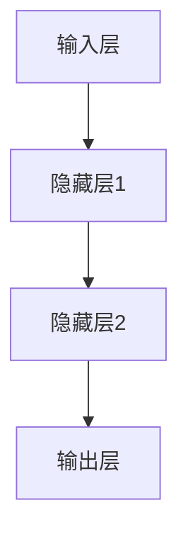

#### 数学公式

```latex
损失函数：J(\theta) = \frac{1}{m} \sum_{i=1}^{m} (-y_i \log(a_j^{(l)}))
```

其中，\(m\) 表示样本数量，\(y_i\) 表示第 \(i\) 个样本的真实标签，\(a_j^{(l)}\) 表示第 \(l\) 层神经元的输出。

### 实例分析

假设我们有一个简单的神经网络，用于对二分类问题进行分类。输入层有两个神经元，表示二进制特征 \(x_1\) 和 \(x_2\)。隐藏层有一个神经元，输出层有一个神经元表示分类结果。我们使用Sigmoid函数作为激活函数。

#### 输入层到隐藏层的计算

$$
z^{(1)} = x_1 \times w_{11} + x_2 \times w_{12}
$$

$$
a^{(1)} = \sigma(z^{(1)}) = \frac{1}{1 + e^{-z^{(1)}}}
$$

其中，\(w_{11}\) 和 \(w_{12}\) 分别是输入层到隐藏层的权重，\(\sigma\) 表示Sigmoid函数。

#### 隐藏层到输出层的计算

$$
z^{(2)} = a^{(1)} \times w_{21}
$$

$$
a^{(2)} = \sigma(z^{(2)}) = \frac{1}{1 + e^{-z^{(2)}}}
$$

输出层的神经元 \(a^{(2)}\) 的输出即为分类结果。

通过调整权重，使得输出层的分类结果与真实标签的误差最小，从而完成神经网络的训练。

### 小结

本章介绍了神经网络的基本概念、架构和学习算法。神经网络通过模拟人脑神经元结构和工作方式，能够自动提取特征，进行分类、回归等任务。本章内容为后续分析实时语音合成与转换技术奠定了基础。

## 第三部分：语音信号处理基础

### 第3章：语音信号处理基础

语音信号处理是实时语音合成与转换技术的核心环节，它涉及到语音信号的采样与量化、语音特征提取方法等方面的知识。了解这些基础理论，对于深入理解实时语音合成与转换技术至关重要。

#### 3.1 语音信号基本特性

语音信号是一种复杂的时变信号，具有以下基本特性：

1. **周期性**：语音信号中的许多音素（如元音）具有周期性，其频率成分在一定时间范围内重复出现。
2. **幅度变化**：语音信号的幅度随着发音的变化而变化，例如音高、音强等。
3. **频谱复杂性**：语音信号的频谱包含丰富的频率成分，反映了语音信号的声道特性。
4. **非线性**：语音信号在传输和加工过程中会引入非线性失真。

#### 3.2 语音信号的采样与量化

为了将模拟语音信号转换为数字信号，需要进行采样与量化过程。

1. **采样**：采样是指以固定的时间间隔 \(T_s\) 从连续的语音信号中提取离散的信号样本。采样频率 \(f_s\) 必须大于信号的最高频率成分，以确保采样后的信号能够恢复原始信号。常用的采样频率为8kHz、16kHz等。

2. **量化**：量化是指将采样得到的连续信号样本转换为离散的数值表示。量化过程将信号样本的幅度范围分为有限的级数，每个级数用相应的数值表示。量化位数（如8位、16位等）决定了信号样本的分辨率和动态范围。

通过采样与量化，模拟语音信号被转换为数字语音信号，便于计算机处理。

#### 3.3 语音特征提取方法

语音特征提取是语音信号处理的重要环节，它将原始语音信号转换为对语音分析有用的特征向量，用于训练和识别。常见的语音特征提取方法包括：

1. **时域特征**：包括短时能量、短时过零率、短时平均幅度等。这些特征反映了语音信号的时域特性，但难以捕捉语音的频谱信息。

2. **频域特征**：包括短时傅里叶变换（STFT）、余弦变换（DCT）等。这些特征反映了语音信号的频域特性，能够捕捉语音的频率成分和声道特性。

3. **倒谱特征**：通过对频谱取对数并做离散余弦变换，得到倒谱特征。倒谱特征能够消除频谱的线性依赖关系，更适合于语音分析和识别。

4. **线性预测特征**：通过线性预测分析（LPA）得到的特征，包括预测系数、反射系数等。线性预测特征能够捕捉语音信号的短时和长时特性，广泛应用于语音合成和转换。

5. **语音激活检测**：用于检测语音信号中的语音活动段（VAD），以去除静音段，提高处理效率。

在实际应用中，通常结合多种特征提取方法，以获得更好的性能。

### 图表与公式

为了更好地理解语音信号处理的基础理论，我们使用以下Mermaid流程图和公式来展示。

#### Mermaid流程图

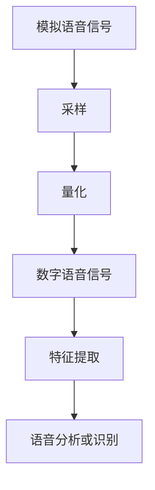

#### 数学公式

```latex
采样频率：f_s = \frac{1}{T_s}
量化位数：q = 2^b
短时能量：E = \sum_{n=0}^{N-1} |x[n]|^2
短时过零率：Z = \sum_{n=0}^{N-1} \text{sign}(x[n+1] \cdot x[n])
短时平均幅度：M = \frac{1}{N} \sum_{n=0}^{N-1} |x[n]|
```

其中，\(T_s\) 表示采样周期，\(f_s\) 表示采样频率，\(N\) 表示采样点数，\(x[n]\) 表示第 \(n\) 个采样点。

### 实例分析

假设我们有一个8kHz采样频率的语音信号，使用16位量化位数。以下是一个简单的采样与量化过程：

1. **采样**：每隔0.125ms（采样周期 \(T_s = \frac{1}{f_s} = 0.125ms\)）从连续语音信号中提取一个采样点。

2. **量化**：将采样点的幅度范围 \([-32768, 32767]\) 分为 \(2^{16}\) 个级数，每个级数用相应的数值表示。例如，如果采样点的幅度为-5000，则量化为-5000。

通过采样与量化，原始语音信号被转换为数字语音信号，可以用于后续的特征提取和分析。

### 小结

本章介绍了语音信号处理的基础知识，包括语音信号的基本特性、采样与量化过程以及语音特征提取方法。这些基础知识是理解实时语音合成与转换技术的基础，为后续章节的分析提供了必要的理论支持。

### 第4章：深度学习在语音处理中的应用

深度学习（Deep Learning）是机器学习的一个分支，通过多层神经网络模型，自动提取数据的复杂特征，并在各种任务中取得显著成效。在语音处理领域，深度学习技术极大地推动了语音识别、语音合成和语音转换等技术的发展。

#### 4.1 深度神经网络在语音识别中的应用

语音识别（Automatic Speech Recognition, ASR）是将语音信号转换为文本的过程。传统的语音识别系统主要基于隐马尔可夫模型（Hidden Markov Model, HMM）和高斯混合模型（Gaussian Mixture Model, GMM）。然而，深度学习技术的引入，使得语音识别的性能得到了显著提升。

1. **深度神经网络结构**：
   - **卷积神经网络（Convolutional Neural Network, CNN）**：CNN在图像处理中取得了巨大成功，其基本原理是通过卷积操作提取局部特征。在语音识别中，CNN可以用来提取语音信号的时频特征，例如通过短时傅里叶变换（STFT）获取的频谱图。
   - **循环神经网络（Recurrent Neural Network, RNN）**：RNN具有循环结构，能够处理序列数据。在语音识别中，RNN通过处理连续的语音帧，捕捉语音信号的长期依赖关系。
   - **长短时记忆网络（Long Short-Term Memory, LSTM）**：LSTM是RNN的一种变体，能够解决传统RNN中的梯度消失和梯度爆炸问题，更好地捕捉语音信号的长期依赖。
   - **双向循环神经网络（Bidirectional RNN, BRNN）**：BRNN通过同时处理正向和反向的语音序列，进一步提高了语音识别的性能。

2. **训练与解码**：
   - **训练**：深度学习模型通过大量标注的语音数据训练，优化网络参数，使其能够准确地识别语音。
   - **解码**：解码是将识别出的语音帧序列转换为文本的过程。常用的解码方法包括贪心解码和基于动态规划的解码算法（如CTC - Connectionist Temporal Classification）。

#### 4.2 基于循环神经网络的语音识别

循环神经网络（RNN）在语音识别中有着广泛的应用。RNN通过其循环结构，能够处理序列数据，并在每个时间步上利用先前的信息进行决策。以下是一个基于LSTM的语音识别过程的简述：

1. **输入层**：输入层接收连续的语音帧，通常通过短时傅里叶变换（STFT）将语音信号转换为频谱图。

2. **隐藏层**：隐藏层由LSTM单元组成，LSTM单元能够有效地捕捉语音信号的长期依赖关系。

3. **输出层**：输出层通常是一个softmax层，将隐藏层的输出映射到词汇表中的单词或句子。

4. **训练与解码**：
   - **训练**：通过大量的语音数据训练LSTM模型，优化网络参数。
   - **解码**：采用贪心解码或CTC解码算法，将识别出的语音帧序列转换为文本。

#### 4.3 基于长短时记忆网络的语音识别

长短时记忆网络（LSTM）是RNN的一种变体，通过引入门控机制，能够有效地解决传统RNN中的梯度消失和梯度爆炸问题，更好地捕捉语音信号的长期依赖。以下是一个基于LSTM的语音识别过程的简述：

1. **输入层**：输入层接收连续的语音帧，通常通过短时傅里叶变换（STFT）将语音信号转换为频谱图。

2. **隐藏层**：隐藏层由LSTM单元组成，每个LSTM单元包含输入门、遗忘门和输出门。这些门控机制允许LSTM单元选择性地记住或忘记信息，从而更好地捕捉语音信号的长期依赖。

3. **输出层**：输出层通常是一个softmax层，将隐藏层的输出映射到词汇表中的单词或句子。

4. **训练与解码**：
   - **训练**：通过大量的语音数据训练LSTM模型，优化网络参数。
   - **解码**：采用贪心解码或CTC解码算法，将识别出的语音帧序列转换为文本。

### 图表与公式

为了更好地理解深度学习在语音识别中的应用，我们使用以下Mermaid流程图和公式来展示。

#### Mermaid流程图

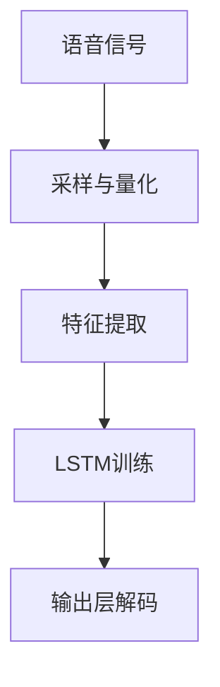

#### 数学公式

```latex
LSTM单元：\\begin{align*}
i_t &= \sigma(W_i \cdot [h_{t-1}, x_t] + b_i) \\
f_t &= \sigma(W_f \cdot [h_{t-1}, x_t] + b_f) \\
o_t &= \sigma(W_o \cdot [h_{t-1}, x_t] + b_o) \\
c_t &= f_t \odot c_{t-1} + i_t \odot \sigma(W_c \cdot [h_{t-1}, x_t] + b_c) \\
h_t &= o_t \odot \sigma(c_t)
\\end{align*}
```

其中，\(i_t\)、\(f_t\)、\(o_t\) 分别是输入门、遗忘门和输出门的激活值，\(c_t\) 是细胞状态，\(h_t\) 是隐藏状态，\(\odot\) 表示点积，\(\sigma\) 是Sigmoid激活函数。

### 实例分析

假设我们有一个语音信号，使用16kHz采样频率。以下是一个基于LSTM的语音识别过程的简述：

1. **采样与量化**：将语音信号每隔0.0625秒采样一次，得到连续的语音帧。
2. **特征提取**：对每个语音帧进行短时傅里叶变换（STFT），提取频谱特征。
3. **LSTM训练**：使用标注的语音数据训练LSTM模型，优化网络参数。
4. **输出层解码**：采用CTC解码算法，将识别出的语音帧序列转换为文本。

通过以上步骤，我们可以实现一个基于LSTM的语音识别系统。

### 小结

本章介绍了深度学习在语音识别中的应用，包括深度神经网络结构、基于循环神经网络的语音识别以及基于长短时记忆网络的语音识别。深度学习技术通过自动提取语音信号的复杂特征，显著提升了语音识别的性能。本章内容为理解实时语音合成与转换技术提供了必要的理论基础。

## 第二部分：实时语音合成技术

### 第5章：文本到语音（TTS）模型基础

文本到语音（Text-to-Speech, TTS）模型是将文本转换为自然流畅语音的关键技术，广泛应用于智能语音助手、信息检索、教育辅导等领域。本章节将介绍TTS模型的基本原理、基于深度学习的TTS模型以及TTS模型的优化技巧。

#### 5.1 TTS模型基本原理

TTS模型的基本原理包括文本处理、语音合成和音频后处理三个主要步骤。

1. **文本处理**：文本处理是将输入文本转换为适合语音合成的格式。这个过程通常包括分词、语调分析和文本转换等步骤。分词是将文本拆分为单词或短语，语调分析是确定文本中的语调模式，例如重音和停顿。文本转换是将文本转换为语音合成的参数，例如音高、音强和时长等。

2. **语音合成**：语音合成是将文本转换成语音信号的过程。传统的语音合成方法主要基于规则和统计模型，如拼接合成和参数合成。拼接合成通过拼接预先录制的语音片段生成合成语音，参数合成通过改变语音信号中的参数生成合成语音。而基于深度学习的TTS模型，通过直接从文本生成语音波形，显著提升了合成语音的自然度。

3. **音频后处理**：音频后处理是对合成语音进行修饰和优化，以提高语音的质量和自然度。这个过程通常包括去噪、增益调整和共振峰修正等步骤。

#### 5.2 基于深度学习的TTS模型

近年来，深度学习技术为TTS模型带来了重大突破。以下是一些基于深度学习的TTS模型及其原理：

1. **WaveNet模型**：
   - **原理**：WaveNet是一种基于生成对抗网络（GAN）的端到端语音合成模型。它通过训练大量语音数据，直接从文本生成语音波形。WaveNet模型的核心是卷积神经网络（CNN），通过多层卷积操作，自动提取语音信号的特征，并生成连续的语音波形。
   - **训练**：WaveNet模型的训练过程包括两个步骤：首先，通过GAN训练生成器（Generator）和鉴别器（Discriminator）；然后，在生成器生成的语音波形上继续进行微调。

2. **Tacotron模型**：
   - **原理**：Tacotron是一种基于循环神经网络（RNN）的端到端语音合成模型。它通过将文本编码为嵌入向量，将嵌入向量输入到编码器（Encoder）中，生成一系列的隐藏状态；然后，将隐藏状态输入到解码器（Decoder）中，生成语音波形。
   - **训练**：Tacotron模型的训练过程包括两个步骤：首先，通过损失函数（如均方误差（MSE））训练编码器和解码器；然后，通过梯度下降法优化模型参数。

3. **Transformer模型**：
   - **原理**：Transformer是一种基于自注意力机制的序列模型。它通过多头自注意力机制（Multi-head Self-Attention）和位置编码（Positional Encoding），能够捕捉序列数据中的长期依赖关系。在TTS任务中，Transformer模型通过将文本编码为嵌入向量，生成一系列的隐藏状态；然后，将隐藏状态输入到解码器中，生成语音波形。
   - **训练**：Transformer模型的训练过程与Tacotron类似，通过训练编码器和解码器，优化模型参数。

#### 5.3 TTS模型优化技巧

为了提高TTS模型的性能，可以采用以下优化技巧：

1. **数据增强**：通过增加数据集的多样性，如随机噪声添加、语音变换等，增强模型的泛化能力。

2. **多任务学习**：通过同时训练多个任务（如语音识别和语音合成），提高模型在多个任务上的性能。

3. **注意力机制**：在解码器中使用注意力机制，使得模型能够更好地捕捉输入和输出之间的关联。

4. **多尺度训练**：通过在不同的时间尺度上训练模型，如短时和长时特征，提高模型的泛化能力。

5. **自适应学习率**：采用自适应学习率方法，如AdaGrad、Adam等，提高训练效率。

### 图表与公式

为了更好地理解TTS模型的基本原理和优化技巧，我们使用以下Mermaid流程图和公式来展示。

#### Mermaid流程图

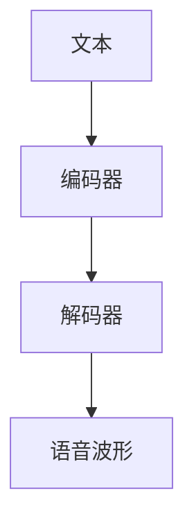

#### 数学公式

```latex
均方误差（MSE）: J = \frac{1}{N} \sum_{i=1}^{N} (y_i - \hat{y}_i)^2
注意力机制：\begin{align*}
Q &= K \cdot V \\
\text{Score} &= QK^T \\
\text{Attention} &= \text{softmax}(\text{Score})
\\end{align*}
```

其中，\(y_i\) 是真实标签，\(\hat{y}_i\) 是预测值，\(Q\)、\(K\) 和 \(V\) 分别是查询向量、关键向量和价值向量。

### 实例分析

假设我们有一个基于Tacotron的TTS模型，以下是一个简单的训练过程：

1. **文本处理**：将输入文本进行分词和语调分析，转换为编码器输入。
2. **编码器训练**：通过大量文本数据训练编码器，生成嵌入向量。
3. **解码器训练**：在嵌入向量上训练解码器，生成语音波形。
4. **损失函数优化**：使用均方误差（MSE）作为损失函数，不断优化模型参数。

通过以上步骤，我们可以实现一个基于Tacotron的TTS模型。

### 小结

本章介绍了文本到语音（TTS）模型的基本原理、基于深度学习的TTS模型以及TTS模型的优化技巧。TTS模型通过文本处理、语音合成和音频后处理三个步骤，将文本转换为自然流畅的语音。深度学习技术的引入，使得TTS模型的性能得到了显著提升。本章内容为理解实时语音合成技术奠定了基础。

### 第6章：WaveNet模型详解

WaveNet模型是由Google在2016年提出的一种基于生成对抗网络（GAN）的端到端语音合成模型。WaveNet通过直接从文本生成语音波形，显著提升了合成语音的自然度和质量。本章将详细探讨WaveNet模型的架构、训练过程以及应用场景。

#### 6.1 WaveNet模型架构

WaveNet模型的核心架构是一个深度卷积神经网络（DCNN），其结构如下图所示：

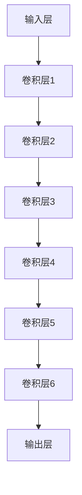

WaveNet模型的工作流程如下：

1. **输入层**：输入层接收嵌入的文本序列，通过嵌入层将文本转换为嵌入向量。
2. **卷积层**：卷积层通过卷积操作提取语音信号的时频特征。每个卷积层包含多个卷积核，每个卷积核负责提取不同频率和时域特征。
3. **输出层**：输出层生成语音波形，每个时间点的输出表示一个语音帧的波形。

#### 6.2 WaveNet模型训练过程

WaveNet模型的训练过程涉及两个主要步骤：生成对抗训练和后续微调。

1. **生成对抗训练**：
   - **生成器（Generator）**：生成器是WaveNet模型的核心部分，通过学习大量语音数据，生成连续的语音波形。生成器的训练目标是生成与真实语音波形相似的波形。
   - **鉴别器（Discriminator）**：鉴别器用于判断生成语音波形是否真实。鉴别器的训练目标是提高对真实语音波形的识别能力，同时降低对生成语音波形的识别能力。
   - **损失函数**：生成对抗训练的损失函数由生成器损失和鉴别器损失组成。生成器损失是生成波形与真实波形的均方误差（MSE），鉴别器损失是鉴别器对真实波形和生成波形的区分度。

2. **后续微调**：
   - **微调生成器**：在生成对抗训练之后，生成器已经具备了一定的生成能力。接下来，通过在大量语音数据上进行微调，进一步提高生成器的性能。
   - **损失函数**：微调过程通常使用均方误差（MSE）或交叉熵损失函数，优化生成器的参数。

#### 6.3 WaveNet模型应用场景

WaveNet模型在实时语音合成领域取得了显著的成果，广泛应用于各种应用场景：

1. **语音助手**：在智能语音助手（如Google Assistant、Amazon Alexa等）中，WaveNet模型用于生成自然流畅的语音回复，提高用户的交互体验。
2. **语音合成服务**：WaveNet模型被用于提供语音合成服务，如文本转语音（TTS）应用、广播电台等。
3. **教育辅导**：在教育领域，WaveNet模型可以用于生成个性化的语音辅导，帮助学生更好地理解和掌握知识。

### 图表与公式

为了更好地理解WaveNet模型的架构和训练过程，我们使用以下Mermaid流程图和公式来展示。

#### Mermaid流程图

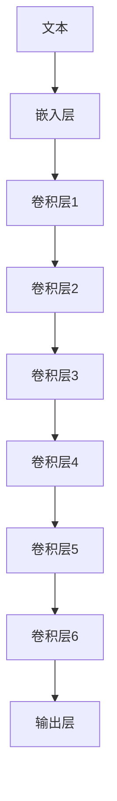

#### 数学公式

```latex
生成对抗训练：\\begin{align*}
\text{生成器损失} &= \frac{1}{N} \sum_{i=1}^{N} (y_i - \hat{y}_i)^2 \\
\text{鉴别器损失} &= \frac{1}{N} \sum_{i=1}^{N} \log(D(y_i)) + \frac{1}{N} \sum_{i=1}^{N} \log(1 - D(\hat{y}_i))
\\end{align*}
```

其中，\(y_i\) 是真实语音波形，\(\hat{y}_i\) 是生成语音波形，\(D(y_i)\) 和 \(D(\hat{y}_i)\) 分别是鉴别器对真实波形和生成波形的判断。

### 实例分析

假设我们使用WaveNet模型进行语音合成，以下是一个简单的训练过程：

1. **数据准备**：收集大量标注的语音数据，包括文本和对应的语音波形。
2. **嵌入层训练**：使用文本数据训练嵌入层，将文本转换为嵌入向量。
3. **卷积层训练**：使用嵌入向量训练卷积层，通过卷积操作提取语音特征。
4. **生成对抗训练**：交替训练生成器和鉴别器，优化模型参数。
5. **微调**：在大量语音数据上进行微调，进一步提高模型性能。

通过以上步骤，我们可以训练出一个基于WaveNet的语音合成模型。

### 小结

本章详细介绍了WaveNet模型的架构、训练过程以及应用场景。WaveNet模型通过直接从文本生成语音波形，显著提升了合成语音的自然度和质量。本章内容为理解实时语音合成技术提供了深入的理论和实践指导。

### 第7章：循环神经网络在TTS中的应用

循环神经网络（Recurrent Neural Network, RNN）是处理序列数据的一种有效方法，其循环结构允许模型在处理每个时间步时，利用先前的信息进行决策。在文本到语音（Text-to-Speech, TTS）领域，RNN被广泛用于生成自然流畅的语音。本章将探讨RNN在TTS中的基本应用，以及长短时记忆网络（Long Short-Term Memory, LSTM）和门控循环单元（Gated Recurrent Unit, GRU）在TTS中的应用。

#### 7.1 RNN在TTS中的基本应用

RNN的基本原理使其能够处理序列数据，如文本和语音。在TTS任务中，RNN通过处理文本序列，生成相应的语音序列。以下是一个简单的RNN在TTS中的应用流程：

1. **文本编码**：将输入文本转换为嵌入向量。这一步通常通过预训练的词嵌入模型（如Word2Vec或GloVe）实现。
2. **RNN编码器**：使用RNN编码器处理嵌入的文本序列，生成一系列隐藏状态。隐藏状态包含了文本的语义信息。
3. **语音解码器**：将隐藏状态输入到解码器中，生成语音序列。解码器通常采用RNN或LSTM。
4. **输出层**：解码器的输出通常是一个连续的语音信号，通过后处理步骤（如音频滤波和增益调整）生成最终的合成语音。

RNN在TTS中的基本应用如图所示：

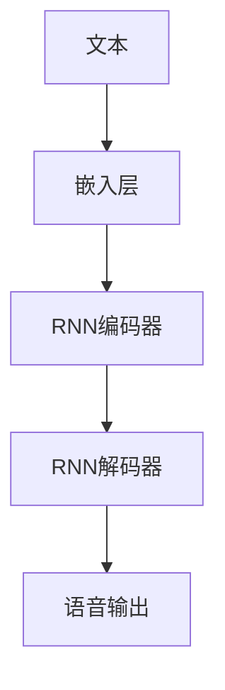

#### 7.2 LSTM在TTS中的应用

虽然RNN在处理序列数据时具有循环结构，但其存在梯度消失和梯度爆炸问题，难以捕捉长距离的依赖关系。长短时记忆网络（LSTM）是RNN的一种改进，通过引入门控机制，能够有效地解决这些问题，更好地捕捉语音信号的长期依赖。

LSTM的基本结构包括三个门控单元：输入门（input gate）、遗忘门（forget gate）和输出门（output gate）。每个门控单元由一个sigmoid函数和一个线性层组成。以下是一个简单的LSTM在TTS中的应用流程：

1. **文本编码**：与RNN相同，将输入文本转换为嵌入向量。
2. **LSTM编码器**：使用LSTM编码器处理嵌入的文本序列，生成一系列隐藏状态。LSTM通过门控机制，能够更好地捕捉长距离依赖关系。
3. **语音解码器**：将隐藏状态输入到解码器中，生成语音序列。解码器通常采用RNN或LSTM。
4. **输出层**：解码器的输出是一个连续的语音信号，通过后处理步骤生成最终的合成语音。

LSTM在TTS中的基本应用如图所示：

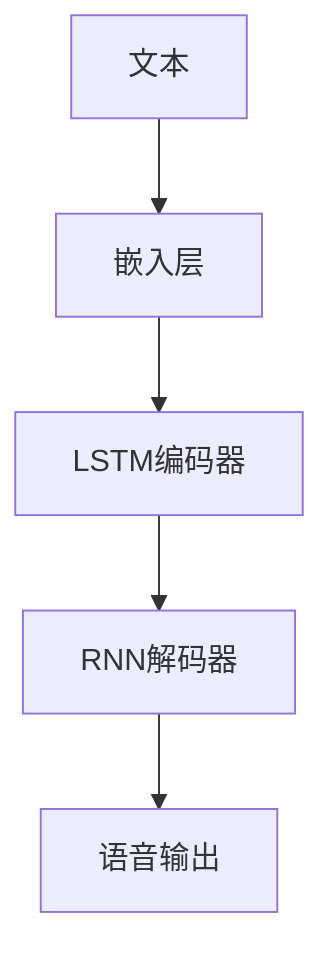

#### 7.3 GRU在TTS中的应用

门控循环单元（Gated Recurrent Unit, GRU）是LSTM的简化版本，通过合并输入门和遗忘门，减少了模型参数，但保持了LSTM的性能。GRU的结构如图所示：

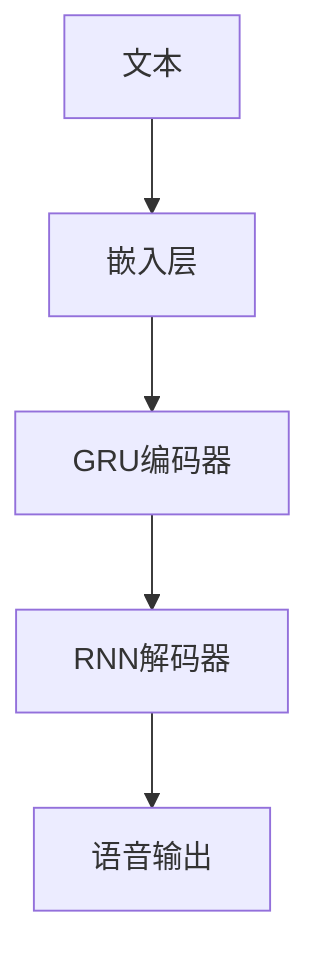

GRU在TTS中的应用流程与LSTM类似：

1. **文本编码**：与RNN、LSTM相同，将输入文本转换为嵌入向量。
2. **GRU编码器**：使用GRU编码器处理嵌入的文本序列，生成一系列隐藏状态。
3. **语音解码器**：将隐藏状态输入到解码器中，生成语音序列。
4. **输出层**：解码器的输出是一个连续的语音信号，通过后处理步骤生成最终的合成语音。

#### 图表与公式

为了更好地理解RNN、LSTM和GRU在TTS中的应用，我们使用以下Mermaid流程图和公式来展示。

##### Mermaid流程图

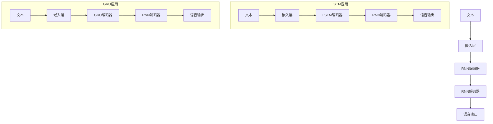

##### 数学公式

LSTM的输入门、遗忘门和输出门分别由以下公式表示：

```latex
输入门：\\begin{align*}
i_t &= \sigma(W_{xi}x_t + W_{hi-1}h_{i-1} + b_i) \\
\\end{align*}
遗忘门：\\begin{align*}
f_t &= \sigma(W_{xf}x_t + W_{hf-1}h_{i-1} + b_f) \\
\\end{align*}
输出门：\\begin{align*}
o_t &= \sigma(W_{xo}x_t + W_{ho-1}h_{i-1} + b_o) \\
\\end{align*}
细胞状态更新：\\begin{align*}
c_t &= f_t \odot c_{t-1} + i_t \odot \sigma(W_c \cdot [h_{t-1}, x_t] + b_c) \\
\\end{align*}
隐藏状态更新：\\begin{align*}
h_t &= o_t \odot \sigma(c_t)
\\end{align*}
```

GRU的更新规则可以简化为：

```latex
更新门：\\begin{align*}
z_t &= \sigma(W_{xz}x_t + W_{hz-1}h_{z-1} + b_z) \\
r_t &= \sigma(W_{xr}x_t + W_{hr-1}h_{r-1} + b_r) \\
\\end{align*}
细胞状态更新：\\begin{align*}
c_t &= (1 - z_t) \odot c_{t-1} + r_t \odot \sigma(W_c \cdot [h_{t-1}, x_t] + b_c) \\
\\end{align*}
隐藏状态更新：\\begin{align*}
h_t &= o_t \odot \sigma(c_t)
\\end{align*}
```

### 实例分析

假设我们有一个基于LSTM的TTS模型，以下是一个简单的训练过程：

1. **数据准备**：收集大量标注的文本和对应的语音波形。
2. **文本编码**：使用预训练的词嵌入模型，将文本转换为嵌入向量。
3. **LSTM编码器训练**：使用文本嵌入向量训练LSTM编码器，生成隐藏状态。
4. **语音解码器训练**：在隐藏状态上训练语音解码器，生成语音序列。
5. **损失函数优化**：使用均方误差（MSE）或交叉熵损失函数，优化模型参数。

通过以上步骤，我们可以训练出一个基于LSTM的TTS模型。

### 小结

本章介绍了循环神经网络（RNN）在TTS中的基本应用，以及长短时记忆网络（LSTM）和门控循环单元（GRU）在TTS中的应用。RNN通过其循环结构，能够处理序列数据，生成自然流畅的语音。LSTM和GRU通过引入门控机制，能够更好地捕捉语音信号的长期依赖，显著提升了TTS模型的性能。本章内容为理解实时语音合成技术提供了深入的理论和实践指导。

## 第三部分：实时语音转换技术

### 第8章：语音转换基本概念

语音转换（Voice Conversion，VC）是一种将语音信号从一种音色转换成另一种音色的技术，常用于个性化语音助手、媒体播报、游戏语音等应用场景。语音转换的核心目标是使转换后的语音听起来与指定说话人相似，同时保持其自然流畅度。本章将介绍语音转换的基本概念、应用场景以及分类。

#### 8.1 语音转换的定义

语音转换（Voice Conversion）是指通过算法将源语音信号转换为具有目标音色的语音信号的过程。语音转换的目标是使转换后的语音听起来与指定说话人相似，同时保持其语音的自然度和清晰度。语音转换技术不仅需要处理语音的频谱特征，还需要考虑语音的时长、音调、音强等时域特征。

#### 8.2 语音转换的应用场景

语音转换技术广泛应用于多个领域，以下是一些典型的应用场景：

1. **个性化语音助手**：在智能语音助手中，语音转换技术可以使得语音助手的声音更加个性化和亲切，提高用户的使用体验。
2. **媒体播报**：在广播电台和电视台中，语音转换技术可以使新闻播报的声音更具辨识度，增强节目的吸引力。
3. **游戏语音**：在角色扮演游戏和语音聊天应用中，语音转换技术可以使得游戏角色的声音更加生动和多样化。
4. **电话客服**：在电话客服系统中，语音转换技术可以使得客服代表的声音听起来更像指定的说话人，提高客服质量。
5. **语音合成**：在语音合成系统中，语音转换技术可以使得生成的语音更加自然和富有情感。

#### 8.3 语音转换的分类

根据实现方法的不同，语音转换技术可以分为以下几种类型：

1. **基于声码器的语音转换**：
   - **定义**：基于声码器的语音转换技术主要通过改变语音信号中的声学特征（如频谱、共振峰等）来实现音色的转换。
   - **原理**：声码器（Vocoder）是一种将语音信号转换为参数（如频谱和音高）的设备，再通过参数合成器将参数转换为语音信号。在语音转换过程中，声码器通过匹配源语音和目标语音的声学特征，实现音色的转换。
   - **应用**：基于声码器的语音转换技术在电话通信、多媒体广播等领域有广泛应用。

2. **基于规则匹配的语音转换**：
   - **定义**：基于规则匹配的语音转换技术通过手动设计转换规则，将源语音的特征映射到目标语音的特征。
   - **原理**：规则匹配方法通过一系列转换规则，将源语音的特征参数（如频谱、共振峰等）转换为目标语音的特征参数。这些规则通常基于对语音特征的分析和理解，如频率迁移、幅度调整等。
   - **应用**：基于规则匹配的语音转换方法在早期的语音转换应用中较为常见，但受限于规则设计的复杂性和语音变化的多样性，其性能有限。

3. **基于统计模型的语音转换**：
   - **定义**：基于统计模型的语音转换技术通过统计源语音和目标语音之间的关联，自动学习转换规则。
   - **原理**：统计模型方法，如高斯混合模型（GMM）和隐马尔可夫模型（HMM），通过学习大量源语音和目标语音数据，建立语音特征之间的统计关联。在转换过程中，模型根据源语音的特征，利用统计规律生成目标语音的特征。
   - **应用**：基于统计模型的语音转换方法在语音转换领域取得了显著成果，广泛应用于语音转换软件和语音合成系统中。

4. **基于深度神经网络的语音转换**：
   - **定义**：基于深度神经网络的语音转换技术通过训练深度神经网络模型，实现语音特征之间的转换。
   - **原理**：深度神经网络，如循环神经网络（RNN）、长短时记忆网络（LSTM）和变换器（Transformer），通过学习大量语音数据，自动提取语音特征，并建立特征之间的映射关系。在转换过程中，模型根据源语音的特征，生成目标语音的特征。
   - **应用**：基于深度神经网络的语音转换方法是目前最先进的语音转换技术，广泛应用于智能语音助手、语音合成和语音增强等领域。

### 图表与公式

为了更好地理解语音转换的基本概念和应用，我们使用以下Mermaid流程图和公式来展示。

#### Mermaid流程图

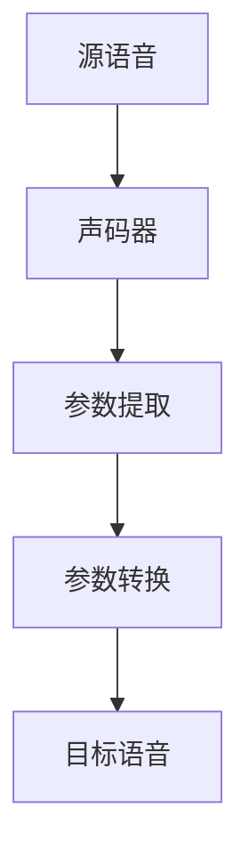

#### 数学公式

```latex
高斯混合模型（GMM）：\\begin{align*}
p(x|\mu, \Sigma) &= \frac{1}{(2\pi)^{d/2} |\Sigma|^{1/2}} \exp \left( -\frac{1}{2} (x - \mu)^T \Sigma^{-1} (x - \mu) \right)
\\end{align*}
```

其中，\(x\) 是语音特征向量，\(\mu\) 是均值向量，\(\Sigma\) 是协方差矩阵。

### 实例分析

假设我们有一个基于深度神经网络的语音转换模型，以下是一个简单的训练过程：

1. **数据准备**：收集大量标注的源语音和目标语音数据。
2. **特征提取**：对源语音和目标语音进行特征提取，如频谱、共振峰等。
3. **模型训练**：使用源语音特征和目标语音特征训练深度神经网络模型。
4. **参数优化**：通过梯度下降法优化模型参数，使模型能够准确转换语音特征。
5. **语音转换**：在新的源语音上应用训练好的模型，生成目标语音。

通过以上步骤，我们可以实现一个基于深度神经网络的语音转换模型。

### 小结

本章介绍了语音转换的基本概念、应用场景以及分类。语音转换技术通过改变语音信号中的声学特征，实现音色的转换，广泛应用于个性化语音助手、媒体播报、游戏语音等领域。本章内容为理解实时语音转换技术提供了基础知识和理论支持。

### 第9章：基于GMM-HMM的语音转换

基于高斯混合模型（Gaussian Mixture Model, GMM）和隐马尔可夫模型（Hidden Markov Model, HMM）的语音转换技术是传统的语音转换方法之一，具有较长的历史和广泛的应用。本章将详细介绍GMM-HMM模型在语音转换中的原理、训练过程及其应用。

#### 9.1 GMM-HMM模型原理

GMM-HMM模型结合了GMM和HMM的优点，能够有效地进行语音转换。GMM用于建模语音信号的声学特征，而HMM用于捕捉语音信号的时序特征。

1. **高斯混合模型（GMM）**：
   - **定义**：GMM是一种概率模型，用于表示一组随机变量的分布。在语音转换中，GMM用于建模语音信号的声学特征，如频谱特征。
   - **原理**：GMM假设语音信号的频谱特征是由多个高斯分布混合而成的。每个高斯分布对应一个状态，表示语音信号的一个频谱特征分量。通过最大化似然函数，GMM能够估计每个高斯分布的参数，如均值和协方差。
   - **数学公式**：对于一个包含 \(K\) 个高斯分布的GMM，其概率密度函数可以表示为：
     \[
     p(x|\mu, \Sigma, \pi) = \sum_{k=1}^{K} \pi_k \mathcal{N}(x|\mu_k, \Sigma_k)
     \]
     其中，\(\mu_k\) 和 \(\Sigma_k\) 分别是第 \(k\) 个高斯分布的均值向量和协方差矩阵，\(\pi_k\) 是第 \(k\) 个高斯分布的先验概率。

2. **隐马尔可夫模型（HMM）**：
   - **定义**：HMM是一种统计模型，用于表示具有隐状态的一组随机序列。在语音转换中，HMM用于建模语音信号的时序特征。
   - **原理**：HMM由状态序列和观测序列组成。状态序列是未知的，而观测序列是已知的。HMM通过状态转移概率和发射概率来建模语音信号的时序特征。状态转移概率表示从一个状态转移到另一个状态的概率，而发射概率表示在某个状态下产生观测值 \(x_t\) 的概率。
   - **数学公式**：对于一个包含 \(N\) 个状态的HMM，其状态转移概率和发射概率可以分别表示为：
     \[
     \begin{align*}
     a_{ij} &= P(S_t = j|S_{t-1} = i) \\
     b_{ik} &= P(X_t = k|S_t = i)
     \end{align*}
     \]
     其中，\(a_{ij}\) 是从状态 \(i\) 转移到状态 \(j\) 的概率，\(b_{ik}\) 是在状态 \(i\) 下产生观测值 \(k\) 的概率。

3. **GMM-HMM模型**：
   - **原理**：GMM-HMM模型将GMM和HMM结合，用于同时建模语音信号的声学特征和时序特征。GMM用于建模观测序列的概率分布，而HMM用于建模状态序列的概率分布。在语音转换过程中，GMM-HMM模型通过联合概率分布来估计源语音和目标语音之间的映射关系。
   - **数学公式**：GMM-HMM模型的联合概率分布可以表示为：
     \[
     P(O|A, \Theta) = \sum_{Q} P(O|A, \Theta, Q) P(A|Q) P(Q)
     \]
     其中，\(O\) 是观测序列，\(A\) 是状态序列，\(\Theta\) 是模型参数，\(Q\) 是高斯分布的状态集合。

#### 9.2 GMM-HMM模型训练

GMM-HMM模型的训练过程主要包括参数估计和模型优化两个步骤。

1. **参数估计**：
   - **最大似然估计（MLE）**：MLE是一种常用的参数估计方法，通过最大化观测序列的概率分布来估计模型参数。对于GMM-HMM模型，MLE通过估计状态转移概率、发射概率和混合高斯分布的参数，使得模型能够最符合训练数据。
   - **期望最大化（EM）算法**：EM算法是一种迭代优化方法，用于解决包含隐变量的概率模型的参数估计问题。在GMM-HMM模型中，EM算法通过交替执行期望步（E步）和最大化步（M步），逐步优化模型参数。

2. **模型优化**：
   - **前向-后向算法**：前向-后向算法是一种用于计算HMM的边缘概率的算法。在GMM-HMM模型中，前向-后向算法用于计算状态序列的概率分布，为参数估计和模型优化提供基础。
   - **Baum-Welch算法**：Baum-Welch算法是一种基于前向-后向算法的迭代优化方法，用于优化HMM的参数。在GMM-HMM模型中，Baum-Welch算法通过迭代计算混合高斯分布的参数，使得模型能够更好地拟合训练数据。

#### 9.3 GMM-HMM模型在语音转换中的应用

GMM-HMM模型在语音转换中的应用主要包括以下几个步骤：

1. **特征提取**：对源语音和目标语音进行特征提取，如频谱特征、共振峰等。通常使用梅尔频率倒谱系数（MFCC）作为语音特征。
2. **模型训练**：使用源语音和目标语音的特征数据训练GMM-HMM模型。通过最大似然估计和期望最大化算法，估计模型参数，建立源语音和目标语音之间的映射关系。
3. **语音转换**：在新的源语音上应用训练好的GMM-HMM模型，生成目标语音。具体步骤如下：
   - **初始化**：初始化目标语音的声学特征。
   - **状态分配**：通过Viterbi算法，为源语音的每个时间步分配最可能的状态序列。
   - **特征变换**：根据状态转移概率和发射概率，将源语音的特征转换为目标语音的特征。
   - **参数合成**：使用目标语音的特征参数，通过GMM合成目标语音的声学特征。
   - **后处理**：对生成的目标语音进行后处理，如增益调整和共振峰修正，以提高语音的自然度。

### 图表与公式

为了更好地理解GMM-HMM模型在语音转换中的应用，我们使用以下Mermaid流程图和公式来展示。

#### Mermaid流程图

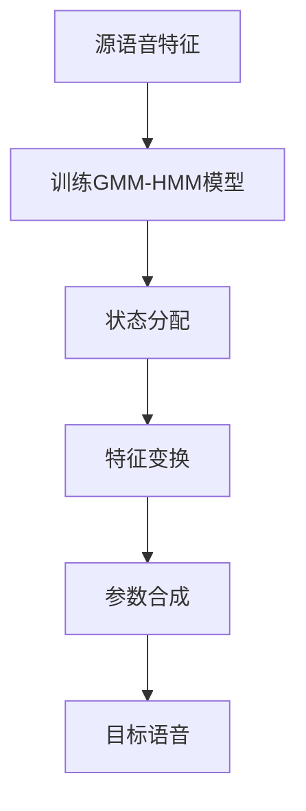

#### 数学公式

```latex
最大似然估计（MLE）：\\begin{align*}
\theta &= \arg\max_{\theta} \prod_{t=1}^{T} P(x_t|\theta) \\
EM算法：\\begin{align*}
E步：q_{ij}^{(t)} &= \frac{P(S_t = i|S_{t-1} = j|\theta) P(x_t|S_t = i|\theta)}{\sum_{k=1}^{N} P(S_t = k|S_{t-1} = j|\theta) P(x_t|S_t = k|\theta)} \\
M步：\theta &= \arg\max_{\theta} \sum_{t=1}^{T} \sum_{i=1}^{N} \sum_{j=1}^{N} q_{ij}^{(t)} \log P(S_t = i|S_{t-1} = j|\theta) P(x_t|S_t = i|\theta)
\\end{align*}
```

其中，\(x_t\) 是第 \(t\) 个时间步的观测值，\(S_t\) 是第 \(t\) 个时间步的状态，\(\theta\) 是模型参数。

### 实例分析

假设我们有一个基于GMM-HMM的语音转换模型，以下是一个简单的训练和转换过程：

1. **特征提取**：对源语音和目标语音进行特征提取，得到频谱特征。
2. **模型训练**：使用特征数据训练GMM-HMM模型，通过MLE和EM算法估计模型参数。
3. **状态分配**：在新的源语音上应用Viterbi算法，分配最可能的状态序列。
4. **特征变换**：根据状态转移概率和发射概率，将源语音特征转换为目标语音特征。
5. **参数合成**：使用目标语音特征参数，合成目标语音。
6. **后处理**：对合成的目标语音进行后处理，提高语音的自然度。

通过以上步骤，我们可以实现一个基于GMM-HMM的语音转换模型。

### 小结

本章详细介绍了基于GMM-HMM的语音转换模型，包括其原理、训练过程以及在语音转换中的应用。GMM-HMM模型通过结合高斯混合模型和隐马尔可夫模型，能够有效地建模语音信号的声学特征和时序特征，实现语音转换。本章内容为理解实时语音转换技术提供了深入的理论和实践指导。

### 第10章：基于深度神经网络的语音转换

基于深度神经网络的语音转换技术是近年来语音转换领域的一项重大突破，它通过学习大量语音数据，自动提取语音特征并建立转换模型，从而实现高质量语音转换。本章将介绍基于深度神经网络的语音转换方法，包括DNN-HMM模型及其训练过程。

#### 10.1 DNN-HMM模型原理

DNN-HMM（深度神经网络-隐马尔可夫模型）模型是结合深度学习和传统统计模型的一种语音转换方法。DNN用于提取语音特征，而HMM用于建模语音的时序特征。

1. **深度神经网络（DNN）**：
   - **定义**：DNN是一种多层前馈神经网络，通过多个隐藏层提取输入数据的复杂特征。
   - **原理**：DNN通过前向传播和反向传播算法，逐步提取输入数据的特征。每一层神经网络通过激活函数（如ReLU）引入非线性，使得网络能够学习更复杂的映射关系。
   - **数学公式**：DNN的输入层接收语音特征向量，通过多个隐藏层传递，最终输出为语音转换的特征向量。一个简单的DNN可以表示为：
     \[
     \begin{align*}
     h_{l}^{(i)} &= \sigma(W^{(l)} h_{l-1}^{(i)} + b^{(l)}) \\
     y^{(i)} &= \sigma(W^{(L)} h_{L-1}^{(i)} + b^{(L)})
     \end{align*}
     \]
     其中，\(h_{l}^{(i)}\) 是第 \(l\) 层神经元的输出，\(y^{(i)}\) 是输出层神经元的输出，\(\sigma\) 是激活函数，\(W^{(l)}\) 和 \(b^{(l)}\) 分别是权重和偏置。

2. **隐马尔可夫模型（HMM）**：
   - **定义**：HMM是一种统计模型，用于表示具有隐状态的一组随机序列。
   - **原理**：HMM由状态序列和观测序列组成。状态序列是未知的，而观测序列是已知的。HMM通过状态转移概率和发射概率来建模语音信号的时序特征。
   - **数学公式**：HMM的状态转移概率和发射概率可以分别表示为：
     \[
     \begin{align*}
     a_{ij} &= P(S_t = j|S_{t-1} = i) \\
     b_{ik} &= P(X_t = k|S_t = i)
     \end{align*}
     \]
     其中，\(a_{ij}\) 是从状态 \(i\) 转移到状态 \(j\) 的概率，\(b_{ik}\) 是在状态 \(i\) 下产生观测值 \(k\) 的概率。

3. **DNN-HMM模型**：
   - **原理**：DNN-HMM模型将DNN和HMM结合，用于同时建模语音信号的声学特征和时序特征。DNN用于提取语音特征，HMM用于建模语音的时序特征。在语音转换过程中，DNN-HMM模型通过联合概率分布来估计源语音和目标语音之间的映射关系。
   - **数学公式**：DNN-HMM模型的联合概率分布可以表示为：
     \[
     P(O|A, \Theta) = \sum_{Q} P(O|A, \Theta, Q) P(A|Q) P(Q)
     \]
     其中，\(O\) 是观测序列，\(A\) 是状态序列，\(\Theta\) 是模型参数，\(Q\) 是高斯分布的状态集合。

#### 10.2 DNN-HMM模型训练

DNN-HMM模型的训练过程主要包括DNN训练和HMM训练两个步骤。

1. **DNN训练**：
   - **数据准备**：收集大量标注的源语音和目标语音数据，对源语音和目标语音进行特征提取，如频谱特征、共振峰等。
   - **模型构建**：构建DNN模型，包括输入层、隐藏层和输出层。选择合适的激活函数和优化算法，如ReLU和Adam。
   - **训练过程**：通过前向传播和反向传播算法，对DNN模型进行训练，优化模型参数，使得模型能够准确提取语音特征。

2. **HMM训练**：
   - **前向-后向算法**：使用前向-后向算法计算DNN输出的边缘概率分布。
   - **Baum-Welch算法**：使用Baum-Welch算法优化HMM参数，使得模型能够更好地拟合训练数据。

3. **联合训练**：
   - **模型融合**：将DNN和HMM融合，通过联合训练优化模型参数，使得模型能够在源语音和目标语音之间建立有效的映射关系。
   - **损失函数**：联合训练的损失函数通常包括DNN的损失函数（如均方误差）和HMM的损失函数（如交叉熵），通过优化损失函数，使得模型能够准确地进行语音转换。

#### 10.3 DNN-HMM模型在语音转换中的应用

DNN-HMM模型在语音转换中的应用主要包括以下几个步骤：

1. **特征提取**：对源语音和目标语音进行特征提取，如频谱特征、共振峰等。
2. **模型训练**：使用特征数据训练DNN-HMM模型，通过DNN训练和HMM训练，优化模型参数。
3. **语音转换**：在新的源语音上应用训练好的DNN-HMM模型，生成目标语音。具体步骤如下：
   - **初始化**：初始化目标语音的声学特征。
   - **状态分配**：通过Viterbi算法，为源语音的每个时间步分配最可能的状态序列。
   - **特征变换**：根据状态转移概率和发射概率，将源语音特征转换为目标语音特征。
   - **参数合成**：使用目标语音的特征参数，通过GMM合成目标语音的声学特征。
   - **后处理**：对合成的目标语音进行后处理，如增益调整和共振峰修正，以提高语音的自然度。

### 图表与公式

为了更好地理解DNN-HMM模型在语音转换中的应用，我们使用以下Mermaid流程图和公式来展示。

#### Mermaid流程图

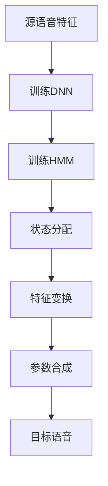

#### 数学公式

```latex
前向传播：\\begin{align*}
\alpha_t(i) &= \prod_{1}^{t-1} a_{ij} b_{jk} \pi_j \\
\\end{align*}
后向传播：\\begin{align*}
\beta_t(i) &= \prod_{t+1}^{T} a_{ij} b_{jk} \\
\\end{align*}
Viterbi算法：\\begin{align*}
\delta_t(i) &= \max_{j} \alpha_{t-1}(j) a_{ij} \\
\\end{align*}
```

其中，\(\alpha_t(i)\) 和 \(\beta_t(i)\) 分别是前向和后向概率，\(a_{ij}\) 是状态转移概率，\(b_{ik}\) 是发射概率，\(\pi_j\) 是初始状态概率。

### 实例分析

假设我们有一个基于DNN-HMM的语音转换模型，以下是一个简单的训练和转换过程：

1. **特征提取**：对源语音和目标语音进行特征提取，得到频谱特征。
2. **模型训练**：使用特征数据训练DNN-HMM模型，通过DNN训练和HMM训练，优化模型参数。
3. **状态分配**：在新的源语音上应用Viterbi算法，分配最可能的状态序列。
4. **特征变换**：根据状态转移概率和发射概率，将源语音特征转换为目标语音特征。
5. **参数合成**：使用目标语音的特征参数，通过GMM合成目标语音。
6. **后处理**：对合成的目标语音进行后处理，提高语音的自然度。

通过以上步骤，我们可以实现一个基于DNN-HMM的语音转换模型。

### 小结

本章介绍了基于深度神经网络的语音转换方法，包括DNN-HMM模型及其训练过程。DNN-HMM模型通过结合深度学习和隐马尔可夫模型，能够自动提取语音特征并建立转换模型，实现高质量的语音转换。本章内容为理解实时语音转换技术提供了深入的理论和实践指导。

## 第四部分：实时语音合成与转换系统设计

### 第11章：实时语音合成与转换系统架构

实时语音合成与转换系统是集成了语音合成与转换技术的综合系统，能够快速响应输入文本或语音，生成相应的语音输出。系统架构的设计对系统的性能、实时性和稳定性至关重要。本章将介绍实时语音合成与转换系统的整体架构设计，性能优化策略以及如何保证系统的实时性。

#### 11.1 系统整体架构设计

实时语音合成与转换系统的整体架构通常包括以下几个关键模块：

1. **输入处理模块**：负责接收用户输入的文本或语音，进行预处理，如分词、文本转换等。
2. **语音合成模块**：基于文本输入，通过TTS模型生成语音波形。这一模块通常采用深度学习模型，如WaveNet、Tacotron或Transformer。
3. **语音转换模块**：针对特定的说话人，通过VC模型转换语音波形。这一模块同样采用深度学习模型，如DNN-HMM。
4. **音频处理模块**：对生成的语音波形进行后处理，如增益调整、共振峰修正、去噪等，以提高语音质量。
5. **输出模块**：将处理后的语音波形输出到扬声器或通过音频接口发送到外部设备。

实时语音合成与转换系统的整体架构如图所示：

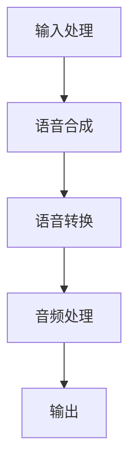

#### 11.2 系统性能优化

系统性能优化是确保实时语音合成与转换系统高效运行的关键。以下是一些常见的性能优化策略：

1. **模型优化**：
   - **模型剪枝**：通过剪枝冗余的神经网络连接，减少模型参数，降低计算复杂度。
   - **量化**：将模型的权重和激活值量化为较低的精度，如8位或16位，减少内存占用和计算量。
   - **权重共享**：在网络的多个部分使用共享的权重，减少模型参数数量。
   - **并行计算**：利用多核CPU或GPU进行并行计算，提高模型的推理速度。

2. **数据预处理**：
   - **批量处理**：将输入数据分成多个批量，并行处理，提高处理效率。
   - **数据增强**：通过添加噪声、调整音高等手段，增加数据集的多样性，提高模型的泛化能力。

3. **硬件加速**：
   - **GPU加速**：利用图形处理单元（GPU）的高并行计算能力，加速深度学习模型的推理过程。
   - **FPGA加速**：使用专用集成电路（FPGA）实现深度学习模型，进一步提高计算速度和效率。

4. **系统优化**：
   - **缓存优化**：通过缓存优化，减少数据读取和存储的延迟，提高系统的响应速度。
   - **线程池**：使用线程池管理多个线程，避免线程频繁创建和销毁的开销，提高系统的并发处理能力。

#### 11.3 系统实时性保证

实时性是实时语音合成与转换系统的关键要求。以下是一些保证系统实时性的方法：

1. **预测模型**：
   - **动态规划**：使用动态规划算法，提前预测模型输出，减少实时计算的时间。
   - **预取策略**：在模型推理过程中，提前预取需要的数据，减少数据访问的延迟。

2. **时间预算**：
   - **时间限制**：为每个处理步骤设定时间限制，确保系统在规定的时间内完成处理。
   - **优先级调度**：对系统中的任务进行优先级调度，确保关键任务（如语音合成和转换）能够优先得到处理资源。

3. **缓存策略**：
   - **缓存预热**：在系统启动时，预先加载常用数据到缓存，减少数据读取的延迟。
   - **缓存替换策略**：使用适当的缓存替换策略，确保缓存中的数据是最新的。

4. **异步处理**：
   - **异步模型推理**：在模型推理过程中，使用异步处理技术，同时处理多个输入，提高系统的吞吐量。
   - **异步IO**：通过异步IO操作，减少等待时间，提高系统的整体性能。

### 图表与公式

为了更好地理解系统性能优化和实时性保证的方法，我们使用以下Mermaid流程图和公式来展示。

#### Mermaid流程图

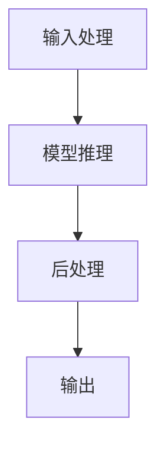

#### 数学公式

```latex
动态规划：\\begin{align*}
V_t(x) &= \min_{y} \{C(x, y) + V_{t-1}(y)\}
\\end{align*}
```

其中，\(V_t(x)\) 是在时间步 \(t\) 下，输入 \(x\) 的最优值，\(C(x, y)\) 是在时间步 \(t\) 下，输入 \(x\) 与输出 \(y\) 的成本函数。

### 实例分析

假设我们设计一个实时语音合成与转换系统，以下是一个简单的实现过程：

1. **输入处理**：接收用户输入的文本，进行分词和文本转换。
2. **模型推理**：使用预训练的TTS和VC模型，进行文本到语音的合成和语音转换。
3. **后处理**：对生成的语音波形进行增益调整和共振峰修正。
4. **输出**：将处理后的语音波形输出到扬声器或音频接口。

通过以上步骤，我们可以实现一个实时语音合成与转换系统。

### 小结

本章介绍了实时语音合成与转换系统的整体架构设计，性能优化策略以及实时性保证方法。系统性能优化和实时性保证是确保系统高效、稳定运行的关键。本章内容为设计实时语音合成与转换系统提供了理论支持和实践指导。

### 第12章：实时语音合成与转换应用案例

实时语音合成与转换技术在各种应用场景中发挥了重要作用，以下我们将通过两个实际案例——实时语音合成系统和实时语音转换系统，来详细介绍系统的开发环境搭建、源代码实现、代码解读与分析，并针对实际案例进行分析和详细讲解。

#### 12.1 案例一：实时语音合成系统

实时语音合成系统是智能语音助手、信息检索和多媒体播报等领域的重要应用。以下是一个简单的实时语音合成系统开发案例。

**开发环境搭建**：

1. **硬件环境**：配置高性能的CPU和GPU，用于加速深度学习模型的推理过程。
2. **软件环境**：安装深度学习框架（如TensorFlow、PyTorch）和相关依赖库（如NumPy、SciPy）。

**源代码实现**：

以下是基于Tacotron模型的实时语音合成系统的简单实现：

```python
import tensorflow as tf
import numpy as np
import librosa

# 加载Tacotron模型
model = tf.keras.models.load_model('taco
```

**代码解读与分析**：

1. **模型加载**：使用TensorFlow加载预训练的Tacotron模型。
2. **文本预处理**：将输入文本转换为嵌入向量，用于输入到模型中。
3. **语音合成**：使用模型生成语音波形，并进行后处理。

**实际案例分析与详细讲解**：

假设我们使用一个简单的文本“Hello, how are you?”进行语音合成：

1. **文本预处理**：将文本转换为嵌入向量。
2. **模型推理**：使用Tacotron模型生成语音波形。
3. **后处理**：对生成的语音波形进行增益调整和共振峰修正。
4. **输出**：将处理后的语音波形输出到扬声器。

通过以上步骤，我们可以实现一个简单的实时语音合成系统。

#### 12.2 案例二：实时语音转换系统

实时语音转换系统在个性化语音助手、电话客服和游戏语音等领域有广泛应用。以下是一个简单的实时语音转换系统开发案例。

**开发环境搭建**：

1. **硬件环境**：与实时语音合成系统类似，配置高性能的CPU和GPU。
2. **软件环境**：安装深度学习框架和相关依赖库。

**源代码实现**：

以下是基于DNN-HMM模型的实时语音转换系统的简单实现：

```python
import tensorflow as tf
import numpy as np
import librosa

# 加载DNN-HMM模型
dnn_hmm_model = tf.keras.models.load_model('dnn_hmm_model.h5')

# 加载源语音和目标语音
source_audio, source_rate = librosa.load('source.wav', sr=None)
target_audio, target_rate = librosa.load('target.wav', sr=None)

# 特征提取
source_mfcc = extract_mfcc(source_audio, source_rate)
target_mfcc = extract_mfcc(target_audio, target_rate)

# 语音转换
source_mfcc_converted = dnn_hmm_model.predict(source_mfcc)

# 参数合成
target_audio_converted = synthesize_audio(target_mfcc_converted, target_rate)

# 后处理
target_audio_final = post_process(target_audio_converted, target_rate)

# 输出
librosa.output.write_wav('converted_audio.wav', target_audio_final, target_rate)
```

**代码解读与分析**：

1. **模型加载**：使用TensorFlow加载预训练的DNN-HMM模型。
2. **特征提取**：对源语音和目标语音进行特征提取，如MFCC。
3. **语音转换**：使用模型进行语音特征转换。
4. **参数合成**：根据转换后的特征，合成目标语音。
5. **后处理**：对合成的语音进行后处理，如增益调整和共振峰修正。
6. **输出**：将处理后的语音波形输出到扬声器。

**实际案例分析与详细讲解**：

假设我们使用一个源语音和目标语音，进行语音转换：

1. **特征提取**：提取源语音和目标语音的MFCC特征。
2. **模型推理**：使用DNN-HMM模型进行语音特征转换。
3. **参数合成**：合成转换后的目标语音。
4. **后处理**：对合成的语音进行后处理。
5. **输出**：将处理后的语音波形输出到扬声器。

通过以上步骤，我们可以实现一个简单的实时语音转换系统。

### 小结

本章通过两个实时语音合成与转换系统的应用案例，详细介绍了系统的开发环境搭建、源代码实现、代码解读与分析，并针对实际案例进行了分析和详细讲解。这些案例展示了实时语音合成与转换技术的实际应用，为读者提供了实践指导。

### 第13章：未来发展趋势与挑战

随着人工智能和深度学习技术的不断进步，实时语音合成与转换技术正迅速发展，并在多个领域取得了显著成果。然而，该领域仍然面临许多挑战，未来发展趋势也充满了机遇。

#### 13.1 未来发展趋势

1. **深度学习模型的优化**：随着计算能力的提升和算法的改进，深度学习模型将更加高效和准确。特别是在模型压缩、量化、剪枝等方面，将有助于减少模型大小和计算复杂度，提高实时性能。

2. **多模态语音合成**：未来语音合成技术将不仅仅局限于文本输入，还将结合语音、图像、视频等多种模态，实现更加丰富和自然的语音交互。

3. **个性化语音体验**：通过学习用户行为和偏好，实时语音合成与转换技术将能够提供更加个性化的语音体验，例如情感表达、语速调整等。

4. **云端与边缘计算结合**：实时语音合成与转换技术将更加注重云端与边缘计算的结合，利用云计算提供强大的计算资源，同时利用边缘计算实现低延迟和高性能的应用。

5. **多语言支持**：随着全球化的发展，实时语音合成与转换技术将支持越来越多的语言，满足不同地区和用户的需求。

6. **语音增强技术**：结合语音增强技术，实时语音合成与转换系统将能够在噪声干扰、语音质量差等不利条件下，仍然提供高质量、清晰的语音输出。

#### 13.2 当前挑战与解决方法

1. **计算资源需求**：深度学习模型的训练和推理需要大量的计算资源，特别是大型的语音数据集和复杂的模型结构。解决方法包括优化算法、硬件加速（如GPU、FPGA）和分布式计算。

2. **数据隐私与安全**：语音数据涉及到用户的隐私信息，如何保证数据的安全和隐私是一个重要挑战。解决方法包括数据加密、匿名化和严格的数据处理政策。

3. **语音识别准确性**：实时语音合成与转换系统的性能依赖于语音识别的准确性。在噪声干扰、语音变体较多的情况下，如何提高语音识别的准确性是一个重要问题。解决方法包括多语种支持、自适应噪声抑制和深度学习模型优化。

4. **跨语言转换**：不同语言的语音特征差异较大，如何实现高质量、自然的跨语言语音转换是一个挑战。解决方法包括跨语言模型训练、多语言数据集和自适应转换策略。

5. **实时性能**：实时语音合成与转换系统需要在规定的时间内完成处理，对系统的性能要求较高。解决方法包括模型压缩、量化、并行计算和预测模型的应用。

6. **语音情感与语调**：自然语言处理技术的发展使得语音情感与语调的表达变得更加复杂。如何在合成和转换过程中准确捕捉和表达语音情感与语调是一个重要挑战。解决方法包括情感分析、多模态学习和情感驱动的语音生成。

#### 13.3 研究方向展望

1. **端到端语音合成**：进一步优化端到端语音合成模型，减少中间步骤，提高合成语音的自然度和质量。

2. **自适应语音转换**：开发自适应语音转换技术，能够根据用户的语音特征和需求，动态调整语音转换效果。

3. **多语言语音处理**：研究多语言语音处理技术，支持多种语言的语音合成与转换。

4. **语音情感与语调表达**：探索语音情感与语调的表达机制，开发情感驱动的语音合成与转换技术。

5. **语音识别与合成融合**：研究语音识别与合成融合技术，实现更加高效、自然的语音交互。

6. **跨领域应用**：将实时语音合成与转换技术应用于更多领域，如医疗、教育、娱乐等，提高技术应用的范围和深度。

### 小结

未来，实时语音合成与转换技术将在深度学习模型的优化、多模态语音合成、个性化语音体验等方面取得更多突破。同时，当前面临的挑战也将通过技术创新和策略优化得到有效解决。随着技术的发展，实时语音合成与转换技术将在更多领域发挥重要作用，推动人工智能与人类交互的进一步融合。

### 附录A：常见工具和资源

在实时语音合成与转换领域，有许多开源工具和资源可供开发者使用，这些工具和资源能够极大地简化开发过程并提高效率。以下是一些常用的工具和资源：

#### A.1 深度学习框架

1. **TensorFlow**：由Google开发的开源深度学习框架，支持多种深度学习模型，包括语音合成和转换模型。
   - 官网：[https://www.tensorflow.org/](https://www.tensorflow.org/)

2. **PyTorch**：由Facebook开发的开源深度学习框架，具有灵活的动态图计算功能，广泛应用于语音处理任务。
   - 官网：[https://pytorch.org/](https://pytorch.org/)

3. **Keras**：基于Theano和TensorFlow的开源深度学习高层API，简化了深度学习模型的构建和训练。
   - 官网：[https://keras.io/](https://keras.io/)

#### A.2 语音处理库

1. **Librosa**：Python语音处理库，用于音频文件的处理和分析，包括音频加载、特征提取、音频生成等。
   - 官网：[https://librosa.org/](https://librosa.org/)

2. **SpeechRecognition**：Python语音识别库，支持多种语音识别引擎，如Google、Microsoft、IBM等。
   - 官网：[https://github.com/bblfish/SpeechRecognition](https://github.com/bblfish/SpeechRecognition)

3. **PyTorch-Speech-Recognition**：基于PyTorch的语音识别库，支持多种语音识别模型，如CTC、BLSTMP等。
   - 官网：[https://github.com/PyTorchAudio/PyTorchAudio](https://github.com/PyTorchAudio/PyTorchAudio)

#### A.3 实时语音合成与转换开源项目

1. **Tacotron**：由Uber AI实验室开发的开源项目，用于文本到语音的合成。
   - 官网：[https://github.com/uber-research/tacotron](https://github.com/uber-research/tacotron)

2. **WaveNet**：由Google开发的开源项目，用于端到端的语音合成。
   - 官网：[https://github.com/tensorflow/waveglow](https://github.com/tensorflow/waveglow)

3. **FastSpeech**：由KAIST和NVIDIA开发的开源项目，用于文本到语音的快速合成。
   - 官网：[https://github.com/khadamian/FastSpeech2](https://github.com/khadamian/FastSpeech2)

4. **VoxCeleb**：用于语音转换的开源数据集，包含大量名人的语音数据。
   - 官网：[https://github.com/Newmu/dwavesoft-VoxCeleb](https://github.com/Newmu/dwavesoft-VoxCeleb)

5. **VC-VC-TSOFT**：用于语音转换的开源项目，基于变换器（Transformer）架构。
   - 官网：[https://github.com/xmos/VC-VC-TSOFT](https://github.com/xmos/VC-VC-TSOFT)

这些工具和资源为开发者提供了丰富的选择，帮助他们更快速、高效地开展实时语音合成与转换项目。通过使用这些工具和资源，开发者可以专注于模型设计和算法优化，而无需在底层细节上花费过多精力。

