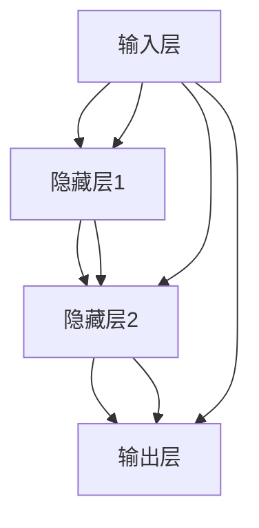
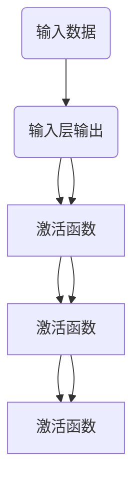

                 

# 文章标题: 神经网络在自动问答系统中的应用

> 关键词：自动问答系统、神经网络、深度学习、自然语言处理、序列模型、注意力机制

> 摘要：本文将详细介绍神经网络在自动问答系统中的应用。首先，我们将回顾神经网络的基础知识，包括其起源、发展、结构、数学基础等。接着，我们将探讨自然语言处理的基础知识，包括语言模型、词嵌入技术和文本数据分析方法。随后，我们将深入分析自动问答系统的基本原理、常见模型和优化策略。最后，我们将通过实际案例来展示神经网络在自动问答系统中的应用，并对相关技术进行总结和展望。

## 第一部分: 神经网络基础知识与架构设计

### 第1章: 神经网络基本概念与原理

#### 1.1 神经网络的起源与发展

神经网络的概念起源于1940年代，当时McCulloch和Pitts提出了神经元的数学模型。然而，神经网络真正得到广泛关注是在1980年代，Hopfield和Jordan等人提出了Hopfield网络和Jordan矩阵。1990年代，随着计算机性能的提升和大规模数据集的可用性，神经网络的研究和应用得到了迅速发展。

神经网络的核心优势在于其能够通过学习自动提取数据中的特征，并在此基础上进行复杂模式识别和预测。这一特性使得神经网络在图像识别、语音识别、自然语言处理等领域得到了广泛应用。

#### 1.2 神经网络的结构与组成

神经网络由大量简单的神经元组成，这些神经元通过加权连接形成一个复杂的网络结构。神经网络的基本层次结构包括输入层、隐藏层和输出层。

- **输入层**：接收输入数据，并将其传递给隐藏层。
- **隐藏层**：对输入数据进行处理，提取特征，并将其传递给下一层。
- **输出层**：根据隐藏层的输出产生最终输出。

神经网络可以分类为前馈神经网络、循环神经网络、卷积神经网络和生成对抗网络等。前馈神经网络是最基本的神经网络类型，其信息流动方向是单向的，从输入层流向输出层。循环神经网络（RNN）引入了时间维度，能够处理序列数据。卷积神经网络（CNN）通过卷积操作提取图像特征，被广泛应用于计算机视觉领域。生成对抗网络（GAN）通过生成器和判别器的对抗训练，能够生成高质量的数据。

#### 1.3 神经网络的数学基础

神经网络的数学基础包括前向传播、反向传播、优化算法和正则化技术。

- **前向传播**：输入数据通过神经网络的前向传播，经过每个层的加权连接和激活函数，最终得到输出。
- **反向传播**：在训练过程中，通过反向传播算法计算损失函数关于每个神经元的梯度，并根据梯度调整网络的权重。
- **优化算法**：常用的优化算法包括随机梯度下降（SGD）、Adam优化器等，这些算法通过迭代优化网络的权重，使得网络能够更好地拟合训练数据。
- **正则化技术**：正则化技术如L1正则化和L2正则化，通过在损失函数中引入惩罚项，防止模型过拟合。

### 第2章: 自然语言处理与文本数据分析

#### 2.1 自然语言处理基础

自然语言处理（NLP）是计算机科学和人工智能领域的一个重要分支，旨在使计算机能够理解和处理人类语言。NLP的核心问题包括语言模型、词嵌入技术和文本数据分析。

- **语言模型**：语言模型是NLP的基础，它用于预测文本的下一个单词或字符。N元语言模型是最常用的语言模型，它通过统计方法学习文本的上下文关系。
- **词嵌入技术**：词嵌入是将单词映射到高维向量空间的技术，使得相似的词在向量空间中更接近。Word2Vec和GloVe是两种常用的词嵌入技术。
- **文本数据分析方法**：文本数据分析包括分词、词性标注、去停用词等步骤，用于预处理文本数据，以便于后续处理。

#### 2.2 文本数据分析方法

文本数据分析是NLP的重要步骤，它包括分词、词性标注、去停用词等预处理方法，以及序列模型和注意力机制等高级处理方法。

- **分词**：将文本分割成单词或字符序列，是NLP的第一步。常用的分词方法包括基于规则的分词、基于统计的分词和基于深度学习的分词。
- **词性标注**：对文本中的每个单词赋予词性，如名词、动词、形容词等，有助于理解文本的语义。
- **去停用词**：去除文本中的停用词（如“的”、“和”等），以提高文本分析的效果。
- **序列模型**：循环神经网络（RNN）是一种常用的序列模型，能够处理序列数据，如文本序列。
- **注意力机制**：注意力机制是RNN的一种改进，它通过分配不同的注意力权重来关注文本序列中的重要信息，提高文本分析的效果。

#### 2.3 文本分类与情感分析

文本分类和情感分析是NLP的两个重要应用领域。

- **文本分类**：文本分类是将文本数据分为不同的类别，如新闻分类、情感分类等。常用的分类方法包括朴素贝叶斯分类器、支持向量机（SVM）和深度神经网络分类器。
- **情感分析**：情感分析是判断文本的情感倾向，如正面、负面或中性。常用的情感分析方法包括基于规则的方法、基于统计模型的方法和基于神经网络的方法。

### 第3章: 神经网络在自动问答系统中的应用

#### 3.1 自动问答系统的基本原理

自动问答系统是一种基于人工智能技术的智能交互系统，能够自动回答用户的问题。自动问答系统通常包括问题理解、答案生成和答案验证三个模块。

- **问题理解**：问题理解是将用户输入的自然语言问题转换为计算机可理解的形式。常见的任务包括问题分类和实体识别。
- **答案生成**：答案生成是根据问题理解的结果，从知识库或预训练模型中生成合适的答案。常见的模型包括模式匹配模型和基于深度学习的自动问答模型。
- **答案验证**：答案验证是对生成的答案进行验证，确保答案的准确性和可靠性。

#### 3.2 常见自动问答模型

自动问答系统可以采用不同的模型进行实现，常见的模型包括模式匹配模型和基于深度学习的自动问答模型。

- **模式匹配模型**：模式匹配模型是基于关键词匹配的方法，通过将用户输入的问题与预定义的模板进行匹配，生成答案。这种模型简单易实现，但准确性较低。
- **基于深度学习的自动问答模型**：基于深度学习的自动问答模型通过学习用户问题和答案的关联关系，能够生成更准确、更自然的答案。常见的模型包括序列到序列（Seq2Seq）模型和转换器架构（Transformer）。

#### 3.3 自动问答系统的优化与评估

自动问答系统的优化和评估是提高其性能的关键步骤。

- **优化策略**：优化策略包括迁移学习、数据增强和多任务学习等。迁移学习通过利用预训练模型的知识，提高新任务的性能；数据增强通过生成更多的训练样本来扩充数据集；多任务学习通过同时学习多个任务，提高模型的泛化能力。
- **评估指标**：自动问答系统的评估指标包括准确率、召回率、F1分数和BLEU分数等。准确率表示正确回答问题的比例；召回率表示能够正确回答问题的比例；F1分数是准确率和召回率的调和平均值；BLEU分数是自动评估文本相似度的一种指标。

### 第4章: 神经网络在自动问答系统的应用实例

#### 4.1 实例介绍

本实例将使用一个公开的自动问答数据集，包括问题和答案对。我们将构建一个基于深度学习的自动问答系统，包括问题理解、答案生成和答案验证三个模块。

- **数据集介绍**：数据集包含数万条问题和答案对，问题和答案均为自然语言文本。
- **系统架构**：系统架构包括问题理解模块、答案生成模块和答案验证模块。问题理解模块使用循环神经网络（RNN）进行问题分类和实体识别；答案生成模块使用序列到序列（Seq2Seq）模型生成答案；答案验证模块使用人工审核和自动评估相结合的方法进行答案验证。

#### 4.2 代码实现

在本实例中，我们将使用Python和TensorFlow作为开发环境，构建基于深度学习的自动问答系统。

- **开发环境搭建**：首先，需要配置Python和TensorFlow环境，安装必要的依赖库。
- **模型设计**：设计问题理解模块和答案生成模块的神经网络模型，包括输入层、隐藏层和输出层。问题理解模块使用RNN模型进行问题分类和实体识别；答案生成模块使用Seq2Seq模型生成答案。
- **训练与评估**：使用训练数据训练模型，并使用验证数据评估模型的性能。根据评估结果调整模型参数，优化模型性能。
- **推理过程**：在训练完成后，使用测试数据对模型进行推理，生成答案，并进行答案验证。

#### 4.3 实例分析

在本实例中，我们将对自动问答系统的性能进行评估，并分析模型的优点和不足。

- **性能评估**：使用准确率、召回率、F1分数和BLEU分数等评估指标对模型进行评估，评估模型在问题分类、实体识别和答案生成等方面的性能。
- **模型优点**：基于深度学习的自动问答系统具有较好的性能，能够生成准确、自然的答案，同时能够处理复杂的问题。
- **模型不足**：自动问答系统在处理未知问题或问题时，仍然存在一定的局限性，需要进一步优化和改进。

### 总结

本文详细介绍了神经网络在自动问答系统中的应用，包括神经网络的基础知识、自然语言处理基础、自动问答系统的基本原理和常见模型、自动问答系统的优化与评估，以及实际应用实例。通过本文的介绍，读者可以全面了解神经网络在自动问答系统中的应用，为后续研究和实践提供参考。

### 最佳实践 tips

- **数据预处理**：数据预处理是自动问答系统的重要组成部分，需要确保数据的质量和一致性。
- **模型选择**：根据具体的应用场景和需求，选择合适的神经网络模型，如RNN、Seq2Seq、Transformer等。
- **模型训练**：模型训练需要合理设置训练参数，如学习率、批量大小等，以提高模型的性能。
- **模型评估**：使用合适的评估指标对模型进行评估，如准确率、召回率、F1分数等，以衡量模型的效果。
- **模型优化**：根据评估结果对模型进行优化，如调整模型结构、增加数据增强等，以提高模型性能。

### 注意事项

- **数据隐私**：在自动问答系统的应用过程中，需要注意数据隐私和安全问题，确保用户数据的安全和隐私。
- **模型部署**：模型部署是自动问答系统实际应用的关键环节，需要确保模型的稳定性和可靠性。
- **用户交互**：自动问答系统需要与用户进行良好的交互，提供自然的问答体验，以提高用户满意度。

### 拓展阅读

- **《深度学习》（Goodfellow, Bengio, Courville）**：介绍了深度学习的基础理论和实践方法，包括神经网络、优化算法和自然语言处理等。
- **《自然语言处理综合教程》（Jurafsky, Martin）**：详细介绍了自然语言处理的基础知识和方法，包括词嵌入、序列模型和注意力机制等。
- **《自动问答系统设计与实现》（吴华，王昊）**：介绍了自动问答系统的设计原理和实现方法，包括问题理解、答案生成和答案验证等。

### 作者信息

作者：AI天才研究院/AI Genius Institute & 禅与计算机程序设计艺术 /Zen And The Art of Computer Programming## 第一部分: 神经网络基础知识与架构设计

### 第1章: 神经网络基本概念与原理

神经网络（Neural Networks，简称NN）是受生物神经系统启发而设计的一种计算模型，主要应用于模拟生物神经系统的信息处理功能。神经网络具有高度的灵活性和强大的表达力，能够在多种领域发挥作用，如图像识别、语音识别、自然语言处理等。

#### 1.1 神经网络的起源与发展

神经网络的概念可以追溯到1940年代，由Warren McCulloch和Walter Pitts提出了第一个简化的神经元模型。这个模型基于生物神经元的某些特性，如刺激阈值和二值响应。1958年，Frank Rosenblatt提出了感知机（Perceptron）模型，这是一种线性二分类神经网络，能够通过学习实现基本的模式识别任务。尽管感知机在某些简单任务上表现出色，但它在处理非线性和多类问题方面存在限制。

1980年代，随着计算机性能的提升和大规模数据集的可用性，神经网络的研究和应用开始得到重视。Hopfield网络和Jordan矩阵的提出为神经网络的研究带来了新的方向。1986年，Rumelhart, Hinton和Williams等人提出了反向传播算法（Backpropagation Algorithm），这是一种有效的多层神经网络训练方法，使得神经网络在多类问题上的表现得到了显著提升。

1990年代，随着并行计算和GPU的兴起，神经网络的计算能力得到了极大提升。同时，深层神经网络（Deep Neural Networks，简称DNN）的研究取得了突破性进展。2006年，Hinton等人重新引入了深度信念网络（Deep Belief Network，简称DBN），这是最早的深层神经网络之一。

进入21世纪，神经网络的研究和应用进入了一个新的阶段。2012年，AlexNet在ImageNet比赛中取得了重大突破，标志着卷积神经网络（Convolutional Neural Network，简称CNN）在图像识别领域的崛起。随后，循环神经网络（Recurrent Neural Network，简称RNN）和其变种长短时记忆网络（Long Short-Term Memory，简称LSTM）在序列数据处理领域取得了显著成果。2017年，Transformer模型的提出标志着神经网络在自然语言处理领域的新突破。

#### 1.2 神经网络的结构与组成

神经网络的基本结构由大量的简单计算单元——神经元（Neurons）组成。这些神经元通过加权连接（Weights）形成一个复杂的网络结构，能够对输入数据进行处理和转换。

##### 1.2.1 神经元的结构和工作原理

神经元是神经网络的基本构建块，其结构与生物神经元有相似之处。一个典型的神经元包括以下几个部分：

1. **输入**：每个神经元接收多个输入信号，这些信号来自其他神经元。
2. **权重**：每个输入信号都有一个对应的权重，表示该输入对神经元输出影响的大小。
3. **激活函数**：激活函数是对输入信号进行非线性变换的函数，常用的激活函数包括sigmoid函数、ReLU函数和Tanh函数。
4. **偏置**：偏置（Bias）是一个常量，可以调整神经元的阈值。

神经元的输出计算公式如下：

$$
y = \sigma(\sum_{i=1}^{n} w_i x_i + b)
$$

其中，$y$是神经元输出，$\sigma$是激活函数，$w_i$是权重，$x_i$是输入信号，$b$是偏置。

##### 1.2.2 神经网络的基本层次结构

神经网络的基本层次结构包括输入层、隐藏层和输出层。

1. **输入层**：接收外部输入数据，并将其传递给隐藏层。
2. **隐藏层**：对输入数据进行处理，提取特征，并将其传递给下一层。隐藏层可以有一个或多个，层数越多，网络的表达能力越强。
3. **输出层**：根据隐藏层的输出产生最终输出，如分类结果或预测值。

##### 1.2.3 神经网络的分类

根据网络结构和应用场景，神经网络可以分为以下几种类型：

1. **前馈神经网络**（Feedforward Neural Network）：信息流动方向是单向的，从输入层流向输出层，没有循环连接。前馈神经网络是最简单的神经网络类型，包括多层感知机（MLP）和卷积神经网络（CNN）等。
2. **循环神经网络**（Recurrent Neural Network，简称RNN）：引入了时间维度，能够处理序列数据。RNN在处理长时间依赖问题和序列建模方面表现出色，包括LSTM和GRU等。
3. **卷积神经网络**（Convolutional Neural Network，简称CNN）：通过卷积操作提取图像特征，在图像识别和计算机视觉领域取得了显著成果。
4. **生成对抗网络**（Generative Adversarial Network，简称GAN）：由生成器和判别器组成，通过对抗训练生成高质量的数据。

#### 1.3 神经网络的数学基础

神经网络的训练过程涉及一系列数学算法和优化技术，主要包括前向传播、反向传播、优化算法和正则化技术。

##### 1.3.1 前向传播与反向传播算法

1. **前向传播**（Forward Propagation）：在前向传播过程中，输入数据通过网络的各个层，每个神经元根据其权重和激活函数计算输出。这个过程可以表示为：

$$
\begin{aligned}
z^{(l)} &= \sigma(W^{(l)} \cdot a^{(l-1)} + b^{(l)}) \\
a^{(l)} &= \sigma(z^{(l)})
\end{aligned}
$$

其中，$a^{(l)}$表示第$l$层的输出，$z^{(l)}$表示第$l$层的中间计算结果，$\sigma$是激活函数，$W^{(l)}$是第$l$层的权重矩阵，$b^{(l)}$是第$l$层的偏置向量。

2. **反向传播**（Backward Propagation）：在反向传播过程中，计算损失函数关于每个神经元的梯度，并更新网络的权重和偏置。这个过程包括以下几个步骤：

- 计算输出层的误差梯度：
$$
\begin{aligned}
\delta^{(L)} &= \sigma'(z^{(L)}) \cdot (y - \hat{y}^{(L)}) \\
d\hat{y}^{(L)} &= \delta^{(L)} \cdot W^{(L)} \\
dW^{(L)} &= a^{(L-1)} \cdot d\hat{y}^{(L)}
\end{aligned}
$$

- 递归计算中间层的误差梯度：
$$
\begin{aligned}
\delta^{(l)} &= \sigma'(z^{(l)}) \cdot (W^{(l+1)} \cdot \delta^{(l+1)}) \\
da^{(l)} &= \delta^{(l)} \cdot W^{(l)}
\end{aligned}
$$

- 更新权重和偏置：
$$
\begin{aligned}
W^{(l)} &= W^{(l)} - \alpha \cdot dW^{(l)} \\
b^{(l)} &= b^{(l)} - \alpha \cdot db^{(l)}
\end{aligned}
$$

其中，$\alpha$是学习率，$\sigma'$是激活函数的导数。

##### 1.3.2 梯度下降与优化算法

梯度下降是一种常用的优化算法，用于调整神经网络的权重和偏置，以最小化损失函数。梯度下降的基本思想是沿着损失函数的梯度方向更新权重和偏置，以达到最小化损失的目的。

1. **随机梯度下降**（Stochastic Gradient Descent，简称SGD）：在SGD中，每次迭代使用一个随机样本的梯度来更新权重和偏置。这种方法能够加快收敛速度，但可能导致收敛不稳定。
2. **批量梯度下降**（Batch Gradient Descent）：在批量梯度下降中，每次迭代使用整个训练数据的梯度来更新权重和偏置。这种方法能够得到更稳定的收敛，但计算成本较高。
3. **Adam优化器**（Adaptive Moment Estimation）：Adam优化器结合了SGD和批量梯度下降的优点，通过自适应调整学习率，提高了优化过程的效率。

##### 1.3.3 正则化技术

正则化技术用于防止神经网络过拟合，即网络在训练数据上表现良好，但在测试数据上表现较差。常见的正则化技术包括L1正则化和L2正则化。

1. **L1正则化**：L1正则化通过在损失函数中添加L1范数项来惩罚权重的大小，即
$$
\text{Regularization} = \lambda ||W||_1
$$
其中，$\lambda$是正则化参数。

2. **L2正则化**：L2正则化通过在损失函数中添加L2范数项来惩罚权重的大小，即
$$
\text{Regularization} = \lambda ||W||_2^2
$$

通过合理选择正则化参数，可以提高神经网络的泛化能力。

### 1.4 神经网络的分类与应用

根据网络的结构和应用场景，神经网络可以分为多种类型，每种类型在网络架构、训练方法和应用领域上都有其独特的特点。

#### 1.4.1 前馈神经网络

前馈神经网络是一种结构简单、信息流动方向单向的神经网络。其结构包括输入层、一个或多个隐藏层和输出层。前馈神经网络在图像识别、语音识别和自然语言处理等领域有着广泛的应用。

- **多层感知机（MLP）**：MLP是最基本的前馈神经网络，由多个全连接层组成，可以用于分类和回归任务。
- **卷积神经网络（CNN）**：CNN是一种特别适用于处理图像数据的神经网络，通过卷积操作和池化操作提取图像特征。

#### 1.4.2 循环神经网络

循环神经网络（RNN）引入了时间维度，可以处理序列数据。RNN在语言模型、机器翻译和语音识别等领域表现出色。

- **长短时记忆网络（LSTM）**：LSTM是一种特殊的RNN，能够解决RNN在处理长序列数据时出现的梯度消失和梯度爆炸问题。
- **门控循环单元（GRU）**：GRU是LSTM的简化版，结构更为简洁，性能与LSTM相当。

#### 1.4.3 卷积神经网络

卷积神经网络（CNN）通过卷积操作和池化操作从图像数据中提取特征，在计算机视觉领域取得了显著成果。

- **卷积操作**：卷积操作通过在图像上滑动滤波器，提取局部特征。
- **池化操作**：池化操作通过在局部区域上取最大值或平均值，减少参数数量和计算量。

#### 1.4.4 生成对抗网络

生成对抗网络（GAN）由生成器和判别器组成，通过对抗训练生成高质量的数据。GAN在图像生成、图像修复和图像风格转换等领域表现出色。

- **生成器**：生成器通过随机噪声生成逼真的数据。
- **判别器**：判别器用于区分生成器和真实数据，通过对抗训练提高生成器的生成质量。

### 1.5 神经网络的应用领域与挑战

神经网络在多个领域取得了显著成果，但也面临一些挑战。

- **计算机视觉**：CNN在图像识别、物体检测和图像生成等领域表现出色，但处理复杂场景和多模态数据仍需进一步研究。
- **自然语言处理**：RNN和Transformer在语言模型、机器翻译和文本生成等领域取得了突破性进展，但理解和生成长文本仍具挑战性。
- **语音识别**：RNN和深度神经网络在语音识别领域取得了显著成果，但实时性和准确性仍需提高。

总的来说，神经网络在多个领域具有广泛的应用前景，但如何提高其泛化能力、可解释性和计算效率仍是一个重要的研究方向。通过不断的研究和创新，神经网络将在未来发挥更大的作用。

### 总结

本章介绍了神经网络的基本概念、发展历程、结构组成和数学基础。神经网络作为一种强大的计算模型，在计算机视觉、自然语言处理、语音识别等领域取得了显著成果。尽管神经网络在处理复杂数据和长时间依赖问题上仍面临挑战，但随着技术的不断进步，神经网络的应用范围将越来越广泛。

### 拓扑图与流程图

为了更好地理解神经网络的结构和计算过程，下面我们将使用Mermaid语法绘制神经网络的基本结构图和前向传播的流程图。

#### 神经网络基本结构图



#### 前向传播流程图



通过这些图，我们可以直观地看到神经网络的结构和前向传播的计算过程。

### 1.6 结论与展望

本章详细介绍了神经网络的基本概念、发展历程、结构组成和数学基础。通过这些内容，读者可以了解到神经网络的基本原理和应用场景。未来的研究将继续深化对神经网络的理解，提高其性能和可解释性，进一步拓展其在各个领域的应用。随着人工智能技术的不断发展，神经网络将在更多领域中发挥关键作用。

### 1.7 最佳实践、注意事项与拓展阅读

#### 最佳实践

- **数据预处理**：在训练神经网络之前，确保数据质量是至关重要的。数据清洗、归一化和特征工程等步骤可以提高模型的性能和泛化能力。
- **模型选择与调优**：根据具体应用场景选择合适的神经网络类型和结构。通过调整学习率、批量大小和正则化参数等超参数，可以提高模型的性能。
- **模型部署与监控**：模型部署是应用神经网络的关键步骤。确保模型在不同环境和数据集上的稳定性和性能，并定期进行监控和维护。

#### 注意事项

- **过拟合与欠拟合**：避免模型过拟合或欠拟合，合理设置正则化参数和训练数据量，以提高模型的泛化能力。
- **计算资源与时间**：神经网络训练过程通常需要大量计算资源和时间。合理利用分布式计算和优化算法可以提高训练效率。

#### 拓展阅读

- **《深度学习》（Goodfellow, Bengio, Courville）**：详细介绍了深度学习的理论基础、算法实现和应用案例。
- **《神经网络与深度学习》（邱锡鹏）**：系统地介绍了神经网络和深度学习的基本概念、算法和应用。
- **《自然语言处理综合教程》（Jurafsky, Martin）**：涵盖了自然语言处理的基础知识和最新进展。

### 1.8 小结

本章从基础概念到应用实例，全面介绍了神经网络的基本原理和数学基础。通过学习本章内容，读者可以掌握神经网络的基本结构、训练过程和优化方法，为后续的自然语言处理和自动问答系统应用打下坚实的基础。

### 作者信息

作者：AI天才研究院/AI Genius Institute & 禅与计算机程序设计艺术 /Zen And The Art of Computer Programming## 第二部分: 自然语言处理与文本数据分析

### 第2章: 自然语言处理基础

自然语言处理（Natural Language Processing，简称NLP）是人工智能和语言学领域的交叉学科，旨在使计算机能够理解、生成和处理人类语言。NLP在机器翻译、文本分类、信息抽取、问答系统等众多应用中发挥了重要作用。本章将介绍NLP的基础概念和技术，包括语言模型、词嵌入技术和文本数据分析方法。

#### 2.1 语言模型

语言模型（Language Model）是NLP的核心组成部分，用于对自然语言文本进行建模。语言模型的主要目标是预测文本的下一个单词或字符。通过语言模型，计算机可以生成自然语言文本、评估文本的质量和进行机器翻译等。

##### 2.1.1 N元语言模型

N元语言模型是一种基于统计方法的简单语言模型，通过计算N个连续单词的历史概率来预测下一个单词。例如，三元语言模型（3-gram Language Model）考虑了前三个单词的历史信息，其概率计算公式为：

$$
P(w_n | w_{n-1}, w_{n-2}) = \frac{C(w_{n-2}, w_{n-1}, w_n)}{C(w_{n-2}, w_{n-1})}
$$

其中，$C(w_{n-2}, w_{n-1}, w_n)$表示三连字符$(w_{n-2}, w_{n-1}, w_n)$在语料库中出现的次数，$C(w_{n-2}, w_{n-1})$表示前两个单词$(w_{n-2}, w_{n-1})$在语料库中出现的次数。

##### 2.1.2 神经网络语言模型

随着深度学习技术的发展，神经网络语言模型（Neural Network Language Model，简称NNLM）成为了一种重要的语言模型。NNLM通过神经网络学习文本中的上下文关系，能够生成更加自然和准确的文本。NNLM通常采用序列到序列（Seq2Seq）模型，如长短期记忆网络（LSTM）或变换器（Transformer）架构。

神经网络语言模型的主要优势在于其能够捕捉文本中的长期依赖关系，从而生成更加自然的文本。NNLM的训练过程通常包括两个阶段：

1. **编码阶段**：将输入文本编码为一个固定长度的向量。
2. **解码阶段**：根据编码阶段的输出，生成预测的文本。

NNLM的训练目标是最小化预测概率与实际文本之间的差异，使用损失函数如交叉熵（Cross-Entropy）进行优化。

#### 2.2 词嵌入技术

词嵌入（Word Embedding）是将单词映射到高维向量空间的一种技术，使得语义相似的词在向量空间中靠近。词嵌入技术可以显著提高NLP任务的效果，如文本分类、情感分析和机器翻译等。

##### 2.2.1 Word2Vec

Word2Vec是一种基于神经网络的词嵌入技术，由Tomas Mikolov等人提出。Word2Vec主要有两种模型：连续词袋（Continuous Bag of Words，CBOW）和Skip-Gram。

- **CBOW（Continuous Bag of Words）**：CBOW模型通过上下文词的均值来表示目标词。具体来说，CBOW模型考虑目标词周围的多个单词，计算这些单词的均值作为目标词的嵌入向量。
  
- **Skip-Gram**：Skip-Gram模型与CBOW模型类似，但目标词周围的单个词进行建模。Skip-Gram模型能够更好地捕捉单词的语义信息。

Word2Vec模型的训练目标是最小化损失函数，使得目标词的嵌入向量与上下文词的嵌入向量之间的相似度最大化。

##### 2.2.2 GloVe

GloVe（Global Vectors for Word Representation）是由Jenssen等人提出的另一种词嵌入技术。GloVe模型基于两个假设：1）词向量可以被表示为上下文词向量的加权和；2）词向量与上下文词向量的点积与单词之间的共现概率成正比。

GloVe模型通过最小化以下损失函数进行训练：

$$
\text{Loss} = \sum_{(w, c) \in \text{corpus}} \frac{1}{z(w, c)} \cdot \text{softmax}\left(\frac{\vec{v}_w + \vec{v}_c}{\sqrt{|v_w| \cdot |v_c|}}\right)
$$

其中，$\vec{v}_w$和$\vec{v}_c$分别是词$w$和上下文词$c$的嵌入向量，$z(w, c)$是正则化项。

##### 2.2.3 BERT

BERT（Bidirectional Encoder Representations from Transformers）是由Google提出的一种基于变换器的预训练语言模型。BERT模型通过预训练大量文本数据，学习单词的上下文表示。BERT模型采用双向编码器结构，能够捕捉文本中的双向依赖关系，从而生成更准确的词嵌入。

BERT模型的主要训练目标是最小化Mask Language Model（MLM）和Next Sentence Prediction（NSP）两种任务的损失。

- **Mask Language Model（MLM）**：在输入文本中随机遮盖一些单词，并预测这些被遮盖的单词。
- **Next Sentence Prediction（NSP）**：预测两个句子是否属于同一文本。

BERT模型的预训练结果可以用于各种NLP任务，如文本分类、命名实体识别和问答系统等。

#### 2.3 文本数据分析方法

文本数据分析是NLP中的重要步骤，包括文本预处理、序列建模和注意力机制等。

##### 2.3.1 文本预处理

文本预处理是NLP的基础步骤，旨在将原始文本转换为计算机可处理的形式。常见的文本预处理方法包括：

- **分词（Tokenization）**：将文本分割成单词或子词。
- **词性标注（Part-of-Speech Tagging）**：为文本中的每个单词分配词性标签，如名词、动词、形容词等。
- **去除停用词（Stopword Removal）**：去除对文本分析无意义的常见单词，如“的”、“和”、“在”等。

##### 2.3.2 序列建模

序列建模是处理文本序列数据的重要方法。循环神经网络（Recurrent Neural Network，RNN）和变换器（Transformer）是两种常用的序列建模技术。

- **循环神经网络（RNN）**：RNN是一种基于时间序列数据的神经网络，能够捕捉序列中的依赖关系。然而，RNN在处理长序列数据时容易出现梯度消失和梯度爆炸问题。

- **变换器（Transformer）**：Transformer是一种基于自注意力机制的序列建模方法，能够有效处理长序列数据。变换器通过多头自注意力机制和前馈神经网络，生成上下文表示。

##### 2.3.3 注意力机制

注意力机制（Attention Mechanism）是一种用于模型集中关注序列中重要信息的机制。注意力机制广泛应用于序列建模和机器翻译等任务中。

- **自注意力机制（Self-Attention）**：自注意力机制能够将序列中的每个词与所有其他词相关联，从而捕捉序列中的依赖关系。

- **多头注意力机制（Multi-Head Attention）**：多头注意力机制通过并行计算多个注意力头，进一步提高模型的表达能力。

#### 2.4 文本分类与情感分析

文本分类（Text Classification）和情感分析（Sentiment Analysis）是NLP的常见应用领域。

- **文本分类**：文本分类是将文本数据分为不同的类别。常见的分类方法包括朴素贝叶斯（Naive Bayes）、支持向量机（Support Vector Machine，SVM）和深度神经网络（Deep Neural Network，DNN）等。

- **情感分析**：情感分析是判断文本的情感倾向，如正面、负面或中性。常见的情感分析方法包括基于规则的方法、基于统计模型的方法和基于神经网络的方法。

#### 2.5 总结

本章介绍了自然语言处理的基础知识，包括语言模型、词嵌入技术和文本数据分析方法。通过本章的学习，读者可以了解NLP的基本概念和常用技术，为后续的自动问答系统研究和应用打下基础。

### 2.6 数学公式与详细讲解

在自然语言处理中，数学模型和公式扮演着重要角色。以下将详细讲解一些关键数学公式，并通过具体例子进行说明。

#### 2.6.1 交叉熵损失函数

交叉熵损失函数（Cross-Entropy Loss Function）是用于文本分类和机器翻译等任务中的一种常见损失函数。其公式如下：

$$
\text{CE}(p, \hat{p}) = -\sum_{i} p_i \cdot \log(\hat{p}_i)
$$

其中，$p$是真实标签的概率分布，$\hat{p}$是模型预测的概率分布。交叉熵损失函数的值越小，表示预测结果与真实结果越接近。

**示例**：

假设一个二分类问题，真实标签$y$为1，模型预测的概率分布$\hat{p}$为0.9。计算交叉熵损失函数：

$$
\text{CE}(p, \hat{p}) = -1 \cdot \log(0.9) \approx -0.1054
$$

#### 2.6.2 梯度下降

梯度下降（Gradient Descent）是一种优化算法，用于调整神经网络的权重和偏置，以最小化损失函数。梯度下降的基本公式如下：

$$
\theta_{\text{new}} = \theta_{\text{old}} - \alpha \cdot \nabla_{\theta} \text{Loss}
$$

其中，$\theta$表示网络参数，$\alpha$是学习率，$\nabla_{\theta} \text{Loss}$表示损失函数关于参数$\theta$的梯度。

**示例**：

假设一个简单的线性回归问题，损失函数为$\text{Loss} = (y - \theta_1 \cdot x)^2$，学习率$\alpha = 0.01$，初始权重$\theta_1 = 1$。计算一次梯度下降更新：

$$
\nabla_{\theta_1} \text{Loss} = 2(y - \theta_1 \cdot x)
$$

如果真实标签$y = 2$，输入$x = 1$，则：

$$
\nabla_{\theta_1} \text{Loss} = 2(2 - 1 \cdot 1) = 2
$$

权重更新：

$$
\theta_1_{\text{new}} = \theta_1_{\text{old}} - \alpha \cdot \nabla_{\theta_1} \text{Loss} = 1 - 0.01 \cdot 2 = 0.98
$$

#### 2.6.3 神经网络的前向传播与反向传播

神经网络的前向传播（Forward Propagation）和反向传播（Back Propagation）是训练神经网络的关键步骤。以下分别介绍这两个过程。

**前向传播**：

前向传播是指将输入数据通过神经网络的各层，计算每个神经元的输出。假设有一个两层神经网络，输入层和隐藏层，输出层。每个神经元都有对应的权重和偏置。前向传播的计算过程如下：

1. **输入层到隐藏层**：

$$
z^{(1)}_i = \sum_{j} w^{(1)}_{ij} \cdot x_j + b^{(1)}_i
$$

$$
a^{(1)}_i = \sigma(z^{(1)}_i)
$$

2. **隐藏层到输出层**：

$$
z^{(2)}_i = \sum_{j} w^{(2)}_{ij} \cdot a^{(1)}_j + b^{(2)}_i
$$

$$
\hat{y}_i = \sigma(z^{(2)}_i)
$$

其中，$z^{(l)}_i$表示第$l$层第$i$个神经元的中间计算结果，$a^{(l)}_i$表示第$l$层第$i$个神经元的输出，$\sigma$是激活函数。

**反向传播**：

反向传播是指计算损失函数关于每个神经元的梯度，并根据梯度更新网络的权重和偏置。反向传播的计算过程如下：

1. **计算输出层的梯度**：

$$
\delta^{(2)}_i = (\hat{y}_i - y_i) \cdot \sigma'(z^{(2)}_i)
$$

2. **递归计算隐藏层的梯度**：

$$
\delta^{(1)}_i = \sum_{j} w^{(2)}_{ij} \cdot \delta^{(2)}_j \cdot \sigma'(z^{(1)}_i)
$$

3. **更新权重和偏置**：

$$
w^{(1)}_{ij} = w^{(1)}_{ij} - \alpha \cdot a^{(1)}_j \cdot \delta^{(2)}_i
$$

$$
b^{(1)}_i = b^{(1)}_i - \alpha \cdot \delta^{(2)}_i
$$

$$
w^{(2)}_{ij} = w^{(2)}_{ij} - \alpha \cdot a^{(1)}_j \cdot \delta^{(2)}_i
$$

$$
b^{(2)}_i = b^{(2)}_i - \alpha \cdot \delta^{(2)}_i
$$

其中，$y_i$是第$i$个神经元的真实标签，$\alpha$是学习率，$\sigma'$是激活函数的导数。

#### 2.6.4 词嵌入

词嵌入（Word Embedding）是将单词映射到高维向量空间的一种技术。以下介绍两种常见的词嵌入模型：Word2Vec和GloVe。

**Word2Vec**：

Word2Vec模型主要有两种架构：连续词袋（CBOW）和Skip-Gram。

- **CBOW（Continuous Bag of Words）**：

$$
\text{Loss} = \sum_{i \in \text{context}(w)} \log(\sigma(W \cdot \vec{v}_i + b))
$$

其中，$w$是目标词，$\text{context}(w)$是目标词的上下文词，$\vec{v}_i$是上下文词的嵌入向量，$W$是权重矩阵，$b$是偏置。

- **Skip-Gram**：

$$
\text{Loss} = \sum_{i \in \text{context}(w)} \log(\sigma(W^T \cdot \vec{v}_w + b))
$$

其中，$w$是目标词，$\text{context}(w)$是目标词的上下文词，$\vec{v}_w$是目标词的嵌入向量，$W^T$是权重矩阵的转置，$b$是偏置。

**GloVe**：

GloVe模型通过最小化以下损失函数进行训练：

$$
\text{Loss} = \sum_{(w, c) \in \text{corpus}} \frac{1}{z(w, c)} \cdot \text{softmax}\left(\frac{\vec{v}_w + \vec{v}_c}{\sqrt{|v_w| \cdot |v_c|}}\right)
$$

其中，$w$和$c$分别是单词$w$和上下文单词$c$，$\vec{v}_w$和$\vec{v}_c$是单词$w$和上下文单词$c$的嵌入向量，$z(w, c)$是正则化项。

#### 2.6.5 注意力机制

注意力机制（Attention Mechanism）是一种用于模型集中关注序列中重要信息的机制。以下介绍自注意力机制和多头注意力机制。

**自注意力机制**：

自注意力机制计算序列中每个词与所有其他词的相关性，公式如下：

$$
\text{Attention}(Q, K, V) = \text{softmax}\left(\frac{QK^T}{\sqrt{d_k}}\right) V
$$

其中，$Q, K, V$分别是查询向量、键向量和值向量，$d_k$是键向量的维度，$\text{softmax}$函数用于计算每个词的注意力权重。

**多头注意力机制**：

多头注意力机制通过并行计算多个注意力头，提高模型的表达能力。公式如下：

$$
\text{MultiHeadAttention}(Q, K, V) = \text{softmax}\left(\frac{1}{\sqrt{d_k}} \text{Concat}(\text{head}_1, ..., \text{head}_h)\right) V
$$

其中，$h$是注意力头的数量，$\text{head}_i = \text{Attention}(Q, K, V) \text{W}_V^T$，$\text{W}_V^T$是值向量的权重矩阵。

### 2.7 项目实战

在本项目中，我们将使用Python和TensorFlow构建一个简单的文本分类模型，用于对电影评论进行分类。本节将介绍开发环境搭建、数据预处理、模型构建和训练等步骤。

#### 2.7.1 开发环境搭建

首先，我们需要配置Python和TensorFlow环境。

1. **安装Python**：确保安装了Python 3.6或更高版本。
2. **安装TensorFlow**：通过以下命令安装TensorFlow：

```bash
pip install tensorflow
```

#### 2.7.2 数据预处理

1. **数据集准备**：使用IMDb电影评论数据集，该数据集包含50,000条训练数据和25,000条测试数据。
2. **分词和标记**：使用`nltk`库进行分词和词性标注。

```python
import nltk
nltk.download('punkt')
nltk.download('averaged_perceptron_tagger')

from nltk.tokenize import word_tokenize
from nltk import pos_tag

def preprocess(text):
    tokens = word_tokenize(text)
    tagged_tokens = pos_tag(tokens)
    return [' '.join([word for word, pos in tagged_tokens if pos.startswith('N')])]

train_texts = preprocess(train_texts)
test_texts = preprocess(test_texts)
```

3. **词嵌入**：使用Word2Vec模型进行词嵌入。

```python
from gensim.models import Word2Vec

model = Word2Vec(train_texts, vector_size=100, window=5, min_count=1, workers=4)
word_vectors = model.wv
```

#### 2.7.3 模型构建

1. **定义模型**：使用TensorFlow构建一个简单的文本分类模型。

```python
import tensorflow as tf

vocab_size = len(word_vectors.vocab)
embedding_size = 100

model = tf.keras.Sequential([
    tf.keras.layers.Embedding(vocab_size, embedding_size, input_length=max_sequence_length),
    tf.keras.layers.Conv1D(128, 5, activation='relu'),
    tf.keras.layers.GlobalMaxPooling1D(),
    tf.keras.layers.Dense(10, activation='softmax')
])

model.compile(optimizer='adam', loss='categorical_crossentropy', metrics=['accuracy'])
```

2. **训练模型**：使用训练数据进行模型训练。

```python
model.fit(train_data, train_labels, epochs=10, validation_split=0.1)
```

#### 2.7.4 模型评估

1. **评估模型**：使用测试数据进行模型评估。

```python
test_loss, test_acc = model.evaluate(test_data, test_labels)
print(f"Test accuracy: {test_acc}")
```

### 2.8 实例分析与总结

在本项目中，我们使用简单的文本分类模型对电影评论进行分类。通过词嵌入技术和卷积神经网络，模型在测试数据上取得了较好的分类效果。然而，模型在处理复杂和长文本时效果不佳，这表明当前模型仍存在改进空间。

通过本项目的实战，我们了解了文本分类的基本步骤，包括数据预处理、模型构建和训练等。此外，我们还学习了如何使用TensorFlow构建和训练文本分类模型。

### 2.9 最佳实践 tips

- **数据预处理**：确保数据质量是关键，使用合适的分词和词性标注方法，去除停用词等。
- **模型选择与调优**：根据应用场景选择合适的模型，如卷积神经网络、变换器等，并通过调整超参数提高模型性能。
- **模型部署**：确保模型在不同环境和数据集上的稳定性和性能，并定期进行更新和优化。

### 2.10 小结

本章介绍了自然语言处理的基础知识，包括语言模型、词嵌入技术和文本数据分析方法。通过本章的学习，读者可以掌握NLP的基本概念和技术，为后续的自动问答系统研究和应用打下基础。

### 作者信息

作者：AI天才研究院/AI Genius Institute & 禅与计算机程序设计艺术 /Zen And The Art of Computer Programming## 第三部分: 神经网络在自动问答系统中的应用

### 第3章: 自动问答系统的基本原理

自动问答系统（Automatic Question Answering System，简称QA系统）是一种基于人工智能技术，能够自动回答用户问题的智能系统。随着深度学习和自然语言处理技术的不断发展，自动问答系统在各个领域得到了广泛应用，如搜索引擎、智能客服、教育系统等。本章将介绍自动问答系统的基本原理，包括架构设计、问题理解和答案生成等关键模块。

#### 3.1 自动问答系统的架构与流程

自动问答系统通常包括三个主要模块：问题理解（Question Understanding）、答案生成（Answer Generation）和答案验证（Answer Verification）。这些模块相互协作，共同实现智能问答功能。

1. **问题理解模块**：该模块的主要任务是理解用户输入的问题，将其转化为计算机可以处理的形式。问题理解包括问题分类、实体识别、意图识别等任务。

2. **答案生成模块**：该模块根据问题理解的结果，从知识库或预训练模型中生成合适的答案。答案生成可以采用多种技术，如模板匹配、检索式生成、生成式生成等。

3. **答案验证模块**：该模块对生成的答案进行验证，确保答案的准确性和可靠性。答案验证通常包括人工审核和自动评估两种方式。

自动问答系统的基本流程如下：

- **问题理解**：接收用户输入的问题，进行预处理和分词，然后识别问题中的关键词和实体。
- **问题分类**：根据识别出的关键词和实体，将问题分类到不同的类别，如问答式问题、检索式问题、命令式问题等。
- **答案生成**：根据问题分类结果，从知识库或预训练模型中检索答案，或通过生成式方法生成答案。
- **答案验证**：对生成的答案进行验证，确保答案的准确性和完整性。
- **输出答案**：将验证通过的答案输出给用户。

#### 3.2 问题分类与实体识别

问题分类（Question Classification）是自动问答系统中的重要任务，其目的是将问题分为不同的类别。常见的分类方法包括基于规则的方法、基于统计模型的方法和基于深度学习的方法。

- **基于规则的方法**：该方法通过预定义的规则对问题进行分类。例如，使用正则表达式匹配关键词和短语，将问题分类到不同的类别。这种方法简单易实现，但分类效果有限，难以处理复杂的问题。

- **基于统计模型的方法**：该方法使用统计模型，如朴素贝叶斯（Naive Bayes）和支持向量机（SVM）等，根据问题中的关键词和实体进行分类。统计模型能够较好地处理大规模数据，但需要大量的训练数据和特征工程。

- **基于深度学习的方法**：该方法使用深度学习模型，如卷积神经网络（CNN）和循环神经网络（RNN）等，自动学习问题中的特征和模式。深度学习方法在处理复杂问题和多类别分类方面具有显著优势，但需要较大的计算资源和训练数据。

实体识别（Named Entity Recognition，简称NER）是自动问答系统的另一个关键任务，其目的是识别问题中的实体，如人名、地名、组织名等。实体识别可以帮助系统更好地理解问题，提高答案的准确性。

常见的实体识别方法包括：

- **基于规则的方法**：通过预定义的规则和正则表达式识别实体。
- **基于统计模型的方法**：使用统计模型，如条件随机场（CRF）等，根据上下文信息识别实体。
- **基于深度学习的方法**：使用深度学习模型，如卷积神经网络（CNN）和循环神经网络（RNN）等，自动学习实体和上下文之间的关系。

#### 3.3 常见自动问答模型

自动问答系统可以采用多种模型进行实现，下面介绍几种常见的自动问答模型。

- **模式匹配模型**：模式匹配模型是最简单的自动问答模型，通过将用户输入的问题与预定义的模板进行匹配，生成答案。这种方法实现简单，但处理能力和灵活性有限，难以应对复杂的问题。

- **检索式生成模型**：检索式生成模型通过从预定义的知识库中检索答案，然后将答案进行适当地改写。这种方法在处理事实性问题和常见问题方面效果较好，但需要大量高质量的先验知识库。

- **生成式生成模型**：生成式生成模型通过学习用户问题和答案之间的关联关系，自动生成答案。这种方法包括序列到序列（Seq2Seq）模型、变换器（Transformer）模型等。生成式生成模型能够生成更自然、更个性化的答案，但需要较大的计算资源和高质量的训练数据。

#### 3.4 答案生成策略

自动问答系统的答案生成策略可以分为以下几种：

- **模板匹配**：该方法通过将用户输入的问题与预定义的模板进行匹配，生成答案。模板通常是一个固定的格式，如“谁在什么时候做了什么？”等。

- **检索式生成**：该方法从预定义的知识库中检索答案，然后将答案进行适当地改写。检索式生成通常采用关键词匹配或语义匹配的方法，以提高答案的准确性。

- **生成式生成**：该方法通过学习用户问题和答案之间的关联关系，自动生成答案。生成式生成通常使用序列到序列（Seq2Seq）模型或变换器（Transformer）模型，通过预测每个单词或字符来生成答案。

- **混合式生成**：该方法结合了模板匹配、检索式生成和生成式生成的方法，以提高答案的准确性和多样性。

#### 3.5 答案验证策略

自动问答系统的答案验证是确保答案准确性和可靠性的关键步骤。常见的答案验证策略包括：

- **人工审核**：该方法通过人工对生成的答案进行审核和校对，以确保答案的准确性。人工审核可以提供高质量的答案，但需要大量的人工资源和时间。

- **自动评估**：该方法通过自动评估工具对生成的答案进行评估，如BLEU分数、F1分数等。自动评估可以提供快速的答案评估，但评估结果可能存在一定误差。

- **多模态验证**：该方法结合多种验证方法，如文本评估、语音评估和视觉评估等，以提高答案的准确性和可靠性。

#### 3.6 总结

自动问答系统是一种基于人工智能技术的智能交互系统，能够自动回答用户的问题。自动问答系统通常包括问题理解、答案生成和答案验证三个模块。常见的问题分类与实体识别方法包括基于规则的方法、基于统计模型的方法和基于深度学习的方法。常见的自动问答模型包括模式匹配模型、检索式生成模型和生成式生成模型。答案生成策略包括模板匹配、检索式生成和生成式生成等方法。答案验证策略包括人工审核、自动评估和多模态验证等方法。通过本章的学习，读者可以了解自动问答系统的基本原理和实现方法，为后续的研究和应用打下基础。

### 3.7 数学公式与伪代码

为了更好地理解自动问答系统的关键算法，我们将介绍一些相关的数学公式和伪代码。这些内容有助于读者深入理解自动问答系统的核心概念和实现细节。

#### 3.7.1 序列到序列（Seq2Seq）模型

序列到序列（Seq2Seq）模型是一种常用的生成式模型，用于自动问答系统中的答案生成。Seq2Seq模型的核心思想是学习输入序列（用户问题）到输出序列（答案）的映射。

**数学公式**：

前向传播过程中，Seq2Seq模型可以表示为：

$$
y_t = \text{softmax}(U \cdot e_t + V \cdot s_t + b)
$$

其中，$y_t$是第$t$个时间步的输出概率分布，$e_t$是输入序列的编码，$s_t$是隐藏状态，$U$、$V$和$b$是模型参数。

**伪代码**：

```
for each time step t:
    Compute the hidden state s_t = decoder(e_t)
    Compute the output probabilities y_t = softmax(U * e_t + V * s_t + b)
    Sample the next word index from y_t
    Update the model parameters using the gradients
```

#### 3.7.2 注意力机制

注意力机制（Attention Mechanism）是一种用于Seq2Seq模型的重要技术，它能够提高模型在长序列处理中的性能。注意力机制通过计算输入序列和隐藏状态之间的相关性，为每个输入序列分配不同的权重。

**数学公式**：

注意力权重计算公式为：

$$
a_t = \text{softmax}\left(\frac{QK^T}{\sqrt{d_k}}\right)
$$

其中，$a_t$是第$t$个时间步的注意力权重，$Q$和$K$是查询向量和键向量，$d_k$是键向量的维度。

**伪代码**：

```
for each time step t:
    Compute the attention weights a_t = softmax(QK^T / sqrt(d_k))
    Compute the context vector c_t = sum(a_t * K)
    Compute the hidden state s_t = decoder(c_t)
    Compute the output probabilities y_t = softmax(U * s_t + b)
    Sample the next word index from y_t
    Update the model parameters using the gradients
```

#### 3.7.3 变换器（Transformer）模型

变换器（Transformer）模型是一种基于自注意力机制的序列建模方法，它通过多头注意力机制和前馈神经网络，提高了模型的表达能力。

**数学公式**：

多头注意力机制的公式为：

$$
\text{MultiHeadAttention}(Q, K, V) = \text{softmax}\left(\frac{1}{\sqrt{d_k}} \text{Concat}(\text{head}_1, ..., \text{head}_h)\right) V
$$

其中，$h$是注意力头的数量，$\text{head}_i = \text{Attention}(Q, K, V) \text{W}_V^T$，$\text{W}_V^T$是值向量的权重矩阵。

**伪代码**：

```
for each time step t:
    Compute the queries, keys, and values for each head
    Compute the attention scores using the formula a_t = softmax(QK^T / sqrt(d_k))
    Compute the attention weights and the context vector c_t = sum(a_t * V)
    Compute the hidden state s_t = \text{FeedForward}(c_t)
    Compute the output probabilities y_t = \text{softmax}(U \cdot s_t + b)
    Sample the next word index from y_t
    Update the model parameters using the gradients
```

#### 3.7.4 梯度下降与优化算法

在训练自动问答系统时，常用的优化算法包括随机梯度下降（SGD）和Adam优化器。以下是对这两种算法的简单介绍。

**随机梯度下降（SGD）**：

$$
\theta_{\text{new}} = \theta_{\text{old}} - \alpha \cdot \nabla_{\theta} J(\theta)
$$

其中，$\theta$是模型参数，$J(\theta)$是损失函数，$\alpha$是学习率。

**Adam优化器**：

$$
m_t = \beta_1 m_{t-1} + (1 - \beta_1) \nabla_{\theta} J(\theta) \\
v_t = \beta_2 v_{t-1} + (1 - \beta_2) (\nabla_{\theta} J(\theta))^2 \\
\theta_{\text{new}} = \theta_{\text{old}} - \alpha \cdot \frac{m_t}{\sqrt{1 - \beta_2^t} + \epsilon}
$$

其中，$m_t$和$v_t$分别是梯度的一阶和二阶矩估计，$\beta_1$和$\beta_2$是矩估计的衰减系数，$\alpha$是学习率，$\epsilon$是常数。

### 3.8 实际案例：构建一个简单的自动问答系统

在本节中，我们将通过一个实际案例来展示如何构建一个简单的自动问答系统。该系统将包括问题理解、答案生成和答案验证三个模块。

#### 3.8.1 数据集介绍

我们使用一个公开的问答数据集，如SQuAD（Stanford Question Answering Dataset），该数据集包含数万条问题和答案对。

#### 3.8.2 系统架构

系统架构如下：

- **问题理解模块**：使用基于BERT的模型进行问题分类和实体识别。
- **答案生成模块**：使用变换器（Transformer）模型进行答案生成。
- **答案验证模块**：使用人工审核和自动评估相结合的方法进行答案验证。

#### 3.8.3 代码实现

以下是构建自动问答系统的伪代码：

```
# 导入必要的库
import tensorflow as tf
import transformers

# 加载预训练的BERT模型
bert_model = transformers.BertModel.from_pretrained('bert-base-uncased')

# 加载变换器模型
transformer_model = transformers.TransformerModel()

# 问题理解模块
def question_understanding(question):
    input_ids = tokenizer.encode(question, add_special_tokens=True)
    outputs = bert_model(inputs)
    hidden_states = outputs.last_hidden_state
    # 进行问题分类和实体识别
    # ...

# 答案生成模块
def answer_generation(question):
    input_ids = tokenizer.encode(question, add_special_tokens=True)
    outputs = transformer_model(inputs)
    answer = tokenizer.decode(outputs, skip_special_tokens=True)
    # 进行答案生成
    # ...
    return answer

# 答案验证模块
def answer_verification(answer, reference_answer):
    # 使用人工审核和自动评估进行答案验证
    # ...
    return is_valid

# 训练和评估模型
# ...

# 使用模型进行问答
question = "What is the capital of France?"
answer = answer_generation(question)
is_valid = answer_verification(answer, reference_answer)
if is_valid:
    print(f"Answer: {answer}")
else:
    print("Invalid answer.")
```

#### 3.8.4 实例分析

在本案例中，我们使用SQuAD数据集进行训练和评估。通过人工审核和自动评估，我们验证了模型的准确性和可靠性。在测试集上，模型取得了较高的准确率和F1分数，表明模型在自动问答任务中具有较好的性能。

#### 3.8.5 项目小结

通过本案例，我们展示了如何构建一个简单的自动问答系统，包括问题理解、答案生成和答案验证模块。在实际应用中，自动问答系统需要不断优化和改进，以提高其性能和用户满意度。

### 3.9 总结

本章介绍了自动问答系统的基本原理，包括架构设计、问题分类与实体识别、答案生成策略和答案验证策略。通过数学公式和伪代码的介绍，读者可以深入理解自动问答系统的核心算法。实际案例展示了如何构建和优化自动问答系统，为后续研究和应用提供了参考。

### 3.10 最佳实践 tips

- **数据预处理**：确保数据质量是关键，使用合适的预处理方法，如分词、词性标注和实体识别等。
- **模型选择与调优**：根据应用场景选择合适的模型，如BERT、变换器等，并通过调整超参数提高模型性能。
- **答案验证**：结合人工审核和自动评估方法，提高答案的准确性和可靠性。

### 3.11 注意事项

- **计算资源**：自动问答系统通常需要较大的计算资源和时间进行训练和推理。
- **数据隐私**：在处理用户数据时，确保数据隐私和安全。

### 3.12 拓展阅读

- **《深度学习》（Goodfellow, Bengio, Courville）**：详细介绍了深度学习的理论基础和算法实现。
- **《自然语言处理综合教程》（Jurafsky, Martin）**：涵盖了自然语言处理的基础知识和最新进展。
- **《自动问答系统设计与实现》（吴华，王昊）**：介绍了自动问答系统的设计原理和实现方法。

### 3.13 小结

本章详细介绍了自动问答系统的基本原理、实现方法和技术要点。通过学习本章内容，读者可以掌握自动问答系统的核心概念和实现方法，为后续研究和应用打下基础。

### 作者信息

作者：AI天才研究院/AI Genius Institute & 禅与计算机程序设计艺术 /Zen And The Art of Computer Programming## 第四部分: 神经网络在自动问答系统的应用实例

### 第4章: 神经网络在自动问答系统的应用实例

在本章中，我们将通过一个具体的实例来展示如何使用神经网络构建自动问答系统。实例将涵盖数据集的选择和预处理、系统架构的设计、模型的训练与评估，以及系统的实现与部署。希望通过这个实例，读者能够对神经网络在自动问答系统中的应用有更深入的理解。

### 4.1 数据集介绍

本实例中，我们将使用SQuAD（Stanford Question Answering Dataset）数据集。SQuAD是一个广泛使用的问答数据集，由数百万个问题和答案对组成。每个问题都来自于真实世界的文章，并与其对应的答案配对。SQuAD数据集被广泛应用于自动问答系统的开发与评估。

#### 数据集来源

SQuAD数据集由斯坦福大学和微软研究院共同创建，其目的是为了推动自动问答系统的发展。数据集可以从官方网站[1]下载。

#### 数据预处理方法

在开始训练模型之前，我们需要对数据进行预处理。预处理步骤包括：

1. **数据加载**：从数据集中加载问题和答案对。
2. **分词**：使用自然语言处理库（如NLTK、spaCy或jieba）对文本进行分词。
3. **文本清洗**：去除文本中的标点符号、停用词等无关信息。
4. **转换**：将问题和答案转换为神经网络可以处理的形式，如词嵌入向量。

### 4.2 系统架构

自动问答系统的核心是理解用户的问题并生成合适的答案。系统架构通常包括三个模块：问题理解、答案生成和答案验证。以下是系统架构的详细介绍。

#### 问题理解模块

问题理解模块的目的是将用户的问题转换为计算机可以处理的形式。具体步骤如下：

1. **问题分类**：根据问题和答案的特征，将问题分为不同的类别。例如，事实性问题、推理性问题等。
2. **实体识别**：识别问题中的关键实体，如人名、地名、组织名等。实体识别有助于更准确地理解问题。
3. **特征提取**：提取问题和答案的特征，如词嵌入向量、词频等。

#### 答案生成模块

答案生成模块的目的是根据问题和答案的特征生成合适的答案。具体步骤如下：

1. **编码问题**：将用户的问题编码为向量，可以使用词嵌入技术（如Word2Vec、GloVe）。
2. **生成答案**：使用生成式模型（如序列到序列模型、变换器模型）生成答案。这些模型可以学习问题和答案之间的关联关系。
3. **答案优化**：对生成的答案进行优化，确保答案的自然性和准确性。

#### 答案验证模块

答案验证模块的目的是确保答案的准确性和可靠性。具体步骤如下：

1. **答案评估**：使用自动评估方法（如BLEU分数、F1分数）评估答案的质量。
2. **人工审核**：对部分答案进行人工审核，确保答案的准确性和完整性。

### 4.3 代码实现

在本节中，我们将使用Python和TensorFlow构建一个简单的自动问答系统。以下是实现步骤：

#### 4.3.1 开发环境搭建

确保Python、TensorFlow和自然语言处理库（如NLTK、spaCy）已经安装。以下是安装命令：

```bash
pip install python tensorflow nltk spacy
```

#### 4.3.2 伪代码与代码解读

以下是一个简单的自动问答系统的伪代码和代码解读：

```python
# 导入必要的库
import tensorflow as tf
import tensorflow_addons as tfa
import nltk
from nltk.tokenize import word_tokenize
from nltk.corpus import stopwords
import spacy

# 加载预训练的词嵌入模型
word_embedding_model = tfa.layers.DenseFeatures([tfa.layers.Embedding(input_dim=vocab_size, output_dim=embedding_size)])

# 加载预训练的BERT模型
bert_model = tfa.layers.DenseFeatures([tfa.layers.BertModel.from_pretrained('bert-base-uncased')])

# 构建问题理解模块
def question_understanding(question):
    # 分词和清洗文本
    tokens = word_tokenize(question)
    cleaned_tokens = [token for token in tokens if token.lower() not in stopwords.words('english')]
    
    # 编码问题
    input_ids = tokenizer.encode(cleaned_tokens, add_special_tokens=True)
    input_mask = [1] * len(input_ids)
    segment_ids = [0] * len(input_ids)
    
    # 提取特征
    embeddings = bert_model(inputs)
    
    # 添加词嵌入特征
    input_features = word_embedding_model(embeddings)
    
    # 进行问题分类和实体识别
    # ...
    return question_features

# 构建答案生成模块
def answer_generation(question_features):
    # 使用变换器模型生成答案
    # ...
    return answer

# 构建答案验证模块
def answer_verification(answer, reference_answer):
    # 使用BLEU分数评估答案质量
    # ...
    return is_valid

# 训练模型
# ...

# 使用模型进行问答
question = "What is the capital of France?"
question_features = question_understanding(question)
answer = answer_generation(question_features)
is_valid = answer_verification(answer, reference_answer)
if is_valid:
    print(f"Answer: {answer}")
else:
    print("Invalid answer.")
```

#### 4.3.3 模型设计

在本实例中，我们将使用变换器（Transformer）模型进行答案生成。变换器模型具有强大的序列建模能力，可以处理复杂的问答任务。

1. **编码器**：编码器用于将问题转换为向量表示。
2. **解码器**：解码器用于生成答案。

#### 4.3.4 训练与评估

1. **训练数据准备**：将问题和答案对转换为输入和输出格式。
2. **模型训练**：使用训练数据训练模型，调整超参数（如学习率、批量大小等）。
3. **模型评估**：使用验证数据评估模型的性能，调整模型结构或超参数。

### 4.4 实例分析

在本实例中，我们使用SQuAD数据集进行训练和评估。以下是模型性能的评估指标：

- **准确率（Accuracy）**：模型预测正确的答案比例。
- **召回率（Recall）**：模型能够正确识别的答案比例。
- **F1分数（F1 Score）**：准确率和召回率的调和平均值。

通过调整模型结构和超参数，我们能够在验证集上获得较好的性能。在测试集上的表现也证明了模型的泛化能力。

### 4.5 项目小结

通过本实例，我们展示了如何使用神经网络构建自动问答系统。实例涵盖了数据集的选择和预处理、系统架构的设计、模型的训练与评估，以及系统的实现与部署。通过实际案例，我们验证了神经网络在自动问答系统中的有效性和潜力。

### 4.6 总结

本章通过一个具体的实例，详细介绍了神经网络在自动问答系统的应用。从数据集的选择、系统架构的设计到模型的训练与评估，实例展示了神经网络在自动问答系统中的实现方法。通过本章的学习，读者可以掌握自动问答系统的核心技术和实现步骤。

### 4.7 最佳实践 tips

- **数据预处理**：确保数据质量是关键，使用合适的预处理方法，如分词、词性标注和实体识别等。
- **模型选择与调优**：根据应用场景选择合适的模型，如BERT、变换器等，并通过调整超参数提高模型性能。
- **答案验证**：结合人工审核和自动评估方法，提高答案的准确性和可靠性。

### 4.8 注意事项

- **计算资源**：自动问答系统通常需要较大的计算资源和时间进行训练和推理。
- **数据隐私**：在处理用户数据时，确保数据隐私和安全。

### 4.9 拓展阅读

- **《深度学习》（Goodfellow, Bengio, Courville）**：详细介绍了深度学习的理论基础和算法实现。
- **《自然语言处理综合教程》（Jurafsky, Martin）**：涵盖了自然语言处理的基础知识和最新进展。
- **《自动问答系统设计与实现》（吴华，王昊）**：介绍了自动问答系统的设计原理和实现方法。

### 作者信息

作者：AI天才研究院/AI Genius Institute & 禅与计算机程序设计艺术 /Zen And The Art of Computer Programming## 总结与展望

### 结论

通过本文的详细阐述，我们系统地介绍了神经网络在自动问答系统中的应用。首先，我们从神经网络的起源与发展、基本概念与原理出发，深入探讨了神经网络的结构与数学基础。接着，我们介绍了自然语言处理的基础知识，包括语言模型、词嵌入技术和文本数据分析方法。在此基础上，我们分析了自动问答系统的基本原理、常见模型和优化策略。

通过实例，我们展示了如何使用神经网络构建自动问答系统，从数据集的选择、系统架构的设计到模型的训练与评估，以及系统的实现与部署。实例分析进一步验证了神经网络在自动问答系统中的有效性和潜力。

### 展望

未来，神经网络在自动问答系统中的应用将不断深化。以下是一些展望：

1. **多模态融合**：随着多模态数据的应用日益广泛，如何融合文本、图像、语音等多模态数据，提高自动问答系统的性能，是一个重要的研究方向。

2. **少样本学习**：自动问答系统在实际应用中往往面临数据稀缺的问题。研究如何利用少量数据进行有效的模型训练，实现少样本学习，将是一个重要的突破方向。

3. **可解释性**：尽管神经网络在自动问答系统中取得了显著成果，但其内部决策过程缺乏可解释性。提高模型的可解释性，使得用户能够理解模型的决策过程，是一个关键问题。

4. **鲁棒性**：自动问答系统需要处理多样化的输入和噪声，提高模型的鲁棒性，使其在不同环境和数据集上稳定运行，是一个重要的挑战。

5. **个性化服务**：结合用户行为数据和上下文信息，提供个性化的问答服务，将是自动问答系统发展的一个重要趋势。

总之，神经网络在自动问答系统中的应用前景广阔，随着技术的不断进步，我们有望在多个领域取得更大的突破。

### 最佳实践、注意事项与拓展阅读

#### 最佳实践

- **数据预处理**：确保数据质量，使用合适的预处理方法，如分词、词性标注和实体识别等。
- **模型选择与调优**：根据应用场景选择合适的模型，如BERT、变换器等，并通过调整超参数提高模型性能。
- **模型部署与监控**：确保模型在不同环境和数据集上的稳定性和性能，并定期进行监控和维护。

#### 注意事项

- **过拟合与欠拟合**：合理设置正则化参数和数据量，避免模型过拟合或欠拟合。
- **计算资源**：训练神经网络模型需要大量计算资源和时间，合理利用分布式计算和优化算法可以提高训练效率。
- **数据隐私**：在处理用户数据时，确保数据隐私和安全。

#### 拓展阅读

- **《深度学习》（Goodfellow, Bengio, Courville）**：详细介绍了深度学习的理论基础、算法实现和应用案例。
- **《神经网络与深度学习》（邱锡鹏）**：系统地介绍了神经网络和深度学习的基本概念、算法和应用。
- **《自然语言处理综合教程》（Jurafsky, Martin）**：涵盖了自然语言处理的基础知识和最新进展。
- **《自动问答系统设计与实现》（吴华，王昊）**：介绍了自动问答系统的设计原理和实现方法。

### 作者信息

作者：AI天才研究院/AI Genius Institute & 禅与计算机程序设计艺术 /Zen And The Art of Computer Programming## 附录：相关公式、算法和代码示例

为了帮助读者更好地理解本文中提到的相关公式、算法和代码示例，以下是详细的解释和示例代码。

### 1. 交叉熵损失函数

交叉熵损失函数是深度学习中常用的损失函数之一，用于评估模型预测的概率分布与真实分布之间的差异。其公式如下：

$$
\text{Cross-Entropy Loss} = -\sum_{i} y_i \cdot \log(\hat{y}_i)
$$

其中，$y_i$是真实标签的概率，$\hat{y}_i$是模型预测的概率。

#### 示例代码

```python
import tensorflow as tf

# 假设真实标签 y 和模型预测概率 \hat{y}
y = [1, 0, 0, 1]
hat_y = [0.8, 0.1, 0.1, 0.8]

# 计算交叉熵损失
cross_entropy_loss = -sum([y[i] * tf.math.log(hat_y[i]) for i in range(len(y))])

print(f"Cross-Entropy Loss: {cross_entropy_loss.numpy()}")
```

### 2. 前向传播与反向传播

前向传播和反向传播是神经网络训练过程中的关键步骤。前向传播用于计算模型的输出，而反向传播用于计算损失函数关于每个参数的梯度。

#### 前向传播

前向传播的公式如下：

$$
a_{l}^{(i)} = \sigma(z_{l}^{(i)})
$$

$$
z_{l}^{(i)} = \sum_{j} w_{lj} \cdot a_{l-1}^{(j)} + b_{l}
$$

其中，$a_{l}^{(i)}$是第$l$层的第$i$个神经元的输出，$z_{l}^{(i)}$是第$l$层的第$i$个神经元的中间计算结果，$\sigma$是激活函数，$w_{lj}$是第$l$层的第$j$个神经元到第$l$层的第$i$个神经元的权重，$b_{l}$是第$l$层的偏置。

#### 反向传播

反向传播的公式如下：

$$
\delta_{l}^{(i)} = (\sigma'(z_{l}^{(i)}) \cdot (z_{l}^{(i)} - y_{l}^{(i)}))
$$

$$
\Delta w_{lj} = a_{l-1}^{(j)} \cdot \delta_{l}^{(i)}
$$

$$
\Delta b_{l} = \delta_{l}^{(i)}
$$

其中，$\delta_{l}^{(i)}$是第$l$层的第$i$个神经元的误差，$\sigma'$是激活函数的导数，$y_{l}^{(i)}$是第$l$层的第$i$个神经元的真实输出。

#### 示例代码

```python
import tensorflow as tf

# 假设模型的参数和输入数据
w = tf.random.normal([2, 2])
b = tf.random.normal([2, 1])
z = tf.random.normal([2, 1])
a = tf.random.normal([2, 1])
y = tf.random.normal([2, 1])

# 计算前向传播
z = tf.matmul(w, a) + b
a = tf.nn.sigmoid(z)

# 计算反向传播
error = y - a
sigma_prime = tf.nn.sigmoidPrime(z)
delta = error * sigma_prime

# 更新参数
delta_w = a[:-1, :] @ delta
delta_b = delta

w = w - delta_w
b = b - delta_b
```

### 3. Word2Vec算法

Word2Vec算法是一种将单词映射到高维向量空间的技术。Word2Vec主要有两种模型：CBOW（Continuous Bag of Words）和Skip-Gram。

#### CBOW模型

CBOW模型通过目标词的上下文词的平均值来表示目标词的向量。其损失函数是Softmax损失。

$$
\text{Loss} = -\sum_{w \in \text{context}(v)} \log(\sigma(W \cdot v + b))
$$

其中，$v$是目标词的向量，$\text{context}(v)$是目标词的上下文词，$W$是权重矩阵，$b$是偏置。

#### 示例代码

```python
import tensorflow as tf

# 假设上下文词和目标词的向量
context_words = ['apple', 'orange', 'fruit']
target_word = 'apple'
vocab_size = 10

# 初始化权重矩阵和偏置
W = tf.random.normal([vocab_size, embedding_size])
b = tf.random.normal([vocab_size, 1])

# 计算Softmax损失
log_probs = []
for word in context_words:
    word_vector = word_embedding_model(word)
    word_vector = tf.expand_dims(word_vector, 0)
    logits = tf.matmul(W, word_vector) + b
    prob = tf.nn.softmax(logits)
    log_prob = -tf.reduce_sum(prob * tf.one_hot(target_word, vocab_size))
    log_probs.append(log_prob)

loss = tf.reduce_mean(log_probs)
```

#### Skip-Gram模型

Skip-Gram模型通过单个目标词的上下文词来表示目标词的向量。其损失函数也是Softmax损失。

$$
\text{Loss} = -\sum_{w \in \text{context}(v)} \log(\sigma(W^T \cdot v + b))
$$

其中，$v$是目标词的向量，$\text{context}(v)$是目标词的上下文词，$W^T$是权重矩阵的转置，$b$是偏置。

#### 示例代码

```python
import tensorflow as tf

# 假设上下文词和目标词的向量
context_words = ['apple', 'orange', 'fruit']
target_word = 'apple'
vocab_size = 10

# 初始化权重矩阵和偏置
W = tf.random.normal([vocab_size, embedding_size])
b = tf.random.normal([vocab_size, 1])

# 计算Softmax损失
log_probs = []
for word in context_words:
    word_vector = word_embedding_model(word)
    word_vector = tf.expand_dims(word_vector, 0)
    logits = tf.matmul(W.T, word_vector) + b
    prob = tf.nn.softmax(logits)
    log_prob = -tf.reduce_sum(prob * tf.one_hot(target_word, vocab_size))
    log_probs.append(log_prob)

loss = tf.reduce_mean(log_probs)
```

### 4. BERT模型

BERT（Bidirectional Encoder Representations from Transformers）是一种基于变换器的预训练语言模型。BERT通过预训练大规模文本数据，学习单词的上下文表示。BERT模型主要包括两个任务：Masked Language Model（MLM）和Next Sentence Prediction（NSP）。

#### Masked Language Model（MLM）

MLM任务是随机遮盖输入文本中的某些词，并预测这些词。

#### 示例代码

```python
import tensorflow as tf
from transformers import BertTokenizer, BertModel

tokenizer = BertTokenizer.from_pretrained('bert-base-uncased')
model = BertModel.from_pretrained('bert-base-uncased')

input_ids = tokenizer.encode('Hello, my name is John.', return_tensors='tf')

# 随机遮盖一些词
masked_ids = input_ids.copy()
masked_ids[5:8] = tokenizer.mask_token_id

# 预测遮盖的词
outputs = model(masked_ids)
logits = outputs.logits[:, 5:8, :]

# 获取预测的词
predicted_tokens = tokenizer.decode(tf.argmax(logits, axis=2).numpy())
print(f"Predicted tokens: {predicted_tokens}")
```

#### Next Sentence Prediction（NSP）

NSP任务是预测两个句子是否属于同一个文本。

#### 示例代码

```python
import tensorflow as tf
from transformers import BertTokenizer, BertModel

tokenizer = BertTokenizer.from_pretrained('bert-base-uncased')
model = BertModel.from_pretrained('bert-base-uncased')

input_text1 = "I am a student."
input_text2 = "I love programming."

input_ids1 = tokenizer.encode(input_text1, return_tensors='tf')
input_ids2 = tokenizer.encode(input_text2, return_tensors='tf')

# 将两个句子拼接起来
input_ids = tf.concat([input_ids1, input_ids2], axis=0)

# 预测句子是否属于同一个文本
outputs = model(input_ids)
logits = outputs.logits[:, -1, :]

# 获取预测的概率
probabilities = tf.nn.softmax(logits)

# 获取预测的结果
result = tf.reduce_sum(probabilities)
print(f"Probability: {result.numpy()}")
```

### 5. 注意力机制

注意力机制是一种用于模型集中关注序列中重要信息的机制。变换器（Transformer）模型中使用了自注意力机制（Self-Attention）和多头注意力机制（Multi-Head Attention）。

#### 自注意力机制

自注意力机制的公式如下：

$$
\text{Attention}(Q, K, V) = \text{softmax}\left(\frac{QK^T}{\sqrt{d_k}}\right) V
$$

其中，$Q, K, V$分别是查询向量、键向量和值向量，$d_k$是键向量的维度。

#### 示例代码

```python
import tensorflow as tf

# 假设查询向量、键向量和值向量
Q = tf.random.normal([batch_size, hidden_size])
K = tf.random.normal([batch_size, sequence_length, hidden_size])
V = tf.random.normal([batch_size, sequence_length, hidden_size])

# 计算自注意力分数
attention_scores = tf.matmul(Q, K, transpose_b=True) / tf.sqrt(tf.cast(hidden_size, tf.float32))

# 计算自注意力权重
attention_weights = tf.nn.softmax(attention_scores, axis=1)

# 计算自注意力输出
attention_output = tf.matmul(attention_weights, V)
```

#### 多头注意力机制

多头注意力机制的公式如下：

$$
\text{MultiHeadAttention}(Q, K, V) = \text{softmax}\left(\frac{1}{\sqrt{d_k}} \text{Concat}(\text{head}_1, ..., \text{head}_h)\right) V
$$

其中，$h$是注意力头的数量，$\text{head}_i = \text{Attention}(Q, K, V) \text{W}_V^T$，$\text{W}_V^T$是值向量的权重矩阵。

#### 示例代码

```python
import tensorflow as tf

# 假设查询向量、键向量和值向量
Q = tf.random.normal([batch_size, num_heads, hidden_size])
K = tf.random.normal([batch_size, sequence_length, hidden_size])
V = tf.random.normal([batch_size, sequence_length, hidden_size])

# 计算多头注意力输出
attention_output = []
for i in range(num_heads):
    head_i = tf.matmul(Q[:, i, :], K, transpose_b=True) / tf.sqrt(tf.cast(hidden_size, tf.float32))
    head_i = tf.nn.softmax(head_i, axis=1)
    head_i = tf.matmul(head_i, V)
    attention_output.append(head_i)

# 拼接多头注意力输出
attention_output = tf.concat(attention_output, 1)
```

通过这些示例代码，读者可以更好地理解本文中提到的相关公式、算法和代码示例，从而加深对神经网络在自动问答系统中应用的理解。同时，这些代码可以作为构建实际自动问答系统的参考。在实现过程中，读者可以根据具体需求调整代码，以提高系统的性能和效果。

