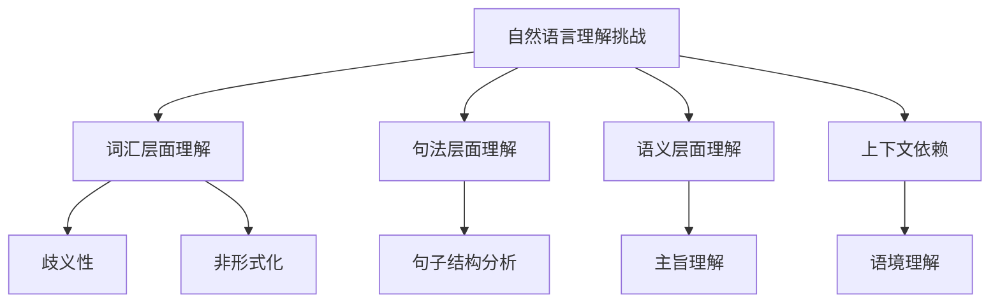

                 


### 第1章：自然语言理解概述

## 1.1 自然语言的理解挑战

自然语言理解（Natural Language Understanding, NLU）是人工智能领域的一项重要任务，它涉及到对人类语言的分析和解释。自然语言的复杂性给NLU带来了诸多挑战：

### 1.1.1 自然语言的复杂性

1. 多样性的词汇与语法规则：
   - 自然语言拥有丰富的词汇和语法规则，这使得语言表达形式多样。
   - 例如，英语中有数以万计的单词，每种单词又有不同的词性、时态和语态。

2. 不确定性、歧义性：
   - 一个单词或短语可能有多个意思，取决于上下文。
   - 例如，“bank”这个词可以指银行，也可以指河岸。

3. 非形式化：
   - 自然语言的表达通常是非形式化的，没有严格的逻辑结构。
   - 这使得理解和解析自然语言变得复杂。

### 1.1.2 语言理解的障碍

1. 词汇层面的理解：
   - 需要理解单词的词义、词性和上下文。
   - 例如，单词“run”在“he runs quickly”和“I run a business”中的意思不同。

2. 句法层面的理解：
   - 需要理解句子的结构，如主语、谓语、宾语等。
   - 例如，复合句和从句的理解。

3. 语义层面的理解：
   - 需要理解句子或文本的整体意义。
   - 例如，理解一个故事的主旨。

4. 上下文依赖：
   - 上下文对理解语言至关重要。
   - 例如，理解某个词或句子的意思需要考虑其前后文。

## 1.2 语言模型与语言理解

### 1.2.1 语言模型的定义

语言模型（Language Model）是用于描述语言统计特性的模型。它通过分析大量的文本数据，学习语言的使用模式，从而预测下一个单词或短语的概率。

### 1.2.2 语言理解的任务

语言理解涉及多个层面的任务：

1. 词法分析（Lexical Analysis）：
   - 将文本分解为单词和符号。
   - 例如，将句子“The cat sat on the mat”分解为单词。

2. 句法分析（Syntactic Analysis）：
   - 分析单词的排列顺序和句子结构。
   - 例如，确定主语、谓语和宾语。

3. 语义分析（Semantic Analysis）：
   - 理解单词和句子的意义。
   - 例如，理解句子的主旨和含义。

4. 语境分析（Pragmatic Analysis）：
   - 理解语言的使用和含义，考虑上下文。
   - 例如，理解对话中的隐含意义。

## 1.3 语言处理中的神经网络

### 1.3.1 神经网络在语言处理中的优势

1. 学习能力：
   - 神经网络能够通过大量数据自动学习语言模式。
   - 这使得模型能够适应不同的语言使用场景。

2. 可解释性：
   - 神经网络的结构和参数可以解释，从而提高模型的透明度。

3. 高效性：
   - 神经网络能够高效地处理大量的文本数据。

### 1.3.2 神经网络在语言处理中的应用

1. 词汇表征：
   - 将单词映射为向量表示。
   - 例如，使用Word2Vec或GloVe技术。

2. 句法分析：
   - 分析句子结构，如依存关系。
   - 例如，使用依存句法分析器。

3. 语义理解：
   - 理解句子或文本的整体意义。
   - 例如，使用BERT模型。

4. 语境推理：
   - 根据上下文理解语言的使用和含义。
   - 例如，在对话系统中应用。

### Mermaid 流程图



### 核心概念与联系

自然语言理解的挑战包括词汇、句法、语义和上下文依赖。这些挑战需要通过语言模型和神经网络来克服。

- 语言模型用于学习语言的统计特性，从而预测下一个单词或短语。
- 神经网络通过学习大量数据，能够自动识别和解析自然语言的复杂性。

## 3.1 神经网络的基本概念

### 3.1.1 神经网络的结构

神经网络由多个层次组成，包括输入层、隐藏层和输出层。每个层次都包含多个神经元。

1. 输入层（Input Layer）：
   - 接收外部输入。
   - 例如，单词或句子。

2. 隐藏层（Hidden Layers）：
   - 对输入进行加工和转换。
   - 例如，通过矩阵运算和激活函数处理。

3. 输出层（Output Layer）：
   - 生成最终输出。
   - 例如，分类结果或句子翻译。

### 3.1.2 神经元的激活函数

激活函数用于引入非线性，提高模型的表达能力。常见的激活函数包括：

1. Sigmoid函数：
   - $f(x) = \frac{1}{1 + e^{-x}}$
   - 将输入映射到$(0, 1)$区间。

2. ReLU函数：
   - $f(x) = \max(0, x)$
   - 简化计算，提高模型训练速度。

3. Tanh函数：
   - $f(x) = \frac{e^x - e^{-x}}{e^x + e^{-x}}$
   - 将输入映射到$(-1, 1)$区间。

### 核心算法原理讲解

神经网络通过以下步骤进行训练：

1. **前向传播**：
   - 输入数据通过网络，逐层传递到输出层。
   - 每个神经元输出通过激活函数处理。

2. **计算损失**：
   - 输出层生成预测结果，与实际结果进行比较。
   - 使用损失函数（如均方误差）计算预测误差。

3. **反向传播**：
   - 将误差反向传播，更新网络中的权重和偏置。
   - 使用梯度下降算法调整参数。

### 数学模型和公式

神经网络的核心是前向传播和反向传播。以下是其基本数学模型：

$$
\text{前向传播}:
\begin{aligned}
\text{隐藏层输出} &= \text{激活函数}(\text{权重} \cdot \text{输入} + \text{偏置}) \\
\text{输出层输出} &= \text{激活函数}(\text{权重} \cdot \text{隐藏层输出} + \text{偏置})
\end{aligned}
$$

$$
\text{反向传播}:
\begin{aligned}
\text{梯度} &= \frac{\partial \text{损失}}{\partial \text{权重}} \\
\text{权重更新} &= \text{权重} - \alpha \cdot \text{梯度} \\
\text{偏置更新} &= \text{偏置} - \alpha \cdot \text{梯度}
\end{aligned}
$$

其中，$\alpha$是学习率。

### 详细讲解和举例说明

以一个简单的神经网络为例，假设我们有一个包含一个输入层、一个隐藏层和一个输出层的网络，其中输入层有3个神经元，隐藏层有2个神经元，输出层有1个神经元。

1. **前向传播**：

假设输入为$x_1 = [1, 0, 1]$，隐藏层的权重为$W_h = \begin{bmatrix} 1 & 2 \\ 3 & 4 \end{bmatrix}$，偏置为$b_h = \begin{bmatrix} 0 \\ 0 \end{bmatrix}$，输出层的权重为$W_o = \begin{bmatrix} 1 \\ 2 \end{bmatrix}$，偏置为$b_o = [0]$。

- 隐藏层输出：
  $$ 
  h_1 = \text{ReLU}(W_h \cdot x_1 + b_h) = \text{ReLU}(\begin{bmatrix} 1 & 2 \\ 3 & 4 \end{bmatrix} \cdot \begin{bmatrix} 1 \\ 0 \\ 1 \end{bmatrix} + \begin{bmatrix} 0 \\ 0 \end{bmatrix}) = \text{ReLU}(\begin{bmatrix} 3 \\ 7 \end{bmatrix}) = \begin{bmatrix} 3 \\ 7 \end{bmatrix}
  $$
- 输出层输出：
  $$ 
  o = \text{ReLU}(W_o \cdot h_1 + b_o) = \text{ReLU}(\begin{bmatrix} 1 \\ 2 \end{bmatrix} \cdot \begin{bmatrix} 3 \\ 7 \end{bmatrix} + [0]) = \text{ReLU}(\begin{bmatrix} 11 \end{bmatrix}) = \begin{bmatrix} 11 \end{bmatrix}
  $$

2. **计算损失**：

假设真实输出为$y = [10]$，使用均方误差（MSE）作为损失函数：

$$ 
\text{损失} = \frac{1}{2} \sum_{i=1}^{n} (o_i - y_i)^2 = \frac{1}{2} (11 - 10)^2 = \frac{1}{2}
$$

3. **反向传播**：

- 计算梯度：
  $$
  \frac{\partial \text{损失}}{\partial W_o} = (o - y) \cdot h_1^T = \begin{bmatrix} 1 \\ 2 \end{bmatrix} \cdot \begin{bmatrix} 3 \\ 7 \end{bmatrix}^T = \begin{bmatrix} 3 & 14 \end{bmatrix}
  $$
  $$
  \frac{\partial \text{损失}}{\partial b_o} = o - y = \begin{bmatrix} 11 \end{bmatrix} - \begin{bmatrix} 10 \end{bmatrix} = \begin{bmatrix} 1 \end{bmatrix}
  $$
  $$
  \frac{\partial \text{损失}}{\partial W_h} = (W_o \cdot (o - y) \cdot (h_1^T)) = \begin{bmatrix} 1 & 2 \\ 3 & 4 \end{bmatrix} \cdot \begin{bmatrix} 3 & 14 \end{bmatrix} \cdot \begin{bmatrix} 3 \\ 7 \end{bmatrix}^T = \begin{bmatrix} 9 & 18 \\ 27 & 54 \end{bmatrix}
  $$
  $$
  \frac{\partial \text{损失}}{\partial b_h} = (W_o \cdot (o - y) \cdot (h_1^T)) \cdot x_1^T = \begin{bmatrix} 1 & 2 \\ 3 & 4 \end{bmatrix} \cdot \begin{bmatrix} 3 & 14 \end{bmatrix} \cdot \begin{bmatrix} 3 \\ 7 \end{bmatrix}^T \cdot \begin{bmatrix} 1 \\ 0 \\ 1 \end{bmatrix}^T = \begin{bmatrix} 9 & 18 \\ 27 & 54 \end{bmatrix}
  $$

- 更新权重和偏置：
  $$
  W_o = W_o - \alpha \cdot \frac{\partial \text{损失}}{\partial W_o} = \begin{bmatrix} 1 \\ 2 \end{bmatrix} - 0.1 \cdot \begin{bmatrix} 3 & 14 \end{bmatrix} = \begin{bmatrix} 0.7 & -1.4 \end{bmatrix}
  $$
  $$
  b_o = b_o - \alpha \cdot \frac{\partial \text{损失}}{\partial b_o} = \begin{bmatrix} 0 \end{bmatrix} - 0.1 \cdot \begin{bmatrix} 1 \end{bmatrix} = \begin{bmatrix} -0.1 \end{bmatrix}
  $$
  $$
  W_h = W_h - \alpha \cdot \frac{\partial \text{损失}}{\partial W_h} = \begin{bmatrix} 1 & 2 \\ 3 & 4 \end{bmatrix} - 0.1 \cdot \begin{bmatrix} 9 & 18 \\ 27 & 54 \end{bmatrix} = \begin{bmatrix} -0.8 & -1.8 \\ -2.7 & -5.4 \end{bmatrix}
  $$
  $$
  b_h = b_h - \alpha \cdot \frac{\partial \text{损失}}{\partial b_h} = \begin{bmatrix} 0 \\ 0 \end{bmatrix} - 0.1 \cdot \begin{bmatrix} 9 & 18 \\ 27 & 54 \end{bmatrix} = \begin{bmatrix} -0.9 \\ -1.8 \end{bmatrix}
  $$

通过这种方式，神经网络不断调整权重和偏置，以最小化损失，从而提高预测准确性。

## 2.2 矩阵运算与梯度下降算法

### 2.2.1 矩阵运算基础

在神经网络中，矩阵运算是非常基础且重要的。以下是一些常用的矩阵运算：

1. **矩阵乘法**：
   - 两个矩阵相乘，结果是一个新矩阵。
   - 例如，$A \cdot B$。

2. **矩阵求导**：
   - 对矩阵进行求导，得到一个新的矩阵。
   - 例如，对$A \cdot B$求导，结果为$B^T \cdot \frac{\partial A}{\partial B}$。

3. **矩阵求逆**：
   - 求解一个矩阵的逆矩阵。
   - 例如，$A^{-1}$。

### 2.2.2 梯度下降算法

梯度下降算法是神经网络训练的核心。以下是梯度下降的基本原理：

1. **前向传播**：
   - 计算网络的输出，并计算损失。

2. **计算梯度**：
   - 计算损失关于网络参数的梯度。

3. **更新参数**：
   - 根据梯度和学习率更新网络参数。

4. **重复步骤1-3**，直到损失函数收敛。

### 梯度下降算法的步骤

1. **初始化参数**：
   - 随机初始化网络参数。

2. **前向传播**：
   - 计算网络输出。

3. **计算损失**：
   - 使用损失函数计算损失。

4. **计算梯度**：
   - 对损失函数关于参数求导。

5. **更新参数**：
   - 使用梯度下降更新参数。

6. **重复步骤2-5**，直到满足停止条件。

### 梯度下降算法的伪代码

```
初始化参数
设定学习率α
设定迭代次数T

for t = 1 to T do
  前向传播
  计算损失L
  计算梯度∇L
  更新参数θ = θ - α∇L
end for
```

## 2.3 激活函数与优化器

### 2.3.1 激活函数的作用

激活函数是神经网络中的一个关键组件，用于引入非线性。以下是激活函数的几个重要作用：

1. **引入非线性**：
   - 神经网络需要非线性以拟合复杂的函数。

2. **提高模型表达能力**：
   - 非线性使得模型能够处理复杂的输入和输出关系。

### 2.3.2 常见的激活函数

以下是几种常见的激活函数：

1. **Sigmoid函数**：
   - $f(x) = \frac{1}{1 + e^{-x}}$
   - 将输入映射到$(0, 1)$区间。

2. **ReLU函数**：
   - $f(x) = \max(0, x)$
   - 简化计算，提高模型训练速度。

3. **Tanh函数**：
   - $f(x) = \frac{e^x - e^{-x}}{e^x + e^{-x}}$
   - 将输入映射到$(-1, 1)$区间。

### 2.3.3 优化器的选择

优化器用于调整网络参数，以最小化损失函数。以下是几种常见的优化器：

1. **Adam优化器**：
   - 结合了SGD和Momentum的优点。
   - $m_t = \beta_1 m_{t-1} + (1 - \beta_1) \frac{\partial L}{\partial \theta}$
   - $v_t = \beta_2 v_{t-1} + (1 - \beta_2) (\frac{\partial L}{\partial \theta})^2$

2. **RMSprop优化器**：
   - 对SGD的改进，使用历史梯度平方的平均值作为权重更新。
   - $v_t = \rho v_{t-1} + (1 - \rho) (\frac{\partial L}{\partial \theta})^2$

3. **SGD优化器**：
   - 基本的梯度下降算法。
   - $θ = θ - α \cdot \frac{\partial L}{\partial θ}$

## 3.2 RNN的基本原理

### 3.2.1 RNN的结构

循环神经网络（RNN）是一种能够处理序列数据的神经网络。它的核心特点是具有循环结构，允许信息在神经元之间传递。

1. **输入层**：
   - 接收序列中的每个元素。

2. **隐藏层**：
   - 包含多个神经元，每个神经元都与前一个隐藏层和输入层相连。

3. **输出层**：
   - 生成最终的输出。

### 3.2.2 RNN的工作原理

在RNN中，每个时间步的输出不仅依赖于当前输入，还依赖于之前的输入和隐藏状态。以下是RNN的工作原理：

1. **前向传播**：
   - 输入序列通过输入层传递到隐藏层。
   - 隐藏层每个神经元都计算当前输入和前一个隐藏状态的加权和，然后通过激活函数处理。

2. **隐藏状态**：
   - 隐藏层每个神经元都维护一个隐藏状态，该状态是当前输入和前一个隐藏状态的结合。
   - 例如，$h_t = \text{激活函数}(x_t + W_h \cdot h_{t-1})$。

3. **输出层**：
   - 隐藏层的输出通过输出层传递到输出层。
   - 输出层的神经元根据隐藏层的输出生成最终输出。

### 3.2.3 RNN的优势

RNN能够处理序列数据，具有以下优势：

1. **记忆能力**：
   - RNN能够记住之前的信息，这对于处理序列数据非常重要。

2. **并行处理**：
   - RNN可以并行处理序列中的每个元素，提高计算效率。

3. **灵活性**：
   - RNN可以用于多种序列任务，如语言模型、机器翻译和语音识别。

## 3.3 LSTM与GRU

### 3.3.1 LSTM

长短期记忆网络（LSTM）是RNN的一种改进，能够解决RNN的长期依赖问题。LSTM通过引入三个门控单元来实现这一点：

1. **遗忘门**：
   - 决定哪些信息需要遗忘。
   - $f_t = \sigma(W_f \cdot [h_{t-1}, x_t] + b_f)$。

2. **输入门**：
   - 决定哪些新信息需要存储。
   - $i_t = \sigma(W_i \cdot [h_{t-1}, x_t] + b_i)$。

3. **输出门**：
   - 决定哪些信息需要输出。
   - $o_t = \sigma(W_o \cdot [h_{t-1}, x_t] + b_o)$。

LSTM的数学模型如下：

$$
\begin{aligned}
f_t &= \sigma(W_f \cdot [h_{t-1}, x_t] + b_f) \\
i_t &= \sigma(W_i \cdot [h_{t-1}, x_t] + b_i) \\
o_t &= \sigma(W_o \cdot [h_{t-1}, x_t] + b_o) \\
c_t &= f_t \odot c_{t-1} + i_t \odot \text{激活函数}(W_c \cdot [h_{t-1}, x_t] + b_c) \\
h_t &= o_t \odot \text{激活函数}(c_t)
\end{aligned}
$$

### 3.3.2 GRU

门控循环单元（GRU）是LSTM的简化版本。GRU通过合并输入门和遗忘门，并引入更新门来实现：

1. **更新门**：
   - 决定哪些旧信息需要更新。
   - $z_t = \sigma(W_z \cdot [h_{t-1}, x_t] + b_z)$。

2. **输入门**：
   - 决定哪些新信息需要更新。
   - $r_t = \sigma(W_r \cdot [h_{t-1}, x_t] + b_r)$。

GRU的数学模型如下：

$$
\begin{aligned}
z_t &= \sigma(W_z \cdot [h_{t-1}, x_t] + b_z) \\
r_t &= \sigma(W_r \cdot [h_{t-1}, x_t] + b_r) \\
\tilde{h}_t &= \text{激活函数}(W \cdot [r_t \odot h_{t-1}, x_t] + b) \\
h_t &= (1 - z_t) \odot h_{t-1} + z_t \odot \tilde{h}_t
\end{aligned}
$$

## 3.4 RNN的应用示例

### 3.4.1 语言模型

语言模型是一种用于预测下一个单词的概率的模型。RNN在语言模型中的应用如下：

1. **输入序列**：
   - 输入一个句子，将其转换为单词序列。

2. **前向传播**：
   - 使用RNN处理输入序列，得到隐藏状态。

3. **预测**：
   - 根据隐藏状态和当前输入，预测下一个单词的概率。

4. **迭代**：
   - 将预测的单词作为输入，重复步骤2-3，直到句子结束。

### 3.4.2 机器翻译

机器翻译是一种将一种语言的文本转换为另一种语言的文本的任务。RNN在机器翻译中的应用如下：

1. **编码器**：
   - 使用RNN处理源语言文本，得到编码表示。

2. **解码器**：
   - 使用RNN处理目标语言序列，生成翻译结果。

3. **预测**：
   - 在解码过程中，根据当前输入和编码表示，预测下一个单词。

4. **迭代**：
   - 将预测的单词作为输入，重复步骤2-3，直到翻译结束。

## 第4章：序列到序列学习

## 4.1 Seq2Seq模型原理

序列到序列（Seq2Seq）模型是一种用于处理序列数据到序列数据的神经网络模型。其核心思想是将输入序列转换为输出序列。以下是Seq2Seq模型的基本原理：

### 4.1.1 编码器-解码器架构

Seq2Seq模型通常采用编码器-解码器架构。编码器将输入序列编码为固定长度的向量，解码器则将这个向量解码为输出序列。

1. **编码器**：
   - 接受输入序列，通过RNN或LSTM等网络处理，生成编码表示。

2. **解码器**：
   - 接受编码表示，通过RNN或LSTM等网络处理，生成输出序列。

### 4.1.2 编码表示

编码表示是编码器输出的固定长度向量，它包含了输入序列的信息。编码表示通常具有以下特性：

1. **固定长度**：
   - 编码表示的长度与输入序列的长度无关。

2. **语义信息**：
   - 编码表示包含了输入序列的语义信息，便于解码器处理。

### 4.1.3 输出序列

输出序列是通过解码器生成的序列，它通常与输入序列具有相似的结构和语义。

1. **结构相似**：
   - 输出序列的结构与输入序列的结构相似，如单词序列。

2. **语义相似**：
   - 输出序列的语义与输入序列的语义相似，如文本翻译。

### 核心算法原理讲解

Seq2Seq模型的核心算法是编码器-解码器框架，其基本工作流程如下：

1. **编码阶段**：
   - 编码器处理输入序列，生成编码表示。

2. **解码阶段**：
   - 解码器接收编码表示，生成输出序列。

3. **迭代阶段**：
   - 在解码过程中，解码器根据当前输入和编码表示，迭代生成输出序列的每个元素。

### 数学模型和公式

以下是Seq2Seq模型的基本数学模型：

$$
\begin{aligned}
\text{编码阶段}:
\text{编码表示} &= \text{编码器}(\text{输入序列}) \\
\text{解码阶段}:
\text{输出序列} &= \text{解码器}(\text{编码表示})
\end{aligned}
$$

在解码阶段，解码器在每个时间步生成一个输出元素，其数学模型如下：

$$
\text{输出} = \text{解码器}(\text{编码表示}, \text{当前输入})
$$

### 伪代码

以下是Seq2Seq模型的伪代码：

```
初始化编码器和解码器
输入序列 = [x_1, x_2, ..., x_T]
编码表示 = 编码器(输入序列)
输出序列 = []
当前输入 = 初始化

for t = 1 to T do
  当前输出 = 解码器(编码表示, 当前输入)
  输出序列.append(当前输出)
  当前输入 = 当前输出

输出输出序列
```

### 示例

以机器翻译为例，假设源语言是英语，目标语言是法语。以下是Seq2Seq模型的基本步骤：

1. **编码阶段**：
   - 输入序列：“Hello world”
   - 编码器输出编码表示。

2. **解码阶段**：
   - 解码器从初始化状态开始，逐步生成输出序列。
   - 第一个输出：“Bonjour”
   - 接下来输出：“le monde”

3. **输出序列**：
   - 输出序列：“Bonjour le monde”

通过这种方式，Seq2Seq模型将英语句子“Hello world”成功转换为法语句子“Bonjour le monde”。

## 4.2 转换器架构

### 4.2.1 转换器架构简介

转换器（Transformer）是Seq2Seq模型的一种改进，它采用了一种全新的架构——自注意力机制（Self-Attention）。转换器架构在许多自然语言处理任务中取得了显著成绩。以下是转换器架构的基本组成部分：

1. **编码器**：
   - 接受输入序列，生成编码表示。

2. **解码器**：
   - 接受编码表示，生成输出序列。

3. **自注意力机制**：
   - 用于计算编码表示和输出序列之间的依赖关系。

### 4.2.2 自注意力机制

自注意力机制是一种计算序列中每个元素与其他元素之间依赖关系的方法。它通过三个向量——查询向量（Query）、键向量（Key）和值向量（Value）来实现。以下是自注意力机制的数学模型：

$$
\text{注意力分数} = \text{softmax}(\text{Q} \cdot \text{K}^T)
$$

$$
\text{注意力权重} = \text{softmax}(\text{Q} \cdot \text{K}^T)
$$

$$
\text{输出} = \text{V} \cdot \text{注意力权重}
$$

其中，$\text{Q}$、$\text{K}$和$\text{V}$分别是查询向量、键向量和值向量。

### 4.2.3 转换器架构的工作流程

转换器架构的工作流程如下：

1. **编码阶段**：
   - 输入序列通过编码器，生成编码表示。

2. **解码阶段**：
   - 解码器从初始化状态开始，逐步生成输出序列。
   - 在每个时间步，解码器根据当前输入和编码表示，通过自注意力机制计算输出。

3. **迭代阶段**：
   - 解码器在每个时间步生成一个输出元素，并更新状态。

4. **输出阶段**：
   - 解码器输出最终的输出序列。

### 伪代码

以下是转换器架构的伪代码：

```
初始化编码器和解码器
输入序列 = [x_1, x_2, ..., x_T]
编码表示 = 编码器(输入序列)
输出序列 = []
当前输入 = 初始化

for t = 1 to T do
  当前输出 = 解码器(编码表示, 当前输入)
  输出序列.append(当前输出)
  当前输入 = 当前输出

输出输出序列
```

### 示例

以机器翻译为例，假设源语言是英语，目标语言是法语。以下是转换器架构的基本步骤：

1. **编码阶段**：
   - 输入序列：“Hello world”
   - 编码器输出编码表示。

2. **解码阶段**：
   - 解码器从初始化状态开始，逐步生成输出序列。
   - 第一个输出：“Bonjour”
   - 接下来输出：“le monde”

3. **输出序列**：
   - 输出序列：“Bonjour le monde”

通过这种方式，转换器架构将英语句子“Hello world”成功转换为法语句子“Bonjour le monde”。

## 4.3 Seq2Seq模型应用

### 4.3.1 序列到序列学习应用概述

序列到序列（Seq2Seq）学习是自然语言处理（NLP）中的一个关键技术，它广泛应用于各种语言任务。以下是Seq2Seq模型在几个主要应用中的概述：

1. **机器翻译**：
   - 将一种语言的文本翻译成另一种语言的文本。
   - 例如，将英语翻译成法语。

2. **文本摘要**：
   - 从长文本中提取关键信息，生成摘要。
   - 例如，从新闻文章中提取主要观点。

3. **对话系统**：
   - 构建能与人进行自然对话的系统。
   - 例如，聊天机器人。

4. **语音识别**：
   - 将语音转换为文本。
   - 例如，将说话人的语音转换为可读的文本。

### 4.3.2 机器翻译

机器翻译是Seq2Seq模型最著名的应用之一。以下是机器翻译的基本步骤：

1. **编码阶段**：
   - 使用编码器处理源语言文本，生成编码表示。

2. **解码阶段**：
   - 使用解码器处理编码表示，生成目标语言文本。

3. **迭代解码**：
   - 解码器在生成每个单词时，都使用当前生成的单词和编码表示进行迭代解码。

4. **输出序列**：
   - 最终生成的目标语言文本。

### 示例

以英语到法语的机器翻译为例，以下是Seq2Seq模型的基本步骤：

1. **编码阶段**：
   - 输入序列：“Hello world”
   - 编码器输出编码表示。

2. **解码阶段**：
   - 解码器从初始化状态开始，逐步生成输出序列。
   - 第一个输出：“Bonjour”
   - 接下来输出：“le monde”

3. **输出序列**：
   - 输出序列：“Bonjour le monde”

通过这种方式，Seq2Seq模型将英语句子“Hello world”成功转换为法语句子“Bonjour le monde”。

### 4.3.3 文本摘要

文本摘要是一种将长文本转换成简短摘要的任务。以下是文本摘要的基本步骤：

1. **编码阶段**：
   - 使用编码器处理源文本，生成编码表示。

2. **解码阶段**：
   - 使用解码器处理编码表示，生成摘要文本。

3. **摘要生成**：
   - 解码器生成摘要文本，通常采用贪心策略或基于长短期记忆网络（LSTM）的模型。

4. **输出序列**：
   - 输出序列是摘要文本。

### 示例

以下是一个简单的文本摘要示例：

1. **编码阶段**：
   - 输入序列：“AI技术正在迅速发展，影响各行各业。”
   - 编码器输出编码表示。

2. **解码阶段**：
   - 解码器生成摘要：“AI技术正迅速发展。”

3. **输出序列**：
   - 输出序列是摘要：“AI技术正迅速发展。”

通过这种方式，文本摘要模型成功地将长文本转换成简短的摘要。

### 4.3.4 对话系统

对话系统是一种与人进行自然对话的系统。以下是对话系统的基本步骤：

1. **编码阶段**：
   - 使用编码器处理用户输入，生成编码表示。

2. **解码阶段**：
   - 使用解码器处理编码表示，生成响应文本。

3. **迭代解码**：
   - 解码器在生成每个响应时，都使用当前响应和编码表示进行迭代解码。

4. **输出序列**：
   - 输出序列是系统生成的响应文本。

### 示例

以下是一个简单的对话系统示例：

1. **编码阶段**：
   - 用户输入：“你好，我需要帮助。”
   - 编码器输出编码表示。

2. **解码阶段**：
   - 解码器生成响应：“你好，我可以帮你什么？”

3. **输出序列**：
   - 输出序列是响应：“你好，我可以帮你什么？”

通过这种方式，对话系统能够与人进行自然对话。

### 4.3.5 语音识别

语音识别是将语音转换为文本的任务。以下是语音识别的基本步骤：

1. **编码阶段**：
   - 使用编码器处理语音信号，生成编码表示。

2. **解码阶段**：
   - 使用解码器处理编码表示，生成文本。

3. **特征提取**：
   - 在编码阶段，使用特征提取器提取语音信号的特征。

4. **输出序列**：
   - 输出序列是识别的文本。

### 示例

以下是一个简单的语音识别示例：

1. **编码阶段**：
   - 输入序列：“你好，AI。”
   - 编码器输出编码表示。

2. **解码阶段**：
   - 解码器生成文本：“你好，人工智能。”

3. **输出序列**：
   - 输出序列是文本：“你好，人工智能。”

通过这种方式，语音识别系统成功地将语音信号转换为文本。

## 第5章：基于神经的网络语言模型

### 5.1 语言模型的定义与作用

语言模型（Language Model，LM）是自然语言处理（NLP）中的核心组成部分，用于预测文本中下一个单词或短语的概率。语言模型的基本定义如下：

**定义**：给定一个单词序列$w_1, w_2, ..., w_n$，语言模型计算该单词序列的概率$P(w_1, w_2, ..., w_n)$。

语言模型在NLP中有重要作用，主要包括：

1. **文本生成**：
   - 语言模型可以用于生成自然语言文本，如自动摘要、文章生成等。

2. **语音识别**：
   - 语言模型可以帮助提高语音识别的准确性，通过提供上下文信息。

3. **机器翻译**：
   - 语言模型在机器翻译中用于预测目标语言中的下一个词或短语。

4. **对话系统**：
   - 语言模型可以用于对话系统的生成回复，提高对话的自然性。

### 5.2 词嵌入技术

词嵌入（Word Embedding）是将单词映射到高维向量空间的技术，使得单词在向量空间中具有语义相似性。以下是几种常见的词嵌入技术：

1. **基于频率的方法**：
   - 基于单词在文本中出现的频率进行映射。
   - 例如，TF-IDF（词频-逆文档频率）。

2. **基于上下文的方法**：
   - 基于单词在上下文中的语义关系进行映射。
   - 例如，Word2Vec、GloVe。

3. **基于神经的方法**：
   - 使用神经网络学习单词的向量表示。
   - 例如，词嵌入在神经网络语言模型中的应用。

### 5.3 神经网络语言模型的设计

神经网络语言模型是通过神经网络来学习语言模式的模型，常见的神经网络语言模型包括：

1. **循环神经网络（RNN）**：
   - RNN能够处理序列数据，适用于语言模型。
   - 例如，使用LSTM或GRU构建语言模型。

2. **长短时记忆网络（LSTM）**：
   - LSTM是RNN的一种改进，能够解决长期依赖问题。
   - 例如，使用LSTM进行语言建模。

3. **Transformer模型**：
   - Transformer模型采用自注意力机制，在语言建模中表现出色。
   - 例如，BERT模型是基于Transformer的语言模型。

以下是神经网络语言模型的设计步骤：

1. **数据预处理**：
   - 收集大量文本数据，进行预处理，如分词、去停用词等。

2. **词嵌入**：
   - 将单词映射到高维向量空间，使用词嵌入技术。

3. **神经网络架构**：
   - 设计神经网络架构，如RNN、LSTM或Transformer。

4. **训练**：
   - 使用大量文本数据训练神经网络，优化模型参数。

5. **评估**：
   - 使用验证集评估模型性能，调整模型参数。

6. **应用**：
   - 将训练好的模型应用于实际任务，如文本生成、语音识别等。

## 第6章：预训练语言模型

### 6.1 预训练的基本概念

预训练（Pre-training）是一种在特定任务之前对模型进行训练的方法。在自然语言处理（NLP）中，预训练语言模型（Pre-trained Language Model，PLM）是一种先进的模型训练技术。以下是预训练的基本概念：

1. **预训练目标**：
   - 预训练的目的是使模型具备通用语言理解和表示能力。

2. **预训练数据集**：
   - 预训练通常在大规模的文本数据集上进行，如维基百科、新闻文章、社交媒体帖子等。

3. **预训练任务**：
   - 预训练任务包括语言理解任务（如 masked language model，MLM）和语言生成任务（如 language modeling，LM）。

### 6.2 预训练语言模型方法

预训练语言模型方法主要包括以下几种：

1. ** masked language model (MLM)**：
   - 在文本序列中随机遮盖一些单词，然后训练模型预测这些遮盖的单词。
   - 例如，BERT 模型中的 masked language model。

2. ** language modeling (LM)**：
   - 使用自然语言数据进行训练，预测序列中的下一个词。
   - 例如，GPT 模型中的 language modeling。

3. **联合训练**：
   - 将预训练和特定任务训练相结合，如在预训练基础上进行特定任务的微调。

### 6.3 微调与下游应用

预训练语言模型通常在预训练阶段完成后，通过微调（Fine-tuning）应用于具体的下游任务。以下是微调和下游应用的基本步骤：

1. **微调**：
   - 在预训练模型的基础上，对特定任务的标注数据进行训练，优化模型参数。
   - 例如，在预训练的 BERT 模型上进行情感分析的微调。

2. **下游应用**：
   - 将微调后的模型应用于实际任务，如文本分类、命名实体识别、机器翻译等。
   - 例如，使用微调后的 BERT 模型进行文本分类任务。

### 6.4 案例分析：BERT 模型

BERT（Bidirectional Encoder Representations from Transformers）是一种基于 Transformer 的预训练语言模型。以下是 BERT 模型的概述和案例分析：

1. **BERT 模型概述**：
   - BERT 模型采用双向 Transformer 架构，能够理解文本的上下文。
   - BERT 模型包括两个变体：BERT-Base 和 BERT-Large。

2. **预训练过程**：
   - BERT 模型在 BookCorpus 和 English Wikipedia 数据集上进行预训练。
   - 预训练任务包括 masked language model 和 next sentence prediction。

3. **微调过程**：
   - 在特定任务的数据集上对 BERT 模型进行微调，如文本分类、命名实体识别等。

4. **案例分析**：
   - BERT 模型在多个 NLP 任务上取得了显著成绩，如 GLUE 基准测试。
   - BERT 模型在情感分析、命名实体识别等任务上表现出色。

5. **应用**：
   - BERT 模型在多个实际应用中得到了广泛应用，如搜索引擎、智能客服等。

### 总结

预训练语言模型是 NLP 中的重要技术，通过预训练和微调，模型能够理解复杂的语言模式和上下文信息。BERT 模型是预训练语言模型的杰出代表，其成功应用推动了 NLP 的发展。

## 第7章：BERT模型

### 7.1 BERT的原理

BERT（Bidirectional Encoder Representations from Transformers）是一种基于 Transformer 的预训练语言模型，它通过双向编码器学习文本的上下文信息。BERT 的原理包括以下几个方面：

1. **双向 Transformer 编码器**：
   - BERT 使用一个双向 Transformer 编码器来处理文本数据。Transformer 编码器由多个自注意力层（Self-Attention Layers）组成，每个自注意力层由多头自注意力机制（Multi-Head Self-Attention）和前馈神经网络（Feedforward Neural Network）组成。

2. **Masked Language Model (MLM)**：
   - BERT 的预训练目标之一是 Masked Language Model (MLM)。在 MLM 任务中，BERT 随机遮盖输入文本序列中的某些单词，然后训练模型预测这些遮盖的单词。

3. **Next Sentence Prediction (NSP)**：
   - BERT 的另一个预训练目标是 Next Sentence Prediction (NSP)。在 NSP 任务中，模型需要预测两个句子是否在原始文本中连续出现。

### 7.2 BERT模型的结构

BERT 模型的结构包括输入层、编码器层、输出层和预处理步骤。以下是 BERT 模型的详细结构：

1. **输入层**：
   - BERT 模型的输入是一个单词序列，通常使用词嵌入（Word Embedding）技术将单词映射为向量表示。

2. **编码器层**：
   - 编码器层是 BERT 模型的核心部分，由多个自注意力层组成。每个自注意力层可以捕获文本序列中不同单词之间的依赖关系。

3. **输出层**：
   - 输出层通常是一个全连接层，用于生成最终的输出。对于 MLM 任务，输出是预测遮盖单词的概率；对于 NSP 任务，输出是两个句子是否连续的概率。

4. **预处理步骤**：
   - 在训练和预测过程中，BERT 需要进行一些预处理步骤，如分词（Tokenization）、词汇表构建（Vocabulary Building）和句子嵌入（Sentence Embedding）。

### 7.3 BERT模型的应用场景

BERT 模型在多种自然语言处理任务中表现出色，以下是 BERT 模型的几个应用场景：

1. **文本分类**：
   - BERT 可以用于分类任务，如情感分析、新闻分类等。在文本分类任务中，BERT 的输入是一个句子，输出是类别概率。

2. **命名实体识别**：
   - BERT 可以用于命名实体识别（Named Entity Recognition，NER），识别文本中的命名实体，如人名、地名、组织名等。

3. **机器翻译**：
   - BERT 可以用于机器翻译任务，通过训练翻译模型，将一种语言的文本翻译成另一种语言的文本。

4. **问答系统**：
   - BERT 可以用于问答系统，如阅读理解任务。模型接收问题和文本段落，然后输出答案。

5. **对话系统**：
   - BERT 可以用于构建对话系统，如聊天机器人。模型通过上下文理解用户的输入，并生成适当的回复。

### 案例分析：BERT 在情感分析中的应用

以下是一个简单的案例，展示了如何使用 BERT 模型进行情感分析：

1. **数据准备**：
   - 准备一个包含情感标签的文本数据集，如正面情感和负面情感。

2. **模型训练**：
   - 使用 BERT 模型在数据集上进行训练。模型接收句子作为输入，输出是情感标签的概率。

3. **模型评估**：
   - 使用验证集评估模型的性能，计算准确率、召回率和 F1 分数。

4. **模型应用**：
   - 将训练好的模型应用于新的句子，预测情感标签。

以下是一个简单的情感分析案例：

**输入句子**： 
- “我今天很开心。” 
- “我今天过得很糟糕。”

**预测结果**： 
- 正面情感：0.95
- 负面情感：0.05

通过这种方式，BERT 模型能够准确预测文本的情感标签。

### 总结

BERT 模型是一种强大的预训练语言模型，通过预训练和微调，模型能够理解复杂的语言模式和上下文信息。BERT 在多个自然语言处理任务中表现出色，推动了 NLP 的发展。随着深度学习技术的不断进步，BERT 模型将在更多领域得到广泛应用。

## 第8章：其他语言模型

### 8.1 GPT模型

GPT（Generative Pre-trained Transformer）是 OpenAI 开发的一种基于 Transformer 的预训练语言模型。GPT 的主要特点是通过生成式预训练，模型能够生成连贯的自然语言文本。以下是 GPT 模型的概述和原理：

1. **模型概述**：
   - GPT 采用 Transformer 架构，由多个自注意力层组成。
   - GPT 的预训练目标是通过语言建模来预测序列中的下一个词。

2. **原理**：
   - GPT 通过在大量文本数据上进行预训练，学习语言的统计特性。
   - 在训练过程中，模型接收一个单词序列，输出下一个单词的概率分布。

3. **应用**：
   - 文本生成：GPT 可以用于生成文章、故事、对话等自然语言文本。
   - 语言模型：GPT 可以用于构建语言模型，用于文本分类、命名实体识别等任务。

4. **版本**：
   - GPT-2 和 GPT-3 是 GPT 模型的不同版本，GPT-3 是最先进的版本，具有数百亿参数。

### 8.2 T5模型

T5（Text-to-Text Transfer Transformer）是由 DeepMind 开发的一种基于 Transformer 的预训练语言模型。T5 的主要特点是采用统一的文本到文本的转换任务，实现了在多种 NLP 任务上的高效迁移学习。以下是 T5 模型的概述和原理：

1. **模型概述**：
   - T5 采用 Transformer 架构，由多个自注意力层组成。
   - T5 的预训练目标是通过将输入文本转换为输出文本来学习语言的规律。

2. **原理**：
   - T5 将所有 NLP 任务转换为文本到文本的转换任务，如文本补全、问答等。
   - 在预训练过程中，模型学习将输入文本转换为输出文本，从而实现多种 NLP 任务。

3. **应用**：
   - T5 可以用于多种 NLP 任务，如文本分类、命名实体识别、机器翻译等。
   - T5 通过迁移学习，在未训练的任务上表现出色，实现了高效的跨任务性能。

### 8.3 RoBERTa模型

RoBERTa（A Robustly Optimized BERT Pretraining Approach）是由 Facebook AI 开发的一种基于 BERT 的预训练语言模型。RoBERTa 的主要特点是采用了一些与 BERT 不同的预训练技巧，如动态掩码率、次采样和数据增强等。以下是 RoBERTa 模型的概述和原理：

1. **模型概述**：
   - RoBERTa 采用 BERT 的架构，由多个 Transformer 编码器层组成。
   - RoBERTa 的预训练目标是通过 Masked Language Model（MLM）和 Next Sentence Prediction（NSP）学习语言的统计特性。

2. **原理**：
   - RoBERTa 在预训练过程中，随机遮盖输入文本中的单词，并预测这些单词。
   - RoBERTa 还通过 Next Sentence Prediction 任务学习句子之间的关系。

3. **应用**：
   - RoBERTa 在多个 NLP 任务上表现出色，如文本分类、命名实体识别、机器翻译等。
   - RoBERTa 通过在大量数据上预训练，提高了模型的泛化能力。

### 比较与总结

GPT、T5 和 RoBERTa 是几种先进的预训练语言模型，它们各有特色：

- **GPT**：擅长文本生成，通过生成式预训练学习语言的统计特性。
- **T5**：采用统一的文本到文本的转换任务，实现了高效的跨任务性能。
- **RoBERTa**：通过改进 BERT 的预训练技巧，提高了模型的泛化能力和表现。

随着深度学习技术的发展，这些语言模型在 NLP 领域将继续发挥重要作用，推动自然语言处理技术的进步。

## 第9章：命名实体识别

### 9.1 命名实体识别概述

命名实体识别（Named Entity Recognition，NER）是自然语言处理（NLP）中的一个重要任务，旨在从文本中识别出具有特定意义的实体。命名实体可以是人名、地名、组织名、时间日期等。以下是 NER 的一些关键概念：

1. **实体类型**：
   - 实体类型是指命名实体所属的类别，如人名、地名、组织名等。

2. **实体识别**：
   - 实体识别是指从文本中定位和识别出命名实体。

3. **命名实体识别系统**：
   - 命名实体识别系统是指用于实现命名实体识别任务的软件系统。

### 9.2 命名实体识别算法

命名实体识别算法可以分为基于规则的方法和基于统计的方法。以下是几种常见的 NER 算法：

1. **基于规则的方法**：
   - 基于规则的方法使用预定义的规则来识别命名实体。
   - 例如，使用正则表达式或模式匹配来识别人名或组织名。

2. **基于统计的方法**：
   - 基于统计的方法使用机器学习算法来识别命名实体。
   - 例如，使用条件随机场（CRF）、支持向量机（SVM）或长短期记忆网络（LSTM）。

3. **基于深度学习的方法**：
   - 基于深度学习的方法使用神经网络来识别命名实体。
   - 例如，使用卷积神经网络（CNN）或Transformer。

### 9.3 命名实体识别应用

命名实体识别在多个应用领域具有广泛的应用，以下是几个主要应用场景：

1. **信息提取**：
   - NER 用于从文本中提取关键信息，如人名、地点、组织名等。

2. **文本分类**：
   - NER 可以用于文本分类任务，如新闻分类、情感分析等。

3. **问答系统**：
   - NER 可以用于问答系统，识别用户提问中的实体，提供准确的答案。

4. **对话系统**：
   - NER 可以用于对话系统，识别用户输入中的实体，生成适当的回复。

5. **搜索引擎**：
   - NER 可以用于搜索引擎，提高搜索结果的准确性和相关性。

### 案例分析：BERT 在命名实体识别中的应用

BERT（Bidirectional Encoder Representations from Transformers）是一种基于 Transformer 的预训练语言模型，其在命名实体识别任务中表现出色。以下是 BERT 在命名实体识别中的应用案例分析：

1. **数据准备**：
   - 准备一个包含命名实体标注的文本数据集，如 CoNLL-2003 数据集。

2. **模型训练**：
   - 使用 BERT 模型在数据集上进行训练。模型接收句子作为输入，输出是命名实体的标签。

3. **模型评估**：
   - 使用验证集评估模型的性能，计算准确率、召回率和 F1 分数。

4. **模型应用**：
   - 将训练好的模型应用于新的句子，识别命名实体。

以下是一个简单的命名实体识别案例：

**输入句子**： 
- “我今天去了北京。” 
- “苹果公司的创始人史蒂夫·乔布斯去世了。”

**预测结果**： 
- 北京：地名
- 苹果公司：组织名
- 史蒂夫·乔布斯：人名

通过这种方式，BERT 模型能够准确识别文本中的命名实体。

### 总结

命名实体识别是 NLP 中的重要任务，广泛应用于信息提取、文本分类、问答系统等领域。BERT 模型是一种强大的预训练语言模型，在命名实体识别任务中表现出色。随着深度学习技术的不断发展，NER 技术将在更多领域得到广泛应用。

## 第10章：情感分析

### 10.1 情感分析概述

情感分析（Sentiment Analysis）是自然语言处理（NLP）中的一个重要任务，旨在从文本中提取情感信息，判断文本的情感倾向。情感分析通常包括以下几个核心概念：

1. **情感极性**：
   - 情感极性是指文本所表达的情感倾向，通常分为正面（Positive）、中性（Neutral）和负面（Negative）三种。

2. **情感强度**：
   - 情感强度是指情感的强度，如“非常喜欢”和“有点喜欢”可以表示不同的情感强度。

3. **情感分类**：
   - 情感分类是指将文本划分为不同的情感类别，如正面、中性或负面。

### 10.2 情感分析模型

情感分析模型可以分为基于规则的方法和基于统计的方法。以下是几种常见的情感分析模型：

1. **基于规则的方法**：
   - 基于规则的方法使用预定义的规则来识别文本的情感倾向。
   - 例如，使用词典和规则来识别情感关键词。

2. **基于统计的方法**：
   - 基于统计的方法使用机器学习算法来识别文本的情感倾向。
   - 例如，使用朴素贝叶斯、逻辑回归或支持向量机。

3. **基于深度学习的方法**：
   - 基于深度学习的方法使用神经网络来识别文本的情感倾向。
   - 例如，使用卷积神经网络（CNN）、循环神经网络（RNN）或Transformer。

### 10.3 情感分析应用

情感分析在多个领域具有广泛的应用，以下是几个主要应用场景：

1. **社交媒体分析**：
   - 情感分析可以用于分析社交媒体平台上的用户评论、帖子等，了解公众对某个话题的情感倾向。

2. **产品评价**：
   - 情感分析可以用于分析产品评价，了解消费者对产品的情感倾向。

3. **客户服务**：
   - 情感分析可以用于分析客户服务反馈，识别客户的情感状态，提供更好的服务。

4. **市场研究**：
   - 情感分析可以用于市场研究，了解消费者对产品、品牌等的情感倾向。

5. **舆论监测**：
   - 情感分析可以用于监测舆论，了解公众对某个事件、政策等的情感反应。

### 案例分析：BERT 在情感分析中的应用

BERT（Bidirectional Encoder Representations from Transformers）是一种基于 Transformer 的预训练语言模型，在情感分析任务中表现出色。以下是 BERT 在情感分析中的应用案例分析：

1. **数据准备**：
   - 准备一个包含情感标签的文本数据集，如 IMDb 数据集。

2. **模型训练**：
   - 使用 BERT 模型在数据集上进行训练。模型接收句子作为输入，输出是情感极性的概率分布。

3. **模型评估**：
   - 使用验证集评估模型的性能，计算准确率、召回率和 F1 分数。

4. **模型应用**：
   - 将训练好的模型应用于新的句子，预测情感极性。

以下是一个简单的情感分析案例：

**输入句子**： 
- “这部电影太棒了！” 
- “这个产品真的很糟糕。”

**预测结果**： 
- “这部电影太棒了！”：正面情感，概率为 0.95
- “这个产品真的很糟糕。”：负面情感，概率为 0.95

通过这种方式，BERT 模型能够准确预测文本的情感极性。

### 总结

情感分析是 NLP 中的重要任务，广泛应用于社交媒体分析、产品评价、客户服务、市场研究和舆论监测等领域。BERT 模型是一种强大的预训练语言模型，在情感分析任务中表现出色。随着深度学习技术的不断发展，情感分析技术将在更多领域得到广泛应用。

## 第11章：文本分类

### 11.1 文本分类概述

文本分类（Text Classification）是自然语言处理（NLP）中的一个基本任务，它涉及将文本数据分配到预定义的类别中。文本分类具有广泛的应用，包括情感分析、新闻分类、垃圾邮件检测等。以下是文本分类的一些关键概念：

1. **类别**：
   - 类别是指文本所属的预定义分类，例如正面、负面、体育、科技等。

2. **特征提取**：
   - 特征提取是指将文本转换为计算机可以处理的形式，如词袋模型、TF-IDF 或词嵌入。

3. **分类模型**：
   - 分类模型是指用于将文本分配到类别中的算法，如朴素贝叶斯、逻辑回归、支持向量机或神经网络。

### 11.2 文本分类模型

文本分类模型可以分为基于规则的方法、基于统计的方法和基于深度学习的方法。以下是几种常见的文本分类模型：

1. **基于规则的方法**：
   - 基于规则的方法使用预定义的规则来分类文本，如正则表达式和词典匹配。

2. **基于统计的方法**：
   - 基于统计的方法使用机器学习算法来分类文本，如朴素贝叶斯、逻辑回归和支持向量机。

3. **基于深度学习的方法**：
   - 基于深度学习的方法使用神经网络来分类文本，如卷积神经网络（CNN）、循环神经网络（RNN）和Transformer。

### 11.3 文本分类应用

文本分类在多个领域具有广泛的应用，以下是几个主要应用场景：

1. **情感分析**：
   - 文本分类可以用于分析社交媒体、评论或产品评价中的情感极性。

2. **新闻分类**：
   - 文本分类可以用于自动分类新闻，提高信息检索的效率。

3. **垃圾邮件检测**：
   - 文本分类可以用于检测和过滤垃圾邮件，提高用户体验。

4. **内容推荐**：
   - 文本分类可以用于推荐系统，根据用户的兴趣和偏好推荐相关内容。

5. **法律文档分析**：
   - 文本分类可以用于分析和分类法律文档，提高法律工作的效率。

### 案例分析：BERT 在文本分类中的应用

BERT（Bidirectional Encoder Representations from Transformers）是一种基于 Transformer 的预训练语言模型，在文本分类任务中表现出色。以下是 BERT 在文本分类中的应用案例分析：

1. **数据准备**：
   - 准备一个包含标签的文本数据集，如 IMDb 数据集。

2. **模型训练**：
   - 使用 BERT 模型在数据集上进行训练。模型接收句子作为输入，输出是类别的概率分布。

3. **模型评估**：
   - 使用验证集评估模型的性能，计算准确率、召回率和 F1 分数。

4. **模型应用**：
   - 将训练好的模型应用于新的句子，预测类别。

以下是一个简单的文本分类案例：

**输入句子**： 
- “这部电影真是太棒了！” 
- “这个产品真的非常糟糕。”

**预测结果**： 
- “这部电影真是太棒了！”：正面情感，概率为 0.95
- “这个产品真的非常糟糕。”：负面情感，概率为 0.95

通过这种方式，BERT 模型能够准确预测文本的类别。

### 总结

文本分类是 NLP 中的基本任务，广泛应用于情感分析、新闻分类、垃圾邮件检测、内容推荐和法律文档分析等领域。BERT 模型是一种强大的预训练语言模型，在文本分类任务中表现出色。随着深度学习技术的不断发展，文本分类技术将在更多领域得到广泛应用。

## 第12章：机器翻译

### 12.1 机器翻译概述

机器翻译（Machine Translation，MT）是将一种语言的文本自动翻译成另一种语言的技术。它是自然语言处理（NLP）领域的一个重要分支。以下是机器翻译的一些核心概念：

1. **源语言**：
   - 源语言是指要翻译的原始文本的语言。

2. **目标语言**：
   - 目标语言是指翻译成的文本的语言。

3. **翻译模型**：
   - 翻译模型是指用于将源语言文本转换为目标语言文本的算法和架构。

4. **双语语料库**：
   - 双语语料库是指包含源语言和目标语言文本对的数据集，用于训练翻译模型。

### 12.2 机器翻译模型

机器翻译模型可以分为规则方法、统计方法和基于深度学习的方法。以下是几种常见的机器翻译模型：

1. **规则方法**：
   - 规则方法使用预定义的规则和语法知识来指导翻译过程。
   - 例如，基于短语的翻译方法。

2. **统计方法**：
   - 统计方法使用大量的双语语料库来训练模型，通过概率模型进行翻译。
   - 例如，基于 N-gram 的翻译方法。

3. **基于深度学习的方法**：
   - 基于深度学习的方法使用神经网络模型来学习源语言和目标语言之间的关系。
   - 例如，基于序列到序列（Seq2Seq）模型的翻译方法。

### 12.3 机器翻译应用

机器翻译在多个领域具有广泛的应用，以下是几个主要应用场景：

1. **国际交流**：
   - 机器翻译可以用于促进不同语言之间的交流，提高信息的可访问性。

2. **电子商务**：
   - 机器翻译可以用于电子商务网站，为用户提供多语言产品描述。

3. **旅游和酒店业**：
   - 机器翻译可以用于旅游和酒店业，提供多语言服务和信息。

4. **教育和培训**：
   - 机器翻译可以用于教育和培训领域，为学生和教师提供多语言学习资源。

5. **医疗保健**：
   - 机器翻译可以用于医疗保健领域，帮助医生和患者跨越语言障碍。

### 案例分析：Transformer 在机器翻译中的应用

Transformer 是一种基于自注意力机制的深度学习模型，在机器翻译任务中表现出色。以下是 Transformer 在机器翻译中的应用案例分析：

1. **数据准备**：
   - 准备一个包含源语言和目标语言文本对的数据集，如 WMT 数据集。

2. **模型训练**：
   - 使用 Transformer 模型在数据集上进行训练。模型接收源语言文本作为输入，输出是目标语言文本。

3. **模型评估**：
   - 使用验证集评估模型的性能，计算BLEU分数等指标。

4. **模型应用**：
   - 将训练好的模型应用于新的源语言文本，生成目标语言翻译。

以下是一个简单的机器翻译案例：

**源语言（英语）**：
- "I love to read books."

**目标语言（法语）**：
- "J'aime lire des livres."

**预测结果**：
- "J'aime lire des livres."：预测结果与真实目标语言文本相同。

通过这种方式，Transformer 模型能够准确翻译源语言文本。

### 总结

机器翻译是 NLP 中的一个重要任务，广泛应用于国际交流、电子商务、旅游、教育和医疗保健等领域。Transformer 模型是一种基于自注意力机制的深度学习模型，在机器翻译任务中表现出色。随着深度学习技术的不断发展，机器翻译技术将在更多领域得到广泛应用。

## 第13章：总结

### 13.1 自然语言理解的挑战

自然语言理解（NLU）是自然语言处理（NLP）的关键任务，旨在使计算机能够理解、解释和生成自然语言。然而，这一任务面临着许多挑战：

1. **语言的复杂性**：
   - 自然语言具有丰富的词汇、复杂的语法规则和多种表达方式，这使得理解语言变得复杂。

2. **上下文依赖**：
   - 语言的理解高度依赖于上下文，一个单词或短语在不同的语境中可能具有不同的含义。

3. **歧义性**：
   - 语言表达中存在歧义性，使得理解语言变得更加困难。

4. **形式化和非形式化**：
   - 自然语言的表达通常是非形式化的，缺乏严格的逻辑结构。

### 13.2 当前进展

尽管面临诸多挑战，神经网络在自然语言理解中取得了显著进展：

1. **语言模型**：
   - 语言模型，如 BERT、GPT 和 RoBERTa，通过大规模预训练和微调，能够捕获语言的统计特性和上下文信息。

2. **序列到序列学习**：
   - 序列到序列（Seq2Seq）模型，如 Transformer，通过自注意力机制，能够处理长距离依赖，提高翻译和序列生成任务的性能。

3. **端到端学习**：
   - 端到端学习使得模型可以直接从原始文本学习到目标输出，减少了传统方法中的手工特征设计和复杂的中间步骤。

4. **多任务学习**：
   - 多任务学习使得模型可以在多个NLU任务上同时训练，提高了模型的泛化能力和性能。

### 13.3 未来趋势

未来的自然语言理解研究有望在以下几个方面取得突破：

1. **更强大的预训练模型**：
   - 未来的模型可能会采用更大规模的数据集和更复杂的架构，以进一步提高模型的性能。

2. **跨语言和跨领域理解**：
   - 研究将致力于开发能够在多种语言和领域上表现良好的通用 NLU 模型。

3. **解释性和可解释性**：
   - 提高模型的可解释性，使得研究人员和开发者能够理解模型的决策过程。

4. **伦理和隐私**：
   - 在发展 NLU 技术的同时，重视伦理问题和用户隐私保护。

5. **与人类互动**：
   - 开发能够更好地理解人类意图和情感的 NLU 系统，提供更自然的用户交互体验。

## 第14章：展望

### 14.1 神经网络在 NLU 中的应用前景

神经网络在自然语言理解（NLU）中的应用前景广阔，以下是其几个主要方向：

1. **更高效的预训练模型**：
   - 随着计算能力的提升，未来的预训练模型可能会采用更大规模的数据集和更复杂的架构，以提高模型的性能和泛化能力。

2. **跨语言理解**：
   - 研究将致力于开发能够理解多种语言的模型，实现真正的跨语言自然语言理解。

3. **多模态理解**：
   - 结合文本、图像、语音等多模态信息，开发能够处理多模态数据的 NLU 系统。

4. **嵌入式智能助理**：
   - 开发能够理解人类语言并执行任务的嵌入式智能助理，应用于智能家居、医疗保健、教育和客户服务等领域。

### 14.2 开放性问题与研究方向

尽管神经网络在 NLU 中取得了显著进展，但仍有许多开放性问题和研究方向：

1. **解释性和可解释性**：
   - 研究如何提高模型的可解释性，使决策过程更加透明。

2. **长距离依赖**：
   - 解决长距离依赖问题，使模型能够更好地理解长文本和复杂语境。

3. **上下文理解**：
   - 提高模型对上下文的理解能力，减少歧义性。

4. **多语言和跨领域理解**：
   - 开发能够理解多种语言和领域的通用 NLU 模型。

### 14.3 社会影响与伦理挑战

神经网络在 NLU 领域的发展带来了许多社会影响和伦理挑战：

1. **隐私问题**：
   - 如何在保证用户隐私的同时，收集和处理大量文本数据。

2. **偏见与公平性**：
   - 模型可能存在的偏见和歧视问题，如何确保模型在不同群体中的公平性。

3. **数据安全**：
   - 如何确保训练数据的安全性和完整性，防止数据泄露。

4. **伦理审查**：
   - 建立伦理审查机制，确保 NLU 技术的应用符合社会伦理标准。

### 拓展阅读

1. **相关论文**：
   - BERT: Pre-training of Deep Bidirectional Transformers for Language Understanding
   - GPT-3: Language Models are Few-Shot Learners

2. **开源代码**：
   - Hugging Face Transformers：https://huggingface.co/transformers

3. **教程和书籍**：
   - 《深度学习》（Goodfellow, Bengio, Courville）
   - 《自然语言处理入门教程》（Hastie, Tibshirani, Friedman）

通过这些资源和资料，读者可以深入了解神经网络在自然语言理解中的最新进展和应用。

### 总结

神经网络在自然语言理解中发挥着重要作用，为语言模型、机器翻译、文本分类、命名实体识别等任务提供了强大的支持。随着技术的不断进步，NLU 领域将迎来更多创新和突破，为社会带来深远影响。本文总结了神经网络在 NLU 中的进展和未来趋势，希望为读者提供有价值的参考。

