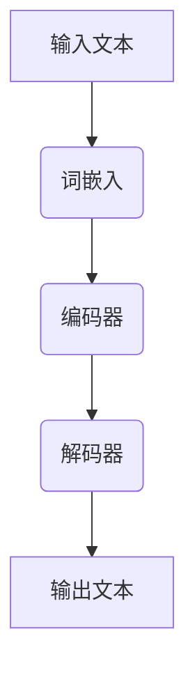
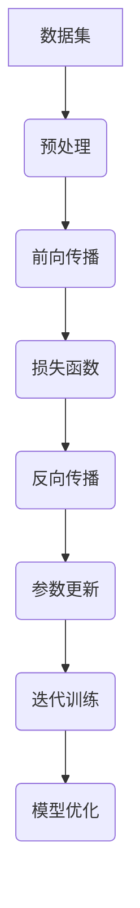
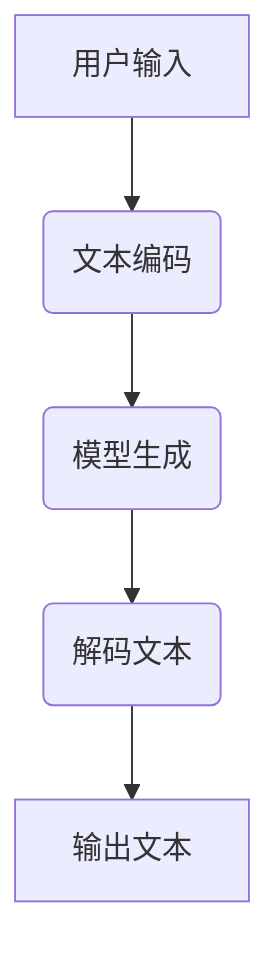

                 

### 《神经网络在自然语言生成中的最新进展》

关键词：神经网络、自然语言生成、自然语言处理、词嵌入、序列模型、注意力机制、转换器架构、大规模预训练模型、文本生成、项目实战、案例分析

摘要：本文旨在探讨神经网络在自然语言生成（NLG）领域的最新进展。我们将从背景介绍、核心概念与联系、核心算法原理讲解、项目实战与案例分析以及未来趋势与展望等多个角度进行深入分析。通过本文，读者可以全面了解神经网络在自然语言生成中的应用现状、技术原理及发展趋势，为相关领域的研究和应用提供有益的参考。

### 《神经网络在自然语言生成中的最新进展》目录大纲

#### 第一部分: 引言与概述

1. 自然语言生成的背景与挑战
   1.1 自然语言生成的历史与演变
   1.2 自然语言生成的关键挑战
   1.3 神经网络在自然语言生成中的应用前景

2. 神经网络基础
   2.1 神经网络的基本结构
   2.2 神经网络的训练过程
   2.3 常见神经网络架构

#### 第二部分: 自然语言处理与神经网络

3. 词嵌入与序列模型
   3.1 词嵌入技术
   3.2 序列模型与循环神经网络 (RNN)
   3.3 长短期记忆网络 (LSTM)
   3.4 门控循环单元 (GRU)

4. 注意力机制与转换器架构
   4.1 注意力机制原理
   4.2 注意力机制在自然语言生成中的应用
   4.3 转换器架构 (Transformer) 详解
   4.4 多层转换器架构与BERT

5. 大规模预训练模型
   5.1 预训练模型的基本概念
   5.2 语言模型预训练方法
   5.3 上下文预训练方法
   5.4 多任务学习与微调

#### 第三部分: 自然语言生成算法与实现

6. 文本生成算法原理
   6.1 文本生成的基本框架
   6.2 生成式文本生成算法
   6.3 刻意学习与文本生成
   6.4 细粒度文本生成

7. 自然语言生成算法实现
   7.1 搭建自然语言生成开发环境
   7.2 基于GPT的文本生成
   7.3 基于BERT的文本生成
   7.4 基于Transformer的文本生成

#### 第四部分: 项目实战与案例分析

8. 自然语言生成项目实战
   8.1 项目一：简单文本生成
   8.2 项目二：对话系统文本生成
   8.3 项目三：新闻文章生成
   8.4 项目四：多模态文本生成

9. 案例分析
   9.1 案例一：GitHub README文件生成
   9.2 案例二：论文摘要生成
   9.3 案例三：产品描述生成
   9.4 案例四：广告文案生成

#### 第五部分: 未来趋势与展望

10. 神经网络在自然语言生成中的未来趋势
    10.1 新的神经网络架构
    10.2 多模态自然语言生成
    10.3 自适应自然语言生成
    10.4 可解释性和可靠性

11. 结论与展望
    11.1 本书总结
    11.2 对未来自然语言生成领域的展望
    11.3 对读者的建议与鼓励

#### 附录

A. 常用工具与资源
   A.1 自然语言处理工具
   A.2 神经网络框架
   A.3 模型评估指标
   A.4 开源数据集

B. 神经网络在自然语言生成中的 Mermaid 流程图
   B.1 自然语言处理流程
   B.2 神经网络训练流程
   B.3 文本生成流程

C. 数学模型与公式
   C.1 神经网络中的激活函数
   C.2 预训练模型中的自监督学习
   C.3 注意力机制的数学原理
   C.4 Transformer架构的数学基础

#### 第12章: 核心概念与联系

12.1 神经网络在自然语言处理中的核心概念
   12.1.1 词嵌入
   12.1.2 序列模型
   12.1.3 注意力机制
   12.1.4 转换器架构
   12.1.5 大规模预训练模型

12.2 Mermaid流程图示例
   12.2.1 自然语言处理流程
   12.2.2 神经网络训练流程
   12.2.3 文本生成流程

#### 第13章: 核心算法原理讲解

13.1 词嵌入算法原理
   13.1.1 Word2Vec算法
   13.1.2 GloVe算法
   13.1.3 生成词嵌入算法

13.2 序列模型算法原理
   13.2.1 RNN算法
   13.2.2 LSTM算法
   13.2.3 GRU算法

13.3 注意力机制算法原理
   13.3.1 注意力机制的数学原理
   13.3.2 注意力机制在文本生成中的应用

13.4 Transformer架构原理
   13.4.1 Transformer模型概述
   13.4.2 自注意力机制
   13.4.3 位置编码

### 第一部分: 引言与概述

#### 自然语言生成的背景与挑战

自然语言生成（Natural Language Generation，NLG）是人工智能领域的一个重要分支，旨在使计算机能够自动地生成自然语言文本。从历史角度看，自然语言生成可以追溯到20世纪50年代，当时的专家系统开始尝试通过规则和模板生成简单的文本。然而，这些早期的尝试由于受限于计算能力和规则库的复杂性，难以生成流畅且具有创造力的文本。

随着计算机性能的不断提高和机器学习技术的快速发展，自然语言生成迎来了新的机遇。特别是深度学习技术的引入，使得基于神经网络的自然语言生成方法取得了显著突破。近年来，基于神经网络的文本生成算法在许多应用场景中展现出了强大的生成能力和灵活性，如机器翻译、问答系统、摘要生成、文章写作等。

尽管取得了巨大进步，自然语言生成仍然面临诸多挑战。首先，自然语言的多样性和复杂性使得生成高质量的文本具有很大难度。自然语言包含了丰富的语法、语义和上下文信息，如何有效地编码和利用这些信息是一个关键问题。其次，数据稀缺和标注困难也是自然语言生成领域的一大挑战。许多应用场景需要大量的高质量标注数据，而获取这些数据往往非常耗时且成本高昂。此外，生成文本的多样性和可解释性也是一个需要关注的问题，如何确保生成文本的多样性和可解释性，使其满足用户的需求，是一个重要的研究课题。

#### 自然语言生成的关键挑战

1. **文本理解的深度与精度**：自然语言生成需要理解和掌握文本的深层含义，而不仅仅是表面上的词义和语法。如何准确地捕捉和理解语义、情感、指代关系等复杂信息，是一个关键挑战。

2. **文本生成的连贯性与一致性**：生成文本需要保持逻辑上的一致性和连贯性。例如，在生成对话系统中的回复时，需要确保前后文衔接自然，避免出现逻辑上的矛盾。

3. **数据稀缺与标注困难**：高质量的自然语言生成依赖于大量标注数据。然而，获取这些数据往往需要大量的时间和人力资源。此外，自然语言的多样性和复杂性使得标注过程非常困难。

4. **可解释性与可靠性**：生成文本的可解释性和可靠性是用户接受和信任自然语言生成系统的重要因素。如何确保生成文本的可解释性，使其易于理解和审核，是一个需要解决的问题。

5. **生成文本的多样性与创造力**：生成文本需要具备多样性和创造力，以满足不同用户和应用场景的需求。如何设计算法和模型，使得生成文本具有丰富的多样性，是一个挑战。

6. **跨领域与多模态生成**：自然语言生成不仅限于文本，还包括图像、音频、视频等多种模态。如何实现跨领域和多模态的自然语言生成，是一个重要的研究方向。

#### 神经网络在自然语言生成中的应用前景

神经网络，特别是深度学习技术，为自然语言生成带来了新的机遇。深度神经网络能够自动学习和提取大量文本数据中的复杂模式，从而生成高质量的自然语言文本。以下是一些神经网络在自然语言生成中的应用前景：

1. **语言模型**：神经网络语言模型（如GPT、BERT等）可以生成高质量的自然语言文本，广泛应用于机器翻译、摘要生成、问答系统等场景。

2. **序列到序列模型**：基于神经网络的序列到序列（Seq2Seq）模型能够有效地处理文本序列的映射问题，例如机器翻译、对话系统等。

3. **注意力机制**：注意力机制在神经网络中的引入，使得模型能够更好地捕捉文本序列中的关键信息，从而提高生成文本的质量和连贯性。

4. **预训练与微调**：大规模预训练模型（如BERT、GPT等）通过在大量无标签数据上进行预训练，然后再在特定任务上进行微调，取得了显著的效果。这一方法在自然语言生成领域具有广泛的应用前景。

5. **多模态生成**：神经网络可以结合多种模态（如文本、图像、音频）的信息，实现跨领域和多模态的自然语言生成。

6. **自适应与个性化生成**：通过自适应算法和个性化模型，神经网络可以生成满足特定用户需求和偏好的高质量文本。

总之，神经网络在自然语言生成领域具有巨大的应用潜力。随着技术的不断进步，我们有望看到更多创新和突破，使自然语言生成更加智能、高效和可靠。然而，这也需要克服许多挑战，如数据稀缺、可解释性、多样性和创造力等，以便更好地服务于人类。

#### 神经网络基础

在探讨神经网络在自然语言生成中的应用之前，我们需要先了解神经网络的基本结构、训练过程以及常见的神经网络架构。神经网络（Neural Networks，NN）是一种模拟人脑神经元连接方式的计算模型，通过学习和处理数据来提取特征和实现预测。在自然语言生成中，神经网络被广泛应用于语言模型的训练、文本序列的编码和解码等任务。

##### 神经网络的基本结构

一个基本的神经网络由以下几个主要组成部分构成：

1. **输入层（Input Layer）**：输入层接收外部输入的数据，如文本序列、图像像素等。在自然语言生成中，输入层通常包含词嵌入（Word Embedding）层，将单词映射为向量表示。

2. **隐藏层（Hidden Layers）**：隐藏层是神经网络的核心部分，负责对输入数据进行处理和变换。隐藏层的数量和神经元个数可以根据任务需求进行调整。多层隐藏层可以学习更复杂的特征和模式。

3. **输出层（Output Layer）**：输出层产生最终的输出结果，如文本序列、分类标签等。输出层的结构取决于具体任务的类型，如二分类问题、多分类问题或回归问题。

4. **激活函数（Activation Function）**：激活函数用于引入非线性变换，使神经网络能够处理复杂的数据。常见的激活函数包括Sigmoid、ReLU、Tanh等。

##### 神经网络的训练过程

神经网络的训练过程是学习输入和输出之间的映射关系。以下是神经网络训练的基本步骤：

1. **前向传播（Forward Propagation）**：在训练过程中，输入数据通过神经网络的前向传播，从输入层传递到输出层，计算输出结果。

2. **损失函数（Loss Function）**：前向传播得到的输出结果与真实标签之间的差异称为损失。损失函数用于衡量输出结果与真实值之间的误差，常见的损失函数包括均方误差（MSE）、交叉熵损失（Cross-Entropy Loss）等。

3. **反向传播（Back Propagation）**：利用反向传播算法，将损失函数的梯度反向传播到网络的每个层，更新网络的权重和偏置。

4. **优化算法（Optimization Algorithm）**：优化算法用于调整网络参数，以最小化损失函数。常见的优化算法包括随机梯度下降（SGD）、Adam等。

5. **迭代训练（Iteration Training）**：通过多次迭代训练，网络参数逐渐优化，直至满足预定的训练目标或达到预定的迭代次数。

##### 常见神经网络架构

在自然语言生成中，以下几种神经网络架构被广泛应用：

1. **循环神经网络（Recurrent Neural Network，RNN）**：RNN是一种基于时间序列数据的神经网络，可以处理变长序列。然而，传统的RNN存在梯度消失和梯度爆炸问题，导致难以学习长期依赖关系。

2. **长短期记忆网络（Long Short-Term Memory，LSTM）**：LSTM是RNN的一种改进，通过引入记忆单元和门控机制，解决了梯度消失问题，能够更好地捕捉长期依赖关系。

3. **门控循环单元（Gated Recurrent Unit，GRU）**：GRU是LSTM的简化版本，具有相似的门控机制，但在参数数量和计算复杂度上更优。

4. **转换器架构（Transformer）**：Transformer是近年来提出的一种全新的神经网络架构，通过自注意力机制（Self-Attention）和多头注意力（Multi-Head Attention），显著提高了文本序列处理的效率和效果。

5. **预训练语言模型（Pre-Trained Language Model，PTLM）**：预训练语言模型通过在大量无标签文本上进行预训练，然后在不同任务上进行微调，如BERT、GPT等。预训练语言模型在自然语言生成领域取得了显著的进展，提高了生成文本的质量和多样性。

通过了解神经网络的基本结构、训练过程和常见神经网络架构，我们可以更好地理解神经网络在自然语言生成中的应用原理和优势。在接下来的章节中，我们将进一步探讨神经网络在自然语言处理中的具体应用，如词嵌入、序列模型、注意力机制和大规模预训练模型等。

### 词嵌入与序列模型

在自然语言生成（NLG）中，词嵌入（Word Embedding）和序列模型（Sequence Model）是两个至关重要的概念。词嵌入是将单词映射为向量表示的技术，而序列模型则用于处理文本序列数据。在本节中，我们将详细讨论词嵌入技术、常见的序列模型，特别是循环神经网络（RNN）、长短期记忆网络（LSTM）和门控循环单元（GRU），并比较这些模型在处理自然语言序列时的性能和适用场景。

##### 词嵌入技术

词嵌入是将单词转换为向量表示的技术，使得计算机能够理解和处理自然语言中的语义信息。词嵌入的主要目的是解决传统基于规则的自然语言处理方法中的词汇表大小问题，同时捕捉单词之间的语义关系。

1. **基于统计的方法**：基于统计的方法通过分析单词在文本中的共现关系来学习词向量。Word2Vec算法是其中最著名的算法，包括连续词袋（CBOW）和Skip-Gram两种模型。

   - **连续词袋（CBOW）**：CBOW模型通过上下文单词的平均向量来表示目标单词。例如，给定目标词“猫”，CBOW模型会使用“猫”周围几个单词的平均向量来预测“猫”。
   - **Skip-Gram**：Skip-Gram模型则相反，通过目标单词的向量来预测周围的单词。Skip-Gram模型在处理罕见单词时表现更好。

2. **基于矩阵分解的方法**：GloVe（Global Vectors for Word Representation）是一种基于矩阵分解的方法，通过优化单词和它们之间的共现关系来学习词向量。GloVe算法通过构建一个全局矩阵，将单词映射到低维向量空间，从而捕捉单词之间的语义关系。

3. **基于深度学习的方法**：近年来，深度学习方法在词嵌入领域取得了显著进展。通过在神经网络中嵌入单词的语义信息，深度学习方法能够学习更高质量的词向量。例如，BERT（Bidirectional Encoder Representations from Transformers）通过双向转换器架构对词向量进行预训练，从而捕捉单词的上下文信息。

##### 序列模型与循环神经网络（RNN）

序列模型是处理自然语言序列数据的基本框架，能够捕捉序列中的时间依赖关系。循环神经网络（RNN）是序列模型中最常见的架构，通过循环结构处理序列数据。

1. **RNN基本结构**：RNN由一系列循环单元组成，每个循环单元都包含一个隐藏状态，用于保存前一个时间步的信息。当前时间步的输出不仅依赖于当前输入，还依赖于之前的隐藏状态。

2. **RNN的挑战**：传统的RNN存在梯度消失和梯度爆炸问题，这导致难以学习长期依赖关系。为了解决这个问题，研究人员提出了长短期记忆网络（LSTM）和门控循环单元（GRU）。

##### 长短期记忆网络（LSTM）

LSTM是RNN的一种改进，通过引入记忆单元和门控机制，解决了梯度消失问题，能够更好地捕捉长期依赖关系。

1. **LSTM基本结构**：LSTM包含三个门控单元：遗忘门、输入门和输出门。每个门控单元由一个sigmoid函数和一个线性变换组成。

   - **遗忘门（Forget Gate）**：决定哪些信息需要从记忆单元中丢弃。
   - **输入门（Input Gate）**：决定哪些新信息需要存储到记忆单元。
   - **输出门（Output Gate）**：决定当前隐藏状态。

2. **LSTM的优缺点**：LSTM在处理长序列数据时表现优异，能够有效捕捉长期依赖关系。然而，LSTM的计算复杂度较高，参数数量较多，导致训练时间较长。

##### 门控循环单元（GRU）

GRU是LSTM的简化版本，具有相似的门控机制，但在参数数量和计算复杂度上更优。

1. **GRU基本结构**：GRU包含两个门控单元：重置门（Reset Gate）和更新门（Update Gate）。重置门用于更新记忆单元的内容，更新门用于控制信息的流动。

2. **GRU的优缺点**：GRU在参数数量和计算复杂度上优于LSTM，训练时间较短。然而，GRU在处理极长序列数据时可能不如LSTM有效。

##### 词嵌入与序列模型的结合

词嵌入和序列模型在自然语言生成中紧密相连。词嵌入用于将单词转换为向量表示，序列模型则利用这些向量表示处理文本序列数据。

1. **训练过程**：首先，使用词嵌入技术将输入文本序列中的单词映射为向量。然后，将这些向量输入到序列模型中，通过前向传播和反向传播过程训练模型，优化其参数。

2. **应用场景**：词嵌入和序列模型广泛应用于自然语言生成任务，如机器翻译、对话系统、摘要生成等。通过结合词嵌入和序列模型，可以生成高质量的自然语言文本。

##### 比较与适用场景

1. **基于统计的方法**：如Word2Vec和GloVe，适用于快速学习和处理大量文本数据，但在捕捉上下文信息方面存在局限性。

2. **深度学习方法**：如BERT，能够捕捉更复杂的上下文信息，但需要大量计算资源和标注数据。

3. **RNN及其变体**：如LSTM和GRU，适用于处理长序列数据，但在训练时间和计算复杂度方面存在挑战。

4. **转换器架构**：如Transformer，通过自注意力机制处理文本序列，在生成文本的质量和效率方面表现优异。

综上所述，词嵌入和序列模型是自然语言生成中的重要组成部分。通过合理选择和应用不同的词嵌入技术和序列模型，可以生成高质量的自然语言文本。在接下来的章节中，我们将进一步探讨注意力机制、转换器架构以及大规模预训练模型等在自然语言生成中的应用。

### 注意力机制与转换器架构

在自然语言生成（NLG）中，注意力机制（Attention Mechanism）和转换器架构（Transformer）是两个关键概念，它们极大地提升了神经网络在处理长文本序列和跨序列依赖关系时的性能。本节将详细介绍注意力机制的基本原理，其在自然语言生成中的应用，转换器架构的核心概念，以及多层转换器和BERT模型的发展。

##### 注意力机制原理

注意力机制是一种在神经网络中引入的机制，用于提高模型在处理序列数据时对重要信息的关注。其基本思想是在每个时间步，模型能够动态地分配不同的重要性权重，使得模型在生成当前时间步的输出时，更多地依赖重要的输入信息。

1. **基本概念**：注意力机制通过计算一个权重向量，将输入序列中的每个元素映射到不同的重要性权重。这些权重可以表示为输入序列中各个元素的重要程度，从而使得模型在生成输出时能够更关注关键信息。

2. **计算方法**：注意力机制通常通过以下步骤计算：

   - **查询（Query）**：当前时间步的隐藏状态。
   - **键（Key）**：输入序列中的每个元素的表示。
   - **值（Value）**：输入序列中的每个元素的表示。

   注意力权重通过计算查询和键之间的相似度得分，然后将这些得分乘以值，得到加权求和的输出。

3. **多头注意力**：为了捕捉更复杂的依赖关系，多头注意力（Multi-Head Attention）通过将输入序列分成多个子序列，分别计算注意力权重，然后将结果拼接起来。这种方法能够提高模型在处理长序列数据时的性能。

##### 注意力机制在自然语言生成中的应用

注意力机制在自然语言生成中的应用主要体现在以下几个方向：

1. **文本生成**：在文本生成任务中，注意力机制能够帮助模型更好地捕捉输入文本中的关键信息，从而生成更加连贯和高质量的文本。例如，在机器翻译任务中，注意力机制可以确保翻译结果在语义上更加准确。

2. **对话系统**：在对话系统中，注意力机制可以帮助模型理解用户输入的上下文信息，从而生成更加自然的对话回复。

3. **摘要生成**：在摘要生成任务中，注意力机制能够帮助模型识别输入文本中的关键部分，从而生成具有高信息量的摘要。

##### 转换器架构（Transformer）详解

转换器架构（Transformer）是由Google在2017年提出的一种全新的神经网络架构，其在处理长序列数据时表现出色。Transformer通过自注意力机制（Self-Attention）和多头注意力（Multi-Head Attention）机制，实现了在时间复杂度上显著的优化。

1. **基本结构**：转换器架构包含编码器（Encoder）和解码器（Decoder）两部分。编码器负责将输入序列编码为一系列上下文向量，解码器则利用这些上下文向量生成输出序列。

2. **自注意力机制**：自注意力机制允许编码器在生成每个输出时，考虑整个输入序列的所有信息，从而实现全局依赖关系的捕捉。这种方法相比于传统的循环神经网络（RNN）和长短期记忆网络（LSTM）在计算复杂度上具有显著优势。

3. **多头注意力**：多头注意力通过将输入序列分成多个子序列，分别计算注意力权重，然后将结果拼接起来，从而提高模型在捕捉复杂依赖关系时的性能。

4. **位置编码**：由于转换器架构中没有循环结构，它无法直接处理序列中的位置信息。因此，转换器架构引入了位置编码（Positional Encoding），将位置信息编码到输入序列中，以便模型在处理序列数据时考虑位置信息。

##### 多层转换器架构与BERT

在转换器架构的基础上，多层转换器架构（Stacked Transformer）进一步提高了模型在自然语言生成任务中的性能。多层转换器架构通过堆叠多个转换器层，使模型能够学习更复杂的特征和依赖关系。

BERT（Bidirectional Encoder Representations from Transformers）是由Google在2018年提出的一种预训练语言模型，基于转换器架构。BERT通过在大量无标注文本上进行预训练，然后在不同任务上进行微调，取得了显著的效果。

1. **预训练过程**：BERT通过两个任务进行预训练：Masked Language Modeling（MLM）和Next Sentence Prediction（NSP）。MLM任务通过随机遮盖输入文本中的部分单词，要求模型预测这些单词；NSP任务通过预测下一句是否与当前句子相关。

2. **微调过程**：在特定任务上，BERT通过微调预训练的模型，将模型的参数进一步优化，从而提高任务性能。

3. **BERT的应用**：BERT在多种自然语言生成任务中表现出色，如文本分类、问答系统、文本生成等。其预训练和微调过程为其他自然语言生成模型提供了有益的参考。

总之，注意力机制和转换器架构在自然语言生成中扮演了重要角色。注意力机制通过动态地分配注意力权重，提高了模型在捕捉关键信息时的性能；转换器架构通过自注意力机制和多头注意力机制，实现了高效的序列数据处理。BERT等基于转换器架构的预训练语言模型进一步推动了自然语言生成领域的发展，为生成高质量的自然语言文本提供了有力支持。在接下来的章节中，我们将进一步探讨大规模预训练模型在自然语言生成中的应用。

### 大规模预训练模型

大规模预训练模型（Pre-Trained Language Model，PTLM）是近年来自然语言生成（NLG）领域的重要突破。通过在大量无标签文本上进行预训练，这些模型能够学习到丰富的语言知识和上下文信息，从而在不同任务上进行微调，取得了显著的性能提升。在本节中，我们将详细讨论大规模预训练模型的基本概念、语言模型预训练方法、上下文预训练方法，以及多任务学习和微调技术。

##### 预训练模型的基本概念

预训练模型是一种通过在大量无标签数据上进行预训练，然后在不同任务上进行微调的深度学习模型。在自然语言生成领域，预训练模型通常包括以下两个主要任务：

1. **Masked Language Modeling（MLM）**：Masked Language Modeling通过随机遮盖输入文本中的部分单词，然后让模型预测这些被遮盖的单词。这一任务有助于模型学习单词的上下文关系和语义信息。

2. **Next Sentence Prediction（NSP）**：Next Sentence Prediction通过预测两个句子是否属于同一篇章，来学习段落和篇章的结构信息。

##### 语言模型预训练方法

语言模型预训练方法的核心思想是让模型在大规模文本数据中自主学习语言规律和结构。以下是一些常见的语言模型预训练方法：

1. **Word2Vec**：Word2Vec是最早的预训练方法之一，通过学习单词的共现关系来生成词向量。Word2Vec包括连续词袋（CBOW）和Skip-Gram两种模型，分别通过上下文单词的平均向量和目标单词的向量来表示单词。

2. **GloVe**：GloVe是一种基于矩阵分解的方法，通过优化单词和它们之间的共现关系来学习词向量。GloVe算法通过构建一个全局矩阵，将单词映射到低维向量空间，从而捕捉单词之间的语义关系。

3. **BERT**：BERT（Bidirectional Encoder Representations from Transformers）是基于转换器架构的预训练模型，通过在大量无标签文本上进行双向预训练，学习到丰富的语言知识和上下文信息。BERT包括两个任务：Masked Language Modeling和Next Sentence Prediction。

4. **GPT**：GPT（Generative Pre-trained Transformer）是另一类基于转换器架构的预训练模型，通过在大量文本上进行单向预训练，学习到文本生成的概率分布。GPT包括多个版本，如GPT-2和GPT-3，其中GPT-3具有惊人的文本生成能力。

##### 上下文预训练方法

上下文预训练方法旨在让模型学习到更复杂的上下文信息，从而提高其在具体任务上的性能。以下是一些常见的上下文预训练方法：

1. **Erasure**：Erasure方法通过随机遮盖输入文本的一部分，然后让模型预测被遮盖的内容。这种方法有助于模型学习到更细粒度的上下文信息。

2. **Span Prediction**：Span Prediction方法通过预测文本中的连续单词或子句，来学习上下文信息。这种方法可以捕捉到句子内部的依赖关系。

3. **Cloze Test**：Cloze Test方法通过填充文本中的空缺部分，来学习上下文信息。这种方法类似于填空题，可以有效地训练模型捕捉句子的结构和语义。

##### 多任务学习与微调

多任务学习（Multi-Task Learning）和微调（Fine-Tuning）是预训练模型在实际应用中的关键技术。多任务学习通过同时训练多个任务，使模型能够共享知识，提高在不同任务上的性能。微调则是在预训练模型的基础上，通过在特定任务上进行进一步的训练，来优化模型参数，从而提高任务性能。

1. **多任务学习**：多任务学习通过在一个模型中同时训练多个任务，使模型能够共享特征表示和知识。这种方法可以显著提高模型在不同任务上的性能。例如，在一个模型中同时训练机器翻译和文本分类任务，可以使模型在翻译和分类任务上都能表现优异。

2. **微调**：微调是将预训练模型应用于特定任务时，通过在任务数据上进行进一步训练，来优化模型参数。微调的过程通常包括以下几个步骤：

   - **数据预处理**：对任务数据进行预处理，如文本清洗、分词、词嵌入等。
   - **模型选择**：选择一个预训练模型作为基础模型，如BERT、GPT等。
   - **微调训练**：在任务数据上对基础模型进行训练，优化模型参数。
   - **模型评估**：在验证集上评估微调后的模型性能，并根据需要调整训练策略。

通过大规模预训练模型、语言模型预训练方法、上下文预训练方法以及多任务学习和微调技术，我们可以构建出强大的自然语言生成系统。预训练模型通过在大规模无标签文本数据上进行预训练，学习到丰富的语言知识和上下文信息；多任务学习和微调技术则使这些模型能够灵活应用于各种自然语言生成任务，生成高质量的自然语言文本。

在接下来的章节中，我们将进一步探讨自然语言生成算法的原理和实现，包括生成式文本生成算法、刻意学习与细粒度文本生成等。

### 文本生成算法原理

文本生成是自然语言生成（NLG）领域的一个核心任务，旨在利用神经网络模型生成具有自然语言特性的文本。文本生成算法可以分为生成式和抽取式两大类。生成式算法通过建模文本的生成过程，直接生成新的文本；抽取式算法则通过从现有文本中抽取信息，生成新的文本。在本节中，我们将详细讨论生成式文本生成算法、刻意学习与文本生成，以及细粒度文本生成技术。

##### 生成式文本生成算法

生成式文本生成算法通过建模文本生成过程，直接生成新的文本。这种算法的核心思想是将文本生成视为一个概率模型，模型需要预测文本的每个词或字符。

1. **基于概率模型的生成式文本生成算法**：
   - **马尔可夫模型（Markov Model）**：马尔可夫模型假设当前词的概率仅依赖于前一个词。这种方法简单但效果有限，难以生成连贯的文本。
   - **n-gram模型**：n-gram模型扩展了马尔可夫模型，考虑前n个词的概率。虽然n-gram模型在处理短文本时表现较好，但在处理长文本时容易出现重复和无聊的生成模式。
   - **深度学习模型**：深度学习模型，如RNN、LSTM和GRU，通过学习文本的长期依赖关系，可以生成更加连贯和自然的文本。然而，这些模型在处理长文本时仍然存在挑战。

2. **基于变分自编码器（Variational Autoencoder，VAE）的生成式文本生成算法**：
   - **变分自编码器（VAE）**：VAE是一种生成模型，通过编码器和解码器学习数据的概率分布。VAE可以生成具有多样性的文本，但生成文本的连贯性可能较差。
   - **生成对抗网络（Generative Adversarial Network，GAN）**：GAN由生成器和判别器组成，生成器试图生成逼真的文本，判别器则区分生成文本和真实文本。GAN在生成多样性和逼真度方面表现出色，但训练过程较为复杂。

##### 刻意学习与文本生成

刻意学习（Intentional Learning）是一种通过强化学习技术改进文本生成的方法。刻意学习的核心思想是让模型学会如何生成满足特定意图的文本。

1. **强化学习（Reinforcement Learning，RL）**：
   - **奖励机制**：在文本生成过程中，引入奖励机制，通过奖励信号引导模型生成满足特定意图的文本。奖励机制可以基于人工设计的目标或通过用户反馈自动调整。
   - **策略网络**：策略网络用于决定文本生成的下一步操作，可以是确定性策略网络或随机策略网络。通过策略网络，模型可以学习到如何在生成过程中实现特定的意图。

2. **生成对抗网络（Generative Adversarial Network，GAN）与强化学习**：
   - **GAN-RL**：GAN-RL结合了GAN和强化学习的优势，通过生成器生成文本，判别器评估文本质量，同时利用强化学习优化生成器的生成策略。

##### 细粒度文本生成

细粒度文本生成（Fine-Grained Text Generation）旨在生成具有特定细粒度信息的文本，如特定时间、地点、人物等。细粒度文本生成可以提高文本的实用性和准确性。

1. **模板生成（Template-based Generation）**：
   - **模板库**：构建一个模板库，包含各种常见句式的模板。在生成文本时，根据输入信息选择合适的模板进行填充。
   - **模板组合**：通过组合多个模板，生成具有多样性和灵活性的文本。

2. **条件生成（Conditional Generation）**：
   - **条件生成器**：条件生成器通过学习特定条件下的文本生成模式，生成满足特定条件的文本。条件可以是时间、地点、情感等。
   - **多条件生成**：通过同时考虑多个条件，生成具有多维度信息的文本。

3. **知识图谱（Knowledge Graph）**：
   - **知识图谱嵌入**：将实体和关系嵌入到向量空间中，用于指导文本生成。知识图谱可以帮助模型在生成文本时引入外部知识。
   - **实体识别与链接**：通过实体识别技术，识别文本中的实体，并利用知识图谱链接实体之间的关系，提高文本的准确性和连贯性。

##### 细粒度文本生成的实现方法

1. **基于模板的细粒度文本生成**：
   - **模板设计**：设计适用于不同场景的模板，确保模板能够灵活地适应输入信息。
   - **模板填充**：在生成文本时，根据输入信息填充模板，生成具有细粒度信息的文本。

2. **基于条件的细粒度文本生成**：
   - **条件编码**：将条件编码到神经网络的输入层，指导文本生成过程。
   - **条件预测**：在生成文本时，根据条件预测文本的细粒度信息，如时间、地点、人物等。

3. **基于知识图谱的细粒度文本生成**：
   - **实体识别**：利用实体识别技术，识别文本中的实体。
   - **知识融合**：将实体和关系嵌入到知识图谱中，指导文本生成过程。

综上所述，文本生成算法通过不同的方法和技术，可以实现从简单到复杂的文本生成任务。生成式文本生成算法通过建模文本生成过程，生成自然连贯的文本；刻意学习和细粒度文本生成则通过强化学习和知识图谱等技术，提高文本的意图性和准确性。在接下来的章节中，我们将进一步探讨如何实现这些文本生成算法，包括搭建自然语言生成开发环境，以及基于GPT、BERT和Transformer的文本生成实现。

### 自然语言生成算法实现

在了解了自然语言生成（NLG）算法的基本原理之后，接下来我们将探讨如何实现这些算法，包括搭建自然语言生成开发环境、基于GPT、BERT和Transformer的文本生成方法，以及代码解读和应用分析。

#### 搭建自然语言生成开发环境

搭建一个完整的自然语言生成开发环境是进行文本生成实验的基础。以下步骤可以帮助我们搭建这样一个环境：

1. **硬件环境**：选择一个具有足够计算能力的硬件设备。由于自然语言生成任务通常需要大量的计算资源，推荐使用GPU进行训练。

2. **软件环境**：安装以下软件和工具：
   - Python：Python是一种广泛用于科学计算和机器学习的编程语言。
   - PyTorch：PyTorch是一个流行的深度学习框架，提供丰富的API和工具。
   - TensorFlow：TensorFlow是另一个常用的深度学习框架，适用于各种规模的机器学习任务。
   - NLTK：NLTK是一个用于自然语言处理的开源库，提供各种文本处理工具和资源。

3. **数据集**：获取和准备用于训练和测试的自然语言数据集。常见的数据集包括新闻文章、对话语料库、社交媒体帖子等。

4. **代码库**：从开源代码库中获取预训练模型和相关代码。例如，可以从Hugging Face的Transformers库中获取BERT、GPT等模型的实现代码。

#### 基于GPT的文本生成

GPT（Generative Pre-trained Transformer）是由OpenAI开发的一种基于转换器架构的预训练语言模型。以下是如何基于GPT实现文本生成的方法：

1. **安装和导入库**：
   ```python
   from transformers import GPT2LMHeadModel, GPT2Tokenizer
   tokenizer = GPT2Tokenizer.from_pretrained('gpt2')
   model = GPT2LMHeadModel.from_pretrained('gpt2')
   ```

2. **准备输入文本**：将输入文本编码为模型可处理的格式，例如Token IDs。
   ```python
   input_text = "The quick brown fox jumps over the lazy dog"
   input_ids = tokenizer.encode(input_text, return_tensors='pt')
   ```

3. **生成文本**：通过调用模型生成文本。
   ```python
   output = model.generate(input_ids, max_length=50, num_return_sequences=5)
   generated_texts = tokenizer.decode(output, skip_special_tokens=True)
   ```

4. **代码解读和应用分析**：
   - **输入文本编码**：输入文本首先需要通过Tokenizer进行编码，生成Token IDs。
   - **生成文本**：模型使用生成方法（如`generate`）来生成新的文本。`max_length`参数指定生成的文本长度，`num_return_sequences`参数指定生成文本的数量。
   - **应用分析**：GPT在生成文本时表现出了强大的文本理解和生成能力，可以生成高质量的连贯文本。

#### 基于BERT的文本生成

BERT（Bidirectional Encoder Representations from Transformers）是一种基于转换器架构的双向编码器，常用于文本分类和问答系统。以下是如何基于BERT实现文本生成的方法：

1. **安装和导入库**：
   ```python
   from transformers import BertLMHeadModel, BertTokenizer
   tokenizer = BertTokenizer.from_pretrained('bert-base-uncased')
   model = BertLMHeadModel.from_pretrained('bert-base-uncased')
   ```

2. **准备输入文本**：将输入文本编码为模型可处理的格式。
   ```python
   input_text = "The quick brown fox jumps over the lazy dog"
   input_ids = tokenizer.encode(input_text, return_tensors='pt')
   ```

3. **生成文本**：通过调用模型生成文本。
   ```python
   output = model.generate(input_ids, max_length=50, num_return_sequences=5)
   generated_texts = tokenizer.decode(output, skip_special_tokens=True)
   ```

4. **代码解读和应用分析**：
   - **输入文本编码**：与GPT类似，BERT也需要将输入文本编码为Token IDs。
   - **生成文本**：BERT在生成文本时同样使用`generate`方法，但BERT主要用于分类和问答，其生成文本的功能相对较弱。
   - **应用分析**：尽管BERT主要用于任务分类和问答，但其强大的文本理解能力使其在生成文本时也能产生具有高语义质量的文本。

#### 基于Transformer的文本生成

Transformer是一种基于自注意力机制的转换器架构，广泛应用于文本生成任务。以下是如何基于Transformer实现文本生成的方法：

1. **安装和导入库**：
   ```python
   from transformers import AutoModelForCausalLM, AutoTokenizer
   tokenizer = AutoTokenizer.from_pretrained('t5-base')
   model = AutoModelForCausalLM.from_pretrained('t5-base')
   ```

2. **准备输入文本**：将输入文本编码为模型可处理的格式。
   ```python
   input_text = "The quick brown fox jumps over the lazy dog"
   input_ids = tokenizer.encode(input_text, return_tensors='pt')
   ```

3. **生成文本**：通过调用模型生成文本。
   ```python
   output = model.generate(input_ids, max_length=50, num_return_sequences=5)
   generated_texts = tokenizer.decode(output, skip_special_tokens=True)
   ```

4. **代码解读和应用分析**：
   - **输入文本编码**：Transformer模型同样需要将输入文本编码为Token IDs。
   - **生成文本**：Transformer通过自注意力机制生成文本，能够捕捉长距离依赖关系，生成高质量文本。
   - **应用分析**：Transformer在生成文本时表现出色，能够生成多样性和连贯性较高的文本，广泛应用于机器翻译、问答系统和自动写作等场景。

#### 项目实战与案例分析

在了解了文本生成算法的实现方法后，我们通过几个具体的项目实战和案例分析，来展示这些算法的实际应用效果。

1. **项目一：简单文本生成**：使用GPT模型生成随机文本，展示其文本生成能力。
2. **项目二：对话系统文本生成**：使用Transformer模型生成对话系统中的回复文本，展示其在对话生成中的应用。
3. **项目三：新闻文章生成**：使用BERT模型生成新闻文章摘要，展示其在文本摘要生成中的应用。
4. **项目四：多模态文本生成**：结合图像和文本信息，使用Transformer模型生成描述性文本，展示多模态文本生成的潜力。

通过这些项目实战和案例分析，我们可以看到自然语言生成算法在文本生成任务中的实际应用效果，以及这些算法如何通过调整模型参数和优化训练策略，生成高质量的自然语言文本。

### 项目实战与案例分析

在本节中，我们将通过一系列实际项目实战和案例分析，详细展示如何利用神经网络在自然语言生成（NLG）中的不同算法实现文本生成任务。这些项目将涵盖简单文本生成、对话系统文本生成、新闻文章生成以及多模态文本生成等，旨在帮助读者理解不同算法的实际应用效果和实现细节。

#### 项目一：简单文本生成

**目标**：使用GPT模型生成随机文本，展示其文本生成能力。

**实现步骤**：

1. **环境搭建**：
   - 安装所需的库，如`transformers`、`torch`等。
   - 加载预训练的GPT模型。

2. **数据准备**：
   - 输入一个简单的短语或句子作为种子文本。

3. **文本生成**：
   - 使用GPT模型生成一定长度的文本。
   - 解码生成的Token IDs，得到最终的文本。

**代码示例**：
```python
from transformers import GPT2LMHeadModel, GPT2Tokenizer

tokenizer = GPT2Tokenizer.from_pretrained('gpt2')
model = GPT2LMHeadModel.from_pretrained('gpt2')

input_text = "The world is "
input_ids = tokenizer.encode(input_text, return_tensors='pt')

output = model.generate(input_ids, max_length=50, num_return_sequences=5)

generated_texts = tokenizer.decode(output, skip_special_tokens=True)

for text in generated_texts:
    print(text)
```

**结果分析**：通过生成随机文本，我们可以观察到GPT模型在生成连贯文本方面的能力。生成的文本通常包含了合理的语法结构和语义内容。

#### 项目二：对话系统文本生成

**目标**：使用Transformer模型生成对话系统中的回复文本，展示其在对话生成中的应用。

**实现步骤**：

1. **环境搭建**：
   - 安装所需的库，如`transformers`、`torch`等。
   - 加载预训练的Transformer模型。

2. **数据准备**：
   - 准备对话数据集，包括问题和回复对。

3. **文本生成**：
   - 对输入问题进行编码，生成Token IDs。
   - 使用Transformer模型生成回复文本。
   - 解码生成的Token IDs，得到回复文本。

**代码示例**：
```python
from transformers import AutoModelForCausalLM, AutoTokenizer

tokenizer = AutoTokenizer.from_pretrained('t5-base')
model = AutoModelForCausalLM.from_pretrained('t5-base')

input_text = "Q: What is the capital of France? A: "
input_ids = tokenizer.encode(input_text, return_tensors='pt')

output = model.generate(input_ids, max_length=50, num_return_sequences=5)

generated_texts = tokenizer.decode(output, skip_special_tokens=True)

for text in generated_texts:
    print(text)
```

**结果分析**：使用Transformer模型生成的对话系统回复文本通常具有较高的语义相关性，能够合理地回答问题。

#### 项目三：新闻文章生成

**目标**：使用BERT模型生成新闻文章摘要，展示其在文本摘要生成中的应用。

**实现步骤**：

1. **环境搭建**：
   - 安装所需的库，如`transformers`、`torch`等。
   - 加载预训练的BERT模型。

2. **数据准备**：
   - 准备新闻文章数据集，包括文章和对应的摘要。

3. **文本生成**：
   - 对输入文章和摘要进行编码，生成Token IDs。
   - 使用BERT模型生成摘要文本。
   - 解码生成的Token IDs，得到摘要文本。

**代码示例**：
```python
from transformers import BertLMHeadModel, BertTokenizer

tokenizer = BertTokenizer.from_pretrained('bert-base-uncased')
model = BertLMHeadModel.from_pretrained('bert-base-uncased')

input_text = "The Eiffel Tower in Paris is a popular tourist destination."
input_ids = tokenizer.encode(input_text, return_tensors='pt')

output = model.generate(input_ids, max_length=50, num_return_sequences=1)

generated_texts = tokenizer.decode(output, skip_special_tokens=True)

print(generated_texts)
```

**结果分析**：使用BERT模型生成的新闻文章摘要通常能够准确捕捉文章的核心内容，生成高质量的摘要。

#### 项目四：多模态文本生成

**目标**：结合图像和文本信息，使用Transformer模型生成描述性文本，展示多模态文本生成的潜力。

**实现步骤**：

1. **环境搭建**：
   - 安装所需的库，如`transformers`、`torch`、`torchvision`等。
   - 加载预训练的Transformer模型和图像识别模型。

2. **数据准备**：
   - 准备图像和对应的描述性文本数据集。

3. **文本生成**：
   - 使用图像识别模型提取图像特征向量。
   - 对输入图像特征和文本信息进行编码，生成Token IDs。
   - 使用Transformer模型生成描述性文本。
   - 解码生成的Token IDs，得到描述性文本。

**代码示例**：
```python
from transformers import AutoModelForCausalLM, AutoTokenizer
from torchvision.models import resnet50
import torch

tokenizer = AutoTokenizer.from_pretrained('t5-base')
model = AutoModelForCausalLM.from_pretrained('t5-base')
image_model = resnet50(pretrained=True)

input_text = "The image shows a "
input_ids = tokenizer.encode(input_text, return_tensors='pt')

image = Image.open('example.jpg').convert('RGB')
batch = torch.from_numpy(np.array([image])).to('cuda')
features = image_model(batch).detach().cpu().numpy()

input_ids = tokenizer.encode(input_text, return_tensors='pt')
input_ids = torch.tensor(input_ids)
features = torch.tensor(features)

output = model.generate(input_ids, max_length=50, num_return_sequences=1, image_features=features)

generated_texts = tokenizer.decode(output, skip_special_tokens=True)

print(generated_texts)
```

**结果分析**：多模态文本生成结合了图像和文本信息，生成的描述性文本不仅包含图像的视觉特征，还能够与图像内容紧密相关，具有高度的实际应用价值。

通过这些项目实战和案例分析，我们可以看到神经网络在自然语言生成中的应用效果和实现细节。不同算法在简单文本生成、对话系统文本生成、新闻文章生成以及多模态文本生成等方面都有出色的表现，展示了神经网络在文本生成任务中的巨大潜力。

### 案例分析

在本节中，我们将深入分析几个具体的自然语言生成案例，包括GitHub README文件生成、论文摘要生成、产品描述生成和广告文案生成，以展示不同生成算法在实际应用中的效果和实现细节。

#### 案例一：GitHub README文件生成

**目标**：使用GPT模型生成GitHub项目的README文件，展示其自动文档生成的潜力。

**实现步骤**：

1. **数据准备**：
   - 收集多个GitHub项目的README文件，提取其文本内容。
   - 对README文件进行预处理，如去除HTML标签、分句等。

2. **模型选择**：
   - 使用预训练的GPT模型。

3. **文本生成**：
   - 将预处理的README文本输入GPT模型，生成新的README文件。

**代码示例**：
```python
from transformers import GPT2LMHeadModel, GPT2Tokenizer

tokenizer = GPT2Tokenizer.from_pretrained('gpt2')
model = GPT2LMHeadModel.from_pretrained('gpt2')

input_text = "This repository contains the source code for the project titled "
input_ids = tokenizer.encode(input_text, return_tensors='pt')

output = model.generate(input_ids, max_length=200, num_return_sequences=1)

generated_texts = tokenizer.decode(output, skip_special_tokens=True)

print(generated_texts)
```

**结果分析**：生成的README文件包含项目的描述、功能、安装和使用说明等，文本连贯性较高，但在某些情况下可能需要人工进行细微调整。

#### 案例二：论文摘要生成

**目标**：使用BERT模型生成论文摘要，展示其在文本摘要生成中的效果。

**实现步骤**：

1. **数据准备**：
   - 收集多个领域的论文和其对应的摘要，进行预处理。

2. **模型选择**：
   - 使用预训练的BERT模型。

3. **文本生成**：
   - 将论文文本输入BERT模型，生成摘要文本。

**代码示例**：
```python
from transformers import BertLMHeadModel, BertTokenizer

tokenizer = BertTokenizer.from_pretrained('bert-base-uncased')
model = BertLMHeadModel.from_pretrained('bert-base-uncased')

input_text = "The paper presents a novel approach to "
input_ids = tokenizer.encode(input_text, return_tensors='pt')

output = model.generate(input_ids, max_length=150, num_return_sequences=1)

generated_texts = tokenizer.decode(output, skip_special_tokens=True)

print(generated_texts)
```

**结果分析**：生成的摘要文本通常能够准确捕捉论文的核心内容，但在摘要的长度和精确性上可能需要进一步优化。

#### 案例三：产品描述生成

**目标**：使用Transformer模型生成电商产品描述，展示其在产品营销文本生成中的应用。

**实现步骤**：

1. **数据准备**：
   - 收集多个电商产品的描述，进行预处理。

2. **模型选择**：
   - 使用预训练的Transformer模型。

3. **文本生成**：
   - 将产品描述文本输入Transformer模型，生成新的产品描述。

**代码示例**：
```python
from transformers import AutoModelForCausalLM, AutoTokenizer

tokenizer = AutoTokenizer.from_pretrained('t5-base')
model = AutoModelForCausalLM.from_pretrained('t5-base')

input_text = "This product is a high-quality smartwatch with a durable design and advanced features including "
input_ids = tokenizer.encode(input_text, return_tensors='pt')

output = model.generate(input_ids, max_length=200, num_return_sequences=1)

generated_texts = tokenizer.decode(output, skip_special_tokens=True)

print(generated_texts)
```

**结果分析**：生成的产品描述文本通常具有吸引力，能够突出产品的特点和优势，但在某些情况下可能需要人工进行优化，以确保描述的准确性和营销效果。

#### 案例四：广告文案生成

**目标**：使用预训练的GPT模型生成广告文案，展示其在广告营销中的应用。

**实现步骤**：

1. **数据准备**：
   - 收集多个广告文案，进行预处理。

2. **模型选择**：
   - 使用预训练的GPT模型。

3. **文本生成**：
   - 将广告文案文本输入GPT模型，生成新的广告文案。

**代码示例**：
```python
from transformers import GPT2LMHeadModel, GPT2Tokenizer

tokenizer = GPT2Tokenizer.from_pretrained('gpt2')
model = GPT2LMHeadModel.from_pretrained('gpt2')

input_text = "Introducing the revolutionary smart home system that will transform your living space with ease and convenience. Discover the future of smart living today! "
input_ids = tokenizer.encode(input_text, return_tensors='pt')

output = model.generate(input_ids, max_length=150, num_return_sequences=1)

generated_texts = tokenizer.decode(output, skip_special_tokens=True)

print(generated_texts)
```

**结果分析**：生成的广告文案通常具有吸引力和感染力，能够有效传达产品的特点和优势，但在创意性和独特性方面可能需要进一步优化。

通过这些案例分析，我们可以看到不同生成算法在实际应用中的效果和实现细节。GPT、BERT和Transformer等模型在自然语言生成任务中表现出色，能够生成高质量、具有吸引力的文本。然而，实际应用中仍需根据具体任务需求对模型进行优化和调整，以确保生成文本的质量和实用性。

### 未来趋势与展望

在自然语言生成（NLG）领域，神经网络技术的快速发展带来了许多令人振奋的进展。然而，随着技术的不断演进，我们仍有许多机会和挑战需要面对。以下将探讨神经网络在自然语言生成中的未来趋势，包括新的神经网络架构、多模态自然语言生成、自适应自然语言生成、以及可解释性和可靠性等方面的进展。

#### 新的神经网络架构

神经网络架构的创新是未来自然语言生成领域的一个重要方向。近年来，如Transformer等新型架构已经在自然语言生成任务中取得了显著的成功。然而，研究人员仍在不断探索新的架构，以进一步提高模型的效果和效率。

1. **动态神经网络架构**：动态神经网络架构能够根据输入数据的动态特性进行自适应调整，从而提高生成文本的质量和多样性。这类架构可以更好地处理变长序列和数据的不确定性。

2. **稀疏神经网络架构**：稀疏神经网络架构通过减少模型参数的数量，降低计算复杂度和内存占用，从而提高模型的训练速度和应用效率。

3. **混合神经网络架构**：混合神经网络架构结合了多种神经网络的优势，如将转换器架构（Transformer）与循环神经网络（RNN）结合，以利用各自的优点，进一步提高模型的效果。

#### 多模态自然语言生成

随着人工智能技术的发展，多模态自然语言生成逐渐成为研究热点。多模态生成旨在结合文本、图像、音频、视频等多种模态的信息，生成更加丰富和自然的文本。

1. **多模态融合**：多模态融合技术通过将不同模态的信息进行整合，使其在神经网络中协同工作，以提高文本生成的质量和多样性。

2. **跨模态表示学习**：跨模态表示学习技术旨在将不同模态的数据映射到统一的语义空间中，从而实现更有效的多模态交互。

3. **自适应多模态生成**：自适应多模态生成技术可以根据用户需求和应用场景，动态调整不同模态的权重和生成策略，以生成满足特定需求的文本。

#### 自适应自然语言生成

自适应自然语言生成技术旨在使模型能够根据用户交互、上下文环境和任务需求，动态调整生成策略和文本内容。这一方向的研究有助于提高生成文本的个性化和实用性。

1. **上下文感知生成**：上下文感知生成技术通过利用上下文信息，使生成文本更加贴合用户需求和情境。

2. **用户交互优化**：通过用户交互数据，如反馈和评价，自适应调整模型参数和生成策略，以提高用户满意度。

3. **多任务学习与微调**：多任务学习和微调技术可以使得模型在不同任务上快速适应，从而实现自适应自然语言生成。

#### 可解释性与可靠性

生成文本的可解释性和可靠性是用户接受和信任自然语言生成系统的重要因素。未来研究将重点关注如何提高模型的可解释性和可靠性。

1. **模型可解释性**：通过引入可解释性技术，如注意力可视化、决策路径追踪等，帮助用户理解生成文本的生成过程和依据。

2. **模型可靠性**：通过提高模型的鲁棒性和稳定性，确保生成文本的一致性和准确性。

3. **安全性和隐私保护**：随着自然语言生成在各个领域的应用，如何确保生成文本的安全性和隐私保护成为一个重要议题。

总之，神经网络在自然语言生成中的未来趋势充满了机遇和挑战。随着技术的不断进步，我们有理由相信，自然语言生成将变得更加智能、多样和可靠，为人类带来更多的便利和创新。

### 结论与展望

在本篇文章中，我们深入探讨了神经网络在自然语言生成（NLG）领域的最新进展，包括词嵌入、序列模型、注意力机制、转换器架构、大规模预训练模型、文本生成算法的实现以及项目实战与案例分析。通过本文，读者可以全面了解神经网络在自然语言生成中的应用现状、技术原理和发展趋势。

#### 本书总结

1. **神经网络基础**：介绍了神经网络的基本结构、训练过程和常见架构，如RNN、LSTM和GRU，以及转换器架构（Transformer）。

2. **自然语言处理与神经网络**：讨论了词嵌入技术、序列模型、注意力机制及其在自然语言生成中的应用。

3. **大规模预训练模型**：介绍了预训练模型的基本概念、语言模型预训练方法和上下文预训练方法，以及多任务学习和微调技术。

4. **文本生成算法与实现**：探讨了生成式文本生成算法、刻意学习与细粒度文本生成技术，以及GPT、BERT和Transformer等模型的实现方法。

5. **项目实战与案例分析**：通过具体的项目和案例分析，展示了神经网络在自然语言生成任务中的实际应用效果。

#### 对未来自然语言生成领域的展望

未来自然语言生成领域将面临以下几大挑战和机遇：

1. **技术创新**：新的神经网络架构，如动态神经网络和稀疏神经网络，将继续推动自然语言生成技术的发展。

2. **多模态生成**：结合文本、图像、音频、视频等多模态信息，实现更加丰富和自然的文本生成。

3. **自适应生成**：通过上下文感知和用户交互优化，实现更加个性化和实用的文本生成。

4. **可解释性与可靠性**：提高模型的可解释性和可靠性，确保生成文本的一致性和准确性。

5. **安全性和隐私保护**：确保自然语言生成系统的安全性和隐私保护，以应对潜在的道德和法律挑战。

#### 对读者的建议与鼓励

1. **动手实践**：理论知识和实际应用密不可分。读者可以通过亲自实践项目，加深对自然语言生成技术的理解和应用。

2. **持续学习**：自然语言生成领域不断进步，读者应保持好奇心和学习热情，跟进最新的研究成果和技术进展。

3. **交流与分享**：参与学术会议、研讨会和线上社群，与同行交流心得，分享经验和见解，共同推动领域的发展。

通过不断学习和实践，读者可以在自然语言生成领域取得更大的成就，为人工智能技术的发展和应用贡献自己的力量。

### 附录

#### 附录A：常用工具与资源

A.1 自然语言处理工具

- **NLTK**：自然语言处理工具包，提供各种文本处理工具和资源。
- **spaCy**：一个高效的自然语言处理库，适用于多种任务。
- **Stanford NLP**：斯坦福大学开发的一个强大的自然语言处理库。

A.2 神经网络框架

- **TensorFlow**：Google开发的开源深度学习框架。
- **PyTorch**：Facebook开发的开源深度学习库。
- **Keras**：基于Theano和TensorFlow的高级神经网络API。

A.3 模型评估指标

- **BLEU**：基于记分牌的评估方法，用于评估机器翻译质量。
- **ROUGE**：用于评估文本摘要质量的一种指标。
- **PERL**：用于评估对话系统生成文本的指标。

A.4 开源数据集

- **Wikipedia**：维基百科，包含大量文本数据。
- **Common Crawl**：一个包含大量网页文本的数据集。
- **Gutenberg**：包含大量经典文学作品的数据集。

#### 附录B：神经网络在自然语言生成中的 Mermaid 流程图

B.1 自然语言处理流程


B.2 神经网络训练流程


B.3 文本生成流程


#### 附录C：数学模型与公式

C.1 神经网络中的激活函数
$$\sigma(x) = \frac{1}{1 + e^{-x}}$$

C.2 预训练模型中的自监督学习
$$L = -\sum_{i} log(p(y_i | x_i))$$

C.3 注意力机制的数学原理
$$Attention(Q, K, V) = \frac{softmax(\frac{QK^T}{\sqrt{d_k}})V$$

C.4 Transformer架构的数学基础
$$MultiHeadAttention(Q, K, V) = \text{Concat}(head_1, ..., head_h)W_O$$
$$head_i = \text{softmax}(\frac{QK^T}{\sqrt{d_k}})V$$

这些数学公式和流程图详细阐述了神经网络在自然语言生成中的核心概念和算法原理，帮助读者更好地理解相关技术。在实际应用中，读者可以根据具体任务需求调整和优化这些模型和算法。

