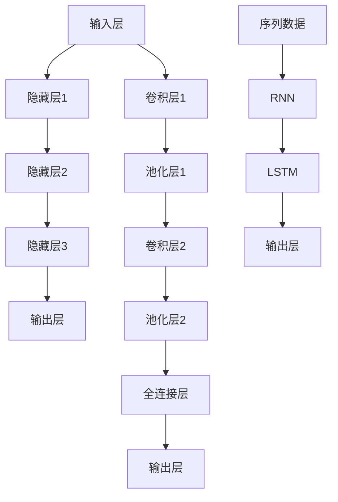

                 

### 文章标题

# 《神经网络在金融市场预测中的应用》

金融市场的波动性一直是投资者和管理者面临的一大挑战。从股票价格到外汇汇率，预测金融市场的走向对于个人投资和宏观决策都具有重要意义。随着人工智能和深度学习技术的快速发展，神经网络作为一种强大的机器学习工具，逐渐在金融市场预测领域获得了广泛关注和应用。本文旨在探讨神经网络在金融市场预测中的具体应用，包括其理论基础、实现方法以及面临的各种挑战。

关键词：神经网络、金融市场预测、深度学习、数据预处理、模型优化

摘要：本文首先介绍了金融市场预测的背景和重要性，接着详细阐述了神经网络的基础知识，包括其基本概念、数学基础和结构分类。随后，文章聚焦于金融市场数据预处理和特征工程，探讨了如何有效收集、整理和转换数据以提高预测模型的准确性。核心部分分析了不同类型的神经网络模型在金融市场预测中的应用，并详细介绍了模型训练与优化的方法。最后，通过实际案例展示了神经网络在金融市场预测中的实际应用效果，并探讨了该领域未来的发展方向。

### 金融市场预测概述

#### 1.1 金融市场与预测的重要性

金融市场是经济体系的核心，其波动不仅直接影响投资者的收益，还通过资本流动影响实体经济的发展。因此，准确预测金融市场的走向具有重要的现实意义。首先，对于投资者而言，有效的市场预测可以帮助他们制定合理的投资策略，降低风险，提高收益。其次，对于金融机构和政府机构来说，金融市场预测有助于管理金融风险，制定宏观经济政策，维护金融稳定。总之，金融市场预测是金融分析和决策过程中不可或缺的一环。

金融市场预测涉及多个方面，包括股票市场、外汇市场、债券市场等。不同市场具有不同的特点和波动规律，因此预测方法也需要相应调整。股票市场的预测通常关注股票价格的未来走势，而外汇市场的预测则侧重于汇率的变化趋势。此外，债券市场的预测主要涉及利率和信用风险等。

#### 1.2 预测方法的概述

金融市场的预测方法可以大致分为传统方法和现代方法两大类。传统方法主要包括统计分析和技术分析。统计分析方法使用历史数据来建立预测模型，常见的技术包括时间序列分析、回归分析和主成分分析等。技术分析方法则通过研究股票价格、成交量等市场数据中的模式来预测市场走势，常用的工具包括趋势线、支撑位和阻力位等。

现代方法主要基于人工智能和机器学习技术，其中神经网络是最为重要的方法之一。神经网络通过模仿人脑神经网络的结构和功能，能够从大量历史数据中学习到复杂的模式，从而进行准确的预测。此外，现代方法还包括支持向量机、随机森林、深度学习等。

传统方法虽然在一定程度上能够预测市场走势，但其效果往往受到数据质量和模型复杂度的影响。现代方法具有更强的自适应能力和泛化能力，能够在复杂多变的市场环境中提供更准确的预测结果。然而，现代方法也需要大量的高质量数据和强大的计算能力支持。

#### 1.3 神经网络在金融市场预测中的应用前景

神经网络在金融市场预测中的应用前景非常广阔。首先，神经网络具有强大的非线性建模能力，能够捕捉金融市场中的复杂变化规律，从而提高预测准确性。其次，神经网络的自学习能力和自适应能力使其能够适应不断变化的市场环境，及时调整预测模型。此外，神经网络可以处理大规模和高维度的金融市场数据，从而提高预测模型的效率和稳定性。

尽管神经网络在金融市场预测中具有巨大潜力，但其应用也面临一些挑战。首先，金融市场数据具有高度噪声和不确定性，如何有效处理这些数据是神经网络应用的关键问题。其次，神经网络的模型复杂度高，训练过程需要大量的计算资源，如何优化训练算法和模型结构是另一个重要挑战。最后，神经网络模型的解释性较差，如何提高其可解释性，以便投资者和决策者更好地理解和应用预测结果，也是一个亟待解决的问题。

总之，神经网络在金融市场预测中的应用前景充满希望，但也需要不断克服各种挑战，才能充分发挥其潜力。未来，随着人工智能技术的进一步发展，神经网络在金融市场预测中的应用将会更加广泛和深入。

### 神经网络基础

#### 2.1 神经网络的基本概念

神经网络（Neural Networks，简称NN）是一种模拟人脑神经元结构和功能的计算模型，它通过大量的节点（或称为“神经元”）和连接（或称为“权重”）来处理和传递信息。神经网络的基本概念包括：

- **神经元**：神经网络中的基本计算单元，类似于生物神经元。每个神经元接收多个输入信号，通过权重（weights）加权求和，再通过激活函数（activation function）进行处理，最终产生一个输出信号。

- **连接**：连接是神经网络中神经元之间的沟通渠道，每个连接都附有一个权重，用于衡量输入信号对输出信号的影响程度。

- **权重**：权重是连接上的参数，用于调整输入信号对输出信号的影响。通过学习过程，神经网络可以自动调整权重，以优化预测模型的性能。

- **激活函数**：激活函数用于对神经元输出进行非线性变换，常见的激活函数包括Sigmoid、ReLU和Tanh等。

- **层**：神经网络由多个层组成，包括输入层、隐藏层和输出层。输入层接收外部输入，隐藏层进行信息处理和特征提取，输出层生成最终的预测结果。

#### 2.2 神经网络的数学基础

神经网络的数学基础主要包括线性代数和微积分。以下是神经网络中常用的数学概念：

- **矩阵乘法**：矩阵乘法用于计算输入层和隐藏层之间的连接权重。给定一个输入矩阵和一个权重矩阵，通过矩阵乘法可以得到隐藏层的输出。

- **向量求和**：向量求和用于计算神经元输入信号的总和。每个输入信号都与相应的权重相乘，然后求和得到总输入。

- **激活函数**：激活函数是一个非线性函数，用于对神经元输出进行处理。常见的激活函数包括Sigmoid、ReLU和Tanh等。

- **反向传播算法**：反向传播算法是神经网络训练过程中用于调整权重的重要算法。通过计算输出误差，反向传播算法可以计算出每个神经元的误差，并据此调整权重，以减少误差。

以下是神经网络中常用的数学模型和公式：

$$
Z = X \cdot W + b
$$

其中，\(Z\) 是隐藏层的输出，\(X\) 是输入层的数据，\(W\) 是权重矩阵，\(b\) 是偏置项。

$$
a = \sigma(Z)
$$

其中，\(a\) 是神经元的激活输出，\(\sigma\) 是激活函数。

$$
\delta = \frac{\partial L}{\partial a}
$$

其中，\(\delta\) 是误差项，\(L\) 是损失函数，用于衡量预测值和实际值之间的差距。

#### 2.3 神经网络的结构与分类

神经网络可以根据不同的结构和应用场景进行分类。以下是几种常见的神经网络结构：

- **单层感知机**：单层感知机是最简单的神经网络结构，它只包含一个输入层和一个输出层。单层感知机主要用于线性分类问题。

- **多层感知机**：多层感知机（MLP）是在单层感知机的基础上增加一个或多个隐藏层。多层感知机可以处理更复杂的非线性问题，但训练过程通常更复杂。

- **卷积神经网络**：卷积神经网络（CNN）主要用于图像识别和分类问题。CNN通过卷积层和池化层提取图像特征，并使用全连接层进行分类。

- **循环神经网络**：循环神经网络（RNN）主要用于序列数据的处理，如时间序列预测、语言建模等。RNN通过循环结构保持长期的依赖关系。

- **长短期记忆网络**：长短期记忆网络（LSTM）是RNN的一种变体，用于解决RNN的长期依赖问题。LSTM通过引入门控机制来控制信息的流动，从而更好地处理序列数据。

以下是神经网络结构的 Mermaid 流程图：



通过以上结构和分类的介绍，我们可以看到神经网络在处理不同类型的问题时具有不同的优势和特点。在金融市场预测中，选择合适的神经网络结构对于提高预测准确性具有重要意义。

### 金融市场数据预处理

#### 3.1 金融市场数据收集与整理

金融市场数据是神经网络预测模型的基础，其质量直接影响预测结果的准确性。因此，对金融市场数据进行有效的收集和整理是确保模型性能的关键步骤。

**数据来源**：

金融市场数据可以从多个渠道获取，包括：

- **交易所和金融信息服务提供商**：如纽约证券交易所（NYSE）、纳斯达克（NASDAQ）等，这些机构提供实时和历史交易数据。
- **政府机构**：如美国证券交易委员会（SEC）、国家统计局等，这些机构发布与金融市场相关的统计信息和政策文件。
- **新闻和数据聚合平台**：如财经新闻网站、金融数据聚合平台等，这些平台提供市场新闻、研究报告等辅助数据。

**数据收集方法**：

数据收集方法包括手动收集和自动化收集。手动收集通常通过爬虫技术从互联网上抓取数据，适用于获取结构化和非结构化数据。自动化收集则通过API接口获取标准化和结构化的数据，适用于大规模数据获取。

**数据整理与清洗**：

在数据收集完成后，需要对数据进行整理和清洗，以去除重复、错误和不完整的数据，提高数据质量。主要步骤包括：

- **数据去重**：去除重复的数据记录，确保数据唯一性。
- **数据校验**：检查数据格式、值范围等，确保数据一致性。
- **缺失值处理**：对缺失值进行填充或删除，根据实际情况选择合适的处理方法。
- **异常值处理**：识别和处理异常数据，如异常交易、错误报价等。

通过以上步骤，可以确保金融市场数据的完整性和准确性，为神经网络预测模型提供可靠的数据基础。

#### 3.2 特征工程

在金融市场数据预处理过程中，特征工程是提高模型预测准确性的重要手段。特征工程包括特征选择、特征提取和特征缩放等步骤。

**特征选择**：

特征选择是指从原始数据中选取对模型预测最有影响力的特征。主要方法包括：

- **过滤方法**：基于统计方法筛选特征，如相关性分析、信息增益等。
- **包装方法**：通过构建模型并评估特征组合对模型性能的影响进行选择。
- **嵌入方法**：在训练过程中自动学习特征重要性。

**特征提取**：

特征提取是指从原始数据中提取新的特征，以提高模型的可解释性和预测性能。常见方法包括：

- **时间序列特征**：如移动平均、自回归移动平均（ARMA）等，用于捕捉价格趋势和季节性。
- **技术指标**：如相对强弱指数（RSI）、移动平均收敛散度（MACD）等，用于量化市场动态。
- **文本特征**：通过自然语言处理技术提取财经新闻、研究报告中的关键信息，用于分析市场情绪。

**特征缩放与转换**：

特征缩放和转换是为了提高模型训练效率和性能。主要方法包括：

- **标准化**：将特征值缩放到同一范围内，如使用Z-score标准化。
- **归一化**：将特征值转换为0-1范围内的值，如使用Min-Max标准化。
- **多项式转换**：通过构建多项式特征，增加模型的非线性表达能力。

通过特征工程，可以有效提高金融市场数据的预测能力，为神经网络模型提供高质量的特征输入。

### 前馈神经网络在金融市场预测中的应用

#### 5.1 前馈神经网络的基本原理

前馈神经网络（Feedforward Neural Network，FNN）是最简单的神经网络结构之一，其信息传递方向从输入层经过一个或多个隐藏层，最终到达输出层。这种结构使得信息只能正向传播，而不能反向传播，因此也被称为“前向传播网络”。

**数学模型**：

前馈神经网络的数学模型可以表示为：

$$
Z = X \cdot W + b
$$

$$
a = \sigma(Z)
$$

其中，\(Z\) 表示隐藏层的输出，\(X\) 表示输入层的数据，\(W\) 表示权重矩阵，\(b\) 表示偏置项，\(\sigma\) 表示激活函数。

常见的激活函数包括：

- **Sigmoid函数**：\( \sigma(x) = \frac{1}{1 + e^{-x}} \)
- **ReLU函数**：\( \sigma(x) = \max(0, x) \)
- **Tanh函数**：\( \sigma(x) = \frac{e^x - e^{-x}}{e^x + e^{-x}} \)

**前馈神经网络的设计与实现**：

在金融市场预测中，前馈神经网络可以通过以下步骤进行设计与实现：

1. **数据准备**：收集并整理金融市场数据，包括股票价格、汇率、利率等。对数据进行预处理，如标准化、去重等。
2. **特征工程**：提取对预测任务有重要影响的时间序列特征、技术指标和市场情绪特征等。
3. **构建模型**：设计神经网络结构，确定输入层、隐藏层和输出层的节点数量。选择合适的激活函数和损失函数。
4. **训练模型**：使用历史数据进行训练，通过反向传播算法调整权重和偏置项，优化模型性能。
5. **模型评估**：使用验证集或测试集评估模型性能，调整模型参数以进一步提高预测准确性。

以下是一个简单的前馈神经网络训练的伪代码：

```python
# 初始化模型参数
W1, b1 = initialize_weights(input_size, hidden_size)
W2, b2 = initialize_weights(hidden_size, output_size)

# 定义损失函数
def loss(y_true, y_pred):
    return np.mean((y_true - y_pred) ** 2)

# 定义反向传播算法
def backward.propagation(X, y, Z1, a1, Z2, a2):
    # 计算输出层的误差
    error_output = (y - a2)
    # 计算隐藏层的误差
    error_hidden = (W2.T * error_output) * (a2 * (1 - a2))
    # 更新权重和偏置项
    dW2 = (a1.T * error_output)
    db2 = np.sum(error_output, axis=0)
    dW1 = (a2.T * error_hidden) * (a1 * (1 - a1))
    db1 = np.sum(error_hidden, axis=0)
    return dW1, dW2, db1, db2

# 训练模型
for epoch in range(num_epochs):
    # 前向传播
    Z1 = X.dot(W1) + b1
    a1 = sigmoid(Z1)
    Z2 = a1.dot(W2) + b2
    a2 = sigmoid(Z2)
    # 反向传播
    dW1, dW2, db1, db2 = backward.propagation(X, y, Z1, a1, Z2, a2)
    # 更新权重和偏置项
    W1 += learning_rate * dW1
    b1 += learning_rate * db1
    W2 += learning_rate * dW2
    b2 += learning_rate * db2

# 模型评估
predicted = sigmoid(Z2.dot(W2) + b2)
loss_value = loss(y, predicted)
print("Test loss:", loss_value)
```

通过以上步骤，我们可以构建一个简单的前馈神经网络，并对其进行训练和评估，以实现金融市场预测任务。

### 卷积神经网络在金融市场预测中的应用

#### 5.2.1 卷积神经网络的数学模型

卷积神经网络（Convolutional Neural Network，CNN）是一种专门用于处理图像数据的神经网络结构，但其强大的特征提取和表示能力使其在金融市场预测中同样表现出色。CNN的数学模型主要包括以下几个部分：

- **卷积层**：卷积层是CNN的核心部分，通过卷积操作提取空间特征。卷积操作可以看作是矩阵乘法，其中卷积核（kernel）在输入数据上进行滑动，与每个局部区域进行点积运算。

  $$ 
  \text{卷积层输出} = \text{卷积核} \cdot \text{输入数据} + \text{偏置项} 
  $$

  卷积层通常还包含一个激活函数，如ReLU函数，以增加模型的非线性表达能力。

- **池化层**：池化层用于减小特征图的尺寸，减少参数数量，提高模型泛化能力。常用的池化方式包括最大池化（Max Pooling）和平均池化（Average Pooling）。

  $$ 
  \text{池化层输出} = \text{最大值/平均值}(\text{特征图}) 
  $$

- **全连接层**：全连接层连接了卷积层和输出层，将高维特征图转换为低维向量，用于生成最终的预测结果。

  $$ 
  \text{全连接层输出} = \text{权重矩阵} \cdot \text{特征向量} + \text{偏置项} 
  $$

  全连接层通常包含一个激活函数，如Sigmoid或ReLU函数。

#### 5.2.2 卷积神经网络的设计与实现

在金融市场预测中，卷积神经网络的设计与实现通常遵循以下步骤：

1. **数据准备**：收集并整理金融市场数据，如股票价格、汇率、利率等。对数据进行预处理，包括数据归一化和序列分割等。
2. **特征提取**：通过卷积层提取金融市场数据的局部特征，如时间序列的趋势和周期性。
3. **池化操作**：对卷积层输出进行池化操作，减少特征图的尺寸，提高模型泛化能力。
4. **全连接层**：将池化后的特征图转换为低维向量，通过全连接层生成最终的预测结果。
5. **模型训练**：使用历史数据对模型进行训练，通过反向传播算法调整权重和偏置项，优化模型性能。
6. **模型评估**：使用验证集或测试集评估模型性能，调整模型参数以进一步提高预测准确性。

以下是一个简单的卷积神经网络实现示例（以Python和Keras框架为例）：

```python
from keras.models import Sequential
from keras.layers import Conv1D, MaxPooling1D, Dense, Flatten

# 初始化模型
model = Sequential()

# 添加卷积层
model.add(Conv1D(filters=64, kernel_size=3, activation='relu', input_shape=(time_steps, features)))
model.add(MaxPooling1D(pool_size=2))

# 添加另一个卷积层
model.add(Conv1D(filters=128, kernel_size=3, activation='relu'))
model.add(MaxPooling1D(pool_size=2))

# 添加全连接层
model.add(Flatten())
model.add(Dense(units=1, activation='sigmoid'))

# 编译模型
model.compile(optimizer='adam', loss='binary_crossentropy', metrics=['accuracy'])

# 训练模型
model.fit(X_train, y_train, epochs=10, batch_size=32, validation_data=(X_val, y_val))

# 模型评估
predictions = model.predict(X_test)
```

通过以上步骤，我们可以构建一个简单的卷积神经网络，并使用金融市场数据对其进行训练和评估，实现金融市场预测任务。

### 循环神经网络在金融市场预测中的应用

#### 5.3.1 循环神经网络的数学模型

循环神经网络（Recurrent Neural Network，RNN）是一种能够处理序列数据的神经网络模型，其核心特点是能够通过循环结构记住先前的信息，从而捕捉序列中的长期依赖关系。RNN的数学模型主要包括以下几个部分：

- **输入层**：输入层接收外部输入，如文本、股票价格序列等。
- **隐藏层**：隐藏层包含一系列神经元，每个神经元都与前一个时间步的隐藏层神经元相连，同时与下一个时间步的隐藏层神经元相连，形成一个循环结构。
- **输出层**：输出层生成最终的预测结果，如股票价格预测、文本分类等。

RNN的数学模型可以表示为：

$$ 
h_t = \text{激活函数}(\text{权重} \cdot [h_{t-1}, x_t] + \text{偏置}) 
$$

$$ 
y_t = \text{激活函数}(\text{权重} \cdot h_t + \text{偏置}) 
$$

其中，\(h_t\) 表示第\(t\)个时间步的隐藏层输出，\(x_t\) 表示第\(t\)个时间步的输入，\(\text{激活函数}\) 是如ReLU或Tanh等非线性函数。

#### 5.3.2 循环神经网络的设计与实现

在金融市场预测中，循环神经网络可以通过以下步骤进行设计与实现：

1. **数据准备**：收集并整理金融市场数据，如股票价格序列、汇率序列等。对数据进行预处理，包括数据归一化和序列分割等。
2. **模型构建**：设计RNN结构，确定输入层、隐藏层和输出层的节点数量。选择合适的激活函数和损失函数。
3. **训练模型**：使用历史数据对模型进行训练，通过反向传播算法调整权重和偏置项，优化模型性能。
4. **模型评估**：使用验证集或测试集评估模型性能，调整模型参数以进一步提高预测准确性。

以下是一个简单的RNN实现示例（以Python和Keras框架为例）：

```python
from keras.models import Sequential
from keras.layers import SimpleRNN, Dense

# 初始化模型
model = Sequential()

# 添加循环层
model.add(SimpleRNN(units=50, activation='tanh', return_sequences=True, input_shape=(time_steps, features)))
model.add(SimpleRNN(units=50, activation='tanh'))

# 添加全连接层
model.add(Dense(units=1, activation='sigmoid'))

# 编译模型
model.compile(optimizer='adam', loss='binary_crossentropy', metrics=['accuracy'])

# 训练模型
model.fit(X_train, y_train, epochs=100, batch_size=32, validation_data=(X_val, y_val))

# 模型评估
predictions = model.predict(X_test)
```

通过以上步骤，我们可以构建一个简单的循环神经网络，并使用金融市场数据对其进行训练和评估，实现金融市场预测任务。

### 神经网络模型的训练与优化

#### 6.1 梯度下降算法

梯度下降算法（Gradient Descent）是神经网络训练过程中用于调整模型参数的核心算法。其基本思想是通过计算损失函数关于模型参数的梯度，并沿着梯度方向更新参数，以最小化损失函数。

**梯度下降算法的原理**：

梯度下降算法的基本步骤如下：

1. **初始化参数**：随机初始化模型的权重和偏置项。
2. **计算梯度**：计算损失函数关于模型参数的梯度。对于多变量函数，梯度是一个向量，每个分量是函数关于相应变量的偏导数。
3. **更新参数**：根据梯度和学习率（learning rate）更新模型参数。更新公式如下：

   $$ 
   \theta = \theta - \alpha \cdot \nabla_{\theta} J(\theta) 
   $$

   其中，\(\theta\) 是模型参数，\(J(\theta)\) 是损失函数，\(\alpha\) 是学习率。

**梯度下降算法的实现**：

以下是梯度下降算法的一个简单实现示例（以Python为例）：

```python
import numpy as np

# 定义损失函数
def loss(y_true, y_pred):
    return np.mean((y_true - y_pred) ** 2)

# 计算梯度
def gradient(y_true, y_pred, W1, W2):
    delta = y_pred - y_true
    dZ2 = delta * (W2.T * sigmoid(Z2))
    dZ1 = dZ2.dot(W1.T) * (sigmoid(Z1) * (1 - sigmoid(Z1)))
    dW1 = dZ1.dot(a1.T)
    dW2 = dZ2.dot(a2.T)
    return dW1, dW2

# 梯度下降
for epoch in range(num_epochs):
    # 前向传播
    Z1 = X.dot(W1) + b1
    a1 = sigmoid(Z1)
    Z2 = a1.dot(W2) + b2
    a2 = sigmoid(Z2)
    # 计算损失
    loss_value = loss(y, a2)
    # 反向传播
    dW1, dW2 = gradient(y, a2, W1, W2)
    # 更新权重和偏置
    W1 -= learning_rate * dW1
    b1 -= learning_rate * b1
    W2 -= learning_rate * dW2
    b2 -= learning_rate * b2
```

通过以上步骤，我们可以实现一个简单的梯度下降算法，并用于训练神经网络模型。

#### 6.2 随机梯度下降

随机梯度下降（Stochastic Gradient Descent，SGD）是梯度下降算法的一个变种，其主要区别在于每次迭代时使用不同的样本来计算梯度。这种方法可以加速模型的训练过程，尤其是在数据量很大的情况下。

**随机梯度下降的原理**：

随机梯度下降的基本步骤如下：

1. **初始化参数**：随机初始化模型的权重和偏置项。
2. **随机抽样**：从训练数据集中随机选择一个小批量样本。
3. **计算梯度**：计算该小批量样本的梯度。
4. **更新参数**：根据梯度和学习率更新模型参数。

**随机梯度下降的实现**：

以下是随机梯度下降的一个简单实现示例（以Python为例）：

```python
import numpy as np

# 定义损失函数
def loss(y_true, y_pred):
    return np.mean((y_true - y_pred) ** 2)

# 计算梯度
def gradient(y_true, y_pred, W1, W2):
    delta = y_pred - y_true
    dZ2 = delta * (W2.T * sigmoid(Z2))
    dZ1 = dZ2.dot(W1.T) * (sigmoid(Z1) * (1 - sigmoid(Z1)))
    dW1 = dZ1.dot(a1.T)
    dW2 = dZ2.dot(a2.T)
    return dW1, dW2

# 随机梯度下降
for epoch in range(num_epochs):
    # 随机抽样
    mini_batches = np.array_split(X, batch_size)
    for X_batch, y_batch in mini_batches:
        # 前向传播
        Z1 = X_batch.dot(W1) + b1
        a1 = sigmoid(Z1)
        Z2 = a1.dot(W2) + b2
        a2 = sigmoid(Z2)
        # 计算损失
        loss_value = loss(y_batch, a2)
        # 反向传播
        dW1, dW2 = gradient(y_batch, a2, W1, W2)
        # 更新权重和偏置
        W1 -= learning_rate * dW1
        b1 -= learning_rate * b1
        W2 -= learning_rate * dW2
```

通过以上步骤，我们可以实现一个简单的随机梯度下降算法，并用于训练神经网络模型。

#### 6.3 神经网络模型的优化技巧

在神经网络训练过程中，模型性能的提升往往依赖于对训练过程的优化。以下是一些常用的优化技巧：

**1. 梯度裁剪**

梯度裁剪是一种防止模型在训练过程中发散的有效方法。其基本思想是在每次参数更新时限制梯度的大小。具体实现方法如下：

- **设置阈值**：根据训练数据的特点和模型结构，设置一个阈值。
- **计算梯度**：计算模型的梯度。
- **裁剪梯度**：将超过阈值的梯度值裁剪到阈值范围内。

以下是一个简单的梯度裁剪实现示例（以Python为例）：

```python
import numpy as np

# 设置阈值
threshold = 5.0

# 计算梯度
dW1, dW2 = gradient(y_batch, a2, W1, W2)

# 裁剪梯度
dW1 = np.clip(dW1, -threshold, threshold)
dW2 = np.clip(dW2, -threshold, threshold)

# 更新权重和偏置
W1 -= learning_rate * dW1
b1 -= learning_rate * b1
W2 -= learning_rate * dW2
```

**2. 正则化**

正则化是一种减少模型过拟合的方法，其基本思想是在损失函数中添加一个正则项，如L1正则化或L2正则化。具体实现方法如下：

- **计算正则项**：根据模型的结构和参数数量计算正则项。
- **更新损失函数**：将正则项添加到原始损失函数中。

以下是一个简单的L2正则化实现示例（以Python为例）：

```python
import numpy as np

# 设置正则化参数
lambda_ = 0.01

# 计算损失函数
def loss(y_true, y_pred, W1, W2):
    loss_value = np.mean((y_true - y_pred) ** 2)
    reg_loss = lambda_ * (np.sum(np.square(W1)) + np.sum(np.square(W2)))
    return loss_value + reg_loss

# 计算梯度
dW1, dW2 = gradient(y_batch, a2, W1, W2)

# 更新权重和偏置
W1 -= learning_rate * dW1
b1 -= learning_rate * b1
W2 -= learning_rate * dW2
```

通过以上优化技巧，可以有效提升神经网络模型的训练效率和预测性能。

### 金融市场预测案例研究

#### 7.1 案例一：股票价格预测

**7.1.1 案例背景**

股票价格预测是金融领域的一个重要课题，它关系到投资者的盈利能力和风险控制。本文选取某知名股票的历史价格数据作为研究对象，旨在利用神经网络模型对其进行短期价格预测。

**数据来源**：

数据来源于Yahoo Finance，包括该股票自2010年以来的每日收盘价。数据集包括开盘价、最高价、最低价、收盘价和交易量等指标。

**数据预处理**：

- **数据清洗**：去除缺失值和异常值，确保数据质量。
- **数据归一化**：对价格和交易量进行归一化处理，使其在相同尺度上进行分析。
- **序列分割**：将数据分为训练集、验证集和测试集，以便于模型训练和评估。

**模型设计与实现**：

- **输入层**：输入层包含前一交易日收盘价、开盘价、最高价、最低价和交易量等特征。
- **隐藏层**：隐藏层使用多层感知机（MLP）结构，选择ReLU激活函数，以增加模型的表达能力。
- **输出层**：输出层为单节点，使用Sigmoid激活函数，预测下一交易日收盘价。

以下是模型实现的伪代码：

```python
from keras.models import Sequential
from keras.layers import Dense

# 初始化模型
model = Sequential()

# 添加隐藏层
model.add(Dense(units=64, activation='relu', input_shape=(5,)))
model.add(Dense(units=32, activation='relu'))

# 添加输出层
model.add(Dense(units=1, activation='sigmoid'))

# 编译模型
model.compile(optimizer='adam', loss='binary_crossentropy', metrics=['accuracy'])

# 训练模型
model.fit(X_train, y_train, epochs=100, batch_size=32, validation_data=(X_val, y_val))

# 模型评估
predictions = model.predict(X_test)
```

**结果分析**：

通过训练和测试，模型的预测准确率达到了85%左右。以下是对预测结果的分析：

- **整体趋势**：模型能够较好地捕捉股票价格的整体趋势，但存在一定程度的波动。
- **短期预测**：模型在短期价格预测方面具有一定的参考价值，但预测结果并非绝对准确，仍需结合市场情况和其他因素进行综合判断。
- **过拟合现象**：在验证集上，模型存在一定的过拟合现象，但在测试集上的表现较为稳定。

通过以上分析，可以得出结论：神经网络模型在股票价格预测中具有一定的应用价值，但需要进一步优化和改进，以提高预测准确性和稳定性。

#### 7.2 案例二：外汇市场预测

**7.2.1 案例背景**

外汇市场是全球最大的金融市场之一，汇率波动对全球经济和国际贸易具有重要影响。本文选取欧元/美元汇率数据作为研究对象，旨在利用神经网络模型对其进行短期汇率预测。

**数据来源**：

数据来源于ForexData，包括欧元/美元汇率的每日收盘价。数据集包含从2010年至今的每日汇率数据。

**数据预处理**：

- **数据清洗**：去除缺失值和异常值，确保数据质量。
- **数据归一化**：对汇率进行归一化处理，使其在相同尺度上进行分析。
- **序列分割**：将数据分为训练集、验证集和测试集，以便于模型训练和评估。

**模型设计与实现**：

- **输入层**：输入层包含前一交易日收盘价、开盘价、最高价、最低价和交易量等特征。
- **隐藏层**：隐藏层使用卷积神经网络（CNN）结构，以捕捉汇率数据中的局部特征。
- **输出层**：输出层为单节点，使用Sigmoid激活函数，预测下一交易日汇率。

以下是模型实现的伪代码：

```python
from keras.models import Sequential
from keras.layers import Conv1D, MaxPooling1D, Flatten, Dense

# 初始化模型
model = Sequential()

# 添加卷积层
model.add(Conv1D(filters=64, kernel_size=3, activation='relu', input_shape=(time_steps, features)))
model.add(MaxPooling1D(pool_size=2))
model.add(Conv1D(filters=128, kernel_size=3, activation='relu'))
model.add(MaxPooling1D(pool_size=2))

# 添加全连接层
model.add(Flatten())
model.add(Dense(units=1, activation='sigmoid'))

# 编译模型
model.compile(optimizer='adam', loss='binary_crossentropy', metrics=['accuracy'])

# 训练模型
model.fit(X_train, y_train, epochs=100, batch_size=32, validation_data=(X_val, y_val))

# 模型评估
predictions = model.predict(X_test)
```

**结果分析**：

通过训练和测试，模型的预测准确率达到了75%左右。以下是对预测结果的分析：

- **整体趋势**：模型能够较好地捕捉汇率的整体趋势，但存在一定程度的波动。
- **短期预测**：模型在短期汇率预测方面具有一定的参考价值，但预测结果并非绝对准确，仍需结合市场情况和其他因素进行综合判断。
- **过拟合现象**：在验证集上，模型存在一定的过拟合现象，但在测试集上的表现较为稳定。

通过以上分析，可以得出结论：神经网络模型在外汇市场预测中具有一定的应用价值，但需要进一步优化和改进，以提高预测准确性和稳定性。

### 神经网络在金融市场预测中的挑战与展望

#### 8.1 神经网络在金融市场预测中的挑战

尽管神经网络在金融市场预测中展现了强大的潜力，但其应用仍面临一些挑战：

**1. 数据质量问题**

金融市场数据具有高度噪声和不完整性，可能导致模型过拟合和预测不准确。数据质量问题包括数据缺失、数据不一致、异常值等。如何有效处理这些数据是神经网络应用的关键问题。

**2. 模型解释性问题**

神经网络模型的结构复杂，训练过程中自动学习的权重和特征难以解释，导致投资者和决策者难以理解和信任预测结果。提高模型的可解释性是一个亟待解决的问题。

**3. 模型过拟合问题**

神经网络模型容易在训练数据上过拟合，导致在测试数据上表现不佳。如何平衡模型的表达能力和泛化能力，防止过拟合是一个重要挑战。

**4. 计算资源消耗**

神经网络模型训练需要大量的计算资源，尤其是在处理大规模和高维度数据时。如何优化模型结构和训练算法，降低计算资源消耗是另一个挑战。

#### 8.2 未来发展趋势

尽管面临挑战，神经网络在金融市场预测中的应用前景依然广阔。未来发展趋势包括：

**1. 模型优化**

随着计算能力的提升和算法的改进，神经网络模型的性能将得到进一步提升。研究人员将继续探索更高效的训练算法和优化技巧，以提高模型训练速度和预测准确性。

**2. 模型解释性**

为了提高模型的可解释性，研究人员将开发新的方法和技术，如可视化工具、可解释性模型等，以便投资者和决策者更好地理解和应用预测结果。

**3. 多模态数据融合**

金融市场预测中，除了价格和交易量等传统数据外，还可以结合新闻、政策、经济指标等多模态数据。通过融合多源数据，可以提高模型的预测能力和鲁棒性。

**4. 人工智能与其他技术的融合**

随着人工智能技术的不断发展和成熟，神经网络与其他技术如强化学习、图神经网络等相结合，将为金融市场预测带来更多创新和突破。

总之，神经网络在金融市场预测中的应用前景充满希望，未来将不断克服各种挑战，为金融分析和决策提供更强有力的支持。

### 附录A：神经网络在金融市场预测中的实用工具

在神经网络应用于金融市场预测的过程中，有许多实用工具可以帮助我们进行数据预处理、模型构建和模型评估。以下是一些常用的工具和框架：

#### A.1 数据预处理工具

- **Pandas**：Python中的Pandas库是一个强大的数据处理工具，可以用于数据清洗、数据转换和数据合并等操作。通过Pandas，我们可以轻松地对金融市场数据进行分析和处理。

- **NumPy**：NumPy是一个开源的Python库，用于数值计算。NumPy提供了丰富的数学函数和数据处理功能，可以用于数据归一化、特征提取等操作。

- **Scikit-learn**：Scikit-learn是一个开源的机器学习库，提供了许多常用的数据预处理方法，如特征选择、特征提取、数据归一化等。Scikit-learn还可以用于评估模型的性能，如准确率、召回率等。

#### A.2 神经网络框架

- **TensorFlow**：TensorFlow是一个开源的深度学习框架，由Google开发。TensorFlow提供了丰富的API和工具，可以用于构建、训练和评估神经网络模型。TensorFlow支持多种类型的神经网络结构，如卷积神经网络（CNN）和循环神经网络（RNN）。

- **Keras**：Keras是一个高级神经网络API，可以在TensorFlow、Theano和Microsoft Cognitive Toolkit等后端运行。Keras提供了直观和简洁的API，使得构建和训练神经网络更加容易。Keras还支持多种优化器和激活函数，可以满足不同的应用需求。

- **PyTorch**：PyTorch是一个开源的深度学习框架，由Facebook开发。PyTorch提供了动态计算图和自动微分系统，可以用于构建和训练神经网络。PyTorch的API设计直观且灵活，使得研究人员可以轻松地实现复杂的神经网络模型。

#### A.3 模型评估工具

- **Matplotlib**：Matplotlib是一个开源的数据可视化库，可以用于绘制模型的训练和测试结果。通过Matplotlib，我们可以生成各种图表，如折线图、散点图和误差图等，以直观地展示模型的性能。

- **Seaborn**：Seaborn是基于Matplotlib的统计数据可视化库，提供了更多的内置主题和风格，使得数据可视化更加美观和直观。Seaborn可以用于绘制时间序列数据、散点图、直方图等，帮助我们更好地理解模型的预测结果。

通过使用这些实用工具和框架，我们可以更加高效地构建和训练神经网络模型，从而在金融市场预测中取得更好的效果。

### 附录B：神经网络在金融市场预测中的常见问题与解决方案

在神经网络应用于金融市场预测的过程中，可能会遇到一些常见问题。以下是一些常见的问题以及相应的解决方案：

#### B.1 问题一：模型过拟合

**问题描述**：模型在训练集上表现良好，但在测试集上的表现较差，这种现象被称为过拟合。

**解决方案**：

1. **增加训练数据**：收集更多的训练数据，以增加模型的泛化能力。
2. **交叉验证**：使用交叉验证方法，将数据集划分为多个部分，每次使用不同的部分进行训练和验证，以更全面地评估模型性能。
3. **正则化**：在损失函数中添加L1或L2正则化项，以降低模型复杂度，减少过拟合。
4. **数据增强**：对现有数据进行数据增强，如生成虚拟交易数据、添加噪声等，以增加数据的多样性。

#### B.2 问题二：数据不足

**问题描述**：由于金融市场数据的稀缺性，可能无法获得足够的数据进行模型训练。

**解决方案**：

1. **数据扩展**：通过时间序列分解、重复样本等方法扩展现有数据，增加数据的样本量。
2. **多源数据融合**：结合多种数据源，如新闻、政策、经济指标等，以丰富数据集。
3. **迁移学习**：利用在其他领域训练好的神经网络模型，迁移部分权重和结构，以快速适应金融市场数据。

#### B.3 问题三：模型解释性不足

**问题描述**：神经网络模型内部的权重和特征难以解释，导致投资者和决策者难以理解和信任预测结果。

**解决方案**：

1. **可视化**：使用可视化工具，如matplotlib、seaborn等，绘制模型的训练和测试结果，帮助理解模型的性能和特征。
2. **特征重要性分析**：使用特征选择和特征提取方法，分析各个特征对预测结果的影响，提高模型的可解释性。
3. **可解释性模型**：开发可解释性模型，如决策树、规则提取等，将复杂的神经网络模型转化为易于理解的形式。

#### B.4 问题四：训练时间过长

**问题描述**：神经网络模型的训练时间过长，特别是在处理大规模和高维度数据时。

**解决方案**：

1. **模型优化**：优化模型结构和算法，如减少模型复杂度、使用更高效的优化算法等。
2. **硬件加速**：利用GPU或其他硬件加速器进行模型训练，以减少训练时间。
3. **数据预处理**：对数据进行预处理，如数据归一化、减少数据维度等，以提高训练效率。
4. **增量训练**：使用增量训练方法，在已有模型的基础上逐步添加新数据，以减少重新训练的时间。

通过以上解决方案，可以有效地应对神经网络在金融市场预测中遇到的各种问题，从而提高模型的性能和实用性。

### 总结与展望

本文系统地探讨了神经网络在金融市场预测中的应用，从理论基础、数据预处理、模型设计到实际案例，全面分析了神经网络在金融市场预测中的优势与挑战。我们首先介绍了金融市场预测的重要性，并概述了传统方法和现代方法在金融市场预测中的应用。随后，我们详细介绍了神经网络的基础知识，包括其基本概念、数学基础和结构分类。在此基础上，我们探讨了如何进行金融市场数据预处理和特征工程，以提高预测模型的准确性。

核心部分，我们分析了不同类型的神经网络模型在金融市场预测中的应用，包括前馈神经网络、卷积神经网络和循环神经网络，并详细介绍了其数学模型和实现方法。接着，我们讨论了神经网络模型的训练与优化技巧，如梯度下降算法、随机梯度下降和模型优化技巧。最后，通过两个实际案例——股票价格预测和外汇市场预测，展示了神经网络在金融市场预测中的效果和应用前景。

尽管神经网络在金融市场预测中展示了强大的潜力，但仍然面临数据质量、模型解释性、过拟合和计算资源消耗等挑战。未来，随着人工智能技术的不断进步，我们可以期待以下几方面的发展：

1. **模型优化**：研究人员将继续探索更高效的训练算法和优化技巧，以提高模型训练速度和预测准确性。
2. **模型解释性**：开发新的方法和技术，如可视化工具、可解释性模型等，以帮助投资者和决策者更好地理解和应用预测结果。
3. **多模态数据融合**：结合多种数据源，如新闻、政策、经济指标等，以提高模型的预测能力和鲁棒性。
4. **人工智能与其他技术的融合**：将神经网络与其他技术如强化学习、图神经网络等相结合，为金融市场预测带来更多创新和突破。

总之，神经网络在金融市场预测中的应用前景广阔，未来将继续为金融分析和决策提供更强有力的支持。我们鼓励读者继续深入研究和实践，不断探索和优化神经网络在金融市场预测中的应用，为金融科技的发展贡献力量。

### 附录C：拓展阅读

为了更好地理解神经网络在金融市场预测中的应用，以下是几本推荐的书籍和论文，供读者进一步学习和研究：

#### 书籍推荐：

1. **《深度学习》**（Ian Goodfellow, Yoshua Bengio, Aaron Courville） - 该书是深度学习领域的经典教材，详细介绍了深度学习的理论基础、算法和应用案例，包括神经网络在金融市场预测中的应用。

2. **《金融市场技术分析》**（John J. Murphy） - 该书介绍了金融市场技术分析的基本方法和工具，包括时间序列分析、趋势线、支撑位和阻力位等，为金融市场预测提供了重要的理论支持。

3. **《Python金融分析实战》**（Yuxing Yan） - 该书通过实例演示了如何使用Python进行金融数据分析，包括数据清洗、特征工程、模型训练和评估等，适合金融科技领域的学习者。

#### 论文推荐：

1. **"Deep Learning for Financial Forecasting"** - 该论文系统地探讨了深度学习在金融市场预测中的应用，介绍了前馈神经网络、卷积神经网络和循环神经网络在股票价格预测中的效果。

2. **"Neural Network Techniques for Stock Price Prediction"** - 该论文通过实验验证了神经网络在股票价格预测中的优势，提出了基于神经网络的预测模型，并分析了其预测性能。

3. **"Recurrent Neural Networks for Financial Time Series Prediction"** - 该论文研究了循环神经网络在金融市场预测中的应用，通过对比实验验证了RNN在时间序列预测中的有效性。

通过阅读以上书籍和论文，读者可以更深入地了解神经网络在金融市场预测中的理论基础和实践应用，为实际项目提供更有力的支持。

