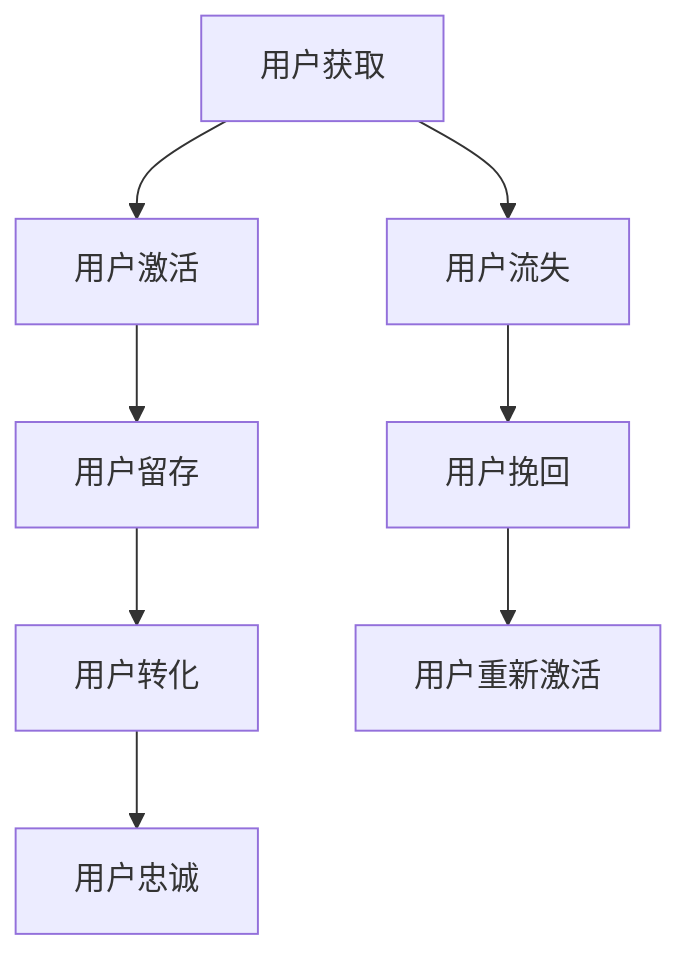

                 


### 文章标题：私域流量运营：个人创业者的增长策略

> 关键词：私域流量、运营策略、个人创业、增长路径

> 摘要：本文将深入探讨私域流量运营的概念、价值、核心要素、运营策略及实际应用，旨在为个人创业者提供一套系统、实用的增长策略，帮助他们在竞争激烈的市场环境中找到属于自己的蓝海。

---

#### 《私域流量运营：个人创业者的增长策略》目录大纲

## 第一部分：私域流量运营概述

### 第1章：私域流量运营的概念与价值

#### 1.1 私域流量的定义与分类
#### 1.2 私域流量与公域流量的区别
#### 1.3 私域流量运营的价值

### 第2章：私域流量运营的基本原理

#### 2.1 用户运营思维
#### 2.2 用户生命周期管理
#### 2.3 用户数据采集与分析

### 第3章：私域流量运营的核心要素

#### 3.1 内容营销策略
#### 3.2 社群运营策略
#### 3.3 个性化推荐策略

## 第二部分：私域流量运营策略

### 第4章：搭建私域流量运营平台

#### 4.1 私域流量平台的搭建流程
#### 4.2 私域流量平台的运营工具
#### 4.3 私域流量平台的安全与合规

### 第5章：私域流量运营案例分析

#### 5.1 案例一：微信公众号的私域流量运营
#### 5.2 案例二：社群营销的成功案例
#### 5.3 案例三：小程序的私域流量运营

### 第6章：私域流量运营的实操技巧

#### 6.1 用户互动技巧
#### 6.2 内容创作技巧
#### 6.3 营销活动策划技巧

### 第7章：私域流量运营的数据分析与优化

#### 7.1 数据分析工具与应用
#### 7.2 用户画像与行为分析
#### 7.3 私域流量运营的优化策略

## 第三部分：个人创业者的增长策略

### 第8章：个人创业者面临的挑战与机会

#### 8.1 个人创业者的定位
#### 8.2 个人创业者的优势与劣势
#### 8.3 私域流量运营在个人创业中的应用

### 第9章：打造个人品牌的策略

#### 9.1 个人品牌的重要性
#### 9.2 个人品牌建设的方法
#### 9.3 个人品牌营销的实战技巧

### 第10章：从零开始搭建个人私域流量

#### 10.1 私域流量搭建的步骤
#### 10.2 个人私域流量的运营技巧
#### 10.3 个人私域流量的增长策略

### 第11章：个人创业者的增长路径规划

#### 11.1 增长路径规划的重要性
#### 11.2 增长路径规划的步骤
#### 11.3 增长路径规划的实战案例

## 第四部分：附录

### 第12章：私域流量运营工具与资源推荐

#### 12.1 私域流量运营工具分类
#### 12.2 常用私域流量运营工具推荐
#### 12.3 私域流量运营资源库搭建

### 第13章：私域流量运营常见问题解答

#### 13.1 私域流量运营常见问题
#### 13.2 问题解答与解决方案
#### 13.3 互动交流与社群搭建

### 第14章：未来私域流量运营的趋势与发展

#### 14.1 私域流量运营的发展趋势
#### 14.2 私域流量运营的新机遇
#### 14.3 私域流量运营的未来挑战

---

### 第1章：私域流量运营的概念与价值

#### 1.1 私域流量的定义与分类

私域流量，是指在企业和用户之间建立的一种直接、可控、可重复获取的流量形式。它相对于公域流量（如搜索引擎、社交媒体平台等）而言，具有更高的转化率和用户粘性。私域流量主要包括以下几类：

1. **社群流量**：通过微信群、QQ群、Facebook群等社交平台，建立用户社群，进行互动和传播。
2. **邮件流量**：通过电子邮件列表，定期向用户发送有价值的内容，提高用户参与度和转化率。
3. **微信个人号流量**：利用微信个人号，与用户建立一对一或一对多的关系，实现深度互动和转化。
4. **小程序流量**：通过小程序，为用户提供便捷的入口和服务，增强用户粘性和留存。

#### 1.2 私域流量与公域流量的区别

私域流量与公域流量有以下几点区别：

1. **控制权**：私域流量是企业自主拥有的，可以随时调整和优化；而公域流量则依赖于第三方平台，企业控制权较低。
2. **转化率**：私域流量由于与用户建立了直接联系，转化率通常较高；而公域流量则需要经过多个环节的转化，效果相对较低。
3. **成本**：私域流量的获取成本相对较低，可以通过内容营销和社群运营等方式实现；而公域流量则需要依赖广告投放等手段，成本较高。

#### 1.3 私域流量运营的价值

私域流量运营对于个人创业者具有以下价值：

1. **提高用户粘性**：通过私域流量，企业可以与用户建立长期、稳定的联系，提高用户满意度和忠诚度。
2. **降低获取成本**：私域流量运营成本相对较低，个人创业者可以更有效地利用有限的资源。
3. **提高转化率**：私域流量可以直接影响用户的决策，提高转化率和销售额。
4. **打造品牌形象**：通过私域流量运营，企业可以塑造良好的品牌形象，提升品牌知名度和美誉度。

### 第2章：私域流量运营的基本原理

#### 2.1 用户运营思维

用户运营思维是指企业以用户为中心，关注用户的需求和行为，通过持续优化产品和服务，提升用户体验和满意度。用户运营思维主要包括以下方面：

1. **用户洞察**：了解用户的需求、偏好和行为，为产品设计、运营策略提供依据。
2. **用户分层**：根据用户的属性和行为，将用户分为不同层次，提供差异化的服务和产品。
3. **用户互动**：通过线上线下的活动，与用户建立良好的互动关系，提高用户参与度和忠诚度。

#### 2.2 用户生命周期管理

用户生命周期管理是指企业根据用户的不同阶段，采取相应的运营策略，提高用户留存率和转化率。用户生命周期主要包括以下阶段：

1. **获取阶段**：通过广告投放、SEO优化等方式，吸引潜在用户访问企业网站或应用。
2. **激活阶段**：通过引导用户注册、登录、参与活动等方式，提高用户活跃度。
3. **留存阶段**：通过内容营销、社群运营等方式，与用户建立良好的互动关系，提高用户留存率。
4. **转化阶段**：通过促销活动、个性化推荐等方式，引导用户购买产品或服务。
5. **忠诚阶段**：通过会员制度、积分奖励等方式，增强用户忠诚度，实现持续消费。

#### 2.3 用户数据采集与分析

用户数据采集与分析是私域流量运营的核心环节。通过采集用户行为数据，企业可以了解用户的需求、偏好和行为模式，为运营决策提供依据。用户数据采集与分析主要包括以下方面：

1. **数据采集**：通过网站、应用等渠道，采集用户的基本信息、行为数据等。
2. **数据清洗**：对采集到的数据进行清洗、去重、整合等处理，确保数据质量。
3. **数据分析**：通过数据分析工具，对用户行为数据进行分析，发现用户需求、偏好和行为模式。
4. **数据应用**：根据数据分析结果，调整运营策略，优化产品和服务。

### 第3章：私域流量运营的核心要素

#### 3.1 内容营销策略

内容营销策略是指企业通过创作和发布有价值的内容，吸引和留住用户，实现品牌传播和销售转化。内容营销策略主要包括以下方面：

1. **内容创作**：根据用户需求和兴趣，创作有价值、有吸引力的内容，包括文章、图片、视频等。
2. **内容发布**：通过企业网站、社交媒体、邮件等渠道，发布内容，吸引用户关注。
3. **内容优化**：通过SEO优化、社交媒体推广等方式，提高内容曝光度和访问量。
4. **内容互动**：通过评论、点赞、分享等方式，与用户互动，提高用户参与度。

#### 3.2 社群运营策略

社群运营策略是指企业通过建立和维护用户社群，提高用户参与度和忠诚度，实现品牌传播和销售转化。社群运营策略主要包括以下方面：

1. **社群定位**：根据用户需求和兴趣，确定社群的主题和方向。
2. **社群搭建**：通过微信群、QQ群、微博超话等方式，搭建社群平台。
3. **社群运营**：通过发布有价值的内容、组织线上线下的活动、互动交流等方式，运营社群。
4. **社群管理**：制定社群规则，管理社群秩序，维护社群氛围。

#### 3.3 个性化推荐策略

个性化推荐策略是指企业通过分析用户行为数据，为用户推荐个性化的内容、产品或服务，提高用户满意度和转化率。个性化推荐策略主要包括以下方面：

1. **数据采集**：通过用户行为数据，采集用户的需求、偏好和行为模式。
2. **数据建模**：通过数据挖掘和机器学习算法，建立用户画像和推荐模型。
3. **推荐策略**：根据用户画像和推荐模型，为用户推荐个性化的内容、产品或服务。
4. **推荐优化**：通过反馈机制，不断优化推荐效果，提高用户满意度。

---

**Mermaid 流程图：**



**核心算法原理讲解伪代码：**

```python
# 用户生命周期管理伪代码
class UserLifeCycleManager:
    def __init__(self, user_data):
        self.user_data = user_data
    
    def acquire_user(self):
        # 用户获取流程
        pass
    
    def engage_user(self):
        # 用户活跃流程
        pass
    
    def retain_user(self):
        # 用户留存流程
        pass
    
    def analyze_user_behavior(self):
        # 用户行为分析流程
        pass
    
    def convert_user(self):
        # 用户转化流程
        pass
    
    def retain_user(self):
        # 用户留存流程
        pass
    
    def analyze_user_behavior(self):
        # 用户行为分析流程
        pass
```

**数学模型和数学公式详细讲解与举例说明：**

用户留存率的计算公式如下：

$$
\text{用户留存率} = \frac{\text{第 } n \text{ 个月留存用户数}}{\text{第 } n \text{ 个月注册用户数}} \times 100\%
$$

**用户留存率计算示例：**

假设第3个月有100个注册用户，其中50个用户在第3个月仍然活跃，则第3个月的用户留存率为：

$$
\text{用户留存率} = \frac{50}{100} \times 100\% = 50\%
$$

---

### 第4章：搭建私域流量运营平台

#### 4.1 私域流量平台的搭建流程

搭建私域流量运营平台是一个复杂的过程，涉及多个环节。以下是一个典型的搭建流程：

1. **需求分析**：明确私域流量平台的目标和功能需求，确定平台类型（如微信公众号、小程序、社群等）。
2. **技术选型**：根据需求分析结果，选择合适的开发技术、框架和工具。
3. **系统设计**：设计平台的架构、数据库、接口等，确保系统的高可用性和扩展性。
4. **开发实施**：根据系统设计，进行开发实施，包括前端、后端和数据库等。
5. **测试与上线**：对开发完成的平台进行功能测试、性能测试等，确保平台稳定、安全、易用。
6. **上线运营**：将平台上线，开始进行日常运营，包括内容发布、用户互动、数据分析等。

#### 4.2 私域流量平台的运营工具

私域流量平台需要使用多种工具来支持运营，以下是一些常用的工具：

1. **内容发布工具**：如微信公众号、头条号、知乎专栏等，用于发布有价值的内容。
2. **数据分析工具**：如Google Analytics、百度统计等，用于分析用户行为和运营效果。
3. **用户互动工具**：如微信群、QQ群、知乎live等，用于与用户互动和建立社群。
4. **营销工具**：如优惠券、秒杀、抽奖等，用于促销活动和提高用户参与度。
5. **客服工具**：如在线客服系统、客服机器人等，用于提供客户服务和解决问题。

#### 4.3 私域流量平台的安全与合规

私域流量平台涉及到用户数据和隐私，因此安全与合规至关重要。以下是一些安全与合规方面的建议：

1. **数据安全**：确保用户数据的安全存储和传输，采用加密技术保护数据。
2. **用户隐私**：遵守相关法律法规，保护用户隐私，不泄露用户个人信息。
3. **合规性检查**：定期进行合规性检查，确保平台符合相关法律法规要求。
4. **安全审计**：进行安全审计，及时发现和解决潜在的安全漏洞。
5. **用户教育**：加强对用户的教育，提高用户的安全意识和防护能力。

### 第5章：私域流量运营案例分析

#### 5.1 案例一：微信公众号的私域流量运营

微信公众号是中国最受欢迎的私域流量平台之一。以下是一个微信公众号的私域流量运营案例：

1. **内容发布**：定期发布有价值、有吸引力的内容，包括行业资讯、教程、案例分析等，提高用户粘性。
2. **用户互动**：通过发布投票、问答、互动话题等，与用户进行互动，提高用户参与度。
3. **社群运营**：建立微信群、QQ群等社群，与用户进行深度互动，建立良好的用户关系。
4. **营销活动**：定期举办优惠券、秒杀、抽奖等营销活动，提高用户参与度和转化率。
5. **数据分析**：通过数据分析工具，分析用户行为和运营效果，不断优化运营策略。

通过以上策略，该微信公众号的粉丝数量从1000人迅速增长到10万人，实现了用户的快速增长和有效的转化。

#### 5.2 案例二：社群营销的成功案例

社群营销是一种有效的私域流量运营策略。以下是一个社群营销的成功案例：

1. **社群定位**：根据用户需求和兴趣，确定社群的主题和方向，如行业交流、兴趣爱好等。
2. **社群搭建**：通过微信群、QQ群等渠道，搭建社群平台，邀请相关用户加入。
3. **社群运营**：定期发布有价值的内容、组织线上线下的活动、互动交流等，运营社群。
4. **社群管理**：制定社群规则，管理社群秩序，维护社群氛围。
5. **用户互动**：通过互动话题、问答、投票等方式，与用户进行互动，提高用户参与度。

通过以上策略，该社群的成员从100人迅速增长到1000人，实现了用户的快速增长和有效的转化。

#### 5.3 案例三：小程序的私域流量运营

小程序是中国用户数量最多的私域流量平台之一。以下是一个小程序的私域流量运营案例：

1. **内容发布**：定期发布有价值、有吸引力的内容，包括行业资讯、教程、案例分析等，提高用户粘性。
2. **用户互动**：通过发布投票、问答、互动话题等，与用户进行互动，提高用户参与度。
3. **社群运营**：建立微信群、QQ群等社群，与用户进行深度互动，建立良好的用户关系。
4. **营销活动**：定期举办优惠券、秒杀、抽奖等营销活动，提高用户参与度和转化率。
5. **数据分析**：通过数据分析工具，分析用户行为和运营效果，不断优化运营策略。

通过以上策略，该小程序的用户数量从1000人迅速增长到10万人，实现了用户的快速增长和有效的转化。

### 第6章：私域流量运营的实操技巧

#### 6.1 用户互动技巧

用户互动是私域流量运营的重要环节，以下是一些用户互动技巧：

1. **积极回复**：及时回复用户的留言、评论等，展示企业的专业性和服务水平。
2. **引导互动**：通过提出问题、发起讨论、举办活动等方式，引导用户参与互动。
3. **个性化互动**：根据用户的需求和兴趣，提供个性化的互动内容和方式。
4. **建立社群**：通过建立微信群、QQ群等社群，与用户建立更紧密的联系。
5. **互动奖励**：通过优惠券、积分、礼品等，激励用户参与互动。

#### 6.2 内容创作技巧

内容创作是私域流量运营的核心，以下是一些内容创作技巧：

1. **定位明确**：根据用户需求和兴趣，明确内容创作方向和定位。
2. **有价值性**：创作有价值、有吸引力的内容，满足用户需求，提供解决方案。
3. **形式多样**：结合文字、图片、视频、音频等多种形式，丰富内容形式，提高用户阅读体验。
4. **原创为主**：优先创作原创内容，展示企业的专业性和创新力。
5. **持续更新**：保持内容的持续更新，提高用户粘性。

#### 6.3 营销活动策划技巧

营销活动是私域流量运营的重要手段，以下是一些营销活动策划技巧：

1. **目标明确**：明确活动的目标，如提高用户参与度、提升销售额等。
2. **创意新颖**：策划具有创意新颖的营销活动，提高用户的参与兴趣。
3. **互动性强**：设计互动性强的活动形式，如投票、答题、抽奖等。
4. **优惠力度**：设置优惠力度，吸引用户参与和购买。
5. **宣传推广**：通过社群、朋友圈、官网等渠道，宣传推广活动，提高活动知名度。

### 第7章：私域流量运营的数据分析与优化

#### 7.1 数据分析工具与应用

数据分析是私域流量运营的关键环节，以下是一些常用的数据分析工具及其应用：

1. **Google Analytics**：用于网站和应用的全面数据分析，包括用户行为、流量来源、转化率等。
2. **百度统计**：用于网站和应用的全面数据分析，包括用户行为、流量来源、转化率等。
3. **SPSS**：用于用户行为数据的统计分析，包括用户画像、行为模式等。
4. **Python**：用于自定义数据分析和处理，可以结合各种数据分析和可视化工具。

#### 7.2 用户画像与行为分析

用户画像与行为分析是私域流量运营的重要手段，以下是一些用户画像与行为分析的方法：

1. **用户属性分析**：分析用户的性别、年龄、地域、职业等属性，了解用户的基本特征。
2. **用户行为分析**：分析用户的浏览行为、点击行为、转化行为等，了解用户的行为模式。
3. **用户兴趣分析**：分析用户的兴趣标签、关注内容等，了解用户的兴趣偏好。
4. **用户需求分析**：分析用户的需求，包括产品需求、服务需求等，为产品和服务优化提供依据。

#### 7.3 私域流量运营的优化策略

根据用户画像和行为分析结果，可以制定相应的优化策略，提高私域流量运营的效果：

1. **内容优化**：根据用户兴趣和需求，优化内容创作策略，提高内容的吸引力和价值。
2. **运营策略优化**：根据用户行为分析结果，调整运营策略，提高用户参与度和留存率。
3. **营销活动优化**：根据用户行为和转化数据，优化营销活动策划和执行，提高活动效果。
4. **用户互动优化**：根据用户互动数据，优化用户互动策略，提高用户满意度和忠诚度。

### 第8章：个人创业者面临的挑战与机会

#### 8.1 个人创业者的定位

个人创业者通常具有以下特点：

1. **资源有限**：相比大型企业，个人创业者通常资源有限，包括资金、人力、技术等。
2. **创新能力**：个人创业者通常具有创新的思维和创新能力，能够快速适应市场变化。
3. **灵活性强**：个人创业者能够灵活调整策略和方向，快速响应市场需求。
4. **个人品牌**：个人创业者通常具有个人品牌，能够借助个人影响力吸引粉丝和用户。

#### 8.2 个人创业者的优势与劣势

个人创业者的优势包括：

1. **创新性**：个人创业者通常能够更快地发现市场机会，创新产品和服务。
2. **灵活性**：个人创业者能够快速调整策略和方向，适应市场变化。
3. **个人品牌**：个人创业者能够借助个人影响力，吸引粉丝和用户。

个人创业者的劣势包括：

1. **资源有限**：个人创业者的资源有限，包括资金、人力、技术等，可能无法满足大规模市场推广的需求。
2. **管理能力**：个人创业者可能缺乏管理经验，难以有效管理团队和资源。
3. **市场推广**：个人创业者可能缺乏市场推广经验，难以迅速提高品牌知名度和市场份额。

#### 8.3 私域流量运营在个人创业中的应用

私域流量运营为个人创业者提供了以下应用：

1. **降低成本**：私域流量运营可以降低市场推广成本，通过内容营销和社群运营等方式，吸引粉丝和用户。
2. **提高转化率**：通过私域流量运营，个人创业者可以与用户建立更紧密的联系，提高用户满意度和转化率。
3. **打造个人品牌**：通过私域流量运营，个人创业者可以展示自己的专业能力和个人魅力，打造个人品牌，吸引更多粉丝和用户。
4. **持续增长**：通过私域流量运营，个人创业者可以实现持续的用户增长，为业务发展提供源源不断的动力。

### 第9章：打造个人品牌的策略

#### 9.1 个人品牌的重要性

个人品牌对于个人创业者和企业领导者具有重要意义：

1. **增强信任**：个人品牌可以增强用户和合作伙伴对个人及其团队的信任，提高业务合作的机会。
2. **吸引人才**：个人品牌可以吸引优秀人才加入团队，提升团队的整体实力。
3. **提高转化率**：个人品牌可以增强用户对产品和服务的信任，提高转化率和销售额。
4. **拓展市场**：个人品牌可以提升企业在市场中的竞争力，拓展新的市场和业务领域。

#### 9.2 个人品牌建设的方法

个人品牌建设需要从以下几个方面进行：

1. **专业形象**：建立专业、可靠、可信赖的个人形象，通过专业的知识和经验，赢得用户的认可。
2. **内容创作**：创作高质量的内容，包括文章、视频、演讲等，展示个人的专业能力和观点，提高知名度。
3. **社交媒体**：积极参与社交媒体，与用户互动，分享有价值的信息，扩大个人影响力。
4. **活动参与**：参与行业活动和研讨会，展示个人魅力和专业能力，拓展人脉资源。
5. **口碑传播**：通过用户口碑传播，提升个人品牌在市场中的认知度和影响力。

#### 9.3 个人品牌营销的实战技巧

以下是一些个人品牌营销的实战技巧：

1. **定位明确**：明确个人品牌的核心价值和目标受众，确保营销策略的针对性和有效性。
2. **内容优质**：创作高质量的内容，包括专业见解、行业趋势分析等，提高内容的传播力和影响力。
3. **互动互动**：与用户互动，了解用户需求和反馈，及时调整营销策略，提高用户满意度。
4. **品牌联动**：与其他品牌合作，共同推广，扩大个人品牌的影响力。
5. **持续投入**：持续投入时间和精力，不断优化个人品牌营销策略，保持品牌的活力和竞争力。

### 第10章：从零开始搭建个人私域流量

#### 10.1 私域流量搭建的步骤

从零开始搭建个人私域流量需要经历以下步骤：

1. **定位与目标**：明确个人私域流量的定位和目标，如个人品牌建设、产品推广、社群互动等。
2. **平台选择**：选择适合个人私域流量的平台，如微信公众号、抖音、微博等。
3. **内容创作**：根据定位和目标，创作有价值、有吸引力的内容，满足用户需求。
4. **用户互动**：与用户互动，了解用户需求和反馈，建立良好的用户关系。
5. **社群运营**：建立社群，组织线上线下活动，提高用户参与度和忠诚度。
6. **数据分析**：通过数据分析，了解用户行为和运营效果，不断优化私域流量运营策略。
7. **持续优化**：持续投入时间和精力，不断优化个人私域流量，实现持续增长。

#### 10.2 个人私域流量的运营技巧

个人私域流量的运营技巧包括以下几个方面：

1. **内容创作技巧**：结合热点、用户需求，创作有价值、有吸引力的内容。
2. **用户互动技巧**：积极回复用户留言、评论，引导用户参与互动。
3. **社群运营技巧**：制定社群规则，营造良好的社群氛围，提高用户参与度。
4. **数据分析技巧**：通过数据分析，了解用户行为和运营效果，优化运营策略。
5. **营销活动策划**：设计有趣、有吸引力的营销活动，提高用户参与度和转化率。

#### 10.3 个人私域流量的增长策略

个人私域流量的增长策略包括以下几个方面：

1. **内容营销**：通过高质量的内容创作，吸引粉丝和用户，提高知名度。
2. **社群运营**：通过社群互动和活动，提高用户参与度和忠诚度，实现用户增长。
3. **口碑传播**：通过用户口碑传播，扩大个人品牌影响力，吸引更多粉丝和用户。
4. **合作互推**：与其他个人或品牌合作，共同推广，扩大影响力。
5. **数据分析**：通过数据分析，了解用户需求和偏好，制定针对性的增长策略。

### 第11章：个人创业者的增长路径规划

#### 11.1 增长路径规划的重要性

增长路径规划对于个人创业者至关重要，它可以帮助创业者：

1. **明确目标**：确定创业目标的实现路径，明确每个阶段的目标和任务。
2. **资源分配**：合理分配资源，确保每个阶段都有足够的资源和能力去实现目标。
3. **风险管理**：识别潜在风险，制定风险应对策略，降低创业风险。
4. **持续优化**：根据市场变化和自身能力，不断优化增长路径，确保创业目标的实现。

#### 11.2 增长路径规划的步骤

个人创业者进行增长路径规划通常需要经历以下步骤：

1. **市场分析**：了解目标市场、竞争对手、用户需求等，为增长路径规划提供依据。
2. **目标设定**：根据市场分析结果，设定明确的创业目标，包括长期和短期目标。
3. **路径设计**：制定实现目标的路径和策略，包括产品和服务定位、市场推广、用户增长等。
4. **资源规划**：根据路径设计，规划所需的资源，包括资金、人力、技术等。
5. **风险评估**：识别潜在风险，制定风险应对策略，降低创业风险。
6. **执行与监控**：执行增长路径规划，监控实施效果，根据实际情况进行调整。

#### 11.3 增长路径规划的实战案例

以下是一个个人创业者的增长路径规划实战案例：

1. **市场分析**：目标市场为年轻人群，主要需求是时尚配饰。竞争对手包括知名品牌和电商平台。
2. **目标设定**：长期目标是在三年内成为时尚配饰领域的领先品牌，短期目标是在第一年实现销售额突破100万元。
3. **路径设计**：
   - 产品定位：以高品质、设计感强的时尚配饰为主。
   - 市场推广：通过社交媒体、内容营销、线下活动等方式，提高品牌知名度。
   - 用户增长：通过优惠活动、口碑传播、合作互推等方式，吸引新用户。
4. **资源规划**：预计需要投入50万元，包括产品研发、市场推广、团队建设等。
5. **风险评估**：潜在风险包括市场竞争、资金不足、团队稳定性等，应对策略包括加强市场研究、合理分配资金、建立稳定的团队等。
6. **执行与监控**：按照增长路径规划执行，定期监控实施效果，根据实际情况进行调整。

### 第12章：私域流量运营工具与资源推荐

#### 12.1 私域流量运营工具分类

私域流量运营涉及多个方面，需要使用多种工具。以下是常见的私域流量运营工具分类：

1. **内容创作工具**：包括文本编辑器、图片编辑器、视频剪辑工具等。
2. **数据分析工具**：包括Google Analytics、百度统计、SPSS等。
3. **用户互动工具**：包括微信群、QQ群、知乎live等。
4. **营销工具**：包括优惠券、秒杀、抽奖等。
5. **客户服务工具**：包括在线客服系统、客服机器人等。

#### 12.2 常用私域流量运营工具推荐

以下是一些常用的私域流量运营工具推荐：

1. **内容创作工具**：
   - Canva：用于图片和海报设计的在线工具。
   - Adobe Creative Suite：包括Photoshop、Illustrator等，用于专业图像处理和设计。
   - H5编辑器：用于创建HTML5页面和互动内容的在线工具。

2. **数据分析工具**：
   - Google Analytics：用于网站和应用的全面数据分析。
   - 百度统计：用于网站和应用的全面数据分析。
   - SPSS：用于用户行为数据的统计分析。

3. **用户互动工具**：
   - 微信群：用于建立用户社群，进行互动和传播。
   - QQ群：用于建立用户社群，进行互动和传播。
   - 知乎live：用于举办线上讲座和互动活动。

4. **营销工具**：
   - 有赞：提供优惠券、拼团、抽奖等营销工具。
   - 趣店：提供优惠活动、优惠券、积分等营销工具。

5. **客户服务工具**：
   - 客如云：提供在线客服系统，用于客户服务。
   - 腾讯客服：提供在线客服系统，用于客户服务。

#### 12.3 私域流量运营资源库搭建

搭建私域流量运营资源库可以帮助个人创业者更高效地管理和利用运营资源。以下是搭建私域流量运营资源库的建议：

1. **明确资源库目标**：明确资源库的建设目标，如内容管理、数据分析、用户管理等。
2. **分类整理资源**：将资源按照类别进行整理，如文本、图片、视频、数据等。
3. **建立索引系统**：为资源建立索引系统，方便快速查找和利用。
4. **定期更新和维护**：定期更新和维护资源库，确保资源的准确性和有效性。
5. **权限管理和共享**：设置资源库的权限管理，确保资源的保密性和安全性，同时实现资源的共享和协同工作。

### 第13章：私域流量运营常见问题解答

#### 13.1 私域流量运营常见问题

在私域流量运营过程中，个人创业者可能会遇到以下常见问题：

1. **如何获取高质量的用户**？
2. **如何提高用户留存率**？
3. **如何优化内容营销效果**？
4. **如何策划有效的营销活动**？
5. **如何进行用户数据分析和优化**？

#### 13.2 问题解答与解决方案

以下是对上述常见问题的解答和解决方案：

1. **如何获取高质量的用户**？
   - 解决方案：通过内容营销、口碑传播、合作互推等方式，吸引有价值的用户。同时，通过用户数据分析，了解用户需求，提供个性化的服务和产品。

2. **如何提高用户留存率**？
   - 解决方案：通过用户运营思维，关注用户生命周期，从获取、激活、留存、转化、忠诚等环节入手，提高用户满意度和忠诚度。例如，定期发布有价值的内容，组织线上线下活动，提供优质的客户服务等。

3. **如何优化内容营销效果**？
   - 解决方案：关注用户需求和兴趣，创作有价值、有吸引力的内容。同时，结合数据分析，了解用户行为和偏好，不断优化内容策略和形式。

4. **如何策划有效的营销活动**？
   - 解决方案：明确营销活动的目标，设计新颖、互动性强的活动形式。例如，设置优惠券、拼团、抽奖等，提高用户参与度和转化率。同时，通过用户数据分析，了解活动效果，不断优化活动策略。

5. **如何进行用户数据分析和优化**？
   - 解决方案：使用数据分析工具，对用户行为数据进行全面分析，了解用户需求、偏好和行为模式。根据分析结果，优化运营策略，提高用户满意度和留存率。

#### 13.3 互动交流与社群搭建

互动交流和社群搭建是私域流量运营的重要环节。以下是一些建议：

1. **建立社群平台**：选择适合的社群平台，如微信群、QQ群、知乎live等，搭建用户社群。

2. **制定社群规则**：明确社群的目标、主题、互动规范等，确保社群秩序良好。

3. **组织互动活动**：定期组织互动活动，如问答、讨论、投票等，提高用户参与度。

4. **提供价值内容**：发布有价值的内容，满足用户需求，提高用户满意度和忠诚度。

5. **鼓励用户互动**：鼓励用户在社群中互动，形成良好的社群氛围。

### 第14章：未来私域流量运营的趋势与发展

#### 14.1 私域流量运营的发展趋势

随着互联网技术的不断发展，私域流量运营呈现出以下发展趋势：

1. **智能化**：随着人工智能技术的进步，私域流量运营将更加智能化，实现个性化推荐、自动化营销等功能。
2. **社群化**：社群将成为私域流量运营的重要载体，企业将更加注重社群运营，提高用户参与度和忠诚度。
3. **多元化**：私域流量运营将不断拓展新的领域和形式，如直播、短视频、小程序等，为用户带来更多价值和体验。
4. **合规化**：随着相关法律法规的不断完善，私域流量运营将更加注重合规性，确保用户数据安全和隐私保护。

#### 14.2 私域流量运营的新机遇

未来私域流量运营将带来以下新机遇：

1. **个人品牌崛起**：个人品牌将在私域流量运营中发挥更大作用，为个人创业者提供更多机会。
2. **行业细分市场**：随着市场的细分，行业细分市场将涌现出更多私域流量运营机会，企业可以针对特定用户群体提供更精准的服务。
3. **数字化转型**：数字化转型将推动企业加大私域流量运营力度，提高市场竞争力和用户满意度。

#### 14.3 私域流量运营的未来挑战

未来私域流量运营将面临以下挑战：

1. **用户隐私保护**：随着用户隐私保护意识的提高，私域流量运营需要更加注重用户数据安全和隐私保护。
2. **监管政策**：随着监管政策的不断完善，私域流量运营将面临更多的合规要求，企业需要加强合规管理。
3. **竞争加剧**：随着私域流量运营的普及，市场竞争将日益激烈，企业需要不断创新和优化运营策略。

### 总结

私域流量运营为个人创业者提供了一种低成本、高效益的增长策略。通过深入了解私域流量运营的概念、价值、核心要素和运营策略，个人创业者可以更好地把握市场机遇，实现持续增长。未来，随着技术的进步和市场的变化，私域流量运营将不断发展和创新，为个人创业者带来更多机遇和挑战。让我们携手前行，共同探索私域流量运营的无限可能。作者：AI天才研究院/AI Genius Institute & 禅与计算机程序设计艺术 /Zen And The Art of Computer Programming。

