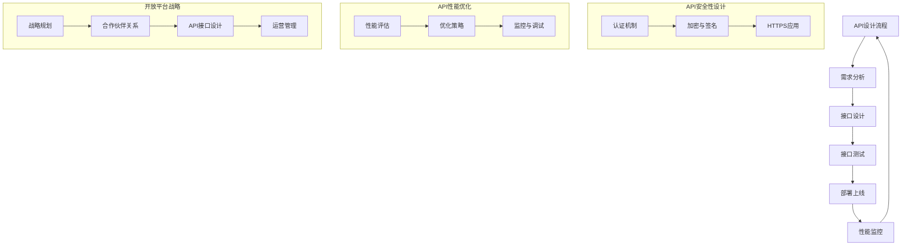

                 


### 文章标题
《程序员创业公司的API设计与开放平台战略》

### 关键词
API设计、开放平台、创业公司、RESTful、安全性、性能优化、合作伙伴关系、盈利模式、案例分析

### 摘要
本文将深入探讨程序员创业公司在构建API和开放平台方面的关键策略。通过分析API设计的基础原则、安全性设计、性能优化，以及开放平台的战略规划、合作伙伴关系建立、API接口设计、运营管理等多个方面，本文旨在为创业公司提供一套系统性、实用的API设计与开放平台建设方案。同时，通过国内外开放平台案例的分析，文章总结了成功的关键因素，并提出了具体策略建议，以帮助创业公司在激烈的市场竞争中脱颖而出。

### 目录大纲

#### 第一部分：API设计与开发基础

##### 第1章：API设计与架构概述

- **1.1 API设计的基本概念**
  - **1.1.1 API的定义与作用**
  - **1.1.2 API设计的原则**
  - **1.1.3 API设计的流程**

- **1.2 RESTful API设计原则**
  - **1.2.1 RESTful架构基础**
  - **1.2.2 RESTful API设计规范**
  - **1.2.3 RESTful API示例分析**

- **1.3 SOAP API设计原则**
  - **1.3.1 SOAP协议基础**
  - **1.3.2 SOAP API设计要点**
  - **1.3.3 SOAP API示例分析**

##### 第2章：API安全性设计

- **2.1 API安全性的挑战**
  - **2.1.1 常见安全威胁**
  - **2.1.2 安全性设计的目标**
  - **2.1.3 安全性设计的原则**

- **2.2 API认证机制**
  - **2.2.1 API认证的概念**
  - **2.2.2 API认证的方式**
  - **2.2.3 OAuth 2.0认证流程**

- **2.3 API加密与签名**
  - **2.3.1 数据加密技术**
  - **2.3.2 API签名技术**
  - **2.3.3 HTTPS在API安全中的应用**

##### 第3章：API性能优化

- **3.1 API性能评估指标**
  - **3.1.1 响应时间**
  - **3.1.2 吞吐量**
  - **3.1.3 资源消耗**

- **3.2 API性能优化策略**
  - **3.2.1 缓存策略**
  - **3.2.2 负载均衡策略**
  - **3.2.3 代码优化技巧**

- **3.3 API监控与调试**
  - **3.3.1 API监控工具**
  - **3.3.2 API性能问题定位**
  - **3.3.3 API性能调优实践**

#### 第二部分：开放平台战略与实施

##### 第4章：开放平台战略概述

- **4.1 开放平台的概念与价值**
  - **4.1.1 开放平台的定义**
  - **4.1.2 开放平台的优势**
  - **4.1.3 开放平台的发展趋势**

- **4.2 开放平台战略规划**
  - **4.2.1 战略目标设定**
  - **4.2.2 市场定位**
  - **4.2.3 资源整合与优化**

- **4.3 开放平台合作伙伴关系建立**
  - **4.3.1 合作伙伴选择标准**
  - **4.3.2 合作模式与协议**
  - **4.3.3 合作关系维护**

##### 第5章：开放API接口设计

- **5.1 API接口设计规范**
  - **5.1.1 接口命名规范**
  - **5.1.2 接口参数设计**
  - **5.1.3 接口响应设计**

- **5.2 API文档编写**
  - **5.2.1 文档编写工具**
  - **5.2.2 文档内容规范**
  - **5.2.3 文档发布与更新**

- **5.3 API接口测试**
  - **5.3.1 接口测试方法**
  - **5.3.2 接口测试工具**
  - **5.3.3 接口测试实践**

##### 第6章：开放平台运营与管理

- **6.1 开放平台运营策略**
  - **6.1.1 运营目标设定**
  - **6.1.2 用户增长策略**
  - **6.1.3 内容生态建设**

- **6.2 开放平台风险管理**
  - **6.2.1 风险识别与评估**
  - **6.2.2 风险应对策略**
  - **6.2.3 风险监控与预警**

- **6.3 开放平台盈利模式探索**
  - **6.3.1 盈利模式类型**
  - **6.3.2 模式选择与实施**
  - **6.3.3 持续盈利策略**

##### 第7章：案例分析

- **7.1 国内外开放平台案例分析**
  - **7.1.1 国外案例分析**
  - **7.1.2 国内案例分析**

- **7.2 开放平台成功关键因素分析**
  - **7.2.1 技术因素**
  - **7.2.2 战略因素**
  - **7.2.3 用户因素**

- **7.3 程序员创业公司开放平台策略建议**
  - **7.3.1 策略制定原则**
  - **7.3.2 策略实施步骤**
  - **7.3.3 策略评估与优化**

#### 附录：API设计与开放平台战略工具资源

- **附录A：API设计与开发工具资源**
  - **A.1 API设计工具**
  - **A.2 API文档工具**
  - **A.3 API测试工具**

- **附录B：开放平台战略相关资源**
  - **B.1 开源平台案例库**
  - **B.2 开放平台战略研究报告**
  - **B.3 相关政策和法规指南**

---

**附录：核心概念与架构 Mermaid 流程图**



### 文章正文

#### 第一部分：API设计与开发基础

##### 第1章：API设计与架构概述

**1.1 API设计的基本概念**

**1.1.1 API的定义与作用**

应用程序编程接口（API，Application Programming Interface）是一种让不同软件之间进行交互的接口。它定义了软件组件之间应该如何交互的规则、协议和数据格式，使得开发者可以更方便地利用其他软件或服务提供的功能，而不需要从头开始实现这些功能。

API的作用主要体现在以下几个方面：

1. **功能复用**：开发者可以通过API利用现有的服务和功能，从而避免重复开发。
2. **系统集成**：API能够帮助不同系统之间的集成，使得数据交换和流程自动化变得更加容易。
3. **开发效率**：API减少了开发工作量和复杂性，提高了开发效率。
4. **灵活性**：API的设计使得系统能够更加灵活地适应未来的变化。

**1.1.2 API设计的原则**

1. **简洁性**：API设计应尽量简洁明了，避免过于复杂的接口和冗长的文档。
2. **一致性**：API应该遵循一致的命名和设计规范，以确保开发者能够轻松理解和使用。
3. **可扩展性**：API设计应考虑到未来的扩展性，以便能够方便地增加新的功能。
4. **可重用性**：设计API时，应尽量使其具有高可重用性，以便在不同的应用场景中使用。
5. **安全性**：API设计应充分考虑安全性，防止未授权访问和数据泄露。

**1.1.3 API设计的流程**

1. **需求分析**：明确API的使用场景和功能需求。
2. **接口设计**：根据需求设计API的接口，包括URL、请求参数、响应数据等。
3. **安全性设计**：考虑API的安全性，包括认证、加密、签名等。
4. **文档编写**：编写详细的API文档，包括接口描述、请求示例、响应示例等。
5. **接口测试**：对API进行全面的测试，确保其功能正确、性能稳定、安全性可靠。
6. **部署上线**：将API部署到服务器，并确保其可访问性和稳定性。
7. **性能监控**：对API进行实时监控，及时发现问题并进行优化。

**1.2 RESTful API设计原则**

**1.2.1 RESTful架构基础**

REST（Representational State Transfer）是一种网络架构风格，用于指导构建网络应用。RESTful API是基于REST架构设计的API。

RESTful架构的核心原则包括：

1. **统一接口**：所有API操作都通过统一的接口进行，如GET、POST、PUT、DELETE等。
2. **无状态**：服务器不存储客户端的会话信息，每次请求都是独立的。
3. **客户端-服务器架构**：客户端和服务端各自独立开发，服务器专注于数据存储和逻辑处理。
4. **缓存**：服务器响应可以被客户端缓存，以提高性能。
5. **分层系统**：客户端通过不同的层（如表示层、业务逻辑层、数据访问层）与服务器通信。

**1.2.2 RESTful API设计规范**

1. **URL设计**：URL是API的核心，应简洁明了，描述API的功能和资源。
2. **HTTP方法**：根据操作类型选择合适的HTTP方法，如GET、POST、PUT、DELETE等。
3. **请求参数**：请求参数应合理分类，区分路径参数和查询参数，并使用标准数据类型。
4. **响应数据**：响应数据应结构清晰，使用JSON或XML等格式，并遵循统一的规范。
5. **状态码**：使用标准HTTP状态码来表示请求的结果，如200（成功）、404（未找到）、500（服务器内部错误）等。
6. **版本控制**：为API设计版本号，以便于未来的升级和兼容性处理。

**1.2.3 RESTful API示例分析**

以下是一个简单的RESTful API示例：

```json
GET /users/{id}
```

- **URL**：`/users/{id}`，表示获取指定ID的用户信息。
- **HTTP方法**：GET，表示读取操作。
- **请求参数**：`{id}`，为路径参数，用于指定用户ID。
- **响应数据**：

```json
{
    "id": "123",
    "name": "John Doe",
    "email": "john.doe@example.com"
}
```

- **状态码**：200（成功），表示请求成功执行。

**1.3 SOAP API设计原则**

**1.3.1 SOAP协议基础**

SOAP（Simple Object Access Protocol）是一种基于XML的协议，用于在网络上交换结构化的信息和远程过程调用。SOAP API是基于SOAP协议设计的API。

SOAP协议的核心组成部分包括：

1. **SOAP消息**：SOAP消息是一个XML文档，包含请求或响应信息。
2. **SOAP头部**：用于包含消息元数据，如消息标识、认证信息等。
3. **SOAP身体**：包含具体的请求或响应信息。
4. **SOAP绑定**：定义了消息传输的协议和格式。
5. **SOAP编码规则**：定义了数据类型和编码方式。

**1.3.2 SOAP API设计要点**

1. **消息格式**：SOAP消息应遵循XML标准，结构清晰，易于解析。
2. **服务描述**：使用WSDL（Web Services Description Language）描述API服务，包括接口、方法和参数。
3. **请求和响应**：每个API操作都对应一个SOAP请求和响应消息，包括头部和身体。
4. **错误处理**：在SOAP消息中包含错误信息，以帮助客户端处理异常情况。
5. **安全性**：使用SOAP绑定和安全协议（如HTTPS）确保消息的安全性。

**1.3.3 SOAP API示例分析**

以下是一个简单的SOAP API示例：

```xml
<SOAP-ENV:Envelope xmlns:SOAP-ENV="http://schemas.xmlsoap.org/soap/envelope/">
  <SOAP-ENV:Header/>
  <SOAP-ENV:Body>
    <ns1:getUserDetailsResponse xmlns:ns1="http://example.com/user">
      <ns1:userId>123</ns1:userId>
      <ns1:username>John Doe</ns1:username>
      <ns1:email>john.doe@example.com</ns1:email>
    </ns1:getUserDetailsResponse>
  </SOAP-ENV:Body>
</SOAP-ENV:Envelope>
```

- **SOAP头部**：包含消息元数据，如消息标识和认证信息。
- **SOAP身体**：包含具体的响应信息，如用户ID、用户名和电子邮件。
- **WSDL服务描述**：用于描述API服务，包括接口、方法和参数。
- **状态码**：未显式包含，但可以通过SOAP头部或响应信息中的错误代码判断。

**总结**

API设计是软件开发中至关重要的一环，直接影响系统的可维护性、可扩展性和用户体验。程序员创业公司在进行API设计时，应遵循简洁性、一致性、可扩展性和安全性等原则，同时结合RESTful和SOAP等不同的API设计风格，选择合适的架构和技术方案。通过本文的介绍和分析，读者应能对API设计有更深入的理解和认识。

---

#### 第二部分：开放平台战略与实施

##### 第4章：开放平台战略概述

**4.1 开放平台的概念与价值**

**4.1.1 开放平台的定义**

开放平台（Open Platform）是指一种基于共享、开放、合作的理念，通过提供一系列开放接口和资源，鼓励外部开发者或合作伙伴基于平台进行应用开发和创新的生态体系。开放平台的核心在于开放性、透明性和协作性，通过实现资源、能力和服务的共享，实现多方共赢。

**4.1.2 开放平台的优势**

1. **提升竞争力**：开放平台可以吸引更多的开发者参与，形成强大的生态系统，提高产品的竞争力和市场份额。
2. **加速创新**：开放平台鼓励外部开发者基于平台进行创新，可以快速引入新的技术和应用，推动行业的发展。
3. **资源共享**：开放平台可以整合多方资源，实现资源共享和优化，降低开发和运营成本。
4. **用户增长**：开放平台可以通过提供多样化的服务和应用，吸引更多用户，提高用户黏性和活跃度。
5. **生态共赢**：开放平台可以实现多方共赢，通过合作和创新，共同推动行业的发展和进步。

**4.1.3 开放平台的发展趋势**

1. **API化**：越来越多的企业将核心能力和服务通过API的形式对外开放，实现服务化和平台化。
2. **生态化**：开放平台逐渐形成完整的生态系统，包括开发者、企业、用户等各个环节，实现资源共享和协同创新。
3. **智能化**：随着人工智能技术的发展，开放平台将更加智能化，通过数据分析和智能算法，实现精准推荐和服务优化。
4. **全球化**：开放平台将逐步实现全球化布局，吸引全球开发者参与，推动全球范围内的合作与创新。

**4.2 开放平台战略规划**

**4.2.1 战略目标设定**

开放平台战略目标的设定应结合公司的愿景、使命和战略方向，具体包括：

1. **市场定位**：明确平台的目标市场和用户群体，如B2B、B2C、垂直行业等。
2. **用户增长**：设定明确的用户增长目标，如注册用户数、活跃用户数等。
3. **生态系统建设**：设定开发者生态、合作伙伴生态、用户生态等方面的建设目标。
4. **盈利模式**：明确平台的盈利模式，如服务收费、广告收入、增值服务等。
5. **技术发展**：设定平台的技术发展方向，如新技术引入、平台性能优化等。

**4.2.2 市场定位**

市场定位是开放平台战略规划的关键环节，应充分考虑以下因素：

1. **目标市场**：明确平台的目标市场，如企业、开发者、普通用户等。
2. **竞争分析**：分析竞争对手的市场定位、优势与劣势，找到自身的差异化定位。
3. **用户需求**：深入了解目标市场的用户需求，提供有针对性的服务和产品。
4. **市场规模**：评估目标市场的规模和发展潜力，确保市场定位的可行性。
5. **市场进入策略**：制定合适的市场进入策略，如品牌宣传、合作伙伴关系建立等。

**4.2.3 资源整合与优化**

开放平台的资源整合与优化是确保战略实施成功的关键，具体包括：

1. **技术资源**：整合公司内外部的技术资源，形成强大的技术支持体系，包括研发团队、技术文档、技术培训等。
2. **人力资源**：组建专业的开放平台团队，包括产品经理、开发工程师、运营经理等，确保团队成员具备相关领域的专业知识和经验。
3. **市场资源**：利用公司已有的市场资源，如品牌、渠道、客户等，加速开放平台的市场推广和用户增长。
4. **资金资源**：确保开放平台的资金投入，包括研发投入、市场推广投入等，确保平台的可持续发展。
5. **合作资源**：积极寻求合作伙伴，建立合作关系，共同推动开放平台的发展，如技术合作伙伴、市场合作伙伴、投资合作伙伴等。

**4.3 开放平台合作伙伴关系建立**

**4.3.1 合作伙伴选择标准**

选择合适的合作伙伴是开放平台成功的关键，具体选择标准包括：

1. **行业背景**：合作伙伴在相关行业具备丰富的经验和资源。
2. **技术能力**：合作伙伴具备强大的技术实力和创新能力。
3. **业务模式**：合作伙伴的业务模式与平台战略目标相契合。
4. **合作意愿**：合作伙伴具备良好的合作意愿和长期合作的意愿。
5. **资源互补**：合作伙伴能够为平台提供有价值的资源和支持，实现资源互补。

**4.3.2 合作模式与协议**

开放平台合作伙伴关系的建立需要明确合作模式与协议，具体包括：

1. **合作协议**：明确合作各方的权利、义务、责任和利益分配，确保合作过程的规范和透明。
2. **合作方式**：确定合作的方式，如技术合作、市场合作、投资合作等。
3. **合作内容**：明确合作的具体内容，如技术支持、市场推广、资源共享等。
4. **合作期限**：约定合作的期限，包括合作起始时间、合作期限和续约方式等。
5. **合作风险**：明确合作过程中可能面临的风险和应对措施，确保合作过程的稳定和可持续发展。

**4.3.3 合作关系维护**

合作关系维护是确保开放平台长期稳定发展的关键，具体包括：

1. **沟通机制**：建立有效的沟通机制，确保合作各方能够及时沟通、分享信息和协调工作。
2. **定期会议**：定期组织会议，讨论合作进展、问题解决和下一步计划。
3. **资源整合**：共同整合各方资源，实现资源共享和优势互补。
4. **反馈机制**：建立反馈机制，收集合作伙伴和用户的意见和建议，不断优化平台服务。
5. **利益分配**：确保合作各方的利益得到合理分配，增强合作共赢的意识和动力。

**总结**

开放平台战略是程序员创业公司发展的重要方向，通过开放接口和资源，吸引外部开发者参与，实现资源的共享和优化，提升产品的竞争力和市场份额。本文对开放平台的概念、价值、战略规划、合作伙伴关系建立等方面进行了详细分析，为创业公司提供了系统性、实用的战略规划建议。通过本文的介绍，读者应能对开放平台战略有更深入的理解和认识。

---

#### 第5章：开放API接口设计

**5.1 API接口设计规范**

**5.1.1 接口命名规范**

接口命名应遵循简洁、明确、一致性的原则，具体规范如下：

1. **小写字母**：接口名称应使用小写字母，避免使用大写字母或特殊字符。
2. **单词分隔**：使用下划线（_）或短横线（-）分隔单词，提高可读性。
3. **含义明确**：接口名称应能够清晰地表达接口的功能或用途。
4. **避免缩写**：尽量避免使用缩写，除非该缩写在业界具有广泛的认知。
5. **遵循命名规范**：遵循公司或项目的统一命名规范，确保接口名称的一致性。

例如：

- `get_user_info`：获取用户信息
- `create_order`：创建订单
- `delete_product`：删除产品

**5.1.2 接口参数设计**

接口参数是接口的重要组成部分，直接影响接口的可扩展性和易用性。参数设计应遵循以下原则：

1. **明确参数类型**：根据参数的作用和用途，明确参数的类型，如字符串、数字、布尔值等。
2. **区分必选参数和可选参数**：明确区分必选参数和可选参数，并在接口文档中详细说明。
3. **合理设置参数默认值**：对于可选参数，可以设置合理的默认值，提高接口的灵活性和易用性。
4. **遵循参数传递顺序**：参数传递顺序应遵循逻辑顺序，避免混淆。
5. **使用明确的参数名称**：参数名称应能够清晰地表达参数的含义，避免使用模糊或误导性的名称。

例如：

- `get_user_info`（获取用户信息）接口参数：

```json
{
    "user_id": "123"  // 用户ID，必选参数
    "email": "john.doe@example.com"  // 电子邮件，可选参数，默认值为空
}
```

**5.1.3 接口响应设计**

接口响应是接口执行结果的重要反馈，直接影响用户的使用体验和系统的稳定性。响应设计应遵循以下原则：

1. **统一的响应格式**：所有接口响应应遵循统一的格式，如JSON或XML等。
2. **明确的状态码**：使用标准HTTP状态码表示接口的执行结果，如200（成功）、400（请求错误）、500（服务器内部错误）等。
3. **详细的错误信息**：在接口执行失败时，应返回详细的错误信息，包括错误代码、错误描述等。
4. **响应数据的结构化**：响应数据应结构清晰，易于解析，避免返回冗长的字符串。
5. **响应数据的定制化**：根据接口的功能和用途，定制化响应数据，提供用户所需的信息。

例如：

- `get_user_info`（获取用户信息）接口响应：

```json
{
    "status": 200,  // 状态码，200表示成功
    "message": "操作成功",  // 消息，描述接口执行结果
    "data": {
        "id": "123",  // 用户ID
        "name": "John Doe",  // 用户名
        "email": "john.doe@example.com"  // 电子邮件
    }
}
```

- `create_order`（创建订单）接口响应：

```json
{
    "status": 201,  // 状态码，201表示创建成功
    "message": "订单创建成功",  // 消息，描述接口执行结果
    "data": {
        "order_id": "456",  // 订单ID
        "status": "pending",  // 订单状态，pending表示待支付
        "total_price": 100.0  // 订单总金额
    }
}
```

**5.2 API文档编写**

**5.2.1 文档编写工具**

编写高质量的API文档是确保开发者能够正确使用API的关键。常用的API文档编写工具有：

1. **Swagger**：基于OpenAPI规范的API文档生成工具，支持多种语言和框架。
2. **Apiary**：在线API文档编写工具，提供易于使用的界面和丰富的功能。
3. **ApiDoc**：基于Markdown的API文档编写工具，支持多种编程语言和框架。
4. **Doxygen**：开源的文档生成工具，支持多种编程语言，能够生成高质量的文档。

**5.2.2 文档内容规范**

API文档应包含以下内容：

1. **概述**：简要介绍API的功能、用途和适用场景。
2. **接口列表**：列出所有API接口，包括接口名称、URL、请求参数、响应数据等。
3. **接口描述**：详细描述每个API接口的功能、用途、请求参数、响应数据等。
4. **请求示例**：提供请求的示例代码，帮助开发者快速上手。
5. **响应示例**：提供响应的示例数据，帮助开发者理解接口返回的数据结构。
6. **错误码说明**：列出可能的错误码及其对应的错误描述，帮助开发者处理异常情况。
7. **安全性说明**：描述API的安全性措施，如认证、加密、签名等。
8. **版本更新**：记录API的版本更新历史，包括新增功能、修复问题和版本兼容性等。

**5.2.3 文档发布与更新**

1. **文档托管**：将API文档托管在易访问的位置，如官方网站、Git仓库等。
2. **版本控制**：使用版本控制系统（如Git）管理文档的版本，确保文档的更新与代码版本同步。
3. **自动化更新**：使用自动化工具（如Swagger、Apiary等）生成和更新API文档，确保文档的实时性和准确性。
4. **用户反馈**：鼓励用户提交反馈和建议，不断优化和改进文档内容。

**5.3 API接口测试**

**5.3.1 接口测试方法**

接口测试是确保API功能正确、性能稳定和安全性可靠的重要环节。常见的接口测试方法包括：

1. **功能测试**：验证API的功能是否符合预期，包括输入有效性、输出正确性等。
2. **性能测试**：评估API的响应时间、吞吐量、资源消耗等性能指标。
3. **安全测试**：验证API的安全性，包括认证、加密、签名等安全措施的有效性。
4. **兼容性测试**：验证API在不同环境（如操作系统、浏览器等）下的兼容性。

**5.3.2 接口测试工具**

常用的接口测试工具有：

1. **Postman**：功能强大、易用的接口测试工具，支持自动化测试和性能测试。
2. **JMeter**：开源的性能测试工具，适用于大规模负载测试。
3. **Selenium**：基于Web浏览器的自动化测试工具，适用于Web API测试。
4. **MockServer**：开源的API模拟工具，用于接口隔离和功能测试。

**5.3.3 接口测试实践**

1. **编写测试用例**：根据API接口的功能和需求，编写测试用例，包括输入数据、预期输出和断言条件等。
2. **执行测试用例**：使用接口测试工具执行测试用例，记录测试结果。
3. **问题定位**：针对测试失败的情况，定位问题并进行修复。
4. **回归测试**：在修复问题后，重新执行测试用例，确保修复的有效性。

例如：

```python
import requests

# 功能测试用例
def test_get_user_info():
    url = "http://api.example.com/user/123"
    response = requests.get(url)
    assert response.status_code == 200
    assert "id" in response.json()
    assert "name" in response.json()
    assert "email" in response.json()

# 性能测试用例
import time

def test_get_user_info_performance():
    url = "http://api.example.com/user/123"
    start_time = time.time()
    for i in range(1000):
        response = requests.get(url)
    end_time = time.time()
    print(f"1000 requests took {end_time - start_time} seconds")
```

**总结**

开放API接口设计是程序员创业公司构建开放平台的重要环节，通过规范的接口命名、参数设计和响应设计，可以提高接口的可读性和可维护性。同时，编写高质量的API文档和进行全面的接口测试，可以确保开发者能够正确使用API，提高开发效率和系统稳定性。本文对开放API接口设计进行了详细分析，为创业公司提供了实用的设计指南和测试实践。

---

#### 第6章：开放平台运营与管理

**6.1 开放平台运营策略**

**6.1.1 运营目标设定**

开放平台运营策略的制定应基于公司的整体战略和业务目标，具体运营目标包括：

1. **用户增长**：设定明确的用户增长目标，如月活跃用户数、日活跃用户数等。
2. **开发者增长**：鼓励外部开发者参与，设定开发者注册数、活跃开发者数等目标。
3. **生态系统建设**：构建丰富的生态系统，包括合作伙伴、应用和服务等。
4. **平台活跃度**：提高平台的活跃度，包括用户活跃度、开发者活跃度等。
5. **品牌影响力**：提升平台在行业内的品牌影响力和市场份额。

**6.1.2 用户增长策略**

1. **市场推广**：通过线上和线下渠道进行市场推广，提高平台的知名度和用户覆盖率。
2. **合作伙伴**：与行业内的合作伙伴建立合作关系，共同推广平台。
3. **内容营销**：通过博客、技术文章、案例分享等吸引潜在用户。
4. **用户社区**：建立用户社区，提供技术支持和交流平台，增强用户黏性。
5. **用户激励**：通过积分、奖励等方式激励用户参与和贡献。

**6.1.3 内容生态建设**

1. **应用商店**：构建应用商店，提供丰富多样的第三方应用和服务。
2. **开发者工具**：提供开发者工具，如SDK、API文档、测试工具等，降低开发门槛。
3. **开发者培训**：定期举办线上和线下培训，提升开发者的技能和知识水平。
4. **技术交流**：组织技术交流活动，促进开发者之间的合作和交流。
5. **社区运营**：积极运营社区，提供高质量的问答、教程等内容，增强社区活跃度。

**6.2 开放平台风险管理**

**6.2.1 风险识别与评估**

1. **技术风险**：识别可能的技术风险，如性能瓶颈、安全性漏洞等，并进行评估。
2. **市场风险**：分析市场变化和竞争态势，评估市场风险。
3. **法律风险**：了解相关法律法规，评估法律风险。
4. **合作伙伴风险**：评估合作伙伴的信用、能力等方面的风险。

**6.2.2 风险应对策略**

1. **技术风险应对**：优化技术架构，提高系统性能和安全性，建立完善的监控和报警机制。
2. **市场风险应对**：通过市场调研、数据分析等方式，及时了解市场变化，调整运营策略。
3. **法律风险应对**：了解相关法律法规，制定合规策略，如签订合作协议、备案等。
4. **合作伙伴风险应对**：建立合作伙伴评估机制，选择信誉良好、实力强的合作伙伴，并建立风险预警和应对机制。

**6.2.3 风险监控与预警**

1. **风险监控**：建立风险监控体系，实时监测技术、市场、法律等方面的风险。
2. **风险预警**：根据监控数据，及时识别潜在风险，并发布预警信息。
3. **应急预案**：制定应急预案，确保在风险事件发生时能够快速响应和处置。

**6.3 开放平台盈利模式探索**

**6.3.1 盈利模式类型**

开放平台常见的盈利模式包括：

1. **服务收费**：向开发者或用户提供有偿服务，如API调用费用、应用分发费用等。
2. **广告收入**：通过平台上的广告位或推广活动获得广告收入。
3. **交易抽成**：在平台交易过程中，收取一定比例的佣金或手续费。
4. **增值服务**：提供额外的增值服务，如高级功能、专业培训等。
5. **合作分成**：与合作伙伴进行分成合作，共同获益。

**6.3.2 模式选择与实施**

1. **模式选择**：根据平台的定位、市场情况和资源优势，选择合适的盈利模式。
2. **模式实施**：制定详细的实施计划，包括定价策略、推广渠道、合作伙伴关系建立等。
3. **模式优化**：根据实际运营情况，不断优化和调整盈利模式，提高盈利能力。

**6.3.3 持续盈利策略**

1. **用户增长**：通过市场推广、用户激励等手段，持续增加用户数量，扩大市场份额。
2. **开发者生态**：积极吸引和培养开发者，构建强大的开发者生态系统，提高平台的价值。
3. **服务质量**：不断提升平台服务质量，提供优质的API接口、工具和培训，增强用户黏性。
4. **创新驱动**：持续创新，引入新技术、新模式，提高平台的竞争力和盈利能力。
5. **合作伙伴关系**：与合作伙伴建立长期稳定的合作关系，实现共赢发展。

**总结**

开放平台运营与管理是确保平台长期稳定发展的关键。通过设定明确的运营目标、实施有效的用户增长策略、构建内容生态系统、进行风险管理、探索合适的盈利模式，创业公司可以打造一个健康、可持续发展的开放平台。本文对开放平台运营与管理进行了详细分析，为创业公司提供了实用的策略和实施建议。

---

#### 第7章：案例分析

**7.1 国内外开放平台案例分析**

**7.1.1 国外案例分析**

1. **GitHub**：GitHub是一个全球领先的软件开发和协作平台，通过开放的API接口，允许开发者进行代码托管、项目管理、协作开发等操作。GitHub的成功主要得益于其开放性、社区生态和强大的工具支持。

   - **优势**：
     - 开放的API接口，方便第三方应用集成和扩展。
     - 强大的开发者社区，吸引大量优秀开发者参与。
     - 丰富的工具和资源，提高开发效率和用户体验。

   - **劣势**：
     - 对企业用户的服务支持相对较弱。
     - 高度依赖社区，导致在重大安全事件时存在一定风险。

2. **Google Cloud Platform**：Google Cloud Platform（GCP）是谷歌提供的云计算服务平台，通过开放的API接口，提供云计算、大数据、人工智能等服务。GCP在全球范围内拥有广泛的用户群体和合作伙伴。

   - **优势**：
     - 强大的云计算基础设施和丰富的服务资源。
     - 开放的API接口，方便第三方应用集成和扩展。
     - 强大的技术支持和生态体系。

   - **劣势**：
     - 相对较高的成本，对中小企业用户有一定门槛。
     - 地区覆盖有限，部分地区的用户接入速度较慢。

**7.1.2 国内案例分析**

1. **腾讯云**：腾讯云是中国领先的云计算服务提供商，通过开放的API接口，提供云服务器、数据库、大数据、人工智能等服务。腾讯云在国内市场占据重要地位，具有较强的技术实力和市场影响力。

   - **优势**：
     - 丰富的云计算服务资源和成熟的解决方案。
     - 开放的API接口，方便第三方应用集成和扩展。
     - 强大的技术支持和生态体系。

   - **劣势**：
     - 对海外市场的扩展相对较弱。
     - 在大数据和人工智能领域的竞争力有待提升。

2. **华为云**：华为云是中国领先的云服务提供商之一，通过开放的API接口，提供云计算、大数据、人工智能等服务。华为云在国内外市场均有布局，具有较强的技术实力和市场竞争能力。

   - **优势**：
     - 丰富的云计算服务资源和成熟的解决方案。
     - 开放的API接口，方便第三方应用集成和扩展。
     - 强大的技术支持和生态体系。

   - **劣势**：
     - 相对较晚进入云计算市场，部分领域竞争力不足。
     - 海外市场的拓展和国际化进程有待加强。

**7.2 开放平台成功关键因素分析**

1. **技术因素**：开放平台的技术实力和创新能力是成功的关键，包括API接口设计、服务稳定性、安全性等。

2. **战略因素**：开放平台的战略规划和市场定位直接影响其发展，包括盈利模式、合作伙伴关系、市场推广等。

3. **用户因素**：开放平台的用户需求满足和用户体验提升是成功的重要因素，包括用户增长、开发者生态、用户社区等。

**7.3 程序员创业公司开放平台策略建议**

1. **战略制定原则**：结合公司定位、市场环境和用户需求，制定明确的开放平台战略，包括目标、路线图和资源配置等。

2. **策略实施步骤**：制定详细的策略实施步骤，包括API接口设计、文档编写、测试、推广等，确保策略的有序执行。

3. **策略评估与优化**：定期评估开放平台的运营效果，根据评估结果调整和优化策略，确保平台的可持续发展。

**总结**

通过对国内外开放平台案例的分析，本文总结了开放平台成功的几个关键因素，包括技术因素、战略因素和用户因素。针对程序员创业公司，本文提出了具体的开放平台策略建议，包括战略制定原则、策略实施步骤和策略评估与优化等方面，旨在帮助创业公司在开放平台领域取得成功。

---

#### 附录：API设计与开放平台战略工具资源

**附录A：API设计与开发工具资源**

**A.1 API设计工具**

1. **Swagger**：基于OpenAPI规范的API文档生成工具，支持多种语言和框架。
   - 官网：[Swagger 官网](https://swagger.io/)

2. **Apiary**：在线API文档编写工具，提供易于使用的界面和丰富的功能。
   - 官网：[Apiary 官网](https://apiary.io/)

3. **ApiDoc**：基于Markdown的API文档编写工具，支持多种编程语言和框架。
   - 官网：[ApiDoc 官网](https://apidocjs.com/)

4. **Postman**：功能强大、易用的接口测试工具，支持自动化测试和性能测试。
   - 官网：[Postman 官网](https://www.postman.com/)

**A.2 API文档工具**

1. **Swagger UI**：用于展示和交互API文档的Web界面，与Swagger紧密结合。
   - 官网：[Swagger UI 官网](https://swagger.io/swagger-ui/)

2. **Redoc**：优雅的OpenAPI文档展示工具，支持Markdown和自定义主题。
   - 官网：[Redoc 官网](https://redocly.com/)

3. **Apiary Docs**：Apiary的文档展示工具，提供直观的API文档体验。
   - 官网：[Apiary Docs 官网](https://apiary.io/docs)

**A.3 API测试工具**

1. **JMeter**：开源的性能测试工具，适用于大规模负载测试。
   - 官网：[JMeter 官网](https://jmeter.apache.org/)

2. **Selenium**：基于Web浏览器的自动化测试工具，适用于Web API测试。
   - 官网：[Selenium 官网](https://www.selenium.dev/)

3. **MockServer**：开源的API模拟工具，用于接口隔离和功能测试。
   - 官网：[MockServer 官网](https://www.mockserver.io/)

**附录B：开放平台战略相关资源**

**B.1 开源平台案例库**

1. **GitHub Open Source Case Studies**：GitHub上的开源平台案例研究，涵盖各种行业和应用场景。
   - GitHub链接：[GitHub Open Source Case Studies](https://github.com/opensourcetalent/case-studies)

2. **Open Source Success Stories**：收集了众多开源项目的成功案例，包括项目介绍、发展历程、收益模式等。
   - 官网：[Open Source Success Stories](https://www.opensource.org/success-stories)

**B.2 开放平台战略研究报告**

1. **Open Platform Strategy Report**：深入分析开放平台的发展趋势、战略规划、盈利模式等方面的研究报告。
   - 官网：[Open Platform Strategy Report](https://www.opendatastrategy.com/reports/open-platform-strategy-report)

2. **The State of Open Source 2021**：分析开源软件在商业领域的应用、发展现状和未来趋势的报告。
   - 官网：[The State of Open Source 2021](https://www.nuancysolutions.com/insights/state-of-open-source-report)

**B.3 相关政策和法规指南**

1. **EU General Data Protection Regulation (GDPR)**：欧盟制定的隐私保护法规，对开放平台的数据处理和安全要求有明确规定。
   - 官网：[GDPR 官网](https://www.eugdpr.org/)

2. **California Consumer Privacy Act (CCPA)**：加州制定的消费者隐私保护法规，对开放平台的数据处理和隐私政策有严格要求。
   - 官网：[CCPA 官网](https://oag.ca.gov/ccpa)

---

通过本文的详细分析和案例分享，读者应能对API设计与开放平台战略有更深入的理解和认识。附录部分提供的工具资源和相关政策指南，有助于读者在实际工作中进行参考和应用。在开放平台的发展过程中，不断学习、实践和优化是关键，希望本文能为程序员创业公司的开放平台建设提供有价值的指导和借鉴。

