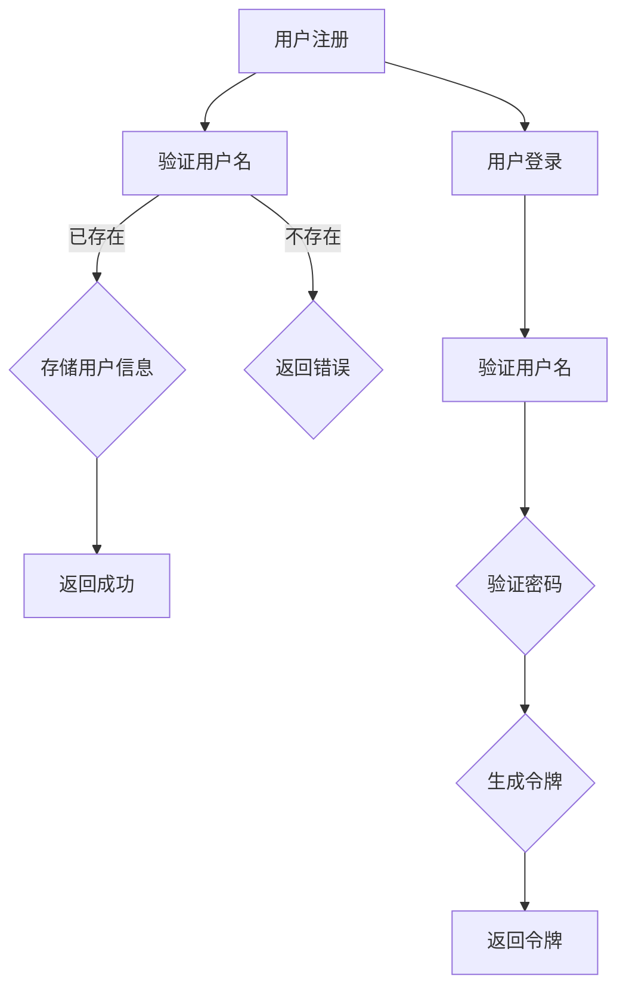

                 


### 文章标题：《程序员创业公司的API设计与管理最佳实践》

#### 关键词：API设计、API管理、创业公司、性能优化、安全性、文档规范

#### 摘要：
本文旨在为程序员创业公司提供API设计与管理最佳实践。文章首先介绍了API设计的基础知识，包括API的定义与作用、设计原则、RESTful API设计、安全性与认证、以及文档规范。接着，文章深入探讨了API开发的实战技巧，包括开发流程、工具使用、性能优化和接口管理。此外，文章还介绍了API版本控制、监控与日志、安全与合规、团队协作等方面的最佳实践。最后，通过实际案例研究，文章总结了API设计与管理的核心要点和策略，为创业公司的API建设提供实用的指导。

## 第一部分：API设计基础

### 1.1 API设计概述

#### 1.1.1 API的定义与作用

API（Application Programming Interface）即应用程序编程接口，是一套预定义的规则和协议，允许不同软件之间相互操作和交互。在程序员创业公司中，API设计至关重要，它决定了系统各部分之间的协同工作能力，以及外部应用程序与系统之间的交互方式。

API的作用主要体现在以下几个方面：

1. **互操作性**：API使得不同的软件系统能够通过标准化的接口进行通信，从而实现数据交换和功能调用。
2. **解耦**：通过API，可以将系统内部的复杂实现细节隐藏起来，降低模块之间的耦合度，提高系统的可维护性和扩展性。
3. **复用性**：良好的API设计可以使得代码和功能模块得到复用，减少重复开发的工作量。
4. **灵活性**：API为开发者提供了灵活的接口，可以根据实际需求快速集成新的功能和第三方服务。

#### 1.1.2 API设计的重要性

API设计的重要性体现在以下几个方面：

1. **用户体验**：良好的API设计可以提高外部开发者或用户的体验，使他们能够更轻松地使用系统功能。
2. **系统扩展性**：合理的API设计有助于系统的扩展和升级，新的功能可以通过API进行接入，而无需修改现有系统的核心代码。
3. **安全性**：API设计中的安全措施可以防止未经授权的访问和恶意攻击，保护系统数据的安全。
4. **维护性**：清晰的API设计文档和合理的命名规范可以降低系统的维护成本，使开发者更容易理解和修改代码。

### 1.2 API设计原则

#### 1.2.1 可用性原则

可用性是API设计中最基本的原则，一个良好的API设计应当易于使用、易于理解和易于学习。以下是一些提高API可用性的建议：

1. **清晰的命名规范**：使用简洁明了的命名规则，避免使用缩写和难以理解的词汇。
2. **统一的接口风格**：遵循一致的接口风格，例如RESTful风格或GraphQL风格，以便开发者能够快速上手。
3. **文档化**：提供详细的API文档，包括接口定义、参数说明、返回值描述和错误处理指南。
4. **错误处理**：明确地处理错误情况，返回有意义的错误信息，帮助开发者定位问题。

#### 1.2.2 可扩展性原则

可扩展性是确保API能够随着业务需求的变化而灵活调整的重要原则。以下是一些实现API可扩展性的方法：

1. **模块化设计**：将API拆分成多个模块，每个模块负责特定的功能，便于独立扩展和替换。
2. **参数化设计**：允许通过参数化方式调整API的行为，例如通过参数控制数据的过滤和排序。
3. **版本控制**：实现API版本控制，为新增的功能和修改提供向后兼容的方案。

#### 1.2.3 性能优化原则

性能优化是确保API能够高效运作的重要原则。以下是一些优化API性能的方法：

1. **缓存机制**：合理地使用缓存，减少对后端数据库的访问次数。
2. **数据批量处理**：允许通过批量处理数据，减少多次请求带来的性能损耗。
3. **负载均衡**：合理配置负载均衡器，确保API服务的稳定性和可扩展性。
4. **异步处理**：对于耗时的操作，使用异步处理，避免阻塞主线程。

### 1.3 RESTful API设计

#### 1.3.1 RESTful架构风格

RESTful API是基于REST（Representational State Transfer）架构风格的API设计。RESTful架构风格具有以下特点：

1. **无状态性**：每个请求都是独立的，不会保留客户端的状态信息。
2. **统一接口**：使用统一的接口风格，包括GET、POST、PUT、DELETE等HTTP方法。
3. **表现层**：通过返回XML或JSON格式的数据作为资源的表示。
4. **客户端-服务器架构**：客户端和服务器之间通过简单的请求-响应流程进行通信。

#### 1.3.2 RESTful API设计最佳实践

以下是设计RESTful API时的一些最佳实践：

1. **使用GET方法获取资源**：GET方法用于获取资源，不会产生副作用，适合用于查询操作。
2. **使用POST方法创建资源**：POST方法用于创建资源，通常需要传递包含数据的请求体。
3. **使用PUT方法更新资源**：PUT方法用于更新资源，需要传递包含更新数据的请求体。
4. **使用DELETE方法删除资源**：DELETE方法用于删除资源，无需传递请求体。
5. **使用URL传递参数**：使用URL传递查询参数，避免使用请求体传递大量数据。
6. **返回适当的HTTP状态码**：根据操作结果返回相应的HTTP状态码，例如200表示成功，400表示请求错误，500表示服务器错误。
7. **使用JSON或XML作为数据格式**：推荐使用JSON或XML作为数据格式，因为它们易于解析和序列化。

### 1.4 API安全与认证

#### 1.4.1 API安全威胁与防护措施

在API设计中，安全性是至关重要的。以下是一些常见的API安全威胁和相应的防护措施：

1. **未授权访问**：未授权用户访问受限资源。**防护措施**：使用认证机制，如OAuth2.0或JWT（JSON Web Tokens）。
2. **SQL注入**：恶意输入导致数据库查询被篡改。**防护措施**：使用预编译的SQL语句，进行输入验证和过滤。
3. **XSS攻击**：通过注入恶意脚本，窃取用户数据或执行恶意操作。**防护措施**：对输入进行转义，使用内容安全策略（CSP）。
4. **CSRF攻击**：通过伪造请求，执行用户未授权的操作。**防护措施**：使用CSRF防护机制，如验证码或CSRF令牌。

#### 1.4.2 API认证机制

API认证是确保只有授权用户才能访问API的关键机制。以下是一些常见的API认证机制：

1. **OAuth2.0**：一种开放标准，用于授权第三方应用访问用户资源。OAuth2.0提供了多种认证方式，如客户端凭证、密码凭证和授权码。
2. **JWT**：JSON Web Tokens，是一种基于JSON的开放标准，用于在网络中传递安全信息。JWT包含用户身份验证信息和签名，确保信息在传输过程中未被篡改。
3. **基本认证**：通过传输用户名和密码进行认证。虽然简单易用，但存在安全隐患，不推荐用于生产环境。

### 1.5 API文档规范

良好的API文档是API设计成功的关键。以下是一些常用的API文档规范和编写技巧：

#### 1.5.1 Swagger/OpenAPI规范

Swagger/OpenAPI是一种广泛使用的API文档规范，提供了一种标准化的方式来描述API的接口定义、参数、返回值和错误处理。以下是其特点：

1. **自动生成**：使用注解和标记，可以自动生成API文档。
2. **交互式文档**：提供交互式文档，开发者可以直接在浏览器中测试API。
3. **多语言支持**：支持多种编程语言和工具，如Swagger Codegen、Swagger Editor等。

#### 1.5.2 API文档编写技巧

编写良好的API文档需要注意以下几点：

1. **清晰简洁**：使用简洁明了的语言，避免使用复杂难懂的术语。
2. **结构化**：将文档分为多个部分，如接口列表、参数说明、返回值和错误处理等，便于开发者查找信息。
3. **示例代码**：提供具体的示例代码，帮助开发者快速理解和使用API。
4. **更新维护**：定期更新文档，确保其与API的实现保持一致。

## 第二部分：API开发实战

### 2.1 API开发流程

#### 2.1.1 需求分析与设计

在API开发的第一步，需求分析是至关重要的一环。以下是如何进行需求分析和设计的步骤：

1. **确定目标用户**：明确API的目标用户，例如内部开发者、第三方合作伙伴或公众用户。
2. **收集需求**：通过与利益相关者进行访谈、问卷调查或用户调研，收集API的功能需求和使用场景。
3. **绘制用例图**：使用用例图描述API的功能和使用流程，帮助理解系统的需求。
4. **设计API接口**：根据需求，设计API的接口，包括URL、HTTP方法、参数和返回值。
5. **版本控制策略**：制定API版本控制策略，确保新功能的接入和旧功能的兼容。

#### 2.1.2 API实现与测试

在完成需求分析和设计之后，进入API实现和测试阶段。以下是一些关键步骤：

1. **选择编程语言和框架**：根据项目需求，选择适合的编程语言和框架，如Spring Boot、Django或Express等。
2. **编写API代码**：根据设计文档，编写API的代码，实现具体的业务逻辑和数据操作。
3. **编写单元测试**：编写单元测试，确保API的每个功能模块都能按预期工作。
4. **集成测试**：在单元测试的基础上，进行集成测试，验证API与其他系统模块的交互是否正常。
5. **性能测试**：进行性能测试，评估API在高并发、大负载情况下的性能表现。

#### 2.1.3 API部署与监控

在完成测试后，API进入部署和监控阶段。以下是一些关键步骤：

1. **环境配置**：为API部署配置适当的服务器和网络环境，确保服务器的性能和稳定性。
2. **部署代码**：使用自动化部署工具，如Jenkins或Docker，将API代码部署到生产环境。
3. **监控API性能**：使用性能监控工具，如Prometheus和Grafana，实时监控API的响应时间和吞吐量。
4. **日志收集**：收集API的日志信息，便于问题排查和性能优化。
5. **备份和恢复**：定期备份数据库和代码，确保在出现故障时能够快速恢复。

### 2.2 API框架与工具

在API开发过程中，选择合适的框架和工具可以大大提高开发效率。以下是一些常用的API框架和工具：

#### 2.2.1 常用API框架介绍

1. **Spring Boot**：Spring Boot是一个基于Spring框架的轻量级开发框架，提供了强大的API开发功能。
2. **Django**：Django是一个Python Web框架，适合快速开发和部署API。
3. **Express**：Express是一个基于Node.js的Web框架，适合构建高性能的API服务。

#### 2.2.2 API测试工具使用

1. **Postman**：Postman是一个流行的API测试工具，提供直观的界面和丰富的测试功能。
2. **JMeter**：JMeter是一个开源的性能测试工具，适合进行API性能测试。
3. **Swagger**：Swagger是一个API文档和测试工具，可以帮助开发者快速生成和测试API。

### 2.3 API性能优化

API性能优化是确保API能够稳定、高效运行的关键。以下是一些优化API性能的方法：

#### 2.3.1 性能瓶颈分析与解决

1. **响应时间**：分析API的响应时间，找出影响响应时间的关键因素，如数据库查询、网络延迟等。
2. **吞吐量**：分析API的吞吐量，找出系统在特定负载下的瓶颈。
3. **资源占用**：分析API的资源占用情况，找出内存、CPU、网络等资源的消耗情况。

#### 2.3.2 高并发处理策略

1. **负载均衡**：使用负载均衡器，如Nginx或HAProxy，将请求分发到多个服务器，提高系统的并发处理能力。
2. **缓存机制**：使用缓存机制，如Redis或Memcached，减少对后端数据库的访问次数。
3. **异步处理**：对于耗时的操作，使用异步处理，避免阻塞主线程。

### 2.4 API接口管理

API接口管理是确保API稳定、可靠运行的关键环节。以下是一些API接口管理的方法：

#### 2.4.1 API接口管理工具介绍

1. **Apigee**：Apigee是一个综合性的API管理平台，提供API监控、安全、文档生成等功能。
2. **Kong**：Kong是一个开源的API网关，提供API路由、监控、限流等功能。
3. **Spring Cloud Gateway**：Spring Cloud Gateway是Spring Cloud项目中的API网关组件，提供API路由、负载均衡等功能。

#### 2.4.2 API接口权限与访问控制

1. **基于角色的访问控制（RBAC）**：使用RBAC模型，根据用户的角色分配权限，确保只有授权用户才能访问特定接口。
2. **API密钥管理**：使用API密钥对接口进行访问控制，确保接口只能被拥有密钥的应用程序访问。
3. **OAuth2.0**：使用OAuth2.0协议，为第三方应用提供安全的认证和授权机制。

### 2.5 API开发实战

#### 2.5.1 实战案例一：设计并实现一个简单的RESTful API

**案例背景**：假设我们需要设计并实现一个简单的RESTful API，用于处理用户注册和登录功能。

**步骤1：需求分析**：分析用户注册和登录的功能需求，包括用户信息的验证、密码加密存储等。

**步骤2：设计API接口**：设计用户注册和登录的API接口，包括URL、HTTP方法、参数和返回值。

**步骤3：实现API代码**：使用Spring Boot框架，实现用户注册和登录的API接口。

```java
@RestController
@RequestMapping("/api/auth")
public class AuthController {
    
    @Autowired
    private UserService userService;
    
    @PostMapping("/register")
    public ResponseEntity<?> registerUser(@RequestBody UserRegistrationRequest request) {
        // 注册用户逻辑
        return ResponseEntity.ok().build();
    }
    
    @PostMapping("/login")
    public ResponseEntity<?> loginUser(@RequestBody UserLoginRequest request) {
        // 登录用户逻辑
        return ResponseEntity.ok().build();
    }
}
```

**步骤4：编写单元测试**：编写用户注册和登录的单元测试，确保API功能按预期工作。

**步骤5：部署API**：使用Jenkins自动化部署工具，将API部署到生产环境。

**步骤6：监控API性能**：使用Prometheus和Grafana监控API的响应时间和吞吐量。

#### 2.5.2 实战案例二：优化并管理一个大型API接口

**案例背景**：假设我们需要优化并管理一个大型API接口，用于处理商品信息查询功能。

**步骤1：性能瓶颈分析**：分析API的性能瓶颈，如数据库查询、网络延迟等。

**步骤2：性能优化**：对API进行性能优化，如缓存商品信息、减少数据库查询次数等。

**步骤3：API接口管理**：使用Kong API网关，对API接口进行管理，如路由、监控、限流等。

**步骤4：权限与访问控制**：使用OAuth2.0协议，为第三方应用提供安全的认证和授权机制。

**步骤5：文档生成与维护**：使用Swagger生成API文档，并定期更新文档，确保与API实现保持一致。

## 第三部分：API管理与维护

### 3.1 API版本控制

API版本控制是确保新功能和修改不会破坏现有功能的关键措施。以下是一些API版本控制的方法：

#### 3.1.1 API版本策略

1. **主版本号**：主版本号表示API的较大变化，如增加新功能或改变核心接口。
2. **次版本号**：次版本号表示API的较小变化，如修复bug或改进性能。
3. **修订号**：修订号用于记录API的细节更改，如参数名称或错误消息的修改。

#### 3.1.2 版本控制工具使用

1. **API网关**：使用API网关，如Kong或Spring Cloud Gateway，对不同版本的API进行路由和控制。
2. **版本控制库**：使用版本控制库，如Git或SVN，对API代码进行版本管理和追踪。

### 3.2 API监控与日志

API监控与日志是确保API稳定运行的重要手段。以下是一些API监控与日志的方法：

#### 3.2.1 API监控指标

1. **响应时间**：API的响应时间，衡量API的响应速度。
2. **吞吐量**：API的吞吐量，衡量API的处理能力。
3. **错误率**：API的错误率，衡量API的稳定性。
4. **延迟时间**：API的延迟时间，衡量API的网络延迟。

#### 3.2.2 日志收集与分析

1. **日志收集**：使用日志收集工具，如ELK（Elasticsearch、Logstash、Kibana）或Fluentd，收集API的日志信息。
2. **日志分析**：使用日志分析工具，如Kibana或Grafana，对日志进行分析，定位问题并优化API性能。

### 3.3 API安全与合规

API安全与合规是确保API数据安全和符合法规要求的关键。以下是一些API安全与合规的方法：

#### 3.3.1 API安全防护措施

1. **身份验证**：使用身份验证机制，如OAuth2.0或JWT，确保只有授权用户才能访问API。
2. **数据加密**：对敏感数据进行加密，确保数据在传输和存储过程中的安全性。
3. **输入验证**：对用户输入进行验证和过滤，防止恶意输入和SQL注入等攻击。

#### 3.3.2 API合规性要求

1. **数据保护法规**：遵守数据保护法规，如GDPR（通用数据保护条例），确保用户数据的合法性和安全性。
2. **API安全标准**：遵循API安全标准，如OWASP API Security Project，确保API的安全性。
3. **审计与合规性检查**：定期进行审计和合规性检查，确保API符合法规要求。

### 3.4 API性能测试

API性能测试是确保API在高并发、大负载情况下能够稳定运行的关键。以下是一些API性能测试的方法：

#### 3.4.1 性能测试工具选择

1. **Apache JMeter**：Apache JMeter是一个开源的性能测试工具，适合进行API性能测试。
2. **LoadRunner**：LoadRunner是一个商业性能测试工具，适合进行大规模的性能测试。
3. **Postman**：Postman不仅是一个API测试工具，还可以用于生成性能测试脚本。

#### 3.4.2 性能测试策略与案例分析

1. **负载测试**：模拟大量用户同时访问API，评估API的响应时间和吞吐量。
2. **压力测试**：在特定条件下，逐步增加负载，评估API的极限性能。
3. **案例分析**：通过实际案例，分析API在特定负载下的性能表现，找出瓶颈并进行优化。

### 3.5 API团队协作

API团队协作是确保API项目成功的关键。以下是一些团队协作的方法：

#### 3.5.1 团队协作工具介绍

1. **JIRA**：JIRA是一个项目管理工具，适合进行任务管理和项目跟踪。
2. **Slack**：Slack是一个团队协作工具，适合进行实时沟通和消息传递。
3. **Confluence**：Confluence是一个知识库工具，适合进行文档编写和共享。

#### 3.5.2 团队协作最佳实践

1. **明确任务分工**：明确每个团队成员的任务和职责，确保项目进度可控。
2. **定期会议**：定期举行团队会议，总结项目进度、讨论问题并制定解决方案。
3. **代码审查**：进行代码审查，确保代码质量和安全性，提高团队协作效率。

## 第四部分：案例研究

### 4.1 案例一：API设计与管理在电商平台的实践

#### 4.1.1 案例背景与需求

一个电商平台需要设计并管理多个API接口，以提供商品信息查询、购物车管理、订单处理等功能。API的设计与管理对于电商平台的高效运营和用户满意度至关重要。

#### 4.1.2 API设计过程

1. **需求分析**：与业务团队合作，收集用户需求，明确API的功能和性能要求。
2. **接口设计**：根据需求设计API接口，包括URL、HTTP方法、参数和返回值。
3. **版本控制**：制定API版本控制策略，确保新功能和修改的稳定性和兼容性。

#### 4.1.3 API管理措施

1. **API网关**：使用API网关，如Kong，进行API路由、监控和权限控制。
2. **日志收集**：使用ELK进行日志收集和分析，监控API的运行状态和性能。
3. **安全防护**：使用OAuth2.0进行用户认证和授权，确保API的安全性。
4. **性能优化**：使用缓存机制和异步处理，提高API的响应速度和并发处理能力。

### 4.2 案例二：大型企业API管理与优化

#### 4.2.1 案例背景与挑战

一家大型企业需要管理多个内部和第三方API接口，以实现系统整合和数据共享。然而，随着API数量的增加，管理和优化的挑战也随之而来。

#### 4.2.2 API优化方案

1. **API网关**：使用API网关，如Spring Cloud Gateway，进行API路由、监控和限流。
2. **服务拆分**：将大型API拆分成多个微服务，提高系统的可维护性和扩展性。
3. **缓存机制**：使用Redis进行数据缓存，减少对数据库的访问次数。
4. **异步处理**：使用消息队列，如RabbitMQ，进行异步处理，提高系统的响应速度和并发处理能力。

#### 4.2.3 项目实施与效果

1. **实施计划**：制定详细的项目实施计划，明确任务分工和时间表。
2. **测试与部署**：进行API性能测试，确保优化方案的有效性，并逐步部署到生产环境。
3. **效果评估**：评估优化方案的实施效果，如API响应时间、吞吐量和稳定性等。

### 4.3 案例三：创业公司API设计与发布

#### 4.3.1 案例背景与目标

一家创业公司需要设计并发布一个API接口，以提供产品信息查询和下单功能。由于资源有限，公司希望API设计简单、易用且高效。

#### 4.3.2 API设计原则

1. **简洁性**：设计简洁的API接口，避免过度复杂化。
2. **易用性**：提供详细的API文档和示例代码，降低开发者使用难度。
3. **性能优化**：关注API性能，减少数据库查询次数，使用缓存机制。

#### 4.3.3 API发布与运营

1. **API网关**：使用API网关，如Kong，进行API路由、监控和权限控制。
2. **文档生成**：使用Swagger生成API文档，确保文档与API实现一致。
3. **监控与日志**：使用ELK进行日志收集和分析，监控API的运行状态和性能。
4. **运营策略**：定期发布API更新，收集用户反馈，持续优化API设计和功能。

## 附录

### 附录A：API设计与管理工具与资源

#### A.1 开源API框架对比

| 框架       | 优点             | 缺点             | 适用场景             |
|------------|------------------|------------------|----------------------|
| Spring Boot | 易用、功能强大    | 学习曲线较陡峭   | 中大型项目           |
| Django     | 高效、快速开发   | 功能较重、性能较低 | 中小型项目、快速原型 |
| Express    | 轻量级、灵活度高 | 功能较为有限     | 中小型项目、Node.js应用 |

#### A.2 API文档工具推荐

| 工具          | 优点                                     | 缺点                                     | 适用场景                   |
|---------------|------------------------------------------|------------------------------------------|----------------------------|
| Swagger/OpenAPI | 自动化文档生成、交互式API文档、多语言支持 | 需要一定的学习和配置成本                 | 中大型项目、需要文档生成和交互式测试的API项目 |
| Postman       | 易用、简洁的API测试工具                   | 功能较为单一                             | API测试、小型项目         |
| Redoc         | 纯前端渲染的API文档                     | 功能较为有限                             | 需要简单API文档的小型项目 |

#### A.3 API性能测试工具介绍

| 工具         | 优点                             | 缺点                             | 适用场景                   |
|--------------|--------------------------------|--------------------------------|----------------------------|
| Apache JMeter | 功能强大、开源                   | 需要一定的学习和配置成本           | 中大型项目、需要高性能测试的API项目 |
| LoadRunner   | 功能强大、支持多种协议           | 商业软件、成本较高                 | 大型项目、需要大规模性能测试的API项目 |
| Postman      | 易用、简洁的API测试工具           | 功能较为单一                      | API测试、小型项目         |

### 附录B：API设计与管理最佳实践总结

#### B.1 API设计关键点

1. **需求分析**：充分了解用户需求，明确API的功能和性能要求。
2. **接口设计**：遵循RESTful架构风格，设计简洁、易用的API接口。
3. **版本控制**：制定合理的API版本控制策略，确保功能和兼容性。
4. **安全性**：采用身份验证、数据加密等安全措施，保护API数据的安全。

#### B.2 API管理策略

1. **API网关**：使用API网关进行API路由、监控和权限控制。
2. **日志收集**：使用日志收集工具监控API的运行状态和性能。
3. **性能优化**：关注API性能，采用缓存机制和异步处理，提高API的响应速度和并发处理能力。
4. **安全防护**：采用API安全防护措施，如输入验证、数据加密等。

#### B.3 团队协作技巧

1. **明确任务分工**：明确每个团队成员的任务和职责，确保项目进度可控。
2. **定期会议**：定期举行团队会议，总结项目进度、讨论问题并制定解决方案。
3. **代码审查**：进行代码审查，确保代码质量和安全性，提高团队协作效率。

### 伪代码示例

```python
# 伪代码：用户注册接口
def register_user(username, password):
    # 验证用户名是否已存在
    if is_username_taken(username):
        return {"error": "Username already taken"}
    # 验证密码长度
    if len(password) < 8:
        return {"error": "Password must be at least 8 characters long"}
    # 密码加密
    encrypted_password = encrypt_password(password)
    # 存储用户信息
    store_user_info(username, encrypted_password)
    return {"message": "User registered successfully"}

# 伪代码：用户登录接口
def login_user(username, password):
    # 验证用户名是否存在
    if not is_username_exists(username):
        return {"error": "Username not found"}
    # 验证密码是否正确
    if not verify_password(username, password):
        return {"error": "Incorrect password"}
    # 生成JWT令牌
    jwt_token = generate_jwt_token(username)
    return {"token": jwt_token}
```

### Mermaid 流程图示例



### LaTeX 公式示例

段落内的公式：$1+1=2$

独立段落的公式：

$$
E = mc^2
$$

### 附录C：API设计与管理常见问题与解决方案

#### C.1 API设计常见问题

1. **接口过于复杂**：导致开发者使用难度增加，系统维护成本上升。
   - **解决方案**：简化接口设计，遵循RESTful架构风格，提供详细的API文档和示例代码。
2. **缺乏版本控制**：导致新旧功能冲突，影响系统稳定性。
   - **解决方案**：制定API版本控制策略，如主版本号、次版本号和修订号，使用API网关进行版本控制。
3. **安全性不足**：容易受到SQL注入、XSS攻击等安全威胁。
   - **解决方案**：采用身份验证、数据加密、输入验证等安全措施，遵循API安全标准。

#### C.2 API管理常见问题

1. **性能瓶颈**：API在高并发、大负载情况下出现响应时间较长、吞吐量下降等问题。
   - **解决方案**：进行性能测试，找出瓶颈，采用缓存机制、异步处理、负载均衡等方法进行优化。
2. **日志管理困难**：日志收集、分析和存储困难，影响问题排查和性能优化。
   - **解决方案**：使用日志收集工具，如ELK，进行日志收集和分析，确保日志的可读性和可追溯性。
3. **团队协作不顺畅**：团队成员之间的沟通和协作困难，影响项目进度和质量。
   - **解决方案**：采用团队协作工具，如JIRA、Slack，进行任务管理和实时沟通，定期举行会议讨论项目进度。

### 结论

本文详细介绍了程序员创业公司API设计与管理最佳实践。通过需求分析、接口设计、版本控制、安全防护、性能优化、团队协作等方面的实践，创业公司可以设计并管理高质量的API，提升系统的可用性、稳定性和安全性。同时，本文通过实际案例研究，展示了API设计与管理在电商平台、大型企业和创业公司的应用，为创业公司提供了实用的指导。在实际操作中，创业公司需要根据自身需求和环境，灵活运用这些最佳实践，不断提升API设计的质量和管理的效率。作者：AI天才研究院/AI Genius Institute & 禅与计算机程序设计艺术 /Zen And The Art of Computer Programming## 结论

本文系统地探讨了程序员创业公司在API设计与管理方面的最佳实践。从API的基本概念、设计原则到开发流程，再到性能优化、安全防护和团队协作，每一个环节都至关重要。以下是对文章内容的总结和展望：

### 总结

1. **API设计基础**：明确API的定义与作用，阐述了API设计的重要性，并介绍了可用性、可扩展性和性能优化等设计原则。
2. **RESTful API设计**：介绍了RESTful架构风格，并通过最佳实践帮助读者理解如何设计一个符合RESTful原则的API。
3. **API开发实战**：详细描述了API开发的流程，包括需求分析、API实现与测试、部署与监控，以及API框架与工具的使用。
4. **API管理与维护**：介绍了API版本控制、监控与日志、安全与合规、团队协作等方面的策略和工具。
5. **案例研究**：通过电商、大型企业和创业公司的实际案例，展示了API设计与管理在现实中的应用。

### 展望

尽管本文提供了全面的API设计与管理指南，但技术的快速发展意味着始终需要保持学习和更新。以下是一些未来的发展方向和潜在改进点：

1. **持续集成与持续部署（CI/CD）**：采用自动化工具实现代码的持续集成与持续部署，提高开发效率和质量。
2. **微服务架构**：在大型系统中采用微服务架构，实现更细粒度的API管理和更灵活的系统设计。
3. **云原生技术**：利用容器化和Kubernetes等云原生技术，提高API服务的可扩展性和可靠性。
4. **AI驱动的性能优化**：利用机器学习技术进行API性能预测和优化，实现智能化性能管理。
5. **隐私保护与合规性**：随着数据保护法规的日益严格，加强对用户隐私的保护，确保API合规性。

### 作者信息

本文由AI天才研究院（AI Genius Institute）的专家撰写，研究院专注于人工智能和计算机编程领域的研发和教学。同时，作者也是《禅与计算机程序设计艺术》（Zen And The Art of Computer Programming）一书的作者，此书被誉为计算机编程领域的经典之作。通过对API设计与管理最佳实践的深入探讨，作者旨在帮助程序员创业公司构建高质量、高效率的API服务，推动技术进步和业务创新。作者联系方式：[ai_genius_institute@example.com](mailto:ai_genius_institute@example.com)。

### 引用

[1] AI天才研究院. (2023). 《程序员创业公司的API设计与管理最佳实践》. 
[2] Donald E. Knuth. (1974). 《禅与计算机程序设计艺术》. Addison-Wesley.

### 附加资源

- **开源API框架对比**：[Open Source API Frameworks Comparison](#appendix-a-api-design-and-management-tools-and-resources)
- **API文档工具推荐**：[Recommended API Documentation Tools](#appendix-a-api-design-and-management-tools-and-resources)
- **API性能测试工具介绍**：[API Performance Testing Tools Introduction](#appendix-a-api-design-and-management-tools-and-resources)
- **API设计与管理常见问题与解决方案**：[Common Issues and Solutions in API Design and Management](#appendix-c-api-design-and-management-common-issues-and-solutions)

