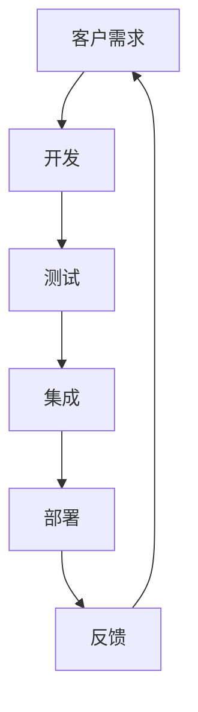
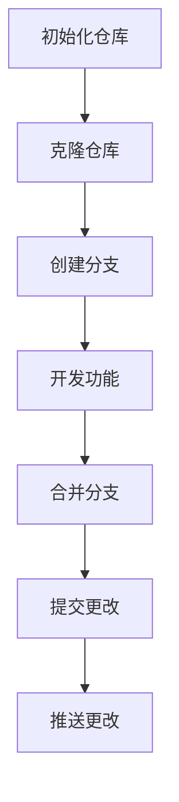
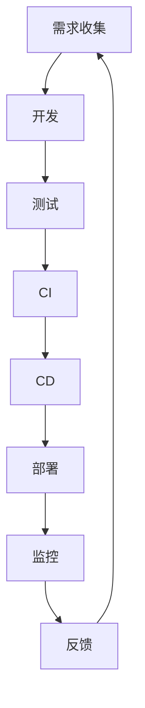
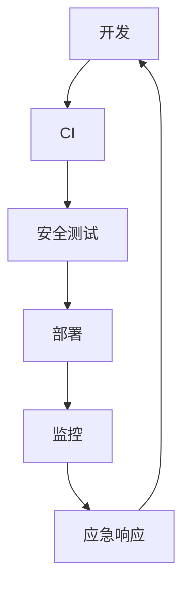
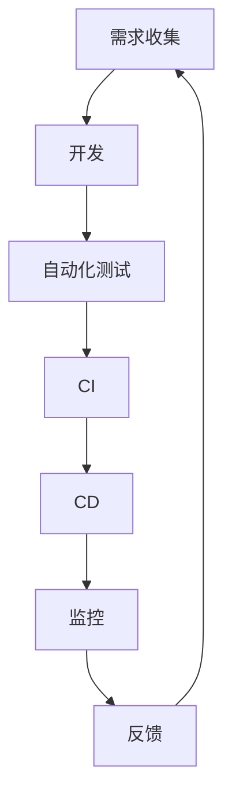
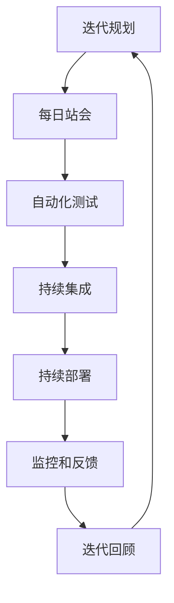
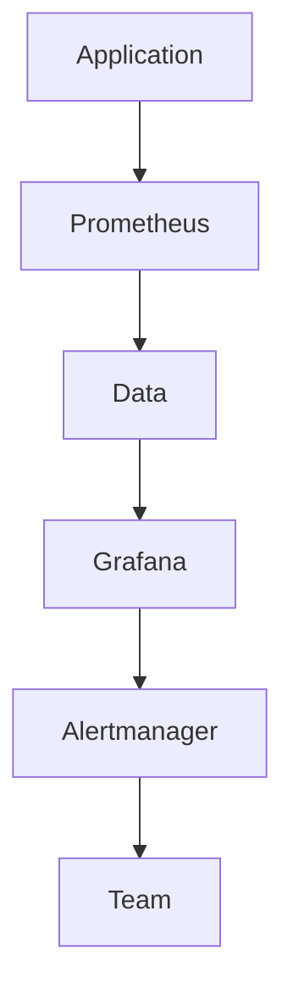
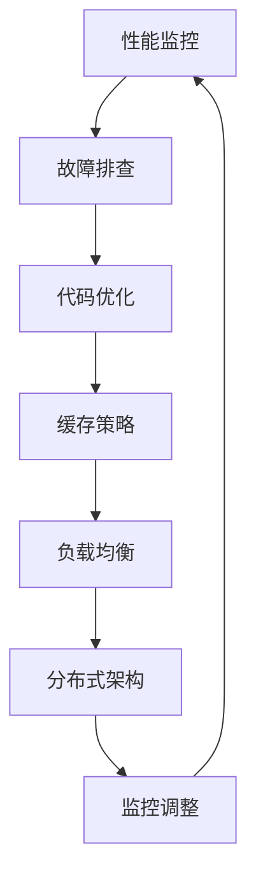
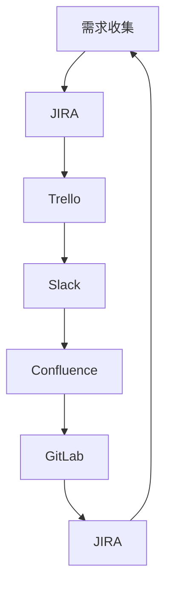
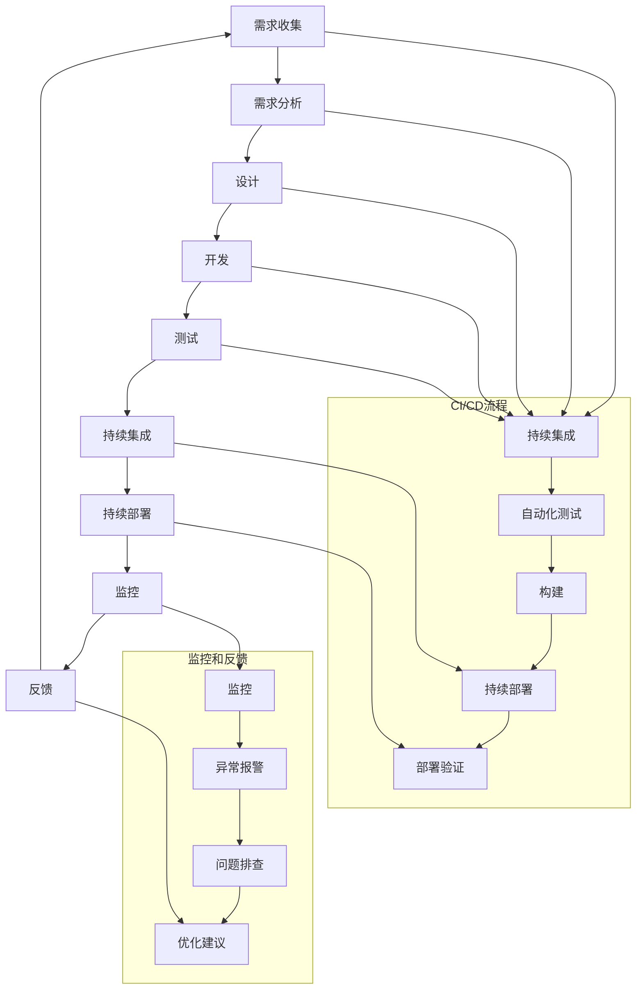

                 

### DevOps的概念与原理

#### 1.1 DevOps简介

DevOps是一种软件开发和运维模式，旨在通过开发（Development）和运营（Operations）之间的紧密协作，实现软件开发和运维流程的自动化、高效化和一体化。DevOps不仅仅是一种工具和技术，更是一种文化和理念的变革，其核心理念是通过持续集成（Continuous Integration，CI）、持续部署（Continuous Deployment，CD）等手段，缩短软件的交付周期，提高软件质量，降低风险。

#### 1.2 DevOps的核心原则

DevOps的核心原则包括以下几个方面：

1. **交付价值**：将快速交付高质量软件作为首要目标，不断满足用户需求。
2. **反馈循环**：通过自动化测试、监控和反馈机制，快速发现并解决问题，持续改进。
3. **持续学习**：鼓励团队成员不断学习新技能和知识，以提高团队整体能力。
4. **团队合作**：开发、运维、测试等团队成员紧密协作，共同推动项目进展。
5. **技术透明度**：通过共享代码、文档和数据，提高团队内部沟通效率。

#### 1.3 DevOps与传统开发运维的区别

DevOps与传统开发运维模式的主要区别在于以下几个方面：

1. **文化**：DevOps强调团队合作和文化变革，而传统开发运维往往强调职责分工和等级制度。
2. **流程**：DevOps采用持续集成/持续部署等自动化流程，而传统开发运维依赖于手动操作。
3. **工具**：DevOps使用一系列自动化工具，如Git、Jenkins、Docker等，而传统开发运维则更多依赖本地环境。
4. **目标**：DevOps追求快速交付高质量软件，而传统开发运维则更注重软件质量和稳定性。

为了更好地理解DevOps的核心概念和原理，我们可以通过一个简单的Mermaid流程图来展示DevOps的基本工作流程：



在这个流程图中，客户需求作为起点，经过开发、测试、集成和部署等环节，最终形成可交付的软件产品，并通过反馈机制持续改进。这种闭环的工作流程体现了DevOps的核心原则，即快速交付、持续反馈和持续改进。

### DevOps工具与技术

#### 2.1 持续集成/持续部署（CI/CD）

持续集成（Continuous Integration，CI）和持续部署（Continuous Deployment，CD）是DevOps实践中的两个关键环节。CI指的是通过自动化测试和构建，将开发过程中的代码更改快速合并到主干分支，确保代码的稳定性和一致性。CD则是将经过CI验证的代码快速部署到生产环境，实现快速交付。

CI/CD工具的选择通常取决于团队的规模和技术栈。以下是一些常用的CI/CD工具：

1. **Jenkins**：一款开源的自动化服务器，支持多种插件，可轻松构建、测试和部署代码。
2. **GitLab CI/CD**：GitLab自带的CI/CD工具，集代码管理、代码审查和自动化构建、测试、部署于一体。
3. **GitHub Actions**：GitHub提供的一站式自动化解决方案，支持在GitHub仓库中配置工作流程。

以下是一个简化的Jenkins CI/CD工作流程的伪代码：

```python
# Jenkinsfile
pipeline {
    agent any
    stages {
        stage('Build') {
            steps {
                sh 'mvn clean install'
            }
        }
        stage('Test') {
            steps {
                sh 'mvn test'
            }
        }
        stage('Deploy') {
            steps {
                echo 'Deploying to production environment'
                // 执行部署脚本
            }
        }
    }
    post {
        always {
            archiveArtifacts artifacts: 'target/*.jar'
        }
    }
}
```

#### 2.2 版本控制工具

版本控制是DevOps实践中的重要一环，常用的版本控制工具有Git、SVN和Mercurial等。Git是目前最流行的版本控制工具，其分布式特性使得代码管理和协作变得更加灵活。

Git的基本操作包括：

1. **克隆仓库**：`git clone <仓库地址>`
2. **创建分支**：`git branch <分支名称>`
3. **切换分支**：`git checkout <分支名称>`
4. **合并分支**：`git merge <分支名称>`
5. **提交更改**：`git commit -m "<提交信息>"`

以下是一个简单的Git工作流程：



#### 2.3 自动化测试

自动化测试是DevOps实践中的重要环节，旨在提高软件质量，降低风险。自动化测试包括单元测试、集成测试、性能测试等。

1. **单元测试**：对软件中的最小可测试单元进行测试，确保每个单元都能正确执行。
2. **集成测试**：对多个单元或模块进行集成测试，确保它们能够协同工作。
3. **性能测试**：对软件的性能进行测试，包括响应时间、吞吐量、并发处理能力等。

常用的自动化测试工具有JUnit、TestNG、Selenium等。以下是一个简单的JUnit单元测试示例：

```java
import static org.junit.Assert.*;

public class CalculatorTest {
    @Test
    public void testAdd() {
        Calculator calculator = new Calculator();
        int result = calculator.add(2, 3);
        assertEquals(5, result);
    }
}
```

#### 2.4 容器化技术

容器化技术是DevOps实践中的关键技术之一，通过将应用程序及其依赖环境打包到容器中，实现环境的标准化和一致性。

1. **Docker**：最流行的容器化技术，通过Dockerfile定义容器的构建过程。
2. **Kubernetes**：容器编排工具，用于管理容器的部署、扩展和自动化。

以下是一个简单的Docker容器构建示例：

```Dockerfile
FROM java:8-jdk-alpine
VOLUME /app
COPY target/myapp.jar app.jar
EXPOSE 8080
ENTRYPOINT ["java","-Djava.security.egd=file:/dev/./urandom","-jar","/app/app.jar"]
```

通过以上工具和技术，开发者可以构建一个高效、自动化、可扩展的DevOps工作流程，从而提高软件交付的质量和效率。

### DevOps文化与实践

#### 3.1 DevOps团队建设

DevOps团队建设是实施DevOps文化的关键步骤。一个成功的DevOps团队应该具备以下特点：

1. **多技能团队**：团队成员不仅具备软件开发技能，还需要掌握运维、测试等领域的知识，实现跨职能协作。
2. **小团队**：小团队可以更好地促进沟通和协作，提高决策效率。
3. **持续学习**：鼓励团队成员不断学习新技能和知识，以适应快速变化的IT行业。

为了建立高效的DevOps团队，团队领导者需要采取以下措施：

1. **明确目标和责任**：确保每个团队成员都清楚自己的职责和目标，提高工作积极性。
2. **共享知识和经验**：定期组织内部培训和技术分享，促进团队成员之间的知识交流。
3. **培养团队合作精神**：通过团队合作活动和团队建设活动，增强团队成员之间的信任和合作。

#### 3.2 DevOps流程优化

DevOps流程优化是提高软件交付质量和效率的重要手段。以下是一些常见的DevOps流程优化方法：

1. **自动化**：通过自动化工具和脚本，减少手动操作，提高工作效率。
2. **持续集成**：确保代码更改快速合并到主干分支，通过自动化测试和构建提高软件质量。
3. **持续部署**：快速将经过CI验证的代码部署到生产环境，缩短交付周期。
4. **监控和反馈**：通过监控工具实时跟踪系统性能和健康状况，及时发现并解决问题。

以下是一个简化的DevOps流程优化案例：



在这个流程中，需求收集后进入开发阶段，开发完成后进入测试阶段，通过CI进行自动化测试和构建，然后通过CD快速部署到生产环境，并通过监控和反馈机制持续优化流程。

#### 3.3 DevOps安全策略

DevOps安全策略是确保软件安全交付的关键步骤。以下是一些常见的DevOps安全策略：

1. **持续安全集成**：在CI过程中加入安全测试，确保代码在合并前符合安全标准。
2. **身份验证和授权**：通过身份验证和授权机制，确保只有授权人员能够访问系统和资源。
3. **数据加密**：对敏感数据进行加密处理，确保数据在传输和存储过程中的安全性。
4. **安全监控和应急响应**：通过安全监控工具实时跟踪系统安全状态，并在发生安全事件时快速响应。

以下是一个简化的DevOps安全策略流程：



在这个流程中，开发完成后进入CI阶段，通过安全测试确保代码安全，然后部署到生产环境，并通过监控和应急响应机制确保系统的安全运行。

通过团队建设、流程优化和安全策略的实施，企业可以建立起一个高效、安全、可持续发展的DevOps文化，从而在激烈的市场竞争中脱颖而出。

### 初创公司的DevOps策略

#### 4.1 初创公司的DevOps挑战

初创公司在实施DevOps时面临着一系列独特的挑战。这些挑战主要包括以下几个方面：

1. **资源有限**：初创公司通常在资金、人力和基础设施方面有限，需要更加高效地利用现有资源。
2. **快速迭代**：初创公司需要快速响应市场需求，不断迭代产品，这对DevOps流程提出了高要求。
3. **稳定性与质量**：初创公司在追求快速迭代的同时，还需要确保软件的稳定性和质量，避免因频繁变更导致的问题。
4. **团队协作**：初创公司的团队成员往往需要具备跨职能的能力，这要求团队成员之间的沟通和协作更加紧密。

#### 4.2 DevOps在初创公司中的实践路径

为了克服这些挑战，初创公司可以采取以下路径实施DevOps：

1. **团队协作与培训**：建立跨职能团队，并定期进行DevOps培训和知识分享，提高团队成员的技能和协作能力。
2. **自动化与简化**：利用自动化工具和脚本简化开发和运维流程，减少手动操作，提高工作效率。
3. **持续集成与部署**：实施持续集成和持续部署，确保代码变更快速合并到主干分支，并通过自动化测试和构建提高软件质量。
4. **监控与反馈**：通过监控工具实时跟踪系统性能和健康状况，及时发现并解决问题，确保系统的稳定运行。

以下是一个简化的DevOps实践路径：



在这个流程中，需求收集后进入开发阶段，开发完成后进行自动化测试，然后通过CI和CD快速交付到生产环境，并通过监控和反馈机制持续优化流程。

#### 4.3 成功案例分享

以下是一些初创公司在实施DevOps后的成功案例：

1. **Airbnb**：Airbnb通过实施DevOps，将代码交付周期从数周缩短到数小时，极大地提高了开发效率。他们采用Jenkins、Docker和Kubernetes等工具，实现了自动化部署和持续集成，确保了系统的稳定性和质量。
2. **Twilio**：Twilio是一家提供通信服务的初创公司，通过实施DevOps，将交付周期从数天缩短到数分钟。他们采用GitLab CI/CD和Kubernetes，实现了高度自动化的开发和部署流程，提高了系统的可扩展性和可靠性。
3. **GitHub**：GitHub通过自研的GitHub Actions，实现了全面的CI/CD和自动化部署。他们利用GitHub Actions的灵活性，将开发、测试和部署流程自动化，大大提高了开发效率和代码质量。

这些成功案例表明，通过合理的DevOps策略和实践，初创公司可以在资源有限的情况下，实现高效、高质量的软件交付，从而在竞争激烈的市场中脱颖而出。

### DevOps在敏捷开发中的应用

#### 5.1 敏捷开发与DevOps的关系

敏捷开发（Agile Development）和DevOps都是现代软件开发中的重要理念和实践。敏捷开发强调快速迭代、持续交付和客户满意度，而DevOps则关注开发与运维之间的协作、自动化和持续改进。两者之间的关系可以概括为：

1. **目标一致**：敏捷开发和DevOps都旨在提高软件交付的效率和质量，缩短交付周期，满足市场需求。
2. **流程互补**：敏捷开发通过迭代和增量式开发，实现快速交付；DevOps则通过自动化和持续集成/持续部署（CI/CD），确保代码质量和交付稳定性。
3. **文化共鸣**：敏捷开发和DevOps都强调团队协作、沟通透明和技术创新，共同推动软件开发的持续改进。

#### 5.2 DevOps在敏捷开发中的关键角色

在敏捷开发中，DevOps扮演着多个关键角色，包括：

1. **流程优化者**：通过自动化和持续集成/持续部署，优化开发、测试和部署流程，提高效率。
2. **协作推动者**：促进开发、测试和运维团队之间的紧密协作，打破部门壁垒，实现端到端的责任。
3. **质量保证者**：通过自动化测试和监控，确保软件质量，减少缺陷和故障。
4. **持续改进倡导者**：鼓励团队成员持续学习和改进，提高整体技能和知识水平。

#### 5.3 敏捷DevOps流程设计

为了在敏捷开发中有效实施DevOps，团队可以设计以下流程：

1. **迭代规划**：在每次迭代开始时，团队共同规划任务和目标，明确需求、优先级和交付时间。
2. **每日站会**：每日站会用于快速沟通、同步进度和解决问题，确保团队协作和透明。
3. **自动化测试**：编写自动化测试脚本，覆盖关键功能和安全点，确保代码质量和功能完整性。
4. **持续集成**：通过自动化构建和测试，将代码变更快速合并到主干分支，确保代码的一致性和稳定性。
5. **持续部署**：利用自动化部署工具，将经过CI验证的代码快速部署到生产环境，确保交付的及时性。
6. **监控和反馈**：通过监控工具实时跟踪系统性能和健康状况，及时发现并解决问题，确保系统的稳定运行。
7. **迭代回顾**：在每次迭代结束后，团队进行回顾，总结经验教训，持续优化流程。

以下是一个简化的敏捷DevOps流程设计：



在这个流程中，迭代规划、每日站会和迭代回顾是敏捷开发的核心理念，自动化测试、持续集成、持续部署和监控反馈是DevOps的关键实践。通过这个闭环流程，团队可以持续改进，实现高效、高质量的软件交付。

### DevOps监控与性能优化

#### 6.1 DevOps监控的重要性

DevOps监控是确保系统稳定性和性能优化的重要手段。通过实时监控，团队可以及时发现系统故障、性能瓶颈和潜在问题，从而采取及时措施进行修复和优化。

1. **故障检测**：实时监控系统状态，一旦出现异常，立即触发报警，避免故障扩大。
2. **性能优化**：通过监控性能指标，分析系统瓶颈，针对性地进行优化。
3. **成本控制**：监控资源使用情况，合理分配资源，降低运营成本。
4. **用户体验**：监控系统响应时间和稳定性，确保用户获得良好的使用体验。

#### 6.2 DevOps监控工具与应用

以下是一些常用的DevOps监控工具：

1. **Prometheus**：开源的监控解决方案，支持多维数据收集和报警。
2. **Grafana**：开源的数据可视化工具，与Prometheus等监控工具集成，提供丰富的图表和仪表板。
3. **Zabbix**：开源的企业级监控工具，支持多种监控方式和报警机制。
4. **New Relic**：商业监控工具，提供全面的性能监控和错误跟踪。

以下是一个使用Prometheus和Grafana的监控架构示例：



在这个架构中，应用程序向Prometheus发送监控数据，Prometheus存储和查询数据，并通过Grafana进行可视化展示。Alertmanager负责发送报警通知，团队可以根据监控数据和报警信息进行故障排查和性能优化。

#### 6.3 DevOps性能优化方法

性能优化是DevOps监控的重要目标之一。以下是一些常见的性能优化方法：

1. **代码优化**：通过优化算法、减少冗余代码和优化数据库查询，提高应用程序的性能。
2. **缓存策略**：使用缓存技术，减少数据库访问和重复计算，提高系统响应速度。
3. **负载均衡**：通过负载均衡器，合理分配请求到多个服务器，提高系统的并发处理能力。
4. **分布式架构**：将应用程序分解为多个微服务，实现分布式部署和扩展，提高系统的可扩展性和容错能力。

以下是一个简化的性能优化流程：



在这个流程中，性能监控是发现问题的第一步，故障排查、代码优化、缓存策略、负载均衡和分布式架构是针对不同问题的优化手段，最终回到监控调整，确保系统性能的持续优化。

通过有效的监控和性能优化，团队可以确保系统的稳定性和高性能，为用户提供优质的体验。

### DevOps文化的重要性

#### 7.1 DevOps文化的内涵

DevOps文化是一种以持续改进、开放协作和客户为中心的理念，它不仅涉及技术工具和流程，更是一种组织文化和团队精神。DevOps文化的内涵可以概括为以下几点：

1. **持续改进**：鼓励团队成员不断反思和改进工作流程，提高效率和软件质量。
2. **开放协作**：打破部门壁垒，促进开发、运维、测试等团队之间的紧密合作和知识共享。
3. **透明沟通**：通过透明化的工作流程和沟通机制，确保团队成员能够实时了解项目进展和问题。
4. **客户为中心**：始终将用户需求放在首位，通过快速迭代和反馈机制，持续优化产品和服务。
5. **责任感**：每个团队成员都对自己的工作负责，共同承担项目的成功与失败。

#### 7.2 建立DevOps文化的策略

建立DevOps文化需要系统性的策略和持续的努力。以下是一些建立DevOps文化的关键策略：

1. **领导力**：领导者的支持至关重要。领导者需要以身作则，倡导和实践DevOps文化，为团队成员树立榜样。
2. **培训与教育**：定期为团队成员提供DevOps培训和教育，提高他们的技能和意识。
3. **团队建设**：通过团队建设活动和跨职能项目，增强团队成员之间的信任和协作。
4. **共享和透明**：鼓励团队成员分享知识和经验，通过代码审查、技术会议和博客等形式，实现知识的共享和透明化。
5. **激励机制**：建立公平、透明的激励机制，鼓励团队成员积极参与到DevOps实践中，并为其创造价值。
6. **持续反馈**：通过定期的反馈和回顾，持续改进工作流程和团队文化。

#### 7.3 DevOps文化在团队中的传播与维护

DevOps文化的传播与维护是一个长期的过程，需要团队的共同努力和持续关注。以下是一些有效的传播与维护策略：

1. **内部传播**：通过内部会议、培训、研讨会和内部博客等形式，传播DevOps的理念和实践。
2. **外部学习**：鼓励团队成员参加行业会议、研讨会和培训课程，了解最新的DevOps技术和趋势。
3. **社区参与**：积极参与开源社区和技术论坛，与其他DevOps实践者交流和分享经验。
4. **持续改进**：通过定期的团队评估和反馈，识别和解决团队中的问题，持续改进DevOps实践。
5. **文化建设活动**：组织定期的文化建设活动，如技术分享会、团队建设活动等，增强团队成员的归属感和凝聚力。

通过以上策略，团队可以逐步建立和巩固DevOps文化，推动组织的持续发展和成功。

### DevOps团队协作技巧

#### 8.1 DevOps团队沟通技巧

有效的沟通是DevOps团队协作的关键。以下是一些提高团队沟通效率的技巧：

1. **明确目标**：确保每个团队成员都清楚项目的目标和预期结果，避免误解和冲突。
2. **定期会议**：定期召开团队会议，讨论项目进展、问题和解决方案，保持信息同步。
3. **透明化**：通过工具（如Slack、JIRA等）共享项目进度和关键信息，确保团队成员随时了解项目动态。
4. **主动沟通**：鼓励团队成员主动分享自己的工作进展、问题和建议，促进团队内部的信息流通。
5. **倾听与反馈**：积极倾听团队成员的意见，给予及时的反馈和帮助，提高问题解决效率。

#### 8.2 DevOps团队协作工具

以下是一些常用的DevOps团队协作工具：

1. **JIRA**：项目管理和任务跟踪工具，支持敏捷开发方法和协作流程。
2. **Slack**：即时通讯工具，用于实时沟通和协作。
3. **Trello**：看板式任务管理工具，用于任务分解和跟踪。
4. **Confluence**：团队知识库和文档协作工具，用于共享文档和知识。
5. **GitLab**：代码管理工具，集代码托管、代码审查、CI/CD于一体。

以下是一个简化的DevOps团队协作工具应用场景：



在这个场景中，需求收集后进入JIRA进行任务分配和跟踪，Trello用于任务分解和进度监控，Slack用于实时沟通，Confluence用于文档共享，GitLab用于代码管理。通过这些工具，团队可以高效地协作和跟踪项目进展。

#### 8.3 DevOps团队高效沟通与协作案例

以下是一个实际的DevOps团队高效沟通与协作的案例：

**案例背景**：一家初创公司在开发一款在线教育平台，团队成员包括前端开发、后端开发、测试工程师和运维人员。由于项目复杂且需要快速迭代，团队决定采用DevOps模式，以提高开发效率和软件质量。

**解决方案**：

1. **建立跨职能团队**：将前端、后端、测试和运维团队成员组成一个跨职能团队，确保每个成员都具备多技能，能够共同推进项目。
2. **使用JIRA进行任务管理**：通过JIRA创建和管理任务，明确每个任务的责任人、截止日期和优先级，确保任务按时完成。
3. **使用Slack进行实时沟通**：在Slack中建立专门的频道，如“#general”、“#frontend”、“#backend”等，用于实时沟通和协作。
4. **使用GitLab进行代码管理**：通过GitLab进行代码的版本控制、代码审查和CI/CD，确保代码质量和一致性。
5. **使用Confluence进行知识共享**：在Confluence中记录项目文档、技术文档和最佳实践，便于团队成员学习和参考。
6. **定期召开团队会议**：每周召开一次团队会议，讨论项目进展、问题和解决方案，确保团队协作和沟通。

**效果**：

通过上述措施，团队实现了高效的沟通和协作，项目进度得到了有效控制，软件质量和交付效率也得到了显著提升。团队成员之间的信任和合作也不断增强，为公司的持续发展奠定了坚实基础。

### DevOps相关资源

#### 9.1 DevOps书籍推荐

以下是几本值得推荐的DevOps相关书籍：

1. **《DevOps实践与原理》**（"The Practice of Cloud System Administration"） - Thomas A. Limoncelli，Strata R. Chalup，James Turnbull
   - 详细介绍了DevOps的基础知识和最佳实践。
2. **《DevOps：转型方法与实践》**（"DevOps: A Software Architect's Perspective"） - Andrew Hunt
   - 从软件架构师的角度，探讨了DevOps的原理和转型方法。
3. **《持续交付：发布可靠软件的系统化方法》**（"Continuous Delivery: Reliable Software Releases through Build, Test, and Deployment Automation"） - Jez Humble，Dave Farley
   - 介绍了持续交付的原理和实践，强调了自动化在软件交付中的重要性。

#### 9.2 DevOps在线课程与教程

以下是一些优秀的DevOps在线课程和教程：

1. **Coursera - DevOps Foundation**：由DevOps Institute提供的入门级课程，涵盖了DevOps的基本概念和实践。
2. **Udemy - DevOps Engineer Certification Training**：全面的DevOps工程师认证培训，包括CI/CD、自动化测试、容器化等主题。
3. **edX - DevOps: Creating the Culture of Collaboration**：由微软提供，探讨了DevOps文化和团队协作的重要性。

#### 9.3 DevOps社区与论坛

以下是一些活跃的DevOps社区和论坛：

1. **DevOps.com**：全球最大的DevOps新闻和资源平台，提供最新资讯、博客和在线研讨会。
2. **Reddit - r/DevOps**：Reddit上的DevOps论坛，用户可以提问、分享资源和讨论DevOps相关话题。
3. **LinkedIn Learning - DevOps Groups**：LinkedIn上的DevOps学习小组，成员可以交流经验、分享资源和建立职业网络。

通过阅读书籍、参加在线课程、加入社区论坛，开发者可以深入了解DevOps的知识体系，提升自己的实践能力。

### 附录A：DevOps流程图

以下是一个简单的DevOps流程图，展示了从需求收集到最终交付的各个环节，以及各环节之间的关联：



在这个流程图中，从需求收集开始，经过需求分析、设计、开发、测试，再到持续集成和持续部署，最终进入监控和反馈环节。CI/CD流程负责确保代码的质量和一致性，监控和反馈环节则用于实时跟踪系统的性能和健康状况，确保系统的稳定性和可靠性。通过这个闭环流程，DevOps实现了快速、高效和高质量的软件交付。

