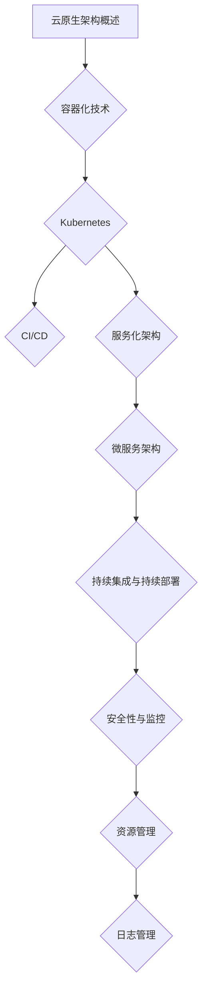

                 

# 《程序员创业公司的云原生架构设计与实施》

## 关键词
云原生架构、容器化技术、微服务、持续集成与持续部署、资源管理、安全性监控

## 摘要
本文旨在为程序员创业公司提供云原生架构的设计与实施指南。通过详细阐述云原生架构的起源、核心概念、设计原则、实施流程以及实战案例，本文帮助创业者们更好地理解和应用云原生技术，构建高效、灵活、安全的现代应用架构。

### 第一部分：云原生架构概述

#### 第1章：云原生架构的起源与概念

**1.1 云原生架构的定义与核心概念**

云原生（Cloud Native）是一种利用云计算优势，构建和运行应用程序的方法。云原生架构不仅仅是一种技术，更是一种软件开发和运维的新模式。其核心概念包括容器化、服务化、自动化、持续集成与持续部署等。

**1.2 云原生与传统架构的差异**

与传统架构相比，云原生架构具有更高的灵活性、可扩展性、可靠性和敏捷性。传统架构往往依赖物理服务器或虚拟机，而云原生架构基于容器化技术，可以实现应用程序的快速部署、管理和扩展。

**1.3 云原生架构的优势**

云原生架构的优势包括：
- **敏捷开发**：通过微服务架构和自动化部署，提高开发效率和响应速度。
- **可扩展性**：基于容器的应用可以轻松实现水平扩展，满足业务需求。
- **可靠性**：通过服务拆分和分布式架构，提高系统的容错性和稳定性。
- **安全性**：云原生架构支持丰富的安全措施，保障应用和数据的安全。

**1.4 云原生架构的组件介绍**

云原生架构主要包括以下组件：
- **容器化技术**：如Docker，用于打包和运行应用程序。
- **容器编排平台**：如Kubernetes，用于自动化管理容器。
- **持续集成与持续部署（CI/CD）**：如Jenkins、GitLab CI，用于自动化构建和部署。
- **服务网格**：如Istio、Linkerd，用于管理和监控微服务通信。
- **日志管理**：如ELK Stack、Grafana，用于收集和分析日志数据。
- **监控与告警**：如Prometheus、Alertmanager，用于实时监控系统状态。

#### 第2章：容器化技术基础

**2.1 容器的概念与工作原理**

容器是一种轻量级的虚拟化技术，通过隔离应用程序及其运行环境，实现资源的最大化利用。容器的基本原理包括命名空间（Namespace）和进程控制（Cgroup）。

**2.2 Docker简介与实战**

Docker是一种流行的容器化平台，用于创建、运行和分发容器。在本节中，我们将介绍Docker的基本概念、安装与配置，并通过一个简单示例展示如何使用Docker构建和运行容器。

**2.3 Kubernetes简介与实战**

Kubernetes是一个开源的容器编排平台，用于自动化管理容器化应用。在本节中，我们将介绍Kubernetes的基本概念、架构和API，并通过一个简单的部署案例展示如何使用Kubernetes管理容器。

**2.4 容器化技术的优势与应用**

容器化技术的优势包括：
- **快速部署**：通过容器化，应用程序可以快速部署到不同环境中，减少部署时间。
- **资源利用**：容器可以高效地利用主机资源，提高资源利用率。
- **版本管理**：容器化技术支持应用程序的版本管理，便于回滚和更新。
- **可移植性**：容器化应用可以在不同的操作系统和云平台上运行，提高可移植性。

### 第二部分：云原生架构设计

#### 第3章：服务化架构设计

**3.1 服务化架构的概念与重要性**

服务化架构是一种将应用程序拆分为独立服务，并通过网络进行通信的架构风格。服务化架构可以提高系统的灵活性、可扩展性和可维护性。

**3.2 服务拆分与定义**

服务拆分是服务化架构设计的关键步骤。在本节中，我们将介绍如何根据业务需求将应用程序拆分为独立的服务，并定义服务的基本概念和接口。

**3.3 服务治理与监控**

服务治理和监控是确保服务化架构稳定运行的重要手段。在本节中，我们将介绍服务治理的基本概念、方法和工具，以及如何监控服务的运行状态和性能。

**3.4 服务间通信机制**

服务间通信是服务化架构的核心组成部分。在本节中，我们将介绍服务间通信的基本原理、协议和中间件，以及如何设计高效、可靠的服务间通信机制。

#### 第4章：微服务架构设计与实践

**4.1 微服务的概念与优势**

微服务是一种基于服务化架构的应用程序构建方法，将应用程序拆分为小型、独立的服务。微服务的优势包括：
- **灵活性**：服务可以独立开发、部署和扩展。
- **可维护性**：服务可以独立维护和升级，减少依赖性。
- **可扩展性**：服务可以水平扩展，满足业务需求。

**4.2 微服务架构设计原则**

微服务架构设计需要遵循一些基本原则，包括：
- **自治性**：服务应该具有独立的功能和数据库。
- **解耦性**：服务之间应该通过API进行通信，避免直接调用。
- **可扩展性**：服务应该支持水平扩展，提高性能。
- **容错性**：服务应该具备故障转移和容错能力。

**4.3 微服务实践案例**

在本节中，我们将通过一个实际案例展示如何设计和实现微服务架构，包括服务拆分、服务间通信、数据存储和监控等。

**4.4 微服务架构的挑战与解决方法**

微服务架构虽然具有很多优势，但也面临一些挑战，如分布式系统通信、数据一致性和服务治理等。在本节中，我们将介绍解决这些挑战的方法和工具。

#### 第5章：持续集成与持续部署（CI/CD）

**5.1 CI/CD的概念与流程**

持续集成（CI）和持续部署（CD）是一种自动化软件交付流程，通过自动化测试和部署，提高开发效率和软件质量。

**5.2 Jenkins实战**

Jenkins是一种流行的CI/CD工具，可以用于构建、测试和部署应用程序。在本节中，我们将介绍如何安装和配置Jenkins，并使用Jenkins实现CI/CD流程。

**5.3 GitLab CI/CD实战**

GitLab CI/CD是GitLab内置的持续集成与持续部署工具，可以方便地与GitLab仓库进行集成。在本节中，我们将介绍如何配置GitLab CI/CD，并使用GitLab CI/CD实现自动化构建和部署。

**5.4 自动化测试在CI/CD中的应用**

自动化测试是CI/CD流程的重要组成部分，可以提高软件质量和交付效率。在本节中，我们将介绍自动化测试的基本概念、方法和工具，以及如何在CI/CD流程中应用自动化测试。

#### 第6章：容器编排与资源管理

**6.1 Kubernetes资源管理**

Kubernetes是一种流行的容器编排平台，用于自动化管理容器化应用。在本节中，我们将介绍Kubernetes的基本资源对象，如Pod、Service、Deployment等，以及如何使用Kubernetes API进行资源管理。

**6.2 Kubernetes调度策略**

Kubernetes调度策略决定了容器如何在集群中分配资源。在本节中，我们将介绍Kubernetes的调度策略，如默认调度器、自定义调度器等，以及如何优化调度策略。

**6.3 StatefulSet与Deployments**

StatefulSet和Deployments是Kubernetes中的两种重要资源对象，用于管理和部署有状态服务。在本节中，我们将介绍StatefulSet和Deployments的基本概念、特性和使用方法。

**6.4 服务发现与负载均衡**

服务发现和负载均衡是确保容器化应用可靠运行的重要机制。在本节中，我们将介绍服务发现和负载均衡的基本原理、方法和工具，以及如何在Kubernetes中实现服务发现和负载均衡。

#### 第7章：云原生安全性与监控

**7.1 云原生安全性的挑战与对策**

云原生架构在带来优势的同时，也带来了安全性挑战。在本节中，我们将介绍云原生安全性的挑战，如容器逃逸、数据泄露、网络攻击等，以及相应的安全对策。

**7.2 Kubernetes安全配置**

Kubernetes提供了丰富的安全配置选项，如命名空间、角色与权限、网络策略等。在本节中，我们将介绍Kubernetes的基本安全配置，以及如何使用安全配置保障应用安全。

**7.3 监控与日志管理**

监控和日志管理是确保云原生架构稳定运行的重要手段。在本节中，我们将介绍如何使用Prometheus、Grafana等工具进行监控，以及如何使用ELK Stack等进行日志管理。

**7.4 运维自动化与告警机制**

运维自动化和告警机制可以提高运维效率，确保系统稳定运行。在本节中，我们将介绍如何使用Ansible、Puppet等工具进行运维自动化，以及如何使用Alertmanager等工具设置告警机制。

### 第三部分：云原生架构实施与案例

#### 第8章：云原生架构实施流程

**8.1 云原生架构实施准备**

在实施云原生架构之前，需要做好以下准备工作：
- **环境搭建**：搭建适合云原生架构的开发和测试环境。
- **工具选择**：选择适合团队需求的容器化技术、容器编排平台和CI/CD工具。
- **团队培训**：对团队成员进行云原生技术的培训，确保他们具备相关技能。

**8.2 环境搭建与配置**

在本节中，我们将介绍如何搭建和配置云原生环境，包括安装Docker、Kubernetes、Jenkins等工具，以及配置网络和存储。

**8.3 架构设计与优化**

在搭建好云原生环境后，需要对应用进行服务化架构设计和优化。在本节中，我们将介绍如何设计云原生架构，以及如何优化服务拆分、服务间通信和数据存储。

**8.4 部署与调试**

在完成架构设计和优化后，我们需要将应用部署到云原生环境中，并进行调试和优化。在本节中，我们将介绍如何使用Kubernetes部署应用，以及如何使用CI/CD工具实现自动化部署。

#### 第9章：云原生架构实战案例

**9.1 案例背景介绍**

在本节中，我们将介绍一个实际的云原生架构实战案例，包括案例背景、业务需求和目标。

**9.2 架构设计与实施**

在本节中，我们将详细讲解如何设计和实施云原生架构，包括服务拆分、容器化、Kubernetes部署和CI/CD流程。

**9.3 项目优化与迭代**

在实施云原生架构后，我们需要不断优化和迭代项目，以满足业务需求。在本节中，我们将介绍如何进行项目优化和迭代，以及如何利用云原生技术的优势提高项目质量。

**9.4 项目经验与教训**

在本节中，我们将分享项目实施过程中的经验与教训，以及如何避免常见问题，确保云原生架构的稳定运行。

#### 第10章：未来展望与趋势

**10.1 云原生技术的发展趋势**

云原生技术正在不断发展，未来将会有更多创新和突破。在本节中，我们将介绍云原生技术的发展趋势，如边缘计算、服务网格、AI驱动的自动化等。

**10.2 企业云原生转型的机遇与挑战**

企业云原生转型带来了巨大的机遇，但也面临一些挑战。在本节中，我们将分析企业云原生转型的机遇与挑战，以及如何成功实现云原生转型。

**10.3 云原生与边缘计算**

边缘计算是云计算的延伸，与云原生技术相结合，可以更好地满足物联网和5G等新兴应用的需求。在本节中，我们将介绍云原生与边缘计算的关系和应用场景。

**10.4 云原生生态圈的拓展**

云原生生态圈正在不断拓展，包括容器化技术、容器编排平台、服务网格、监控与日志管理等多个领域。在本节中，我们将介绍云原生生态圈的拓展趋势，以及如何融入云原生生态圈。

### 附录

#### 附录A：云原生相关工具与资源

**A.1 容器化工具对比**

在本附录中，我们将对比几种流行的容器化工具，如Docker、Podman、Containerd等，帮助您选择适合团队需求的容器化工具。

**A.2 Kubernetes资源手册**

在本附录中，我们将介绍Kubernetes的各种资源对象，如Pod、Service、Deployment、StatefulSet等，并提供相关的配置示例。

**A.3 CI/CD工具选择与应用**

在本附录中，我们将介绍几种流行的CI/CD工具，如Jenkins、GitLab CI、GitLab CI/CD等，并比较它们的优缺点，帮助您选择适合团队需求的CI/CD工具。

#### 附录B：云原生架构Mermaid流程图

在本附录中，我们将使用Mermaid语言绘制云原生架构的流程图，包括容器化技术、Kubernetes资源对象、CI/CD流程等。

#### 附录C：微服务架构设计伪代码示例

在本附录中，我们将提供微服务架构设计的伪代码示例，包括服务拆分、服务间通信、数据存储等。

#### 附录D：云原生安全性与监控配置案例

在本附录中，我们将提供云原生安全性与监控配置的案例，包括Kubernetes安全配置、Prometheus监控配置、Grafana仪表盘配置等。

#### 附录E：云原生项目实战源代码与分析

在本附录中，我们将提供云原生项目实战的源代码，并详细分析代码实现和配置，帮助您更好地理解云原生架构的实施过程。

### 作者信息

作者：AI天才研究院/AI Genius Institute & 禅与计算机程序设计艺术 /Zen And The Art of Computer Programming

本文内容仅供参考，具体实施时请根据实际需求进行调整。如需进一步了解云原生技术，请查阅相关资料或参加专业培训。感谢您的阅读！## 第一部分：云原生架构概述

### 第1章：云原生架构的起源与概念

云原生（Cloud Native）是一种利用云计算优势，构建和运行应用程序的方法。云原生架构不仅仅是一种技术，更是一种软件开发和运维的新模式。它强调敏捷性、可扩展性和可靠性，以应对快速变化的市场需求。

**1.1 云原生架构的定义与核心概念**

云原生架构的核心概念包括容器化（Containerization）、服务化（Service Orientation）、自动化（Automation）、持续集成与持续部署（CI/CD）等。具体来说，云原生架构具有以下特点：

1. **容器化**：容器是一种轻量级的虚拟化技术，通过隔离应用程序及其运行环境，实现资源的最大化利用。容器化技术使得应用程序可以与运行环境分离，从而实现快速部署、管理和扩展。

2. **服务化**：服务化架构将应用程序拆分为独立的服务，每个服务负责特定的功能，并通过网络进行通信。这种架构风格提高了系统的灵活性、可扩展性和可维护性。

3. **自动化**：云原生架构强调自动化，包括自动化部署、自动化监控、自动化故障处理等。自动化可以提高开发效率和系统稳定性。

4. **持续集成与持续部署（CI/CD）**：持续集成和持续部署是一种自动化软件交付流程，通过自动化测试和部署，提高开发效率和软件质量。

**1.2 云原生与传统架构的差异**

与传统架构相比，云原生架构具有更高的灵活性、可扩展性、可靠性和敏捷性。传统架构往往依赖物理服务器或虚拟机，而云原生架构基于容器化技术，可以实现应用程序的快速部署、管理和扩展。

1. **资源利用**：传统架构依赖物理服务器或虚拟机，资源利用率低。云原生架构通过容器化技术，可以实现资源的最大化利用。

2. **部署速度**：传统架构部署时间长，需要人工干预。云原生架构通过自动化部署，可以快速完成部署。

3. **可扩展性**：传统架构扩展困难，需要重新配置硬件和软件。云原生架构通过容器化技术，可以实现快速扩展。

4. **可靠性**：传统架构往往依赖于特定的硬件和软件环境，可靠性低。云原生架构通过服务化架构和分布式系统，提高了系统的可靠性。

**1.3 云原生架构的优势**

云原生架构的优势包括：

1. **敏捷开发**：通过微服务架构和自动化部署，提高开发效率和响应速度。

2. **可扩展性**：基于容器的应用可以轻松实现水平扩展，满足业务需求。

3. **可靠性**：通过服务拆分和分布式架构，提高系统的容错性和稳定性。

4. **安全性**：云原生架构支持丰富的安全措施，保障应用和数据的安全。

**1.4 云原生架构的组件介绍**

云原生架构主要包括以下组件：

1. **容器化技术**：如Docker，用于打包和运行应用程序。

2. **容器编排平台**：如Kubernetes，用于自动化管理容器。

3. **持续集成与持续部署（CI/CD）**：如Jenkins、GitLab CI，用于自动化构建和部署。

4. **服务网格**：如Istio、Linkerd，用于管理和监控微服务通信。

5. **日志管理**：如ELK Stack、Grafana，用于收集和分析日志数据。

6. **监控与告警**：如Prometheus、Alertmanager，用于实时监控系统状态。

通过了解云原生架构的起源、定义、与传统架构的差异以及核心组件，我们可以更好地理解和应用云原生技术，为程序员创业公司构建高效、灵活、安全的现代应用架构。在接下来的章节中，我们将深入探讨容器化技术、服务化架构设计、持续集成与持续部署等关键概念和实现方法。

### 第2章：容器化技术基础

容器化技术是云原生架构的核心组成部分，它通过将应用程序及其运行环境打包成独立的容器，实现应用程序的快速部署、管理和扩展。在本章中，我们将详细介绍容器的概念、容器化技术的基础知识，以及Docker和Kubernetes的基本使用方法。

**2.1 容器的概念与工作原理**

容器是一种轻量级的虚拟化技术，它通过隔离应用程序及其运行环境，实现应用程序的独立运行。与传统的虚拟机相比，容器具有以下特点：

1. **资源共享**：容器共享宿主机的操作系统内核，因此相比虚拟机，容器更轻量，资源占用更少。

2. **启动速度**：容器启动速度快，通常在秒级，而虚拟机启动可能需要几分钟。

3. **可移植性**：容器可以在不同的操作系统和硬件平台上运行，具有更高的可移植性。

容器的工作原理基于两个关键概念：命名空间（Namespace）和进程控制（Cgroup）。

1. **命名空间**：命名空间是一种隔离机制，用于将进程和系统资源隔离在一个独立的命名空间中。常见的命名空间包括PID（进程ID）、IPC（进程间通信）、Network（网络）和User（用户ID）。

2. **进程控制**：Cgroup是一种资源管理机制，用于限制和控制容器内进程的资源使用，如CPU、内存和网络带宽。

通过命名空间和Cgroup的隔离和控制，容器实现了应用程序的独立运行，避免了应用程序之间的干扰，提高了系统的安全性和稳定性。

**2.2 Docker简介与实战**

Docker是一个流行的开源容器化平台，用于创建、运行和分发容器。在本节中，我们将介绍Docker的基本概念、安装与配置，并通过一个简单示例展示如何使用Docker构建和运行容器。

**2.2.1 Docker的基本概念**

1. **镜像（Image）**：镜像是一个只读的模板，用于创建容器。镜像包含应用程序、库、配置文件等所有必需的依赖项。

2. **容器（Container）**：容器是基于镜像的运行实例，它是可执行的。容器可以从镜像启动，并在运行过程中进行读写操作。

3. **仓库（Registry）**：仓库是一个存储和管理镜像的地方。Docker Hub是一个常用的公共仓库，用户可以在其中查找和分享镜像。

**2.2.2 Docker的安装与配置**

要在Linux系统上安装Docker，请按照以下步骤操作：

1. **安装Docker**：
    ```shell
    sudo apt-get update
    sudo apt-get install docker-ce docker-ce-cli containerd.io
    ```

2. **启动Docker服务**：
    ```shell
    sudo systemctl start docker
    ```

3. **配置Docker**：
    - 开机自启动Docker：
      ```shell
      sudo systemctl enable docker
      ```

    - 将当前用户添加到docker组：
      ```shell
      sudo usermod -aG docker $USER
      ```

**2.2.3 Docker的基本操作**

1. **从仓库拉取镜像**：
    ```shell
    docker pull <image_name>
    ```

2. **运行容器**：
    ```shell
    docker run <image_name> <command>
    ```

3. **查看容器列表**：
    ```shell
    docker ps
    ```

4. **停止容器**：
    ```shell
    docker stop <container_id>
    ```

5. **删除容器**：
    ```shell
    docker rm <container_id>
    ```

**2.2.4 Docker实战示例**

以下是一个简单的Docker实战示例，我们将使用Docker构建和运行一个Nginx容器。

1. **编写Dockerfile**：

   ```Dockerfile
   # 使用官方Nginx镜像作为基础镜像
   FROM nginx:latest

   # 设置容器启动时执行的命令
   CMD ["nginx", "-g", "daemon off;"]
   ```

2. **构建镜像**：

   ```shell
   docker build -t my_nginx .
   ```

3. **运行容器**：

   ```shell
   docker run -d --name my_nginx_container my_nginx
   ```

4. **验证Nginx服务**：

   ```shell
   curl http://localhost:80
   ```

   如果返回Nginx的默认欢迎页面，说明Nginx服务已成功启动。

通过以上步骤，我们成功地使用Docker构建和运行了一个Nginx容器。这只是一个简单的示例，实际应用中，Docker可以用于构建和运行复杂的分布式系统。

**2.3 Kubernetes简介与实战**

Kubernetes是一个开源的容器编排平台，用于自动化管理容器化应用。Kubernetes通过自动化容器的部署、扩展和管理，提高了系统的可靠性和可扩展性。

**2.3.1 Kubernetes的基本概念**

1. **集群（Cluster）**：Kubernetes集群由多个节点组成，每个节点上都运行着Kubernetes的组件。

2. **节点（Node）**：节点是Kubernetes集群中的计算资源，每个节点上都运行着Kubernetes的Pod和容器。

3. **Pod**：Pod是Kubernetes中最基本的调度单元，它包含一个或多个容器，并共享网络和存储资源。

4. **Service**：Service是一个抽象层，用于暴露Pods，使其可以通过稳定的IP地址或DNS名称访问。

5. **Deployment**：Deployment是一种控制器，用于管理Pods的创建、更新和删除。

**2.3.2 Kubernetes的架构**

Kubernetes的架构包括以下组件：

1. **控制平面（Control Plane）**：控制平面负责集群的管理和监控，包括API服务器、控制器管理器和调度器。

2. **工作节点（Worker Node）**：工作节点是集群中的计算资源，每个节点上运行着Kubelet、容器运行时和Kube-Proxy。

3. **Pod**：Pod是Kubernetes中最基本的调度单元，它包含一个或多个容器，并共享网络和存储资源。

4. **控制器（Controller）**：控制器是负责管理集群状态和资源的管理组件，如ReplicaSet、Deployment、StatefulSet等。

**2.3.3 Kubernetes的基本操作**

1. **安装Kubernetes**：

   安装Kubernetes的具体步骤取决于您的操作系统和硬件环境。以下是一个简化的安装步骤：

   - 安装必要软件：
     ```shell
     sudo apt-get update
     sudo apt-get install -y apt-transport-https ca-certificates curl
     ```

   - 添加Kubernetes官方GPG密钥：
     ```shell
     curl -s https://mirrors.aliyun.com/kubernetes/apt/doc/apt-key.gpg | sudo apt-key add -
     ```

   - 添加Kubernetes apt仓库：
     ```shell
     cat <<EOF | sudo tee /etc/apt/sources.list.d/kubernetes.list
     deb https://mirrors.aliyun.com/kubernetes/apt/ kubernetes-xenial main
     EOF
     ```

   - 安装Kubernetes组件：
     ```shell
     sudo apt-get update
     sudo apt-get install -y kubelet kubeadm kubectl
     ```

   - 设置kubelet开机自启：
     ```shell
     sudo systemctl enable kubelet
     ```

2. **启动Kubernetes集群**：

   在单节点环境中，可以使用kubeadm命令启动Kubernetes集群：
   ```shell
   sudo kubeadm init --pod-network-cidr=10.244.0.0/16
   ```

   这将初始化Kubernetes集群并设置必要的配置。您还需要执行以下命令，以便非root用户（如当前用户）可以访问kubectl：
   ```shell
   sudo cp /etc/kubernetes/admin.conf $HOME/
   sudo chown $(id -u):$(id -g) $HOME/admin.conf
   ```

3. **配置kubectl**：

   将当前用户添加到kubectl配置文件中：
   ```shell
   export KUBECONFIG=$HOME/admin.conf
   ```

4. **验证集群状态**：

   查看集群节点状态：
   ```shell
   kubectl get nodes
   ```

   查看集群Pod状态：
   ```shell
   kubectl get pods --all-namespaces
   ```

**2.3.4 Kubernetes实战示例**

以下是一个简单的Kubernetes实战示例，我们将部署一个Nginx服务。

1. **编写Deployment配置文件**：

   ```yaml
   apiVersion: apps/v1
   kind: Deployment
   metadata:
     name: my-nginx
   spec:
     replicas: 3
     selector:
       matchLabels:
         app: my-nginx
     template:
       metadata:
         labels:
           app: my-nginx
       spec:
         containers:
       - name: my-nginx
         image: nginx:latest
         ports:
       - containerPort: 80
   ```

2. **部署Nginx服务**：

   ```shell
   kubectl apply -f deployment.yaml
   ```

3. **查看服务状态**：

   ```shell
   kubectl get pods
   ```

   应显示三个处于`Running`状态的Pod。

4. **访问Nginx服务**：

   查看Nginx服务的IP地址：
   ```shell
   kubectl get svc my-nginx
   ```

   使用curl或浏览器访问Nginx服务：
   ```shell
   curl <Nginx服务IP地址>:80
   ```

   如果返回Nginx的默认欢迎页面，说明Nginx服务已成功部署。

通过以上步骤，我们成功地使用Kubernetes部署了一个Nginx服务。这只是一个简单的示例，实际应用中，Kubernetes可以用于部署和管理复杂的分布式系统。

**2.4 容器化技术的优势与应用**

容器化技术具有以下优势：

1. **快速部署**：容器化应用程序可以快速部署到不同的环境中，减少部署时间。

2. **资源利用**：容器可以高效地利用主机资源，提高资源利用率。

3. **版本管理**：容器化技术支持应用程序的版本管理，便于回滚和更新。

4. **可移植性**：容器化应用程序可以在不同的操作系统和云平台上运行，提高可移植性。

容器化技术广泛应用于以下场景：

1. **持续集成与持续部署（CI/CD）**：容器化技术可以与CI/CD工具集成，实现自动化构建、测试和部署。

2. **微服务架构**：容器化技术可以用于部署和管理微服务，提高系统的灵活性、可扩展性和可维护性。

3. **云计算**：容器化技术可以与云计算平台集成，实现弹性扩展和资源优化。

4. **开发和测试**：容器化技术可以用于开发和测试环境，提供一致的开发和测试体验。

通过了解容器化技术的概念、原理、基本操作以及优势与应用，我们可以更好地利用容器化技术构建高效、灵活、安全的现代应用架构。在接下来的章节中，我们将继续探讨云原生架构的设计原则、微服务架构的实施方法以及持续集成与持续部署（CI/CD）的最佳实践。

### 第3章：服务化架构设计

在云原生架构中，服务化架构设计是一个至关重要的环节，它能够显著提高系统的灵活性、可扩展性和可维护性。本章将详细介绍服务化架构的概念、重要性，以及如何进行服务拆分、定义服务、服务治理和监控，并提供服务间通信机制的基本原理和实现方法。

**3.1 服务化架构的概念与重要性**

**服务化架构**（Service-Oriented Architecture，SOA）是一种将应用程序分解为独立的、可复用的服务，并通过网络进行通信的架构风格。在服务化架构中，每个服务都是独立的、自治的，负责实现特定的功能。服务之间通过定义良好的接口进行通信，从而实现系统的松耦合和模块化。

**服务化架构的重要性**体现在以下几个方面：

1. **灵活性**：服务化架构使得系统能够快速响应业务需求的变化，因为服务可以独立开发、部署和扩展。

2. **可扩展性**：通过将应用程序拆分为独立的服务，可以轻松实现水平扩展，以满足不断增长的业务需求。

3. **可维护性**：服务化架构提高了系统的可维护性，因为每个服务都是独立的，可以单独测试、部署和更新，减少了系统之间的依赖性。

4. **复用性**：服务化架构使得服务可以独立开发和部署，从而提高了服务的复用性，降低了开发成本。

**3.2 服务拆分与定义**

**服务拆分**是服务化架构设计的关键步骤。服务拆分的目的是将应用程序分解为独立的服务，每个服务负责特定的业务功能。服务拆分需要遵循以下原则：

1. **功能独立性**：每个服务应实现独立的业务功能，避免功能重叠。

2. **业务边界清晰**：服务之间的业务边界应清晰，以确保服务之间的职责划分明确。

3. **服务规模适宜**：服务规模应适宜，既不宜过大，也不宜过小。过大的服务难以管理和扩展，而过小的服务则可能导致资源浪费。

**服务拆分的方法**包括：

1. **基于业务功能**：按照业务功能将应用程序拆分为独立的服务，每个服务负责特定的业务功能。

2. **基于数据**：按照数据存储和访问模式将应用程序拆分为独立的服务，每个服务负责特定类型的数据处理。

3. **基于技术**：按照技术组件和功能模块将应用程序拆分为独立的服务，每个服务负责特定的技术实现。

**服务定义**是服务拆分后的重要步骤。服务定义包括以下内容：

1. **服务名称**：每个服务的唯一标识符。

2. **服务接口**：定义服务提供的功能和方法，包括输入参数和输出结果。

3. **服务契约**：描述服务之间通信的规则和协议，包括数据格式、通信协议和接口定义。

4. **服务版本**：对服务进行版本管理，确保服务兼容性和升级的可行性。

**3.3 服务治理与监控**

**服务治理**是确保服务化架构稳定运行的重要手段。服务治理包括以下内容：

1. **服务注册与发现**：服务启动时注册到服务注册中心，其他服务可以通过服务注册中心发现和访问服务。

2. **服务监控与告警**：监控服务的运行状态和性能，及时发现和解决服务问题。

3. **服务路由与负载均衡**：根据服务状态和负载情况，智能路由请求到合适的服务实例，实现负载均衡。

4. **服务权限与安全**：对服务进行权限管理和安全控制，确保服务访问的安全性和合法性。

**服务监控**是服务治理的重要组成部分。服务监控包括以下内容：

1. **基础指标监控**：监控服务的CPU使用率、内存使用率、网络流量等基础指标。

2. **业务指标监控**：监控服务的业务性能指标，如响应时间、请求量、错误率等。

3. **日志监控**：收集和监控服务的日志数据，及时发现和解决问题。

4. **告警机制**：设置告警规则，当监控指标达到阈值时，自动发送告警通知。

**3.4 服务间通信机制**

服务间通信是服务化架构的核心组成部分。服务间通信需要解决以下问题：

1. **服务发现**：服务启动时自动注册到服务注册中心，其他服务可以通过服务注册中心发现和访问服务。

2. **接口定义**：定义服务之间通信的接口和协议，确保服务之间的通信规则一致。

3. **通信协议**：选择适合服务化架构的通信协议，如HTTP/HTTPS、gRPC、Thrift等。

4. **负载均衡**：根据服务实例的负载情况，智能路由请求到合适的服务实例，实现负载均衡。

5. **服务熔断与降级**：当服务实例出现故障或负载过高时，自动熔断和降级服务，防止系统崩溃。

通过以上内容，我们可以更好地理解服务化架构的概念、重要性，以及如何进行服务拆分、定义服务、服务治理和监控。在接下来的章节中，我们将深入探讨微服务架构的设计与实施、持续集成与持续部署（CI/CD）的最佳实践，以及云原生架构的实施和优化策略。

### 第4章：微服务架构设计与实践

微服务架构是一种将应用程序拆分为多个小型、独立服务的方法，每个服务负责特定的功能，并通过网络进行通信。这种架构风格提高了系统的灵活性、可扩展性和可维护性。本章将详细介绍微服务的概念、优势，以及微服务架构设计的原则和实践案例。

**4.1 微服务的概念与优势**

**微服务**（Microservices）是一种软件开发方法，通过将大型应用程序分解为多个小型、独立的组件（服务），每个服务实现特定的功能，并通过轻量级通信协议（如HTTP/REST、gRPC）进行通信。微服务的核心特点是：

1. **独立性**：每个微服务都是独立的，可以独立开发、部署和扩展。

2. **自治性**：每个微服务拥有自己的数据库和数据模型，独立管理数据和业务逻辑。

3. **分布式**：微服务通过分布式架构实现，可以在不同的服务器或容器中运行。

**微服务的优势**包括：

1. **灵活性**：微服务架构使得系统能够快速响应业务需求的变化，因为服务可以独立开发、部署和扩展。

2. **可扩展性**：通过将应用程序拆分为多个服务，可以轻松实现水平扩展，以满足不断增长的业务需求。

3. **可维护性**：微服务架构提高了系统的可维护性，因为每个服务都是独立的，可以单独测试、部署和更新，减少了系统之间的依赖性。

4. **复用性**：微服务架构使得服务可以独立开发和部署，从而提高了服务的复用性，降低了开发成本。

5. **故障隔离**：当一个服务出现故障时，不会影响其他服务的运行，提高了系统的容错性和稳定性。

**4.2 微服务架构设计原则**

微服务架构设计需要遵循一些基本原则，以确保架构的稳定性、可扩展性和可维护性。以下是一些核心原则：

1. **自治性**：每个服务应该具备独立的功能和数据库，实现自治性。

2. **解耦性**：服务之间应该通过轻量级通信协议进行通信，避免直接调用，减少依赖性。

3. **单一职责**：每个服务应该专注于实现单一功能，避免功能重叠。

4. **分布式数据管理**：每个服务应该拥有自己的数据库和数据模型，独立管理数据和业务逻辑。

5. **服务治理**：使用服务注册与发现、服务监控、服务路由与负载均衡等机制，确保服务的高可用性和性能。

6. **容器化与编排**：使用容器化技术（如Docker）和容器编排平台（如Kubernetes），实现服务的快速部署、管理和扩展。

**4.3 微服务实践案例**

在本节中，我们将通过一个实际案例展示如何设计和实现微服务架构，包括服务拆分、服务间通信、数据存储和监控等。

**案例背景**：

假设我们要开发一个电子商务平台，包括用户管理、商品管理、订单管理和支付系统等模块。每个模块都可以作为一个独立的服务，实现特定的功能。

**服务拆分**：

根据业务需求和功能模块，我们可以将电子商务平台拆分为以下服务：

1. **用户服务**：负责用户注册、登录、个人信息管理等。
2. **商品服务**：负责商品信息管理、商品分类、商品搜索等。
3. **订单服务**：负责订单创建、订单查询、订单取消等。
4. **支付服务**：负责处理支付请求、支付结果通知等。

**服务间通信**：

服务间通信采用RESTful API接口，通过HTTP/HTTPS协议进行通信。服务间通信的接口和协议需要定义清晰，确保服务之间的通信规则一致。

例如，用户服务提供的API接口包括：

- **注册用户**：POST `/user/register`，接收用户信息并保存。
- **登录用户**：POST `/user/login`，接收用户名和密码，返回Token。
- **查询用户信息**：GET `/user/{id}`，根据用户ID查询用户信息。

**数据存储**：

每个服务拥有自己的数据库和数据模型，独立管理数据和业务逻辑。根据业务需求，我们可以选择关系型数据库（如MySQL、PostgreSQL）或非关系型数据库（如MongoDB、Redis）。

例如，用户服务使用MySQL数据库存储用户信息，包括用户ID、用户名、密码、邮箱等字段。

**服务监控**：

使用服务监控工具（如Prometheus、Grafana）对服务的运行状态和性能进行监控，包括基础指标监控（如CPU使用率、内存使用率、网络流量）和业务指标监控（如请求量、响应时间、错误率）。

**4.4 微服务架构的挑战与解决方法**

虽然微服务架构具有很多优势，但同时也面临一些挑战。以下是一些常见挑战和解决方法：

1. **分布式系统通信**：服务间通信容易产生延迟和故障，导致系统性能下降。解决方法包括使用消息队列（如RabbitMQ、Kafka）进行异步通信，以及使用服务网格（如Istio、Linkerd）进行服务发现和路由。

2. **数据一致性和分布式事务**：多个服务之间可能存在数据一致性问题，导致数据不一致。解决方法包括使用分布式锁、事务管理器和消息队列进行分布式事务处理。

3. **服务治理和监控**：服务治理和监控需要处理大量服务实例，容易产生复杂性和性能问题。解决方法包括使用服务注册与发现（如Consul、Zookeeper）、服务监控（如Prometheus、Grafana）和日志管理（如ELK Stack）。

4. **故障恢复和容错性**：服务故障可能导致整个系统瘫痪。解决方法包括使用服务熔断和降级、故障转移和负载均衡，以及自动扩缩容（如Kubernetes的Horizontal Pod Autoscaler）。

通过以上内容，我们可以更好地理解微服务的概念、优势，以及微服务架构设计的原则和实践案例。在接下来的章节中，我们将继续探讨持续集成与持续部署（CI/CD）的最佳实践，以及云原生架构的实施和优化策略。

### 第5章：持续集成与持续部署（CI/CD）

持续集成与持续部署（Continuous Integration and Continuous Deployment，CI/CD）是一种自动化软件交付流程，通过持续集成和持续部署，提高开发效率和软件质量。在本章中，我们将详细介绍CI/CD的概念与流程，并重点介绍Jenkins和GitLab CI/CD的实战应用。

**5.1 CI/CD的概念与流程**

**CI/CD**是一种软件开发和运维的新模式，旨在通过自动化测试和部署，提高开发效率和软件质量。CI/CD的基本流程包括以下步骤：

1. **提交代码**：开发人员将代码提交到版本控制系统中。

2. **构建**：CI工具（如Jenkins、GitLab CI）根据配置自动化构建代码，生成可执行文件或应用程序。

3. **测试**：自动化测试工具（如JUnit、Selenium）执行一系列测试，验证代码的正确性和功能。

4. **集成**：将多个开发人员的代码集成到一个共同的代码库中。

5. **部署**：将经过测试和验证的代码部署到测试环境或生产环境。

6. **监控**：监控软件的运行状态和性能，及时发现和解决问题。

**5.2 Jenkins实战**

Jenkins是一种流行的开源CI/CD工具，具有丰富的插件和功能。在本节中，我们将介绍如何安装和配置Jenkins，并使用Jenkins实现CI/CD流程。

**5.2.1 Jenkins的安装与配置**

1. **安装Jenkins**：

   在Linux系统中，可以使用包管理器安装Jenkins。以下是一个简单的安装步骤：

   ```shell
   sudo apt-get update
   sudo apt-get install jenkins
   ```

2. **启动Jenkins服务**：

   ```shell
   sudo systemctl start jenkins
   ```

3. **访问Jenkins**：

   打开浏览器，输入Jenkins的默认地址（通常为`http://localhost:8080`），按提示操作完成Jenkins的初始配置。

**5.2.2 Jenkins的基本操作**

1. **创建项目**：

   在Jenkins的界面中，点击“新建项”，填写项目名称，选择项目类型（如Maven项目、Gradle项目等），并配置项目的源代码仓库（如Git、SVN等）。

2. **配置构建流水线**：

   在项目配置页面，选择“Pipeline”选项卡，编写构建流水线脚本。流水线脚本使用Groovy语言，可以定义构建、测试、部署等步骤。

   例如，以下是一个简单的流水线脚本：

   ```groovy
   pipeline {
       agent any
       stages {
           stage('Build') {
               steps {
                   sh 'mvn clean install'
               }
           }
           stage('Test') {
               steps {
                   sh 'mvn test'
               }
           }
           stage('Deploy') {
               steps {
                   sh 'deploy_to_production'
               }
           }
       }
   }
   ```

3. **触发构建**：

   在项目配置页面，可以设置构建触发条件，如定期构建、代码提交触发等。

   点击“保存”后，Jenkins会根据配置自动执行构建流程，并在控制台输出构建日志。

**5.3 GitLab CI/CD实战**

GitLab CI/CD是GitLab内置的持续集成与持续部署工具，可以方便地与GitLab仓库进行集成。在本节中，我们将介绍如何配置GitLab CI/CD，并使用GitLab CI/CD实现自动化构建和部署。

**5.3.1 GitLab CI/CD的配置**

1. **创建`.gitlab-ci.yml`文件**：

   在GitLab仓库的根目录下创建`.gitlab-ci.yml`文件，用于定义CI/CD流程。以下是一个简单的`.gitlab-ci.yml`配置示例：

   ```yaml
   image: java:8

   services:
     - java:8

   build:
     stage: build
     script:
       - mvn clean install

   test:
     stage: test
     script:
       - mvn test

   deploy:
     stage: deploy
     script:
       - deploy_to_production
   ```

2. **配置仓库权限**：

   GitLab CI/CD需要仓库访问权限，确保`.gitlab-ci.yml`文件所在的仓库对CI/CD服务具有读取权限。

**5.3.2 GitLab CI/CD的基本操作**

1. **触发CI/CD流程**：

   当开发人员将代码提交到GitLab仓库时，GitLab CI/CD服务会自动触发构建和部署流程。

2. **查看CI/CD构建日志**：

   GitLab CI/CD构建完成后，可以在GitLab仓库的“Pipeline”页面查看构建日志和结果。

3. **管理CI/CD配置**：

   在GitLab CI/CD页面，可以编辑和配置`.gitlab-ci.yml`文件，调整CI/CD流程和参数。

**5.4 自动化测试在CI/CD中的应用**

自动化测试是CI/CD流程的重要组成部分，可以提高软件质量和交付效率。在本节中，我们将介绍自动化测试的基本概念、方法和工具，以及如何在CI/CD流程中应用自动化测试。

**5.4.1 自动化测试的基本概念**

1. **单元测试**：针对单个函数或方法的测试，验证其功能是否正确。

2. **集成测试**：针对多个模块或服务的测试，验证它们之间的交互和依赖关系。

3. **性能测试**：对系统性能进行测试，验证其响应时间、吞吐量和资源消耗等指标。

4. **安全测试**：对系统安全性进行测试，识别潜在的安全漏洞和风险。

**5.4.2 自动化测试的方法和工具**

1. **JUnit**：Java的单元测试框架，用于编写和执行单元测试。

2. **Selenium**：Web自动化测试工具，用于自动化Web应用程序的测试。

3. **JMeter**：性能测试工具，用于模拟大量用户并发访问，测试系统性能。

4. **SonarQube**：代码质量管理和漏洞扫描工具，用于识别代码中的潜在问题和漏洞。

**5.4.3 自动化测试在CI/CD中的应用**

1. **集成自动化测试**：

   在CI/CD流程中，将自动化测试集成到构建和部署过程中，确保每次代码提交和部署都经过全面测试。

2. **持续测试**：

   通过持续集成和持续部署，实现自动化测试的持续执行，确保软件质量持续提升。

3. **测试报告**：

   自动化测试完成后，生成详细的测试报告，包括测试结果、错误日志和性能指标，帮助开发人员和测试人员分析和优化测试流程。

通过以上内容，我们可以更好地理解持续集成与持续部署（CI/CD）的概念与流程，以及Jenkins和GitLab CI/CD的实战应用。在接下来的章节中，我们将继续探讨容器编排与资源管理、云原生安全性与监控等相关内容。

### 第6章：容器编排与资源管理

容器编排与资源管理是云原生架构的重要组成部分，负责自动化管理容器化应用，确保其高效、稳定地运行。本章将详细介绍Kubernetes资源管理、Kubernetes调度策略、StatefulSet与Deployments，以及服务发现与负载均衡的基本概念和实现方法。

**6.1 Kubernetes资源管理**

Kubernetes是一个开源的容器编排平台，通过定义和管理各种资源对象，实现容器化应用的自动化部署、扩展和管理。Kubernetes的主要资源对象包括：

1. **Pod**：Pod是Kubernetes中最基本的调度单元，它包含一个或多个容器，共享网络和存储资源。Pod负责应用程序的部署和运行。

2. **Service**：Service是一个抽象层，用于将Pods暴露给外部网络，提供稳定的网络接口。Service通过负载均衡器将流量分配到多个Pod实例。

3. **Deployment**：Deployment是一种控制器资源，用于管理Pods的创建、更新和删除。Deployment提供无状态服务的自动化部署和管理。

4. **StatefulSet**：StatefulSet是一种控制器资源，用于管理有状态服务的部署。StatefulSet保证每个Pod具有稳定的网络身份和持久存储。

5. **Ingress**：Ingress是一个资源对象，用于定义外部访问Kubernetes集群内部服务的规则。Ingress通过负载均衡器和域名系统（DNS）提供外部访问。

6. **ConfigMap**和**Secret**：ConfigMap用于存储应用程序的配置信息，Secret用于存储敏感信息（如密码、密钥等）。

**6.2 Kubernetes调度策略**

Kubernetes调度策略决定了容器如何在集群中分配资源。Kubernetes调度器根据调度策略和资源需求，将Pod分配到合适的节点上。Kubernetes支持多种调度策略，包括：

1. **默认调度器**：默认调度器根据节点的资源利用率，选择负载最低的节点进行调度。

2. **自定义调度器**：自定义调度器允许开发人员自定义调度策略，根据业务需求进行调度。自定义调度器通常使用调度框架（如Kubernetes Scheduler Framework）实现。

**6.3 StatefulSet与Deployments**

StatefulSet和Deployments是Kubernetes中用于管理和部署服务的两种重要资源对象。它们的主要区别在于：

1. **状态管理**：StatefulSet为每个Pod提供稳定的网络身份和持久存储，适用于有状态服务。Deployments主要用于无状态服务的自动化部署和管理。

2. **滚动更新**：StatefulSet支持滚动更新，确保更新过程中的服务可用性和数据一致性。Deployments也支持滚动更新，但不如StatefulSet严格。

**StatefulSet**的基本用法包括：

1. **创建StatefulSet**：

   ```yaml
   apiVersion: apps/v1
   kind: StatefulSet
   metadata:
     name: mysql
   spec:
     serviceName: "mysql"
     replicas: 3
     selector:
       matchLabels:
         app: mysql
     template:
       metadata:
         labels:
           app: mysql
       spec:
         containers:
       - name: mysql
         image: mysql:5.7
         ports:
       - containerPort: 3306
         env:
         - name: MYSQL_ROOT_PASSWORD
           valueFrom:
             secretKeyRef:
               name: mysql-root-pass
               key: root-password
   ```

   此示例创建了一个名为`mysql`的StatefulSet，包含3个 replicas。每个Pod具有稳定的网络身份和持久存储。

**Deployments**的基本用法包括：

1. **创建Deployment**：

   ```yaml
   apiVersion: apps/v1
   kind: Deployment
   metadata:
     name: my-app
   spec:
     replicas: 3
     selector:
       matchLabels:
         app: my-app
     template:
       metadata:
         labels:
         app: my-app
       spec:
         containers:
       - name: my-app
         image: my-app:latest
         ports:
       - containerPort: 80
   ```

   此示例创建了一个名为`my-app`的Deployment，包含3个 replicas。Deployment支持滚动更新，确保更新过程中的服务可用性。

**6.4 服务发现与负载均衡**

服务发现与负载均衡是确保容器化应用可靠运行的重要机制。在Kubernetes中，服务发现和负载均衡通过以下组件实现：

1. **服务发现**：Kubernetes使用DNS名称或环境变量，将服务名称映射到实际的服务IP地址。

2. **负载均衡**：Kubernetes使用内置的负载均衡器，根据服务配置，将流量分配到多个Pod实例。

**Ingress**是Kubernetes中用于实现外部访问负载均衡的资源对象。以下是一个简单的Ingress配置示例：

```yaml
apiVersion: networking.k8s.io/v1
kind: Ingress
metadata:
  name: my-ingress
  annotations:
    kubernetes.io/ingress.class: "nginx"
spec:
  rules:
  - host: my-app.example.com
    http:
      paths:
      - path: /
        pathType: Prefix
        backend:
          service:
            name: my-app
            port:
              number: 80
```

此示例创建了一个名为`my-ingress`的Ingress资源，将流量路由到名为`my-app`的服务，该服务后端连接到多个Pod实例。

通过以上内容，我们可以更好地理解Kubernetes资源管理、调度策略、StatefulSet与Deployments，以及服务发现与负载均衡的基本概念和实现方法。这些知识对于构建高效、稳定的云原生架构至关重要。在接下来的章节中，我们将探讨云原生安全性与监控，以及云原生架构的实施与优化。

### 第7章：云原生安全性与监控

云原生架构的安全性是确保应用程序和数据安全的关键，同时也需要有效的监控和日志管理来保障系统的稳定运行。本章将详细探讨云原生架构在安全性方面的挑战与对策，以及Kubernetes安全配置、日志管理、监控与告警机制。

**7.1 云原生安全性的挑战与对策**

云原生架构在带来灵活性和可扩展性的同时，也带来了一系列安全挑战。以下是一些主要挑战及其对策：

1. **容器逃逸**：容器逃逸是指攻击者通过容器获得宿主机的权限。对策包括：
   - **最小权限原则**：容器只拥有必要的权限。
   - **使用安全容器运行时**：如AppArmor、SELinux等。

2. **数据泄露**：容器可能存储敏感数据，如用户信息、密钥等。对策包括：
   - **数据加密**：对存储在容器中的敏感数据进行加密。
   - **数据备份与恢复**：定期备份数据，确保数据不丢失。

3. **网络攻击**：容器化应用可能面临网络攻击，如Docker Hub镜像篡改、容器网络攻击等。对策包括：
   - **使用可信镜像**：只从可信的镜像仓库下载镜像。
   - **网络隔离**：在容器之间实施网络隔离，限制容器间的通信。

4. **容器编排平台安全**：Kubernetes等容器编排平台可能成为攻击目标。对策包括：
   - **Kubernetes安全配置**：配置Kubernetes集群，确保其安全。
   - **使用网络策略**：实施网络策略，限制容器间的通信。

**7.2 Kubernetes安全配置**

Kubernetes提供了多种安全配置选项，以下是一些关键配置：

1. **命名空间**：命名空间用于隔离不同的服务，确保服务之间的资源隔离。

2. **角色与权限**：使用角色和权限策略（RBAC），定义用户和服务的权限。

3. **网络策略**：网络策略用于限制容器间的通信，确保网络隔离。

4. **Pod安全策略**：Pod安全策略用于限制容器的权限和资源使用，如进程名、UID等。

**7.3 监控与日志管理**

监控和日志管理是确保云原生架构稳定运行的重要手段。以下是一些监控和日志管理的基本方法：

1. **监控工具**：使用Prometheus、Grafana等工具进行实时监控，监控系统的关键指标。

2. **日志收集与存储**：使用ELK Stack（Elasticsearch、Logstash、Kibana）等工具，收集和存储容器日志，进行日志分析。

3. **告警机制**：设置告警规则，当监控指标超过阈值时，自动发送告警通知。

**7.4 运维自动化与告警机制**

运维自动化和告警机制可以提高运维效率，确保系统稳定运行。以下是一些基本方法：

1. **自动化脚本**：编写自动化脚本，实现常见的运维操作，如容器部署、服务扩缩容等。

2. **配置管理工具**：使用Ansible、Puppet等配置管理工具，自动化配置和管理集群节点。

3. **告警工具**：使用Alertmanager、Prometheus等告警工具，设置告警规则，自动发送告警通知。

通过以上内容，我们可以更好地理解云原生架构在安全性方面的挑战与对策，以及Kubernetes安全配置、日志管理、监控与告警机制。这些知识对于确保云原生架构的安全稳定运行至关重要。在接下来的章节中，我们将探讨云原生架构的实施流程、实战案例以及未来展望与趋势。

### 第8章：云原生架构实施流程

在程序员创业公司中，实施云原生架构是一个系统性工程，需要充分考虑架构设计、环境搭建、服务拆分和部署等各个环节。本章将详细介绍云原生架构实施流程，从准备工作到架构设计，再到部署与调试，帮助创业公司实现高效、稳定的应用架构。

**8.1 云原生架构实施准备**

在开始实施云原生架构之前，需要进行充分的准备工作，以确保实施过程的顺利进行。以下是一些关键步骤：

1. **团队培训**：确保团队成员了解云原生架构的概念、技术和最佳实践。可以通过在线课程、内部培训或外部咨询等方式进行。

2. **工具选择**：选择适合团队需求的容器化技术、容器编排平台和持续集成与持续部署（CI/CD）工具。常见的容器化技术包括Docker、Podman，容器编排平台包括Kubernetes，CI/CD工具有Jenkins、GitLab CI/CD等。

3. **环境搭建**：搭建适合云原生架构的开发和测试环境。对于初创公司，可以选择云服务提供商（如AWS、阿里云）提供的Kubernetes服务，简化环境搭建过程。

4. **资源规划**：根据业务需求，规划所需的硬件资源、网络资源和存储资源。确保资源充足，以支持业务的快速增长。

5. **配置管理**：使用配置管理工具（如Ansible、Puppet）自动化配置和管理环境，减少手动操作，提高部署效率。

**8.2 环境搭建与配置**

环境搭建是实施云原生架构的重要一环，以下是一些关键步骤：

1. **安装Kubernetes**：

   对于初创公司，可以选择在云服务提供商上创建Kubernetes集群。以下是在阿里云上创建Kubernetes集群的步骤：

   - 登录阿里云控制台，选择“容器服务”。
   - 创建Kubernetes集群，选择合适的实例规格、节点数量和网络配置。
   - 创建完成后，获取Kubernetes集群的访问凭据。

2. **安装Docker**：

   在所有节点上安装Docker，以便容器化应用程序。

   ```shell
   sudo apt-get update
   sudo apt-get install docker-ce docker-ce-cli containerd.io
   sudo systemctl start docker
   sudo systemctl enable docker
   ```

3. **配置Kubernetes**：

   配置Kubernetes集群，包括安装Kubeadm、Kubelet和Kubectl。

   ```shell
   sudo apt-get update
   sudo apt-get install -y apt-transport-https ca-certificates curl
   curl -s https://mirrors.aliyun.com/kubernetes/apt/doc/apt-key.gpg | sudo apt-key add -
   cat <<EOF | sudo tee /etc/apt/sources.list.d/kubernetes.list
   deb https://mirrors.aliyun.com/kubernetes/apt/ kubernetes-xenial main
   EOF
   sudo apt-get update
   sudo apt-get install -y kubelet kubeadm kubectl
   sudo systemctl enable kubelet
   ```

4. **加入节点**：

   如果需要扩展集群，可以将新节点加入Kubernetes集群。以下是在新节点上加入集群的步骤：

   ```shell
   kubeadm join <集群地址>:<集群端口> --token <token> --discovery-token-ca-cert-hash sha256:<hash>
   ```

**8.3 架构设计与优化**

在搭建好云原生环境后，需要对应用进行服务化架构设计和优化。以下是一些关键步骤：

1. **服务拆分**：

   根据业务需求，将应用程序拆分为独立的服务。每个服务应具备独立的功能，并通过API进行通信。以下是一个服务拆分示例：

   - 用户服务：负责用户注册、登录和权限管理。
   - 商品服务：负责商品信息管理、分类和搜索。
   - 订单服务：负责订单创建、支付和查询。
   - 支付服务：负责处理支付请求和退款。

2. **服务间通信**：

   使用RESTful API或gRPC进行服务间通信。确保接口定义清晰、稳定，并遵循RESTful设计原则。

3. **数据存储**：

   为每个服务选择合适的数据存储方案，如关系型数据库（MySQL、PostgreSQL）、NoSQL数据库（MongoDB、Cassandra）或分布式缓存（Redis）。

4. **优化策略**：

   根据业务需求，优化服务拆分、服务间通信和数据存储。例如，对于高并发、高可用的服务，可以考虑使用分布式数据库或缓存技术。

**8.4 部署与调试**

在完成架构设计和优化后，我们需要将应用部署到云原生环境中，并进行调试和优化。以下是一些关键步骤：

1. **容器化应用程序**：

   使用Docker将应用程序及其依赖项打包成容器镜像。以下是一个简单的Dockerfile示例：

   ```Dockerfile
   FROM java:8-jdk-alpine
   ADD target/my-app.jar /my-app.jar
   ENTRYPOINT ["java" "-jar" "/my-app.jar"]
   ```

2. **构建和推送镜像**：

   构建应用程序镜像，并推送至镜像仓库（如Docker Hub、Harbor）。

   ```shell
   docker build -t my-app:latest .
   docker push my-app:latest
   ```

3. **部署应用程序**：

   使用Kubernetes将容器镜像部署到集群中。以下是一个简单的Kubernetes部署示例：

   ```yaml
   apiVersion: apps/v1
   kind: Deployment
   metadata:
     name: my-app
   spec:
     replicas: 3
     selector:
       matchLabels:
         app: my-app
     template:
       metadata:
         labels:
           app: my-app
       spec:
         containers:
       - name: my-app
         image: my-app:latest
         ports:
       - containerPort: 8080
   ```

   使用kubectl命令部署部署文件：

   ```shell
   kubectl apply -f deployment.yaml
   ```

4. **调试和优化**：

   - 监控应用程序的运行状态和性能，使用Prometheus、Grafana等工具进行监控和报警。
   - 检查日志，使用ELK Stack等日志管理工具收集和分析应用程序日志。
   - 调整Kubernetes配置，如资源限制、容器数、网络策略等，优化应用程序的性能和稳定性。

通过以上步骤，我们可以将应用程序成功部署到云原生环境中，并确保其稳定运行。在实施过程中，需要不断优化和调整架构，以满足不断变化的需求和挑战。在接下来的章节中，我们将通过一个实战案例，进一步展示云原生架构的实施过程和经验。

### 第9章：云原生架构实战案例

在本章中，我们将通过一个具体的创业公司案例，展示如何设计和实施云原生架构，实现应用程序的高效、稳定运行。本案例将涵盖从需求分析、架构设计到实施过程，包括服务拆分、容器化部署、持续集成与持续部署（CI/CD）以及项目优化与迭代。

**9.1 案例背景介绍**

假设这是一家初创的电子商务公司，业务包括用户管理、商品管理、订单管理、支付系统和物流跟踪等模块。公司希望通过云原生架构实现快速开发、灵活扩展和高效运维，以满足日益增长的业务需求。

**9.2 架构设计与实施**

**架构设计**

根据业务需求，我们将应用程序拆分为以下微服务：

1. **用户服务**：负责用户注册、登录、权限管理等功能。
2. **商品服务**：负责商品信息管理、分类和搜索等功能。
3. **订单服务**：负责订单创建、支付、查询和取消等功能。
4. **支付服务**：负责处理支付请求、支付结果通知等功能。
5. **物流服务**：负责物流跟踪、订单状态更新等功能。

每个服务都有独立的数据库和数据模型，并通过RESTful API进行通信。

**容器化与编排**

为了实现快速部署和扩展，我们采用Docker进行容器化，并使用Kubernetes进行编排。以下是关键步骤：

1. **编写Dockerfile**：为每个服务编写Dockerfile，将应用程序及其依赖项打包成容器镜像。

    ```Dockerfile
    # 示例：用户服务的Dockerfile
    FROM java:8
    ADD target/user-service.jar /user-service.jar
    ENTRYPOINT ["java" "-jar" "/user-service.jar"]
    ```

2. **构建和推送镜像**：在所有服务上构建Docker镜像，并推送至镜像仓库。

    ```shell
    docker build -t user-service:latest .
    docker push user-service:latest
    ```

3. **部署服务**：使用Kubernetes部署每个服务，确保高可用性和可扩展性。

    ```yaml
    # 示例：用户服务的Kubernetes部署文件
    apiVersion: apps/v1
    kind: Deployment
    metadata:
      name: user-service
    spec:
      replicas: 3
      selector:
        matchLabels:
          app: user-service
      template:
        metadata:
          labels:
            app: user-service
        spec:
          containers:
          - name: user-service
            image: user-service:latest
            ports:
            - containerPort: 8080
    ```

4. **配置Service**：为每个服务配置Kubernetes Service，实现内部和外部访问。

    ```yaml
    # 示例：用户服务的Kubernetes Service文件
    apiVersion: v1
    kind: Service
    metadata:
      name: user-service
    spec:
      selector:
        app: user-service
      ports:
        - protocol: TCP
          port: 80
          targetPort: 8080
      type: LoadBalancer
    ```

**持续集成与持续部署（CI/CD）**

为了提高开发效率和软件质量，我们采用GitLab CI/CD实现自动化构建和部署。以下是CI/CD配置：

1. **编写`.gitlab-ci.yml`文件**：定义构建、测试和部署流程。

    ```yaml
    image: java:8

    services:
      - java:8

    build:
      stage: build
      script:
        - mvn clean install

    test:
      stage: test
      script:
        - mvn test

    deploy:
      stage: deploy
      script:
        - kubectl apply -f deployment.yaml
    ```

2. **触发CI/CD流程**：每次提交代码到GitLab仓库时，自动触发CI/CD流程。

**项目优化与迭代**

在实施云原生架构的过程中，我们不断进行项目优化与迭代，以满足业务需求：

1. **性能优化**：通过监控和日志分析，发现性能瓶颈，进行代码优化和数据库查询优化。

2. **功能扩展**：根据用户反馈和市场变化，快速迭代和扩展功能模块。

3. **安全加固**：定期进行安全检查和漏洞修复，确保系统安全。

4. **运维自动化**：使用Ansible等工具，自动化配置和管理环境，提高运维效率。

**9.4 项目经验与教训**

通过本案例的实施，我们积累了以下经验和教训：

1. **服务拆分要合理**：服务拆分要考虑到功能独立性、业务边界清晰和扩展性。

2. **容器化和编排要自动化**：容器化和编排的自动化可以显著提高部署和扩展效率。

3. **持续集成与持续部署**：CI/CD可以提高开发效率和软件质量，减少人工干预。

4. **监控和日志管理**：实时监控和有效的日志管理可以及时发现和解决问题。

5. **安全性和性能优化**：持续关注安全性和性能优化，确保系统稳定和安全。

通过本案例，我们可以看到云原生架构在创业公司中的应用，实现快速开发、灵活扩展和高效运维。在未来的项目中，我们可以借鉴这些经验，进一步优化和提升系统性能。

### 第10章：未来展望与趋势

云原生技术作为现代软件开发和运维的重要趋势，正逐渐改变企业的IT基础设施和运营模式。本章将探讨云原生技术的发展趋势、企业云原生转型的机遇与挑战，以及云原生与边缘计算的关系，同时展望云原生生态圈的拓展。

**10.1 云原生技术的发展趋势**

1. **容器化技术的普及**：容器化技术已经成为现代应用开发的标准实践，越来越多的企业和开发者采用容器化技术来简化应用部署和管理。

2. **服务网格的兴起**：服务网格（如Istio、Linkerd）正成为微服务通信和管理的关键工具，提供动态服务发现、负载均衡、安全性和监控等功能。

3. **边缘计算的融合**：随着5G和物联网的普及，边缘计算与云原生技术的结合，将使得应用能够更接近数据源，提高响应速度和可靠性。

4. **人工智能的融合**：AI技术与云原生技术的结合，将带来智能化运维、自动化优化和个性化服务的新机遇。

5. **多云与混合云的普及**：企业正在逐步摆脱单一云服务提供商的依赖，采用多云和混合云策略，以实现更灵活的IT架构。

**10.2 企业云原生转型的机遇与挑战**

**机遇**：

1. **敏捷开发与快速迭代**：云原生架构支持敏捷开发和快速迭代，使企业能够更快地响应市场变化。

2. **资源优化与成本降低**：容器化技术提高了资源利用效率，降低了硬件和维护成本。

3. **高可用性与容错性**：通过服务拆分和分布式架构，云原生架构提高了系统的可靠性和容错性。

**挑战**：

1. **技术复杂度增加**：云原生架构涉及多种新技术和工具，对开发者和运维人员提出了更高的技能要求。

2. **安全风险**：容器化技术和微服务架构带来了新的安全挑战，需要更加严格的安全管理和监控。

3. **迁移成本**：对于传统架构企业来说，向云原生架构迁移可能需要大量的时间和资源投入。

**10.3 云原生与边缘计算**

边缘计算是将计算、存储和网络资源部署在靠近数据源的地方，从而减少数据传输延迟，提高应用性能和响应速度。云原生技术与边缘计算的结合，为物联网、5G应用等提供了新的解决方案：

1. **边缘容器化**：将容器化技术应用于边缘节点，实现边缘应用的轻量级部署和管理。

2. **服务网格在边缘**：通过在边缘节点部署服务网格，实现边缘服务的动态管理和监控。

3. **边缘云原生平台**：构建边缘云原生平台，提供边缘计算服务，支持边缘应用的开发、部署和运维。

**10.4 云原生生态圈的拓展**

云原生生态圈正在不断拓展，吸引了越来越多的企业和开发者加入：

1. **开源项目繁荣**：如Kubernetes、Docker、Istio、Prometheus等，开源项目成为云原生技术的重要驱动力。

2. **云服务提供商支持**：如AWS、微软Azure、谷歌云等，云服务提供商提供丰富的云原生服务，简化企业部署和管理。

3. **工具链集成**：各种工具和平台（如Jenkins、GitLab、Ansible等）集成云原生技术，提高开发效率和运维能力。

4. **教育培训**：各种在线课程、工作坊和会议，帮助开发者和运维人员掌握云原生技术。

未来，云原生技术将继续发展，为企业带来更多机遇和挑战。通过了解云原生技术的新趋势和生态圈动态，企业和开发者可以更好地把握发展机遇，构建高效、灵活、安全的现代应用架构。

### 附录

#### 附录A：云原生相关工具与资源

**A.1 容器化工具对比**

以下是几种流行的容器化工具的对比：

1. **Docker**：
   - 优点：社区支持强，用户基数大，功能丰富。
   - 缺点：性能相对较低，资源占用较大。

2. **Podman**：
   - 优点：性能优异，资源占用较低，易于在虚拟化环境中使用。
   - 缺点：社区支持相对较少，部分功能不如Docker成熟。

3. **Containerd**：
   - 优点：轻量级，性能优异，是Kubernetes的默认容器运行时。
   - 缺点：用户界面和文档相对较少，社区支持需加强。

**A.2 Kubernetes资源手册**

以下是Kubernetes的一些关键资源对象：

1. **Pod**：最小的调度单位，包含一个或多个容器。
2. **Service**：用于暴露Pods的抽象层，实现服务发现和负载均衡。
3. **Deployment**：用于管理Pods的创建、更新和删除。
4. **StatefulSet**：用于管理有状态服务的部署。
5. **Ingress**：用于定义外部访问Kubernetes集群内部服务的规则。

**A.3 CI/CD工具选择与应用**

以下是几种流行的CI/CD工具及其应用场景：

1. **Jenkins**：
   - 优点：开源，功能丰富，插件众多。
   - 应用场景：适合中小型团队，需求较为复杂的CI/CD流程。

2. **GitLab CI/CD**：
   - 优点：集成在GitLab中，易于使用，支持多平台。
   - 应用场景：适合中小型团队，需求较为简单的CI/CD流程。

3. **Travis CI**：
   - 优点：支持多种编程语言，免费版本提供一定积分。
   - 应用场景：适合开源项目，需求较为简单的CI/CD流程。

4. **CircleCI**：
   - 优点：性能优异，易于使用，提供丰富的集成工具。
   - 应用场景：适合中小型团队，对CI/CD性能有较高要求的团队。

#### 附录B：云原生架构Mermaid流程图

以下是云原生架构的Mermaid流程图示例：



#### 附录C：微服务架构设计伪代码示例

以下是微服务架构设计的一个伪代码示例：

```python
# 用户服务
def register_user(username, password, email):
    # 保存用户信息到数据库
    save_user_to_db(username, password, email)
    return "User registered successfully"

def login_user(username, password):
    # 验证用户信息
    user = verify_user(username, password)
    if user:
        return "Login successful"
    else:
        return "Invalid credentials"

# 商品服务
def search_products(query):
    # 搜索商品
    products = search_products_in_db(query)
    return products

def create_product(product_info):
    # 创建商品
    save_product_to_db(product_info)
    return "Product created successfully"

# 订单服务
def create_order(order_info):
    # 创建订单
    save_order_to_db(order_info)
    return "Order created successfully"

def cancel_order(order_id):
    # 取消订单
    order = get_order_by_id(order_id)
    if order:
        update_order_status_to_cancelled(order_id)
        return "Order cancelled successfully"
    else:
        return "Order not found"

# 支付服务
def process_payment(payment_info):
    # 处理支付
    payment_status = process_payment_with_gateway(payment_info)
    if payment_status == "success":
        return "Payment successful"
    else:
        return "Payment failed"
```

#### 附录D：云原生安全性与监控配置案例

以下是云原生安全性与监控配置的一个示例：

**安全配置**：

```yaml
# Kubernetes安全配置
apiVersion: v1
kind: Namespace
metadata:
  name: user-service
---
apiVersion: v1
kind: ServiceAccount
metadata:
  name: user-service
  namespace: user-service
---
apiVersion: rbac.authorization.k8s.io/v1
kind: Role
metadata:
  name: user-service-role
  namespace: user-service
rules:
- apiGroups: [""]
  resources: ["pods"]
  verbs: ["get", "list", "watch"]
---
apiVersion: rbac.authorization.k8s.io/v1
kind: RoleBinding
metadata:
  name: user-service-rolebinding
  namespace: user-service
roleRef:
  apiGroup: rbac.authorization.k8s.io
  kind: Role
  name: user-service-role
subjects:
- kind: ServiceAccount
  name: user-service
```

**监控配置**：

```yaml
# Prometheus监控配置
apiVersion: monitoring.coreos.com/v1
kind: PrometheusRule
metadata:
  name: user-service-monitoring
spec:
  groups:
  - name: user-service-metrics
    rules:
    - record: user-service_requests_total
      expr: sum(rate(requests_total{job="user-service", code!"500"}[5m]))
    - record: user-service_response_time_seconds
      expr: avg by (job) (rate(response_time_seconds_sum{job="user-service"}[5m]) by (job)/avg by (job) (rate(response_time_seconds_count{job="user-service"}[5m]))
```

#### 附录E：云原生项目实战源代码与分析

以下是云原生项目实战的源代码示例及分析：

**用户服务（User Service）**

```java
// UserController.java
@RestController
@RequestMapping("/users")
public class UserController {
    @Autowired
    private UserService userService;

    @PostMapping
    public ResponseEntity<String> registerUser(@RequestBody User user) {
        String result = userService.register(user);
        return ResponseEntity.ok(result);
    }

    @PostMapping("/login")
    public ResponseEntity<String> loginUser(@RequestParam String username, @RequestParam String password) {
        String result = userService.login(username, password);
        return ResponseEntity.ok(result);
    }
}

// UserService.java
@Service
public class UserService {
    @Autowired
    private UserRepository userRepository;

    public String register(User user) {
        // 注册用户
        userRepository.save(user);
        return "User registered successfully";
    }

    public String login(String username, String password) {
        // 验证用户
        Optional<User> optionalUser = userRepository.findById(username);
        if (optionalUser.isPresent()) {
            User user = optionalUser.get();
            if (passwordEncoder.matches(password, user.getPassword())) {
                return "Login successful";
            }
        }
        return "Invalid credentials";
    }
}
```

**分析**：

- 用户服务包含`UserController`和`UserService`两个类，分别负责处理HTTP请求和业务逻辑。
- `UserController`使用Spring框架的`@RestController`注解，定义了注册和登录的API接口。
- `UserService`负责用户注册和登录的业务逻辑，包括用户信息的存储和验证。

通过以上源代码，我们可以看到用户服务的实现细节，以及如何使用Spring框架快速构建RESTful API。

### 作者信息

作者：AI天才研究院/AI Genius Institute & 禅与计算机程序设计艺术 /Zen And The Art of Computer Programming

本文内容仅供参考，具体实施时请根据实际需求进行调整。如需进一步了解云原生技术，请查阅相关资料或参加专业培训。感谢您的阅读！

