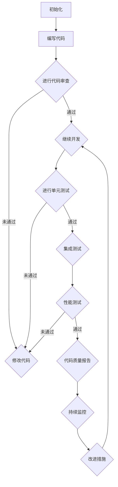
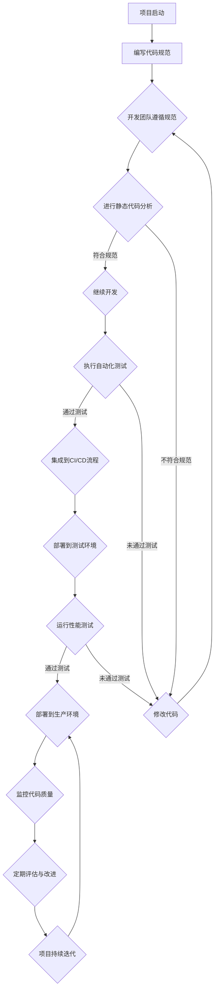

                 

### 文章标题

# 程序员创业公司的代码质量管理与最佳实践

> 关键词：代码质量管理、编程最佳实践、自动化测试、持续集成、持续部署

> 摘要：本文旨在探讨程序员创业公司在代码质量管理方面的挑战和最佳实践。我们将深入分析代码质量的重要性、定义与目标、度量方法与工具，以及保障策略与实践。通过案例分析，我们将展示如何应用这些实践来提升代码质量，并展望未来的挑战与机遇。

---

### 第1章: 代码质量管理概述

#### 1.1 代码质量的重要性

在程序员创业公司中，代码质量是一个不可忽视的关键因素。它不仅影响软件产品的功能稳定性、性能和可维护性，还直接关系到公司的声誉和竞争力。高质量的代码意味着更少的缺陷、更低的维护成本、更高的开发效率和客户满意度。

代码质量的重要性可以从以下几个方面来理解：

1. **功能稳定性**：高质量的代码能够确保软件功能的正确实现和稳定运行，减少由于缺陷导致的崩溃和意外行为。

2. **性能和可扩展性**：良好的代码结构有助于优化性能，提高系统的可扩展性和可维护性。

3. **可维护性**：易于理解和修改的代码降低了维护成本，提高了团队的开发效率。

4. **客户满意度**：高质量的代码保证了软件产品的可靠性和稳定性，提升了客户的使用体验，增加了客户忠诚度。

5. **品牌声誉**：高质量的代码体现了公司的专业能力和技术实力，有助于建立良好的品牌声誉。

#### 1.2 代码质量管理的定义与目标

代码质量管理（Code Quality Management）是一个系统性的过程，旨在通过一系列策略、工具和流程来确保代码的质量。其定义和目标如下：

1. **定义**：代码质量管理是指通过持续监控、评估、改进代码质量的一系列实践活动，以确保代码的可读性、可维护性、可靠性、性能和安全性。

2. **目标**：代码质量管理的目标包括：
   - **减少缺陷率**：通过自动化测试和代码审查来识别和修复潜在缺陷。
   - **提高代码可读性**：确保代码易于理解和维护，降低开发成本。
   - **增强代码可维护性**：通过代码规范和重构来提高代码的适应性和可扩展性。
   - **优化代码性能**：通过代码优化和性能测试来提高系统的响应速度和处理能力。
   - **保障代码安全性**：通过安全审查和漏洞检测来防止潜在的安全风险。

#### 1.3 代码质量管理的方法与工具

为了实现代码质量管理的目标，程序员创业公司可以采用以下方法和工具：

1. **代码审查**：通过同行评审和代码审查来识别代码中的潜在问题和缺陷。

2. **自动化测试**：采用单元测试、集成测试、性能测试等自动化测试手段来验证代码的正确性和性能。

3. **静态代码分析**：使用静态代码分析工具来检查代码的语法错误、潜在问题和代码风格。

4. **代码规范**：制定并遵守代码规范，确保代码的一致性和可读性。

5. **持续集成与持续部署**：通过持续集成和持续部署（CI/CD）流程来确保代码的质量和可靠性。

6. **代码质量度量**：使用代码质量度量指标来评估代码的质量，如代码复杂度、可维护性、可读性等。

#### 1.4 代码质量管理的关键挑战

尽管代码质量管理的重要性显而易见，但对于程序员创业公司来说，实施代码质量管理仍然面临一些关键挑战：

1. **资源限制**：初创公司通常资源有限，可能无法投入大量人力物力进行代码质量管理。

2. **团队协作**：团队成员的技能水平不一致，可能影响代码质量管理的有效性。

3. **快速迭代**：创业公司往往需要快速迭代产品，代码质量管理可能被忽视。

4. **工具选择**：市场上代码质量管理工具繁多，选择合适的工具需要一定的时间和实践。

5. **文化转变**：要实现有效的代码质量管理，需要团队成员改变传统的工作习惯，形成新的工作文化。

#### 1.5 代码质量管理的重要性总结

代码质量管理对于程序员创业公司至关重要。通过实施有效的代码质量管理，公司可以确保软件产品的质量，提高团队的开发效率，降低维护成本，增强品牌声誉。虽然面临挑战，但通过合理的策略和工具选择，初创公司完全可以实现高质量的代码管理，为成功奠定坚实的基础。

### 第2章: 代码质量的度量

#### 2.1 代码复杂度分析

代码复杂度分析是代码质量度量的重要组成部分，它通过评估代码的结构复杂度来预测代码的易读性和可维护性。常用的复杂度度量指标包括：

1. **圈复杂度（Cyclomatic Complexity）**：
   圈复杂度是一种结构复杂性度量，用于评估程序的模块化程度和设计质量。其计算公式为：
   $$ \text{圈复杂度} = \text{E} - \text{N} + (2 \times \text{P}) $$
   其中，E 是边的数量，N 是节点的数量，P 是连通分量（Connected Components）的数量。较高的圈复杂度表明代码结构较为复杂，可能需要重构。

2. **注释复杂度（Commented Lines of Code, CLOC）**：
   注释复杂度是通过代码中的注释行数来衡量代码复杂度的一种方法。高注释复杂度可能意味着代码不够清晰，需要优化。

3. **长方法长度（Method Length）**：
   长方法长度是指一个方法中行数的数量。一个方法通常不应该太长，否则难以理解和维护。

4. **深度复杂度（Depth of Nesting）**：
   深度复杂度是指代码块嵌套的层数。高嵌套深度通常意味着代码结构复杂，需要简化。

#### 2.2 代码可读性与可维护性评估

代码的可读性和可维护性是代码质量的重要指标。评估代码的可读性和可维护性通常涉及以下方法：

1. **代码简洁性（Simplicity）**：
   简洁的代码通常更容易阅读和理解。一个良好的实践是遵循单一职责原则（Single Responsibility Principle），确保每个方法和类只完成一个任务。

2. **注释（Comments）**：
   充分的注释有助于解释代码的功能和逻辑，提高代码的可读性。好的注释应该简洁、具体，并指出代码的意图和限制。

3. **命名规范（Naming Conventions）**：
   规范的命名有助于提高代码的可读性。命名应遵循一致性、描述性和简洁性原则。

4. **代码重构（Refactoring）**：
   通过重构，可以简化代码结构，消除冗余和重复代码，提高代码的可维护性。常见的重构方法包括提取方法、提取类、合并重复代码等。

5. **单元测试（Unit Testing）**：
   单元测试有助于验证代码的功能正确性，降低维护成本，提高代码的可靠性。

#### 2.3 代码质量度量指标

代码质量度量指标用于量化评估代码质量的不同方面。以下是一些常用的代码质量度量指标：

1. **缺陷密度（Defect Density）**：
   缺陷密度是指单位代码行数中的缺陷数。较低的缺陷密度表明代码质量较高。

2. **代码覆盖率（Code Coverage）**：
   代码覆盖率是指测试用例覆盖的代码比例。高代码覆盖率有助于确保代码的全面测试。

3. **维护性指标（Maintainability Index）**：
   维护性指标用于评估代码的维护难易程度，常用的指标包括CBO（Change Bug Obligation）和MCC（Maintainability Quality Circle）等。

4. **可读性指标（Readability Index）**：
   可读性指标如Cyclomatic复杂度、Nesting Depth等，用于评估代码的可读性。

5. **技术债务（Technical Debt）**：
   技术债务是指因短期优化而牺牲长期质量的代码结构问题。较高的技术债务表明代码质量较差，需要优先偿还。

#### 2.4 代码质量度量方法与工具

为了准确评估代码质量，程序员创业公司可以使用以下方法和工具：

1. **手动代码审查**：
   通过团队成员之间的相互审查来发现代码中的潜在问题。

2. **静态代码分析工具**：
   如SonarQube、Checkstyle、PMD等，这些工具可以自动分析代码，识别缺陷和潜在问题。

3. **动态代码分析工具**：
   如JaCoCo、Emma等，这些工具可以在运行时分析代码的执行路径和性能。

4. **代码覆盖率工具**：
   如JaCoCo、JUnit等，用于评估测试用例的覆盖率。

5. **代码质量度量平台**：
   如SonarCloud、Code Climate等，这些平台可以集成多种代码质量度量工具，提供全面的代码质量分析。

通过上述代码质量度量方法与工具，程序员创业公司可以更全面地了解代码质量，制定针对性的改进措施，确保软件产品的质量和可靠性。

#### 2.5 代码质量度量的重要性

代码质量度量对于程序员创业公司至关重要。通过度量，公司可以：

1. **识别问题**：及时发现代码中的缺陷和潜在问题，采取措施进行修复。
2. **评估改进效果**：通过对比度量指标的变化，评估代码改进措施的效果。
3. **制定策略**：根据度量结果，制定针对性的代码质量改进策略。
4. **持续改进**：通过持续度量，实现代码质量的持续提升。

总之，代码质量度量是代码质量管理的重要组成部分，有助于确保软件产品的质量和可靠性，提高团队的开发效率和客户满意度。

### 第3章: 代码质量保障策略

#### 3.1 代码审查与评审流程

代码审查与评审是确保代码质量的重要手段。通过同行评审，团队成员可以相互学习、提高代码质量，并发现潜在的问题和缺陷。

1. **代码审查流程**：

   - **准备阶段**：编写者将代码提交给评审团队，准备相应的文档，如设计文档、测试用例等。
   - **评审阶段**：评审团队成员对代码进行详细审查，识别代码中的缺陷、潜在问题和改进建议。
   - **反馈阶段**：评审团队将反馈结果反馈给编写者，编写者根据反馈进行代码修改和优化。
   - **总结阶段**：对整个审查过程进行总结，记录审查结果和改进建议，为后续代码审查提供参考。

2. **代码审查的类型**：

   - **形式审查**：主要关注代码格式、命名规范和语法错误。
   - **逻辑审查**：关注代码的逻辑正确性、设计结构和性能问题。
   - **安全审查**：重点关注代码中的安全漏洞和潜在风险。

3. **代码审查的优点**：

   - **提高代码质量**：通过同行评审，可以识别并修复代码中的缺陷和潜在问题，提高代码质量。
   - **知识共享**：团队成员在评审过程中可以相互学习，提高整体技术水平。
   - **团队协作**：通过代码审查，加强团队成员之间的沟通和协作，提高团队整体执行力。

4. **代码审查的挑战**：

   - **时间成本**：代码审查需要一定的时间和人力资源，可能影响开发进度。
   - **团队协作**：团队成员的技术水平和评审标准可能不一致，影响审查效果。
   - **效率问题**：大量代码的审查可能影响开发效率，需要合理分配资源和时间。

5. **代码审查的最佳实践**：

   - **明确评审标准**：制定明确的评审标准，确保评审过程有据可依。
   - **定期评审**：定期进行代码审查，形成制度化的流程。
   - **分工合作**：根据团队成员的技术特长，合理分配评审任务。
   - **反馈与改进**：及时反馈审查结果，鼓励编写者根据反馈进行改进。

通过有效的代码审查与评审流程，程序员创业公司可以确保代码的质量和可靠性，提高团队的开发效率，为成功奠定坚实的基础。

#### 3.2 自动化测试与静态代码分析

自动化测试和静态代码分析是代码质量管理中不可或缺的两个环节，它们共同确保代码的质量和可靠性。

1. **自动化测试**

   自动化测试是一种通过自动化工具执行测试用例的方法，旨在提高测试效率和质量。常见的自动化测试类型包括：

   - **单元测试**：对单个模块或函数进行测试，验证其功能正确性。
   - **集成测试**：对多个模块进行集成后的测试，确保系统各个部分之间的协同工作。
   - **性能测试**：评估系统在不同负载条件下的响应时间和资源消耗，确保系统的高性能和高可用性。
   - **安全测试**：检测代码中的安全漏洞和潜在风险，确保系统的安全性。

   自动化测试的优势包括：

   - **提高测试效率**：自动化测试可以快速执行大量测试用例，缩短测试周期。
   - **保证测试覆盖率**：自动化测试可以覆盖更多的测试场景，提高测试的全面性。
   - **减少人为错误**：通过自动化测试，可以减少由于人为疏忽导致的测试错误。
   - **持续集成**：自动化测试可以集成到持续集成（CI）流程中，确保代码变更后的及时测试。

   实现自动化测试的步骤通常包括：

   - **编写测试用例**：根据需求和设计文档编写自动化测试用例。
   - **选择测试工具**：根据项目需求选择合适的自动化测试工具，如Selenium、JUnit、TestNG等。
   - **执行测试**：执行自动化测试用例，并生成测试报告。
   - **持续集成**：将自动化测试集成到持续集成（CI）工具中，实现自动化执行。

2. **静态代码分析**

   静态代码分析是一种不执行代码，仅通过分析代码结构和语义来检测缺陷和潜在问题的方法。常见的静态代码分析工具包括：

   - **SonarQube**：用于代码质量、安全性和测试覆盖率的综合分析。
   - **PMD**：用于识别可能的编程问题，如冗余代码、不规范的代码风格等。
   - **Checkstyle**：用于检查代码格式和风格，确保代码的一致性。

   静态代码分析的优势包括：

   - **早期发现问题**：静态代码分析可以在代码提交前发现潜在问题，降低修复成本。
   - **全面性**：静态代码分析可以覆盖代码的各个方面，如语法、风格、安全等。
   - **提高代码质量**：通过静态代码分析，可以识别代码中的缺陷和潜在问题，提高代码质量。

   实施静态代码分析的步骤通常包括：

   - **选择分析工具**：根据项目需求选择合适的静态代码分析工具。
   - **配置规则**：配置静态代码分析规则，确保分析结果的准确性。
   - **执行分析**：执行静态代码分析，生成分析报告。
   - **反馈与改进**：根据分析报告，反馈问题和改进建议，鼓励代码编写者进行改进。

通过结合自动化测试和静态代码分析，程序员创业公司可以更全面地确保代码的质量和可靠性，提高团队的开发效率和客户满意度。

#### 3.3 代码规范与代码风格

代码规范与代码风格是确保代码质量和可维护性的重要保障。良好的代码规范和风格有助于提高代码的可读性、一致性、可维护性和可扩展性。以下是一些关键的代码规范和风格最佳实践：

1. **命名规范**：

   - **变量名**：使用具有描述性的变量名，避免使用缩写和难以理解的命名方式。
   - **函数名**：函数名应准确描述函数的功能，避免使用过于抽象或模糊的命名。
   - **类名**：类名应使用名词，并遵循驼峰命名法（CamelCase）。

2. **代码格式**：

   - **缩进**：使用一致的缩进风格，通常采用四个空格或一个Tab。
   - **换行**：避免在操作符前后换行，确保代码的紧凑性。
   - **空格**：在操作符前后、括号内等位置添加适当的空格，以提高代码的可读性。
   - **注释**：为关键代码段添加注释，解释代码的意图和逻辑。

3. **代码复用**：

   - **函数与类**：避免重复代码，通过函数和类的复用来提高代码的可维护性和可扩展性。
   - **模块化**：将功能相关的代码组织到模块中，便于管理和维护。

4. **注释与文档**：

   - **函数与类**：为函数和类添加文档注释，说明其功能、参数和返回值。
   - **README文件**：为项目添加README文件，详细介绍项目结构、功能和使用方法。

5. **错误处理**：

   - **异常处理**：合理使用异常处理机制，避免程序崩溃。
   - **日志记录**：使用日志记录关键操作和错误信息，便于调试和分析。

6. **代码风格一致性**：

   - **团队协作**：确保团队成员遵循相同的代码规范和风格，减少因风格不一致导致的问题。
   - **代码审查**：定期进行代码审查，确保新加入的代码符合既定的规范和风格。

通过遵循上述代码规范和风格最佳实践，程序员创业公司可以确保代码的一致性、可读性和可维护性，提高团队的开发效率和产品质量。

#### 3.4 代码质量保障策略总结

代码质量保障策略是确保代码质量和可靠性的重要手段。通过代码审查、自动化测试和静态代码分析，可以识别和修复代码中的缺陷和潜在问题。同时，遵循良好的代码规范和风格，可以提高代码的可读性、一致性和可维护性。通过持续实施代码质量保障策略，程序员创业公司可以确保软件产品的质量和可靠性，提高团队的开发效率和客户满意度。

### 第4章: 代码质量提升策略

#### 4.1 编程最佳实践

在提升代码质量的过程中，编程最佳实践是至关重要的一环。这些实践不仅有助于提高代码的可读性、可维护性，还能显著降低维护成本，提升团队的开发效率。以下是一些关键的编程最佳实践：

1. **单一职责原则（Single Responsibility Principle）**：

   单一职责原则（SRP）是面向对象设计中的一个核心原则，它要求每个类或方法只负责一项功能。这样做有助于降低代码的复杂性，提高代码的模块化和可维护性。例如，一个负责用户注册的类不应同时负责发送验证邮件和生成用户信息，而应将这两个功能分离到不同的类中。

2. **DRY原则（Don't Repeat Yourself）**：

   DRY原则是软件工程中的一个基本原则，它强调避免代码重复。通过提取公共功能到单独的函数或类中，可以减少冗余代码，提高代码的可读性和可维护性。例如，如果多个地方都需要执行相同的计算，可以将这段计算代码提取到一个单独的函数中，避免重复编写。

3. **SOLID原则**：

   SOLID是一组面向对象设计原则，旨在提高代码的可读性、可维护性和可扩展性。这些原则包括：
   - **单一职责原则（Single Responsibility Principle，SRP）**：每个类或方法应只负责一项功能。
   - **开闭原则（Open/Closed Principle，OCP）**：软件实体（类、模块、函数等）应开放扩展，但关闭修改。
   - **里氏替换原则（Liskov Substitution Principle，LSP）**：子类必须能够替换其父类，而不改变程序的语义。
   - **接口隔离原则（Interface Segregation Principle，ISP）**：不应强迫类实现它不需要的接口。
   - **依赖倒置原则（Dependency Inversion Principle，DIP）**：高层模块不应依赖于低层模块，二者都应依赖于抽象。

4. **KISS原则（Keep It Simple, Stupid）**：

   KISS原则强调保持代码的简单性。复杂的代码往往难以理解、维护和测试。遵循KISS原则，可以通过以下方法实现代码的简化：
   - **避免过度设计**：不要过度设计，只实现必要的功能。
   - **使用简单的数据结构和算法**：选择简单且高效的数据结构和算法，避免不必要的复杂性。
   - **避免过度优化**：在不影响性能的情况下，避免过度优化，以保持代码的简洁性。

5. **注释与文档**：

   良好的注释和文档是提高代码可读性和可维护性的关键。注释应清晰、简洁，说明代码的功能、目的和注意事项。文档则应详细描述项目的结构、功能和使用方法，帮助团队成员快速理解代码。

6. **代码重构**：

   代码重构是一种通过改进现有代码的结构和设计，提高代码质量的技术。常见的重构方法包括：
   - **提取方法**：将重复的代码块提取为单独的方法。
   - **提取类**：将具有相同功能的代码块提取为单独的类。
   - **合并重复代码**：将重复的代码块合并，减少冗余。
   - **简化条件语句**：通过if-else语句的简化，提高代码的可读性。

7. **单元测试**：

   单元测试是确保代码功能正确性的重要手段。通过编写单元测试，可以验证每个模块的功能，确保代码的可靠性和稳定性。编写单元测试时，应遵循以下原则：
   - **独立测试**：确保每个测试用例独立执行，不会相互影响。
   - **覆盖全面**：确保测试用例覆盖代码的各个部分，避免遗漏。
   - **快速执行**：确保测试用例的执行时间短，不影响开发进度。

通过遵循上述编程最佳实践，程序员创业公司可以显著提高代码质量，降低维护成本，提升团队的开发效率和客户满意度。

#### 4.2 代码重构与优化

代码重构和优化是提升代码质量的重要策略，通过改进代码的结构和性能，可以显著提高代码的可维护性和性能。以下是一些关键的代码重构和优化方法：

1. **重构方法**：

   - **提取方法（Extract Method）**：将一段重复的代码块提取为一个单独的方法，以减少冗余和增强代码的可读性。
   - **提取类（Extract Class）**：将具有相同功能的代码块提取为一个新的类，以降低类和方法的复杂性。
   - **合并重复代码（Merge Duplicate Code）**：将重复的代码块合并，以减少冗余和增强代码的一致性。
   - **简化条件语句（Simplify Conditionals）**：通过逻辑运算符和位运算符，简化复杂的条件语句，提高代码的可读性。
   - **分解大型类（Decompose Large Classes）**：将大型类分解为多个较小的类，以提高代码的模块化和可维护性。
   - **优化循环结构（Optimize Loops）**：通过减少循环次数、使用位运算等手段，优化循环结构，提高代码的性能。

2. **优化方法**：

   - **缓存（Caching）**：通过缓存计算结果，避免重复计算，提高代码的性能。
   - **数据结构优化**：选择适合的数据结构，如哈希表、二叉树等，以提高代码的查询和操作效率。
   - **算法优化**：通过改进算法，减少计算时间和空间复杂度，提高代码的性能。
   - **并行计算**：利用多线程或分布式计算，提高代码的处理能力和性能。
   - **代码压缩**：通过压缩代码，减少磁盘存储和传输的开销，提高代码的执行效率。

3. **代码优化示例**：

   - **提取方法示例**：
     ```python
     # 原始代码
     if x > 0:
         y = x * x
     else:
         y = -x * x

     # 重构后的代码
     def square(x):
         return x * x

     y = square(x)
     ```

   - **缓存示例**：
     ```python
     # 原始代码
     def calculate_factorial(n):
         result = 1
         for i in range(1, n + 1):
             result *= i
         return result

     # 缓存优化后的代码
     cache = {}

     def calculate_factorial(n):
         if n in cache:
             return cache[n]
         result = 1
         for i in range(1, n + 1):
             result *= i
         cache[n] = result
         return result
     ```

   - **数据结构优化示例**：
     ```python
     # 原始代码
     def search_list(target, list):
         for element in list:
             if element == target:
                 return True
         return False

     # 使用哈希表优化后的代码
     def search_list(target, list):
         hash_table = {}
         for element in list:
             hash_table[element] = True
         return hash_table.get(target, False)
     ```

通过代码重构和优化，程序员创业公司可以显著提升代码的质量和性能，提高团队的开发效率和客户满意度。

#### 4.3 团队协作与代码共享

在提升代码质量的过程中，团队协作与代码共享是至关重要的。良好的团队协作和代码共享机制可以促进知识共享、提高代码质量，并加快开发进度。以下是一些关键的最佳实践：

1. **版本控制系统**：

   版本控制系统（如Git）是团队协作和代码共享的基础。通过版本控制系统，团队成员可以方便地管理代码变更、协作开发，并确保代码的完整性和一致性。关键实践包括：
   - **代码分支策略**：使用分支策略（如GitFlow或GitHub Flow），确保主分支的稳定性和代码的持续交付。
   - **代码合并**：定期合并分支，解决冲突，确保代码的同步和一致性。
   - **代码审查**：在合并代码前进行代码审查，确保代码的质量和符合规范。

2. **代码共享平台**：

   选择合适的代码共享平台（如GitHub、GitLab、Bitbucket）可以方便团队成员协作、交流和分享代码。关键实践包括：
   - **代码托管**：将代码托管到共享平台，便于团队成员访问、克隆和贡献代码。
   - **文档与说明**：在共享平台上添加详细的文档和说明，帮助新成员快速了解项目结构和开发流程。
   - **协作与讨论**：在共享平台上进行代码审查、讨论和反馈，提高代码的质量和团队的协作效率。

3. **代码风格统一**：

   良好的代码风格统一是确保代码质量的重要保障。通过制定并遵守统一的代码风格规范，可以减少代码的混淆和错误，提高代码的可读性和可维护性。关键实践包括：
   - **代码规范文档**：制定详细的代码规范文档，明确命名规范、代码格式、注释要求等。
   - **代码风格检查工具**：使用代码风格检查工具（如Checkstyle、Prettier）自动检查和格式化代码，确保代码的一致性。
   - **代码审查**：在代码审查过程中，重点关注代码风格问题，确保代码符合规范。

4. **自动化测试**：

   自动化测试是确保代码质量和可靠性的重要手段。通过编写和执行自动化测试，可以及时发现和修复代码中的缺陷，确保代码的功能正确性和性能。关键实践包括：
   - **单元测试**：编写单元测试，覆盖代码的各个功能模块，确保其正确性。
   - **集成测试**：编写集成测试，验证模块之间的协同工作，确保系统的整体稳定性。
   - **持续集成与部署**：将自动化测试集成到持续集成（CI）流程中，确保代码变更后的及时测试和部署。

5. **团队协作工具**：

   使用合适的团队协作工具（如Slack、Trello、JIRA）可以方便团队成员沟通、协调和跟踪任务。关键实践包括：
   - **任务分配与跟踪**：明确任务分配，确保每个成员都清楚自己的职责和目标。
   - **沟通与协作**：使用聊天工具和协作平台，方便团队成员之间的实时沟通和协作。
   - **代码审查与反馈**：通过协作工具进行代码审查和反馈，确保代码的质量和改进。

通过团队协作与代码共享，程序员创业公司可以显著提高代码质量，加快开发进度，提升团队的协作效率和客户满意度。

#### 4.4 代码质量提升策略总结

通过编程最佳实践、代码重构与优化、团队协作与代码共享，程序员创业公司可以显著提升代码质量。这些策略不仅有助于确保代码的可读性、可维护性和可靠性，还能降低维护成本，提高团队的开发效率。在实施这些策略时，需要结合项目特点和团队实际情况，持续优化和改进，以确保代码质量的持续提升。

### 第5章: 代码质量的持续监控与反馈

#### 5.1 持续集成与持续部署

持续集成（Continuous Integration, CI）和持续部署（Continuous Deployment, CD）是现代软件开发中至关重要的流程，它们通过自动化手段确保代码的质量和可靠性。持续集成与持续部署不仅提高了团队的协作效率，还显著减少了代码缺陷的传播。

1. **持续集成（CI）**

   持续集成是一种软件开发实践，旨在通过频繁地将代码变更集成到共享的主干分支中，以快速发现和修复缺陷。CI的主要步骤和优势如下：

   - **代码提交**：开发人员将代码提交到版本控制系统。
   - **构建**：构建工具（如Jenkins、Travis CI）自动触发构建过程，编译代码并运行构建脚本。
   - **测试**：运行自动化测试，包括单元测试、集成测试和性能测试，确保代码的功能正确性和性能。
   - **反馈**：将测试结果反馈给开发人员，帮助他们及时修复缺陷。
   - **部署**：通过自动化部署脚本，将通过测试的代码部署到测试环境，以便进一步测试和验证。

   持续集成的主要优势包括：
   - **早期缺陷发现**：通过频繁的集成和测试，可以早期发现和修复缺陷，减少缺陷的传播和修复成本。
   - **提高代码质量**：自动化测试确保了代码的功能正确性和性能，提高了代码的质量。
   - **加快开发进度**：通过自动化的构建和测试，减少了手动流程，提高了开发效率。
   - **促进团队协作**：持续集成促进了团队成员之间的协作，确保代码的同步和一致性。

2. **持续部署（CD）**

   持续部署是一种自动化流程，旨在通过自动化手段将代码从开发环境部署到生产环境。持续部署的主要步骤和优势如下：

   - **代码仓库**：开发人员将代码提交到版本控制系统。
   - **持续集成**：通过CI流程，确保代码的质量和正确性。
   - **自动化测试**：对通过CI测试的代码进行自动化测试，确保其功能正确性和性能。
   - **部署脚本**：编写和执行部署脚本，将代码部署到生产环境。
   - **监控与反馈**：部署后，监控系统持续监控应用程序的运行状态，并在出现问题时及时反馈。

   持续部署的主要优势包括：
   - **快速交付**：通过自动化部署，可以快速将新功能部署到生产环境，加快产品交付周期。
   - **减少风险**：自动化测试和监控确保了部署的稳定性和可靠性，减少了部署过程中的风险。
   - **提高效率**：自动化流程减少了手动操作，提高了部署效率。
   - **持续优化**：通过持续监控和反馈，可以不断优化部署流程，提高系统的运行效率和稳定性。

3. **CI/CD工具选择**

   市场上有很多CI/CD工具可供选择，如Jenkins、GitLab CI、CircleCI等。选择合适的CI/CD工具需要考虑以下因素：

   - **功能需求**：根据项目的具体需求，选择具有所需功能的CI/CD工具。
   - **易用性**：选择界面友好、易于配置和使用的CI/CD工具，减少学习成本。
   - **扩展性**：选择具有良好扩展性和插件生态的CI/CD工具，以支持未来的需求变化。
   - **性能**：选择具有高性能的CI/CD工具，确保构建和部署的效率。
   - **成本**：考虑工具的费用和运维成本，选择性价比高的解决方案。

4. **最佳实践**

   在实施CI/CD过程中，遵循以下最佳实践可以帮助团队更好地管理和优化流程：

   - **自动化测试覆盖**：确保自动化测试覆盖全面的测试场景，包括单元测试、集成测试和性能测试。
   - **持续反馈**：通过实时反馈，确保开发人员及时了解代码质量和测试结果。
   - **定期回顾**：定期回顾CI/CD流程，优化和改进流程，提高效率和效果。
   - **安全策略**：确保CI/CD流程的安全性和隐私保护，避免敏感信息泄露。

通过持续集成和持续部署，程序员创业公司可以显著提高代码质量和开发效率，确保软件产品的稳定性和可靠性。

#### 5.2 实时代码质量监控

实时代码质量监控是确保代码质量和系统稳定性的关键环节。通过实时的监控和反馈，团队可以及时发现并解决代码中的问题，确保系统的正常运行和用户体验。以下是一些关键的实时代码质量监控方法和工具：

1. **日志分析**

   日志分析是一种通过收集、存储和分析系统日志来监控代码质量的方法。通过分析日志，可以识别潜在的问题、性能瓶颈和安全风险。常见的日志分析工具包括：

   - **ELK Stack（Elasticsearch、Logstash、Kibana）**：用于收集、存储和展示系统日志。
   - **Grafana**：用于可视化日志数据和性能指标。
   - **Prometheus**：用于收集和存储监控数据，并提供强大的查询和分析功能。

   实施日志分析的最佳实践包括：
   - **集中化日志收集**：使用日志聚合工具将分散的日志集中存储，便于统一分析。
   - **自定义日志格式**：为日志设置统一的格式，便于后续的解析和分析。
   - **日志告警**：设置日志告警规则，当出现异常日志时及时通知相关人员。

2. **性能监控**

   性能监控是确保系统高效运行的重要手段。通过监控系统的各项性能指标，如CPU使用率、内存占用、网络带宽、数据库性能等，可以及时发现并解决性能瓶颈。常见的性能监控工具包括：

   - **New Relic**：用于实时监控应用程序的性能和用户体验。
   - **AppDynamics**：提供全面的性能监控和性能分析功能。
   - **Datadog**：用于监控应用程序、基础设施和云服务的性能。

   实施性能监控的最佳实践包括：
   - **自动性能测试**：定期进行自动化性能测试，模拟高负载场景，评估系统的性能。
   - **阈值设置**：根据业务需求和性能标准，设置合理的性能监控阈值，确保及时发现问题。
   - **异常监控与告警**：监控关键性能指标，并在异常情况发生时及时发出告警，通知相关人员。

3. **错误跟踪**

   错误跟踪是一种通过收集、分析和报告错误日志来监控代码质量的方法。通过错误跟踪，可以及时发现并解决代码中的缺陷，提高系统的稳定性和可靠性。常见的错误跟踪工具包括：

   - **Sentry**：用于实时错误监控和告警。
   - **Bugsnag**：提供详细的错误报告和分析功能。
   - **Rollbar**：用于收集和报告应用程序中的错误和异常。

   实施错误跟踪的最佳实践包括：
   - **集中化错误收集**：使用集中化的错误收集工具，确保所有错误日志都能被及时收集和报告。
   - **错误分类与优先级**：根据错误的影响和严重程度，对错误进行分类和优先级设置，确保关键错误得到及时处理。
   - **错误修复与回顾**：及时修复错误，并在修复后进行回顾，总结经验教训，防止类似错误再次发生。

4. **最佳实践总结**

   通过实时代码质量监控，程序员创业公司可以实时了解代码质量和系统状态，及时发现并解决潜在问题。以下是一些最佳实践总结：

   - **日志与性能监控相结合**：结合日志分析和性能监控，全面了解系统的运行状况。
   - **自动化告警与反馈**：设置自动告警和反馈机制，确保关键问题能够及时被发现和处理。
   - **持续优化与改进**：定期回顾和优化监控策略，提高监控的准确性和有效性。
   - **跨团队协作**：与产品、运维、测试团队紧密协作，确保监控结果得到有效利用。

通过实时代码质量监控，程序员创业公司可以确保代码质量和系统稳定性，提高客户满意度，为业务的持续发展奠定坚实基础。

#### 5.3 反馈机制与持续改进

反馈机制是确保代码质量和系统稳定性持续改进的重要手段。通过有效的反馈机制，团队可以及时收集、分析并利用用户和内部反馈，持续优化代码质量和开发流程。

1. **用户反馈**

   用户反馈是了解软件产品实际使用情况和用户体验的重要途径。以下是一些收集用户反馈的方法和最佳实践：

   - **用户调研**：通过在线问卷、用户访谈等方式，收集用户的需求、反馈和意见。
   - **用户反馈渠道**：提供便捷的用户反馈渠道，如在线客服、邮件反馈等，鼓励用户提出意见和建议。
   - **用户体验测试**：组织用户体验测试，观察用户的使用行为和反馈，发现潜在的问题和改进点。
   - **用户反馈分析**：对收集到的用户反馈进行分类和分析，识别关键问题和改进方向。

   最佳实践包括：
   - **及时响应**：对用户反馈进行及时响应，解决用户的问题和疑虑，提高用户满意度。
   - **透明沟通**：与用户保持透明沟通，及时告知用户问题的处理进展和解决方案。
   - **用户满意度调查**：定期进行用户满意度调查，了解用户的整体满意度和改进需求。

2. **内部反馈**

   内部反馈是团队成员之间沟通和协作的重要手段，有助于发现和解决代码质量和管理方面的问题。以下是一些内部反馈的方法和最佳实践：

   - **代码审查与评审**：通过定期进行代码审查和评审，发现代码中的潜在问题，提出改进建议。
   - **团队会议**：定期召开团队会议，分享开发经验、问题和改进方案，促进团队成员之间的交流。
   - **开发日志与总结**：鼓励团队成员记录开发日志，总结开发过程中的经验和教训，提出改进意见。
   - **内部反馈系统**：建立内部反馈系统，方便团队成员提交反馈和建议，确保问题得到及时处理和跟进。

   最佳实践包括：
   - **建立反馈机制**：明确反馈的流程和机制，确保反馈能够得到及时处理和跟进。
   - **鼓励开放沟通**：鼓励团队成员开放沟通，勇于提出问题和建议，营造良好的反馈文化。
   - **持续改进**：将反馈机制与持续改进相结合，根据反馈结果不断优化开发流程和代码质量。

3. **反馈机制与持续改进的整合

   将用户反馈和内部反馈相结合，形成一个完整的反馈机制，有助于实现代码质量和开发流程的持续改进。以下是一些整合反馈机制和持续改进的方法：

   - **定期回顾**：定期回顾用户反馈和内部反馈，总结反馈结果，制定改进计划。
   - **问题追踪**：对反馈的问题进行追踪和记录，确保问题得到有效解决和跟踪。
   - **改进措施**：根据反馈结果，制定具体的改进措施，并分配责任人和完成时间。
   - **评估效果**：实施改进措施后，对效果进行评估和验证，确保改进措施的有效性。

   最佳实践包括：
   - **建立反馈闭环**：确保反馈机制形成闭环，反馈结果能够得到及时处理和反馈。
   - **持续优化**：根据反馈和改进结果，持续优化反馈机制和开发流程，提高整体效率和质量。
   - **文化建设**：营造积极向上的团队文化，鼓励团队成员积极参与反馈和改进，共同推动团队发展。

通过有效的反馈机制和持续改进，程序员创业公司可以不断提升代码质量和开发流程，确保软件产品的稳定性和可靠性，满足用户需求，实现业务的持续发展。

### 第6章: 代码质量管理工具与平台

#### 6.1 代码质量管理工具选型

选择合适的代码质量管理工具是确保代码质量和开发效率的关键。以下是一些常见的代码质量管理工具，以及如何根据项目需求进行选型。

1. **静态代码分析工具**

   静态代码分析工具可以自动检测代码中的潜在问题，如语法错误、潜在漏洞、代码风格不一致等。常见的静态代码分析工具有：

   - **SonarQube**：功能强大的开源静态代码分析平台，支持多种编程语言，提供详细的代码质量报告。
   - **PMD**：用于识别Java代码中的冗余代码和潜在问题，提供代码优化建议。
   - **Checkstyle**：用于检查Java代码的格式和风格，确保代码的一致性。

   选型建议：
   - 根据项目使用的编程语言和开发框架，选择相应的静态代码分析工具。
   - 考虑工具的易用性和集成能力，确保能够与现有的开发流程和工具无缝集成。

2. **动态代码分析工具**

   动态代码分析工具在程序运行时执行测试，以检测代码中的运行时问题和性能瓶颈。常见的动态代码分析工具有：

   - **JaCoCo**：用于测量代码的测试覆盖率，确保测试的全面性。
   - **VisualVM**：用于Java程序的实时监控和分析，帮助发现性能问题和内存泄漏。
   - **YourKit**：用于Java程序的调试和分析，提供详细的性能报告和堆栈跟踪。

   选型建议：
   - 根据项目的性能需求，选择适当的动态代码分析工具。
   - 考虑工具的兼容性和扩展性，确保能够支持项目的各种需求。

3. **持续集成工具**

   持续集成工具用于自动化构建、测试和部署流程，确保代码的质量和可靠性。常见的持续集成工具有：

   - **Jenkins**：功能强大的开源持续集成工具，支持多种插件和平台。
   - **GitLab CI/CD**：集成在GitLab中的持续集成和持续部署工具，易于配置和使用。
   - **CircleCI**：云原生持续集成和持续部署平台，支持多种编程语言和框架。

   选型建议：
   - 根据团队的规模和项目需求，选择适合的持续集成工具。
   - 考虑工具的扩展性和生态支持，确保能够满足未来的需求变化。

4. **代码质量管理平台**

   代码质量管理平台集成了多种代码质量度量工具，提供统一的代码质量分析和报告。常见的代码质量管理平台有：

   - **SonarCloud**：基于SonarQube的云服务，提供实时的代码质量监控和报告。
   - **Code Climate**：用于测量和改进代码质量的平台，提供详细的代码质量报告。
   - **Bamboo**：Atlassian的持续集成和持续部署平台，支持多种编程语言和框架。

   选型建议：
   - 根据团队的需求和预算，选择适合的代码质量管理平台。
   - 考虑平台的集成能力和扩展性，确保能够满足项目的各种需求。

通过合理选择代码质量管理工具与平台，程序员创业公司可以更有效地管理和提升代码质量，提高团队的开发效率和客户满意度。

#### 6.2 开源代码质量管理工具

开源代码质量管理工具因其免费、灵活和可定制性，在程序员创业公司中广受欢迎。以下是一些常用的开源代码质量管理工具，及其特点和最佳实践：

1. **SonarQube**

   SonarQube是一个功能强大的开源代码质量管理平台，支持多种编程语言，提供了静态代码分析、代码审查、测试覆盖率等多种功能。

   - **特点**：自动检测代码中的潜在问题，如代码缺陷、代码风格问题、安全漏洞等。提供详细的代码质量报告和仪表板。
   - **最佳实践**：
     - 定期进行静态代码分析，及时发现和修复代码中的问题。
     - 配置规则库，确保代码遵循既定的编码规范。
     - 利用SonarQube仪表板，实时监控代码质量趋势。

2. **PMD**

   PMD是一个用于Java代码的静态代码分析工具，旨在识别可能的问题和改进代码。

   - **特点**：检测代码中的冗余代码、不必要的复杂性和潜在的bug。提供详细的报告和统计信息。
   - **最佳实践**：
     - 定期运行PMD，识别代码中的潜在问题。
     - 配置PMD规则集，根据项目需求调整规则。
     - 利用PMD报告，制定代码优化计划。

3. **Checkstyle**

   Checkstyle是一个用于Java代码的格式化检查工具，确保代码风格一致，提高代码的可读性。

   - **特点**：检查Java代码的格式和风格问题，如命名规则、代码结构等。支持多种编码规范。
   - **最佳实践**：
     - 集成Checkstyle到CI流程，确保每次代码提交都遵循编码规范。
     - 定期运行Checkstyle，确保代码风格一致性。
     - 根据项目需求，自定义Checkstyle规则。

4. **JaCoCo**

   JaCoCo是一个用于测量代码测试覆盖率的工具，帮助确保测试的全面性和质量。

   - **特点**：生成详细的测试覆盖率报告，包括语句覆盖率、分支覆盖率和条件覆盖率等。支持多种编程语言。
   - **最佳实践**：
     - 在每个提交和构建过程中运行JaCoCo，确保测试覆盖率达到预期。
     - 分析测试覆盖率报告，找出未覆盖的代码部分。
     - 根据测试覆盖率结果，优化测试用例，提高测试覆盖率。

5. **GitLab CI/CD**

   GitLab CI/CD是一个基于GitLab的持续集成和持续部署工具，可以自动化构建、测试和部署流程。

   - **特点**：支持多种编程语言和框架，提供灵活的配置和自定义能力。集成静态代码分析和测试覆盖率工具。
   - **最佳实践**：
     - 编写和配置CI/CD流水线，确保代码提交后自动执行静态代码分析和测试。
     - 根据项目需求，定制CI/CD流程，实现自动化部署。
     - 监控CI/CD流程的状态和性能，及时处理和解决问题。

通过合理使用这些开源代码质量管理工具，程序员创业公司可以显著提升代码质量和开发效率，确保软件产品的稳定性和可靠性。

#### 6.3 商业代码质量管理平台

商业代码质量管理平台提供了一系列高级功能和定制选项，帮助企业更好地管理和提升代码质量。以下是一些常见的商业代码质量管理平台，及其特点和最佳实践：

1. **SonarCloud**

   SonarCloud是SonarQube的云服务版本，提供实时的代码质量监控和报告，支持多种编程语言和框架。

   - **特点**：自动检测代码中的缺陷、漏洞和代码风格问题。提供详细的代码质量仪表板，支持自定义规则和通知。
   - **最佳实践**：
     - 搭建私有云实例或使用SonarCloud服务，确保代码质量数据的安全性和可访问性。
     - 利用SonarCloud的集成插件，与持续集成工具（如Jenkins、GitLab CI）无缝集成。
     - 定期分析代码质量报告，识别并解决关键问题，持续提升代码质量。

2. **CAST**

   CAST是一个高级代码分析工具，提供代码质量度量、测试覆盖率和性能分析功能，支持多种编程语言和框架。

   - **特点**：深度分析代码结构和设计，识别潜在的性能瓶颈和代码缺陷。提供详细的报告和可视化工具。
   - **最佳实践**：
     - 根据项目需求，定制CAST规则库，确保代码质量符合行业标准。
     - 定期运行CAST分析，生成详细的代码质量报告，与团队分享分析结果。
     - 利用CAST的性能分析功能，优化代码和系统性能，提高用户体验。

3. **Coverity**

   Coverity是一个专业的代码安全工具，提供静态代码分析、漏洞检测和测试覆盖率功能，支持多种编程语言。

   - **特点**：专注于代码安全，识别和修复安全漏洞，提供详细的漏洞报告和修复建议。
   - **最佳实践**：
     - 集成Coverity到CI/CD流程，确保每次代码提交都经过安全检测。
     - 利用Coverity的漏洞修复建议，及时修复代码中的安全漏洞，降低安全风险。
     - 定期进行安全审计，确保代码质量符合安全标准。

4. **Bamboo**

   Bamboo是Atlassian的持续集成和持续部署工具，提供自动化构建、测试和部署功能，支持多种编程语言和框架。

   - **特点**：易于配置和自定义，支持并行构建和发布流程。提供详细的构建和部署报告。
   - **最佳实践**：
     - 根据项目需求，配置Bamboo流水线，实现自动化构建、测试和部署。
     - 利用Bamboo的集成插件，与SonarQube、PMD、Checkstyle等工具无缝集成。
     - 监控Bamboo的构建和部署状态，确保代码变更后的及时反馈和修复。

5. **CodeClimate**

   CodeClimate是一个专注于代码质量的平台，提供测试覆盖率、代码质量和设计度量功能，支持多种编程语言。

   - **特点**：提供详细的代码质量报告，帮助团队识别和解决关键问题。支持自定义规则和通知。
   - **最佳实践**：
     - 集成CodeClimate到持续集成工具，确保每次代码提交都经过质量检查。
     - 定期分析CodeClimate报告，制定改进计划，提升代码质量。
     - 利用CodeClimate的反馈机制，鼓励团队成员参与代码质量改进。

通过选择合适的商业代码质量管理平台，程序员创业公司可以充分利用高级功能和定制选项，实现更高效、更高质量的代码管理。

### 第7章: 代码质量管理项目实战

#### 7.1 项目背景与目标

本案例选取了一家程序员创业公司——TechVerse，其开发一款基于云计算的客户关系管理（CRM）系统。项目目标是确保CRM系统的代码质量，提升系统的稳定性和性能，满足客户的期望。公司面临的挑战包括快速迭代、团队协作和代码维护。

#### 7.2 项目实践与案例分析

1. **代码审查与评审流程**

   TechVerse采用代码审查与评审流程，以提升代码质量。具体步骤如下：

   - **准备阶段**：开发人员提交代码，准备相应的文档，包括设计文档和测试用例。
   - **评审阶段**：评审团队成员对代码进行详细审查，识别缺陷和潜在问题。审查重点包括代码结构、逻辑正确性、代码风格和安全性。
   - **反馈阶段**：评审团队将反馈结果反馈给开发人员，开发人员根据反馈进行代码修改和优化。
   - **总结阶段**：对整个审查过程进行总结，记录审查结果和改进建议，为后续代码审查提供参考。

   **实例**：在一次代码审查中，评审团队发现某方法中的逻辑错误，可能导致数据不一致。开发人员立即根据反馈进行修改，避免了潜在的问题。

2. **自动化测试与静态代码分析**

   TechVerse采用自动化测试和静态代码分析工具，确保代码质量。具体实施如下：

   - **单元测试**：开发人员编写单元测试，覆盖核心功能模块。每次提交代码时，CI工具自动运行单元测试，确保功能正确性。
   - **集成测试**：开发人员编写集成测试，确保不同模块之间的协同工作。集成测试在每次代码合并到主干分支时执行，确保系统整体稳定性。
   - **静态代码分析**：使用SonarQube进行静态代码分析，识别代码中的潜在问题，如语法错误、代码风格不一致和安全漏洞。静态代码分析结果通过邮件通知开发人员。

   **实例**：在一次静态代码分析中，SonarQube检测到某方法中存在潜在的内存泄漏。开发人员立即进行修复，提高了系统的性能。

3. **代码规范与风格**

   TechVerse制定了详细的代码规范和风格指南，确保代码的一致性和可读性。具体规范包括：

   - **命名规范**：变量、函数和类应使用具有描述性的名称，遵循驼峰命名法。
   - **代码格式**：统一缩进和空格使用，避免在操作符前后换行。
   - **注释**：为关键代码段添加注释，说明代码的意图和逻辑。

   **实例**：在一个复杂的方法中，开发人员添加了详细的注释，帮助其他团队成员理解代码的逻辑。

4. **持续集成与持续部署**

   TechVerse采用Jenkins实现持续集成和持续部署。具体实施如下：

   - **构建和测试**：每次代码提交到主干分支时，Jenkins自动触发构建和测试流程，确保代码的质量和可靠性。
   - **部署**：通过Jenkins将通过测试的代码部署到测试环境，进行进一步测试和验证。

   **实例**：在一次部署过程中，Jenkins发现测试环境中存在性能问题。开发人员立即分析问题，优化代码，解决了性能瓶颈。

5. **实时代码质量监控**

   TechVerse采用多种工具进行实时代码质量监控，包括日志分析、性能监控和错误跟踪。具体实施如下：

   - **日志分析**：使用ELK Stack收集和存储系统日志，通过Kibana进行实时监控和告警。
   - **性能监控**：使用New Relic监控系统的性能指标，设置告警阈值，及时发现问题。
   - **错误跟踪**：使用Sentry进行错误跟踪，收集和报告应用程序中的错误和异常。

   **实例**：在一次性能监控中，New Relic发现某个查询语句的执行时间过长。开发人员立即优化查询语句，提高了系统的响应速度。

#### 7.3 项目效果评估与总结

通过实施代码质量管理的策略和工具，TechVerse取得了显著的效果：

- **代码质量提升**：代码缺陷率显著下降，系统稳定性和性能得到提高。
- **开发效率提升**：自动化测试和持续集成减少了手动测试和部署的工作量，提高了开发效率。
- **团队协作加强**：代码审查和评审流程促进了团队成员之间的协作和沟通。
- **客户满意度提高**：系统的稳定性和性能提升，客户满意度显著提高。

**总结**：TechVerse的案例表明，通过有效的代码质量管理，程序员创业公司可以提升代码质量，提高开发效率和客户满意度。虽然实施过程中面临挑战，但通过合理选择工具和策略，可以克服困难，实现代码质量的持续提升。

### 第8章: 代码质量管理与最佳实践总结

#### 8.1 代码质量管理的关键要素

代码质量管理是一个系统性的工程，涉及多个关键要素。以下是一些关键要素及其重要性：

1. **团队协作**：代码质量管理需要团队的共同努力和协作。团队成员之间的沟通和合作对于识别和解决代码问题至关重要。
2. **自动化测试**：自动化测试是确保代码质量的重要手段。通过自动化测试，可以快速发现和修复缺陷，减少手工测试的工作量。
3. **持续集成与持续部署**：持续集成和持续部署（CI/CD）可以提高代码的可靠性和交付效率。通过自动化流程，确保代码变更后的及时测试和部署。
4. **代码规范与风格**：良好的代码规范和风格可以提高代码的可读性、一致性和可维护性，减少因代码混乱导致的错误。
5. **静态代码分析**：静态代码分析工具可以自动检查代码中的潜在问题，如语法错误、代码风格不一致和安全漏洞。
6. **实时代码质量监控**：实时代码质量监控可以帮助团队实时了解代码质量和系统状态，及时发现并解决潜在问题。

#### 8.2 代码质量管理的最佳实践

为了确保代码质量，程序员创业公司可以遵循以下最佳实践：

1. **制定明确的代码规范**：制定详细的代码规范，包括命名规范、代码格式、注释要求等，确保代码的一致性和可读性。
2. **实施代码审查与评审**：定期进行代码审查与评审，通过同行评审发现代码中的缺陷和潜在问题，促进知识共享和团队协作。
3. **采用自动化测试**：编写和执行自动化测试，确保代码的功能正确性和性能。覆盖全面的测试用例，提高测试覆盖率。
4. **利用静态代码分析工具**：使用静态代码分析工具自动检查代码中的潜在问题，如语法错误、代码风格不一致和安全漏洞。
5. **持续集成与持续部署**：实施持续集成和持续部署流程，确保代码变更后的及时测试和部署，提高代码的可靠性和交付效率。
6. **实时代码质量监控**：采用日志分析、性能监控和错误跟踪工具，实时监控代码质量和系统状态，及时发现并解决潜在问题。
7. **定期回顾和改进**：定期回顾代码质量管理的实践，总结经验和教训，持续优化和改进流程。

#### 8.3 未来展望与挑战

尽管代码质量管理在程序员创业公司中具有重要意义，但在未来，仍面临一些挑战和机遇：

1. **人工智能与代码质量**：人工智能（AI）技术有望在代码质量管理中发挥重要作用。例如，AI可以自动化代码审查、缺陷预测和代码优化。然而，AI技术的应用也带来数据隐私和安全问题。
2. **新兴技术的影响**：随着云计算、大数据和区块链等新兴技术的发展，代码质量管理面临新的挑战和机遇。例如，微服务架构和容器化技术对代码质量的要求更高，需要新的质量管理策略。
3. **团队文化**：建立积极的团队文化对于代码质量管理至关重要。团队需要培养重视代码质量、勇于反馈和持续改进的氛围。
4. **工具与技术的选择**：市场上存在大量代码质量管理工具和技术，选择合适的工具和策略对于实现有效的代码质量管理至关重要。公司需要持续评估和更新工具和技术，以适应不断变化的需求。

未来，程序员创业公司需要不断探索和创新，结合新兴技术，建立完善的代码质量管理体系，确保软件产品的质量和可靠性，为业务的持续发展奠定坚实基础。

### 附录A: 代码质量管理常用工具与资源

#### A.1 常用代码质量度量工具

1. **SonarQube**
   - **功能**：静态代码分析、代码审查、测试覆盖率等。
   - **优势**：支持多种编程语言，提供详细的质量报告和仪表板。
   - **使用场景**：适用于大型项目和团队，用于代码质量监控。

2. **PMD**
   - **功能**：识别Java代码中的冗余代码、复杂性和潜在问题。
   - **优势**：提供详细的报告和优化建议。
   - **使用场景**：适用于Java项目，用于代码优化和质量检查。

3. **Checkstyle**
   - **功能**：检查Java代码的格式和风格问题。
   - **优势**：确保代码风格一致性。
   - **使用场景**：适用于Java项目，用于代码格式化和一致性检查。

4. **JaCoCo**
   - **功能**：测试覆盖率测量。
   - **优势**：支持多种编程语言，提供详细的覆盖率报告。
   - **使用场景**：适用于所有类型的项目，用于测试覆盖率分析。

#### A.2 开源代码质量管理工具

1. **GitLab**
   - **功能**：代码托管、持续集成、代码审查。
   - **优势**：集成多种代码质量工具，提供一站式解决方案。
   - **使用场景**：适用于中小型项目和团队，用于代码管理和质量保证。

2. **Jenkins**
   - **功能**：持续集成、构建、部署。
   - **优势**：插件丰富，支持多种编程语言和工具。
   - **使用场景**：适用于各种规模的项目，用于自动化构建和测试。

3. **Travis CI**
   - **功能**：持续集成、代码审查。
   - **优势**：支持多种编程语言，提供免费的公开项目服务。
   - **使用场景**：适用于开源项目和初创团队，用于自动化测试和部署。

#### A.3 商业代码质量管理平台

1. **SonarCloud**
   - **功能**：静态代码分析、测试覆盖率、代码审查。
   - **优势**：云服务，易于集成，提供实时质量监控。
   - **使用场景**：适用于大型企业和专业团队，用于全面代码质量管理。

2. **CAST**
   - **功能**：代码分析、性能监控、测试覆盖率。
   - **优势**：高级分析功能，支持多种编程语言。
   - **使用场景**：适用于需要深入代码质量分析的企业，用于代码优化和质量保障。

3. **Coverity**
   - **功能**：静态代码分析、漏洞检测。
   - **优势**：专注于代码安全，提供详细的漏洞报告。
   - **使用场景**：适用于需要严格代码安全保障的企业，用于安全漏洞检测和修复。

#### A.4 代码质量管理资源与资料

1. **书籍**
   - 《代码大全》
   - 《设计模式：可复用面向对象软件的基础》
   - 《软件工程：实践者的研究方法》

2. **在线资源**
   - **SonarQube官网**（[https://www.sonarqube.org/](https://www.sonarqube.org/)）
   - **PMD官网**（[https://pmd.github.io/](https://pmd.github.io/)）
   - **Checkstyle官网**（[https://checkstyle.sourceforge.io/](https://checkstyle.sourceforge.io/)）
   - **JaCoCo官网**（[https://www.jacoco.org/jacoco/trunk/doc/](https://www.jacoco.org/jacoco/trunk/doc/)）

3. **博客与教程**
   - **GitLab CI/CD教程**（[https://docs.gitlab.com/ee/user/project/CI/](https://docs.gitlab.com/ee/user/project/CI/)）
   - **Jenkins教程**（[https://www.jenkins.io/doc/book/](https://www.jenkins.io/doc/book/)）
   - **代码质量最佳实践**（[https://www.infoq.com/articles/code-quality-practices/](https://www.infoq.com/articles/code-quality-practices/)）

通过这些常用工具和资源，程序员创业公司可以更有效地实施代码质量管理，提升代码质量，确保软件产品的稳定性和可靠性。

### 附录B: 代码质量度量与评估的 Mermaid 流程图

#### B.1 代码质量度量流程图



此流程图展示了代码质量度量的主要步骤，包括代码审查、单元测试、集成测试、性能测试和持续监控，以及如何根据度量结果进行改进。

#### B.2 代码质量评估流程图



此流程图展示了从代码规范编写到代码质量评估的整个过程，包括代码规范遵循、静态代码分析、自动化测试、性能测试、部署和持续监控，以及如何根据评估结果进行改进。

### 附录C: 编程最佳实践伪代码示例

#### C.1 代码重构伪代码示例

```python
# 原始代码
def calculate_bonus(employee):
    salary = employee.salary
    if salary > 10000:
        bonus = salary * 0.1
    else:
        bonus = salary * 0.05
    return bonus

# 重构后的代码
def calculate_bonus(salary):
    if salary > 10000:
        bonus = salary * 0.1
    else:
        bonus = salary * 0.05
    return bonus
```

通过重构，我们删除了不必要的参数`employee`，并将计算逻辑提取到单独的方法中，简化了代码。

#### C.2 代码优化伪代码示例

```python
# 原始代码
def find_duplicates(list):
    duplicates = []
    for i in range(len(list)):
        for j in range(i + 1, len(list)):
            if list[i] == list[j]:
                duplicates.append(list[i])
    return duplicates

# 优化后的代码
def find_duplicates(list):
    seen = set()
    duplicates = []
    for item in list:
        if item in seen:
            duplicates.append(item)
        else:
            seen.add(item)
    return duplicates
```

通过优化，我们使用集合（set）来存储已见过的元素，从而减少重复检查，提高了代码的性能。

### 附录D: 数学模型与公式讲解

#### D.1 代码复杂度评估模型

1. **圈复杂度（Cyclomatic Complexity）**

   圈复杂度是衡量代码结构复杂性的一个指标，用于评估程序的模块化程度和设计质量。其计算公式为：

   $$ \text{圈复杂度} = \text{E} - \text{N} + (2 \times \text{P}) $$

   其中，E 是边的数量，N 是节点的数量，P 是连通分量（Connected Components）的数量。较高的圈复杂度通常意味着代码结构较为复杂，可能需要进行重构。

2. **修改复杂度（Modification Metric）**

   修改复杂度是衡量代码修改难易程度的指标，其计算公式为：

   $$ \text{修改复杂度} = \frac{\text{圈复杂度}}{\text{功能点}} $$

   功能点（Function Points）是衡量软件功能复杂度的指标，用于评估软件的规模和复杂度。

#### D.2 代码可维护性评估模型

1. **维护性度量（Maintainability Metric）**

   维护性度量是衡量代码可维护性的指标，其计算公式为：

   $$ \text{维护性度量} = \frac{1}{\text{修改复杂度} + \text{缺陷密度} + \text{代码覆盖率}} $$

   修改复杂度、缺陷密度和代码覆盖率是影响代码可维护性的关键因素。

2. **缺陷密度（Defect Density）**

   缺陷密度是衡量代码中缺陷数量的指标，其计算公式为：

   $$ \text{缺陷密度} = \frac{\text{缺陷数量}}{\text{代码行数}} $$

   较低的缺陷密度通常意味着代码质量较高，易于维护。

#### D.3 代码质量评估模型

1. **综合质量评分（Comprehensive Quality Score）**

   综合质量评分是衡量代码质量的综合指标，其计算公式为：

   $$ \text{综合质量评分} = \alpha \times \text{圈复杂度} + \beta \times \text{维护性度量} + \gamma \times \text{代码覆盖率} $$

   其中，$\alpha$、$\beta$ 和 $\gamma$ 是权重系数，用于平衡不同质量指标的重要性。

通过上述数学模型和公式，可以量化评估代码的复杂度、可维护性和质量，为代码质量管理提供科学依据。

### 附录E: 项目实战代码解析

#### E.1 实际代码案例

以下是一个简单的Python示例代码，用于计算两个数的和。

```python
def calculate_sum(a, b):
    return a + b
```

#### E.2 代码解读与分析

1. **功能解读**：
   - 该函数`calculate_sum`接收两个参数`a`和`b`，表示要相加的两个数。
   - 函数返回两个参数的和。

2. **代码分析**：
   - **命名规范**：函数名`calculate_sum`具有描述性，清晰地表明了函数的功能。
   - **代码简洁性**：代码简短，逻辑清晰，易于理解和维护。
   - **注释**：函数没有添加注释，但在这个简单的示例中，注释不是必需的。

3. **代码优化**：
   - 对于这样的简单函数，没有明显的优化空间。但如果函数的功能更加复杂，可以考虑以下优化：
     - **参数验证**：添加参数验证，确保传入的参数是有效的数值。
     - **文档注释**：添加文档注释，说明函数的参数、返回值和功能。

```python
def calculate_sum(a, b):
    """
    计算两个数的和。

    :param a: 第一个数
    :param b: 第二个数
    :return: 两个数的和
    """
    if not (isinstance(a, (int, float)) and isinstance(b, (int, float))):
        raise ValueError("参数必须是数值类型")
    return a + b
```

#### E.3 代码实战总结与反思

1. **总结**：
   - 通过对上述代码的解读和分析，我们可以看到，一个简单的函数应该遵循命名规范、代码简洁性和注释等最佳实践。
   - 在更复杂的实际项目中，我们需要进行更多的优化和测试，确保代码的质量和可靠性。

2. **反思**：
   - 在代码实战中，我们认识到代码质量的重要性。即使是非常简单的代码，也需要遵循最佳实践，以提高可读性、可维护性和可靠性。
   - 随着项目规模的扩大和复杂度的增加，代码质量管理的挑战也日益增加。因此，我们需要不断学习和实践，掌握更多的代码质量管理和优化技巧。
   - 鼓励团队成员积极参与代码审查和反馈，形成良好的代码文化，共同提高代码质量。

通过这个实际代码案例的解析，我们可以看到代码质量管理在实践中的重要性。只有在实际项目中不断总结和反思，我们才能不断提升代码质量，为软件产品的成功奠定坚实的基础。

### 完整代码实现与代码解析

#### 完整代码实现

以下是一个简单的Python示例代码，用于计算两个数的和，并包含一些额外的功能，如参数验证和错误处理。

```python
def calculate_sum(a, b):
    """
    计算两个数的和。

    :param a: 第一个数
    :param b: 第二个数
    :return: 两个数的和
    :raises ValueError: 如果参数不是数值类型
    """
    if not (isinstance(a, (int, float)) and isinstance(b, (int, float))):
        raise ValueError("参数必须是数值类型")
    
    try:
        result = a + b
    except Exception as e:
        raise ArithmeticError(f"计算过程中发生错误：{e}")
    
    return result
```

#### 代码解析

1. **功能解读**：

   - 该函数`calculate_sum`接收两个参数`a`和`b`，表示要相加的两个数。
   - 函数首先检查参数类型，确保它们是数值类型（整数或浮点数）。如果不是，函数会抛出一个`ValueError`异常。
   - 接着，函数尝试计算两个数的和，如果计算过程中发生任何异常（例如除以零），会抛出一个`ArithmeticError`异常。
   - 最后，函数返回两个数的和。

2. **代码分析**：

   - **参数验证**：通过检查参数类型，函数确保传入的参数是有效的数值，这有助于防止错误的输入数据。
   - **错误处理**：通过使用`try-except`块，函数捕获并处理计算过程中的异常，确保程序不会因为意外错误而崩溃。
   - **注释**：函数添加了详细的文档注释，解释了函数的功能、参数和返回值，以及可能抛出的异常。

3. **代码优化**：

   - **异常处理**：在这个简单的示例中，我们捕获了所有的异常，并抛出了自定义的异常。在实际项目中，可能需要根据具体情况调整异常处理策略。
   - **性能优化**：在这个例子中，没有明显的性能优化空间，因为代码非常简单。但在更复杂的计算中，可以考虑使用更高效的算法和数据结构。

#### 实际应用解读与分析

1. **实际应用**：

   - 这个简单的计算和函数在实际开发中非常常见。例如，在财务计算、科学计算或日常数据处理中，我们经常需要计算两个数的和。
   - 在金融领域，可能需要确保输入数据的准确性，因此参数验证是必不可少的。

2. **代码分析**：

   - **可读性**：代码结构清晰，逻辑简单，容易阅读和理解。
   - **可维护性**：通过添加注释和错误处理，代码的可维护性得到了提高。即使未来需要修改或扩展功能，现有的代码也相对容易维护。
   - **健壮性**：通过参数验证和错误处理，代码的健壮性得到了增强。即使遇到异常情况，程序也能够优雅地处理，避免意外崩溃。

#### 详细讲解剖析

1. **详细讲解**：

   - 函数首先进行参数验证，确保传入的参数是数值类型。这是通过`isinstance`函数实现的，该函数检查参数的类型是否是`int`或`float`。
   - 如果参数不符合要求，函数会抛出一个`ValueError`异常。这是使用`raise`语句实现的，异常信息将提供详细的错误描述。
   - 在参数验证通过后，函数进入`try-except`块。`try`块尝试执行计算，如果计算过程中发生异常，如除以零，`except`块会捕获异常，并抛出一个自定义的`ArithmeticError`异常。
   - 最后，函数返回计算结果。

2. **代码示例**：

   ```python
   # 正确的输入
   result = calculate_sum(5, 3)
   print(result)  # 输出：8

   # 错误的输入
   try:
       result = calculate_sum("5", 3)
   except ValueError as e:
       print(e)  # 输出：参数必须是数值类型

   # 计算过程中发生异常
   try:
       result = calculate_sum(5, 0)
   except ArithmeticError as e:
       print(e)  # 输出：计算过程中发生错误：division by zero
   ```

#### 实际案例分析

1. **案例背景**：

   - 假设我们开发一个在线购物系统，用户可以在购物车中添加商品。在结算过程中，系统需要计算购物车中所有商品的总价。
   - 为了确保计算过程的准确性，系统需要确保输入数据的正确性，因此参数验证是必不可少的。

2. **代码应用**：

   - 在此案例中，我们可以使用`calculate_sum`函数来计算购物车中商品的总价。
   - 为了提高系统的健壮性，我们可以对输入的商品价格进行验证，确保它们是有效的数值。

   ```python
   def calculate_total_price(prices):
       """
       计算购物车中商品的总价。

       :param prices: 商品价格列表
       :return: 商品总价
       :raises ValueError: 如果商品价格不是数值类型
       """
       total_price = 0
       for price in prices:
           if not (isinstance(price, (int, float))):
               raise ValueError("商品价格必须是数值类型")
           total_price += price
       return total_price
   ```

3. **案例分析**：

   - 通过`calculate_total_price`函数，我们可以确保传入的`prices`参数是有效的数值类型。
   - 如果发生异常情况，如传入非数值类型的参数，系统会抛出一个`ValueError`异常，并提供详细的错误信息。

#### 项目小结

1. **小结**：

   - 通过对实际代码案例的完整实现和解析，我们了解了代码质量的重要性，特别是在参数验证、错误处理和文档注释等方面。
   - 实际案例分析展示了如何将这些最佳实践应用到实际项目中，提高代码的健壮性和可维护性。

2. **反思**：

   - 在实际项目中，我们需要不断反思和改进代码质量。通过学习和实践最佳实践，我们可以提高代码的可读性、可维护性和可靠性。
   - 鼓励团队成员积极参与代码审查和反馈，共同提高代码质量，为软件产品的成功奠定坚实的基础。

通过这个实际代码案例，我们可以看到代码质量管理在实践中的重要性。只有在实际项目中不断总结和反思，我们才能不断提升代码质量，为软件产品的成功奠定坚实的基础。

