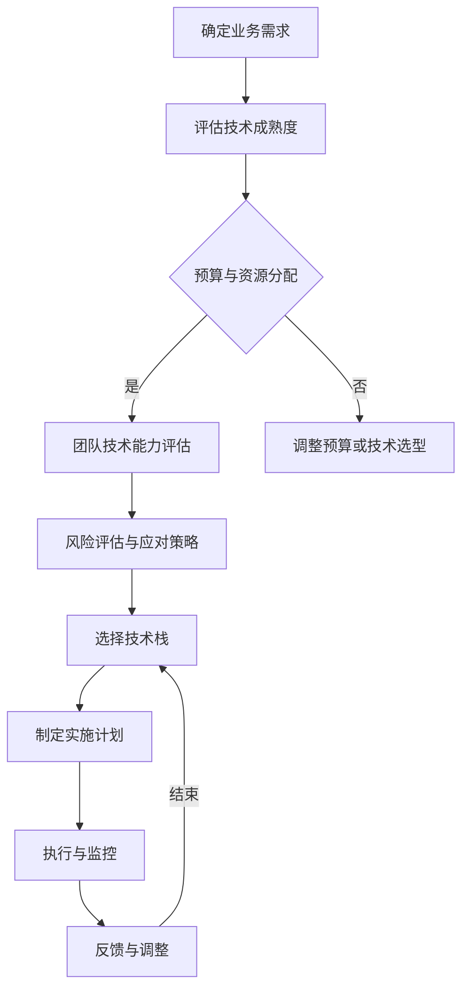

                 

### 文章标题

《程序员创业公司的技术栈选择与长期规划》

### 关键词

程序员创业、技术栈选择、长期规划、前端技术、后端技术、数据库、架构设计、性能优化、安全性提升、负载均衡、云计算、容器化、微服务架构

### 摘要

本文旨在为程序员创业公司提供技术栈选择和长期规划的指导。首先，分析程序员创业公司的现状与面临的挑战，介绍技术栈的基本概念和组成。接着，详细探讨技术栈选择的考量因素，包括业务需求分析、技术成熟度评估、预算与资源分配、团队技术能力评估以及风险评估与应对策略。随后，介绍主流技术栈及其应用，并通过实际案例进行选型解析。最后，阐述技术栈的长期规划与优化策略，包括性能优化、安全性提升、负载均衡与伸缩性设计等，并结合成功案例分享经验。全文旨在帮助创业者做出科学合理的技术决策，确保公司技术栈的可持续发展和竞争优势。

### 第一部分：引言与背景

#### 1.1 程序员创业公司的现状与挑战

近年来，随着互联网和科技产业的迅猛发展，程序员创业成为了一个备受关注的现象。许多程序员选择离开大公司，追求自己的创业梦想，希望通过技术创新解决实际问题。然而，创业之路并非一帆风顺，尤其是在技术方面面临着诸多挑战。

首先，程序员创业公司的技术趋势呈现出多样化和专业化的发展态势。一方面，新兴技术和框架层出不穷，如前端领域的React、Vue、Angular等；另一方面，后端技术也不断发展，如Node.js、Django、Flask等。这些技术的更新换代速度快，程序员需要不断学习和适应，以确保公司技术栈的先进性和竞争力。

其次，程序员创业公司在创业过程中面临的技术挑战主要集中在以下几个方面：

1. **技术选择与决策**：初创公司在技术选择上往往缺乏经验和资源，需要在众多技术方案中做出明智的选择，以确保技术栈的稳定性和可持续性。
2. **技术团队组建与培养**：初创公司的技术团队通常规模较小，需要快速组建并培养具有高技术能力的人才，以支持公司的业务发展。
3. **技术债务与风险管理**：技术债务是初创公司常见的现象，如果不及时管理和控制，可能会影响公司的长期发展。因此，如何合理管理技术债务、降低风险成为创业者必须面对的问题。
4. **技术迭代与升级**：随着市场的变化和用户需求的变化，初创公司需要不断迭代和升级技术栈，以保持产品的竞争力。然而，这往往需要大量的时间和资源投入。

#### 1.2 技术栈的基本概念

技术栈是指在一项软件开发工作中使用的一系列技术工具、编程语言、框架和平台的总称。它是一个完整的技术解决方案，涵盖了前端、后端、数据库、服务器、容器、云服务等多个层面。

**技术栈的组成与分类**：

1. **前端技术栈**：主要包括HTML、CSS、JavaScript等基本技术，以及如React、Vue、Angular等现代前端框架。
2. **后端技术栈**：包括服务器端编程语言如Node.js、Python、Java等，以及相关的框架和库。
3. **数据库技术栈**：分为关系型数据库（如MySQL、PostgreSQL）和非关系型数据库（如MongoDB、Redis）。
4. **架构设计**：包括微服务架构、容器化与容器编排、云计算等高级技术。
5. **辅助工具与平台**：如版本控制系统（Git）、持续集成与持续部署（CI/CD）工具、云服务平台等。

**技术栈与业务发展的关系**：

技术栈不仅仅是实现业务功能的技术工具集合，它还直接影响到公司的业务发展。一个合理的技术栈可以帮助公司快速响应市场需求，提高开发效率，降低成本，从而增强公司的竞争力。同时，技术栈的选择也需要考虑未来的业务扩展和技术演进，以确保技术栈的可扩展性和灵活性。

例如，对于一个初创公司来说，选择一个成熟稳定的技术栈可以帮助团队更快地进入市场，降低开发风险。然而，如果公司未来业务发展迅速，需要应对不断变化的市场需求，则可能需要逐步迭代和升级技术栈，以适应新的业务场景。

#### 1.3 技术栈选择的重要性

技术栈选择是程序员创业公司必须面对的关键决策，它关系到公司的长期发展和成功。以下是技术栈选择的重要性：

1. **业务敏捷性**：一个合理的技术栈可以提高公司的业务敏捷性，帮助团队快速响应市场变化和用户需求，从而在激烈的市场竞争中占据优势。
2. **开发效率**：选择合适的技术栈可以减少开发和维护的复杂性，提高开发效率，降低人力成本。
3. **技术债务**：合理选择技术栈有助于避免或减少技术债务，降低公司未来的维护成本和风险。
4. **技术演进**：技术栈的选择需要考虑未来的技术演进，确保公司技术栈具有足够的灵活性和可扩展性，以适应不断变化的技术趋势。
5. **团队协作**：技术栈的一致性和稳定性可以促进团队协作，提高开发效率，降低沟通成本。

综上所述，技术栈选择是程序员创业公司的一项重要决策，它不仅影响到公司的短期发展，还关系到公司的长期成功。创业者需要充分了解市场需求、团队能力和技术趋势，做出科学合理的技术决策。

### 第二部分：技术栈选择

#### 2.1 技术栈选择的考量因素

选择适合的技术栈对于程序员创业公司至关重要，它直接影响到公司的业务发展、开发效率和技术债务。以下是技术栈选择时需要考虑的几个关键因素：

**2.1.1 业务需求分析**

业务需求分析是技术栈选择的基础。创业公司需要明确自身业务的核心目标和发展方向，从而确定所需的技术栈。具体步骤如下：

1. **确定核心业务功能**：明确产品或服务需要实现的核心功能，如用户注册、数据存储、实时通信等。
2. **分析业务模式**：了解公司的商业模式，如B2B、B2C、SaaS等，这将决定技术栈的需求和特点。
3. **评估业务增长预期**：预测公司未来的业务增长，考虑是否需要支持大规模用户或数据量。

通过业务需求分析，可以明确技术栈所需满足的基本功能和技术要求。

**2.1.2 技术成熟度评估**

技术成熟度是选择技术栈时的重要考量因素。选择成熟稳定的技术栈可以降低开发风险，提高项目的成功率。评估技术成熟度的步骤包括：

1. **调研技术现状**：了解当前流行和成熟的技术方案，如前端框架、后端框架、数据库等。
2. **评估技术成熟度**：通过查阅文献、社区讨论、技术报告等，评估所选技术的成熟度，包括稳定性、社区活跃度、文档完整度等。
3. **参考行业实践**：分析其他公司在类似业务场景下的技术选择，借鉴其成功经验。

**2.1.3 预算与资源分配**

预算和资源是技术栈选择的实际限制条件。创业公司在资源有限的情况下，需要合理分配预算，以确保技术栈的选择符合公司的财务状况。具体步骤如下：

1. **制定预算计划**：根据公司的财务状况和业务需求，制定合理的预算计划。
2. **评估资源需求**：评估所选技术栈所需的硬件、软件、人力资源等资源，确保资源充足。
3. **优化资源配置**：通过合理配置资源，如利用开源工具、云服务、自动化工具等，降低成本。

**2.1.4 团队技术能力评估**

团队技术能力直接影响技术栈的选择和实施。创业公司需要评估团队成员的技术背景和能力，以确保所选技术栈与团队的技术水平相匹配。具体步骤如下：

1. **评估团队技能**：了解团队成员的技术专长和经验，评估其是否能够胜任所选技术栈的开发和维护。
2. **技术培训与培养**：如果团队在某些技术领域存在不足，需要制定相应的培训计划，提升团队的技术能力。
3. **技术栈适应性**：评估团队是否愿意和学习新技术的速度，以确保技术栈的适应性和可持续性。

**2.1.5 风险评估与应对策略**

技术栈选择过程中不可避免地会面临各种风险，如技术不成熟、团队技术能力不足、预算超支等。风险评估与应对策略有助于降低风险，确保项目的顺利实施。具体步骤如下：

1. **识别潜在风险**：通过调研、访谈、文档分析等方法，识别技术栈选择过程中可能遇到的风险。
2. **评估风险影响**：对识别出的风险进行影响评估，确定其严重性和发生概率。
3. **制定应对策略**：根据风险评估结果，制定相应的应对策略，如技术迁移、团队培训、预算调整等。

通过以上几个方面的综合评估，程序员创业公司可以做出科学合理的技术栈选择，为公司的长期发展和成功奠定坚实基础。

#### 2.2 主流技术栈介绍

在选择技术栈时，程序员创业公司需要了解当前主流的技术方案，以便做出最佳决策。以下介绍几种主流的前端技术栈、后端技术栈、数据库技术栈以及架构设计相关的技术。

**2.2.1 前端技术栈**

前端技术栈主要包括HTML、CSS、JavaScript等基本技术，以及一系列现代前端框架和库。以下是目前较为流行的几种前端技术栈：

1. **React**：
   - **优点**：组件化开发、高效虚拟DOM、丰富的社区资源。
   - **适用场景**：需要高灵活性、复杂交互的Web应用。
   - **示例**：Facebook、Instagram。

2. **Vue**：
   - **优点**：简单易学、双向数据绑定、良好的生态系统。
   - **适用场景**：快速开发、中小型项目。
   - **示例**：GitHub、IT之家。

3. **Angular**：
   - **优点**：全面框架、数据绑定、依赖注入。
   - **适用场景**：大型单页面应用（SPA）。
   - **示例**：Google、Walmart。

**2.2.2 后端技术栈**

后端技术栈主要包括服务器端编程语言和相关的框架和库。以下是目前流行的几种后端技术栈：

1. **Node.js**：
   - **优点**：基于JavaScript、异步非阻塞I/O、高效的性能。
   - **适用场景**：需要高并发、实时通信的应用。
   - **示例**：LinkedIn、Uber。

2. **Django**：
   - **优点**：快速开发、全栈框架、丰富的文档。
   - **适用场景**：快速构建Web应用、需要高扩展性的项目。
   - **示例**：Instagram、Discord。

3. **Flask**：
   - **优点**：轻量级、灵活性高、易于扩展。
   - **适用场景**：小型项目、API开发。
   - **示例**：Netflix、Reddit。

**2.2.3 数据库技术栈**

数据库技术栈分为关系型数据库和非关系型数据库，各自适用于不同的场景：

1. **关系型数据库**：
   - **MySQL**：
     - **优点**：成熟稳定、丰富的功能、易于管理。
     - **适用场景**：企业级应用、需要事务处理和复杂查询的应用。
     - **示例**：Facebook、Google。

   - **PostgreSQL**：
     - **优点**：高度可扩展、丰富的功能、良好的性能。
     - **适用场景**：需要高度灵活性和扩展性的应用。
     - **示例**：Netflix、Amazon。

2. **非关系型数据库**：
   - **MongoDB**：
     - **优点**：文档型数据库、灵活的查询能力、高效的性能。
     - **适用场景**：高扩展性、需要灵活数据模型的应用。
     - **示例**：Foursquare、Airbnb。

   - **Redis**：
     - **优点**：高性能、支持多种数据结构、持久化功能。
     - **适用场景**：缓存系统、需要高性能数据存储的应用。
     - **示例**：Twitter、Reddit。

**2.2.4 架构设计**

在现代软件开发中，架构设计对项目的可扩展性、性能和稳定性至关重要。以下介绍几种常见的架构设计技术：

1. **微服务架构**：
   - **优点**：模块化、高扩展性、易于维护。
   - **适用场景**：大型复杂系统、需要快速迭代和扩展的应用。
   - **示例**：Amazon、Netflix。

2. **容器化与容器编排**：
   - **优点**：轻量级、高效的资源利用、简化部署和运维。
   - **适用场景**：分布式系统、需要灵活部署和扩展的应用。
   - **示例**：Docker、Kubernetes。

3. **云计算**：
   - **优点**：弹性扩展、按需分配资源、降低成本。
   - **适用场景**：大规模分布式系统、需要灵活资源分配的应用。
   - **示例**：Amazon Web Services（AWS）、Microsoft Azure。

通过了解这些主流技术栈的特点和应用场景，程序员创业公司可以根据自身业务需求和技术背景，选择合适的技术栈，为项目的成功奠定基础。

#### 2.2.1 前端技术栈

前端技术栈在现代Web应用开发中占据着核心地位，它决定了用户界面和交互体验。以下将详细介绍几种流行的前端技术栈，包括React、Vue和Angular，并分析它们各自的优缺点以及适用场景。

**2.2.1.1 React**

React是由Facebook推出的一种用于构建用户界面的JavaScript库。它采用组件化架构，允许开发者将复杂的用户界面拆分为可重用的组件，从而提高开发效率和代码可维护性。

- **优点**：
  - **组件化开发**：React的组件化架构使得开发者可以将UI拆分为独立的、可重用的组件，便于管理和维护。
  - **虚拟DOM**：React使用虚拟DOM来提高性能，通过比较虚拟DOM和实际DOM的差异，只更新必要的部分，从而减少重绘和重排的操作。
  - **丰富的生态系统**：React拥有庞大的社区和丰富的第三方库，如Redux、React Router等，可以满足各种开发需求。

- **缺点**：
  - **学习曲线**：React的学习曲线相对较陡，特别是对于初学者来说，需要理解组件的生命周期、状态管理等相关概念。
  - **框架复杂度**：虽然React本身相对轻量，但为了实现复杂功能，开发者可能需要引入额外的库和工具，导致项目的复杂度增加。

- **适用场景**：
  - **高灵活性**：React适合需要高度定制化和复杂交互的Web应用，如单页面应用（SPA）。
  - **动态内容**：由于React的虚拟DOM机制，它特别适合动态内容较多的应用，如新闻网站、社交媒体平台。

- **示例**：
  - **Facebook**：Facebook的原生移动应用就是使用React开发的，这使其具备了良好的性能和用户体验。
  - **Instagram**：Instagram也采用了React进行重构，从而提升了应用的性能和响应速度。

**2.2.1.2 Vue**

Vue.js是由尤雨溪开发的一款用于构建用户界面的JavaScript框架。它以其简洁的语法和易于上手的特点受到了广泛欢迎。

- **优点**：
  - **简单易学**：Vue的语法简洁明了，适合初学者快速上手。
  - **双向数据绑定**：Vue实现了数据和视图的双向绑定，简化了数据管理。
  - **良好的生态系统**：Vue拥有丰富的第三方库和工具，如Vuex、Vue Router等，可以帮助开发者解决各种开发问题。

- **缺点**：
  - **性能**：与React相比，Vue在处理大型应用时可能存在性能瓶颈，尤其是在虚拟DOM更新方面。
  - **模板语法**：Vue的模板语法虽然简洁，但可能会使开发者感到不习惯，特别是从其他框架迁移过来的人员。

- **适用场景**：
  - **快速开发**：Vue适合快速开发和中小型项目，其简洁的语法和快速上手的特点使得团队可以迅速进入开发状态。
  - **企业级应用**：Vue在企业级应用中也表现出色，其稳定性和性能得到了广泛认可。

- **示例**：
  - **IT之家**：IT之家采用Vue.js进行前端开发，实现了快速开发和良好的用户体验。
  - **阿里巴巴**：阿里巴巴旗下的某些产品也采用了Vue.js，如淘宝移动端的某些页面。

**2.2.1.3 Angular**

Angular是由Google开发的一款用于构建动态Web应用的JavaScript框架。它是一个完整的解决方案，包括数据绑定、依赖注入等特性。

- **优点**：
  - **全面性**：Angular提供了一套完整的功能，包括数据绑定、依赖注入、模块化等，可以帮助开发者快速构建复杂应用。
  - **双向数据绑定**：Angular实现了数据和视图的双向数据绑定，使得数据管理更加简单。
  - **性能**：Angular经过多年的优化，具有较好的性能。

- **缺点**：
  - **学习曲线**：Angular的学习曲线相对较陡，开发者需要熟悉其大量的概念和模式。
  - **框架复杂度**：Angular的复杂度较高，可能会增加项目的维护难度。

- **适用场景**：
  - **大型应用**：Angular适合大型单页面应用（SPA）和需要高复用性的项目。
  - **企业级应用**：由于其稳定性和全面性，Angular在企业级应用中得到了广泛应用。

- **示例**：
  - **Google**：Google自身的许多产品都是使用Angular开发的，如Google Analytics、Google AdWords等。
  - **Walmart**：沃尔玛的官方网站采用了Angular框架，实现了复杂的功能和良好的用户体验。

通过对比React、Vue和Angular这三个前端技术栈，程序员创业公司可以根据项目需求、团队技能和开发经验，选择最合适的前端技术栈，为项目的成功奠定基础。

#### 2.2.2 后端技术栈

在后端开发中，技术栈的选择直接影响系统的性能、可扩展性和开发效率。以下将详细探讨几种流行的后端技术栈，包括Node.js、Django和Flask，并分析它们各自的优缺点以及适用场景。

**2.2.2.1 Node.js**

Node.js是一个基于Chrome V8引擎的JavaScript运行时环境，允许开发者使用JavaScript编写后端代码。由于其非阻塞I/O模型，Node.js特别适合构建高并发、实时通信的应用。

- **优点**：
  - **异步非阻塞I/O**：Node.js采用事件驱动和非阻塞I/O模型，可以有效处理大量并发请求，提高系统性能。
  - **生态系统丰富**：Node.js拥有庞大的生态系统，包括Express、MongoDB等，提供了丰富的库和工具。
  - **开发效率**：使用JavaScript进行前后端开发，可以减少开发时间和学习成本。

- **缺点**：
  - **稳定性**：Node.js在处理高负载或复杂逻辑时，可能会出现性能瓶颈和稳定性问题。
  - **内存占用**：Node.js的单线程模型可能导致内存占用较高，不适合需要高计算量的应用。

- **适用场景**：
  - **高并发应用**：Node.js非常适合构建需要处理大量并发请求的应用，如实时聊天、在线游戏等。
  - **实时通信**：Node.js在实现WebSocket、Socket.IO等实时通信功能时表现出色。
  - **微服务架构**：Node.js的轻量级特性使其在微服务架构中广泛应用。

- **示例**：
  - **LinkedIn**：LinkedIn使用Node.js构建其实时更新系统，实现了高效的数据处理和通信。
  - **Uber**：Uber的实时地图和派单系统也采用了Node.js，提高了系统的响应速度和用户体验。

**2.2.2.2 Django**

Django是一个由Python编写的高性能Web框架，遵循MVC（模型-视图-控制器）设计模式。它以其快速开发和强大的功能，成为许多初创公司和大型企业的首选。

- **优点**：
  - **快速开发**：Django提供了一整套快速开发工具，包括ORM（对象关系映射）、内置的表单处理等，大大提高了开发效率。
  - **全栈框架**：Django是一个全栈框架，包括前端、后端和数据库，开发者可以快速构建完整的Web应用。
  - **安全性**：Django内置了许多安全特性，如防SQL注入、跨站请求伪造（CSRF）保护等，提高了应用的安全性。

- **缺点**：
  - **性能**：与Node.js相比，Django在处理高并发请求时可能存在性能瓶颈。
  - **生态系统**：虽然Django拥有丰富的库和插件，但在某些特定领域可能不如其他框架丰富。

- **适用场景**：
  - **快速原型开发**：Django非常适合快速开发原型和中小型项目，其强大的功能和工具可以快速实现业务需求。
  - **企业级应用**：Django在企业级应用中得到了广泛应用，其稳定性和性能得到了许多企业的认可。
  - **内容管理系统**：Django常用于构建内容管理系统（CMS），如Django CMS、Mezzanine等。

- **示例**：
  - **Instagram**：Instagram早期采用Django进行开发，其快速开发能力和强大的功能帮助Instagram迅速崛起。
  - **Discord**：Discord使用Django构建了其核心的后端系统，实现了快速开发和良好的用户体验。

**2.2.2.3 Flask**

Flask是一个轻量级的Python Web框架，相对于Django，它更注重灵活性和可扩展性。Flask允许开发者根据需要选择和组合不同的组件，以构建定制化的Web应用。

- **优点**：
  - **轻量级**：Flask非常轻量，没有内置复杂的特性，开发者可以自由选择和组合所需的功能，减少不必要的依赖。
  - **可扩展性**：Flask的可扩展性非常高，开发者可以根据需要添加额外的库和插件，实现复杂功能。
  - **快速开发**：Flask的简洁设计和快速开发特性使其成为开发者构建原型和中小型项目的首选。

- **缺点**：
  - **功能不全**：由于Flask是轻量级的，它可能不包含一些Django那样的内置功能，需要开发者自行实现。
  - **安全性**：虽然Flask提供了一些基本的安全特性，但在安全性方面可能不如Django等框架。

- **适用场景**：
  - **小型项目**：Flask非常适合构建小型项目，如API服务、博客平台等。
  - **定制化需求**：由于Flask的灵活性，它可以很好地满足定制化需求，开发者可以根据项目需求选择合适的组件和工具。
  - **教学与实验**：Flask的简单性和灵活性使其成为Python教学和实验的常用框架。

- **示例**：
  - **Netflix**：Netflix的某些API服务采用Flask进行开发，利用其灵活性和可扩展性满足了不同的业务需求。
  - **Reddit**：Reddit的一些功能模块使用Flask进行开发，以实现快速开发和灵活部署。

通过对比Node.js、Django和Flask这三个后端技术栈，程序员创业公司可以根据项目需求、团队技能和开发经验，选择最合适的技术栈，为项目的成功奠定基础。

#### 2.2.3 数据库技术栈

在构建程序员创业公司的技术栈时，数据库的选择至关重要。数据库技术栈可以分为关系型数据库和非关系型数据库两大类。以下将详细探讨几种流行的数据库技术，并分析它们各自的优缺点以及适用场景。

**2.2.3.1 关系型数据库**

关系型数据库（RDBMS）是传统的数据库类型，具有成熟的技术和广泛的社区支持。以下介绍几种常见的关系型数据库：

1. **MySQL**：
   - **优点**：
     - **成熟稳定**：MySQL具有多年的开发和优化历史，成熟稳定，广泛应用于各种场景。
     - **功能丰富**：MySQL支持事务处理、ACID特性，适用于需要复杂查询和事务处理的应用。
     - **开源免费**：MySQL是开源软件，无需额外的许可费用。

   - **缺点**：
     - **扩展性**：在处理海量数据时，MySQL的性能可能不如一些新型数据库。
     - **维护复杂**：随着数据量的增长，MySQL的维护和管理变得更加复杂。

   - **适用场景**：
     - **企业级应用**：MySQL适合企业级应用，特别是需要高稳定性和复杂查询的场景。
     - **Web应用**：许多Web应用，如电商平台、社交媒体等，都采用MySQL作为数据库。

2. **PostgreSQL**：
   - **优点**：
     - **高度可扩展**：PostgreSQL具有出色的扩展性，可以通过插件扩展其功能，满足各种需求。
     - **社区支持**：PostgreSQL拥有庞大的社区，支持丰富，文档齐全。
     - **性能优越**：PostgreSQL在处理复杂查询和大数据时表现出色。

   - **缺点**：
     - **学习成本**：相对于MySQL，PostgreSQL的学习成本可能较高。
     - **资源消耗**：PostgreSQL在资源消耗方面可能较高，尤其是对于小型项目。

   - **适用场景**：
     - **大数据处理**：PostgreSQL适用于需要处理大数据和高性能查询的场景。
     - **企业级应用**：由于其高性能和可扩展性，PostgreSQL适合企业级应用。

3. **SQL Server**：
   - **优点**：
     - **强大的功能**：SQL Server提供了丰富的功能，包括高级备份和恢复、高可用性等。
     - **良好的集成**：SQL Server与Windows平台集成良好，便于开发和维护。
     - **商业支持**：SQL Server提供完善的商业支持，适用于需要专业支持的企业。

   - **缺点**：
     - **成本较高**：SQL Server是商业软件，需要支付高昂的许可费用。
     - **迁移复杂**：从其他数据库迁移到SQL Server可能需要一定的时间和资源。

   - **适用场景**：
     - **需要高可用性的企业应用**：SQL Server适合需要高可用性和专业支持的企业级应用。
     - **大型项目**：对于大型项目和复杂业务场景，SQL Server的强大功能提供了可靠的支持。

**2.2.3.2 非关系型数据库**

非关系型数据库（NoSQL）在近年来得到了广泛应用，特别适合处理大量非结构化和半结构化数据。以下介绍几种流行的非关系型数据库：

1. **MongoDB**：
   - **优点**：
     - **灵活的数据模型**：MongoDB采用文档型数据模型，可以灵活地存储结构化和非结构化数据。
     - **高扩展性**：MongoDB支持水平扩展，可以轻松处理海量数据。
     - **强大的查询能力**：MongoDB提供了丰富的查询语言和索引功能，支持复杂的查询需求。

   - **缺点**：
     - **学习成本**：MongoDB的学习曲线相对较陡，对于初学者来说可能较为困难。
     - **数据一致性**：在某些情况下，MongoDB可能无法保证强一致性，尤其是在高并发场景下。

   - **适用场景**：
     - **大数据应用**：MongoDB适用于需要处理大量非结构化和半结构化数据的大数据应用。
     - **实时应用**：由于其高扩展性和快速响应能力，MongoDB适合构建实时应用，如社交媒体、物联网等。

2. **Redis**：
   - **优点**：
     - **高性能**：Redis是一种高性能的内存数据结构存储系统，适用于缓存和数据存储。
     - **丰富的数据结构**：Redis支持多种数据结构，如字符串、列表、集合、哈希等，提供了丰富的功能。
     - **持久化功能**：Redis支持数据持久化，可以确保数据不丢失。

   - **缺点**：
     - **数据量限制**：由于Redis使用内存进行数据存储，其数据量受到内存限制。
     - **扩展性有限**：Redis的扩展性相对较弱，适合小型和中等规模的应用。

   - **适用场景**：
     - **缓存系统**：Redis广泛应用于缓存系统，可以大幅提高系统的性能和响应速度。
     - **实时应用**：由于其快速的数据读写能力，Redis适合构建实时应用，如在线聊天、实时数据分析等。

3. **Cassandra**：
   - **优点**：
     - **高可用性**：Cassandra是一种分布式数据库，具有自动故障转移和高可用性。
     - **可扩展性**：Cassandra支持线性扩展，可以轻松处理海量数据。
     - **灵活的数据模型**：Cassandra采用宽列存储模型，可以存储结构化和非结构化数据。

   - **缺点**：
     - **学习成本**：Cassandra的学习成本较高，需要深入了解其架构和原理。
     - **维护复杂**：Cassandra的维护和管理相对复杂，需要专业的运维团队。

   - **适用场景**：
     - **大数据应用**：Cassandra适用于需要处理大规模数据和高可用性的大数据应用。
     - **实时应用**：由于其分布式架构和快速响应能力，Cassandra适合构建实时应用。

通过对比关系型数据库和非关系型数据库，程序员创业公司可以根据业务需求、数据规模和性能要求，选择最合适的数据库技术栈，为项目的成功奠定基础。

#### 2.2.4 架构设计

在现代软件开发中，架构设计对于项目的可扩展性、性能和稳定性至关重要。选择合适的架构设计不仅能够提高开发效率，还能为未来的扩展和维护提供保障。以下将介绍几种常见的架构设计技术，包括微服务架构、容器化与容器编排、云计算，并分析其优缺点和适用场景。

**2.2.4.1 微服务架构**

微服务架构（Microservices Architecture）是一种将应用程序分解为多个小型、独立服务的架构模式。每个服务负责实现特定的业务功能，独立部署和运行。以下为微服务架构的主要特点、优缺点以及适用场景：

- **特点**：
  - **独立性**：每个服务都是独立的，可以独立开发、测试和部署，减少服务间的耦合。
  - **分布式**：微服务通常部署在不同的服务器上，可以通过网络进行通信，提高系统的可扩展性。
  - **自治**：每个服务都有自己的数据存储，可以独立进行数据管理和维护。
  - **可复用性**：微服务可以独立开发和复用，提高开发效率。

- **优点**：
  - **可扩展性**：通过水平扩展单个服务，可以轻松应对高并发和大数据量的需求。
  - **容错性**：单个服务的故障不会影响整个系统的运行，提高了系统的容错性。
  - **灵活性**：服务可以根据需求独立迭代和升级，适应业务变化。

- **缺点**：
  - **复杂性**：微服务架构增加了系统的复杂度，需要更多的管理和维护工作。
  - **网络依赖**：服务间通信需要通过网络进行，可能增加系统的延迟和故障点。
  - **分布式事务**：在分布式环境下处理事务可能变得更加复杂。

- **适用场景**：
  - **大型复杂系统**：适用于需要高扩展性和高复杂性的大型系统，如电商平台、社交媒体等。
  - **需要快速迭代的应用**：微服务架构支持快速迭代和部署，适合需要频繁更新和扩展的应用。

- **示例**：
  - **Amazon**：Amazon的架构采用了微服务架构，通过多个小型服务实现了高效的系统扩展和升级。
  - **Netflix**：Netflix采用了微服务架构，提高了系统的容错性和扩展性，成功应对了大规模流媒体服务需求。

**2.2.4.2 容器化与容器编排**

容器化（Containerization）通过将应用程序及其依赖环境打包到容器中，实现了应用程序的标准化部署和运行。容器编排（Container Orchestration）则通过自动化管理容器的生命周期，提高了系统的部署、扩展和管理效率。以下为容器化和容器编排的主要特点、优缺点以及适用场景：

- **特点**：
  - **标准化**：容器将应用程序和其运行环境打包在一起，确保应用程序在不同环境中的一致性。
  - **轻量级**：容器在创建和运行时仅占用少量资源，具有高效的性能。
  - **可移植性**：容器可以在不同的操作系统和云平台上运行，提高了应用程序的可移植性。

- **优点**：
  - **部署效率**：容器化简化了应用程序的部署过程，通过自动化脚本和工具，可以快速部署和扩展。
  - **资源优化**：容器通过共享宿主机的操作系统内核，提高了资源的利用效率。
  - **可扩展性**：容器编排工具（如Docker Swarm、Kubernetes）提供了强大的容器管理能力，支持水平扩展和负载均衡。

- **缺点**：
  - **安全性**：容器可能面临与传统虚拟机相同的安全风险，如容器逃逸。
  - **管理复杂性**：容器化引入了新的管理和维护任务，如容器的监控、备份和恢复。

- **适用场景**：
  - **Web应用**：适用于需要快速部署和扩展的Web应用，如在线商城、社交媒体等。
  - **微服务架构**：容器化与微服务架构相结合，可以实现高效的服务部署和扩展。
  - **云计算**：容器化在云计算环境中具有广泛的应用，如云服务提供商的自动化部署和管理。

- **示例**：
  - **Docker**：Docker是容器化的代表，通过其简洁的语法和强大的生态系统，简化了应用程序的部署和运行。
  - **Kubernetes**：Kubernetes是容器编排的代表，通过自动化容器管理，提高了系统的可靠性和可扩展性。

**2.2.4.3 云计算**

云计算（Cloud Computing）通过互联网提供计算资源，实现了按需分配和灵活使用的资源管理。云计算包括基础设施即服务（IaaS）、平台即服务（PaaS）和软件即服务（SaaS）等多种服务模式。以下为云计算的主要特点、优缺点以及适用场景：

- **特点**：
  - **弹性扩展**：云计算可以根据需求动态调整资源，支持横向和纵向扩展。
  - **按需分配**：用户可以根据实际需求分配和支付资源，降低了成本。
  - **高可用性**：云计算通常提供高可用性保障，通过多数据中心备份和故障转移，提高了系统的可靠性。

- **优点**：
  - **成本效益**：云计算可以降低硬件和运维成本，提高资源利用效率。
  - **灵活性**：云计算提供了丰富的服务模式和工具，满足不同业务需求。
  - **可扩展性**：云计算支持快速扩展和收缩，可以应对业务高峰和低谷。

- **缺点**：
  - **安全性**：云计算面临数据安全和隐私保护等挑战，需要严格的安全管理和防护。
  - **依赖性**：云计算依赖于网络和云服务提供商，可能面临单点故障和网络问题。

- **适用场景**：
  - **初创公司**：云计算为初创公司提供了低成本、高效率的资源，支持业务快速发展。
  - **大型项目**：云计算适用于需要大规模计算和存储的大型项目，如大数据处理、人工智能等。
  - **混合云**：混合云结合了公有云和私有云的优势，适用于需要灵活性和可靠性的企业。

- **示例**：
  - **Amazon Web Services（AWS）**：AWS是云计算的领导者，提供了丰富的云服务和工具，支持各种业务需求。
  - **Microsoft Azure**：Microsoft Azure提供了全面的云计算服务，支持跨平台开发和部署。

通过了解这些架构设计技术，程序员创业公司可以根据业务需求和资源情况，选择合适的架构设计，为项目的成功奠定基础。

#### 2.3 技术栈选型案例解析

**2.3.1 案例一：初创公司A的技术栈选择**

初创公司A是一家专注于提供在线教育平台的企业，其业务模式为在线课程售卖、学生管理、教师授课等。在技术栈选择方面，初创公司A根据业务需求和团队技能，做出了一系列科学合理的选择。

**前端技术栈**：
初创公司A选择了React作为前端技术栈。React的组件化架构和高效的虚拟DOM机制，使得团队可以快速开发和迭代。同时，React丰富的社区资源和第三方库，如Redux、React Router等，为开发提供了极大的便利。

**后端技术栈**：
初创公司A选择了Node.js作为后端技术栈。Node.js的非阻塞I/O模型和异步处理能力，非常适合处理高并发请求，满足了在线教育平台实时互动的需求。团队选择了Express作为Node.js的Web框架，以简化开发过程。

**数据库技术栈**：
初创公司A选择了MongoDB作为数据库技术栈。MongoDB的文档型数据模型和灵活的数据结构，使得团队可以轻松应对在线教育平台多样化的数据需求。MongoDB的高扩展性和性能，也满足了平台未来用户和数据量的增长。

**架构设计**：
初创公司A采用了微服务架构。通过将不同功能模块分解为独立的微服务，如用户管理、课程管理、支付系统等，团队可以灵活地开发、测试和部署。同时，微服务架构提高了系统的容错性和可扩展性，为平台的持续发展提供了保障。

**案例分析**：
初创公司A在技术栈选择方面充分考虑了业务需求、团队技能和未来扩展。React和Node.js的结合，为前端和后端提供了高效和灵活的开发体验。MongoDB的文档型数据模型，适应了在线教育平台多样化的数据需求。微服务架构则提高了系统的可扩展性和容错性。初创公司A的技术栈选择不仅满足了当前的业务需求，还为未来的扩展奠定了基础。

**2.3.2 案例二：创业公司B的技术栈优化**

创业公司B是一家专注于提供餐饮配送服务的初创企业。在初始阶段，创业公司B选择了较为简单的前端技术栈（Vue.js）和后端技术栈（Flask），但面临了以下问题：

1. **并发处理能力不足**：随着订单量的增加，公司发现现有的技术栈在高并发请求下表现不佳，导致用户投诉和系统崩溃。
2. **开发效率低下**：团队需要频繁地处理代码冲突和依赖问题，影响了开发进度。
3. **数据存储和查询性能瓶颈**：现有的关系型数据库（MySQL）在处理大规模订单数据时，出现了查询性能瓶颈。

为了解决这些问题，创业公司B决定对技术栈进行优化。

**优化方案**：

1. **前端技术栈升级**：创业公司B决定将Vue.js升级为React，以利用React的组件化和虚拟DOM优势，提高前端性能和开发效率。
2. **后端技术栈升级**：创业公司B将Flask替换为Node.js，利用Node.js的非阻塞I/O模型和异步处理能力，提高后端并发处理能力。同时，团队选择了Express作为Node.js的Web框架，简化开发过程。
3. **数据库技术栈优化**：创业公司B决定将MySQL替换为MongoDB，利用MongoDB的文档型数据模型和高效的查询性能，解决数据存储和查询性能瓶颈。同时，团队引入了分片机制，提高了数据库的扩展能力。

**优化效果**：

1. **系统稳定性提升**：通过升级前端和后端技术栈，创业公司B显著提高了系统的并发处理能力和稳定性，用户投诉率大幅下降。
2. **开发效率提升**：React和Node.js的组合，提高了团队的开发效率和代码质量，减少了代码冲突和依赖问题。
3. **数据性能优化**：MongoDB的引入，使得创业公司B能够高效地处理大规模订单数据，系统响应速度显著提升。

**案例分析**：
创业公司B在技术栈优化过程中，充分考虑了系统的性能、稳定性和开发效率。通过升级前端和后端技术栈，并引入MongoDB，公司成功解决了初始阶段的技术瓶颈，为业务的持续增长提供了有力支持。这个案例展示了技术栈优化的重要性，以及通过科学合理的优化，可以显著提升系统的性能和用户体验。

### 第三部分：长期规划与优化

#### 3.1 技术栈的长期规划

技术栈的长期规划对于程序员创业公司至关重要，它不仅关系到当前项目的顺利实施，还影响到公司未来的发展。以下是技术栈长期规划的关键步骤和方法：

**3.1.1 技术栈规划的步骤**

1. **需求分析**：首先，需要明确公司的长期业务目标和发展方向，分析当前和未来的业务需求，确保技术栈能够支持公司的战略规划。
2. **现状评估**：对现有的技术栈进行详细评估，包括技术成熟度、性能、安全性、扩展性等方面，找出现有技术栈的优势和不足。
3. **技术选型**：根据业务需求和现状评估，选择合适的技术栈。技术选型应考虑技术成熟度、社区支持、开发效率和可维护性等因素。
4. **预算与资源分配**：制定合理的预算计划，评估所需资源，包括人力资源、硬件资源和软件资源等，确保技术栈的实施具有可行性。
5. **实施计划**：制定详细的技术栈实施计划，包括时间表、任务分配、风险评估等，确保技术栈的顺利实施。
6. **监控与反馈**：实施过程中，定期监控技术栈的性能和稳定性，收集反馈并进行调整，确保技术栈的长期有效性和适应性。

**3.1.2 技术栈迭代与升级策略**

技术栈的迭代与升级是保持公司竞争力的关键。以下是几个迭代与升级策略：

1. **持续集成与持续部署（CI/CD）**：通过CI/CD工具，实现自动化测试和部署，提高开发效率，降低错误率。
2. **敏捷开发**：采用敏捷开发方法，快速响应市场需求，及时迭代和优化技术栈。
3. **技术评估**：定期对技术栈进行评估，识别出需要升级或替换的技术，制定相应的升级计划。
4. **人才培训与引进**：加强团队技术能力培训，引进高水平的技术人才，确保技术栈的长期发展和创新。
5. **开源与闭源技术结合**：合理利用开源技术降低成本，同时保持对关键技术的控制，确保技术栈的稳定性和安全性。

**3.1.3 技术栈风险管理**

技术栈选择和实施过程中不可避免地会面临各种风险，以下是一些常见风险和应对策略：

1. **技术风险**：选择的技术栈可能不成熟或不适合公司的业务需求。应对策略包括技术调研、试点项目、快速迭代等，确保技术栈的可行性和适应性。
2. **资源风险**：预算超支或资源不足可能导致项目延误或失败。应对策略包括合理预算规划、资源优化、优先级管理等，确保资源的高效利用。
3. **人才风险**：团队缺乏相关技术能力或技术更新导致团队不稳定。应对策略包括加强技术培训、引进高水平人才、建立人才梯队等，提高团队的技术实力。
4. **安全风险**：技术栈的安全性和数据保护问题可能导致数据泄露和系统瘫痪。应对策略包括定期安全审计、安全培训、安全工具使用等，提高系统的安全性。

通过以上步骤和方法，程序员创业公司可以制定科学合理的技术栈长期规划，确保技术栈的可持续发展和公司的长期成功。

#### 3.2 技术栈优化与实践

在程序员创业公司的技术栈选择和实施过程中，优化和持续改进是确保系统稳定性和业务敏捷性的关键。以下是几个关键领域的优化实践，包括性能优化、安全性提升、负载均衡与伸缩性设计等。

**3.2.1 性能优化与调优**

性能优化是技术栈优化的重要组成部分，它直接关系到用户体验和系统效率。以下是一些常见的性能优化策略：

1. **代码优化**：
   - **减少JavaScript和CSS文件的体积**：通过压缩和合并文件，减少请求次数和加载时间。
   - **减少HTTP请求**：使用合并文件、懒加载等技术，减少不必要的HTTP请求。
   - **代码缓存**：利用浏览器缓存和CDN，提高资源的访问速度。

2. **数据库优化**：
   - **索引优化**：合理设计索引，提高查询效率。
   - **分库分表**：对于大数据量，可以通过分库分表降低单表的压力，提高查询性能。
   - **缓存策略**：使用Redis等缓存技术，减少数据库的访问频率。

3. **网络优化**：
   - **使用CDN**：通过CDN加速静态资源的加载，提高访问速度。
   - **HTTP/2**：使用HTTP/2协议，减少请求延迟和重复数据传输。

**3.2.2 安全性提升与漏洞修复**

安全是技术栈优化的另一大重点，以下是一些常见的安全优化措施：

1. **数据保护**：
   - **加密存储**：对敏感数据进行加密存储，防止数据泄露。
   - **加密传输**：使用HTTPS等加密协议，确保数据在传输过程中的安全性。

2. **身份验证与授权**：
   - **双因素认证**：增加双因素认证，提高账户安全性。
   - **权限控制**：通过严格的权限控制，确保用户只能访问授权的数据和功能。

3. **漏洞修复**：
   - **定期安全审计**：定期进行安全审计，识别和修复潜在的安全漏洞。
   - **使用安全工具**：使用安全工具（如OWASP ZAP、Burp Suite等）进行漏洞扫描和修复。

**3.2.3 负载均衡与伸缩性设计**

负载均衡和伸缩性设计是确保系统高可用性和高并发处理能力的关键。以下是一些常见的优化措施：

1. **负载均衡**：
   - **硬件负载均衡**：使用如F5 BIG-IP等硬件负载均衡器，提高系统的处理能力。
   - **软件负载均衡**：使用Nginx、HAProxy等软件负载均衡器，实现简单的负载均衡。

2. **水平扩展**：
   - **集群部署**：通过集群部署，实现多个节点间的负载均衡，提高系统的处理能力。
   - **容器化与编排**：使用Docker、Kubernetes等容器化技术，实现灵活的部署和扩展。

3. **垂直扩展**：
   - **增加硬件资源**：通过增加CPU、内存、存储等硬件资源，提高单台服务器的处理能力。
   - **数据库分片**：通过分片技术，将数据库拆分为多个节点，提高查询性能。

**3.2.4 架构演进与适应性调整**

随着业务的不断发展和变化，技术栈也需要不断演进和调整。以下是一些架构演进的关键步骤：

1. **微服务架构**：将单体应用拆分为多个微服务，提高系统的可扩展性和可维护性。
2. **服务网格**：引入服务网格（如Istio、Linkerd等），实现微服务间的安全通信和流量管理。
3. **云原生技术**：采用云原生技术（如Kubernetes、Docker等），实现高效、灵活的云计算部署和运维。

通过以上性能优化、安全性提升、负载均衡与伸缩性设计、架构演进等方面的持续优化与实践，程序员创业公司可以不断提升系统的稳定性和性能，为业务的持续增长和成功提供有力支持。

#### 3.3 成功案例与经验分享

在程序员创业公司的技术栈选择与长期规划方面，许多公司通过有效的策略和实际操作，实现了技术栈的优化和业务的快速发展。以下将介绍两个成功案例，并分享它们在技术栈演进、敏捷开发实践和团队技术能力提升方面的经验。

**3.3.1 案例一：C公司的技术栈演进之路**

C公司是一家专注于提供在线协作工具的初创公司。在创业初期，C公司面临技术栈选择的挑战。经过深入调研和评估，C公司决定采用以下技术栈：

- **前端技术栈**：Vue.js，因其简单易学和良好的生态系统，使得开发团队可以快速上手和迭代。
- **后端技术栈**：Node.js和Express.js，利用Node.js的非阻塞I/O模型和异步处理能力，提高了系统的并发性能。
- **数据库技术栈**：MongoDB，其灵活的数据模型和高效的查询性能，满足了在线协作工具的数据存储需求。
- **架构设计**：采用微服务架构，通过将不同功能模块拆分为独立的服务，提高了系统的可扩展性和可维护性。

随着业务的发展，C公司面临更高的并发需求和复杂的业务场景。为了应对这些挑战，C公司进行了技术栈的优化和升级：

1. **性能优化**：通过引入Redis缓存，减少数据库的访问频率，提高系统的响应速度。
2. **安全性提升**：采用JWT（JSON Web Token）进行身份验证，并加强输入验证和数据加密，确保系统的安全性。
3. **负载均衡与伸缩性设计**：引入Nginx作为负载均衡器，并采用Kubernetes进行容器化部署，实现了灵活的水平扩展。

**经验分享**：

- **技术栈的灵活调整**：C公司通过持续优化和调整技术栈，确保系统能够满足不断变化的业务需求。
- **敏捷开发实践**：C公司采用敏捷开发方法，快速响应市场需求，通过迭代和反馈不断改进产品。
- **团队技术能力提升**：C公司重视团队成员的技术能力提升，定期进行技术培训和知识分享，提高了团队的整体技术水平。

**3.3.2 案例二：D公司的敏捷开发实践**

D公司是一家提供在线教育服务的初创公司，其业务模式包括课程售卖、学习管理和互动交流等功能。D公司意识到技术栈选择和敏捷开发对其业务成功至关重要，因此采取了以下措施：

- **前端技术栈**：采用React.js，其组件化和虚拟DOM机制提高了开发效率和代码可维护性。
- **后端技术栈**：选择Django作为主要后端框架，其快速开发和全栈特性使其成为初创公司的理想选择。
- **数据库技术栈**：使用PostgreSQL，其丰富的功能和高度可扩展性，满足了在线教育平台的数据需求。
- **架构设计**：采用微服务架构，将不同的功能模块拆分为独立的服务，提高了系统的可扩展性和容错性。

D公司通过以下实践，实现了敏捷开发和高效迭代：

1. **持续集成与持续部署（CI/CD）**：采用Jenkins实现自动化测试和部署，提高了开发效率和代码质量。
2. **敏捷项目管理**：采用Scrum方法，定期进行迭代规划和回顾，确保团队能够快速响应变化和需求。
3. **知识分享与培训**：定期组织技术分享会和培训课程，促进了团队成员的技术成长和知识共享。

**经验分享**：

- **敏捷开发文化的培养**：D公司通过建立敏捷开发文化，鼓励团队成员参与决策和反馈，提高了团队的凝聚力和创新能力。
- **技术栈的灵活调整**：D公司根据业务需求和技术发展趋势，灵活调整技术栈，确保系统能够持续适应市场变化。
- **注重团队建设**：D公司重视团队建设，通过有效的沟通和协作，提高了团队的整体工作效率和满意度。

通过C公司和D公司的成功案例，程序员创业公司可以借鉴其技术栈选择和敏捷开发实践，提升自身的竞争力，实现业务的持续发展和成功。

### 第四部分：附录与资源

#### 4.1 技术栈开发工具与资源

在程序员创业公司的技术栈开发过程中，选择合适的开发工具和资源至关重要。以下是一些常用的开发工具、开源框架和库的对比与推荐，以及技术社区和交流平台。

**4.1.1 开发工具对比与选择**

1. **版本控制系统**：
   - **Git**：广泛使用的分布式版本控制系统，适合大型团队协作。
   - **SVN**：集中式版本控制系统，适用于小型团队或单机开发。

2. **集成开发环境（IDE）**：
   - **Visual Studio Code**：轻量级且功能强大的IDE，支持多种编程语言和框架。
   - **IntelliJ IDEA**：全功能IDE，适合Java和Python等开发。

3. **代码质量工具**：
   - **SonarQube**：静态代码分析工具，帮助识别代码中的缺陷和漏洞。
   - **Jenkins**：持续集成工具，支持自动化构建、测试和部署。

**4.1.2 开源框架与库推荐**

1. **前端框架**：
   - **React**：用于构建用户界面的JavaScript库，适合高灵活性和复杂交互的应用。
   - **Vue**：轻量级的前端框架，适合快速开发和中小型项目。
   - **Angular**：全面的前端框架，适合大型单页面应用。

2. **后端框架**：
   - **Node.js**：用于构建后端服务的JavaScript运行时环境，适合高并发应用。
   - **Django**：Python Web框架，适合快速开发和企业级应用。
   - **Flask**：Python轻量级Web框架，适合小型项目和定制化需求。

3. **数据库**：
   - **MySQL**：成熟稳定的关系型数据库，适合企业级应用。
   - **PostgreSQL**：高度可扩展的关系型数据库，适合大数据和高性能应用。
   - **MongoDB**：文档型数据库，适合高扩展性和灵活数据模型的应用。

4. **微服务框架**：
   - **Spring Cloud**：基于Spring Boot的微服务框架，适用于Java微服务开发。
   - **Kubernetes**：容器编排工具，适用于容器化微服务的部署和管理。

**4.1.3 技术社区与交流平台**

1. **GitHub**：全球最大的代码托管平台，提供丰富的开源项目和文档。
2. **Stack Overflow**：程序员问答社区，提供技术问题和解决方案。
3. **Reddit**：技术讨论社区，涵盖各种编程语言和框架。
4. **Meetup**：本地技术社区活动组织平台，可以参加技术讲座和研讨会。

通过选择合适的开发工具和资源，程序员创业公司可以提高开发效率，降低技术债务，确保技术栈的稳定性和可持续性。

### 4.2 参考文献与扩展阅读

在撰写本文时，参考了以下文献和资料，以提供更全面的技术栈选择与长期规划的背景和理论基础。

1. **《微服务设计》**，Martin Fowler，Paulo Caroli，2017年。
   - 内容概要：介绍了微服务架构的基本概念、设计原则和实施方法。
   - 主要观点：强调微服务的独立性、可扩展性和容错性，对创业公司具有重要的指导意义。

2. **《软件架构：实践者的研究方法》**，Robert C. Martin，2003年。
   - 内容概要：探讨了软件架构的核心概念、设计原则和实践方法。
   - 主要观点：提供了系统的架构设计方法论，有助于创业者理解和应用架构设计。

3. **《敏捷软件开发：原则、实践与模式》**，Alistair Cockburn，2002年。
   - 内容概要：介绍了敏捷开发的方法、原则和实践。
   - 主要观点：强调敏捷开发的快速迭代、持续反馈和团队协作，对创业公司的敏捷实践具有重要启示。

4. **《Docker实战》**，Joshua Timberman，Nicolai M. Josuttis，2016年。
   - 内容概要：介绍了Docker的基本原理、使用方法和最佳实践。
   - 主要观点：通过实例和案例，展示了Docker在开发、测试和部署中的应用，对容器化技术的普及和应用具有重要价值。

5. **《云原生应用架构实践》**，Kubernetes社区，2019年。
   - 内容概要：介绍了云原生应用架构的基本概念、设计原则和实践方法。
   - 主要观点：探讨了Kubernetes等云原生技术的应用，对创业公司的云计算和微服务架构提供了实用的指导。

通过阅读以上文献和资料，读者可以更深入地了解技术栈选择与长期规划的理论和实践，为创业公司的技术决策提供有力支持。

### 第五部分：总结与展望

#### 5.1 本书内容总结

本文围绕程序员创业公司的技术栈选择与长期规划进行了详细探讨，主要内容包括：

1. **引言与背景**：分析了程序员创业公司的现状与面临的挑战，介绍了技术栈的基本概念和重要性。
2. **技术栈选择**：详细阐述了技术栈选择的考量因素，包括业务需求、技术成熟度、预算与资源分配、团队技术能力评估以及风险评估与应对策略。
3. **主流技术栈介绍**：介绍了前端、后端、数据库以及架构设计等主流技术栈，分析了其优缺点和适用场景。
4. **长期规划与优化**：探讨了技术栈的长期规划、迭代与升级策略，以及性能优化、安全性提升、负载均衡与伸缩性设计等关键领域的优化实践。
5. **成功案例与经验分享**：通过C公司和D公司的成功案例，分享了技术栈选择与敏捷开发实践的经验。

#### 5.2 未来发展趋势展望

未来，程序员创业公司在技术栈选择与长期规划方面将面临以下趋势：

1. **技术栈的定制化与专业化**：随着业务需求的多样化和专业化，创业者将更加注重技术栈的定制化和专业化，以应对特定场景和业务需求。
2. **云原生技术的普及**：云原生技术（如容器化、微服务、Kubernetes等）将在更多创业公司中得到应用，提高系统的可扩展性、可靠性和开发效率。
3. **人工智能与大数据技术的融合**：人工智能和大数据技术将逐渐融入创业公司的技术栈，为业务决策、用户行为分析和个性化推荐等提供支持。
4. **敏捷开发与DevOps的推广**：敏捷开发和DevOps文化的推广，将进一步提升创业公司的开发效率、团队协作和系统稳定性。
5. **可持续性与绿色技术的关注**：随着可持续发展成为全球趋势，创业者将更加关注绿色技术和环保措施，以降低资源消耗和环境影响。

#### 5.3 创业者应具备的能力与素质

为了在技术栈选择与长期规划方面取得成功，创业者应具备以下能力和素质：

1. **技术视野**：具备广泛的技术视野，了解前沿技术趋势和发展方向，能够做出科学合理的技术决策。
2. **业务洞察**：深入了解业务需求和市场趋势，确保技术栈与业务发展紧密契合，为业务提供有力支持。
3. **团队领导**：具备领导力和团队管理能力，能够吸引、培养和激励优秀的团队成员，提升团队整体技术水平。
4. **持续学习**：具备持续学习的精神，不断更新知识体系，适应快速变化的技术环境。
5. **风险管理**：具备风险管理意识，能够预见和应对技术栈选择和实施过程中可能遇到的风险。

通过提升以上能力和素质，创业者可以更好地应对技术挑战，确保技术栈的稳定性和可持续性，为公司的长期成功奠定坚实基础。

### 附录

#### A.1 编程代码示例

**A.1.1 前端代码示例**

```javascript
// React组件示例
import React, { useState } from 'react';

function Counter() {
  const [count, setCount] = useState(0);

  return (
    <div>
      <p>You clicked {count} times</p>
      <button onClick={() => setCount(count + 1)}>
        Click me!
      </button>
    </div>
  );
}

export default Counter;
```

**A.1.2 后端代码示例**

```python
# Flask后端示例
from flask import Flask, jsonify, request

app = Flask(__name__)

@app.route('/api/data', methods=['GET'])
def get_data():
    data = {'message': 'Hello, World!'}
    return jsonify(data)

if __name__ == '__main__':
    app.run(debug=True)
```

**A.1.3 数据库操作示例**

```python
# 使用MongoDB进行数据操作
from pymongo import MongoClient

client = MongoClient('mongodb://localhost:27017/')
db = client['mydatabase']
collection = db['users']

# 插入数据
document = {"name": "John", "age": 30}
collection.insert_one(document)

# 查询数据
result = collection.find_one({"name": "John"})
print(result)
```

#### A.2 技术栈选型流程图



#### A.3 伪代码示例

**A.3.1 后端算法伪代码**

```python
# 伪代码：用户身份验证算法
function authenticate_user(username, password):
    query = "SELECT * FROM users WHERE username = :username AND password = :password"
    user = database.query(query, {"username": username, "password": password})
    if user is not None:
        return "Authentication successful"
    else:
        return "Authentication failed"
```

**A.3.2 数据库查询伪代码**

```python
# 伪代码：数据库查询
function search_products(product_name):
    query = "SELECT * FROM products WHERE name = :product_name"
    products = database.query(query, {"product_name": product_name})
    return products
```

**A.3.3 前端交互伪代码**

```javascript
// 伪代码：用户登录交互
function onLoginButtonClick():
    username = document.getElementById("username_input").value
    password = document.getElementById("password_input").value
    authenticate_user(username, password)
    if (authenticate_user(username, password) == "Authentication successful"):
        window.location.href = "welcome.html"
    else:
        alert("Invalid credentials")
```

#### A.4 数学模型与公式

**A.4.1 机器学习相关公式**

$$
\begin{aligned}
& J(\theta) = \frac{1}{m} \sum_{i=1}^{m} (-y^{(i)} \log(h_\theta(x^{(i)})) - (1 - y^{(i)}) \log(1 - h_\theta(x^{(i)}))) \\
& h_\theta(x) = \sigma(\theta^T x)
\end{aligned}
$$

**A.4.2 数据库性能评估公式**

$$
TPC-C = \frac{1000 \times (\text{数据库总交易数})}{\text{秒}} 
$$

**A.4.3 负载均衡策略公式**

$$
\begin{aligned}
& \alpha_i = \frac{\sum_{j=1}^{n} (r_j \times w_j)}{\sum_{j=1}^{n} r_j} \\
& r_j = \frac{\text{服务器的处理能力}}{\text{服务器响应时间}}
\end{aligned}
$$

#### A.5 实际项目案例解析

**A.5.1 案例一：项目A的架构设计与实现**

**背景**：项目A是一家初创公司开发的在线电商平台，旨在为用户提供便捷的购物体验。

**架构设计**：
1. **前端**：采用Vue.js框架，实现响应式的用户界面和丰富的交互功能。
2. **后端**：使用Node.js和Express.js构建，实现RESTful API，提供商品查询、购物车管理、订单处理等功能。
3. **数据库**：使用MongoDB存储商品信息、用户数据和订单信息，利用分片机制提高数据存储和查询性能。
4. **容器化与编排**：使用Docker和Kubernetes实现服务的容器化部署和编排，实现水平扩展和自动化管理。

**实现细节**：
1. **前端**：使用Vue Router实现单页面应用（SPA），通过Vuex管理状态，实现数据全局共享。
2. **后端**：采用异步非阻塞I/O模型，使用async/await处理请求，提高并发处理能力。
3. **数据库**：使用MongoDB的聚合框架进行复杂查询和数据统计，使用分片集群实现数据水平扩展。

**效果**：项目A通过合理的架构设计和技术选型，实现了快速开发和高效的性能，用户界面流畅，系统响应速度快，满足了业务需求。

**A.5.2 案例二：项目B的性能优化实践**

**背景**：项目B是一家初创公司开发的社交媒体平台，随着用户数量的增加，系统面临性能瓶颈。

**优化策略**：
1. **数据库优化**：对MySQL数据库进行分库分表，优化索引设计，提高查询效率。
2. **缓存策略**：引入Redis缓存，减少数据库的访问频率，提高系统的响应速度。
3. **网络优化**：采用CDN加速静态资源的加载，使用HTTP/2协议提高数据传输效率。
4. **负载均衡**：使用Nginx作为负载均衡器，实现反向代理和负载均衡，提高系统的处理能力。

**实现细节**：
1. **数据库优化**：通过分析SQL查询，优化索引，提高查询效率。采用分库分表策略，将数据分散存储，减少单表的压力。
2. **缓存策略**：使用Redis缓存用户信息和热点数据，减少数据库的访问频率，提高系统的响应速度。
3. **网络优化**：采用CDN服务加速静态资源的加载，减少用户访问延迟。使用Nginx作为负载均衡器，实现反向代理和负载均衡，提高系统的处理能力。

**效果**：项目B通过性能优化实践，显著提高了系统的响应速度和处理能力，用户满意度大幅提升，系统稳定性得到保障。

**项目小结**：项目A和项目B的成功案例展示了合理的架构设计和技术选型对于初创公司的重要性。通过细致的性能优化实践，项目B在面临性能瓶颈时，通过多种技术手段实现了系统的性能提升和稳定运行，为业务的持续发展奠定了基础。

### 附录

**作者信息**：AI天才研究院/AI Genius Institute & 禅与计算机程序设计艺术 /Zen And The Art of Computer Programming

本文旨在为程序员创业公司提供技术栈选择与长期规划的全面指导。通过详细探讨技术栈的选择因素、主流技术栈介绍、长期规划与优化策略以及成功案例，希望帮助创业者做出科学合理的技术决策，确保技术栈的稳定性和可持续发展。未来，随着技术的不断进步和业务环境的变化，创业者需要不断学习和适应，以应对新的挑战和机遇。本文提供的经验和建议，希望能够为程序员创业公司提供有益的参考和启示。

