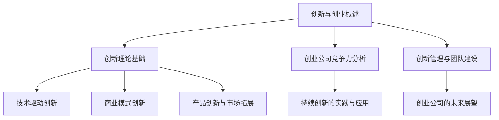

                 

### 文章标题

《程序员创业公司的持续创新与竞争力提升》

### 关键词

创新、创业、竞争力、持续创新、技术驱动、商业模式创新、产品创新、市场拓展

### 摘要

在激烈的市场竞争环境中，程序员创业公司如何通过持续创新提升竞争力成为了一项关键课题。本文从创新与创业的概述出发，探讨了创新的理论基础、竞争力分析、创新管理与团队建设等方面，详细分析了技术驱动创新、商业模式创新、产品创新与市场拓展等实践路径，并提出了持续创新的策略与管理体系。文章旨在为程序员创业公司提供一套系统、实用的创新方法论，助力企业在竞争中获得持续优势。

### 第一部分：公司与创新

#### 第1章：创新与创业概述

1.1 创业背景与动机

创业是指创办一个新企业或新业务的过程。在当前全球化、信息化、智能化时代，创业不仅成为一种经济活动，更成为一种生活方式和价值观。程序员创业公司，则是指由程序员或具备技术背景的创业者创办的，以技术创新为核心驱动的公司。

创业背景与动机可以从以下几个方面进行分析：

- **技术进步**：随着互联网、大数据、人工智能等技术的迅猛发展，程序员创业有了更为广阔的舞台。新技术不仅为创业公司提供了创新机会，也降低了创业的门槛。
- **市场需求**：市场需求是推动创业的重要因素。创业者往往能够发现市场中的痛点和机会，通过技术创新满足市场需求，从而实现创业。
- **个人愿景**：许多程序员创业是受到个人愿景的驱动。他们希望通过创业实现自己的梦想，改变世界。

1.2 创新的重要性

创新是创业的灵魂和核心。对于程序员创业公司而言，创新不仅关系到企业的生存与发展，也决定着其在市场中的竞争力。创新的重要性主要体现在以下几个方面：

- **竞争优势**：创新能够为企业带来独特的产品和服务，形成竞争优势。在激烈的市场竞争中，创新是企业脱颖而出的关键。
- **可持续发展**：创新是推动企业持续发展的动力。通过不断创新，企业能够适应市场变化，保持活力和竞争力。
- **市场拓展**：创新能够为企业开辟新的市场机会，实现市场拓展。创新的产品和服务能够满足不同客户的需求，扩大企业市场份额。

1.3 创业者应具备的素质

创业者是创新的核心推动者，其素质和能力直接影响到创业公司的成功与否。创业者应具备以下素质：

- **技术能力**：技术背景是程序员创业的基础。创业者应具备扎实的技术能力，能够解决实际问题，推动技术创新。
- **领导力**：创业者需要具备领导力，能够带领团队共同创新，实现公司目标。
- **市场洞察力**：创业者应具备敏锐的市场洞察力，能够发现市场机会，把握市场趋势。
- **学习能力**：创业者需要不断学习新知识、新技能，保持创新思维，适应快速变化的市场环境。
- **毅力与决心**：创业过程充满挑战和困难，创业者需要具备坚强的毅力与决心，克服困难，坚持到底。

1.4 创业公司的生命周期

创业公司通常经历以下生命周期：

- **初创期**：初创期是企业创立和成长的阶段。创业者需要解决资金、技术、市场等关键问题，推动企业快速发展。
- **成长期**：成长期是企业快速扩张和壮大的阶段。企业需要通过创新和市场拓展，提高市场份额，增强竞争力。
- **成熟期**：成熟期是企业稳定发展的阶段。企业需要通过持续创新，保持市场竞争力，实现可持续发展。
- **衰退期**：衰退期是企业面临困境和挑战的阶段。企业需要通过调整战略，优化管理，寻求新的发展机会。

#### 第2章：创新理论基础

2.1 创新的类型与层次

创新可以分为多种类型，每种类型都有其独特的特点和作用。根据创新的主体和客体，可以将创新分为以下几种类型：

- **技术性创新**：技术性创新是指通过技术创新来推动产品和服务改进。技术性创新包括产品创新、工艺创新、服务创新等。
- **市场性创新**：市场性创新是指通过市场策略和商业模式创新来推动企业增长。市场性创新包括市场细分、品牌创新、渠道创新等。
- **管理性创新**：管理性创新是指通过管理创新来提高企业效率和竞争力。管理性创新包括组织结构创新、流程创新、激励机制创新等。

创新还可以从层次上进行分类，分为以下几种层次：

- **基础性创新**：基础性创新是指从根本上改变企业或行业的技术、产品、服务、市场等各个方面。基础性创新通常具有革命性的影响，能够引发行业变革。
- **渐进性创新**：渐进性创新是指通过逐步改进和优化现有产品和服务来提高竞争力。渐进性创新通常在技术、市场、管理等方面进行优化，能够为企业带来持续竞争优势。
- **颠覆性创新**：颠覆性创新是指通过颠覆现有市场格局和商业模式来实现突破。颠覆性创新通常具有创新性、颠覆性、高风险、高回报等特点。

2.2 创新流程与模式

创新是一个复杂的过程，涉及多个环节和活动。根据创新的实践过程，可以将创新流程分为以下几个阶段：

- **问题识别**：问题识别是创新的第一步。创业者需要发现市场中的痛点、机会、挑战等，明确创新的方向。
- **创意生成**：创意生成是指通过头脑风暴、市场调研、用户反馈等方式，产生创新的想法和方案。
- **创意筛选**：创意筛选是指对生成的创意进行评估和筛选，确定最有潜力的创意进行开发。
- **原型开发**：原型开发是指构建创新的原型或模型，验证创意的可行性和有效性。
- **测试与迭代**：测试与迭代是指通过测试、反馈、改进等方式，不断优化创新原型，提高其质量和效果。
- **商业化推广**：商业化推广是指将创新产品或服务推向市场，进行商业化运营和推广。

创新模式是创新实践的具体方法和策略。常见的创新模式包括：

- **内部研发**：内部研发是指企业自主进行创新研发，通过内部团队和技术资源推动创新。
- **外部合作**：外部合作是指企业与外部科研机构、高校、合作伙伴等开展合作，共同推动创新。
- **用户参与**：用户参与是指企业通过用户反馈、用户测试等方式，将用户纳入创新过程，提高创新的质量和效果。

2.3 创新思维与工具

创新思维是指企业在创新过程中采用的思维方式和方法。创新思维包括以下几个方面：

- **发散思维**：发散思维是指从不同角度、不同方向思考问题，寻求多种解决方案。
- **收敛思维**：收敛思维是指通过分析和综合，从多个方案中选择最优方案。
- **逆向思维**：逆向思维是指从相反的角度思考问题，寻求创新解决方案。
- **系统思维**：系统思维是指从整体和系统的角度思考问题，分析问题之间的关联和影响。

创新工具是指用于支持创新实践的工具和方法。常见的创新工具包括：

- **头脑风暴**：头脑风暴是一种集体创意生成的方法，通过多人讨论、碰撞思想，产生大量创意。
- **SWOT分析**：SWOT分析是一种用于评估创新机会和挑战的方法，通过分析企业的优势、劣势、机会和威胁，制定创新策略。
- **用户画像**：用户画像是用于分析用户需求和行为特征的方法，通过了解用户，提供更好的创新解决方案。
- **原型设计**：原型设计是一种快速构建和测试创新原型的方法，通过迭代优化，提高创新质量和效果。

2.4 创新经济学

创新经济学是研究创新对经济增长和社会发展的影响的经济学分支。创新经济学主要研究以下几个方面：

- **创新成本与收益**：创新成本与收益分析是指评估创新项目的成本和潜在收益，确定创新的经济合理性。
- **创新激励**：创新激励是指通过政策、法规、激励机制等手段，鼓励企业进行创新，提高创新动力。
- **创新扩散**：创新扩散是指创新从源头传播到市场的过程，研究创新扩散的机制和影响因素。
- **创新评价**：创新评价是指对创新项目进行评估和评价，确定创新的成果和贡献。

创新经济学为程序员创业公司提供了理论指导，帮助创业者制定创新策略，提高创新效率。

#### 第3章：创业公司竞争力分析

3.1 竞争力理论概述

竞争力是指企业在市场竞争中的综合实力和能力。创业公司的竞争力直接影响其生存和发展。竞争力理论主要包括以下几个方面：

- **竞争战略理论**：竞争战略理论是由迈克尔·波特提出的，主要研究企业在竞争中的战略选择和竞争优势。竞争战略理论包括五个基本竞争战略：成本领先、差异化、集中化、总成本领先、差异化集中。
- **核心竞争力理论**：核心竞争力理论是由克莱因等学者提出的，主要研究企业的核心竞争力及其形成和保持。核心竞争力是企业长期形成的、能够在竞争中持续创造价值的独特能力。
- **动态能力理论**：动态能力理论是由蒂斯等学者提出的，主要研究企业在动态环境中的适应能力和创新能力。动态能力是企业通过整合、构建、重构内外部资源，快速响应市场变化的能力。

3.2 创业公司竞争力构成

创业公司的竞争力由多个方面构成，主要包括：

- **技术创新能力**：技术创新能力是企业通过技术创新推动产品和服务改进的能力。技术创新能力包括技术研发能力、技术储备、技术转化能力等。
- **市场响应能力**：市场响应能力是企业对市场变化和客户需求的快速响应和调整能力。市场响应能力包括市场调研、市场预测、产品定位等。
- **管理能力**：管理能力是企业通过科学管理提高效率和竞争力的能力。管理能力包括组织管理、流程管理、人力资源管理、财务管理等。
- **品牌建设能力**：品牌建设能力是企业通过品牌建设提高品牌知名度和美誉度的能力。品牌建设能力包括品牌定位、品牌传播、品牌形象等。
- **资金筹集能力**：资金筹集能力是企业通过多种途径筹集资金的能力。资金筹集能力包括股权融资、债务融资、内部融资等。

3.3 竞争力评估方法

竞争力评估是指对企业竞争力进行评估和诊断的过程。竞争力评估方法主要包括：

- **SWOT分析**：SWOT分析是一种常用的竞争力评估方法，通过分析企业的优势、劣势、机会和威胁，确定企业的竞争地位和战略方向。
- **PEST分析**：PEST分析是一种用于分析企业外部环境的分析方法，通过分析政治、经济、社会、技术等因素，评估企业面临的外部机会和挑战。
- **波特五力模型**：波特五力模型是一种用于分析市场竞争结构的方法，通过分析供应商、客户、潜在竞争者、替代品、现有竞争者等因素，评估企业的市场竞争地位。
- **创新价值评估模型**：创新价值评估模型是一种用于评估创新项目价值的方法，通过计算创新项目的价值、风险和可行性，评估创新项目的投资回报。

3.4 提升竞争力的策略

提升竞争力是企业持续发展的关键。提升竞争力的策略主要包括：

- **技术创新**：通过加大技术研发投入，提升技术创新能力，推动产品和服务创新。
- **市场拓展**：通过市场调研和定位，开拓新市场，扩大市场份额。
- **管理优化**：通过优化管理流程，提高管理效率，降低运营成本。
- **品牌建设**：通过品牌建设和传播，提高品牌知名度和美誉度，增强品牌价值。
- **人才培养**：通过人才培养和激励，提高员工素质和创新能力，打造核心竞争力。

#### 第4章：创新管理与团队建设

4.1 创新管理体系

创新管理体系是指企业用于管理创新活动的一系列制度和流程。创新管理体系主要包括以下几个方面：

- **创新战略**：创新战略是企业根据市场环境和自身优势制定的长期创新目标和规划。创新战略包括创新愿景、创新目标、创新路径等。
- **创新流程**：创新流程是企业用于管理创新项目的一系列活动和步骤。创新流程包括问题识别、创意生成、创意筛选、原型开发、测试与迭代、商业化推广等。
- **创新组织**：创新组织是企业用于实施创新活动的组织和团队。创新组织包括创新部门、创新团队、创新合作伙伴等。
- **创新资源**：创新资源是企业用于支持创新活动的人力、物力、财力等资源。创新资源包括研发经费、技术创新团队、研发设备等。

4.2 团队建设与激励

团队建设是企业实现创新目标的关键。团队建设主要包括以下几个方面：

- **团队文化**：团队文化是指企业在团队内部形成的一种共同的价值观和行为准则。团队文化包括创新精神、团队合作、共同目标等。
- **团队结构**：团队结构是指团队的组织形式和分工方式。团队结构包括职能型团队、项目型团队、矩阵型团队等。
- **团队激励**：团队激励是指企业用于激发团队成员积极性和创造力的一系列措施。团队激励包括物质激励、精神激励、荣誉激励等。

4.3 创新文化营造

创新文化是企业实现持续创新的重要保障。创新文化主要包括以下几个方面：

- **创新意识**：创新意识是指企业对创新的认识和重视程度。创新意识包括创新观念、创新思维、创新行动等。
- **创新氛围**：创新氛围是指企业内部对创新的支持和鼓励程度。创新氛围包括开放性、包容性、合作性等。
- **创新机制**：创新机制是指企业用于推动创新的一系列活动和制度。创新机制包括激励机制、反馈机制、容错机制等。

4.4 创新者个人成长

创新者个人成长是企业实现持续创新的重要保障。创新者个人成长主要包括以下几个方面：

- **知识积累**：知识积累是指创新者通过学习、实践、交流等方式，不断积累专业知识和技能。知识积累包括技术创新知识、市场知识、管理知识等。
- **创新能力**：创新能力是指创新者通过运用知识、技术和方法，实现创新的能力。创新能力包括创意能力、问题解决能力、实验能力等。
- **职业素养**：职业素养是指创新者在职业生涯中应具备的道德品质、行为习惯和专业能力。职业素养包括责任感、诚信、敬业、团队合作等。

#### 第二部分：持续创新实践

#### 第5章：技术驱动创新

5.1 技术趋势分析

技术趋势分析是指通过研究技术发展的方向和趋势，预测未来技术发展的重要性和影响。技术趋势分析对于程序员创业公司具有重要意义，可以帮助企业把握技术发展方向，抓住创新机会。技术趋势分析可以从以下几个方面进行：

- **行业趋势**：分析行业技术的发展趋势，了解行业前沿技术和热点应用，为技术创新提供方向。
- **技术动态**：关注全球技术动态，掌握新技术、新产品、新应用的发布和推广情况，了解技术发展的最新动向。
- **技术评估**：对新兴技术进行评估，分析其技术可行性、市场潜力、竞争优势等，为技术创新决策提供依据。
- **用户需求**：研究用户需求和技术需求，了解用户对技术的期望和需求，为技术创新提供方向。

5.2 技术创新方法

技术创新方法是指用于实现技术突破和创新的一系列方法和工具。技术创新方法包括以下几个方面：

- **技术预见**：技术预见是指通过分析技术发展趋势和未来趋势，预测技术发展方向和潜在应用领域。技术预见有助于企业提前布局，抓住技术创新机会。
- **技术融合**：技术融合是指将不同领域的技术进行整合，形成新的技术组合和创新成果。技术融合可以打破技术壁垒，实现跨领域创新。
- **技术转化**：技术转化是指将研究成果转化为实际产品和服务的过程。技术转化包括技术开发、产品化、市场化等环节，是技术创新的关键环节。
- **技术平台**：技术平台是指用于支持技术创新的基础设施和工具。技术平台包括研发平台、实验平台、测试平台等，为技术创新提供技术保障。

5.3 技术创新的挑战与应对

技术创新过程中面临着一系列挑战，需要企业采取有效措施应对。技术创新的挑战主要包括：

- **技术风险**：技术创新存在技术失败、技术突破不确定等风险。企业需要建立风险识别和评估机制，降低技术风险。
- **市场风险**：技术创新的市场风险包括市场需求不明确、竞争激烈等。企业需要通过市场调研、用户反馈等手段，了解市场需求，降低市场风险。
- **资金风险**：技术创新需要大量资金投入，企业需要建立合理的资金筹集和管理机制，确保资金充足，降低资金风险。
- **团队协作**：技术创新需要团队协作和跨部门合作，企业需要建立有效的沟通和协作机制，提高团队协作效率。

5.4 技术创新案例解析

通过分析技术创新案例，可以了解技术创新的具体实践和方法。以下是一个技术创新案例：

案例：某程序员创业公司通过物联网技术实现了智能家居产品的创新。

- **技术趋势分析**：公司分析了物联网技术的发展趋势和市场需求，认为智能家居是未来发展的方向。
- **技术创新方法**：公司通过自主研发物联网技术，构建了智能家居平台，实现了家电设备的智能控制。
- **挑战与应对**：公司在技术创新过程中遇到了技术瓶颈、市场需求不明确等问题。通过加强技术研发、市场调研和用户反馈，公司逐步克服了这些挑战。
- **创新成果**：公司成功推出了智能家居产品，获得了市场认可，实现了销售额和市场份额的快速增长。

#### 第6章：商业模式创新

6.1 商业模式概念与构成

商业模式是指企业通过提供产品或服务，创造价值、传递价值和获取价值的方式和方法。商业模式包括以下几个关键组成部分：

- **价值主张**：价值主张是企业通过产品或服务为顾客创造的价值。价值主张需要明确顾客的需求和痛点，提供有吸引力的解决方案。
- **关键资源**：关键资源是企业实现价值主张所依赖的资源和能力。关键资源包括人力、技术、资本、品牌等。
- **关键活动**：关键活动是企业为实现价值主张所进行的主要活动。关键活动包括产品开发、市场推广、售后服务等。
- **客户关系**：客户关系是企业与顾客建立的关系模式。客户关系包括顾客获取、顾客关系维护、顾客忠诚等。
- **收入来源**：收入来源是企业通过商业模式获取的收入方式。收入来源包括销售产品、提供服务、广告收入等。
- **成本结构**：成本结构是企业实现商业模式所需的成本分布。成本结构包括固定成本、可变成本、运营成本等。

6.2 商业模式创新方法

商业模式创新是指通过改变现有商业模式，创造新的商业价值的过程。商业模式创新方法包括以下几个方面：

- **模式重塑**：模式重塑是指彻底改变现有商业模式，实现商业模式的重大变革。模式重塑可以通过整合资源、优化流程、重新定义价值主张等方式实现。
- **模式迭代**：模式迭代是指在现有商业模式基础上进行渐进式改进，提高商业模式的效率和价值。模式迭代可以通过优化关键资源、提高关键活动效率、改进收入来源等方式实现。
- **模式跨界**：模式跨界是指将不同行业或领域的商业模式进行整合和创新，实现跨行业或领域的商业模式创新。模式跨界可以通过跨领域合作、跨界融合等方式实现。
- **模式颠覆**：模式颠覆是指通过颠覆现有市场格局和商业模式，实现商业模式的重大突破。模式颠覆可以通过创新技术、改变市场规则等方式实现。

6.3 商业模式创新案例

以下是一个商业模式创新案例：

案例：某程序员创业公司通过共享经济模式实现了闲置资源的优化利用。

- **价值主张**：公司提供闲置资源的共享平台，为用户提供租赁和共享闲置物品的机会。
- **关键资源**：公司通过线上平台、技术支持和线下服务网络等资源，实现了闲置资源的有效整合和利用。
- **关键活动**：公司通过线上推广、线下服务、租赁管理等活动，实现了闲置资源的快速流转和高效利用。
- **客户关系**：公司通过建立用户评价系统、提供优质的客户服务等方式，建立了良好的客户关系。
- **收入来源**：公司通过收取租赁费、平台使用费等方式获得收入。
- **成本结构**：公司通过优化运营流程、降低租赁成本等方式，实现了成本的有效控制。

6.4 商业模式创新的风险与收益

商业模式创新既有可能带来巨大的收益，也可能面临较高的风险。商业模式创新的风险主要包括：

- **市场风险**：商业模式创新可能面临市场需求不明确、竞争激烈等问题，导致创新成果无法得到市场认可。
- **技术风险**：商业模式创新可能涉及新技术、新产品的开发，存在技术失败、技术突破不确定等风险。
- **资源风险**：商业模式创新可能需要大量资源投入，包括人力、物力、财力等，存在资源不足、资源浪费等风险。
- **法律风险**：商业模式创新可能涉及法律法规的不明确、不完善等问题，存在法律风险。

商业模式创新的收益主要包括：

- **市场拓展**：商业模式创新可以帮助企业拓展新市场、扩大市场份额。
- **价值提升**：商业模式创新可以提升企业的价值主张，为顾客提供更有吸引力的解决方案。
- **成本降低**：商业模式创新可以通过优化流程、降低成本等方式，提高企业的运营效率。
- **竞争力增强**：商业模式创新可以帮助企业增强竞争力，在市场竞争中占据有利地位。

#### 第7章：产品创新与市场拓展

7.1 产品创新策略

产品创新是创业公司实现持续增长和竞争优势的重要手段。产品创新策略包括以下几个方面：

- **需求驱动**：以用户需求为导向，关注用户需求的变化和痛点，开发满足用户需求的产品。
- **技术驱动**：以技术创新为核心，利用新技术、新工艺、新材料等推动产品创新。
- **差异化定位**：通过差异化定位，提供与众不同的产品或服务，满足特定用户群体的需求。
- **快速迭代**：通过快速迭代，不断优化和改进产品，提高产品质量和用户满意度。
- **跨界融合**：通过跨界融合，将不同领域的技术、理念、产品等进行整合，实现创新突破。

7.2 产品设计流程

产品设计流程是指产品从概念形成到上市的全过程。产品设计流程包括以下几个阶段：

- **需求分析**：分析用户需求、市场趋势、竞争对手等信息，明确产品功能、性能、外观等设计要求。
- **概念设计**：根据需求分析结果，制定产品概念设计，包括产品形态、交互方式、功能模块等。
- **原型设计**：制作产品原型，验证产品设计的可行性，收集用户反馈，优化产品设计。
- **详细设计**：根据原型设计，进行产品详细设计，包括电路设计、结构设计、软件设计等。
- **测试与验证**：对产品进行功能测试、性能测试、可靠性测试等，确保产品符合设计要求。
- **产品上市**：完成产品设计和测试后，进行产品上市准备，包括市场推广、渠道建设、售后服务等。

7.3 市场拓展策略

市场拓展是创业公司实现增长和扩张的重要手段。市场拓展策略包括以下几个方面：

- **目标市场选择**：根据产品特点和资源能力，确定目标市场，明确市场定位和目标客户群体。
- **市场调研**：通过市场调研，了解目标市场的需求、竞争状况、市场趋势等信息，为市场拓展提供依据。
- **渠道拓展**：建立销售渠道，包括线上渠道、线下渠道、合作伙伴等，扩大产品市场覆盖范围。
- **品牌建设**：通过品牌建设，提高产品知名度和美誉度，树立品牌形象。
- **营销推广**：通过营销推广活动，提高产品曝光度和销售转化率，实现市场拓展。
- **客户关系管理**：通过客户关系管理，维护客户关系，提高客户满意度和忠诚度。

7.4 产品创新与市场拓展案例

以下是一个产品创新与市场拓展案例：

案例：某程序员创业公司通过产品创新和市场拓展实现了快速发展。

- **产品创新**：公司通过技术创新，推出了一款具有差异化功能的产品，满足了用户需求，受到了市场欢迎。
- **市场拓展**：公司通过市场调研，确定了目标市场，制定了市场拓展策略，包括渠道拓展、品牌建设、营销推广等。
- **挑战与应对**：公司在市场拓展过程中遇到了市场竞争激烈、客户需求多变等问题，通过持续创新和优化，克服了这些挑战。
- **成果**：公司成功实现了市场拓展，提高了市场份额，实现了收入和利润的快速增长。

#### 第8章：持续创新的实践与应用

8.1 持续创新的管理体系

持续创新是企业实现长期发展的关键。持续创新管理体系是指企业用于推动和管理创新活动的一系列制度和流程。持续创新管理体系包括以下几个方面：

- **创新战略**：创新战略是企业根据市场环境和发展需求制定的长期创新目标和规划。创新战略包括创新愿景、创新目标、创新路径等。
- **创新流程**：创新流程是企业用于管理创新项目的一系列活动和步骤。创新流程包括问题识别、创意生成、创意筛选、原型开发、测试与迭代、商业化推广等。
- **创新组织**：创新组织是企业用于实施创新活动的组织和团队。创新组织包括创新部门、创新团队、创新合作伙伴等。
- **创新资源**：创新资源是企业用于支持创新活动的人力、物力、财力等资源。创新资源包括研发经费、技术创新团队、研发设备等。
- **创新文化**：创新文化是企业内部对创新的支持和鼓励程度。创新文化包括创新意识、创新氛围、创新机制等。

8.2 持续创新的激励机制

激励机制是指企业用于激发员工创新积极性和创造力的制度。持续创新的激励机制包括以下几个方面：

- **绩效激励**：通过绩效评估和奖励机制，激励员工提高工作绩效和创新能力。
- **项目激励**：通过项目奖励和股权激励等方式，激励员工参与创新项目和成果转化。
- **培训激励**：通过提供培训和学习机会，提高员工的专业知识和创新能力。
- **荣誉激励**：通过颁发荣誉证书、表彰奖励等方式，激励员工积极投身创新工作。
- **创新文化**：通过营造创新文化，鼓励员工勇于创新、宽容失败，提高创新氛围。

8.3 持续创新的企业文化

企业文化是企业价值观和行为准则的体现，对持续创新具有重要意义。持续创新的企业文化包括以下几个方面：

- **创新意识**：鼓励员工勇于创新、敢于突破，将创新作为企业发展的核心价值观。
- **团队合作**：倡导团队合作、协同创新，激发员工的创造力和合作精神。
- **学习氛围**：营造学习型组织，鼓励员工不断学习新知识、新技能，提升创新能力。
- **包容失败**：鼓励员工勇于尝试、宽容失败，培养创新精神和创业精神。
- **激励机制**：建立合理的激励机制，激发员工的创新热情和积极性。

8.4 持续创新的案例分析

以下是一个持续创新的案例分析：

案例：某程序员创业公司通过持续创新实现了快速发展。

- **创新战略**：公司制定了明确的创新战略，将创新作为企业发展的核心驱动力。
- **创新流程**：公司建立了完善的创新流程，包括问题识别、创意生成、创意筛选、原型开发、测试与迭代、商业化推广等。
- **创新组织**：公司成立了专门的创新部门，建立了创新团队，与高校、科研机构等建立合作关系，推动技术创新。
- **创新资源**：公司加大研发投入，引进高水平技术人才，建设研发设施，为持续创新提供资源支持。
- **创新文化**：公司营造了浓厚的创新文化氛围，鼓励员工勇于创新、宽容失败，推动持续创新。

#### 第9章：创业公司的未来展望

9.1 创业公司的发展方向

创业公司的发展方向取决于市场需求、技术创新、行业趋势等多方面因素。以下是一些可能的创业公司发展方向：

- **技术创新**：以技术创新为核心，研发具有独特价值的新产品、新服务，引领行业发展趋势。
- **市场拓展**：开拓新市场、扩大市场份额，通过技术创新和商业模式创新实现快速增长。
- **产业融合**：通过跨界合作、产业融合，实现资源整合和优势互补，打造新兴商业模式。
- **国际化发展**：积极拓展国际市场，实现全球化和国际化发展。
- **可持续发展**：关注环境保护、社会责任，实现可持续发展。

9.2 持续创新对公司的影响

持续创新对公司的影响主要体现在以下几个方面：

- **竞争力提升**：通过持续创新，提升产品竞争力、服务竞争力，增强公司在市场中的竞争力。
- **市场份额扩大**：通过持续创新，开拓新市场、扩大市场份额，实现业务增长。
- **品牌价值提升**：通过持续创新，树立企业品牌形象，提升品牌价值。
- **员工满意度提高**：通过持续创新，激发员工创造力，提高员工满意度和忠诚度。
- **公司估值提升**：通过持续创新，提高公司估值，吸引更多投资和合作伙伴。

9.3 持续创新与可持续发展

持续创新与可持续发展密切相关。以下是一些持续创新与可持续发展的关系：

- **技术创新**：通过持续技术创新，提高生产效率、降低资源消耗，实现可持续发展。
- **商业模式创新**：通过商业模式创新，优化资源利用、降低环境污染，实现可持续发展。
- **社会责任**：通过承担社会责任，关注环境保护、员工福利、社区发展等，实现可持续发展。
- **人才培养**：通过持续创新，培养高素质人才，推动公司和社会的共同发展。

9.4 创业公司的未来挑战与机遇

创业公司面临诸多挑战和机遇。以下是一些未来挑战与机遇：

- **技术创新**：技术创新是创业公司的核心竞争力，但技术创新也面临技术风险、市场风险等挑战。
- **市场竞争**：市场竞争激烈，创业公司需要不断提高产品竞争力，应对激烈的市场竞争。
- **资金筹集**：创业公司需要不断筹集资金，支持技术创新和业务发展，但资金筹集也面临资金风险。
- **人才培养**：创业公司需要吸引和留住高素质人才，但人才竞争也面临人才流失等挑战。
- **国际化发展**：国际化发展是创业公司的机遇，但国际化发展也面临文化差异、市场风险等挑战。

### 参考文献

1. 波特，迈克尔·E. (1998). 竞争优势：Industry and competition in strategic analysis. The Free Press.
2. 克莱因，杰弗里·D.，米尔斯，罗杰·L. (2000). 竞争力：竞争者的行为与互动。中国人民大学出版社。
3. 蒂斯，T. (2000). 动态能力与企业竞争力。上海财经大学出版社。
4. 特伦斯·迪尔，斯蒂芬·肯尼迪 (2003). 创新者的思考方式。电子工业出版社。
5. 陈劲，唐宁玉 (2012). 创新管理：理论与实践。清华大学出版社。
6. 约翰·霍金斯，查尔斯·K.普拉哈拉德 (2002). 知识型企业：创新的源泉。电子工业出版社。

### 附录

- **创新思维工具与应用**：头脑风暴、SWOT分析、用户画像等创新工具的使用方法和案例。
- **创新管理流程模板**：创新项目的规划、执行、监控、评估等流程模板。
- **持续创新案例库**：国内外持续创新企业的成功案例和经验教训。

### Mermaid 流程图



### 核心算法原理讲解

```python
# 伪代码：创新评估模型
def evaluate_innovation(innovation_data):
    # 计算创新价值
    value = calculate_value(innovation_data)
    
    # 评估创新风险
    risk = assess_risk(innovation_data)
    
    # 判断创新可行性
    if risk <= threshold:
        feasibility = "可行"
    else:
        feasibility = "不可行"
    
    # 返回评估结果
    return value, risk, feasibility

# 伪代码：竞争力提升策略
def enhance_competitiveness(company_data):
    # 分析公司现状
    current_state = analyze_company_state(company_data)
    
    # 制定提升策略
    strategies = generate_strategies(current_state)
    
    # 实施策略
    for strategy in strategies:
        execute_strategy(strategy)
    
    # 评估效果
    result = evaluate_effects()
    
    return result
```

### 数学模型和数学公式详细讲解

#### 创新价值评估模型

创新价值评估模型公式为：

$$ V = f(\text{技术优势}, \text{市场潜力}, \text{资源需求}) $$

其中，$V$ 表示创新价值，技术优势、市场潜力、资源需求分别为三个影响因素，$f$ 为函数。

#### 竞争力评估模型

竞争力评估模型公式为：

$$ C = \frac{\text{市场占有率} + \text{产品差异性} + \text{成本优势}}{3} $$

其中，$C$ 表示竞争力，市场占有率、产品差异性、成本优势分别为三个影响因素。

### 最佳实践 Tips

1. **强化技术创新**：注重技术研发，提高技术储备，推动产品创新和技术突破。
2. **优化商业模式**：通过商业模式创新，提升企业价值和竞争力，实现可持续发展。
3. **培养创新人才**：引进和培养创新人才，建立创新团队，激发创新活力。
4. **加强市场拓展**：积极开拓新市场，扩大市场份额，提高品牌影响力。
5. **构建创新文化**：营造创新氛围，鼓励员工勇于创新、宽容失败，提高整体创新能力。

### 小结

本文从创新与创业的概述、创新理论基础、创业公司竞争力分析、创新管理与团队建设、技术驱动创新、商业模式创新、产品创新与市场拓展、持续创新的实践与应用等方面，详细探讨了程序员创业公司持续创新与竞争力提升的方法和策略。通过本文的研究，希望为程序员创业公司提供一套系统、实用的创新方法论，助力企业在竞争中获得持续优势。

### 注意事项

1. 创新过程中要注意市场需求和用户反馈，确保创新成果能够真正满足用户需求。
2. 创新过程中要关注技术风险和市场风险，制定合理的风险控制措施。
3. 创新过程中要注重团队合作和资源整合，提高创新效率和成果转化。
4. 创新过程中要持续学习和改进，不断提高创新能力和竞争力。

### 拓展阅读

1. 克莱因，杰弗里·D.，米尔斯，罗杰·L. (2000). 竞争力：竞争者的行为与互动。中国人民大学出版社。
2. 蒂斯，T. (2000). 动态能力与企业竞争力。上海财经大学出版社。
3. 陈劲，唐宁玉 (2012). 创新管理：理论与实践。清华大学出版社。
4. 约翰·霍金斯，查尔斯·K.普拉哈拉德 (2002). 知识型企业：创新的源泉。电子工业出版社。

