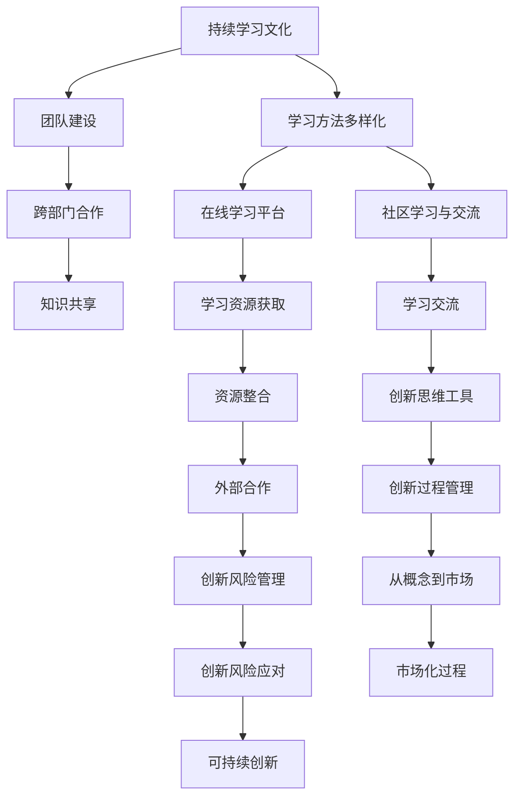

                 


### 第一部分：引言与背景

#### 程序员创业公司的概述

程序员创业公司，顾名思义，是由一群具有编程技能的专业人士所创立的企业。这类公司的创始人往往是技术背景深厚，对技术有着深刻的理解和热情。程序员创业公司以其灵活的工作方式、快速响应市场变化的能力以及技术创新为特点，在当今快速发展的科技领域中占据着重要地位。

首先，程序员创业公司的特点主要体现在以下几个方面：

1. **技术驱动的核心**：程序员创业公司通常将技术创新作为企业的核心竞争力。这种以技术为核心的企业文化促使公司不断探索新技术、新方法，以保持竞争优势。

2. **快速迭代的产品开发**：程序员创业公司往往采用敏捷开发模式，强调快速响应市场需求，通过不断迭代来优化产品。这种开发模式有助于公司迅速适应市场变化，缩短产品上市时间。

3. **扁平化管理**：程序员创业公司的组织结构通常比较扁平，管理层级较少，这样可以减少信息传递的中间环节，提高决策效率。

4. **高度依赖团队协作**：程序员创业公司的成功很大程度上依赖于团队协作。团队成员之间需要紧密合作，共享知识和资源，共同解决技术难题。

然而，程序员创业公司在发展过程中也会面临一系列挑战和机遇：

1. **资金压力**：初创公司往往需要大量的资金支持，特别是在产品研发和市场推广阶段。资金不足可能会导致项目停滞，影响公司发展。

2. **市场定位**：在竞争激烈的市场环境中，程序员创业公司需要明确自己的市场定位，找到独特的竞争优势。市场定位不准确可能会导致资源浪费和市场开拓困难。

3. **技术创新风险**：技术创新本身具有不确定性，可能存在研发失败、市场接受度低等风险。如何降低技术创新风险，提高创新成功率是程序员创业公司面临的重要问题。

4. **人才流失**：程序员创业公司通常面临人才流失的问题。高水平的程序员往往具有更高的市场价值，如何留住核心人才是公司需要解决的挑战。

5. **持续学习与创新能力**：在快速变化的科技领域中，持续学习与创新能力是企业保持竞争优势的关键。程序员创业公司需要建立持续学习文化，培养创新思维，才能在激烈的市场竞争中立于不败之地。

#### 程序员创业公司的挑战与机遇

程序员创业公司面临的挑战和机遇是相互交织的。一方面，市场和技术环境的快速变化为公司提供了巨大的机遇。新兴技术的涌现、市场需求的变化以及全球化的趋势，都为程序员创业公司提供了广阔的发展空间。例如，人工智能、区块链、云计算等前沿技术的兴起，为程序员创业公司提供了创新的动力和机会。

另一方面，程序员创业公司也面临着诸多挑战。首先是资金问题，初创公司往往需要大量的资金投入，而资金不足可能会影响公司的正常运营和发展。其次是市场定位和竞争压力，如何在激烈的市场竞争中找到自己的独特定位，并保持竞争优势，是程序员创业公司需要面对的重要问题。

此外，技术创新风险也是程序员创业公司面临的一大挑战。技术创新的不确定性可能导致研发失败，从而影响公司的未来发展。同时，人才流失问题也困扰着许多程序员创业公司。高水平的程序员往往具有更高的市场价值，如何留住这些核心人才，是公司需要解决的关键问题。

然而，挑战与机遇并存。面对资金压力、市场定位和技术创新等挑战，程序员创业公司可以通过建立持续学习文化和创新机制来应对。持续学习文化有助于公司团队成员不断提升自身技能，保持竞争力；创新机制则有助于公司挖掘新机会，实现技术创新。通过不断学习和创新，程序员创业公司可以克服挑战，抓住机遇，实现持续发展。

### 第二部分：持续学习文化

#### 持续学习的概念与重要性

持续学习（Lifelong Learning）是指在整个人生过程中，通过不断的学习和知识更新来提高个人技能、知识和能力的过程。在程序员创业公司中，持续学习不仅是一种个人发展的需求，更是企业保持竞争力和实现创新的重要手段。

首先，我们需要明确持续学习的定义。持续学习并不仅仅指在学校或培训机构中的正式教育，它还包括自学、参与社区活动、阅读专业书籍等多种形式。持续学习的核心在于不断地获取新知识、新技能，并将其应用到实际工作中，以适应快速变化的科技环境和市场需求。

在程序员创业公司中，持续学习的重要性体现在以下几个方面：

1. **技能提升**：科技领域的发展速度极快，新技术、新工具层出不穷。程序员创业公司的团队成员如果停止学习，很快就会被淘汰。通过持续学习，团队成员可以不断更新自己的技能库，保持竞争力。

2. **知识更新**：程序员创业公司需要不断开发新产品、优化现有产品。这就要求团队成员不仅要掌握最新的技术，还要了解市场需求和用户反馈，以便做出更好的产品决策。

3. **创新能力**：持续学习有助于激发团队成员的创新思维。通过学习不同的技术和方法，团队成员可以开阔视野，从新的角度看待问题，从而提出创新的解决方案。

4. **团队建设**：持续学习可以加强团队成员之间的交流与合作。通过共同学习和讨论，团队成员可以更好地理解彼此的工作，提高团队的整体协作能力。

5. **企业竞争力**：在竞争激烈的市场环境中，持续学习的企业更能适应变化，抓住机遇。这种企业的创新能力和适应能力往往更强，从而在市场上占据有利地位。

#### 持续学习在程序员创业公司中的重要性

对于程序员创业公司来说，持续学习不仅仅是一种个人发展需求，更是企业发展的关键因素。以下是持续学习在程序员创业公司中的几个关键方面：

1. **保持技术领先**：科技领域的技术更新速度非常快，新技术的出现往往会导致现有技术的过时。程序员创业公司如果停止学习，很快就会被市场淘汰。通过持续学习，公司可以紧跟技术发展趋势，掌握最新的技术，保持技术领先地位。

2. **适应市场需求**：市场需求是程序员创业公司发展的驱动力之一。通过持续学习，团队成员可以深入了解市场需求和用户反馈，及时调整产品方向，提高市场竞争力。

3. **提高团队协作**：持续学习有助于加强团队成员之间的交流与合作。通过共同学习和讨论，团队成员可以更好地理解彼此的工作，提高协作效率，形成强大的团队凝聚力。

4. **培养创新思维**：持续学习不仅可以帮助团队成员掌握新技术，还可以激发他们的创新思维。通过学习不同的技术和方法，团队成员可以开阔视野，从新的角度看待问题，提出创新的解决方案。

5. **提升个人职业发展**：持续学习有助于团队成员提升个人技能和知识水平，提高职业竞争力。这不仅有助于团队成员的职业发展，也为公司创造了更多的价值。

#### 建立持续学习文化的要素

要建立有效的持续学习文化，程序员创业公司需要从以下几个方面入手：

1. **领导层的重视**：领导层的重视是持续学习文化得以建立和维持的关键。公司领导需要明确持续学习的重要性，并将其作为企业战略的一部分。通过树立榜样，领导层可以激发团队成员的学习热情。

2. **学习资源的提供**：公司需要为员工提供丰富的学习资源，包括专业书籍、在线课程、技术论坛等。这些资源可以帮助员工不断提升自身技能，满足持续学习的需求。

3. **时间安排**：持续学习需要时间保障。公司需要合理安排工作时间，为员工提供学习时间。例如，可以设立固定的学习时间，或者将学习任务融入到日常工作之中。

4. **激励机制**：为了鼓励员工持续学习，公司可以设立激励机制，如学习奖励、晋升机会等。这些激励机制可以激发员工的学习动力，提高学习效果。

5. **团队建设活动**：通过组织团队建设活动，如技术分享会、研讨会等，可以促进团队成员之间的交流和合作，增强团队凝聚力。这些活动也是持续学习的重要形式。

6. **外部合作与交流**：与外部机构合作，参与行业交流活动，可以帮助公司获取最新的行业动态和技术趋势，拓宽视野，提升整体创新能力。

#### 如何在创业公司中建立持续学习文化

要在程序员创业公司中建立持续学习文化，需要采取一系列具体措施，以下是其中的一些关键步骤：

1. **设定明确的学习目标**：公司应明确持续学习的目标，例如提升技术能力、拓展业务知识等。这些目标应与公司的战略目标相一致，确保学习活动对公司的整体发展有积极的推动作用。

2. **建立学习计划**：公司可以为每个员工制定个人学习计划，包括学习内容、学习时间表和学习进度等。通过学习计划的实施，确保员工的学习活动有组织、有目标地进行。

3. **提供多样化的学习资源**：公司应为员工提供丰富的学习资源，包括在线课程、技术书籍、行业报告、研讨会等。这些资源应覆盖员工所需的不同领域的知识，以满足其多样化的学习需求。

4. **鼓励自学**：公司应鼓励员工利用业余时间进行自学，并提供相应的支持和激励措施。例如，可以设立自学奖励制度，或者为自学表现突出的员工提供晋升机会。

5. **组织内部培训**：公司可以定期组织内部培训，邀请行业专家或内部优秀员工进行技术分享和经验交流。这种培训形式不仅能够提高员工的专业技能，还可以增强团队凝聚力。

6. **建立学习社区**：公司可以建立一个内部学习社区，员工可以在社区中分享学习心得、讨论技术问题、交流学习资源等。通过学习社区，员工可以互相学习、互相帮助，共同提高。

7. **设立学习考核机制**：公司应设立学习考核机制，对员工的学习效果进行评估。通过考核，可以了解员工的学习进度和效果，并根据考核结果提供相应的支持和激励。

8. **奖励优秀学习者**：公司可以设立学习奖励制度，对在学习和创新方面表现突出的员工进行奖励。这些奖励可以是物质奖励，也可以是晋升机会、荣誉称号等，以激励员工持续学习。

9. **建立反馈机制**：公司应建立反馈机制，及时收集员工对学习活动和学习资源的反馈，并根据反馈进行调整和改进。通过不断优化学习环境，可以提高员工的学习满意度和学习效果。

10. **领导层积极参与**：公司领导层应积极参与持续学习活动，成为员工的榜样。领导层的积极参与可以激发员工的学习热情，营造良好的学习氛围。

#### 成功案例与失败教训

在程序员创业公司中，建立持续学习文化已经得到了一些成功企业的实践，同时也积累了宝贵的经验教训。以下是几个典型的案例：

1. **案例一：某知名互联网公司**  
该公司在创业初期就非常重视持续学习文化，设立了专门的培训部门，为员工提供丰富的学习资源和技术培训。公司还鼓励员工参与外部技术会议和研讨会，拓展视野。通过这些措施，公司培养了一支高素质的技术团队，保持了在行业中的领先地位。

2. **案例二：某初创科技公司**  
该初创公司通过建立内部学习社区，组织技术分享会和项目讨论会，促进了团队成员之间的知识共享和交流。公司还定期为员工提供在线课程和学习资源，鼓励员工自学。这种持续学习文化不仅提升了员工的技能水平，还增强了团队的凝聚力。

3. **案例三：某人工智能初创公司**  
该公司将技术创新作为企业发展的核心，鼓励员工不断学习最新的技术和方法。公司设立了创新基金，支持员工进行技术探索和实验。通过持续学习和创新，公司开发出了一系列领先的人工智能产品，获得了市场的广泛认可。

4. **失败教训**  
一些程序员创业公司在建立持续学习文化方面也面临了失败教训。例如，有公司在初期过于注重学习资源的提供，但忽略了学习效果的考核和激励机制，导致员工学习积极性不高。还有公司在学习活动的组织上缺乏系统性，导致学习效果不佳。

通过以上案例，我们可以得出以下教训和启示：

1. **明确学习目标**：持续学习文化需要明确的目标和方向，公司应制定具体的学习计划和目标，确保学习活动对公司的整体发展有积极的推动作用。

2. **提供多样化的学习资源**：公司应提供丰富的学习资源，包括在线课程、技术书籍、研讨会等，以满足员工多样化的学习需求。

3. **鼓励自学与交流**：公司应鼓励员工进行自学，并提供相应的支持和激励措施。同时，通过组织内部培训和技术分享会，促进团队成员之间的知识共享和交流。

4. **建立反馈机制**：公司应建立反馈机制，及时收集员工对学习活动和学习资源的反馈，并根据反馈进行调整和改进。

5. **领导层积极参与**：领导层的积极参与可以激发员工的学习热情，营造良好的学习氛围。

6. **设立激励机制**：公司应设立学习考核机制和激励机制，对在学习和创新方面表现突出的员工进行奖励，以提高员工的学习积极性。

#### 学习方法的多样化

在程序员创业公司中，建立持续学习文化不仅需要丰富的学习资源，还需要多样化的学习方法。多样化的学习方法可以帮助员工更好地吸收知识，提升学习效果。以下是几种常见的多样化学习方法：

1. **传统学习方式**

传统学习方式包括阅读书籍、参加线下课程和技术讲座等。这些方法具有以下优点：

- **系统性**：传统学习方式通常有系统性的学习内容，可以帮助员工全面掌握某个领域的知识。
- **深入性**：通过深入阅读书籍，员工可以更深入地理解技术细节，掌握核心原理。
- **持久性**：书籍和课程等学习资源可以长时间保存，便于员工随时查阅和复习。

然而，传统学习方式也存在一些局限性：

- **时间成本**：阅读书籍和参加课程通常需要较长时间，可能影响员工的日常工作。
- **互动性**：传统学习方式缺乏互动，员工在学习过程中可能遇到问题难以及时解决。

2. **在线学习平台与资源**

随着互联网的发展，在线学习平台和资源变得越来越丰富。以下是一些常用的在线学习平台和资源：

- **Coursera、edX**：这些平台提供了来自世界顶级大学和机构的在线课程，涵盖计算机科学、人工智能、数据科学等多个领域。
- **GitHub**：GitHub不仅是一个代码托管平台，也是一个丰富的知识库。员工可以通过阅读开源项目的代码，学习最新的技术和方法。
- **Stack Overflow**：Stack Overflow是一个问答社区，员工可以在其中提问和回答技术问题，获取解决问题的思路和方法。

在线学习平台和资源的优点包括：

- **灵活性**：员工可以根据自己的时间安排进行学习，不受地点和时间的限制。
- **互动性**：在线学习平台提供了讨论区，员工可以与全球的同行交流，获取多角度的见解和帮助。
- **多样性**：在线学习平台提供了丰富的课程和资源，员工可以根据自己的需求选择合适的学习内容。

3. **社区学习与交流**

社区学习是指通过参加技术社区、参加线下活动等方式进行学习。以下是一些常见的社区学习形式：

- **技术社区**：如CSDN、博客园等，这些社区聚集了大量的程序员和技术爱好者，提供了丰富的技术讨论和资源分享。
- **线下活动**：如技术沙龙、黑客马拉松等，这些活动提供了面对面交流的机会，有助于加深对技术的理解和应用。
- **开源项目**：参与开源项目不仅可以提升个人技能，还可以与项目成员进行深度合作和交流。

社区学习的优点包括：

- **实践性**：通过参与实际项目，员工可以将理论知识应用到实际中，提高解决问题的能力。
- **社交性**：社区学习有助于建立人脉，拓宽视野，获取更多的职业发展机会。
- **多样性**：社区学习提供了多样化的学习内容和形式，员工可以根据自己的兴趣和需求进行选择。

总之，多样化的学习方法可以帮助程序员创业公司建立持续学习文化。通过结合传统学习方式、在线学习平台和社区学习，员工可以更好地吸收知识，提升学习效果，为公司的持续发展和创新提供强有力的支持。

### 第三部分：持续学习与团队建设

#### 团队成员的参与与激励

在程序员创业公司中，持续学习不仅仅是个人发展的需求，更是团队整体效能提升的关键因素。为了确保团队成员积极参与持续学习，公司需要建立有效的参与和激励机制。

1. **明确学习目标**：公司应与每个团队成员共同设定清晰的学习目标，确保这些目标与个人职业发展和团队项目需求相一致。通过明确目标，团队成员可以更有动力去达成学习目标，并且能够将所学应用到实际工作中。

2. **提供时间支持**：公司应合理安排工作时间，为团队成员提供足够的学习时间。例如，可以设立每周的“学习日”或“学习小时”，确保团队成员有充裕的时间进行自学和参加外部培训。

3. **鼓励分享经验**：公司可以组织定期的技术分享会或项目总结会，鼓励团队成员分享自己的学习经验和心得。通过分享，团队成员不仅能够巩固自己的知识，还能从他人的经验中汲取灵感，激发新的创意。

4. **设立奖励制度**：公司应设立学习奖励制度，对在学习和创新方面表现突出的团队成员进行奖励。这些奖励可以是金钱奖励、晋升机会、荣誉称号等，以激励团队成员持续学习的积极性。

5. **团队建设活动**：通过组织团队建设活动，如团队拓展训练、团队旅行等，可以增强团队成员之间的凝聚力，营造积极的学习氛围。这些活动不仅有助于团队成员放松身心，还能促进团队合作和知识共享。

6. **领导层支持**：领导层应积极支持团队成员的学习和成长，通过自身的行为树立榜样，鼓励团队成员勇于尝试和探索新技术。领导层的重视和支持能够极大地激发团队成员的学习热情和参与度。

#### 跨部门合作与知识共享

跨部门合作和知识共享是程序员创业公司实现持续学习与创新能力的重要手段。通过有效的跨部门合作和知识共享，公司可以充分利用内部资源，提高整体工作效率和创新能力。

1. **建立跨部门项目团队**：公司可以建立跨部门的临时项目团队，由不同部门的专业人员组成。这种团队可以在项目中结合不同领域的专业知识，共同解决复杂问题，促进知识共享和技能互补。

2. **定期举办跨部门会议**：公司可以定期举办跨部门会议，讨论项目进展、技术难题和业务需求等。通过这种会议，团队成员可以了解其他部门的工作内容，发现合作机会，促进知识共享。

3. **设立知识共享平台**：公司可以建立一个内部的知识共享平台，如Wiki、博客等，供团队成员发布和共享技术文档、学习心得和项目经验。通过这个平台，团队成员可以方便地获取所需信息，提高工作效率。

4. **鼓励内部交流与培训**：公司应鼓励团队成员参与内部培训和交流活动，如内部技术讲座、工作坊等。这些活动可以帮助团队成员学习新的技能和知识，促进团队合作和知识共享。

5. **跨部门协作项目**：公司可以组织跨部门的协作项目，如产品开发、技术创新等。在这些项目中，团队成员需要紧密合作，共享资源和知识，共同完成项目目标。通过这样的实践，团队成员可以更好地理解其他部门的工作，提高跨部门合作的能力。

6. **外部合作与学习**：公司可以与其他公司或学术机构建立合作关系，参与外部项目或合作研究。通过与外部伙伴的交流和学习，团队成员可以了解行业前沿动态和技术趋势，拓宽视野，提升创新能力。

总之，通过有效的跨部门合作和知识共享，程序员创业公司可以充分利用内部资源，提高整体工作效率和创新能力，实现持续学习和发展的目标。

### 第四部分：创新机制

#### 创新的概念与类型

创新（Innovation）是企业发展的核心驱动力之一，它是指通过引入新思想、新方法、新技术或新产品来满足市场需求、提高生产效率或改善用户体验的过程。在程序员创业公司中，创新尤为重要，因为技术创新通常是公司竞争优势的来源。

首先，我们需要明确创新的概念。创新不仅仅是指在技术上的突破，它还可以是在管理、商业模式、市场策略等方面的创新。创新的核心在于创造新的价值，通过改进现有产品或服务，或者开发全新的产品或服务，来满足市场需求。

接下来，我们来探讨创新的类型。创新可以分为以下几种主要类型：

1. **产品创新**：这是指开发全新的产品或对现有产品进行重大改进。产品创新是企业获取市场份额和竞争优势的重要手段。

2. **过程创新**：这是指通过改进生产流程、运营模式或管理方法来提高效率、降低成本。过程创新有助于企业提高竞争力，提升市场响应速度。

3. **市场创新**：这是指通过开拓新市场、开发新用户群体或采用新的营销策略来扩大企业的市场影响力。市场创新有助于企业实现可持续发展。

4. **系统创新**：这是指对企业整体系统进行重构或优化，包括组织结构、企业文化、业务模式等。系统创新有助于企业实现整体提升，形成核心竞争力。

5. **业务模式创新**：这是指通过改变企业的商业模式，实现更高的盈利能力和市场竞争力。业务模式创新是企业实现快速增长和长期发展的重要途径。

每种类型的创新都有其独特的特点和应用场景，但它们共同的目标是推动企业不断进步，提升市场竞争力。

#### 创新思维与工具

创新思维是指通过创造性思考来解决实际问题、开发新产品或服务的能力。在程序员创业公司中，培养创新思维是提高创新能力的关键。以下是一些常用的创新思维方法和工具：

1. **头脑风暴**：头脑风暴是一种集体思维活动，通过集思广益，激发创意。在头脑风暴过程中，参与者不受任何限制，自由地提出各种想法，无论是疯狂的还是可行的。

2. **思维导图**：思维导图是一种图形化的思维工具，通过将思维过程以图形的形式展现出来，有助于梳理思路、发现关联和激发创意。

3. **TRIZ方法**：TRIZ（俄语“解决发明问题理论”的缩写）是一种系统的创新方法，通过一系列问题解决算法和工具，帮助人们找到创新解决方案。

4. **六顶思考帽**：六顶思考帽是一种多角度思考方法，通过分别使用不同的思考模式（如白色、红色、黑色等），帮助团队成员从不同角度分析问题，找到创新解决方案。

5. **设计思维**：设计思维是一种以人为中心的创新方法，强调通过深入理解用户需求，设计出符合用户需求的产品或服务。设计思维注重迭代和反馈，通过不断试验和改进，找到最佳解决方案。

通过这些创新思维方法和工具，程序员创业公司可以更好地激发团队成员的创意思维，提高创新效率。

#### 创新过程管理

创新过程管理是确保创新项目顺利实施并取得预期成果的关键。以下是一些创新过程管理的原则和方法：

1. **明确目标与愿景**：创新项目需要明确的目标和愿景，确保团队成员对项目的方向和目标有清晰的认识。目标应具体、可衡量，并与公司的整体战略相一致。

2. **组建跨功能团队**：跨功能团队由来自不同部门的专业人员组成，可以充分发挥各自的专业知识和技能，提高创新项目的综合能力。

3. **定义创新流程**：创新项目应定义明确的流程，包括项目启动、需求分析、概念验证、原型设计、测试和发布等阶段。每个阶段都有明确的任务和交付物，以确保项目有序推进。

4. **风险管理**：创新项目面临诸多不确定性，因此需要制定风险管理和应对策略。通过识别潜在风险，制定应对措施，可以降低创新项目的失败风险。

5. **持续迭代与反馈**：创新项目应采用迭代开发模式，通过不断试验和改进，优化产品或服务。团队成员应保持开放的心态，接受反馈并进行调整，以提高创新效果。

6. **资源保障**：创新项目需要充足的资源支持，包括人力、资金、技术和设备等。公司应确保资源合理分配，避免资源浪费。

7. **激励与支持**：公司应设立激励制度，对参与创新项目的团队成员进行奖励和支持，提高他们的积极性和创造力。

#### 从概念到市场

将创新概念转化为市场化的产品或服务是一个复杂且充满挑战的过程。以下是从概念到市场的关键步骤：

1. **市场调研**：在将创新概念推向市场之前，公司需要进行全面的市场调研，了解目标市场的需求、竞争情况、市场规模和潜在客户。市场调研有助于公司制定合适的市场策略。

2. **需求分析**：基于市场调研的结果，公司应深入分析目标客户的需求，确定产品的核心功能和特色。需求分析是确保创新产品或服务能够满足市场需求的关键。

3. **原型设计**：公司可以开发原型，通过实际的产品展示来验证创新概念。原型设计可以帮助公司发现潜在的问题和改进点，为后续的产品开发提供指导。

4. **测试与优化**：在原型验证阶段，公司应进行严格的功能测试和用户测试，以确保产品或服务的稳定性和用户体验。通过测试和优化，公司可以不断完善产品，提高市场竞争力。

5. **发布与推广**：产品或服务经过测试和优化后，可以正式推向市场。公司应制定详细的发布计划和推广策略，包括市场宣传、渠道推广、用户培训等，以尽快占领市场份额。

6. **用户反馈与迭代**：在产品上市后，公司应积极收集用户反馈，了解产品的市场表现和用户需求。通过用户反馈，公司可以及时调整产品策略，优化用户体验，提高用户满意度。

7. **持续创新**：市场环境不断变化，公司需要持续关注市场动态，不断进行创新。通过持续创新，公司可以保持市场竞争力，持续满足用户需求。

#### 创新风险的识别与应对

在创新过程中，风险是不可避免的。识别和应对创新风险是确保创新项目成功的关键。以下是创新风险的识别与应对策略：

1. **风险识别**：公司应建立风险识别机制，通过项目评估、市场调研和专家咨询等方式，识别潜在的创新风险。常见的创新风险包括技术风险、市场风险、资金风险等。

2. **风险评估**：对识别出的风险进行评估，确定其严重程度和发生概率。通过风险评估，公司可以了解风险的优先级，制定相应的应对策略。

3. **风险应对策略**：

   - **预防措施**：针对高风险，公司应采取预防措施，降低风险发生的概率。例如，在技术研发阶段，可以加强质量控制，确保产品或服务的稳定性。

   - **风险转移**：通过保险、外包等方式，将部分风险转移给第三方，减轻公司负担。例如，公司可以通过购买研发保险，转移研发失败的风险。

   - **风险接受**：对于低风险或可以承受的风险，公司可以选择接受风险，继续推进创新项目。例如，在市场推广阶段，可以接受一定的市场波动，以获取更大的市场份额。

   - **风险规避**：对于不可接受的高风险，公司应考虑规避风险，调整创新策略。例如，如果某个技术创新风险极高，公司可以选择放弃该技术，转而开发其他领域。

4. **风险监控与调整**：在创新过程中，公司应建立风险监控机制，实时跟踪风险变化，并根据实际情况进行调整。通过持续监控和调整，公司可以确保创新项目在风险可控的范围内推进。

5. **建立应急响应机制**：对于可能发生的重大风险，公司应建立应急响应机制，制定详细的应急计划。在风险发生时，公司可以迅速响应，减少损失。

6. **风险教育与培训**：公司应加强对员工的风险教育，提高员工的风险意识和管理能力。通过培训和经验分享，员工可以更好地识别和应对创新风险。

通过有效的风险识别与应对策略，程序员创业公司可以降低创新风险，提高创新成功率，实现持续发展。

### 第五部分：案例分析

#### 成功案例分享

在程序员创业公司的世界中，成功的案例往往能为我们提供宝贵的经验和启示。以下是几个程序员创业公司的成功故事及其成功因素分析：

1. **案例一：某人工智能初创公司**

该初创公司通过持续学习和创新，成功开发出了一系列人工智能产品，迅速在市场上站稳了脚跟。以下是该公司的成功因素：

- **持续学习**：公司领导层高度重视持续学习，定期组织技术培训和内部研讨，鼓励员工参加行业会议和研讨会。这种学习氛围激发了员工的创新思维和技能提升。
- **技术创新**：公司专注于人工智能领域，不断探索新技术，如深度学习、自然语言处理等。通过技术创新，公司开发出了一系列具有竞争力的产品。
- **市场定位**：公司深入研究了市场需求，明确了目标客户群体，并根据客户需求不断优化产品。这种精准的市场定位帮助公司在激烈的市场竞争中脱颖而出。
- **团队协作**：公司鼓励团队协作，建立跨部门项目团队，通过共同合作解决技术难题。团队之间的紧密合作提高了项目的效率和成功率。

2. **案例二：某云计算服务提供商**

该公司在云计算领域取得了巨大成功，其成功因素包括：

- **持续学习**：公司不断跟踪云计算技术的最新动态，定期组织技术培训和研讨会，确保员工掌握最新的技术和趋势。这种持续学习的能力使得公司能够快速响应市场需求。
- **创新机制**：公司建立了完善的创新机制，包括内部创业平台、创新基金等，鼓励员工提出创新想法并付诸实践。这种创新机制激发了员工的创新潜力，推动了公司的快速发展。
- **客户导向**：公司始终以客户需求为导向，通过深入分析客户需求，提供定制化的云计算服务。这种客户导向的策略帮助公司在市场中建立了良好的声誉。
- **资源整合**：公司积极整合内外部资源，与高校、研究机构等建立合作关系，共同开展技术创新。通过资源整合，公司获得了更多的技术和人才支持，提高了创新能力。

3. **案例三：某移动应用开发公司**

该公司通过持续学习和创新，成功推出了多个爆款移动应用，以下是其成功因素：

- **持续学习**：公司鼓励员工不断学习最新的移动应用开发技术，通过在线课程、内部培训等方式提升技能。这种持续学习的文化为公司提供了源源不断的创新动力。
- **用户研究**：公司注重用户研究，通过用户调研和分析，深入了解用户需求和行为。这种用户研究帮助公司设计出更符合用户需求的产品。
- **快速迭代**：公司采用敏捷开发模式，快速迭代产品，根据用户反馈进行优化。这种快速迭代的方法使得公司能够及时响应市场变化，提高产品的市场竞争力。
- **团队协作**：公司鼓励团队协作，建立跨部门项目团队，通过共同合作解决技术难题。团队之间的紧密合作提高了项目的效率和成功率。

通过以上成功案例，我们可以得出以下启示：

- **持续学习**：持续学习是公司保持竞争力的重要手段，通过不断学习和更新知识，公司可以不断提升技术水平，应对市场变化。
- **技术创新**：技术创新是公司发展的核心驱动力，通过技术创新，公司可以开发出具有竞争力的产品或服务，占领市场。
- **市场定位**：明确的市场定位可以帮助公司找到目标客户群体，提供定制化的产品或服务，提高市场竞争力。
- **团队协作**：团队协作是公司成功的关键，通过建立跨部门项目团队，可以充分发挥团队成员的专业知识和技能，提高项目的效率和质量。

#### 失败案例警示

尽管成功的案例为我们提供了宝贵的经验和启示，但失败的案例同样具有警示作用。以下是几个程序员创业公司的失败案例及其失败原因：

1. **案例一：某物联网初创公司**

该公司在物联网领域进行了大量投入，但由于市场需求不足，最终以失败告终。以下是该公司的失败原因：

- **市场定位不准确**：公司对物联网市场的需求估计过高，未能准确预测市场需求，导致产品在市场上缺乏竞争力。
- **技术创新不足**：公司在技术研发方面投入巨大，但创新成果有限，产品缺乏核心技术和独特卖点，无法吸引客户。
- **资金链断裂**：由于市场推广效果不佳，公司未能及时获得投资，导致资金链断裂，最终破产。

2. **案例二：某虚拟现实初创公司**

该公司在虚拟现实领域进行了一系列创新，但由于市场竞争激烈，最终未能成功。以下是该公司的失败原因：

- **市场饱和**：虚拟现实市场已经存在多家竞争激烈的竞争对手，新进入者面临巨大竞争压力。
- **产品定位不清晰**：公司未能明确产品的市场定位，导致产品功能混杂，难以满足特定客户群体的需求。
- **创新能力不足**：公司缺乏持续创新的能力，无法及时推出具有竞争力的新产品，导致市场地位不断下降。

3. **案例三：某社交媒体初创公司**

该公司在社交媒体领域进行了创新，但由于运营问题，最终以失败告终。以下是该公司的失败原因：

- **用户体验差**：公司未能提供良好的用户体验，导致用户流失率居高不下。
- **管理混乱**：公司管理混乱，内部协作不畅，导致项目进度延误，市场反应迟缓。
- **资金短缺**：公司资金管理不当，未能合理分配资源，导致资金短缺，最终破产。

通过以上失败案例，我们可以得出以下教训：

- **市场定位**：准确的定位是成功的关键，公司应深入分析市场需求，找到目标客户群体，提供有针对性的产品或服务。
- **技术创新**：技术创新是企业发展的核心，公司应不断探索新技术，提高产品竞争力。
- **用户体验**：提供良好的用户体验是吸引和留住客户的关键，公司应重视用户反馈，不断优化产品。
- **内部管理**：有效的内部管理是公司成功的基础，公司应建立良好的管理体系，提高运营效率。

通过分析成功和失败案例，程序员创业公司可以从中汲取经验教训，优化自己的发展策略，提高成功概率。

### 第六部分：实践指南

#### 构建持续学习与创新的团队

在程序员创业公司中，构建一个持续学习与创新的团队是实现长期成功的关键。以下是构建这种团队的具体步骤和策略：

1. **明确团队目标**：团队的目标应与公司的整体战略和愿景相一致。明确的目标可以帮助团队成员聚焦，并为团队提供清晰的方向。例如，团队可以设定提高技术能力、优化产品设计或拓展市场占有率等具体目标。

2. **建立学习机制**：团队应建立系统的学习机制，包括定期的技术分享会、内部培训和学习小组等。这些活动可以帮助团队成员不断更新知识和技能，保持团队活力。例如，可以每月举办一次技术分享会，邀请团队成员分享自己的学习成果和心得。

3. **提供学习资源**：团队应确保有丰富的学习资源，如在线课程、专业书籍、技术论坛等。这些资源可以帮助团队成员进行自我提升，满足不同的学习需求。例如，可以为每个团队成员提供年度学习预算，用于购买专业书籍和在线课程。

4. **鼓励自学与交流**：团队应鼓励成员进行自学，并提供相应的支持和激励措施。例如，可以设立自学奖励制度，对在自学和技能提升方面表现突出的成员给予表彰和奖励。同时，团队应鼓励成员之间的交流与分享，促进知识和经验的传递。

5. **建立反馈机制**：团队应建立反馈机制，定期收集成员对学习和工作环境的反馈，并根据反馈进行改进。例如，可以定期开展匿名问卷调查，了解成员对团队学习氛围和资源供给的满意度。

6. **培养创新思维**：团队应通过多种方式培养成员的创新思维，如头脑风暴、思维导图、设计思维等。这些方法可以帮助团队成员从不同角度思考问题，激发创新灵感。例如，团队可以定期组织创新工作坊，鼓励成员提出新的想法和解决方案。

7. **组建跨功能团队**：跨功能团队可以充分发挥不同部门和专业人员的优势，提高团队的整体创新能力。例如，可以组建由开发、设计、市场和运营等不同背景的成员组成的项目团队，共同解决复杂问题。

8. **领导层支持**：领导层应积极支持团队的学习和创新活动，提供必要的资源和支持。例如，领导层可以亲自参与技术分享会，与团队成员一起学习和讨论。同时，领导层应树立榜样，通过自身的行为鼓励团队学习和创新。

9. **设立激励机制**：团队应设立激励机制，对在学习和创新方面表现突出的成员给予奖励。这些奖励可以是金钱奖励、晋升机会、荣誉称号等。通过激励机制，可以激发团队成员的学习热情和创新动力。

10. **建立学习社区**：团队可以建立一个内部学习社区，如内部论坛、微信群等，供成员分享学习资源和心得。这种学习社区不仅可以促进团队成员之间的交流，还可以形成良好的学习氛围。

通过以上步骤和策略，程序员创业公司可以构建一个持续学习与创新的团队，为公司的长期发展提供强有力的支持。

#### 资源整合与外部合作

在程序员创业公司的发展过程中，资源整合与外部合作是提高创新能力和市场竞争力的关键因素。以下是如何进行资源整合和外部合作的策略：

1. **内部资源整合**：

   - **技术资源整合**：公司内部的技术资源包括开发工具、测试环境、代码库等。通过建立统一的技术平台和代码管理工具，可以提高资源的利用效率，减少重复劳动。例如，可以采用Git作为代码管理工具，确保代码的一致性和可追溯性。

   - **人力资源整合**：公司应建立内部的人才库，记录每个团队成员的专业技能、项目经验和工作习惯。通过有效的人才库管理，公司可以在项目需求变化时迅速找到合适的人选，提高工作效率。例如，可以采用人力资源管理系统，实现团队成员的动态调配和优化。

   - **知识资源整合**：公司应建立内部的知识库，收集和整理团队成员的技术文档、项目经验、学习资源等。这种知识库不仅可以为团队成员提供参考资料，还可以促进知识共享和传播。例如，可以采用Wiki或知识管理系统，方便团队成员查询和更新知识。

2. **外部资源获取**：

   - **合作伙伴关系**：公司可以通过建立合作伙伴关系，获取外部资源和支持。合作伙伴可以是行业内的其他公司、学术机构、研究机构等。通过合作，公司可以共享技术、人才和市场资源，提高整体创新能力。例如，可以与高校合作，共同开展技术研究项目，获取最新的学术成果。

   - **外部投资**：公司可以通过吸引外部投资，获取资金支持，加快产品开发和市场推广。投资者可以是风险投资机构、天使投资者等。通过外部投资，公司可以扩大规模，提高市场竞争力。例如，可以通过路演、商业计划书等方式，向投资者展示公司的发展前景和商业模式。

   - **行业交流与合作**：公司可以通过参加行业会议、技术论坛、展览等活动，与行业内其他公司、专家建立联系，获取行业动态和合作伙伴。这些行业交流与合作有助于公司了解市场需求和前沿技术，拓宽市场渠道。例如，可以参加国际性的技术展览，展示公司的产品和技术，吸引潜在客户和合作伙伴。

3. **合作策略**：

   - **共享资源**：公司应积极与其他公司或机构共享资源，实现互利共赢。例如，可以与其他公司合作，共同开发新技术或产品，降低研发成本和风险。

   - **联合研发**：公司可以通过联合研发，与合作伙伴共同开展技术研究项目，提高创新能力。例如，可以与高校或研究机构合作，共同申请科研项目，获取政府资金支持。

   - **人才引进与交流**：公司可以通过引进外部人才和开展人才交流，提高团队的技术水平和创新能力。例如，可以聘请行业专家作为顾问，为公司的技术创新提供指导；也可以定期派遣团队成员参加外部培训和交流，开阔视野，提升技能。

   - **战略联盟**：公司可以通过建立战略联盟，与其他公司或机构建立长期合作关系，共同开发市场和客户。例如，可以与其他公司合作，共同开拓新的市场领域，共享市场资源和客户资源。

通过以上策略，程序员创业公司可以有效地整合内部和外部资源，建立合作网络，提高创新能力和市场竞争力，实现持续发展。

#### 持续学习与创新的可持续发展

在程序员创业公司中，持续学习与创新的可持续发展是公司长期成功的关键。以下是如何实现这一目标的具体策略：

1. **长期规划**：公司应制定长期学习与创新规划，确保持续学习与创新活动与公司战略目标一致。通过定期评估和调整规划，公司可以确保学习与创新活动始终面向公司的核心竞争力和未来发展。

2. **资源投入**：公司应持续投入资源，包括资金、时间和技术支持，以支持持续学习与创新活动。例如，可以为员工提供预算，支持他们参加培训、学习课程或行业会议。同时，公司应建立技术实验室或创新中心，为技术创新提供必要的设备和资源。

3. **知识管理**：公司应建立有效的知识管理体系，确保学习与创新过程中的知识得以收集、整理和传承。例如，可以采用知识库系统，记录团队成员的学习成果、项目经验和技术文档，便于共享和查询。

4. **激励机制**：公司应建立激励机制，鼓励员工持续学习和创新。例如，可以设立学习奖金、创新奖励和晋升机会，以激励员工积极参与学习与创新活动。

5. **领导支持**：公司领导层应积极参与持续学习与创新活动，成为员工的榜样。通过领导层的支持，可以激发员工的热情和积极性，形成良好的学习与创新氛围。

6. **文化建设**：公司应积极营造持续学习与创新的企业文化，鼓励员工勇于尝试、敢于失败。通过培养开放、包容和创新的文化氛围，公司可以激发员工的创造力和创新精神。

7. **跨部门合作**：公司应促进跨部门合作，建立跨功能团队，通过资源共享和知识共享，提高整体创新效率。例如，可以组织跨部门的创新项目，鼓励不同部门的团队成员共同参与，共同解决复杂问题。

8. **外部合作**：公司应与外部机构建立合作关系，共同开展学习与创新活动。例如，可以与高校、研究机构或行业合作伙伴共同开展科研项目，获取外部支持和资源。

9. **定期评估**：公司应定期评估学习与创新活动的效果，包括员工技能水平、项目进展和市场份额等。通过评估，公司可以了解学习与创新活动的成效，并根据评估结果进行调整和优化。

10. **灵活应对变化**：在快速变化的科技环境中，公司应保持灵活，及时调整学习与创新策略，以应对市场和技术变化。通过保持灵活，公司可以抓住新的机遇，实现持续发展。

通过以上策略，程序员创业公司可以实现持续学习与创新的可持续发展，保持竞争优势，实现长期成功。

### 第七部分：附录

#### 附录A：参考资料与推荐阅读

为了帮助读者更深入地了解持续学习与创新的机制，我们特别整理了一些参考资料和推荐阅读。这些资源涵盖了最新的研究、经典书籍、在线课程以及相关的行业报告，旨在为读者提供丰富的知识来源。

1. **经典书籍**：
   - 《创新者的窘境》- 克莱顿·克里斯滕森
   - 《精益创业》- 埃里克·莱斯
   - 《创新者的基因》- 克莱顿·克里斯滕森

2. **在线课程**：
   - Coursera 上的“机器学习”课程，由斯坦福大学提供。
   - edX 上的“人工智能导论”课程，由哈佛大学提供。
   - LinkedIn Learning 上的编程课程，涵盖多种编程语言和框架。

3. **行业报告**：
   - Gartner 的《2023年技术趋势报告》
   - Forrester 的《新兴技术趋势报告》
   - IDC 的《全球人工智能市场预测报告》

4. **学术论文**：
   - “Lifelong Learning for Deep Neural Networks: A Survey”
   - “The Role of Lifelong Learning in Software Development”
   - “Innovation in Technology Entrepreneurship”

5. **技术博客与社区**：
   - Medium 上的技术博客，如“TechCrunch”、“Towards Data Science”
   - Stack Overflow 论坛，提供丰富的编程问题和解答
   - GitHub，丰富的开源项目和技术资源

#### 附录B：工具与资源清单

为了帮助程序员创业公司更好地实现持续学习和创新，以下是推荐的一些工具和资源，涵盖在线学习平台、编程工具、协作工具以及知识管理工具等。

1. **在线学习平台**：
   - Coursera
   - edX
   - Udemy
   - Pluralsight
   - LinkedIn Learning

2. **编程工具**：
   - Visual Studio Code
   - IntelliJ IDEA
   - Eclipse
   - Git
   - Jira

3. **协作工具**：
   - Slack
   - Microsoft Teams
   - Trello
   - Asana
   - GitHub

4. **知识管理工具**：
   - Confluence
   - Trello
   - Notion
   - OneNote

5. **开发与测试环境**：
   - AWS
   - Azure
   - Google Cloud Platform
   - Docker
   - Kubernetes

6. **创新思维工具**：
   - MindMeister
   - Miro
   - Lucidchart
   - Figma

通过这些工具和资源的支持，程序员创业公司可以更有效地进行持续学习与创新，提升团队的技术能力和市场竞争力。

### Mermaid 流程图：持续学习文化与创新机制核心概念与联系



### 核心算法原理讲解：持续学习算法伪代码

```plaintext
function 持续学习算法(data, model, epochs):
    for epoch in 1 to epochs:
        for each sample in data:
            prediction = model(sample)
            loss = 计算损失(prediction, sample)
            model = 梯度下降(model, loss)
        if early_stopping_condition:
            break
    return model
```

### 数学模型和数学公式：持续学习与创新机制的数学公式

$$
\text{学习效率} = \frac{\Delta \text{知识}}{\Delta \text{时间}}
$$

$$
\text{创新成功率} = \frac{\text{成功创新项目数}}{\text{总创新项目数}}
$$

### 项目实战：持续学习与创新的团队建设代码示例

```python
# 示例：使用 Python 代码实现一个简单的持续学习与创新的团队建设平台

class LearningCommunity:
    def __init__(self, members):
        self.members = members
        self.learning_resources = []

    def add_resource(self, resource):
        self.learning_resources.append(resource)

    def distribute_resources(self):
        for member in self.members:
            for resource in self.learning_resources:
                member.receive_resource(resource)

    def organize_session(self, topic):
        print(f"组织学习研讨会：{topic}")
        for member in self.members:
            member参加研讨会()

class TeamMember:
    def __init__(self, name):
        self.name = name
        self.resources = []

    def receive_resource(self, resource):
        self.resources.append(resource)

    def 参加研讨会(self):
        print(f"{self.name}正在参加研讨会。")

# 创建学习社区和团队成员
learning_community = LearningCommunity(['Alice', 'Bob', 'Charlie'])

# 添加学习资源
learning_community.add_resource('Python基础教程')
learning_community.add_resource('深度学习入门')

# 分发资源
learning_community.distribute_resources()

# 组织学习研讨会
learning_community.organize_session('机器学习基础')
```

### 最佳实践 tips

1. **定期评估与反馈**：定期对持续学习与创新活动进行评估，收集团队成员的反馈，根据反馈进行调整和优化。

2. **个性化学习计划**：根据团队成员的不同需求，制定个性化的学习计划，确保每个人都能在适合自己的节奏中学习。

3. **鼓励团队合作**：通过团队合作项目，促进团队成员之间的知识共享和技能互补，提高整体创新效率。

4. **外部资源整合**：积极整合外部资源，如专业培训机构、行业会议等，以拓展团队成员的视野和技能。

5. **风险管理**：在创新项目中引入风险管理机制，提前识别和应对潜在风险，降低创新失败的风险。

6. **领导力培养**：培养领导力，确保领导层能够支持和鼓励持续学习与创新，为团队成员提供良好的工作环境。

### 小结

本文详细探讨了程序员创业公司的持续学习文化与创新机制，从引言、持续学习文化、创新机制、案例分析、实践指南等多个方面进行了深入分析和讲解。通过本文，读者可以了解到：

1. **程序员创业公司的特点与挑战**：理解程序员创业公司的特点以及面临的主要挑战，如技术驱动、快速迭代、扁平化管理等。

2. **持续学习的概念与重要性**：掌握持续学习的定义和重要性，以及如何在创业公司中建立和维持持续学习文化。

3. **创新的概念与类型**：了解创新的概念、类型及其在程序员创业公司中的重要性。

4. **创新思维与工具**：掌握创新思维的方法和工具，如头脑风暴、思维导图、设计思维等。

5. **创新过程管理**：理解创新过程管理的关键原则和方法，确保创新项目的顺利实施。

6. **案例分析与实践指南**：通过成功与失败案例的分析，提供实践指南，帮助读者更好地构建持续学习与创新团队。

7. **资源整合与外部合作**：了解如何整合内部和外部资源，建立合作网络，提高创新能力。

通过本文的学习，程序员创业公司可以建立有效的持续学习与创新机制，提高团队的技术能力和市场竞争力，实现可持续发展。

### 注意事项

1. **平衡工作与学习**：在推动持续学习与创新的过程中，要注意平衡工作与学习的时间，避免过度劳累。

2. **资源分配**：合理分配资源，确保学习与创新活动的资金和人力支持。

3. **风险意识**：在创新过程中保持风险意识，提前识别和应对潜在风险。

4. **团队协作**：鼓励团队成员之间的协作与交流，提高团队的整体创新能力。

5. **持续优化**：定期评估学习与创新活动的效果，根据反馈进行调整和优化。

### 拓展阅读

1. **《人工智能时代的学习与创新》**：探讨人工智能背景下，学习与创新的新趋势和新方法。

2. **《创业公司成功之路》**：深入了解创业公司的成功策略和实践经验。

3. **《程序员如何持续成长》**：为程序员提供持续学习与职业发展的实用建议。

4. **《创新者的思考方式》**：分析创新者的思维模式，提供激发创新灵感的方法。

通过拓展阅读，读者可以更全面地了解持续学习与创新的相关知识，为程序员创业公司的成功奠定坚实的基础。

### 作者信息

作者：AI天才研究院/AI Genius Institute & 禅与计算机程序设计艺术 /Zen And The Art of Computer Programming

在这个充满挑战与机遇的程序员创业公司世界中，持续学习与创新是企业发展的关键。本文旨在为创业者们提供一套系统的、实用的指南，帮助他们在快速变化的市场环境中保持竞争力。作者AI天才研究院（AI Genius Institute）致力于推动人工智能与计算机科学的发展，通过深入研究与技术创新，为行业带来新的动力。而《禅与计算机程序设计艺术》（Zen And The Art of Computer Programming）则融合了东方哲学与计算机科学的智慧，为程序员们提供了一种全新的思考方式，帮助他们在技术道路上不断前行。希望通过本文，读者能够深刻理解持续学习与创新的重要性，并在实践中不断成长与进步。

