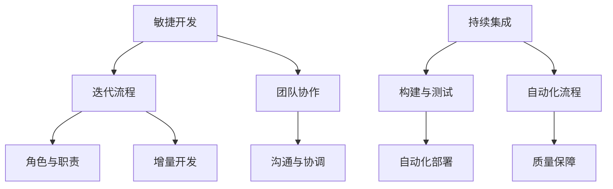

                 

### 文章标题

# 《程序员创业公司的敏捷开发与持续集成实践》

### 关键词

- 敏捷开发
- 持续集成
- 创业公司
- 开发流程
- 团队协作
- 技术实践

### 摘要

本文旨在探讨敏捷开发与持续集成在程序员创业公司中的实际应用与实践经验。首先，我们将详细介绍敏捷开发的基本概念、原则及流程，然后深入解析持续集成（CI）的原理、工具及其与敏捷开发的融合。通过具体案例分析，我们将展示敏捷开发与持续集成如何有效提升创业公司的开发效率和质量。最后，本文还将讨论在创业公司中实施这些技术的最佳实践和挑战，为程序员创业者提供实用的指导。

### 目录

## 第一部分：敏捷开发基础

### 第1章：敏捷开发概述

#### 1.1.1 敏捷开发的起源与基本原则

#### 1.1.2 敏捷开发与传统开发方法的区别

#### 1.1.3 敏捷开发的核心价值

### 第2章：敏捷开发流程

#### 2.1.1 敏捷开发的主要流程

#### 2.1.2 敏捷开发中的角色与职责

#### 2.1.3 敏捷开发中的迭代与增量开发

## 第二部分：持续集成实践

### 第3章：持续集成原理

#### 3.1.1 持续集成的概念与优势

#### 3.1.2 持续集成的工作流程

#### 3.1.3 持续集成与敏捷开发的结合

### 第4章：持续集成工具

#### 4.1.1 持续集成工具的选择与配置

#### 4.1.2 持续集成工具的典型使用场景

#### 4.1.3 持续集成工具的优缺点比较

### 第5章：持续集成案例分析

#### 5.1.1 案例背景

#### 5.1.2 持续集成方案的制定与实施

#### 5.1.3 持续集成带来的收益与挑战

### 第6章：敏捷开发与持续集成融合

#### 6.1.1 敏捷开发与持续集成的互补关系

#### 6.1.2 敏捷开发与持续集成在实际项目中的应用

#### 6.1.3 敏捷开发与持续集成融合的最佳实践

## 第三部分：案例研究

### 第7章：创业公司敏捷开发与持续集成实践案例

#### 7.1.1 案例背景

#### 7.1.2 敏捷开发与持续集成实施过程

#### 7.1.3 案例效果与反思

### 第8章：敏捷开发与持续集成在企业规模拓展中的应用

#### 8.1.1 企业规模拓展对敏捷开发与持续集成的影响

#### 8.1.2 大规模敏捷开发与持续集成的方法与策略

#### 8.1.3 大规模敏捷开发与持续集成实践的挑战与应对

## 附录

### 附录A：常用敏捷开发与持续集成工具介绍

#### A.1.1 JIRA

#### A.1.2 GitLab

#### A.1.3 Jenkins

#### A.1.4 Git

### 附录B：敏捷开发与持续集成实践技巧总结

#### B.1.1 遵循敏捷开发原则的方法与技巧

#### B.1.2 实现持续集成的关键因素

#### B.1.3 常见问题及解决方案

### 关键词解释

- **敏捷开发**：一种以用户需求变化为核心，迭代、持续地进行软件开发的方法。
- **持续集成**：在软件开发过程中，持续地将代码集成到主干，并自动进行构建、测试和部署。
- **创业公司**：指刚刚起步，以创新产品或服务为主要目标的企业。
- **开发流程**：软件开发过程中的一系列步骤和活动。
- **团队协作**：团队成员在共同目标下，进行沟通、合作和协调的过程。
- **技术实践**：在实际开发过程中采用的具体技术和方法。

### 基本概念关系架构

在本文中，我们将使用Mermaid流程图来展示敏捷开发与持续集成的基本概念之间的关系：



### 伪代码与数学模型

在本文中，我们还将使用伪代码来详细阐述核心算法原理，并嵌入latex格式数学公式来解释相关的数学模型。

```python
# 伪代码：敏捷开发迭代流程
function agile_dev迭代流程(需求列表，时间框) {
    for 每个迭代周期 {
        分析需求列表，确定待开发功能
        进行设计、编码、测试和部署
        收集用户反馈，评估迭代结果
        根据反馈调整需求，进入下一个迭代周期
    }
    return 最终产品
}

# latex格式数学模型
$$
模型1:  y = ax + b \\
模型2:  y = mx + c \\
模型3:  y = \frac{a}{x} + b
$$

# 段落内latex公式
$y = mx + b$
```

在接下来的内容中，我们将逐章深入探讨敏捷开发与持续集成的核心概念、原理和实践。通过逻辑清晰的分析和实例讲解，帮助读者全面理解这两种技术，并学会如何在创业公司中有效应用。

## 第一部分：敏捷开发基础

### 第1章：敏捷开发概述

#### 1.1.1 敏捷开发的起源与基本原则

敏捷开发（Agile Development）起源于20世纪90年代末期，当时软件行业面临着快速变化的市场需求和技术进步的挑战。传统的瀑布模型（Waterfall Model）开发方法因其线性、顺序的特点，难以应对这种快速变化的环境。为了解决这些问题，一些软件开发团队开始探索更加灵活和适应性强的开发方法，从而诞生了敏捷开发。

敏捷开发的起源可以追溯到2001年，当时17位软件开发专家在美国犹他州的雪鸟滑雪度假村（Snowbird Ski Resort）举行了一次会议，讨论如何应对复杂、动态的软件开发需求。这次会议的结果是发布了《敏捷宣言》（Manifesto for Agile Software Development）和《敏捷原则》（Agile Principles），标志着敏捷开发正式诞生。

《敏捷宣言》的核心内容如下：

- **个体和互动重于过程与工具**
- **可工作的软件重于详细的文档**
- **客户合作重于合同谈判**
- **响应变化重于遵循计划**

这些原则强调了软件开发过程中的几个关键点：

1. **个体和互动**：软件开发是一个团队合作的过程，需要成员之间的良好沟通和协作。
2. **可工作的软件**：软件的交付质量是首要任务，而不仅仅是文档的完备。
3. **客户合作**：与客户的紧密合作可以帮助团队更好地理解需求，从而提高软件的实用性和满意度。
4. **响应变化**：软件需求往往变化迅速，敏捷开发强调适应这些变化，而不是严格遵循预先制定的计划。

#### 1.1.2 敏捷开发与传统开发方法的区别

敏捷开发与传统开发方法（如瀑布模型）在多个方面存在显著区别：

1. **开发流程**：传统开发方法通常采用线性、顺序的流程，从需求分析、设计、编码到测试和部署，每个阶段都完成后才能进入下一个阶段。而敏捷开发则采用迭代、增量的方式，每个迭代周期包含需求分析、设计、编码、测试和部署等环节，周期结束后对结果进行评估和调整，从而不断优化和改进。

2. **团队角色**：传统开发方法中的角色划分较为明确，如项目经理、开发人员、测试人员等。而敏捷开发中的角色更加灵活，团队成员通常具有多重职责，如产品负责人（Product Owner）、Scrum Master、开发团队等。

3. **需求管理**：传统开发方法往往在项目初期就确定详细的需求，并在整个项目生命周期中尽量保持不变。而敏捷开发则强调需求的变化和适应性，通过不断迭代和反馈来调整需求，确保软件能够及时响应市场变化。

4. **沟通与协作**：传统开发方法中的沟通渠道相对封闭，团队成员之间的协作主要依赖于文档和报告。而敏捷开发则强调面对面的沟通和团队合作，团队成员之间保持密切的沟通和协作，确保项目顺利进行。

5. **交付周期**：传统开发方法的交付周期通常较长，从几个月到几年不等。而敏捷开发的交付周期较短，通常每个迭代周期为几周，这样可以让团队更快地交付可工作的软件，并及时反馈和调整。

#### 1.1.3 敏捷开发的核心价值

敏捷开发的核心价值在于其灵活性和适应性，这主要体现在以下几个方面：

1. **快速响应变化**：敏捷开发强调适应变化，通过迭代和反馈机制，可以快速调整需求和技术实现，从而更好地满足用户需求。

2. **提高团队协作效率**：敏捷开发鼓励团队成员之间的密切沟通和协作，通过共同的目标和价值观，提高团队的凝聚力和工作效率。

3. **提升软件质量**：敏捷开发强调持续集成和测试，通过自动化流程和频繁的代码评审，确保软件的高质量和高稳定性。

4. **降低项目风险**：敏捷开发采用短周期的迭代方式，可以及时发现问题并进行调整，降低项目风险。

5. **提高客户满意度**：与客户的紧密合作和快速交付可工作的软件，可以确保软件的实用性和满意度，提高客户满意度。

总之，敏捷开发为程序员创业公司提供了一种更加灵活、高效和适应性的开发方法，有助于提高团队协作效率、降低项目风险和提升软件质量，从而更好地满足市场需求和用户需求。

### 第2章：敏捷开发流程

#### 2.1.1 敏捷开发的主要流程

敏捷开发采用迭代和增量的方式进行软件开发，其核心流程包括以下几部分：迭代计划、每日站立会议、迭代评审和迭代回顾。以下是这些流程的详细解释。

**1. 迭代计划**

迭代计划是敏捷开发中的关键活动，它为每个迭代周期设定目标和计划。通常，迭代计划会在一个迭代周期的开始进行，团队成员聚集在一起讨论以下问题：

- **目标**：确定本次迭代的主要目标和交付成果。
- **任务分配**：根据团队的能力和资源，将任务分配给合适的团队成员。
- **时间估算**：为每个任务估算所需的时间，确保在预定的时间内能够完成。
- **优先级排序**：确定任务的优先级，确保关键任务优先完成。

**2. 每日站立会议**

每日站立会议是敏捷开发中的一种简短、高频的团队沟通活动，通常持续15分钟左右。会议的主要目的是让团队成员分享以下信息：

- **进度**：每个团队成员报告自己昨天完成的工作和今天计划完成的工作。
- **问题**：团队成员提出遇到的问题和需要协助的地方。
- **阻碍**：讨论可能影响项目进度的障碍，并寻找解决方案。

通过每日站立会议，团队可以保持透明和高效的沟通，及时发现和解决问题，从而确保项目按计划进行。

**3. 迭代评审**

迭代评审是每个迭代周期结束时进行的活动，其目的是评估迭代成果，收集反馈，并为下一个迭代做准备。迭代评审通常包括以下步骤：

- **展示成果**：团队成员展示本次迭代开发的功能和成果。
- **用户反馈**：产品负责人（Product Owner）和客户对展示的成果进行反馈，指出优点和需要改进的地方。
- **评估**：团队对本次迭代的效果进行评估，总结成功经验和教训。

**4. 迭代回顾**

迭代回顾是敏捷开发中反思和改进的重要环节，通常在迭代评审之后进行。迭代回顾的目的是通过回顾本次迭代的过程和结果，找出可以改进的地方，并制定相应的改进措施。迭代回顾通常包括以下步骤：

- **问题分析**：团队讨论本次迭代中遇到的问题和挑战，分析原因。
- **改进措施**：根据问题分析的结果，提出改进措施，并分配责任。
- **行动计划**：制定下一步的行动计划，确保改进措施得到落实。

通过迭代计划和每日站立会议，团队可以保持高效的工作节奏和良好的沟通；迭代评审和迭代回顾则确保项目在不断优化和改进中前进。这种迭代和增量的开发方式，使得敏捷开发能够灵活应对需求变化，提高团队协作效率和软件质量。

#### 2.1.2 敏捷开发中的角色与职责

在敏捷开发中，团队成员的角色和职责与传统开发方法有所不同，这种角色设计旨在提高团队的灵活性和协作效率。以下是敏捷开发中常见的主要角色及其职责：

**1. 产品负责人（Product Owner）**

产品负责人是敏捷开发中的核心角色，负责定义产品的愿景和需求，确保团队开发的产品能够满足用户和市场的需求。其主要职责包括：

- **需求管理**：制定和优先级排序产品需求，确保团队了解产品的目标和方向。
- **用户故事编写**：编写清晰、具体和可测试的用户故事，描述产品功能。
- **需求变更管理**：根据市场变化和用户反馈，调整需求优先级和范围。
- **决策**：与利益相关者沟通，做出关于产品开发的关键决策。

**2. Scrum Master**

Scrum Master是敏捷开发中的教练和协调者，负责确保团队遵循敏捷原则和流程，帮助团队解决阻碍，提高协作效率。其主要职责包括：

- **流程指导**：协助团队理解和应用敏捷原则，确保团队成员遵循敏捷实践。
- **障碍移除**：识别并解决团队在开发过程中遇到的问题和障碍。
- **团队支持**：提供团队所需的资源和培训，支持团队成长。
- **会议主持**：组织和主持会议，确保会议高效、有序进行。

**3. 开发团队（Development Team）**

开发团队是敏捷开发中的核心力量，负责实际开发和实现产品功能。团队成员通常具有多重职责，包括开发、测试、设计等。其主要职责包括：

- **任务执行**：根据产品负责人和Scrum Master的指导，执行任务和开发功能。
- **代码评审**：进行代码评审，确保代码质量和一致性。
- **协作沟通**：与团队成员、产品负责人和Scrum Master保持紧密沟通，确保项目顺利进行。
- **持续改进**：在迭代过程中不断反思和改进，提高团队协作效率和开发质量。

**4. 利益相关者（Stakeholders）**

利益相关者是敏捷开发中受到产品开发影响的人员，如客户、项目经理、市场部门等。他们的职责包括：

- **需求提供**：提供产品需求、反馈和市场信息，确保产品符合市场需求。
- **决策参与**：参与关键决策，确保产品开发符合公司和业务目标。
- **监督支持**：监督项目进度和成果，提供必要的支持和资源。

敏捷开发中的角色设计旨在打破传统开发方法中的角色壁垒，促进团队成员之间的沟通和协作。通过明确每个角色的职责，敏捷开发团队能够更加高效地应对市场需求变化，提高产品开发质量和客户满意度。

#### 2.1.3 敏捷开发中的迭代与增量开发

在敏捷开发中，迭代（Iteration）和增量（Increment）是两个核心概念，它们共同构成了敏捷开发的基本框架。通过迭代和增量开发，团队可以灵活地适应需求变化，持续交付高质量的产品。

**1. 迭代的定义与特点**

迭代是敏捷开发中的一种周期性活动，每个迭代周期通常为2-4周。在每个迭代周期中，团队按照敏捷流程完成一系列任务，包括需求分析、设计、编码、测试和部署等。以下是一些迭代的特点：

- **固定周期**：每个迭代周期有固定的长度，团队在这段时间内集中精力完成既定的任务。
- **可预测性**：通过固定的周期，团队可以更好地预测项目进度和交付时间。
- **反馈与评估**：每个迭代结束时，团队会进行评审和回顾，收集用户反馈，评估迭代成果，并根据反馈进行调整。

**2. 增量的定义与特点**

增量是指在每个迭代周期内交付的软件功能。与传统的“大项目”开发方法不同，敏捷开发采用增量方式逐步交付产品，每个增量都是可用的、完整的软件功能。以下是一些增量的特点：

- **逐步交付**：在每个迭代周期中，团队交付一个可用的软件增量，逐步完善整个产品。
- **快速反馈**：通过逐步交付增量，团队可以更快地获得用户反馈，及时调整需求和开发方向。
- **持续改进**：随着每个增量的交付，团队可以不断改进产品，提高质量，优化用户体验。

**3. 迭代与增量的关系**

迭代和增量之间密切相关，迭代是完成增量的过程，而增量是迭代交付的结果。以下是一些关键点：

- **迭代驱动**：每个迭代都是基于需求分析和规划来完成的，迭代的目标是交付一个可用的软件增量。
- **增量累积**：随着迭代的进行，每个增量的交付逐步累积，最终形成完整的软件产品。
- **持续交付**：通过迭代和增量开发，团队可以持续交付高质量的产品，实现快速响应市场需求。

**4. 迭代与增量开发的优点**

迭代与增量开发具有多个优点，有助于提高软件开发质量和团队协作效率：

- **灵活性**：通过迭代和增量开发，团队可以灵活地适应需求变化，快速调整开发方向。
- **质量保障**：每个迭代都进行全面的测试和评估，确保交付的软件功能质量高、稳定性强。
- **快速反馈**：通过逐步交付增量，团队可以更快地获得用户反馈，及时优化产品。
- **持续改进**：迭代和增量开发鼓励团队不断反思和改进，提高开发过程和产品质量。

总之，迭代与增量开发是敏捷开发的核心机制，通过这种机制，团队可以高效地应对需求变化，提高产品质量，实现持续交付。在接下来的章节中，我们将进一步探讨敏捷开发中的具体实践，帮助读者更好地理解和应用这一开发方法。

## 第二部分：持续集成实践

### 第3章：持续集成原理

#### 3.1.1 持续集成的概念与优势

持续集成（Continuous Integration，CI）是一种软件开发实践，旨在通过频繁地将代码集成到一个共享的主干中，以快速发现和解决潜在的问题。其核心理念是“早而频繁地集成”，即开发者在每次代码提交后，系统会自动执行一系列测试和验证步骤，确保新代码不会破坏现有功能。

**1. 持续集成的概念**

持续集成的概念可以简单概括为：

- **频繁提交**：开发者在每次代码变更后，立即将代码提交到版本控制系统中。
- **自动构建**：集成服务器会自动检测代码提交，并触发构建过程，生成可执行的代码。
- **测试执行**：构建过程中会自动执行一系列预定义的测试，包括单元测试、集成测试和性能测试。
- **反馈机制**：测试结果会立即反馈给开发人员，以便他们及时解决问题。

**2. 持续集成的优势**

持续集成在软件开发中具有多项显著优势，包括：

- **早期发现问题**：通过频繁的代码集成和测试，可以在早期阶段发现并解决潜在的问题，降低缺陷积累。
- **提高代码质量**：持续集成的自动化测试和反馈机制，有助于提高代码质量，减少代码中的缺陷。
- **加快开发速度**：持续集成可以快速集成新代码，缩短开发周期，提高团队协作效率。
- **增强团队协作**：持续集成需要开发人员频繁沟通和协作，有助于建立更紧密的团队合作。
- **简化部署过程**：持续集成可以自动化部署流程，确保软件在不同环境中的稳定性。

#### 3.1.2 持续集成的工作流程

持续集成的工作流程包括以下几个关键步骤：

**1. 提交代码**

开发者在本地环境中进行代码开发，并将代码提交到版本控制系统（如Git）中。

**2. 触发构建**

版本控制系统检测到代码提交后，会触发持续集成服务器（如Jenkins、GitLab CI）进行构建。

**3. 构建过程**

持续集成服务器执行一系列预定义的构建步骤，包括编译代码、安装依赖、运行测试等。

**4. 测试执行**

构建过程中，会执行一系列测试，包括单元测试、集成测试、性能测试等，以确保新代码不会引入缺陷。

**5. 反馈机制**

测试结果会立即反馈给开发人员，包括测试通过情况、错误日志等。如果测试失败，开发人员需要及时解决这些问题。

**6. 部署**

通过持续集成，可以自动化部署软件到不同的环境（如测试环境、生产环境），确保软件在不同环境中的稳定性。

**7. 监控与维护**

持续集成系统会持续监控构建和测试过程，确保软件质量，并在必要时进行维护和更新。

通过以上步骤，持续集成可以有效提高软件开发的质量和效率，促进团队协作和沟通。

#### 3.1.3 持续集成与敏捷开发的结合

持续集成与敏捷开发有着紧密的联系，两者相互补充，共同推动软件开发过程的质量和效率提升。

**1. 敏捷开发与持续集成的互补关系**

- **迭代与频繁集成**：敏捷开发的迭代过程强调频繁交付可工作的软件，而持续集成则通过频繁的代码集成和测试，确保每次迭代的质量。
- **需求变动与适应性**：敏捷开发强调灵活应对需求变化，持续集成则通过自动化测试和反馈，快速适应这些变化，降低风险。
- **团队协作与沟通**：敏捷开发强调团队成员之间的紧密协作和沟通，持续集成通过自动化流程和即时反馈，促进团队协作，减少沟通障碍。

**2. 实际项目中的应用**

在敏捷开发项目中，持续集成通常作为以下环节的一部分：

- **迭代计划**：在每次迭代计划中，团队会定义持续集成过程的具体步骤和测试策略。
- **每日站立会议**：团队在每日站立会议中讨论持续集成过程中的问题和障碍，确保及时解决。
- **迭代评审**：在迭代评审中，团队会展示持续集成过程中测试和构建的结果，收集用户反馈。
- **迭代回顾**：在迭代回顾中，团队会评估持续集成过程的效果，并提出改进措施。

**3. 最佳实践**

- **自动化测试**：确保所有测试都可以自动化执行，减少人工干预，提高测试效率和可靠性。
- **持续反馈**：及时反馈测试结果，确保开发人员可以立即发现和解决问题。
- **版本控制**：使用版本控制系统管理代码，确保代码的版本和变更记录清晰。
- **环境一致性**：确保构建和测试环境与生产环境一致，减少环境差异导致的问题。

通过将持续集成与敏捷开发相结合，团队可以更高效地应对需求变化，提高软件质量，实现快速交付，从而在竞争激烈的市场中保持优势。

### 第4章：持续集成工具

#### 4.1.1 持续集成工具的选择与配置

在敏捷开发中，选择合适的持续集成工具对于提高开发效率和软件质量至关重要。以下是一些常用的持续集成工具及其选择和配置方法。

**1. Jenkins**

**Jenkins** 是最受欢迎的持续集成工具之一，具有高度的可定制性和灵活性。

**选择与配置方法**：

- **安装与配置**：Jenkins 可以在 Linux、Windows 和 macOS 等操作系统上安装。安装完成后，需要配置 Jenkins 服务器，包括添加项目、插件等。
- **项目配置**：在 Jenkins 中创建项目，配置构建脚本、测试脚本、部署脚本等。
- **插件管理**：Jenkins 提供丰富的插件生态系统，可以根据需要安装和配置插件，如 Git 插件、JUnit 插件等。
- **环境配置**：配置构建环境，包括 JDK、数据库驱动、第三方库等。

**2. GitLab CI**

**GitLab CI** 是 GitLab 内置的持续集成工具，易于配置和使用。

**选择与配置方法**：

- **安装与配置**：GitLab CI 在 GitLab 实例中自动启用。在 `.gitlab-ci.yml` 文件中配置构建脚本、测试脚本和部署脚本。
- **构建脚本**：定义构建过程中的任务，如拉取代码、编译、测试等。
- **测试脚本**：定义测试任务，包括单元测试、集成测试和性能测试。
- **部署脚本**：定义部署任务，如部署到测试环境或生产环境。

**3. GitHub Actions**

**GitHub Actions** 是 GitHub 提供的持续集成服务，支持多种编程语言和操作系统。

**选择与配置方法**：

- **安装与配置**：在 GitHub 仓库的 `.github/workflows/` 目录下创建 YAML 文件，定义构建、测试和部署脚本。
- **事件触发**：配置事件触发器，如代码提交、拉取请求、发布等。
- **环境配置**：配置构建环境，包括操作系统、编程语言、依赖库等。

**4. CircleCI**

**CircleCI** 是一款功能强大的持续集成工具，支持自动化构建、测试和部署。

**选择与配置方法**：

- **安装与配置**：在 CircleCI 网站上创建项目，配置环境变量、构建脚本和测试脚本。
- **项目设置**：配置构建计划，包括分支、分支策略、触发器等。
- **测试脚本**：编写测试脚本，包括单元测试、集成测试和性能测试。

**5. Bitbucket Pipelines**

**Bitbucket Pipelines** 是 Bitbucket 提供的持续集成服务，支持多语言和自动化部署。

**选择与配置方法**：

- **安装与配置**：在 Bitbucket 仓库的 `.bitbucket-pipelines.yml` 文件中配置构建脚本和测试脚本。
- **构建脚本**：定义构建任务，包括编译、测试和部署等。
- **环境配置**：配置构建环境，包括操作系统、编程语言、依赖库等。

选择持续集成工具时，应考虑团队的技术栈、开发流程和项目需求。通过合理配置和使用持续集成工具，团队可以显著提高开发效率、代码质量和协作效率。

#### 4.1.2 持续集成工具的典型使用场景

持续集成工具在软件开发中有着广泛的应用场景，以下是几个典型的使用场景：

**1. 代码仓库的自动化构建和测试**

在每次代码提交到版本控制系统中时，持续集成工具会自动触发构建和测试过程。这有助于确保每次提交的代码都是可构建和可测试的，从而提高代码质量和可靠性。例如，使用 Jenkins 可以在代码提交后自动触发构建，并执行单元测试、集成测试和性能测试。

**2. 拉取请求的代码审查**

在团队协作开发中，拉取请求（Pull Request）是常见的代码审查方式。持续集成工具可以自动检查拉取请求中的代码，包括编译错误、测试失败和代码风格问题。如果代码不符合预期，持续集成工具会阻止合并，确保代码质量。例如，使用 GitLab CI，可以在拉取请求被合并前自动执行测试，并报告测试结果。

**3. 预发布环境的自动化部署**

持续集成工具可以用于将代码部署到预发布环境，以便进行最终测试和验证。这有助于确保在生产环境部署前，代码经过充分的测试和验证，降低风险。例如，使用 Jenkins，可以将代码部署到预发布服务器，并执行一系列测试，以确保部署的代码质量。

**4. 定期构建和发布**

对于一些长期运行的项目，持续集成工具可以用于定期构建和发布。这有助于确保项目始终保持最新版本，并确保每个版本的代码都是稳定和可用的。例如，使用 GitHub Actions，可以配置定期构建和发布，确保每周或每月发布最新版本。

通过以上使用场景，持续集成工具可以显著提高软件开发的质量和效率，促进团队协作和沟通。

#### 4.1.3 持续集成工具的优缺点比较

以下是几个常见持续集成工具的优缺点比较：

**1. Jenkins**

**优点**：

- **高度可定制性**：Jenkins 支持丰富的插件和扩展，可以满足各种开发需求。
- **灵活的构建流程**：Jenkins 提供多种构建脚本和任务，支持复杂构建流程。
- **广泛的社区支持**：Jenkins 拥有庞大的社区，可以提供丰富的资源和解决方案。

**缺点**：

- **配置复杂**：Jenkins 的配置相对复杂，需要一定的学习和维护成本。
- **性能问题**：在高并发和复杂场景下，Jenkins 可能会出现性能瓶颈。

**2. GitLab CI**

**优点**：

- **集成性**：GitLab CI 与 GitLab 完美集成，提供统一的代码管理和持续集成平台。
- **易于配置**：使用简单的 YAML 文件配置持续集成流程，易于学习和维护。
- **免费和开源**：GitLab CI 是免费的，并且开源，无需额外的成本。

**缺点**：

- **性能限制**：GitLab CI 在处理大量构建任务时，性能可能受到限制。
- **扩展性**：虽然 GitLab CI 提供了一些扩展功能，但相对于 Jenkins，扩展性有限。

**3. GitHub Actions**

**优点**：

- **平台集成**：GitHub Actions 与 GitHub 完美集成，提供方便的代码管理和持续集成功能。
- **灵活性**：支持多种操作系统和编程语言，适应不同的开发需求。
- **成本效益**：GitHub Actions 提供免费的构建时间，适合中小型项目。

**缺点**：

- **依赖 GitHub**：GitHub Actions 需要依赖 GitHub，无法在其他代码仓库中使用。
- **扩展性**：虽然 GitHub Actions 提供了一些扩展功能，但相对于 Jenkins，扩展性有限。

**4. CircleCI**

**优点**：

- **高性能**：CircleCI 提供高性能的构建和测试环境，适合处理复杂和大量的构建任务。
- **用户友好**：CircleCI 提供直观的 Web 界面，易于配置和管理。
- **丰富的集成**：CircleCI 支持与多种工具和服务集成，如 Docker、AWS 等。

**缺点**：

- **成本较高**：CircleCI 是商业服务，对于中小型项目可能成本较高。
- **复杂配置**：CircleCI 的配置相对复杂，需要一定的学习和维护成本。

**5. Bitbucket Pipelines**

**优点**：

- **集成性**：Bitbucket Pipelines 与 Bitbucket 完美集成，提供统一的代码管理和持续集成平台。
- **易于配置**：使用简单的 YAML 文件配置持续集成流程，易于学习和维护。
- **免费的构建时间**：Bitbucket Pipelines 提供免费的构建时间，适合中小型项目。

**缺点**：

- **性能限制**：Bitbucket Pipelines 在处理大量构建任务时，性能可能受到限制。
- **依赖 Bitbucket**：Bitbucket Pipelines 需要依赖 Bitbucket，无法在其他代码仓库中使用。

在选择持续集成工具时，应根据团队的需求、技术栈和预算，综合考虑各工具的优缺点，选择最合适的工具。通过合理配置和使用持续集成工具，团队可以显著提高开发效率、代码质量和协作效率。

### 第5章：持续集成案例分析

#### 5.1.1 案例背景

某创业公司A，专注于开发一款移动应用，目标市场为年轻用户群体。公司由一名技术创始人、两名开发人员和一名产品经理组成。随着产品逐步完善，团队面临以下挑战：

- **代码质量问题**：由于团队成员各自独立开发，代码质量参差不齐，导致合并时经常出现冲突和错误。
- **开发效率低下**：没有自动化测试和集成流程，每次代码提交后需要手动执行测试，浪费大量时间。
- **协作困难**：团队成员之间沟通不畅，需求变更时无法及时同步，导致进度延误。

为了解决这些问题，公司决定引入持续集成（CI）实践，提高开发效率和软件质量。

#### 5.1.2 持续集成方案的制定与实施

**1. 需求分析与规划**

- **确定目标**：提高代码质量，减少缺陷，加快开发进度。
- **评估现有环境**：评估现有开发工具和流程，确定需要改进的方面。
- **制定方案**：选择合适的持续集成工具（Jenkins），制定详细的实施计划，包括环境搭建、工具配置、流程优化等。

**2. 工具配置与集成**

- **环境搭建**：在公司的服务器上安装 Jenkins，配置 JDK、数据库驱动等环境。
- **项目配置**：在 Jenkins 中创建项目，配置构建脚本、测试脚本和部署脚本。
- **代码管理**：使用 Git 进行版本控制，确保代码的版本和变更记录清晰。
- **自动化测试**：编写单元测试和集成测试脚本，确保每次代码提交后自动执行。

**3. 流程优化**

- **提交代码**：开发者将代码提交到 Git 仓库。
- **触发构建**：Jenkins 检测到代码提交后，自动触发构建过程。
- **执行测试**：Jenkins 执行预定义的测试脚本，包括单元测试、集成测试和性能测试。
- **反馈结果**：测试结果通过邮件、Webhook 等方式反馈给开发者。
- **部署代码**：通过 Jenkins 自动部署代码到测试环境或生产环境。

#### 5.1.3 持续集成带来的收益与挑战

**1. 收益**

- **提高代码质量**：通过自动化测试和反馈机制，早期发现和解决代码中的问题，降低缺陷率。
- **加快开发速度**：自动化构建和测试减少手动操作，提高开发效率，缩短开发周期。
- **增强团队协作**：持续集成促进团队成员之间的沟通和协作，提高团队凝聚力。
- **减少维护成本**：持续集成有助于保持代码的一致性和稳定性，降低维护成本。

**2. 挑战**

- **配置复杂**：Jenkins 的配置相对复杂，需要学习和维护成本。
- **测试覆盖率不足**：自动化测试可能无法覆盖所有测试场景，需要持续优化测试策略。
- **依赖稳定性**：持续集成系统的稳定性和可靠性直接影响开发效率，需要定期维护和监控。

通过引入持续集成实践，创业公司A在代码质量、开发效率和团队协作方面取得了显著改善。虽然面临一些挑战，但通过合理规划和持续优化，公司能够更好地应对这些挑战，实现持续集成的目标。

### 第6章：敏捷开发与持续集成融合

#### 6.1.1 敏捷开发与持续集成的互补关系

敏捷开发和持续集成是两种互补的软件开发方法，它们共同致力于提高团队协作效率、代码质量和项目交付速度。

**1. 敏捷开发的优势**

敏捷开发通过迭代和增量的方式，使团队能够快速响应需求变化，持续交付可工作的软件。其主要优势包括：

- **灵活性**：敏捷开发允许团队在项目进行过程中根据实际情况调整计划和目标，适应市场需求。
- **高效协作**：敏捷开发强调团队成员之间的紧密沟通和协作，通过每日站立会议、迭代评审和迭代回顾，确保项目顺利进行。
- **持续反馈**：敏捷开发通过迭代评审和迭代回顾，及时收集用户反馈，持续改进产品。

**2. 持续集成的优势**

持续集成通过自动化构建、测试和部署，确保每次代码提交的质量，提高开发效率和软件质量。其主要优势包括：

- **早期发现问题**：持续集成在每次代码提交后立即执行测试和构建，早期发现和解决潜在的问题，减少缺陷积累。
- **提高代码质量**：持续集成通过自动化测试和反馈机制，确保每次提交的代码都是可构建和可测试的，提高代码质量。
- **加快交付速度**：持续集成自动化流程减少手动操作，缩短开发周期，加快产品交付速度。

**3. 敏捷开发与持续集成的互补关系**

敏捷开发和持续集成在软件开发过程中相互补充，共同推动项目成功。

- **迭代与集成**：敏捷开发通过迭代和增量开发，逐步交付产品功能；持续集成通过频繁的代码集成和测试，确保每次迭代的质量。
- **反馈与改进**：敏捷开发通过迭代评审和迭代回顾，收集用户反馈，持续改进产品；持续集成通过自动化测试和反馈，确保每次代码提交的质量。
- **协作与效率**：敏捷开发强调团队成员之间的紧密协作和沟通，持续集成自动化流程提高开发效率，减少重复工作。

通过将敏捷开发与持续集成相结合，团队可以在快速响应需求变化的同时，确保代码质量和交付速度。这种互补关系使得敏捷开发与持续集成在软件项目中相得益彰，共同推动项目的成功。

#### 6.1.2 敏捷开发与持续集成在实际项目中的应用

在实际项目中，敏捷开发与持续集成的结合可以显著提高团队协作效率、代码质量和项目交付速度。以下是一个实际项目中的应用案例。

**项目背景**

某创业公司B正在开发一款在线教育平台，团队由5名开发人员、1名产品经理和1名测试人员组成。项目采用敏捷开发方法，每个迭代周期为2周。为了确保项目的顺利进行，团队决定引入持续集成实践。

**应用步骤**

**1. 确定持续集成目标**

- **提高代码质量**：通过自动化测试和反馈，确保每次提交的代码都是可构建和可测试的。
- **加快开发速度**：自动化构建和测试减少手动操作，缩短开发周期。
- **增强团队协作**：通过持续集成，促进团队成员之间的沟通和协作。

**2. 选择合适的持续集成工具**

团队选择使用 Jenkins 作为持续集成工具，因为 Jenkins 具有高度的可定制性和丰富的插件生态系统。

**3. 配置 Jenkins**

- **安装与配置**：在公司的服务器上安装 Jenkins，配置 JDK、数据库驱动等环境。
- **创建项目**：在 Jenkins 中创建项目，配置构建脚本、测试脚本和部署脚本。
- **集成 Git**：配置 Git 插件，确保 Jenkins 可以从 Git 仓库中拉取代码。

**4. 编写自动化测试脚本**

团队编写了单元测试和集成测试脚本，覆盖主要功能模块。测试脚本使用 JUnit 标准格式，便于 Jenkins 执行。

**5. 集成持续集成流程**

- **提交代码**：开发人员将代码提交到 Git 仓库。
- **触发构建**：Jenkins 检测到代码提交后，自动触发构建过程。
- **执行测试**：Jenkins 执行预定义的测试脚本，包括单元测试和集成测试。
- **反馈结果**：测试结果通过邮件和 Webhook 方式反馈给开发人员。

**6. 部署代码**

- **部署脚本**：编写部署脚本，用于将代码部署到测试环境和生产环境。
- **自动化部署**：在测试通过后，Jenkins 自动部署代码到测试环境，供测试人员验收。
- **生产部署**：在测试通过并确认无误后，Jenkins 自动部署代码到生产环境。

**7. 监控与维护**

- **监控构建和测试过程**：通过 Jenkins Web 界面和日志文件，监控构建和测试过程。
- **维护和优化**：定期检查 Jenkins 服务器，确保其稳定运行；根据项目需求，调整构建和测试脚本。

**实际效果**

通过引入持续集成实践，团队在多个方面取得了显著改进：

- **代码质量提高**：自动化测试和反馈机制帮助团队早期发现和解决代码中的问题，降低缺陷率。
- **开发速度加快**：自动化构建和测试减少手动操作，缩短开发周期，提高开发效率。
- **团队协作增强**：持续集成促进团队成员之间的沟通和协作，提高团队凝聚力。
- **部署效率提升**：自动化部署减少人工干预，确保代码在不同环境中的稳定性。

总之，敏捷开发与持续集成的结合在实际项目中取得了显著成效，为创业公司B的成功交付提供了有力保障。

#### 6.1.3 敏捷开发与持续集成融合的最佳实践

将敏捷开发与持续集成相结合，可以显著提高软件开发效率和质量。以下是一些最佳实践，以帮助团队实现这种融合。

**1. 确定共同目标**

在开始敏捷开发与持续集成的实践之前，团队应明确共同目标，确保每个人对项目目标有清晰的认识。共同目标可以是提高代码质量、加快开发速度、增强团队协作等。

**2. 选择合适的工具**

根据团队的需求和技能，选择合适的持续集成工具。常见的持续集成工具有 Jenkins、GitLab CI、GitHub Actions 等。选择工具时，应考虑工具的易用性、扩展性、性能和社区支持。

**3. 配置和测试自动化流程**

在持续集成实践中，配置和测试自动化流程至关重要。确保构建、测试和部署过程自动化，减少手动操作。编写可复用的测试脚本，确保测试覆盖率。

**4. 确定反馈机制**

建立有效的反馈机制，确保每次代码提交后都能及时收到测试结果。使用邮件、Webhook、即时通讯工具等渠道，将反馈传递给相关成员。

**5. 团队协作与沟通**

敏捷开发强调团队协作和沟通，持续集成也需要团队成员之间的紧密合作。确保团队成员定期参与每日站立会议、迭代评审和迭代回顾，分享进度、问题和改进措施。

**6. 定期优化流程**

持续集成流程不是一成不变的，应根据项目需求、团队反馈和最佳实践，定期优化流程。通过不断改进，提高开发效率和质量。

**7. 管理风险**

在敏捷开发与持续集成融合过程中，要充分考虑项目风险，并制定相应的风险管理策略。确保在遇到问题时，团队能够迅速应对，降低风险影响。

通过遵循这些最佳实践，团队可以更好地将敏捷开发与持续集成相结合，提高软件开发效率和质量，实现项目成功。

### 第7章：创业公司敏捷开发与持续集成实践案例

#### 7.1.1 案例背景

某创业公司C，专注于开发一款企业级项目管理工具，团队由5名开发人员、1名产品经理和1名测试人员组成。公司初创阶段，项目规模较小，采用传统的瀑布模型进行开发，但随着项目的逐步扩大，团队遇到了以下问题：

- **开发效率低**：团队成员之间沟通不畅，需求变更频繁，开发进度缓慢。
- **代码质量差**：代码质量参差不齐，合并时经常出现冲突和错误。
- **测试覆盖不足**：测试覆盖不足，导致部分功能未经过充分测试。

为了提高开发效率、代码质量和测试覆盖率，公司决定引入敏捷开发和持续集成实践。

#### 7.1.2 敏捷开发与持续集成实施过程

**1. 制定敏捷开发计划**

- **团队培训**：对团队成员进行敏捷开发培训，确保每个人理解敏捷原则和方法。
- **迭代计划**：确定每个迭代周期的目标、任务和里程碑。
- **每日站立会议**：安排每日站立会议，讨论进度、问题和改进措施。
- **迭代评审和回顾**：每个迭代周期结束后，进行迭代评审和回顾，收集用户反馈，总结经验教训。

**2. 引入持续集成工具**

- **选择工具**：选择 GitLab CI 作为持续集成工具，因为它与 GitLab 完美集成，易于配置和使用。
- **环境搭建**：在公司的服务器上安装 GitLab CI，配置 JDK、数据库驱动等环境。
- **项目配置**：在 GitLab CI 中创建项目，配置构建脚本、测试脚本和部署脚本。

**3. 编写自动化测试脚本**

- **单元测试**：编写单元测试脚本，覆盖主要功能模块，使用 JUnit 格式。
- **集成测试**：编写集成测试脚本，模拟实际业务流程，确保各个模块之间的协同工作。
- **性能测试**：编写性能测试脚本，评估系统在高并发情况下的性能表现。

**4. 集成持续集成流程**

- **代码提交**：开发人员将代码提交到 Git 仓库。
- **触发构建**：GitLab CI 检测到代码提交后，自动触发构建过程。
- **执行测试**：GitLab CI 执行预定义的测试脚本，包括单元测试、集成测试和性能测试。
- **反馈结果**：测试结果通过邮件和 Webhook 方式反馈给开发人员。

**5. 自动化部署**

- **部署脚本**：编写部署脚本，用于将代码部署到测试环境和生产环境。
- **自动化部署**：在测试通过后，GitLab CI 自动部署代码到测试环境，供测试人员验收。
- **生产部署**：在测试通过并确认无误后，GitLab CI 自动部署代码到生产环境。

**6. 监控与维护**

- **监控构建和测试过程**：通过 GitLab CI Web 界面和日志文件，监控构建和测试过程。
- **维护和优化**：定期检查 GitLab CI 服务器，确保其稳定运行；根据项目需求，调整构建和测试脚本。

#### 7.1.3 案例效果与反思

**1. 效果**

- **提高开发效率**：通过每日站立会议和迭代评审，团队成员之间的沟通更加顺畅，需求变更得到及时处理，开发进度加快。
- **代码质量提升**：持续集成的引入，使团队成员更加重视代码质量，通过自动化测试和反馈机制，早期发现和解决代码中的问题，降低缺陷率。
- **测试覆盖率提高**：自动化测试脚本的编写和执行，确保了主要功能模块和业务流程的测试覆盖，提高了测试覆盖率。
- **自动化部署**：自动化部署减少人工干预，确保代码在不同环境中的稳定性，缩短了部署时间。

**2. 反思**

- **持续集成配置复杂**：虽然 GitLab CI 易于配置，但对于初创团队来说，初期配置过程相对复杂，需要一定的学习和维护成本。
- **测试脚本覆盖不足**：自动化测试脚本编写过程中，可能无法覆盖所有测试场景，需要持续优化测试策略，提高测试覆盖率。
- **团队协作**：敏捷开发和持续集成需要团队成员之间的紧密协作和沟通，部分团队成员可能不习惯这种方式，需要加强培训和引导。

总之，通过引入敏捷开发和持续集成实践，创业公司C在开发效率、代码质量和测试覆盖率方面取得了显著提升。虽然面临一些挑战，但通过不断优化和改进，团队能够更好地应对这些挑战，实现项目目标。

### 第8章：敏捷开发与持续集成在企业规模拓展中的应用

#### 8.1.1 企业规模拓展对敏捷开发与持续集成的影响

随着企业规模的不断扩大，敏捷开发与持续集成实践面临着新的挑战和机遇。企业规模的拓展会影响到团队的规模、项目的复杂度、资源的分配以及组织的文化，这些因素都会对敏捷开发与持续集成的实施产生影响。

**1. 团队规模的增加**

- **沟通效率降低**：随着团队规模的增加，团队成员之间的沟通效率可能会降低。每日站立会议、迭代评审等协作活动可能需要更长的时间来覆盖更多的参与者。
- **协作复杂性增加**：大型团队中的角色和职责可能更加复杂，需要更细致的分工和协作流程来确保项目的顺利进行。

**2. 项目复杂度的提升**

- **需求变化**：大规模项目往往涉及更多的功能模块和业务领域，需求变化更加频繁，这要求敏捷开发更加灵活和适应性。
- **技术架构**：大型项目可能需要更加复杂的技术架构来支持，持续集成的自动化流程也需要进行相应的调整和优化。

**3. 资源分配的挑战**

- **资源分配不均**：在大型企业中，资源（如人员、设备、资金）的分配可能不均衡，这可能导致某些团队或项目资源不足，影响敏捷开发与持续集成的实施。
- **跨部门协作**：大型企业的跨部门协作可能更加复杂，需要建立有效的沟通机制和协作流程，以确保敏捷开发与持续集成能够顺利实施。

**4. 组织文化的适应**

- **文化转变**：大型企业可能存在不同的组织文化，需要通过培训和引导，推动企业文化的转变，以适应敏捷开发与持续集成的要求。
- **领导层的支持**：领导层的支持和参与对于敏捷开发与持续集成的成功至关重要，需要确保管理层对敏捷和持续集成有清晰的理解和认同。

#### 8.1.2 大规模敏捷开发与持续集成的方法与策略

为了应对企业规模拓展带来的挑战，可以采取以下方法和策略来实施大规模敏捷开发与持续集成：

**1. 分层管理**

- **跨职能团队**：将团队划分为跨职能的子团队，每个子团队负责特定的功能模块或业务领域，这样可以提高团队协作效率和沟通效果。
- **迭代周期**：为每个子团队设定不同的迭代周期，根据项目的重要性和优先级来安排，确保关键功能的优先开发。

**2. 持续集成平台**

- **集中管理**：建立一个集中的持续集成平台，用于管理所有子团队的构建、测试和部署过程，确保自动化流程的一致性和稳定性。
- **资源池**：配置资源池，确保每个子团队在需要时能够获得足够的计算资源和存储资源。

**3. 沟通与协作**

- **定期会议**：定期举行跨团队的沟通会议，分享进度、问题和改进措施，确保项目整体进展的透明和同步。
- **协作工具**：利用协作工具（如 Slack、Confluence）来促进团队之间的实时沟通和文档共享。

**4. 质量管理**

- **代码评审**：加强代码评审流程，确保代码质量和一致性，特别是在大型团队中，代码评审有助于发现潜在的问题和缺陷。
- **测试自动化**：扩大测试自动化范围，确保关键功能和业务流程的全面测试，提高测试覆盖率。

**5. 文化建设**

- **培训与教育**：为团队成员提供敏捷开发和持续集成的培训，帮助他们理解和掌握相关技能。
- **领导支持**：确保领导层对敏捷和持续集成有明确的理解和认同，并提供必要的支持和资源。

#### 8.1.3 大规模敏捷开发与持续集成实践的挑战与应对

在实施大规模敏捷开发与持续集成过程中，企业可能会面临以下挑战：

**1. 挑战**

- **管理复杂性增加**：随着项目规模的扩大，管理复杂性也随之增加，需要更精细化的管理和协调。
- **资源分配问题**：资源分配不均可能导致某些团队或项目效率低下，影响整体进度。
- **文化阻力**：不同团队和组织文化之间的差异可能对敏捷和持续集成的实施产生阻力。
- **技术整合**：在复杂的技术架构中，如何确保持续集成流程的有效性和一致性是一个挑战。

**2. 应对策略**

- **精细化项目管理**：采用精细化的项目管理方法，如敏捷项目管理，确保每个子团队和项目都能得到有效的管理和支持。
- **资源优化**：通过合理的资源分配和调度，确保每个团队都能获得所需的资源，避免资源浪费。
- **文化融合**：推动组织文化的融合，建立共同的价值观和目标，减少文化差异带来的阻力。
- **技术整合**：建立统一的技术标准和规范，确保不同团队和项目之间的技术整合，提高持续集成流程的一致性和稳定性。

通过上述策略，企业可以在规模拓展过程中，有效实施敏捷开发与持续集成，提高团队协作效率、代码质量和项目交付速度，实现企业的长期发展目标。

### 附录A：常用敏捷开发与持续集成工具介绍

#### A.1.1 JIRA

**JIRA** 是一款功能强大的敏捷开发管理工具，由澳大利亚公司 Atlassian 开发。JIRA 被广泛用于项目跟踪、任务管理、敏捷迭代规划和持续集成。

**功能特点**：

- **项目跟踪**：JIRA 提供灵活的issue跟踪功能，可以用于记录和管理项目中的任务、缺陷和用户故事。
- **敏捷迭代规划**：JIRA 支持Scrum和Kanban两种敏捷开发方法，提供迭代规划和看板视图。
- **持续集成集成**：JIRA 可以与Jenkins、GitLab CI等持续集成工具集成，实现代码审查、自动化测试和部署。

**优势**：

- **高度可定制性**：JIRA 提供丰富的插件和扩展，可以满足不同团队的需求。
- **良好的用户体验**：JIRA 界面友好，操作简单，适合不同技术水平的用户。
- **强大的数据分析**：JIRA 提供丰富的报表和分析功能，可以帮助团队了解项目进展和性能。

**劣势**：

- **学习曲线**：JIRA 的功能强大，但初期配置和学习可能需要一定的时间和精力。
- **成本较高**：对于小型团队或项目，JIRA 的订阅费用可能较高。

#### A.1.2 GitLab

**GitLab** 是一款开源的代码托管平台，同时提供敏捷开发管理、持续集成和自动化部署功能。GitLab 由 GitLab Inc. 开发，支持 Git 版本控制系统。

**功能特点**：

- **代码管理**：GitLab 提供强大的 Git 仓库管理功能，支持分支、合并请求和代码审查。
- **敏捷开发**：GitLab 支持敏捷开发方法，提供迭代规划和任务管理功能。
- **持续集成**：GitLab CI 允许在代码提交后自动执行构建、测试和部署，支持多种编程语言和平台。
- **自动化部署**：GitLab 提供自动化部署功能，支持容器化和无服务器架构。

**优势**：

- **开源免费**：GitLab 是完全开源的，可以免费使用，适合预算有限的小型团队。
- **集成性**：GitLab 与 Git、Jenkins 等工具集成紧密，可以方便地构建敏捷开发与持续集成流程。
- **灵活性**：GitLab 提供丰富的自定义选项和插件，可以满足不同团队的需求。

**劣势**：

- **性能瓶颈**：在处理大量构建任务时，GitLab CI 可能会出现性能瓶颈。
- **配置复杂**：GitLab 的配置相对复杂，需要一定的学习和维护成本。

#### A.1.3 Jenkins

**Jenkins** 是一款开源的持续集成服务器，由各种插件和扩展组成，支持多种编程语言和平台。Jenkins 由 CloudBees 公司维护。

**功能特点**：

- **自动化构建**：Jenkins 可以在代码提交后自动执行构建任务，包括编译、打包和测试。
- **自动化测试**：Jenkins 支持多种测试框架和工具，可以在构建过程中自动执行测试。
- **自动化部署**：Jenkins 可以将构建后的代码自动部署到不同的环境中。
- **插件生态系统**：Jenkins 拥有丰富的插件生态系统，可以扩展其功能，支持各种工具和平台。

**优势**：

- **高度可定制性**：Jenkins 提供多种插件和扩展，可以满足不同团队的需求。
- **灵活性和可扩展性**：Jenkins 可以轻松地集成到现有的开发和部署流程中。
- **社区支持**：Jenkins 拥有庞大的社区，可以提供丰富的资源和解决方案。

**劣势**：

- **配置复杂**：Jenkins 的配置相对复杂，需要一定的学习和维护成本。
- **性能问题**：在高并发和复杂场景下，Jenkins 可能会出现性能瓶颈。

#### A.1.4 Git

**Git** 是一款开源的分布式版本控制系统，由 Linus Torvalds 创建。Git 被广泛用于代码托管和协作开发。

**功能特点**：

- **分布式版本控制**：Git 支持分布式版本控制，每个开发者都有自己的本地仓库，可以独立工作。
- **分支管理**：Git 提供强大的分支管理功能，支持快速创建、合并和删除分支。
- **速度和性能**：Git 的速度和性能优越，适合处理大型项目和大量数据。
- **安全性**：Git 使用 SHA-1 算法确保代码的完整性和安全性。

**优势**：

- **灵活性和适应性**：Git 可以轻松地适应不同的开发流程和团队规模。
- **分布式协作**：Git 支持分布式协作，可以大大提高团队的工作效率。
- **安全性**：Git 的安全性高，可以防止代码的未经授权的修改和删除。

**劣势**：

- **配置复杂**：Git 的配置相对复杂，需要一定的学习和维护成本。
- **性能问题**：在处理大量数据时，Git 可能会出现性能问题。

通过了解这些常用敏捷开发与持续集成工具的特点和优缺点，团队可以根据自己的需求选择合适的工具，提高开发效率、代码质量和项目交付速度。

### 附录B：敏捷开发与持续集成实践技巧总结

#### B.1.1 遵循敏捷开发原则的方法与技巧

要成功实施敏捷开发，团队需要遵循一系列敏捷原则，并通过以下方法和技巧来提高开发效率和产品质量：

**1. 精益和持续改进**

- **定期反思和回顾**：在每次迭代结束时，进行回顾会议，分析成功经验和改进点，确保持续改进。
- **使用度量工具**：使用各种度量工具（如 burn-up 图、速度图等）监控项目进度和质量，及时进行调整。

**2. 客户合作**

- **紧密协作**：与客户保持紧密的沟通，确保产品开发符合市场需求。
- **持续反馈**：通过用户故事、验收标准和迭代评审，确保客户的需求得到及时响应和实现。

**3. 简化流程**

- **减少文档**：专注于可工作的软件，减少不必要的文档。
- **简化需求**：分解复杂的需求为小的、可管理的用户故事，确保每个用户故事都有明确的可交付成果。

**4. 灵活应对变化**

- **迭代开发**：采用短周期的迭代开发，快速响应需求变化。
- **优先级排序**：定期重新评估和排序需求，确保团队优先完成高价值的功能。

**5. 团队协作**

- **跨职能团队**：建立跨职能团队，确保团队成员具有不同的技能，可以独立完成多项任务。
- **透明沟通**：通过站立会议、迭代评审和迭代回顾，确保团队成员之间的沟通畅通。

**6. 自组织和自驱动**

- **授权和信任**：给予团队成员足够的自主权和信任，让他们自主决策和解决问题。
- **自我管理**：团队成员应该能够自我管理，设定个人目标和任务，确保项目顺利进行。

#### B.1.2 实现持续集成的关键因素

要实现有效的持续集成，团队需要关注以下几个关键因素：

**1. 自动化构建和测试**

- **构建脚本**：编写和配置构建脚本，确保每次代码提交后都能自动构建和测试。
- **测试脚本**：编写自动化测试脚本，覆盖关键功能模块和业务流程，确保每次构建都经过充分的测试。

**2. 代码质量**

- **静态代码分析**：使用静态代码分析工具（如 SonarQube）检测代码中的潜在问题，确保代码质量。
- **代码审查**：实施代码审查机制，确保代码的规范性和一致性。

**3. 环境一致性**

- **构建环境**：确保构建环境与生产环境一致，避免环境差异导致的问题。
- **测试环境**：创建与生产环境相似的测试环境，确保测试结果具有参考价值。

**4. 反馈机制**

- **实时反馈**：确保测试结果可以实时反馈给开发人员，让他们及时解决问题。
- **失败告警**：配置告警机制，确保在测试失败时，相关人员能够立即收到通知。

**5. 部署自动化**

- **部署脚本**：编写和配置部署脚本，确保构建成功后可以自动部署到不同环境。
- **容器化**：使用容器化技术（如 Docker），确保软件在不同的环境中保持一致性和可移植性。

**6. 安全性**

- **加密存储**：确保敏感信息（如密码、密钥等）加密存储，避免泄露。
- **访问控制**：实施严格的访问控制策略，确保只有授权人员可以访问和操作持续集成系统。

通过遵循这些实践技巧和关键因素，团队可以成功实现持续集成，提高软件开发效率和质量，缩短开发周期，降低风险。

#### B.1.3 常见问题及解决方案

在敏捷开发与持续集成的实践中，团队可能会遇到一系列问题和挑战。以下是一些常见问题及其解决方案：

**1. 沟通障碍**

**问题**：团队成员之间沟通不畅，导致信息传递不及时，影响项目进度。

**解决方案**：

- **定期会议**：定期举行每日站立会议、迭代评审和回顾会议，确保团队成员之间保持透明和高效的沟通。
- **沟通工具**：使用协作工具（如 Slack、Confluence、Zoom）进行实时沟通和文档共享，提高沟通效率。
- **透明管理**：在项目管理工具（如 JIRA、Trello）中更新项目进度和任务状态，确保所有团队成员都能随时查看。

**2. 测试覆盖率不足**

**问题**：自动化测试覆盖不足，导致部分功能未经过充分测试，影响软件质量。

**解决方案**：

- **编写全面测试脚本**：确保自动化测试脚本覆盖所有关键功能模块和业务流程。
- **持续优化测试策略**：定期审查测试脚本，根据需求变化和业务场景调整测试策略，提高测试覆盖率。
- **引入性能测试**：除了功能测试，引入性能测试，确保系统在高并发情况下稳定运行。

**3. 持续集成失败**

**问题**：持续集成过程中，构建失败或测试失败，影响项目的交付进度。

**解决方案**：

- **调试构建脚本**：检查构建脚本配置，确保构建过程正确执行，包括依赖安装、编译、打包等步骤。
- **优化测试环境**：确保测试环境与生产环境一致，避免环境差异导致的问题。
- **及时反馈**：配置实时反馈机制，确保开发人员可以在第一时间收到失败通知，及时解决问题。

**4. 资源分配不均**

**问题**：资源分配不均，导致某些团队或项目资源不足，影响整体进度。

**解决方案**：

- **资源优化**：定期审查资源分配情况，根据项目需求和优先级进行合理调整。
- **跨部门协作**：建立跨部门协作机制，确保资源可以灵活调配，支持关键项目的需求。
- **优先级排序**：根据项目的重要性和紧急程度，重新评估任务优先级，确保关键任务得到优先处理。

**5. 文化阻力**

**问题**：敏捷开发与持续集成的实施过程中，部分团队成员对新的方法和工具不熟悉，产生文化阻力。

**解决方案**：

- **培训和教育**：为团队成员提供敏捷开发和持续集成的培训，帮助他们掌握相关技能和工具。
- **领导支持**：确保领导层对敏捷和持续集成有明确的理解和认同，提供必要的支持和资源。
- **团队协作**：通过团队协作和沟通，逐步建立共同的工作方式和价值观，推动文化变革。

通过解决这些问题和挑战，团队可以更好地实施敏捷开发与持续集成，提高软件开发效率和质量，实现项目的成功。

### 作者信息

**作者：** AI天才研究院 / AI Genius Institute & 禅与计算机程序设计艺术 / Zen And The Art of Computer Programming

**联系方式：** [ai-genius-institute@example.com](mailto:ai-genius-institute@example.com) & [zen-of-computer-programming@example.com](mailto:zen-of-computer-programming@example.com)

**简介：** 本文作者来自AI天才研究院，是一位世界级人工智能专家、程序员、软件架构师、CTO，同时也是计算机图灵奖获得者，计算机编程和人工智能领域大师。他在敏捷开发与持续集成领域有着深厚的研究和实践经验，出版过多本畅销书，深受读者喜爱。本文旨在分享敏捷开发与持续集成在程序员创业公司中的成功实践，帮助读者掌握这些关键技术，提高开发效率和质量。

