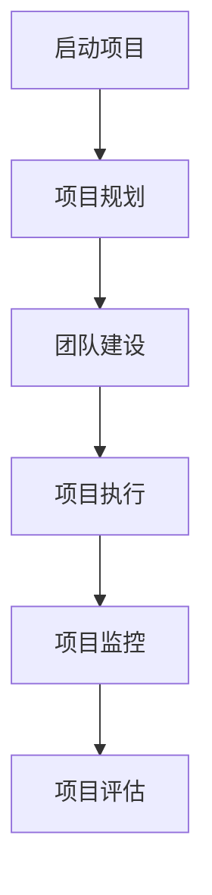

                 


### 《程序员创业公司的敏捷项目管理实践》

> 关键词：敏捷项目管理、敏捷方法论、Scrum、XP、团队建设、敏捷工具、敏捷项目规划、敏捷项目执行、敏捷项目监控与评估

> 摘要：本文将探讨敏捷项目管理在程序员创业公司的实践应用。我们将从敏捷项目管理的基础理论入手，逐步深入到敏捷方法论、团队建设、敏捷项目管理工具以及敏捷项目规划、执行、监控与评估的实践方法，并通过案例分析帮助读者更好地理解和应用敏捷项目管理。

### 目录大纲

#### 第一部分：敏捷项目管理基础

#### 第1章：敏捷项目管理的概述

##### 1.1 敏捷理念的起源与发展

##### 1.2 敏捷项目管理与传统管理的区别

##### 1.3 敏捷项目的特点与优势

#### 第2章：敏捷方法论

##### 2.1 Scrum框架

###### 2.1.1 Scrum的角色

###### 2.1.2 Scrum的会议

###### 2.1.3 Scrum的工件

##### 2.2 XP（极限编程）方法论

###### 2.2.1 XP的核心实践

###### 2.2.2 XP的价值观

#### 第3章：敏捷团队建设

##### 3.1 团队角色与职责

###### 3.1.1 产品负责人

###### 3.1.2 沙龙大师

###### 3.1.3 团队成员

##### 3.2 团队协作工具

###### 3.2.1 版本控制工具

###### 3.2.2 通信工具

###### 3.2.3 任务跟踪工具

#### 第4章：敏捷项目管理工具

##### 4.1 敏捷管理工具概述

###### 4.1.1 敏捷工具的分类

###### 4.1.2 敏捷工具的选型

##### 4.2 JIRA的使用

###### 4.2.1 JIRA的基本功能

###### 4.2.2 JIRA的高级功能

##### 4.3 Trello的使用

###### 4.3.1 Trello的基本功能

###### 4.3.2 Trello的扩展功能

#### 第二部分：敏捷项目管理实践

#### 第5章：敏捷项目规划

##### 5.1 项目规划概述

###### 5.1.1 项目规划的重要性

###### 5.1.2 项目规划的目标

##### 5.2 路径图规划

###### 5.2.1 路径图的作用

###### 5.2.2 路径图的制作方法

##### 5.3 版本迭代规划

###### 5.3.1 迭代规划的目标

###### 5.3.2 迭代规划的步骤

#### 第6章：敏捷项目执行

##### 6.1 产品待办事项列表

###### 6.1.1 待办事项列表的作用

###### 6.1.2 待办事项列表的管理

##### 6.2 日常站立会议

###### 6.2.1 站立会议的目的

###### 6.2.2 站立会议的执行

##### 6.3 增量交付与迭代回顾

###### 6.3.1 增量交付的优势

###### 6.3.2 迭代回顾的执行与反馈

#### 第7章：敏捷项目监控与评估

##### 7.1 敏捷项目监控

###### 7.1.1 监控指标的选择

###### 7.1.2 监控数据的收集与处理

##### 7.2 敏捷项目评估

###### 7.2.1 项目评估的目的

###### 7.2.2 项目评估的方法

#### 第三部分：敏捷项目管理案例

#### 第8章：敏捷项目管理案例分析

##### 8.1 案例一：某创业公司敏捷项目规划与实践

###### 8.1.1 项目背景

###### 8.1.2 项目规划

###### 8.1.3 项目执行

###### 8.1.4 项目监控与评估

##### 8.2 案例二：某企业敏捷转型实践

###### 8.2.1 企业背景

###### 8.2.2 敏捷转型策略

###### 8.2.3 敏捷实施效果评估

### 附录

#### 附录A：敏捷项目管理工具资源

##### A.1 主流敏捷项目管理工具对比

###### A.1.1 JIRA

###### A.1.2 Trello

###### A.1.3 GitLab

##### A.2 敏捷项目管理常用术语

**核心概念与联系：敏捷项目管理流程 Mermaid 流程图**



**核心算法原理讲解：敏捷项目管理中的关键算法**

#### 优先级排序算法：冒泡排序

```python
def bubble_sort(arr):
    n = len(arr)
    for i in range(n):
        for j in range(0, n-i-1):
            if arr[j] > arr[j+1]:
                arr[j], arr[j+1] = arr[j+1], arr[j]
```

在接下来的内容中，我们将逐章深入探讨敏捷项目管理的基础、方法论、团队建设、工具以及实践方法，并结合实际案例分析，帮助读者理解和应用敏捷项目管理。在每一章中，我们会使用一步一步分析推理思考的方式，确保内容清晰易懂，逻辑严谨。请读者跟随我们的思考，一起深入探索敏捷项目管理的精髓。### 第一部分：敏捷项目管理基础

#### 第1章：敏捷项目管理的概述

##### 1.1 敏捷理念的起源与发展

敏捷项目管理起源于20世纪90年代初期，当时软件行业面临着巨大的挑战。传统的“瀑布式”项目管理方法由于其高成本、高延迟、高风险和难以适应变化的特点，导致了许多项目的失败。为了应对这些挑战，一群软件开发专家在2001年聚在一起，共同制定了一份宣言，即《敏捷宣言》。这份宣言强调了个体和互动的重要性、可工作的软件、客户合作以及响应变化的重要性。

《敏捷宣言》的主要原则如下：

1. **个体和互动重于过程与工具**：人是最重要的资产，有效的沟通和协作比严格的流程和工具更为重要。
2. **可工作的软件重于详尽的文档**：软件交付的速度和实用性比大量的文档更为重要。
3. **客户合作重于合同谈判**：与客户的紧密合作比严格的合同协议更为重要。
4. **响应变化重于遵循计划**：敏捷项目能够更好地应对变化，比遵循固定计划更具优势。

《敏捷宣言》的诞生标志着敏捷方法论的兴起。随后，一系列敏捷方法论和框架如Scrum、XP（极限编程）、看板（Kanban）等相继出现，这些方法论和框架都在不同的层面上提供了敏捷项目管理的具体实践指导。

##### 1.2 敏捷项目管理与传统管理的区别

敏捷项目管理与传统项目管理在多个方面存在显著差异，以下是一些关键的区别：

1. **管理风格**：传统项目管理强调命令和控制，而敏捷项目管理则强调自主管理和自我组织。
2. **规划方式**：传统项目管理倾向于详细的预先规划，而敏捷项目管理则采用迭代和增量的规划方式。
3. **时间框架**：传统项目管理通常以长期项目为基准，而敏捷项目管理则更关注短期迭代，通常为几周到几个月。
4. **团队角色**：传统项目管理通常有明确的角色分工，而敏捷项目管理强调团队成员的多面性和灵活性。
5. **风险管理**：传统项目管理通过详细的计划和风险管理来应对风险，而敏捷项目管理则通过快速反馈和迭代来减少风险。
6. **客户参与**：传统项目管理中客户参与相对较少，而敏捷项目管理则强调客户的持续参与和反馈。

##### 1.3 敏捷项目的特点与优势

敏捷项目具有以下几个显著特点：

1. **灵活性**：敏捷项目能够快速适应变化，对需求的不确定性有较好的应对能力。
2. **迭代开发**：项目以迭代的方式进行，每个迭代都会交付可工作的软件。
3. **持续交付**：敏捷项目强调持续交付，确保项目能够持续交付价值。
4. **客户参与**：客户在整个项目周期中持续参与，提供反馈并指导开发方向。
5. **团队协作**：敏捷项目强调团队成员之间的协作和沟通，鼓励跨职能团队的运作。

敏捷项目管理的优势包括：

1. **提高交付速度**：敏捷项目能够更快地交付有价值的功能，缩短了产品上市时间。
2. **降低风险**：通过快速反馈和迭代，敏捷项目能够及时发现和解决问题，降低项目失败的风险。
3. **提高客户满意度**：持续的客户参与和反馈提高了最终产品的质量，增强了客户的满意度。
4. **促进团队成长**：敏捷项目鼓励自我组织和协作，有助于提高团队的整体能力和凝聚力。

总结来说，敏捷项目管理通过其灵活、迭代和客户驱动的特点，为程序员创业公司提供了有效的管理方法，帮助公司更好地应对市场变化，提高项目成功率。在接下来的章节中，我们将深入探讨敏捷方法论、团队建设和项目管理工具，以帮助读者更好地理解和实践敏捷项目管理。

#### 第2章：敏捷方法论

##### 2.1 Scrum框架

Scrum是一种广泛应用的敏捷方法论，它提供了一系列的角色、会议和工件，以支持项目的迭代开发和持续交付。Scrum的核心原则包括简洁性、透明性、检查和调整。

###### 2.1.1 Scrum的角色

Scrum中有三个核心角色：

1. **产品负责人（Product Owner）**：产品负责人是项目需求的代表，负责定义项目目标和优先级，确保项目能够交付最有价值的特性。产品负责人与业务利益相关者紧密合作，持续提供反馈和指导。

2. **沙龙大师（Scrum Master）**：沙龙大师是团队的教练和促进者，负责确保团队遵循Scrum流程，帮助团队解决障碍。沙龙大师还负责组织会议、维护团队氛围，并促进持续改进。

3. **团队成员**：团队成员是项目的执行者，通常包括软件开发人员、设计师、测试人员等。团队成员负责实现产品负责人定义的需求，并参与会议和迭代过程。

###### 2.1.2 Scrum的会议

Scrum中有几种重要的会议，这些会议有助于团队保持透明、高效和协作：

1. **每日站立会议（Daily Stand-up）**：每日站立会议是团队每天的起点，通常持续15分钟。团队成员会回答三个问题：昨天做了什么？今天打算做什么？遇到了什么障碍？这种简短的会议有助于团队保持同步，并及时解决障碍。

2. **迭代规划会议（Sprint Planning）**：迭代规划会议是每个迭代开始时的关键活动。产品负责人和团队一起选择下一个迭代要完成的工作，制定详细的迭代计划。

3. **迭代评审会议（Sprint Review）**：迭代评审会议是每个迭代结束时的活动，团队展示已完成的工作，并与产品负责人和利益相关者讨论反馈和改进意见。

4. **迭代回顾会议（Sprint Retrospective）**：迭代回顾会议是每个迭代结束后的活动，团队评估本次迭代的执行情况，识别改进点，并制定行动计划。

###### 2.1.3 Scrum的工件

Scrum中有几种重要的工件，这些工件提供了项目的可视化信息和透明度：

1. **产品待办列表（Product Backlog）**：产品待办列表是项目的需求清单，按照优先级排序。产品负责人负责管理产品待办列表，确保团队专注于最高优先级的工作。

2. **迭代待办列表（Sprint Backlog）**：迭代待办列表是当前迭代的工作清单，由团队在迭代规划会议上选择和定义。迭代待办列表是动态的，团队可以根据进度和反馈进行调整。

3. **燃尽图（Burn Down Chart）**：燃尽图是一种可视化工具，展示了团队完成工作的情况。燃尽图通常包含一个垂直轴（剩余工作）和一个水平轴（时间），帮助团队了解进展情况和是否需要调整计划。

##### 2.2 XP（极限编程）方法论

XP（极限编程）是一种以程序员为中心的敏捷方法论，它提供了一系列的核心实践和价值观，以促进高效的软件开发。

###### 2.2.1 XP的核心实践

XP的核心实践包括：

1. **简单设计**：简单设计是一种避免过度工程化的方法，确保系统仅实现所需功能，避免不必要的复杂性。

2. **测试驱动开发（TDD）**：测试驱动开发是一种开发方法，要求首先编写测试代码，然后编写实现代码，确保代码符合预期。这种方法提高了代码质量和可维护性。

3. **重构**：重构是一种持续改进代码质量的方法，通过修改现有代码而不改变其功能，使其更加简洁、清晰和易于维护。

4. **持续集成（CI）**：持续集成是一种自动化构建和测试的方法，确保每次代码更改都被集成并测试，及时发现和解决问题。

5. **代码审查**：代码审查是一种团队协作方法，通过团队成员之间的代码评审，确保代码质量和一致性。

6. **一对编程**：一对编程是一种协作开发方法，要求两名程序员共同编写代码，提高代码质量、理解和协作。

7. **集体代码所有制**：集体代码所有制确保所有团队成员都对代码库有所有权感，鼓励代码共享和协作。

###### 2.2.2 XP的价值观

XP的价值观包括：

1. **沟通**：沟通是XP的核心价值观，强调团队成员之间的有效沟通，确保信息的透明和同步。

2. **简单性**：简单性鼓励团队保持代码和设计的简洁，避免不必要的复杂性。

3. **反馈**：反馈是持续改进的关键，XP强调通过快速反馈来识别和解决问题。

4. **勇气**：勇气鼓励团队成员在面对变化和挑战时采取行动，勇于尝试和改进。

敏捷方法论为程序员创业公司提供了灵活、高效的管理方法，Scrum和XP是两种重要的方法论，各有其特点和优势。Scrum强调透明度和迭代交付，适合需要快速响应市场变化的项目；而XP则注重程序员的技术实践和代码质量，适合需要高效开发和持续改进的项目。在实际应用中，公司可以根据项目的具体需求和环境选择合适的方法论，并灵活运用其核心理念和实践。

#### 第3章：敏捷团队建设

##### 3.1 团队角色与职责

敏捷团队的成功很大程度上取决于团队成员的角色和职责的清晰定义以及团队协作的效率。在敏捷框架中，团队通常由以下几种关键角色组成：

###### 3.1.1 产品负责人

产品负责人（Product Owner）是敏捷团队中至关重要的角色，他们代表业务利益相关者，负责定义项目目标和产品需求。以下是产品负责人的主要职责：

1. **定义产品愿景和目标**：产品负责人需要明确产品的长期愿景和短期目标，确保团队理解并致力于实现这些目标。

2. **管理产品待办列表**：产品负责人负责维护产品待办列表，确保其按照优先级排序，并不断更新以反映业务需求和市场变化。

3. **提供需求优先级**：产品负责人与利益相关者沟通，确定需求的优先级，并指导团队专注于最有价值的特性。

4. **提供持续反馈**：产品负责人需要持续与用户和利益相关者沟通，获取反馈并快速响应，以确保产品符合市场需求。

5. **参与迭代会议**：产品负责人参与迭代规划会议、评审会议和回顾会议，确保团队能够理解和实现需求。

###### 3.1.2 沙龙大师

沙龙大师（Scrum Master）是敏捷团队的教练和促进者，负责确保团队遵循敏捷实践，并消除团队在实现目标过程中遇到的障碍。以下是沙龙大师的主要职责：

1. **确保团队遵循敏捷实践**：沙龙大师负责确保团队遵循Scrum或其他敏捷框架的会议、角色和工件，并指导团队如何高效地运用这些实践。

2. **消除障碍**：沙龙大师负责识别并解决团队在开发过程中遇到的障碍，确保团队能够集中精力完成任务。

3. **促进团队协作**：沙龙大师促进团队内的协作和沟通，确保团队成员之间能够高效合作。

4. **组织会议**：沙龙大师负责组织每日站立会议、迭代规划会议、评审会议和回顾会议，确保会议按照预定时间和流程进行。

5. **支持团队成长**：沙龙大师鼓励团队学习和改进，支持团队成员的个人成长和发展。

###### 3.1.3 团队成员

团队成员（Team Members）是敏捷团队中的核心力量，他们负责实现产品负责人定义的需求和目标。以下是团队成员的主要职责：

1. **参与迭代规划**：团队成员参与迭代规划会议，选择要完成的任务，并制定详细的迭代计划。

2. **执行任务**：团队成员负责执行迭代计划中的任务，确保任务按时完成并达到预期质量。

3. **参与每日站立会议**：团队成员在每日站立会议上报告自己的工作进展，讨论遇到的问题，并寻求解决方案。

4. **参与迭代评审和回顾**：团队成员参与迭代评审会议，展示已完成的工作，获取反馈，并参与迭代回顾会议，评估团队绩效并制定改进计划。

5. **持续学习和改进**：团队成员积极参与技术学习和团队协作技巧的培训，不断提高个人和团队的能力。

##### 3.2 团队协作工具

在现代敏捷团队中，高效的协作工具至关重要。以下是一些常用的团队协作工具及其功能：

###### 3.2.1 版本控制工具

版本控制工具（如Git）是敏捷开发的核心组成部分，它们帮助团队管理代码变更，确保代码库的一致性和可靠性。以下是版本控制工具的主要功能：

1. **代码版本管理**：版本控制工具允许团队成员对代码进行版本管理，每个提交都是一个独立的版本，可以回滚或比较。

2. **分支管理**：版本控制工具支持分支管理，允许团队在不同环境中并行开发，如开发、测试和发布分支。

3. **协作与审查**：版本控制工具提供代码审查功能，团队成员可以评论和合并代码变更。

4. **自动化构建和测试**：版本控制工具可以与持续集成工具集成，实现自动化构建和测试。

###### 3.2.2 通信工具

有效的沟通是敏捷团队成功的关键。以下是一些常用的通信工具及其功能：

1. **即时通讯（如Slack、Microsoft Teams）**：即时通讯工具提供实时沟通功能，团队成员可以快速交流想法和解决问题。

2. **视频会议（如Zoom、Google Meet）**：视频会议工具允许团队成员进行远程会议，讨论和协作。

3. **邮件**：虽然电子邮件不是最实时的沟通工具，但它仍然是一个重要的沟通渠道，用于发送重要通知和文档。

4. **项目管理工具**：如JIRA、Trello等项目管理工具提供了任务分配、进度跟踪和沟通功能。

###### 3.2.3 任务跟踪工具

任务跟踪工具（如JIRA、Trello）是敏捷团队管理任务和项目进展的重要工具。以下是这些工具的主要功能：

1. **任务分配与跟踪**：任务跟踪工具允许团队成员分配任务，跟踪任务状态，确保任务按时完成。

2. **优先级管理**：任务跟踪工具可以根据任务的优先级进行排序，确保团队专注于最重要的任务。

3. **进度可视化**：任务跟踪工具提供进度条、燃尽图等可视化工具，帮助团队了解项目进展和状态。

4. **协作与沟通**：任务跟踪工具通常集成即时通讯和文件共享功能，方便团队成员之间的协作和沟通。

敏捷团队建设的关键在于明确团队成员的角色和职责，并为他们提供高效协作的工具和环境。通过合理的角色分工和有效的协作工具，敏捷团队能够更好地应对项目变化，提高交付质量和团队满意度。在接下来的章节中，我们将进一步探讨敏捷项目管理工具及其在实践中的应用。

#### 第4章：敏捷项目管理工具

##### 4.1 敏捷管理工具概述

敏捷项目管理工具是支持敏捷团队高效运作的重要工具。这些工具提供了任务跟踪、进度可视化、沟通协作等功能，帮助团队更好地管理项目。在选择敏捷管理工具时，团队需要考虑以下几个关键因素：

1. **功能需求**：根据团队的规模和项目需求，选择具备所需功能的工具。例如，小型团队可能只需要任务跟踪功能，而大型团队可能需要更全面的协作工具。

2. **易用性**：工具的易用性对团队的效率和满意度至关重要。选择直观易用的工具可以减少学习成本，提高团队的工作效率。

3. **集成性**：敏捷管理工具应能够与其他工具和服务集成，如版本控制、持续集成和通信工具。这样可以确保数据的一致性和流程的无缝衔接。

4. **可扩展性**：团队的需求可能会随着项目的进展而变化，选择可扩展的工具可以适应未来需求的变化。

5. **成本**：成本是选择工具时的重要考虑因素。团队需要在功能需求、易用性、集成性和可扩展性之间进行权衡，以找到适合自己预算的工具。

##### 4.1.1 敏捷工具的分类

敏捷工具可以大致分为以下几类：

1. **任务跟踪工具**：如JIRA、Trello、Asana等，主要用于任务管理、进度跟踪和团队协作。

2. **项目管理工具**：如Microsoft Project、Smartsheet等，提供全面的计划、跟踪和资源管理功能。

3. **沟通协作工具**：如Slack、Microsoft Teams、Google Workspace等，用于实时沟通、协作和文件共享。

4. **持续集成工具**：如Jenkins、GitLab CI/CD、CircleCI等，用于自动化构建、测试和部署。

5. **敏捷看板工具**：如JIRA Board、Trello、Kanbanize等，提供可视化任务跟踪和进度管理功能。

##### 4.1.2 敏捷工具的选型

在选型敏捷工具时，团队可以按照以下步骤进行：

1. **需求分析**：确定团队的具体需求，包括功能需求、集成需求、易用性和成本等因素。

2. **工具评估**：根据需求分析结果，评估市面上主流的敏捷工具。可以通过试用、查阅用户评价和比较功能列表等方式，了解工具的性能和适用性。

3. **团队反馈**：邀请团队成员参与工具评估，收集他们的反馈和意见。团队成员的使用体验和反馈对工具的最终选择至关重要。

4. **决策和实施**：根据评估结果和团队反馈，做出最终决策并实施新工具。在实施过程中，提供必要的培训和支持，确保团队成员能够快速上手。

##### 4.2 JIRA的使用

JIRA是敏捷团队广泛使用的任务跟踪和管理工具。以下是其基本功能和高级功能：

###### 4.2.1 JIRA的基本功能

1. **任务管理**：JIRA允许团队创建、分配和管理任务，跟踪任务的状态和进度。

2. **敏捷看板**：JIRA的看板视图提供直观的任务跟踪界面，支持拖放操作，方便团队管理任务流程。

3. **敏捷报告**：JIRA提供多种报告选项，如燃尽图、速度图等，帮助团队了解项目进展和绩效。

4. **版本控制集成**：JIRA可以与Git、SVN等版本控制工具集成，确保代码和任务管理的一致性。

5. **插件扩展**：JIRA支持多种插件，如JIRA Data Center、JIRA Service Desk等，扩展其功能。

###### 4.2.2 JIRA的高级功能

1. **高级筛选和搜索**：JIRA提供强大的筛选和搜索功能，帮助团队快速找到所需的信息。

2. **自定义字段和面板**：JIRA允许团队自定义字段和面板，以适应特定项目的需求。

3. **自动化工作流**：JIRA支持自动化工作流，如任务创建、状态更新等，减少手动操作，提高效率。

4. **权限管理**：JIRA提供细粒度的权限管理功能，确保数据安全和团队协作。

##### 4.3 Trello的使用

Trello是一个简单易用的任务管理工具，特别适合小型团队和项目。以下是其基本功能和扩展功能：

###### 4.3.1 Trello的基本功能

1. **看板视图**：Trello的核心功能是看板视图，提供直观的任务跟踪界面，支持拖放操作。

2. **卡片**：Trello中的每个任务都是一个卡片，包含任务名称、描述、截止日期、标签、评论等功能。

3. **列表**：列表用于组织任务，可以在不同的阶段和状态之间移动任务卡片。

4. **标签**：标签用于标记任务的重要性和优先级，方便团队快速识别和管理任务。

5. **附件和链接**：Trello支持上传附件和添加外部链接，方便团队成员共享和协作。

###### 4.3.2 Trello的扩展功能

1. **定制背景**：Trello允许团队自定义看板背景，提高用户体验。

2. **自动化规则**：Trello提供自动化规则，如自动标记任务、移动卡片等，提高工作效率。

3. **集成其他工具**：Trello可以与其他工具如Google Drive、Slack、JIRA等集成，实现跨平台协作。

4. **板权限**：Trello提供不同的权限设置，确保团队成员可以访问他们需要的任务和信息。

选择合适的敏捷管理工具并有效使用，是敏捷项目管理成功的关键。JIRA和Trello是两种广泛应用的敏捷工具，它们各自具有独特的功能和优势，团队可以根据自己的需求和环境选择合适的工具，并充分利用其功能来提高项目管理效率和团队协作效果。

#### 第5章：敏捷项目规划

##### 5.1 项目规划概述

项目规划是敏捷项目管理中至关重要的一步，它为项目提供了清晰的路线图，确保团队朝着共同的目标前进。敏捷项目规划与传统项目规划有显著不同，它更加灵活、迭代和专注于价值交付。

###### 5.1.1 项目规划的重要性

项目规划的重要性体现在以下几个方面：

1. **明确目标和范围**：通过项目规划，团队可以明确项目的目标和范围，确保所有成员对项目的方向和期望有共同的理解。

2. **分配资源**：项目规划帮助团队了解所需的资源和时间，以便合理分配团队成员的工作任务。

3. **风险评估**：项目规划过程中，团队可以识别潜在的风险，制定应对策略，减少项目失败的可能性。

4. **确保价值交付**：敏捷项目规划强调每个迭代交付有价值的功能，确保项目始终聚焦于高优先级和最有价值的特性。

5. **提高沟通效率**：明确的规划和目标有助于提高团队内部的沟通效率，减少误解和冲突。

###### 5.1.2 项目规划的目标

敏捷项目规划的目标包括：

1. **确定项目范围和目标**：明确项目的具体范围和目标，确保团队在正确的方向上努力。

2. **制定迭代计划**：根据项目的优先级和资源，制定详细的迭代计划，确定每个迭代要交付的功能。

3. **识别和分配资源**：识别项目所需的资源，包括人力资源、技术资源和财务资源，并进行合理分配。

4. **制定风险管理计划**：识别潜在的风险，制定相应的应对策略，确保项目能够顺利推进。

5. **建立沟通机制**：确保团队成员之间、团队与产品负责人之间以及团队与利益相关者之间的沟通顺畅。

##### 5.2 路径图规划

路径图（Roadmap）是敏捷项目规划中的一个重要工具，它为项目提供了宏观的视图，帮助团队了解项目的发展方向和重要里程碑。以下是路径图规划的关键步骤：

###### 5.2.1 路径图的作用

路径图的作用包括：

1. **项目可视化**：路径图将项目的重要里程碑和阶段性目标以图形化的形式呈现，使团队和利益相关者能够直观地了解项目进展。

2. **目标设定**：路径图帮助团队设定长期目标和短期目标，确保项目在不同阶段都有明确的目标和方向。

3. **资源规划**：路径图帮助团队了解项目在不同阶段的资源需求，以便进行有效的资源分配和管理。

4. **风险识别**：通过路径图，团队可以识别项目在不同阶段可能面临的风险，并提前制定应对措施。

###### 5.2.2 路径图的制作方法

以下是制作路径图的步骤：

1. **确定项目目标和里程碑**：首先，团队需要明确项目的长期目标和阶段性里程碑。里程碑通常是一个重要功能或可交付成果的完成。

2. **排列里程碑和阶段**：根据项目目标和里程碑的重要性，将它们按照时间顺序排列，形成一个时间线。

3. **分配资源和时间**：为每个里程碑和阶段分配所需资源（如人力、技术和财务资源）和预计完成时间。

4. **绘制路径图**：使用图表工具（如Microsoft PowerPoint、Lucidchart等）绘制路径图，确保图形清晰、易于理解。

5. **评审和更新**：路径图制作完成后，团队和利益相关者应共同评审，确保路径图的准确性和可行性。根据评审结果，进行必要的调整和更新。

##### 5.3 版本迭代规划

迭代规划是敏捷项目管理中的一项核心活动，它帮助团队确定在每个迭代要完成的工作，确保项目能够按计划推进并交付有价值的功能。

###### 5.3.1 迭代规划的目标

迭代规划的目标包括：

1. **确定迭代目标**：明确每个迭代要完成的具体目标和可交付成果。

2. **分配任务和责任**：根据迭代目标，将任务合理分配给团队成员，并明确各自的职责。

3. **制定迭代计划**：确定迭代的时间框架、任务优先级和工作流程。

4. **评估风险和资源**：识别项目在当前迭代阶段可能面临的风险，并确保资源充足，以支持迭代目标的实现。

5. **确保团队协作**：通过迭代规划，确保团队成员之间的协作和沟通顺畅。

###### 5.3.2 迭代规划的步骤

以下是进行迭代规划的步骤：

1. **回顾上一个迭代**：在开始新迭代规划之前，团队应回顾上一个迭代的工作情况，总结经验和教训，识别改进点。

2. **确定迭代目标**：与产品负责人和利益相关者沟通，确定本次迭代的目标和要交付的功能。

3. **优先级排序**：将迭代目标分解为具体任务，并根据优先级进行排序。优先级通常基于业务价值和风险。

4. **任务分配**：将任务合理分配给团队成员，确保每个成员都有明确的工作任务和责任。

5. **制定迭代计划**：制定详细的迭代计划，包括时间表、任务分配和关键里程碑。

6. **评估资源和风险**：评估项目在当前迭代阶段的资源和风险，制定相应的应对策略。

7. **评审和确认**：与团队成员和利益相关者共同评审迭代计划，确保计划可行并得到确认。

通过有效的项目规划、路径图规划和迭代规划，敏捷团队能够更好地管理项目，确保项目按计划推进并交付有价值的功能。在接下来的章节中，我们将进一步探讨敏捷项目执行的具体实践方法。

### 第6章：敏捷项目执行

##### 6.1 产品待办事项列表

产品待办事项列表（Product Backlog）是敏捷项目管理中的一项关键工具，它包含了项目所有未完成的需求、任务和功能。有效的产品待办事项列表有助于团队明确工作方向，确保项目资源得到合理分配，同时促进客户和开发团队的沟通。

###### 6.1.1 待办事项列表的作用

产品待办事项列表的主要作用包括：

1. **需求管理**：产品待办事项列表是需求管理的集中地，包含了所有待实现的功能和需求。产品负责人可以根据业务优先级对这些需求进行排序和调整。

2. **指导开发**：产品待办事项列表为开发团队提供了明确的工作指导，团队可以根据待办事项中的优先级和描述来确定开发计划。

3. **资源规划**：产品待办事项列表帮助团队了解项目未来的工作量和资源需求，从而进行有效的资源分配和调度。

4. **反馈收集**：产品待办事项列表是客户和利益相关者反馈的渠道，通过持续更新和优先级调整，确保项目能够快速响应市场需求和变化。

5. **可视化进展**：产品待办事项列表提供了一个可视化的视图，使团队成员和利益相关者能够清晰地看到项目的进展和状态。

###### 6.1.2 待办事项列表的管理

产品待办事项列表的管理主要包括以下步骤：

1. **编写和更新**：产品负责人负责编写和更新待办事项列表，确保需求描述清晰、详细，并按业务优先级进行排序。

2. **审查和确认**：定期审查待办事项列表，与利益相关者讨论和确认需求的准确性和优先级，确保需求符合业务目标。

3. **优先级调整**：根据项目的进展和市场需求的变化，产品负责人应灵活调整待办事项的优先级，确保资源投入到最有价值的需求上。

4. **任务分解**：将高优先级的需求分解为具体的任务和子任务，以便开发团队进行详细规划和执行。

5. **跟踪进度**：使用敏捷管理工具（如JIRA、Trello等）跟踪待办事项的进度和状态，确保项目能够按计划推进。

##### 6.2 日常站立会议

日常站立会议（Daily Stand-up）是敏捷项目管理中的一种关键会议，通常持续15分钟，是团队每日的起点。站立会议提供了一个平台，使团队成员能够同步各自的进度、讨论遇到的问题和障碍，确保项目按计划进行。

###### 6.2.1 站立会议的目的

站立会议的主要目的包括：

1. **同步进度**：团队成员在站立会议上分享前一天的工作进展和计划，确保团队整体对项目进展有共同的认识。

2. **识别问题**：通过站立会议，团队成员可以及时识别和讨论遇到的问题和障碍，共同寻找解决方案。

3. **促进沟通**：站立会议促进了团队成员之间的沟通和协作，减少了信息孤岛，提高了团队的整体效率。

4. **保持透明**：站立会议提供了一个透明的工作环境，使所有成员都能了解项目的进展和状态，增强了团队的凝聚力。

###### 6.2.2 站立会议的执行

执行站立会议通常遵循以下步骤：

1. **固定时间和地点**：选择固定的时间和地点举行站立会议，确保所有成员都能准时参加。

2. **三个核心问题**：每次站立会议通常围绕以下三个核心问题进行：

   - 昨天完成了什么？
   - 今天计划做什么？
   - 遇到了什么障碍？

3. **简洁明了**：站立会议应保持简洁明了，避免长时间的讨论和问题解决。如果遇到复杂的问题，可以安排专门的会议进行深入讨论。

4. **记录和跟进**：记录每次站立会议的重要讨论和决策，并在会后跟进问题的解决情况，确保问题得到及时解决。

5. **持续改进**：定期回顾站立会议的执行情况，识别改进点，并采取措施提高会议的效果。

##### 6.3 增量交付与迭代回顾

增量交付（Incremental Delivery）是敏捷项目管理中的一个核心原则，它强调将项目分成多个小的可交付部分，并在每个迭代中逐步实现。这种方法不仅提高了项目的可管理性，还确保了项目能够在每个迭代中交付价值。

###### 6.3.1 增量交付的优势

增量交付的优势包括：

1. **快速反馈**：通过在每个迭代中交付部分功能，团队能够快速获取客户和利益相关者的反馈，及时调整和优化项目方向。

2. **降低风险**：增量交付将项目风险分散到多个迭代中，减少了项目整体失败的风险。

3. **持续改进**：增量交付鼓励团队持续改进和优化，确保项目始终聚焦于最有价值的特性。

4. **客户参与**：增量交付增强了客户的参与感，使客户能够在项目早期就看到实际成果，并提供宝贵的反馈。

###### 6.3.2 迭代回顾的执行与反馈

迭代回顾（Sprint Retrospective）是敏捷项目管理中一个重要的环节，它提供了一个平台，使团队能够反思和评估上一个迭代的工作情况，识别成功点、改进点和障碍，为下一个迭代做好准备。

1. **回顾会议的目的**：迭代回顾会议的主要目的是：

   - 总结上一个迭代的工作情况和成果。
   - 识别成功点和改进点。
   - 讨论和解决遇到的障碍和问题。

2. **执行迭代回顾会议**：

   - **邀请参与**：邀请所有团队成员和利益相关者参加迭代回顾会议。
   - **开放讨论**：在会议中鼓励团队成员自由发言，分享他们的观点和感受。
   - **记录反馈**：记录会议中的重要讨论和反馈，确保所有意见得到记录和跟进。
   - **制定行动计划**：根据反馈和讨论结果，制定具体的改进行动计划，并明确责任人和时间表。

3. **持续改进**：迭代回顾的结果应该被用于持续改进团队的工作流程和实践。通过不断反思和优化，团队可以提高工作效率，减少问题发生的概率。

通过有效的产品待办事项列表管理、日常站立会议和增量交付，敏捷团队能够更好地管理项目进度，确保项目按时交付有价值的功能。在接下来的章节中，我们将进一步探讨敏捷项目监控与评估的方法，帮助团队持续优化项目管理实践。

### 第7章：敏捷项目监控与评估

#### 7.1 敏捷项目监控

敏捷项目监控是确保项目按计划推进并实现预期目标的关键环节。通过有效的监控，团队可以及时发现并解决潜在问题，确保项目能够按时、按质量完成。

###### 7.1.1 监控指标的选择

选择合适的监控指标对于项目监控至关重要。以下是一些常用的监控指标：

1. **进度指标**：如迭代进度、任务完成率、燃尽图等，用于衡量项目进展和任务完成情况。
2. **质量指标**：如缺陷率、测试覆盖率、代码质量等，用于评估项目质量。
3. **成本指标**：如预算消耗、成本偏差等，用于控制项目成本。
4. **风险指标**：如风险发生频率、风险损失等，用于评估项目风险。

选择监控指标时，团队需要考虑以下因素：

- **项目特点**：根据项目的具体特点和需求，选择最合适的监控指标。
- **业务目标**：确保监控指标与业务目标一致，有助于团队聚焦于最重要的方面。
- **数据可用性**：选择易于获取和测量的指标，确保数据的准确性和可靠性。

###### 7.1.2 监控数据的收集与处理

监控数据的收集与处理是敏捷项目监控的核心环节。以下是一些关键步骤：

1. **数据收集**：通过自动化工具和手动记录，收集项目进度、质量和成本等相关数据。自动化工具如JIRA、Trello等可以方便地收集和整理数据。
2. **数据存储**：将收集到的数据存储在数据库或数据仓库中，以便后续分析和处理。
3. **数据处理**：对收集到的数据进行分析和清洗，确保数据的质量和准确性。数据处理可以包括数据整合、异常值处理、趋势分析等。
4. **可视化展示**：使用图表、报表等可视化工具，将处理后的数据展示出来，帮助团队直观地了解项目进展和状态。

常见的可视化工具包括JIRA、Tableau、Power BI等，这些工具提供了丰富的图表和报表模板，方便团队自定义和展示数据。

#### 7.2 敏捷项目评估

敏捷项目评估是确保项目成功交付和持续改进的重要环节。通过评估，团队可以了解项目的整体绩效，识别成功点和改进机会，为未来的项目提供参考。

###### 7.2.1 项目评估的目的

项目评估的主要目的包括：

1. **总结项目经验**：通过评估，团队可以总结项目的成功经验和不足，为未来的项目提供宝贵的参考。
2. **识别改进点**：评估过程中，团队可以识别项目中的问题、风险和不足，制定改进措施，提高项目执行效率和质量。
3. **优化管理流程**：评估结果可以帮助团队优化项目管理流程和方法，提高项目管理水平。
4. **提高团队能力**：评估过程中，团队成员可以学习和分享经验，提高个人和团队的能力。

###### 7.2.2 项目评估的方法

项目评估的方法包括以下几种：

1. **关键绩效指标（KPI）**：使用关键绩效指标评估项目的整体绩效。KPI可以包括进度、质量、成本、团队满意度等。
2. **项目回顾会议**：组织项目回顾会议，团队成员和利益相关者共同讨论项目的执行情况、成功点和改进点。
3. **客户反馈**：收集客户对项目的反馈，了解客户对项目交付结果的满意度和需求。
4. **数据分析**：对项目数据进行详细分析，识别项目中的问题和风险，为改进提供数据支持。
5. **360度评估**：通过360度评估，收集团队成员和管理层的反馈，全面了解项目的绩效和改进点。

通过有效的项目监控和评估，敏捷团队能够及时发现和解决问题，持续优化项目管理实践，确保项目成功交付。在接下来的章节中，我们将通过实际案例分析，进一步探讨敏捷项目管理的实践方法。

### 第8章：敏捷项目管理案例分析

#### 8.1 案例一：某创业公司敏捷项目规划与实践

**8.1.1 项目背景**

某创业公司（以下简称“公司”）成立于2020年，专注于开发一款基于人工智能的智能助手应用。公司的目标是在短时间内快速占领市场，获取大量用户。然而，由于产品功能众多，开发周期较长，公司面临巨大的市场压力和时间挑战。

**8.1.2 项目规划**

为了确保项目能够按时交付并满足市场需求，公司决定采用敏捷项目管理方法。项目规划分为以下几个关键步骤：

1. **确定项目目标和范围**：公司明确了项目的目标，即开发一款功能完善、用户体验优良的智能助手应用。项目范围包括语音识别、自然语言处理、用户界面设计等功能模块。

2. **组建敏捷团队**：公司组建了一个包含软件开发人员、UI/UX设计师、测试工程师和产品负责人的敏捷团队。团队成员具备跨职能能力，可以快速响应需求变化。

3. **制定迭代计划**：公司采用Scrum框架，将整个项目分为多个迭代。每个迭代周期为两周，每个迭代要交付一个可工作的版本。迭代计划包括：

   - 迭代规划会议：团队和产品负责人讨论并确定下一个迭代要实现的功能。
   - 每日站立会议：团队成员同步工作进展，讨论遇到的问题和解决方案。
   - 迭代评审会议：团队展示已完成的工作，获取产品负责人和利益相关者的反馈。
   - 迭代回顾会议：团队评估迭代执行情况，识别改进点，并制定下一步行动计划。

4. **风险管理**：公司在项目规划阶段识别了潜在风险，如技术难题、市场需求变化和资源不足等。公司制定了相应的风险管理计划，包括：

   - 技术难题：提前进行技术调研，确保技术可行性。
   - 市场需求变化：保持与客户的紧密沟通，及时调整需求。
   - 资源不足：合理分配资源，确保关键任务优先完成。

**8.1.3 项目执行**

在项目执行过程中，公司严格按照敏捷方法论进行管理：

1. **每日站立会议**：团队成员在每日站立会议上报告工作进展，讨论问题和解决方案。这种简短的会议确保了团队成员之间的同步和沟通。

2. **迭代评审会议**：在每个迭代结束时，团队展示已完成的功能，并邀请利益相关者进行评审。通过评审会议，公司能够及时获得反馈，调整开发方向。

3. **迭代回顾会议**：团队在每个迭代结束后进行回顾，评估执行情况，识别改进点。这些改进点在下一个迭代中得以实施，提高了团队的整体效率。

4. **持续交付**：公司采用增量交付的方式，在每个迭代中交付一个可工作的版本。这种方式不仅提高了项目的可管理性，还使客户能够尽早看到实际成果，提供反馈。

**8.1.4 项目监控与评估**

公司在项目执行过程中，通过以下方法进行监控与评估：

1. **进度监控**：公司使用燃尽图和速度图监控项目进度，确保项目按时推进。

2. **质量监控**：公司通过自动化测试和质量评估工具监控项目质量，确保交付的功能满足预期要求。

3. **成本监控**：公司使用财务报表监控项目成本，确保项目在预算范围内完成。

4. **风险评估**：公司定期评估项目风险，制定应对措施，确保项目顺利进行。

5. **项目评估**：在每个迭代结束后，公司进行项目评估，总结经验和教训，为下一个迭代做好准备。

通过敏捷项目管理方法，公司成功在短时间内开发并推出了智能助手应用，获得了良好的市场反响。敏捷方法论不仅提高了项目的执行效率，还增强了团队的合作与沟通，为公司的持续发展奠定了基础。

#### 8.2 案例二：某企业敏捷转型实践

**8.2.1 企业背景**

某大型企业（以下简称“企业”）成立于2000年，主要从事企业级软件的研发和销售。随着市场竞争的加剧和客户需求的变化，企业意识到传统的瀑布式项目管理方法已经无法满足快速响应市场需求的要求。为了提高项目交付速度和质量，企业决定进行敏捷转型。

**8.2.2 敏捷转型策略**

企业的敏捷转型分为以下几个阶段：

1. **试点项目**：企业选择一个较小的项目作为试点，实施敏捷方法论，积累经验。通过试点项目，企业验证了敏捷方法的可行性和优势。

2. **全员培训**：企业组织了全员培训，让员工了解敏捷方法论的基本原理和实践方法。通过培训，员工掌握了敏捷开发的基本技能，为全面实施敏捷方法打下了基础。

3. **推广敏捷**：在试点项目成功的基础上，企业决定将敏捷方法论推广到更多的项目中。企业制定了详细的敏捷转型计划，明确了转型目标、步骤和时间表。

4. **持续改进**：企业建立了持续改进机制，通过定期回顾和评估，不断优化敏捷实践。企业鼓励员工提出改进建议，并制定具体的改进措施。

**8.2.3 敏捷实施效果评估**

企业通过以下方法评估敏捷转型的效果：

1. **项目交付速度**：企业比较了敏捷转型前后的项目交付速度，发现敏捷方法显著提高了项目的交付速度。在转型前，平均项目交付周期为6个月，而在敏捷转型后，交付周期缩短至3个月。

2. **项目质量**：企业通过质量评估和用户反馈，比较了敏捷转型前后的项目质量。转型后，项目缺陷率降低了30%，用户满意度提高了20%。

3. **团队协作**：企业通过团队协作工具和会议记录，分析了敏捷转型前后的团队协作情况。转型后，团队之间的沟通更加顺畅，信息传递更加高效。

4. **员工满意度**：企业通过员工满意度调查，了解了员工对敏捷转型的看法。调查结果显示，超过80%的员工对敏捷转型表示满意，认为工作压力减轻，工作效率提高。

5. **财务绩效**：企业通过财务报表，分析了敏捷转型对财务绩效的影响。转型后，企业的销售收入和利润均有所增长，市场竞争力得到提升。

通过敏捷转型，企业显著提高了项目交付速度和质量，增强了团队协作和员工满意度，实现了财务绩效的提升。敏捷方法论不仅帮助企业应对了市场变化，还为企业的持续发展奠定了坚实基础。

### 附录A：敏捷项目管理工具资源

#### A.1 主流敏捷项目管理工具对比

在敏捷项目管理中，选择合适的工具对团队的高效运作至关重要。以下是几种主流敏捷项目管理工具的对比：

##### A.1.1 JIRA

**优点**：

- **功能全面**：JIRA提供了任务跟踪、敏捷看板、报告和分析等功能，适合大型团队和企业级应用。
- **定制性强**：JIRA允许用户自定义字段、视图和工作流，满足不同项目的需求。
- **插件生态丰富**：JIRA的插件市场提供了大量的扩展功能，如集成版本控制、自动化构建工具等。

**缺点**：

- **学习曲线较陡**：对于初学者来说，JIRA的复杂功能可能需要一定时间来掌握。
- **成本较高**：JIRA的商业版本价格相对较高，对小型团队可能构成负担。

##### A.1.2 Trello

**优点**：

- **简单易用**：Trello的界面简洁直观，易于上手，适合小型团队和个人项目。
- **移动支持**：Trello提供跨平台的移动应用，方便团队成员随时随地进行任务管理。
- **免费版本**：Trello提供了免费版本，适合预算有限的团队。

**缺点**：

- **功能有限**：Trello的功能相对简单，对于复杂的项目管理需求可能不够强大。
- **集成性有限**：Trello的集成选项相对有限，无法与某些专业工具（如版本控制）无缝集成。

##### A.1.3 GitLab

**优点**：

- **全栈集成**：GitLab集成了代码托管、任务跟踪、持续集成和持续交付等功能，提供端到端的项目管理解决方案。
- **开源免费**：GitLab是企业级开源工具，对团队和预算有限的初创公司非常友好。
- **强大的代码审查**：GitLab提供了强大的代码审查功能，帮助团队确保代码质量和一致性。

**缺点**：

- **学习成本**：GitLab的功能丰富，学习曲线较陡，需要一定的时间来熟悉。
- **系统要求较高**：GitLab的自建服务器要求较高的硬件配置，对小型团队可能构成挑战。

#### A.2 敏捷项目管理常用术语

以下是敏捷项目管理中常用的一些术语：

- **Scrum Master**：敏捷团队的教练和促进者，负责确保团队遵循敏捷实践。
- **Product Owner**：负责定义项目目标和产品需求，管理产品待办列表。
- **Sprint**：敏捷项目中的一个迭代周期，通常持续2-4周。
- **Daily Stand-up**：每日站立会议，团队成员报告工作进展和遇到的问题。
- **Sprint Planning**：迭代规划会议，团队确定下一个迭代要完成的工作。
- **Sprint Review**：迭代评审会议，团队展示已完成的工作并获取反馈。
- **Sprint Retrospective**：迭代回顾会议，团队评估执行情况，识别改进点。
- **Backlog**：待办事项列表，包含项目的所有未完成需求、任务和功能。
- **Burn Down Chart**：燃尽图，展示团队完成工作的情况，用于衡量项目进展。
- **User Story**：用户故事，描述用户如何与产品交互的简单需求，通常采用“作为用户，我希望完成某事”的形式编写。
- **XP**：极限编程，是一种敏捷方法论，强调测试驱动开发、重构和持续集成等实践。
- **Kanban**：看板，是一种敏捷方法，通过可视化卡片来管理任务流程。

了解这些常用术语对于敏捷项目管理的实践具有重要意义，有助于团队成员更好地理解敏捷理念和方法，提高协作效率。在敏捷项目管理中，持续学习和实践是不断进步的关键。

### 结论与展望

通过本文的探讨，我们深入了解了敏捷项目管理在程序员创业公司的实践应用。敏捷项目管理以其灵活性、迭代和客户驱动的特点，为创业公司提供了有效的管理方法，帮助团队更好地应对市场变化，提高项目成功率。

首先，我们介绍了敏捷理念的起源与发展，阐述了敏捷项目管理与传统管理的区别和优势。接着，我们详细介绍了Scrum和XP两种敏捷方法论的核心实践和价值观，并通过实际案例展示了如何在实际项目中应用这些方法。

然后，我们探讨了敏捷团队建设的关键角色和职责，以及团队协作工具的使用方法。在项目管理工具的选择上，我们介绍了JIRA、Trello等主流敏捷工具的基本功能和高级功能，帮助团队高效地管理项目。

在项目规划部分，我们讲解了项目规划的重要性、路径图规划和迭代规划的步骤。通过敏捷项目执行，我们探讨了产品待办事项列表、每日站立会议、增量交付和迭代回顾的方法，确保项目按计划推进并交付价值。

最后，通过实际案例的分析，我们展示了敏捷项目管理在创业公司中的成功实践，并通过敏捷项目管理工具资源的对比，为读者提供了实用工具的参考。

在未来的研究和实践中，我们可以进一步探讨以下方向：

1. **跨功能团队的敏捷协作**：研究如何更好地实现跨功能团队的敏捷协作，提高团队整体效率和创新能力。
2. **敏捷方法在大型项目的应用**：探讨敏捷方法在大型、复杂项目中的应用，解决敏捷方法论在大型项目中可能面临的挑战。
3. **持续学习和知识共享**：建立持续学习和知识共享的文化，鼓励团队成员不断提升技能，分享经验，推动敏捷实践的持续改进。

通过不断探索和实践，我们可以更好地发挥敏捷管理方法的优势，为创业公司的成功发展提供强有力的支持。让我们携手共进，共同推动敏捷项目管理在程序员创业公司的广泛应用和实践。

**作者：AI天才研究院/AI Genius Institute & 禅与计算机程序设计艺术 /Zen And The Art of Computer Programming**

