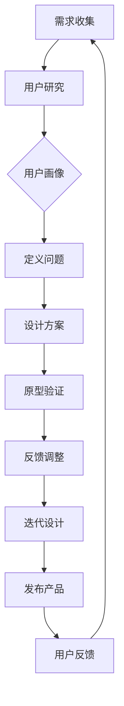

                 


### 文章标题：程序员创业者如何进行有效的用户体验设计

#### 关键词：
- 用户画像
- 用户体验设计
- 设计思维
- UI/UX 工具
- 用户研究方法
- 敏捷开发

#### 摘要：
本文将深入探讨程序员创业者如何在资源有限的情况下，通过有效的用户体验设计来提升产品的市场竞争力。我们将从用户体验设计的核心概念出发，逐步分析设计策略与流程、UI/UX 设计工具与实践、用户研究方法与技巧，以及设计思维与用户同理心。最后，通过案例研究和实战项目，总结出实用的用户体验设计方法和建议。

### 第一部分: 程序员创业者如何进行有效的用户体验设计

#### 第1章: 背景与基础

##### 用户体验设计的核心概念

**用户体验（UX）**的定义与重要性：

用户体验是指用户在使用产品或服务过程中所感受到的整体感受和满意度。在创业环境中，用户体验设计是确保产品成功的关键因素之一，它直接影响产品的市场表现和用户忠诚度。

**用户研究**：用户画像、用户调研方法与技巧：

用户画像是一种描述用户特征和需求的工具，它有助于我们了解目标用户群体的特点和行为模式。用户调研是获取用户需求和行为数据的重要手段，常见的调研方法包括问卷调查、用户访谈、行为分析等。

**用户旅程地图**：创建方法与案例分析：

用户旅程地图是一种可视化工具，用于描述用户在使用产品或服务过程中的所有接触点和体验。通过创建用户旅程地图，我们可以更好地理解用户的痛点，优化产品设计和流程。

##### 用户体验设计与创业的关系

**用户需求分析**：创业中的用户调研与市场调研：

用户需求分析是创业过程中不可或缺的一环。通过深入的用户调研和市场调研，创业者可以准确把握市场需求，为产品定位和市场策略提供依据。

**产品设计与用户反馈**：迭代过程与策略：

用户体验设计是一个迭代的过程，通过不断收集用户反馈和进行迭代优化，创业者可以不断完善产品，提高用户满意度。本文将详细讨论如何有效地进行迭代设计和用户反馈收集。

##### 设计思维导论

**设计思维方法**：五步骤实践：

设计思维是一种以人为本的创新方法，通过五步骤实践（发现、定义、发展、原型、测试），创业者可以系统地解决用户问题，创造有市场价值的产品。

**用户同理心**：情感映射与需求识别：

用户同理心是设计思维的核心原则之一。通过情感映射和需求识别，创业者可以更好地理解用户的需求和痛点，为设计提供有力支持。

### 第二部分: 设计策略与流程

#### 第2章: 设计策略与流程

##### 设计策略

**用户导向设计**：设计原则与工具：

用户导向设计是一种以用户为中心的设计方法，其核心原则包括用户研究、迭代设计、可用性测试等。本文将介绍用户导向设计的原则和工具。

**敏捷开发**：用户体验设计与敏捷方法的融合：

敏捷开发是一种快速响应市场变化和用户需求的开发方法。本文将探讨如何将用户体验设计融入敏捷开发过程，提高产品设计效率。

##### 设计流程

**需求收集与分析**：问卷调查、用户访谈、行为分析：

需求收集与分析是用户体验设计的起点。本文将介绍常用的需求收集与分析方法，包括问卷调查、用户访谈、行为分析等。

**原型设计与验证**：低/高保真原型制作与测试：

原型设计与验证是用户体验设计的关键环节。本文将介绍如何制作低/高保真原型，并进行有效测试，以验证设计方案的可行性和用户满意度。

##### 用户体验评估

**可用性测试**：测试方法与流程：

可用性测试是评估用户体验的重要手段。本文将介绍可用性测试的方法和流程，帮助创业者了解用户对产品的实际使用体验。

**用户反馈**：数据分析与策略调整：

用户反馈是优化产品设计的重要依据。本文将讨论如何收集和分析用户反馈，并据此调整设计策略，提高产品的用户体验。

### 第三部分: UI/UX 设计工具与实践

#### 第3章: UI/UX 设计工具与实践

##### UI/UX 设计工具

**Sketch**：界面设计与原型制作：

Sketch 是一款功能强大的界面设计工具，适用于创建精美的界面原型。本文将介绍 Sketch 的基本操作和功能。

**Figma**：协作设计与原型交互：

Figma 是一款基于网页的协作设计工具，支持多人实时协作。本文将介绍 Figma 的基本操作和优势。

**Adobe XD**：设计流程与用户交互测试：

Adobe XD 是一款功能全面的 UI/UX 设计工具，支持从设计到交互的完整流程。本文将介绍 Adobe XD 的基本操作和用户交互测试功能。

##### 设计实践

**用户界面设计原则**：布局、色彩、字体、图标：

用户界面设计原则是保证产品美观和易用的关键。本文将介绍布局、色彩、字体、图标等设计原则，帮助创业者打造优质的用户界面。

**交互设计**：用户操作流程、导航设计、反馈机制：

交互设计是用户体验设计的重要组成部分。本文将探讨如何设计流畅的用户操作流程、导航设计和反馈机制，提升用户满意度。

### 第四部分: 用户研究方法与技巧

#### 第4章: 用户研究方法与技巧

##### 用户研究方法

**定性研究**：深度访谈、焦点小组、观察法：

定性研究是一种深入了解用户需求和行为的手段。本文将介绍深度访谈、焦点小组、观察法等定性研究方法。

**定量研究**：问卷调查、数据分析、A/B测试：

定量研究是一种大规模收集用户数据的方法。本文将介绍问卷调查、数据分析、A/B测试等定量研究方法。

##### 用户研究技巧

**用户画像创建**：用户需求、行为模式分析：

用户画像是用户研究的核心成果之一。本文将探讨如何创建用户画像，分析用户需求和行为模式。

**用户测试与反馈收集**：测试流程、数据分析：

用户测试与反馈收集是优化产品设计的有效手段。本文将介绍用户测试的流程、数据分析方法，以及如何根据用户反馈调整设计。

### 第五部分: 设计思维与用户同理心

#### 第5章: 设计思维与用户同理心

##### 设计思维

**五步骤方法**：发现、定义、发展、原型、测试：

设计思维是一种系统性的创新方法。本文将详细介绍设计思维的五步骤方法，帮助创业者更好地解决用户问题。

**创新设计**：设计思维在创业中的应用：

设计思维在创业中的应用可以帮助创业者发现市场机会，打造有市场竞争力的产品。本文将探讨设计思维在创业中的应用案例。

##### 用户同理心

**情感映射**：理解用户情感需求：

用户同理心是设计思维的核心原则之一。本文将探讨如何通过情感映射理解用户情感需求，为设计提供有力支持。

**需求识别**：用户痛点与需求分析：

需求识别是设计思维的重要环节。本文将介绍如何通过需求识别分析，挖掘用户的痛点和需求，为产品设计提供依据。

### 第六部分: 项目实战与案例分析

#### 第6章: 项目实战与案例分析

##### 案例研究

**成功的用户体验设计案例**：分析其成功因素：

本文将分析几个成功的用户体验设计案例，探讨其成功因素，为创业者提供借鉴。

**失败的案例分析**：原因解析与改进建议：

本文将分析几个失败的案例分析，探讨其失败原因，并提出改进建议。

##### 实战项目

**初创公司设计项目**：从0到1的设计流程：

本文将分享一个初创公司设计项目的实战经历，从0到1展示设计流程，帮助创业者了解实际操作。

**跨部门协作与项目管理**：用户体验设计在团队中的应用：

用户体验设计需要跨部门的协作和项目管理。本文将探讨如何实现跨部门协作，提高用户体验设计在团队中的效果。

### 第七部分: 未来趋势与持续发展

#### 第7章: 未来趋势与持续发展

##### 行业趋势

**人工智能与用户体验设计**：结合发展趋势：

人工智能技术的快速发展将对用户体验设计产生深远影响。本文将探讨人工智能在用户体验设计中的应用趋势。

##### 持续发展

**用户研究**：如何保持对用户需求的敏感度：

用户研究是用户体验设计的核心环节。本文将介绍如何保持对用户需求的敏感度，持续优化产品设计。

**设计迭代**：如何适应市场变化与技术进步：

设计迭代是适应市场变化和技术进步的关键。本文将探讨如何通过设计迭代，保持产品的竞争力和用户满意度。

### 第八章: 附录

#### 第8章: 附录

##### 设计资源

**设计工具与资源介绍**：常用工具使用指南：

本文将介绍常用的设计工具和资源，包括界面设计工具、原型设计工具等，并提供使用指南。

**设计规范与指南**：UI/UX设计标准：

本文将介绍 UI/UX 设计规范和指南，包括设计原则、色彩搭配、字体使用等，为创业者提供设计参考。

##### 推荐阅读

**相关书籍与论文推荐**：深入阅读拓展知识：

本文将推荐一些与用户体验设计相关的书籍和论文，帮助创业者深入了解用户体验设计领域。

### 参考资料：

- 《设计思维：如何创造人类中心的设计》[#]
- 《用户体验要素：以用户为中心的设计指南》[#]
- 《用户体验测试：如何测试并提升产品可用性》[#]

**Mermaid 流�程图示例**：



### 核心算法原理讲解：

#### 用户画像算法

```python
# 用户画像构建伪代码

# 输入：用户行为数据
# 输出：用户画像

def buildUserProfile(behaviorData):
    userProfile = {}

    # 数据预处理
    preprocessData = preprocess(behaviorData)

    # 特征提取
    for each behavior in preprocessData:
        if behavior == "search":
            userProfile["search_frequency"] += 1
        elif behavior == "purchase":
            userProfile["purchase_frequency"] += 1
        elif behavior == "review":
            userProfile["review_frequency"] += 1

    # 特征分析
    if userProfile["search_frequency"] > 10:
        userProfile["type"] = "searcher"
    elif userProfile["purchase_frequency"] > 5:
        userProfile["type"] = "buyer"
    elif userProfile["review_frequency"] > 3:
        userProfile["type"] = "reviewer"
    else:
        userProfile["type"] = "other"

    return userProfile
```

#### 用户行为预测算法

```python
# 用户行为预测伪代码

# 输入：用户画像
# 输出：用户行为预测

def predictUserBehavior(userProfile):
    predictedBehavior = None

    if userProfile["type"] == "searcher":
        predictedBehavior = "search"
    elif userProfile["type"] == "buyer":
        predictedBehavior = "purchase"
    elif userProfile["type"] == "reviewer":
        predictedBehavior = "review"

    return predictedBehavior
```

### 结语

作者：AI天才研究院/AI Genius Institute & 禅与计算机程序设计艺术 /Zen And The Art of Computer Programming

本文旨在为程序员创业者提供一套系统的用户体验设计方法，帮助他们在有限的资源下，创造出既符合用户需求又具有市场竞争力的产品。通过深入理解和实践用户体验设计，创业者可以更好地把握市场趋势，持续优化产品，实现业务增长。

在撰写本文时，我们参考了众多权威文献和成功案例，力求为读者提供最实用和最前沿的知识。同时，我们也期待读者在阅读本文后，能够结合自身实践，不断探索和优化用户体验设计，为用户提供更优质的产品和服务。

最后，感谢您的阅读，希望本文能对您的创业之路有所帮助。如果您有任何疑问或建议，欢迎在评论区留言，我们将在第一时间为您解答。再次感谢您的支持！## 第一部分: 程序员创业者如何进行有效的用户体验设计

在当今这个快速变化的市场环境中，用户体验设计（UX Design）已成为决定产品成功与否的关键因素。对于程序员创业者来说，如何在资源有限的情况下进行有效的用户体验设计，是一个极具挑战性的问题。本文将深入探讨这一问题，帮助创业者们理解用户体验设计的核心概念、策略与流程，并提供实用的工具和方法。

### 第1章: 背景与基础

在本章中，我们将首先介绍用户体验设计的核心概念，包括用户体验（UX）的定义、用户研究的意义和用户旅程地图的创建方法。接着，我们将探讨用户体验设计与创业之间的关系，特别是用户需求分析、产品设计与用户反馈的重要性。最后，我们将介绍设计思维的基本原则和用户同理心的关键角色。

#### 用户体验设计的核心概念

**用户体验（UX）**的定义与重要性：

用户体验（User Experience，简称UX）指的是用户在使用产品或服务时所感受到的整体体验。这个体验不仅包括功能使用时的便捷性和效率，还涵盖了情感上的满足感、视觉上的舒适度以及整个使用过程中的流畅性。在产品开发过程中，用户体验设计的目标是确保产品能够满足用户的需求，提升用户满意度，从而提高产品的市场竞争力。

**用户研究**：用户画像、用户调研方法与技巧：

用户研究是用户体验设计的基础，通过对目标用户进行深入研究，我们可以更好地理解用户的需求、行为和偏好。用户画像（User Profile）是一种描述目标用户特征和行为的工具，它通常包括用户的基本信息、行为习惯、需求和偏好等。通过创建用户画像，设计师可以更好地预测用户行为，设计出更符合用户需求的产品。

用户调研是获取用户数据的重要手段，常见的方法包括问卷调查、用户访谈、行为分析等。问卷调查可以帮助我们收集大量的用户反馈，用户访谈则可以深入了解用户的深层次需求，行为分析则是通过跟踪用户在实际使用产品过程中的行为，获取真实的数据。

**用户旅程地图**：创建方法与案例分析：

用户旅程地图（User Journey Map）是一种可视化工具，用于描述用户在使用产品或服务过程中的所有接触点和体验。它可以帮助设计师从用户的角度出发，全面了解用户在各个阶段的需求、行为和感受。创建用户旅程地图的步骤通常包括以下几步：

1. **定义用户角色**：明确目标用户群体，创建用户角色（User Persona）。
2. **列出用户的接触点**：记录用户与产品的所有交互点。
3. **分析用户行为**：描述用户在每个接触点的行为和动机。
4. **标注用户情感**：记录用户在每个接触点的情感体验。
5. **优化设计**：基于用户旅程地图，识别痛点并提出优化方案。

一个典型的用户旅程地图案例可能包括以下阶段：发现（用户发现产品）、研究（用户了解产品）、购买（用户决定购买）、使用（用户实际使用产品）、反馈（用户对产品进行评价）等。

#### 用户体验设计与创业的关系

**用户需求分析**：创业中的用户调研与市场调研：

在创业过程中，用户需求分析是产品开发的关键步骤。通过用户调研和市场调研，创业者可以深入了解用户的需求和市场趋势，从而为产品定位和市场策略提供依据。用户调研的方法包括问卷调查、用户访谈、焦点小组讨论等。市场调研则通常包括市场分析、竞争对手分析、市场需求分析等。

**产品设计与用户反馈**：迭代过程与策略：

用户体验设计是一个迭代的过程，创业者需要不断收集用户反馈，对产品进行改进和优化。用户反馈可以通过多种渠道获取，如用户调研、可用性测试、用户访谈等。通过分析用户反馈，创业者可以识别出产品的不足之处，并提出改进方案。迭代设计策略包括快速原型制作、用户测试、反馈收集、设计优化等。

**设计思维导论**：设计思维方法与用户同理心：

设计思维（Design Thinking）是一种以人为本的创新方法，它强调在产品开发过程中，始终关注用户的需求和体验。设计思维方法通常包括以下五个步骤：

1. **发现（Discover）**：理解用户需求、市场趋势和竞争对手情况。
2. **定义（Define）**：明确问题定义，明确设计目标和用户需求。
3. **发展（Develop）**：创意生成和方案设计。
4. **原型（Prototype）**：制作原型并进行测试。
5. **测试（Test）**：通过用户测试，评估原型效果，收集反馈，不断迭代优化。

用户同理心是设计思维的核心原则之一，它要求设计师能够站在用户的角度，理解和感受用户的需求和情感。通过情感映射（Emotional Mapping），设计师可以深入了解用户的情感需求，从而设计出更具有人性化的产品。

#### 设计思维方法与用户同理心

**设计思维方法**：五步骤实践：

设计思维方法是一种系统性的创新方法，它可以帮助设计师在复杂的环境中找到创新的解决方案。以下是设计思维的五步骤实践：

1. **发现（Discover）**：通过观察、访谈、调查等方式，深入了解用户的需求和问题。
2. **定义（Define）**：明确问题的定义，确定设计目标和用户需求。
3. **发展（Develop）**：生成多个创意方案，选择最佳方案。
4. **原型（Prototype）**：制作原型并进行测试，验证方案的可行性。
5. **测试（Test）**：通过用户测试，收集反馈，不断迭代优化设计。

**用户同理心**：情感映射与需求识别：

用户同理心是设计思维的核心原则之一，它要求设计师能够站在用户的角度，理解和感受用户的需求和情感。情感映射是一种深入了解用户情感需求的方法，它可以帮助设计师识别用户的痛点，从而设计出更具有人性化的产品。

情感映射的过程通常包括以下几个步骤：

1. **观察与访谈**：通过观察用户行为和访谈用户，收集用户情感数据。
2. **情感分析**：对收集到的情感数据进行分析，识别用户的情感需求。
3. **情感映射**：将用户的情感需求可视化，形成情感地图。
4. **需求识别**：基于情感映射结果，识别用户的核心需求和痛点。

通过设计思维方法和用户同理心，创业者可以更好地理解用户需求，设计出符合用户期望的产品，从而在激烈的市场竞争中脱颖而出。

### 总结

在本章中，我们介绍了用户体验设计的核心概念、用户研究的意义、用户旅程地图的创建方法，以及用户体验设计与创业之间的关系。通过深入理解用户体验设计的概念和方法，程序员创业者可以更有效地进行产品设计，提升产品的市场竞争力。在下一章中，我们将进一步探讨用户体验设计策略与流程，帮助创业者系统地进行产品设计。

### 第2章: 设计策略与流程

用户体验设计不仅仅是一个创意生成和界面设计的过程，而是一个系统性的设计策略和流程。对于程序员创业者来说，掌握正确的设计策略和流程是确保产品成功的关键。本章将详细介绍设计策略、设计流程以及用户体验评估的方法和技巧，帮助创业者有效地进行用户体验设计。

#### 设计策略

**用户导向设计**：设计原则与工具

用户导向设计（User-Centered Design）是一种以用户为中心的设计方法，其核心原则是始终关注用户的需求和体验。以下是一些用户导向设计的原则和工具：

1. **用户研究**：通过用户调研和访谈，深入了解用户的需求和行为。
2. **迭代设计**：不断迭代和改进设计，通过原型测试和用户反馈，逐步优化产品。
3. **可用性测试**：在设计和开发过程中，进行可用性测试，确保产品易于使用和操作。
4. **协作设计**：鼓励多学科团队的协作，确保设计过程全面、高效。

**敏捷开发**：用户体验设计与敏捷方法的融合

敏捷开发（Agile Development）是一种灵活、快速响应市场变化和用户需求的方法。将用户体验设计融入敏捷开发过程，可以提高设计效率和产品质量。以下是如何在敏捷开发中融入用户体验设计的建议：

1. **快速原型制作**：在开发周期内快速制作原型，以便及时进行用户测试和反馈。
2. **用户故事地图**：将用户体验设计融入到用户故事中，确保每个迭代都能交付有价值的用户功能。
3. **持续集成与反馈**：通过持续集成和用户反馈，确保设计和开发过程紧密衔接，及时调整设计。

#### 设计流程

**需求收集与分析**：问卷调查、用户访谈、行为分析

需求收集与分析是用户体验设计的起点。以下是一些常用的需求收集与分析方法：

1. **问卷调查**：通过设计有针对性的问卷，收集大量用户反馈。
2. **用户访谈**：通过与目标用户进行深入访谈，获取详细的用户需求和意见。
3. **行为分析**：通过分析用户在实际使用产品过程中的行为数据，了解用户的习惯和痛点。

**原型设计与验证**：低/高保真原型制作与测试

原型设计是用户体验设计的重要环节。以下是如何进行原型设计和验证的建议：

1. **低保真原型**：使用简单的线框图或草图，快速验证设计概念。
2. **高保真原型**：使用专业的原型设计工具，制作更详细和逼真的原型。
3. **用户测试**：通过用户测试，评估原型的易用性和用户满意度。

**用户体验评估**：可用性测试与用户反馈

用户体验评估是确保产品符合用户期望的重要步骤。以下是一些常用的用户体验评估方法：

1. **可用性测试**：通过观察用户在实际使用产品过程中的行为，评估产品的可用性和用户体验。
2. **用户反馈**：通过问卷调查、用户访谈等方式，收集用户对产品的反馈和建议。
3. **数据分析**：通过分析用户行为数据和用户反馈，识别产品的优势和不足，为设计优化提供依据。

#### 用户体验评估

**可用性测试**：测试方法与流程

可用性测试是一种评估产品可用性和用户体验的有效方法。以下是如何进行可用性测试的建议：

1. **测试准备**：确定测试目标、测试环境和测试用户。
2. **测试执行**：观察用户在实际使用产品过程中的行为，记录用户遇到的问题和困难。
3. **数据收集**：通过用户访谈、问卷调查等方式，收集用户对产品的反馈和建议。
4. **结果分析**：分析测试数据，识别产品的可用性问题，提出优化建议。

**用户反馈**：数据分析与策略调整

用户反馈是优化产品设计和流程的重要依据。以下是如何处理用户反馈的建议：

1. **反馈收集**：通过多种渠道（如用户调研、用户访谈、社交媒体等）收集用户反馈。
2. **数据整理**：整理和分析用户反馈，识别用户的共同需求和痛点。
3. **策略调整**：根据用户反馈，调整产品设计、功能和流程，提升用户体验。

#### 总结

本章介绍了用户体验设计的策略与流程，包括用户导向设计、敏捷开发、需求收集与分析、原型设计与验证、用户体验评估等关键环节。通过掌握这些策略和流程，程序员创业者可以有效地进行用户体验设计，提升产品的市场竞争力。在下一章中，我们将进一步探讨 UI/UX 设计工具与实践，帮助创业者更好地实现设计目标。

### 第3章: UI/UX 设计工具与实践

在用户体验设计中，选择合适的工具和实践方法对于实现设计目标至关重要。本章将介绍几种常用的 UI/UX 设计工具，并探讨在实际项目中如何运用这些工具进行用户界面设计（UI Design）和交互设计（UX Design）。

#### UI/UX 设计工具

**Sketch**：界面设计与原型制作

Sketch 是一款功能强大的界面设计工具，广泛应用于移动应用和网页设计。其优点包括：

- **简洁的界面**：Sketch 提供了直观的用户界面，易于学习和使用。
- **矢量绘图**：支持矢量绘图和图层编辑，使得设计更灵活和精确。
- **符号库**：内置符号库可以快速重复使用设计元素，提高设计效率。
- **插件支持**：丰富的插件扩展了 Sketch 的功能，如自动化工具和导出工具。

**Figma**：协作设计与原型交互

Figma 是一款基于网页的协作设计工具，支持多人实时协作。其主要特点包括：

- **实时协作**：设计师和团队成员可以在同一时间编辑和审查设计，提高协作效率。
- **互动原型**：通过互动原型功能，设计师可以创建动态的交互效果，更真实地模拟用户操作。
- **响应式设计**：支持响应式设计，设计师可以轻松地为不同设备尺寸调整设计。
- **插件生态系统**：丰富的插件和扩展功能，增强了设计的灵活性和扩展性。

**Adobe XD**：设计流程与用户交互测试

Adobe XD 是一款专业的 UI/UX 设计工具，结合了设计、原型制作和用户测试功能。其优势包括：

- **直观的界面**：提供直观的设计界面，易于上手。
- **原型交互**：支持创建交互式的原型，模拟真实的用户操作体验。
- **代码生成**：可以生成可交互的代码，方便开发者根据设计进行开发。
- **用户体验测试**：内置用户体验测试功能，可以直接在工具中进行测试和反馈收集。

#### 设计实践

**用户界面设计原则**：布局、色彩、字体、图标

用户界面设计（UI Design）是用户体验设计（UX Design）的重要组成部分，以下是一些基本的用户界面设计原则：

1. **布局**：合理布局界面元素，确保信息的层次性和易读性。使用网格系统和对齐规则，提高界面的整洁和一致性。

2. **色彩**：选择合适的色彩方案，传达品牌形象和信息。注意色彩的对比度和可读性，避免过度使用或色彩冲突。

3. **字体**：选择易于阅读的字体，确保文字的可读性和美感。注意字体的大小和行间距，确保良好的阅读体验。

4. **图标**：使用简洁、直观的图标，提高界面的视觉吸引力。图标应与文字配合使用，避免重复和混淆。

**交互设计**：用户操作流程、导航设计、反馈机制

交互设计（UX Design）关注用户与产品的互动方式，以下是一些交互设计的基本原则和实践：

1. **用户操作流程**：设计直观、简洁的用户操作流程，确保用户能够轻松完成任务。使用清晰的操作提示和指导，减少用户的困惑和错误。

2. **导航设计**：设计清晰的导航系统，帮助用户快速找到所需信息和功能。使用面包屑、菜单栏、搜索框等导航元素，提高导航的效率。

3. **反馈机制**：提供及时的反馈机制，告知用户操作结果和系统状态。使用视觉反馈、音效反馈和文字提示，增强用户的互动体验。

通过以上 UI/UX 设计工具和实践，程序员创业者可以更有效地进行用户界面设计和交互设计，提升产品的用户体验。在下一章中，我们将探讨用户研究方法与技巧，帮助创业者更好地理解用户需求和行为。

### 第4章: 用户研究方法与技巧

用户研究是用户体验设计（UX Design）的核心环节，它为设计师提供了深入了解用户需求和行为的重要途径。本章将详细介绍用户研究的几种方法，包括定性研究和定量研究，并探讨如何创建用户画像、收集和分析用户测试反馈。通过这些方法，创业者可以更好地理解用户，从而设计出更加符合用户期望的产品。

#### 用户研究方法

**定性研究**：深度访谈、焦点小组、观察法

定性研究是一种深入研究用户需求和行为的方法，它通常涉及较小的样本量，但可以提供丰富的信息和深度洞察。以下是一些常用的定性研究方法：

1. **深度访谈**：通过与用户进行一对一的深度访谈，了解用户的个人经历、需求和动机。这种方法适用于获取详细的用户故事和情感数据。
2. **焦点小组**：邀请一组用户参与讨论，围绕特定的主题进行讨论。这种方法可以快速收集多方面的用户反馈，但需要谨慎处理可能的偏见和主导者效应。
3. **观察法**：在现场或实验室环境中观察用户如何与产品互动，记录用户的实际操作行为和反应。这种方法可以揭示用户在真实场景中的行为模式和使用障碍。

**定量研究**：问卷调查、数据分析、A/B测试

定量研究是一种通过大规模数据收集和分析来评估用户行为和偏好的方法。以下是一些常用的定量研究方法：

1. **问卷调查**：设计问卷，通过在线或离线方式收集大量用户的反馈。这种方法适用于快速收集广泛的数据，但需要确保问卷的设计和有效性。
2. **数据分析**：对用户行为数据进行分析，如点击率、转化率等，以识别用户行为模式和趋势。这种方法可以提供客观的数据支持，但需要专业的数据分析技能。
3. **A/B测试**：通过对比不同版本的产品或设计，评估哪个版本更能满足用户需求。这种方法适用于验证假设和优化设计，但需要控制变量和样本量。

#### 用户研究技巧

**用户画像创建**：用户需求、行为模式分析

用户画像（User Persona）是一种描述目标用户特征和行为的工具，它可以帮助设计师更好地理解用户，并设计出更符合用户需求的产品。以下是创建用户画像的步骤：

1. **收集数据**：通过定性研究和定量研究方法收集用户数据，包括用户背景、需求、行为和偏好。
2. **分析数据**：对收集到的数据进行分析，识别用户的共同特征和典型行为模式。
3. **创建用户画像**：基于分析结果，创建一个或多个用户画像，每个用户画像代表一个典型的目标用户。

**用户测试与反馈收集**：测试流程、数据分析

用户测试是评估产品设计有效性的重要手段，以下是如何进行用户测试和反馈收集的建议：

1. **定义测试目标**：明确测试的目标和期望结果，确保测试具有明确的方向。
2. **准备测试工具**：选择合适的测试工具，如在线测试平台、用户访谈软件等。
3. **进行测试**：邀请目标用户参与测试，观察他们在实际使用产品时的行为和反应。
4. **收集反馈**：通过用户访谈、问卷调查等方式收集用户反馈，了解他们对产品的评价和改进建议。
5. **数据分析**：对收集到的数据进行分析，识别用户的痛点和产品的优势。

#### 用户画像创建案例

以下是一个用户画像创建的案例：

**用户画像：学生小明**

- **基本信息**：18岁，大学生，性别男
- **需求**：需要一款便捷的在线学习工具，帮助自己管理和跟踪学习进度。
- **行为模式**：每天使用学习工具2小时，经常使用移动设备进行学习。
- **偏好**：喜欢使用简洁直观的界面，偏好有学习计划和提醒功能。

通过创建这样的用户画像，设计师可以更好地了解目标用户的需求和行为，从而设计出更符合用户期望的学习工具。

#### 用户测试与反馈收集案例

以下是一个用户测试和反馈收集的案例：

**测试目标**：评估一款移动学习应用的用户界面和交互设计。

**测试过程**：
1. **定义目标**：评估用户界面的易用性、功能布局和交互流程。
2. **准备工具**：使用在线测试平台进行远程测试，同时配备用户访谈软件。
3. **进行测试**：邀请5名目标用户参与测试，观察他们在使用应用时的操作和行为。
4. **收集反馈**：通过用户访谈和问卷调查收集用户反馈，包括用户对界面布局、功能可用性和交互流程的评价。
5. **数据分析**：整理和分析用户反馈，识别用户在界面操作中的困难和不满之处。

通过用户测试和反馈收集，设计师可以识别出用户界面和交互设计中的问题，并提出改进建议，从而提升产品的用户体验。

#### 总结

用户研究是用户体验设计的重要环节，通过定性研究和定量研究方法，创业者可以深入了解用户的需求和行为。创建用户画像和进行用户测试可以帮助设计师更好地理解用户，优化产品设计。在下一章中，我们将探讨设计思维与用户同理心，帮助创业者更好地应用这些研究方法，设计出更加人性化的产品。

### 第5章: 设计思维与用户同理心

设计思维（Design Thinking）是一种以人为本的创新方法，它强调在问题解决过程中始终关注用户的需求和体验。用户同理心（User Empathy）是设计思维的核心原则之一，它要求设计师能够站在用户的角度，理解和感受用户的需求和情感。本章将详细介绍设计思维的五步骤方法，探讨如何通过情感映射和需求识别，更好地理解用户，从而设计出符合用户期望的产品。

#### 设计思维的五步骤方法

**1. 发现（Discover）**

发现阶段是设计思维的第一步，主要任务是了解用户需求和市场环境。设计师需要通过观察、访谈、调研等方法，收集用户数据，深入了解用户的生活、行为和需求。以下是发现阶段的几个关键步骤：

- **观察用户行为**：通过现场观察或行为分析，了解用户在实际使用产品或服务时的行为和反应。
- **进行用户访谈**：与目标用户进行一对一的深度访谈，获取用户的故事、需求和痛点。
- **市场调研**：分析市场趋势、竞争对手和用户需求，为设计提供背景信息。

**2. 定义（Define）**

定义阶段是将收集到的信息进行整理和分析，明确问题和设计目标。设计师需要将用户需求转化为具体的设计问题，并制定明确的设计目标。以下是定义阶段的几个关键步骤：

- **问题陈述**：将用户需求转化为具体的设计问题，如“用户如何更轻松地完成某项任务？”。
- **设计目标**：根据问题陈述，制定具体的设计目标，如“提高用户完成任务的时间效率”。
- **优先级排序**：确定设计目标的优先级，确保设计资源得到有效利用。

**3. 发展（Develop）**

发展阶段是创意生成和方案设计的阶段，设计师需要提出多个可能的解决方案，并进行评估和选择。以下是发展阶段的几个关键步骤：

- **创意生成**：通过头脑风暴、思维导图等方法，提出多个创意和解决方案。
- **方案评估**：对创意方案进行评估，选择最符合用户需求和设计目标的方案。
- **原型制作**：制作原型，以验证和展示解决方案的可行性。

**4. 原型（Prototype）**

原型阶段是制作可交互的原型，用于测试和验证设计方案的阶段。设计师需要与用户一起测试原型，收集反馈，并不断迭代优化。以下是原型阶段的几个关键步骤：

- **制作原型**：使用低/高保真原型工具，制作可交互的原型。
- **用户测试**：邀请目标用户测试原型，观察用户在使用过程中的行为和反应。
- **反馈收集**：通过用户访谈、问卷调查等方式收集用户反馈，识别原型的问题和改进点。

**5. 测试（Test）**

测试阶段是验证设计效果和用户满意度的阶段。设计师需要根据用户反馈，对原型进行迭代优化，最终实现设计目标。以下是测试阶段的几个关键步骤：

- **反馈分析**：分析用户反馈，识别用户的需求和痛点。
- **迭代优化**：根据反馈，对原型进行改进和优化。
- **最终验证**：在完成所有迭代后，再次进行用户测试，确保设计符合用户期望。

#### 情感映射与需求识别

**情感映射**：情感映射是一种深入了解用户情感需求的方法，它可以帮助设计师识别用户的情感状态和需求。以下是情感映射的步骤：

1. **观察与访谈**：通过观察用户行为和进行深度访谈，收集用户在特定情境下的情感数据。
2. **情感分析**：对收集到的情感数据进行分析，识别用户的情感状态和情感变化。
3. **情感地图**：将用户的情感数据可视化，形成情感地图，帮助设计师更好地理解用户的情感需求。

**需求识别**：需求识别是设计思维中的关键步骤，它要求设计师通过分析用户行为和情感数据，识别出用户的核心需求和痛点。以下是需求识别的步骤：

1. **行为分析**：分析用户在特定情境下的行为模式，识别用户的行为需求。
2. **情感分析**：结合情感映射的结果，识别用户的情感需求和情感痛点。
3. **需求整理**：将分析结果整理成用户需求文档，明确用户的需求和痛点。

#### 案例分析：设计思维在初创公司中的应用

以下是一个设计思维在初创公司中的应用案例：

**案例背景**：一家初创公司开发了一款在线教育平台，旨在帮助用户学习编程技能。

**发现阶段**：设计师通过访谈和观察，了解到用户在学习编程时面临的主要问题是学习路径不清晰和缺乏及时反馈。

**定义阶段**：根据用户需求，设计师将设计目标定为“为用户提供清晰的学习路径和及时反馈”。

**发展阶段**：设计师通过头脑风暴和思维导图，提出了多个解决方案，包括自定义学习路径、实时代码反馈和社区互动等。

**原型阶段**：设计师使用 Figma 制作了低/高保真原型，并邀请用户进行测试，收集反馈。

**测试阶段**：根据用户反馈，设计师对原型进行了多次迭代优化，最终实现了用户期望的学习路径和反馈机制。

通过设计思维的应用，初创公司成功地设计出了一款符合用户需求的教育平台，提升了用户满意度和市场竞争力。

#### 总结

设计思维和用户同理心是用户体验设计的关键原则，通过五步骤方法，设计师可以系统地解决用户问题，设计出符合用户期望的产品。情感映射和需求识别可以帮助设计师更好地理解用户的需求和情感，从而实现更人性化的设计。在下一章中，我们将通过项目实战和案例分析，进一步探讨用户体验设计的实际应用。

### 第6章: 项目实战与案例分析

在本章中，我们将通过实际项目和案例分析，深入探讨如何将用户体验设计应用于初创公司，并展示跨部门协作在用户体验设计过程中的重要性。通过这些实战经验和案例分析，读者将能够更好地理解用户体验设计在产品开发中的实际应用。

#### 案例研究：成功的用户体验设计案例

**案例背景**：某初创公司开发了一款面向都市年轻女性的健康生活方式管理应用。

**目标**：设计一款易于使用、功能丰富且符合用户需求的健康生活方式管理应用。

**设计过程**：

1. **需求收集与分析**：
   - 设计团队通过用户访谈、问卷调查和在线调查，收集了500多名目标用户的反馈。
   - 分析用户反馈，识别出用户的核心需求，如健康跟踪、饮食管理、运动计划和社交互动。

2. **用户画像创建**：
   - 根据用户调研数据，设计团队创建了多个用户画像，包括健康意识强烈的职业女性、注重养生的家庭主妇等。
   - 每个用户画像详细描述了用户的生活方式、健康习惯和需求。

3. **设计策略与流程**：
   - 设计团队采用了敏捷开发方法，快速迭代原型并进行用户测试。
   - 通过A/B测试，不断优化应用界面和功能布局，提高用户满意度。

4. **用户体验评估**：
   - 设计团队进行了多轮可用性测试，邀请目标用户参与测试并提供反馈。
   - 分析测试结果，识别出应用中的可用性问题，并进行了相应的优化。

**成功因素**：
- 深入的用户研究：通过详细的用户调研，设计团队准确把握了用户的需求和痛点。
- 快速迭代：敏捷开发方法使得设计团队能够迅速响应用户反馈，持续优化产品。
- 用户参与：用户在整个设计过程中积极参与，提供了宝贵的意见和建议。

#### 失败的案例分析

**案例背景**：另一家初创公司开发了一款智能家居控制应用。

**目标**：提供一款简单易用、功能强大的智能家居控制应用。

**设计过程**：

1. **需求收集与分析**：
   - 设计团队进行了初步的用户调研，但由于调研范围有限，未能全面了解用户需求。
   - 未能创建详细的用户画像，导致产品设计缺乏针对性。

2. **设计策略与流程**：
   - 设计团队采用了传统的瀑布开发方法，缺乏用户参与，导致设计过程相对封闭。
   - 原型制作和测试过程较为滞后，未能及时调整和优化设计。

3. **用户体验评估**：
   - 可用性测试未进行充分，导致应用在上市后暴露出多个可用性问题。
   - 用户反馈收集不及时，未能及时进行问题修复和优化。

**失败原因**：
- 缺乏深入的用户研究：用户需求未能被充分理解和满足。
- 缺乏敏捷性：设计流程过于滞后，未能快速响应用户反馈。
- 用户参与不足：用户在整个设计过程中的参与度较低，导致设计缺乏针对性。

#### 实战项目：初创公司设计项目

**项目背景**：一家初创公司开发了一款面向企业用户的项目管理应用。

**设计目标**：
- 设计一款易于使用、功能丰富且符合企业用户需求的项目管理应用。
- 提高用户工作效率，降低项目管理成本。

**设计过程**：

1. **需求收集与分析**：
   - 设计团队进行了广泛的用户调研，包括用户访谈、问卷调查和在线调查。
   - 创建了详细的用户画像，包括项目管理人员、团队成员和普通员工。

2. **设计策略与流程**：
   - 采用敏捷开发方法，快速迭代原型并进行用户测试。
   - 通过用户测试和反馈，不断优化应用界面和功能。
   - 与开发团队紧密合作，确保设计能够实现并满足用户需求。

3. **用户体验评估**：
   - 进行多轮可用性测试，邀请目标用户参与并提供反馈。
   - 分析测试结果，识别出应用中的可用性问题，并进行了相应的优化。

4. **跨部门协作**：
   - 设计团队与产品管理、开发和市场团队紧密合作，确保设计目标和用户需求一致。
   - 通过定期的会议和协作平台，确保各团队之间的沟通和协作顺畅。

**项目小结**：
- 通过深入的用户研究和敏捷开发，初创公司成功地设计出了一款满足企业用户需求的项目管理应用。
- 跨部门协作在项目设计过程中起到了关键作用，确保了设计目标的实现和用户需求的满足。

#### 跨部门协作与用户体验设计

用户体验设计是一个跨部门协作的过程，涉及到产品管理、开发、设计、市场和用户等多个方面。以下是跨部门协作在用户体验设计中的关键作用：

1. **用户需求一致性**：通过跨部门协作，确保所有团队对用户需求的理解和目标一致，从而设计出满足用户需求的产品。

2. **设计实现与用户需求匹配**：设计团队与开发团队紧密合作，确保设计的可实施性和用户体验的一致性。

3. **快速响应与迭代**：通过跨部门协作，能够快速响应用户反馈，进行设计迭代和优化，提升用户体验。

4. **资源优化**：跨部门协作有助于优化资源分配和利用，提高项目效率。

#### 总结

通过实际项目和案例分析，我们展示了用户体验设计在初创公司中的重要性以及跨部门协作在其中的关键作用。成功的用户体验设计需要深入的调研、敏捷的开发方法和跨部门的协作。通过不断迭代和优化，初创公司可以设计出满足用户需求、具有市场竞争力的产品。在下一章中，我们将探讨用户体验设计的未来趋势和持续发展。

### 第7章: 未来趋势与持续发展

用户体验设计（UX Design）正随着技术的发展而不断演进。在未来，用户体验设计将面临新的挑战和机遇。本章将探讨用户体验设计的未来趋势，包括人工智能（AI）与用户体验设计的关系、如何保持对用户需求的敏感度，以及如何适应市场变化和技术进步。

#### 人工智能与用户体验设计

人工智能（AI）的快速发展正在深刻改变用户体验设计。AI技术可以提供个性化推荐、智能客服、智能交互等功能，从而提升用户体验。以下是一些AI技术在用户体验设计中的应用趋势：

1. **个性化推荐**：通过分析用户行为和偏好数据，AI可以提供个性化的内容推荐，提高用户的参与度和满意度。

2. **智能客服**：AI驱动的智能客服可以实时响应用户的查询和需求，提供高效、准确的帮助，减轻人工客服的工作负担。

3. **自然语言处理**：AI的自然语言处理技术可以提升人机交互的体验，使得用户能够通过自然语言与产品进行交流。

4. **智能交互**：通过语音识别、手势识别等技术，AI可以创造更加自然和直观的交互方式，提升用户的操作体验。

#### 保持对用户需求的敏感度

保持对用户需求的敏感度是用户体验设计的核心。以下是一些方法，帮助设计师保持对用户需求的敏感度：

1. **持续的用户调研**：定期进行用户调研，了解用户的需求变化和反馈，确保设计始终符合用户期望。

2. **用户反馈机制**：建立有效的用户反馈机制，鼓励用户提出意见和建议，设计师可以根据这些反馈进行相应的调整和优化。

3. **用户测试**：通过用户测试，及时识别设计中的问题和不足，进行迭代和改进。

4. **跨学科合作**：与产品管理、开发和其他相关部门紧密合作，确保对用户需求的全面理解和响应。

#### 适应市场变化与技术进步

用户体验设计需要不断适应市场变化和技术进步。以下是一些建议，帮助设计师在快速变化的环境中保持竞争力：

1. **关注行业趋势**：通过关注行业报告、会议和出版物，了解用户体验设计的最新趋势和技术发展。

2. **灵活应对**：采用敏捷开发方法，快速响应市场变化和用户需求，保持设计的灵活性和适应性。

3. **持续学习**：不断学习和掌握新的设计工具和技术，提高设计技能和创新能力。

4. **用户研究**：通过不断进行用户研究，深入了解用户需求和偏好，确保设计始终符合用户期望。

#### 持续发展

用户体验设计的持续发展需要系统性的规划和持续的努力。以下是一些关键点：

1. **设计规范与指南**：制定和遵循设计规范和指南，确保设计的一致性和质量。

2. **团队培训**：定期对团队成员进行培训，提高设计技能和团队协作能力。

3. **资源投入**：为用户体验设计提供充足的资源和支持，包括人力、技术和预算。

4. **持续迭代**：不断迭代和优化设计，确保产品能够持续满足用户需求。

#### 总结

用户体验设计在未来的发展中将受到人工智能、市场变化和技术进步的深刻影响。设计师需要保持对用户需求的敏感度，灵活应对市场变化，并持续学习和改进。通过系统性的规划和持续的努力，用户体验设计可以为用户提供更好的产品和服务，推动企业的持续发展。

### 附录

#### 设计资源

**设计工具与资源介绍**

**Sketch**：一款功能强大的界面设计工具，适用于创建精美的界面原型。它支持矢量绘图、图层编辑和符号库等功能，是界面设计师的常用工具。

**Figma**：一款基于网页的协作设计工具，支持多人实时协作。它提供了丰富的交互设计功能，包括互动原型、响应式设计和插件生态系统。

**Adobe XD**：一款专业的 UI/UX 设计工具，结合了设计、原型制作和用户体验测试功能。它提供了直观的界面和强大的代码生成功能。

**设计规范与指南**

**Material Design**：由 Google 开发的 UI 设计规范，适用于移动应用和网页设计。它提供了详细的布局、色彩、字体和图标指南。

**Apple Human Interface Guidelines**：由 Apple 发布的 UI 设计规范，适用于 iOS 和 macOS 应用程序的设计。它提供了全面的界面设计和交互指南。

**推荐阅读**

**《设计思维：如何创造人类中心的设计》**：Tim Brown 著，介绍了设计思维的方法和应用，帮助读者理解如何通过设计思维解决复杂问题。

**《用户体验要素：以用户为中心的设计指南》**：Jesse James Garrett 著，详细阐述了用户体验设计的核心要素和方法，为设计师提供了实用的设计指南。

**《用户体验测试：如何测试并提升产品可用性》**：Harry Brignull 和 Dana Chisnell 著，介绍了用户体验测试的方法和技术，帮助设计师评估和优化产品的可用性。

### 参考资料：

- **《设计思维：如何创造人类中心的设计》**：[设计思维：如何创造人类中心的设计](https://book.douban.com/subject/26878763/)
- **《用户体验要素：以用户为中心的设计指南》**：[用户体验要素：以用户为中心的设计指南](https://book.douban.com/subject/26785335/)
- **《用户体验测试：如何测试并提升产品可用性》**：[用户体验测试：如何测试并提升产品可用性](https://book.douban.com/subject/26874481/)

### Mermaid 流程图示例


通过以上流程图，我们可以清晰地看到用户体验设计的主要步骤和反馈循环，有助于理解和应用用户体验设计的方法。希望这些资源和建议能够为您的用户体验设计实践提供有益的参考和指导。作者：AI天才研究院/AI Genius Institute & 禅与计算机程序设计艺术 /Zen And The Art of Computer Programming。

