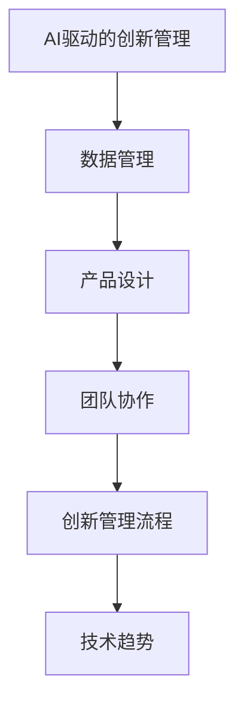

                 

### 文章标题：AI驱动的创新管理：从Idea到产品的全周期把控

关键词：人工智能，创新管理，产品开发，全周期把控，团队协作

摘要：本文旨在探讨人工智能（AI）在程序员创业者创新管理中的重要作用，从Idea到产品的全周期把控。通过对AI驱动的创新管理基础、核心概念与联系、核心算法原理讲解以及AI驱动的创新实践等方面的详细阐述，帮助程序员创业者更好地理解和应用AI技术，实现从创意到产品的成功转化。

### 《程序员创业者的AI驱动创新管理：从Idea到产品的全周期把控》目录大纲

#### 第一部分：AI驱动的创新管理基础

##### 第1章：AI驱动的创新管理概述

- **1.1 程序员创业者的挑战与机遇**
  - 程序员创业的优势
  - 创业中的常见挑战
  - AI技术的机遇

- **1.2 AI驱动的创新管理概念**
  - AI驱动的创新
  - 创新管理的核心要素
  - AI在创新管理中的应用

- **1.3 AI驱动的创新管理架构**
  - 创新流程与AI的结合
  - AI驱动的数据驱动决策
  - AI驱动的产品设计

- **1.4 从Idea到产品的全周期把控**
  - 创意产生与筛选
  - 产品设计与开发
  - 测试与迭代

##### 第2章：核心概念与联系

- **2.1 AI基础概念**
  - 人工智能的定义
  - 机器学习与深度学习
  - 神经网络与深度学习模型

- **2.2 AI驱动的数据管理**
  - 数据收集与处理
  - 数据分析与挖掘
  - 数据质量管理

- **2.3 AI驱动的设计与开发**
  - 自动化流程与AI工具
  - 人工智能辅助编程
  - AI驱动的敏捷开发

##### 第3章：核心算法原理讲解

- **3.1 AI算法概述**
  - 监督学习与无监督学习
  - 强化学习与生成对抗网络
  - 自然语言处理与图像识别

- **3.2 机器学习算法**
  - 线性回归与逻辑回归
  - 决策树与随机森林
  - 支持向量机与K最近邻

- **3.3 深度学习算法**
  - 卷积神经网络（CNN）
  - 循环神经网络（RNN）
  - 生成对抗网络（GAN）

#### 第二部分：AI驱动的创新实践

##### 第4章：数学模型与数学公式

- **4.1 数学基础**
  - 概率论与数理统计
  - 微积分基础
  - 线性代数基础

- **4.2 机器学习数学模型**
  - 损失函数
  - 优化算法
  - 模型评估

- **4.3 深度学习数学模型**
  - 激活函数
  - 反向传播算法
  - 网络结构优化

##### 第5章：项目实战

- **5.1 项目实战准备**
  - 开发环境搭建
  - 数据集准备与预处理
  - 算法选择与优化

- **5.2 实际案例研究**
  - 创意生成与筛选
  - 产品设计与原型开发
  - 测试与迭代

- **5.3 代码实现与解读**
  - 数据预处理代码
  - 模型训练与评估代码
  - 结果分析与优化

##### 第6章：创新管理与团队协作

- **6.1 创新管理流程**
  - 团队协作与角色分工
  - 创新项目管理与监控
  - 风险管理与应对策略

- **6.2 团队协作工具与技术**
  - 团队沟通与协作平台
  - 自动化测试与持续集成
  - 云计算与AI服务

##### 第7章：未来展望与趋势

- **7.1 AI在创新管理中的未来趋势**
  - 新技术的影响
  - 行业应用的发展
  - 创新模式的转变

- **7.2 创业者面临的挑战与机遇**
  - 市场竞争加剧
  - 技术更新的挑战
  - 创业者素质的提升

### 附录

- **附录A：资源与工具介绍**
  - AI开发工具与平台
  - 数据集与资源链接
  - 学术论文与书籍推荐

- **附录B：案例分析与思考**
  - 成功案例解读
  - 失败案例分析
  - 创新管理策略思考

---

**核心概念与联系流程图：**



---

**核心算法原理讲解伪代码：**

```python
# 伪代码：线性回归模型
def linear_regression(X, y):
    # 计算权重
    theta = (X.T * X).inv() * (X.T * y)
    # 计算损失函数
    loss = (-1 / len(X)) * (y - X * theta).T * (y - X * theta)
    return theta, loss
```

---

**数学模型与数学公式示例：**

$$
\text{损失函数（均方误差）} = \frac{1}{2n}\sum_{i=1}^{n}(y_i - \hat{y}_i)^2
$$

**代码解读与案例分析将在后续章节中详细展开。**

---

**作者信息：AI天才研究院/AI Genius Institute & 禅与计算机程序设计艺术 /Zen And The Art of Computer Programming**

