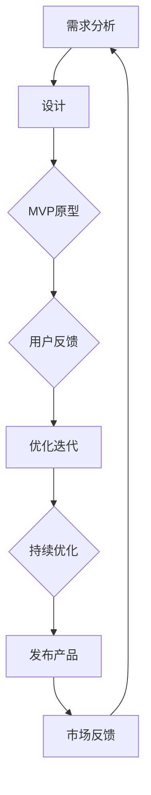

                 

### 文章标题

# 《程序员创业者的MVP开发策略与快速迭代》

### 关键词

- MVP开发策略
- 创业
- 快速迭代
- 敏捷开发
- 用户反馈
- 持续优化

### 摘要

本文旨在为程序员创业者在MVP（最小可行产品）开发过程中提供系统性指导。我们将深入探讨MVP开发策略的基础、需求分析与市场调研、MVP设计与原型构建、开发流程与敏捷方法，以及快速迭代与持续优化等关键环节。文章还将结合实际案例，分享成功经验，并提供实用的工具与资源。通过阅读本文，程序员创业者将能够更好地理解MVP开发的核心逻辑，掌握快速迭代的方法，从而提高产品的市场竞争力。

### 《程序员创业者的MVP开发策略与快速迭代》目录大纲

#### 第一部分: MVP开发策略基础

## 第1章: MVP开发理念与创业概述

### 1.1 MVP开发概念

#### 背景介绍

MVP（最小可行产品）是一种产品开发方法，旨在通过创建最小功能版本的产品来验证市场对产品的需求，从而降低创业风险。

#### 核心概念与联系

MVP与快速迭代、敏捷开发等概念紧密相关，它们共同构成了现代软件开发和创业的核心方法论。

#### MVP在创业过程中的作用

MVP不仅是验证市场需求的有效工具，还是产品迭代和优化的起点，能够帮助创业者聚焦核心功能，快速适应市场变化。

### 1.2 创业者面临的挑战与机遇

#### 挑战

资金、团队、市场不确定性等因素常常是创业者面临的挑战。

#### 机遇

数字化时代为创业者提供了前所未有的机遇，例如互联网、大数据、人工智能等技术的发展。

### 1.3 MVP在创业过程中的作用

MVP不仅能够降低创业风险，还能帮助创业者快速获得用户反馈，指导后续产品迭代。

## 第2章: MVP需求分析与市场调研

### 2.1 需求分析的重要性

#### 背景介绍

需求分析是产品开发的基础，直接影响到产品的市场表现。

#### 核心概念与联系

需求分析与市场调研密切相关，是MVP开发的重要环节。

### 2.2 市场调研的方法

#### 背景介绍

市场调研是了解市场需求和用户偏好的关键步骤。

#### 方法

包括问卷调查、用户访谈、竞品分析等。

### 2.3 需求分析与市场调研的案例解析

#### 案例一：滴滴出行的MVP开发

滴滴出行的MVP通过简单且高效的需求分析和市场调研，迅速占领市场。

#### 案例二：Slack的MVP开发

Slack通过用户反馈不断迭代，最终成为企业沟通工具的领导者。

## 第3章: MVP设计与原型构建

### 3.1 MVP设计原则

#### 核心概念与联系

MVP设计应遵循简洁性、可扩展性和用户友好性等原则。

#### 伪代码示例

```pseudo
// MVP设计原则伪代码
function designMVP(productFeatures) {
    // 确定核心功能
    coreFeatures = selectMostImportantFeatures(productFeatures)
    // 确保核心功能的实现
    implementCoreFeatures(coreFeatures)
    // 确保可扩展性
    ensureExtensibility(coreFeatures)
    // 确保用户友好性
    ensureUserFriendliness()
}
```

### 3.2 原型构建工具与技术

#### 背景介绍

原型构建是MVP开发的重要步骤，工具和技术选择对开发效率和效果有重要影响。

#### 工具与技术

包括Sketch、Figma、Axure等设计工具，以及HTML/CSS、JavaScript等前端技术。

### 3.3 MVP设计与原型构建案例解析

#### 案例一：Airbnb的MVP开发

Airbnb通过简洁的原型设计，快速验证了民宿市场的需求。

#### 案例二：Instagram的MVP开发

Instagram的MVP通过精简的功能和用户界面设计，迅速吸引了大量用户。

## 第4章: MVP开发流程与敏捷方法

### 4.1 MVP开发流程

#### 核心概念与联系

MVP开发流程应包括需求分析、设计、开发、测试和部署等环节。

#### 伪代码示例

```pseudo
// MVP开发流程伪代码
function developMVP() {
    // 需求分析
    analyzeRequirements()
    // 设计
    designMVP()
    // 开发
    implementMVP()
    // 测试
    testMVP()
    // 部署
    deployMVP()
}
```

### 4.2 敏捷开发方法

#### 背景介绍

敏捷开发是一种迭代、增量的软件开发方法，与MVP开发理念高度契合。

#### 核心概念与联系

敏捷开发强调快速响应变化、持续交付价值和紧密团队协作。

### 4.3 敏捷开发与MVP开发的结合

#### 背景介绍

敏捷开发与MVP开发的结合，能够帮助创业者更高效地实现产品迭代和市场反馈。

#### 方法

包括Scrum、Kanban等敏捷开发框架的应用。

## 第二部分: 快速迭代与持续优化

## 第5章: 快速迭代的策略与实践

### 5.1 快速迭代的原理

#### 背景介绍

快速迭代是MVP开发的核心理念，通过不断反馈和优化，提高产品的市场适应性。

#### 核心概念与联系

快速迭代与用户反馈、敏捷开发等概念密切相关。

### 5.2 用户反馈机制

#### 背景介绍

用户反馈是快速迭代的重要依据，有助于发现产品的问题和改进方向。

#### 方法

包括用户调研、A/B测试、用户访谈等。

### 5.3 迭代速度的提升方法

#### 背景介绍

提高迭代速度是MVP开发的重要目标，有助于缩短产品上市时间。

#### 方法

包括自动化测试、持续集成、敏捷开发等。

## 第6章: 持续优化与性能提升

### 6.1 优化目标与策略

#### 背景介绍

持续优化是MVP开发过程中的重要环节，能够提高产品的用户体验和性能。

#### 核心概念与联系

优化目标与用户体验、性能测试等概念密切相关。

### 6.2 性能测试与监控

#### 背景介绍

性能测试与监控是持续优化的重要手段，有助于发现和解决产品性能问题。

#### 方法

包括负载测试、性能监控等。

### 6.3 优化案例与最佳实践

#### 案例一：亚马逊的持续优化

亚马逊通过不断优化产品和服务，成为全球电商巨头。

#### 案例二：谷歌的持续优化

谷歌通过持续优化搜索算法和产品功能，保持市场领先地位。

## 第7章: 团队协作与项目管理

### 7.1 团队协作的重要性

#### 背景介绍

团队协作是MVP开发和快速迭代成功的关键因素。

#### 核心概念与联系

团队协作与项目管理、敏捷开发等概念密切相关。

### 7.2 项目管理工具与方法

#### 背景介绍

项目管理工具与方法是团队协作和高效开发的重要支撑。

#### 工具

包括Jira、Trello、Asana等。

#### 方法

包括Scrum、Kanban等。

### 7.3 团队协作与项目管理的最佳实践

#### 背景介绍

最佳实践是团队协作和项目管理的成功经验总结。

#### 方法

包括任务分解、敏捷会议、持续沟通等。

## 第8章: 成功案例分享与创业经验总结

### 8.1 成功案例分享

#### 案例一：Dropbox的创业经历

Dropbox通过MVP快速验证市场，成功吸引了大量用户。

#### 案例二：Spotify的创业经历

Spotify通过敏捷开发和快速迭代，迅速占领音乐流媒体市场。

### 8.2 创业经验总结

#### 背景介绍

创业经验总结是创业者成功之路的宝贵财富。

#### 方法

包括市场调研、团队建设、快速迭代等。

### 8.3 创业者的建议与展望

#### 背景介绍

创业者的建议与展望有助于引导其他创业者走向成功。

#### 建议

包括坚持创新、专注核心价值、灵活应对市场变化等。

#### 展望

数字化时代为创业者提供了更多机遇和挑战，创业者应积极应对，勇于创新。

## 附录

### 附录A: MVP开发工具与资源

#### A.1 常用开发工具

#### A.2 开源框架与库

#### A.3 在线资源与社区

### 附录B: MVP开发流程与敏捷开发Mermaid流程图

#### B.1 MVP开发流程

#### B.2 敏捷开发流程

#### B.3 Mermaid流程图

---

### 关键词解释与扩展

#### MVP开发策略

MVP（最小可行产品）开发策略是一种产品开发方法，旨在通过创建最小功能版本的产品来验证市场对产品的需求，降低创业风险。这种方法强调快速迭代和用户反馈，以逐步完善产品功能，提高市场适应性。

#### 创业

创业是指创立一家新企业，通过创新的产品或服务来满足市场需求，实现商业价值。创业者是创业过程中的核心人物，他们需要具备创新精神、市场洞察力和团队领导力。

#### 快速迭代

快速迭代是一种产品开发方法，通过快速交付产品版本，不断收集用户反馈，快速优化产品功能，提高市场适应性。这种方法强调敏捷开发、持续交付和用户参与。

#### 敏捷开发

敏捷开发是一种软件开发方法，强调迭代、增量开发、快速反馈和团队协作。敏捷开发方法包括Scrum、Kanban等框架，旨在提高开发效率、降低风险和满足客户需求。

#### 用户反馈

用户反馈是产品开发过程中收集用户对产品的意见和建议的过程。用户反馈有助于发现产品的问题和改进方向，是快速迭代和持续优化的重要依据。

#### 持续优化

持续优化是产品开发过程中的重要环节，通过不断改进产品功能和性能，提高用户体验和市场竞争力。持续优化包括性能测试、用户体验优化、代码优化等。

---

### 摘要

本文旨在为程序员创业者在MVP开发过程中提供系统性指导，涵盖MVP开发策略基础、需求分析与市场调研、MVP设计与原型构建、开发流程与敏捷方法，以及快速迭代与持续优化等关键环节。通过深入探讨MVP开发理念、需求分析、原型构建、敏捷开发方法，以及快速迭代和持续优化策略，本文帮助程序员创业者更好地理解MVP开发的核心逻辑，掌握快速迭代的方法，提高产品的市场竞争力。文章还将结合实际案例，分享成功经验，并提供实用的工具与资源。阅读本文，创业者将能够从理论到实践，全面提升MVP开发能力，为创业成功奠定坚实基础。

---

### 第一部分: MVP开发策略基础

#### 第1章: MVP开发理念与创业概述

##### 1.1 MVP开发概念

MVP（最小可行产品）是一种产品开发方法，旨在通过创建具有核心功能的最小版本的产品来验证市场需求，降低创业风险。这种方法的核心思想是先做出一个能够满足用户基本需求的产品原型，然后通过用户反馈不断迭代和完善。

在传统的产品开发过程中，开发者可能会投入大量时间和资源来开发一个功能齐全的产品，但最终发现市场需求并不如预期，导致大量资源浪费。MVP方法则通过最小化产品功能，专注于核心价值，快速验证市场需求，减少这种风险。

MVP的起源可以追溯到2001年，当企业家埃里克·莱斯（Eric Ries）首次提出“精益创业”理念时。他认为，创业者应该通过不断迭代和优化产品来应对市场的快速变化，而不是一次性投入大量资源开发完整产品。这种理念在当时引起了广泛关注，并逐渐成为现代产品开发的一种重要方法。

##### 1.2 创业者面临的挑战与机遇

创业者面临的主要挑战包括：

1. **资金问题**：创业初期，资金往往是最为紧缺的资源。创业者需要寻找投资人或筹集资金来支持产品开发和市场推广。
2. **团队建设**：一个高效、团结的团队是创业成功的关键。然而，组建和管理一个团队需要时间和经验，对于许多创业者来说是一个巨大的挑战。
3. **市场不确定性**：市场环境变化迅速，创业者需要不断调整策略以应对竞争和变化。
4. **时间压力**：创业过程时间紧迫，创业者需要在短时间内做出多个决策，包括产品定位、市场策略、团队管理等。

然而，数字化时代的到来为创业者提供了前所未有的机遇：

1. **技术进步**：互联网、大数据、人工智能等技术的发展，使得创业者能够利用先进技术来创新产品和服务。
2. **低成本创业**：随着云计算、开源软件等技术的发展，创业者可以以较低的成本获取所需的工具和资源，从而降低创业门槛。
3. **市场全球化**：互联网的普及使得市场全球化成为可能，创业者可以轻松地将产品和服务推广到全球市场。
4. **创业生态系统**：许多城市和地区都在积极建设创业生态系统，提供包括资金、人才、资源等多方面的支持。

##### 1.3 MVP在创业过程中的作用

MVP在创业过程中具有以下几个重要作用：

1. **验证市场需求**：通过创建最小可行产品，创业者可以快速验证市场需求，了解用户对产品的真实反应，从而避免资源浪费。
2. **降低风险**：MVP方法使得创业者可以在产品开发早期就发现并解决问题，降低失败风险。
3. **聚焦核心功能**：MVP强调最小化产品功能，帮助创业者聚焦核心价值，避免在次要功能上浪费时间和资源。
4. **快速迭代**：通过MVP，创业者可以快速获得用户反馈，不断迭代和优化产品，提高市场竞争力。
5. **筹集资金**：一个成功的MVP可以吸引投资者的注意，为创业者提供进一步发展所需的资金。

总之，MVP开发理念与创业概述为创业者提供了系统的产品开发方法论，帮助他们应对挑战、抓住机遇，实现创业梦想。

#### 第2章: MVP需求分析与市场调研

##### 2.1 需求分析的重要性

需求分析是产品开发过程中的关键环节，它直接影响到产品的市场表现和用户体验。一个成功的MVP必须准确地满足用户需求，而需求分析正是实现这一目标的基础。

首先，需求分析能够帮助创业者明确产品的目标用户群体和他们的需求。通过深入了解用户行为、偏好和痛点，创业者可以设计出真正符合用户期望的产品。这种基于用户需求的开发方法，有助于提高产品的市场接受度和用户满意度。

其次，需求分析有助于确定产品的核心功能和特点。在MVP开发中，资源有限，必须确保每一个功能都具备实际价值。通过需求分析，创业者可以识别出最关键的功能点，从而在有限资源内实现最大的用户价值。

最后，需求分析是项目规划和资源分配的重要依据。一个详细的需求分析文档可以为团队提供明确的工作方向和目标，帮助团队成员更好地协作和分配资源，提高项目效率。

##### 2.2 市场调研的方法

市场调研是需求分析的重要组成部分，它通过各种方法和工具来收集和分析市场信息，以帮助创业者做出更明智的决策。以下是几种常见的市场调研方法：

1. **问卷调查**：问卷调查是一种广泛使用的方法，通过设计有针对性的问题来收集用户反馈。问卷调查的优点是覆盖面广、成本低，可以快速获得大量数据。然而，问卷设计需要精心考虑，以避免引导性问题和答案偏差。

   伪代码示例：

   ```pseudo
   // 问卷调查设计伪代码
   function designSurvey(questions) {
       survey = createSurvey(questions)
       responses = distributeSurvey(survey)
       analyzeResponses(responses)
   }
   ```

2. **用户访谈**：用户访谈是一种深入了解用户需求和行为的方法。通过与用户面对面交流，开发者可以获取更多细节和见解。用户访谈适用于小样本调研，有助于发现深层次的问题和需求。然而，访谈成本较高，耗时较长。

   伪代码示例：

   ```pseudo
   // 用户访谈伪代码
   function conductInterview(users) {
       interviews = performInterviews(users)
       insights = analyzeInterviews(interviews)
       documentInsights(insights)
   }
   ```

3. **竞品分析**：竞品分析是通过研究竞争对手的产品和服务来了解市场需求和用户行为。这种方法可以帮助创业者识别市场机会和潜在威胁，从而制定更有针对性的产品策略。竞品分析的优点是信息丰富、数据直观，但需要消耗大量时间和精力。

   伪代码示例：

   ```pseudo
   // 竞品分析伪代码
   function analyzeCompetitors(competitors) {
       features = collectCompetitorFeatures(competitors)
       strengths = identifyCompetitorStrengths(features)
       weaknesses = identifyCompetitorWeaknesses(features)
       formulateStrategy(strengths, weaknesses)
   }
   ```

4. **焦点小组**：焦点小组是一种通过组织一组用户讨论产品和服务的方法。这种方法有助于收集多样化的观点和反馈，快速了解用户需求。焦点小组的缺点是参与人数较少，可能无法全面代表用户群体。

   伪代码示例：

   ```pseudo
   // 焦点小组讨论伪代码
   function conductFocusGroup(users) {
       discussions = conductDiscussion(users)
       insights = analyzeDiscussions(discussions)
       documentInsights(insights)
   }
   ```

##### 2.3 需求分析与市场调研的案例解析

1. **案例一：滴滴出行的MVP开发**

滴滴出行在创业初期，通过深入的市场调研和需求分析，确定了其核心功能——实时打车。以下是滴滴出行的需求分析和市场调研过程：

   - **需求分析**：滴滴出行为目标用户（乘客和司机）设计了一系列问卷调查和用户访谈，深入了解他们的需求和痛点。例如，用户希望快速找到附近的出租车，司机希望获得更多的订单和稳定的收入。
   - **市场调研**：滴滴出行对市场上现有的打车服务进行了全面分析，包括Uber、快的等。通过竞品分析，滴滴出行识别出了市场机会和潜在威胁，从而制定了有针对性的产品策略。

   通过这些调研，滴滴出行成功构建了一个满足用户需求的MVP，并迅速占领了市场。滴滴出行的成功经验表明，深入的需求分析和市场调研是MVP开发成功的关键。

2. **案例二：Slack的MVP开发**

Slack是一款企业沟通工具，它的成功得益于对市场需求的深入理解和快速迭代。以下是Slack的需求分析和市场调研过程：

   - **需求分析**：Slack团队通过用户访谈和问卷调查，发现许多企业对内部沟通工具有很高的需求。这些企业希望能够替代传统的邮件系统，实现更高效、更灵活的沟通方式。
   - **市场调研**：Slack对市场上的企业沟通工具进行了深入研究，包括微软的Teams、谷歌的Hangouts等。通过竞品分析，Slack识别出了市场机会和用户痛点，从而设计出了具有竞争力的产品。

   Slack的MVP在推出后，迅速获得了大量用户，并不断通过用户反馈进行迭代和优化。这种基于用户反馈的快速迭代策略，使得Slack在短时间内成为了企业沟通工具的领导者。

通过以上案例，我们可以看到，深入的需求分析和市场调研是MVP开发成功的关键。只有真正了解用户需求，才能设计出具有竞争力的产品，并在市场中脱颖而出。

#### 第3章: MVP设计与原型构建

##### 3.1 MVP设计原则

MVP设计原则是确保MVP在最小化资源投入的同时，最大限度地满足用户需求的核心指导方针。以下是几个关键的设计原则：

1. **简洁性**：MVP设计应保持简洁，专注于核心功能和用户最关心的特性。通过简化设计和功能，可以降低开发成本和难度，同时提高开发效率。
   
   伪代码示例：

   ```pseudo
   // 简洁性设计原则伪代码
   function simplifyDesign(features) {
       essentialFeatures = identifyEssentialFeatures(features)
       minimalDesign = createDesign(essentialFeatures)
   }
   ```

2. **可扩展性**：MVP设计应具备一定的扩展性，以便在后续迭代中添加新功能。这意味着在实现核心功能的同时，预留一定的接口和模块，以便于未来的扩展。

   伪代码示例：

   ```pseudo
   // 可扩展性设计原则伪代码
   function designWithExtensibility(features) {
       coreFeatures = identifyCoreFeatures(features)
       expandableComponents = identifyExpandableComponents(coreFeatures)
       design = integrateExpandableComponents(coreFeatures, expandableComponents)
   }
   ```

3. **用户友好性**：MVP设计应注重用户体验，确保产品界面直观易用，满足用户的操作习惯。这可以通过用户研究、用户测试等方法来实现。

   伪代码示例：

   ```pseudo
   // 用户友好性设计原则伪代码
   function enhanceUserExperience(interface) {
       usabilityTests = conductUsabilityTests(interface)
       improvements = analyzeUsabilityTests(usabilityTests)
       optimizedInterface = applyImprovements(interface, improvements)
   }
   ```

##### 3.2 原型构建工具与技术

原型构建是MVP开发过程中的关键步骤，它帮助团队在正式开发前验证设计的可行性和用户需求。以下是几种常见的原型构建工具和技术：

1. **Sketch和Figma**：这两种工具都是流行的界面设计软件，提供丰富的设计元素和交互功能。它们支持多种操作系统和设备，适用于移动端和Web端的设计。

2. **Axure**：Axure是一款专业的原型设计工具，提供丰富的交互元素和逻辑功能。它支持多种页面布局和动态效果，适用于复杂的产品原型设计。

3. **HTML/CSS**：通过编写HTML和CSS代码，可以快速构建简单的Web原型。这种方法适用于快速验证设计和交互，但不适用于复杂的功能实现。

4. **JavaScript**：JavaScript是一种前端编程语言，可以用于创建动态的原型。通过JavaScript，可以模拟复杂的交互和功能，提供更真实的用户体验。

5. **低代码平台**：如OutSystems、Appian等低代码平台，提供可视化的设计界面和丰富的功能模块。这些平台适用于快速构建和迭代原型，但不适合高度定制化的需求。

##### 3.3 MVP设计与原型构建案例解析

1. **案例一：Airbnb的MVP开发**

Airbnb在创业初期，通过简洁的原型设计，快速验证了民宿市场的需求。以下是Airbnb的MVP设计与原型构建过程：

   - **需求分析**：Airbnb团队通过用户调研和访谈，确定了用户对住宿需求的主要痛点，包括价格、位置和安全性等。
   - **原型构建**：团队使用Axure构建了一个简单的Web原型，展示民宿列表和预订功能。这个原型不仅用于内部讨论，还用于向潜在用户展示，以获取反馈。
   - **迭代优化**：根据用户反馈，团队不断优化原型，增加了更多功能，如用户评论、房源图片等。

   通过这种简洁且高效的原型设计，Airbnb成功验证了民宿市场的需求，并迅速获得了大量用户。

2. **案例二：Instagram的MVP开发**

Instagram的MVP通过精简的功能和用户界面设计，迅速吸引了大量用户。以下是Instagram的MVP设计与原型构建过程：

   - **需求分析**：Instagram团队通过用户调研和访谈，确定了用户对图片分享和社交互动的需求。
   - **原型构建**：团队使用Sketch和Figma构建了一个简单的移动应用原型，包括图片上传、浏览和评论功能。
   - **迭代优化**：根据用户反馈，团队不断优化原型，增加了故事功能、短视频分享等，以满足用户多样化的需求。

   Instagram的MVP设计不仅简洁易用，还能快速响应用户需求，从而在短时间内获得了巨大成功。

通过以上案例，我们可以看到，MVP设计与原型构建在创业成功中起到了关键作用。简洁、可扩展和用户友好的设计原则，以及合适的原型构建工具和技术，是确保MVP成功的关键因素。

#### 第4章: MVP开发流程与敏捷方法

##### 4.1 MVP开发流程

MVP开发流程是确保产品从概念到市场快速迭代和优化的关键步骤。以下是MVP开发的主要流程：

1. **需求分析**：在正式开发前，通过市场调研和用户访谈，确定产品的核心功能和用户需求。这一步骤的输出是一个详细的需求分析文档，包括用户故事、功能点和技术需求。

2. **设计**：基于需求分析，设计MVP的架构和界面。设计阶段应确保简洁性、可扩展性和用户友好性。输出包括UI/UX设计图、数据库设计和系统架构图。

3. **开发**：根据设计文档，进行编码和实现MVP的核心功能。开发阶段应采用敏捷开发方法，如Scrum或Kanban，以实现快速迭代和持续交付。

4. **测试**：对开发完成的功能进行全面的测试，确保其质量和稳定性。测试包括单元测试、集成测试、性能测试等。

5. **部署**：将MVP部署到生产环境，进行实际运行和用户测试。部署前应确保所有测试通过，并准备好后续的迭代计划。

6. **反馈与迭代**：收集用户反馈，对MVP进行优化和迭代。根据反馈，确定下一个迭代的目标和计划，继续进行需求分析、设计、开发和测试。

##### 4.2 敏捷开发方法

敏捷开发是一种迭代、增量、用户导向的软件开发方法，与MVP开发理念高度契合。以下是几种常见的敏捷开发方法：

1. **Scrum**：Scrum是一种流行的敏捷开发框架，包括产品待办列表、冲刺（Sprint）计划、每日站会、冲刺评审和回顾会议等。Scrum强调团队协作、快速迭代和持续改进。

2. **Kanban**：Kanban是一种可视化流程管理方法，通过看板（Kanban Board）展示工作流程，帮助团队实现持续交付和高效协作。

3. **看板（Kanban）**：看板（Kanban）通过限制在流程中的工作项数量，减少等待时间和工作积压，实现持续交付和优化。

4. **看板（Kanban）**：看板（Kanban）通过限制在流程中的工作项数量，减少等待时间和工作积压，实现持续交付和优化。

##### 4.3 敏捷开发与MVP开发的结合

敏捷开发与MVP开发的结合，能够帮助创业者更高效地实现产品迭代和市场反馈。以下是结合的方法：

1. **快速迭代**：敏捷开发强调快速迭代，与MVP理念高度一致。通过频繁的迭代，团队可以快速交付产品版本，不断收集用户反馈，快速优化产品。

2. **用户参与**：敏捷开发鼓励用户参与产品开发，MVP方法也强调用户需求的重要性。通过用户访谈、用户测试等方式，团队可以及时了解用户需求和反馈，指导产品迭代。

3. **持续改进**：敏捷开发强调持续改进，MVP开发也强调在迭代中不断优化产品。通过敏捷开发的实践，团队可以持续改进开发流程、提升产品质量。

4. **透明沟通**：敏捷开发强调团队成员之间的透明沟通，MVP开发也需要团队成员紧密协作。通过日常站会、冲刺评审等会议，团队可以及时沟通进展、问题和需求。

通过结合敏捷开发方法，创业者可以实现快速迭代和持续优化，提高产品的市场竞争力。

### 第二部分: 快速迭代与持续优化

#### 第5章: 快速迭代的策略与实践

##### 5.1 快速迭代的原理

快速迭代是一种产品开发方法，通过频繁的版本更新和用户反馈，逐步优化产品功能，提高市场竞争力。快速迭代的原理主要包括以下几个方面：

1. **用户反馈**：快速迭代的核心在于用户反馈。通过收集用户对产品的使用体验和需求反馈，团队可以及时了解用户痛点，指导产品优化。

2. **迭代周期**：快速迭代强调缩短迭代周期，通常为几周到几个月。短迭代周期有助于快速交付产品版本，减少开发风险。

3. **持续改进**：快速迭代是一种持续改进的过程，通过不断迭代和优化，团队可以逐步完善产品功能，提高用户体验。

4. **资源高效利用**：快速迭代有助于高效利用资源，避免在非关键功能上浪费时间和精力。通过聚焦核心功能和用户需求，团队可以确保每一轮迭代都有明确的改进方向。

5. **灵活性**：快速迭代允许团队在面对市场变化时保持灵活性，快速调整产品策略，以适应新的市场需求。

##### 5.2 用户反馈机制

用户反馈是快速迭代的重要依据，一个有效的用户反馈机制有助于团队及时了解用户需求和痛点。以下是几种常见的用户反馈机制：

1. **用户调研**：通过问卷调查、用户访谈等方式，收集用户对产品的使用体验和需求。用户调研有助于了解用户对产品的整体满意度、使用频率和痛点。

2. **A/B测试**：通过A/B测试，比较不同版本产品的用户行为和效果，找出最优的方案。A/B测试适用于功能优化、界面设计等。

3. **用户论坛**：建立用户论坛，鼓励用户分享使用体验和需求建议。用户论坛可以提供一个互动平台，增强用户参与感。

4. **用户测试**：邀请用户参与产品测试，观察他们的实际操作和使用习惯，发现潜在问题。用户测试有助于发现设计缺陷和用户体验问题。

5. **数据分析**：通过数据分析，监控用户行为和产品性能指标，如用户留存率、活跃度、转化率等。数据分析可以提供量化依据，指导产品优化。

##### 5.3 迭代速度的提升方法

提高迭代速度是快速迭代的关键目标，以下是一些提升迭代速度的方法：

1. **自动化测试**：通过自动化测试，可以快速发现和修复代码缺陷，提高开发效率。自动化测试适用于回归测试、性能测试等。

2. **持续集成（CI）**：通过持续集成，将代码集成到主干分支，自动化执行测试，确保代码质量和版本稳定性。持续集成有助于减少集成测试时间，提高迭代速度。

3. **敏捷开发框架**：采用敏捷开发框架，如Scrum或Kanban，可以提高团队协作和沟通效率。敏捷开发框架提供了一套成熟的流程和方法，有助于团队快速响应变化。

4. **精益开发**：精益开发强调消除浪费，优化流程，提高工作效率。通过精益开发，团队可以缩短开发周期，提高迭代速度。

5. **团队协作**：通过团队协作，提高团队成员之间的沟通和协作效率。有效的团队协作可以减少沟通成本，提高迭代速度。

通过以上策略和实践，团队可以大幅提高迭代速度，实现快速迭代和持续优化，从而提高产品的市场竞争力。

#### 第6章: 持续优化与性能提升

##### 6.1 优化目标与策略

持续优化是产品开发过程中的关键环节，其目标是通过不断改进产品功能和性能，提高用户体验和市场竞争力。以下是几个关键优化目标和策略：

1. **用户体验优化**：提高产品的易用性、可用性和用户满意度。用户体验优化包括界面设计、交互设计、操作流畅性等方面。

2. **性能提升**：优化产品的性能，包括响应时间、内存占用、网络延迟等。性能提升可以显著提高用户体验，减少用户流失。

3. **功能优化**：针对用户反馈和市场需求，不断改进产品功能，提高产品的实用性和竞争力。功能优化可以增强产品的市场吸引力。

4. **代码优化**：优化代码结构、算法和数据结构，提高代码的可维护性和可扩展性。代码优化有助于提高开发效率和产品质量。

5. **安全性提升**：确保产品的数据安全性和隐私保护，防止潜在的安全漏洞和攻击。安全性提升是产品长期稳定运行的关键。

##### 6.2 性能测试与监控

性能测试与监控是持续优化的重要手段，有助于发现和解决产品性能问题。以下是性能测试与监控的关键步骤和方法：

1. **性能测试**：通过模拟用户行为和负载，测试产品的性能指标，如响应时间、吞吐量、并发用户数等。性能测试可以识别产品的性能瓶颈和问题。

2. **负载测试**：通过模拟高负载环境，测试产品的稳定性和性能表现。负载测试有助于发现系统在高并发情况下的瓶颈和问题。

3. **压力测试**：通过模拟极端负载环境，测试产品的性能极限和稳定性。压力测试可以识别系统的脆弱点和潜在问题。

4. **监控工具**：使用性能监控工具，实时监控产品的性能指标和资源使用情况。监控工具可以提供报警和报告，帮助团队及时发现和解决问题。

5. **日志分析**：分析产品的日志文件，识别潜在的性能问题和异常行为。日志分析可以提供详细的性能数据，帮助团队优化产品性能。

6. **性能优化**：根据性能测试和监控的结果，对产品进行优化，包括算法改进、代码重构、硬件升级等。性能优化有助于提高产品的性能和用户体验。

##### 6.3 优化案例与最佳实践

以下是几个优化案例和最佳实践：

1. **案例一：谷歌搜索**

谷歌通过持续优化搜索算法和服务器性能，提高了搜索速度和准确性。谷歌的做法包括使用高效的算法、分布式计算、缓存机制等。

2. **案例二：亚马逊电商**

亚马逊通过性能测试和监控，不断优化网站性能，提高用户体验。亚马逊的做法包括自动化测试、持续集成、实时性能监控等。

3. **最佳实践一：定期性能评估**

定期进行性能评估，识别产品中的性能问题和瓶颈。性能评估可以结合用户反馈、监控数据和性能测试结果，提供全面的性能分析。

4. **最佳实践二：性能优化迭代**

采用迭代方式，逐步优化产品性能。每次迭代可以专注于解决一个性能问题，逐步提升产品的整体性能。

5. **最佳实践三：团队合作与知识共享**

性能优化是一个团队合作的过程，需要各个部门的协同合作。通过知识共享和经验交流，团队可以共同提高性能优化能力。

通过持续优化和性能提升，团队可以显著提高产品的竞争力，增强用户满意度，实现长期发展。

#### 第7章: 团队协作与项目管理

##### 7.1 团队协作的重要性

在MVP开发和快速迭代过程中，团队协作是确保项目成功的关键因素。高效的团队协作不仅能够提高开发效率，还能促进创新和持续改进。以下是团队协作的重要性和优势：

1. **提高开发效率**：团队协作可以整合团队成员的专业知识和技能，共同解决问题，从而提高开发效率。通过分工合作，团队成员可以专注于自己的领域，提高工作效率。

2. **促进知识共享**：团队协作有助于团队成员之间分享经验和知识，促进团队整体能力的提升。通过知识共享，团队成员可以相互学习，共同成长。

3. **增强创新能力**：团队协作鼓励开放思维和跨领域合作，有助于激发创新思维。通过团队成员之间的头脑风暴和讨论，可以产生更多创新的解决方案。

4. **提高产品质量**：团队协作可以提高项目的整体质量。团队成员可以互相检查代码和设计，发现潜在的问题和缺陷，从而提高产品的稳定性和可靠性。

5. **降低沟通成本**：团队协作减少了沟通成本，通过明确的职责分工和有效的沟通机制，可以减少信息传递过程中的误解和失误。

##### 7.2 项目管理工具与方法

项目管理工具和方法是团队协作和高效开发的重要支撑。以下是几种常见的项目管理工具和方法：

1. **Jira**：Jira是一款功能强大的项目管理工具，提供任务管理、敏捷开发、迭代规划等功能。Jira可以帮助团队跟踪项目进度、管理任务和分配工作。

2. **Trello**：Trello是一款简洁直观的任务管理工具，通过看板（Kanban Board）展示任务进度，帮助团队实现高效协作。

3. **Asana**：Asana是一款全面的项目管理工具，提供任务管理、时间跟踪、团队协作等功能。Asana可以帮助团队协调工作，提高项目的透明度和效率。

4. **Scrum**：Scrum是一种敏捷开发方法，通过冲刺（Sprint）计划、每日站会、冲刺评审和回顾会议等，帮助团队实现快速迭代和持续改进。

5. **Kanban**：Kanban是一种基于可视化流程管理的敏捷开发方法，通过看板（Kanban Board）展示工作流程，帮助团队实现持续交付和优化。

6. **Agile Coach**：敏捷教练负责指导团队采用敏捷方法，提供培训和支持，帮助团队克服敏捷开发过程中的挑战。

##### 7.3 团队协作与项目管理的最佳实践

以下是团队协作与项目管理的最佳实践：

1. **定期会议**：定期召开团队会议，讨论项目进展、问题解决方案和改进措施。通过会议，团队可以保持沟通畅通，及时解决问题。

2. **任务分解**：将项目任务分解为小的可管理任务，明确每个任务的负责人和截止日期。任务分解有助于提高团队的工作效率。

3. **透明沟通**：建立透明的沟通机制，确保团队成员之间的信息共享和及时反馈。通过透明沟通，可以减少误解和冲突。

4. **共享目标**：确保团队成员了解项目的目标和期望，共同为实现目标而努力。共享目标有助于增强团队凝聚力和执行力。

5. **持续改进**：鼓励团队不断反思和改进工作流程，提高协作效率。通过持续改进，团队可以不断提高自身的绩效和能力。

6. **反馈与表彰**：鼓励团队成员提供反馈，对优秀的工作表现进行表彰和奖励。通过反馈与表彰，可以激发团队成员的积极性和创造力。

通过以上最佳实践，团队可以有效地实现协作与项目管理，提高项目的成功率和产品的质量。

#### 第8章: 成功案例分享与创业经验总结

##### 8.1 成功案例分享

1. **案例一：Dropbox的创业经历**

Dropbox是由MIT毕业的两位学生 Drew Houston 和 Arash Feiz拥有的公司。最初，他们只是希望通过一个简单的Web界面实现桌面同步，但很快发现这个简单的想法在市场上有着巨大的潜力。他们决定创建一个MVP，即最小可行产品。

在产品上线前，Drew和Arash进行了广泛的市场调研，通过用户访谈和问卷调查收集用户需求。他们发现用户希望有一个简单、方便的文件同步工具，可以随时随地访问文件。基于这些需求，他们开发了Dropbox的第一个版本，只包含了最基本的功能——自动同步和云存储。

在发布MVP后，Dropbox迅速获得了用户的喜爱和反馈。他们根据用户反馈，不断迭代产品，添加了新的功能，如共享文件夹和在线编辑等。通过这种方式，Dropbox在短时间内积累了大量用户，并成功吸引了一轮又一轮的投资。

2. **案例二：Slack的创业经历**

Slack是由Stewart Butterfield和他的团队在2013年推出的。Stewart Butterfield之前是Flickr的联合创始人，他意识到在当时的职场中，团队沟通工具存在很多问题，比如功能复杂、使用不便等。因此，他决定创建一个全新的团队沟通工具。

Slack的MVP非常简单，只包含了一些基本功能，如发送消息、创建频道和发送文件等。Stewart和团队通过用户访谈和问卷调查，收集了大量的用户反馈，并不断迭代产品。Slack的核心团队非常注重用户体验，他们不仅关注产品的功能，还注重产品的设计和用户界面。

通过持续的用户反馈和迭代，Slack逐渐发展成为一个功能丰富、用户友好的团队沟通工具。他们还积极与第三方开发者合作，推出了一系列的集成服务，如GitHub、Trello等，进一步扩展了Slack的功能和应用场景。

##### 8.2 创业经验总结

1. **重视用户需求**：成功的创业公司通常都非常注重用户需求。在产品开发的每一个阶段，都要积极收集用户反馈，并根据用户需求进行调整和优化。只有真正了解用户需求，才能提供满足他们期望的产品。

2. **快速迭代**：快速迭代是提高产品竞争力的关键。通过频繁的迭代，可以快速验证市场需求，发现并解决问题，从而提高产品的市场适应性。

3. **专注核心价值**：在资源有限的情况下，创业者应该专注于产品的核心价值。通过简化设计和功能，确保每一项功能都有实际价值，避免在非关键功能上浪费时间和资源。

4. **灵活应对市场变化**：市场环境变化迅速，创业者需要保持灵活，及时调整战略和产品方向。只有快速适应市场变化，才能在竞争激烈的市场中立足。

5. **团队协作**：一个高效、团结的团队是创业成功的关键。创业者需要注重团队建设，培养团队协作精神和创新氛围，以提高团队的执行力和创新能力。

##### 8.3 创业者的建议与展望

对于正在创业的程序员来说，以下是一些建议和展望：

1. **坚持创新**：在技术快速发展的时代，创新是创业的核心竞争力。创业者应该始终保持对新技术的好奇心，积极探索新的业务模式和技术应用。

2. **专注核心价值**：在创业初期，资源有限，创业者应该专注于产品的核心价值，确保每一项功能都有实际意义，从而提高产品的市场竞争力。

3. **积极寻求反馈**：积极寻求用户和市场的反馈，通过快速迭代和优化，不断提高产品的质量和服务水平。

4. **灵活应对挑战**：创业过程中不可避免会遇到各种挑战，创业者需要保持灵活，及时调整战略和产品方向，以应对市场变化。

5. **持续学习与成长**：创业不仅是对技术和商业的挑战，也是对个人能力和素质的考验。创业者需要不断学习，提升自己的专业能力和领导力。

展望未来，随着科技的不断进步和市场的不断变化，创业机会将更加丰富。创业者应积极拥抱变化，勇于创新，不断探索新的业务领域和市场机会。同时，创业者也需要关注社会责任，以可持续发展为核心，为社会创造价值。

### 附录

#### 附录A: MVP开发工具与资源

1. **常用开发工具**：
   - **Visual Studio Code**：一款轻量级、可扩展的代码编辑器，适用于多种编程语言。
   - **Xcode**：适用于iOS和macOS开发的专业工具。
   - **Android Studio**：适用于Android开发的集成开发环境。

2. **开源框架与库**：
   - **React**：用于构建用户界面的JavaScript库。
   - **Vue.js**：用于构建用户界面的渐进式框架。
   - **Angular**：用于构建大型Web应用的框架。

3. **在线资源与社区**：
   - **GitHub**：全球最大的代码托管平台，提供丰富的开源项目和协作工具。
   - **Stack Overflow**：编程社区，提供问答和讨论平台，帮助开发者解决技术问题。
   - **Medium**：内容平台，提供关于创业、技术和市场趋势的文章和见解。

#### 附录B: MVP开发流程与敏捷开发Mermaid流程图

以下是一个MVP开发流程与敏捷开发的Mermaid流程图：



该流程图展示了MVP开发的基本流程，包括需求分析、设计、MVP原型构建、用户反馈、优化迭代、持续优化和产品发布等关键步骤。敏捷开发方法强调快速迭代和用户反馈，通过不断优化和调整，提高产品的市场竞争力。

