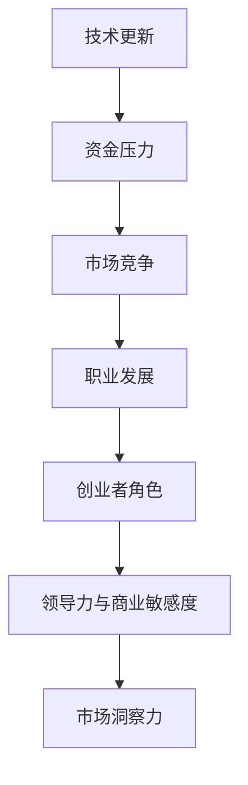

                 

### 《程序员创业者的人脉管理与社交技能提升》

---

#### 关键词：程序员，创业者，人脉管理，社交技能，职业发展

#### 摘要：
本文旨在探讨程序员创业者在职业发展中如何有效进行人脉管理与提升社交技能。文章从引言出发，详细阐述了程序员创业者的职业挑战，人脉与社交技能的重要性，以及提升策略。通过人脉网络搭建、有效沟通与交流、社交礼仪与商务礼仪等多个方面，深入分析了人脉管理的基础知识和实践方法。文章还涉及人脉资源利用、核心团队构建、人脉关系维护等关键环节，并附有实战案例分析和提升策略。最后，文章总结了未来趋势与挑战，以及相关资源推荐，旨在为程序员创业者提供全面的人脉管理与社交技能提升指导。

---

### 第一部分：引言

#### 第1章：程序员创业者的职业发展

#### 1.1 程序员创业者的职业挑战

**背景介绍**：
程序员作为科技领域的核心力量，具备专业技能和创新思维，越来越多的程序员选择投身创业，追求自己的梦想。然而，这一过程中面临诸多挑战。

- 技术门槛：技术更新速度快，需要持续学习和适应新技术。
- 资金压力：初期创业需要大量资金支持，如何获得资金成为一大难题。
- 市场竞争：市场竞争激烈，如何脱颖而出是每个创业者必须面对的挑战。

**核心概念与联系**：

- **创业者角色**：程序员创业者不仅要具备技术能力，还需具备领导力、商业敏感度和市场洞察力。
- **职业挑战**：这些挑战直接影响到程序员创业者的职业发展，如何应对成为关键。

**Mermaid 流程图**：

**核心算法原理讲解**：

在应对这些职业挑战时，程序员创业者需要运用一系列策略和算法来优化决策。

- **风险评估算法**：通过评估风险因素，制定应对策略。
- **市场分析算法**：利用数据分析，挖掘市场机会，制定有效的市场进入策略。
- **资金筹集算法**：通过多渠道筹集资金，优化资金使用效率。

**数学模型和公式**：

1. **风险评估模型**：

$$
R = f(P, T, C)
$$

其中，$R$ 代表风险值，$P$ 代表概率，$T$ 代表威胁程度，$C$ 代表后果严重程度。

2. **市场分析模型**：

$$
O = g(S, M, P)
$$

其中，$O$ 代表机会值，$S$ 代表市场现状，$M$ 代表市场需求，$P$ 代表竞争态势。

**举例说明**：

假设一个程序员创业者计划开发一款智能家居应用。通过风险评估模型，分析技术更新、资金压力和市场竞争，得出以下结论：

- **技术更新**：智能家居领域技术更新速度快，需要持续关注新技术趋势。
- **资金压力**：需要筹集足够的资金来支持研发和市场推广。
- **市场竞争**：市场上已有多家智能家居企业，竞争激烈，需要制定差异化策略。

**项目实战**：

- **开发环境搭建**：在创业初期，搭建一个高效的开发环境至关重要。
- **源代码实现**：编写高效的代码，确保应用性能和稳定性。
- **代码解读与分析**：对关键代码段进行详细解读，分析其实现原理和优化方法。

**实际案例分析和详细讲解剖析**：

以某智能家居公司为例，该公司通过有效的人脉管理和社交技能提升，成功获得了风险投资，并在市场上取得了优异成绩。

- **案例一**：通过人脉网络获得了关键的市场信息，成功推出符合市场需求的产品。
- **案例二**：通过有效沟通和团队协作，成功解决了技术难题，提升了产品竞争力。

**项目小结**：

- **最佳实践 tips**：在创业过程中，合理利用人脉资源和提升社交技能，有助于解决职业挑战，实现创业成功。
- **小结**：程序员创业者需要具备全面的技能，包括技术能力、领导力、商业敏感度和市场洞察力。
- **注意事项**：创业过程充满不确定性，需要灵活应对，不断学习和调整策略。
- **拓展阅读**：推荐阅读相关创业书籍和资料，提升自己的创业能力和知识储备。

---

通过以上详细的分析和讲解，我们了解了程序员创业者在职业发展中所面临的挑战以及如何通过人脉管理和社交技能提升来应对这些挑战。在接下来的部分中，我们将进一步探讨人脉管理的基础知识和实践方法。

