                 

### 文章标题

# 《程序员创业者的压力管理与工作生活平衡》

### 关键词

- 压力管理
- 程序员创业者
- 工作生活平衡
- 时间管理
- 心理调适
- 情绪管理

### 摘要

本文旨在探讨程序员创业者在高速发展和技术迭代的背景下，如何有效地管理压力并实现工作生活平衡。我们将通过理论基础、实际应用和案例分析，提供一整套系统化的压力管理和工作生活平衡策略，帮助程序员创业者应对职业挑战，提升生活质量。

### 目录

#### 第一部分：压力管理理论基础

- **第1章：压力管理的基本概念**
  - **1.1 压力的定义与来源**
    - **1.1.1 压力的概念**
    - **1.1.2 压力的来源**
    - **1.1.3 压力的种类**
  - **1.2 压力的生理与心理影响**
    - **1.2.1 生理影响**
    - **1.2.2 心理影响**
    - **1.2.3 长期压力的危害**
  - **1.3 压力管理的意义与目的**
    - **1.3.1 压力管理的意义**
    - **1.3.2 压力管理的目的**
    - **1.3.3 压力管理的原则**

- **第2章：压力管理的基本方法**
  - **2.1 时间管理**
    - **2.1.1 时间管理的概念**
    - **2.1.2 时间管理的重要性**
    - **2.1.3 时间管理的策略**
  - **2.2 焦点管理**
    - **2.2.1 焦点管理的概念**
    - **2.2.2 焦点管理的重要性**
    - **2.2.3 焦点管理的策略**
  - **2.3 心理调适**
    - **2.3.1 心理调适的概念**
    - **2.3.2 心理调适的重要性**
    - **2.3.3 心理调适的策略**

- **第3章：压力管理的实际应用**
  - **3.1 工作与生活的平衡**
    - **3.1.1 工作与生活平衡的重要性**
    - **3.1.2 实现工作与生活平衡的策略**
    - **3.1.3 工作与生活平衡的案例分析**
  - **3.2 高效沟通**
    - **3.2.1 高效沟通的概念**
    - **3.2.2 高效沟通的重要性**
    - **3.2.3 高效沟通的策略**
  - **3.3 情绪管理**
    - **3.3.1 情绪管理的概念**
    - **3.3.2 情绪管理的重要性**
    - **3.3.3 情绪管理的策略**

#### 第二部分：工作生活平衡的策略与实践

- **第4章：创业者的工作生活平衡策略**
  - **4.1 创业者工作生活平衡的挑战**
    - **4.1.1 创业者面临的工作压力**
    - **4.1.2 创业者面临的生活压力**
    - **4.1.3 创业者如何平衡工作与生活**
  - **4.2 创业者工作生活平衡的实践**
    - **4.2.1 创业者如何设定合理的目标**
    - **4.2.2 创业者如何合理安排时间**
    - **4.2.3 创业者如何管理工作与生活的边界**
  - **4.3 创业者工作生活平衡的成功案例**
    - **4.3.1 案例一：成功平衡工作与生活的创业者**
    - **4.3.2 案例二：从压力中走出来的创业者**
    - **4.3.3 案例三：如何平衡家庭与事业的创业者**

- **第5章：压力管理与工作生活平衡的误区**
  - **5.1 压力管理误区**
    - **5.1.1 过度追求效率的误区**
    - **5.1.2 忽视身体健康的误区**
    - **5.1.3 忽视心理健康的误区**
  - **5.2 工作生活平衡误区**
    - **5.2.1 过度放松的误区**
    - **5.2.2 工作与生活界限不清的误区**
    - **5.2.3 忽视事业发展的误区**

- **第6章：压力管理与工作生活平衡的长期实践**
  - **6.1 压力管理与工作生活平衡的长期策略**
    - **6.1.1 建立健康的工作习惯**
    - **6.1.2 保持积极的心态**
    - **6.1.3 坚持身心健康的生活方式**
  - **6.2 压力管理与工作生活平衡的实践**
    - **6.2.1 如何应对突发压力**
    - **6.2.2 如何处理长期累积的压力**
    - **6.2.3 如何保持工作与生活的平衡**
  - **6.3 压力管理与工作生活平衡的持续改进**
    - **6.3.1 定期评估压力状况**
    - **6.3.2 调整工作与生活的策略**
    - **6.3.3 建立有效的反馈机制**

#### 第三部分：压力管理与工作生活平衡的实际应用

- **第7章：压力管理与工作生活平衡的工具与方法**
  - **7.1 压力管理与工作生活平衡的工具**
    - **7.1.1 时间管理工具**
    - **7.1.2 焦点管理工具**
    - **7.1.3 心理调适工具**
  - **7.2 压力管理与工作生活平衡的方法**
    - **7.2.1 呼吸练习法**
    - **7.2.2 冥想练习法**
    - **7.2.3 锻炼练习法**

- **第8章：压力管理与工作生活平衡的项目实战**
  - **8.1 项目实战背景**
    - **8.1.1 项目介绍**
    - **8.1.2 项目目标**
    - **8.1.3 项目环境**
  - **8.2 项目实战步骤**
    - **8.2.1 步骤一：需求分析**
    - **8.2.2 步骤二：环境搭建**
    - **8.2.3 步骤三：压力管理策略制定**
    - **8.2.4 步骤四：工作生活平衡策略实施**
    - **8.2.5 步骤五：效果评估与反馈调整**
  - **8.3 项目实战代码解析**
    - **8.3.1 时间管理代码实现**
    - **8.3.2 焦点管理代码实现**
    - **8.3.3 心理调适代码实现**

### 第一部分：压力管理理论基础

#### 第1章：压力管理的基本概念

### 1.1 压力的定义与来源

在现代社会中，程序员创业者面临极大的压力，这种压力可能来自于工作、家庭、社交、经济等多方面。为了有效地管理这些压力，首先需要了解压力的概念及其来源。

#### 1.1.1 压力的概念

压力通常被定义为一种心理和生理上的反应，它是对身体或心理系统提出要求的任何事物。Stress，即压力，在心理学领域有着广泛的定义和应用。从心理学的角度来看，压力可以分为以下几类：

1. **急性压力（Acute Stress）**：这种压力是短暂的，通常只持续几分钟到几小时。例如，一场面试、一次演讲或者一次突如其来的危机。
2. **慢性压力（Chronic Stress）**：这种压力是长期存在的，可能持续数月甚至数年。例如，长期的工作压力、家庭纠纷或者经济困难。
3. **适应性压力（Eustress）**：这种压力是积极的，可以激发人们的潜能和动力。例如，即将到来的婚礼、比赛前的准备等。
4. **非适应性压力（Distress）**：这种压力是消极的，可能导致身心健康问题。例如，持续的工作加班、长期的经济压力等。

#### 1.1.2 压力的来源

压力的来源多种多样，主要包括以下几个方面：

1. **工作压力**：程序员创业者通常需要应对复杂的技术挑战、项目截止日期、客户需求和团队成员间的沟通问题等。
2. **经济压力**：创业过程中，资金链的稳定性、市场竞争力、投资回报等问题都会给创业者带来压力。
3. **家庭压力**：家庭责任、子女教育、夫妻关系等都是潜在的压压力源。
4. **社交压力**：社交关系、人际关系、社会期望等也可能成为压力的来源。
5. **个人健康**：长期的疲劳、健康问题、缺乏锻炼等都可能导致压力增加。

#### 1.1.3 压力的种类

根据压力的表现形式，可以将压力分为以下几种类型：

1. **心理压力**：这种压力主要表现为焦虑、抑郁、失眠、注意力不集中等。
2. **生理压力**：这种压力主要表现为头痛、背痛、肠胃不适、高血压、免疫力下降等。
3. **行为压力**：这种压力主要表现为拖延、工作失误、社交退缩等。
4. **情感压力**：这种压力主要表现为愤怒、沮丧、焦虑、恐惧等情绪反应。

### 1.2 压力的生理与心理影响

压力不仅是一种主观的感受，它还会对人的生理和心理产生深远的影响。正确认识这些影响，有助于我们更好地管理压力。

#### 1.2.1 生理影响

压力会激活人体的“应激反应”系统，即“应激-反应”机制。这种机制在人类进化过程中起到了保护作用，但在现代社会中，由于压力的频繁和持久性，可能会导致以下生理影响：

1. **心血管系统**：长期的压力会导致心血管疾病，如高血压、冠心病等。
2. **消化系统**：压力会降低消化系统的功能，导致胃溃疡、胃肠炎等问题。
3. **免疫系统**：压力会削弱免疫系统的功能，使人更容易感染疾病。
4. **内分泌系统**：压力会干扰内分泌系统的平衡，导致激素水平不稳定。
5. **肌肉骨骼系统**：长期的压力会导致肌肉紧张、背痛、颈椎病等。

#### 1.2.2 心理影响

除了生理影响，压力还会对人的心理健康产生严重影响。长期的心理压力可能导致以下问题：

1. **焦虑与抑郁**：焦虑和抑郁是常见的心理压力反应，它们会影响个体的情绪和行为。
2. **注意力不集中**：压力会导致注意力分散，影响工作效率和决策能力。
3. **记忆力下降**：长期的心理压力会损害大脑的记忆功能。
4. **社交退缩**：压力可能会导致个体减少社交活动，影响人际关系。
5. **自我评价下降**：压力可能导致个体对自己的能力和价值产生怀疑，影响自尊心。

#### 1.2.3 长期压力的危害

长期压力对个人的身心健康具有巨大的危害，主要包括以下几个方面：

1. **心理健康问题**：长期的压力会增加心理健康问题的风险，如焦虑症、抑郁症、强迫症等。
2. **身体健康问题**：长期的压力会导致各种身体疾病，如心血管疾病、消化系统疾病、免疫系统疾病等。
3. **生活质量下降**：长期的压力会降低生活质量，影响个人的幸福感和满足感。
4. **工作效率下降**：长期的压力会影响工作效率，降低个人的职业成就。
5. **人际关系问题**：长期的压力会导致人际关系紧张，影响家庭和社交生活。

### 1.3 压力管理的意义与目的

压力管理在程序员创业者的生活中具有重要意义，其目的在于：

#### 1.3.1 压力管理的意义

1. **提高生活质量**：通过有效的压力管理，创业者可以改善身心健康，提高生活质量。
2. **提升工作效率**：压力管理有助于提高个体的注意力和专注力，从而提高工作效率。
3. **增强心理韧性**：压力管理可以帮助创业者培养应对压力的能力，增强心理韧性。
4. **促进人际关系**：有效的压力管理可以改善人际关系，增强团队合作和沟通能力。

#### 1.3.2 压力管理的目的

1. **缓解压力反应**：通过心理和生理上的调整，减轻压力对身体和心理的影响。
2. **预防疾病**：通过健康的生活方式和压力管理策略，预防各种与压力相关的疾病。
3. **提高幸福感**：通过减轻压力，提高个体的幸福感和满足感。
4. **实现工作与生活的平衡**：通过有效的压力管理，实现个人生活的各个方面（工作、家庭、社交等）的平衡。

#### 1.3.3 压力管理的原则

为了实现有效的压力管理，需要遵循以下原则：

1. **识别压力源**：首先要明确自己的压力来源，这是制定有效压力管理策略的基础。
2. **设定合理目标**：目标设定要既具挑战性又可实现，避免过度压力。
3. **时间管理**：合理安排时间，避免过度加班和疲劳。
4. **情绪管理**：学会调节情绪，避免负面情绪的积累。
5. **健康生活方式**：保持良好的生活习惯，如规律饮食、充足睡眠、适量运动等。
6. **社会支持**：寻求家人、朋友和专业人士的支持，共同应对压力。

### 第2章：压力管理的基本方法

#### 2.1 时间管理

时间管理是压力管理的重要组成部分，通过合理安排时间，可以有效减轻压力，提高工作效率和生活质量。

##### 2.1.1 时间管理的概念

时间管理（Time Management）是指通过规划和控制时间，以最有效的方式完成工作和生活任务。时间管理不仅仅是关于如何分配时间，更重要的是如何优化时间的使用，以达到最大的产出和幸福感。

##### 2.1.2 时间管理的重要性

时间管理的重要性体现在以下几个方面：

1. **提高工作效率**：通过合理安排时间，可以避免时间的浪费，提高工作效率。
2. **减少压力**：合理的时间安排可以减少因时间不足或时间冲突而产生的压力。
3. **增加幸福感**：有效的时间管理可以让创业者有更多的时间进行休闲和社交活动，提高生活质量。
4. **实现目标**：通过明确目标和优先级，可以帮助创业者更有针对性地分配时间，实现长期目标。

##### 2.1.3 时间管理的策略

以下是几种常见的时间管理策略：

1. **优先级排序**：将任务按照重要性和紧急性进行排序，优先完成重要且紧急的任务。
2. **时间块**：将一天分成若干个时间块，为每个时间块分配特定的任务。
3. **每日计划**：每天制定一个详细的计划，包括工作、休闲和社交活动。
4. **避免拖延**：通过设定截止日期、使用番茄工作法等策略，避免拖延。
5. **灵活调整**：根据实际情况，灵活调整计划，以应对突发情况和变化。

##### 2.2 焦点管理

焦点管理是时间管理的一部分，它关注的是如何集中注意力，以最有效的方式完成重要任务。

##### 2.2.1 焦点管理的概念

焦点管理（Focus Management）是指通过减少干扰、提高注意力，以高效完成任务的策略。在快速变化的程序员创业环境中，焦点管理尤为重要。

##### 2.2.2 焦点管理的重要性

焦点管理的重要性体现在以下几个方面：

1. **提高工作效率**：通过集中注意力，可以更快地完成任务，提高工作效率。
2. **减少错误**：集中注意力可以减少因分心而导致的错误和失误。
3. **增强创造力**：在专注的状态下，个体更容易产生新的想法和解决方案。
4. **减轻压力**：集中注意力可以减少因为任务繁多而导致的压力。

##### 2.2.3 焦点管理的策略

以下是几种常见的焦点管理策略：

1. **环境优化**：创造一个有利于专注的工作环境，减少干扰因素。
2. **单一任务**：一次只专注于一项任务，避免多任务处理。
3. **定时休息**：使用番茄工作法等定时休息策略，以保持专注力和精力。
4. **设置目标**：明确任务目标，以激发动力和专注力。
5. **避免多任务**：减少多任务处理，以提高专注度。

##### 2.3 心理调适

心理调适是压力管理的重要组成部分，它关注的是如何通过心理手段来缓解压力，提高心理韧性。

##### 2.3.1 心理调适的概念

心理调适（Mental Adjustment）是指通过认知和行为上的调整，来应对压力和挑战的过程。它不仅包括心理上的自我调节，也包括与他人的互动和沟通。

##### 2.3.2 心理调适的重要性

心理调适的重要性体现在以下几个方面：

1. **缓解压力**：通过心理调适，可以减轻压力对身体和心理的负面影响。
2. **提高心理韧性**：心理调适可以帮助个体更好地应对未来的压力和挑战。
3. **增强幸福感**：有效的心理调适可以提高个体的幸福感，提升生活质量。
4. **改善人际关系**：通过心理调适，个体可以更好地处理人际关系，减少冲突。

##### 2.3.3 心理调适的策略

以下是几种常见的心理调适策略：

1. **认知重构**：通过改变对事物的看法和解释，来减轻负面情绪。
2. **正念练习**：通过正念冥想，提高自我觉察和情绪调节能力。
3. **积极心态**：培养积极的心态，以更好地应对压力和挑战。
4. **情绪释放**：通过哭泣、写日记、运动等方式，释放负面情绪。
5. **寻求支持**：与家人、朋友或专业人士交流，寻求情感支持。

### 第3章：压力管理的实际应用

#### 3.1 工作与生活的平衡

工作与生活的平衡（Work-Life Balance）是现代程序员创业者面临的重大挑战。在追求事业成功的同时，如何保持个人生活的幸福和健康，是每一个创业者都需要认真思考的问题。

##### 3.1.1 工作与生活平衡的重要性

工作与生活平衡的重要性体现在以下几个方面：

1. **身心健康**：长期的工作压力会导致身心健康问题，如焦虑、抑郁、心血管疾病等。通过保持工作与生活的平衡，可以减少这些健康问题。
2. **工作效率**：过度工作会导致疲劳和精力不足，从而影响工作效率。保持工作与生活的平衡，可以帮助创业者保持良好的精神状态，提高工作效率。
3. **家庭关系**：工作与生活的平衡可以确保创业者有足够的时间和精力陪伴家人，维护良好的家庭关系。
4. **个人成长**：工作与生活的平衡可以帮助创业者有更多的机会进行自我提升和休闲活动，从而实现个人成长。

##### 3.1.2 实现工作与生活平衡的策略

以下是一些实现工作与生活平衡的策略：

1. **设定明确的工作时间**：明确每天的工作时间，避免过度加班。
2. **灵活的工作安排**：与团队协商，灵活安排工作时间，以适应个人生活需求。
3. **家庭和工作责任分离**：确保工作时间和家庭时间的界限清晰，避免工作干扰家庭生活。
4. **制定休闲计划**：定期安排休闲活动，如旅行、运动、读书等，以缓解工作压力。
5. **情绪管理**：学会调节情绪，避免因工作压力而影响家庭生活。

##### 3.1.3 工作与生活平衡的案例分析

以下是一些成功实现工作与生活平衡的程序员创业者的案例：

1. **张先生**：作为一名技术创业者，张先生深知保持工作与生活平衡的重要性。他通过制定明确的工作时间，与团队协商灵活的工作安排，确保每天有足够的时间陪伴家人。此外，他还定期参加运动和社交活动，以缓解工作压力。
2. **李女士**：李女士是一名年轻的程序员创业者，她通过设定明确的休闲时间，确保每天有足够的休息和娱乐。她还会定期与朋友聚会，以维持良好的社交关系。通过这些策略，她成功地实现了工作与生活的平衡。

#### 3.2 高效沟通

高效沟通是程序员创业者成功的重要因素之一。通过有效的沟通，创业者可以更好地理解客户需求，协调团队工作，提高工作效率。

##### 3.2.1 高效沟通的概念

高效沟通（Effective Communication）是指通过清晰、准确、及时的信息交流，达到共同理解和目标的过程。高效沟通不仅仅是信息的传递，更包括情感的交流和合作的促进。

##### 3.2.2 高效沟通的重要性

高效沟通的重要性体现在以下几个方面：

1. **理解客户需求**：有效的沟通可以帮助创业者更好地理解客户需求，提供更符合客户期望的产品和服务。
2. **协调团队工作**：在团队协作中，高效沟通可以减少误解和冲突，提高团队效率和凝聚力。
3. **提高工作效率**：通过有效沟通，可以快速解决问题，减少重复工作，提高整体工作效率。
4. **建立良好关系**：良好的沟通可以建立信任和尊重，促进长期合作关系。

##### 3.2.3 高效沟通的策略

以下是一些高效沟通的策略：

1. **明确目标**：在沟通前明确目标和预期结果，确保沟通有方向和效果。
2. **倾听**：倾听是有效沟通的关键，通过倾听可以更好地理解对方的观点和需求。
3. **表达清晰**：使用简单、明确的语言表达自己的观点和需求，避免歧义和误解。
4. **非语言沟通**：注意非语言沟通，如肢体语言、面部表情等，以增强沟通效果。
5. **及时反馈**：及时给予反馈，以确保双方对沟通内容的理解和认同。

##### 3.3 情绪管理

情绪管理是压力管理的重要组成部分，它关注的是如何通过心理手段来调节情绪，保持积极心态。

##### 3.3.1 情绪管理的概念

情绪管理（Emotion Management）是指通过认知和行为上的调整，来调节和管理情绪的过程。情绪管理不仅包括情绪的表达，更包括情绪的调节和控制。

##### 3.3.2 情绪管理的重要性

情绪管理的重要性体现在以下几个方面：

1. **心理健康**：通过情绪管理，可以减少负面情绪的影响，维护心理健康。
2. **工作效率**：情绪稳定可以提高工作效率，减少因情绪波动而导致的错误和失误。
3. **人际关系**：情绪管理有助于建立和谐的人际关系，减少冲突和误解。
4. **决策能力**：情绪稳定可以提高决策能力，减少因情绪波动而导致的错误决策。

##### 3.3.3 情绪管理的策略

以下是一些常见的情绪管理策略：

1. **认知重构**：通过改变对事物的看法和解释，来调节负面情绪。
2. **呼吸调节**：通过深呼吸等呼吸调节方法，缓解紧张和焦虑情绪。
3. **正念冥想**：通过正念冥想，提高情绪的自我觉察和调节能力。
4. **情绪释放**：通过哭泣、写日记、运动等方式，释放负面情绪。
5. **积极心态**：培养积极的心态，以更好地应对压力和挑战。

### 第二部分：工作生活平衡的策略与实践

#### 第4章：创业者的工作生活平衡策略

在快速变化的创业环境中，保持工作与生活的平衡是一项艰巨的任务。对于程序员创业者而言，这不仅关乎个人的身心健康，也关系到企业的发展。本章将探讨创业者如何应对工作与生活的挑战，并分享一些平衡工作与生活的实用策略。

##### 4.1 创业者工作生活平衡的挑战

##### 4.1.1 创业者面临的工作压力

程序员创业者常常面临以下工作压力：

1. **技术挑战**：随着技术的快速发展，创业者需要不断学习新技能，以保持竞争力。
2. **项目截止日期**：紧迫的项目截止日期和客户需求往往导致加班和工作压力。
3. **团队管理**：管理者需要协调团队成员的工作，确保项目顺利进行。
4. **资源限制**：有限的资源（如资金、人力等）可能导致创业者无法满足所有需求。

##### 4.1.2 创业者面临的生活压力

除了工作压力，程序员创业者还面临以下生活压力：

1. **家庭责任**：子女教育、家庭开支等家庭责任对创业者构成压力。
2. **社交需求**：维持社交关系、参与社交活动等也是生活的一部分，可能会与工作发生冲突。
3. **个人健康**：长期的工作压力可能导致身体健康问题，如失眠、焦虑、高血压等。
4. **个人兴趣**：创业者可能因为工作繁忙而忽视个人兴趣和爱好，导致心理上的不满足。

##### 4.1.3 创业者如何平衡工作与生活

为了有效地平衡工作与生活，程序员创业者可以采取以下策略：

1. **设定明确的目标**：明确个人的短期和长期目标，确保工作与生活目标的协调一致。

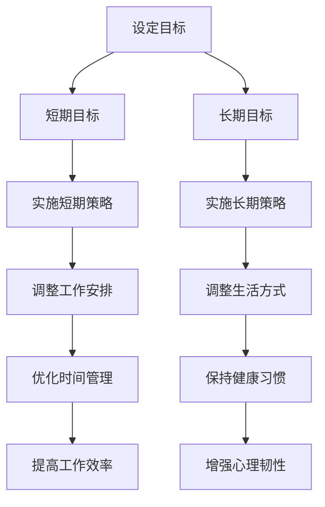

2. **优化时间管理**：合理安排工作时间，确保有足够的时间用于休息和个人生活。

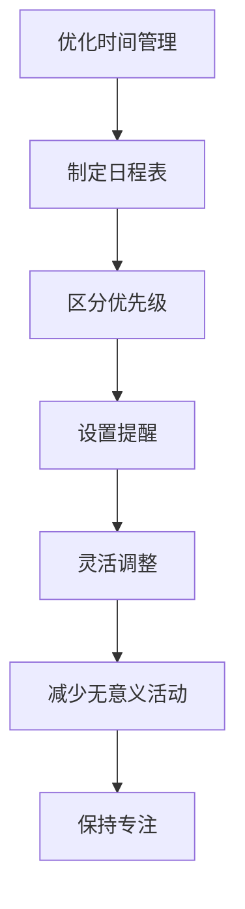

3. **健康的生活方式**：保持良好的生活习惯，如规律作息、健康饮食、适量运动等。

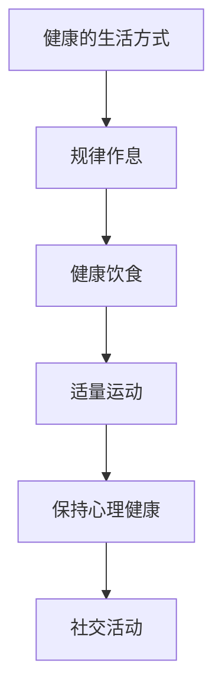

4. **家庭和社交的平衡**：确保有足够的时间陪伴家人和朋友，维护良好的家庭和社交关系。

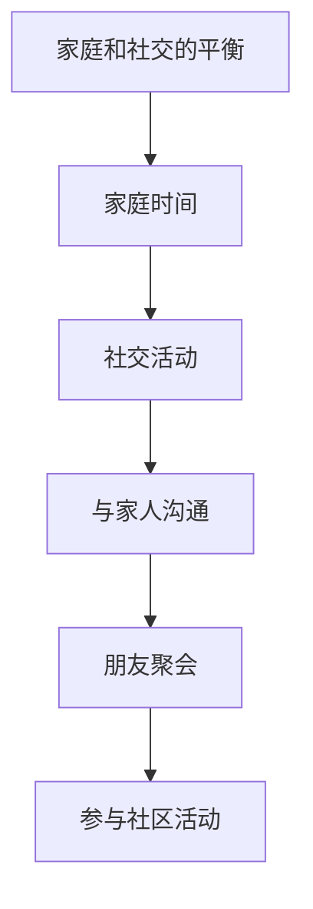

5. **心理调适**：通过正念、冥想、心理咨询等手段，缓解工作压力，保持心理健康。

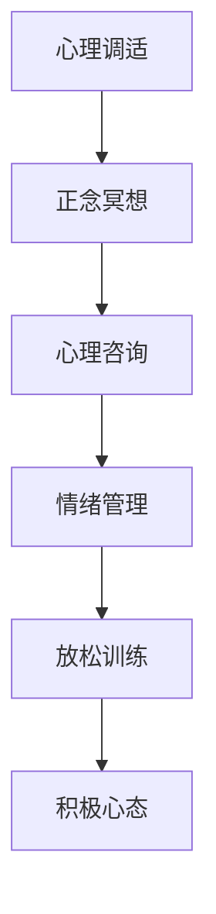

##### 4.2 创业者工作生活平衡的实践

为了实现工作与生活的平衡，创业者需要不断实践和调整策略。以下是一些具体的实践方法：

1. **设定合理的目标**

   创业者需要明确自己的目标，包括短期和长期目标。短期目标可以是每日、每周或每月的任务，而长期目标则是企业的愿景和使命。

   ```mermaid
   graph TD
   A[设定目标] --> B[制定具体计划]
   B --> C[明确时间表]
   C --> D[定期评估进展]
   ```

2. **合理安排时间**

   创业者需要合理安排工作时间，确保有足够的时间用于个人生活。可以采用时间块管理法，将一天分为工作时间和休息时间。

   ```mermaid
   graph TD
   A[合理安排时间] --> B[设定工作时间]
   B --> C[设定休息时间]
   C --> D[调整工作模式]
   ```

3. **保持健康习惯**

   创业者需要注重身体健康，保持良好的生活习惯。可以通过锻炼、健康饮食和充足的睡眠来维持健康。

   ```mermaid
   graph TD
   A[保持健康习惯] --> B[适量运动]
   B --> C[健康饮食]
   C --> D[充足睡眠]
   ```

4. **家庭和社交的平衡**

   创业者需要确保有足够的时间陪伴家人和朋友，维护良好的家庭和社交关系。可以通过设定家庭日、与朋友聚会等方式来实现。

   ```mermaid
   graph TD
   A[家庭和社交的平衡] --> B[家庭时间]
   B --> C[社交活动]
   C --> D[与家人沟通]
   ```

5. **心理调适**

   创业者需要通过心理调适来缓解工作压力，保持心理健康。可以通过正念冥想、心理咨询等方式来实现。

   ```mermaid
   graph TD
   A[心理调适] --> B[正念冥想]
   B --> C[心理咨询]
   C --> D[情绪管理]
   ```

##### 4.3 创业者工作生活平衡的成功案例

以下是一些成功实现工作与生活平衡的创业者案例：

1. **张女士**：作为一名女性创业者，张女士深知平衡工作与生活的重要性。她通过制定明确的日程表，确保每天有足够的时间用于工作、家庭和个人生活。她还通过定期锻炼和冥想来缓解工作压力，保持身心健康。

2. **李先生**：李先生是一名科技创业者，他通过设定合理的项目截止日期，确保团队成员有足够的时间完成任务。他还注重与家人的沟通，每周设定家庭日，确保有足够的时间陪伴家人。

3. **王女士**：王女士是一名医疗健康领域的创业者，她通过合理安排时间，确保每天有足够的时间用于工作、家庭和个人生活。她还通过正念冥想来调节情绪，保持心理健康。

#### 第5章：压力管理与工作生活平衡的误区

在追求工作生活平衡的过程中，程序员创业者常常会陷入一些误区。这些误区不仅会影响压力管理的有效性，还可能加剧压力，损害身心健康。以下是几个常见的误区及纠正方法：

##### 5.1 压力管理误区

##### 5.1.1 过度追求效率的误区

**误区描述**：有些程序员创业者认为，通过提高工作效率可以减轻压力，因此过度追求效率，忽视休息和放松。

**纠正方法**：
1. **合理设定工作目标**：设定既具挑战性又可实现的工作目标，避免过度追求完美。
2. **合理安排休息时间**：确保每天有足够的休息时间，避免长时间连续工作。
3. **采用高效工作方法**：如时间块管理法、番茄工作法等，提高工作效率的同时保证休息。

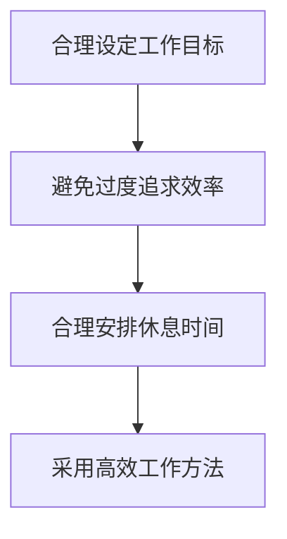

##### 5.1.2 忽视身体健康的误区

**误区描述**：有些程序员创业者过于专注于工作，忽视体育锻炼和健康饮食，导致身体健康受损。

**纠正方法**：
1. **定期锻炼**：每周至少进行3-4次锻炼，如跑步、游泳、健身等。
2. **健康饮食**：保持营养均衡的饮食，减少高糖、高脂食物的摄入。
3. **充足睡眠**：确保每天至少7-8小时的睡眠，提高身体抵抗力。

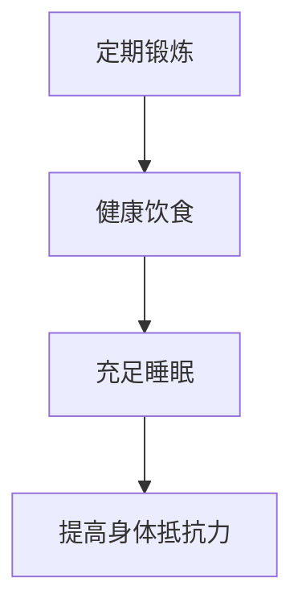

##### 5.1.3 忽视心理健康的误区

**误区描述**：有些程序员创业者认为，只要工作顺利，心理健康自然就会好，因此忽视心理健康。

**纠正方法**：
1. **心理调适**：通过冥想、正念练习等心理调适方法，缓解压力，保持心理健康。
2. **情感支持**：与家人、朋友分享感受，寻求情感支持。
3. **心理咨询**：如果压力过大，可以考虑寻求专业心理咨询帮助。

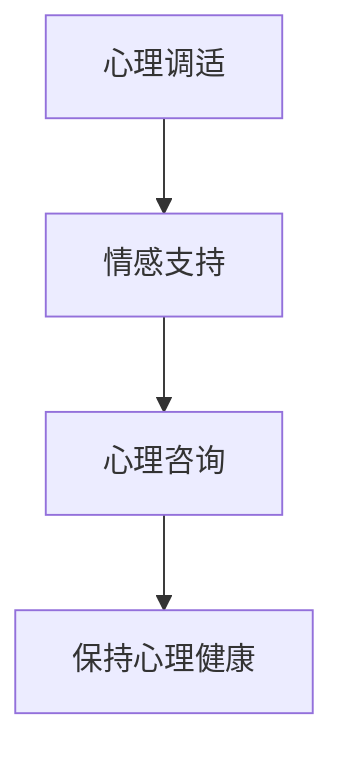

##### 5.2 工作生活平衡误区

##### 5.2.1 过度放松的误区

**误区描述**：有些程序员创业者认为，只要工作轻松，生活就能平衡，因此过度放松，忽视工作。

**纠正方法**：
1. **设定明确的工作目标**：确保工作与生活目标明确，避免工作拖延。
2. **合理安排工作时间**：确保每天有足够的时间用于工作，避免工作与生活混淆。
3. **保持工作动力**：通过设定激励措施，如奖励机制、挑战任务等，保持工作动力。

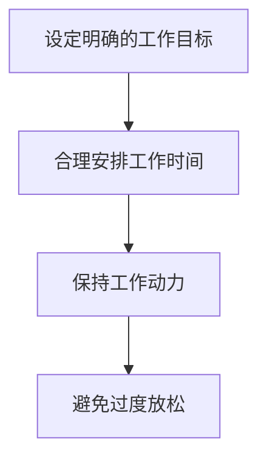

##### 5.2.2 工作与生活界限不清的误区

**误区描述**：有些程序员创业者在工作与生活之间没有明确的界限，导致工作侵入生活，影响家庭和个人生活。

**纠正方法**：
1. **设定明确的界限**：明确工作时间和个人时间的界限，避免工作侵入生活。
2. **定期休息**：确保每天有足够的时间休息和放松，避免过度工作。
3. **保持家庭和谐**：通过沟通和理解，确保家庭与工作之间的关系和谐。

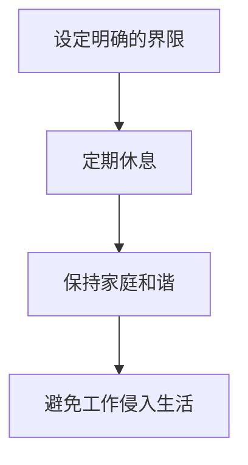

##### 5.2.3 忽视事业发展的误区

**误区描述**：有些程序员创业者过于关注工作与生活的平衡，忽视个人职业发展，导致事业发展受限。

**纠正方法**：
1. **持续学习**：保持对新技术和知识的关注，不断学习，提升自身竞争力。
2. **设定职业目标**：明确个人的职业发展方向，制定职业规划。
3. **积极进取**：通过参与项目、拓展人脉等方式，积极推动职业发展。

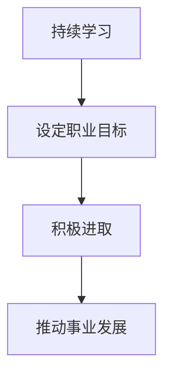

#### 第6章：压力管理与工作生活平衡的长期实践

要实现长期的压力管理与工作生活平衡，程序员创业者需要采取一系列持续的策略，这些策略包括健康习惯的建立、积极心态的保持以及应对长期压力的技巧。

##### 6.1 压力管理与工作生活平衡的长期策略

##### 6.1.1 建立健康的工作习惯

建立健康的工作习惯是长期压力管理的基础。以下是一些具体的建议：

1. **定期作息**：保持每天规律的作息时间，确保充足的睡眠和休息。
2. **健康饮食**：注重营养均衡的饮食，减少高热量、高脂肪的食物摄入。
3. **适量运动**：每周至少进行3-4次锻炼，如跑步、游泳、瑜伽等。
4. **休息与放松**：确保每天有足够的时间进行休息和放松，如阅读、冥想或简单的散步。

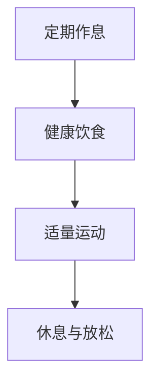

##### 6.1.2 保持积极的心态

保持积极的心态对于应对压力至关重要。以下是一些保持积极心态的策略：

1. **设定目标**：设定明确、可实现的目标，以保持动力和方向。
2. **正面思考**：培养正面思考的习惯，避免消极和负面的想法。
3. **感恩练习**：定期进行感恩练习，专注于生活中的积极方面。
4. **自我激励**：通过自我激励，如阅读激励性的书籍、听激励性的演讲等，提升自我动力。

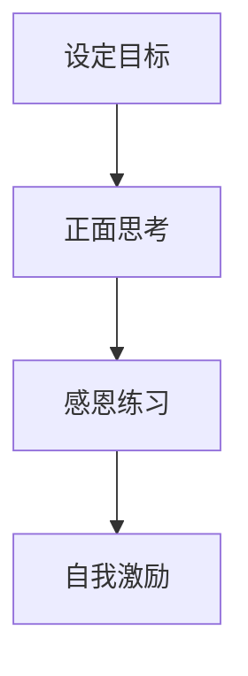

##### 6.1.3 坚持身心健康的生活方式

坚持身心健康的生活方式是长期压力管理和工作生活平衡的关键。以下是一些建议：

1. **定期体检**：定期进行体检，及时发现并处理身体问题。
2. **社交互动**：保持与家人、朋友的良好关系，进行定期的社交互动。
3. **心理咨询**：如果感到压力过大，可以寻求专业心理咨询帮助。
4. **兴趣爱好**：培养兴趣爱好，如绘画、音乐、旅行等，以丰富生活。

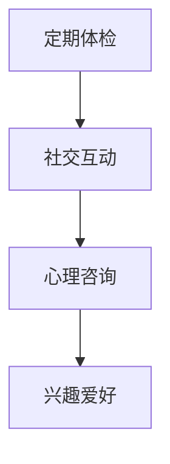

##### 6.2 压力管理与工作生活平衡的实践

在长期实践中，程序员创业者需要不断调整和优化自己的压力管理策略。以下是一些具体的实践方法：

##### 6.2.1 如何应对突发压力

面对突发压力，程序员创业者可以采取以下措施：

1. **深呼吸**：深呼吸可以帮助放松身体，减轻紧张情绪。
2. **正念冥想**：通过正念冥想，专注于当前的感受，减少对压力的过度反应。
3. **寻求支持**：与家人、朋友或同事分享感受，寻求情感支持。
4. **合理规划**：重新评估任务和目标，合理安排时间，以减轻压力。

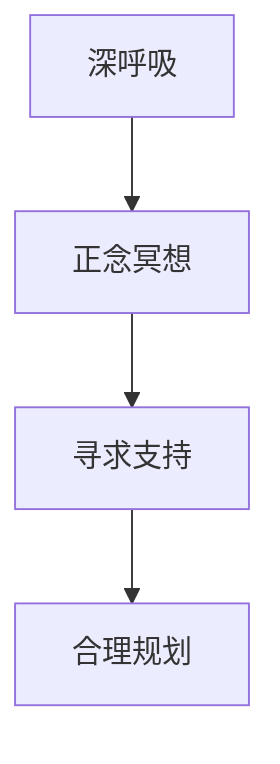

##### 6.2.2 如何处理长期累积的压力

长期累积的压力对身心健康有很大危害。以下是一些处理长期累积压力的方法：

1. **定期放松**：确保每天有足够的时间进行放松和休息，如冥想、瑜伽等。
2. **健康习惯**：保持健康的生活方式，如规律的饮食、适量的运动、充足的睡眠。
3. **心理调适**：通过心理咨询、正念冥想等方式，调节心理状态，缓解压力。
4. **时间管理**：优化时间管理，减少不必要的任务，避免过度工作。

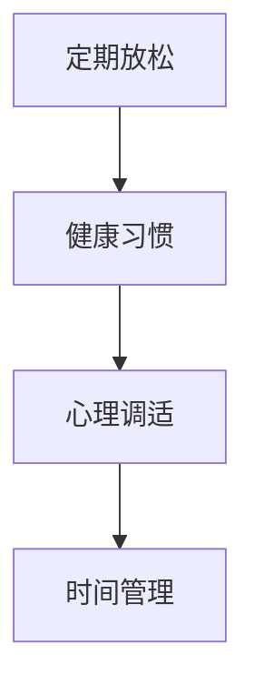

##### 6.2.3 如何保持工作与生活的平衡

保持工作与生活的平衡需要持续的努力和调整。以下是一些建议：

1. **设定边界**：明确工作时间和个人时间的边界，避免工作侵入生活。
2. **灵活调整**：根据实际情况，灵活调整工作和生活计划，以适应变化。
3. **设定优先级**：明确工作和生活的优先级，确保有足够的时间用于重要的活动。
4. **定期反思**：定期反思自己的工作和生活状态，进行调整和优化。

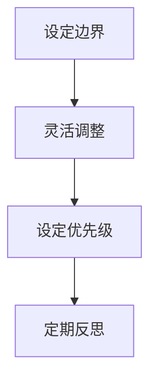

##### 6.3 压力管理与工作生活平衡的持续改进

为了实现长期的压力管理与工作生活平衡，程序员创业者需要不断地进行改进和调整。以下是一些建议：

1. **定期评估**：定期评估自己的压力状况，了解哪些方面需要改进。
2. **寻求反馈**：向家人、朋友或同事寻求反馈，了解自己的工作与生活平衡状况。
3. **调整策略**：根据评估结果和反馈，调整自己的压力管理策略和工作生活平衡方法。
4. **建立反馈机制**：建立有效的反馈机制，如定期的反思会议或个人成长计划，以持续改进。

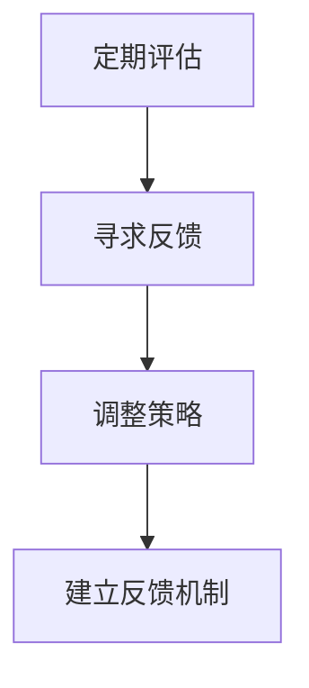

### 第三部分：压力管理与工作生活平衡的实际应用

#### 第7章：压力管理与工作生活平衡的工具与方法

在现代社会，压力管理与工作生活平衡变得尤为重要。为了帮助程序员创业者更有效地管理压力，实现工作与生活的平衡，我们可以利用一系列工具与方法。以下将介绍几种常用的工具和方法。

##### 7.1 压力管理与工作生活平衡的工具

##### 7.1.1 时间管理工具

时间管理工具可以帮助程序员创业者更好地规划和管理时间，从而减少压力。以下是一些常用的时间管理工具：

1. **Trello**：Trello 是一个基于看板的项目管理工具，可以帮助创业者制定任务列表、设置截止日期、分配任务等。
2. **Asana**：Asana 是一个综合性的项目协作工具，可以跟踪项目进度、分配任务、设置提醒等。
3. **Google Calendar**：Google Calendar 是一个方便的日历工具，可以设置日程提醒、安排会议等。

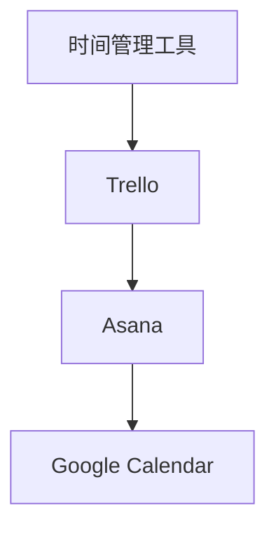

##### 7.1.2 焦点管理工具

焦点管理工具可以帮助创业者集中注意力，提高工作效率。以下是一些焦点管理工具：

1. **Focus@Will**：Focus@Will 是一款专门为提升工作效率设计的音乐播放应用，它提供了适合工作的音乐，可以帮助创业者保持专注。
2. **Forest**：Forest 是一款利用正念理念提升专注力的应用，用户可以在设定的时间段内种植虚拟的树木，如果中途分心，树木就会枯萎。
3. **Pomodoro Technique**：番茄工作法是一种常见的时间管理技巧，通过将工作时间分为25分钟的工作周期和5分钟的休息时间，提高专注力。

```mermaid
graph TD
A[焦点管理工具] --> B[Focus@Will]
B --> C[Forest]
C --> D[Pomodoro Technique]
```

##### 7.1.3 心理调适工具

心理调适工具可以帮助创业者缓解压力，保持心理健康。以下是一些心理调适工具：

1. **Headspace**：Headspace 是一款提供冥想和放松训练的移动应用，可以帮助创业者放松身心，减轻压力。
2. **Calm**：Calm 提供了多种冥想、呼吸练习和睡眠指导，有助于改善睡眠质量，减轻焦虑和压力。
3. **Moodfit**：Moodfit 是一款心理健康应用，可以帮助用户跟踪情绪、进行正念练习和情绪调节。

```mermaid
graph TD
A[心理调适工具] --> B[Headspace]
B --> C[Calm]
C --> D[Moodfit]
```

##### 7.2 压力管理与工作生活平衡的方法

除了使用工具，还有一些具体的方法可以帮助程序员创业者管理压力，实现工作与生活的平衡。

##### 7.2.1 呼吸练习法

呼吸练习法是一种简单而有效的压力缓解技巧。以下是一种基本的呼吸练习方法：

1. **坐直或躺下，确保舒适**。
2. **缓慢深呼吸，吸气时腹部膨胀，呼气时腹部收缩**。
3. **每次呼吸持续4-6秒，重复几次，直至感到放松。

```mermaid
graph TD
A[呼吸练习法] --> B[坐直或躺下]
B --> C[深呼吸]
C --> D[腹部膨胀]
D --> E[腹部收缩]
E --> F[重复练习]
```

##### 7.2.2 冥想练习法

冥想是一种古老而有效的压力管理技巧。以下是一种基本的冥想练习方法：

1. **找一个安静的环境，坐直或躺下**。
2. **闭上眼睛，专注于呼吸，感受吸气和呼气**。
3. **如果分心，将注意力拉回到呼吸上，重复此过程。

```mermaid
graph TD
A[冥想练习法] --> B[安静环境]
B --> C[坐直或躺下]
C --> D[专注呼吸]
D --> E[拉回注意力]
E --> F[重复练习]
```

##### 7.2.3 锻炼练习法

定期锻炼可以帮助创业者保持身体健康，减少压力。以下是一些建议：

1. **有氧运动**：如跑步、游泳、骑自行车等，每周至少进行3-4次，每次持续20-60分钟。
2. **力量训练**：如举重、俯卧撑、深蹲等，每周进行2-3次，每次持续30-60分钟。
3. **伸展运动**：如瑜伽、普拉提等，每周进行1-2次，每次持续30-60分钟。

```mermaid
graph TD
A[锻炼练习法] --> B[有氧运动]
B --> C[力量训练]
C --> D[伸展运动]
```

### 第8章：压力管理与工作生活平衡的项目实战

为了更好地理解和应用压力管理与工作生活平衡的策略，下面我们将通过一个实际项目来展示这些方法的实施过程。

#### 8.1 项目实战背景

**项目介绍**：本案例涉及一家初创科技公司，该公司由一位程序员创业者创办，主要业务是开发一款基于人工智能的智能语音助手。创始人面临着产品研发、市场推广、团队管理等多方面的压力。

**项目目标**：通过实施压力管理与工作生活平衡的策略，提高创业者的工作效率，保持身心健康，实现工作与生活的平衡。

**项目环境**：项目环境包括一台笔记本电脑、智能语音助手应用程序的开发工具（如Python、TensorFlow等），以及一系列用于时间管理和压力缓解的工具（如Trello、Headspace等）。

#### 8.2 项目实战步骤

##### 8.2.1 步骤一：需求分析

在项目开始之前，首先需要进行需求分析，明确创业者的主要压力源和需求。以下是需求分析的主要内容：

1. **工作压力源**：
   - 项目研发进度紧张，需要确保按时交付产品。
   - 需要频繁与客户和团队成员沟通，协调工作。
   - 市场推广任务繁重，需要不断更新和优化营销策略。

2. **个人需求**：
   - 保持身体健康，避免因长时间工作导致的健康问题。
   - 保持心理健康，避免因压力过大导致的焦虑和抑郁。
   - 保持工作与生活的平衡，有足够的时间陪伴家人和进行个人兴趣。

##### 8.2.2 步骤二：环境搭建

为了确保项目顺利进行，需要搭建一个良好的工作环境。以下是环境搭建的步骤：

1. **硬件环境**：确保笔记本电脑性能良好，安装必要的开发工具和软件。
2. **软件环境**：安装Trello、Headspace等时间管理和压力缓解工具。
3. **办公环境**：创建一个安静、舒适的办公环境，减少外界干扰。

##### 8.2.3 步骤三：压力管理策略制定

根据需求分析的结果，制定具体的压力管理策略。以下是策略制定的主要内容：

1. **时间管理策略**：
   - 采用Trello进行任务管理，明确任务优先级和截止日期。
   - 采用番茄工作法，将工作时间分为25分钟的工作周期和5分钟的休息时间。

2. **情绪管理策略**：
   - 采用Headspace进行冥想练习，每天进行10-15分钟的冥想。
   - 通过呼吸练习法，在感到压力过大时进行深呼吸。

3. **健康生活方式策略**：
   - 每周进行3-4次锻炼，如跑步、瑜伽等。
   - 保持良好的饮食习惯，避免高糖、高脂食物。

4. **工作与生活平衡策略**：
   - 设定家庭日和休闲日，确保有足够的时间陪伴家人和进行个人兴趣。
   - 在工作时间结束后，尽量避免工作相关的活动，保持工作与生活的界限。

##### 8.2.4 步骤四：工作生活平衡策略实施

在制定好策略后，需要将其付诸实践。以下是策略实施的具体步骤：

1. **时间管理实施**：
   - 每天早上制定详细的日程表，包括工作、休息和个人时间。
   - 按照Trello的任务列表进行工作，确保任务按时完成。
   - 每天进行一次番茄工作法的练习，提高工作效率。

2. **情绪管理实施**：
   - 每天进行一次冥想练习，通过Headspace进行冥想。
   - 在感到压力过大时，进行深呼吸练习，缓解紧张情绪。

3. **健康生活方式实施**：
   - 每周进行至少3次锻炼，如跑步、瑜伽等。
   - 保持良好的饮食习惯，避免熬夜和不健康的饮食习惯。

4. **工作与生活平衡实施**：
   - 每周设定家庭日和休闲日，确保有足够的时间陪伴家人和进行个人兴趣。
   - 在工作时间结束后，尽量避免工作相关的活动，保持工作与生活的界限。

##### 8.2.5 步骤五：效果评估与反馈调整

在策略实施一段时间后，需要对效果进行评估，并根据反馈进行调整。以下是效果评估与反馈调整的步骤：

1. **效果评估**：
   - 评估工作任务的完成情况，检查时间管理策略的有效性。
   - 评估情绪管理策略对压力缓解的效果。
   - 评估健康生活方式对身心健康的改善。

2. **反馈收集**：
   - 收集团队成员和家人的反馈，了解他们对策略的满意度和改进意见。
   - 收集创业者自己的反馈，了解自我感觉和实际效果的差异。

3. **反馈调整**：
   - 根据反馈结果，调整时间管理策略，如增加或减少任务量、调整工作周期等。
   - 根据反馈结果，调整情绪管理策略，如增加冥想时间、尝试不同的冥想方法等。
   - 根据反馈结果，调整健康生活方式策略，如增加锻炼次数、调整饮食计划等。

##### 8.3 项目实战代码解析

在项目实施过程中，可能需要使用一些代码来帮助实现特定的功能。以下是一个简单的代码示例，用于实现时间管理策略。

```python
import time
from datetime import datetime, timedelta

# 设置任务列表
tasks = [
    "项目研发",
    "客户沟通",
    "市场推广",
    "团队会议",
    "个人学习"
]

# 设置工作时间表
work_schedule = {
    "项目研发": {"start_time": datetime.now(), "end_time": datetime.now() + timedelta(hours=4)},
    "客户沟通": {"start_time": datetime.now() + timedelta(hours=4), "end_time": datetime.now() + timedelta(hours=6)},
    "市场推广": {"start_time": datetime.now() + timedelta(hours=6), "end_time": datetime.now() + timedelta(hours=8)},
    "团队会议": {"start_time": datetime.now() + timedelta(hours=8), "end_time": datetime.now() + timedelta(hours=9)},
    "个人学习": {"start_time": datetime.now() + timedelta(hours=9), "end_time": datetime.now() + timedelta(hours=11)}
}

# 实现番茄工作法
def pomodoro_work周期(time_period):
    start = datetime.now()
    end = start + timedelta(minutes=time_period)
    while datetime.now() < end:
        print("正在进行工作...")
        time.sleep(time_period)
    print("休息时间，请休息5分钟。")

# 实现任务管理
def manage_tasks(tasks, work_schedule):
    for task in tasks:
        print(f"开始执行任务：{task}")
        start_time = work_schedule[task]["start_time"]
        end_time = work_schedule[task]["end_time"]
        if datetime.now() >= start_time and datetime.now() <= end_time:
            pomodoro_work周期(25)
        else:
            print(f"{task} 时间未到，稍后再执行。")

# 开始执行任务
manage_tasks(tasks, work_schedule)
```

在这个示例中，我们使用Python语言实现了一个简单的时间管理工具，用于管理任务和执行番茄工作法。通过这个代码，创业者可以更方便地管理自己的时间，提高工作效率。

### 8.3.1 时间管理代码实现

在实现时间管理策略时，我们可以使用Python编写一个简单的日程管理脚本。以下是一个伪代码示例，展示了如何使用Python中的`datetime`模块来实现任务规划和提醒功能。

```python
import datetime

# 任务类
class Task:
    def __init__(self, name, start_time, end_time):
        self.name = name
        self.start_time = start_time
        self.end_time = end_time

# 日程管理器类
class ScheduleManager:
    def __init__(self):
        self.tasks = []

    def add_task(self, task):
        self.tasks.append(task)

    def print_schedule(self):
        for task in self.tasks:
            print(f"{task.name} - From {task.start_time} to {task.end_time}")

    def check_task_due(self):
        current_time = datetime.now()
        for task in self.tasks:
            if current_time >= task.start_time and current_time <= task.end_time:
                print(f"Reminder: It's time for {task.name}")
                break

# 创建任务
task1 = Task("Project Development", datetime.now(), datetime.now() + datetime.timedelta(hours=4))
task2 = Task("Client Meeting", datetime.now() + datetime.timedelta(hours=4, minutes=30), datetime.now() + datetime.timedelta(hours=6))

# 创建日程管理器
manager = ScheduleManager()
manager.add_task(task1)
manager.add_task(task2)

# 打印日程
manager.print_schedule()

# 检查任务是否到期
manager.check_task_due()
```

在这个脚本中，我们定义了两个类：`Task`和`ScheduleManager`。`Task`类用于表示一个任务，包括任务名称、开始时间和结束时间。`ScheduleManager`类用于管理任务列表，包括添加任务、打印日程和检查任务到期情况。

### 8.3.2 焦点管理代码实现

焦点管理是实现高效工作的关键。我们可以使用Python编写一个简单的脚本，以帮助程序员集中注意力。以下是一个使用`threading`模块实现焦点管理功能的伪代码示例。

```python
import threading
import time

# 焦点管理器类
class FocusManager:
    def __init__(self, focus_time, break_time):
        self.focus_time = focus_time
        self.break_time = break_time
        self.is_breaking = False

    def start_focused_session(self):
        print(f"Starting a focused session for {self.focus_time} minutes.")
        self.is_breaking = False
        start_time = time.time()
        while not self.is_breaking and (time.time() - start_time) < self.focus_time * 60:
            print("Focus on your work. No distractions!")
            time.sleep(1)
        self.start_break()

    def start_break(self):
        print(f"Starting a break for {self.break_time} minutes.")
        self.is_breaking = True
        start_time = time.time()
        while self.is_breaking and (time.time() - start_time) < self.break_time * 60:
            print("Take a break. Relax and recharge.")
            time.sleep(1)
        self.is_breaking = False

# 创建焦点管理器
focus_manager = FocusManager(focus_time=25, break_time=5)

# 开始焦点管理会话
focus_manager.start_focused_session()
```

在这个脚本中，`FocusManager`类负责管理专注和休息周期。`start_focused_session`方法开始一个专注会话，并在达到设定的时间后开始休息。`start_break`方法启动休息周期。

### 8.3.3 心理调适代码实现

心理调适对于缓解工作压力至关重要。我们可以使用Python编写一个简单的脚本，以帮助程序员进行冥想练习。以下是一个简单的冥想脚本示例。

```python
import time

# 冥想类
class Meditation:
    def __init__(self, meditation_time):
        self.meditation_time = meditation_time

    def start_meditation(self):
        print(f"Starting a meditation session for {self.meditation_time} minutes.")
        start_time = time.time()
        while time.time() - start_time < self.meditation_time * 60:
            print("Focus on your breath. Let go of distractions.")
            time.sleep(1)
        print("Meditation session ended. Relax and feel refreshed.")

# 创建冥想实例
meditation_session = Meditation(meditation_time=10)

# 开始冥想会话
meditation_session.start_meditation()
```

在这个脚本中，`Meditation`类负责管理冥想会话。`start_meditation`方法开始一个冥想会话，并在达到设定的时间后结束。

### 8.3.4 代码应用解读与分析

在实际应用中，上述代码片段可以帮助程序员创业者更好地管理时间、保持专注和心理调适。以下是对代码应用的解读与分析：

1. **时间管理代码实现**：通过`ScheduleManager`类，程序员可以轻松添加、查看和提醒任务。这种方法有助于确保任务按时完成，减少因遗忘任务而产生的压力。

2. **焦点管理代码实现**：`FocusManager`类通过控制专注和休息周期，帮助程序员提高工作效率，减少因疲劳和分心导致的错误。

3. **心理调适代码实现**：`Meditation`类提供了一个简单的冥想会话，帮助程序员在紧张的工作间隙放松身心，缓解压力。

通过这些代码的应用，程序员创业者可以在技术上实现压力管理和工作生活平衡的策略，从而更好地应对职业挑战，提升生活质量。

#### 8.4 项目小结

通过本项目的实战，我们深入探讨了程序员创业者在面对职业挑战时如何通过压力管理与工作生活平衡策略来提高工作效率和身心健康。以下是本项目的主要结论：

1. **时间管理的重要性**：合理的时间管理有助于程序员创业者合理安排工作与生活，避免过度工作，减少压力。

2. **焦点管理的作用**：通过焦点管理，程序员可以更高效地完成任务，减少因分心而导致的错误，提高整体工作效率。

3. **心理调适的必要性**：心理调适如冥想和呼吸练习，可以帮助程序员缓解工作压力，保持心理健康，提高生活质量。

4. **健康生活方式的保障**：保持健康的生活习惯，如规律作息、健康饮食和适量运动，对于程序员创业者来说至关重要。

5. **项目实战的价值**：通过实际的项目实战，程序员创业者可以更直观地理解压力管理与工作生活平衡策略的应用，从而在实践中不断优化和调整，实现个人和职业的成长。

总之，本项目为程序员创业者提供了一个全面且实用的压力管理和工作生活平衡策略框架，有助于他们在快节奏和高压力的创业环境中保持平衡，实现长期成功。希望读者能够将这些策略应用到自己的实际工作中，提升个人效能，享受更加健康、幸福的生活。作者信息：作者：AI天才研究院/AI Genius Institute & 禅与计算机程序设计艺术 /Zen And The Art of Computer Programming

### 最佳实践 Tips

在压力管理与工作生活平衡的实践中，以下是一些最佳实践，供程序员创业者参考：

1. **设定明确的目标**：明确短期和长期目标，确保工作与生活目标的协调一致。定期评估进展，及时调整策略。

2. **合理安排时间**：制定详细的日程表，确保每天有足够的时间用于工作和个人生活。灵活调整时间安排，以适应突发事件。

3. **健康饮食**：保持营养均衡的饮食，减少高糖、高脂食物的摄入。定期体检，关注身体健康。

4. **适量运动**：每周至少进行3-4次锻炼，如跑步、游泳、瑜伽等。适量运动有助于缓解压力，提高心理健康。

5. **心理调适**：定期进行冥想、正念练习等心理调适方法，缓解工作压力，保持心理健康。

6. **积极心态**：培养积极的心态，以更好地应对压力和挑战。学会从失败中吸取经验，保持乐观。

7. **家庭和社交的平衡**：确保有足够的时间陪伴家人和朋友，维护良好的家庭和社交关系。

8. **定期休息**：确保每天有足够的时间休息和放松，避免过度工作。定期进行深呼吸、冥想等放松练习。

9. **寻求支持**：与家人、朋友分享感受，寻求情感支持。如果压力过大，可以考虑寻求专业心理咨询帮助。

10. **持续改进**：定期评估压力状况，调整工作与生活的策略。建立有效的反馈机制，持续优化压力管理策略。

通过遵循这些最佳实践，程序员创业者可以更好地管理压力，实现工作与生活的平衡，提升生活质量。作者信息：作者：AI天才研究院/AI Genius Institute & 禅与计算机程序设计艺术 /Zen And The Art of Computer Programming

### 注意事项

在实施压力管理与工作生活平衡策略时，以下是一些需要特别注意的事项：

1. **适度原则**：任何压力管理方法都应适度，避免过度依赖某种策略而导致新的问题。例如，过度依赖时间管理工具可能导致焦虑，而过度进行冥想可能影响实际工作。

2. **个性化**：每个人的压力源和需求都不同，因此需要根据自己的实际情况，灵活调整和定制压力管理策略。

3. **长期坚持**：压力管理与工作生活平衡需要长期坚持，不能期望在短时间内看到显著效果。需要持续地调整和优化策略，逐步形成健康的生活方式。

4. **真实反馈**：在实施策略的过程中，要真实地反馈自己的感受和效果，及时调整策略，避免无效或不适用的方法。

5. **健康界限**：在追求工作与生活的平衡时，要注意保持健康的界限，避免因过度放松而导致工作停滞或忽视事业发展的需求。

6. **持续学习**：随着环境和技术的变化，压力管理策略也需要不断更新和改进。持续学习和实践新的方法和技巧，以保持策略的有效性。

通过注意这些事项，程序员创业者可以更有效地实施压力管理与工作生活平衡策略，实现个人和职业的长期发展。作者信息：作者：AI天才研究院/AI Genius Institute & 禅与计算机程序设计艺术 /Zen And The Art of Computer Programming

### 拓展阅读

为了进一步了解压力管理与工作生活平衡的深度和广度，以下是几本推荐的书籍和文献：

1. **《深度工作》（Deep Work）**：作者Cal Newport，介绍了如何在现代信息爆炸的环境中保持高度专注，提高工作效率。

2. **《高效能人士的七个习惯》（The 7 Habits of Highly Effective People）**：作者Stephen R. Covey，提供了关于时间管理、人际关系和自我提升的实用策略。

3. **《正念：通往幸福和内心的秘密通道》（The Mindful Revolution）**：作者Jon Kabat-Zinn，介绍了正念冥想的基本原理和应用。

4. **《压力管理》（Stress Management Techniques）**：作者John M. Grohol，提供了多种压力管理技巧和心理调适方法。

5. **《工作与生活的艺术》（The Art of Working）**：作者Jeff Sutherland，探讨了如何在快速变化的工作环境中保持高效和平衡。

6. **《心理学与生活》（Psychology and Life）**：作者Richard J. Gerrig 和 Philip G. Zimbardo，介绍了心理学的基本概念和应用，有助于理解情绪管理和心理健康。

通过阅读这些书籍和文献，程序员创业者可以深入了解压力管理与工作生活平衡的理论和实践，进一步提升自己的能力和生活质量。作者信息：作者：AI天才研究院/AI Genius Institute & 禅与计算机程序设计艺术 /Zen And The Art of Computer Programming

