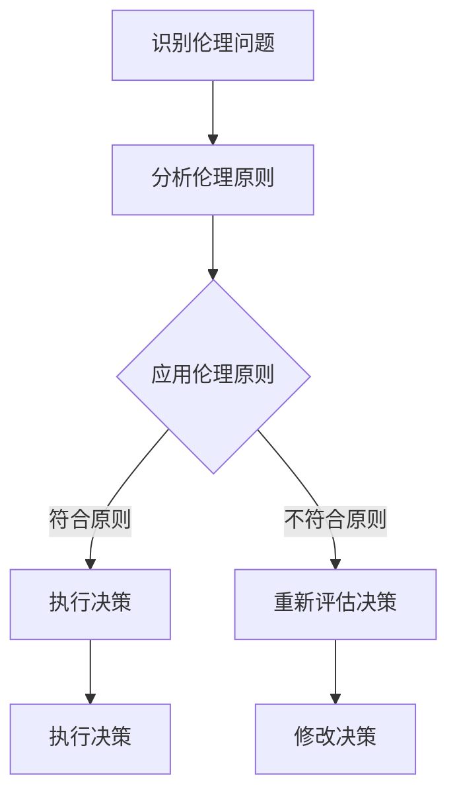
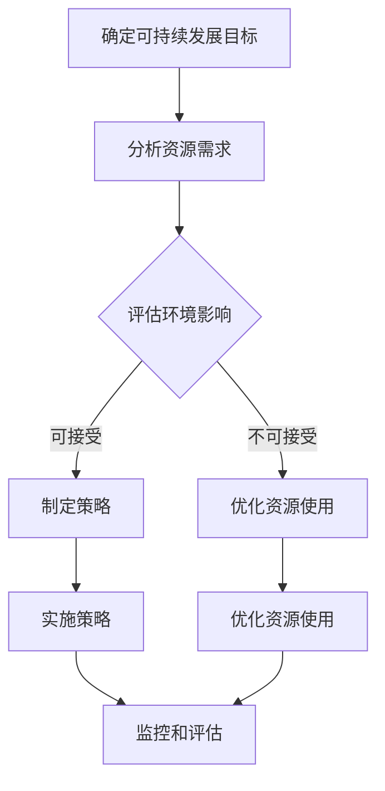

                 

# 《程序员创业者的商业伦理与可持续发展实践》

## 关键词
商业伦理、可持续发展、程序员创业者、社会责任、数据隐私、网络安全、伦理决策模型、伦理技术

## 摘要
本文深入探讨了程序员创业者在商业伦理与可持续发展实践中的关键角色。首先，通过定义商业伦理并阐述其在科技行业的重要性，我们揭示了程序员创业者面临的主要道德困境。接着，本文介绍了可持续发展原则，探讨了其在企业社会责任和商业战略中的运用。通过具体案例分析，文章揭示了商业决策中的伦理考量，并详细介绍了企业文化建设与伦理实践的方法。此外，文章从程序员视角出发，讨论了技术伦理与伦理技术，并提供了程序员创业者的商业伦理与可持续发展实践指南。最后，本文总结了一些最佳实践，并提供了丰富的资源与流程图示例，以助程序员创业者更好地实践商业伦理与可持续发展。

## 第一部分：商业伦理基础

### 第1章：商业伦理概述

#### 1.1 商业伦理的定义与重要性

商业伦理是指企业在经营活动中所遵循的一系列道德原则和价值观。这些原则和价值观旨在指导企业在追求利润的同时，尊重和保护员工、客户、供应商以及社会的利益。商业伦理的定义涵盖了企业内部行为规范、外部商业关系管理以及社会责任等多个方面。

商业伦理在科技行业的重要性尤为突出。随着科技的迅猛发展，科技企业面临着前所未有的道德挑战，如数据隐私、网络安全、知识产权保护等。商业伦理不仅是企业合法经营的基石，更是赢得客户信任、树立品牌形象的关键。在科技行业，遵循商业伦理的企业往往能够获得更高的市场份额和更持久的市场竞争力。

#### 1.2 商业伦理的挑战与问题

商业伦理的挑战和问题多种多样，其中最为突出的包括以下几点：

1. **数据隐私问题**：随着大数据和人工智能技术的发展，企业获取和处理用户数据的能力日益增强。然而，数据隐私问题也日益凸显，如数据泄露、滥用用户数据等。
2. **网络安全问题**：网络攻击、数据泄露等网络安全事件频繁发生，对企业的声誉和客户信任构成威胁。
3. **知识产权问题**：科技企业之间的知识产权争夺日益激烈，知识产权的侵权问题也愈发严重。
4. **社会影响问题**：科技企业的产品和服务对社会的正面和负面影响日益显著，如对就业、教育、健康等方面的影响。

#### 1.3 商业伦理的核心原则

商业伦理的核心原则包括诚实、公正、责任、透明和尊重等。以下是对这些原则的详细解释：

1. **诚实**：企业应保持诚实，遵守承诺，不欺骗、不误导客户和合作伙伴。
2. **公正**：企业在经营活动中应公正无私，不偏袒任何一方，确保各方权益得到公平对待。
3. **责任**：企业应对其行为承担法律责任和社会责任，确保经营活动符合法律法规和社会道德标准。
4. **透明**：企业应公开透明地披露其经营行为和决策过程，接受社会和客户的监督。
5. **尊重**：企业应尊重员工、客户、供应商等各方的合法权益，关注社会公共利益。

### 第2章：商业伦理在科技行业中的应用

#### 2.1 科技行业的道德困境

科技行业的道德困境主要体现在以下几个方面：

1. **人工智能与隐私**：人工智能技术的发展使得企业能够收集和分析大量用户数据，但如何平衡隐私保护与数据利用成为一大挑战。
2. **网络安全与隐私**：随着网络攻击和数据泄露事件的频发，网络安全问题成为科技行业的道德困境之一。
3. **知识产权**：科技企业之间的知识产权争夺日益激烈，如何保护知识产权、避免侵权成为重要问题。
4. **社会影响**：科技企业的产品和服务对社会产生的影响，如就业、教育、健康等，也引发了一系列道德困境。

#### 2.2 数据隐私与网络安全

数据隐私与网络安全是科技行业面临的主要商业伦理问题。以下是对这两个问题的详细探讨：

1. **数据隐私**：数据隐私问题源于企业对用户数据的收集、存储和使用。企业应在遵循法律法规的前提下，保护用户隐私，不得滥用用户数据。例如，可以通过数据脱敏、数据加密等技术手段保护用户数据。
2. **网络安全**：网络安全问题包括网络攻击、数据泄露等。企业应采取一系列安全措施，如安装防病毒软件、设置防火墙、定期备份数据等，确保企业系统和数据安全。

#### 2.3 责任与透明度

责任与透明度是科技企业应遵循的重要商业伦理原则。以下是对这两个原则的详细探讨：

1. **责任**：科技企业应对其行为承担法律责任和社会责任。例如，在发生数据泄露事件时，企业应及时通知受影响的用户，并采取措施防止类似事件再次发生。
2. **透明度**：科技企业应公开透明地披露其经营行为和决策过程，接受社会和客户的监督。例如，可以通过定期发布企业社会责任报告、接受第三方审计等方式提高透明度。

### 第3章：可持续发展与商业伦理

#### 3.1 可持续发展的概念与原则

可持续发展是指满足当前需求而不损害后代满足其需求的能力。可持续发展原则包括经济、社会和环境三个方面，旨在实现经济繁荣、社会进步和环境友好。

1. **经济原则**：企业应在追求经济效益的同时，实现资源的有效利用和合理配置，避免经济浪费。
2. **社会原则**：企业应关注社会问题，积极参与社会公益事业，促进社会和谐与进步。
3. **环境原则**：企业应注重环境保护，采取环保措施，减少环境污染和资源消耗。

#### 3.2 企业社会责任与可持续发展

企业社会责任（CSR）是指企业承担的社会责任，包括环境保护、员工权益保护、社区发展等方面。可持续发展与CSR密切相关，企业应通过履行社会责任，实现可持续发展。

1. **环境保护**：企业应采取环保措施，减少环境污染和资源消耗。例如，通过节能减排、循环利用等措施降低企业对环境的影响。
2. **员工权益保护**：企业应关注员工权益，提供良好的工作环境和培训机会，保障员工身心健康。
3. **社区发展**：企业应积极参与社区发展，支持社区公益事业，为社区提供支持。

#### 3.3 可持续发展的商业战略

可持续发展的商业战略是指企业在追求经济效益的同时，实现社会和环境效益的策略。以下是一些常见的可持续发展商业战略：

1. **绿色供应链**：通过优化供应链管理，降低资源消耗和环境污染。
2. **绿色产品开发**：开发环保、节能、低碳产品，满足消费者对可持续产品的需求。
3. **社会责任投资**：将社会责任纳入投资决策，支持可持续发展项目。

## 第二部分：商业伦理实践

### 第4章：商业决策中的伦理考量

#### 4.1 伦理决策模型与工具

在商业决策过程中，伦理考量至关重要。以下是一些常用的伦理决策模型与工具：

1. **道德原则模型**：基于一系列道德原则（如诚实、公正、责任等），评估和选择最佳方案。
2. **成本效益分析**：综合考虑伦理成本和效益，选择最优方案。
3. **利益相关者分析**：识别和评估不同利益相关者（如员工、客户、供应商等）的利益，选择符合各方利益的方案。
4. **伦理决策树**：通过构建决策树，逐步分析每个选项的伦理得分，选择最佳方案。

#### 4.2 伦理冲突的解决策略

伦理冲突在商业决策中时常发生。以下是一些常见的解决策略：

1. **协商与妥协**：通过协商和妥协，找到双方都能接受的解决方案。
2. **回避**：当冲突无法解决时，可以选择回避，避免继续争论。
3. **伦理审查**：设立伦理委员会，对决策进行伦理审查，确保决策符合道德原则。
4. **法律途径**：通过法律途径解决伦理冲突，维护各方合法权益。

#### 4.3 伦理决策案例分析

以下是一个关于数据隐私的伦理决策案例：

某科技公司计划开发一款基于用户数据的个性化推荐系统，以提高用户体验和广告投放效果。然而，用户数据隐私问题引起了广泛关注。公司面临以下伦理决策：

1. **收集和使用用户数据**：公司应在遵循法律法规和道德原则的前提下，收集和使用用户数据，确保用户隐私得到保护。
2. **数据脱敏**：对用户数据进行脱敏处理，降低数据泄露风险。
3. **用户知情同意**：在收集和使用用户数据前，明确告知用户数据收集的目的、范围和用途，并获得用户同意。
4. **透明度**：公开透明地披露数据收集、存储和使用情况，接受用户和社会的监督。

### 第5章：企业文化建设与伦理实践

#### 5.1 企业文化的重要性

企业文化是企业价值观、行为规范和工作氛围的总和，对员工的价值观和行为产生深远影响。企业文化的重要性体现在以下几个方面：

1. **塑造企业形象**：企业文化是企业对外展示的形象和价值观，有助于树立品牌形象。
2. **提升员工凝聚力**：企业文化有助于增强员工归属感和凝聚力，提高团队协作效率。
3. **引导员工行为**：企业文化对员工的行为产生约束和引导作用，有助于企业实现长期发展。
4. **提高竞争力**：具有优秀企业文化的企业往往更具竞争力，能够在激烈的市场竞争中脱颖而出。

#### 5.2 建立符合伦理的企业文化

建立符合伦理的企业文化是企业可持续发展的重要保障。以下是一些建议：

1. **明确企业价值观**：企业应明确自己的价值观，并将其融入企业文化的方方面面。
2. **制定伦理准则**：企业应制定明确的伦理准则，规范员工行为。
3. **培养员工道德素养**：通过培训和教育，提高员工的道德素养和伦理意识。
4. **倡导社会责任**：企业应倡导社会责任，鼓励员工积极参与公益事业。
5. **设立伦理委员会**：设立伦理委员会，对企业的伦理行为进行监督和指导。

#### 5.3 企业伦理培训与实践

企业伦理培训与实践是建立和巩固企业文化的关键。以下是一些建议：

1. **制定培训计划**：企业应制定详细的伦理培训计划，确保员工接受全面的伦理教育。
2. **开展培训活动**：通过内部讲座、研讨会、案例分析等方式，开展多样化的培训活动。
3. **实践与考核**：将伦理实践纳入员工绩效考核，激励员工遵守伦理规范。
4. **反馈与改进**：定期收集员工反馈，对培训与实践效果进行评估和改进。

### 第6章：商业伦理与可持续发展实践案例

#### 6.1 成功案例分享

以下是一个关于可持续发展的成功案例：

某科技公司通过实施绿色供应链管理，实现了可持续发展。具体措施包括：

1. **优化供应链**：与供应商建立长期合作关系，确保供应链的可持续性和稳定性。
2. **节能减排**：在生产过程中采用节能技术和设备，降低能源消耗和碳排放。
3. **循环利用**：通过回收和再利用废弃物，降低资源消耗和环境污染。

该公司的可持续发展实践取得了显著成果，不仅提高了企业声誉，还降低了运营成本。

#### 6.2 失败案例分析

以下是一个关于商业伦理的失败案例：

某科技公司因数据泄露事件遭到舆论谴责，企业声誉受到严重损害。原因包括：

1. **数据管理不善**：公司对用户数据管理不善，未能采取有效的数据安全措施。
2. **缺乏透明度**：公司在数据泄露事件发生后，未能及时向用户披露事件详情，缺乏透明度。
3. **忽视伦理责任**：公司忽视商业伦理，将用户数据用于商业利益，导致数据泄露。

#### 6.3 启示与反思

从成功案例和失败案例中，我们可以得出以下启示与反思：

1. **重视商业伦理**：企业应重视商业伦理，将伦理原则融入企业经营活动中，确保企业长期发展。
2. **加强数据隐私保护**：企业应加强数据隐私保护，采取有效的数据安全措施，确保用户数据安全。
3. **提高透明度**：企业应提高透明度，及时披露重要信息，接受社会和客户的监督。
4. **建立伦理监督机制**：企业应建立伦理监督机制，对企业的伦理行为进行监督和评估。

## 第三部分：程序员视角下的商业伦理与可持续发展

### 第7章：程序员的角色与责任

#### 7.1 程序员职业素养

程序员职业素养是指程序员在职业生涯中所需具备的技能、知识和态度。以下是一些重要的程序员职业素养：

1. **技术能力**：程序员应具备扎实的技术基础，能够熟练运用各种编程语言和开发工具。
2. **问题解决能力**：程序员应具备良好的问题解决能力，能够迅速识别和解决技术难题。
3. **团队合作能力**：程序员应具备良好的团队合作能力，能够与他人协作完成项目任务。
4. **沟通能力**：程序员应具备良好的沟通能力，能够清晰、准确地表达自己的想法和意见。
5. **持续学习能力**：程序员应具备持续学习能力，能够不断更新知识和技能，跟上技术发展的步伐。

#### 7.2 程序员在商业伦理中的责任

程序员在商业伦理中扮演着重要角色。以下是一些程序员在商业伦理中的责任：

1. **尊重隐私**：程序员应尊重用户隐私，不得未经用户同意收集、使用和泄露用户数据。
2. **保障数据安全**：程序员应确保数据安全，采取有效的数据安全措施，防止数据泄露和滥用。
3. **遵守法律法规**：程序员应遵守相关法律法规，确保其开发的应用程序符合法律法规要求。
4. **道德责任**：程序员应具备道德责任，不参与任何违法和不道德的行为。
5. **社会责任**：程序员应关注社会问题，积极参与公益事业，为社会做出贡献。

#### 7.3 程序员在可持续发展中的作用

程序员在可持续发展中发挥着重要作用。以下是一些程序员在可持续发展中的作用：

1. **开发绿色软件**：程序员应开发绿色软件，降低能耗和碳排放，推动绿色经济发展。
2. **优化资源利用**：程序员应优化资源利用，提高软件运行效率和稳定性，降低资源消耗。
3. **参与可持续发展项目**：程序员应积极参与可持续发展项目，为可持续发展提供技术支持。
4. **倡导可持续发展理念**：程序员应倡导可持续发展理念，引导社会关注和参与可持续发展。

### 第8章：技术伦理与伦理技术

#### 8.1 技术伦理的定义与原则

技术伦理是指技术发展过程中所涉及的一系列伦理问题，旨在指导技术在道德和伦理方面的应用。技术伦理的基本原则包括：

1. **尊重人权**：技术应尊重人权，保护用户隐私和自由。
2. **公正公平**：技术应公正公平地对待所有人，不歧视任何群体。
3. **透明度**：技术应具备透明度，用户应了解技术的运作方式和数据使用情况。
4. **责任**：技术开发者应对其开发的技术负责，确保技术不会对社会和用户造成负面影响。
5. **可持续发展**：技术应支持可持续发展，减少对环境的负面影响。

#### 8.2 伦理技术的开发与应用

伦理技术是指在设计、开发和应用过程中遵循伦理原则的技术。以下是一些伦理技术的开发与应用：

1. **隐私保护技术**：如数据脱敏、数据加密等技术，用于保护用户隐私。
2. **网络安全技术**：如防火墙、入侵检测等技术，用于保护网络和数据安全。
3. **公平算法**：如反歧视算法、公平评分算法等，用于确保技术应用的公正公平。
4. **可持续技术**：如绿色能源技术、节能减排技术等，用于推动可持续发展。

#### 8.3 技术伦理的未来趋势

技术伦理在未来将继续发展，以下是一些可能的技术伦理趋势：

1. **人工智能伦理**：随着人工智能技术的发展，如何确保人工智能系统的透明度、公平性和可控性将成为重要议题。
2. **数据伦理**：如何平衡数据隐私保护与数据利用，将成为数据伦理研究的重要方向。
3. **数字健康伦理**：如何确保数字健康技术的安全性和有效性，将成为数字健康伦理的研究重点。
4. **可持续发展伦理**：如何确保技术在推动经济发展的同时，实现社会和环境可持续发展，将成为可持续发展伦理的研究热点。

### 第9章：程序员创业者的商业伦理与可持续发展实践

#### 9.1 创业过程中的伦理考量

程序员创业者应在创业过程中充分考虑伦理考量，以下是一些关键伦理考量：

1. **数据隐私**：确保用户数据得到充分保护，不滥用用户数据。
2. **网络安全**：采取有效的网络安全措施，防止数据泄露和网络攻击。
3. **社会责任**：关注社会问题，积极参与公益事业，承担社会责任。
4. **道德责任**：遵守道德原则，不参与任何违法和不道德的行为。
5. **可持续发展**：推动可持续发展，采用绿色技术和环保措施。

#### 9.2 可持续发展创业模式

程序员创业者可以采用以下可持续发展创业模式：

1. **绿色创业**：开发绿色软件，降低能耗和碳排放，推动绿色经济发展。
2. **共享经济**：通过共享技术和服务，实现资源的最大化利用，降低资源消耗。
3. **循环经济**：通过循环利用废弃物，降低资源消耗和环境污染。
4. **公益创业**：将公益事业融入创业过程中，为社会做出贡献。

#### 9.3 程序员创业者的成功案例

以下是一些程序员创业者的成功案例：

1. **Dropbox**：由程序员创业者Drew Houston创立，通过创新的数据同步和共享技术，成功打造了一个全球性的云存储平台。
2. **Waze**：由程序员创业者Uri Levine和Noam Bardin创立，通过创新的地图和导航技术，为用户提供实时交通信息和路线优化。
3. **Trello**：由程序员创业者Michael Pryor和Brendan Schwartz创立，通过创新的任务管理和协作技术，帮助团队高效协作和管理工作。

这些成功案例展示了程序员创业者在商业伦理和可持续发展实践中的卓越表现，为其他创业者提供了宝贵经验和启示。

## 附录

### 附录A：商业伦理与可持续发展资源

#### A.1 相关法律法规与政策

1. **《中华人民共和国网络安全法》**：规定了网络运营者的数据保护义务和网络安全的法律责任。
2. **《中华人民共和国环境保护法》**：规定了企业环境保护的法律责任和环境保护的基本原则。
3. **《联合国可持续发展目标》**：提出了全球可持续发展的重要目标和行动指南。

#### A.2 学术研究资源

1. **《商业伦理学期刊》**：提供了丰富的商业伦理研究论文和案例。
2. **《可持续发展期刊》**：提供了丰富的可持续发展研究论文和案例。
3. **《科技伦理学期刊》**：提供了丰富的科技伦理研究论文和案例。

#### A.3 行业报告与案例分析

1. **《全球信息技术报告》**：提供了全球信息技术发展的趋势和案例。
2. **《全球可持续报告》**：提供了全球可持续发展趋势和案例。
3. **《中国企业社会责任报告》**：提供了中国企业社会责任实践和案例。

### 附录B：Mermaid流程图示例

#### B.1 商业伦理决策流程



#### B.2 可持续发展战略规划流程



### 附录C：代码案例分析

#### C.1 数据隐私保护代码实例

```python
import hashlib

def hash_password(password):
    # 对密码进行哈希处理
    hashed_password = hashlib.sha256(password.encode()).hexdigest()
    return hashed_password

def verify_password(hashed_password, input_password):
    # 验证输入密码是否正确
    return hashed_password == hash_password(input_password)
```

#### C.2 网络安全防护代码实例

```python
import requests

def send_request(url, data):
    # 发送HTTP请求，并返回响应数据
    response = requests.post(url, data=data)
    return response.json()

def secure_request(url, data, secret_key):
    # 对数据进行加密处理
    encrypted_data = encrypt_data(data, secret_key)
    return send_request(url, encrypted_data)
```

### 数学公式与伪代码示例

#### 3.1.3 可持续发展的数学模型

$$
\text{SD} = \frac{\text{G} \times \text{E}}{\text{C}}
$$

其中：
- $\text{SD}$ 代表可持续发展水平（Sustainable Development Level）。
- $\text{G}$ 代表经济增长率（Growth Rate）。
- $\text{E}$ 代表环境效益（Environmental Benefit）。
- $\text{C}$ 代表社会成本（Cost of Society）。

#### 7.2.1 伦理决策模型伪代码

```python
def ethical_decision-making(context, alternatives, principles):
    # 初始化决策变量
    best_choice = None
    max_ethical_score = -1

    # 分析每个选项的伦理得分
    for alternative in alternatives:
        score = 0
        for principle in principles:
            if context.satisfies_principle(alternative, principle):
                score += 1

        # 更新最佳选择
        if score > max_ethical_score:
            max_ethical_score = score
            best_choice = alternative

    return best_choice
```

### 最佳实践 Tips、小结、注意事项、拓展阅读

#### 最佳实践 Tips

1. **重视商业伦理**：将商业伦理纳入企业战略，确保企业长期发展。
2. **加强数据隐私保护**：采取有效措施保护用户数据，降低数据泄露风险。
3. **关注社会责任**：积极参与公益事业，承担社会责任。
4. **推动可持续发展**：采用绿色技术和环保措施，实现可持续发展。

#### 小结

商业伦理与可持续发展是程序员创业者在创业过程中必须关注的重要方面。遵循商业伦理有助于树立企业声誉，实现长期发展。同时，可持续发展是企业实现经济效益、社会效益和环境效益的重要途径。程序员创业者应积极践行商业伦理，推动可持续发展，为社会的繁荣和进步做出贡献。

#### 注意事项

1. **了解相关法律法规**：确保企业的经营行为符合相关法律法规要求。
2. **加强内部培训**：提高员工的伦理意识和道德素养。
3. **建立伦理监督机制**：设立伦理委员会，对企业的伦理行为进行监督和评估。
4. **关注社会影响**：关注企业的产品和服务对社会的影响，采取相应措施降低负面影响。

#### 拓展阅读

1. **《商业伦理学：理论与实践》**：提供了商业伦理的全面介绍和案例分析。
2. **《可持续发展：原理与实践》**：介绍了可持续发展的概念、原则和实践方法。
3. **《程序员伦理：道德责任与职业规范》**：探讨了程序员在职业和伦理方面的责任和规范。
4. **《人工智能伦理：理论与实践》**：介绍了人工智能伦理的重要议题和案例分析。

