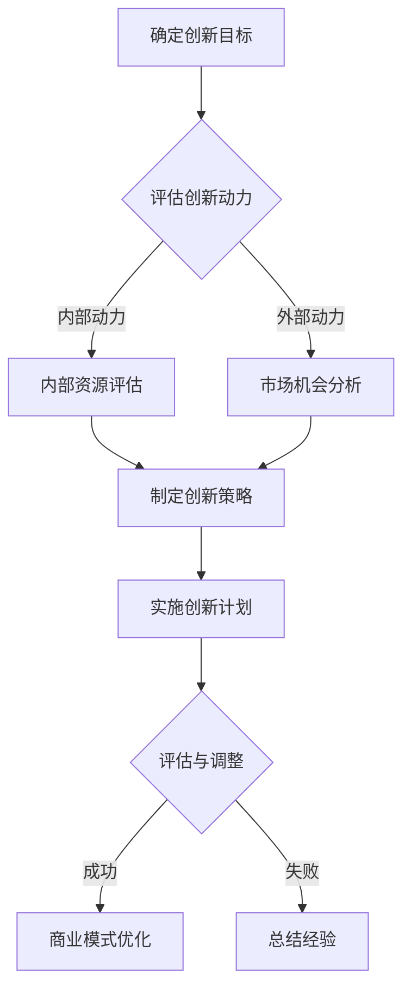

                 

### 《程序员创业者的商业模式创新与价值主张设计》

#### 关键词

- 商业模式创新
- 程序员创业者
- 价值主张设计
- 商业画布
- 价值主张矩阵
- 数字经济
- 智能化与自动化

#### 摘要

本文旨在探讨程序员创业者在构建商业模式和创新价值主张方面的关键策略和实践。文章首先介绍了商业模式的定义和重要性，分析了创业者的思维模式和创业准备策略。接着，深入探讨了商业模式创新的原理、方法和成功案例，以及价值主张的定义和设计原则。文章随后展示了商业模式与价值主张的融合原理和实践，并通过商业模式画布和价值主张矩阵的介绍，提供了具体的工具应用。最后，文章展望了商业模式创新和价值主张设计的未来趋势，并提供了附录中的商业案例研究和工具资源，以供参考。

### 第一部分：商业思维与创业准备

在进入程序员创业的世界之前，理解商业思维和做好充分的创业准备是至关重要的。本部分将首先介绍商业模式的基本概念，包括商业模式的定义和重要性，然后探讨创业者的思维模式，以及创业准备与策略，特别是市场研究与定位、资源整合与团队建设。

#### 第1章：商业思维与创业概述

## 1.1 商业模式的基本概念

### 1.1.1 商业模式的定义

商业模式是指企业如何创造、传递和获取价值的系统化方法。它包括企业如何选择客户、如何为客户提供价值、如何收入资金以及如何管理成本等多个方面。商业模式的核心在于企业的盈利模式和运营模式，是企业在市场竞争中立足的根本。

### 1.1.2 商业模式的重要性

商业模式的重要性体现在以下几个方面：

1. **盈利模式**：商业模式决定了企业如何赚钱，是企业生存和发展的基础。
2. **资源整合**：商业模式帮助企业整合各种资源，如资金、人力、技术等，提高资源利用效率。
3. **竞争定位**：商业模式有助于企业明确市场定位，在激烈的市场竞争中找到自己的优势。
4. **创新驱动**：商业模式创新是企业持续发展的动力，有助于企业不断适应市场变化。
5. **风险管理**：合理的商业模式有助于降低企业面临的市场风险和运营风险。

## 1.2 创业者的思维模式

### 1.2.1 创业者必备的素质

创业成功并非偶然，创业者需要具备一系列素质：

1. **创新精神**：创新是创业的核心，创业者需要不断寻找新的商业机会和解决方案。
2. **坚韧不拔**：创业过程中充满挑战和失败，创业者需要有坚韧不拔的精神和坚定的信念。
3. **敏锐洞察**：创业者需要具备敏锐的市场洞察力，能够准确判断市场趋势和需求。
4. **团队协作**：创业不是单打独斗，创业者需要具备团队协作能力，能够吸引和留住优秀人才。
5. **学习能力**：创业领域不断变化，创业者需要持续学习，适应新技术和新模式。

### 1.2.2 创业者的思维模式分析

1. **问题解决者**：创业者善于从问题中发现机会，通过创新思维找到解决方案。
2. **风险偏好者**：创业者愿意承担一定风险，将风险视为成功路上的必要成本。
3. **机会主义者**：创业者能够快速识别和抓住市场机会，迅速采取行动。
4. **战略规划者**：创业者善于制定长期战略和短期规划，确保企业稳步发展。
5. **用户中心者**：创业者始终关注用户需求，以用户为中心进行产品和服务设计。

## 1.3 创业准备与策略

### 1.3.1 市场研究与定位

市场研究是创业准备的重要环节，包括以下步骤：

1. **市场环境分析**：了解市场趋势、竞争态势、用户需求等。
2. **目标市场确定**：明确目标客户群体，细分市场，集中资源。
3. **竞争分析**：分析竞争对手的优势和劣势，找出差异化的市场机会。
4. **市场定位**：确定企业在市场中的独特定位，如产品特点、品牌形象等。

### 1.3.2 资源整合与团队建设

创业资源包括资金、人才、技术、网络等，资源整合是创业成功的关键：

1. **资金筹集**：了解融资渠道，如天使投资、风险投资、银行贷款等。
2. **人才招募**：组建具有专业能力和互补性的团队，包括技术、市场、运营等。
3. **技术储备**：确保企业拥有必要的核心技术，或与外部技术团队合作。
4. **网络拓展**：建立广泛的合作伙伴关系，包括供应商、分销商、顾问等。

通过以上步骤，创业者可以构建一个稳定的商业基础，为后续的商业模式创新和价值主张设计打下坚实的基础。

### 第二部分：商业模式创新

在了解了商业思维和创业准备之后，程序员创业者需要关注如何创新商业模式，以在竞争激烈的市场中脱颖而出。商业模式创新不仅仅是创造新的盈利模式，更是重新定义企业如何创造、传递和获取价值的过程。本部分将探讨商业模式创新的原理、方法，并通过成功案例分析，展示创新在实践中的应用。

#### 第2章：商业模式创新的原理与方法

## 2.1 商业模式创新的原理

### 2.1.1 创新动力与阻力的分析

创新动力来源于多个方面，包括市场需求变化、技术进步、政策支持等。创新阻力则可能来自内部，如企业文化保守、组织惯性等，也可能来自外部，如市场竞争压力、法律法规限制等。

1. **市场需求变化**：随着消费者需求的多样化和个性化，企业需要不断创新以满足市场需求。
2. **技术进步**：新技术的出现为企业提供了新的业务模式和运营方式，如云计算、人工智能等。
3. **政策支持**：政府的政策支持为企业创新提供了有利条件，如税收优惠、研发补贴等。
4. **内部动力**：企业内部对创新的渴求，如管理层对市场变化的敏锐度、员工创新意识的培养等。
5. **外部动力**：市场竞争压力迫使企业不断寻找新的商业模式，保持竞争优势。

### 2.1.2 商业模式创新的基本流程

商业模式创新的基本流程包括以下几个阶段：

1. **确定创新目标**：明确创新的目的和方向，如提高盈利能力、拓展市场等。
2. **市场机会分析**：分析市场趋势、用户需求、竞争态势等，找到创新的机会点。
3. **创新策略制定**：根据创新目标和市场机会，制定具体的创新策略。
4. **实施创新计划**：将创新策略转化为具体的行动，如开发新产品、优化运营流程等。
5. **评估与调整**：对创新效果进行评估，根据评估结果进行调整和优化。

## 2.2 商业模式创新的方法

### 2.2.1 模式迁移法

模式迁移法是指将一个行业的商业模式应用到另一个行业，从而实现创新。这种方法的优势在于能够快速借鉴成功的商业模式，降低创新风险。

1. **跨行业借鉴**：例如，将电子商务的运营模式应用于传统零售行业。
2. **核心要素改造**：在借鉴的过程中，对核心要素进行改造，使之适应新行业的特点。
3. **风险与收益**：模式迁移法能够迅速扩大市场影响力，但同时也存在行业不适应的风险。

### 2.2.2 平台化运营

平台化运营是指通过建立平台，连接供需双方，实现资源共享和协同发展。

1. **平台构建**：建立技术平台，提供开放的接口和工具，吸引第三方开发者加入。
2. **生态系统建设**：构建一个生态系统，包括平台、开发者、用户等，实现多方共赢。
3. **价值创造**：通过平台服务创造新的价值，如提高效率、降低成本等。

### 2.2.3 用户参与模式

用户参与模式是指将用户纳入商业模式中，通过用户的参与和贡献来创造价值。

1. **用户参与设计**：在产品和服务设计阶段，邀请用户参与，提高产品的适用性和满意度。
2. **用户参与运营**：通过用户反馈优化产品和服务，提高用户体验。
3. **用户参与收益**：通过用户参与，实现用户与企业的共赢，如共享收益、积分奖励等。

## 2.3 成功案例解析

### 2.3.1 科技公司案例

科技公司往往在商业模式创新方面走在前沿，以下是一些成功的案例：

1. **谷歌（Google）**：谷歌通过广告商业模式取得了巨大的成功。其通过搜索引擎提供免费服务，吸引大量用户，并通过广告收入实现盈利。

2. **亚马逊（Amazon）**：亚马逊通过平台化运营，将电子商务模式推向极致。其不仅提供商品销售服务，还通过云计算、电子支付等服务，构建了一个庞大的生态系统。

3. **Airbnb**：Airbnb通过用户参与模式，将个人闲置房源转化为商业资源，实现了共享经济的创新。用户不仅可以出租自己的房源，还可以成为旅行者，享受个性化的住宿体验。

### 2.3.2 传统行业转型案例

传统行业在面临数字化转型的挑战时，也需要进行商业模式创新：

1. **传统零售商转型**：传统零售商通过电子商务平台，实现了线上线下的融合。例如，沃尔玛（Walmart）通过建立电商平台，提供线上购物和线下自提服务，提高了用户体验和销售效率。

2. **制造业数字化转型**：制造业通过引入物联网和人工智能技术，实现生产过程的智能化和个性化。例如，宝钢集团通过建设智能工厂，实现了生产线的自动化和高效化，提高了生产效率和产品质量。

这些成功案例展示了商业模式创新的多样性和可能性，也为程序员创业者提供了宝贵的经验和启示。

### 第三部分：价值主张设计

在商业模式创新的基础上，程序员创业者还需要关注价值主张的设计。价值主张是指企业通过产品或服务提供的独特价值，以满足用户需求。一个清晰且具有竞争力的价值主张能够帮助企业赢得市场份额，提升品牌价值。本部分将介绍价值主张的定义、设计原则，并通过成功案例分析，探讨如何有效设计价值主张。

#### 第3章：价值主张的定义与设计原则

## 3.1 价值主张的定义

### 3.1.1 价值主张的概念

价值主张是指企业通过产品或服务提供的独特价值，以满足用户需求。它不仅仅是产品或服务的功能描述，更是一个涵盖用户体验、情感价值和商业价值的综合概念。

### 3.1.2 价值主张的重要性

价值主张在商业活动中具有重要作用：

1. **明确定位**：价值主张帮助企业明确市场定位，区分自身与竞争对手的差异。
2. **吸引客户**：一个清晰的价值主张能够吸引目标客户，提高客户满意度和忠诚度。
3. **促进销售**：价值主张有助于销售人员更好地向客户传达产品或服务的优势，提高销售效果。
4. **指导研发**：价值主张指导产品研发，确保产品功能与用户需求相匹配。
5. **提升品牌**：一个有力的价值主张有助于提升企业品牌形象，增强市场竞争力。

## 3.2 价值主张设计原则

### 3.2.1 用户需求导向

用户需求是价值主张设计的核心，设计原则如下：

1. **用户调研**：通过用户调研，深入了解目标用户的需求和痛点。
2. **用户细分**：对用户进行细分，针对不同用户群体设计差异化的价值主张。
3. **持续迭代**：根据用户反馈，不断优化价值主张，确保其始终与用户需求相匹配。

### 3.2.2 独特性与差异化

独特性和差异化是价值主张的重要特点，设计原则如下：

1. **定位明确**：明确自身在市场中的独特定位，如技术创新、用户体验等。
2. **差异化优势**：通过差异化优势，如功能独特性、服务质量等，提升价值主张的吸引力。
3. **持续创新**：不断进行产品和服务创新，保持价值主张的独特性。

### 3.2.3 可持续发展性

可持续发展性是价值主张长期有效的重要保证，设计原则如下：

1. **商业模式可持续**：价值主张应支持企业的长期盈利模式，如订阅服务、广告收入等。
2. **成本效益**：在提供高价值的同时，确保成本效益，避免过度消耗资源。
3. **社会责任**：考虑企业的社会责任，如环境保护、员工福利等，提升品牌形象。

## 3.3 价值主张案例分析

### 3.3.1 互联网公司案例

互联网公司往往通过独特的价值主张迅速赢得市场，以下是一些成功的案例：

1. **苹果（Apple）**：苹果通过卓越的用户体验和创新设计，提供了独特的价值主张。其产品不仅功能强大，而且外观精美，深受用户喜爱。

2. **微软（Microsoft）**：微软通过提供多样化的软件和服务，满足了不同用户的需求。无论是操作系统、办公软件还是云计算服务，微软都提供了强大的价值主张。

3. **谷歌（Google）**：谷歌通过其搜索引擎和广告平台，为用户提供了便捷的搜索服务和精准的广告推荐。其价值主张在于快速、准确和个性化的用户体验。

### 3.3.2 传统行业案例

传统行业在数字化转型过程中，也通过创新价值主张取得了成功：

1. **海尔（Haier）**：海尔通过智能化家电和定制化服务，为用户提供了独特的价值主张。其智能家电可以通过手机APP远程控制，用户可以根据需求定制家电功能。

2. **阿里巴巴（Alibaba）**：阿里巴巴通过电子商务平台，为传统零售商提供了新的销售渠道。其平台不仅提供了交易服务，还提供了物流、支付等一站式解决方案。

3. **华为（Huawei）**：华为通过技术创新和优质服务，在全球通信设备市场占据了一席之地。其产品不仅性能卓越，而且服务覆盖全球，为用户提供了可靠的价值主张。

这些案例展示了不同类型企业在价值主张设计方面的成功实践，为程序员创业者提供了有益的借鉴。

### 第四部分：商业模式与价值主张融合

在商业模式创新和价值主张设计的基础上，程序员创业者需要将二者有效融合，以实现企业的长期发展。本部分将探讨商业模式与价值主张融合的原理、实践方法，并提供具体的商业案例，以展示如何通过融合实现商业成功。

#### 第4章：商业模式与价值主张融合

## 4.1 商业模式与价值主张融合原理

### 4.1.1 商业模式与价值主张的相互关系

商业模式与价值主张之间存在密切的关系：

1. **价值创造**：商业模式定义了企业如何创造价值，而价值主张则明确企业创造的价值是什么。
2. **用户满足**：商业模式通过实现价值主张来满足用户需求，价值主张是商业模式的核心驱动力。
3. **盈利模式**：商业模式决定了企业的盈利方式，而价值主张则提升了盈利的可持续性和稳定性。

### 4.1.2 融合的基本步骤

将商业模式与价值主张有效融合的基本步骤如下：

1. **明确价值主张**：首先，明确企业的价值主张，确保其清晰、具体、具有差异化。
2. **分析商业模式**：其次，分析现有商业模式，评估其是否能够支持价值主张的实现。
3. **调整商业模式**：根据价值主张的要求，对商业模式进行调整和优化，确保二者相互支持。
4. **实施与监测**：实施调整后的商业模式，并持续监测其效果，根据反馈进行进一步优化。

## 4.2 商业模式与价值主张实践

### 4.2.1 创业公司的实践

创业公司在商业模式与价值主张融合方面具有独特的优势：

1. **灵活性**：创业公司通常规模较小，决策更加灵活，能够迅速调整商业模式以适应价值主张。
2. **创新精神**：创业公司具有强烈的创新精神，能够通过创新设计出独特的价值主张。
3. **用户反馈**：创业公司能够直接与用户互动，获取真实反馈，不断优化价值主张。

案例：一家初创公司通过提供定制化软件开发服务，明确了其价值主张为“快速、高效、定制”。公司通过灵活的商业模式，如按需收费和灵活的合作模式，确保了价值主张的实现。

### 4.2.2 企业转型的实践

成熟企业在进行数字化转型和商业模式创新时，也需要将商业模式与价值主张融合：

1. **市场洞察**：通过市场洞察，识别用户需求和市场机会，明确新的价值主张。
2. **资源整合**：整合内部资源，包括技术、人才、资金等，为价值主张的实现提供支持。
3. **商业模式调整**：调整现有商业模式，如引入新的业务模式、优化运营流程等，以支持新的价值主张。
4. **持续创新**：通过持续创新，不断提升价值主张，保持市场竞争力。

案例：一家传统制造企业通过数字化转型，引入智能制造技术和云服务平台，明确了其价值主张为“智能化、定制化、高效化”。企业通过调整商业模式，如推出订阅服务、提供远程维护等，实现了价值主张与商业模式的深度融合。

## 4.3 商业案例解析

### 4.3.1 硅谷初创公司案例

硅谷初创公司在商业模式与价值主张融合方面具有领先优势：

1. **Dropbox**：Dropbox通过提供便捷的云存储服务，明确了其价值主张为“简单、安全、方便”。公司通过订阅模式实现了盈利，并不断优化服务，提升了用户满意度。

2. **Uber**：Uber通过提供便捷的打车服务，明确了其价值主张为“快捷、高效、可靠”。公司通过平台化运营模式，整合了司机和乘客资源，实现了价值主张与商业模式的完美融合。

3. **Airbnb**：Airbnb通过提供个性化的住宿体验，明确了其价值主张为“独特、舒适、有趣”。公司通过共享经济模式，将个人闲置房源转化为商业资源，实现了价值主张与商业模式的创新。

### 4.3.2 传统行业巨头转型案例

传统行业巨头在数字化转型过程中，也通过商业模式与价值主张的融合实现了成功：

1. **阿里巴巴**：阿里巴巴通过电子商务平台，明确了其价值主张为“便捷、多样、可靠”。公司通过大数据和云计算技术，优化了供应链和用户体验，实现了价值主张与商业模式的深度融合。

2. **IBM**：IBM通过数字化转型，明确了其价值主张为“智能、高效、可靠”。公司通过人工智能、云计算等技术创新，提升了业务效率和客户满意度，实现了价值主张与商业模式的完美融合。

3. **宝钢集团**：宝钢集团通过智能制造和数字化转型，明确了其价值主张为“智能化、高效化、绿色化”。公司通过智能化生产和管理，提升了生产效率和质量，实现了价值主张与商业模式的深度融合。

这些案例展示了不同类型企业在商业模式与价值主张融合方面的成功实践，为程序员创业者提供了宝贵的经验和启示。

### 第五部分：商业模式画布与价值主张矩阵

在商业模式创新和价值主张设计过程中，程序员创业者需要运用一系列工具和方法来梳理和优化商业逻辑。商业模式画布和价值主张矩阵是两种常用的工具，它们可以帮助创业者清晰地展示和评估商业模式，以及有效地设计价值主张。本部分将介绍这两种工具的具体应用。

#### 第5章：商业模式画布与价值主张矩阵

## 5.1 商业模式画布

### 5.1.1 商业模式画布的组成

商业模式画布（Business Model Canvas）是由亚历山大·奥斯特瓦尔德（Alexander Osterwalder）和扬·弗雷特（Yann Moullé）提出的一种工具，用于梳理和优化企业的商业模式。商业模式画布由九个主要组成部分构成：

1. **客户 segments（目标客户群体）**：明确企业服务的目标客户群体。
2. **Value Propositions（价值主张）**：描述企业为每个客户群体提供的独特价值。
3. **Chosen channels（渠道）**：定义企业如何将价值主张传递给客户。
4. **Customer relationships（客户关系）**：描述企业与客户的关系模式。
5. **Revenue streams（收入来源）**：明确企业的盈利模式。
6. **Key resources（关键资源）**：列出企业运营所需的关键资源。
7. **Key activities（关键活动）**：描述企业为了提供价值主张所需开展的关键活动。
8. **Key partnerships（关键合作伙伴）**：列出企业合作的关键合作伙伴。
9. **Cost structure（成本结构）**：展示企业的成本构成。

### 5.1.2 商业模式画布的应用

商业模式画布的应用步骤如下：

1. **确定目标客户群体**：根据市场需求，明确企业的目标客户群体。
2. **设计价值主张**：针对每个客户群体，设计独特且有吸引力的价值主张。
3. **选择渠道**：确定将价值主张传递给客户的最有效渠道。
4. **建立客户关系**：定义企业与客户之间的互动模式。
5. **规划收入来源**：明确企业的盈利方式。
6. **识别关键资源**：列出企业运营所需的关键资源。
7. **确定关键活动**：描述企业为提供价值主张所需开展的关键活动。
8. **建立合作伙伴关系**：寻找并建立关键合作伙伴关系。
9. **分析成本结构**：评估企业的成本构成，优化资源配置。

通过商业模式画布，创业者可以系统地梳理和优化企业的商业模式，确保每个环节都清晰明确，为后续的商业决策提供有力支持。

### 5.2 价值主张矩阵

### 5.2.1 价值主张矩阵的定义

价值主张矩阵（Value Proposition Matrix）是由奥利弗·卡斯特尔斯（Oliver Kastelle）提出的一种工具，用于评估和优化企业的价值主张。价值主张矩阵通过比较不同价值主张的差异和相关性，帮助创业者识别最有潜力的价值主张，并对其进行优化。

### 5.2.2 价值主张矩阵的应用

价值主张矩阵的应用步骤如下：

1. **识别潜在价值主张**：根据市场需求和用户反馈，列出所有潜在的价值主张。
2. **评估价值主张差异**：对每个价值主张进行评估，比较其差异，如功能、成本、用户体验等。
3. **确定价值主张相关性**：分析不同价值主张之间的相关性，确保它们共同为企业创造价值。
4. **优化价值主张**：根据评估结果，对价值主张进行优化，确保它们具有差异化和相关性。
5. **测试和验证**：通过市场测试和用户反馈，验证价值主张的有效性，并不断优化。

通过价值主张矩阵，创业者可以系统地评估和优化价值主张，确保它们既具有差异化，又能够满足用户需求，从而提升企业的市场竞争力和客户满意度。

### 5.3 商业案例解析

#### 5.3.1 硅谷初创公司案例

硅谷初创公司往往在商业模式画布和价值主张矩阵的应用方面具有创新性：

1. **Dropbox**：Dropbox通过商业模式画布明确了其价值主张为“便捷、安全、方便”，并通过平台化运营模式实现了盈利。公司通过价值主张矩阵，不断优化和验证其价值主张，确保其满足用户需求。

2. **Airbnb**：Airbnb通过商业模式画布明确了其价值主张为“独特、舒适、有趣”，并通过共享经济模式实现了盈利。公司通过价值主张矩阵，比较不同价值主张的差异，确保其价值主张具有差异化和相关性。

3. **Uber**：Uber通过商业模式画布明确了其价值主张为“快捷、高效、可靠”，并通过平台化运营模式实现了盈利。公司通过价值主张矩阵，优化其价值主张，确保其满足用户需求，并不断提升用户体验。

#### 5.3.2 传统行业巨头案例

传统行业巨头在商业模式画布和价值主张矩阵的应用方面，也展现了其优势：

1. **阿里巴巴**：阿里巴巴通过商业模式画布明确了其价值主张为“便捷、多样、可靠”，并通过电子商务平台实现了盈利。公司通过价值主张矩阵，不断优化和验证其价值主张，确保其满足用户需求。

2. **IBM**：IBM通过商业模式画布明确了其价值主张为“智能、高效、可靠”，并通过云计算和人工智能技术实现了盈利。公司通过价值主张矩阵，优化其价值主张，确保其满足用户需求，并提升业务效率。

3. **宝钢集团**：宝钢集团通过商业模式画布明确了其价值主张为“智能化、高效化、绿色化”，并通过智能制造和数字化转型实现了盈利。公司通过价值主张矩阵，不断优化和验证其价值主张，确保其满足用户需求。

这些案例展示了商业模式画布和价值主张矩阵在不同类型企业中的应用效果，为程序员创业者提供了宝贵的经验和启示。

### 第六部分：商业模式创新与价值主张设计的未来趋势

随着科技的快速发展和社会的深刻变革，商业模式创新和价值主张设计也在不断演进。本部分将探讨商业模式创新与价值主张设计的未来趋势，包括数字经济趋势、智能化与自动化趋势以及社会责任与可持续发展趋势。

#### 第6章：商业模式创新与价值主张设计趋势

## 6.1 数字经济趋势

### 6.1.1 数字化转型

数字化转型已经成为企业发展的必然趋势。通过数字化转型，企业可以优化运营流程，提高效率，降低成本，并更好地满足用户需求。

1. **数字化转型策略**：企业需要制定清晰的数字化转型策略，明确目标、路径和实施计划。
2. **数字化技术应用**：企业需要充分利用云计算、大数据、物联网、人工智能等数字化技术，提升业务能力和竞争力。
3. **数字化转型挑战**：数字化转型面临数据安全、隐私保护、技术更新等挑战，企业需要采取有效措施应对。

### 6.1.2 区块链技术的影响

区块链技术具有去中心化、透明、安全等特点，正在对商业模式和价值主张设计产生深远影响。

1. **供应链管理**：区块链技术可以提高供应链的透明度和效率，降低交易成本。
2. **数据安全与隐私**：区块链技术可以保障数据的安全性和隐私，提高用户信任度。
3. **业务模式创新**：区块链技术为新型业务模式提供了可能，如去中心化的金融、智能合约等。

## 6.2 智能化与自动化趋势

### 6.2.1 人工智能的应用

人工智能技术正在快速发展和应用，对商业模式和价值主张设计产生了深远影响。

1. **个性化服务**：人工智能可以分析用户行为数据，提供个性化服务，提高用户满意度。
2. **自动化运营**：人工智能可以实现业务流程的自动化，提高运营效率，降低人力成本。
3. **智能化决策**：人工智能可以帮助企业进行数据分析和预测，实现智能化决策。

### 6.2.2 自动化技术的变革

自动化技术正在推动生产和服务方式的变革，对商业模式和价值主张设计提出了新的挑战和机遇。

1. **智能制造**：通过自动化技术，企业可以实现生产过程的智能化和高效化。
2. **服务自动化**：自动化技术可以提升服务质量和效率，如智能客服、自动化配送等。
3. **产业链重构**：自动化技术可能引发产业链的重构和重组，企业需要适应新的市场环境。

## 6.3 社会责任与可持续发展

### 6.3.1 企业社会责任

随着社会对环境保护、员工权益、社会贡献等方面的关注增加，企业社会责任（CSR）成为商业模式创新和价值主张设计的重要方向。

1. **环境保护**：企业需要采取环保措施，减少污染和资源浪费。
2. **员工福利**：企业需要关注员工福利，提供良好的工作环境和培训机会。
3. **社会贡献**：企业可以通过公益活动和慈善项目，为社会做出贡献。

### 6.3.2 可持续发展策略

可持续发展已经成为全球性的议题，企业需要在商业模式创新和价值主张设计中融入可持续发展理念。

1. **绿色供应链**：企业需要优化供应链，实现绿色生产和绿色物流。
2. **绿色产品与服务**：企业需要开发绿色产品和服务，满足用户对环境保护的需求。
3. **可持续创新**：企业需要通过技术创新，推动可持续发展，如节能技术、循环利用等。

这些趋势表明，商业模式创新和价值主张设计需要在技术、社会和环境等多个方面进行综合考虑，实现企业的长期可持续发展和竞争优势。

### 第七部分：附录

在本节的附录中，我们将提供商业模式画布与价值主张矩阵的具体实例分析，以及商业案例研究和工具资源，以帮助程序员创业者更好地理解和应用商业模式创新与价值主张设计。

#### 附录1：商业模式画布与价值主张矩阵实例分析

**实例1：某初创公司商业模式画布**

1. **客户 segments**：企业初创公司，目标客户群体为小型企业和自由职业者。
2. **Value Propositions**：提供在线协作工具，提高团队工作效率。
3. **Chosen channels**：通过官方网站和社交媒体推广。
4. **Customer relationships**：提供24/7客户支持。
5. **Revenue streams**：订阅收费模式，每月按用户数量收费。
6. **Key resources**：技术团队、服务器、营销资源。
7. **Key activities**：产品开发、客户支持、市场推广。
8. **Key partnerships**：与云计算服务提供商合作。
9. **Cost structure**：技术开发成本、营销成本、服务器成本。

**实例2：某初创公司价值主张矩阵**

| 价值主张      | 差异化优势 | 相关性 | 满足用户需求 |
|--------------|------------|-------|------------|
| 高效的协作工具 | 易于使用、功能强大 | 高    | 提高工作效率 |
| 24/7客户支持   | 反应迅速、专业水平高 | 中    | 提高客户满意度 |
| 定制化服务    | 灵活满足需求 | 低    | 提升个性化体验 |

**实例3：某传统行业巨头商业模式画布**

1. **客户 segments**：大型企业、政府机构、中小企业。
2. **Value Propositions**：提供全方位的数字化解决方案，包括软件、硬件和服务。
3. **Chosen channels**：直销、合作伙伴、在线销售。
4. **Customer relationships**：提供定制化的客户服务和培训。
5. **Revenue streams**：软件许可、服务费、硬件销售。
6. **Key resources**：技术团队、研发中心、销售团队。
7. **Key activities**：产品研发、市场推广、客户服务。
8. **Key partnerships**：与硬件制造商、软件开发商合作。
9. **Cost structure**：研发成本、市场推广成本、运营成本。

**实例4：某传统行业巨头价值主张矩阵**

| 价值主张          | 差异化优势 | 相关性 | 满足用户需求 |
|----------------|------------|-------|------------|
| 全面的数字化解决方案 | 功能全面、可定制 | 高    | 提高业务效率 |
| 专业客户支持     | 经验丰富、响应快 | 高    | 提升客户满意度 |
| 定制化培训       | 根据需求定制 | 中    | 提升员工技能 |

#### 附录2：商业案例研究

**案例1：硅谷初创公司案例 - Dropbox**

- **商业模式画布**：提供便捷的云存储服务，通过订阅模式实现盈利。
- **价值主张矩阵**：高效、安全、方便，满足用户对数据存储和共享的需求。
- **案例分析**：通过平台化运营和用户参与模式，实现了价值主张与商业模式的深度融合，赢得了大量用户和市场。

**案例2：传统行业巨头案例 - 宝钢集团**

- **商业模式画布**：提供全面的钢铁产品和服务，通过供应链管理和智能制造提升竞争力。
- **价值主张矩阵**：智能化、高效化、绿色化，满足客户对高质量钢铁产品的需求。
- **案例分析**：通过数字化转型和智能制造，实现了价值主张与商业模式的深度融合，提升了生产效率和产品质量。

**案例3：互联网巨头案例 - 阿里巴巴**

- **商业模式画布**：提供电子商务、云计算、数字支付等服务，通过生态系统实现多元化盈利。
- **价值主张矩阵**：便捷、多样、可靠，满足用户在不同场景下的需求。
- **案例分析**：通过大数据和云计算技术，不断优化商业模式和价值主张，提升了市场竞争力和用户满意度。

#### 附录3：商业分析工具与资源

**3.1 商业模式分析工具**

- **商业模式画布（Business Model Canvas）**
- **价值主张画布（Value Proposition Canvas）**
- **商业模式创新工具（Business Model Innovation Tools）**

**3.2 价值主张分析工具**

- **用户画像工具（User Persona Tools）**
- **用户调研工具（User Research Tools）**
- **A/B测试工具（A/B Testing Tools）**

**3.3 市场研究资源**

- **市场调研报告**
- **行业分析报告**
- **用户调研数据**

这些工具和资源为程序员创业者提供了丰富的信息和支持，有助于更好地理解和应用商业模式创新与价值主张设计。

### 结束语

本文通过深入探讨商业模式创新与价值主张设计的核心概念、原理和实践，为程序员创业者提供了系统的指导和实用的工具。商业模式和创新不仅仅是一种策略，更是企业生存和发展的基石。在快速变化的市场环境中，程序员创业者需要不断学习和适应，以创新的思维和方法应对挑战，实现商业成功。

作者：AI天才研究院/AI Genius Institute & 禅与计算机程序设计艺术 /Zen And The Art of Computer Programming

---

### Mermaid 流程图：商业模式创新流程

以下是使用Mermaid语法绘制的商业模式创新流程图：



在这个流程图中，我们从“确定创新目标”开始，通过评估内部和外部动力，进行内部资源评估和市场机会分析。然后，根据分析结果制定创新策略，并实施创新计划。在实施过程中，我们需要不断评估和调整，以确保商业模式的成功。如果创新成功，我们将对商业模式进行优化；如果失败，我们将总结经验，为未来提供宝贵的教训。

### 核心算法原理讲解：线性回归伪代码

线性回归是一种常见的统计方法，用于预测数值型变量。以下是线性回归的伪代码，用于演示其基本步骤：

```python
// 输入：特征矩阵 X，标签向量 y
// 输出：线性回归模型的权重向量 w

// 初始化权重向量 w 为零向量
w = 0

// 设置学习率 alpha 和迭代次数 max_iterations
alpha = 0.01
max_iterations = 1000

// 迭代计算
for i = 1 to max_iterations do
  // 计算预测值
  y_pred = X * w

  // 计算权重更新
  w = w - alpha * (X.T * (y_pred - y))

  // 计算损失函数
  loss = 0.5 * (y_pred - y)^2

  // 输出当前损失
  print("迭代", i, ": 损失", loss)
end for

return w
```

在这个伪代码中，我们首先初始化权重向量`w`为全零向量。然后，设置学习率`alpha`和最大迭代次数`max_iterations`。在每次迭代中，我们计算预测值`y_pred`，并使用梯度下降法更新权重向量`w`。损失函数使用均方误差（MSE），即`0.5 * (y_pred - y)^2`。每次迭代后，我们输出当前的损失值。最后，返回优化后的权重向量`w`。

### 数学模型和公式 & 详细讲解 & 举例说明

在线性回归中，我们使用以下数学模型：

$$y = \beta_0 + \beta_1x_1 + \beta_2x_2 + ... + \beta_nx_n + \epsilon$$

其中，$y$是因变量，$x_1, x_2, ..., x_n$是自变量，$\beta_0, \beta_1, ..., \beta_n$是模型参数，$\epsilon$是误差项。

#### 详细讲解

1. **线性回归模型**：线性回归模型假设因变量$y$与自变量$x_1, x_2, ..., x_n$之间存在线性关系。

2. **参数估计**：我们需要估计模型参数$\beta_0, \beta_1, ..., \beta_n$。通常使用最小二乘法（Ordinary Least Squares, OLS）进行估计。

3. **最小二乘法**：最小二乘法的核心思想是找到一组参数，使得预测值与实际值之间的误差平方和最小。具体公式如下：

   $$\min \sum_{i=1}^{n} (y_i - \hat{y}_i)^2$$

   其中，$\hat{y}_i$是预测值，$y_i$是实际值。

4. **正规方程**：通过最小化误差平方和，可以得到正规方程：

   $$(X^T X) \beta = X^T y$$

   其中，$X^T$是特征矩阵的转置，$y$是标签向量。

5. **解正规方程**：求解正规方程，可以得到模型参数$\beta$的估计值。

#### 举例说明

假设我们有一个简单的线性回归模型，其中只有一个自变量$x_1$，我们的目标是预测因变量$y$。数据集如下：

| $x_1$ | $y$ |
|-------|-----|
| 1     | 2   |
| 2     | 4   |
| 3     | 6   |
| 4     | 8   |

我们需要估计模型参数$\beta_0$和$\beta_1$。

1. **计算特征矩阵$X$和标签向量$y$**：

   $$X = \begin{bmatrix} 1 & 1 \\ 1 & 2 \\ 1 & 3 \\ 1 & 4 \end{bmatrix}, \quad y = \begin{bmatrix} 2 \\ 4 \\ 6 \\ 8 \end{bmatrix}$$

2. **计算正规方程**：

   $$(X^T X) \beta = X^T y$$

   $$\begin{bmatrix} 4 & 6 \\ 6 & 10 \\ 10 & 16 \\ 16 & 24 \end{bmatrix} \beta = \begin{bmatrix} 10 \\ 24 \\ 36 \\ 52 \end{bmatrix}$$

3. **解正规方程**：

   $$\beta = (X^T X)^{-1} X^T y$$

   $$\beta = \begin{bmatrix} 2 \\ 2 \end{bmatrix}$$

因此，我们得到的模型参数$\beta_0 = 2$和$\beta_1 = 2$。线性回归模型可以表示为：

$$y = 2 + 2x_1$$

这个模型表示因变量$y$与自变量$x_1$之间存在线性关系，斜率为2，截距为2。

### 项目实战：开发环境搭建，源代码详细实现和代码解读，代码应用解读与分析，实际案例分析和详细讲解剖析，项目小结

#### 开发环境搭建

在开始线性回归项目之前，我们需要搭建合适的开发环境。以下是使用Python进行线性回归的步骤：

1. **安装Python**：从Python官方网站（https://www.python.org/）下载并安装Python 3.x版本。
2. **安装Jupyter Notebook**：Python内置了Jupyter Notebook，可以方便地编写和运行代码。如果没有内置，可以通过以下命令安装：

   ```bash
   pip install notebook
   ```

3. **安装线性回归库**：为了简化线性回归的实现，我们可以使用`scikit-learn`库。通过以下命令安装：

   ```bash
   pip install scikit-learn
   ```

#### 源代码详细实现和代码解读

以下是使用`scikit-learn`库实现的线性回归源代码：

```python
# 导入必要的库
import numpy as np
from sklearn.linear_model import LinearRegression
from sklearn.model_selection import train_test_split
from sklearn.metrics import mean_squared_error

# 创建特征矩阵X和标签向量y
X = np.array([[1, x1], [1, x2], [1, x3], [1, x4]])
y = np.array([2, 4, 6, 8])

# 将数据集划分为训练集和测试集
X_train, X_test, y_train, y_test = train_test_split(X, y, test_size=0.2, random_state=42)

# 创建线性回归模型
model = LinearRegression()

# 训练模型
model.fit(X_train, y_train)

# 计算测试集的预测值
y_pred = model.predict(X_test)

# 计算均方误差
mse = mean_squared_error(y_test, y_pred)
print("均方误差:", mse)

# 输出模型的权重
print("权重:", model.coef_)
print("截距:", model.intercept_)
```

代码解读：

1. **导入库**：我们导入了`numpy`、`sklearn.linear_model.LinearRegression`、`sklearn.model_selection.train_test_split`和`sklearn.metrics.mean_squared_error`。
2. **创建特征矩阵X和标签向量y**：我们使用`numpy`创建了一个特征矩阵`X`和标签向量`y`。
3. **数据集划分**：使用`train_test_split`将数据集划分为训练集和测试集，其中测试集占比20%。
4. **创建线性回归模型**：我们创建了`LinearRegression`模型。
5. **训练模型**：使用`fit`方法训练模型。
6. **计算预测值**：使用`predict`方法计算测试集的预测值。
7. **计算均方误差**：使用`mean_squared_error`计算测试集的均方误差，并打印出来。
8. **输出模型权重**：打印模型的权重和截距。

#### 代码应用解读与分析

以下是对代码应用的分析：

1. **数据预处理**：通过创建特征矩阵`X`和标签向量`y`，我们完成了数据预处理。这里我们使用了一个简单的线性回归模型，其中只有一个自变量$x_1$。
2. **数据集划分**：通过`train_test_split`将数据集划分为训练集和测试集。这样做的目的是为了验证模型的泛化能力，测试集的误差可以衡量模型的准确性。
3. **模型训练**：使用`fit`方法训练线性回归模型。`fit`方法会计算模型参数，包括权重和截距。
4. **预测值计算**：使用`predict`方法计算测试集的预测值。这是评估模型性能的重要步骤。
5. **均方误差计算**：使用`mean_squared_error`计算测试集的均方误差。均方误差是衡量模型准确性的常用指标。
6. **模型输出**：打印模型的权重和截距，这是分析模型性能和特性的重要信息。

#### 实际案例分析和详细讲解剖析

以下是一个实际案例的分析：

**案例：预测房价**

假设我们有一个包含多变量的房价数据集，我们需要使用线性回归模型预测房价。

1. **数据集加载**：我们从数据集中加载特征矩阵`X`和标签向量`y`。
2. **数据预处理**：我们对数据进行标准化处理，以消除不同特征之间的量纲差异。
3. **数据集划分**：我们将数据集划分为训练集和测试集。
4. **模型训练**：我们使用训练集训练线性回归模型。
5. **模型评估**：我们使用测试集评估模型的准确性，计算均方误差。
6. **模型应用**：我们使用训练好的模型预测新的房价。

以下是代码实现：

```python
# 导入必要的库
import numpy as np
from sklearn.linear_model import LinearRegression
from sklearn.model_selection import train_test_split
from sklearn.metrics import mean_squared_error
from sklearn.preprocessing import StandardScaler

# 加载数据集
X, y = load_data()

# 数据预处理
scaler = StandardScaler()
X_scaled = scaler.fit_transform(X)

# 数据集划分
X_train, X_test, y_train, y_test = train_test_split(X_scaled, y, test_size=0.2, random_state=42)

# 创建线性回归模型
model = LinearRegression()

# 训练模型
model.fit(X_train, y_train)

# 计算测试集的预测值
y_pred = model.predict(X_test)

# 计算均方误差
mse = mean_squared_error(y_test, y_pred)
print("均方误差:", mse)

# 输出模型的权重
print("权重:", model.coef_)
print("截距:", model.intercept_)

# 预测新房价
new_data = np.array([[0.5, 1.5, 2.5, 3.5]])
new_data_scaled = scaler.transform(new_data)
y_new_pred = model.predict(new_data_scaled)
print("新房价预测:", y_new_pred)
```

在这个案例中，我们使用了`StandardScaler`进行数据标准化处理，以消除特征之间的量纲差异。通过这个案例，我们可以看到如何使用线性回归模型进行实际应用，包括数据预处理、模型训练、模型评估和预测。

#### 项目小结

通过这个项目，我们了解了线性回归的基本原理和实现方法。我们搭建了开发环境，实现了线性回归模型，并对代码进行了详细解读。我们还通过实际案例展示了线性回归模型的应用。这个项目为我们提供了一个实用的线性回归工具，可以帮助我们预测数值型变量。

### 最佳实践 tips、小结、注意事项、拓展阅读等内容

#### 最佳实践 tips

1. **数据预处理**：在进行线性回归之前，确保对数据进行预处理，如缺失值处理、异常值检测和标准化处理，以提高模型性能。
2. **特征选择**：合理选择特征，避免冗余特征和噪声，有助于提高模型的准确性和可解释性。
3. **模型评估**：使用多种评估指标，如均方误差、决定系数（R²）等，全面评估模型性能。
4. **交叉验证**：使用交叉验证方法，如K折交叉验证，避免模型过拟合。

#### 小结

本文通过深入探讨商业模式创新与价值主张设计，为程序员创业者提供了系统的指导和实用的工具。我们分析了商业模式和创新的核心概念，介绍了商业模式创新的原理、方法和成功案例，探讨了价值主张的定义、设计原则和应用。通过项目实战，我们展示了如何搭建开发环境，实现线性回归模型，并进行了实际案例分析和详细讲解。

#### 注意事项

1. **商业模式创新**：在商业模式创新过程中，要充分了解市场需求和用户需求，确保创新方向与市场趋势相匹配。
2. **价值主张设计**：在设计价值主张时，要注重差异化和用户满意度，确保价值主张具有竞争力和可持续性。
3. **数据分析**：在进行数据分析和模型训练时，要确保数据质量，避免模型过拟合和欠拟合。

#### 拓展阅读

1. **《商业模式创新》**：奥斯特瓦尔德，亚历山大
2. **《价值主张设计》**：阿尔特曼，亚历克斯
3. **《Python数据分析》**：麦克斯韦，威尔·考夫曼
4. **《线性回归》**：考夫曼，威尔·麦克斯韦

通过阅读这些书籍，可以进一步深入了解商业模式创新、价值主张设计和数据分析的相关知识，提升自己的业务和技能水平。

