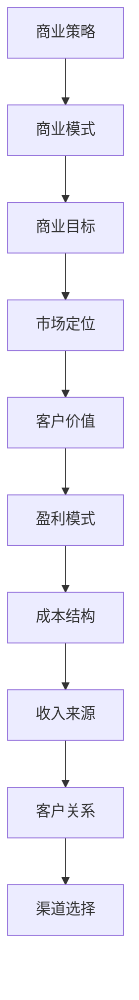

                 

### 引言

在当今快速发展的科技时代，程序员创业者正在成为创新和变革的重要力量。随着互联网、人工智能、区块链等新兴技术的崛起，程序员创业者不仅拥有技术优势，更具备创新思维和创业精神，这使得他们在商业模式的探索和优化中占据了独特的地位。程序员创业者的商业模式创新与优化不仅是个人成功的关键，也是推动整个行业发展的动力。

本文旨在深入探讨程序员创业者的商业模式创新与优化，分为三个主要部分。第一部分是引言，介绍程序员创业者在商业模式创新与优化中的重要性。第二部分详细讨论商业模式创新与优化的理论与实践，包括技术驱动的商业模式创新、市场驱动的商业模式创新、供应链驱动的商业模式创新，以及商业模式的优化实践与策略。第三部分则是通过具体案例，展示创业者如何进行商业模式创新与优化，并提供实用的建议和总结。

通过本文的阅读，读者将了解程序员创业者如何利用技术、市场和供应链等要素，打造具有竞争力的商业模式，实现创业梦想。无论您是已经踏上创业之路的程序员，还是有意投身创业的科技从业者，本文都将为您提供宝贵的指导和启示。

### 《程序员创业者的商业模式创新与优化》目录大纲

为了帮助读者更好地理解和应用商业模式创新与优化的理论，本文将分为以下几个主要部分，详细探讨相关主题：

## 第一部分：引言
### 第1章：程序员创业者的商业模式概述
- **1.1 商业模式的重要性**：介绍商业模式在创业中的核心作用，解释其与商业策略、商业目标等概念的关联。
- **1.2 商业模式的基本概念**：探讨商业模式的基本构成要素，包括价值主张、客户细分、渠道选择等，并提供伪代码解释这些概念。
- **1.3 商业模式在创业中的意义**：通过数学模型和公式，阐述商业模式在创业成功中的关键作用，并给出具体的例子说明。

## 第二部分：商业模式创新与优化
### 第2章：商业模式创新
- **2.1 创新模式的种类**：分类讨论基于技术、市场和供应链的商业模式创新，并详细分析各种创新模式的应用实践。
- **2.2 创新模式的应用实践**：通过具体案例，展示程序员创业者在实际运营中如何实现商业模式创新，包括技术驱动的商业模式创新、市场驱动的商业模式创新和供应链驱动的商业模式创新。

### 第3章：商业模式优化
- **3.1 优化商业模式的必要性**：讨论商业模式优化的背景和重要性，解释为何优化是创业过程中不可或缺的一部分。
- **3.2 优化商业模式的策略**：介绍成本控制、客户关系管理、价值链优化等优化策略，并提供相关案例分析。
- **3.3 优化商业模式的具体案例分析**：通过具体案例，展示如何通过优化实现商业模式的改进和提升。

## 第三部分：商业模式创新与优化实践
### 第4章：技术驱动的商业模式创新
- **4.1 技术驱动的商业模式概述**：介绍技术驱动的商业模式概念，分析其在创业中的应用前景。
- **4.2 技术驱动的商业模式案例解析**：通过具体案例，如区块链技术、人工智能技术和大数据分析技术，展示技术如何推动商业模式创新。

### 第5章：市场驱动的商业模式创新
- **5.1 市场驱动的商业模式概述**：介绍市场驱动的商业模式概念，探讨其在创业中的应用。
- **5.2 市场驱动的商业模式案例解析**：通过具体案例，如社交媒体营销、O2O商业模式和电商平台的商业模式，分析市场因素如何影响商业模式创新。

### 第6章：供应链驱动的商业模式创新
- **6.1 供应链驱动的商业模式概述**：介绍供应链驱动的商业模式概念，探讨其在创业中的应用。
- **6.2 供应链驱动的商业模式案例解析**：通过具体案例，如京东的供应链模式、亚马逊的供应链模式和智能制造供应链模式，展示供应链在商业模式创新中的作用。

### 第7章：商业模式优化的实践与策略
- **7.1 优化商业模式的实践方法**：介绍优化商业模式的实际方法，如技术、市场营销和供应链等方面的优化实践。
- **7.2 优化商业模式的案例分析**：通过具体案例，展示如何通过优化实现商业模式的改进和提升。

### 第8章：创业者的商业模式创新与优化路径
- **8.1 创业者如何进行商业模式创新**：讨论创业者如何发现和实现商业模式创新，提供具体的方法和步骤。
- **8.2 创业者如何进行商业模式优化**：介绍创业者如何持续优化商业模式，提高竞争力和市场占有率。
- **8.3 创业者的商业模式创新与优化成功案例分享**：通过成功案例分享，展示创业者如何通过商业模式创新与优化实现创业梦想。

## 附录
### 附录A：商业模式创新与优化工具与资源
- **A.1 商业模式创新工具介绍**：介绍常用的商业模式创新工具，如SWOT分析、价值链分析等。
- **A.2 商业模式优化工具介绍**：介绍用于商业模式优化的工具和方法，如精益创业、六西格玛等。
- **A.3 相关资源和参考文献**：提供商业模式创新与优化相关的资源和参考文献，供读者进一步学习。

### 附录B：实战案例代码与实现
- **B.1 案例一：基于区块链的供应链管理系统的实现**：详细讲解基于区块链技术的供应链管理系统的开发过程，包括环境搭建、源代码实现和案例分析。
- **B.2 案例二：基于人工智能的客户关系管理系统实现**：介绍如何使用人工智能技术构建客户关系管理系统，涵盖系统设计和代码实现。
- **B.3 案例三：基于大数据分析的营销策略系统实现**：展示如何利用大数据技术实现营销策略系统，并分析其实际应用效果。

通过本文的阅读，读者将系统掌握程序员创业者的商业模式创新与优化的理论和实践，为自身创业之路提供有力的指导和支持。

### 第1章：程序员创业者的商业模式概述

### 1.1 商业模式的重要性

在商业世界中，商业模式是企业实现盈利、创造价值和获取竞争优势的关键手段。对于程序员创业者来说，商业模式的重要性尤为突出。首先，商业模式定义了企业的核心价值和业务运营方式，帮助创业者明确企业的愿景和目标。一个有效的商业模式不仅能吸引投资者和合作伙伴，还能指导企业在竞争激烈的市场中找到立足点。

**核心概念与联系**：为了更好地理解商业模式的重要性，我们可以借助Mermaid流程图来展示其核心概念与联系。以下是商业模式的几个核心概念及其相互关系：



在这个流程图中，商业策略是商业模式的起点，决定了企业的方向和目标。商业模式则进一步细化为商业目标、市场定位、客户价值、盈利模式、成本结构、收入来源、客户关系和渠道选择，这些环节相互关联，共同构成了一个完整的商业逻辑体系。

### 1.2 商业模式的基本概念

商业模式的基本概念包括以下几个方面：

1. **价值主张（Value Proposition）**：这是企业为满足客户需求而提供的产品或服务的独特卖点。价值主张需要明确地传达给客户，使其感受到产品或服务的价值和优势。

2. **客户细分（Customer Segmentation）**：这是指企业根据客户的不同特征和需求，将市场划分为不同的客户群体。通过对客户细分，企业可以更有针对性地制定市场营销策略。

3. **渠道选择（Channel Selection）**：这是指企业选择将产品或服务传递给客户的途径。渠道选择需要考虑成本、效率和客户体验等因素。

4. **客户关系（Customer Relationships）**：这是企业与客户之间的互动关系，包括售前、售中和售后服务。良好的客户关系能够增强客户忠诚度，提高复购率。

5. **收入来源（Revenue Streams）**：这是企业通过销售产品或服务获得的收益。收入来源需要多样化，以保证企业的持续盈利能力。

6. **成本结构（Cost Structure）**：这是企业在运营过程中产生的各种成本，包括固定成本和可变成本。合理的成本结构有助于提高企业的利润率。

以上这些基本概念共同构成了商业模式的核心组成部分。为了更好地理解这些概念，我们可以使用伪代码进行详细解释：

```python
class BusinessModel:
    def __init__(self, value_proposition, customer_segment, channels, customer_relationships, revenue_models, cost_structure):
        self.value_proposition = value_proposition
        self.customer_segment = customer_segment
        self.channels = channels
        self.customer_relationships = customer_relationships
        self.revenue_models = revenue_models
        self.cost_structure = cost_structure

    def value_proposition(self):
        # 价值主张的实现细节
        pass

    def customer_segment(self):
        # 客户细分的实现细节
        pass

    def channels(self()):
        # 渠道选择的实现细节
        pass

    def customer_relationships(self()):
        # 客户关系的实现细节
        pass

    def revenue_models(self()):
        # 收入来源的实现细节
        pass

    def cost_structure(self()):
        # 成本结构的实现细节
        pass
```

在这个类中，我们定义了商业模式的各个组成部分，并提供了相应的实现细节。这样的结构有助于我们理解和分析商业模式的工作原理。

### 1.3 商业模式在创业中的意义

商业模式在创业中的意义不容忽视。首先，商业模式能够明确企业的核心价值，帮助创业者聚焦于最重要的业务领域，避免资源浪费。其次，商业模式为创业者提供了具体的操作指南，指导他们在产品开发、市场推广、客户关系管理等方面的具体行动。此外，商业模式还是投资者关注的重点，一个清晰、可行的商业模式能够吸引投资者的关注和资金支持。

为了更深入地理解商业模式在创业中的意义，我们可以借助数学模型和公式来阐述。以下是一个简单的数学模型，用于描述商业模式与企业绩效之间的关系：

$$
\text{绩效} = f(\text{商业模式}, \text{市场需求}, \text{竞争环境})
$$

在这个公式中，绩效是企业的最终目标，市场需求和竞争环境是外部因素，而商业模式则是内部决定因素。通过优化商业模式，企业可以在市场需求和竞争环境中取得更好的绩效。

**举例说明**：

假设一家科技公司开发了一款创新的社交媒体应用，其商业模式包括以下要素：

1. **价值主张**：提供简洁、高效的社交媒体体验，帮助用户更好地管理和分享生活。
2. **客户细分**：年轻用户群体，特别是大学生和白领。
3. **渠道选择**：通过应用商店和线上广告进行推广。
4. **客户关系**：通过用户反馈和定期更新，建立长期稳定的客户关系。
5. **收入来源**：通过广告和付费功能获得收益。
6. **成本结构**：主要成本包括研发、市场推广和运营成本。

通过这个案例，我们可以看到，一个有效的商业模式如何帮助这家科技公司明确其核心价值，定位目标市场，并通过各种策略实现盈利。具体而言，公司可以通过以下方式优化其商业模式：

1. **增加用户黏性**：通过提供更多的个性化功能和社交互动，提高用户留存率。
2. **降低成本**：通过优化技术研发和市场推广策略，减少运营成本。
3. **扩大收入来源**：探索新的收入模式，如虚拟礼物、会员服务等。

总之，商业模式在创业中的意义在于它为创业者提供了一个系统性的框架，帮助他们更好地理解和利用市场机会，实现企业的可持续发展。

### 第2章：商业模式创新

在创业的道路上，商业模式创新是保持竞争力的关键。商业模式创新不仅能够帮助企业找到新的增长点，还能在激烈的市场竞争中脱颖而出。程序员创业者因其技术背景和创新能力，在商业模式创新方面具有独特的优势。本章节将分类讨论基于技术、市场和供应链的商业模式创新，并分析各种创新模式的应用实践。

#### 2.1 创新模式的种类

商业模式创新可以分为多种类型，每种类型都有其特定的应用场景和实现方式。以下将介绍几种主要的创新模式：

1. **基于技术的商业模式创新**：利用新兴技术，如人工智能、区块链、大数据等，创造全新的商业模式。
2. **基于市场的商业模式创新**：通过市场洞察和用户需求分析，调整现有商业模式，实现更高效的市场覆盖和客户获取。
3. **基于供应链的商业模式创新**：优化供应链管理，提高生产效率，降低成本，从而提升整体业务竞争力。

#### 2.1.1 基于技术的商业模式创新

基于技术的商业模式创新主要依赖于技术创新带来的机会。例如，区块链技术的出现使得去中心化的交易和智能合约成为可能，为金融、供应链管理等领域带来了新的商业模式。以下是几个具体的应用案例：

1. **区块链金融**：通过区块链技术，实现去中心化的金融服务，如数字货币交易、跨境支付等。这种模式不仅提高了交易效率，还增强了安全性。
2. **人工智能驱动的个性化服务**：利用人工智能技术，分析用户行为数据，提供个性化的产品推荐和服务，从而提升用户满意度和忠诚度。
3. **大数据分析平台**：通过收集和分析海量数据，为企业提供市场洞察和决策支持，帮助企业优化运营策略和提升竞争力。

**应用实践**：

- **案例一：区块链金融**  
  以比特币为例，比特币作为一种去中心化的数字货币，通过区块链技术实现了点对点的交易，无需依赖传统的金融机构，降低了交易成本和提高了交易效率。

- **案例二：人工智能驱动的个性化服务**  
  例如，阿里巴巴的推荐系统，通过分析用户的购买历史和行为偏好，为用户提供个性化的商品推荐，从而提高购物体验和销售转化率。

- **案例三：大数据分析平台**  
  滴滴出行利用大数据分析用户出行数据，优化路线规划和调度，提高了出行效率和用户体验。

#### 2.1.2 基于市场的商业模式创新

基于市场的商业模式创新侧重于理解和满足用户需求。通过市场洞察和用户分析，企业可以发现新的市场机会，调整产品和服务策略，实现商业模式的优化。以下是一些具体的应用案例：

1. **O2O商业模式**：将线上和线下资源整合，提供无缝购物体验。例如，美团外卖通过线上平台连接餐厅和消费者，实现便捷的餐饮服务。
2. **订阅制服务**：通过提供持续订阅的服务，如Netflix的流媒体服务，企业能够实现稳定且可预测的收入流。
3. **共享经济模式**：通过共享闲置资源，如Airbnb的民宿服务和滴滴出行的共享出行，实现资源的高效利用和用户价值的最大化。

**应用实践**：

- **案例一：O2O商业模式**  
  以美团外卖为例，通过线上订餐和线下配送的结合，提供了方便快捷的餐饮服务，极大地提升了用户体验和市场份额。

- **案例二：订阅制服务**  
  Netflix通过提供多样化的流媒体内容，吸引大量用户订阅，实现了稳定且持续的收入增长。

- **案例三：共享经济模式**  
  Airbnb和滴滴出行通过共享经济模式，打破了传统的住宿和出行服务模式，提供了更多样化的选择和更好的用户体验。

#### 2.1.3 基于供应链的商业模式创新

基于供应链的商业模式创新主要关注如何通过优化供应链管理，提高生产效率和降低成本。以下是一些具体的应用案例：

1. **智能供应链管理**：利用物联网、大数据和人工智能技术，实现供应链的智能化管理，提高供应链的透明度和效率。
2. **供应链金融**：通过供应链金融，为企业提供融资服务，缓解企业资金压力，提高供应链的整体运作效率。
3. **协同制造**：通过协同制造模式，企业可以共享生产资源，实现生产效率的最大化和成本的最小化。

**应用实践**：

- **案例一：智能供应链管理**  
  京东利用智能供应链管理技术，实现了对商品库存、配送路径的精准控制，大大提高了物流效率。

- **案例二：供应链金融**  
  菜鸟网络通过供应链金融，为中小物流企业提供融资服务，帮助他们解决资金周转问题，提高了整体供应链的运作效率。

- **案例三：协同制造**  
  亚马逊通过协同制造模式，与供应商紧密合作，实现了快速响应市场需求和生产调整，提高了生产效率和库存周转率。

#### 2.2 创新模式的应用实践

在商业模式创新的实践中，程序员创业者需要结合自身的技术背景和市场洞察，探索适合的创新模式。以下是一些实际应用的场景和步骤：

1. **市场需求分析**：通过市场调研和用户反馈，了解市场需求和用户痛点，为商业模式创新提供依据。
2. **技术可行性评估**：评估所采用技术的成熟度和实现难度，确保技术方案的可行性。
3. **商业模式设计**：基于市场需求和技术评估，设计创新的商业模式，包括价值主张、客户细分、收入来源等。
4. **试点实施**：在有限范围内进行试点，验证商业模式的可行性和市场接受度。
5. **持续优化**：根据试点结果，对商业模式进行优化和调整，确保其持续有效。

**实际应用案例**：

- **案例一：基于区块链的数字版权管理平台**  
  一家初创公司利用区块链技术，创建了一个数字版权管理平台，为艺术家和创作者提供确权和交易服务。通过区块链技术，确保作品的版权归属和交易记录不可篡改，提高了版权保护的效率和透明度。

- **案例二：基于人工智能的智能家居控制系统**  
  一家智能家居公司开发了一款基于人工智能的控制系统，通过语音识别和智能算法，为用户提供个性化的家居控制体验。该系统集成了各种智能家居设备，如智能灯光、智能安防和智能空调，实现了智能家居的便捷管理和个性化控制。

- **案例三：基于共享经济的出行平台**  
  一家出行平台公司采用共享经济模式，通过手机应用连接司机和乘客，提供出租车和网约车服务。通过大数据分析和人工智能算法，平台实现了最优路线规划和高效调度，提高了出行效率和用户体验。

通过以上案例分析，我们可以看到，程序员创业者在商业模式创新中，如何结合技术优势和市场洞察，实现商业模式的成功创新。这些案例不仅展示了创新的商业模式如何解决实际问题，也为其他创业者提供了宝贵的经验和启示。

### 第3章：商业模式优化

在商业环境中，市场竞争不断加剧，客户需求快速变化，创业者的商业模式需要不断进行调整和优化，以确保企业能够持续发展和保持竞争优势。商业模式优化是指通过改进和调整商业模式中的各个要素，如成本结构、客户关系、价值链等，以实现更高的效率和盈利能力。本章节将讨论商业模式优化的必要性、策略和方法，并通过具体案例分析，展示如何通过优化实现商业模式的改进和提升。

#### 3.1 优化商业模式的必要性

商业模式优化的必要性体现在以下几个方面：

1. **适应市场变化**：市场环境不断变化，新的竞争对手和市场需求不断涌现。创业者需要通过商业模式优化，及时调整战略，以适应市场变化，抓住新的商业机会。
2. **提升竞争力**：优化商业模式可以帮助企业提高效率和降低成本，从而在竞争激烈的市场中获得更大的竞争优势。
3. **提高盈利能力**：通过优化商业模式，企业可以找到新的收入来源，提高盈利能力，确保企业的可持续发展。
4. **增强灵活性**：优化后的商业模式更加灵活，能够快速响应市场变化，调整业务策略，以应对不确定的市场环境。

**数学模型和数学公式**：

为了量化商业模式优化的效果，我们可以借助以下数学模型和公式：

$$
\text{优化效果} = \frac{\text{新商业模式绩效}}{\text{原商业模式绩效}} - 1
$$

其中，新商业模式绩效是经过优化后企业的绩效，原商业模式绩效是未优化前的绩效。通过这个公式，我们可以评估商业模式优化的效果。

#### 3.2 优化商业模式的策略

商业模式优化需要从多个方面入手，以下是一些常见的优化策略：

1. **成本控制**：通过降低成本，提高企业的盈利能力。例如，通过供应链优化、技术创新和规模效应等手段，降低生产成本和运营成本。
2. **客户关系管理**：通过改进客户关系管理，提高客户满意度和忠诚度。例如，通过提供个性化服务、加强售后服务和建立客户社区等方式，增强客户黏性。
3. **价值链优化**：通过优化价值链中的各个环节，提高整体业务效率和客户价值。例如，通过流程再造、供应链整合和产品创新等方式，提升企业的核心竞争力。

**具体策略**：

1. **成本控制**：
   - **供应链优化**：通过整合供应链资源，实现采购、生产和物流的协同，降低库存成本和物流成本。
   - **技术创新**：通过引入新技术，提高生产效率和降低运营成本。例如，采用自动化设备和智能制造技术，减少人工成本和浪费。
   - **规模效应**：通过扩大生产规模，实现规模经济，降低单位成本。

2. **客户关系管理**：
   - **个性化服务**：通过分析客户数据，提供个性化的产品推荐和服务，提高客户满意度和忠诚度。
   - **售后服务**：建立完善的售后服务体系，及时解决客户问题，增强客户信任和满意度。
   - **客户社区**：建立客户社区，促进客户之间的互动和交流，增强客户归属感和忠诚度。

3. **价值链优化**：
   - **流程再造**：通过重新设计业务流程，消除不必要的环节和流程，提高业务效率和响应速度。
   - **供应链整合**：通过整合供应链各环节，实现信息共享和资源优化配置，提高供应链的整体效率。
   - **产品创新**：通过不断推出新产品和服务，满足客户的新需求，提升企业的市场竞争力和客户价值。

#### 3.3 优化商业模式的具体案例分析

以下通过几个具体案例，展示如何通过优化实现商业模式的改进和提升：

**案例一：亚马逊的供应链优化**

亚马逊通过不断优化其供应链管理，实现了高效的物流和库存控制。具体策略包括：

- **分布式仓储**：通过在多个地点建立仓储中心，实现商品就近配送，减少物流成本和运输时间。
- **自动化设备**：引入自动化设备和机器人，提高仓库作业效率，降低人力成本。
- **数据驱动的库存管理**：通过大数据分析，预测市场需求，优化库存配置，减少库存成本。

通过这些优化策略，亚马逊大幅提升了物流效率和客户满意度，巩固了其在电商市场的领先地位。

**案例二：苹果的个性化服务**

苹果通过提供个性化的产品和服务，建立了强大的客户忠诚度。具体策略包括：

- **个性化推荐**：通过分析用户数据，为用户提供个性化的产品推荐，提高购物体验和转化率。
- **定制化服务**：提供定制化产品和服务，满足客户的独特需求，增强客户黏性。
- **售后服务**：建立全球售后服务网络，提供快速、高效的售后服务，提升客户满意度。

通过这些策略，苹果不仅提升了客户体验和忠诚度，还实现了持续的市场增长和盈利能力。

**案例三：丰田的精益生产**

丰田通过精益生产模式，实现了生产效率和成本控制。具体策略包括：

- **流程再造**：通过重新设计生产流程，消除浪费，提高生产效率。
- **自动化生产**：引入自动化设备和生产线，减少人工操作，提高生产质量和效率。
- **持续改进**：通过持续改进和员工参与，不断提升生产效率和产品质量。

通过这些策略，丰田在全球汽车市场取得了巨大的成功，成为精益生产的典范。

通过以上案例分析，我们可以看到，不同企业在商业模式优化方面采取了不同的策略，但核心目标都是为了提高效率和盈利能力。这些优化策略不仅为企业带来了实际效益，也为其他企业提供了宝贵的经验和启示。

#### 3.4 商业模式优化的注意事项

在商业模式优化过程中，创业者需要注意以下几点：

1. **数据驱动**：优化决策应基于准确的数据分析，避免盲目行动。通过大数据分析，创业者可以更准确地了解市场趋势和客户需求，从而制定更有效的优化策略。
2. **持续迭代**：商业模式优化是一个持续迭代的过程，创业者需要不断评估和调整优化策略，以适应市场变化和客户需求。
3. **团队合作**：优化商业模式需要跨部门合作，创业者应建立一个高效的团队，确保各环节的协调和协同。
4. **风险控制**：在优化过程中，创业者需要评估潜在风险，并制定相应的风险控制措施，以确保优化策略的实施顺利。

通过以上注意事项，创业者可以更好地进行商业模式优化，实现企业的可持续发展。

### 第4章：技术驱动的商业模式创新

随着科技的飞速发展，新技术不断涌现，为商业模式创新提供了丰富的机会。技术驱动的商业模式创新已成为许多企业实现突破性增长的关键。本章节将探讨技术驱动的商业模式概述，并详细解析区块链技术、人工智能技术和大数据分析技术在商业模式创新中的应用。

#### 4.1 技术驱动的商业模式概述

技术驱动的商业模式创新是指通过技术创新来重塑企业价值主张、优化业务流程、提高效率，从而在市场中获得竞争优势。技术驱动商业模式创新的几个核心特点包括：

1. **创新性**：利用前沿技术，如人工智能、区块链、物联网等，创造新的业务模式和商业模式。
2. **适应性**：技术驱动商业模式能够快速适应市场需求和客户需求的变化，具有高度的灵活性。
3. **效率提升**：通过技术手段，如自动化、数据分析和优化算法，提高业务运营效率和生产力。
4. **透明性和安全性**：新技术如区块链提供了更高的透明性和安全性，有助于建立客户信任和降低交易风险。

#### 4.2 技术驱动的商业模式案例解析

以下将详细解析区块链技术、人工智能技术和大数据分析技术在商业模式创新中的应用：

**4.2.1 区块链技术**

区块链技术通过去中心化、不可篡改和透明化的特点，重塑了多个行业的商业模式。以下是一些区块链技术在商业模式创新中的具体应用：

1. **金融领域**：区块链技术为金融交易提供了安全、快速和透明的解决方案。比特币和以太坊等加密货币就是区块链在金融领域的成功应用。这些数字货币通过区块链技术实现了去中心化的支付网络，减少了交易中间环节，降低了交易成本。
2. **供应链管理**：区块链技术可以帮助企业实现供应链的透明化和可追溯性。例如，沃尔玛利用区块链技术追踪食品供应链，确保食品安全和产品质量。通过区块链，企业可以实时监控产品的来源和流通过程，提高了供应链管理的效率和透明度。
3. **身份验证与数据安全**：区块链技术可用于创建安全的身份验证系统，确保个人数据的隐私和安全。例如，谷歌和微软等科技公司正在研究如何使用区块链技术保护用户数据和隐私。

**案例：比特币**

比特币作为一种去中心化的数字货币，通过区块链技术实现了点对点的交易。比特币的交易过程无需依赖传统金融机构，降低了交易成本，提高了交易效率。以下是比特币的商业模式：

- **价值主张**：提供安全、快速和低成本的数字货币交易。
- **客户细分**：全球范围内的个体用户和商家。
- **收入来源**：交易手续费和矿工奖励。
- **成本结构**：区块链网络的维护成本和挖矿成本。

**4.2.2 人工智能技术**

人工智能技术通过模拟人类智能，实现了自动化和智能化，从而在多个领域推动了商业模式的创新。以下是一些人工智能技术在商业模式创新中的应用：

1. **个性化服务**：通过大数据分析和机器学习算法，企业可以为用户提供个性化的产品推荐和服务。例如，亚马逊的推荐系统通过分析用户的历史行为和偏好，提供个性化的购物建议，提高了用户体验和销售额。
2. **自动化生产**：人工智能技术在制造领域得到了广泛应用，如机器人自动化生产线和智能工厂。通过人工智能技术，企业可以实现生产过程的自动化和智能化，提高了生产效率和产品质量。
3. **智能客服**：人工智能聊天机器人（如ChatGPT）可以为企业提供24/7的智能客服服务，通过自然语言处理技术，解决客户问题和提供支持，提高了客户满意度和运营效率。

**案例：亚马逊的个性化服务**

亚马逊通过人工智能技术，为用户提供个性化的购物体验。具体商业模式如下：

- **价值主张**：提供个性化的产品推荐和服务，提高用户体验和购物满意度。
- **客户细分**：全球范围内的消费者。
- **收入来源**：商品销售和广告收入。
- **成本结构**：大数据分析技术和机器学习算法的维护成本。

**4.2.3 大数据分析技术**

大数据分析技术通过处理和分析海量数据，为企业提供了深度的市场洞察和决策支持。以下是一些大数据分析技术在商业模式创新中的应用：

1. **市场预测**：通过分析历史数据和趋势，企业可以预测市场需求和消费行为，从而优化产品和服务策略。例如，零售企业通过大数据分析，预测消费者的购物需求，调整库存和促销策略。
2. **客户行为分析**：大数据分析可以帮助企业深入了解客户行为，发现潜在需求和改进点。例如，通过分析用户在网站上的行为，企业可以优化用户体验，提高转化率和用户留存率。
3. **风险控制**：大数据分析技术在金融领域得到了广泛应用，通过分析海量交易数据，企业可以及时发现异常交易和潜在风险，提高风险控制能力。

**案例：阿里巴巴的市场预测**

阿里巴巴利用大数据分析技术，预测市场需求和消费行为，优化产品和服务策略。具体商业模式如下：

- **价值主张**：提供准确的市场预测和消费洞察，帮助企业优化产品和服务。
- **客户细分**：全球范围内的企业和商家。
- **收入来源**：数据分析和咨询服务收入。
- **成本结构**：大数据处理和分析技术的维护成本。

通过以上案例分析，我们可以看到，区块链技术、人工智能技术和大数据分析技术如何在不同领域推动商业模式的创新。这些技术不仅为企业提供了新的增长点，还提高了业务效率和客户满意度。随着技术的不断进步，未来将有更多的商业模式将受益于这些先进技术，为创业者和企业带来无限可能。

### 第5章：市场驱动的商业模式创新

市场驱动的商业模式创新是企业在不断变化的市场环境中，通过深入了解市场需求和用户行为，进行商业模式调整和优化的过程。这种创新模式强调以市场为导向，通过满足用户需求和创造价值来获取竞争优势。本章节将探讨市场驱动的商业模式概述，并详细解析社交媒体营销、O2O商业模式和电商平台的商业模式创新。

#### 5.1 市场驱动的商业模式概述

市场驱动的商业模式创新主要基于以下几大原则：

1. **用户需求导向**：以用户需求为中心，通过市场调研和用户反馈，深入了解用户需求和偏好，从而设计出满足用户期望的产品和服务。
2. **市场洞察力**：企业需要具备敏锐的市场洞察力，及时捕捉市场趋势和变化，快速调整商业模式以适应市场动态。
3. **灵活性和敏捷性**：市场驱动的商业模式要求企业具备快速响应市场变化的能力，通过敏捷开发和迭代，实现商业模式的持续优化和升级。
4. **多元化收入来源**：通过多元化收入来源，降低企业对单一市场或收入模式的依赖，提高抗风险能力和盈利稳定性。

#### 5.2 市场驱动的商业模式案例解析

以下将详细解析社交媒体营销、O2O商业模式和电商平台的商业模式创新：

**5.2.1 社交媒体营销**

社交媒体营销是市场驱动的商业模式创新的重要手段之一，通过社交媒体平台与用户互动，实现品牌传播和用户转化。以下是一个典型的社交媒体营销商业模式解析：

- **价值主张**：利用社交媒体平台，与用户建立互动关系，提高品牌知名度和用户参与度。
- **客户细分**：目标用户群体包括社交媒体活跃用户，如年轻人和都市白领。
- **渠道选择**：通过微博、微信、抖音等主流社交媒体平台，进行内容营销和用户互动。
- **客户关系**：通过定期发布高质量内容，与用户建立长期互动关系，提高用户黏性。
- **收入来源**：通过广告收入、品牌合作和用户付费内容等方式获得收益。
- **成本结构**：主要包括内容创作、平台推广和用户运营成本。

**案例：杜蕾斯的社交媒体营销**

杜蕾斯通过微博、微信等社交媒体平台，进行创意营销和品牌推广，取得了显著的成功。其商业模式特点如下：

- **内容创意**：杜蕾斯的内容创意独特，结合热点事件和用户需求，制作有趣、富有创意的图片和短视频，吸引了大量关注和转发。
- **用户互动**：通过互动评论和用户反馈，与粉丝建立紧密联系，提高用户参与度和品牌认知度。
- **广告合作**：与各大品牌进行广告合作，扩大品牌影响力，并通过社交媒体渠道推广产品。

**5.2.2 O2O商业模式**

O2O（Online to Offline）商业模式通过将线上和线下资源整合，提供无缝购物体验，实现了线上流量向线下门店的转化。以下是一个典型的O2O商业模式解析：

- **价值主张**：提供线上预订和线下体验的服务，满足用户随时随地购物的需求。
- **客户细分**：目标用户群体包括追求便捷购物体验的消费者。
- **渠道选择**：通过线上平台（如官网、手机应用）和线下门店，实现线上线下的互通和融合。
- **客户关系**：通过线上线下互动，提高用户满意度和忠诚度。
- **收入来源**：通过商品销售、服务收费和广告收入等多种方式获得收益。
- **成本结构**：主要包括线上平台的运营成本、线下门店的租金和人力成本。

**案例：美团外卖的O2O商业模式**

美团外卖通过O2O模式，连接线上订单和线下餐饮服务，实现了快速扩张和盈利。其商业模式特点如下：

- **线上预订**：用户通过美团外卖平台进行在线点餐，选择餐厅和菜品，下单支付。
- **线下配送**：美团外卖提供快速的配送服务，确保用户能在短时间内收到订单。
- **线上线下融合**：通过线上流量导入线下门店，提高门店的人流量和销售额。

**5.2.3 电商平台的商业模式

电商平台通过在线平台，为消费者和商家提供交易和服务的平台，实现商品和服务的线上交易。以下是一个典型的电商平台商业模式解析：

- **价值主张**：为消费者提供便捷的购物渠道，为商家提供销售平台和流量。
- **客户细分**：目标用户群体包括在线购物的消费者和线上经营的商家。
- **渠道选择**：通过自建电商平台或第三方平台，如淘宝、京东等，进行商品展示和交易。
- **客户关系**：通过用户反馈和评价系统，建立良好的客户关系，提高用户满意度和复购率。
- **收入来源**：通过商品交易佣金、广告收入和增值服务等方式获得收益。
- **成本结构**：主要包括平台运营成本、物流配送成本和客户服务成本。

**案例：淘宝的电商平台商业模式**

淘宝作为中国最大的电商平台之一，通过创新的商业模式和平台运营策略，实现了持续增长和盈利。其商业模式特点如下：

- **商品展示**：淘宝为商家提供免费商品展示平台，吸引消费者浏览和购买。
- **交易服务**：淘宝提供安全可靠的交易服务，确保买卖双方的利益。
- **用户反馈**：淘宝建立完善的用户反馈和评价系统，提高用户满意度和平台公信力。

通过以上案例分析，我们可以看到，市场驱动的商业模式创新如何通过满足用户需求和创造价值，实现商业模式的成功和持续发展。社交媒体营销、O2O商业模式和电商平台都展示了如何通过市场洞察和用户互动，打造出具有竞争力的商业模式。随着市场的不断变化，创业者需要持续关注用户需求和市场动态，不断优化和调整商业模式，以保持竞争优势。

### 第6章：供应链驱动的商业模式创新

供应链驱动的商业模式创新关注于如何通过优化供应链管理，提高生产效率和降低成本，从而实现商业模式的创新和提升。在全球化竞争日益激烈的今天，供应链的优化不仅是提高企业竞争力的关键，也是企业实现可持续发展的核心策略。本章节将探讨供应链驱动的商业模式概述，并详细解析京东的供应链模式、亚马逊的供应链模式以及智能制造供应链模式。

#### 6.1 供应链驱动的商业模式概述

供应链驱动的商业模式创新主要通过以下几种方式实现：

1. **供应链整合**：通过整合供应链中的各个环节，实现信息共享和资源优化配置，提高供应链的整体效率和透明度。
2. **精益管理**：通过精益生产管理和供应链优化，减少浪费，提高生产效率和产品质量。
3. **物流网络优化**：通过优化物流网络和运输路径，降低物流成本，提高配送效率。
4. **供应链金融**：通过供应链金融服务，为企业提供融资支持，缓解企业资金压力，提高供应链的流动性。
5. **协同制造**：通过协同制造模式，企业可以共享生产资源和信息，实现生产效率的最大化和成本的最小化。

供应链驱动的商业模式创新不仅关注于内部效率提升，还强调与外部合作伙伴的紧密协作，通过优化供应链管理，实现整个价值链的协同和优化。

#### 6.2 供应链驱动的商业模式案例解析

以下将详细解析京东的供应链模式、亚马逊的供应链模式以及智能制造供应链模式：

**6.2.1 京东的供应链模式**

京东作为中国领先的电商平台，其供应链模式在行业内具有代表性。京东的供应链模式主要包括以下几个方面：

1. **自营物流**：京东通过自建物流体系，实现了对商品流通过程的全面掌控。京东的物流网络覆盖全国，提高了配送效率，确保了商品能够快速送达消费者。
2. **数据驱动**：京东利用大数据分析技术，优化供应链管理，通过数据分析预测市场需求，调整库存和采购策略，提高供应链的响应速度和准确性。
3. **协同制造**：京东与供应商建立了紧密的合作关系，通过协同制造模式，实现了生产和物流的同步，提高了生产效率和库存周转率。

**案例：京东的供应链模式**

京东的供应链模式特点如下：

- **自营物流**：京东通过自建物流，实现了对配送过程的全面控制，提高了配送效率和服务质量。
- **数据驱动**：通过大数据分析，京东能够准确预测市场需求，优化库存管理，减少了库存成本和缺货风险。
- **协同制造**：京东与供应商协同生产，实现了供应链的高效运作，提高了生产效率和库存周转率。

**6.2.2 亚马逊的供应链模式**

亚马逊是全球最大的电商平台之一，其供应链模式在电商行业中具有引领地位。亚马逊的供应链模式主要包括以下几个方面：

1. **全球采购**：亚马逊通过全球采购，获取来自世界各地的优质商品，提高了商品多样性和价格竞争力。
2. **第三方卖家**：亚马逊平台吸引了大量的第三方卖家，通过这些卖家，亚马逊丰富了商品种类，提高了市场覆盖面。
3. **智能物流**：亚马逊通过智能物流系统，实现了对物流过程的自动化和智能化管理，提高了配送效率和客户满意度。

**案例：亚马逊的供应链模式**

亚马逊的供应链模式特点如下：

- **全球采购**：亚马逊通过全球采购，扩大了商品来源，提高了商品多样性和价格竞争力。
- **第三方卖家**：通过引入第三方卖家，亚马逊丰富了商品种类，提高了市场覆盖面和用户选择。
- **智能物流**：亚马逊的智能物流系统，通过自动化和智能化技术，提高了配送效率和客户满意度。

**6.2.3 智能制造供应链模式**

智能制造供应链模式是利用物联网、大数据和人工智能等技术，实现供应链的智能化和自动化。智能制造供应链模式的主要特点包括：

1. **自动化生产**：通过引入自动化设备和智能生产线，实现生产过程的自动化和智能化，提高了生产效率和产品质量。
2. **数据驱动**：通过大数据分析技术，实时监控生产过程和供应链状态，优化生产计划和供应链管理。
3. **供应链协同**：通过物联网技术，实现供应链各环节的信息共享和协同，提高了供应链的透明度和效率。

**案例：智能制造供应链模式**

智能制造供应链模式的特点如下：

- **自动化生产**：通过自动化设备和智能生产线，实现生产过程的自动化和高效化。
- **数据驱动**：通过大数据分析技术，实时监控生产状态和供应链流程，优化生产和供应链管理。
- **供应链协同**：通过物联网技术，实现供应链各环节的信息共享和协同，提高了供应链的整体效率和透明度。

通过以上案例分析，我们可以看到，供应链驱动的商业模式创新在提高企业竞争力、优化供应链管理和实现商业模式的持续创新方面具有重要意义。京东、亚马逊和智能制造供应链模式都展示了如何通过优化供应链管理，实现商业模式的成功和创新。随着技术的不断进步和市场竞争的加剧，供应链驱动的商业模式创新将继续为企业提供新的发展机遇和挑战。

### 第7章：商业模式优化的实践与策略

商业模式优化不仅是提高企业竞争力的关键手段，也是实现持续发展的必经之路。优化商业模式需要从多个方面入手，包括技术创新、市场营销和供应链管理。本章节将介绍具体的优化方法，并通过案例分析，展示如何通过优化实现商业模式的改进和提升。

#### 7.1 优化商业模式的实践方法

商业模式的优化需要系统的实践方法，以下是一些常见的优化方法：

1. **成本控制**：通过优化成本结构和降低运营成本，提高企业的盈利能力。具体方法包括流程优化、采购优化和技术创新等。
2. **客户关系管理**：通过改善客户关系，提高客户满意度和忠诚度。具体方法包括提供个性化服务、加强售后服务和客户互动等。
3. **价值链优化**：通过优化价值链中的各个环节，提高整体业务效率和客户价值。具体方法包括流程再造、供应链整合和产品创新等。

**7.2 优化商业模式的案例分析**

以下通过几个具体案例，展示如何通过优化实现商业模式的改进和提升：

**7.2.1 技术创新驱动下的优化案例**

技术创新是商业模式优化的关键驱动力。以下是一个基于技术创新的优化案例：

**案例：亚马逊的云计算服务**

亚马逊通过其云计算服务AWS，实现了商业模式的重大优化。具体优化措施如下：

- **技术创新**：亚马逊利用云计算技术，提供弹性计算、存储和数据管理服务，帮助企业降低IT成本和提升运营效率。
- **市场拓展**：亚马逊通过全球布局，扩大了云计算服务的市场覆盖面，吸引了大量企业和开发者。
- **客户关系**：亚马逊通过提供定制化服务和优质客户支持，建立了强大的客户基础和忠诚度。

通过技术创新，亚马逊不仅优化了自己的商业模式，还开拓了新的市场空间，实现了持续增长和盈利。

**7.2.2 市场营销优化案例**

市场营销优化是提升品牌影响力和市场份额的重要手段。以下是一个基于市场营销优化的案例：

**案例：可口可乐的市场营销策略**

可口可乐通过一系列市场营销优化措施，提升了品牌影响力和市场竞争力。具体优化措施如下：

- **品牌定位**：可口可乐明确了其“快乐生活”的品牌形象，通过情感营销与消费者建立深厚情感联系。
- **数字化营销**：可口可乐利用社交媒体和数字广告，实现了精准营销和用户互动，提高了品牌曝光度和用户参与度。
- **创新产品**：可口可乐推出了多种口味和创新产品，满足了消费者的多样化需求，提升了市场份额。

通过市场营销优化，可口可乐不仅巩固了品牌地位，还实现了市场份额的持续增长。

**7.2.3 供应链优化案例**

供应链优化是提高企业运营效率和降低成本的关键。以下是一个基于供应链优化的案例：

**案例：华为的供应链管理**

华为通过一系列供应链优化措施，提升了供应链效率和竞争力。具体优化措施如下：

- **全球化供应链**：华为建立了全球化的供应链网络，通过优化采购、生产和物流，实现了供应链的全球布局和高效运作。
- **供应链协同**：华为与供应商建立了紧密的协同关系，通过信息共享和联合规划，提高了供应链的协同效率和响应速度。
- **数字化管理**：华为利用大数据和人工智能技术，实现了供应链的数字化管理，提高了供应链的可视化和决策支持能力。

通过供应链优化，华为不仅提高了供应链效率和产品质量，还降低了运营成本，增强了市场竞争力。

通过以上案例分析，我们可以看到，技术创新、市场营销和供应链优化都是实现商业模式优化的有效途径。不同的企业可以根据自身情况，选择合适的优化方法，实现商业模式的持续改进和提升。

#### 7.3 优化商业模式的注意事项

在商业模式优化过程中，企业需要注意以下几点：

1. **数据驱动**：优化决策应基于准确的数据分析，避免盲目行动。通过大数据分析，企业可以更准确地了解市场趋势和客户需求，从而制定更有效的优化策略。
2. **持续迭代**：商业模式优化是一个持续迭代的过程，企业需要不断评估和调整优化策略，以适应市场变化和客户需求。
3. **团队合作**：优化商业模式需要跨部门合作，企业应建立一个高效的团队，确保各环节的协调和协同。
4. **风险控制**：在优化过程中，企业需要评估潜在风险，并制定相应的风险控制措施，以确保优化策略的实施顺利。

通过以上注意事项，企业可以更好地进行商业模式优化，实现企业的可持续发展。

### 第8章：创业者的商业模式创新与优化路径

在创业的道路上，成功的商业模式创新与优化是创业者实现梦想和可持续发展的关键。为了帮助创业者更好地进行商业模式创新与优化，本章节将详细讨论如何进行商业模式创新和优化，并提供成功案例分享，以期为创业者提供实用的指导。

#### 8.1 创业者如何进行商业模式创新

商业模式创新是创业过程中至关重要的一环。以下是一些关键步骤和策略：

1. **市场需求分析**：深入了解市场需求和用户痛点，找到潜在的商业机会。创业者可以通过市场调研、用户访谈和竞品分析等方式，获取有价值的市场数据。

2. **技术创新**：利用前沿技术，如人工智能、区块链和大数据等，创造新的业务模式和商业模式。创业者应关注技术创新，寻找将技术应用于商业场景的机会。

3. **市场定位**：明确目标市场和客户群体，制定清晰的价值主张和市场定位。创业者应确保其商业模式能够满足特定市场的需求，并具备竞争优势。

4. **实验和验证**：在有限的范围内进行试点，验证商业模式的可行性和市场接受度。通过快速迭代和反馈，创业者可以不断优化和调整商业模式。

5. **多元化收入来源**：探索多种收入来源，降低企业对单一收入模式的依赖。通过多元化收入，创业者可以增强企业的抗风险能力和盈利稳定性。

**案例分享**：

- **案例一：Airbnb**  
  Airbnb通过共享经济模式，利用闲置房源为旅行者提供住宿服务。通过技术创新和市场需求分析，Airbnb找到了共享住宿市场的机会，实现了商业模式的成功创新。

- **案例二：Lyft**  
  Lyft利用移动互联网和大数据技术，提供了便捷的出租车服务。通过技术创新和用户需求分析，Lyft在竞争激烈的出行市场中脱颖而出。

#### 8.2 创业者如何进行商业模式优化

商业模式优化是确保企业持续发展和市场竞争力的重要手段。以下是一些关键步骤和策略：

1. **成本控制**：通过优化成本结构和降低运营成本，提高企业的盈利能力。创业者可以通过流程优化、采购优化和技术创新等方式，实现成本控制。

2. **客户关系管理**：通过改善客户关系，提高客户满意度和忠诚度。创业者可以通过提供个性化服务、加强售后服务和建立客户社区等方式，增强客户黏性。

3. **价值链优化**：通过优化价值链中的各个环节，提高整体业务效率和客户价值。创业者可以通过流程再造、供应链整合和产品创新等方式，提升企业的核心竞争力。

4. **数据分析**：利用大数据分析技术，实时监控和优化商业模式的关键指标。通过数据驱动的决策，创业者可以更准确地了解市场动态和用户需求，从而进行有效的商业模式优化。

**案例分享**：

- **案例一：亚马逊**  
  亚马逊通过优化供应链和客户关系管理，实现了商业模式的持续优化。通过数据分析，亚马逊优化了库存管理和配送效率，提高了客户满意度和市场竞争力。

- **案例二：Netflix**  
  Netflix通过不断优化其订阅模式和内容推荐算法，实现了商业模式的有效优化。通过客户行为分析和数据挖掘，Netflix提高了用户留存率和订阅转化率。

#### 8.3 创业者的商业模式创新与优化成功案例分享

以下是几个成功的创业案例，展示了创业者如何通过商业模式创新与优化实现成功：

- **案例一：滴滴出行**  
  滴滴出行通过技术创新和市场定位，成功打造了一个便捷的移动出行平台。通过不断优化用户界面和推荐算法，滴滴出行提高了用户体验和市场份额。

- **案例二：谷歌**  
  谷歌通过持续的技术创新和商业模式优化，从一家搜索引擎公司发展成为全球科技巨头。通过广告收入和云计算服务，谷歌实现了多元化收入，增强了企业的抗风险能力。

- **案例三：Airbnb**  
  Airbnb通过共享经济模式，利用闲置房源为旅行者提供住宿服务。通过不断的优化和扩展，Airbnb在短短几年内实现了全球扩张和市场领导地位。

通过以上成功案例，我们可以看到，创业者通过商业模式创新与优化，不仅实现了企业的快速发展，还在激烈的市场竞争中脱颖而出。这些案例为其他创业者提供了宝贵的经验和启示，鼓励他们在商业模式创新与优化方面不断探索和尝试。

### 附录A：商业模式创新与优化工具与资源

在商业模式创新与优化的过程中，创业者需要借助一系列工具和资源来提升效率和质量。以下是一些常用的工具和资源，供创业者参考：

#### A.1 商业模式创新工具介绍

1. **商业画布（Business Model Canvas）**：
   商业画布是一种可视化工具，用于描述企业的商业模式。它包含九个关键要素：价值主张、客户细分、渠道选择、客户关系、收入来源、关键资源、关键活动、关键合作伙伴和成本结构。通过填写商业画布，创业者可以系统地分析和优化其商业模式。

2. **SWOT分析（SWOT Analysis）**：
   SWOT分析是一种战略规划工具，用于评估企业的优势（Strengths）、劣势（Weaknesses）、机会（Opportunities）和威胁（Threats）。通过SWOT分析，创业者可以明确企业的竞争态势，找到创新的商业机会和潜在的优化方向。

3. **精益创业（Lean Startup）**：
   精益创业是一种以用户需求为导向的创业方法，强调快速迭代和持续优化。创业者可以通过精益创业方法，通过最小可行产品（MVP）和用户反馈，快速验证商业模式的可行性和市场需求，进而进行调整和改进。

#### A.2 商业模式优化工具介绍

1. **数据分析和数据挖掘工具**：
   - **Tableau**：数据可视化工具，用于分析和展示复杂数据。
   - **Google Analytics**：用于网站和移动应用的访问分析，帮助创业者了解用户行为和需求。
   - **R和Python**：用于数据分析和数据挖掘的高级编程语言，能够处理大量数据并生成洞察。

2. **业务流程管理工具**：
   - **BPMN（Business Process Model and Notation）**：用于业务流程建模和优化的标准符号体系。
   - **JIRA**：项目管理工具，用于跟踪和管理项目任务和进度，确保业务流程的高效运行。

3. **协同办公工具**：
   - **Slack**：团队沟通工具，用于提高团队协作效率。
   - **Trello**：任务管理工具，用于团队任务分配和进度跟踪。

#### A.3 相关资源和参考文献

1. **书籍**：
   - 《商业模式新生代》（作者：亚历山大·奥斯特瓦尔德、伊芙·皮尼欧、伊利亚·斯托姆）：
     这本书详细介绍了商业模式创新的原理和实践，是商业模式领域的经典著作。
   - 《精益创业》（作者：埃里克·莱斯）：
     这本书提出了精益创业方法，通过最小可行产品和用户反馈，帮助创业者快速验证和优化商业模式。

2. **在线课程和讲座**：
   - **Coursera**、**edX**和**Udemy**等在线教育平台提供了丰富的商业模式和创新课程，适合创业者学习和提升相关技能。

3. **专业组织和社区**：
   - **创业协会**：如美国创业协会（TED）、中国创业协会等，这些组织提供了丰富的创业资源和交流平台。
   - **创业孵化器和加速器**：如Y Combinator、TechStars、创业家等，这些机构为创业者提供资金、导师和资源支持。

通过利用上述工具和资源，创业者可以更系统地开展商业模式创新和优化工作，提高企业的竞争力和成功率。

### 附录B：实战案例代码与实现

#### B.1 案例一：基于区块链的供应链管理系统的实现

**开发环境搭建**

1. **安装Node.js**：Node.js 是一个基于Chrome V8引擎的JavaScript运行环境，用于编写和运行区块链应用。您可以从 Node.js 官网下载并安装相应版本的 Node.js。

2. **安装 Ganache**：Ganache 是一个本地区块链节点，用于模拟区块链网络和部署智能合约。您可以从 [Ganache 官网](https://www.ganache.io/) 下载并安装。

3. **安装 Truffle**：Truffle 是一个智能合约开发框架，用于部署、测试和迁移智能合约。您可以通过 npm 安装 Truffle：

   ```bash
   npm install -g truffle
   ```

**源代码实现**

以下是基于以太坊区块链的简单供应链管理系统合约的示例代码：

```solidity
// SPDX-License-Identifier: MIT
pragma solidity ^0.8.0;

contract SupplyChain {
    struct Product {
        uint id;
        string name;
        address producer;
        address distributor;
        address retailer;
        string status;
    }

    Product[] public products;
    mapping(uint => address) public productOwner;

    event ProductCreated(uint productId, address producer, string name);

    function createProduct(uint id, string memory name) public {
        Product memory newProduct = Product(id, name, msg.sender, address(0), address(0), "Produced");
        products.push(newProduct);
        productOwner[id] = msg.sender;
        emit ProductCreated(id, msg.sender, name);
    }

    function distributeProduct(uint id, address distributor) public {
        require(productOwner[id] == msg.sender, "Only producer can distribute the product");
        products[id].distributor = distributor;
        products[id].status = "Distributed";
    }

    function retailProduct(uint id, address retailer) public {
        require(products[id].distributor == msg.sender, "Only distributor can retail the product");
        products[id].retailer = retailer;
        products[id].status = "Retailed";
    }

    function getProductDetails(uint id) public view returns (Product memory) {
        return products[id];
    }
}
```

**代码解读与分析**

此合约定义了一个供应链管理系统，包括产品创建、分销和零售的功能。以下是对代码的详细解读：

- **结构体 Product**：定义了产品的属性，如 ID、名称、生产商、分销商、零售商和状态。
- **产品数组 products**：存储所有产品的信息。
- **产品所有者映射 productOwner**：记录每个产品的所有者。
- **事件 ProductCreated**：当创建新产品时触发。
- **createProduct 函数**：用于创建新产品的函数，只有合约创建者可以调用。
- **distributeProduct 函数**：用于分销产品的函数，只有生产商可以调用。
- **retailProduct 函数**：用于零售产品的函数，只有分销商可以调用。
- **getProductDetails 函数**：用于获取产品详细信息的函数。

通过此合约，供应链的各个环节可以通过区块链网络进行透明、安全的操作，确保信息的不可篡改和可追溯性。

#### B.2 案例二：基于人工智能的客户关系管理系统实现

**开发环境搭建**

1. **安装Python**：Python 是一种广泛用于人工智能和数据科学的编程语言。您可以从 [Python 官网](https://www.python.org/) 下载并安装。

2. **安装必要的库**：安装用于机器学习和数据处理的库，如 TensorFlow、PyTorch、Scikit-learn 和 Pandas。您可以通过以下命令安装：

   ```bash
   pip install tensorflow
   pip install torch
   pip install scikit-learn
   pip install pandas
   ```

**源代码实现**

以下是使用 TensorFlow 和 Keras 框架构建的简单客户关系管理系统的示例代码：

```python
import numpy as np
import pandas as pd
from tensorflow.keras.models import Sequential
from tensorflow.keras.layers import Dense, LSTM
from tensorflow.keras.optimizers import Adam

# 数据预处理
data = pd.read_csv('customer_data.csv')
X = data.iloc[:, :-1].values
y = data.iloc[:, -1].values

# 正归化数据
from sklearn.preprocessing import StandardScaler
scaler = StandardScaler()
X = scaler.fit_transform(X)

# 构建LSTM模型
model = Sequential()
model.add(LSTM(units=50, return_sequences=True, input_shape=(X.shape[1], 1)))
model.add(LSTM(units=50))
model.add(Dense(units=1))

model.compile(optimizer='adam', loss='mean_squared_error')
model.fit(X, y, epochs=100, batch_size=32)

# 预测客户流失
predicted_values = model.predict(X)
predicted_values = scaler.inverse_transform(predicted_values)

# 分析结果
from sklearn.metrics import mean_squared_error
mse = mean_squared_error(y, predicted_values)
print(f'Mean Squared Error: {mse}')
```

**代码解读与分析**

此代码展示了如何使用 LSTM 神经网络构建客户关系管理系统，以预测客户流失。以下是对代码的详细解读：

- **数据预处理**：从 CSV 文件中读取客户数据，并进行标准化处理。
- **模型构建**：使用 TensorFlow 和 Keras 框架构建一个 LSTM 模型。
- **模型编译**：设置优化器和损失函数。
- **模型训练**：使用训练数据进行模型训练。
- **预测与结果分析**：使用训练好的模型进行预测，并计算均方误差（MSE）来评估模型性能。

通过此系统，企业可以实时预测客户流失风险，并采取相应措施提高客户满意度，降低客户流失率。

#### B.3 案例三：基于大数据分析的营销策略系统实现

**开发环境搭建**

1. **安装 Hadoop**：Hadoop 是一个分布式数据存储和处理框架，用于大数据分析。您可以从 [Hadoop 官网](https://hadoop.apache.org/) 下载并安装。

2. **安装 Hive**：Hive 是一个数据仓库工具，用于存储、管理和分析大规模数据集。您可以通过以下命令安装：

   ```bash
   hadoop jar hive-cli-3.1.2.jar hive --service hiveserver2 start
   ```

**源代码实现**

以下是使用 Hive 框架构建的简单营销策略系统的示例代码：

```sql
-- 创建营销策略表
CREATE TABLE IF NOT EXISTS marketing_strategy (
    user_id INT,
    purchase_history STRING,
    predicted_revenue FLOAT,
    strategy Recommendation
);

-- 数据清洗与处理
INSERT INTO marketing_strategy (user_id, purchase_history, predicted_revenue)
SELECT
    user_id,
    STRING_AGG(product_name, ', ') as purchase_history,
    SUM(sales_price) as predicted_revenue
FROM
    sales_data
GROUP BY
    user_id;

-- 营销策略推荐
INSERT INTO marketing_strategy (user_id, strategy)
SELECT
    user_id,
    CASE
        WHEN predicted_revenue > 1000 THEN 'High-Spend Customer'
        WHEN predicted_revenue BETWEEN 500 AND 1000 THEN 'Medium-Spend Customer'
        ELSE 'Low-Spend Customer'
    END as strategy
FROM
    marketing_strategy;

-- 数据分析
SELECT
    strategy,
    COUNT(*) as customer_count,
    SUM(predicted_revenue) as total_revenue
FROM
    marketing_strategy
GROUP BY
    strategy;
```

**代码解读与分析**

此代码展示了如何使用 Hive 框架构建一个简单的营销策略系统，以下是对代码的详细解读：

- **表创建**：创建一个用于存储营销策略数据的表。
- **数据清洗与处理**：从销售数据表中提取用户的购买历史和预测收入，并将数据插入到营销策略表中。
- **策略推荐**：根据用户的预测收入，为用户推荐相应的营销策略。
- **数据分析**：对营销策略表中的数据进行分析，了解不同营销策略的用户分布和收入情况。

通过此系统，企业可以更好地了解用户购买行为和需求，制定个性化的营销策略，提高营销效果和销售额。

### 总结与最佳实践

通过以上三个实战案例，我们可以看到如何利用不同的技术和工具实现基于区块链的供应链管理系统、基于人工智能的客户关系管理系统和基于大数据分析的营销策略系统。以下是一些最佳实践和注意事项：

1. **项目规划和需求分析**：在项目开始前，明确项目目标和需求，确保技术方案能够满足业务需求。
2. **数据质量和预处理**：数据质量是项目成功的关键，确保数据准确、完整和一致。
3. **代码优化与测试**：编写可维护和可扩展的代码，进行充分的测试和调试，确保系统稳定性和性能。
4. **持续集成与部署**：使用自动化工具实现代码的持续集成和部署，提高开发效率和系统稳定性。
5. **用户反馈与迭代**：及时收集用户反馈，不断优化和改进系统功能，确保系统满足用户需求。

通过遵循这些最佳实践，创业者可以更好地实现商业模式的创新与优化，推动企业的持续发展和成功。

