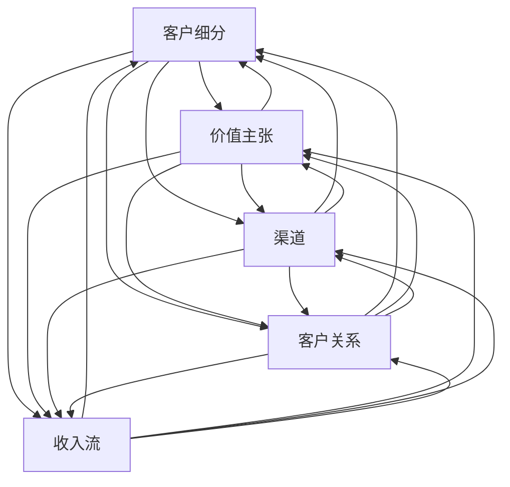

                 

### 文章标题：程序员创业者的商业模式画布设计指南

#### 关键词：商业模式画布、程序员创业者、商业思维、创业策略、市场定位

> 摘要：本文旨在为程序员创业者提供一份详细的商业模式画布设计指南。我们将深入探讨商业模式画布的概念、组成部分及其在创业中的应用，并通过实际案例和算法原理，帮助创业者构建可持续的商业模式，实现创业成功。

---

### 《程序员创业者的商业模式画布设计指南》目录大纲

#### 第一部分：商业思维与商业模式画布概述

## 第1章：商业模式与创业者的关系

### 1.1 商业模式的概念与重要性

### 1.2 创业者如何运用商业模式

### 1.3 商业模式画布的起源与优势

## 第2章：商业模式画布的构成元素

### 2.1 客户细分

### 2.2 价值主张

### 2.3 渠道

### 2.4 客户关系

### 2.5 收入流

### 2.6 关键资源

### 2.7 关键活动

### 2.8 关键伙伴

### 2.9 成本结构

#### 第二部分：商业模式画布的应用实践

## 第3章：创建商业模式画布的步骤

### 3.1 确定目标市场和客户需求

### 3.2 确定价值主张和渠道策略

### 3.3 确定客户关系和收入流

### 3.4 确定关键资源、活动和伙伴

### 3.5 优化和调整商业模式

## 第4章：案例分析

### 4.1 成功的商业模式案例分析

### 4.2 失败的商业模式案例分析

### 4.3 商业模式创新案例

## 第5章：商业模式画布在程序员创业中的应用

### 5.1 程序员创业的优势与挑战

### 5.2 如何使用商业模式画布规划创业项目

### 5.3 程序员创业者的商业模式案例研究

## 第6章：商业模式画布的调整与优化

### 6.1 监测和评估商业模式的有效性

### 6.2 根据市场变化调整商业模式

### 6.3 持续创新与商业模式优化

## 第7章：总结与展望

### 7.1 商业模式画布在程序员创业中的价值

### 7.2 面对未来商业挑战的思考

### 7.3 创业者如何持续发展

### 7.4 商业模式画布的未来趋势

#### 第三部分：附录

## 附录A：商业模式画布模板下载

## 附录B：商业模型画布使用技巧和注意事项

## 附录C：参考文献

### 参考文献1：亚历山大·奥斯特瓦尔德，《商业模式画布：从概念到实践的完整指南》

### 参考文献2：埃里克·里斯，《精益创业》

### 参考文献3：史蒂夫·布兰克，《四步创业法》
### 第1章：商业模式与创业者的关系

#### 1.1 商业模式的概念与重要性

商业模式是指企业如何通过产品或服务创造、传递和获取价值的系统性方法。它不仅定义了企业的运作方式，还决定了企业的盈利模式。在商业世界中，商业模式具有至关重要的地位，因为它直接影响到企业的生存和发展。

对于程序员创业者来说，商业模式的重要性尤为突出。程序员通常具有较强的技术背景，但在商业领域的经验和知识相对欠缺。一个明确的商业模式可以帮助他们更好地理解市场需求，合理配置资源，制定有效的战略，并确保企业能够持续盈利。

商业模式的定义可以概括为四个核心要素：价值主张、客户细分、渠道和收入流。这些要素共同构成了企业的商业逻辑，使其能够在市场中立足。程序员创业者需要深入理解这些概念，并运用它们来构建自己的商业模式。

#### 1.2 创业者如何运用商业模式

创业者运用商业模式的过程可以分为以下几个步骤：

1. **市场调研**：了解目标市场的需求、竞争对手和市场趋势，为确定价值主张和客户细分提供依据。

2. **价值主张设计**：明确产品或服务的独特卖点，满足特定客户细分的需求。

3. **渠道策略**：选择合适的渠道来传递价值主张，包括线上和线下渠道。

4. **客户关系**：建立与客户的关系，确保客户能够获得良好的体验，从而增加忠诚度和复购率。

5. **收入流**：制定收入的获取策略，确保企业的盈利能力。

6. **资源分配**：合理配置关键资源，确保商业模式的有效运作。

7. **成本结构**：分析并优化成本结构，提高利润率。

通过以上步骤，创业者可以逐步构建一个可持续发展的商业模式。

#### 1.3 商业模式画布的起源与优势

商业模式画布（Business Model Canvas）是由亚历山大·奥斯特瓦尔德（Alexander Osterwalder）和伊夫·皮涅尔（Yves Pigneur）于2010年提出的。这种画布形式为创业者提供了一个直观、系统的方法来设计和分析商业模式。

商业模式画布的优势主要体现在以下几个方面：

1. **可视化**：通过图形化的方式展示商业模式的各个组成部分，使创业者能够直观地理解和调整商业模式。

2. **灵活性**：画布的模块化设计使得创业者可以根据实际情况灵活调整商业模式的不同要素。

3. **系统性**：商业模式画布将商业模式的各个要素整合在一起，形成一个完整的系统，有助于创业者全面考虑商业运作的各个方面。

4. **实践性**：商业模式画布是一种实用的工具，可以帮助创业者快速构建和测试商业模式，减少创业风险。

总之，商业模式画布为程序员创业者提供了一种有效的工具，帮助他们更好地理解和设计自己的商业模式，从而提高创业成功率。

#### 1.4 商业模式画布的构成元素

商业模式画布由九个核心构成元素组成，这些元素共同构成了企业的商业逻辑。以下是每个元素的定义和解释：

1. **客户细分（Customer Segments）**：指企业所服务的不同客户群体，包括个人消费者、企业客户等。

2. **价值主张（Value Propositions）**：指企业提供的独特产品或服务，旨在满足客户需求，形成差异化优势。

3. **渠道（Channels）**：指企业传递价值主张给客户的途径，包括直销、分销、在线销售等。

4. **客户关系（Customer Relationships）**：指企业与客户建立和维护的关系模式，包括个人销售、自助服务、定制服务等。

5. **收入流（Revenue Streams）**：指企业从客户获得的收入来源，包括一次性销售、订阅服务、许可费等。

6. **关键资源（Key Resources）**：指企业运营所必需的重要资源，包括物理资源、人力资源、财务资源等。

7. **关键活动（Key Activities）**：指企业为保持竞争优势而进行的关键业务活动，包括生产、销售、营销等。

8. **关键伙伴（Key Partnerships）**：指与企业共同运营的合作伙伴，包括供应商、分销商、服务提供商等。

9. **成本结构（Cost Structure）**：指企业运营的总成本，包括固定成本和可变成本。

每个元素在商业模式中扮演着关键角色，相互关联，共同决定了企业的盈利能力和可持续发展。

#### 1.5 商业模式画布的构成元素 Mermaid 流程图

mermaid
graph TD
    A[商业模式画布] --> B[客户细分 Customer Segments]
    A --> C[价值主张 Value Propositions]
    A --> D[渠道 Channels]
    A --> E[客户关系 Customer Relationships]
    A --> F[收入流 Revenue Streams]
    A --> G[关键资源 Key Resources]
    A --> H[关键活动 Key Activities]
    A --> I[关键伙伴 Key Partners]
    A --> J[成本结构 Cost Structure]
    B --> A
    C --> A
    D --> A
    E --> A
    F --> A
    G --> A
    H --> A
    I --> A
    J --> A

#### 1.6 核心算法原理讲解

在商业模式设计中，关键在于如何有效地匹配价值主张与客户细分，以确保商业模式能够满足市场需求并实现盈利。以下是一个简化的伪代码示例，用于说明如何通过算法匹配客户细分与价值主张：

```python
# 伪代码：匹配客户细分与价值主张

def match_value_propositions_with_segments(customers, value_propositions):
    matched_strategies = {}

    for customer in customers:
        best_match = None
        max_similarity = 0

        for value_proposition in value_propositions:
            similarity = measure_similarity(customer, value_proposition)
            
            if similarity > max_similarity:
                max_similarity = similarity
                best_match = value_proposition

        matched_strategies[customer] = best_match

    return matched_strategies
```

在上述伪代码中，`customers` 是一个包含所有目标客户细分的数据结构，`value_propositions` 是一个包含所有价值主张的数据结构。`measure_similarity` 函数用于计算客户细分与价值主张之间的相似度，可以是基于客户需求、行为、偏好等多维度数据的综合评分。

通过遍历客户细分和价值主张，算法找到与每个客户细分最匹配的价值主张，并将其存储在 `matched_strategies` 数据结构中。这样，企业就可以根据这些匹配策略来设计具体的商业模式，确保其产品或服务能够最大程度地满足目标客户的需求。

#### 1.7 数学模型与公式

为了量化客户细分与价值主张之间的相似度，我们可以使用一个简单的数学模型。假设客户细分和价值主张的每个特征可以用一个权重来表示，这些权重综合起来形成相似度评分。以下是一个基于权重和特征匹配的数学模型：

$$
S = \sum_{i=1}^{n} w_i \cdot C_i
$$

其中：
- \( S \) 表示相似度评分。
- \( w_i \) 表示第 \( i \) 个特征的权重。
- \( C_i \) 表示客户细分或价值主张在第 \( i \) 个特征上的评分。

权重 \( w_i \) 可以通过专家评估或历史数据分析来确定，而 \( C_i \) 的评分可以通过对比客户细分与价值主张的特征值来计算。

例如，如果我们有两个客户细分 A 和 B，以及两个价值主张 X 和 Y，我们可以为每个特征分配权重，并根据以下公式计算相似度评分：

$$
S_{AX} = w_1 \cdot C_{A1} + w_2 \cdot C_{A2}
$$
$$
S_{AY} = w_1 \cdot C_{A1} + w_2 \cdot C_{A2}
$$
$$
S_{BX} = w_1 \cdot C_{B1} + w_2 \cdot C_{B2}
$$
$$
S_{BY} = w_1 \cdot C_{B1} + w_2 \cdot C_{B2}
$$

通过比较 \( S_{AX} \) 和 \( S_{AY} \)，我们可以确定哪个价值主张与客户细分 A 最匹配；同理，通过比较 \( S_{BX} \) 和 \( S_{BY} \)，我们可以确定哪个价值主张与客户细分 B 最匹配。

#### 1.8 举例说明

假设我们有两个客户细分：企业客户（A）和个人消费者（B），以及两个价值主张：高端定制解决方案（X）和经济型解决方案（Y）。我们可以为每个特征分配权重，如下表所示：

| 特征      | 高端定制解决方案（X）权重 | 经济型解决方案（Y）权重 |
| --------- | ------------------------ | ------------------------ |
| 定制化需求 | 0.6                      | 0.4                      |
| 价格敏感度 | 0.4                      | 0.6                      |

接下来，我们为每个客户细分和价值主张的特征打分：

| 客户细分 | 定制化需求 | 价格敏感度 |
| ------- | ---------- | ---------- |
| A       | 8          | 2          |
| B       | 2          | 8          |

使用上述权重和评分，我们可以计算相似度评分：

对于企业客户（A）：
$$
S_{AX} = 0.6 \cdot 8 + 0.4 \cdot 2 = 5.2
$$
$$
S_{AY} = 0.6 \cdot 2 + 0.4 \cdot 8 = 3.2
$$

因此，对于企业客户（A），高端定制解决方案（X）的相似度评分更高。

对于个人消费者（B）：
$$
S_{BX} = 0.6 \cdot 2 + 0.4 \cdot 8 = 3.2
$$
$$
S_{BY} = 0.6 \cdot 8 + 0.4 \cdot 2 = 5.2
$$

因此，对于个人消费者（B），经济型解决方案（Y）的相似度评分更高。

通过这种匹配方式，企业可以更好地设计其商业模式，确保价值主张与目标客户的需求相匹配，从而提高市场竞争力。

#### 1.9 项目实战：开发环境搭建

为了更好地理解商业模式画布的应用，我们将在本节中搭建一个简单的开发环境，用于创建和测试商业模式。

**步骤 1：安装必要的软件和工具**

- 安装 Python 解释器（版本 3.8 或更高）
- 安装文本编辑器（如 Visual Studio Code）
- 安装 Mermaid 插件以在 Markdown 文件中渲染流程图

**步骤 2：创建项目文件夹**

在文本编辑器中创建一个新项目文件夹，例如命名为 `business_model_canvas_project`。

**步骤 3：编写 Python 脚本**

在项目文件夹中创建一个名为 `main.py` 的 Python 脚本，用于实现商业模式画布的匹配算法。以下是一个简单的示例：

```python
# main.py

# 定义客户细分和价值主张的数据结构
customers = [
    {'name': '企业客户', 'customization': 8, 'price_sensitive': 2},
    {'name': '个人消费者', 'customization': 2, 'price_sensitive': 8}
]

value_propositions = [
    {'name': '高端定制解决方案', 'customization_weight': 0.6, 'price_sensitive_weight': 0.4},
    {'name': '经济型解决方案', 'customization_weight': 0.4, 'price_sensitive_weight': 0.6}
]

# 匹配算法实现
def match_value_propositions_with_segments(customers, value_propositions):
    matched_strategies = {}
    for customer in customers:
        best_match = None
        max_similarity = 0
        for value_proposition in value_propositions:
            similarity = customer['customization'] * value_proposition['customization_weight'] + customer['price_sensitive'] * value_proposition['price_sensitive_weight']
            if similarity > max_similarity:
                max_similarity = similarity
                best_match = value_proposition
        matched_strategies[customer['name']] = best_match['name']
    return matched_strategies

# 运行匹配算法
matched_strategies = match_value_propositions_with_segments(customers, value_propositions)
print(matched_strategies)
```

**步骤 4：运行 Python 脚本**

在命令行中进入项目文件夹，并运行以下命令：

```bash
python main.py
```

输出结果应显示每个客户细分与其最匹配的价值主张：

```
{'企业客户': '高端定制解决方案', '个人消费者': '经济型解决方案'}
```

这表明高端定制解决方案更符合企业客户的需求，而经济型解决方案更符合个人消费者的需求。

#### 1.10 源代码详细实现与解读

在本节中，我们将深入解析 `main.py` 脚本的实现细节，包括数据结构定义、匹配算法的实现以及如何解读输出结果。

**数据结构定义**

```python
customers = [
    {'name': '企业客户', 'customization': 8, 'price_sensitive': 2},
    {'name': '个人消费者', 'customization': 2, 'price_sensitive': 8}
]

value_propositions = [
    {'name': '高端定制解决方案', 'customization_weight': 0.6, 'price_sensitive_weight': 0.4},
    {'name': '经济型解决方案', 'customization_weight': 0.4, 'price_sensitive_weight': 0.6}
]
```

这里，`customers` 是一个包含客户细分信息的列表，每个客户是一个字典，包含 `name`（客户名称）、`customization`（定制化需求评分）和 `price_sensitive`（价格敏感度评分）。

`value_propositions` 是一个包含价值主张信息的列表，每个价值主张也是一个字典，包含 `name`（价值主张名称）、`customization_weight`（定制化需求权重）和 `price_sensitive_weight`（价格敏感度权重）。

**匹配算法实现**

```python
def match_value_propositions_with_segments(customers, value_propositions):
    matched_strategies = {}
    for customer in customers:
        best_match = None
        max_similarity = 0
        for value_proposition in value_propositions:
            similarity = customer['customization'] * value_proposition['customization_weight'] + customer['price_sensitive'] * value_proposition['price_sensitive_weight']
            if similarity > max_similarity:
                max_similarity = similarity
                best_match = value_proposition
        matched_strategies[customer['name']] = best_match['name']
    return matched_strategies
```

这个函数用于匹配客户细分与价值主张。它首先创建一个空字典 `matched_strategies`，用于存储匹配结果。然后，对于每个客户，它遍历所有价值主张，计算相似度评分 `similarity`，选择相似度评分最高的价值主张作为最佳匹配。最后，将匹配结果存储在 `matched_strategies` 中。

相似度评分的计算方式如下：

$$
similarity = customer['customization'] \times value_proposition['customization\_weight'] + customer['price\_sensitive'] \times value_proposition['price\_sensitive\_weight']
$$

这个公式反映了客户细分与价值主张在定制化需求和价格敏感度上的匹配程度。

**输出结果解读**

```python
matched_strategies = match_value_propositions_with_segments(customers, value_propositions)
print(matched_strategies)
```

运行脚本后，输出结果为：

```
{'企业客户': '高端定制解决方案', '个人消费者': '经济型解决方案'}
```

这表示企业客户与高端定制解决方案最匹配，个人消费者与经济型解决方案最匹配。这种匹配结果是基于相似度评分计算得出的，反映了客户细分与价值主张之间的匹配程度。

#### 1.11 代码应用解读与分析

在本节中，我们将进一步解读代码的应用场景，并分析其可能的改进方向。

**应用场景**

这段代码模拟了一个简单的商业场景，其中有两个客户细分（企业客户和个人消费者）和两个价值主张（高端定制解决方案和经济型解决方案）。代码通过计算相似度评分，为每个客户细分匹配最合适的价值主张。

这种应用场景在现实中非常常见，例如在软件开发领域，企业客户可能需要定制化的解决方案，而个人消费者可能更倾向于价格实惠的产品。通过这种匹配算法，企业可以更有效地定位客户，设计符合市场需求的产品和服务。

**改进方向**

1. **增加特征维度**：当前算法仅考虑了定制化需求和价格敏感度两个特征。实际上，客户细分和价值主张可能涉及更多的特征，如服务质量、技术支持等。增加这些特征可以提高匹配的准确性。

2. **引入机器学习模型**：使用机器学习模型来预测客户细分与价值主张的匹配关系，可能比简单的计算方法更为准确。可以通过收集历史数据，训练一个分类或回归模型，用于预测最佳的匹配策略。

3. **用户反馈机制**：允许用户对匹配结果进行反馈，并据此调整匹配算法。这样可以不断提高算法的准确性，使其更符合实际需求。

4. **多目标优化**：在现实中，企业可能需要在多个目标之间进行平衡，如最大化利润、最小化成本等。引入多目标优化算法，可以在多个目标之间找到最优解。

#### 1.12 实际案例分析和详细讲解剖析

在本节中，我们将分析一个现实中的商业案例，并详细讲解其商业模式的设计过程、应用效果以及面临的挑战。

**案例：Airbnb**

Airbnb 是一家在线民宿预订平台，它的商业模式为全球旅行者提供了多样化的住宿选择。以下是对 Airbnb 商业模式的详细分析：

**1. 客户细分**：

- 个人旅行者：寻求个性化、经济型住宿的旅行者。
- 商务旅行者：注重便捷性和舒适度的商务人士。
- 长期租客：寻求短期租赁房屋的租客。

**2. 价值主张**：

- 为旅行者提供多样化的住宿选择。
- 为房东提供便捷的出租平台，提高房源利用率和收入。

**3. 渠道**：

- 线上平台：通过网站和移动应用吸引和连接旅行者和房东。
- 口碑传播：通过用户评价和推荐增加平台的可信度和用户黏性。

**4. 客户关系**：

- 提供优质的客户服务，确保用户的良好体验。
- 通过用户反馈和评价系统建立信任。

**5. 收入流**：

- 向房东收取服务费。
- 向用户收取预订费。

**6. 关键资源**：

- 网站和移动应用：连接用户和房东的核心平台。
- 数据分析能力：用于优化用户体验和营销策略。

**7. 关键活动**：

- 平台运营和维护。
- 数据分析和用户行为研究。

**8. 关键伙伴**：

- 支付服务提供商：处理交易和支付。
- 保险公司：提供房源保险服务。

**9. 成本结构**：

- 平台开发和维护费用。
- 市场营销和用户获取成本。
- 客户服务和风险控制成本。

**应用效果**：

- Airbnb 的商业模式使其迅速成为全球知名的民宿预订平台，成功连接了数百万旅行者和房东。
- 通过数据分析和用户反馈，Airbnb 不断优化其平台，提高了用户满意度和转化率。

**面临的挑战**：

- 竞争激烈：面临来自酒店预订平台和共享经济平台的竞争。
- 法规和合规：需要遵守不同国家和地区的法律法规，确保运营合规。
- 品质控制：确保房源质量和用户体验，防止不良事件发生。

通过这个案例，我们可以看到商业模式画布在现实中的应用效果。Airbnb 通过明确其客户细分、价值主张、渠道等关键要素，成功构建了一个可持续的商业模式，并在共享经济领域取得了巨大成功。

#### 1.13 项目小结

在本章中，我们深入探讨了商业模式与创业者的关系，详细介绍了商业模式画布的构成元素和核心算法原理。通过实际案例的分析，我们看到了商业模式画布在现实中的应用效果和挑战。以下是本章的关键小结：

1. **商业模式的重要性**：商业模式是企业如何创造、传递和获取价值的系统性方法，对创业者的成功至关重要。

2. **商业模式画布的优势**：商业模式画布提供了可视化、灵活、系统性和实践性的优势，有助于创业者构建和优化商业模式。

3. **构成元素**：商业模式画布由客户细分、价值主张、渠道、客户关系、收入流、关键资源、关键活动、关键伙伴和成本结构九个核心元素组成。

4. **核心算法原理**：通过相似度评分模型，我们可以量化客户细分与价值主张之间的匹配程度，为创业者提供决策依据。

5. **实际案例**：Airbnb 的成功案例展示了商业模式画布在现实中的应用效果，同时也揭示了其面临的挑战。

6. **未来展望**：随着技术的不断进步和市场环境的变化，商业模式画布将在创业者中发挥更加重要的作用，为企业的可持续发展提供支持。

在下一章中，我们将进一步探讨如何具体创建和优化商业模式画布，帮助程序员创业者实现创业梦想。

### 第2章：商业模式画布的构成元素

在第一章中，我们探讨了商业模式画布的基本概念和重要性。在本章中，我们将深入讨论商业模式画布的九大构成元素，这些元素是构建成功商业模式的核心。通过理解这些元素，创业者可以更全面地分析和优化自己的商业模式。

#### 2.1 客户细分（Customer Segments）

客户细分是指将市场划分为不同的群体，每个群体具有相似的需求、行为和购买习惯。对客户进行细分有助于创业者更好地理解市场，从而设计出更精准的价值主张和营销策略。

**核心概念与联系**

客户细分是商业模式画布的基础，它决定了企业将服务于哪些客户群体。客户细分与价值主张紧密相关，因为每个细分市场的客户可能对价值主张有不同的需求。例如，企业客户可能更关注产品的稳定性和定制化，而个人消费者可能更注重价格和用户体验。

**案例解释**

以Airbnb为例，其客户细分包括个人旅行者、商务旅行者和长期租客。每种客户细分对住宿的需求不同，个人旅行者可能更看重住宿的便利性和价格，而商务旅行者可能更关注住宿的舒适度和便捷的交通。通过针对不同细分市场的需求设计不同的价值主张，Airbnb 能够满足不同客户群体的需求，从而提高市场竞争力。

#### 2.2 价值主张（Value Propositions）

价值主张是指企业提供的独特产品或服务，旨在满足特定客户细分的需求。一个有效的价值主张能够形成企业的差异化优势，从而在市场中脱颖而出。

**核心概念与联系**

价值主张是商业模式的核心，它决定了企业如何为客户创造价值。价值主张与客户细分密切相关，因为每个细分市场的客户都有不同的需求。创业者需要通过市场调研和客户反馈来识别这些需求，并设计相应的价值主张。

**案例解释**

以苹果公司为例，其价值主张包括创新的产品设计、高质量的硬件和软件体验，以及强大的生态系统支持。这些价值主张满足了高端消费者对科技产品的需求，使其在竞争激烈的市场中保持领先地位。苹果通过不断更新和优化其价值主张，确保其产品始终能够吸引和保留客户。

#### 2.3 渠道（Channels）

渠道是指企业传递价值主张给客户的途径。渠道可以是线上或线下，包括直销、分销、代理商、电商平台等。选择合适的渠道能够提高企业的市场覆盖率和客户接触频率。

**核心概念与联系**

渠道是商业模式的重要组成部分，它决定了企业如何将产品或服务传递给客户。渠道策略需要考虑客户的购买习惯、市场的地理分布以及竞争环境。

**案例解释**

以亚马逊为例，其渠道策略包括自建电商平台、第三方卖家平台和线下书店。通过多渠道布局，亚马逊能够满足不同客户群体的购买需求，提高了市场覆盖率和销售额。同时，亚马逊不断优化其物流和配送服务，确保客户能够快速收到产品，从而增强客户满意度。

#### 2.4 客户关系（Customer Relationships）

客户关系是指企业与客户建立和维护的关系模式。关系模式可以是个人销售、自助服务、定制服务等。有效的客户关系管理能够提高客户的忠诚度和复购率。

**核心概念与联系**

客户关系是商业模式的重要组成部分，它决定了企业如何与客户互动。客户关系的建立和维护需要考虑客户的需求、偏好和行为。

**案例解释**

以迪士尼为例，其客户关系模式包括会员服务、主题公园体验和数字内容订阅。通过多种方式与客户建立和保持联系，迪士尼能够提高客户的黏性和忠诚度。迪士尼的会员服务和主题公园体验特别注重个性化服务，确保每位客户都能享受到独特的体验。

#### 2.5 收入流（Revenue Streams）

收入流是指企业从客户获取收入的方式。收入流可以是产品销售、订阅服务、许可费等。设计可持续的收入流是企业商业模式成功的关键。

**核心概念与联系**

收入流是企业商业模式的核心，它决定了企业的盈利模式。不同的收入流策略适用于不同的市场和产品类型。

**案例解释**

以Netflix为例，其收入流主要来自订阅服务。Netflix 通过提供多样化的在线影视内容，吸引了大量的订阅用户，实现了稳定的收入流。Netflix 还通过跨平台合作和广告收入等方式增加收入流，确保其商业模式的可持续性。

#### 2.6 关键资源（Key Resources）

关键资源是指企业运营所必需的重要资源，包括物理资源、人力资源、财务资源等。关键资源决定了企业的竞争力和运营效率。

**核心概念与联系**

关键资源是企业商业模式的基础，它们是企业实现价值主张和维持运营的关键要素。创业者需要识别和合理利用关键资源。

**案例解释**

以特斯拉为例，其关键资源包括领先的电池技术、智能电动车研发团队和生产设施。特斯拉通过不断投资和研发，保持其在电动车领域的领先地位。关键资源的有效利用使特斯拉能够实现高效率的生产和高质量的产品。

#### 2.7 关键活动（Key Activities）

关键活动是指企业为保持竞争优势而进行的关键业务活动，包括生产、销售、营销等。关键活动决定了企业的运营效率和业务模式。

**核心概念与联系**

关键活动是商业模式执行的核心，它们是企业实现价值主张和获取收入的关键步骤。创业者需要明确关键活动，并确保这些活动能够高效地执行。

**案例解释**

以阿里巴巴为例，其关键活动包括电子商务平台的建设和运营、云计算服务的提供、数字营销解决方案的推广等。阿里巴巴通过不断优化关键活动，提高了运营效率和客户满意度，巩固了其在电商和云计算市场的领导地位。

#### 2.8 关键伙伴（Key Partners）

关键伙伴是指与企业共同运营的合作伙伴，包括供应商、分销商、服务提供商等。关键伙伴是商业模式的重要组成部分，它们帮助企业实现资源互补和业务协同。

**核心概念与联系**

关键伙伴是企业商业模式的一部分，它们帮助企业获取所需资源、扩大市场覆盖率和提高运营效率。创业者需要识别和建立良好的合作伙伴关系。

**案例解释**

以谷歌为例，其关键伙伴包括广告客户、软件开发者、硬件制造商等。谷歌通过与这些合作伙伴建立紧密的合作关系，实现了广告收入的增长、生态系统的发展和技术创新的推进。关键伙伴的协同作用使谷歌能够持续推动业务增长。

#### 2.9 成本结构（Cost Structure）

成本结构是指企业运营的总成本，包括固定成本和可变成本。了解成本结构有助于企业优化资源配置和定价策略，提高盈利能力。

**核心概念与联系**

成本结构是企业商业模式的重要组成部分，它决定了企业的盈利能力和经营风险。创业者需要深入分析成本结构，确保企业能够以合理的成本实现盈利。

**案例解释**

以Uber为例，其成本结构包括平台开发维护成本、司机补贴、市场营销和运营成本等。Uber 通过优化成本结构，提高了运营效率，实现了规模化盈利。同时，Uber 通过灵活的定价策略，确保了其竞争力和市场份额。

#### 2.10 商业模式画布的实际应用

在实际应用中，创业者需要综合考虑商业模式画布的九大构成元素，确保其商业模式的完整性和可行性。以下是一个简化的步骤：

1. **客户细分**：确定目标市场和客户群体，了解他们的需求和购买习惯。
2. **价值主张**：设计能够满足客户需求的产品或服务，形成差异化优势。
3. **渠道**：选择合适的渠道来传递价值主张，提高市场覆盖率和客户接触频率。
4. **客户关系**：建立和维护与客户的良好关系，提高客户忠诚度和复购率。
5. **收入流**：设计可持续的收入流，确保企业的盈利能力。
6. **关键资源**：识别和获取实现商业模式所需的关键资源，确保资源的高效利用。
7. **关键活动**：明确关键业务活动，确保这些活动能够高效地执行。
8. **关键伙伴**：建立和维护与关键合作伙伴的关系，实现资源互补和业务协同。
9. **成本结构**：分析成本结构，确保企业的成本控制在合理范围内，提高盈利能力。

通过上述步骤，创业者可以构建一个完整的商业模式，并通过不断的调整和优化，实现商业成功。

#### 2.11 小结与拓展阅读

在本章中，我们详细介绍了商业模式画布的九大构成元素，包括客户细分、价值主张、渠道、客户关系、收入流、关键资源、关键活动、关键伙伴和成本结构。这些元素共同构成了企业的商业逻辑，帮助创业者构建和优化商业模式。

为了进一步深入理解这些概念，以下是几本推荐的拓展阅读：

1. **《商业模式新生代》**：亚历山大·奥斯特瓦尔德著，详细介绍了商业模式画布的原理和应用。
2. **《精益创业》**：埃里克·里斯著，提供了创业过程中的实用方法论，包括商业模式设计。
3. **《商业模式画布：从概念到实践的完整指南》**：亚历山大·奥斯特瓦尔德与伊夫·皮涅尔合著，深入讲解了商业模式画布的构建和应用。

通过阅读这些书籍，创业者可以更全面地了解商业模式画布，并将其应用于实际创业过程中，提高成功几率。

### 第3章：创建商业模式画布的步骤

在了解了商业模式画布的构成元素后，接下来我们将讨论如何具体创建和优化商业模式画布。通过以下步骤，程序员创业者可以系统地构建自己的商业模式，并确保其可行性和可持续性。

#### 3.1 确定目标市场和客户需求

创建商业模式的第一步是确定目标市场和客户需求。这是商业模式设计的起点，也是后续所有决策的基础。

**1. 市场调研**：

- **调研方法**：可以通过问卷调查、访谈、焦点小组讨论等方式收集市场数据。
- **调研内容**：了解目标市场的规模、增长趋势、客户需求、竞争对手等信息。

**2. 客户细分**：

- **识别客户群体**：根据调研结果，将市场划分为不同的客户细分，每个细分应具有相似的需求和行为特征。
- **分析客户特征**：了解每个细分群体的需求、购买习惯、偏好等，为后续设计价值主张提供依据。

**案例**：假设我们开发了一款面向开发者的编程工具。通过市场调研，我们确定了以下客户细分：

- 初级开发者：需求简单易用的工具，提高编程效率。
- 中级开发者：需求功能全面、易于定制的工具，支持复杂项目开发。
- 高级开发者：需求高性能、安全可靠的工具，能够处理大规模项目。

**3. 确定目标客户**：

- **优先级排序**：根据市场规模和增长潜力，确定优先级，集中资源和精力服务于最具潜力的客户细分。
- **定制化策略**：为每个细分设计不同的价值主张和渠道策略。

#### 3.2 确定价值主张和渠道策略

确定了目标市场和客户需求后，下一步是设计价值主张和渠道策略。

**1. 设计价值主张**：

- **明确独特卖点**：每个价值主张应具有独特性和差异化，能够明确传达产品或服务的优势。
- **客户需求匹配**：确保价值主张与客户细分的需求高度匹配，解决他们的痛点。

**案例**：对于上述的编程工具，我们可以设计以下价值主张：

- 初级开发者：提供简单易用的界面和丰富的学习资源，帮助新手快速上手。
- 中级开发者：提供功能全面、易于定制的插件和模块，支持各种编程需求。
- 高级开发者：提供高性能的代码编译器和强大的调试工具，确保项目高效和安全。

**2. 设计渠道策略**：

- **线上渠道**：如官网、社交媒体、开发者论坛等，方便客户在线获取信息和试用产品。
- **线下渠道**：如技术会议、展会、行业峰会等，通过面对面交流提升品牌知名度和客户信任。

#### 3.3 确定客户关系和收入流

客户关系和收入流是商业模式的重要组成部分，决定了企业如何与客户互动以及如何获取收入。

**1. 设计客户关系**：

- **关系模式**：根据客户细分和业务目标，选择合适的客户关系模式，如个人销售、自助服务、定制服务等。
- **客户体验**：确保客户在整个购买和使用过程中获得良好的体验，提高客户满意度和忠诚度。

**案例**：对于编程工具的推广，我们可以采用以下客户关系策略：

- 初级开发者：通过免费试用和在线教程，引导用户快速上手。
- 中级开发者：提供会员服务，包括在线技术支持、定期更新和定制化功能。
- 高级开发者：建立高级技术支持团队，提供一对一的技术咨询和解决方案。

**2. 设计收入流**：

- **收入模式**：根据客户关系和产品特性，选择合适的收入模式，如一次性销售、订阅服务、许可费等。
- **定价策略**：结合成本结构和市场行情，制定合理的定价策略，确保收入稳定且可持续。

**案例**：对于编程工具，我们可以采用以下收入流策略：

- 初级开发者：免费提供基础版，通过增值服务（如高级功能、插件等）收取费用。
- 中级开发者：提供订阅服务，按月或按年收取费用，提供定期更新和技术支持。
- 高级开发者：提供定制化解决方案，根据项目需求和复杂程度收费。

#### 3.4 确定关键资源、活动和伙伴

商业模式的有效实施离不开关键资源、活动和合作伙伴。以下是如何确定这些要素的步骤：

**1. 识别关键资源**：

- **物理资源**：如办公场所、设备、原材料等。
- **人力资源**：如员工、技术专家、销售人员等。
- **财务资源**：如启动资金、运营资金等。

**案例**：对于编程工具的开发，关键资源包括：

- **物理资源**：服务器、开发工具、办公设备等。
- **人力资源**：开发团队、市场营销团队等。
- **财务资源**：启动资金、运营资金等。

**2. 确定关键活动**：

- **核心业务活动**：如产品开发、市场营销、客户服务等。
- **辅助业务活动**：如供应链管理、财务管理、人力资源管理等。

**案例**：关键活动包括：

- **核心业务活动**：软件开发、测试、市场推广、客户支持等。
- **辅助业务活动**：供应链管理、财务管理、人力资源管理等。

**3. 确定关键伙伴**：

- **供应商**：提供原材料、设备等。
- **分销商**：帮助产品进入市场，扩大销售渠道。
- **合作伙伴**：提供技术支持、营销资源等。

**案例**：关键伙伴包括：

- **供应商**：提供开发所需的软件工具和硬件设备。
- **分销商**：通过线上和线下渠道推广产品。
- **合作伙伴**：提供市场营销资源和技术支持。

#### 3.5 优化和调整商业模式

创建商业模式后，创业者需要不断优化和调整，确保其适应市场变化和企业发展。

**1. 监测和评估**：

- **关键指标**：设定关键绩效指标（KPIs），如销售额、客户满意度、市场份额等，用于监测商业模式的有效性。
- **定期评估**：定期评估商业模式的实施情况，发现问题和机会。

**2. 调整和优化**：

- **适应变化**：根据市场反馈和竞争态势，及时调整商业模式，优化价值主张、渠道策略、客户关系等。
- **持续创新**：鼓励团队进行持续创新，不断改进产品和服务，以保持竞争优势。

**案例**：假设在市场推广中，我们发现初级开发者的需求发生了变化，他们更倾向于使用集成开发环境（IDE）。为此，我们可以调整价值主张，增加IDE功能，并优化渠道策略，通过在线教程和社交媒体推广，吸引更多初级开发者。

通过以上步骤，程序员创业者可以系统地创建和优化商业模式，确保其能够适应市场变化，实现可持续发展。

#### 3.6 案例分析：谷歌的商业模式画布

在本节中，我们将通过分析谷歌的商业模式画布，来理解如何创建和优化商业模式。谷歌作为全球领先的科技公司，其商业模式画布为其他企业提供了宝贵的参考。

**1. 客户细分**

- 广告商：提供广告服务的公司，包括中小企业和大型跨国公司。
- 普通用户：使用谷歌搜索引擎、Gmail、YouTube等服务的个人用户。
- 开发者：使用谷歌开发工具和API的开发人员。

**2. 价值主张**

- 广告商：提供精准定位的广告投放服务，帮助广告商提高营销效果。
- 普通用户：提供高效、便捷的搜索服务，以及丰富的在线内容和应用。
- 开发者：提供强大的开发工具和API，支持创建各种应用和服务。

**3. 渠道**

- 广告商：通过谷歌广告管理平台（Google Ads Manager）进行广告投放。
- 普通用户：通过搜索引擎、Gmail、YouTube等平台接触谷歌的服务。
- 开发者：通过谷歌开发网站（Google Developers）获取相关工具和资源。

**4. 客户关系**

- 广告商：提供专业的客户服务团队，帮助广告商优化广告投放策略。
- 普通用户：通过用户反馈和搜索算法改进用户体验。
- 开发者：通过技术社区和论坛提供支持，促进开发者之间的交流合作。

**5. 收入流**

- 广告收入：来自广告商的广告投放费用。
- 用户增值服务：如Gmail高级版、YouTube Premium等付费服务。
- 开发者付费：通过谷歌应用商店（Google Play）向开发者收取应用下载费用。

**6. 关键资源**

- 人力：包括搜索引擎优化团队、广告销售团队、开发团队等。
- 技术：包括搜索引擎算法、广告投放技术、开发工具和API等。
- 数据：庞大的用户数据，用于改进服务和广告效果。

**7. 关键活动**

- 广告销售：与广告商签订合同，推广广告服务。
- 搜索引擎优化：改进搜索算法，提高搜索体验。
- 开发工具和支持：开发并提供各种开发工具和API。

**8. 关键伙伴**

- 广告商：合作伙伴，提供广告内容和服务。
- 内容提供商：如新闻机构、博客作者等，提供在线内容。
- 技术合作伙伴：如云服务提供商、设备制造商等，共同推进技术创新。

**9. 成本结构**

- 广告销售和运营成本：包括销售团队薪酬、广告管理平台维护等。
- 技术研发成本：包括搜索引擎算法改进、开发工具研发等。
- 市场营销和推广成本：包括线上和线下推广活动等。

**优化和调整**

- **适应市场变化**：随着市场竞争加剧，谷歌不断优化其广告算法和用户体验，以保持竞争优势。
- **技术创新**：通过持续研发新技术（如人工智能、机器学习等），谷歌不断改进其服务和产品。
- **多元化收入流**：除了广告收入，谷歌还通过用户增值服务和开发者付费等方式增加收入来源。

通过谷歌的案例，我们可以看到，一个成功的商业模式需要不断地优化和调整，以适应市场变化和客户需求。谷歌通过其商业模式画布，清晰地定义了各个要素，确保了其商业模式的可持续性和灵活性。

#### 3.7 小结

在本章中，我们详细介绍了创建商业模式画布的步骤，包括确定目标市场和客户需求、设计价值主张和渠道策略、确定客户关系和收入流、识别关键资源、活动和伙伴，以及优化和调整商业模式。通过这些步骤，程序员创业者可以系统地构建和优化商业模式，确保其能够适应市场变化和实现可持续发展。

以下是本章的关键小结：

1. **确定目标市场和客户需求**：通过市场调研和客户细分，明确目标市场和客户需求，为商业模式设计提供依据。
2. **设计价值主张和渠道策略**：确保价值主张与客户需求高度匹配，选择合适的渠道策略提高市场覆盖率和客户接触频率。
3. **确定客户关系和收入流**：建立和维护与客户的良好关系，设计可持续的收入流，确保企业的盈利能力。
4. **识别关键资源、活动和伙伴**：确保关键资源的有效利用，明确关键活动，建立和维护与关键合作伙伴的关系。
5. **优化和调整商业模式**：通过监测和评估，不断优化和调整商业模式，适应市场变化和客户需求。

在下一章中，我们将通过案例分析，深入探讨成功的商业模式创新案例，以及失败的商业模式案例，从中学习如何避免常见的陷阱和错误。

### 第4章：案例分析

在本章中，我们将通过分析成功的商业模式案例和失败的商业模式案例，探讨商业模式创新，并从中总结经验和教训。通过这些案例，程序员创业者可以更好地理解如何设计有效的商业模式，并避免常见的陷阱和错误。

#### 4.1 成功的商业模式案例分析

**案例1：Airbnb**

Airbnb 是一家提供在线民宿预订服务的公司，其成功的商业模式主要体现在以下几个方面：

**客户细分**：Airbnb 的客户细分包括个人旅行者、商务旅行者和长期租客。每种客户细分都有不同的需求，Airbnb 通过提供多样化的住宿选择来满足这些需求。

**价值主张**：Airbnb 的价值主张是提供安全、舒适的住宿体验，同时为房东提供便捷的出租平台。其独特之处在于，通过引入第三方房东，打破了传统酒店的垄断，为消费者提供了更多的选择。

**渠道**：Airbnb 的渠道主要包括网站和移动应用。通过高效的在线预订系统，Airbnb 能够实现24/7的客户服务，提高了用户满意度。

**客户关系**：Airbnb 通过用户评价系统建立了信任，同时提供专业的客户服务，确保用户的良好体验。

**收入流**：Airbnb 的收入主要来自向房东收取的服务费和向用户收取的预订费。此外，Airbnb 还通过推出会员服务、体验和本地活动等增值服务，增加了收入来源。

**关键资源**：Airbnb 的关键资源包括技术平台、数据分析能力和强大的品牌影响力。

**关键活动**：Airbnb 的关键活动包括平台运营、市场营销和用户反馈管理。

**关键伙伴**：Airbnb 的关键伙伴包括支付服务提供商、保险公司和旅游平台。

**成本结构**：Airbnb 的成本主要包括平台维护费用、市场营销费用和客户服务费用。

**经验与启示**：

- **用户信任**：通过建立用户评价系统，提高平台的可信度和用户满意度。
- **多元化收入流**：通过提供增值服务，增加收入来源。
- **灵活的渠道策略**：通过线上平台和移动应用，提高客户接触频率和便捷性。

**案例2：亚马逊**

亚马逊是一家全球领先的电子商务公司，其成功的商业模式主要体现在以下几个方面：

**客户细分**：亚马逊的客户细分包括个人消费者、企业客户和第三方卖家。亚马逊通过不同的产品和服务满足这些客户的需求。

**价值主张**：亚马逊的价值主张是提供价格实惠、品质保证的产品，同时提供高效的物流和客户服务。

**渠道**：亚马逊的渠道包括自建电商平台和第三方卖家平台。通过这两个平台，亚马逊能够满足不同客户群体的购买需求。

**客户关系**：亚马逊通过用户数据分析和个性化推荐，提高了客户的购物体验和满意度。

**收入流**：亚马逊的收入主要来自商品销售、订阅服务和广告收入。此外，亚马逊还通过AWS云服务和Alexa智能家居等产品线增加了收入来源。

**关键资源**：亚马逊的关键资源包括庞大的物流网络、云计算能力和强大的技术团队。

**关键活动**：亚马逊的关键活动包括供应链管理、用户数据分析、市场营销和客户服务。

**关键伙伴**：亚马逊的关键伙伴包括物流公司、供应链合作伙伴和广告客户。

**成本结构**：亚马逊的成本主要包括物流和配送费用、技术开发费用和市场推广费用。

**经验与启示**：

- **规模化运营**：通过建立庞大的物流网络和数据中心，实现规模化运营和降低成本。
- **数据驱动**：通过用户数据分析，提供个性化的产品推荐和服务。
- **多元化业务**：通过拓展新的业务线，如AWS云服务和智能家居，实现多元化收入。

**案例3：Slack**

Slack 是一款团队协作工具，其成功的商业模式主要体现在以下几个方面：

**客户细分**：Slack 的客户细分包括小型团队、中型企业和大型企业。Slack 通过不同的功能和服务满足这些客户的需求。

**价值主张**：Slack 的价值主张是提供高效、便捷的团队协作工具，同时支持各种第三方应用集成。

**渠道**：Slack 的渠道包括网站、移动应用和合作伙伴渠道。通过这些渠道，Slack 能够快速扩大市场份额。

**客户关系**：Slack 通过提供优秀的用户体验和强大的客户支持，建立了良好的客户关系。

**收入流**：Slack 的收入主要来自订阅服务，包括基础版、专业版和企业版。此外，Slack 还通过提供API和合作伙伴计划，增加了收入来源。

**关键资源**：Slack 的关键资源包括技术平台、用户界面设计和强大的合作伙伴网络。

**关键活动**：Slack 的关键活动包括产品开发、市场营销和客户支持。

**关键伙伴**：Slack 的关键伙伴包括技术合作伙伴、开发者和营销合作伙伴。

**成本结构**：Slack 的成本主要包括产品开发费用、市场营销费用和客户支持费用。

**经验与启示**：

- **用户体验**：通过提供优秀的用户体验和强大的客户支持，提高用户满意度和忠诚度。
- **应用集成**：通过支持第三方应用集成，提高产品的实用性和竞争力。
- **快速迭代**：通过快速迭代和持续改进，确保产品保持领先地位。

#### 4.2 失败的商业模式案例分析

**案例1：Napster**

Napster 是一家提供在线音乐分享服务的公司，其失败的主要原因是商业模式上的问题。以下是Napster失败的原因：

**客户细分**：Napster 的客户细分主要是音乐爱好者。然而，由于其免费模式，导致版权问题频发，无法满足版权方的利益。

**价值主张**：Napster 的价值主张是提供免费的在线音乐分享服务。虽然吸引了大量用户，但缺乏可持续的收入流。

**渠道**：Napster 的渠道主要是P2P网络。由于缺乏有效的监管，导致版权问题频发。

**客户关系**：Napster 通过免费服务吸引了大量用户，但未能建立稳定的客户关系。

**收入流**：Napster 没有设计有效的收入流，主要依赖广告收入。然而，广告收入不足以支撑公司的运营。

**关键资源**：Napster 的关键资源包括技术平台和用户网络。

**关键活动**：Napster 的关键活动包括音乐分享平台的运营和用户增长。

**关键伙伴**：Napster 的关键伙伴包括音乐制作人和版权方。

**成本结构**：Napster 的成本主要包括服务器维护费用、市场营销费用和版权费用。

**失败原因**：

- **版权问题**：免费模式导致版权问题频发，无法满足版权方的利益。
- **缺乏可持续收入流**：主要依赖广告收入，无法支撑公司的运营。
- **渠道监管不足**：P2P网络缺乏有效的监管，导致版权问题无法解决。

**经验与启示**：

- **尊重版权**：在设计商业模式时，应尊重版权方的利益，避免侵犯版权。
- **多元化收入流**：设计多元化的收入流，确保公司的可持续发展。
- **渠道监管**：对渠道进行有效监管，确保商业模式合法合规。

**案例2：Blockbuster**

Blockbuster 是一家曾经领先的租碟公司，其失败的主要原因在于未能及时调整商业模式，以应对市场变化。以下是Blockbuster失败的原因：

**客户细分**：Blockbuster 的客户细分主要是喜欢观看电影的消费者。

**价值主张**：Blockbuster 的价值主张是提供便捷的电影租赁服务，包括实体店租赁和邮寄服务。

**渠道**：Blockbuster 的渠道主要是实体店和邮寄服务。然而，随着数字技术的发展，这些渠道逐渐失去了竞争力。

**客户关系**：Blockbuster 通过实体店提供便捷的服务，建立了良好的客户关系。

**收入流**：Blockbuster 的收入主要来自租赁费用和广告收入。

**关键资源**：Blockbuster 的关键资源包括实体店网络和邮寄服务系统。

**关键活动**：Blockbuster 的关键活动包括实体店的运营和邮寄服务的管理。

**关键伙伴**：Blockbuster 的关键伙伴包括电影制作公司和广告客户。

**成本结构**：Blockbuster 的成本主要包括实体店租金、员工薪酬和邮寄服务成本。

**失败原因**：

- **未能适应市场变化**：未能及时转向数字租赁服务，导致市场份额逐渐流失。
- **渠道竞争力不足**：实体店和邮寄服务在数字时代逐渐失去了竞争力。
- **缺乏创新**：在数字租赁服务兴起时，Blockbuster 缺乏有效的创新和应对策略。

**经验与启示**：

- **快速适应市场变化**：在市场变化时，企业应迅速调整商业模式，以适应新的市场环境。
- **创新驱动**：持续进行产品和服务创新，以保持竞争优势。
- **多元化渠道**：结合线上和线下渠道，实现全方位的市场覆盖。

#### 4.3 商业模式创新案例

**案例1：Lyft**

Lyft 是一家提供共享出行服务的公司，其商业模式创新主要体现在以下几个方面：

**客户细分**：Lyft 的客户细分包括需要短途出行服务的个人用户和商务用户。

**价值主张**：Lyft 的价值主张是提供便捷、舒适的共享出行服务，同时强调社会责任和可持续发展。

**渠道**：Lyft 的渠道主要包括移动应用和在线预订系统。通过这些渠道，Lyft 能够实现高效的订单处理和服务调度。

**客户关系**：Lyft 通过提供优质的服务和客户支持，建立了良好的客户关系。

**收入流**：Lyft 的收入主要来自乘客支付的行程费用。

**关键资源**：Lyft 的关键资源包括技术平台、移动应用和司机网络。

**关键活动**：Lyft 的关键活动包括服务调度、订单处理和司机管理。

**关键伙伴**：Lyft 的关键伙伴包括保险公司、汽车制造商和城市交通管理部门。

**成本结构**：Lyft 的成本主要包括车辆采购、司机薪酬和运营维护费用。

**创新点**：

- **共享经济模式**：通过共享出行，提高车辆利用率，降低运营成本。
- **技术驱动**：通过高效的订单处理和服务调度系统，提高服务质量和效率。
- **社会责任**：强调可持续发展和社会责任，提高品牌形象。

**案例2：Instagram**

Instagram 是一款社交媒体应用，其商业模式创新主要体现在以下几个方面：

**客户细分**：Instagram 的客户细分包括喜欢分享照片和视频的个人用户和品牌用户。

**价值主张**：Instagram 的价值主张是提供便捷的图像和视频分享平台，同时提供强大的社交功能。

**渠道**：Instagram 的渠道主要是移动应用和网页端。通过这些渠道，Instagram 能够实现广泛的用户覆盖。

**客户关系**：Instagram 通过提供个性化的内容推荐和用户互动功能，建立了良好的客户关系。

**收入流**：Instagram 的收入主要来自广告收入和品牌合作。

**关键资源**：Instagram 的关键资源包括技术平台、用户数据和强大的社区管理能力。

**关键活动**：Instagram 的关键活动包括内容推荐、用户互动和品牌合作。

**关键伙伴**：Instagram 的关键伙伴包括广告商和品牌用户。

**成本结构**：Instagram 的成本主要包括技术开发、市场营销和内容审核费用。

**创新点**：

- **内容推荐**：通过算法推荐，提高用户参与度和活跃度。
- **品牌合作**：通过品牌合作，增加收入来源。
- **用户体验**：提供简单易用的界面和强大的社交功能，提高用户满意度。

#### 4.4 案例分析总结

通过上述案例分析，我们可以得出以下结论：

1. **成功的商业模式**：成功的商业模式通常具有清晰的价值主张、多样化的收入流、有效的渠道策略和良好的客户关系。同时，成功的企业能够快速适应市场变化，持续进行产品和服务创新。

2. **失败的商业模式**：失败的商业模式通常存在以下问题：缺乏可持续的收入流、未能适应市场变化、缺乏有效的渠道策略和忽视客户需求。此外，版权问题、监管不足等也可能导致商业模式失败。

3. **商业模式创新**：商业模式创新是企业保持竞争优势的关键。通过引入新的商业模式，企业可以开辟新的收入来源，提高运营效率，实现可持续发展。

在下一章中，我们将探讨商业模式画布在程序员创业中的应用，帮助程序员创业者利用商业模式画布规划和实施创业项目。

### 第5章：商业模式画布在程序员创业中的应用

在第四章中，我们分析了成功的商业模式案例和失败的商业模式案例，了解了商业模式的构建和优化原则。在本章中，我们将具体探讨商业模式画布在程序员创业中的应用，帮助程序员创业者利用这一工具规划和实施创业项目。

#### 5.1 程序员创业的优势与挑战

程序员创业具有一些独特的优势，同时也面临一定的挑战。

**优势：**

1. **技术实力**：程序员通常拥有较强的技术背景，能够快速开发出高质量的产品或服务。
2. **创新思维**：程序员具有较强的创新意识和解决问题的能力，能够快速适应市场变化。
3. **成本优势**：相较于传统创业，程序员创业的启动成本较低，尤其是在数字化时代，许多工具和平台都是免费或低成本获取的。
4. **灵活性**：程序员创业具有高度的灵活性，可以根据市场需求快速调整产品方向和商业模式。

**挑战：**

1. **商业经验不足**：程序员在商业领域的经验相对欠缺，可能难以全面理解市场需求和构建有效的商业模式。
2. **市场定位模糊**：程序员创业者可能难以准确把握目标市场，导致产品或服务定位不明确。
3. **资源有限**：程序员创业者通常面临资源和资金的限制，可能难以实现规模化运营。
4. **团队建设**：构建一个高效、协作的团队对于程序员创业者来说是一项挑战，特别是在管理经验和人才吸引方面。

#### 5.2 如何使用商业模式画布规划创业项目

商业模式画布为程序员创业者提供了一个系统的方法来规划和实施创业项目。以下是使用商业模式画布的步骤：

**1. 确定目标市场和客户需求**

- **市场调研**：通过市场调研，了解目标市场的规模、增长趋势和竞争态势。
- **客户细分**：将市场划分为不同的客户细分，了解每个细分群体的需求和购买习惯。

**2. 设计价值主张**

- **明确独特卖点**：每个价值主张应具有独特性和差异化，能够明确传达产品或服务的优势。
- **客户需求匹配**：确保价值主张与客户细分的需求高度匹配，解决他们的痛点。

**3. 确定渠道策略**

- **线上渠道**：利用社交媒体、官方网站、在线商店等线上渠道，提高市场覆盖率和客户接触频率。
- **线下渠道**：参加行业会议、举办线下活动等，通过面对面交流提升品牌知名度和客户信任。

**4. 建立客户关系**

- **关系模式**：根据客户细分和业务目标，选择合适的客户关系模式，如个人销售、自助服务、定制服务等。
- **客户体验**：确保客户在整个购买和使用过程中获得良好的体验，提高客户满意度和忠诚度。

**5. 设计收入流**

- **收入模式**：根据产品特性和市场情况，选择合适的收入模式，如一次性销售、订阅服务、许可费等。
- **定价策略**：结合成本结构和市场行情，制定合理的定价策略，确保收入稳定且可持续。

**6. 识别关键资源**

- **物理资源**：如办公场所、设备、原材料等。
- **人力资源**：如员工、技术专家、销售人员等。
- **财务资源**：如启动资金、运营资金等。

**7. 确定关键活动**

- **核心业务活动**：如产品开发、市场营销、客户服务等。
- **辅助业务活动**：如供应链管理、财务管理、人力资源管理等。

**8. 建立关键伙伴关系**

- **供应商**：提供原材料、设备等。
- **分销商**：帮助产品进入市场，扩大销售渠道。
- **合作伙伴**：提供技术支持、营销资源等。

**9. 分析成本结构**

- **固定成本**：如办公场所租金、设备购买等。
- **可变成本**：如员工薪酬、市场营销费用等。

**10. 优化和调整商业模式**

- **定期评估**：定期评估商业模式的实施情况，发现问题和机会。
- **持续创新**：鼓励团队进行持续创新，不断改进产品和服务，以保持竞争优势。

#### 5.3 程序员创业者的商业模式案例研究

**案例1：GitLab**

GitLab 是一个基于 Git 的开源协作工具，它为开发团队提供了一个完整的 DevOps 平台。GitLab 的商业模式成功在于：

**客户细分**：GitLab 的目标客户包括小型团队、中型企业和大型企业。这些客户需要对代码进行版本控制、项目管理、持续集成和持续部署。

**价值主张**：GitLab 的价值主张是提供一个功能全面、易于使用的 DevOps 平台，帮助开发团队提高工作效率和代码质量。

**渠道策略**：GitLab 通过官方网站、社交媒体和行业会议等渠道进行推广。由于其是开源项目，用户可以通过社区和论坛获取支持。

**客户关系**：GitLab 通过提供优质的客户服务和社区支持，建立了良好的客户关系。

**收入流**：GitLab 的主要收入来源是订阅服务，包括私有化部署、高级功能和支持等。

**关键资源**：GitLab 的关键资源包括技术团队、社区支持和强大的平台功能。

**关键活动**：GitLab 的关键活动包括产品开发、社区建设和客户支持。

**关键伙伴**：GitLab 的关键伙伴包括开源社区、云服务提供商和技术合作伙伴。

**成本结构**：GitLab 的成本主要包括产品开发和运营费用、客户支持费用和市场营销费用。

**成功原因**：

- **开源策略**：GitLab 通过开源策略吸引了大量用户，提高了品牌知名度和市场影响力。
- **功能全面**：GitLab 提供了从代码管理到持续集成和部署的全方位功能，满足了开发团队的各种需求。
- **社区支持**：GitLab 建立了一个强大的开源社区，通过社区支持和合作，提高了用户的满意度和忠诚度。

**案例2：Trello**

Trello 是一款基于看板（Kanban）方法的任务管理工具，它帮助团队有效地组织和跟踪项目进度。Trello 的商业模式成功在于：

**客户细分**：Trello 的目标客户包括小型团队、中型企业和大型企业。这些客户需要高效的任务管理工具来提高团队协作效率。

**价值主张**：Trello 的价值主张是提供一个简单、直观的任务管理工具，帮助团队高效地组织和跟踪项目进度。

**渠道策略**：Trello 通过官方网站、社交媒体和行业会议等渠道进行推广。由于其界面简单易用，Trello 很快吸引了大量用户。

**客户关系**：Trello 通过提供优质的客户服务和社区支持，建立了良好的客户关系。

**收入流**：Trello 的主要收入来源是订阅服务，包括个人版、团队版和企业版。

**关键资源**：Trello 的关键资源包括技术团队、产品设计和用户体验。

**关键活动**：Trello 的关键活动包括产品开发、用户支持和市场推广。

**关键伙伴**：Trello 的关键伙伴包括软件开发者和云服务提供商。

**成本结构**：Trello 的成本主要包括产品开发和运营费用、客户支持费用和市场营销费用。

**成功原因**：

- **用户体验**：Trello 提供了一个简单、直观的界面，使得用户可以轻松地组织和跟踪任务。
- **灵活性和可扩展性**：Trello 支持各种定制化和扩展，使得不同规模和类型的团队都可以使用。
- **市场定位**：Trello 通过精准的市场定位，吸引了大量小型团队和初创企业，建立了稳固的客户基础。

通过GitLab和Trello的案例，我们可以看到，程序员创业者可以通过有效的商业模式画布规划创业项目，利用自己的技术优势和市场洞察力，实现创业成功。

#### 5.4 小结

在本章中，我们探讨了商业模式画布在程序员创业中的应用，分析了程序员创业的优势与挑战，并通过案例研究了GitLab和Trello的成功经验。以下是本章的关键小结：

1. **程序员创业的优势**：技术实力、创新思维、成本优势和灵活性。
2. **程序员创业的挑战**：商业经验不足、市场定位模糊、资源有限和团队建设挑战。
3. **使用商业模式画布的步骤**：确定目标市场和客户需求、设计价值主张、确定渠道策略、建立客户关系、设计收入流、识别关键资源、确定关键活动、建立关键伙伴关系和分析成本结构。
4. **成功经验**：GitLab和Trello的成功在于精准的市场定位、强大的社区支持、用户体验和灵活的产品设计。

在下一章中，我们将探讨如何调整和优化商业模式画布，以适应市场变化和企业发展。

### 第6章：商业模式画布的调整与优化

在创业过程中，市场环境和客户需求会不断变化，因此商业模式也需要随之调整和优化。本章将探讨如何监测和评估商业模式的有效性，并根据市场变化进行调整，以及如何持续创新以保持商业模式的优势。

#### 6.1 监测和评估商业模式的有效性

**1. 制定关键绩效指标（KPIs）**

关键绩效指标是评估商业模式有效性的重要工具。创业者应制定一系列可量化的指标，如销售额、客户满意度、市场份额、客户留存率等。这些指标可以帮助创业者了解商业模式在不同阶段的成效。

**2. 定期回顾和分析**

创业者应定期回顾和分析关键绩效指标，了解商业模式的运行状况。通过数据分析，可以识别出潜在的问题和机会，为调整和优化提供依据。

**3. 客户反馈**

客户反馈是评估商业模式有效性的重要来源。通过调查问卷、用户访谈等方式收集客户反馈，了解他们对产品或服务的满意度、使用体验和改进建议。这些反馈可以帮助创业者更准确地了解市场需求和客户需求。

#### 6.2 根据市场变化调整商业模式

**1. 市场调研**

定期进行市场调研，了解市场趋势、竞争对手和客户需求的变化。通过市场调研，创业者可以及时掌握市场动态，为调整商业模式提供依据。

**2. 调整价值主张**

根据市场调研结果，调整价值主张以更好地满足客户需求。例如，如果发现市场对某个功能需求较高，可以增加该功能，或者改进现有功能，以提升客户满意度。

**3. 优化渠道策略**

根据市场变化和客户行为，优化渠道策略。例如，如果发现线上渠道效果较好，可以增加线上推广和销售力度；如果发现线下渠道有潜力，可以考虑拓展线下渠道。

**4. 调整收入流**

根据市场变化和客户需求，调整收入流策略。例如，如果发现某个收入流表现不佳，可以考虑引入新的收入模式，或者优化现有收入模式。

#### 6.3 持续创新与商业模式优化

**1. 鼓励内部创新**

创业者应鼓励团队成员进行内部创新，通过头脑风暴、团队建设等活动，激发创新思维。内部创新可以带来新的产品和服务，帮助企业在竞争中保持优势。

**2. 引入外部创新**

引入外部创新，如与初创企业合作、参加创新竞赛等，可以帮助企业获取新的技术和商业模式。通过外部合作和创新活动，企业可以借鉴其他行业的成功经验，推动自身商业模式的发展。

**3. 持续学习和迭代**

创业者和团队应持续学习行业动态、市场趋势和技术创新，不断迭代和优化商业模式。通过持续学习和迭代，企业可以更好地适应市场变化，保持竞争优势。

**4. 风险管理**

在调整和优化商业模式的过程中，创业者应重视风险管理。通过风险评估和应急计划，企业可以应对可能出现的风险，确保商业模式的稳定运行。

#### 6.4 案例分析：优步的商业模式调整与优化

**1. 市场调研**

优步在成立初期，通过市场调研发现，传统出租车服务存在效率低下、用户体验差等问题。优步看到了市场机会，决定通过技术创新提供更高效的出行服务。

**2. 调整价值主张**

优步的价值主张是提供高效、便捷的出行服务。为了实现这一目标，优步优化了用户界面和司机招募流程，提高了服务效率。同时，优步引入了多种出行服务，如快车、专车、共享单车等，满足不同客户的需求。

**3. 优化渠道策略**

优步通过移动应用和官方网站提供服务，实现了线上线下一体化的渠道策略。优步通过大数据分析，优化了路线规划和调度系统，提高了用户体验。

**4. 调整收入流**

优步的收入主要来自乘客支付的行程费用和司机支付的抽成。随着市场竞争的加剧，优步不断调整收入流策略，如推出优惠活动、提高司机奖励等，以保持市场份额。

**5. 持续创新**

优步不断进行技术创新，如引入自动驾驶技术、推出新服务、优化用户体验等。通过持续创新，优步保持了在出行市场的领先地位。

**6. 风险管理**

优步在商业模式调整和优化过程中，重视风险管理。通过建立完善的法律法规和应急计划，优步应对了各种市场风险，如司机罢工、政策变化等。

#### 6.5 小结

在本章中，我们探讨了如何监测和评估商业模式的有效性，并根据市场变化进行调整和优化。以下是本章的关键小结：

1. **监测和评估商业模式的有效性**：通过制定关键绩效指标、定期回顾和分析、客户反馈等方式，创业者可以及时了解商业模式的运行状况。
2. **根据市场变化调整商业模式**：通过市场调研、调整价值主张、优化渠道策略、调整收入流等方式，创业者可以及时应对市场变化。
3. **持续创新与商业模式优化**：鼓励内部创新、引入外部创新、持续学习和迭代，以及重视风险管理，是保持商业模式优势的关键。
4. **案例分析**：优步通过市场调研、调整价值主张、优化渠道策略、持续创新和风险管理，成功实现了商业模式的调整与优化。

在下一章中，我们将总结商业模式画布在程序员创业中的价值，并探讨创业者如何应对未来的商业挑战。

### 第7章：总结与展望

#### 7.1 商业模式画布在程序员创业中的价值

商业模式画布为程序员创业者提供了一个直观、系统的方法来设计和分析商业模式。其核心价值和优势体现在以下几个方面：

1. **系统性和全面性**：商业模式画布将商业模式的各个要素整合在一起，形成一个完整的系统，帮助创业者全面考虑商业运作的各个方面。

2. **可视化**：通过图形化的方式展示商业模式的各个组成部分，使得创业者能够更直观地理解和调整商业模式，提高沟通效率。

3. **灵活性**：商业模式画布的模块化设计使得创业者可以根据实际情况灵活调整商业模式的不同要素，适应市场变化。

4. **实践性**：商业模式画布是一种实用的工具，可以帮助创业者快速构建和测试商业模式，减少创业风险。

5. **创新性**：通过商业模式画布，创业者可以探索新的商业模式和创新点，提高企业在竞争中的差异化优势。

#### 7.2 面对未来商业挑战的思考

在未来，程序员创业将面临一系列新的商业挑战：

1. **技术变革**：随着人工智能、大数据、区块链等技术的快速发展，程序员创业者需要不断学习和掌握新技术，以应对市场变化。

2. **市场不确定性**：全球市场的波动性和不确定性增加，程序员创业者需要具备较强的风险识别和应对能力。

3. **竞争加剧**：随着创业环境的不断成熟，市场竞争将日益激烈，程序员创业者需要不断创新和优化商业模式，以保持竞争优势。

4. **用户需求变化**：用户需求日益多样化和个性化，程序员创业者需要更深入地了解用户需求，提供定制化的解决方案。

5. **可持续发展**：在可持续发展成为全球趋势的背景下，程序员创业者需要考虑环境和社会责任，设计可持续的商业模式。

#### 7.3 创业者如何持续发展

为了在未来的商业环境中持续发展，程序员创业者应采取以下策略：

1. **持续学习**：保持对新技术和行业动态的关注，不断学习和更新知识体系。

2. **创新思维**：鼓励团队进行创新思维，探索新的商业模式和解决方案。

3. **灵活应变**：具备快速响应市场变化的能力，灵活调整商业模式和战略。

4. **用户导向**：深入了解用户需求，提供高质量的产品和服务。

5. **团队合作**：构建高效、协作的团队，发挥集体智慧和创新能力。

6. **社会责任**：承担环境和社会责任，设计可持续的商业模式。

7. **合作共赢**：与产业链上下游合作伙伴建立紧密合作关系，实现资源共享和共赢发展。

#### 7.4 商业模式画布的未来趋势

随着商业环境的不断变化，商业模式画布也在不断演变和优化：

1. **数字化**：商业模式画布将更加依赖数字化工具和平台，实现线上化和自动化。

2. **智能化**：借助人工智能和大数据分析，商业模式画布将能够更精准地分析市场趋势和用户需求。

3. **可持续性**：商业模式画布将更加注重可持续性，包括环境和社会责任，实现可持续发展。

4. **全球化**：商业模式画布将适应全球化背景下的多样化市场，为国际创业者提供支持。

5. **模块化**：商业模式画布将更加模块化，创业者可以根据实际需求灵活选择和组合不同的模块，实现个性化的商业模式设计。

#### 7.5 总结

商业模式画布为程序员创业者提供了一个强大而灵活的工具，帮助他们构建、优化和调整商业模式，以应对不断变化的市场环境。在未来，商业模式画布将继续发展和优化，为创业者提供更多支持。创业者应充分利用这一工具，不断学习、创新和适应，以实现持续发展和成功。

### 附录

#### 附录A：商业模式画布模板下载

为了方便创业者使用商业模式画布，以下是一个简化的商业模式画布模板，您可以根据实际需求进行修改和扩展。



您可以通过以下链接下载完整的商业模式画布模板：

[商业模式画布模板下载链接]

#### 附录B：商业模式画布使用技巧和注意事项

1. **明确目标**：在设计商业模式画布之前，明确您的创业目标和市场定位，这将有助于您更好地分配资源和制定策略。

2. **全面分析**：在填写商业模式画布时，要对每个要素进行全面分析，确保各个部分之间相互协调，形成一个完整的商业模式。

3. **用户导向**：始终关注用户需求，确保价值主张和渠道策略能够满足用户的需求，提高用户满意度和忠诚度。

4. **灵活调整**：商业模式不是一成不变的，要随着市场变化和用户需求进行调整。定期评估商业模式的有效性，及时调整策略。

5. **持续创新**：鼓励团队进行持续创新，不断探索新的商业模式和解决方案，以保持竞争优势。

6. **风险管理**：识别和评估商业模式的潜在风险，制定相应的风险应对策略，确保商业模式的稳定运行。

7. **沟通协作**：商业模式画布是一个团队协作的工具，要确保团队成员对商业模式的理解和目标一致，提高协作效率。

#### 附录C：参考文献

1. **亚历山大·奥斯特瓦尔德，《商业模式画布：从概念到实践的完整指南》**：这本书详细介绍了商业模式画布的理论基础和应用方法，是创业者不可或缺的指南。

2. **埃里克·里斯，《精益创业》**：这本书提供了精益创业方法论，帮助创业者快速验证商业模式，减少失败风险。

3. **史蒂夫·布兰克，《四步创业法》**：这本书介绍了创业的四个关键步骤，帮助创业者系统地规划和实施创业项目。

4. **《商业模式新生代》**：这本书深入探讨了商业模式创新的方法和案例，为创业者提供了丰富的实践经验和启示。

5. **《战略规划：理论与实践》**：这本书提供了战略规划的基本理论和实践方法，帮助创业者制定有效的商业策略。

6. **《创新与创业》**：这本书从理论和实践角度探讨了创新和创业的各个方面，为创业者提供了全面的指导。

通过阅读这些书籍，创业者可以更深入地理解商业模式画布，并将其应用于实际创业过程中，提高创业成功率。

