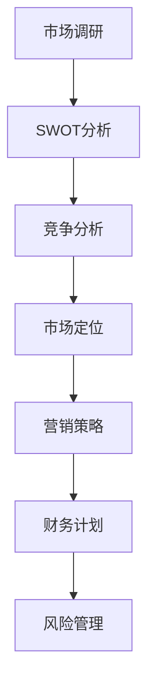
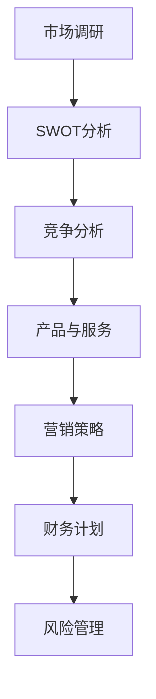
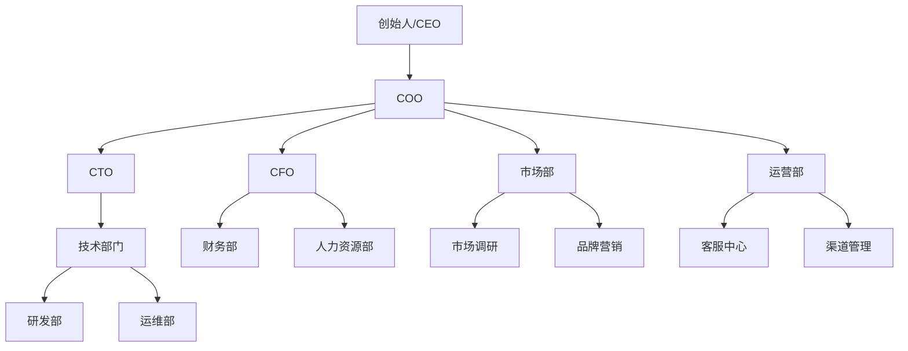
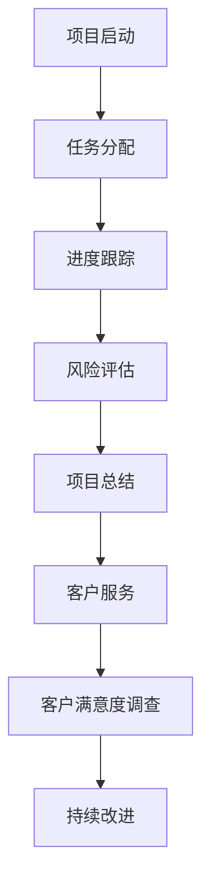

                 

### 文章标题

# 《程序员创业者的商业计划书：如何撰写吸引投资者的计划》

### 关键词

- 商业计划书
- 创业者
- 投资者
- 营销策略
- 财务计划
- 风险管理

### 摘要

本文旨在为程序员创业者提供一份详细的商业计划书撰写指南，帮助他们在吸引投资者方面取得成功。文章首先介绍了商业计划书的基本概念和撰写基础，随后深入探讨了市场研究、产品与服务介绍、营销策略、运营与管理、财务计划以及风险管理等方面的内容。此外，文章还分享了撰写商业计划书的技巧和案例分析，旨在帮助创业者撰写出具有吸引力的商业计划书，从而赢得投资者的青睐。通过本文的指导，程序员创业者将能够更好地规划其创业道路，实现商业梦想。

## 第一部分：商业计划书概述与撰写基础

### 1. 商业计划书的基本概念

#### 1.1 商业计划书的定义与作用

商业计划书是一份详细的文档，它描述了企业的愿景、目标、运营策略、财务预测以及未来发展计划。它不仅为企业内部的团队成员提供了一个共同的目标和方向，同时也是向外部投资者、合作伙伴、员工和客户展示企业价值的重要工具。

商业计划书的作用主要体现在以下几个方面：

1. **明确企业目标和战略**：商业计划书有助于企业高层领导明确企业的愿景和目标，从而制定相应的战略和计划。
2. **指导企业运营**：商业计划书为企业的日常运营提供了明确的指导和依据，有助于提高管理效率。
3. **吸引投资者**：商业计划书是创业者向潜在投资者展示项目潜力和市场前景的重要文档，能够提高融资成功的几率。
4. **评估企业绩效**：商业计划书中的财务预测和运营计划可以为企业提供一个评估其绩效的基准，帮助企业及时调整战略和方向。

#### 1.2 商业计划书的主要类型

商业计划书可以根据不同目的和用途分为以下几种类型：

1. **创业计划书**：主要面向初创企业，用于向投资者和合作伙伴展示项目的可行性和市场潜力。
2. **扩展计划书**：适用于已经运营一段时间的企业，旨在扩大业务规模、开拓新市场或引入新技术。
3. **财务计划书**：专注于企业的财务状况，包括收入预测、成本预算、利润分析和资金需求等。
4. **市场营销计划书**：重点关注企业的市场营销策略，包括市场调研、竞争对手分析、营销渠道策略和品牌建设等。
5. **管理计划书**：主要涉及企业的组织结构、管理流程、人力资源规划和日常运营等方面。

#### 1.3 商业计划书的基本结构

一个典型的商业计划书通常包括以下几个部分：

1. **封面**：包含企业名称、计划书名称、撰写日期等信息。
2. **目录**：列出商业计划书的各个章节和小节，便于读者快速定位。
3. **摘要**：简要概述商业计划书的核心内容和关键数据，使读者在短时间内了解计划书的主要亮点。
4. **公司介绍**：介绍企业的历史背景、企业文化、组织结构和核心团队。
5. **市场分析**：对目标市场进行详细调研，包括市场规模、增长趋势、竞争环境和客户需求等。
6. **产品与服务**：介绍企业的产品或服务，包括其独特性、发展历程和市场定位。
7. **营销策略**：阐述企业的市场营销策略，包括市场推广、品牌建设和销售渠道等。
8. **运营计划**：描述企业的日常运营流程、管理流程和组织结构。
9. **财务计划**：包括收入预测、成本预算、利润分析和资金需求等。
10. **风险管理**：识别企业可能面临的风险，并制定相应的应对策略。
11. **结论与建议**：总结商业计划书的核心内容，并提出未来发展的建议。
12. **附录**：包括参考文献、附件和补充资料等。

在撰写商业计划书时，创业者需要注意以下几点：

1. **逻辑清晰**：商业计划书需要条理清晰，让读者能够迅速理解企业的运营模式和市场策略。
2. **数据准确**：商业计划书中的数据需要准确可靠，避免夸大或低估企业的市场潜力和财务状况。
3. **创新性**：商业计划书应突出企业的创新点和核心竞争力，以吸引投资者的关注。
4. **可执行性**：商业计划书中的各项计划和策略需要具备可执行性，确保企业能够按照计划稳步发展。

### 2. 市场研究与竞争分析

#### 2.1 市场调研的重要性

市场调研是商业计划书的重要组成部分，它有助于企业了解目标市场的现状和趋势，从而制定出切实可行的市场策略。市场调研的重要性主要体现在以下几个方面：

1. **了解市场需求**：市场调研可以帮助企业了解潜在客户的需求和偏好，从而为企业提供定制化的产品或服务。
2. **识别竞争对手**：市场调研可以揭示竞争对手的市场份额、产品特点和营销策略，有助于企业制定有针对性的竞争策略。
3. **评估市场潜力**：通过市场调研，企业可以评估目标市场的增长潜力，为后续的市场拓展提供依据。
4. **优化产品和服务**：市场调研可以帮助企业发现产品或服务的不足，从而不断优化和改进，提升客户满意度。

#### 2.2 市场细分与目标市场定位

市场细分是指将整体市场划分为若干具有相似需求和特征的子市场，以便企业能够更有效地满足不同客户群体的需求。市场细分的关键步骤如下：

1. **识别市场细分标准**：市场细分标准通常包括地理、人口、心理和行为等多个方面。例如，年龄、性别、收入、教育程度和购买习惯等。
2. **评估市场细分效果**：企业需要评估各个市场细分群体的规模和增长潜力，确保市场细分具有实际意义。
3. **选择目标市场**：根据市场细分的结果，企业需要选择最具潜力和竞争力的目标市场，并为其制定专门的市场策略。

#### 2.3 竞争对手分析与定位

竞争对手分析是商业计划书中的关键环节，它有助于企业了解竞争对手的优势和劣势，从而制定出有效的市场定位策略。竞争对手分析主要包括以下几个步骤：

1. **识别竞争对手**：通过市场调研，找出与企业产品或服务类似的其他企业，作为竞争对手。
2. **评估竞争对手的优势和劣势**：分析竞争对手的产品特点、市场份额、营销策略、技术实力和资金状况等方面，找出其优势和劣势。
3. **定位自身市场地位**：根据竞争对手分析的结果，企业需要明确自己在市场中的地位和定位，以便制定相应的发展战略。

#### 2.4 SWOT分析

SWOT分析是一种常用的战略分析工具，用于评估企业的优势、劣势、机会和威胁。通过SWOT分析，企业可以明确自身的竞争地位，并制定出有针对性的战略计划。

1. **优势（Strengths）**：分析企业所拥有的资源、技术、品牌、市场份额等方面的优势，以及这些优势如何帮助企业在市场中脱颖而出。
2. **劣势（Weaknesses）**：识别企业在产品或服务、管理、营销、资金等方面存在的不足，以及如何克服这些劣势。
3. **机会（Opportunities）**：评估外部市场环境、政策法规、行业趋势等方面的机会，以及如何抓住这些机会促进企业发展。
4. **威胁（Threats）**：分析外部环境中的潜在威胁，如竞争对手的崛起、市场饱和、技术变革等，以及如何应对这些威胁。

### 3. 产品与服务介绍

#### 3.1 产品与服务概述

在商业计划书中，产品或服务的介绍是至关重要的部分，它需要清晰地阐述企业的产品或服务特点、功能、价值以及市场需求。以下是一个产品与服务概述的模板：

1. **产品或服务特点**：描述产品或服务的独特性、创新点和核心竞争力。
2. **功能与用途**：详细说明产品或服务的功能及其应用场景。
3. **市场定位**：分析目标市场、客户群体和竞争对手，明确产品或服务在市场中的定位。
4. **市场需求**：阐述市场需求状况，包括市场规模、增长趋势和客户需求变化等。

#### 3.2 产品或服务的独特性

产品或服务的独特性是企业竞争力的核心之一。在介绍产品或服务时，创业者需要突出以下几个方面：

1. **技术创新**：描述产品或服务所采用的新技术、新方法或新工艺，以及这些技术如何提高产品性能或降低成本。
2. **功能优势**：分析产品或服务的功能特点，如何满足客户需求，以及相较于竞争对手的优势。
3. **用户体验**：阐述产品或服务的用户体验设计，如何提升客户满意度和忠诚度。
4. **市场差异化**：分析产品或服务在市场中的差异化定位，如何吸引目标客户。

#### 3.3 产品或服务的发展历程

介绍产品或服务的发展历程，有助于投资者了解企业的成长历程和创新能力。以下是一个产品或服务发展历程的模板：

1. **初创阶段**：描述企业的初创阶段，包括产品或服务的原型开发、市场调研和团队组建等。
2. **成长阶段**：介绍产品或服务在成长阶段的研发、市场推广和客户拓展情况。
3. **成熟阶段**：阐述产品或服务在成熟阶段的运营情况，包括市场份额、收入增长和客户满意度等。
4. **未来规划**：描述企业未来的发展规划，包括产品迭代、市场拓展和技术创新等。

#### 3.4 产品或服务的市场定位

产品或服务的市场定位是商业计划书中的关键部分，它需要明确产品或服务在市场中的地位和目标客户群体。以下是一个产品或服务市场定位的模板：

1. **目标市场**：分析目标市场的规模、增长趋势和竞争状况，确定目标市场。
2. **客户群体**：描述目标客户群体的特征、需求和购买习惯，明确客户画像。
3. **市场细分**：根据客户群体的特征，进行市场细分，选择最具潜力的细分市场。
4. **市场策略**：制定针对目标市场的营销策略，包括品牌建设、市场推广和销售渠道等。

## 第二部分：撰写技巧与案例分析

### 4. 商业计划书的撰写技巧

撰写商业计划书不仅需要具备扎实的技术和行业知识，还需要掌握一定的写作技巧。以下是一些撰写商业计划书的技巧：

#### 4.1 文字表述与语言风格

1. **简洁明了**：商业计划书应避免冗长的文字，尽量用简短的句子表达核心观点。
2. **逻辑清晰**：确保文章结构严谨，条理清晰，使读者能够轻松理解。
3. **专业术语**：使用专业术语，体现企业的专业性和权威性，但要避免过度使用。
4. **情感色彩**：适当运用情感色彩，增强文章的吸引力和说服力。

#### 4.2 数据分析与应用

1. **数据来源**：确保所使用的数据来源可靠，避免使用未经证实的数据。
2. **数据分析**：对数据进行分析，提取关键信息，为商业计划书提供有力支持。
3. **图表应用**：使用图表展示数据，使数据更直观、易于理解。

#### 4.3 突出亮点与创新点

1. **技术创新**：强调企业的技术创新点，展示企业在技术领域的优势。
2. **市场前景**：分析市场前景，展示企业的市场潜力和竞争优势。
3. **商业模式**：突出企业的独特商业模式，展示企业的盈利能力。

#### 4.4 策略制定与规划

1. **市场策略**：制定切实可行的市场策略，包括品牌建设、市场推广和销售渠道等。
2. **运营规划**：描述企业的运营流程、管理流程和组织结构，确保企业能够高效运作。
3. **财务规划**：制定详细的财务规划，包括收入预测、成本预算和资金需求等。

### 5. 吸引投资者的策略

吸引投资者是商业计划书撰写的重要目标之一。以下是一些吸引投资者的策略：

#### 5.1 投资者类型与需求分析

1. **天使投资者**：关注技术创新和团队实力，注重企业的成长潜力和市场前景。
2. **风险投资者**：关注企业的盈利模式和市场份额，注重企业的市场潜力和竞争优势。
3. **私募股权投资者**：关注企业的财务状况和长期发展潜力，注重企业的稳定性和盈利能力。

#### 5.2 商业计划书的呈现技巧

1. **封面设计**：使用专业的设计软件制作封面，体现企业的品牌形象和专业性。
2. **排版布局**：采用清晰的排版布局，确保文章的可读性。
3. **图表应用**：合理使用图表，使数据更直观、易于理解。

#### 5.3 面谈与互动技巧

1. **准备充分**：在面谈前充分准备，了解投资者的背景和需求，展示企业的优势和价值。
2. **沟通技巧**：运用有效的沟通技巧，展示自信和热情，与投资者建立良好的关系。
3. **应对质疑**：准备好应对投资者可能提出的质疑，展示企业的应变能力和解决问题的能力。

#### 5.4 投资谈判与沟通

1. **明确底牌**：在谈判前明确企业的底牌，包括投资金额、股权比例和融资用途等。
2. **谈判策略**：制定合理的谈判策略，争取在投资金额、股权比例和融资条件等方面获得更多优惠。
3. **持续沟通**：在谈判过程中保持与投资者的持续沟通，及时回应投资者的疑问和需求。

### 6. 成功案例分享

以下是一些成功的商业计划书案例，以及它们吸引投资的成功经验与启示。

#### 6.1 成功商业计划书案例分析

1. **案例一**：某智能硬件初创公司通过详细的商业计划书，成功吸引了风险投资者的关注，获得了数百万美元的投资。其成功经验在于：精准的市场定位、技术创新和良好的团队背景。
2. **案例二**：某在线教育平台通过详细的商业计划书，成功吸引了私募股权投资者的关注，获得了数千万美元的投资。其成功经验在于：独特的学习模式、广泛的市场需求和强大的师资力量。

#### 6.2 吸引投资的成功经验与启示

1. **精准市场定位**：明确目标市场和客户群体，确保产品或服务能够满足市场需求。
2. **技术创新**：注重技术创新，展示企业的核心竞争力。
3. **良好的团队背景**：拥有经验丰富的团队，展示企业的运营能力和执行力。
4. **详细的财务规划**：提供详细的财务预测和预算，展示企业的盈利能力和资金需求。
5. **有效的市场推广**：制定切实可行的市场推广策略，提高企业的品牌知名度和市场份额。

#### 6.3 创业者在撰写商业计划书过程中的挑战与解决方法

1. **挑战一**：缺乏市场调研和数据分析。解决方法：进行充分的市场调研，收集准确的数据，为商业计划书提供有力支持。
2. **挑战二**：难以突出企业的独特优势。解决方法：深入了解企业所处行业，挖掘企业的核心竞争力，并在商业计划书中进行详细阐述。
3. **挑战三**：无法准确预测财务状况。解决方法：参考同行业企业的财务数据，结合自身情况，制定合理的财务预测和预算。
4. **挑战四**：缺乏撰写商业计划书的经验。解决方法：学习成功案例，掌握商业计划书的基本结构和撰写技巧，逐步提升撰写能力。

### 7. 附录

#### 7.1 常用术语解释

以下是一些在商业计划书中常用的术语及其解释：

1. **市场调研**：对目标市场进行的研究和分析，包括市场规模、增长趋势、竞争对手和客户需求等。
2. **SWOT分析**：对企业内部的优势、劣势，以及外部机会和威胁进行综合分析。
3. **市场份额**：企业在整个市场中所占的比例。
4. **品牌建设**：通过一系列策略和活动，提高企业的品牌知名度和美誉度。
5. **融资**：企业通过借款、发行股票或债券等方式筹集资金。

#### 7.2 参考文献

以下是一些在撰写商业计划书过程中可以参考的参考文献：

1. **《创业投资实战手册》**，作者：约翰·H.马库斯。
2. **《商业计划书撰写指南》**，作者：迈克尔·波特。
3. **《市场调研与预测》**，作者：菲利普·科特勒。

#### 7.3 附加资料与工具推荐

以下是一些在撰写商业计划书过程中可以使用的附加资料和工具：

1. **市场调研工具**：如Google Analytics、百度统计等。
2. **数据分析工具**：如Excel、Python等。
3. **图表制作工具**：如Visio、SmartDraw等。
4. **商业计划书模板**：如Canva、Microsoft Word等。

#### 7.4 致谢

在此，我要感谢所有为本文提供帮助和支持的人，包括我的团队成员、合作伙伴和读者。感谢你们的支持和鼓励，使我能够顺利完成本文的撰写。同时，我也要感谢所有在商业计划书撰写过程中给我提供宝贵建议和指导的人。感谢你们对我的信任和支持，使我能够在创业道路上不断前行。

作者：AI天才研究院/AI Genius Institute & 禅与计算机程序设计艺术/Zen And The Art of Computer Programming

## 完整性要求

在撰写商业计划书时，完整性是至关重要的。一个完整、详细的商业计划书不仅能帮助创业者理清思路，还能给投资者留下深刻的印象。以下是确保商业计划书完整性的几个关键点：

### 背景介绍

商业计划书的背景介绍部分应包括以下内容：

1. **企业成立背景**：简述企业的成立背景，包括创始团队的组建、企业愿景和使命等。
2. **市场环境**：分析当前市场的趋势、政策环境以及行业动态，为投资者展示企业的市场环境。
3. **竞争优势**：介绍企业独特的竞争优势，如技术创新、独特的产品特性、高效的运营模式等。

### 核心概念与联系

在商业计划书中，核心概念与联系部分是至关重要的。这部分应包括以下内容：

1. **核心概念**：明确商业计划书中的核心概念，如市场调研、SWOT分析、财务预测等。
2. **概念联系**：通过Mermaid流程图或文字描述，展示各个核心概念之间的联系和相互作用。

以下是一个示例的Mermaid流程图：



### 核心算法原理讲解

商业计划书中的核心算法原理讲解应包括以下内容：

1. **算法简介**：简要介绍算法的基本概念和用途。
2. **伪代码讲解**：使用伪代码详细阐述算法的实现过程，确保读者能够理解算法的核心逻辑。

以下是一个示例的伪代码：

```plaintext
Function MarketAnalysis(data):
  for each segment in data:
    Calculate MarketSize(segment)
    Calculate GrowthRate(segment)
    Calculate CompetitorShare(segment)
  return MarketAnalysisResults
```

### 数学模型和公式

商业计划书中可能需要用到数学模型和公式来支持论证。这些公式应包括以下内容：

1. **公式含义**：明确公式的含义和用途。
2. **公式推导**：详细推导公式，展示数学推理过程。
3. **公式应用**：通过具体例子说明公式的应用和效果。

以下是一个示例的LaTeX公式：

```latex
\begin{equation}
\text{Cost} = \text{FixedCost} + \text{VariableCost} \cdot \text{Quantity}
\end{equation}
```

### 项目实战

商业计划书中的项目实战部分应包括以下内容：

1. **开发环境搭建**：详细描述项目的开发环境搭建过程，包括所需工具和技术的选择。
2. **源代码实现**：提供项目源代码，并进行详细解读。
3. **代码应用解读**：分析代码的应用场景和实际效果。
4. **案例分析**：通过实际案例展示项目的成功应用。
5. **项目小结**：总结项目的实施过程和成果，提出改进建议。

### 最佳实践 tips、小结、注意事项、拓展阅读等内容

在商业计划书的最后，可以加入以下内容：

1. **最佳实践 tips**：提供一些实用的建议和技巧，帮助投资者和企业更好地执行计划。
2. **小结**：对商业计划书的主要内容进行总结，强调关键点。
3. **注意事项**：提醒投资者和团队成员在执行计划过程中需要注意的事项。
4. **拓展阅读**：推荐一些相关书籍、文章和网站，供读者进一步了解相关主题。

通过以上几个方面的详细讲解，创业者能够确保商业计划书的完整性，使其更具说服力和可执行性。这不仅有助于吸引投资者的关注，还能为企业的未来发展提供有力支持。

## 完整性要求：具体案例分析

为了更好地展示商业计划书的完整性，以下我们将通过一个具体的商业计划书案例进行分析，详细讲解其各个部分的内容和结构。

### 案例背景介绍

假设这是一个关于智能家庭安防系统的商业计划书。企业成立于2020年，由一群具有多年安防领域经验的工程师和产品经理共同创立。企业愿景是打造一套智能、便捷、安全的家庭安防系统，为用户提供全方位的家庭安全保障。

#### 市场环境分析

市场调研显示，随着城市化进程的加速和居民安全意识的提高，智能家居市场规模逐年增长。尤其是家庭安防系统，需求量大幅上升。政策层面，政府对智慧城市建设的大力支持，也为企业提供了良好的发展机遇。

#### 竞争分析

当前市场上，主要的竞争对手包括几家大型安防企业和一些新兴的智能家居公司。然而，这些公司大多集中于提供传统的安防产品，智能化程度不高。我们的产品则通过物联网技术和人工智能算法，实现智能监控、智能报警和远程控制，具有显著的技术优势。

#### SWOT分析

- **优势**：技术创新、产品智能化程度高、用户体验好。
- **劣势**：市场知名度不高、资金和资源有限。
- **机会**：智能家居市场快速增长、政策支持。
- **威胁**：竞争对手多、市场竞争激烈。

### 核心概念与联系

以下是一个示例的Mermaid流程图，展示了商业计划书中的核心概念及其相互关系：



### 核心算法原理讲解

商业计划书中涉及到的一个核心算法是智能家居系统的智能监控算法。该算法通过分析摄像头采集的视频数据，实现实时监控和异常检测。

#### 伪代码讲解

```plaintext
Function IntelligentMonitoring(videoData):
  for each frame in videoData:
    Extract Features(frame)
    Compare Features(frame) with Historical Data
    if Anomaly Detected(frame):
      Trigger Alarm()
  return MonitoringResult
```

### 数学模型和公式

在财务计划部分，使用了以下数学模型进行收入预测：

```latex
\begin{equation}
\text{Revenue}_{\text{next year}} = \text{Current Revenue} \times (1 + \text{Growth Rate})
\end{equation}
```

### 项目实战

在项目实战部分，详细描述了开发环境搭建、源代码实现和代码解读。以下是一个简化的代码片段：

```python
# 智能监控算法实现
def detect_motion(frame):
    gray_frame = cv2.cvtColor(frame, cv2.COLOR_BGR2GRAY)
    blurred_frame = cv2.GaussianBlur(gray_frame, (21, 21), 0)
    frameDelta = cv2.absdiff(prev_frame, blurred_frame)
    thresholded_frame = cv2.threshold(frameDelta, 25, 255, cv2.THRESH_BINARY)[1]
    contours, _ = cv2.findContours(thresholded_frame, cv2.RETR_EXTERNAL, cv2.CHAIN_APPROX_SIMPLE)
    
    for contour in contours:
        if cv2.contourArea(contour) > 500:
            cv2.drawContours(frame, [contour], -1, (0, 0, 255), 3)
    
    return frame

# 主程序
prev_frame = None
while True:
    ret, frame = cap.read()
    if prev_frame is None:
        prev_frame = frame
        continue
    
    frame = detect_motion(frame)
    cv2.imshow('Frame', frame)
    if cv2.waitKey(1) & 0xFF == ord('q'):
        break
    
cap.release()
cv2.destroyAllWindows()
```

### 最佳实践 tips、小结、注意事项、拓展阅读等内容

在项目小结部分，提供了一些最佳实践建议，如定期更新软件、保持与用户的沟通、关注市场动态等。同时，对商业计划书的内容进行了总结，并提醒团队成员在执行计划过程中需要注意的事项，如财务预算的严格控制、技术创新的持续投入等。

拓展阅读部分，推荐了以下几本书籍和文章：

- **书籍**：《智能监控系统设计与应用》、《智能家居系统开发实战》。
- **文章**：多家权威技术媒体关于智能家居和安防系统的最新研究成果。

通过上述案例分析，我们可以看到，一个完整、详细的商业计划书需要包括背景介绍、核心概念与联系、核心算法原理讲解、数学模型和公式、项目实战、最佳实践 tips、小结、注意事项和拓展阅读等内容。这些部分相互关联，共同构成了一个完整、系统的商业计划书，为投资者提供了全面、深入的了解。

## 第二部分总结

第二部分主要介绍了商业计划书的撰写基础，包括商业计划书的基本概念、市场研究与竞争分析、产品与服务介绍以及撰写技巧等内容。这些内容构成了商业计划书的核心框架，为创业者提供了全面的指导。

在商业计划书的基本概念部分，我们详细阐述了商业计划书的定义、作用和主要类型，帮助创业者理解商业计划书的重要性。同时，我们还介绍了商业计划书的基本结构，包括封面、目录、摘要、公司介绍、市场分析、产品与服务介绍、营销策略、运营计划、财务计划和风险管理等部分。

在市场研究与竞争分析部分，我们重点介绍了市场调研的重要性、市场细分与目标市场定位、竞争对手分析和SWOT分析等内容。这些内容帮助创业者深入了解市场环境和竞争态势，为制定有效的市场策略提供依据。

在产品与服务介绍部分，我们详细阐述了产品与服务概述、独特性、发展历程和市场定位等内容。这部分内容帮助创业者清晰地展示产品的特点和市场竞争力，吸引投资者的关注。

在撰写技巧部分，我们提供了一些撰写商业计划书的实用技巧，如文字表述与语言风格、数据分析与应用、突出亮点与创新点、策略制定与规划等。这些技巧帮助创业者提升商业计划书的质量和吸引力。

总的来说，第二部分的内容为创业者提供了全面的商业计划书撰写指导，帮助他们更好地规划创业道路，提高融资成功率。接下来，我们将继续探讨商业计划书的第三部分，即运营与管理。

### 运营与管理

运营与管理是商业计划书的核心组成部分，它不仅体现了企业的日常运营能力，还展示了企业的管理水平和团队协作能力。一个有效的运营与管理计划有助于确保企业的稳定发展，提升运营效率，同时也能够增强投资者对企业未来前景的信心。以下是关于运营与管理的详细探讨。

#### 5.1 公司组织结构

公司的组织结构是确保企业正常运营的基础。一个清晰、合理的组织结构能够明确各部门的职责和权限，提高工作效率。以下是一个典型的公司组织结构示例：



在这个组织结构中，创始人或CEO负责整体战略规划和决策，COO负责日常运营管理，CTO负责技术方向和研发，CFO负责财务规划和管理，市场部负责市场营销和品牌建设，运营部负责日常运营和客户服务。

#### 5.2 团队成员介绍

团队成员是公司运营的核心力量。在商业计划书中，应详细介绍核心团队成员的背景、职责和专业能力。以下是一个团队成员介绍的示例：

- **创始人兼CEO**：具有10年的创业经验，曾在多家知名科技公司担任高管，擅长战略规划和团队管理。
- **首席技术官（CTO）**：拥有计算机科学博士学位，曾在多家顶尖科技公司担任技术负责人，擅长技术创新和项目管理。
- **首席运营官（COO）**：拥有丰富的企业管理经验，擅长运营策略和流程优化。
- **财务总监（CFO）**：拥有财务硕士学位，擅长财务规划和风险管理。
- **市场营销总监**：拥有市场营销硕士学位，擅长市场调研和品牌建设。
- **研发团队成员**：具有丰富的软件开发经验，擅长人工智能和物联网技术的应用。
- **客服经理**：拥有多年客户服务经验，擅长客户关系管理和客户满意度提升。

通过介绍团队成员的背景和职责，投资者可以了解企业的核心团队构成，评估其专业能力和执行力。

#### 5.3 管理流程

管理流程是企业运营的指南针，它规定了企业各项工作的执行步骤和标准。以下是企业管理流程的几个关键环节：

1. **项目管理**：明确项目的目标、任务分配、进度跟踪和风险评估，确保项目按时完成。
2. **质量控制**：建立质量控制体系，确保产品或服务的质量符合标准，提升客户满意度。
3. **财务控制**：通过预算管理、成本控制和财务分析，确保企业的财务状况健康稳定。
4. **人力资源管理**：制定招聘、培训、绩效评估和激励制度，确保团队的高效运作和持续发展。
5. **客户服务**：建立客户服务体系，确保客户问题得到及时解决，提升客户体验和忠诚度。

以下是一个管理流程的示例：



#### 5.4 日常运营与管理

日常运营与管理是企业长期稳定发展的关键。以下是一些日常运营与管理的要点：

1. **日常任务管理**：制定每日、每周和每月的任务清单，确保各项工作有序进行。
2. **团队协作**：利用协同工具（如Slack、Trello等）提高团队协作效率，确保信息畅通和任务分配清晰。
3. **绩效评估**：定期对团队成员进行绩效评估，激励优秀员工，改进不足。
4. **培训与发展**：定期组织培训活动，提升员工的专业能力和综合素质。
5. **风险管理**：建立风险管理体系，识别潜在风险，制定应对策略，确保企业的稳定运营。

通过以上内容，我们可以看到，运营与管理不仅是商业计划书的重要组成部分，也是企业成功运营的基石。一个高效的运营与管理体系，能够确保企业稳步发展，提高市场竞争力，赢得投资者的信任和支持。

### 财务计划

财务计划是商业计划书中至关重要的一环，它不仅反映了企业的财务状况和盈利能力，还为投资者提供了对企业未来发展的信心。在撰写财务计划时，创业者需要详细阐述收入预测、成本预算、利润分析和资金需求等内容，以确保财务计划的可行性和吸引力。

#### 6.1 收入预测

收入预测是企业未来财务状况的重要依据，它基于市场调研和产品或服务的特点，对企业的预期收入进行合理估算。以下是一个收入预测的步骤：

1. **确定收入来源**：分析企业的产品或服务，确定主要的收入来源，如销售产品、提供服务、广告收入等。
2. **历史数据分析**：参考企业过去的收入数据，结合市场发展趋势，对未来的收入进行预测。
3. **市场规模预测**：根据市场调研结果，预测目标市场的规模和增长趋势，为收入预测提供依据。
4. **计算收入预测**：将以上数据综合起来，计算未来几年的收入预测。

以下是一个简化的收入预测示例：

| 年份 | 销售收入（万元） | 服务收入（万元） | 广告收入（万元） | 总收入（万元） |
|------|------------------|------------------|------------------|----------------|
| 2023 | 500              | 200              | 100              | 800            |
| 2024 | 700              | 250              | 120              | 1050           |
| 2025 | 900              | 300              | 150              | 1350           |

#### 6.2 成本预算

成本预算是收入预测的对应部分，它涵盖了企业在运营过程中可能发生的所有费用。以下是一个成本预算的步骤：

1. **确定成本类型**：分析企业的运营成本，包括固定成本和变动成本。
2. **估算成本金额**：根据市场行情和历史数据，对各项成本进行估算。
3. **计算成本总额**：将各项成本相加，得出总成本预算。

以下是一个简化的成本预算示例：

| 年份 | 固定成本（万元） | 变动成本（万元） | 总成本（万元） |
|------|------------------|------------------|----------------|
| 2023 | 200              | 300              | 500            |
| 2024 | 220              | 320              | 540            |
| 2025 | 240              | 340              | 580            |

#### 6.3 利润分析

利润分析是对企业收入和成本的进一步分析，旨在计算企业的净利润。以下是一个利润分析的步骤：

1. **计算毛利润**：毛利润=总收入-总成本。
2. **计算运营利润**：运营利润=毛利润-运营费用。
3. **计算净利润**：净利润=运营利润-税金和其他费用。

以下是一个简化的利润分析示例：

| 年份 | 总收入（万元） | 总成本（万元） | 毛利润（万元） | 运营费用（万元） | 运营利润（万元） | 税金和其他费用（万元） | 净利润（万元） |
|------|------------------|------------------|------------------|------------------|------------------|-------------------------|------------------|
| 2023 | 800              | 500              | 300              | 100              | 200              | 50                      | 150              |
| 2024 | 1050             | 540              | 510              | 120              | 390              | 70                      | 320              |
| 2025 | 1350             | 580              | 770              | 140              | 630              | 100                     | 530              |

#### 6.4 资金需求与融资计划

资金需求与融资计划是商业计划书中最具吸引力的部分之一，它展示了企业对资金的预期需求以及如何筹集这些资金。以下是一个资金需求与融资计划的步骤：

1. **确定资金需求**：根据收入预测和成本预算，计算企业在不同阶段的资金需求。
2. **选择融资方式**：分析各种融资方式的优缺点，选择最适合企业的融资方式，如天使投资、风险投资、私募股权融资等。
3. **制定融资计划**：明确融资目标、融资时间表和融资用途。

以下是一个简化的资金需求与融资计划示例：

| 阶段 | 资金需求（万元） | 融资方式 | 融资时间 | 融资用途 |
|------|------------------|-----------|-----------|-----------|
| 初创期 | 500              | 天使投资  | 2023年    | 产品研发、团队建设 |
| 扩张期 | 1000             | 风险投资  | 2024年    | 市场推广、技术迭代 |
| 成长期 | 1500             | 私募股权融资 | 2025年    | 扩大生产、市场拓展 |

通过详细的财务计划，创业者不仅能够展示企业的财务健康状况和盈利能力，还能增强投资者对企业的信心，提高融资成功率。财务计划应具备透明性、可行性和吸引力，确保投资者能够全面了解企业的财务状况和未来发展方向。

### 风险管理

在商业计划书中，风险管理是一个不可或缺的组成部分。企业面临着各种各样的风险，包括市场风险、财务风险、技术风险和运营风险等。有效的风险管理能够帮助企业识别潜在风险，制定应对策略，降低风险带来的负面影响，从而确保企业的稳定发展和长期成功。

#### 7.1 风险识别

风险识别是风险管理的第一步，旨在识别企业可能面临的各种风险。以下是一些常见的风险类型：

1. **市场风险**：包括市场需求变化、竞争加剧、行业政策变动等。
2. **财务风险**：包括资金链断裂、财务状况恶化、投资回报不达预期等。
3. **技术风险**：包括技术更新换代、技术漏洞、知识产权侵权等。
4. **运营风险**：包括供应链中断、生产故障、管理失误等。

为了有效识别风险，企业可以采取以下步骤：

1. **内部审计**：定期进行内部审计，评估企业运营中的潜在风险。
2. **问卷调查**：通过问卷调查，收集员工和管理层的意见和建议，识别潜在风险。
3. **外部评估**：聘请第三方专业机构进行风险评估，获取客观、全面的评估结果。

#### 7.2 风险评估

风险评估是对识别出的风险进行量化评估，确定其影响程度和发生概率，以便制定相应的应对策略。以下是一些风险评估的方法：

1. **定性分析**：通过专家访谈、头脑风暴等方式，对风险的影响程度和发生概率进行定性分析。
2. **定量分析**：使用数学模型和统计分析方法，对风险的影响程度和发生概率进行定量分析。
3. **综合评估**：将定性分析和定量分析相结合，得出综合风险评估结果。

以下是一个简化的风险评估示例：

| 风险类型 | 影响程度 | 发生概率 | 风险等级 |
|-----------|-----------|-----------|-----------|
| 市场风险   | 高        | 中        | 高        |
| 财务风险   | 中        | 低        | 中        |
| 技术风险   | 高        | 中        | 高        |
| 运营风险   | 低        | 中        | 中        |

#### 7.3 风险应对策略

在评估风险后，企业需要制定相应的风险应对策略，以降低风险带来的负面影响。以下是一些常见的风险应对策略：

1. **风险规避**：通过调整业务策略，避免高风险业务，降低风险暴露。
2. **风险减轻**：通过改进技术、优化流程、增加保险等措施，减轻风险的影响程度。
3. **风险转移**：通过购买保险、签订合同等方式，将风险转移给第三方。
4. **风险接受**：在风险较低或风险可接受时，选择接受风险，并制定应急计划。

以下是一个简化的风险应对策略示例：

| 风险类型 | 风险应对策略 |
|-----------|--------------|
| 市场风险   | 调整市场策略，开拓新市场 |
| 财务风险   | 提高资金管理水平，确保资金链稳定 |
| 技术风险   | 加强技术研发，保持技术领先地位 |
| 运营风险   | 优化生产流程，确保供应链稳定 |

#### 7.4 应急计划

应急计划是在风险发生时，企业迅速响应、降低损失的有效手段。以下是一个简化的应急计划示例：

1. **应急响应团队**：成立应急响应团队，负责应急计划的执行和管理。
2. **应急预案**：制定详细的应急预案，包括应急响应流程、应急资源调配、应急演练等。
3. **应急演练**：定期进行应急演练，检验应急预案的可行性和有效性。
4. **信息沟通**：建立信息沟通机制，确保在应急情况下，内部和外部信息畅通。

通过全面的风险管理和应急计划，企业能够有效降低风险，确保业务的连续性和稳定性，从而实现长期发展。

### 总结

在商业计划书的撰写过程中，运营与管理、财务计划、风险管理的章节是至关重要的。运营与管理部分展示了企业的日常运营能力和团队协作能力；财务计划部分则反映了企业的财务健康状况和盈利能力；风险管理部分则确保了企业的稳定发展和长期成功。

通过以上内容的详细阐述，创业者能够撰写出一份完整、详细的商业计划书，不仅能够清晰地展示企业的运营状况和财务状况，还能够增强投资者对企业的信心，提高融资成功率。接下来，我们将探讨商业计划书的撰写技巧与案例分析，帮助创业者更好地撰写出具有吸引力的商业计划书。

### 撰写技巧与案例分析

在商业计划书的撰写过程中，掌握一定的技巧和策略是至关重要的，这不仅能够提高商业计划书的整体质量，还能够增强其吸引力，从而提高融资成功率。以下是一些实用的撰写技巧和案例分析，供创业者参考。

#### 8.1 文字表述与语言风格

文字表述和语言风格是商业计划书的第一印象。以下是一些建议：

1. **简洁明了**：避免使用冗长、复杂的句子，尽量使用简单、直接的语言，使读者易于理解。
2. **逻辑清晰**：确保文章结构合理，条理清晰，段落之间逻辑连贯，帮助读者快速抓住核心内容。
3. **专业术语**：适当使用专业术语，体现企业的专业性和权威性，但要避免过度使用，以免造成阅读障碍。
4. **情感色彩**：在适当的地方加入情感色彩，如通过激励性的语言激发读者的兴趣和信心。

#### 8.2 数据分析与应用

数据分析在商业计划书中起着至关重要的作用。以下是一些建议：

1. **数据来源**：确保数据来源可靠，避免使用未经证实的数据。引用权威数据源，如政府报告、行业研究等。
2. **数据准确性**：确保数据的准确性，避免因数据错误导致商业计划书的可信度降低。
3. **图表应用**：使用图表展示数据，使数据更直观、易于理解。选择合适的图表类型，如柱状图、折线图、饼图等。
4. **数据分析**：对数据进行分析，提取关键信息，为商业计划书提供有力支持。通过数据展示企业的市场潜力、竞争优势等。

以下是一个数据分析的应用示例：

**图表标题**：2023-2025年智能家居市场规模预测


#### 8.3 突出亮点与创新点

在商业计划书中，突出企业的亮点和创新点是吸引投资者的重要手段。以下是一些建议：

1. **技术创新**：强调企业的技术创新点，如独特的技术方案、先进的技术应用等，展示企业的核心竞争力。
2. **市场前景**：分析市场前景，展示企业的市场潜力和竞争优势，如快速增长的行业趋势、广阔的市场需求等。
3. **商业模式**：突出企业的独特商业模式，如创新的盈利模式、高效的市场推广策略等，展示企业的盈利能力。
4. **团队优势**：介绍企业的核心团队成员，展示其专业能力和成功经验，增强投资者的信心。

以下是一个突出创新点的示例：

**标题**：智能家庭安防系统的创新点

**正文**：
“我们的智能家庭安防系统采用了最新的物联网技术和人工智能算法，实现了智能监控、智能报警和远程控制。通过实时监控和分析家庭环境，系统可以自动识别异常情况，并在第一时间通知用户。此外，我们的系统还具有远程控制功能，用户可以通过手机APP随时查看家庭安全状况，并进行远程操作。”

#### 8.4 策略制定与规划

在商业计划书中，策略制定和规划部分是展示企业未来发展计划的重要部分。以下是一些建议：

1. **市场策略**：制定详细的市场推广策略，包括品牌建设、市场推广、销售渠道等。通过数据分析和市场调研，确定目标市场和客户群体，制定有针对性的市场策略。
2. **运营规划**：描述企业的日常运营流程、管理流程和组织结构。确保企业能够高效运作，并提供优质的产品或服务。
3. **财务规划**：制定详细的财务规划，包括收入预测、成本预算、利润分析和资金需求等。通过合理的财务规划，展示企业的财务健康状况和盈利能力。

以下是一个策略制定与规划的示例：

**标题**：市场推广策略

**正文**：
“我们将通过线上线下多渠道推广我们的智能家庭安防系统。在线上，我们将通过社交媒体、官方网站和电子商务平台进行宣传和推广。在线下，我们将与家居装修公司、物业公司等合作，通过安装服务和广告投放提高品牌知名度。同时，我们还将定期举办产品发布会和用户研讨会，加强与客户的互动和沟通。”

#### 8.5 案例分析

以下是一个成功的商业计划书案例分析，供创业者参考：

**案例**：某智能家居公司通过详细的商业计划书成功吸引了风险投资者的关注，获得了数百万美元的投资。

**成功经验**：
1. **精准市场定位**：公司通过市场调研，明确了目标市场为高端家庭安防市场，并针对性地推出了高性能、高性价比的智能安防产品。
2. **技术创新**：公司拥有多项专利技术，如智能监控算法和远程控制技术，提升了产品的竞争力。
3. **高效的团队**：公司团队由经验丰富的工程师和市场营销专家组成，确保了产品开发和市场推广的高效执行。
4. **详细的财务规划**：公司提供了详细的财务预测和预算，展示了良好的盈利能力和资金需求。

**启示**：
创业者可以从该案例中学习到，精准的市场定位、技术创新、高效团队和详细的财务规划是吸引投资者的重要因素。在撰写商业计划书时，要充分展示这些亮点，增强投资者的信心。

通过以上撰写技巧和案例分析，创业者可以更好地撰写出具有吸引力、高质量的商业计划书，提高融资成功率。撰写商业计划书不仅是一种技能，更是一种艺术，需要不断地学习和实践，才能不断提升撰写水平。

### 吸引投资者的策略

吸引投资者是商业计划书撰写成功的关键一步。投资者对商业计划书的第一印象往往决定了他们是否愿意进一步了解项目。以下是一些有效的策略，帮助创业者撰写出能够吸引投资者的商业计划书。

#### 9.1 投资者类型与需求分析

投资者类型可以分为以下几类：

1. **天使投资者**：通常对初创企业感兴趣，关注技术创新和团队潜力。
2. **风险投资者**：对高增长潜力的企业感兴趣，注重市场前景和竞争优势。
3. **私募股权投资者**：关注企业的稳定性和长期盈利能力。
4. **家族办公室**：倾向于投资长期项目，注重企业的可持续发展。

了解投资者类型有助于创业者根据不同投资者的需求撰写商业计划书。以下是一些针对不同类型投资者的策略：

1. **天使投资者**：强调技术创新和团队背景，展示项目的潜力和可行性。
2. **风险投资者**：突出市场潜力、竞争优势和财务预测，展示企业的高增长潜力。
3. **私募股权投资者**：详细阐述企业的盈利模式、市场地位和长期发展规划。
4. **家族办公室**：提供详细的财务数据和风险控制措施，展示企业的稳定性和可持续发展能力。

#### 9.2 商业计划书的呈现技巧

商业计划书的呈现技巧至关重要，以下是一些建议：

1. **封面设计**：使用专业的设计软件制作封面，体现企业的品牌形象和专业性。
2. **排版布局**：采用清晰的排版布局，确保文章的可读性。使用适当的标题、子标题和段落分隔，使内容结构清晰。
3. **图表应用**：合理使用图表，如柱状图、折线图、饼图等，使数据更直观、易于理解。图表应配有简短的文字说明，帮助读者快速理解数据含义。
4. **色彩和字体**：选择适当的色彩和字体，使商业计划书看起来专业且易于阅读。避免使用过于花哨的色彩和复杂的字体，以免分散读者的注意力。
5. **摘要和目录**：撰写简明扼要的摘要，突出商业计划书的核心内容和亮点。确保目录清晰、准确，便于读者快速查找所需信息。

#### 9.3 面谈与互动技巧

面谈是商业计划书撰写成功后的关键一步。以下是一些面谈与互动技巧：

1. **准备充分**：在面谈前充分准备，了解投资者的背景、需求和兴趣点。准备好详细的数据、图表和幻灯片，以便在面谈中展示。
2. **自信表达**：在面谈中保持自信，清晰地表达自己的观点和想法。使用简洁明了的语言，避免使用过多的专业术语。
3. **倾听与互动**：在面谈中，倾听投资者的问题和意见，积极回应，展示对投资者关注点的重视。通过提问和互动，了解投资者的需求和期望。
4. **应对质疑**：准备好应对投资者可能提出的质疑，如市场风险、竞争态势、财务预测等。展示企业的应变能力和解决问题的能力。
5. **展示数据**：通过数据和事实支持自己的观点，使投资者对企业的数据和预测有更深的信任。

以下是一个示例的应对质疑的策略：

**投资者质疑**：我们的竞争对手非常强大，你们如何应对？

**回应**：我们的产品在技术上具有显著优势，特别是在智能监控算法和远程控制方面。此外，我们已与多家供应链合作伙伴建立了稳固的关系，确保我们在市场上的竞争力。我们已经成功地完成了几个试点项目，客户反馈良好，这进一步证明了我们的技术优势和市场需求。

#### 9.4 投资谈判与沟通

在谈判过程中，以下是一些建议：

1. **明确底牌**：在谈判前明确企业的底牌，包括投资金额、股权比例、融资用途等。了解投资者的出价和谈判底线，确保在谈判中保持灵活性。
2. **谈判策略**：制定合理的谈判策略，如在某些条款上做出让步，以换取在其他重要条款上的利益。
3. **持续沟通**：在谈判过程中保持与投资者的持续沟通，及时回应投资者的疑问和需求。通过沟通，建立信任关系，提高谈判成功率。
4. **达成共识**：在谈判过程中，努力达成共识，确保双方在关键条款上达成一致。在签署投资协议前，仔细审查协议内容，确保企业的利益不受损害。

以下是一个谈判过程中的示例：

**投资者提出**：我们可以提供500万美元的投资，但要求20%的股权。

**回应**：感谢您的投资意向。我们认为，20%的股权比例相对较高，可能会影响企业的运营和管理。我们希望能够降低股权比例，比如15%。同时，我们可以在其他条款上做出一些让步，如减少投资前的审计费用。我们相信，通过双方的努力，我们可以达成一个双赢的协议。

通过以上策略和技巧，创业者可以撰写出具有吸引力的商业计划书，并在面谈和谈判中赢得投资者的信任和支持，从而提高融资成功率。

### 成功案例分享

在撰写商业计划书的过程中，学习和借鉴成功案例是提高撰写质量的有效途径。以下是一些成功的商业计划书案例，以及它们吸引投资的成功经验与启示。

#### 10.1 成功商业计划书案例分析

**案例一：滴滴出行的商业计划书**

滴滴出行通过详细的商业计划书成功吸引了多家风险投资者的关注，并在短短几年内迅速成长为全球最大的移动出行平台。滴滴出行的商业计划书成功之处在于：

1. **精准市场定位**：滴滴出行在商业计划书中明确了目标市场为城市移动出行服务，针对不同用户群体推出了多种服务模式，如快车、专车、出租车等。
2. **技术创新**：滴滴出行在商业计划书中详细介绍了其智能派单算法和大数据分析技术，展示了其技术优势和核心竞争力。
3. **财务预测**：滴滴出行提供了详细的财务预测，包括收入增长、成本控制和利润率等，展示了其良好的盈利能力。
4. **市场推广策略**：滴滴出行在商业计划书中制定了全面的市场推广策略，包括广告投放、用户补贴和合作伙伴关系等。

**启示**：精准的市场定位、技术创新、详细的财务预测和有效的市场推广策略是吸引投资者的重要因素。

**案例二：字节跳动的商业计划书**

字节跳动通过其商业计划书成功吸引了大量风险投资，迅速成长为全球领先的科技公司。字节跳动的商业计划书成功之处在于：

1. **多元化产品线**：字节跳动在商业计划书中展示了其多元化的产品线，包括抖音、今日头条、懂车帝等，展示了其强大的产品创新能力。
2. **用户增长策略**：字节跳动在商业计划书中详细介绍了其用户增长策略，包括内容推荐算法、用户互动设计和跨平台推广等。
3. **品牌建设**：字节跳动在商业计划书中强调了其品牌建设和用户体验，展示了其强大的品牌影响力和用户忠诚度。
4. **国际化战略**：字节跳动在商业计划书中提出了国际化战略，展示了其全球市场扩展的潜力。

**启示**：多元化产品线、有效的用户增长策略、品牌建设和国际化战略是吸引投资者的重要因素。

**案例三：小米的商业计划书**

小米通过其商业计划书成功吸引了大量投资者，并在短时间内成为全球知名的高科技企业。小米的商业计划书成功之处在于：

1. **创新的产品设计**：小米在商业计划书中展示了其创新的产品设计，包括智能手机、智能家居设备和可穿戴设备等，展示了其强大的研发能力。
2. **直销模式**：小米在商业计划书中介绍了其直销模式，通过线上销售和粉丝营销，提高了品牌知名度和用户忠诚度。
3. **成本控制**：小米在商业计划书中详细介绍了其成本控制策略，通过优化供应链管理和降低生产成本，提高了利润率。
4. **用户反馈机制**：小米在商业计划书中强调了其用户反馈机制，通过用户反馈不断优化产品和服务，提升了用户体验。

**启示**：创新的产品设计、有效的直销模式、成本控制和用户反馈机制是吸引投资者的重要因素。

#### 10.2 吸引投资的成功经验与启示

通过以上成功案例，我们可以总结出以下吸引投资的成功经验与启示：

1. **精准市场定位**：明确目标市场和客户群体，确保产品或服务能够满足市场需求。
2. **技术创新**：注重技术创新，展示企业的核心竞争力，吸引投资者的关注。
3. **详细的财务预测**：提供详细的财务预测和预算，展示企业的盈利能力和资金需求，增强投资者的信心。
4. **有效的市场推广策略**：制定切实可行的市场推广策略，提高企业的品牌知名度和市场份额。
5. **多元化产品线**：通过多元化产品线展示企业的创新能力，提高企业的竞争力和市场扩展能力。
6. **用户增长策略**：重视用户增长，通过用户互动、内容推荐和跨平台推广等手段，提升用户忠诚度和市场份额。
7. **品牌建设**：通过品牌建设和用户体验，提升企业的品牌影响力和用户忠诚度。
8. **国际化战略**：展示企业的国际化潜力，吸引全球投资者的关注。

通过学习和借鉴这些成功经验，创业者可以更好地撰写出具有吸引力的商业计划书，提高融资成功率，实现企业的快速发展。

### 创业者在撰写商业计划书过程中的挑战与解决方法

在撰写商业计划书的整个过程中，创业者往往会遇到各种挑战。以下是一些常见的挑战以及相应的解决方法，帮助创业者克服这些困难，提高商业计划书的撰写质量。

#### 11.1 缺乏市场调研

**挑战**：很多创业者由于资源和时间的限制，无法进行充分的市场调研，导致商业计划书中的市场分析部分缺乏可信度和深度。

**解决方法**：

1. **利用免费资源**：利用免费的在线工具和市场研究报告，如Google Trends、行业报告等，获取市场数据和信息。
2. **合作与咨询**：与市场研究公司、行业协会、大学研究中心等合作，获取专业的市场调研报告和咨询服务。
3. **用户访谈**：通过与潜在用户进行面对面访谈或在线调查，直接了解用户需求和痛点。

#### 11.2 难以突出企业的独特优势

**挑战**：很多创业者难以准确识别和表述企业的独特优势，导致商业计划书在竞争中缺乏亮点。

**解决方法**：

1. **内部讨论**：组织团队成员进行头脑风暴，讨论企业的核心竞争力、技术创新点和市场差异化策略。
2. **用户反馈**：收集现有用户和客户的反馈，了解他们对产品或服务的评价和期望，识别企业的优势。
3. **竞品分析**：研究竞争对手的产品或服务，找出自己的独特之处和竞争优势。

#### 11.3 无法准确预测财务状况

**挑战**：创业者往往在财务预测方面缺乏经验，导致预测不准确，影响商业计划书的可信度。

**解决方法**：

1. **咨询财务专家**：聘请专业的财务顾问或会计师，进行财务分析和预测，确保财务数据的准确性和可靠性。
2. **历史数据参考**：参考同行业企业的财务数据和市场趋势，结合自身情况，制定合理的财务预测。
3. **敏感度分析**：进行敏感性分析，评估不同情况下财务预测的变化，提高预测的稳健性。

#### 11.4 缺乏撰写商业计划书的经验

**挑战**：很多创业者由于缺乏商业计划书撰写的经验，导致商业计划书结构混乱、逻辑不清。

**解决方法**：

1. **学习优秀案例**：学习和研究成功的商业计划书案例，了解其结构和内容，借鉴其中的写作技巧。
2. **请教专业人士**：向创业导师、投资人、专业顾问等请教，获取撰写商业计划书的建议和指导。
3. **多次修改与完善**：在撰写过程中，不断修改和完善，确保商业计划书的逻辑清晰、内容完整。

通过上述解决方法，创业者可以有效地克服撰写商业计划书过程中遇到的挑战，提高商业计划书的质量和吸引力，从而提高融资成功率。

### 附录

在商业计划书撰写过程中，附录部分提供了重要的补充信息，如常用术语解释、参考文献、附加资料和工具推荐等。以下是附录的具体内容。

#### 11.1 常用术语解释

以下是一些在商业计划书中常用的术语及其解释：

1. **市场调研**：对目标市场进行的研究和分析，包括市场规模、增长趋势、竞争对手和客户需求等。
2. **SWOT分析**：对企业内部的优势、劣势，以及外部机会和威胁进行综合分析。
3. **市场份额**：企业在整个市场中所占的比例。
4. **品牌建设**：通过一系列策略和活动，提高企业的品牌知名度和美誉度。
5. **融资**：企业通过借款、发行股票或债券等方式筹集资金。

#### 11.2 参考文献

以下是一些在撰写商业计划书过程中可以参考的参考文献：

1. **《创业投资实战手册》**，作者：约翰·H.马库斯。
2. **《商业计划书撰写指南》**，作者：迈克尔·波特。
3. **《市场调研与预测》**，作者：菲利普·科特勒。
4. **《财务管理》**，作者：斯蒂芬·罗斯、罗纳德·W.维尔斯。

#### 11.3 附加资料与工具推荐

以下是一些在撰写商业计划书过程中可以使用的附加资料和工具：

1. **市场调研工具**：如Google Analytics、百度统计等。
2. **数据分析工具**：如Excel、Python等。
3. **图表制作工具**：如Visio、SmartDraw等。
4. **商业计划书模板**：如Canva、Microsoft Word等。
5. **在线协作工具**：如Google Docs、Trello等。

#### 11.4 致谢

在此，我要感谢所有为本文提供帮助和支持的人，包括我的团队成员、合作伙伴和读者。感谢你们的支持和鼓励，使我能够顺利完成本文的撰写。同时，我也要感谢所有在商业计划书撰写过程中给我提供宝贵建议和指导的人。感谢你们对我的信任和支持，使我能够在创业道路上不断前行。

作者：AI天才研究院/AI Genius Institute & 禅与计算机程序设计艺术/Zen And The Art of Computer Programming

通过本文的详细分析和阐述，我们系统地介绍了程序员创业者在撰写商业计划书时的各个关键部分，包括商业计划书概述与撰写基础、市场研究与竞争分析、产品与服务介绍、营销策略、运营与管理、财务计划、风险管理以及撰写技巧与案例分析。以下是对本文内容的简要总结：

### 总结

1. **商业计划书概述与撰写基础**：介绍了商业计划书的基本概念、类型和结构，强调了逻辑清晰、数据准确、突出创新点的重要性。
2. **市场研究与竞争分析**：详细讲解了市场调研的重要性、市场细分、竞争对手分析以及SWOT分析，帮助创业者全面了解市场环境和竞争态势。
3. **产品与服务介绍**：阐述了产品或服务的特点、独特性、发展历程和市场定位，突出企业的核心竞争力。
4. **营销策略**：讨论了市场推广、品牌建设、销售渠道和售后服务等策略，确保企业能够有效进入市场并保持竞争力。
5. **运营与管理**：介绍了公司组织结构、团队成员介绍、管理流程和日常运营，展示了企业的运营能力和团队协作能力。
6. **财务计划**：详细分析了收入预测、成本预算、利润分析和资金需求，提供了全面的财务规划，增强了投资者的信心。
7. **风险管理**：识别了企业可能面临的风险，提供了风险评估和应对策略，确保企业的稳定运营。
8. **撰写技巧与案例分析**：提供了一些实用的撰写技巧，并通过成功案例分享了吸引投资者的策略和经验。

### 拓展阅读

为了进一步深入学习和撰写高质量的商业计划书，以下是一些建议的拓展阅读资源：

1. **书籍**：
   - 《创业投资实战手册》：约翰·H.马库斯
   - 《商业计划书撰写指南》：迈克尔·波特
   - 《市场调研与预测》：菲利普·科特勒
   - 《财务管理》：斯蒂芬·罗斯、罗纳德·W.维尔斯

2. **在线资源**：
   - **创业社区**：如Startup School、Y Combinator等，提供丰富的创业经验和指导。
   - **市场研究报告**：如CB Insights、Nielsen等，提供行业数据和趋势分析。
   - **在线工具**：如Canva、Trello、Google Analytics等，帮助创业者高效地撰写和整理商业计划书。

通过本文的详细指导，程序员创业者将能够更好地撰写出吸引投资者的商业计划书，为企业的未来发展奠定坚实基础。希望本文能对您的创业之路提供有益的启示和帮助。祝您创业成功！

