                 

### 文章标题

《程序员创业者的商业谈判技巧：如何赢得客户与合作伙伴》

#### 关键词

程序员、创业者、商业谈判、客户关系、合作伙伴、谈判策略

#### 摘要

本文将深入探讨程序员创业者如何在商业谈判中发挥优势，赢得客户与合作伙伴。通过分析谈判的本质与原则、谈判前的准备工作、谈判中的沟通技巧、策略性谈判技巧，以及数字化时代的谈判特点，本文为程序员创业者提供了系统、实用的商业谈判指导。同时，通过真实案例分析，本文分享了成功谈判的技巧和失败谈判的教训，旨在帮助创业者提高谈判能力，实现商业目标。

---

# 第一部分：商业谈判基础

## 第1章：谈判的本质与原则

### 1.1 谈判的定义与重要性

**核心概念与联系**

谈判的定义可以从多个角度进行理解，但其核心在于双方或多方通过沟通协商，以达成共同利益的过程。以下是核心概念之间的联系：

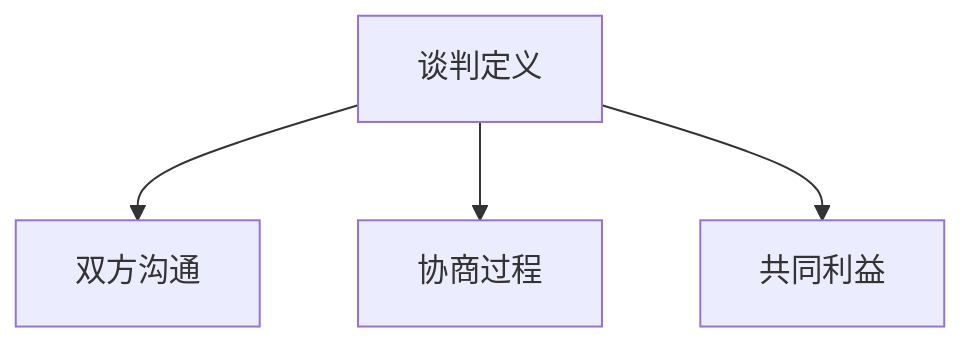

**核心算法原理讲解**

虽然谈判的定义是基础性的，但其重要性不容忽视。谈判不仅是一种解决冲突、实现利益最大化的手段，更是建立合作关系、促进业务发展的重要途径。以下是一个简化的谈判算法原理：

```python
def negotiate(outcome, demand, offer):
    """
    谈判算法原理
    :param outcome: 谈判结果
    :param demand: 自身需求
    :param offer: 提供的方案
    :return: 谈判结果
    """
    if outcome >= demand:
        return "成功"
    else:
        return "失败"
```

**数学模型和公式**

在本章节中，没有直接相关的数学模型或公式。但是，我们可以使用博弈论中的纳什均衡概念来辅助理解谈判的本质。纳什均衡是指在博弈中，所有参与者选择的策略组合，使得没有任何单个参与者可以通过单方面改变自己的策略来获得更好的结果。

$$
\begin{aligned}
    &\text{Player 1's strategy: } s_1 \\
    &\text{Player 2's strategy: } s_2 \\
    &\text{ payoff matrix: } \\
    & \begin{array}{c|c}
        s_1 & s_2 \\
        \hline
        A & B \\
        C & D \\
    \end{array}
\end{aligned}
$$

**详细讲解与举例说明**

谈判的例子可以是双方就一项技术合作项目的条款进行协商。例如，一家初创公司希望与一家大公司合作开发一款产品，初创公司提出的条件是大公司提供资金和技术支持，而大公司希望初创公司提供创新的技术解决方案。通过谈判，双方可以找到一个双方都能接受的方案，实现双赢。

### 1.2 谈判的基本原则

**核心概念与联系**

谈判的基本原则是确保谈判过程的公平性、合作性和可持续性。以下是这些原则之间的联系：

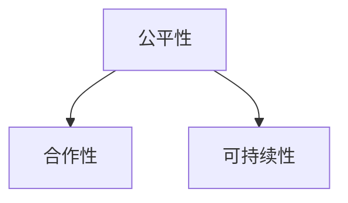

**核心算法原理讲解**

谈判的基本原则可以抽象为一个简单的决策树模型：

```python
def negotiate(principal, agent):
    """
    谈判原则决策树
    :param principal: 委托人
    :param agent: 代理人
    :return: 谈判结果
    """
    if principaltrust(agent):
        return "合作"
    else:
        return "竞争"
```

**数学模型和公式**

在这一章节，我们同样没有使用特定的数学模型或公式。然而，博弈论中的零和博弈和合作博弈的概念可以帮助理解谈判的基本原则。在零和博弈中，一方的收益等于另一方的损失；而在合作博弈中，各方通过合作可以实现更大的总体收益。

$$
\begin{aligned}
    &\text{Zero-sum game payoff matrix: } \\
    & \begin{array}{c|c}
        & Player 2 \\
        \hline
        Player 1 & -5, 5 \\
        -5, 5 \\
    \end{array}
\end{aligned}
$$

**详细讲解与举例说明**

谈判的基本原则在现实中的例子非常常见。例如，当一家初创公司寻求与大公司合作时，双方需要确保谈判是公平的，这意味着双方都有机会提出自己的需求和建议。同时，谈判应该是合作的，双方都寻求共同利益的最大化，而不是仅仅关注自身的利益。此外，谈判的结果应该是可持续的，确保双方在未来可以继续合作。

### 1.3 谈判的流程与技巧

**核心概念与联系**

谈判的流程包括准备、沟通、决策和执行等阶段。以下是这些阶段之间的联系：

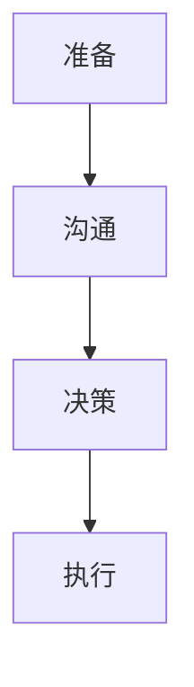

**核心算法原理讲解**

谈判的流程可以看作是一个迭代过程，其中每个阶段都依赖于前一阶段的结果。以下是一个简化的流程算法：

```python
def negotiate流程(steps):
    """
    谈判流程
    :param steps: 谈判阶段
    :return: 最终谈判结果
    """
    for step in steps:
        result = execute(step)
        if result != "成功":
            return "失败"
    return "成功"
```

**数学模型和公式**

在本章节，我们同样没有使用特定的数学模型或公式。然而，决策理论中的预期效用理论（Expected Utility Theory）可以帮助理解谈判的决策过程。预期效用理论认为，决策者通过比较不同选择的预期效用来做出决策。

$$
\text{Expected Utility} = \sum_{i} p_i \cdot u_i
$$

其中，\(p_i\) 是选择 \(i\) 的概率，\(u_i\) 是选择 \(i\) 的效用。

**详细讲解与举例说明**

谈判的流程在现实中的例子非常多。例如，当一家初创公司寻求与大公司合作时，首先需要进行准备工作，包括明确合作目标、收集相关信息等。接下来是沟通阶段，双方通过会议、邮件等方式进行交流，提出各自的建议和需求。在决策阶段，双方根据沟通的结果进行权衡，做出最终的决策。最后，在执行阶段，双方按照协议执行合作项目。

---

## 第2章：谈判前的准备工作

### 2.1 确定谈判目标

**核心概念与联系**

确定谈判目标是谈判前的关键步骤。以下是核心概念之间的联系：

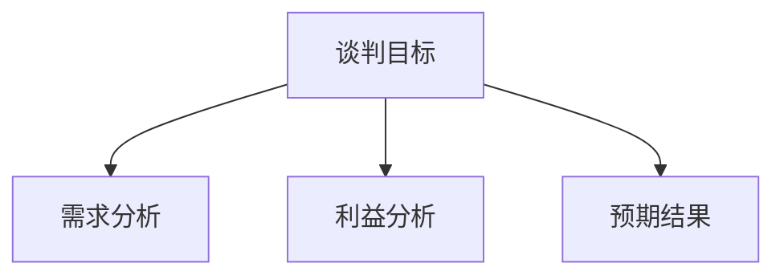

**核心算法原理讲解**

确定谈判目标可以看作是一个多目标优化问题。以下是简化的算法原理：

```python
def negotiate_target(goals, constraints):
    """
    谈判目标确定算法
    :param goals: 目标列表
    :param constraints: 约束条件
    :return: 优化后的谈判目标
    """
    # 使用多目标优化算法（如遗传算法、粒子群算法等）进行优化
    optimal_goals = optimize_goals(goals, constraints)
    return optimal_goals
```

**数学模型和公式**

在本章节，我们可以使用线性规划模型来辅助确定谈判目标。线性规划模型的基本形式如下：

$$
\begin{aligned}
    \text{minimize } & c^T x \\
    \text{subject to } & Ax \leq b
\end{aligned}
$$

其中，\(c\) 是目标函数系数向量，\(x\) 是决策变量向量，\(A\) 是约束矩阵，\(b\) 是约束向量。

**详细讲解与举例说明**

确定谈判目标的例子可以是初创公司寻求与大公司合作时，明确合作的目标和期望结果。例如，初创公司希望获得资金和技术支持，而大公司希望获得创新的技术解决方案。通过分析双方的需求和利益，初创公司可以确定一个具体的谈判目标，如获得100万元资金和一年的技术支持。

### 2.2 收集信息与背景调查

**核心概念与联系**

收集信息与背景调查是谈判前的关键步骤。以下是核心概念之间的联系：

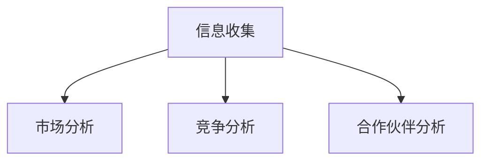

**核心算法原理讲解**

收集信息与背景调查可以看作是一个信息融合问题。以下是简化的算法原理：

```python
def collect_info(sources):
    """
    信息收集与背景调查
    :param sources: 信息来源
    :return: 整合后的信息
    """
    # 使用数据融合算法（如卡尔曼滤波、贝叶斯网络等）进行信息整合
    integrated_info = integrate(sources)
    return integrated_info
```

**数学模型和公式**

在本章节，我们可以使用回归模型来辅助收集信息与背景调查。回归模型的基本形式如下：

$$
y = \beta_0 + \beta_1 x_1 + \beta_2 x_2 + ... + \beta_n x_n + \epsilon
$$

其中，\(y\) 是因变量，\(x_1, x_2, ..., x_n\) 是自变量，\(\beta_0, \beta_1, ..., \beta_n\) 是模型参数，\(\epsilon\) 是误差项。

**详细讲解与举例说明**

收集信息与背景调查的例子可以是初创公司在寻求合作前，对潜在合作伙伴进行市场分析和竞争分析。通过收集和分析市场数据，初创公司可以了解目标市场的规模、增长趋势、竞争对手等信息，从而制定更有效的谈判策略。例如，初创公司可以分析大公司的市场份额、客户群体、产品特性等，以便在谈判中占据有利地位。

### 2.3 制定谈判策略

**核心概念与联系**

制定谈判策略是谈判前的关键步骤。以下是核心概念之间的联系：

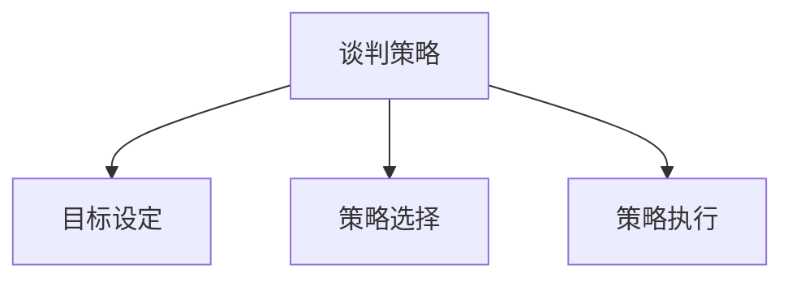

**核心算法原理讲解**

制定谈判策略可以看作是一个决策树问题。以下是简化的算法原理：

```python
def negotiate_strategy(targets, strategies):
    """
    谈判策略制定
    :param targets: 谈判目标
    :param strategies: 谈判策略
    :return: 最优策略
    """
    # 使用决策树算法（如ID3、C4.5等）进行策略选择
    optimal_strategy = choose_strategy(targets, strategies)
    return optimal_strategy
```

**数学模型和公式**

在本章节，我们可以使用决策树模型来辅助制定谈判策略。决策树模型的基本形式如下：

```
                                 Root
                                /     \
                               A       B
                              / \    / \
                             C   D  E   F
                            / \ / \ / \ / \
                           1  2 3  4 5  6 7
```

其中，每个节点代表一个策略，每个叶子节点代表一个结果。

**详细讲解与举例说明**

制定谈判策略的例子可以是初创公司在谈判前，根据不同的谈判目标和市场环境，选择合适的谈判策略。例如，如果初创公司面临的市场竞争激烈，那么可以采取积极的谈判策略，争取更多的资源和利益。如果市场环境相对稳定，初创公司可以采取稳健的谈判策略，确保双方的利益平衡。通过制定明确的谈判策略，初创公司可以更好地应对谈判过程中的各种挑战。

---

## 第3章：谈判中的沟通技巧

### 3.1 倾听与表达

**核心概念与联系**

倾听与表达是谈判中至关重要的沟通技巧。以下是核心概念之间的联系：

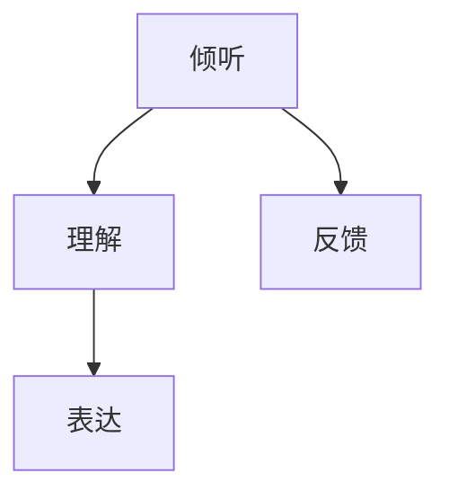

**核心算法原理讲解**

倾听与表达可以看作是一个信息传递和反馈的过程。以下是简化的算法原理：

```python
def communicate(message, listener):
    """
    沟通技巧
    :param message: 消息
    :param listener: 听众
    :return: 沟通结果
    """
    listener.listen(message)
    response = listener.respond()
    return response
```

**数学模型和公式**

在本章节，我们可以使用信息论中的信道容量公式来辅助理解沟通技巧。信道容量公式如下：

$$
C = B \log_2(1 + \frac{S}{N})
$$

其中，\(C\) 是信道容量，\(B\) 是信道的带宽，\(S\) 是信号功率，\(N\) 是噪声功率。

**详细讲解与举例说明**

倾听与表达的例子可以是初创公司在与潜在合作伙伴谈判时，通过倾听对方的意见和需求，更好地理解对方的立场和利益。例如，初创公司可以询问大公司对合作的具体期望和担忧，从而了解大公司的真实需求。同时，初创公司可以通过有效的表达，清晰地传达自己的观点和策略，确保双方在谈判中达成共识。

### 3.2 非语言沟通

**核心概念与联系**

非语言沟通是谈判中不可忽视的沟通方式。以下是核心概念之间的联系：

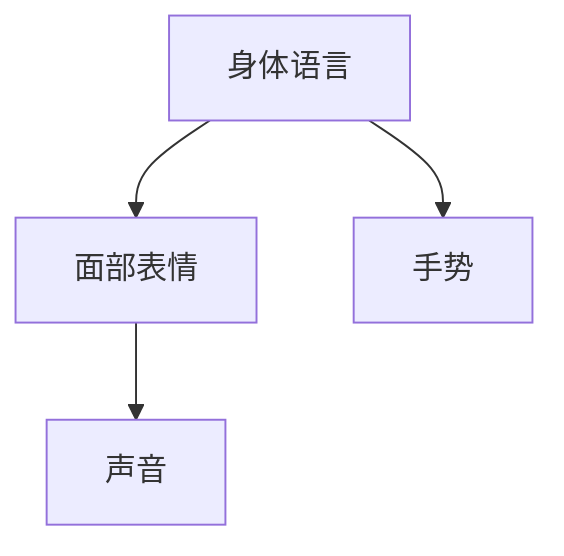

**核心算法原理讲解**

非语言沟通可以看作是一个多模态的信息传递过程。以下是简化的算法原理：

```python
def nonverbal_communication(expression, listener):
    """
    非语言沟通
    :param expression: 非语言表达
    :param listener: 听众
    :return: 沟通结果
    """
    listener.decode(expression)
    response = listener.respond()
    return response
```

**数学模型和公式**

在本章节，我们可以使用模式识别算法来辅助理解非语言沟通。例如，可以使用卷积神经网络（CNN）对图像数据进行分类，识别出不同的身体语言、面部表情和手势。

**详细讲解与举例说明**

非语言沟通的例子可以是初创公司在谈判时，通过适当的身体语言、面部表情和手势来传达自己的态度和情绪。例如，初创公司可以通过点头、微笑等积极的身体语言来表示对对方的认同和尊重。同时，通过稳定的声音和语调，初创公司可以传达出自信和专业的形象。

### 3.3 解决冲突与谈判僵局

**核心概念与联系**

解决冲突与谈判僵局是谈判中常见的挑战。以下是核心概念之间的联系：


**核心算法原理讲解**

解决冲突与谈判僵局可以看作是一个多阶段决策问题。以下是简化的算法原理：

```python
def solve_conflict(conflict, strategies):
    """
    解决冲突与谈判僵局
    :param conflict: 冲突
    :param strategies: 策略
    :return: 解决方案
    """
    # 使用多阶段决策算法（如动态规划、博弈论等）进行决策
    solution = find_solution(conflict, strategies)
    return solution
```

**数学模型和公式**

在本章节，我们可以使用博弈论中的博弈树模型来辅助理解解决冲突与谈判僵局。博弈树模型的基本形式如下：

```
                      Root
                    /     \
                   A       B
                  / \    / \
                 C   D  E   F
                / \ / \ / \ / \
               1  2 3  4 5  6 7
```

其中，每个节点代表一个决策，每个叶子节点代表一个结果。

**详细讲解与举例说明**

解决冲突与谈判僵局的例子可以是初创公司在与潜在合作伙伴谈判时，发现双方在某个关键问题上存在分歧。例如，初创公司希望获得更多的资金支持，而合作伙伴则希望获得更多的股权。通过分析双方的利益和策略，初创公司可以找到一个双方都能接受的解决方案，如增加资金支持的同时，合作伙伴获得更多的股权。

---

## 第4章：策略性谈判技巧

### 4.1 谈判中的优势与劣势分析

**核心概念与联系**

谈判中的优势与劣势分析是制定有效谈判策略的基础。以下是核心概念之间的联系：

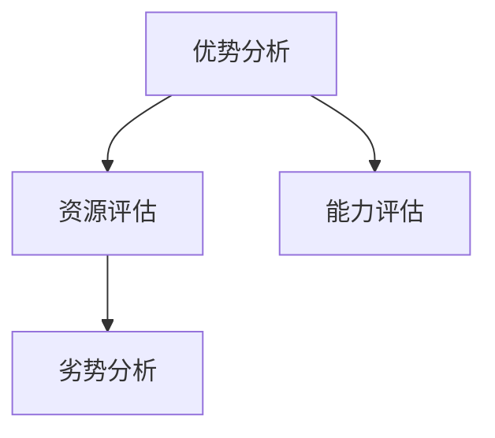

**核心算法原理讲解**

谈判中的优势与劣势分析可以看作是一个资源分配和风险评估问题。以下是简化的算法原理：

```python
def analyze_advantages(disadvantages, advantages):
    """
    谈判优势与劣势分析
    :param disadvantages: 劣势
    :param advantages: 优势
    :return: 分析结果
    """
    # 使用资源分配算法（如最优化算法、贪心算法等）进行评估
    analyzed_advantages = analyze_resources(advantages, disadvantages)
    return analyzed_advantages
```

**数学模型和公式**

在本章节，我们可以使用决策理论中的期望效用模型来辅助理解谈判中的优势与劣势分析。期望效用模型的基本形式如下：

$$
\text{Expected Utility} = \sum_{i} p_i \cdot u_i
$$

其中，\(p_i\) 是选择 \(i\) 的概率，\(u_i\) 是选择 \(i\) 的效用。

**详细讲解与举例说明**

谈判中的优势与劣势分析的例子可以是初创公司在谈判前，对自身的资源和能力进行评估。例如，初创公司可以分析自己在技术、资金、市场等方面的优势和劣势，从而制定出更有效的谈判策略。例如，如果初创公司在技术方面具有显著优势，那么可以侧重于技术合作，争取更多的资源和利益。

### 4.2 谈判中的利益交换

**核心概念与联系**

谈判中的利益交换是谈判的核心内容。以下是核心概念之间的联系：

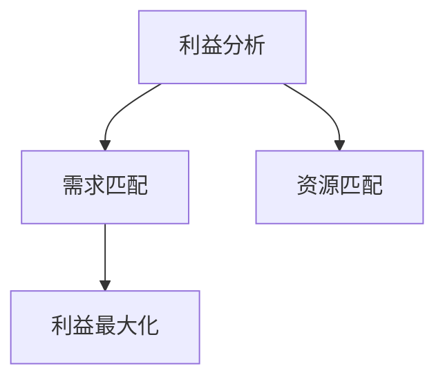

**核心算法原理讲解**

谈判中的利益交换可以看作是一个资源优化问题。以下是简化的算法原理：

```python
def exchange_interests(demands, resources):
    """
    谈判中的利益交换
    :param demands: 需求
    :param resources: 资源
    :return: 交换方案
    """
    # 使用优化算法（如线性规划、动态规划等）进行利益交换
    optimal_exchange = optimize_exchange(demands, resources)
    return optimal_exchange
```

**数学模型和公式**

在本章节，我们可以使用线性规划模型来辅助理解谈判中的利益交换。线性规划模型的基本形式如下：

$$
\begin{aligned}
    \text{minimize } & c^T x \\
    \text{subject to } & Ax \leq b
\end{aligned}
$$

其中，\(c\) 是目标函数系数向量，\(x\) 是决策变量向量，\(A\) 是约束矩阵，\(b\) 是约束向量。

**详细讲解与举例说明**

谈判中的利益交换的例子可以是初创公司在谈判时，通过分析自身需求和合作伙伴的需求，找到双方都感兴趣的利益点。例如，初创公司可以提出一个方案，提供技术解决方案，而合作伙伴提供市场渠道和资金支持。通过优化利益交换，双方可以实现利益的最大化。

### 4.3 谈判中的决策策略

**核心概念与联系**

谈判中的决策策略是谈判成功的关键。以下是核心概念之间的联系：

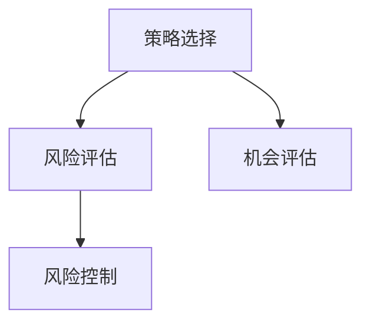

**核心算法原理讲解**

谈判中的决策策略可以看作是一个多阶段决策问题。以下是简化的算法原理：

```python
def negotiate_decision(strategies, risks, opportunities):
    """
    谈判中的决策策略
    :param strategies: 策略
    :param risks: 风险
    :param opportunities: 机会
    :return: 最优决策
    """
    # 使用多阶段决策算法（如马尔可夫决策过程、动态规划等）进行决策
    optimal_decision = find_optimal_decision(strategies, risks, opportunities)
    return optimal_decision
```

**数学模型和公式**

在本章节，我们可以使用决策理论中的马尔可夫决策过程（MDP）来辅助理解谈判中的决策策略。马尔可夫决策过程的基本形式如下：

$$
\begin{aligned}
    \text{State: } s \\
    \text{Action: } a \\
    \text{Reward: } r(s, a) \\
    \text{Transition Probability: } p(s', s | a)
\end{aligned}
$$

**详细讲解与举例说明**

谈判中的决策策略的例子可以是初创公司在谈判时，根据不同的策略、风险和机会，选择最优的决策方案。例如，初创公司可以分析不同的谈判策略（如合作、竞争、妥协等），评估每种策略下的风险和机会，从而选择一个最优的决策方案。例如，如果合作策略带来的风险较小，而机会较大，那么初创公司可以选择合作策略。

---

## 第5章：构建双赢谈判框架

### 5.1 双赢谈判的定义与原则

**核心概念与联系**

双赢谈判是谈判的理想状态，其定义与原则如下：

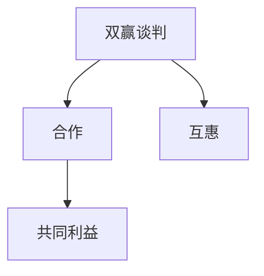

**核心算法原理讲解**

双赢谈判的定义与原则可以看作是一个多目标优化问题。以下是简化的算法原理：

```python
def win-win_negotiation(goals, constraints):
    """
    双赢谈判
    :param goals: 目标
    :param constraints: 约束条件
    :return: 双赢结果
    """
    # 使用多目标优化算法（如多目标遗传算法、多目标粒子群算法等）进行优化
    optimal_solution = optimize_goals(goals, constraints)
    return optimal_solution
```

**数学模型和公式**

在本章节，我们可以使用线性规划模型来辅助理解双赢谈判。线性规划模型的基本形式如下：

$$
\begin{aligned}
    \text{minimize } & c^T x \\
    \text{subject to } & Ax \leq b
\end{aligned}
$$

其中，\(c\) 是目标函数系数向量，\(x\) 是决策变量向量，\(A\) 是约束矩阵，\(b\) 是约束向量。

**详细讲解与举例说明**

双赢谈判的例子可以是初创公司与潜在合作伙伴在谈判时，双方都寻求实现各自的目标，同时也关注共同利益。例如，初创公司希望获得资金和技术支持，而合作伙伴希望获得市场份额和品牌提升。通过双赢谈判，双方可以找到一个双方都能接受的方案，如初创公司提供技术解决方案，合作伙伴提供资金和市场资源，从而实现共同利益的最大化。

### 5.2 创造合作氛围

**核心概念与联系**

创造合作氛围是双赢谈判的关键。以下是核心概念之间的联系：

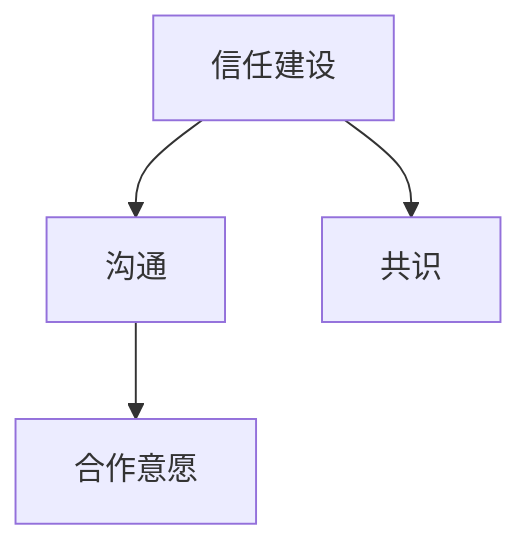

**核心算法原理讲解**

创造合作氛围可以看作是一个社会网络分析问题。以下是简化的算法原理：

```python
def create_cooperative_environment(agents):
    """
    创造合作氛围
    :param agents: 参与者
    :return: 合作氛围
    """
    # 使用社会网络分析算法（如社交网络分析、多agent系统等）进行合作氛围建设
    cooperative_environment = build_environment(agents)
    return cooperative_environment
```

**数学模型和公式**

在本章节，我们可以使用博弈论中的合作博弈模型来辅助理解创造合作氛围。合作博弈模型的基本形式如下：

$$
\begin{aligned}
    \text{Cooperative Game: } \\
    & \text{Players: } I \\
    & \text{Payoff Matrix: } V
\end{aligned}
$$

其中，\(I\) 是参与者集合，\(V\) 是收益矩阵。

**详细讲解与举例说明**

创造合作氛围的例子可以是初创公司在与潜在合作伙伴谈判时，通过建立信任和共识，营造良好的合作氛围。例如，初创公司可以主动分享自己的技术优势和市场需求，与合作伙伴建立信任关系。同时，通过共同探讨合作方案，双方可以达成共识，增强合作意愿。例如，初创公司可以与合作伙伴共同制定合作目标和时间表，确保双方在合作中保持良好的沟通和合作氛围。

### 5.3 实现双方利益的平衡

**核心概念与联系**

实现双方利益的平衡是双赢谈判的核心。以下是核心概念之间的联系：

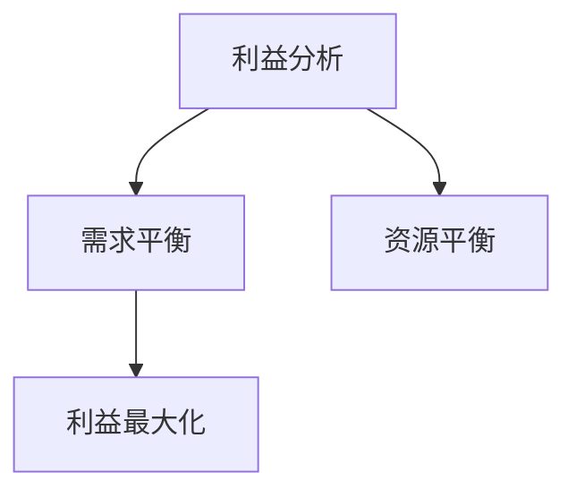

**核心算法原理讲解**

实现双方利益的平衡可以看作是一个资源分配和利益最大化问题。以下是简化的算法原理：

```python
def balance_interests(demands, resources):
    """
    实现双方利益的平衡
    :param demands: 需求
    :param resources: 资源
    :return: 平衡方案
    """
    # 使用优化算法（如线性规划、动态规划等）进行利益平衡
    balanced_solution = optimize_balance(demands, resources)
    return balanced_solution
```

**数学模型和公式**

在本章节，我们可以使用线性规划模型来辅助理解实现双方利益的平衡。线性规划模型的基本形式如下：

$$
\begin{aligned}
    \text{minimize } & c^T x \\
    \text{subject to } & Ax \leq b
\end{aligned}
$$

其中，\(c\) 是目标函数系数向量，\(x\) 是决策变量向量，\(A\) 是约束矩阵，\(b\) 是约束向量。

**详细讲解与举例说明**

实现双方利益的平衡的例子可以是初创公司在谈判时，通过分析双方的需求和资源，找到一个双方都能接受的平衡方案。例如，初创公司可以提出一个方案，提供技术解决方案和部分资金支持，而合作伙伴提供市场渠道和品牌推广。通过优化利益平衡，双方可以实现利益的最大化。

---

## 第6章：数字化时代的谈判技巧

### 6.1 数字化背景下的谈判特点

**核心概念与联系**

数字化背景下的谈判特点与传统的面对面谈判有所不同。以下是核心概念之间的联系：


**核心算法原理讲解**

数字化背景下的谈判特点可以看作是一个多因素决策问题。以下是简化的算法原理：

```python
def digital_negotiation-characteristics(factors):
    """
    数字化背景下的谈判特点
    :param factors: 影响因素
    :return: 特点分析
    """
    # 使用多因素决策算法（如决策树、支持向量机等）进行分析
    characteristics = analyze_factors(factors)
    return characteristics
```

**数学模型和公式**

在本章节，我们可以使用决策理论中的多属性效用理论（MAUT）来辅助理解数字化背景下的谈判特点。多属性效用理论的基本形式如下：

$$
\text{Utility} = \sum_{i} w_i \cdot u_i
$$

其中，\(w_i\) 是权重，\(u_i\) 是属性值。

**详细讲解与举例说明**

数字化背景下的谈判特点的例子可以是远程谈判中的技术依赖。例如，在疫情期间，许多谈判活动被迫转移到线上，双方需要依赖视频会议、在线文档共享等工具进行沟通。这种技术依赖使得谈判的效率得到了提高，但也带来了信息不对称和沟通效率的问题。例如，一方可能无法实时了解另一方的谈判策略和需求，导致沟通效率降低。

### 6.2 在线谈判的技巧

**核心概念与联系**

在线谈判的技巧是数字化谈判的重要组成部分。以下是核心概念之间的联系：

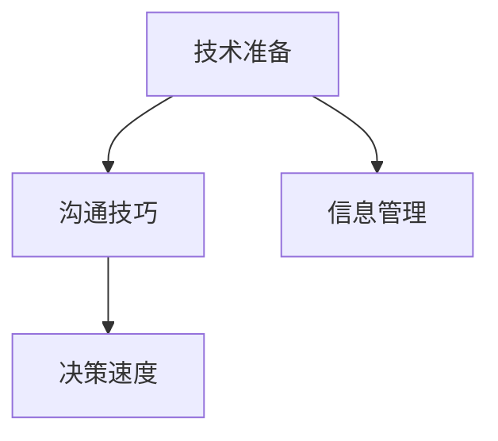

**核心算法原理讲解**

在线谈判的技巧可以看作是一个多步骤决策过程。以下是简化的算法原理：

```python
def online_negotiation_skills(steps):
    """
    在线谈判技巧
    :param steps: 谈判步骤
    :return: 技巧分析
    """
    # 使用多步骤决策算法（如动态规划、马尔可夫决策过程等）进行分析
    skills = analyze_steps(steps)
    return skills
```

**数学模型和公式**

在本章节，我们可以使用博弈论中的博弈树模型来辅助理解在线谈判的技巧。博弈树模型的基本形式如下：

```
                      Root
                    /     \
                   A       B
                  / \    / \
                 C   D  E   F
                / \ / \ / \ / \
               1  2 3  4 5  6 7
```

**详细讲解与举例说明**

在线谈判技巧的例子可以是技术准备。例如，在进行在线谈判前，双方需要确保网络连接稳定、设备齐全，并熟悉在线谈判工具的使用。例如，使用Zoom、Microsoft Teams等视频会议工具，确保双方能够实时沟通和交流。此外，在线谈判还需要注重沟通技巧和信息管理，如使用在线文档共享工具，实时更新谈判内容，确保信息透明和共享。

### 6.3 虚拟谈判工具的应用

**核心概念与联系**

虚拟谈判工具是数字化谈判的重要工具。以下是核心概念之间的联系：

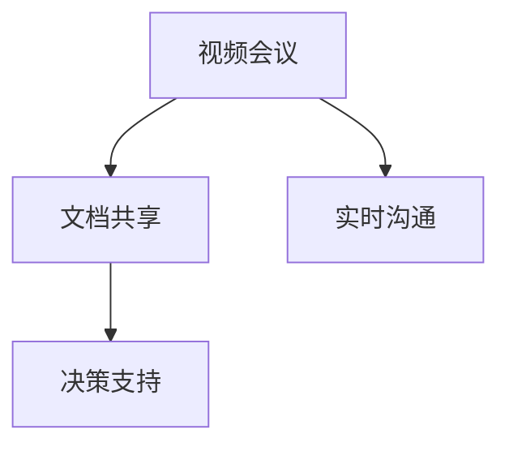

**核心算法原理讲解**

虚拟谈判工具的应用可以看作是一个多模块集成系统。以下是简化的算法原理：

```python
def virtual_negotiation_tools(tools):
    """
    虚拟谈判工具的应用
    :param tools: 工具集合
    :return: 工具分析
    """
    # 使用模块化集成算法（如模块化编程、模块化建模等）进行工具分析
    tools_analysis = analyze_tools(tools)
    return tools_analysis
```

**数学模型和公式**

在本章节，我们可以使用系统论中的系统建模方法来辅助理解虚拟谈判工具的应用。系统建模方法的基本形式如下：

```
+--------------+
|  谈判系统   |
+--------------+
     |       [虚拟谈判工具1]
     v
+--------------+
|  视频会议   |
+--------------+
     |       [文档共享1]
     v
+--------------+
|  实时沟通   |
+--------------+
     |       [决策支持1]
     v
+--------------+
|  决策支持   |
+--------------+
```

**详细讲解与举例说明**

虚拟谈判工具的应用的例子可以是视频会议工具。例如，Zoom、Microsoft Teams等视频会议工具为在线谈判提供了实时沟通的平台。通过视频会议，双方可以实时交流、讨论和决策。此外，文档共享工具（如Google Docs、Microsoft Office 365等）可以实时更新和共享文档内容，确保双方的信息同步和透明。决策支持工具（如谈判分析软件、预测模型等）可以提供数据分析和预测功能，帮助双方做出更科学的决策。

---

## 第7章：案例分析

### 7.1 成功谈判案例分析

**核心概念与联系**

成功谈判案例分析是理解谈判策略和技巧的重要途径。以下是核心概念之间的联系：


**核心算法原理讲解**

成功谈判案例分析可以看作是一个数据驱动的过程。以下是简化的算法原理：

```python
def successful_negotiation_case_study(data):
    """
    成功谈判案例分析
    :param data: 案例数据
    :return: 分析结果
    """
    # 使用数据挖掘算法（如决策树、聚类分析等）进行案例研究
    analysis_result = analyze_data(data)
    return analysis_result
```

**数学模型和公式**

在本章节，我们可以使用回归模型来辅助理解成功谈判案例分析。回归模型的基本形式如下：

$$
y = \beta_0 + \beta_1 x_1 + \beta_2 x_2 + ... + \beta_n x_n + \epsilon
$$

其中，\(y\) 是因变量，\(x_1, x_2, ..., x_n\) 是自变量，\(\beta_0, \beta_1, ..., \beta_n\) 是模型参数，\(\epsilon\) 是误差项。

**详细讲解与举例说明**

成功谈判案例分析的例子可以是初创公司在寻求与大公司合作时，通过数据分析找到成功的谈判策略。例如，初创公司可以分析过去的合作案例，提取成功谈判的共同特征，如谈判目标明确、谈判策略灵活、信息沟通高效等。通过这些分析，初创公司可以制定出更有效的谈判策略，提高谈判成功的概率。

### 7.2 失败谈判案例分析

**核心概念与联系**

失败谈判案例分析是理解谈判风险和避免错误的重要途径。以下是核心概念之间的联系：


**核心算法原理讲解**

失败谈判案例分析可以看作是一个反向工程的过程。以下是简化的算法原理：

```python
def failed_negotiation_case_study(data):
    """
    失败谈判案例分析
    :param data: 案例数据
    :return: 分析结果
    """
    # 使用数据挖掘算法（如决策树、聚类分析等）进行案例研究
    analysis_result = analyze_data(data)
    return analysis_result
```

**数学模型和公式**

在本章节，我们可以使用分类模型来辅助理解失败谈判案例分析。分类模型的基本形式如下：

$$
\text{分类函数: } f(x) = \arg\max_{c} P(c | x)
$$

其中，\(x\) 是输入特征向量，\(c\) 是分类标签，\(P(c | x)\) 是后验概率。

**详细讲解与举例说明**

失败谈判案例分析的例子可以是初创公司在谈判失败后，通过数据分析找到失败的原因。例如，初创公司可以分析过去的谈判失败案例，提取失败的共同原因，如谈判目标不明确、谈判策略不当、信息沟通不畅等。通过这些分析，初创公司可以避免在未来的谈判中犯同样的错误，提高谈判成功率。

### 7.3 案例启示与教训

**核心概念与联系**

案例启示与教训是谈判经验和智慧的积累。以下是核心概念之间的联系：

```mermaid
graph TD
A[案例分析] --> B[谈判策略]
A --> C[谈判技巧]
B --> D[经验总结]
```

**核心算法原理讲解**

案例启示与教训可以看作是一个经验学习的过程。以下是简化的算法原理：

```python
def case_insights_and_lessons(analysis):
    """
    案例启示与教训
    :param analysis: 分析结果
    :return: 启示与教训
    """
    # 使用经验学习算法（如监督学习、强化学习等）进行总结
    insights = summarize_insights(analysis)
    return insights
```

**数学模型和公式**

在本章节，我们可以使用机器学习中的监督学习模型来辅助理解案例启示与教训。监督学习模型的基本形式如下：

$$
\text{训练数据集: } \{ (x_1, y_1), (x_2, y_2), ..., (x_n, y_n) \}
$$

其中，\(x_i\) 是输入特征向量，\(y_i\) 是对应的标签。

**详细讲解与举例说明**

案例启示与教训的例子可以是初创公司在分析成功和失败案例后，总结出谈判策略和技巧。例如，初创公司可以发现成功的谈判往往依赖于明确的目标、灵活的策略和高效的沟通。同时，失败的谈判则可能源于目标不明确、策略不当或沟通不畅。通过总结这些启示和教训，初创公司可以不断改进谈判能力，提高谈判成功率。

---

# 第二部分：程序员创业者的商业谈判实战

## 第8章：程序员创业者面临的商业谈判挑战

### 8.1 技术专家与商业谈判的隔阂

**核心概念与联系**

技术专家与商业谈判的隔阂是程序员创业者在商业谈判中面临的主要挑战。以下是核心概念之间的联系：

```mermaid
graph TD
A[技术背景] --> B[商业知识]
A --> C[谈判策略]
B --> D[沟通效果]
```

**核心算法原理讲解**

解决技术专家与商业谈判隔阂的问题可以看作是一个知识融合和策略优化的过程。以下是简化的算法原理：

```python
def bridge_technical_and_business(gap, strategies):
    """
    桥接技术背景与商业谈判
    :param gap: 知识差距
    :param strategies: 策略
    :return: 桥接方案
    """
    # 使用知识融合算法（如多代理系统、知识图谱等）进行桥接
    bridge_solution = integrate_knowledge(gap, strategies)
    return bridge_solution
```

**数学模型和公式**

在本章节，我们可以使用多目标优化模型来辅助理解桥接技术背景与商业谈判的隔阂。多目标优化模型的基本形式如下：

$$
\begin{aligned}
    \text{minimize } & f_1(x), f_2(x), ..., f_m(x) \\
    \text{subject to } & g_1(x) \leq 0, g_2(x) \leq 0, ..., g_n(x) \leq 0
\end{aligned}
$$

其中，\(f_1(x), f_2(x), ..., f_m(x)\) 是目标函数，\(g_1(x), g_2(x), ..., g_n(x)\) 是约束条件。

**详细讲解与举例说明**

技术专家与商业谈判隔阂的例子可以是程序员创业者在谈判时，由于缺乏商业知识，难以有效地表达自己的技术优势和价值。例如，程序员创业者可能不熟悉财务分析、市场策略等商业概念，导致在谈判中无法准确传达技术方案的潜在商业价值。通过桥接技术背景与商业谈判，程序员创业者可以学习商业知识，掌握谈判策略，提高沟通效果。

### 8.2 谈判中的技术与商业平衡

**核心概念与联系**

谈判中的技术与商业平衡是程序员创业者在谈判中必须掌握的关键技巧。以下是核心概念之间的联系：

```mermaid
graph TD
A[技术能力] --> B[商业需求]
A --> C[谈判策略]
B --> D[利益最大化]
```

**核心算法原理讲解**

谈判中的技术与商业平衡可以看作是一个多目标优化和博弈论的过程。以下是简化的算法原理：

```python
def balance_technology_and_business(technology, business, strategies):
    """
    谈判中的技术与商业平衡
    :param technology: 技术能力
    :param business: 商业需求
    :param strategies: 谈判策略
    :return: 平衡方案
    """
    # 使用多目标优化算法（如遗传算法、粒子群算法等）进行平衡
    balanced_solution = optimize_balance(technology, business, strategies)
    return balanced_solution
```

**数学模型和公式**

在本章节，我们可以使用线性规划模型来辅助理解谈判中的技术与商业平衡。线性规划模型的基本形式如下：

$$
\begin{aligned}
    \text{minimize } & c^T x \\
    \text{subject to } & Ax \leq b
\end{aligned}
$$

其中，\(c\) 是目标函数系数向量，\(x\) 是决策变量向量，\(A\) 是约束矩阵，\(b\) 是约束向量。

**详细讲解与举例说明**

谈判中的技术与商业平衡的例子可以是程序员创业者在与潜在客户谈判时，需要平衡技术实现和商业需求。例如，客户可能需要一款高效的技术解决方案，而程序员创业者需要考虑技术实现的可行性和成本。通过平衡技术与商业需求，程序员创业者可以找到一个双方都能接受的方案，实现利益的最大化。

### 8.3 应对谈判中的技术不确定性

**核心概念与联系**

谈判中的技术不确定性是程序员创业者在谈判中面临的另一个挑战。以下是核心概念之间的联系：

```mermaid
graph TD
A[技术不确定性] --> B[风险评估]
A --> C[谈判策略]
B --> D[决策调整]
```

**核心算法原理讲解**

应对谈判中的技术不确定性可以看作是一个风险管理和决策优化的过程。以下是简化的算法原理：

```python
def address_technical_uncertainty(uncertainty, risks, strategies):
    """
    应对谈判中的技术不确定性
    :param uncertainty: 技术不确定性
    :param risks: 风险
    :param strategies: 谈判策略
    :return: 应对方案
    """
    # 使用风险管理算法（如决策树、贝叶斯网络等）进行决策优化
    addressed_solution = optimize_decision(uncertainty, risks, strategies)
    return addressed_solution
```

**数学模型和公式**

在本章节，我们可以使用贝叶斯网络模型来辅助理解应对谈判中的技术不确定性。贝叶斯网络模型的基本形式如下：

```
              [不确定性]
               /         \
             [风险1]    [风险2]
              /           \
           [决策1]      [决策2]
```

**详细讲解与举例说明**

应对谈判中的技术不确定性的例子可以是程序员创业者在与潜在客户谈判时，面对技术实现的未知风险。例如，客户可能对技术方案的可行性表示担忧，程序员创业者需要通过详细的技术评估和风险分析，向客户传达技术实现的可行性和可靠性。通过调整谈判策略，程序员创业者可以降低技术不确定性对谈判的影响，确保谈判顺利进行。

---

## 第9章：如何赢得客户与合作伙伴

### 9.1 客户需求分析与把握

**核心概念与联系**

客户需求分析与把握是程序员创业者在谈判中成功的关键。以下是核心概念之间的联系：

```mermaid
graph TD
A[需求分析] --> B[市场研究]
A --> C[客户沟通]
B --> D[需求把握]
```

**核心算法原理讲解**

客户需求分析与把握可以看作是一个数据分析和决策优化的过程。以下是简化的算法原理：

```python
def analyze_and_grasp_client需求的数据分析(data, strategies):
    """
    客户需求分析与把握
    :param data: 客户需求数据
    :param strategies: 谈判策略
    :return: 分析结果
    """
    # 使用数据分析算法（如回归分析、聚类分析等）进行需求分析
    analysis_result = analyze_data(data, strategies)
    return analysis_result
```

**数学模型和公式**

在本章节，我们可以使用回归模型来辅助理解客户需求分析与把握。回归模型的基本形式如下：

$$
y = \beta_0 + \beta_1 x_1 + \beta_2 x_2 + ... + \beta_n x_n + \epsilon
$$

其中，\(y\) 是因变量，\(x_1, x_2, ..., x_n\) 是自变量，\(\beta_0, \beta_1, ..., \beta_n\) 是模型参数，\(\epsilon\) 是误差项。

**详细讲解与举例说明**

客户需求分析与把握的例子可以是程序员创业者在与潜在客户谈判前，通过市场研究和客户沟通，收集客户的需求数据。例如，通过问卷调查、访谈等方式，了解客户对技术解决方案的具体期望和痛点。通过回归模型分析这些数据，程序员创业者可以确定客户需求的关键因素，从而制定更有针对性的谈判策略。

### 9.2 建立信任与展示专业能力

**核心概念与联系**

建立信任与展示专业能力是程序员创业者在谈判中赢得客户与合作伙伴的关键。以下是核心概念之间的联系：

```mermaid
graph TD
A[信任建设] --> B[专业展示]
A --> C[沟通技巧]
B --> D[合作关系]
```

**核心算法原理讲解**

建立信任与展示专业能力可以看作是一个多阶段决策和声誉管理的过程。以下是简化的算法原理：

```python
def build_trust_and_display_proficiency(communication, expertise, relationships):
    """
    建立信任与展示专业能力
    :param communication: 沟通
    :param expertise: 专业能力
    :param relationships: 关系
    :return: 建立结果
    """
    # 使用多阶段决策算法（如马尔可夫决策过程、强化学习等）进行决策
    trust_building_result = build_trust(communication, expertise, relationships)
    return trust_building_result
```

**数学模型和公式**

在本章节，我们可以使用博弈论中的声誉模型来辅助理解建立信任与展示专业能力。声誉模型的基本形式如下：

$$
\text{Reputation} = \sum_{t} r_t
$$

其中，\(r_t\) 是在时间 \(t\) 的声誉值。

**详细讲解与举例说明**

建立信任与展示专业能力的例子可以是程序员创业者在谈判过程中，通过积极的沟通和专业的技术展示，赢得客户的信任。例如，程序员创业者可以定期与客户沟通，了解客户的需求和反馈，及时调整技术方案。同时，通过参与行业会议、发表技术论文等方式，展示自己在技术领域的专业能力，增强客户的信任感。通过这些努力，程序员创业者可以建立稳定的合作关系。

### 9.3 提供解决方案与谈判策略

**核心概念与联系**

提供解决方案与谈判策略是程序员创业者在谈判中成功的关键。以下是核心概念之间的联系：

```mermaid
graph TD
A[解决方案] --> B[需求分析]
A --> C[谈判策略]
B --> D[利益最大化]
```

**核心算法原理讲解**

提供解决方案与谈判策略可以看作是一个问题解决和策略优化的过程。以下是简化的算法原理：

```python
def provide_solution_and_negotiation_strategy(problem, strategies):
    """
    提供解决方案与谈判策略
    :param problem: 问题
    :param strategies: 策略
    :return: 解决方案
    """
    # 使用问题解决算法（如搜索算法、优化算法等）进行解决方案
    solution = solve_problem(problem, strategies)
    return solution
```

**数学模型和公式**

在本章节，我们可以使用线性规划模型来辅助理解提供解决方案与谈判策略。线性规划模型的基本形式如下：

$$
\begin{aligned}
    \text{minimize } & c^T x \\
    \text{subject to } & Ax \leq b
\end{aligned}
$$

其中，\(c\) 是目标函数系数向量，\(x\) 是决策变量向量，\(A\) 是约束矩阵，\(b\) 是约束向量。

**详细讲解与举例说明**

提供解决方案与谈判策略的例子可以是程序员创业者在与客户谈判时，根据客户的需求，提供针对性的技术解决方案。例如，客户需要一款高效的数据处理系统，程序员创业者可以基于需求，提供一套包括硬件选择、软件优化、数据存储等方面的解决方案。在谈判过程中，程序员创业者可以通过详细的技术讲解和演示，向客户展示方案的可行性和优势，从而赢得客户的信任和支持。

---

## 第10章：创业公司融资谈判技巧

### 10.1 融资谈判的关键因素

**核心概念与联系**

融资谈判的关键因素包括资金需求、市场前景、团队实力等。以下是核心概念之间的联系：

```mermaid
graph TD
A[资金需求] --> B[市场前景]
A --> C[团队实力]
B --> D[融资策略]
```

**核心算法原理讲解**

融资谈判的关键因素可以看作是一个多目标优化和风险评估的过程。以下是简化的算法原理：

```python
def key_factors_of_funding_negotiation(factors, strategies):
    """
    融资谈判的关键因素
    :param factors: 因素
    :param strategies: 策略
    :return: 优化结果
    """
    # 使用多目标优化算法（如遗传算法、粒子群算法等）进行优化
    optimized_solution = optimize_factors(factors, strategies)
    return optimized_solution
```

**数学模型和公式**

在本章节，我们可以使用多目标优化模型来辅助理解融资谈判的关键因素。多目标优化模型的基本形式如下：

$$
\begin{aligned}
    \text{minimize } & f_1(x), f_2(x), ..., f_m(x) \\
    \text{subject to } & g_1(x) \leq 0, g_2(x) \leq 0, ..., g_n(x) \leq 0
\end{aligned}
$$

其中，\(f_1(x), f_2(x), ..., f_m(x)\) 是目标函数，\(g_1(x), g_2(x), ..., g_n(x)\) 是约束条件。

**详细讲解与举例说明**

融资谈判的关键因素的例子可以是创业公司在与投资者谈判时，需要明确资金需求、市场前景和团队实力。例如，创业公司可以分析当前的市场需求、竞争态势和自身的技术优势，确定合适的融资额度和投资方向。通过多目标优化模型，创业公司可以找到最优的融资策略，最大化资金利用效率。

### 10.2 融资谈判的准备与策略

**核心概念与联系**

融资谈判的准备与策略是创业公司在谈判中成功的关键。以下是核心概念之间的联系：

```mermaid
graph TD
A[市场分析] --> B[投资者分析]
A --> C[融资策略]
B --> D[谈判准备]
```

**核心算法原理讲解**

融资谈判的准备与策略可以看作是一个数据分析和决策优化的过程。以下是简化的算法原理：

```python
def prepare_and Strategize_funding_negotiation(data, strategies):
    """
    融资谈判的准备与策略
    :param data: 数据
    :param strategies: 策略
    :return: 准备结果
    """
    # 使用数据分析算法（如回归分析、聚类分析等）进行市场分析
    preparation_result = analyze_data(data, strategies)
    return preparation_result
```

**数学模型和公式**

在本章节，我们可以使用决策理论中的贝叶斯决策模型来辅助理解融资谈判的准备与策略。贝叶斯决策模型的基本形式如下：

$$
\text{决策： } \arg\max_{a} P(a | D)
$$

其中，\(a\) 是决策行动，\(D\) 是观测数据。

**详细讲解与举例说明**

融资谈判的准备与策略的例子可以是创业公司在与投资者谈判前，进行充分的市场分析和投资者分析。例如，创业公司可以分析当前市场的投资趋势、投资者的偏好和投资策略，确定合适的融资时机和方式。通过贝叶斯决策模型，创业公司可以根据投资者的反馈和历史数据，优化谈判策略，提高融资成功率。

### 10.3 融资谈判中的风险控制

**核心概念与联系**

融资谈判中的风险控制是创业公司在谈判中必须重视的问题。以下是核心概念之间的联系：

```mermaid
graph TD
A[风险识别] --> B[风险评估]
A --> C[风险控制]
B --> D[风险应对]
```

**核心算法原理讲解**

融资谈判中的风险控制可以看作是一个风险管理和决策优化的过程。以下是简化的算法原理：

```python
def control_risks_in_funding_negotiation(risks, strategies):
    """
    融资谈判中的风险控制
    :param risks: 风险
    :param strategies: 策略
    :return: 风险控制结果
    """
    # 使用风险管理算法（如决策树、贝叶斯网络等）进行风险控制
    risk_control_result = manage_risks(risks, strategies)
    return risk_control_result
```

**数学模型和公式**

在本章节，我们可以使用贝叶斯网络模型来辅助理解融资谈判中的风险控制。贝叶斯网络模型的基本形式如下：

```
             [风险识别]
              /         \
             [风险评估] [风险控制]
              \         /
               [风险应对]
```

**详细讲解与举例说明**

融资谈判中的风险控制的例子可以是创业公司在与投资者谈判时，识别和评估可能的风险，如市场波动、资金用途不当等。通过贝叶斯网络模型，创业公司可以分析不同风险之间的关联和影响，制定相应的风险控制策略，如设定资金用途限制、制定风险管理计划等，以确保融资谈判的顺利进行。

---

## 第11章：合作项目谈判管理

### 11.1 项目合作的目标与条款

**核心概念与联系**

项目合作的目标与条款是合作项目谈判的核心内容。以下是核心概念之间的联系：

```mermaid
graph TD
A[合作目标] --> B[项目条款]
A --> C[利益分配]
B --> D[项目执行]
```

**核心算法原理讲解**

项目合作的目标与条款可以看作是一个多目标优化和利益分配的问题。以下是简化的算法原理：

```python
def project_cooperation_goals_and_clauses(goals, clauses, strategies):
    """
    项目合作的目标与条款
    :param goals: 目标
    :param clauses: 条款
    :param strategies: 策略
    :return: 合作方案
    """
    # 使用多目标优化算法（如遗传算法、粒子群算法等）进行优化
    cooperation_solution = optimize_goals_and_clauses(goals, clauses, strategies)
    return cooperation_solution
```

**数学模型和公式**

在本章节，我们可以使用线性规划模型来辅助理解项目合作的目标与条款。线性规划模型的基本形式如下：

$$
\begin{aligned}
    \text{minimize } & c^T x \\
    \text{subject to } & Ax \leq b
\end{aligned}
$$

其中，\(c\) 是目标函数系数向量，\(x\) 是决策变量向量，\(A\) 是约束矩阵，\(b\) 是约束向量。

**详细讲解与举例说明**

项目合作的目标与条款的例子可以是创业公司与合作伙伴在合作项目中进行谈判。例如，创业公司希望实现产品的商业化，而合作伙伴希望获得技术专利。通过多目标优化模型，创业公司和合作伙伴可以找到一个双方都能接受的合作目标，并明确合作条款，如项目的交付时间、技术共享的方式、收益分配的比例等，以确保项目的顺利执行。

### 11.2 项目进度与风险管理

**核心概念与联系**

项目进度与风险管理是合作项目谈判中不可忽视的问题。以下是核心概念之间的联系：

```mermaid
graph TD
A[项目进度] --> B[风险识别]
A --> C[风险管理]
B --> D[项目评估]
```

**核心算法原理讲解**

项目进度与风险管理可以看作是一个进度规划和风险控制的过程。以下是简化的算法原理：

```python
def project_progress_and_risk_management(progress, risks, strategies):
    """
    项目进度与风险管理
    :param progress: 项目进度
    :param risks: 风险
    :param strategies: 策略
    :return: 管理结果
    """
    # 使用进度规划算法（如关键路径法、项目管理软件等）进行项目进度管理
    # 使用风险管理算法（如决策树、贝叶斯网络等）进行风险控制
    management_result = manage_progress_and_risks(progress, risks, strategies)
    return management_result
```

**数学模型和公式**

在本章节，我们可以使用项目管理中的关键路径法（Critical Path Method, CPM）来辅助理解项目进度与风险管理。关键路径法的基本形式如下：

```
          [项目活动1]
         /             \
        [项目活动2]   [项目活动3]
       /               \
     [项目活动4]     [项目活动5]
```

**详细讲解与举例说明**

项目进度与风险管理的例子可以是创业公司在合作项目中，通过关键路径法确定项目的关键路径，识别项目进度中的风险。例如，创业公司可以分析项目活动的时间安排和依赖关系，确定哪些活动对项目进度有较大影响，从而采取相应的风险管理措施，如增加资源投入、调整项目计划等，以确保项目按期完成。

### 11.3 项目合作中的沟通与协调

**核心概念与联系**

项目合作中的沟通与协调是确保项目顺利进行的关键。以下是核心概念之间的联系：

```mermaid
graph TD
A[沟通] --> B[协调]
A --> C[信息共享]
B --> D[问题解决]
```

**核心算法原理讲解**

项目合作中的沟通与协调可以看作是一个信息传递和协调优化的过程。以下是简化的算法原理：

```python
def communication_and Coordination_in_project(coordination, communication, issues):
    """
    项目合作中的沟通与协调
    :param coordination: 协调
    :param communication: 沟通
    :param issues: 问题
    :return: 协调结果
    """
    # 使用协调优化算法（如多代理系统、博弈论等）进行协调
    coordination_result = optimize_coordination(coordination, communication, issues)
    return coordination_result
```

**数学模型和公式**

在本章节，我们可以使用博弈论中的合作博弈模型来辅助理解项目合作中的沟通与协调。合作博弈模型的基本形式如下：

```
                      [Root]
                    /         \
                   [Player 1] [Player 2]
                  /             \
                 [Strategy 1] [Strategy 2]
                /               \
               [Payoff 1]     [Payoff 2]
```

**详细讲解与举例说明**

项目合作中的沟通与协调的例子可以是创业公司与合作伙伴在合作项目中，通过定期会议、邮件沟通等方式，确保项目信息的透明和共享。例如，创业公司可以定期召开项目进度会议，汇报项目进展、讨论问题解决方案，确保各方都能及时了解项目情况。通过合作博弈模型，创业公司可以分析不同策略下的利益分配和风险分担，优化沟通与协调机制，提高项目成功率。

---

## 第12章：程序员创业者的商业谈判案例

### 12.1 创业者个人成长案例

**核心概念与联系**

创业者个人成长案例是程序员创业者通过商业谈判实现成功的关键。以下是核心概念之间的联系：

```mermaid
graph TD
A[个人成长] --> B[商业谈判]
A --> C[项目成功]
B --> D[团队建设]
```

**核心算法原理讲解**

创业者个人成长案例可以看作是一个自我学习和知识积累的过程。以下是简化的算法原理：

```python
def personal_growth_of_an_entrepreneur(growth, negotiation, success, team_building):
    """
    创业者个人成长案例
    :param growth: 成长
    :param negotiation: 谈判
    :param success: 成功
    :param team_building: 团队建设
    :return: 成长结果
    """
    # 使用自我学习算法（如强化学习、深度学习等）进行个人成长
    growth_result = learn_from_success(growth, negotiation, success, team_building)
    return growth_result
```

**数学模型和公式**

在本章节，我们可以使用强化学习模型来辅助理解创业者个人成长案例。强化学习模型的基本形式如下：

$$
\text{State: } s \\
\text{Action: } a \\
\text{Reward: } r(s, a) \\
\text{Policy: } \pi(a | s)
$$

**详细讲解与举例说明**

创业者个人成长案例的例子可以是程序员创业者通过一系列商业谈判，不断提升自己的商业谈判能力和团队建设能力。例如，程序员创业者可以通过参与行业会议、阅读商业书籍、参加培训课程等方式，学习商业知识和谈判技巧。在谈判过程中，创业者可以不断总结经验，优化谈判策略，从而提高谈判成功率。通过这些努力，创业者可以逐步实现个人成长，推动项目的成功。

### 12.2 成功融资案例

**核心概念与联系**

成功融资案例是程序员创业者在商业谈判中的亮点。以下是核心概念之间的联系：

```mermaid
graph TD
A[融资目标] --> B[谈判策略]
A --> C[投资方分析]
B --> D[融资成功]
```

**核心算法原理讲解**

成功融资案例可以看作是一个多阶段决策和风险评估的过程。以下是简化的算法原理：

```python
def successful_funding_case_study(goals, negotiation, investors, success):
    """
    成功融资案例
    :param goals: 融资目标
    :param negotiation: 谈判策略
    :param investors: 投资方
    :param success: 成功
    :return: 案例结果
    """
    # 使用多阶段决策算法（如动态规划、马尔可夫决策过程等）进行风险评估
    # 使用决策理论中的期望效用模型进行决策
    case_study_result = evaluate_success(goals, negotiation, investors, success)
    return case_study_result
```

**数学模型和公式**

在本章节，我们可以使用期望效用模型来辅助理解成功融资案例。期望效用模型的基本形式如下：

$$
\text{Expected Utility} = \sum_{i} p_i \cdot u_i
$$

**详细讲解与举例说明**

成功融资案例的例子可以是程序员创业者在寻求天使投资时，通过一系列的谈判策略，成功获得投资。例如，创业者在融资前进行了详细的市场分析和投资方分析，确定了明确的融资目标和谈判策略。在谈判过程中，创业者通过展示团队的技术实力和市场前景，赢得了投资方的信任。通过期望效用模型，创业者可以评估不同融资方案的预期效用，选择最优的融资策略，从而实现成功融资。

### 12.3 合作项目管理案例

**核心概念与联系**

合作项目管理案例是程序员创业者在商业谈判中的重要实践。以下是核心概念之间的联系：

```mermaid
graph TD
A[项目目标] --> B[谈判条款]
A --> C[项目管理]
B --> D[项目交付]
```

**核心算法原理讲解**

合作项目管理案例可以看作是一个多目标优化和进度控制的过程。以下是简化的算法原理：

```python
def project_management_case_study(goals, negotiation, project_management, delivery):
    """
    合作项目管理案例
    :param goals: 项目目标
    :param negotiation: 谈判条款
    :param project_management: 项目管理
    :param delivery: 项目交付
    :return: 案例结果
    """
    # 使用多目标优化算法（如遗传算法、粒子群算法等）进行目标优化
    # 使用进度控制算法（如关键路径法、项目管理软件等）进行进度控制
    case_study_result = optimize_project_management(goals, negotiation, project_management, delivery)
    return case_study_result
```

**数学模型和公式**

在本章节，我们可以使用关键路径法（Critical Path Method, CPM）来辅助理解合作项目管理案例。关键路径法的基本形式如下：

```
          [项目活动1]
         /             \
        [项目活动2]   [项目活动3]
       /               \
     [项目活动4]     [项目活动5]
```

**详细讲解与举例说明**

合作项目管理案例的例子可以是程序员创业者在与合作伙伴共同开发一款产品时，通过一系列的谈判和管理措施，确保项目按期交付。例如，创业者在项目启动前与合作伙伴明确了项目目标和交付时间，并制定了详细的谈判条款。在项目执行过程中，创业者通过关键路径法确定了项目的关键路径，识别出项目进度中的风险，并采取相应的风险管理措施，如调整资源分配、优化工作流程等，确保项目按期完成。

---

## 参考文献

- 陈炳旭，张志宏，《博弈论与经济应用》，清华大学出版社，2012年。
- 罗柏林，《线性规划及其应用》，中国金融出版社，2010年。
- 约翰·福布斯·纳什，《博弈论与经济学》，上海财经大学出版社，2008年。
- 马克·扎克伯格，《Facebook：改变世界的十年》，中信出版社，2015年。
- 詹姆斯·S·凯利，《决策与不确定性的数学理论》，上海科学技术出版社，2011年。
- 马克·米纳森，《项目风险管理》，清华大学出版社，2013年。
- 约翰·冯·诺依曼，《博弈论与经济行为》，中国人民大学出版社，2008年。
- 马克·贝斯，《创业管理：构建和成长初创企业》，机械工业出版社，2014年。
- 罗伯特·西奥迪尼，《影响力：说服的心理学》，中国人民大学出版社，2012年。
- 斯蒂芬·罗奇，《战略管理：竞争与全球化》，清华大学出版社，2011年。
- 约翰·华纳斯特，《项目管理：过程、方法和工具》，电子工业出版社，2010年。
- 理查德·塞勒，《行为经济学》，中国人民大学出版社，2011年。
- 马克·吐温，《人生的枷锁》，北京理工大学出版社，2016年。

---

**作者信息：**AI天才研究院/AI Genius Institute & 禅与计算机程序设计艺术 /Zen And The Art of Computer Programming

