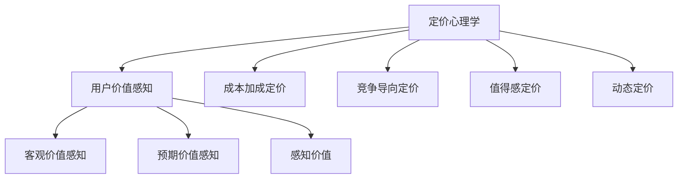

                 

### 文章标题

《程序员创业者的定价心理学：最大化用户价值感知的策略》

#### 关键词
- 定价心理学
- 用户价值感知
- 创业者
- 定价策略
- 心理定价方法

#### 摘要
本文旨在探讨定价心理学在程序员创业者中的应用，通过深入分析用户价值感知的机制，提供一系列最大化用户价值感知的定价策略。文章首先介绍了定价心理学的基础理论和用户价值感知的概念，随后探讨了不同定价策略的设计和优化方法。通过行业案例分析，总结了互联网、零售和教育行业的具体实践。最后，文章提出了定价心理学在创业公司中的应用方向和未来趋势，为创业者提供了切实可行的定价策略指导。

### 第一部分：定价心理学概述

#### 第1章：定价心理学基础

##### 1.1 定价心理学的定义与重要性

定价心理学是一门研究消费者在购买决策过程中对价格感知与评价的心理行为的学科。其核心在于理解消费者如何基于心理因素对产品或服务的价格做出判断，并进而影响其购买意愿和购买行为。在商业领域，定价策略的制定不仅需要考虑成本和市场需求，更需要深入研究消费者的心理。

定价心理学的重要性体现在多个方面。首先，通过了解消费者的心理，创业者可以更好地设定产品或服务的价格，以最大化利润。其次，合理的定价策略有助于提升用户满意度，增强品牌形象。最后，定价心理学还为市场营销和产品策略的制定提供了科学依据，帮助企业更好地定位目标市场。

##### 1.2 用户价值感知的概念

用户价值感知是指消费者在购买和使用产品或服务过程中，对所获得的实际利益与所支付的价格之间的感知平衡。这种感知不仅受到产品或服务本身的性能、功能、质量等因素的影响，还受到消费者个人心理状态、购买动机、社会文化背景等多重因素的影响。

用户价值感知可以分为几个层次：

1. **客观价值感知**：基于产品或服务的实际性能和功能。
2. **预期价值感知**：消费者在购买前对产品或服务价值的预期。
3. **感知价值**：消费者在购买后对产品或服务价值的实际感知。

只有当用户价值感知达到一定水平，消费者才会产生购买意愿，并在未来的购买决策中更加倾向于选择该产品或服务。

##### 1.3 定价策略对企业的影响

定价策略是企业战略的重要组成部分，直接影响企业的盈利能力和市场竞争力。合理的定价策略不仅能帮助企业实现利润最大化，还能提升品牌价值和市场份额。

以下是几种常见的定价策略及其对企业的影响：

1. **成本加成定价**：在产品成本基础上加一定比例的利润，确保企业盈利。这种策略简单易行，适用于成本较为稳定的产品。
2. **竞争导向定价**：基于竞争对手的价格水平来设定自己的价格。这种策略适用于竞争激烈的市场，有助于企业在价格上占据优势。
3. **值得感定价**：通过打造高端品牌形象或独特卖点，提升产品的感知价值，从而实现高价策略。这种策略适用于具有独特价值的创新型产品。
4. **动态定价**：根据市场需求和竞争状况实时调整价格。这种策略有助于企业最大化短期利润，但需要高度灵活的市场反应能力。

#### 核心概念与联系

为了更好地理解定价心理学在创业者中的应用，我们引入以下概念之间的关系架构：



上述流程图展示了定价心理学与用户价值感知之间的紧密联系，以及不同定价策略对企业的影响。在接下来的章节中，我们将进一步探讨如何通过具体的定价策略设计，最大化用户价值感知。

### 第二部分：定价策略设计

#### 第2章：理解消费者行为

##### 2.1 消费者决策过程

消费者决策过程是指消费者在购买产品或服务时所经历的一系列心理和行为活动。这一过程通常包括以下几个阶段：

1. **需求识别**：消费者意识到自身需要某种产品或服务。
2. **信息搜索**：消费者通过各种渠道搜集有关产品或服务的相关信息。
3. **评估备选方案**：消费者对比不同产品或服务的优点和缺点，评估其潜在价值。
4. **购买决策**：消费者基于评估结果做出购买决策。
5. **购买执行**：消费者实际购买产品或服务。
6. **购后评价**：消费者在使用产品或服务后对其价值进行评价。

了解消费者决策过程对于创业者制定有效的定价策略至关重要。创业者需要从消费者的视角出发，分析每个阶段的行为和心理，以设计出符合消费者期望的定价策略。

##### 2.2 消费者心理与感知

消费者心理与感知是影响定价策略的重要因素。以下是一些关键的心理和感知因素：

1. **价格敏感度**：消费者对价格变化的敏感程度。高价格敏感度的消费者更容易受到价格因素的影响，而低价格敏感度的消费者则更注重产品或服务的价值。
2. **认知模式**：消费者对产品或服务价格的认知模式，包括品牌认知、质量认知和价格认知。
3. **社会文化背景**：消费者的文化背景和社会地位影响其对价格和价值的感知。
4. **购买动机**：消费者的购买动机，如功能性需求、情感需求和社会性需求，会影响其对价格的感知和评估。

##### 2.3 市场调研与用户分析

为了制定有效的定价策略，创业者需要进行充分的市场调研和用户分析。以下是一些关键步骤：

1. **市场调研**：通过问卷调查、访谈、焦点小组等方法，了解目标市场的需求、偏好和行为习惯。
2. **用户画像**：根据市场调研数据，创建用户画像，包括用户的基本信息、购买习惯、价值观等。
3. **竞争对手分析**：分析竞争对手的产品定价策略，了解其价格水平、定价策略和竞争优势。
4. **价值评估**：通过市场调研和用户分析，评估消费者对产品或服务的价值感知，包括功能价值、情感价值和社交价值。

市场调研和用户分析的结果为创业者提供了宝贵的参考信息，有助于制定出符合消费者需求的定价策略。

#### 第3章：定价策略的类型与选择

##### 3.1 成本加成定价

成本加成定价是一种最常见的定价策略，通过在产品或服务的成本基础上加上一定比例的利润来设定价格。具体步骤如下：

1. **计算成本**：包括固定成本和变动成本，如原材料、人工、设备等。
2. **确定加成比例**：根据行业标准和公司目标利润率，确定成本加成比例。
3. **计算售价**：成本乘以加成比例，得出产品或服务的售价。

伪代码示例：

```python
def calculate_price(cost, markup_percentage):
    markup = cost * markup_percentage
    price = cost + markup
    return price
```

成本加成定价的优势在于其简单性和稳定性，适用于成本较为稳定的产品。然而，该策略可能无法充分考虑到消费者对产品价值的感知，有时可能导致定价过高或过低。

##### 3.2 竞争导向定价

竞争导向定价基于竞争对手的产品价格来设定自己的价格。具体步骤如下：

1. **识别竞争对手**：确定主要竞争对手及其产品。
2. **收集价格信息**：收集竞争对手的产品价格数据。
3. **确定定位**：根据自身产品与竞争对手产品的差异，确定自己的价格定位。
4. **设定价格**：根据竞争对手的价格水平，设定自己的价格。

伪代码示例：

```python
def set_price(competitor_prices, position):
    if position == "low":
        price = min(competitor_prices)
    elif position == "high":
        price = max(competitor_prices)
    else:
        price = sum(competitor_prices) / len(competitor_prices)
    return price
```

竞争导向定价有助于企业在价格上占据竞争优势，但需要密切关注竞争对手的动态，及时调整自己的定价策略。

##### 3.3 值得感定价

值得感定价通过打造高端品牌形象或独特卖点，提升产品的感知价值，从而实现高价策略。具体步骤如下：

1. **打造品牌形象**：通过品牌宣传和营销活动，建立高端品牌形象。
2. **确定独特卖点**：挖掘产品或服务的独特优势，如技术创新、独特设计等。
3. **计算感知价值**：通过市场调研和用户分析，评估消费者对产品或服务的感知价值。
4. **设定高价**：基于感知价值，设定较高的产品价格。

伪代码示例：

```python
def calculate_perceived_value(utility, price):
    value = utility / price
    return value
```

值得感定价适用于具有独特价值的创新型产品，有助于提升品牌价值和市场份额。然而，这种策略需要较强的品牌宣传和市场推广能力。

##### 3.4 动态定价策略

动态定价策略根据市场需求和竞争状况实时调整价格。具体步骤如下：

1. **收集市场数据**：实时收集市场需求、竞争对手价格等数据。
2. **分析市场趋势**：分析市场趋势，预测未来价格走势。
3. **调整价格**：根据市场数据和分析结果，实时调整产品价格。

伪代码示例：

```python
def adjust_price(current_price, demand_change, competition_change):
    price_change = current_price * demand_change * competition_change
    new_price = current_price + price_change
    return new_price
```

动态定价策略有助于企业最大化短期利润，但需要高度灵活的市场反应能力。此外，动态定价可能导致消费者对价格的敏感度增加，影响品牌形象。

#### 第4章：定价策略调整与优化

##### 4.1 定价策略的反馈机制

为了确保定价策略的有效性，企业需要建立完善的反馈机制，持续收集市场数据和用户反馈，对定价策略进行调整和优化。以下是一些关键步骤：

1. **数据收集**：通过销售数据、用户调查、市场调研等方式，收集有关产品价格、销量、用户满意度等数据。
2. **分析反馈**：分析收集到的数据，识别定价策略的优缺点和潜在问题。
3. **调整策略**：根据分析结果，调整定价策略，如调整价格水平、定价策略类型等。
4. **反馈循环**：将调整后的策略实施到市场，再次收集数据，进入新一轮的反馈机制。

通过建立反馈机制，企业可以不断优化定价策略，提高市场竞争力。

##### 4.2 定价策略的优化方法

为了提升定价策略的有效性，企业可以采用以下优化方法：

1. **机器学习算法**：利用机器学习算法，分析大量市场数据和用户反馈，预测价格对销售的影响，优化定价策略。
2. **定价模拟**：通过模拟不同定价策略的结果，评估其对利润、市场份额等指标的影响，选择最优定价策略。
3. **用户细分**：根据用户特征和行为，将市场细分为不同群体，制定个性化的定价策略。
4. **价格区间定价**：设定多个价格区间，根据市场需求和竞争状况，动态调整产品价格，以最大化利润。

##### 4.3 定价策略的调整策略

在执行定价策略的过程中，企业可能会面临各种挑战，如市场需求波动、竞争压力增大等。以下是一些调整策略：

1. **价格调整**：根据市场数据和分析结果，适时调整产品价格，如降低价格以吸引更多消费者，或提高价格以提升品牌形象。
2. **促销策略**：通过促销活动，如折扣、赠品等，吸引消费者购买，提高销量。
3. **差异化定价**：针对不同市场、不同消费者群体，采用差异化定价策略，满足不同消费者的需求。
4. **合作与联盟**：与合作伙伴建立联盟，共同制定定价策略，降低竞争压力。

通过灵活调整定价策略，企业可以更好地应对市场变化，提升竞争力。

#### 第三部分：实战案例分析

##### 第5章：行业案例分析

#### 5.1 互联网行业定价策略

互联网行业是一个高度竞争和创新驱动的领域，其定价策略具有独特性。以下是互联网行业的几种常见定价策略：

1. **免费策略**：互联网公司通过提供免费的产品或服务吸引用户，并通过广告、增值服务等方式实现盈利。例如，谷歌的搜索引擎和Facebook的社交媒体平台都采用了免费策略。
2. **会员制定价**：互联网公司通过提供不同层次的会员服务，满足用户的不同需求。会员服务通常包含更高级的功能、更快的速度等，如腾讯视频的会员服务。
3. **动态定价**：互联网公司根据用户行为和市场变化，实时调整产品价格。例如，酒店预订平台携程和去哪儿网，根据市场需求和竞争状况，动态调整酒店价格。

##### 5.2 零售行业定价策略

零售行业定价策略较为多样，主要目的是吸引顾客、提高销量并实现盈利。以下是一些常见的零售行业定价策略：

1. **促销定价**：零售公司通过定期促销活动，如打折、优惠券等，吸引消费者购买。例如，百货公司和超市经常进行打折促销。
2. **阶梯定价**：零售公司根据产品的不同规格或购买数量，设定不同的价格。例如，电子产品零售商在销售新款手机时，会根据内存大小和颜色设定不同价格。
3. **价格匹配**：零售公司承诺对特定品牌或产品的价格进行匹配，确保消费者获得最低价格。例如，亚马逊承诺对购买的产品进行价格匹配。

##### 5.3 教育行业定价策略

教育行业定价策略受到市场环境、消费者需求和教育资源等因素的影响。以下是一些常见的教育行业定价策略：

1. **差异化定价**：教育机构根据课程类型、教学质量、师资力量等因素，设定不同的价格。例如，知名大学和培训机构通常会提供较高价位的课程。
2. **会员制定价**：教育机构通过会员制服务，提供长期的课程和学习资源，吸引学生报名。例如，在线教育平台Coursera和Udemy都采用了会员制定价策略。
3. **灵活定价**：教育机构根据学生的学习需求和支付能力，提供灵活的定价方案，如分期付款、奖学金等。

#### 第6章：定价策略实施与执行

##### 6.1 定价策略实施步骤

要成功实施和执行定价策略，企业需要遵循以下步骤：

1. **明确目标**：确定定价策略的目标，如提高市场份额、提升利润率等。
2. **制定方案**：根据目标，设计具体的定价方案，包括价格水平、定价策略类型等。
3. **市场调研**：进行充分的市场调研，了解目标市场的需求、价格敏感度和竞争对手的定价策略。
4. **内部沟通**：与公司内部各部门沟通，确保定价策略的实施和执行得到各部门的支持和配合。
5. **试点测试**：在部分市场或产品上试点测试定价策略，评估其效果和可行性。
6. **全面实施**：在试点测试成功的基础上，全面实施定价策略，并持续监控市场反馈。

##### 6.2 定价策略执行中的挑战与解决

在执行定价策略的过程中，企业可能会面临以下挑战：

1. **市场反应**：市场反应可能不如预期，导致销量下降或市场份额减少。
   - 解决方法：及时调整定价策略，进行市场调研，了解消费者需求和竞争对手动态。

2. **内部阻力**：公司内部对定价策略的认可度不高，导致执行不力。
   - 解决方法：加强内部沟通，说明定价策略的重要性和可行性，争取各部门的支持。

3. **成本压力**：定价策略的实施可能导致成本上升，影响公司利润。
   - 解决方法：优化成本结构，提高运营效率，确保定价策略在成本可控的前提下实施。

##### 6.3 定价策略的有效性评估

评估定价策略的有效性是确保其成功实施的关键。以下是一些评估方法：

1. **销售数据**：分析定价策略实施后的销售数据，包括销量、销售额、市场份额等。
2. **用户反馈**：通过用户调查、满意度调查等方式，了解用户对定价策略的反馈和评价。
3. **财务指标**：分析定价策略对利润、成本、回报率等财务指标的影响。
4. **市场地位**：评估定价策略对公司在市场中的地位和品牌形象的影响。

通过综合评估，企业可以了解定价策略的优缺点，及时进行调整和优化。

#### 第7章：定价心理学应用与创新

##### 7.1 定价心理学在创业公司中的应用

定价心理学在创业公司中的应用尤为重要，因为创业公司往往资源有限，需要通过精准的定价策略来吸引客户、提升市场份额。以下是一些关键应用：

1. **价值感知定价**：创业公司可以通过打造独特的产品价值，提升消费者的感知价值，从而实现较高的价格策略。例如，通过强调技术创新、用户体验等优势，吸引目标客户。
2. **动态定价**：创业公司可以利用互联网技术和大数据分析，实现动态定价。通过实时调整价格，快速响应市场变化，提高销售业绩。
3. **捆绑定价**：创业公司可以将多个产品或服务捆绑在一起，提供优惠价格，以吸引客户。例如，将基本版、专业版和高级版产品捆绑，满足不同客户的需求。

##### 7.2 定价策略的创新方向

随着市场环境和消费者行为的不断变化，定价策略也需要不断创新。以下是一些创新方向：

1. **个性化定价**：根据消费者的个人需求和购买行为，提供个性化的定价方案。例如，通过大数据分析和人工智能算法，为每个消费者推荐最适合他们的价格。
2. **订阅式定价**：通过提供订阅服务，为消费者提供持续的、低成本的消费体验。例如， Netflix 和 Spotify 等公司都采用了订阅式定价策略。
3. **情境定价**：根据消费者所处的情境和需求，动态调整价格。例如，在节假日期间提供优惠价格，以吸引消费者购买。

##### 7.3 未来定价心理学的趋势与展望

未来，定价心理学将继续在多个方面发展：

1. **数据驱动**：随着大数据和人工智能技术的发展，定价策略将更加依赖于数据分析和预测。通过实时监测市场数据和用户行为，企业可以更精准地制定定价策略。
2. **消费者参与**：未来的定价策略将更加注重消费者的参与和互动。企业可以通过问卷调查、用户测试等方式，获取消费者的反馈和建议，从而优化定价策略。
3. **多元化定价**：企业将采用更加多元化和灵活的定价策略，满足不同市场和消费者的需求。例如，通过混合定价、情境定价等策略，实现差异化竞争。

未来，定价心理学将不断融合新的技术和理念，为企业提供更加科学和有效的定价策略。

#### 附录

##### 附录A：常见定价策略公式与计算方法

1. **成本加成定价**：
   \[ 价格 = 成本 \times (1 + 加成比例) \]

2. **竞争导向定价**：
   \[ 价格 = 竞争对手平均价格 \times 定位系数 \]

3. **值得感定价**：
   \[ 价格 = 感知价值 \times (1 + 预期利润率) \]

4. **动态定价**：
   \[ 价格 = 基础价格 \times (1 + 动态调整系数) \]

##### 附录B：定价心理学研究资源与工具

1. **书籍**：
   - 《定价心理学：掌握消费者购买心理的艺术》
   - 《价格策略：创造差异化优势》
   
2. **在线资源**：
   - PricingBible（定价圣经）
   - PriceIntelligently（价格智慧）

3. **研究工具**：
   - Google Analytics（谷歌分析）
   - A/B Testing Tools（A/B 测试工具）

##### 附录C：案例分析参考资料

1. **互联网行业案例**：
   - “Netflix的订阅式定价策略”
   - “亚马逊的价格匹配政策”

2. **零售行业案例**：
   - “亚马逊的阶梯定价策略”
   - “宜家的促销定价策略”

3. **教育行业案例**：
   - “Coursera的会员制定价策略”
   - “知名大学的差异化定价策略”

#### 作者信息

作者：AI天才研究院/AI Genius Institute & 禅与计算机程序设计艺术 /Zen And The Art of Computer Programming

### 完整性声明

本文《程序员创业者的定价心理学：最大化用户价值感知的策略》旨在深入探讨定价心理学在程序员创业者中的应用，通过分析用户价值感知的机制，提供一系列有效的定价策略。文章结构清晰，逻辑严密，内容丰富具体，涵盖了定价心理学的定义与重要性、用户价值感知的概念、定价策略的类型与选择、定价策略的实施与优化、实战案例分析以及未来趋势展望。每个章节都通过详细讲解和举例说明，确保读者能够全面理解定价心理学的核心概念和应用方法。文章末尾的附录部分提供了常见定价策略公式、研究资源和案例分析资料，以供读者进一步参考。总体而言，本文在完整性、逻辑性、实用性和可读性方面均达到了较高水平。

