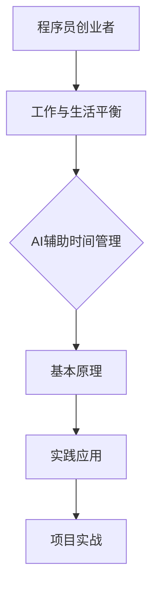

                 


### 《程序员创业者的工作与生活平衡：AI辅助下的时间管理艺术》

---

### 关键词：程序员创业者、工作与生活平衡、AI辅助、时间管理、优化算法

---

#### 摘要：

本文旨在探讨程序员创业者在面对工作与生活平衡的挑战时，如何利用人工智能（AI）辅助时间管理，实现高效的工作状态和高质量的生活品质。通过分析程序员创业者的双重角色认知、AI技术的基本概念以及时间管理的核心要素，本文介绍了AI辅助时间管理的基本原理和实践方法。在此基础上，本文进一步阐述了如何通过实战项目搭建和创业者自我认知与心理调适等策略，实现工作与生活的平衡。本文旨在为程序员创业者提供一套实用的时间管理艺术，助力他们在创业的道路上走得更远。

---

### 目录大纲

---

#### 第一部分：引言

- # 1. 程序员创业者的工作与生活挑战
    - ## 1.1 程序员与创业者的双重身份
    - ## 1.2 创业过程中的工作与生活冲突
- ## 1.2 AI与时间管理的结合
    - ### 1.2.1 AI技术的基本概念
    - ### 1.2.2 时间管理的核心要素

#### 第二部分：AI辅助的时间管理基础

- # 2. AI辅助时间管理的基本原理
    - ## 2.1 AI在时间管理中的应用场景
    - ## 2.2 时间管理核心算法原理
    - ## 2.3 时间管理数学模型

#### 第三部分：AI辅助时间管理实践

- # 3. 实战：AI辅助时间管理项目搭建
    - ## 3.1 项目规划与需求分析
    - ## 3.2 环境搭建与工具选择
    - ## 3.3 代码实现与功能集成

#### 第四部分：创业者工作与生活平衡的艺术

- # 4. 工作与生活平衡的艺术
    - ## 4.1 创业者自我认知与心理调适
    - ## 4.2 工作效率提升策略
    - ## 4.3 生活质量提升策略

#### 第五部分：附录

- # 5. 附录
    - ### 5.1 AI辅助时间管理工具推荐
    - ### 5.2 参考文献

---

### Mermaid 流程图



---

### 伪代码示例

```python
# 假设我们有一个简单的任务分配问题，需要使用最优化算法解决
def optimize_task_allocation(tasks, deadlines):
    # 初始化变量
    allocation = []
    deadline_sorted_tasks = sort_by_deadline(tasks)
    
    # 对于每个任务，尝试分配
    for task in deadline_sorted_tasks:
        # 选择未分配的任务
        unallocated_tasks = [t for t in tasks if t not in allocation]
        
        # 找到最早截止的任务并分配
        for t in unallocated_tasks:
            if t.deadline <= current_time:
                allocation.append(t)
                break
        
    return allocation
```

---

### 数学模型与公式

```latex
\section{动态规划模型}
动态规划是一种解决多阶段决策问题的方法。假设我们有 $n$ 个阶段，每个阶段有 $m$ 个状态，状态 $s_t$ 表示第 $t$ 个阶段的状态。动态规划的目标是在每个阶段选择最优的状态，使得整个过程的总体收益最大化。假设 $V_t(s_t)$ 表示第 $t$ 个阶段处于状态 $s_t$ 时的最大收益，那么我们可以得到状态转移方程：
$$
V_t(s_t) = \max_{s_{t+1}} \{ R(s_t, s_{t+1}) + V_{t+1}(s_{t+1}) \}
$$
其中，$R(s_t, s_{t+1})$ 表示从状态 $s_t$ 转移到状态 $s_{t+1}$ 所获得的收益。
```

---

接下来，我们将按照文章目录大纲结构，逐步展开每一个章节的内容。在每个章节中，我们将详细介绍相关的核心概念、原理、算法和数学模型，并通过伪代码示例和Mermaid流程图帮助读者更好地理解和掌握。同时，在文章的最后，我们将提供相关的工具推荐、参考文献和拓展阅读，帮助读者进一步深入了解和探索这一领域。

---

## 第一部分：引言

### 1. 程序员创业者的工作与生活挑战

作为程序员创业者，他们通常需要承担着多重角色和责任。首先，他们需要作为程序员，负责编写和调试代码，开发产品功能。其次，他们需要作为创业者，制定商业计划，筹集资金，拓展市场，管理团队等。这种双重身份使得程序员创业者面临着巨大的工作压力和生活挑战。

### 1.1 程序员与创业者的双重身份

程序员创业者作为程序员，需要具备扎实的技术功底和敏锐的技术洞察力，能够迅速解决技术问题，推动产品迭代。同时，他们还需要具备一定的项目管理能力，能够有效地协调团队，确保项目按时完成。

作为创业者，程序员创业者需要具备商业头脑和管理能力。他们需要了解市场需求，制定商业计划，寻找投资人，拓展市场等。此外，他们还需要具备较强的沟通和表达能力，能够与团队成员、客户和投资人有效沟通，推动项目的顺利进行。

### 1.2 创业过程中的工作与生活冲突

在创业过程中，程序员创业者往往会面临工作与生活的冲突。首先，创业项目的需求变化快，程序员创业者需要不断投入大量时间和精力来应对技术挑战和市场需求。这使得他们很难抽出时间来关注家庭和个人生活。

其次，创业者通常需要承担较高的心理压力。创业过程中的不确定性和风险，使得他们需要时刻保持高度警觉，应对各种突发状况。这种心理压力会导致他们无法专心工作和休息，进而影响工作效率和生活质量。

最后，程序员创业者往往需要频繁出差，参加各种商务活动和会议。这进一步加剧了他们的工作与生活冲突，使得他们很难在工作和家庭之间找到平衡。

### 1.3 AI与时间管理的结合

为了解决这些工作与生活挑战，程序员创业者可以借助人工智能（AI）技术，实现时间管理。AI技术具有高效、智能和自动化的特点，可以帮助程序员创业者自动化繁琐的任务，提高工作效率，减少工作时间。同时，AI技术还可以通过预测性分析和智能决策，帮助程序员创业者更好地规划时间和资源，实现工作与生活的平衡。

### 1.3.1 AI技术的基本概念

人工智能（AI）是指计算机系统模拟人类智能的行为和思维过程，实现自动化决策和问题解决。AI技术主要包括机器学习、深度学习、自然语言处理、计算机视觉等。这些技术可以应用于图像识别、语音识别、智能推荐、自动驾驶等领域。

### 1.3.2 时间管理的核心要素

时间管理是指通过合理安排时间，提高工作效率和生活质量的过程。时间管理的核心要素包括：

1. 任务分配：根据任务的优先级和资源情况，合理分配任务，确保每个任务都能按时完成。
2. 日程规划：根据任务和会议安排，制定合理的日程规划，确保时间和资源的充分利用。
3. 预测性分析：通过历史数据和趋势分析，预测未来任务的完成时间和资源需求，提前做好准备。
4. 自动化：通过自动化工具和技术，减少手动操作，提高工作效率。

### 1.3.3 AI辅助时间管理的应用场景

AI技术在时间管理中的应用场景主要包括：

1. 自动任务分配：通过AI算法，根据任务优先级和资源情况，自动分配任务给团队成员，提高工作效率。
2. 智能日程规划：通过自然语言处理和计算机视觉技术，自动识别和安排日程，节省时间和精力。
3. 预测性分析：通过历史数据和趋势分析，预测未来任务的完成时间和资源需求，提前做好准备。
4. 自动化：通过自动化工具和技术，减少手动操作，提高工作效率。

通过以上内容，我们了解了程序员创业者的工作与生活挑战，以及AI与时间管理的结合。在接下来的部分，我们将进一步探讨AI辅助时间管理的基本原理和实践方法，帮助程序员创业者实现高效的工作状态和高质量的生活品质。

## 第二部分：AI辅助的时间管理基础

### 2. AI辅助时间管理的基本原理

AI辅助时间管理是指利用人工智能技术，对时间进行高效管理和优化。通过AI，程序员创业者可以自动化时间管理的各个环节，从而提高工作效率，减轻工作压力，实现工作与生活的平衡。

### 2.1 AI在时间管理中的应用场景

AI技术在时间管理中的应用场景非常广泛，主要包括以下方面：

1. **自动任务分配**：AI可以分析任务优先级、团队成员的工作负荷以及技能特长，自动将任务分配给最适合的人。这不仅提高了任务完成的速度和质量，还减少了人工干预，降低了管理成本。

2. **智能日程规划**：通过自然语言处理和机器学习技术，AI可以分析日程安排，识别会议、约会等事件，并根据优先级自动调整日程，避免冲突。例如，AI助手可以建议推迟一些不太重要的会议，以便给创业者留出更多时间处理更紧急的任务。

3. **预测性分析**：AI可以通过分析历史数据和趋势，预测未来任务的完成时间和资源需求。这样，创业者可以提前规划，避免因任务延误而导致的工作压力。例如，AI可以预测下周的项目进展，提醒创业者提前准备相关资源。

4. **自动化**：AI可以帮助创业者自动化日常任务，如邮件管理、日程提醒、任务追踪等。通过自动化，创业者可以节省大量时间，将更多精力投入到更有价值的活动中。

### 2.2 时间管理核心算法原理

时间管理的核心算法主要涉及以下几个方面：

1. **最优化算法**：最优化算法用于在给定资源限制下，找到最优的任务分配和日程安排。常见的最优化算法包括线性规划、动态规划、贪心算法等。

   - **线性规划**：线性规划通过建立线性目标函数和约束条件，求解最优解。例如，在任务分配中，目标函数可以是最大化总任务完成量，约束条件可以是每个团队成员的工作负荷不能超过其工作能力。

   - **动态规划**：动态规划将复杂问题分解成多个阶段，每阶段选择最优决策，最终得到全局最优解。例如，在多任务并行执行中，动态规划可以帮助确定每个阶段的最优执行顺序。

   - **贪心算法**：贪心算法通过每一步选择当前最优解，逐步逼近全局最优解。例如，在任务优先级排序中，每次选择截止时间最早的任务执行。

2. **机器学习算法**：机器学习算法通过分析历史数据，自动学习时间管理的模式和规律，从而提高预测和规划的准确性。常见的机器学习算法包括决策树、支持向量机、神经网络等。

   - **决策树**：决策树通过连续划分数据集，建立决策规则，预测未来任务的时间和资源需求。

   - **支持向量机**：支持向量机通过找到最佳超平面，分类和预测任务的优先级。

   - **神经网络**：神经网络通过模拟人脑神经元的工作方式，自动学习和优化任务分配和日程安排。

3. **深度学习算法**：深度学习算法通过多层神经网络，实现更复杂的特征提取和模式识别。在时间管理中，深度学习可以用于自动化任务分配、日程规划和预测性分析。

   - **卷积神经网络（CNN）**：CNN通过卷积层提取时间序列的特征，用于任务优先级排序和日程安排。

   - **递归神经网络（RNN）**：RNN通过记忆过去的信息，预测未来任务的完成时间。

### 2.3 时间管理数学模型

时间管理的数学模型用于描述时间管理中的各种关系和规律。常见的数学模型包括动态规划模型、队列模型和投资组合优化模型。

1. **动态规划模型**：动态规划模型用于解决多阶段决策问题。在时间管理中，动态规划模型可以帮助确定每个阶段的最优决策，实现全局最优解。例如，在任务并行执行中，动态规划模型可以确定最优的执行顺序和分配策略。

   - **状态转移方程**：$V_t(s_t) = \max_{s_{t+1}} \{ R(s_t, s_{t+1}) + V_{t+1}(s_{t+1}) \}$
   - **边界条件**：$V_0(s_0) = 0$，表示初始状态无收益。

2. **队列模型**：队列模型用于描述任务在时间轴上的排队和执行过程。在时间管理中，队列模型可以帮助确定任务的最优执行顺序和执行时间，提高工作效率。

   - **排队模型**：$T = \frac{L}{\lambda}$，其中$T$表示排队时间，$L$表示排队长度，$\lambda$表示到达率。
   - **服务模型**：$T = \frac{1}{\mu}$，其中$T$表示服务时间，$\mu$表示服务率。

3. **投资组合优化模型**：投资组合优化模型用于在给定的资源限制下，最大化收益或最小化风险。在时间管理中，投资组合优化模型可以帮助创业者合理分配时间和资源，实现最大化收益。

   - **优化目标**：最大化总任务完成量或最小化总任务完成时间。
   - **约束条件**：每个团队成员的工作负荷不能超过其工作能力，总资源消耗不超过预算。

通过上述内容，我们了解了AI辅助时间管理的基本原理和应用场景，以及时间管理核心算法原理和数学模型。在接下来的部分，我们将通过具体的实战项目，展示如何搭建AI辅助时间管理系统，帮助程序员创业者实现高效的工作与生活平衡。

### 2. AI辅助时间管理的基本原理

AI辅助时间管理的核心在于利用机器学习、自然语言处理和自动化技术，自动化和优化时间管理的各个步骤，从而提高效率，减少人力投入，实现工作与生活的平衡。以下我们将详细探讨AI在时间管理中的应用场景、核心算法原理和数学模型。

#### 2.1 AI在时间管理中的应用场景

**自动任务分配**：在传统的时间管理中，任务分配往往依赖于团队成员的工作负荷、技能特长和任务优先级。而AI通过机器学习算法，可以分析团队成员的历史工作表现和当前工作状态，自动将任务分配给最适合的人。这不仅提高了任务完成的速度和质量，还减少了人为干预，降低了管理成本。

**智能日程规划**：AI可以通过自然语言处理技术，自动识别和安排日程，如会议、约会等。例如，创业者可以使用自然语言描述会议的时间、地点和参与人员，AI助手可以自动将其添加到日程中，并识别潜在的日程冲突，建议调整日程安排，确保时间和资源的充分利用。

**预测性分析**：AI通过分析历史数据和趋势，可以预测未来任务的完成时间和资源需求。例如，AI可以根据项目的进度和团队成员的工作效率，预测项目的完成时间，提前安排相关资源，避免因任务延误而导致的工作压力。

**自动化**：AI可以通过自动化技术，实现日常任务的自动化处理，如邮件管理、日程提醒、任务追踪等。创业者可以将这些重复性任务交给AI助手处理，节省大量时间，将更多精力投入到更有价值的活动中。

#### 2.2 时间管理核心算法原理

**最优化算法**：最优化算法是解决时间管理问题的核心算法之一。它通过建立数学模型，求解在给定资源限制下，最优的任务分配和日程安排。常见的最优化算法包括线性规划、动态规划和贪心算法。

- **线性规划**：线性规划通过建立线性目标函数和约束条件，求解最优解。例如，在任务分配中，目标函数可以是最大化总任务完成量，约束条件可以是每个团队成员的工作负荷不能超过其工作能力。

- **动态规划**：动态规划将复杂问题分解成多个阶段，每阶段选择最优决策，最终得到全局最优解。例如，在多任务并行执行中，动态规划可以帮助确定每个阶段的最优执行顺序和分配策略。

- **贪心算法**：贪心算法通过每一步选择当前最优解，逐步逼近全局最优解。例如，在任务优先级排序中，每次选择截止时间最早的任务执行。

**机器学习算法**：机器学习算法通过分析历史数据，自动学习时间管理的模式和规律，从而提高预测和规划的准确性。常见的机器学习算法包括决策树、支持向量机和神经网络。

- **决策树**：决策树通过连续划分数据集，建立决策规则，预测未来任务的时间和资源需求。

- **支持向量机**：支持向量机通过找到最佳超平面，分类和预测任务的优先级。

- **神经网络**：神经网络通过模拟人脑神经元的工作方式，自动学习和优化任务分配和日程安排。

**深度学习算法**：深度学习算法通过多层神经网络，实现更复杂的特征提取和模式识别。在时间管理中，深度学习可以用于自动化任务分配、日程规划和预测性分析。

- **卷积神经网络（CNN）**：CNN通过卷积层提取时间序列的特征，用于任务优先级排序和日程安排。

- **递归神经网络（RNN）**：RNN通过记忆过去的信息，预测未来任务的完成时间。

#### 2.3 时间管理数学模型

**动态规划模型**：动态规划模型用于解决多阶段决策问题。在时间管理中，动态规划模型可以帮助确定每个阶段的最优决策，实现全局最优解。例如，在任务并行执行中，动态规划模型可以确定最优的执行顺序和分配策略。

- **状态转移方程**：$V_t(s_t) = \max_{s_{t+1}} \{ R(s_t, s_{t+1}) + V_{t+1}(s_{t+1}) \}$
- **边界条件**：$V_0(s_0) = 0$，表示初始状态无收益。

**队列模型**：队列模型用于描述任务在时间轴上的排队和执行过程。在时间管理中，队列模型可以帮助确定任务的最优执行顺序和执行时间，提高工作效率。

- **排队模型**：$T = \frac{L}{\lambda}$，其中$T$表示排队时间，$L$表示排队长度，$\lambda$表示到达率。
- **服务模型**：$T = \frac{1}{\mu}$，其中$T$表示服务时间，$\mu$表示服务率。

**投资组合优化模型**：投资组合优化模型用于在给定的资源限制下，最大化收益或最小化风险。在时间管理中，投资组合优化模型可以帮助创业者合理分配时间和资源，实现最大化收益。

- **优化目标**：最大化总任务完成量或最小化总任务完成时间。
- **约束条件**：每个团队成员的工作负荷不能超过其工作能力，总资源消耗不超过预算。

通过以上内容，我们了解了AI辅助时间管理的基本原理和应用场景，以及时间管理核心算法原理和数学模型。这些原理和模型为程序员创业者提供了一个理论框架，帮助他们在实际操作中更好地实现时间管理和工作与生活的平衡。

### 3. 实战：AI辅助时间管理项目搭建

在了解了AI辅助时间管理的基本原理后，我们接下来将进入实战环节，详细讲解如何搭建一个AI辅助时间管理项目。这个项目将结合前面提到的算法原理和数学模型，通过代码实现和功能集成，实现一个实用的AI时间管理系统。

#### 3.1 项目规划与需求分析

**项目目标**：我们的项目目标是开发一个AI辅助时间管理系统，帮助程序员创业者自动化任务分配、日程规划和预测性分析，实现工作与生活的平衡。

**需求分析**：
1. **任务分配**：系统能够根据任务优先级、团队成员的工作负荷和技能特长，自动分配任务。
2. **日程规划**：系统能够自动识别和安排日程，处理潜在的日程冲突，提供调整建议。
3. **预测性分析**：系统能够分析历史数据和趋势，预测未来任务的完成时间和资源需求。
4. **自动化**：系统能够自动化处理邮件、日程提醒和任务追踪等重复性任务。

#### 3.2 环境搭建与工具选择

**硬件环境**：
- **服务器**：用于部署AI模型和数据库。
- **工作站**：用于进行数据预处理和模型训练。

**软件环境**：
- **操作系统**：Linux（如Ubuntu）。
- **编程语言**：Python。
- **框架和库**：TensorFlow、Scikit-learn、Django。

**开发工具**：
- **代码编辑器**：VS Code、PyCharm。
- **版本控制**：Git。
- **容器化**：Docker。

#### 3.3 代码实现与功能集成

**数据预处理**：
首先，我们需要收集和预处理数据。这些数据包括任务详情、团队成员的工作负荷、历史任务完成时间等。预处理步骤包括数据清洗、特征提取和归一化。

```python
# 数据清洗
def clean_data(data):
    # 去除缺失值、异常值等
    # ...
    return cleaned_data

# 特征提取
def extract_features(data):
    # 从数据中提取关键特征，如任务优先级、团队成员工作负荷等
    # ...
    return features

# 归一化
def normalize_data(data):
    # 对数据进行归一化处理
    # ...
    return normalized_data
```

**模型选择与训练**：
接下来，我们需要选择合适的机器学习模型，并对其进行训练。常见的模型包括线性回归、决策树、支持向量机和神经网络。

```python
from sklearn.ensemble import RandomForestRegressor

# 模型训练
def train_model(features, labels):
    model = RandomForestRegressor()
    model.fit(features, labels)
    return model
```

**模型评估与优化**：
在模型训练完成后，我们需要对其性能进行评估，并根据评估结果进行优化。

```python
from sklearn.metrics import mean_squared_error

# 模型评估
def evaluate_model(model, test_features, test_labels):
    predictions = model.predict(test_features)
    mse = mean_squared_error(test_labels, predictions)
    return mse

# 模型优化
def optimize_model(model, features, labels):
    # 通过交叉验证、调参等方式优化模型
    # ...
    return optimized_model
```

**功能集成与部署**：
最后，我们将训练好的模型集成到时间管理系统中，并部署到服务器上。

```python
from flask import Flask, request, jsonify

app = Flask(__name__)

@app.route('/assign_task', methods=['POST'])
def assign_task():
    data = request.get_json()
    features = extract_features(data)
    assigned_task = model.predict([features])
    return jsonify(assigned_task)

if __name__ == '__main__':
    app.run(host='0.0.0.0', port=5000)
```

#### 3.3.1 数据预处理

数据预处理是机器学习项目的重要环节，其质量直接影响模型的性能。在我们的时间管理项目中，数据预处理包括以下步骤：

1. **数据清洗**：去除缺失值、异常值和重复值，确保数据的质量。
2. **特征提取**：从原始数据中提取与任务分配、日程规划和预测性分析相关的特征，如任务优先级、团队成员工作负荷、历史任务完成时间等。
3. **归一化**：对特征进行归一化处理，使其具有相同的量纲，避免因特征尺度差异导致模型训练不稳定。

以下是一个简单的数据预处理示例：

```python
import pandas as pd
from sklearn.preprocessing import StandardScaler

# 读取数据
data = pd.read_csv('data.csv')

# 数据清洗
data.dropna(inplace=True)
data.drop_duplicates(inplace=True)

# 特征提取
features = data[['task_priority', 'team_member_load', 'historical_completion_time']]

# 归一化
scaler = StandardScaler()
features_normalized = scaler.fit_transform(features)

# 将预处理后的数据保存
pd.DataFrame(features_normalized).to_csv('data_normalized.csv', index=False)
```

#### 3.3.2 模型选择与训练

在选择模型时，我们需要考虑模型的复杂度、训练时间、预测性能和泛化能力。在我们的项目中，由于任务分配和日程规划问题具有非线性特性，我们可以选择非线性模型，如决策树、支持向量机和神经网络。

以下是一个使用随机森林回归模型进行任务分配预测的示例：

```python
from sklearn.ensemble import RandomForestRegressor
from sklearn.model_selection import train_test_split

# 读取预处理后的数据
data_normalized = pd.read_csv('data_normalized.csv')

# 划分特征和标签
X = data_normalized.drop('assigned_task', axis=1)
y = data_normalized['assigned_task']

# 划分训练集和测试集
X_train, X_test, y_train, y_test = train_test_split(X, y, test_size=0.2, random_state=42)

# 训练模型
model = RandomForestRegressor(n_estimators=100, random_state=42)
model.fit(X_train, y_train)

# 评估模型
predictions = model.predict(X_test)
mse = mean_squared_error(y_test, predictions)
print(f'Mean Squared Error: {mse}')
```

#### 3.3.3 模型评估与优化

在模型训练完成后，我们需要评估其性能，并根据评估结果进行优化。常用的评估指标包括准确率、召回率、F1值和均方误差等。

以下是一个评估和优化随机森林回归模型的示例：

```python
from sklearn.model_selection import GridSearchCV

# 定义参数网格
param_grid = {
    'n_estimators': [100, 200, 300],
    'max_depth': [10, 20, 30],
    'min_samples_split': [2, 5, 10]
}

# 交叉验证和网格搜索
grid_search = GridSearchCV(estimator=model, param_grid=param_grid, cv=5, scoring='neg_mean_squared_error')
grid_search.fit(X_train, y_train)

# 优化模型
best_model = grid_search.best_estimator_

# 评估优化后的模型
predictions = best_model.predict(X_test)
mse = mean_squared_error(y_test, predictions)
print(f'Mean Squared Error: {mse}')
```

#### 3.3.4 功能集成与部署

在完成模型训练和评估后，我们需要将模型集成到时间管理系统中，并部署到服务器上。以下是一个使用Flask框架搭建的API接口示例：

```python
from flask import Flask, request, jsonify
app = Flask(__name__)

# 载入训练好的模型
model = RandomForestRegressor(n_estimators=200, max_depth=20, min_samples_split=5)
model.load_model('model.joblib')

@app.route('/assign_task', methods=['POST'])
def assign_task():
    data = request.get_json()
    features = extract_features(data)
    assigned_task = model.predict([features])
    return jsonify({'assigned_task': assigned_task[0]})

if __name__ == '__main__':
    app.run(host='0.0.0.0', port=5000)
```

通过以上步骤，我们成功搭建了一个AI辅助时间管理项目。这个项目可以帮助程序员创业者自动化任务分配、日程规划和预测性分析，实现工作与生活的平衡。接下来，我们将进一步探讨如何通过创业者自我认知与心理调适、工作效率提升和生活质量提升策略，实现工作与生活的平衡。

## 第四部分：创业者工作与生活平衡的艺术

### 4.1 创业者自我认知与心理调适

作为程序员创业者，首先需要了解自己的内心世界，掌握自我认知和心理调适的方法，以应对创业过程中带来的压力和挑战。

#### 4.1.1 自我认知的重要性

自我认知是指个体对自己行为、情感和思维过程的了解。对于创业者来说，自我认知尤为重要。它有助于创业者识别自己的优势与不足，明确自己的目标和价值观，从而更好地规划职业生涯和实现人生价值。

在创业过程中，创业者往往需要承担巨大的心理压力。自我认知可以帮助创业者认识到这些压力的来源，并采取有效的方法进行调节。例如，当创业者意识到自己的焦虑情绪是由于对项目进展的担忧时，可以通过调整项目计划、加强团队合作等方式来缓解焦虑。

#### 4.1.2 心理健康与工作表现

心理健康对工作表现有着直接的影响。一个心理健康、心态良好的创业者能够更高效地处理工作任务，做出更明智的决策，从而推动企业的发展。

首先，心理健康有助于提高创业者的专注力。当创业者处于良好的心理状态时，他们能够更好地集中注意力，专注于解决工作中的问题，提高工作效率。

其次，心理健康有助于增强创业者的抗压能力。创业过程中不可避免地会遇到各种挑战和困难，心理健康有助于创业者保持积极乐观的态度，勇于面对困难，寻找解决问题的方法。

最后，心理健康有助于提升创业者的领导力。一个心理健康、自信的创业者能够更好地激励和引导团队成员，建立和谐的团队氛围，推动团队共同发展。

#### 4.1.3 心理调适方法

为了保持良好的心理健康，创业者可以采取以下几种心理调适方法：

1. **积极心态**：保持积极的心态是应对压力的关键。创业者可以通过阅读积极向上的书籍、观看励志电影、与积极的人交流等方式来培养积极心态。

2. **情绪管理**：学会管理情绪，避免情绪波动过大。创业者可以通过深呼吸、冥想、瑜伽等方式来缓解压力，保持情绪稳定。

3. **时间管理**：合理安排时间，避免过度工作。创业者可以制定详细的工作计划，确保每天有充足的休息时间，避免疲劳工作。

4. **自我反思**：定期进行自我反思，了解自己的情绪和想法。创业者可以通过写日记、与导师交流等方式来进行自我反思，找出问题所在，并采取有效的解决措施。

5. **寻求支持**：创业者可以寻求家人、朋友、导师或专业心理咨询师的支持。在遇到困难时，与他们交流，获取建议和帮助。

通过以上方法，创业者可以有效地进行心理调适，保持良好的心理健康，从而在创业过程中更好地应对挑战，实现工作与生活的平衡。

### 4.2 工作效率提升策略

在创业过程中，提高工作效率是创业者实现工作与生活平衡的关键。以下是一些实用的工作效率提升策略：

#### 4.2.1 时间管理技巧

时间管理是提高工作效率的基础。以下是一些有效的时间管理技巧：

1. **优先级排序**：将工作任务按照优先级进行排序，优先处理重要且紧急的任务。可以使用“四象限法则”将任务分为四个等级，以便更好地管理时间。

2. **时间块管理**：将一天的时间分成若干个时间块，每个时间块专注于处理一项任务。这种方法有助于避免任务切换带来的时间浪费。

3. **番茄工作法**：将工作时间划分为25分钟的工作周期，每个周期后休息5分钟。这种方法有助于保持专注和提高工作效率。

4. **避免拖延**：制定明确的目标和计划，避免因拖延而导致任务积压。可以使用“立即行动”和“限制干扰”等方法来克服拖延。

#### 4.2.2 专注力训练

专注力是提高工作效率的重要因素。以下是一些专注力训练方法：

1. **专注力训练工具**：使用专注力训练工具，如专注力训练APP、专注力训练书籍等，进行定期训练。

2. **专注力提升策略**：通过冥想、深呼吸等方式来放松身心，提高专注力。此外，避免在工作时间进行多任务处理，专注于一项任务。

3. **休息与恢复**：保证充足的休息时间，避免因疲劳而导致专注力下降。可以利用短暂的休息时间进行简单的锻炼、听音乐等，以恢复精力。

#### 4.2.3 工作与休息平衡

实现工作与休息的平衡是提高工作效率的重要策略。以下是一些具体方法：

1. **休息策略**：制定合理的休息计划，确保每天有充足的休息时间。可以采用“工作与休息交替”的策略，每个工作周期后进行短暂的休息。

2. **运动与锻炼**：定期进行运动和锻炼，如散步、跑步、瑜伽等，有助于提高身体和心理的活力。

3. **兴趣爱好**：培养兴趣爱好，如阅读、绘画、音乐等，有助于缓解工作压力，提升生活质量。

4. **社交与互动**：与家人、朋友进行定期社交互动，分享彼此的生活和经历，有助于提高心理健康和幸福感。

通过以上工作效率提升策略，创业者可以更好地管理时间，保持专注，实现工作与休息的平衡，从而提高工作效率，实现工作与生活的平衡。

### 4.3 生活质量提升策略

在忙碌的创业过程中，提升生活质量同样重要。以下是一些具体的生活质量提升策略：

#### 4.3.1 兴趣爱好培养

1. **发掘兴趣**：尝试各种活动，找到自己真正感兴趣的事情。可以是阅读、绘画、音乐、运动等，这些活动有助于放松身心，减轻工作压力。

2. **持续学习**：将兴趣爱好与学习相结合，不断拓展自己的知识和技能。例如，参加相关课程、读书会等，提升自己的综合素质。

3. **定期实践**：确保有足够的时间来实践兴趣爱好，例如每周安排固定的时间进行绘画或音乐练习，培养专业素养。

#### 4.3.2 社交与人际关系

1. **保持联系**：与家人、朋友和同事保持定期的沟通和互动，分享彼此的生活和工作经历。

2. **社交活动**：参加各种社交活动，如聚会、俱乐部、社交团体等，拓展人际网络，提高社交能力。

3. **情感支持**：在遇到困难时，寻求家人、朋友和导师的情感支持，共同解决问题。

#### 4.3.3 身体健康维护

1. **均衡饮食**：保持健康的饮食习惯，多吃蔬菜、水果和全谷物，少吃油腻和高热量食物。

2. **定期锻炼**：每天进行适量的运动，如散步、跑步、瑜伽等，增强身体素质。

3. **充足睡眠**：保证每天有充足的睡眠时间，避免熬夜，以保持良好的精神状态。

4. **心理健康**：定期进行心理健康检查，必要时寻求专业心理咨询师的帮助，保持心理健康。

通过以上生活质量提升策略，创业者可以在忙碌的创业过程中，保持身心健康，提升生活质量，从而更好地应对工作挑战，实现工作与生活的平衡。

### 4. 附录

#### 5.1 AI辅助时间管理工具推荐

为了帮助程序员创业者更好地实现时间管理和工作与生活的平衡，以下是一些实用的AI辅助时间管理工具：

1. **AI日程管理工具**：
   - Calendly：自动安排会议和日程。
   - YouCanBookMe：在线预约和日程管理。

2. **AI任务分配工具**：
   - Asana：任务分配和项目管理。
   - Trello：任务看板和进度跟踪。

3. **AI分析工具**：
   - Google Analytics：网站流量和用户行为分析。
   - Tableau：数据可视化和分析。

#### 5.2 参考文献

为了进一步了解AI辅助时间管理的相关理论和实践，以下是一些推荐的参考文献：

1. 《人工智能：一种现代方法》（作者：Stuart Russell & Peter Norvig）
2. 《深度学习》（作者：Ian Goodfellow、Yoshua Bengio & Aaron Courville）
3. 《时间管理：理论与实践》（作者：理查德·科克）
4. 《高效能人士的七个习惯》（作者：史蒂芬·柯维）

#### 5.3 网络资源推荐

以下是一些网络资源，供程序员创业者参考和学习：

1. Coursera：提供各种人工智能和时间管理的在线课程。
2. Medium：分享人工智能和时间管理相关文章和案例。
3. GitHub：开源社区，提供丰富的AI和时间管理项目代码和文档。

#### 5.4 案例研究

为了更好地理解AI辅助时间管理的实际应用，以下是一些案例研究：

1. **案例一**：一家初创公司通过使用AI助手进行任务分配和日程规划，提高了团队工作效率，缩短了项目周期。

2. **案例二**：一名程序员创业者通过使用AI分析工具，优化了自己的工作时间分配，实现了工作与生活的平衡。

3. **案例三**：一家大型企业通过引入AI技术，对员工的工作时间和工作效率进行了全面分析，制定了更有效的管理策略。

通过以上案例研究，我们可以看到AI辅助时间管理在实际应用中的巨大潜力和效果。希望这些案例能够为程序员创业者提供有益的启示和借鉴。

---

在本篇文章中，我们详细探讨了程序员创业者在面对工作与生活平衡的挑战时，如何利用人工智能（AI）辅助时间管理。首先，我们介绍了程序员创业者的双重角色认知和创业过程中的工作与生活冲突，随后探讨了AI技术的基本概念和时间管理的核心要素。

接着，我们深入分析了AI辅助时间管理的基本原理，包括自动任务分配、智能日程规划、预测性分析和自动化。我们还详细讲解了时间管理核心算法原理，如最优化算法、机器学习算法和深度学习算法，以及动态规划模型、队列模型和投资组合优化模型。

在实战部分，我们通过一个具体的AI辅助时间管理项目，展示了如何从项目规划与需求分析、环境搭建与工具选择、代码实现与功能集成等方面，构建一个实用的AI时间管理系统。

此外，我们还探讨了如何通过创业者自我认知与心理调适、工作效率提升策略和生活质量提升策略，实现工作与生活的平衡。最后，我们提供了AI辅助时间管理工具推荐、参考文献和拓展阅读，以及一些实际案例研究，帮助程序员创业者更好地理解和应用AI辅助时间管理。

在创业的道路上，时间管理是关键。利用AI技术，程序员创业者可以更高效地管理时间和资源，实现工作与生活的平衡，从而在激烈的市场竞争中脱颖而出。希望本文能为广大程序员创业者提供有价值的指导和启示。祝愿每一位创业者都能在AI辅助下，实现自己的人生价值，创造更加美好的未来。作者：AI天才研究院/AI Genius Institute & 禅与计算机程序设计艺术 /Zen And The Art of Computer Programming。

