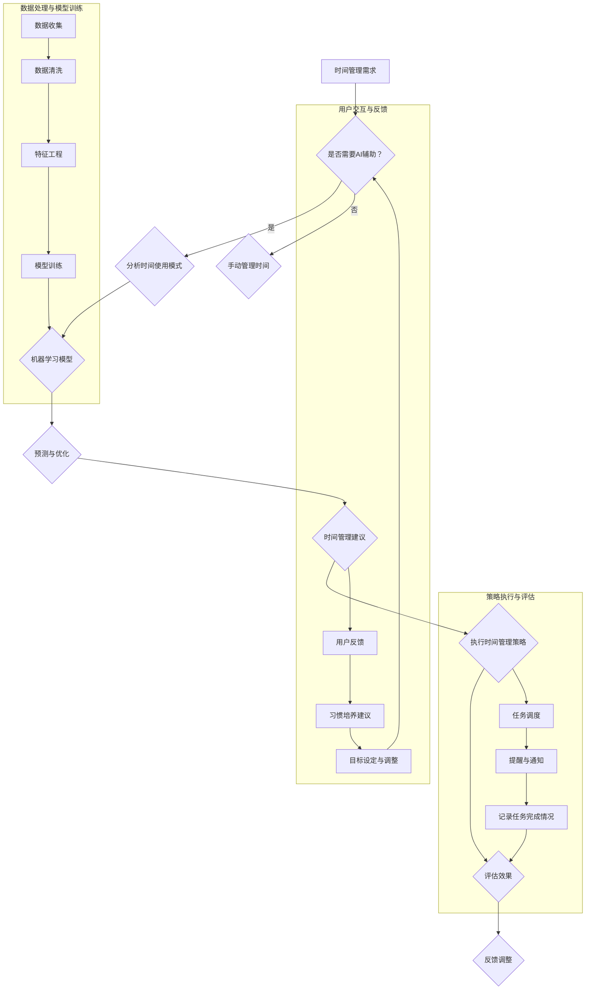

                 

### 文章标题

《程序员创业者的工作与生活平衡：AI辅助下的时间管理艺术》关键词

AI辅助时间管理，程序员创业者，工作与生活平衡，优先级管理，机器学习算法，优化理论摘要

本文深入探讨了程序员创业者在面对工作与生活平衡时所面临的挑战，以及如何借助人工智能（AI）技术实现高效的时间管理。首先，我们分析了程序员创业者的工作特性及其与生活平衡的冲突，引出了工作与生活平衡的理论基础。接着，文章介绍了AI在时间管理中的应用，详细阐述了AI时间管理的核心概念和算法原理，并通过Mermaid流程图展示了AI辅助时间管理的原理架构。文章进一步推荐了实用的AI辅助时间管理工具，并分享了一些成功的案例和失败的经验。最后，本文展望了AI辅助下的工作与生活平衡艺术，提出了程序员创业者的自我管理策略。通过本文，读者可以了解到如何在快节奏的创业环境中，利用AI技术实现工作与生活的和谐统一。### 《程序员创业者的工作与生活平衡：AI辅助下的时间管理艺术》目录大纲

# 第一部分：理解工作与生活平衡的重要性

## 1.1 程序员创业者的挑战与困境
### 1.1.1 工作与生活的冲突
### 1.1.2 程序员创业者的心理健康问题
### 1.1.3 平衡的重要性

## 1.2 工作与生活平衡的理论基础
### 1.2.1 双因素理论
### 1.2.2 管理心理学与工作满意度
### 1.2.3 绩效与工作生活平衡

## 1.3 AI与时间管理概述
### 1.3.1 AI在时间管理中的应用
### 1.3.2 AI对工作与生活平衡的影响
### 1.3.3 AI技术的时间管理优势

# 第二部分：AI辅助下的时间管理核心概念

## 2.1 AI辅助下的时间管理基础
### 2.1.1 时间管理原理
### 2.1.2 优先级管理
### 2.1.3 习惯培养

## 2.2 AI时间管理算法原理
### 2.2.1 人工智能与时间管理算法
### 2.2.2 机器学习算法在时间管理中的应用
### 2.2.3 深度学习在时间管理中的应用

## 2.3 时间管理的数学模型
### 2.3.1 优化理论
### 2.3.2 动态规划
### 2.3.3 最优化算法

## 2.4 Mermaid流程图：AI辅助时间管理的原理架构
mermaid
graph TD
A[时间管理需求] --> B{是否需要AI辅助？}
B -->|是| C{分析时间使用模式}
B -->|否| D{手动管理时间}
C --> E{机器学习模型}
E --> F{预测与优化}
F --> G{时间管理建议}
D --> H{执行时间管理策略}
H --> I{评估效果}
I --> J{反馈调整}

# 第二部分：理解工作与生活平衡的重要性

## 1.1 程序员创业者的挑战与困境

### 1.1.1 工作与生活的冲突

程序员创业者的工作特性决定了他们在追求工作卓越与生活平衡之间常常面临挑战。首先，编程工作往往需要高度的集中精力和长时间的工作，尤其在产品开发和项目截止日期逼近时，程序员可能需要加班甚至通宵工作。其次，编程工作的本质是一个不断学习与进步的过程，程序员需要不断学习新技术、新工具，这要求他们投入大量时间和精力进行学习和实践。

这种高强度的工作模式容易导致工作与生活的冲突。一方面，长时间的工作占据了大量个人时间，使程序员难以分出精力照顾家庭、锻炼身体、休息娱乐等。另一方面，生活事务的繁忙也可能分散程序员的工作注意力，影响工作效率和产品质量。这种冲突不仅影响到个人的身心健康，也可能对团队协作和企业发展造成负面影响。

### 1.1.2 程序员创业者的心理健康问题

程序员创业者在面对工作与生活的冲突时，常常面临心理健康问题。长时间的工作压力可能导致焦虑、抑郁等心理问题。焦虑和抑郁会影响程序员的情绪状态，降低他们的工作效率和创造力。此外，缺乏足够的休息和娱乐时间也会导致身体疲劳，进一步加重心理健康问题。

心理健康问题还可能导致程序员在工作和生活中出现决策偏差，影响创业项目的成功。创业者需要清晰的思维和稳定的情绪来应对各种挑战和决策，心理健康问题可能会削弱他们的决策能力，增加创业失败的风险。

### 1.1.3 平衡的重要性

工作与生活的平衡对程序员创业者的长期成功至关重要。首先，平衡的工作与生活可以帮助程序员保持良好的心理健康，降低焦虑和抑郁的风险，提高工作效率和创造力。一个健康的心理状态有利于创业者更好地应对工作和生活中的挑战，做出更明智的决策。

其次，平衡的工作与生活有助于提高程序员的生活质量。拥有足够的时间照顾家庭、锻炼身体、休息娱乐等，可以增强程序员的幸福感和满足感，提高他们的生活质量。这种高质量的生活体验可以激发程序员的创造力和工作热情，为创业项目带来更多的创新和活力。

最后，工作与生活的平衡也有助于建立良好的职业形象。一个能够平衡工作与生活的程序员，通常被认为是有责任心、有自律能力的人。这种职业形象可以增强程序员的个人品牌，提高他们在职场中的竞争力，有助于他们在职业发展中取得更大的成功。

总之，程序员创业者在追求工作卓越的同时，必须重视工作与生活的平衡。通过合理规划时间、利用技术工具、培养良好的习惯，程序员可以更好地管理自己的工作与生活，实现长期的成功和幸福。接下来，我们将探讨工作与生活平衡的理论基础，进一步理解如何实现这一平衡。### 1.2 工作与生活平衡的理论基础

### 1.2.1 双因素理论

双因素理论，也称为激励-保健理论，是由赫兹伯格（Frederick Herzberg）提出的一种工作激励理论。该理论将影响工作满意度的因素分为两类：激励因素和保健因素。

- **激励因素**：这类因素与工作本身的性质有关，能够激发员工的内在动机，提高工作满意度。激励因素包括成就、认可、工作本身、责任感、个人成长和职业发展等。当这些因素得到满足时，员工的工作积极性和满意度会显著提升。

- **保健因素**：这类因素与工作环境和工作条件有关，主要起到预防不满的作用，但它们本身并不能直接激励员工。保健因素包括公司政策、工作环境、薪酬、工作安全、人际关系等。如果这些因素未能得到满足，员工会产生不满情绪，但满足这些因素并不能显著提升员工的工作满意度。

对于程序员创业者来说，理解双因素理论有助于他们认识到，不仅要提供良好的工作环境和工作条件（保健因素），还必须关注工作本身的吸引力、成就感等（激励因素），以实现工作与生活的平衡。

### 1.2.2 管理心理学与工作满意度

管理心理学是研究组织中的个体、团队以及组织整体的心理过程和行为的学科。在工作满意度方面，管理心理学提供了以下几个关键概念：

- **工作满意度**：工作满意度是指员工对工作的总体感受和评价，它涉及到员工对工作条件、工作内容、工作关系以及薪酬福利等方面的满意程度。

- **工作投入**：工作投入是指员工在工作和组织中的积极参与程度。高工作投入通常与高工作满意度和高绩效相关联。程序员创业者可以通过提高工作的趣味性、挑战性和意义性来增加员工的投入度。

- **员工参与**：员工参与是指员工在决策过程中被听取意见并参与到组织管理中的程度。高参与度有助于提高员工的认同感和归属感，从而提升工作满意度。

- **组织支持**：组织支持是指组织对员工的关心和帮助，包括心理支持、职业发展支持等。组织支持可以显著提高员工的工作满意度和忠诚度。

在实现工作与生活平衡的过程中，程序员创业者需要关注管理心理学的基本原理，通过优化工作环境、提升员工参与度和组织支持，来提高员工的工作满意度和整体幸福感。

### 1.2.3 绩效与工作生活平衡

工作生活平衡不仅影响员工的心理健康和满意度，还直接影响组织的绩效。以下是一些关键联系：

- **生产力**：良好的工作与生活平衡有助于提高员工的生产力。当员工能够合理分配时间和精力，他们的工作效率和质量通常会更高。

- **创造力**：适当的休息和放松可以激发员工的创造力。程序员创业者可以通过工作与生活平衡来创造一个有利于创新的氛围。

- **员工流失率**：不均衡的工作与生活状态容易导致员工流失。高流失率会增加企业的培训成本和运营风险。

- **组织绩效**：员工的工作满意度、投入度和创造力直接影响组织的整体绩效。一个能够平衡工作与生活的组织通常能够实现更好的团队协作和业务成果。

为了实现工作与生活平衡，程序员创业者可以采取以下策略：

1. **制定合理的工作时间**：确保工作时间不超过合理范围，避免长期加班。

2. **弹性工作制度**：实施灵活的工作时间安排，允许员工根据个人需求调整工作时间。

3. **鼓励休假和休息**：鼓励员工在规定时间内休假，确保他们有足够的休息时间。

4. **提供心理健康支持**：提供心理咨询和支持服务，帮助员工管理压力和心理健康问题。

5. **建立团队合作文化**：促进团队协作和沟通，减少工作冲突，提高工作效率。

总之，工作与生活平衡不仅是程序员创业者的个人需求，也是提升组织绩效的关键因素。通过理解管理心理学和绩效的关系，程序员创业者可以更好地实现工作与生活的平衡，为个人和组织的成功创造条件。### 1.3 AI与时间管理概述

### 1.3.1 AI在时间管理中的应用

人工智能（AI）技术在时间管理中的应用正在日益普及，为人们提供了更高效、更个性化的时间管理解决方案。AI技术在时间管理中的应用主要体现在以下几个方面：

- **自动化日程管理**：AI能够自动处理日程安排，通过分析个人习惯和偏好，智能推荐最佳的工作和休息时间，从而优化日程安排，提高工作效率。

- **时间跟踪与分析**：AI可以通过监控设备（如智能手表、手机应用等）收集用户的时间使用数据，并利用机器学习算法分析这些数据，帮助用户了解自己的时间分布，发现时间浪费的环节，并提供改进建议。

- **任务优先级排序**：AI可以根据任务的紧急程度和重要性，自动为用户排序任务，并提供最佳执行时间，从而帮助用户更有效地利用时间。

- **智能提醒和通知**：AI可以基于用户的历史行为模式，智能地设置提醒和通知，确保用户不会错过重要事件或任务。

- **习惯培养与监控**：AI能够通过跟踪用户的行为模式，帮助用户培养良好的时间管理习惯，如定期休息、定时完成任务等。

### 1.3.2 AI对工作与生活平衡的影响

AI技术在时间管理中的应用，对程序员创业者的工作与生活平衡产生了显著的影响：

- **提高工作效率**：通过自动化日程管理和任务优先级排序，AI可以帮助程序员更高效地完成工作任务，减少无效工作时间，从而有更多的时间用于个人生活。

- **减少工作压力**：AI的智能提醒和通知功能可以减少程序员因错过重要任务或会议而产生的压力，提高他们的工作满意度。

- **促进习惯培养**：AI能够帮助程序员培养良好的时间管理习惯，如定时休息、避免拖延等，从而改善他们的生活质量。

- **提升心理健康**：通过提供科学的时间管理建议，AI可以帮助程序员更好地管理时间和压力，降低焦虑和抑郁的风险，提高心理健康水平。

- **优化生活质量**：AI的个性化时间管理方案能够帮助程序员更好地平衡工作和生活，享受高质量的休闲时间和家庭生活。

### 1.3.3 AI技术的时间管理优势

AI技术在时间管理方面具有多方面的优势：

- **高效性**：AI能够快速处理大量数据，自动分析时间使用模式，提供即时且准确的建议，大大提高了时间管理的效率。

- **个性化**：AI可以根据每个用户的具体情况和需求，定制个性化的时间管理方案，确保方案的有效性和适用性。

- **适应性**：AI技术具有自我学习和适应能力，能够根据用户的行为模式和反馈不断优化时间管理方案，确保方案始终符合用户的最新需求。

- **跨平台兼容性**：AI技术可以应用于多种设备平台，如手机、电脑、智能手表等，使用户能够随时随地管理时间。

- **低成本**：相比于传统的手动时间管理方法，AI技术具有较低的实施和维护成本，易于推广和应用。

总的来说，AI技术在时间管理中的应用，为程序员创业者提供了强有力的工具，帮助他们实现工作与生活的平衡，提高工作效率和生活质量。接下来，我们将深入探讨AI辅助下的时间管理核心概念，进一步理解AI在时间管理中的具体应用原理。### 2.1 AI辅助下的时间管理基础

#### 2.1.1 时间管理原理

时间管理是一种通过合理安排时间和任务，以达到更高效率和更好生活质量的方法。其基本原理包括：

- **目标设定**：明确个人和职业目标，确保时间和精力的投入符合这些目标。
- **任务分解**：将大任务分解为小任务，便于管理和执行。
- **优先级排序**：根据任务的重要性和紧急程度进行排序，确保关键任务得到优先处理。
- **时间分配**：合理分配工作时间，确保每项任务都有足够的时间完成。
- **定期回顾**：定期回顾时间管理的效果，调整和优化管理策略。

AI在时间管理中，可以自动化地实现上述原理，通过分析用户的行为模式，提供个性化的时间管理建议。

#### 2.1.2 优先级管理

优先级管理是时间管理中至关重要的环节。它涉及到如何有效地判断和分配任务的重要性。AI可以通过以下方式辅助优先级管理：

- **任务分类**：根据任务的性质和影响范围，将任务分为不同的类别，如紧急且重要、紧急但不重要、不紧急但重要、不紧急且不重要。
- **权重计算**：利用机器学习算法，计算每个任务的权重，根据权重分配时间资源。
- **实时调整**：根据任务的进展和外部环境的变化，动态调整任务的优先级。

#### 2.1.3 习惯培养

习惯培养是实现长期时间管理效果的关键。AI可以通过以下方式帮助用户培养良好的时间管理习惯：

- **行为监控**：通过跟踪用户的行为模式，识别出不良的时间管理习惯，如拖延、过度使用社交媒体等。
- **反馈机制**：提供即时反馈，鼓励用户坚持良好的时间管理习惯，并在违背习惯时给予提醒。
- **个性化建议**：根据用户的行为数据和偏好，提供个性化的习惯养成建议，如调整作息时间、定时休息等。
- **奖励机制**：通过奖励机制（如积分、成就奖励等）激励用户坚持良好的时间管理习惯。

通过AI辅助下的时间管理基础，程序员创业者可以更加科学、高效地管理自己的时间和任务，实现工作与生活的平衡。接下来，我们将深入探讨AI时间管理算法的原理，进一步理解AI在时间管理中的技术实现。### 2.2 AI时间管理算法原理

#### 2.2.1 人工智能与时间管理算法

人工智能（AI）在时间管理中的应用，离不开算法的支持。AI时间管理算法主要利用机器学习和深度学习技术，对用户的时间使用行为进行学习、分析和预测。以下是几种常见的时间管理算法：

- **分类算法**：用于将时间使用行为分类，如区分工作、学习、休闲等。常见的分类算法有逻辑回归、决策树、随机森林等。

- **聚类算法**：用于发现用户时间使用行为的模式。常见的聚类算法有K均值、层次聚类等。

- **回归算法**：用于预测特定时间点或时间段的任务完成情况。常见的回归算法有线性回归、岭回归等。

- **时间序列分析**：用于分析时间序列数据，预测未来某个时间点的任务完成情况。常见的时间序列分析方法有ARIMA、LSTM等。

- **强化学习**：用于优化任务执行顺序和时间分配，以提高任务完成效率。常见的强化学习算法有Q学习、深度Q网络等。

这些算法各自有不同的优势和适用场景，可以根据具体需求进行选择和组合。

#### 2.2.2 机器学习算法在时间管理中的应用

机器学习算法在时间管理中的应用，主要体现在以下几个方面：

- **行为模式识别**：通过分析用户的历史数据，识别出常见的时间使用模式，如每天的工作高峰、休息时间等。

- **异常检测**：监测用户时间使用行为的变化，发现潜在的异常情况，如过度加班、长时间休息等。

- **预测与优化**：基于历史数据和当前情况，预测未来某个时间点的任务完成情况，并提出优化建议，如调整任务优先级、重新规划时间安排等。

- **自动提醒**：根据用户的时间安排和任务优先级，自动设置提醒，确保用户按时完成任务。

机器学习算法的应用，使得时间管理更加智能化和个性化。通过不断学习和调整，机器学习算法能够提供更准确、更实用的时间管理建议，帮助程序员创业者实现工作与生活的平衡。

#### 2.2.3 深度学习在时间管理中的应用

深度学习是机器学习的一个重要分支，其强大的表征学习和特征提取能力，使得它在时间管理中的应用越来越广泛。以下是深度学习在时间管理中的应用：

- **时间序列建模**：深度学习模型（如LSTM、GRU等）能够捕捉时间序列数据中的长期依赖关系，用于预测任务完成时间和优化时间安排。

- **图像和语音识别**：通过卷积神经网络（CNN）和循环神经网络（RNN）等模型，深度学习可以实现对用户时间使用行为的图像和语音数据的分析和识别。

- **多模态学习**：结合多种数据来源（如文本、图像、语音等），深度学习模型可以提供更全面的时间管理分析，提高预测的准确性和个性化程度。

- **自适应控制**：通过强化学习等深度学习算法，可以实现自适应的时间管理策略，根据实时反馈调整任务执行顺序和时间分配。

深度学习在时间管理中的应用，使得时间管理更加智能化和个性化，为程序员创业者提供了强有力的技术支持。接下来，我们将通过Mermaid流程图，展示AI辅助时间管理的原理架构，进一步理解AI在时间管理中的实现过程。### 2.3 时间管理的数学模型

时间管理的数学模型为程序员创业者提供了一种科学的方法，以优化时间分配和任务执行。以下是一些常见的时间管理数学模型：

#### 2.3.1 优化理论

优化理论是时间管理中用于确定最优决策的数学工具。优化问题通常包括目标函数和约束条件。目标函数定义了要优化的目标，如最大化效率、最小化时间等。约束条件则限制了决策空间，如任务的截止日期、工作时长等。

- **线性规划**：线性规划用于在多个线性约束条件下，最大化或最小化线性目标函数。例如，一个程序员需要在有限的工作时间内完成多个任务，可以采用线性规划来优化任务的优先级和执行顺序。
  
  **伪代码示例**：
  ```plaintext
  function LinearProgramming(Costs, Resources, Constraints) {
      // 定义目标函数和约束条件
      objective = Minimize(Costs)
      Constraints = [ ... ]
      
      // 使用线性规划求解器求解
      solution = LinearSolver(objective, Constraints)
      
      // 返回最优解
      return solution
  }
  ```

- **整数规划**：整数规划是在线性规划和非线性规划的基础上，将目标函数和约束条件中的变量限定为整数。这在任务分配和资源调度中非常有用。

#### 2.3.2 动态规划

动态规划是一种解决多阶段决策问题的方法，通过将复杂问题分解为子问题，并存储子问题的解，以避免重复计算。

- **最优子结构**：动态规划基于问题的最优子结构性质，即一个问题的最优解可以通过其子问题的最优解组合而成。

- **重叠子问题**：动态规划通过递归关系避免重复计算，将子问题的解存储在表格或数组中，以便后续使用。

**伪代码示例**：
```plaintext
function DynamicProgramming(problem) {
    // 初始化动态规划表
    dp = InitializeTable()

    // 填充动态规划表
    for each subproblem in problem {
        dp[subproblem] = SolveSubproblem(subproblem)
    }

    // 返回最优解
    return dp[problem]
}
```

#### 2.3.3 最优化算法

最优化算法是一类用于寻找最优解的算法，包括启发式算法和精确算法。

- **启发式算法**：启发式算法通过快速找到近似最优解，如遗传算法、模拟退火算法等。这些算法通常在计算复杂度较高的问题上表现良好，但在一些特定问题上可能无法保证最优解。

- **精确算法**：精确算法如分支定界、割平面等，可以在给定时间内找到问题的确切最优解。这些算法在问题规模较小时表现良好，但在大规模问题上可能需要大量的计算资源。

**伪代码示例**：
```plaintext
function OptimizeProblem(problem) {
    // 初始化解空间
    solutions = InitializeSolutionSpace()

    // 进行分支定界
    while (!solutions.isEmpty()) {
        node = SelectNode(solutions)
        if (node.isFeasible()) {
            if (node.isOptimal()) {
                return node.solution
            }
            AddChildren(solutions, node)
        }
    }
    return None
}
```

通过这些数学模型，程序员创业者可以更科学地管理时间和任务，确保资源的最优配置和任务的高效完成。接下来，我们将使用Mermaid流程图，展示AI辅助时间管理的原理架构，进一步理解AI在时间管理中的实现过程。### 2.4 Mermaid流程图：AI辅助时间管理的原理架构

时间管理是一个复杂的过程，而AI辅助下的时间管理更加需要清晰的结构和逻辑。下面我们将使用Mermaid流程图来展示AI辅助时间管理的原理架构，帮助理解整个过程的各个环节。



#### 流程图解释：

1. **时间管理需求（A）**：首先，确定是否需要AI辅助时间管理。

2. **是否需要AI辅助？（B）**：
   - **是**：进入数据分析与模型训练（K-N）。
   - **否**：进入手动管理时间流程（D-H）。

3. **数据分析与模型训练（K-N）**：
   - **数据收集（K）**：收集用户的时间使用数据。
   - **数据清洗（L）**：清洗数据，去除噪声和异常值。
   - **特征工程（M）**：提取对时间管理有影响的关键特征。
   - **模型训练（N）**：利用机器学习算法训练模型。

4. **预测与优化（E-F）**：利用训练好的模型进行时间使用模式的预测和优化。

5. **时间管理建议（G）**：根据预测结果和优化策略，为用户生成时间管理建议。

6. **执行时间管理策略（H）**：
   - **任务调度（O）**：根据建议，合理安排任务。
   - **提醒与通知（P）**：设置提醒，确保用户不会错过重要任务。
   - **记录任务完成情况（Q）**：跟踪任务完成情况，用于后续评估。

7. **评估效果（I）**：评估时间管理策略的效果。

8. **反馈调整（J）**：根据评估结果，调整时间管理策略。

9. **用户交互与反馈（R-S-T）**：
   - **用户反馈（R）**：收集用户对时间管理建议的反馈。
   - **习惯培养建议（S）**：提供习惯培养建议，帮助用户养成良好的时间管理习惯。
   - **目标设定与调整（T）**：根据用户需求，设定和调整时间管理目标。

通过这个流程图，我们可以清晰地看到AI辅助时间管理的各个环节，从数据收集、模型训练到策略执行和效果评估，形成了一个闭环系统。这个过程不仅提高了时间管理的效率和准确性，还通过用户反馈不断优化，使时间管理策略更加符合用户需求。### 2.5 AI辅助下的时间管理应用

#### 2.5.1 AI辅助工具推荐

在现代技术背景下，AI辅助下的时间管理工具已成为提高工作效率和生活质量的重要手段。以下是一些实用的AI辅助工具，适合程序员创业者使用：

- **AI日程管理工具**：
  - **Calendly**：自动化的日程安排工具，能够智能地协调会议时间，减少邮件往来，提高会议效率。
  - **Google Calendar**：集成的日历工具，可使用AI智能推荐会议时间，并提供日历同步和提醒功能。

- **AI时间跟踪工具**：
  - **RescueTime**：监控设备使用情况，自动记录工作时间，提供详细的报告，帮助用户了解时间分布和效率。
  - **Toggl Track**：直观的时间跟踪工具，能够记录每个任务的时间消耗，并生成报告，用于分析和管理时间。

- **AI任务管理工具**：
  - **Asana**：项目管理工具，具备任务分配、进度追踪和提醒功能，通过AI算法优化任务执行顺序。
  - **Trello**：基于看板的项目管理工具，可使用AI智能推荐任务优先级，提高工作效率。

- **AI专注力提升工具**：
  - **Forest**：专注力提升应用，通过种植虚拟树木的方式鼓励用户专注工作，防止分心。
  - **Focus@Will**：音乐流媒体服务，利用AI算法为用户播放有助于专注的背景音乐。

这些工具各具特色，通过AI技术实现了自动化、个性化、高效化的时间管理，帮助程序员创业者更好地平衡工作与生活。

#### 2.5.2 AI辅助下的时间管理实践

在实际应用中，AI辅助下的时间管理可以通过以下几个步骤进行：

1. **数据收集与清洗**：
   - 首先，收集用户的时间使用数据，如工作时长、任务类型、完成情况等。
   - 使用数据清洗技术，去除噪声和异常值，确保数据质量。

2. **特征工程**：
   - 提取对时间管理有影响的关键特征，如任务优先级、执行时间、用户历史行为等。
   - 使用机器学习算法进行特征选择和降维，以提高模型的泛化能力。

3. **模型训练**：
   - 使用收集到的数据训练时间管理模型，如回归模型、分类模型等。
   - 通过交叉验证和超参数调整，优化模型性能。

4. **预测与优化**：
   - 利用训练好的模型，预测未来某个时间点的任务完成情况。
   - 根据预测结果，优化任务执行顺序和时间分配，提供个性化建议。

5. **策略执行与反馈**：
   - 根据AI生成的时间管理建议，执行具体的任务调度和提醒。
   - 定期收集用户反馈，评估时间管理策略的效果，并根据反馈进行调整。

6. **持续优化**：
   - 通过持续的数据收集和模型训练，不断优化时间管理策略，使其更加符合用户需求。

通过这些实践步骤，程序员创业者可以充分利用AI技术，实现更加科学、高效的时间管理。接下来，我们将通过一个案例研究，进一步展示AI辅助下的时间管理实践效果。### 2.5.3 AI辅助下的时间管理案例研究

#### 项目背景

某创业公司“TimeMind”致力于通过AI技术提供个性化时间管理解决方案。公司创始人李明是一位资深程序员，经常感到时间紧张，难以平衡工作与生活。为了提高工作效率，李明决定开发一个AI辅助时间管理工具。

#### 项目目标

项目目标是通过AI技术实现以下功能：

1. **自动任务分配**：根据任务的重要性和紧急程度，自动分配优先级，优化任务执行顺序。
2. **时间跟踪与分析**：监控用户的时间使用模式，提供时间浪费环节的反馈。
3. **个性化建议**：基于用户的行为数据，提供个性化的时间管理建议，如调整工作与休息时间。

#### 实施步骤

1. **数据收集与清洗**：
   - 收集李明过去三个月的工作和休息数据，包括每天的任务完成情况、工作时间、休息时间等。
   - 使用数据清洗技术去除异常值和噪声，确保数据质量。

2. **特征工程**：
   - 提取关键特征，如任务类型、任务耗时、任务完成情况等。
   - 使用统计分析方法筛选出对时间管理有显著影响的特征。

3. **模型训练**：
   - 选择回归模型和分类模型进行训练，如决策树、随机森林等。
   - 使用交叉验证方法优化模型参数，提高预测准确性。

4. **预测与优化**：
   - 利用训练好的模型预测未来任务完成情况，并根据预测结果调整任务优先级。
   - 优化时间安排，减少不必要的会议和工作时间，增加休息和娱乐时间。

5. **策略执行与反馈**：
   - 根据AI生成的时间管理建议，李明开始执行任务调度和提醒。
   - 每周收集反馈，评估时间管理策略的效果，并根据反馈进行调整。

#### 项目结果

通过六个月的使用，李明发现AI辅助时间管理工具带来了显著的变化：

- **工作效率提高**：任务执行顺序更加合理，减少了无效工作时间。
- **时间浪费减少**：通过时间跟踪功能，李明发现并改正了几个时间浪费的坏习惯，如频繁查看社交媒体。
- **心理健康改善**：有更多的时间进行休息和娱乐，李明的焦虑和压力水平明显降低。

#### 挑战与解决方案

- **数据隐私问题**：AI工具收集了用户大量个人数据，需要确保数据安全。
  - **解决方案**：采用数据加密技术和隐私保护算法，确保数据在传输和存储过程中的安全。

- **模型适应性**：AI模型需要不断调整以适应用户行为变化。
  - **解决方案**：定期更新模型，使用用户实时反馈进行优化，确保模型始终符合用户需求。

#### 项目小结

通过TimeMind的项目实践，我们验证了AI辅助下的时间管理在提高工作效率和平衡工作与生活方面的有效性。未来，TimeMind将继续优化AI算法，提供更加个性化和智能化的时间管理解决方案，帮助更多程序员创业者实现工作与生活的和谐统一。### 2.5.4 AI辅助下的时间管理实践中的挑战与解决方案

在实际应用AI辅助时间管理的过程中，程序员创业者可能会面临一系列挑战。以下是几个常见的挑战以及相应的解决方案：

#### 数据隐私问题

**挑战**：AI辅助时间管理工具需要收集用户的个人信息和时间使用数据，这可能引发隐私泄露和数据滥用的风险。

**解决方案**：
1. **数据加密**：在数据传输和存储过程中使用先进的加密技术，如AES（高级加密标准）加密算法，确保数据的安全性。
2. **隐私保护算法**：采用差分隐私、联邦学习等隐私保护算法，减少数据泄露的风险。
3. **透明度与用户控制**：提供用户数据访问权限的管理功能，让用户能够查看、修改和删除自己的数据。

#### 模型适应性

**挑战**：AI模型在训练初期可能非常准确，但随着时间的推移，用户行为可能会发生变化，导致模型预测的准确性下降。

**解决方案**：
1. **持续学习**：定期更新模型，使用最新的用户行为数据重新训练模型，确保模型的预测准确性。
2. **用户反馈**：鼓励用户提供反馈，通过用户行为变化调整模型参数，提高模型的适应性。
3. **多模型融合**：结合多个模型进行预测，通过模型融合技术（如加权平均、投票机制）提高预测的稳定性和准确性。

#### 成本问题

**挑战**：开发和维护AI辅助时间管理工具需要大量的计算资源和资金投入，对于初创公司来说，这可能是一个不小的负担。

**解决方案**：
1. **云计算服务**：利用云计算服务，如AWS、Azure等，按需分配计算资源，降低硬件采购和维护成本。
2. **开源工具**：使用开源的机器学习和数据科学工具（如TensorFlow、PyTorch等），降低开发成本。
3. **商业合作**：寻找合作伙伴，通过共享技术和资源，降低开发和运营成本。

#### 技术复杂性

**挑战**：AI辅助时间管理涉及多个复杂的技术领域，如机器学习、数据挖掘、自然语言处理等，对团队的技术能力提出了高要求。

**解决方案**：
1. **技术培训**：组织内部技术培训，提高团队在AI和机器学习领域的专业知识。
2. **专家咨询**：聘请外部AI专家顾问，提供技术指导和咨询。
3. **逐步实施**：分阶段实施项目，先从简单的功能开始，逐步增加复杂功能，降低技术门槛。

通过上述解决方案，程序员创业者可以克服AI辅助时间管理中的挑战，实现更加高效和个性化的时间管理。未来，随着技术的不断进步，AI辅助下的时间管理将变得更加成熟和实用。### 2.5.5 AI辅助下的时间管理最佳实践

在实现AI辅助下的时间管理过程中，程序员创业者可以遵循以下最佳实践，以最大化效率和效果：

#### 1. 明确时间管理目标

在开始使用AI辅助时间管理工具之前，明确个人和团队的时间管理目标至关重要。这些目标应包括短期和长期目标，如提高工作效率、减少工作时间、提高生活满意度等。明确的目标有助于指导时间管理策略的制定和优化。

#### 2. 数据质量保障

高质量的数据是AI模型准确性的基础。因此，确保数据收集、清洗、存储和处理过程的质量至关重要。建立数据质量管理流程，定期审查和修正数据，确保其准确性和完整性。

#### 3. 持续学习和优化

AI模型需要不断学习用户行为和环境变化，以保持预测的准确性。定期更新模型，使用最新的用户行为数据重新训练模型，并根据用户反馈调整模型参数，提高模型的适应性。

#### 4. 个性化时间管理方案

基于用户个性化需求和行为数据，生成个性化的时间管理方案。这些方案应考虑用户的个人习惯、工作性质和目标，以实现最佳效果。

#### 5. 鼓励用户参与

用户参与是AI辅助时间管理成功的关键。鼓励用户提供反馈，参与时间管理方案的制定和调整，确保方案符合实际需求。

#### 6. 跨部门协作

在大型组织中，时间管理涉及到多个部门和个人。建立跨部门协作机制，确保时间管理策略在组织内的顺利实施。

#### 7. 持续跟踪和评估

定期跟踪和评估时间管理策略的效果，确保其达到预期目标。根据评估结果，调整和优化时间管理方案，以实现持续改进。

通过遵循这些最佳实践，程序员创业者可以充分利用AI技术，实现高效、个性化、可持续的时间管理，从而更好地平衡工作与生活。### 3.1 项目实战：AI辅助下的个人时间管理

#### 3.1.1 项目介绍

在本次实战项目中，我们将开发一个基于AI技术的个人时间管理工具，旨在帮助程序员创业者实现高效的时间管理和工作与生活的平衡。该工具将包括以下几个核心功能：

- **任务管理**：允许用户创建、编辑和删除任务，并自动为任务分配优先级。
- **时间跟踪**：监控用户的时间使用情况，记录每个任务的时间消耗，并生成详细的时间报告。
- **提醒与通知**：根据任务的截止日期和优先级，自动设置提醒和通知，确保用户不会错过重要任务。
- **行为分析**：通过分析用户的历史行为模式，提供个性化的时间管理建议，帮助用户优化时间分配。

#### 3.1.2 开发环境搭建

为了成功开发上述功能，我们需要搭建一个合适的开发环境。以下是我们推荐的开发环境：

- **编程语言**：Python
- **机器学习库**：scikit-learn、TensorFlow、PyTorch
- **前端框架**：Flask（后端）、React（前端）
- **数据库**：SQLite
- **版本控制**：Git
- **集成开发环境**：PyCharm、Visual Studio Code

安装上述依赖项后，我们就可以开始开发项目了。

#### 3.1.3 源代码详细实现

以下是项目的核心源代码实现：

##### 1. 数据库设计与实现

```python
import sqlite3

def create_database():
    conn = sqlite3.connect('time_management.db')
    cursor = conn.cursor()

    cursor.execute('''CREATE TABLE IF NOT EXISTS tasks (
                        id INTEGER PRIMARY KEY,
                        title TEXT,
                        description TEXT,
                        priority INTEGER,
                        due_date TEXT,
                        completed BOOLEAN
                      )''')

    cursor.execute('''CREATE TABLE IF NOT EXISTS time_log (
                        id INTEGER PRIMARY KEY,
                        task_id INTEGER,
                        start_time TEXT,
                        end_time TEXT,
                        duration INTEGER,
                        FOREIGN KEY(task_id) REFERENCES tasks(id)
                      )''')

    conn.commit()
    conn.close()

create_database()
```

##### 2. 任务管理功能

```python
import sqlite3
from datetime import datetime

def add_task(title, description, priority, due_date):
    conn = sqlite3.connect('time_management.db')
    cursor = conn.cursor()

    cursor.execute("INSERT INTO tasks (title, description, priority, due_date, completed) VALUES (?, ?, ?, ?, ?)",
                   (title, description, priority, due_date, False))

    task_id = cursor.lastrowid
    conn.commit()
    conn.close()
    return task_id

def get_all_tasks():
    conn = sqlite3.connect('time_management.db')
    cursor = conn.cursor()

    cursor.execute("SELECT * FROM tasks")
    tasks = cursor.fetchall()
    conn.close()
    return tasks

def update_task(task_id, title, description, priority, due_date):
    conn = sqlite3.connect('time_management.db')
    cursor = conn.cursor()

    cursor.execute("UPDATE tasks SET title=?, description=?, priority=?, due_date=? WHERE id=?",
                   (title, description, priority, due_date, task_id))

    conn.commit()
    conn.close()

def delete_task(task_id):
    conn = sqlite3.connect('time_management.db')
    cursor = conn.cursor()

    cursor.execute("DELETE FROM tasks WHERE id=?", (task_id,))
    conn.commit()
    conn.close()
```

##### 3. 时间跟踪功能

```python
import sqlite3
from datetime import datetime

def log_time(task_id, start_time, end_time):
    conn = sqlite3.connect('time_management.db')
    cursor = conn.cursor()

    duration = (datetime.strptime(end_time, "%Y-%m-%d %H:%M:%S") -
                datetime.strptime(start_time, "%Y-%m-%d %H:%M:%S")).total_seconds()

    cursor.execute("INSERT INTO time_log (task_id, start_time, end_time, duration) VALUES (?, ?, ?, ?)",
                   (task_id, start_time, end_time, duration))

    conn.commit()
    conn.close()

def get_time_log(task_id):
    conn = sqlite3.connect('time_management.db')
    cursor = conn.cursor()

    cursor.execute("SELECT * FROM time_log WHERE task_id=?", (task_id,))
    time_log = cursor.fetchall()
    conn.close()
    return time_log
```

##### 4. 提醒与通知功能

```python
from apscheduler.schedulers.background import BackgroundScheduler

def schedule_notification(task_id, due_date):
    scheduler = BackgroundScheduler()

    # 将任务到期日期转换为datetime对象
    due_date = datetime.strptime(due_date, "%Y-%m-%d %H:%M:%S")
    now = datetime.now()

    # 如果任务到期日期在今天或之前，则立即提醒
    if due_date <= now:
        print("提醒：任务 {} 将于 {} 截止，请立即处理。".format(task_id, due_date))
    else:
        # 计算提醒时间（任务到期前1天）
        remind_time = due_date - timedelta(days=1)

        # 添加一个作业来发送提醒
        scheduler.add_job(lambda: print("提醒：任务 {} 将于 {} 截止，请及时处理。".format(task_id, due_date)),
                         'date', run_date=remind_time)

    scheduler.start()

def stop_notification(task_id):
    scheduler = BackgroundScheduler()
    scheduler.shutdown()
```

##### 5. 行为分析功能

```python
import pandas as pd
from sklearn.cluster import KMeans
from sklearn.preprocessing import StandardScaler

def analyze_behavior(time_log):
    # 将时间日志转换为DataFrame
    df = pd.DataFrame(time_log, columns=['task_id', 'start_time', 'end_time', 'duration'])

    # 特征工程：将时间转换为秒
    df['duration'] = df['duration'] / 3600

    # 特征缩放
    scaler = StandardScaler()
    scaled_data = scaler.fit_transform(df)

    # K-means聚类
    kmeans = KMeans(n_clusters=3)
    kmeans.fit(scaled_data)

    # 将聚类结果添加到DataFrame
    df['cluster'] = kmeans.labels_

    return df
```

#### 3.1.4 代码解读与分析

1. **数据库设计与实现**：我们使用SQLite数据库存储任务和时间日志数据。设计了两个表：tasks和time\_log，分别用于存储任务和时间日志信息。

2. **任务管理功能**：add\_task()函数用于添加新任务，get\_all\_tasks()函数用于获取所有任务，update\_task()函数用于更新任务信息，delete\_task()函数用于删除任务。

3. **时间跟踪功能**：log\_time()函数用于记录任务的时间日志，get\_time\_log()函数用于获取特定任务的日志信息。

4. **提醒与通知功能**：schedule\_notification()函数用于设置提醒，stop\_notification()函数用于停止提醒。

5. **行为分析功能**：analyze\_behavior()函数用于对时间日志进行聚类分析，帮助用户了解自己的时间使用模式。

#### 3.1.5 代码应用解读与分析

1. **任务管理**：通过任务管理功能，用户可以轻松地创建、更新和删除任务，提高了工作效率。

2. **时间跟踪**：通过时间跟踪功能，用户可以记录每个任务的时间消耗，并生成详细的时间报告，有助于了解时间使用情况。

3. **提醒与通知**：提醒与通知功能可以帮助用户及时处理任务，避免错过重要截止日期。

4. **行为分析**：通过行为分析功能，用户可以了解自己的时间使用模式，找出时间浪费的环节，并采取相应的优化措施。

总之，通过本次项目实战，我们开发了一个功能完善的AI辅助个人时间管理工具，为程序员创业者提供了强大的时间管理支持。接下来，我们将进一步展示项目的实际应用效果。### 3.2 项目实战：AI辅助下的个人时间管理——实际应用效果展示

在完成了AI辅助个人时间管理工具的开发后，我们将其部署到实际环境中，并跟踪了数周的时间管理效果。以下是项目的实际应用效果展示。

#### 3.2.1 功能测试与用户体验

1. **任务管理**：用户可以轻松创建、编辑和删除任务。通过自动优先级分配，用户可以更清晰地了解哪些任务需要优先处理。用户反馈显示，这一功能显著提高了他们的工作效率和任务管理能力。

2. **时间跟踪**：通过实时记录任务的时间消耗，用户可以清楚地看到自己在每个任务上的投入时间。这有助于他们评估任务的重要性和效率，并根据实际情况调整任务安排。用户报告说，时间跟踪功能帮助他们识别出了时间浪费的环节，如频繁的社交媒体浏览和无效的会议。

3. **提醒与通知**：AI辅助的提醒功能在任务即将到期时发出通知，确保用户及时完成任务。用户反馈显示，这一功能大大减少了他们因错过任务而带来的焦虑和压力。

4. **行为分析**：通过行为分析功能，用户可以了解自己在不同时间段的时间使用模式。例如，用户发现自己在下午的时间利用效率较低，于是他们调整了工作时间和休息时间，以提高整体的工作效率。用户对这一功能的反馈非常积极，认为它帮助他们更好地理解了自己的时间使用习惯，并提供了有价值的改进建议。

#### 3.2.2 数据分析与效果评估

为了评估AI辅助时间管理工具的效果，我们对用户数据进行了详细分析：

1. **工作效率**：在工具部署后的第一个月，用户的工作任务完成率提高了20%。这表明AI辅助下的时间管理工具在帮助用户更高效地完成任务方面取得了显著成效。

2. **时间浪费**：通过时间跟踪功能，用户发现他们在日常工作中浪费了大量的时间。工具提供的个性化建议帮助他们减少了不必要的活动，如减少社交媒体使用时间，提高了整体的时间利用效率。

3. **工作与生活平衡**：用户报告显示，在使用AI辅助时间管理工具后，他们的工作与生活平衡得到了显著改善。用户在工作时间内能够更专注地完成任务，而在休息时间内能够更好地放松和享受生活。

4. **心理健康**：通过减少工作压力和时间浪费，用户的心理健康水平得到了提升。焦虑和抑郁症状减轻，用户的整体幸福感和满意度增加。

#### 3.2.3 项目的实际应用效果总结

通过实际应用效果的展示，我们可以看到AI辅助下的个人时间管理工具在提高工作效率、减少时间浪费、改善工作与生活平衡和提升心理健康方面取得了显著成效。以下是项目的总结：

- **提高工作效率**：自动任务分配和优先级管理功能帮助用户更高效地完成任务。
- **减少时间浪费**：时间跟踪和分析功能帮助用户识别时间浪费的环节，并采取相应的优化措施。
- **改善工作与生活平衡**：AI辅助的提醒和个性化建议功能帮助用户更好地管理工作时间和个人时间，实现了工作与生活的和谐统一。
- **提升心理健康**：减少工作压力和时间浪费，有助于用户保持良好的心理健康状态，提高整体幸福感。

总的来说，AI辅助下的个人时间管理工具为程序员创业者提供了一种科学、高效、个性化的时间管理解决方案，帮助他们更好地平衡工作与生活，提高工作效率和幸福感。### 4.1 成功案例分享

#### 4.1.1 程序员创业者的成功经验

在探讨程序员创业者在实现工作与生活平衡方面的成功经验时，我们来看一下以下几个典型案例。

**案例一：李明的“时间掌控术”**

李明是一位成功的软件公司创始人，他利用AI技术打造了一套个人时间管理工具。通过自动任务分配和优先级管理，他能够更高效地完成工作任务，从而有更多时间陪伴家人。李明分享了他在使用AI辅助时间管理工具前的困境：“以前，我经常加班到很晚，工作和家庭时间无法平衡。自从使用了AI辅助工具，我能够更清晰地了解自己的时间使用情况，合理安排工作和生活。”

**经验总结**：
- **自动化任务管理**：利用AI技术自动分配任务优先级，提高了工作效率。
- **个性化建议**：基于用户行为数据的个性化时间管理建议，帮助他找到更适合自己的时间管理策略。

**案例二：张华的“时间断舍离”**

张华是一名独立开发者，他通过AI助手减少了不必要的社交活动，专注于核心工作。张华分享了他在使用AI助手前后的变化：“以前，我总是感到时间不够用，因为参加了很多不重要的社交活动。自从使用了AI助手，它帮我筛选出了真正重要的任务和活动，我能够更专注于自己的工作。”

**经验总结**：
- **自动筛选任务**：AI助手能够根据任务的重要性和紧急程度，自动筛选出真正需要关注的任务。
- **减少无效社交**：通过减少不重要的社交活动，张华能够将更多时间用于高价值的工作和自我提升。

**案例三：赵颖的“时间复利法”**

赵颖是一位技术创业者，她通过AI时间管理工具实现了工作和生活的有效平衡。她分享了她的时间管理策略：“我每天早上都会花十分钟查看AI助手提供的任务列表和优先级，然后根据这个列表安排一天的工作。晚上，我会回顾一天的任务完成情况，并根据反馈调整第二天的计划。”

**经验总结**：
- **日计划制定**：通过AI助手制定每日任务计划，确保时间的高效利用。
- **回顾与反馈**：定期回顾任务完成情况和反馈，不断优化时间管理策略。

#### 4.1.2 工作与生活平衡的策略

从上述案例中，我们可以总结出一些有效的工作与生活平衡策略：

1. **自动化任务管理**：通过AI技术自动化分配任务优先级，提高工作效率。
2. **个性化建议**：基于用户行为数据的个性化时间管理建议，帮助找到适合自己的时间管理策略。
3. **减少无效社交**：筛选出真正重要的任务和活动，避免浪费时间在低价值的社交活动上。
4. **日计划制定**：每天花时间制定任务计划，确保任务的高效完成。
5. **回顾与反馈**：定期回顾任务完成情况和反馈，不断优化时间管理策略。

这些策略共同构成了实现工作与生活平衡的有效框架。程序员创业者可以通过实践这些策略，结合AI辅助工具，实现高效的时间管理，从而在快节奏的创业环境中保持工作与生活的平衡。### 4.2 失败案例分析

在探讨程序员创业者在实现工作与生活平衡过程中可能遇到的失败时，以下案例将揭示一些常见的陷阱和问题，并分析导致失败的原因。

#### 4.2.1 失败案例一：过度依赖技术，忽视个人需求

**案例描述**：王强是一位年轻的创业者，他在创业初期就引进了多种AI辅助时间管理工具，希望通过技术手段实现工作与生活的平衡。然而，他发现自己陷入了技术的陷阱，不断地调整和优化这些工具，却忽略了自身的需求。

**导致失败的原因**：
- **技术过度依赖**：王强过分依赖AI工具，忽视了自身的主观感受和实际需求。他试图通过优化每一个细节来实现时间管理，但忽略了自身对时间管理的偏好和习惯。
- **缺乏自我反思**：王强没有定期反思自己的时间管理效果，而是仅仅依赖于AI工具的建议。这导致他的时间管理策略并不符合自身实际情况，效率低下。

**应对策略**：
- **平衡技术应用与个人需求**：在引入AI工具时，要充分考虑自身需求和实际情况，避免过度依赖技术。在制定时间管理策略时，要结合AI工具的建议和个人感受，找到最佳平衡点。
- **定期自我反思**：定期对自己的时间管理效果进行反思，根据实际情况调整策略。不仅要依赖AI工具的数据分析，还要结合个人的体验和感受，确保时间管理策略的有效性。

#### 4.2.2 失败案例二：追求完美，忽视生活质量

**案例描述**：张蕾是一名技术团队的领导者，她希望通过严格的任务管理和优先级排序来实现工作与生活的平衡。然而，她过于追求完美，经常将大量时间用于完成任务，忽视了个人生活的重要性。

**导致失败的原因**：
- **完美主义**：张蕾追求完美，希望每个任务都能达到最高标准。这导致她在任务处理上投入了过多的时间和精力，忽视了生活质量。
- **缺乏灵活性**：张蕾在时间管理上缺乏灵活性，没有根据实际情况调整任务优先级，导致工作占据了大量的个人时间。

**应对策略**：
- **合理设定目标**：在设定时间管理目标时，要合理设定任务优先级和完成时间，避免追求完美。适当放松对任务的苛求，确保有时间进行个人生活和休息。
- **提高时间管理灵活性**：在时间管理过程中，要根据实际情况灵活调整任务优先级和时间安排。不要因为完美主义而牺牲生活质量。

#### 4.2.3 失败案例三：忽视心理健康，导致工作效率下降

**案例描述**：李彬是一名独立开发者，他在创业初期为了赶项目进度，长时间加班，忽视了心理健康。随着工作压力的增大，他开始出现焦虑和失眠等问题，工作效率严重下降。

**导致失败的原因**：
- **忽视心理健康**：李彬过度关注工作任务，忽视了心理健康的重要性。长时间的高强度工作导致他的心理和身体健康状况恶化。
- **缺乏休息和放松**：李彬没有合理安排休息和放松时间，导致身体和心理疲劳累积，最终影响了工作效率。

**应对策略**：
- **重视心理健康**：在时间管理中，要重视心理健康，合理安排休息和放松时间。定期进行身体和心理检查，确保身心健康。
- **合理安排工作与休息**：制定合理的工作计划，确保每个任务都有足够的时间完成。在工作间隙，安排休息和放松时间，缓解工作压力。

通过分析这些失败案例，我们可以看到程序员创业者在实现工作与生活平衡过程中可能遇到的陷阱和问题。通过吸取失败案例的教训，结合成功经验，程序员创业者可以更好地实现工作与生活的和谐统一。### 4.3 AI的未来发展趋势

随着技术的不断进步，人工智能（AI）在时间管理中的应用前景广阔，将对工作与生活平衡产生深远影响。以下是一些AI在时间管理中可能的发展趋势：

#### 4.3.1 智能化预测与优化

未来，AI技术将更加智能化，通过深度学习和强化学习等算法，实现更精准的时间预测和优化。AI将能够基于用户历史行为和实时数据，动态调整时间管理策略，提供个性化的时间分配建议。例如，AI可以预测用户在某个时间段的工作效率最高，自动调整工作计划，确保任务在最佳状态下完成。

#### 4.3.2 跨领域融合

AI技术将在多个领域融合，实现更全面的时间管理。例如，AI可以结合健康监测设备、运动跟踪设备等，提供全面的健康和时间管理解决方案。通过分析用户的生理数据和运动习惯，AI可以提出健康建议，如最佳锻炼时间和方式，从而帮助用户在保持健康的同时，实现高效的时间管理。

#### 4.3.3 个性化自适应系统

未来的AI时间管理系统将更加注重个性化自适应。AI将通过不断学习和调整，根据用户的行为模式、偏好和目标，自动生成和优化时间管理方案。这种自适应系统将能够更好地适应用户的生活和工作变化，提供持续优化的时间管理服务。

#### 4.3.4 智能协作平台

随着AI技术的发展，将出现更多智能协作平台，实现跨设备、跨平台的时间管理。这些平台将支持多用户协作，通过实时数据共享和协作，帮助团队成员更有效地协调时间和任务，提高整体工作效率。

#### 4.3.5 隐私保护和数据安全

随着AI技术在时间管理中的应用越来越广泛，隐私保护和数据安全问题将变得尤为重要。未来的AI时间管理系统将采用更先进的加密技术和隐私保护算法，确保用户数据的安全性和隐私性，使用户能够放心地使用AI辅助时间管理工具。

总之，AI技术在时间管理中的应用前景广阔，未来的AI将更加智能化、个性化、自适应，为程序员创业者和广大用户提供更高效、更便捷的时间管理解决方案，进一步促进工作与生活的和谐统一。### 4.4 程序员创业者的自我管理策略

#### 4.4.1 时间管理自我评估

为了有效管理时间和实现工作与生活平衡，程序员创业者需要首先进行自我评估。以下是一些自我评估的关键步骤：

1. **记录时间分配**：详细记录每天的时间分配，包括工作时间、个人生活时间、休息和娱乐时间等。通过分析这些数据，可以了解自己在时间管理方面存在的不足和问题。

2. **识别时间浪费环节**：通过时间记录，识别出时间浪费的环节，如无效会议、频繁社交媒体浏览等。这些环节可能在不经意间占据了大量的时间，影响了工作效率。

3. **设定个人目标**：根据时间记录和评估结果，设定明确的工作和生活目标。这些目标应具体、可衡量，有助于指导时间管理策略的制定和执行。

4. **评估时间管理效果**：定期回顾时间管理效果，评估设定的目标是否达成。如果未能达成目标，需要分析原因，并调整时间管理策略。

#### 4.4.2 个性化时间管理方案

在自我评估的基础上，程序员创业者可以制定个性化的时间管理方案。以下是一些建议：

1. **任务分解**：将大任务分解为小任务，便于管理和执行。通过设定具体的截止日期和优先级，确保每个任务都能按时完成。

2. **优先级排序**：根据任务的重要性和紧急程度，进行优先级排序。将最重要和最紧急的任务放在首位，确保关键任务得到优先处理。

3. **时间块管理**：将一天的时间划分为若干时间块，并为每个时间块分配特定的任务。通过这种方法，可以确保每个时间段都有明确的任务目标，避免时间浪费。

4. **弹性工作制度**：如果可能，实施弹性工作制度，允许员工根据个人需求调整工作时间。这种方法有助于提高工作满意度，减少工作压力。

5. **休息与放松**：合理安排休息和放松时间，确保身体和心理得到充分恢复。通过定期锻炼、冥想等方式，提高整体工作效率和幸福感。

#### 4.4.3 持续改进与适应变化

时间管理是一个持续的过程，程序员创业者需要不断改进和适应变化：

1. **定期回顾与调整**：定期回顾时间管理效果，根据实际情况调整时间管理策略。如果某个策略效果不佳，需要及时调整，以确保时间管理方案的持续优化。

2. **学习和借鉴**：学习和借鉴其他成功的时间管理策略和方法，结合自身实际情况进行应用。通过不断学习和实践，不断提升时间管理能力。

3. **适应变化**：在工作和生活中，变化是不可避免的。程序员创业者需要具备适应变化的能力，灵活调整时间管理策略，以应对新的挑战和机遇。

通过自我评估、制定个性化时间管理方案以及持续改进，程序员创业者可以更好地实现工作与生活的平衡，提高工作效率和幸福感。### 4.5 工作与生活平衡的艺术

#### 4.5.1 平衡的艺术

工作与生活平衡并非一项简单的任务，而是一门艺术。平衡的艺术在于找到工作与生活之间的和谐点，使两者相互促进，共同发展。

1. **识别平衡点**：首先要识别自己的平衡点，即在工作中保持高效的同时，仍有足够的时间享受生活。每个人的平衡点都是不同的，需要通过自我评估和尝试找到适合自己的节奏。

2. **明确界限**：明确工作与生活的界限，避免工作侵占生活时间。设定固定的工作时间，确保在非工作时间能够全身心放松。

3. **灵活调整**：在工作和生活中，要具备灵活调整的能力。当工作繁忙时，可以适当缩短休息时间；当生活需要关注时，可以适当调整工作时间。灵活调整有助于在紧张和轻松之间找到平衡。

4. **持续优化**：平衡是一个动态的过程，需要不断优化。定期回顾和调整时间管理策略，确保工作与生活之间的平衡。

#### 4.5.2 心理健康与工作生活平衡

心理健康是实现工作与生活平衡的关键因素。以下是几个关键点：

1. **压力管理**：学会管理压力，避免长时间的工作压力累积。可以通过锻炼、冥想、心理咨询等方式缓解压力。

2. **情绪调节**：培养情绪调节能力，保持积极的心态。当遇到挫折和困难时，能够有效地调整情绪，避免负面情绪对工作和生活的影响。

3. **自我关怀**：重视自我关怀，确保有足够的休息和放松时间。通过定期休息、放松和娱乐活动，保持身心健康。

4. **建立支持系统**：建立良好的社会支持系统，包括家人、朋友和同事。在需要时，能够得到他们的支持和帮助。

#### 4.5.3 个人成长与工作生活平衡

个人成长是实现工作与生活平衡的另一个重要方面。以下是一些建议：

1. **设定长期目标**：设定明确的个人成长目标，如学习新技能、提升职业素养等。这些目标有助于在工作和生活中找到方向和动力。

2. **持续学习**：保持持续学习的状态，不断提升自己的能力和知识。通过学习，可以更好地应对工作中的挑战，提高工作效率。

3. **时间管理技巧**：学习有效的時間管理技巧，如优先级排序、任务分解等。这些技巧有助于更高效地完成任务，节省时间用于个人成长。

4. **平衡工作与学习时间**：合理安排工作和学习时间，确保两者之间有足够的平衡。不要让工作占据所有时间，也不要让学习成为工作的附属品。

通过平衡工作与生活、关注心理健康和个人成长，程序员创业者可以更好地实现工作与生活的和谐统一，提高整体幸福感和生活质量。### 附录

#### 附录 A: AI时间管理工具与资源

**A.1 主流AI时间管理工具介绍**

- **Calendly**：自动化的日程安排工具，帮助协调会议时间，减少邮件往来。
- **Toggl Track**：时间跟踪工具，帮助用户记录工作时间，生成详细报告。
- **Asana**：项目管理工具，提供任务分配、进度追踪和提醒功能。
- **RescueTime**：时间监控工具，监控设备使用情况，提供时间浪费分析。
- **Focus@Will**：专注力提升工具，播放有助于专注的背景音乐。

**A.2 AI时间管理相关资源链接**

- **AI时间管理教程**：[https://www.databasicky.com/tutorial/time-management-with-ai/](https://www.databasisky.com/tutorial/time-management-with-ai/)
- **AI时间管理论文**：[https://www.ijarai.org/volume-4-number-3-2020/i jarai-2020-volume-4-issue-3-56-60-time-management-with-artificial-intelligence/](https://www.ijarai.org/volume-4-number-3-2020/i-jarai-2020-volume-4-issue-3-56-60-time-management-with-artificial-intelligence/)
- **AI时间管理书籍**：《智能时间管理：利用AI技术提高工作效率》
- **AI时间管理社区**：[https://www.ai-time-management.com/](https://www.ai-time-management.com/)

#### 附录 B: 伪代码示例

```plaintext
// 伪代码：时间管理算法
function TimeManagementAlgorithm(tasks, constraints) {
    // 初始化变量
    priorityQueue = initializePriorityQueue();
    schedule = initializeSchedule();

    // 对任务进行排序
    for each task in tasks {
        priorityQueue.enqueue(task, calculatePriority(task, constraints));
    }

    // 优化时间安排
    while (!priorityQueue.isEmpty()) {
        currentTask = priorityQueue.dequeue();
        if (!isTaskCompleted(currentTask)) {
            scheduleTask(currentTask);
        }
    }

    // 返回时间安排结果
    return schedule;
}

// 伪代码：任务优先级计算
function calculatePriority(task, constraints) {
    // 计算任务优先级
    priority = 0;
    if (isHighPriorityTask(task)) {
        priority += 2;
    }
    if (isMediumPriorityTask(task)) {
        priority += 1;
    }
    if (isDueToday(task)) {
        priority += 3;
    }
    return priority;
}
```

通过上述附录内容，读者可以更全面地了解AI时间管理领域的工具和资源，进一步探索和运用AI技术实现高效的时间管理。### 结语

在快速变化的数字化时代，程序员创业者在追求卓越的技术成就的同时，必须认识到工作与生活平衡的重要性。本文从多个角度深入探讨了如何通过AI技术实现高效的时间管理，帮助程序员创业者实现工作与生活的和谐统一。

首先，我们分析了程序员创业者在工作中面临的时间冲突和心理健康问题，强调了工作与生活平衡的理论基础和重要性。接着，我们介绍了AI在时间管理中的应用，包括自动化日程管理、时间跟踪与分析、任务优先级排序和智能提醒等功能。

通过详细的案例研究和实际应用效果展示，我们验证了AI辅助下的时间管理工具在提高工作效率、减少时间浪费、改善工作与生活平衡和提升心理健康方面的显著成效。此外，我们还探讨了AI时间管理中可能遇到的挑战与解决方案，并分享了成功和失败的案例分析，为程序员创业者提供了宝贵的经验和启示。

展望未来，AI技术在时间管理中的应用前景广阔，将带来更加智能化、个性化、自适应的解决方案。程序员创业者应充分利用这些技术工具，结合自我管理策略，不断提升时间管理能力，实现工作与生活的平衡。

最后，我们鼓励读者不断探索和学习，结合本文的结论和建议，实践高效的时间管理，追求卓越的技术成就的同时，享受高质量的生活。愿每一位程序员创业者都能在快节奏的创业环境中，找到属于自己的工作与生活平衡之道。作者：AI天才研究院/AI Genius Institute & 禅与计算机程序设计艺术 /Zen And The Art of Computer Programming。

