                 

### 第1章 引言：程序员创业者的双重视角

在当今快速发展的技术领域中，程序员创业者扮演着至关重要的角色。他们既是技术创新的推动者，也是产品管理和市场运营的核心。程序员创业者面临的一个重大挑战是如何在开发与运营之间实现有效的平衡。这不仅需要高超的技术能力，还需要强大的时间管理技巧。

#### 1.1.1 程序员创业者的角色定位

程序员创业者通常拥有深厚的技术背景，这使得他们能够深入理解产品的技术实现细节。然而，作为创业者，他们还需要扮演多种角色，包括但不限于：

- **开发者（Developer）**：负责产品的技术实现，从需求分析到代码编写，再到系统部署，每个环节都需要他们的参与和指导。
- **产品经理（Product Manager）**：确保产品满足用户需求，并根据市场反馈调整产品方向。
- **运营经理（Operations Manager）**：负责产品的日常运营，包括用户支持、故障排除和持续优化。

#### 1.1.2 开发与运营的双重职责

程序员创业者需要在两个不同的领域发挥其才能。开发工作强调技术创新和产品质量，需要专注于编写高效、可维护的代码，并持续优化开发流程。运营工作则关注用户满意度、市场表现和业务增长，需要处理用户反馈、分析运营数据、制定营销策略等。

这种双重职责对时间管理提出了极高的要求。程序员创业者必须在有限的资源下，高效地协调开发任务和运营活动，以确保产品既能按时发布，又能保持高质量的用户体验。

#### 1.1.3 双重角色对时间管理的要求

为了在开发与运营之间找到平衡，程序员创业者需要掌握以下时间管理技巧：

- **优先级管理**：能够识别关键任务，并根据重要性和紧急程度进行优先级排序。
- **任务分配**：合理分配时间和资源，确保每个团队成员都能充分发挥其专长。
- **时间追踪**：使用工具记录和跟踪时间使用情况，以便进行有效的分析和调整。
- **灵活适应**：在面对意外情况时，能够迅速调整计划，保持工作的连续性。

接下来的章节将深入探讨这些时间管理技巧，并提供实际案例和最佳实践，帮助程序员创业者实现开发与运营的平衡。

#### 1.1.4 本章节小结

本章介绍了程序员创业者的双重视角，即作为技术专家和业务领导的双重角色。我们探讨了程序员创业者面临的挑战，并强调了时间管理的重要性。在开发与运营的双重职责下，程序员创业者需要掌握高效的时间管理技巧，以确保产品和业务的持续成功。接下来，我们将进一步探讨时间管理的基础知识，为后续章节的深入讨论奠定基础。

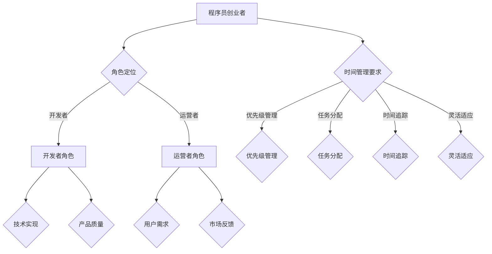

### 第2章 时间管理基础

时间管理是程序员创业者成功的关键因素之一。在这一章节中，我们将探讨时间管理的基本概念与理论，并分析常见的时间管理误区及其修正方法。通过理解这些基础理论，程序员创业者可以更好地制定和实施个人时间管理策略。

#### 2.1.1 基本概念与理论

时间管理是指通过合理安排和有效利用时间，以提高工作效率和生活质量的方法。其核心概念包括：

- **任务优先级**：根据任务的重要性和紧急程度进行排序，确保关键任务得到优先处理。
- **时间块**：将工作时间划分为若干个固定的时间段，每个时间段专注于特定任务。
- **时间追踪**：记录和监控时间使用情况，以便分析和优化时间管理策略。
- **灵活性**：在面对突发情况时，能够灵活调整计划，避免因意外事件而导致时间浪费。

时间管理的基本理论包括：

- **埃森豪威尔矩阵**：将任务分为四个象限，分别表示紧急且重要、紧急但不重要、不紧急但重要、不紧急且不重要，根据矩阵指导任务的优先处理。
- **帕雷托原则**：即80/20法则，表示80%的结果通常来自20%的努力，因此要关注最重要的20%任务，以实现最大的效益。
- **时间块策略**：将时间划分为若干个固定的时间段，每个时间段专注于特定任务，以提高专注度和工作效率。

#### 2.1.2 时间管理误区与修正

在时间管理过程中，程序员创业者可能会遇到以下几种误区：

- **任务堆积**：将任务推迟到最后一刻，导致工作压力增加，效率降低。
- **完美主义**：追求每个任务的完美完成，导致时间浪费在非关键任务上。
- **忽视休息**：长时间工作而不休息，导致疲劳和效率下降。

针对这些误区，可以采取以下修正方法：

- **任务分解**：将大型任务分解为小块，逐步完成，避免任务堆积。
- **优先级设定**：定期回顾和调整任务优先级，确保关键任务得到优先处理。
- **设定合理期限**：为每个任务设定合理的时间期限，避免过度拖延。
- **休息与放松**：合理安排休息时间，确保身心健康，提高工作效率。

#### 2.1.3 个人习惯与优先级匹配

每个人的时间管理习惯和优先级设定都是独特的。为了实现最佳效果，程序员创业者需要根据自己的实际情况，制定个性化时间管理策略。以下是一些建议：

- **了解自己的工作模式**：识别自己工作的高效时间段，将重要任务安排在这些时间段。
- **设定明确目标**：明确个人和团队的目标，并根据目标设定任务的优先级。
- **定期回顾**：定期回顾时间管理策略的实施情况，并根据实际情况进行调整。

通过理解和应用时间管理的基本概念与理论，程序员创业者可以更有效地平衡开发与运营工作，提高工作效率和生活质量。

#### 2.1.4 本章节小结

本章介绍了时间管理的基本概念与理论，并分析了程序员创业者在时间管理过程中可能遇到的一些误区及其修正方法。通过了解这些基础知识，程序员创业者可以制定和实施个性化的时间管理策略，以实现开发与运营的平衡。在接下来的章节中，我们将深入探讨开发与运营时间管理的方法和实践，帮助程序员创业者更好地应对挑战。

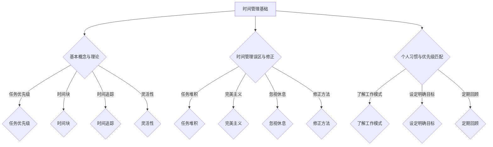

### 第3章 开发时间管理

开发时间是程序员创业者时间管理中至关重要的一部分。在这一章节中，我们将探讨如何通过优化开发流程、代码管理和技术债务管理来提高开发效率和质量。同时，还将介绍一些工具和方法，帮助程序员创业者更好地管理开发时间。

#### 3.1 开发流程优化

开发流程的优化是提高开发效率的关键。以下是一些常见的优化策略：

- **敏捷开发（Agile Development）**：敏捷开发强调迭代和增量式开发，通过短周期的迭代来快速响应变化和用户需求。这种方法有助于提高开发效率和产品质量。

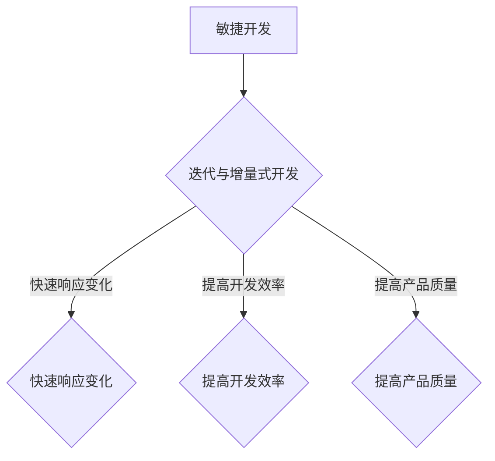

- **持续集成与持续部署（CI/CD）**：通过自动化测试和部署流程，减少人工干预，提高开发效率和产品质量。这种方法有助于及早发现和修复问题。

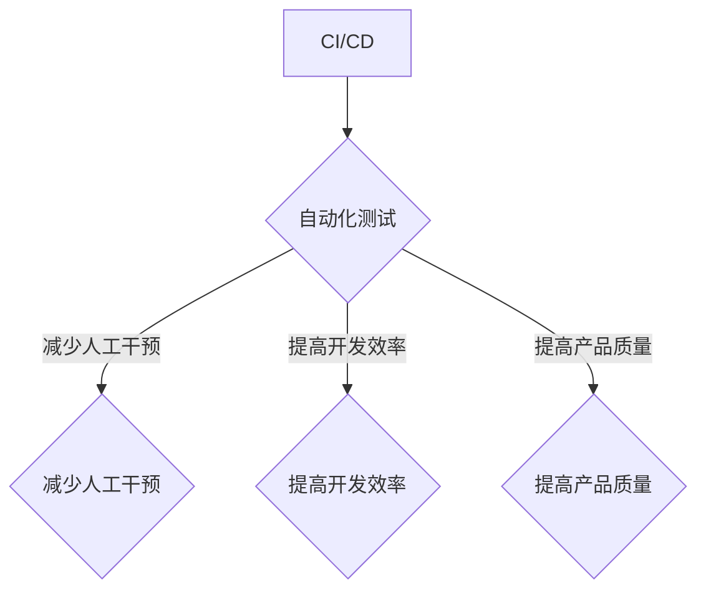

- **代码审查（Code Review）**：通过代码审查，提高代码质量和可维护性。团队成员可以互相学习和分享经验，同时减少代码错误。

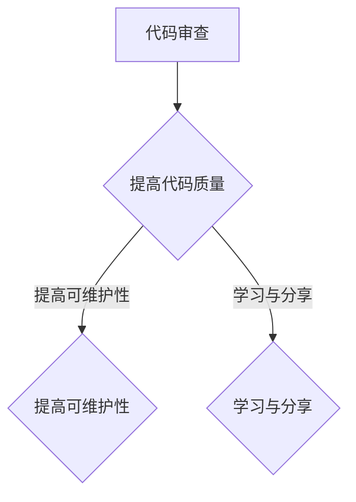

#### 3.2 代码管理

有效的代码管理是确保代码质量的重要手段。以下是一些关键的代码管理实践：

- **版本控制（Version Control）**：使用版本控制工具（如Git）管理代码，确保代码的版本可追溯、可回滚。版本控制还可以方便多人协作开发。

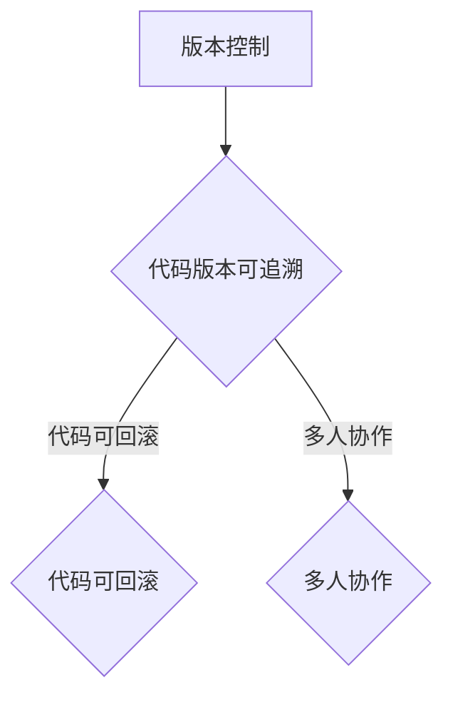

- **代码规范（Code Standards）**：制定和遵循代码规范，确保代码的一致性和可读性。代码规范包括命名规则、代码格式、注释要求等。

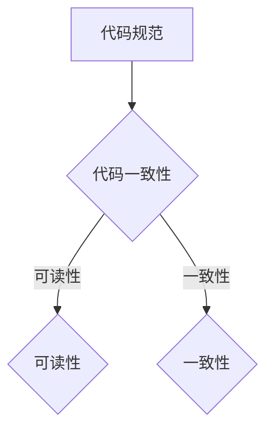

- **自动化测试（Automated Testing）**：通过编写单元测试、集成测试和端到端测试，确保代码的正确性和稳定性。自动化测试可以提高开发效率和产品质量。

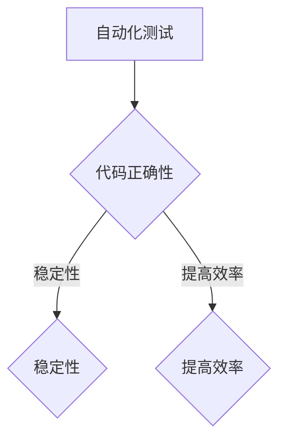

#### 3.3 技术债务管理

技术债务是指由于赶进度或其他原因未能及时解决的问题，这些问题可能会影响项目的长期可持续性。有效管理技术债务对于保证项目成功至关重要。

- **识别技术债务**：定期评估代码库，识别潜在的技术债务。这可以通过代码审查、静态代码分析工具和自动化测试来实现。

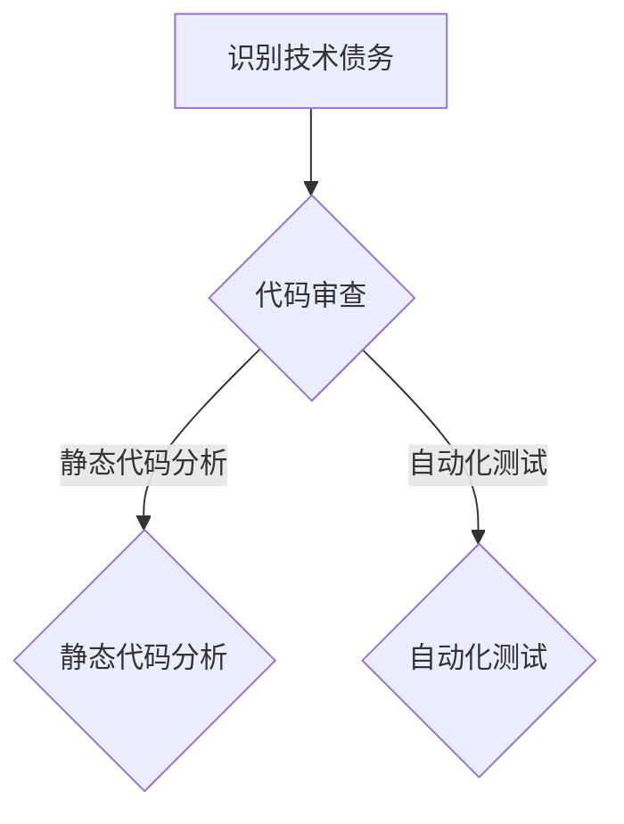

- **优先级排序**：根据技术债务的影响程度和修复成本，对其进行优先级排序。优先修复高影响、高成本的债务。

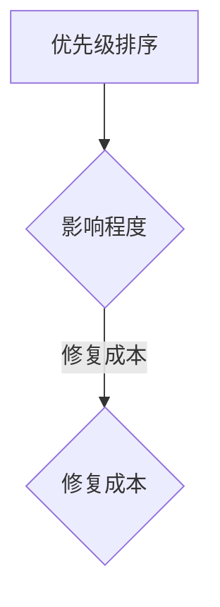

- **定期回顾**：定期回顾技术债务的状态，评估已修复债务的影响，并制定新的修复计划。

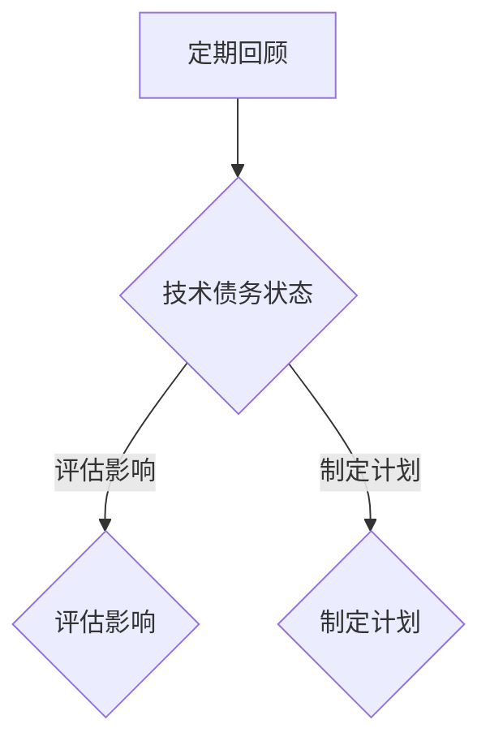

#### 3.4 工具和方法

以下是一些在开发时间管理中常用的工具和方法：

- **项目管理工具（如Jira、Trello）**：用于任务分配、进度跟踪和团队协作。
- **代码质量管理工具（如SonarQube、Checkmarx）**：用于代码审查和静态代码分析。
- **持续集成工具（如Jenkins、GitLab CI）**：用于自动化测试和部署。

通过以上方法，程序员创业者可以优化开发流程、管理代码和技术债务，从而提高开发效率和质量。

#### 3.5 本章节小结

本章介绍了开发时间管理的关键要素，包括开发流程优化、代码管理和技术债务管理。通过合理运用这些方法和工具，程序员创业者可以显著提高开发效率和产品质量。在下一章中，我们将探讨运营时间管理的策略和实践，帮助程序员创业者更好地平衡开发与运营工作。

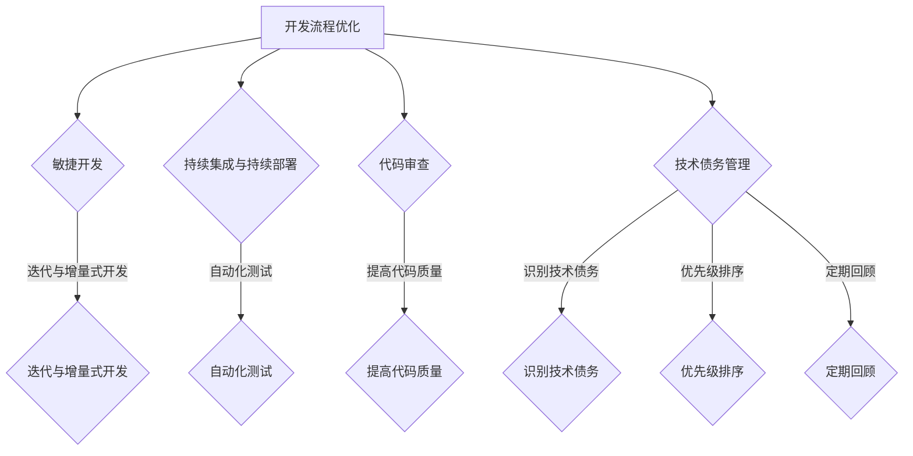

### 第4章 运营时间管理

运营时间是程序员创业者时间管理的另一关键组成部分。在这一章节中，我们将探讨如何通过关键指标设定、团队沟通与协作以及突发事件处理，有效管理运营时间，提高业务效率和用户满意度。

#### 4.1 运营关键指标

运营关键指标（KPIs）是衡量业务表现的重要工具。设定合理的KPIs有助于程序员创业者了解业务状况，并指导运营策略的调整。

- **用户增长率（User Growth Rate）**：衡量用户数量的增加速度，通常通过月度或季度增长率来表示。高用户增长率表明业务具有吸引力，但需要平衡增长速度与用户留存率。

- **用户留存率（Customer Retention Rate）**：衡量一定时间内用户持续使用产品的比例。高用户留存率表明产品具有持续价值，需要关注用户体验和功能完善。

- **用户活跃度（Customer Activity）**：衡量用户在平台上的活动程度，如登录次数、使用时长、参与度等。高用户活跃度表明产品能够吸引用户长期使用。

- **运营成本（Operational Costs）**：衡量运营过程中产生的成本，包括人力、服务器、营销等。合理的成本控制有助于提高业务利润率。

- **客户满意度（Customer Satisfaction）**：通过用户反馈和调查了解用户对产品的满意度，是改进运营策略的重要依据。

#### 4.1.1 KPIs与OKRs

KPIs与目标与关键成果（OKRs）相结合，可以更全面地指导运营工作。OKRs是一种目标设定框架，由两个部分组成：目标（Objectives）和关键成果（Key Results）。目标描述想要实现的方向和结果，关键成果则量化目标的进展。

- **目标（Objectives）**：清晰描述期望实现的目标，如“提高用户留存率”或“降低运营成本”。
- **关键成果（Key Results）**：量化目标的实现程度，如“将用户留存率提高到80%”或“将运营成本降低10%”。

通过设定OKRs，程序员创业者可以明确运营目标，并制定具体的行动计划。OKRs的周期通常为季度，每个周期结束后进行回顾和调整。

#### 4.1.2 数据分析与运营优化

数据分析是运营优化的重要手段。通过对用户行为、业务指标和运营数据的分析，程序员创业者可以：

- **用户行为分析**：了解用户在平台上的行为模式，如活跃时间段、使用习惯等，以便优化用户体验。
- **性能监控**：监控系统性能和服务器负载，确保产品在高并发情况下稳定运行。
- **营销分析**：分析不同营销活动的效果，优化营销策略，提高用户转化率。

数据分析工具如Google Analytics、Mixpanel等可以帮助程序员创业者收集、处理和可视化数据，从而进行有效的运营优化。

#### 4.2 团队沟通与协作

团队沟通与协作是运营成功的关键。有效的沟通和协作可以提高工作效率，减少误解和冲突。

- **日常站会**：定期举行站会，让团队成员分享进展、问题和计划，确保团队整体进度清晰。
- **即时通讯工具**：使用即时通讯工具（如Slack、微信）进行实时沟通，快速解决突发问题。
- **项目管理工具**：使用项目管理工具（如Jira、Trello）分配任务、跟踪进度和协作。
- **文档共享**：使用文档共享平台（如Google Docs、Confluence）记录会议纪要、工作计划和项目文档，确保信息透明和可追溯。

#### 4.2.1 沟通的重要性

沟通在团队协作中至关重要。有效的沟通可以：

- **明确任务和目标**：确保每个团队成员都清楚自己的任务和目标，避免重复工作或资源浪费。
- **减少误解和冲突**：及时沟通可以帮助团队成员理解彼此的立场和需求，减少误解和冲突。
- **提高工作效率**：通过有效的沟通，可以快速解决问题，避免因沟通不畅而导致的效率低下。

#### 4.2.2 有效沟通技巧

以下是一些有效沟通技巧：

- **倾听**：认真倾听对方的意见和需求，理解其立场和观点。
- **清晰表达**：用简洁、明确的语言表达自己的想法，避免使用模糊或含糊的表述。
- **积极反馈**：及时给予正面和建设性的反馈，帮助对方改进。
- **尊重差异**：尊重团队成员的不同观点和意见，鼓励开放讨论。

#### 4.3 突发事件处理

突发事件对运营工作可能产生重大影响。有效的突发事件处理策略可以减少损失，确保业务的连续性。

- **分类与分级**：根据突发事件的严重程度和影响范围，将其分为不同的类别和级别。
- **应急预案**：为各类突发事件制定详细的应急预案，明确责任人和处理流程。
- **演练与回顾**：定期进行突发事件演练，检验应急预案的有效性，并在演练后进行总结和改进。
- **实时监控**：使用实时监控系统，及时发现和应对突发事件。

#### 4.3.1 突发事件分类

常见的突发事件包括：

- **系统故障**：如服务器宕机、数据库异常等。
- **安全事件**：如数据泄露、DDoS攻击等。
- **业务中断**：如供应链中断、合作伙伴问题等。
- **外部事件**：如自然灾害、政策变化等。

#### 4.3.2 应急预案制定与实施

应急预案的制定和实施包括以下步骤：

- **识别风险**：分析业务流程，识别可能的风险和突发事件。
- **制定预案**：根据风险识别结果，制定具体的应急预案，包括责任人、处理流程和应对措施。
- **测试与培训**：定期测试应急预案，确保其可行性和有效性，并对团队成员进行培训，提高应对突发事件的技能。
- **执行与回顾**：在突发事件发生时，迅速启动应急预案，并在事件结束后进行总结和改进。

通过以上措施，程序员创业者可以有效地管理运营时间，提高业务效率和用户满意度。

#### 4.4 本章节小结

本章介绍了运营时间管理的策略和方法，包括关键指标设定、团队沟通与协作以及突发事件处理。通过合理运用这些策略，程序员创业者可以更好地平衡开发与运营工作，提高业务效率和用户满意度。在下一章中，我们将探讨时间管理工具与实践，帮助程序员创业者更高效地管理时间和任务。

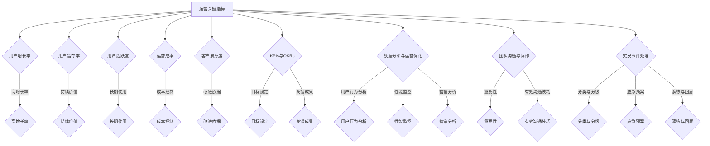

### 第5章 时间管理工具与实践

在程序员创业者的日常工作中，合理的时间管理和高效的工具选择是成功的关键。在这一章节中，我们将探讨工作计划与安排、个人时间管理工具以及时间管理案例分享，帮助读者了解和运用各种时间管理工具与实践。

#### 5.1 工作计划与安排

工作计划与安排是时间管理的基础，有助于提高工作效率和任务完成率。以下是一些关键步骤和方法：

- **制定详细的日程安排**：将每天的任务按照优先级进行排序，并分配具体的时间段。使用日程表或日历应用程序（如Google Calendar、Microsoft Outlook）可以帮助你更好地管理日程。

- **使用任务管理工具**：任务管理工具（如Jira、Trello、Asana）可以帮助你分配任务、跟踪进度和协作。这些工具通常提供可视化界面，让你一目了然地了解任务状态和团队进度。

- **项目进度监控**：定期检查项目进度，确保任务按时完成。项目进度监控工具（如Microsoft Project、JIRA Agile）可以提供详细的项目数据，帮助项目经理和团队成员实时掌握项目状态。

- **优先级调整**：根据任务的重要性和紧急程度，灵活调整优先级。当遇到紧急情况时，可以迅速调整计划，确保关键任务得到优先处理。

#### 5.1.1 任务管理工具的选择

选择合适的任务管理工具对于高效管理任务至关重要。以下是一些常见的任务管理工具及其特点：

- **Jira**：一款功能强大的项目管理工具，适合大型团队和复杂项目。Jira提供灵活的任务分配、进度跟踪和协作功能，支持多种视图（如看板、列表、甘特图）。

- **Trello**：一款简单直观的任务管理工具，适用于小型团队和简单项目。Trello使用看板（Kanban）方法，通过卡片和列表来管理任务，易于操作和导航。

- **Asana**：一款功能全面的任务管理工具，适合各种规模的项目。Asana提供详细的任务信息、时间跟踪和协作功能，支持多种视图和自定义设置。

- **Notion**：一款多功能的知识管理工具，适用于个人和组织。Notion结合了笔记、任务管理、数据库等功能，提供灵活的布局和自定义设置。

选择任务管理工具时，应考虑以下因素：

- **团队规模**：小型团队可能更偏好简单直观的工具，如Trello；大型团队则需要功能强大的工具，如Jira。
- **项目复杂度**：简单项目可能只需要基本的任务管理功能，而复杂项目则需要更多的高级功能，如进度跟踪、协作和集成。
- **用户习惯**：选择与团队成员习惯相符合的工具，可以提高接受度和使用效果。
- **成本**：考虑工具的费用和预算，选择性价比高的解决方案。

#### 5.1.2 项目进度监控

项目进度监控是确保项目按时完成的重要手段。以下是一些常用的项目进度监控工具及其特点：

- **Microsoft Project**：一款功能强大的项目管理工具，提供详细的任务进度、资源管理和报表功能。适合大型项目和企业级用户。

- **JIRA Agile**：JIRA Agile是JIRA的扩展插件，提供敏捷项目管理功能，如迭代规划、任务跟踪和燃尽图。适合软件开发团队。

- **Trello**：虽然Trello主要用于任务管理，但其看板（Kanban）视图也适用于项目进度监控。通过看板视图，可以直观地了解任务进度和团队协作情况。

- **Asana**：提供多种视图（如看板、甘特图、日历）来监控项目进度。Asana还支持自定义报表和仪表盘，方便团队成员了解项目状态。

项目进度监控工具应具备以下功能：

- **任务进度跟踪**：实时监控任务的完成情况，确保任务按时完成。
- **资源管理**：合理分配资源，确保项目有足够的资源支持。
- **报表与分析**：提供详细的报表和分析功能，帮助管理层了解项目进展和团队绩效。

#### 5.2 个人时间管理工具

个人时间管理工具可以帮助程序员创业者更好地管理个人时间和任务，提高工作效率。以下是一些常见的个人时间管理工具及其特点：

- **Toggl**：一款时间追踪工具，可以帮助你记录每日工作时间，生成详细的报告，以便分析和优化时间使用。

- **RescueTime**：一款自动化时间追踪工具，可以监控你的电脑和手机使用情况，生成详细的使用报告，帮助你了解时间浪费在哪些活动上。

- **Focus@Will**：一款专注力提升工具，通过播放专有的音乐来帮助你保持专注，提高工作效率。

- **Forest**：一款寓教于乐的时间管理应用，通过种植虚拟树木来鼓励你保持专注，每完成一个任务就会种植一棵树。

选择个人时间管理工具时，应考虑以下因素：

- **功能需求**：根据自己的需求选择具有相应功能的时间管理工具，如时间追踪、专注力提升、任务管理等。
- **用户界面**：选择界面友好、易于操作的工具，可以提高使用体验和效率。
- **兼容性**：确保工具与你的操作系统和常用应用兼容，以便更好地整合到你的工作流程中。
- **成本**：考虑工具的费用，选择性价比高的解决方案。

#### 5.2.2 时间管理应用实践

以下是一些时间管理应用实践的例子：

- **设定时间限制**：为每个任务设定具体的时间限制，如30分钟或1小时。这有助于提高专注力和工作效率，避免任务拖延。

- **使用番茄工作法**：将工作时间划分为25分钟的工作周期和5分钟的休息时间。每个工作周期称为一个“番茄钟”，重复进行，有助于提高专注度和工作质量。

- **记录和回顾**：定期记录你的时间和任务完成情况，并进行回顾。这可以帮助你了解时间使用情况，发现改进机会。

- **设定目标**：为自己设定具体、可衡量的目标，如“每天完成3个任务”或“每月发布一个新功能”。目标设定有助于保持动力和方向。

#### 5.3 时间管理案例分享

以下是一些成功和失败的时间管理案例，供读者参考：

- **成功案例**：某初创公司通过使用Trello和Toggl，成功实现了任务管理和时间追踪。他们设定了明确的目标和优先级，并定期回顾和调整计划，从而提高了工作效率和项目成功率。

- **失败案例**：某初创公司由于没有有效的时间管理策略，导致项目进度严重滞后。团队成员经常加班，但工作效率低下，项目最终未能按时完成。

通过以上案例，我们可以看到，有效的时间管理对于程序员创业者的成功至关重要。合理的工具选择和实用的管理方法可以帮助你更好地平衡开发与运营工作，提高业务效率和用户满意度。

#### 5.4 本章节小结

本章介绍了工作计划与安排、个人时间管理工具以及时间管理案例分享。通过合理运用这些工具和方法，程序员创业者可以更好地管理时间和任务，提高工作效率和业务成功率。在下一章中，我们将探讨如何综合应用时间管理策略，帮助程序员创业者实现开发与运营的平衡。

```mermaid
graph TD
A[工作计划与安排] --> B{日程安排}
B -->|优先级排序| C{优先级排序}
B -->|任务管理工具| D{任务管理工具}
D -->|Jira| E{Jira}
D -->|Trello| F{Trello}
D -->|Asana| G{Asana}
D -->|Notion| H{Notion}
A --> I{项目进度监控}
I -->|Microsoft Project| J{Microsoft Project}
I -->|JIRA Agile| K{JIRA Agile}
I -->|Trello| L{Trello}
I -->|Asana| M{Asana}
A --> N{优先级调整}
N -->|紧急情况处理| O{紧急情况处理}

A --> P[个人时间管理工具]
P -->|Toggl| Q{Toggl}
P -->|RescueTime| R{RescueTime}
P -->|Focus@Will| S{Focus@Will}
P -->|Forest| T{Forest}
P -->|应用实践| U{应用实践}
U -->|时间限制| V{时间限制}
U -->|番茄工作法| W{番茄工作法}
U -->|记录与回顾| X{记录与回顾}
U -->|目标设定| Y{目标设定}

A --> Z[案例分享]
Z -->|成功案例| AA{成功案例}
Z -->|失败案例| BB{失败案例}
Z -->|经验教训| CC{经验教训}
```

### 第6章 综合时间管理策略

在程序员创业者的时间管理中，不仅要关注单一的方法和工具，还需要结合多种策略，形成一套综合的时间管理体系。在这一章节中，我们将介绍几种时间管理模型的应用，提高专注力和管理干扰的技巧，以及持续改进和实践的重要性。

#### 6.1 时间管理模型应用

时间管理模型提供了一套系统的方法，帮助程序员创业者更高效地管理时间和任务。以下介绍几种常见的时间管理模型：

**6.1.1 三叶草模型**

三叶草模型是一种将任务分解和优先级管理相结合的时间管理方法。它将任务分为三类：重要紧急、重要不紧急、不重要紧急。

- **重要紧急**：这类任务通常需要立即处理，否则可能会造成严重后果。例如，紧急的客户问题或系统故障。
- **重要不紧急**：这类任务对于长期目标至关重要，但不会立即产生紧迫感。例如，项目规划和产品开发。
- **不重要紧急**：这类任务通常是琐碎的、不重要的，但需要及时处理。例如，处理邮件或回复社交媒体消息。

三叶草模型强调将重点放在重要任务上，同时避免过度关注琐碎事务。

**6.1.2 四象限时间管理法**

四象限时间管理法将任务分为四个象限，分别表示紧急且重要、紧急但不重要、不紧急但重要、不紧急且不重要。

- **第一象限**：紧急且重要。这类任务需要立即处理，否则可能会造成严重后果。例如，紧急的客户需求或系统故障。
- **第二象限**：紧急但不重要。这类任务可能不需要立即处理，但如果不处理，可能会影响整体进度。例如，不必要的会议或紧急但不重要的邮件。
- **第三象限**：不紧急但重要。这类任务对于长期目标至关重要，但不会立即产生紧迫感。例如，项目规划和产品开发。
- **第四象限**：不紧急且不重要。这类任务通常是琐碎的、不重要的，可以暂时忽略。例如，浏览社交媒体或处理不重要的邮件。

四象限时间管理法强调将重点放在第一和第三象限的任务上，避免陷入紧急但不重要的琐事。

**6.1.3 埃森豪威尔矩阵**

埃森豪威尔矩阵是一种将任务按照重要性和紧急性进行分类的方法。它将任务分为四个象限：

- **第一象限**：重要且紧急。这类任务需要立即处理，否则可能会造成严重后果。例如，紧急的客户需求或系统故障。
- **第二象限**：重要但不紧急。这类任务对于长期目标至关重要，但不会立即产生紧迫感。例如，项目规划和产品开发。
- **第三象限**：不重要但紧急。这类任务可能不需要立即处理，但如果不处理，可能会影响整体进度。例如，不必要的会议或紧急但不重要的邮件。
- **第四象限**：不重要且不紧急。这类任务通常是琐碎的、不重要的，可以暂时忽略。例如，浏览社交媒体或处理不重要的邮件。

埃森豪威尔矩阵强调将重点放在第一和第二象限的任务上，同时避免陷入第三和第四象限的琐事。

#### 6.2 时间管理技巧提升

**6.2.1 提高专注力**

专注力是高效时间管理的关键。以下是一些提高专注力的技巧：

- **番茄工作法**：将工作时间分为25分钟的工作周期和5分钟的休息时间。每个工作周期称为一个“番茄钟”。这种方法有助于提高专注度和减少疲劳。
- **减少干扰**：关闭社交媒体通知、电子邮件提醒等干扰源。在一个安静的环境中工作，有助于保持专注。
- **定时休息**：每工作一段时间后，进行短暂的休息。这有助于恢复精力，提高工作效率。

**6.2.2 管理干扰**

干扰是影响时间管理效率的主要因素之一。以下是一些管理干扰的技巧：

- **优先处理**：将重要任务安排在干扰较少的时间段，如早晨或晚上。避免在干扰较多的时间段处理重要任务。
- **设定明确目标**：在处理任务前，明确任务的目标和期望结果。这有助于减少工作中的不确定性和干扰。
- **有效沟通**：与团队成员和同事建立明确的沟通机制，确保在必要时可以迅速得到支持和帮助。这有助于减少因沟通不畅而产生的干扰。

#### 6.3 持续改进与实践

**6.3.1 反馈循环**

持续改进是时间管理的重要部分。以下是一些反馈循环的实践方法：

- **定期回顾**：定期回顾时间管理策略的实施情况，识别问题和改进机会。这可以通过每周或每月的时间管理回顾来实现。
- **收集反馈**：向团队成员和同事收集关于时间管理策略的反馈，了解他们的看法和建议。这有助于发现潜在的问题和改进方向。
- **调整计划**：根据反馈和回顾结果，调整时间管理策略，以更好地适应实际需求。

**6.3.2 个人成长计划**

个人成长计划是持续改进的重要手段。以下是一些个人成长计划的实践方法：

- **设定目标**：为自己设定具体、可衡量的个人成长目标，如提高技术能力、学习新技能等。
- **定期评估**：定期评估个人成长目标的实现情况，了解自己的进步和不足。
- **制定计划**：根据评估结果，制定具体的行动计划，确保目标的实现。
- **持续学习**：不断学习和探索新技术、新方法，提升自己的能力。

通过以上综合时间管理策略的实践，程序员创业者可以更好地平衡开发与运营工作，提高工作效率和业务成功率。

#### 6.4 本章节小结

本章介绍了综合时间管理策略，包括时间管理模型应用、提高专注力和管理干扰的技巧，以及持续改进和实践的重要性。通过合理运用这些策略，程序员创业者可以更高效地管理时间和任务，实现开发与运营的平衡。在下一章中，我们将探讨创业者时间管理的最佳实践，帮助程序员创业者应对各种挑战。

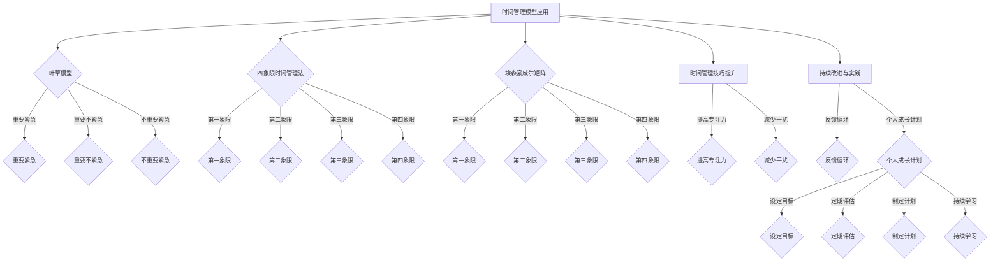

### 第7章 创业者时间管理最佳实践

在创业者时间管理的实践中，不同的人可能有不同的方法和经验。然而，一些最佳实践被证明是有效的，可以帮助程序员创业者更好地平衡开发与运营工作，提高整体效率。在这一章节中，我们将探讨精益时间管理原则、适应变化策略，并分享一些实用的技巧和实际案例。

#### 7.1 创业者时间管理原则

**7.1.1 精益时间管理**

精益时间管理强调以最小的资源投入实现最大的效益。以下是一些精益时间管理的原则：

- **最小化浪费**：识别并消除时间和资源的浪费，如不必要的会议、重复的任务和无效的流程。
- **持续改进**：定期回顾时间管理策略，发现改进机会，并持续优化。
- **简化流程**：简化工作流程，减少不必要的步骤，提高效率。
- **聚焦关键任务**：将时间和精力集中在最具价值和最重要的任务上，确保资源得到最佳利用。

**7.1.2 适应变化**

创业者面临的环境复杂且多变，适应变化是成功的关键。以下是一些适应变化的策略：

- **灵活计划**：制定灵活的计划，以便快速调整以应对意外情况。
- **快速响应**：保持敏锐的市场嗅觉，及时响应市场变化和用户需求。
- **迭代改进**：采用迭代开发的方法，不断优化产品和服务。
- **团队合作**：建立强大的团队，发挥每个人的专长，共同应对变化。

#### 7.2 时间管理策略实施

**7.2.1 建立个人时间管理习惯**

建立个人时间管理习惯是长期成功的关键。以下是一些具体的实施步骤：

- **设定明确目标**：为自己设定具体、可衡量的目标，如每周完成几个任务、每月发布一个新功能等。
- **制定日程安排**：每天早上制定日程安排，将任务按照优先级排序，并分配具体的时间段。
- **定期回顾**：每周或每月回顾时间管理策略的实施情况，评估目标完成情况和时间使用情况，并根据实际情况进行调整。
- **自我激励**：设定奖励机制，如完成任务后给自己一些奖励，以保持动力和积极性。

**7.2.2 面对压力与挑战**

创业者经常面临各种压力和挑战，有效的应对策略可以帮助缓解压力，保持工作效率。以下是一些应对策略：

- **分解任务**：将大型任务分解为小块，逐步完成，避免因任务过大而产生压力。
- **合理休息**：合理安排休息时间，确保身心健康，提高工作效率。
- **寻求支持**：与团队成员、朋友和家人交流，寻求支持和建议，共同应对挑战。
- **保持积极心态**：保持积极的心态，相信自己能够应对困难和挑战。

#### 7.3 实际案例分享

以下是一些成功的时间管理实际案例，供读者参考：

**案例一：成功平衡开发与运营**

某初创公司通过精益时间管理和敏捷开发方法，成功平衡了开发与运营工作。他们采用每日站会和迭代开发，确保团队高效协作和快速响应变化。此外，他们还使用项目管理工具（如Jira）和任务管理工具（如Trello），确保任务分配和进度跟踪清晰明了。通过这些策略，他们不仅提高了开发效率，还优化了运营流程，实现了业务的快速增长。

**案例二：应对突发压力**

某创业者在一次市场变化中面临巨大压力。为了应对这一挑战，他首先将任务分解为小块，逐步完成，避免因任务过大而产生焦虑。其次，他合理安排休息时间，确保身心健康。此外，他还与团队成员和顾问保持密切沟通，寻求支持和建议。通过这些策略，他成功应对了压力，保持了工作效率，最终取得了成功。

**案例三：适应变化，持续改进**

某公司采用迭代开发的方法，不断优化产品和服务。他们定期回顾时间管理策略和业务流程，识别改进机会，并快速实施。通过持续改进，他们不仅提高了产品质量，还增强了市场竞争力，实现了业务的持续增长。

#### 7.4 本章节小结

本章探讨了创业者时间管理的最佳实践，包括精益时间管理原则、适应变化策略以及具体实施步骤和实际案例。通过合理运用这些策略，程序员创业者可以更好地平衡开发与运营工作，提高工作效率和业务成功率。在下一章中，我们将进行文章的总结，并展望未来时间管理趋势。

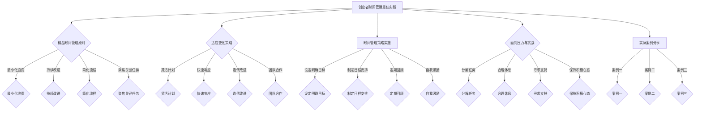

### 第8章 结论：平衡开发与运营

通过前七章的探讨，我们可以看到，平衡开发与运营对于程序员创业者至关重要。在这一章节中，我们将总结文章的核心观点，评估时间管理的总体效果，探讨持续平衡的关键要素，并展望未来时间管理的发展趋势。

#### 8.1 时间管理的总体效果评估

有效的时间管理可以帮助程序员创业者实现以下目标：

- **提高工作效率**：通过优先级管理、任务分配和工具使用，程序员创业者可以更高效地完成开发任务和运营工作。
- **优化开发流程**：通过敏捷开发、持续集成和代码审查，可以提升代码质量和开发效率。
- **改善运营效果**：通过关键指标设定、数据分析和管理，可以优化运营策略，提高用户满意度和业务增长。
- **增强团队协作**：通过有效的沟通和协作工具，可以增强团队凝聚力，提高整体效率。

在实际应用中，程序员创业者需要定期评估时间管理的总体效果，通过反馈循环和持续改进，不断优化时间管理策略。

#### 8.2 持续平衡的关键要素

为了持续平衡开发与运营工作，程序员创业者需要关注以下几个关键要素：

- **优先级管理**：定期调整任务优先级，确保关键任务得到优先处理，避免资源浪费。
- **团队协作**：建立有效的沟通机制，确保团队成员之间的信息共享和协作，提高工作效率。
- **灵活适应**：在面对突发情况时，能够迅速调整计划，保持工作的连续性。
- **持续改进**：通过定期回顾和反馈，识别改进机会，持续优化时间管理策略。

#### 8.3 未来时间管理趋势展望

随着技术的发展，未来时间管理将呈现以下趋势：

- **智能化**：人工智能和机器学习将更加深入地应用于时间管理，如自动化任务分配、智能提醒和预测分析。
- **个性化**：根据个人习惯和工作模式，提供更加个性化的时间管理解决方案，提高用户体验。
- **集成化**：不同工具和平台之间的集成将更加紧密，提供一站式的时间管理服务。
- **远程化**：随着远程工作的普及，时间管理工具将更加注重远程协作和监控，以适应新的工作模式。

#### 8.4 本章节小结

通过本文的探讨，我们了解到平衡开发与运营对于程序员创业者至关重要。有效的时间管理可以帮助他们提高工作效率、优化开发流程和改善运营效果。在未来，时间管理将更加智能化、个性化、集成化和远程化。程序员创业者需要不断学习和适应这些趋势，以实现持续的发展与成功。

### 附录

#### 附录 A：时间管理资源汇总

以下是一些时间管理相关的在线工具、书籍和论坛，供读者参考：

**A.1 在线工具推荐**

- **Trello**：简单直观的任务管理工具。
- **Jira**：功能强大的项目管理工具。
- **Asana**：全面的任务和项目跟踪工具。
- **Notion**：多功能的知识管理和任务管理工具。
- **Toggl**：时间追踪工具。
- **RescueTime**：自动化时间追踪和分析工具。
- **Focus@Will**：专注力提升工具。

**A.2 时间管理书籍推荐**

- 《高效能人士的七个习惯》
- 《深度工作：如何有效利用每一点脑力》
- 《时间管理的艺术》
- 《精要主义：如何做少做得多》
- 《奇特的一生：富兰克林的时间管理》

**A.3 时间管理相关论坛与社群**

- **Time Management Forum**：一个关于时间管理技巧和策略的在线论坛。
- **Productivity Stack**：一个关于生产力工具和方法的社群。
- **Time Management Group**：LinkedIn上的时间管理专业社群。
- **Time Management Mastery**：YouTube上的时间管理教程和案例分析。

作者：AI天才研究院/AI Genius Institute & 禅与计算机程序设计艺术 /Zen And The Art of Computer Programming

### 附录 B：时间管理案例分析与实战指南

**B.1 案例分析**

**案例背景**：一家初创科技公司，团队成员共有10人，主要业务是开发一款社交应用。由于项目开发周期较短，团队成员需要在短时间内完成大量任务，同时还要处理日常运营工作。团队成员反映工作时间紧张，任务分配不合理，导致工作效率低下。

**解决方案**：

1. **任务分解与优先级管理**：将大型任务分解为小块，并按照紧急程度和重要性进行排序。使用Trello创建任务列表，每个团队成员负责不同的子任务。

2. **敏捷开发与迭代**：采用敏捷开发方法，将开发周期分为多个短迭代，每个迭代结束后进行回顾和调整。使用Jira进行敏捷项目管理，确保任务进度和团队协作。

3. **代码审查与质量保证**：定期进行代码审查，确保代码质量和可维护性。采用Git进行版本控制，确保代码的版本可追溯。

4. **运营数据分析**：使用Google Analytics和Mixpanel等工具，监控用户行为和运营指标，及时调整运营策略。

5. **团队沟通与协作**：使用Slack进行实时沟通，每周举行站会，分享进展和问题。使用Asana进行任务分配和进度跟踪。

**效果评估**：通过以上措施，团队成员的工作效率得到了显著提高，任务分配更加合理，代码质量和用户满意度也有所提升。

**B.2 实战指南**

**步骤一：任务分解与优先级管理**

1. **识别任务**：列出所有待完成的任务，包括开发、测试、运营等。

2. **分解任务**：将大型任务分解为小块，每个小块应具有明确的交付物和责任人。

3. **排序优先级**：根据任务的重要性和紧急程度，使用埃森豪威尔矩阵或四象限时间管理法进行排序。

**步骤二：敏捷开发与迭代**

1. **定义迭代周期**：通常为2-4周。

2. **制定迭代计划**：在迭代开始前，制定详细的工作计划，包括任务分配、时间表和里程碑。

3. **迭代回顾**：在每个迭代结束后，进行回顾和评估，识别改进机会，并调整后续迭代计划。

**步骤三：代码审查与质量保证**

1. **代码审查流程**：定期进行代码审查，确保代码质量和一致性。

2. **版本控制**：使用Git等版本控制工具，确保代码的可追溯性和可维护性。

3. **质量保证**：使用单元测试、集成测试和性能测试，确保代码的正确性和稳定性。

**步骤四：运营数据分析**

1. **确定关键指标**：根据业务目标，确定关键运营指标，如用户增长率、留存率、活跃度等。

2. **数据收集与处理**：使用数据分析工具，如Google Analytics、Mixpanel等，收集和处理运营数据。

3. **数据驱动决策**：根据数据分析结果，调整运营策略和产品方向。

**步骤五：团队沟通与协作**

1. **建立沟通渠道**：使用Slack、微信等即时通讯工具，确保团队成员之间的实时沟通。

2. **定期站会**：每周举行站会，分享进展和问题，确保团队整体进度清晰。

3. **任务跟踪与协作**：使用Trello、Jira等任务管理工具，分配任务、跟踪进度和协作。

**B.3 案例分析与实战指南小结**

通过案例分析，我们可以看到，合理的时间管理和高效的协作工具对于初创公司至关重要。在实战指南中，我们提供了一套系统的方法，帮助程序员创业者实现任务分解、优先级管理、敏捷开发、代码审查、运营数据分析和团队沟通与协作。通过这些实践，程序员创业者可以更好地平衡开发与运营工作，提高工作效率和业务成功率。

### 附录 C：时间管理工具和技巧总结

**C.1 工具总结**

- **任务管理工具**：Trello、Jira、Asana、Notion，用于任务分配、进度跟踪和团队协作。
- **时间追踪工具**：Toggl、RescueTime，用于记录和监控时间使用情况。
- **代码管理工具**：Git、GitHub、GitLab，用于版本控制和代码协作。
- **数据分析工具**：Google Analytics、Mixpanel，用于监控运营指标和用户行为。

**C.2 技巧总结**

- **优先级管理**：使用埃森豪威尔矩阵或四象限时间管理法，根据任务的重要性和紧急程度排序。
- **任务分解**：将大型任务分解为小块，提高任务的可操作性和可管理性。
- **敏捷开发**：采用短周期迭代和敏捷方法，提高开发效率和灵活性。
- **代码审查**：定期进行代码审查，确保代码质量和一致性。
- **数据分析**：通过关键指标和数据分析，优化运营策略和产品方向。
- **团队沟通**：建立有效的沟通机制，确保信息共享和团队协作。

通过合理运用这些工具和技巧，程序员创业者可以更有效地管理时间和任务，提高工作效率和业务成功率。

### 附录 D：常见问题与解答

**Q1**：如何选择合适的时间管理工具？

**A1**：选择时间管理工具时，应考虑以下因素：

- **团队规模**：小型团队可能偏好简单直观的工具，如Trello；大型团队则需要功能强大的工具，如Jira。
- **项目复杂度**：简单项目可能只需要基本的任务管理功能，而复杂项目则需要更多的高级功能，如进度跟踪、协作和集成。
- **用户习惯**：选择与团队成员习惯相符合的工具，可以提高接受度和使用效果。
- **成本**：考虑工具的费用和预算，选择性价比高的解决方案。

**Q2**：如何提高专注力？

**A2**：以下是一些提高专注力的方法：

- **番茄工作法**：将工作时间分为25分钟的工作周期和5分钟的休息时间，有助于提高专注度和减少疲劳。
- **减少干扰**：关闭社交媒体通知、电子邮件提醒等干扰源，在一个安静的环境中工作。
- **定时休息**：每工作一段时间后，进行短暂的休息，有助于恢复精力，提高工作效率。

**Q3**：如何制定有效的个人时间管理计划？

**A3**：以下步骤可以帮助你制定有效的个人时间管理计划：

- **设定明确目标**：为自己设定具体、可衡量的目标，如每周完成几个任务、每月发布一个新功能等。
- **制定日程安排**：每天早上制定日程安排，将任务按照优先级排序，并分配具体的时间段。
- **定期回顾**：每周或每月回顾时间管理策略的实施情况，评估目标完成情况和时间使用情况，并根据实际情况进行调整。
- **自我激励**：设定奖励机制，如完成任务后给自己一些奖励，以保持动力和积极性。

通过以上方法，你可以更好地管理个人时间，提高工作效率和业务成功率。

