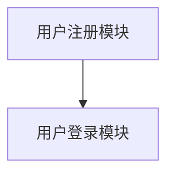

                 

### 第1章：程序员职业生涯的自我认知

#### 1.1 程序员职业发展路径

程序员的职业生涯可以被划分为几个不同的阶段，每个阶段都有其特定的职责和发展方向。

##### 1.1.1 职业阶段划分

1. **初级程序员**：这一阶段的程序员主要任务是掌握基础编程技能，理解基本的编程概念，如数据类型、控制结构、函数等。他们通常会参与到一些简单的项目中，积累实践经验。

2. **中级程序员**：中级程序员已经具备了一定的编程能力，能够独立完成项目的开发任务。他们需要提高自己的技术水平，学习更复杂的数据结构和算法，并且开始参与团队协作。

3. **高级程序员**：高级程序员不仅拥有扎实的编程基础，还具备解决复杂问题的能力。他们常常负责系统的架构设计，优化代码性能，甚至参与到技术决策中。

4. **技术专家**：技术专家是程序员职业发展的巅峰。他们不仅精通技术，还具备指导和管理团队的能力。技术专家往往是某个技术领域的权威，能够解决行业内最复杂的问题。

##### 1.1.2 职业规划的重要性

职业规划对于程序员的长期发展至关重要。一个清晰的职业规划可以帮助程序员：

- 明确自己的发展目标，避免在职业道路上迷失方向。
- 有针对性地学习新技能，提升自己的竞争力。
- 在职业生涯中做出更好的决策，比如选择合适的岗位和项目。

##### 1.1.3 职业规划的策略

1. **自我评估**：了解自己的兴趣、优势和短板，明确职业目标。

2. **市场调研**：研究行业趋势和就业市场，了解不同职位的要求和发展前景。

3. **制定计划**：根据自我评估和市场调研结果，制定具体的职业发展计划。

4. **持续调整**：职业规划并非一成不变，需要根据实际情况不断调整。

---

#### 1.2 自我认知的重要性

自我认知是程序员职业生涯中不可或缺的一部分。它不仅帮助程序员了解自己的能力和兴趣，还能为他们提供方向感和动力。

##### 1.2.1 自我认知的概念

自我认知指的是个体对自己的认识和理解，包括：

- **能力评估**：了解自己的技能水平和擅长领域。
- **性格特点**：认识自己的性格类型，如外向、内向等。
- **价值观**：理解自己的价值观和生活目标。

##### 1.2.2 自我认知的方法

1. **反思**：定期回顾自己的工作和生活，思考自己的表现和感受。

2. **他人反馈**：征求同事、朋友和家人的意见和建议。

3. **心理测试**：使用专业的心理测试工具，如MBTI、DISC等，帮助自己更深入地了解自己。

##### 1.2.3 自我认知的应用

自我认知的应用场景包括：

- **职业规划**：通过自我认知，明确自己的职业目标和发展路径。
- **团队合作**：了解自己的性格特点，更好地与团队成员沟通和协作。
- **个人成长**：通过自我认知，找到自己的优势和潜力，不断成长和提升。

---

#### 1.3 程序员核心技能分析

一个成功的程序员需要掌握一系列的核心技能，这些技能不仅包括技术方面的，还包括软技能和沟通能力。

##### 1.3.1 编程语言基础

编程语言是程序员的基本工具，常见的编程语言包括：

- **Python**：易学易用，适用于数据科学、人工智能等领域。
- **Java**：跨平台，广泛用于企业级应用开发。
- **C++**：性能高，适用于系统软件和游戏开发。

##### 1.3.2 数据结构与算法

数据结构和算法是程序员的基石，它们决定了代码的性能和效率。常见的数据结构包括：

- **数组**、**链表**：基本的数据结构，用于存储和操作数据。
- **栈**、**队列**：特殊的线性数据结构，用于实现特定的算法。
- **树**、**图**：复杂的数据结构，用于解决复杂问题。

常见的算法包括：

- **排序算法**：如冒泡排序、快速排序、归并排序等。
- **查找算法**：如二分查找、线性查找等。
- **图算法**：如深度优先搜索、广度优先搜索等。

##### 1.3.3 软件开发流程

软件开发流程是程序员必须掌握的基本知识，它包括：

- **版本控制**：如Git，用于管理代码版本和协同工作。
- **敏捷开发**：强调快速迭代和持续交付，提高开发效率。
- **持续集成**：自动化测试和构建，确保代码质量和项目进度。

##### 1.3.4 职场软技能

职场软技能是程序员在职业生涯中必不可少的技能，包括：

- **沟通能力**：清晰表达自己的想法，有效沟通问题和需求。
- **团队协作**：与团队成员高效合作，共同完成项目任务。
- **时间管理**：合理安排工作，提高工作效率。

通过掌握这些核心技能，程序员可以在职业生涯中取得更好的成绩和发展。接下来，我们将进一步探讨如何通过持续学习来提升这些技能。

---

### 第2章：持续学习的动力源泉

#### 2.1 学习动机的来源

持续学习需要强大的动力，这些动力可以分为内在动机和外在动机。

##### 2.1.1 内在动机

内在动机来源于个人对知识的渴望和对自我成长的追求。这些动机通常包括：

- **对技术的热爱**：对编程语言、算法和数据结构的浓厚兴趣。
- **对未知的探索**：对新技术的探索和对未知领域的探索欲望。
- **对自我提升的追求**：希望不断提升自己的技能，实现个人价值。

##### 2.1.2 外在动机

外在动机通常来自于外部环境的影响，包括职业发展的需求、薪资提升的期望和市场竞争的压力。这些动机通常包括：

- **职业发展的需求**：为了在职场中取得更好的职位和更高的薪资，需要不断学习新技能。
- **薪资提升的期望**：通过学习新技能，提高自己的市场竞争力，从而获得更高的薪资。
- **市场竞争的压力**：在快速发展的技术行业中，不学习就会落后，因此需要不断学习以保持竞争力。

#### 2.2 学习习惯的养成

养成良好的学习习惯对于持续学习至关重要。以下是一些有效的学习习惯：

##### 2.2.1 制定学习计划

制定学习计划可以帮助程序员明确学习目标和时间安排。以下是一些建议：

- **目标明确**：设定具体的学习目标，如掌握某种编程语言或数据结构。
- **内容细化**：将学习目标分解为具体的学习内容，如阅读特定章节或完成特定练习。
- **进度跟踪**：定期检查学习进度，确保按计划进行。

##### 2.2.2 保持学习状态

保持学习状态需要克服各种干扰和诱惑。以下是一些建议：

- **定时学习**：设定固定的学习时间，如每天晚上8点到10点。
- **保持专注**：在学习时保持专注，避免分心，如关闭社交媒体通知。
- **避免干扰**：将学习环境布置得尽量安静，避免干扰。

##### 2.2.3 学习反馈与调整

学习反馈是学习过程中的重要环节，它可以帮助程序员了解自己的学习效果，并做出相应的调整。以下是一些建议：

- **学习成果反馈**：通过实践项目和考试来检验自己的学习成果。
- **学习效果评估**：定期评估自己的学习效果，如通过自我测试或参加在线课程。
- **学习计划调整**：根据学习效果调整学习计划，如增加练习或更换学习材料。

---

### 2.3 学习成果的激励与反馈

学习成果的激励和反馈是持续学习的重要保障。以下是一些有效的激励和反馈方法：

##### 2.3.1 激励机制

激励机制可以激发程序员的积极性和学习动力。以下是一些常用的激励机制：

- **自我激励**：设定奖励目标，如在掌握新技能后给自己买一件新衣服或去旅游。
- **薪资激励**：通过提高薪资来激励程序员学习新技能。
- **奖励机制**：为学习新技能的程序员提供额外的奖励，如奖金或晋升机会。

##### 2.3.2 反馈机制

反馈机制可以帮助程序员了解自己的学习效果，并做出相应的调整。以下是一些常用的反馈机制：

- **学习成果展示**：定期展示自己的学习成果，如参加技术分享会或编写博客。
- **老师或同事反馈**：征求老师或同事的意见和建议，了解自己的学习效果。
- **自我反思与总结**：定期进行自我反思，总结学习过程中的收获和不足。

通过有效的激励和反馈机制，程序员可以更好地保持学习动力，不断提升自己的技能水平。

---

### 3.1 信息筛选与处理

在信息爆炸的时代，如何高效地筛选和处理信息是程序员持续学习的关键。以下是一些方法和技巧：

##### 3.1.1 信息来源

程序员的学习信息可以来自多个渠道，包括：

- **纸质书**：经典书籍是学习编程的基础，如《代码大全》、《设计模式》等。
- **在线课程**：如Coursera、Udemy等平台提供了丰富的编程课程。
- **技术博客**：如Medium、博客园等，可以获取最新的技术文章和观点。
- **专业论坛**：如Stack Overflow、GitHub等，可以解决实际问题，获取帮助。

##### 3.1.2 信息筛选

有效的信息筛选是避免浪费时间的关键。以下是一些筛选方法：

- **关键词搜索**：使用关键词进行精确搜索，避免搜索到无关信息。
- **评价筛选**：查看用户评价和评分，筛选出高质量的学习资源。
- **推荐系统**：利用推荐系统，如在线课程平台的推荐功能，获取相关课程。

##### 3.1.3 信息处理

处理信息是学习过程中的重要环节。以下是一些处理方法：

- **分类整理**：将学习资源按主题分类整理，便于查找和使用。
- **笔记记录**：记录学习过程中的关键知识点和疑问，便于回顾和复习。
- **思维导图**：使用思维导图整理知识点，建立知识框架。

---

### 3.2 学习时间管理

有效的时间管理对于程序员的持续学习至关重要。以下是一些时间管理的策略：

##### 3.2.1 制定学习计划

制定详细的学习计划是时间管理的第一步。以下是一些建议：

- **目标明确**：设定具体的学习目标，如掌握某种编程语言或算法。
- **时间规划**：将学习时间分配到每天或每周，确保有足够的时间进行学习。
- **弹性安排**：考虑到突发情况，为学习计划留出一定的弹性时间。

##### 3.2.2 优先级排序

在有限的时间内，优先处理重要和紧急的任务。以下是一些排序策略：

- **紧急重要**：优先处理紧急且重要的事务，如即将截止的项目任务。
- **重要不紧急**：合理安排时间处理重要但不紧急的事务，如学习新技能。
- **紧急不重要**：尽量避免或推迟处理紧急但不重要的事务。
- **不重要不紧急**：将时间用于休息和娱乐，避免过度工作。

##### 3.2.3 高效利用碎片时间

充分利用碎片时间进行学习，以下是一些建议：

- **短时学习**：利用碎片时间进行短时学习，如阅读一篇文章或观看一个视频。
- **移动学习**：使用手机或平板电脑，利用通勤或等待时间进行学习。
- **分散学习**：将学习时间分散到不同的时间段，避免长时间连续学习造成疲劳。

---

### 3.3 优质学习资源推荐

为了帮助程序员高效学习，以下是一些优质的学习资源推荐：

##### 3.3.1 书籍推荐

- **《代码大全》**：提供全面的编程实践和最佳实践。
- **《设计模式》**：介绍常见的设计模式和他们的应用场景。
- **《深度学习》**：讲解深度学习的基本原理和应用。
- **《算法导论》**：深入讲解数据结构和算法。

##### 3.3.2 在线课程推荐

- **Coursera**：提供多门计算机科学课程，包括机器学习、数据结构等。
- **Udemy**：提供丰富的编程课程，包括Python、Java等。
- **edX**：由知名大学提供的高质量在线课程，如MIT的计算机科学课程。

##### 3.3.3 技术博客推荐

- **Medium**：有许多知名的技术博客，如“Python一点一点学”。
- **博客园**：中文技术社区，提供丰富的编程和技术文章。
- **Stack Overflow**：编程问答社区，解决编程中的实际问题。

##### 3.3.4 学习平台推荐

- **GitHub**：代码托管和协作平台，可以学习和贡献开源项目。
- **LeetCode**：编程练习平台，提供各种编程挑战和面试题。
- **Khan Academy**：提供免费的计算机科学课程，适合初学者。

通过合理利用这些优质学习资源，程序员可以更加高效地提升自己的技能和知识水平。

---

### 4.1 参与技术交流的意义

参与技术交流对于程序员的职业发展至关重要。通过技术交流，程序员可以实现以下几个目标：

1. **知识共享**：技术交流提供了一个平台，让程序员能够分享自己的知识和经验，从中学习到其他人的见解和观点。

2. **技能提升**：在交流过程中，程序员可以接触到最新的技术动态和趋势，从而提升自己的技术能力。

3. **问题解决**：当遇到技术难题时，通过交流可以获得其他程序员的建议和解决方案，提高问题解决效率。

4. **建立人脉**：技术交流有助于建立专业人脉，这些关系可以在未来提供职业发展机会。

#### 4.2 程序员社区的选择

选择合适的程序员社区是参与技术交流的关键。以下是一些常用的程序员社区：

1. **Stack Overflow**：全球最大的编程问答社区，覆盖广泛的编程语言和技术领域。

2. **GitHub**：代码托管和协作平台，许多开源项目都在这里进行交流和合作。

3. **GitHub Discussions**：GitHub的新功能，为社区交流和讨论提供了新的平台。

4. **Reddit**：有许多编程相关的子版块，如/r/learnprogramming、/r/webdev等。

5. **Twitter**：许多知名的技术专家和公司都在Twitter上分享技术和行业动态。

#### 4.3 社区参与与贡献

积极参与社区和贡献内容是提升自己影响力的重要方式。以下是一些建议：

1. **提问与解答**：在社区中提出有针对性的问题，并积极参与解答他人的问题。

2. **编写博客**：分享自己的学习心得和技术经验，为他人提供有价值的知识。

3. **参与开源项目**：贡献代码或文档，参与开源社区的活动。

4. **组织或参与活动**：组织或参与技术沙龙、讲座等活动，扩大自己的影响力。

通过积极参与技术交流，程序员不仅可以提升自己的技术能力，还能建立自己的专业形象，为职业发展打下坚实基础。

---

### 5.1 沟通能力的重要性

在职场中，沟通能力是程序员必须具备的一项核心技能。良好的沟通能力能够帮助程序员有效地表达自己的想法，理解他人的意见，建立良好的人际关系，从而提高工作效率和团队协作效果。

#### 5.1.1 沟通能力在程序员职业发展中的作用

1. **项目协调**：在项目开发过程中，程序员需要与项目经理、设计师、测试人员等多个角色进行沟通，确保项目顺利进行。

2. **需求理解**：准确理解客户或业务方的需求是项目成功的关键，这需要程序员具备出色的沟通能力。

3. **团队合作**：程序员在团队中工作，良好的沟通能力有助于团队成员之间的协作，提高团队效率。

4. **职业晋升**：具备良好沟通能力的程序员更容易获得领导层的认可，为职业晋升创造机会。

#### 5.1.2 提高沟通能力的策略

1. **倾听**：倾听是沟通的关键，通过倾听可以更好地理解他人的观点和需求。

2. **清晰表达**：表达时要简明扼要，用通俗易懂的语言，避免使用专业术语。

3. **积极反馈**：在沟通过程中，及时给予对方反馈，确认信息的准确性和理解程度。

4. **掌握非语言沟通技巧**：如肢体语言、面部表情等，这些非语言因素在沟通中也起到重要作用。

---

### 5.2 团队协作技巧

团队协作是程序员工作中不可或缺的一部分。有效的团队协作可以提高工作效率，促进项目成功。以下是一些关键的团队协作技巧：

#### 5.2.1 明确分工和职责

1. **分工明确**：在团队中，每个成员都应该清楚自己的职责和任务，避免重复劳动和职责不清。

2. **职责分配**：项目经理应根据团队成员的能力和特长，合理分配任务。

3. **定期检查**：定期检查团队成员的工作进度，确保任务按时完成。

#### 5.2.2 沟通与协调

1. **定期会议**：定期召开团队会议，讨论项目进展、问题和解决方案。

2. **透明沟通**：鼓励团队成员之间开放沟通，分享自己的想法和意见。

3. **及时反馈**：对于团队成员的工作成果，及时给予反馈，包括正面的鼓励和改进的建议。

#### 5.2.3 解决冲突

1. **提前预防**：在项目开始时，明确沟通和协作的规则，避免冲突发生。

2. **理性解决**：当冲突发生时，保持冷静，理性分析问题，寻求解决方案。

3. **多方协调**：对于复杂的冲突，可能需要协调团队成员之间的利益和意见，寻求最佳解决方案。

#### 5.2.4 建立信任

1. **相互尊重**：尊重团队成员的意见和贡献，建立互信的基础。

2. **信任传递**：通过积极的沟通和协作，传递信任和安全感，增强团队的凝聚力。

通过以上技巧，程序员可以更有效地进行团队协作，提高项目成功率，实现个人和团队的共同发展。

---

### 5.3 职场礼仪与人际交往

在职场中，良好的礼仪和人际交往能力对程序员的职业发展至关重要。以下是一些关键的职场礼仪和人际交往技巧：

#### 5.3.1 职场礼仪

1. **尊重他人**：在职场中，尊重他人是建立良好人际关系的基础。尊重他人的意见、工作和贡献，避免不必要的冲突。

2. **礼貌用语**：使用礼貌用语，如“请”、“谢谢”、“对不起”等，展现自己的教养和对他人的尊重。

3. **会议礼仪**：参加会议时要准时到达，准备好相关材料，积极参与讨论，并遵守会议纪律。

#### 5.3.2 人际交往技巧

1. **主动沟通**：主动与同事交流，建立良好的沟通渠道，分享信息和资源。

2. **倾听与反馈**：倾听他人的意见和需求，给予积极的反馈，建立互信的关系。

3. **建立人脉**：积极参加各种职场活动，如团队建设、技术分享会等，扩大自己的社交圈。

4. **处理冲突**：遇到冲突时，保持冷静，理性分析问题，寻求合理的解决方案。

通过良好的职场礼仪和人际交往技巧，程序员可以更好地融入团队，提升工作效率，实现个人职业发展。

---

### 第6章：前沿技术趋势洞察

#### 6.1 人工智能与大数据

人工智能（AI）和大数据是当前技术领域最热门的话题之一，它们的发展对程序员提出了新的挑战和机遇。

##### 6.1.1 人工智能

人工智能是指通过模拟人类智能来实现计算机自动化解决问题的技术。以下是人工智能领域的一些核心技术和趋势：

1. **机器学习**：机器学习是一种通过数据学习规律并做出预测的算法。深度学习是机器学习的一种重要分支，它通过神经网络模拟人脑的决策过程。

2. **自然语言处理（NLP）**：自然语言处理是指让计算机理解和生成人类语言的技术。NLP在聊天机器人、语音识别和翻译等领域有广泛应用。

3. **计算机视觉**：计算机视觉是使计算机能够理解和解析视觉信息的技术。它广泛应用于图像识别、自动驾驶和安防监控等领域。

##### 6.1.2 大数据

大数据是指无法使用传统数据库工具在合理时间内进行捕捉、管理和处理的数据集。大数据的核心技术包括：

1. **数据存储**：大数据需要高效的存储解决方案，如Hadoop和Spark等分布式存储和处理框架。

2. **数据挖掘**：数据挖掘是从大量数据中提取有价值信息的技术。它用于市场分析、风险控制和个性化推荐等场景。

3. **实时处理**：实时处理技术能够对数据流进行快速分析和响应，如Apache Kafka和Apache Flink等。

##### 6.1.3 人工智能与大数据的结合

人工智能和大数据的结合为程序员提供了丰富的应用场景：

1. **智能推荐系统**：通过分析用户行为数据，推荐系统可以提供个性化的内容和服务。

2. **智能监控系统**：利用计算机视觉和大数据技术，监控系统可以实时分析图像和视频，检测异常行为。

3. **智能客服系统**：结合自然语言处理和大数据技术，智能客服系统可以提供24/7的在线服务。

#### 6.2 区块链技术

区块链技术是一种去中心化的分布式账本技术，它通过加密算法确保数据的安全性和不可篡改性。以下是区块链技术的一些关键概念和应用：

##### 6.2.1 基本概念

1. **区块链**：区块链是一个分布式数据库，由一系列按时间顺序排列的区块组成。每个区块都包含一定数量的交易记录，并通过密码学确保数据的不可篡改性。

2. **智能合约**：智能合约是自动执行、控制或记录法律交易的计算机程序。它运行在区块链上，无需中介参与，从而降低交易成本。

##### 6.2.2 应用场景

1. **数字货币**：比特币、以太坊等数字货币是区块链技术的最早应用之一。它们通过区块链技术实现了去中心化的货币交易。

2. **供应链管理**：区块链技术可以确保供应链的透明性和可靠性，从原材料采购到产品交付的每一个环节都可以被追踪和验证。

3. **身份验证**：区块链技术可以用于身份验证，确保用户的身份信息无法被篡改，提高数据安全性。

4. **版权保护**：区块链技术可以用于版权保护，通过将版权信息记录在区块链上，确保原创作品的真实性和版权归属。

#### 6.3 物联网与边缘计算

物联网（IoT）是指通过互联网连接物理设备，实现智能监控和控制的技术。边缘计算是物联网的重要发展方向，它将数据处理和分析从云端转移到网络边缘。以下是物联网和边缘计算的一些关键概念和应用：

##### 6.3.1 物联网

1. **传感器网络**：传感器网络是由大量传感器节点组成的网络，用于收集环境数据。

2. **智能家居**：智能家居设备通过物联网技术实现互联互通，为用户提供便利和舒适的生活环境。

3. **智能城市**：智能城市利用物联网技术实现城市管理和服务的智能化，如智能交通、智能照明和智能环保等。

##### 6.3.2 边缘计算

1. **数据处理**：边缘计算将数据处理和分析从云端转移到网络边缘，减少数据传输延迟，提高数据处理效率。

2. **实时响应**：边缘计算可以实现对实时数据的快速分析和响应，提高系统的响应速度。

3. **安全隐私**：边缘计算可以减少数据在传输过程中的暴露风险，提高数据安全性。

##### 6.3.3 应用案例

1. **智能制造**：边缘计算可以用于智能制造，实现对生产过程的实时监控和优化。

2. **智慧农业**：边缘计算可以用于智慧农业，通过对土壤、气象和作物生长数据的实时分析，实现精准农业管理。

3. **智能医疗**：边缘计算可以用于智能医疗，实现对病患数据的实时监测和诊断。

通过了解和掌握这些前沿技术趋势，程序员可以为自己的职业生涯注入新的动力，并在技术发展中占据有利位置。

---

### 第7章：技术栈扩展与深度学习

#### 7.1 Python编程深度应用

Python作为一种通用编程语言，具有易学易用的特点，被广泛应用于各种领域，包括科学计算、数据分析、人工智能等。深入学习Python可以帮助程序员提高编程技能，拓展职业发展空间。

##### 7.1.1 Python在科学计算中的应用

Python的科学计算库如NumPy、SciPy和Pandas提供了强大的数学和科学计算功能。以下是一些Python在科学计算中的深度应用：

1. **NumPy**：NumPy是一个基础的科学计算库，提供了多维数组和矩阵操作的功能。通过NumPy，程序员可以高效地进行数值计算和数据操作。

   ```python
   import numpy as np
   array = np.array([1, 2, 3, 4])
   print(array)
   ```

2. **SciPy**：SciPy是一个扩展库，用于科学和工程计算。它包含了优化、积分、微分方程求解等功能。

   ```python
   from scipy.optimize import fsolve
   f = lambda x: x**2 - 2
   root = fsolve(f, 1)
   print(root)
   ```

3. **Pandas**：Pandas是一个强大的数据分析库，提供了数据结构和数据分析工具。通过Pandas，程序员可以方便地进行数据处理和分析。

   ```python
   import pandas as pd
   df = pd.DataFrame({'A': [1, 2, 3], 'B': [4, 5, 6]})
   print(df)
   ```

##### 7.1.2 Python在数据分析中的应用

数据分析是Python的重要应用领域之一。Python的数据分析库如Pandas、NumPy和SciPy提供了丰富的功能，可以帮助程序员进行数据清洗、数据分析和数据可视化。

1. **数据清洗**：数据清洗是数据分析的第一步，通过Pandas，程序员可以方便地进行数据清洗和预处理。

   ```python
   df = pd.read_csv('data.csv')
   df.dropna(inplace=True)
   df['A'] = df['A'].astype(float)
   ```

2. **数据分析**：通过Pandas和NumPy，程序员可以方便地进行数据分析，如统计分析、相关性分析和回归分析等。

   ```python
   import pandas as pd
   import numpy as np
   df = pd.DataFrame({'A': [1, 2, 3], 'B': [4, 5, 6]})
   print(np.corrcoef(df['A'], df['B']))
   ```

3. **数据可视化**：Python的数据可视化库如Matplotlib和Seaborn提供了丰富的绘图功能，可以帮助程序员进行数据可视化。

   ```python
   import matplotlib.pyplot as plt
   import seaborn as sns
   sns.regplot(x='A', y='B', data=df)
   plt.show()
   ```

##### 7.1.3 Python在人工智能中的应用

Python在人工智能领域具有广泛的应用，尤其是在机器学习和深度学习领域。Python的机器学习库如Scikit-learn和深度学习库如TensorFlow和PyTorch提供了丰富的功能和工具，可以帮助程序员实现各种人工智能应用。

1. **机器学习**：Scikit-learn是一个简单易用的机器学习库，提供了多种机器学习算法和工具。

   ```python
   from sklearn.linear_model import LinearRegression
   model = LinearRegression()
   model.fit(X_train, y_train)
   predictions = model.predict(X_test)
   ```

2. **深度学习**：TensorFlow和PyTorch是两个流行的深度学习库，提供了强大的深度学习功能。

   ```python
   import tensorflow as tf
   model = tf.keras.Sequential([
       tf.keras.layers.Dense(128, activation='relu', input_shape=(784,)),
       tf.keras.layers.Dense(10, activation='softmax')
   ])
   model.compile(optimizer='adam',
                 loss='categorical_crossentropy',
                 metrics=['accuracy'])
   model.fit(x_train, y_train, epochs=5)
   ```

通过深入学习Python，程序员可以掌握Python在科学计算、数据分析和人工智能等领域的应用，提高自己的技术能力，拓展职业发展空间。

---

### 7.2 数据结构与算法提升

数据结构与算法是计算机科学的核心，对于程序员来说，掌握高效的数据结构和算法不仅能够提升编程能力，还能优化代码性能，解决复杂问题。以下是一些关键的数据结构与算法，以及如何提升相关技能。

##### 7.2.1 数据结构

1. **数组**：数组是一种基本的数据结构，用于存储固定大小的元素序列。它支持快速的随机访问，但插入和删除操作较慢。

   ```python
   # Python示例：初始化数组并访问元素
   arr = [1, 2, 3, 4, 5]
   print(arr[2])  # 访问第三个元素
   ```

2. **链表**：链表是一种动态数据结构，由一系列节点组成，每个节点包含数据和指向下一个节点的指针。它支持快速的插入和删除操作。

   ```python
   # Python示例：初始化链表并插入元素
   class Node:
       def __init__(self, data):
           self.data = data
           self.next = None
   
   head = Node(1)
   second = Node(2)
   head.next = second
   ```

3. **栈**：栈是一种后进先出（LIFO）的数据结构，用于存储元素。它支持快速插入和删除操作。

   ```python
   # Python示例：栈的简单实现
   class Stack:
       def __init__(self):
           self.items = []
   
       def push(self, item):
           self.items.append(item)
   
       def pop(self):
           return self.items.pop()
   
   stack = Stack()
   stack.push(1)
   stack.push(2)
   print(stack.pop())  # 输出：2
   ```

4. **队列**：队列是一种先进先出（FIFO）的数据结构，用于存储元素。它支持快速的插入和删除操作。

   ```python
   # Python示例：队列的简单实现
   class Queue:
       def __init__(self):
           self.items = []
   
       def enqueue(self, item):
           self.items.append(item)
   
       def dequeue(self):
           return self.items.pop(0)
   
   queue = Queue()
   queue.enqueue(1)
   queue.enqueue(2)
   print(queue.dequeue())  # 输出：1
   ```

5. **树**：树是一种层次结构，用于表示具有层次关系的数据。常见的树包括二叉树、二叉搜索树等。

   ```python
   # Python示例：二叉搜索树的简单实现
   class TreeNode:
       def __init__(self, data):
           self.data = data
           self.left = None
           self.right = None
   
   root = TreeNode(5)
   root.left = TreeNode(3)
   root.right = TreeNode(7)
   ```

##### 7.2.2 算法

1. **排序算法**：排序算法用于将一组元素按照特定顺序排列。常见的排序算法包括冒泡排序、快速排序、归并排序等。

   ```python
   # Python示例：冒泡排序算法
   def bubble_sort(arr):
       n = len(arr)
       for i in range(n):
           for j in range(0, n-i-1):
               if arr[j] > arr[j+1]:
                   arr[j], arr[j+1] = arr[j+1], arr[j]
   
   arr = [64, 34, 25, 12, 22, 11, 90]
   bubble_sort(arr)
   print(arr)
   ```

2. **查找算法**：查找算法用于在数据结构中找到特定元素。常见的查找算法包括线性查找、二分查找等。

   ```python
   # Python示例：二分查找算法
   def binary_search(arr, x):
       low = 0
       high = len(arr) - 1
       while low <= high:
           mid = (low + high) // 2
           if arr[mid] == x:
               return mid
           elif arr[mid] < x:
               low = mid + 1
           else:
               high = mid - 1
       return -1
   
   arr = [2, 3, 4, 10, 40]
   x = 10
   result = binary_search(arr, x)
   if result != -1:
       print("元素找到，索引是:", result)
   else:
       print("元素未找到")
   ```

3. **图算法**：图算法用于解决与图相关的问题，如最短路径、图遍历等。常见的图算法包括深度优先搜索（DFS）和广度优先搜索（BFS）。

   ```python
   # Python示例：深度优先搜索（DFS）
   def dfs(graph, node, visited):
       if node not in visited:
           visited.add(node)
           for neighbor in graph[node]:
               dfs(graph, neighbor, visited)
   
   graph = {
       'A': ['B', 'C'],
       'B': ['D', 'E'],
       'C': ['F'],
       'D': [],
       'E': ['F'],
       'F': []
   }
   visited = set()
   dfs(graph, 'A', visited)
   print(visited)
   ```

通过深入学习这些数据结构与算法，程序员可以提升自己的编程技能，更好地解决复杂问题，优化代码性能。

---

### 7.3 深度学习入门与实践

深度学习是人工智能领域的重要分支，它通过模拟人脑的神经网络结构，实现图像识别、自然语言处理等复杂任务。以下是深度学习的基本概念、常用框架及一个简单的实践案例。

#### 7.3.1 基本概念

1. **神经网络**：神经网络是由大量相互连接的神经元组成的计算模型，每个神经元都接收输入信号并通过权重和激活函数产生输出。

   ```mermaid
   graph TD
   A[输入层] --> B[隐藏层1]
   B --> C[隐藏层2]
   C --> D[输出层]
   ```

2. **激活函数**：激活函数用于引入非线性因素，使神经网络能够模拟复杂的函数。常见的激活函数包括ReLU、Sigmoid和Tanh。

3. **损失函数**：损失函数用于评估神经网络输出与实际结果之间的差距，常见的损失函数包括均方误差（MSE）和交叉熵损失。

4. **反向传播**：反向传播是一种用于训练神经网络的算法，它通过计算输出误差并更新网络权重，使网络逐渐逼近正确答案。

#### 7.3.2 常用框架

1. **TensorFlow**：TensorFlow是一个开源的深度学习框架，由谷歌开发。它提供了丰富的API和工具，支持从简单到复杂的深度学习应用。

   ```python
   import tensorflow as tf
   model = tf.keras.Sequential([
       tf.keras.layers.Dense(128, activation='relu', input_shape=(784,)),
       tf.keras.layers.Dense(10, activation='softmax')
   ])
   model.compile(optimizer='adam',
                 loss='categorical_crossentropy',
                 metrics=['accuracy'])
   ```

2. **PyTorch**：PyTorch是一个开源的深度学习框架，由Facebook开发。它提供了灵活的动态计算图，方便研究人员进行实验和迭代。

   ```python
   import torch
   import torch.nn as nn
   import torch.optim as optim
   model = nn.Sequential(nn.Linear(784, 128), nn.ReLU(), nn.Linear(128, 10))
   optimizer = optim.Adam(model.parameters(), lr=0.001)
   criterion = nn.CrossEntropyLoss()
   ```

#### 7.3.3 实践案例

以下是一个简单的深度学习实践案例，使用TensorFlow实现一个简单的图像分类器。

```python
import tensorflow as tf
from tensorflow.keras import layers

# 数据准备
(x_train, y_train), (x_test, y_test) = tf.keras.datasets.mnist.load_data()
x_train = x_train.reshape(-1, 28 * 28).astype("float32") / 255
x_test = x_test.reshape(-1, 28 * 28).astype("float32") / 255
y_train = tf.keras.utils.to_categorical(y_train, 10)
y_test = tf.keras.utils.to_categorical(y_test, 10)

# 模型构建
model = tf.keras.Sequential([
    layers.Dense(128, activation='relu', input_shape=(28 * 28,)),
    layers.Dense(10, activation='softmax')
])

# 模型编译
model.compile(optimizer='adam',
              loss='categorical_crossentropy',
              metrics=['accuracy'])

# 训练模型
model.fit(x_train, y_train, epochs=5, batch_size=32, validation_split=0.2)

# 评估模型
test_loss, test_acc = model.evaluate(x_test, y_test)
print("Test accuracy:", test_acc)
```

通过这个案例，程序员可以了解深度学习的基本流程，包括数据准备、模型构建、模型编译、模型训练和模型评估。实践深度学习有助于提升程序员的技能，为未来的项目和应用打下坚实基础。

---

### 第8章：软件架构与设计模式

#### 8.1 软件架构设计原则

软件架构设计是软件开发过程中至关重要的一环，它决定了软件的稳定性、扩展性和可维护性。以下是一些常用的软件架构设计原则：

##### 8.1.1 单一职责原则（Single Responsibility Principle）

单一职责原则指出，一个模块应该只负责一项功能。这样做的优点是模块更加清晰，易于理解和维护。例如，一个处理用户注册的模块不应该同时处理用户登录功能。



##### 8.1.2 开放封闭原则（Open Closed Principle）

开放封闭原则指出，软件实体（类、模块、函数等）应该对扩展开放，对修改封闭。这意味着在软件设计时，应该尽量减少对已有代码的修改，而是通过扩展来实现新的功能。

```python
class Calculator:
    def add(self, a, b):
        return a + b

    def subtract(self, a, b):
        return a - b

# 通过添加新方法来实现新的功能，而不是修改现有代码
class AdvancedCalculator(Calculator):
    def multiply(self, a, b):
        return a * b

    def divide(self, a, b):
        return a / b
```

##### 8.1.3 里氏替换原则（Liskov Substitution Principle）

里氏替换原则指出，子类可以替换基类出现在任何使用基类的地方。这保证了代码的灵活性和可扩展性。例如，如果一个基类定义了一个方法，所有的子类都应该能够使用该方法而不改变程序的行为。

```python
class Rectangle:
    def __init__(self, width, height):
        self.width = width
        self.height = height

    def area(self):
        return self.width * self.height

class Square(Rectangle):
    def __init__(self, side):
        super().__init__(side, side)

# Square类可以替换Rectangle类而不改变程序行为
square = Square(4)
print(square.area())  # 输出：16
```

##### 8.1.4 接口隔离原则（Interface Segregation Principle）

接口隔离原则指出，应该为客户端提供专门的接口，而不是一个大而全的接口。这样做的优点是客户端只需要实现它需要的接口部分，而不是整个大接口。

```python
class DatabaseInterface:
    def insert(self):
        pass

    def update(self):
        pass

    def delete(self):
        pass

# 分解为更具体的接口
class MySQLInterface(DatabaseInterface):
    def insert(self):
        pass

class MongoDBInterface(DatabaseInterface):
    def update(self):
        pass
```

##### 8.1.5 依赖倒置原则（Dependency Inversion Principle）

依赖倒置原则指出，高层模块不应依赖于低层模块，二者都应依赖于抽象。抽象不应依赖于细节，细节应依赖于抽象。这有助于提高代码的灵活性和可维护性。

```python
from abc import ABC, abstractmethod

class Logger(ABC):
    @abstractmethod
    def log(self, message):
        pass

class ConsoleLogger(Logger):
    def log(self, message):
        print(message)

class FileLogger(Logger):
    def log(self, message):
        with open('log.txt', 'a') as f:
            f.write(message + '\n')

class App:
    def __init__(self, logger: Logger):
        self.logger = logger

    def run(self):
        self.logger.log("Application is running")
```

通过遵循这些软件架构设计原则，程序员可以设计出更加稳定、可扩展和易于维护的软件系统。

---

#### 8.2 设计模式应用场景

设计模式是解决软件设计问题的经验总结，它们可以帮助程序员在软件开发过程中更好地组织代码，提高代码的可读性、可维护性和可扩展性。以下是一些常见的设计模式及其应用场景：

##### 8.2.1 单例模式（Singleton）

单例模式确保一个类只有一个实例，并提供一个全局访问点。应用场景包括数据库连接池、线程池、配置管理器等。

```python
class DatabaseConnection:
    _instance = None

    def __new__(cls, *args, **kwargs):
        if not cls._instance:
            cls._instance = super().__new__(cls, *args, **kwargs)
        return cls._instance

    def connect(self):
        print("连接数据库")

db = DatabaseConnection()
db.connect()  # 输出：连接数据库
```

##### 8.2.2 工厂模式（Factory Method）

工厂模式定义了一个创建对象的接口，但让子类决定实例化哪个类。应用场景包括数据库操作、日志记录等。

```python
class DatabaseFactory:
    def create_database(self):
        return MySQLDatabase()

class MySQLDatabase:
    def connect(self):
        print("连接MySQL数据库")

db_factory = DatabaseFactory()
db = db_factory.create_database()
db.connect()  # 输出：连接MySQL数据库
```

##### 8.2.3 代理模式（Proxy）

代理模式为其他对象提供一种代理，以控制对这个对象的访问。应用场景包括远程方法调用、安全控制、费用控制等。

```python
class Image:
    def display(self):
        print("显示图像")

class ProxyImage(Image):
    def __init__(self, image):
        self._image = image

    def display(self):
        if hasattr(self._image, 'loaded'):
            self._image.display()
        else:
            self._image.load()
            self._image.display()

class LoadableImage(Image):
    def __init__(self, filename):
        self._filename = filename

    def load(self):
        print("加载图像：", self._filename)
        self.loaded = True

    def display(self):
        print("显示图像：", self._filename)

image = LoadableImage('image.jpg')
proxy_image = ProxyImage(image)
proxy_image.display()  # 输出：加载图像： image.jpg，显示图像： image.jpg
```

##### 8.2.4 装饰器模式（Decorator）

装饰器模式动态地给一个对象添加一些额外的职责，而不会改变其接口。应用场景包括日志记录、权限控制、缓存等。

```python
def log_decorator(func):
    def wrapper(*args, **kwargs):
        print(f"日志：调用{func.__name__}")
        result = func(*args, **kwargs)
        print(f"日志：完成{func.__name__}")
        return result
    return wrapper

class Component:
    def operation(self):
        print("执行操作")

class ConcreteComponent(Component):
    def operation(self):
        print("具体操作")

class Decorator(Component):
    def __init__(self, component):
        self._component = component

    def operation(self):
        self._component.operation()

@log_decorator
def operation():
    print("执行操作")

component = ConcreteComponent()
decorated_component = Decorator(component)
decorated_component.operation()  # 输出：日志：调用operation，执行操作，日志：完成operation
```

通过合理应用这些设计模式，程序员可以写出更加灵活、可扩展和易于维护的代码。

---

#### 8.3 微服务架构详解

微服务架构是一种将应用程序分解为小型、独立的服务组件的架构风格。它有助于提高系统的可扩展性、灵活性和可维护性。以下是对微服务架构的详细介绍。

##### 8.3.1 微服务架构的基本概念

1. **微服务**：微服务是小型、独立、可独立部署的服务组件，通常围绕业务功能构建。每个微服务都负责特定的业务功能，如用户管理、订单处理等。

2. **服务拆分**：在微服务架构中，传统的单体应用被拆分为多个独立的微服务。每个微服务都有自己的数据库、应用逻辑和接口。

3. **服务自治**：微服务之间是松耦合的，每个微服务都可以独立部署、扩展和升级，不会影响其他微服务。

4. **服务发现**：微服务之间通过服务发现机制互相发现和通信。服务发现可以是静态配置，也可以是动态发现，如基于DNS的发现机制。

5. **容器化**：微服务通常运行在容器中，如Docker，以便于部署、扩展和管理。

##### 8.3.2 微服务架构的优势

1. **可扩展性**：微服务架构可以根据业务需求独立扩展和部署，提高系统的整体性能和响应速度。

2. **灵活性**：微服务架构允许开发团队独立开发和部署服务，减少协作成本，提高开发效率。

3. **可维护性**：由于服务规模较小，单个服务的维护成本降低，故障影响范围也较小。

4. **技术多样性**：微服务架构允许使用不同的编程语言、框架和数据库，提高技术选择的灵活性。

##### 8.3.3 微服务架构的实施策略

1. **服务拆分**：根据业务需求，将大型单体应用拆分为多个独立的服务组件。

2. **服务接口定义**：为每个微服务定义清晰的服务接口，使用RESTful API或gRPC等通信协议。

3. **服务自治**：确保每个微服务都具有独立的部署、扩展和升级能力。

4. **服务发现与注册**：实现服务发现与注册机制，确保微服务之间可以互相发现和通信。

5. **容错与监控**：实现容错机制，如服务重试和限流，并使用监控工具跟踪服务状态和性能。

通过实施微服务架构，程序员可以构建更加灵活、可扩展和易于维护的系统，从而满足现代业务需求。

---

### 第9章：项目实战与创业准备

#### 9.1 项目策划与执行

在程序员创业过程中，项目策划与执行是关键环节。以下是一些关键步骤和注意事项：

##### 9.1.1 项目策划

1. **市场调研**：了解目标市场的需求、竞争状况和潜在客户。
2. **确定目标**：明确项目的目标和预期成果，如解决什么问题、达到什么规模等。
3. **资源评估**：评估所需的资金、人力和时间资源。
4. **制定计划**：制定详细的项目计划，包括时间表、任务分配和风险分析。

##### 9.1.2 执行策略

1. **团队建设**：组建一支有经验、技能互补的团队，明确团队成员的角色和职责。
2. **项目管理**：使用项目管理工具（如Trello、Jira）跟踪项目进度和任务完成情况。
3. **迭代开发**：采用敏捷开发方法，快速迭代，及时调整计划和策略。
4. **风险管理**：识别潜在风险，制定应对措施，确保项目顺利进行。

##### 9.1.3 注意事项

1. **沟通与协作**：确保团队成员之间有良好的沟通和协作，避免因信息不对称导致的问题。
2. **质量把控**：确保代码质量和系统性能，避免因质量问题影响项目进度和用户体验。
3. **持续学习**：紧跟技术发展趋势，不断学习新技术和方法，提高项目竞争力。

#### 9.2 团队管理经验分享

有效的团队管理是项目成功的关键。以下是一些团队管理的经验分享：

##### 9.2.1 管理策略

1. **明确目标**：确保团队成员明确项目的目标和任务，提高团队凝聚力。
2. **授权与责任**：给予团队成员足够的自主权，明确每个人的职责，提高工作效率。
3. **激励与反馈**：制定激励机制，如奖金、晋升等，鼓励团队成员发挥最佳水平。
4. **沟通与协调**：建立良好的沟通机制，定期召开团队会议，确保信息畅通，协调资源。

##### 9.2.2 管理技巧

1. **倾听与理解**：倾听团队成员的意见和需求，理解他们的困难和挑战。
2. **及时反馈**：及时给予团队成员工作反馈，鼓励正面行为，纠正不良习惯。
3. **培养团队文化**：建立积极向上的团队文化，鼓励创新和合作，提高团队士气。
4. **关注团队成员成长**：关注团队成员的职业发展，提供培训和学习机会，帮助他们不断提升。

通过有效的团队管理，程序员可以更好地协调团队成员的工作，提高项目成功率，实现个人和团队的共同发展。

#### 9.3 程序员创业实例分析

以下是一些成功程序员的创业实例，通过分析这些实例，我们可以了解他们在创业过程中的成功经验和挑战。

##### 9.3.1 创业经验分享

1. **明确目标与定位**：成功创业者通常在创业初期就明确了项目的目标和市场定位，这有助于团队集中资源和精力。

2. **团队协作与信任**：创业者需要建立一个高效的团队，团队成员之间建立信任，共同应对创业过程中的挑战。

3. **持续学习和创新**：创业过程中，创业者需要不断学习新技术、新方法，保持创新思维，以应对市场变化。

4. **灵活应对**：面对市场变化和挑战，创业者需要灵活调整策略，快速响应，以保持竞争力。

##### 9.3.2 创业过程中的挑战与应对

1. **资金问题**：创业者需要找到合适的融资渠道，如天使投资、风险投资等。同时，创业者需要合理规划资金使用，确保项目顺利进行。

2. **市场定位**：创业者需要准确把握市场需求，避免盲目跟风或定位模糊。

3. **团队管理**：创业者需要有效管理团队，确保团队成员的积极性和工作效率。

4. **法律和税务问题**：创业者需要了解相关法律法规，确保公司运营合规。

通过分析这些实例，我们可以看到，成功的程序员创业者不仅具备技术实力，还具备良好的商业意识和团队管理能力。他们在创业过程中面临诸多挑战，但通过灵活应对和持续学习，最终取得了成功。

---

### 第10章：程序员创业者的成功故事

#### 10.1 创业经验分享

以下是一些程序员创业者的成功故事，通过他们的经验分享，我们可以了解到创业过程中的一些关键要素。

##### 10.1.1 故事一：张三的AI初创公司

**背景**：张三是一名资深程序员，曾在知名互联网公司担任技术经理。他在一次技术会议上结识了几位志同道合的朋友，决定共同创业，专注于人工智能领域的应用开发。

**经验分享**：

1. **技术积累**：张三强调，创业之前需要具备扎实的技术基础，这有助于快速落地项目并解决技术难题。

2. **市场调研**：创业团队在项目启动前进行了详细的市场调研，确定了目标市场和潜在客户，确保项目具有市场竞争力。

3. **团队协作**：张三的团队由多个技术领域专家组成，他们各自负责不同的模块，通过高效协作，完成了多个成功的项目。

4. **持续学习**：张三和他的团队始终关注技术发展趋势，不断学习新技术，保持创新思维，这为公司的持续发展提供了动力。

##### 10.1.2 故事二：李四的物联网平台

**背景**：李四是一名物联网工程师，在一家大型物联网公司工作多年，积累了丰富的项目经验。他在一次行业交流活动中，发现物联网市场具有巨大潜力，决定离职创业。

**经验分享**：

1. **市场敏锐度**：李四指出，创业者在选择项目时，需要对市场有敏锐的洞察力，捕捉行业机会。

2. **产品定位**：李四的物联网平台以中小企业客户为目标，提供定制化的物联网解决方案，确保产品具有市场竞争力。

3. **技术创新**：李四强调，技术创新是物联网平台的核心竞争力，团队需要不断探索新技术，提升产品性能和用户体验。

4. **风险控制**：李四通过合理的风险控制策略，如项目分阶段实施、逐步扩大团队规模等，确保公司稳步发展。

##### 10.1.3 故事三：王五的区块链项目

**背景**：王五是一名区块链技术爱好者，曾在一家金融科技公司担任区块链工程师。他对区块链技术充满热情，决定创业，打造一个去中心化的区块链平台。

**经验分享**：

1. **技术深度**：王五指出，创业者需要对技术有深入的了解，这是确保项目成功的关键。

2. **社区建设**：王五重视社区建设，通过在线论坛、社交媒体等方式与开发者建立联系，吸引更多关注和支持。

3. **合作伙伴**：王五与多家区块链企业和研究机构建立了合作关系，共同推进项目发展。

4. **资金管理**：王五通过合理的资金管理，确保项目资金的使用效率，避免了因资金问题导致的创业失败。

通过这些成功故事，我们可以看到，程序员创业者在创业过程中面临着各种挑战，但通过积极应对和创新，他们最终取得了成功。他们的经验分享对于其他有创业想法的程序员具有借鉴意义。

---

### 第11章：自我学习与技能更新的反思

#### 11.1 学习与工作的平衡

在学习与工作之间找到平衡是程序员持续成长的关键。以下是一些策略和建议：

##### 11.1.1 设定学习目标

1. **明确目标**：设定具体、可衡量的学习目标，如掌握一门新语言、了解一个新技术。
2. **短期与长期目标**：设定短期目标（如一个月）和长期目标（如一年），确保学习有计划地进行。

##### 11.1.2 优化工作时间

1. **时间管理**：合理安排工作时间，确保有足够的时间用于学习和技能提升。
2. **高效工作**：提高工作效率，减少无效工作时间，为学习创造更多机会。

##### 11.1.3 利用碎片时间

1. **碎片化学习**：利用通勤、休息等碎片时间进行学习，如阅读技术文章、观看教程视频。
2. **移动学习**：使用手机或平板电脑进行学习，方便利用各种空闲时间。

#### 11.2 技能更新的持续性与有效性

持续更新技能是程序员保持竞争力的关键。以下是一些策略和建议：

##### 11.2.1 定期学习

1. **定期复习**：定期复习已学的知识，巩固记忆，避免遗忘。
2. **持续学习**：定期学习新技术、新方法，保持知识的更新和拓展。

##### 11.2.2 参与技术活动

1. **参与社区**：参与技术社区，与技术专家交流，获取最新的行业动态和见解。
2. **参加培训**：参加线上或线下的培训课程，提升专业技能。

##### 11.2.3 实践应用

1. **项目实践**：通过实际项目应用所学知识，提高技能水平。
2. **开源贡献**：参与开源项目，贡献代码和文档，提升实战能力。

#### 11.3 职业发展的规划与调整

职业发展是程序员长期关注的议题。以下是一些规划与调整策略：

##### 11.3.1 自我评估

1. **能力评估**：定期评估自己的技能和知识，了解自己的优势和不足。
2. **职业规划**：根据自我评估结果，制定职业发展计划，明确目标和路径。

##### 11.3.2 职业转型

1. **市场调研**：了解行业趋势和就业市场，寻找合适的转型方向。
2. **技能提升**：针对转型方向，提升相关技能，增强竞争力。

##### 11.3.3 职业发展路径

1. **初级到中级**：通过学习和项目实践，提升技能，实现从初级程序员到中级程序员的转型。
2. **中级到高级**：通过积累项目经验和管理能力，实现从中级程序员到高级程序员的转型。
3. **技术专家**：通过持续学习和实践，成为技术领域的专家，担任技术指导和管理角色。

通过以上策略，程序员可以更好地实现学习与工作的平衡，持续更新技能，规划职业发展，实现个人和职业的持续成长。

---

### 第12章：未来展望与持续成长

#### 12.1 程序员职业发展展望

随着科技的快速发展，程序员的职业前景愈发广阔。以下是对程序员未来职业发展的几个展望：

##### 12.1.1 技术趋势

1. **人工智能与机器学习**：AI和机器学习技术将在更多领域得到应用，如自动驾驶、智能医疗、智能家居等。

2. **云计算与边缘计算**：云计算和边缘计算技术将持续发展，为企业提供更高效、灵活的解决方案。

3. **区块链**：区块链技术在金融、供应链管理等领域的应用将日益广泛，为程序员提供新的发展机会。

##### 12.1.2 职业机会

1. **数据科学家**：数据科学家成为热门职业，随着大数据技术的发展，数据科学家将更加抢手。

2. **全栈开发者**：全栈开发者将拥有更广泛的职业选择，同时具备前端和后端开发能力将更加受欢迎。

3. **DevOps工程师**：DevOps工程师在持续集成、持续交付等领域的需求将持续增长。

##### 12.1.3 薪资水平

1. **薪资提升**：随着技术的不断进步和市场竞争的加剧，程序员的薪资水平有望持续提升。

2. **弹性工作制**：远程工作和弹性工作制将更加普及，程序员可以根据个人需求调整工作时间。

#### 12.2 技能更新的长期策略

为了在快速变化的技术领域中保持竞争力，程序员需要制定长期的技能更新策略。以下是一些建议：

##### 12.2.1 自我评估与规划

1. **定期评估**：定期评估自己的技能水平和职业发展需求，明确长期目标。

2. **技能规划**：根据自身优势和市场需求，制定详细的技能提升计划。

##### 12.2.2 持续学习

1. **终身学习**：树立终身学习的观念，不断学习新技术、新方法。

2. **知识管理**：建立个人知识库，整理和分类学习资料，方便查阅和复习。

##### 12.2.3 实践应用

1. **项目实践**：通过实际项目应用所学知识，提高技能水平。

2. **开源贡献**：参与开源项目，贡献代码和文档，提升实战能力。

##### 12.2.4 社区参与

1. **技术社区**：积极参与技术社区，与同行交流，获取最新的行业动态和见解。

2. **在线课程**：利用在线课程平台，学习专业课程，提升专业技能。

#### 12.3 持续成长的路径与方法

为了实现持续成长，程序员需要采取一系列有效的方法和路径。以下是一些建议：

##### 12.3.1 设定目标

1. **短期目标**：设定具体的短期目标，如掌握一门新语言、完成一个项目等。

2. **长期目标**：设定长期目标，如成为某个领域的专家、晋升为项目经理等。

##### 12.3.2 学习与反思

1. **学习**：通过阅读书籍、参加培训、观看教程等方式，不断学习新知识和技能。

2. **反思**：定期反思自己的学习过程和成果，总结经验教训，调整学习计划。

##### 12.3.3 实践与分享

1. **实践**：通过实际项目和开源项目，将所学知识应用于实际工作中，提高实战能力。

2. **分享**：通过技术博客、技术分享等方式，分享自己的学习心得和经验，提升影响力。

通过以上路径和方法，程序员可以持续成长，不断提升自己的技能和职业竞争力，实现个人和职业的持续发展。

---

## 附录 A：推荐书籍与资源

### A.1 必读经典

1. **《代码大全》**：作者：Steve McConnell
   - 内容简介：详细介绍了编写优质代码的最佳实践。
   - 推荐理由：涵盖了编程的基础和高级概念，适用于各层次程序员。

2. **《设计模式》**：作者：Gamma, Helm, Johnson, and Vlissides
   - 内容简介：介绍了软件设计中的经典模式，帮助程序员解决常见的设计问题。
   - 推荐理由：设计模式是软件工程中的基石，对提升代码质量有重要指导意义。

3. **《深度学习》**：作者：Ian Goodfellow、Yoshua Bengio、Aaron Courville
   - 内容简介：全面介绍了深度学习的基础理论和应用。
   - 推荐理由：深度学习是当前最热门的人工智能领域，这本书是深度学习的入门经典。

4. **《算法导论》**：作者：Thomas H. Cormen、Charles E. Leiserson、Ronald L. Rivest、Clifford Stein
   - 内容简介：系统地讲解了算法的基本概念和设计方法。
   - 推荐理由：算法是计算机科学的核心，这本书被誉为算法领域的“圣经”。

### A.2 前沿技术书籍

1. **《Python编程：从入门到实践》**：作者：埃里克·马瑟斯
   - 内容简介：详细介绍了Python编程的基础和实践应用。
   - 推荐理由：适合初学者，通过实践项目学习编程。

2. **《大数据实战》**：作者：John Rollins、John K. Wright
   - 内容简介：介绍了大数据处理和分析的实战方法。
   - 推荐理由：大数据是当前的热门领域，这本书提供了实用的技术指导。

3. **《区块链：从原理到实践》**：作者：韩震
   - 内容简介：详细讲解了区块链技术的基本原理和应用实践。
   - 推荐理由：区块链技术正快速发展，这本书是了解区块链的必备读物。

4. **《人工智能实战》**：作者：Michael Bowles
   - 内容简介：介绍了人工智能的基础知识和实际应用案例。
   - 推荐理由：人工智能技术广泛应用于各个领域，这本书提供了丰富的实战案例。

### A.3 学习网站与平台

1. **Coursera**
   - 网址：[https://www.coursera.org/](https://www.coursera.org/)
   - 简介：提供多门计算机科学课程，包括机器学习、数据结构等。

2. **Udemy**
   - 网址：[https://www.udemy.com/](https://www.udemy.com/)
   - 简介：提供丰富的编程课程，包括Python、Java等。

3. **edX**
   - 网址：[https://www.edx.org/](https://www.edx.org/)
   - 简介：由知名大学提供的高质量在线课程，如MIT的计算机科学课程。

4. **GitHub**
   - 网址：[https://github.com/](https://github.com/)
   - 简介：代码托管和协作平台，许多开源项目都在这里进行交流和合作。

5. **LeetCode**
   - 网址：[https://leetcode.com/](https://leetcode.com/)
   - 简介：编程练习平台，提供各种编程挑战和面试题。

通过阅读这些经典书籍和利用这些学习网站与平台，程序员可以系统地提升自己的技术能力和知识水平，为职业生涯的持续成长奠定坚实基础。

---

## 附录 B：参考文献

### B.1 自我学习相关

1. **《终身学习：21世纪的生存法则》**：作者：彼得·德鲁克
   - 简介：探讨了终身学习在现代社会中的重要性，为个人成长提供了指导。

2. **《学习之道》**：作者：斯蒂芬·考维尔
   - 简介：通过具体案例和方法，介绍了如何高效学习，提升个人技能。

### B.2 技能更新相关

1. **《技能变现：如何通过技能赚钱》**：作者：林进秋
   - 简介：讲述了如何通过提升技能，实现个人价值的最大化。

2. **《程序员修炼之道》**：作者：安德鲁·亨特
   - 简介：提供了程序员职业发展的建议，包括技能提升、职业规划等。

### B.3 创业经验相关

1. **《创业维艰》**：作者：本·霍洛维茨
   - 简介：分享了自己创业过程中的挑战和经验，为创业者提供了宝贵的指导。

2. **《精益创业》**：作者：埃里克·莱斯
   - 简介：介绍了精益创业方法，强调快速迭代、验证市场等关键理念。

