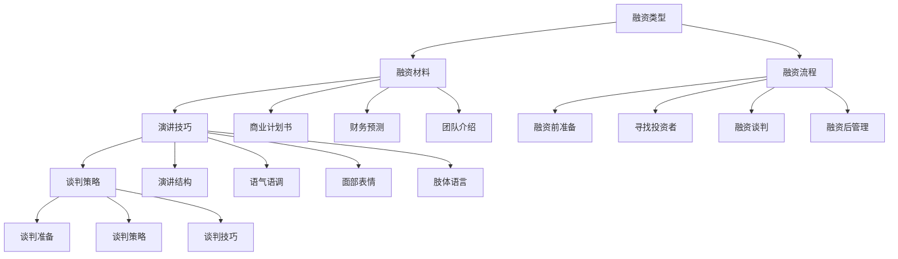

                 

## 文章标题

《程序员创业者的融资路演：制作吸引投资人的演示技巧》

## 关键词

融资路演、程序员创业者、演示技巧、投资人吸引力、融资策略

## 摘要

本文旨在为程序员创业者提供一份详尽的融资路演指南，包括融资基础与准备、路演技巧与实践、以及融资后续工作的管理策略。通过分析融资的概念与类型、融资材料的准备、路演目的与策略、演讲与PPT设计技巧，本文将帮助创业者提升融资路演的成功率，从而获得投资者的青睐与支持。

### 第一部分：融资基础与准备

#### 第1章：融资概述

#### 1.1 融资的概念与类型

融资，对企业来说，是获取外部资金以支持其业务扩张和运营的重要手段。从广义上讲，融资包括股权融资、债务融资、风险投资、天使投资等多种类型。

- **股权融资**：通过出售公司股份获得资金，投资者成为公司的股东，共享公司未来的收益和风险。
- **债务融资**：企业通过向金融机构或投资者借款来获取资金，通常需要支付利息和本金。
- **风险投资**：风险投资家投资于具有高成长潜力的初创企业，期望在企业成功后获得高额回报。
- **天使投资**：通常由个人投资者提供早期的资金支持，这些投资者通常具有行业经验，并愿意帮助创业公司成长。

#### 1.2 程序员创业者的融资需求

作为程序员创业者，了解自身的融资需求至关重要。通常，程序员创业者在融资过程中面临以下需求：

- **产品开发**：新产品的研发和改进需要资金支持，包括研发人员薪资、设备购置等。
- **市场拓展**：为了扩大市场份额，需要资金用于市场推广、品牌建设等。
- **团队建设**：吸引和留住关键人才，需要提供有竞争力的薪酬和福利。
- **运营成本**：日常运营开支，如办公场所、服务器维护等。

#### 1.3 融资流程解析

融资流程大致可以分为以下几个阶段：

- **融资前准备**：明确融资需求、制定融资计划、整理融资材料。
- **寻找投资者**：通过融资平台、个人网络、投资机构等渠道寻找投资者。
- **融资谈判**：谈判融资条件、签订融资协议。
- **融资后管理**：资金使用监管、回报投资者、后续融资规划。

### 第2章：融资材料准备

#### 2.1 商业计划书

商业计划书是创业者向投资者展示公司未来前景的关键文件。一份成功的商业计划书应包括以下内容：

- **公司背景**：公司历史、组织结构、管理团队介绍。
- **产品或服务介绍**：产品的特点、功能、市场定位。
- **市场分析**：目标市场、市场规模、市场趋势。
- **营销策略**：销售渠道、市场推广计划、客户关系管理。
- **财务预测**：未来几年收入、成本、盈利预测。
- **资金需求**：融资额度、用途、回报方式。

#### 2.2 财务预测与估值

财务预测是商业计划书的重要组成部分，它帮助投资者了解公司的财务健康状况。财务预测应包括以下内容：

- **收入预测**：未来几年预计的营业收入。
- **成本预测**：预计的运营成本，包括人员成本、办公成本、营销成本等。
- **盈利预测**：预计的净利润和毛利率。

估值则是确定公司价值的过程，常用的估值方法包括：

- **市场比较法**：通过比较同类公司的市场价值来估值。
- **收益法**：根据公司的预期收益来估值。
- **资产法**：根据公司总资产减去总负债来估值。

#### 2.3 团队介绍与核心竞争力

团队介绍和核心竞争力是投资者关注的重要方面。创业者需要：

- **团队介绍**：团队成员的背景、经验、专业技能。
- **核心竞争力**：公司的独特优势，如技术创新、市场份额、团队实力等。

### 第3章：路演准备

#### 3.1 路演的目的与策略

路演是创业者向潜在投资者展示公司的过程。成功的路演需要明确以下目的和策略：

- **目的**：向投资者展示公司业务模式、发展潜力、财务状况等。
- **策略**：根据目标投资者特点、投资偏好制定路演策略。例如，针对风险投资者，重点展示技术创新和市场前景；针对银行，重点展示财务健康和还款能力。

#### 3.2 路演材料的制作

路演材料是路演成功的关键。制作路演材料时，应注意以下几点：

- **PPT制作**：内容简洁明了、图表清晰、语言生动。
- **演示稿准备**：逻辑清晰、重点突出、有针对性。

#### 3.3 路演现场的准备

路演现场准备包括以下几点：

- **场地选择**：选择适合路演的场地，提前测试设备。
- **时间安排**：合理安排时间，预留提问环节。

### 第二部分：路演技巧与实践

#### 第4章：演讲技巧

演讲技巧在融资路演中至关重要。以下是一些演讲技巧：

- **演讲结构设计**：开头吸引听众注意、中间逻辑清晰、结尾留下深刻印象。
- **演讲语气与语调**：自信、热情、亲切。
- **面部表情与肢体语言**：自然、真诚、富有感染力。

#### 第5章：PPT设计

PPT设计应遵循简洁、清晰、美观的原则。以下是一些设计技巧：

- **设计原则**：内容简洁明了、避免过多的文字和图表。
- **图表与数据**：使用图表和数据进行有效呈现。
- **视觉美感**：注重PPT的整体视觉美感。

#### 第6章：融资谈判

融资谈判是创业者与投资者之间的重要环节。以下是一些谈判技巧：

- **谈判准备**：充分了解对方需求和谈判策略。
- **谈判策略**：灵活运用谈判技巧，达成双方满意的协议。
- **常见问题**：如估值分歧、股权分配、回购条款等。

#### 第7章：路演案例解析

通过分析成功和失败的路演案例，创业者可以学到宝贵的经验。以下是一些案例分析：

- **成功案例**：分析成功路演的原因，如优秀的商业计划书、出色的演讲技巧等。
- **失败案例**：分析失败的原因，如融资材料准备不足、演讲技巧欠缺等。

### 第三部分：融资后续工作

#### 第8章：融资后的管理

融资成功后，创业者需要关注以下几个方面：

- **财务规划**：合理使用资金，制定财务规划。
- **业务发展**：根据融资目标，制定业务发展计划。
- **团队建设**：加强团队管理，提升团队执行力。

#### 第9章：持续融资策略

持续融资是创业者需要考虑的问题。以下是一些策略：

- **意义**：了解持续融资的重要性，如资金需求、业务扩张等。
- **策略**：制定合适的融资策略，如寻找新的投资者、优化公司估值等。
- **难点**：应对融资过程中的难点，如估值分歧、投资者关系管理等。

## 附录

### 附录 A：融资相关资源

以下是一些融资相关的资源，供创业者参考：

- **融资平台**：如天使轮网、创新工场等。
- **融资工具**：如路演PPT模板、商业计划书模板等。
- **法律法规**：了解相关法律法规，确保融资过程合法合规。

### 背景介绍

作为程序员创业者，融资是一项挑战性但至关重要的任务。成功的融资不仅能为企业带来资金支持，还能提升企业的市场地位和品牌影响力。然而，融资并非易事，创业者需要深入了解融资的各个环节，包括融资概念、类型、需求、流程等。同时，创业者还需要准备充分的融资材料，如商业计划书、财务预测、团队介绍等，以展示企业的价值和潜力。

### 核心概念与联系

融资路演是一个复杂的过程，涉及多个核心概念，如融资类型、融资材料、演讲技巧、谈判策略等。这些概念之间有着紧密的联系，共同构成了一个完整的融资流程。

- **融资类型**：决定了企业获取资金的途径和方式，如股权融资、债务融资等。
- **融资材料**：包括商业计划书、财务预测、团队介绍等，是向投资者展示企业价值的关键。
- **演讲技巧**：通过演讲结构设计、语气语调、面部表情与肢体语言等，提升路演效果。
- **谈判策略**：在融资谈判中，灵活运用策略，达成双方满意的协议。

以下是一个简单的 Mermaid 流程图，展示融资路演的核心概念与联系：



### 核心算法原理讲解

在融资路演中，核心算法原理讲解是展示技术实力和创新能力的重要环节。以下是一个简单的伪代码示例，用于解释一种可能用于融资路演的技术——机器学习模型的训练过程。

```plaintext
# 伪代码：机器学习模型训练过程

# 初始化模型参数
model = initialize_model()

# 加载数据集
X_train, y_train = load_data('train_data.csv')

# 数据预处理
X_train_processed = preprocess_data(X_train)

# 训练模型
for epoch in range(num_epochs):
    # 前向传播
    predictions = model.forward_pass(X_train_processed)
    
    # 计算损失
    loss = compute_loss(y_train, predictions)
    
    # 反向传播
    gradients = compute_gradients(model, X_train_processed, y_train, predictions)
    
    # 更新模型参数
    model.update_parameters(gradients)
    
    # 打印训练进度
    print(f"Epoch {epoch}: Loss = {loss}")

# 评估模型
accuracy = evaluate_model(model, X_train_processed, y_train)
print(f"Model Accuracy: {accuracy}")

# 保存模型
save_model(model, 'trained_model.pkl')
```

在这个伪代码中，`initialize_model()` 函数用于初始化模型参数，`load_data()` 函数用于加载数据集，`preprocess_data()` 函数用于数据预处理，`compute_loss()` 函数用于计算损失，`compute_gradients()` 函数用于计算梯度，`update_parameters()` 函数用于更新模型参数，`evaluate_model()` 函数用于评估模型性能，`save_model()` 函数用于保存模型。

### 数学模型和公式

在融资路演中，数学模型和公式可以用来解释公司的财务预测和市场分析。以下是一个简单的数学模型示例，用于计算公司的预期收入。

$$
\text{收入} = \text{单价} \times \text{销售量} \times \text{销售额增长率}
$$

其中，单价是指公司产品或服务的价格，销售量是指预期销售的产品或服务数量，销售额增长率是指预期销售额的年增长率。

以下是一个更详细的财务预测模型的例子：

$$
\text{净利润} = \text{总收入} - \text{总成本} - \text{税金}
$$

$$
\text{总收入} = \text{单价} \times \text{销售量}
$$

$$
\text{总成本} = \text{生产成本} + \text{运营成本} + \text{营销成本}
$$

在这个模型中，`总收入` 是基于预期单价和销售量的计算结果，`总成本` 包括生产成本、运营成本和营销成本，`税金` 是基于 `总收入` 计算的税收费用。通过调整这些参数，创业者可以模拟不同的财务场景，以预测公司的未来财务状况。

### 详细讲解与举例说明

为了更好地理解上述数学模型，我们可以通过一个具体的例子来进行说明。

假设公司预计在未来一年内销售1000件产品，每件产品的单价为100元，销售额增长率为20%。

首先，计算预期销售量：

$$
\text{预期销售量} = 1000 \times (1 + 20\%) = 1200 \text{件}
$$

然后，计算预期总收入：

$$
\text{总收入} = 100 \text{元/件} \times 1200 \text{件} = 120000 \text{元}
$$

接下来，假设生产成本为每件产品50元，运营成本为每月10000元，营销成本为每月5000元，税率为20%。

计算总成本：

$$
\text{总成本} = (50 \text{元/件} \times 1200 \text{件}) + 10000 \text{元/月} + 5000 \text{元/月} = 60000 \text{元} + 15000 \text{元} = 75000 \text{元}
$$

计算税金：

$$
\text{税金} = \text{总收入} \times \text{税率} = 120000 \text{元} \times 20\% = 24000 \text{元}
$$

最后，计算净利润：

$$
\text{净利润} = \text{总收入} - \text{总成本} - \text{税金} = 120000 \text{元} - 75000 \text{元} - 24000 \text{元} = 21000 \text{元}
$$

通过这个例子，我们可以清楚地看到如何使用数学模型来预测公司的财务状况。这个模型可以帮助创业者了解在不同情况下公司的盈利能力，从而为融资谈判提供有力支持。

### 项目实战

为了更好地展示如何将上述理论和实践相结合，我们可以通过一个实际的项目来进行分析。假设我们正在开发一款基于人工智能的智能客服系统，目标是通过自动化客服流程来提高客户满意度和运营效率。

#### 开发环境搭建

1. **操作系统**：选择一个稳定的操作系统，如Ubuntu 20.04。
2. **编程语言**：选择Python 3.x，因为其拥有丰富的机器学习库和框架。
3. **依赖管理**：使用pip来安装所需的库，如TensorFlow、Scikit-learn、NLTK等。

```bash
pip install tensorflow scikit-learn nltk
```

4. **开发工具**：选择集成开发环境（IDE），如PyCharm或Visual Studio Code。

#### 源代码详细实现和代码解读

以下是实现智能客服系统的一个关键部分——对话管理模块的代码示例。

```python
import nltk
from nltk.stem import WordNetLemmatizer
from sklearn.feature_extraction.text import TfidfVectorizer
from sklearn.metrics.pairwise import cosine_similarity

# 初始化词干提取器
lemmatizer = WordNetLemmatizer()

# 对输入文本进行预处理
def preprocess_text(text):
    # 小写化
    text = text.lower()
    # 分词
    words = nltk.word_tokenize(text)
    # 词干提取
    words = [lemmatizer.lemmatize(word) for word in words]
    return ' '.join(words)

# 计算TF-IDF相似度
def compute_similarity(query, corpus):
    vectorizer = TfidfVectorizer()
    query_vector = vectorizer.fit_transform([query])
    corpus_vector = vectorizer.transform(corpus)
    similarity = cosine_similarity(query_vector, corpus_vector).flatten()
    return similarity

# 回答用户问题
def get_response(query, knowledge_base):
    query = preprocess_text(query)
    similarities = compute_similarity(query, knowledge_base)
    top_index = similarities.argsort()[-2]  # 排序后第二高的相似度索引
    return knowledge_base[top_index]

# 智能客服系统主函数
def chatbot():
    print("欢迎使用智能客服系统！")
    knowledge_base = [
        "您好，有什么可以帮助您的吗？",
        "我们需要帮助您解决什么问题？",
        "请问您有什么疑问或需求？",
        "我们这里可以提供各种服务，您需要哪方面的帮助？"
    ]
    while True:
        user_input = input("用户：")
        if user_input.lower() in ['退出', '再见', '拜拜']:
            print("客服：感谢您的使用，祝您有美好的一天！")
            break
        response = get_response(user_input, knowledge_base)
        print(f"客服：{response}")

# 启动智能客服
chatbot()
```

在这个代码中，我们首先对用户的输入进行预处理，然后使用TF-IDF向量模型计算用户输入与知识库中的语句的相似度。最后，返回相似度最高的响应。

#### 代码应用解读与分析

1. **预处理**：通过`nltk`库对文本进行分词和词干提取，这一步对于理解自然语言非常重要，因为不同的词语形式可能代表相同的意思。
2. **相似度计算**：使用TF-IDF模型计算文本间的相似度，这是一种有效的文本匹配方法，可以用于文本分类、推荐系统等。
3. **对话管理**：通过简单的逻辑判断，实现基本的对话功能。在实际应用中，可以集成更多的自然语言处理技术，如情感分析、实体识别等，以提升系统的智能水平。

#### 实际案例分析和详细讲解剖析

假设一个用户输入“我想要购买一款智能手机”，系统应该如何回答？

1. **预处理**：将用户输入转换为“我想要购买一款智能手机”。
2. **相似度计算**：计算用户输入与知识库中的语句的相似度，假设“我们有多种智能手机供您选择”的相似度最高。
3. **响应生成**：系统返回“我们有多种智能手机供您选择”。

通过这个案例，我们可以看到智能客服系统是如何通过简单的文本匹配来提供响应的。然而，实际应用中，系统可能会更复杂，包括更多的逻辑判断和自然语言理解能力。

#### 项目小结

通过这个实际项目，我们展示了如何将融资路演的理论应用到实际开发中。智能客服系统不仅展示了公司的技术实力，还展示了公司在解决实际商业问题方面的能力。这有助于提升投资者对项目的信心。

### 最佳实践 tips、小结、注意事项、拓展阅读

#### 最佳实践 tips

1. **深入理解投资人**：在路演前，深入研究目标投资人的背景、兴趣和投资偏好，以便更好地展示项目的亮点。
2. **简洁明了**：在制作PPT和撰写演示稿时，尽量简洁明了，避免过多的文字和复杂的图表。
3. **准备充分**：对商业计划书、财务预测等进行多次审核和修改，确保内容的准确性和完整性。
4. **练习演讲**：提前多次练习演讲，确保在路演现场能够流畅地表达自己的观点。

#### 小结

融资路演是程序员创业者获取资金支持的重要途径，通过充分的准备和有效的展示，可以提高融资的成功率。创业者应重点关注融资类型、材料准备、路演技巧和谈判策略。

#### 注意事项

1. **注意时间控制**：在路演现场，合理安排时间，确保每个环节都有足够的时间。
2. **应对提问**：准备应对可能的投资人提问，确保能够清晰、准确地回答。
3. **保持自信**：在演讲过程中，保持自信和积极的态度，避免过度紧张。

#### 拓展阅读

1. **《融资之路：创业者必读的101个故事》**：通过真实案例，了解创业者融资的经验和教训。
2. **《融资谈判技巧》**：详细解析融资谈判的策略和技巧，帮助创业者提升谈判能力。
3. **《PPT制作技巧》**：介绍如何制作专业、吸引人的PPT，提升路演效果。

### 作者信息

作者：AI天才研究院/AI Genius Institute & 禅与计算机程序设计艺术 /Zen And The Art of Computer Programming

