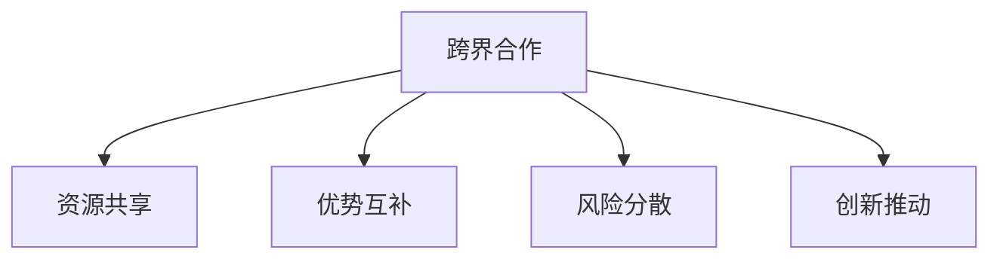
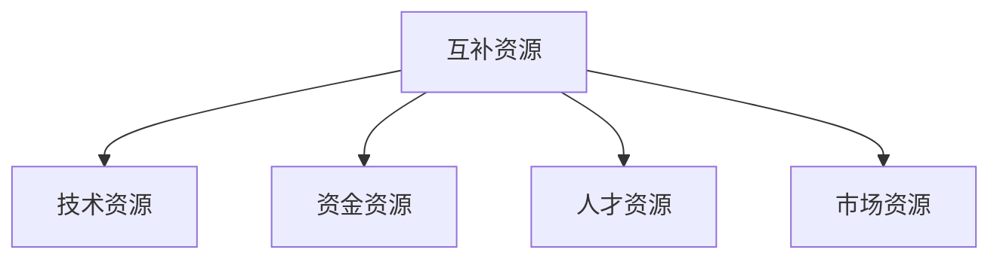

                 

### 1.1 跨界合作的背景与价值

在当今快速发展的信息技术时代，程序员创业者的挑战与机遇并存。挑战主要体现在资源有限、市场竞争激烈、技术更新迅速等方面，而机遇则来自于广阔的市场需求、新兴技术的涌现以及跨界合作的潜力。在这种背景下，跨界合作成为程序员创业者的关键战略之一，其背景与价值如下：

#### 1.1.1 程序员创业者的挑战与机遇

**伪代码：**

```python
def startup_challenge():
    if resources == "limited":
        return "difficulty"
    else:
        return "opportunity"
```

**数学公式：**

$$\text{资源限制} \Rightarrow \text{创业难度}$$  
$$\text{资源丰富} \Rightarrow \text{创业机遇}$$

**解析：** 程序员创业者在资源有限的情况下，面临诸多挑战，如技术积累不足、市场经验缺乏、资金有限等。然而，随着互联网和大数据等技术的发展，程序员创业者可以借助跨界合作来弥补这些不足，从而抓住市场机遇。

#### 1.1.2 跨界合作的定义与内涵

跨界合作是指不同领域、行业或企业之间，为了共同实现特定目标而进行的合作。其内涵包括：

- **资源共享**：通过合作，各方可以共享资源，如技术、人才、资金等，提高资源利用效率。
- **优势互补**：不同领域的企业或个人拥有不同的优势，跨界合作可以实现优势互补，提高整体竞争力。
- **风险分散**：通过合作，可以共同承担风险，降低单个企业的风险暴露。
- **创新推动**：跨界合作可以带来新的视角和思路，促进创新和技术的进步。

**Mermaid 流程图：**



**解析：** 跨界合作通过资源共享、优势互补、风险分散和创新推动等多方面的价值，为程序员创业者提供了新的发展路径。

#### 1.1.3 跨界合作的价值与意义

跨界合作对程序员创业者来说具有重要的价值与意义，具体体现在以下几个方面：

- **提高创新能力**：跨界合作可以整合不同领域的知识和技术，激发创新思维，推动技术创新。
- **分享资源与风险**：跨界合作使得各方能够共享资源，降低成本，同时分担风险，提高企业的抗风险能力。
- **拓展市场机会**：跨界合作有助于企业进入新市场，扩大业务范围，提高市场份额。

**举例说明：**

- **案例 1**：一家程序员创业公司通过跨界合作与一家硬件制造商合作，共同开发智能硬件产品，从而拓宽了业务领域，提高了市场竞争力。
- **案例 2**：一家金融科技公司通过与一家医疗科技公司合作，将金融技术与医疗大数据相结合，开发出了针对患者管理的创新产品，提高了医疗服务效率。

**总结：** 跨界合作为程序员创业者提供了丰富的资源和机会，通过整合优势、分散风险和创新推动，有助于企业实现快速发展。因此，程序员创业者应重视跨界合作，制定有效的跨界合作策略，以应对市场挑战和抓住机遇。

### 1.2 跨界合作的策略与方法

跨界合作对于程序员创业者来说，是一种有效提升创新能力、资源利用效率和市场竞争力的方式。然而，成功的跨界合作需要明确的策略和科学的方法。本节将介绍跨界合作的战略规划、资源整合和风险管理三个方面，帮助创业者更好地实施跨界合作。

#### 2.1 跨界合作的战略规划

跨界合作的战略规划是跨界合作成功的前提。以下是战略规划的核心要素：

**目标明确：** 在进行跨界合作之前，创业者需要明确合作的目标。这些目标可以是提高产品技术含量、开拓新市场、降低成本等。明确的目标有助于合作各方在合作过程中保持一致的方向和努力。

**资源评估：** 创业者需要评估自身和合作伙伴的资源状况，包括技术能力、资金、人才等。通过评估，创业者可以了解自身的优势和不足，从而有针对性地寻找互补资源，提高合作的成功率。

**风险评估：** 跨界合作过程中，可能面临各种风险，如技术风险、市场风险、法律风险等。创业者需要识别这些潜在风险，并制定相应的风险应对策略，以降低风险对合作的影响。

**合作伙伴选择：** 选择合适的合作伙伴是实现跨界合作成功的关键。创业者需要寻找具有互补优势、信誉良好、合作意愿强烈的合作伙伴。通过合作前的沟通和交流，创业者可以更好地了解合作伙伴，降低合作风险。

**伪代码：**

```python
def strategic_planning():
    # 明确目标
    set_goals()
    # 资源评估
    assess_resources()
    # 风险评估
    identify_risks()
    # 合作伙伴选择
    select_partners()
```

**数学公式：**

$$\text{目标明确} \Rightarrow \text{战略规划成功}$$  
$$\text{资源评估} \Rightarrow \text{资源互补}$$  
$$\text{风险评估} \Rightarrow \text{风险可控}$$  
$$\text{合作伙伴选择} \Rightarrow \text{合作成功}$$

**解析：** 战略规划是跨界合作的基础，通过明确目标、评估资源、识别风险和选择合作伙伴，创业者可以为跨界合作奠定坚实的基础。

#### 2.2 跨界合作的资源整合

资源整合是跨界合作的核心内容之一。以下介绍资源整合的方法：

**资源对接：** 建立资源对接机制，促进各方资源的共享和利用。创业者可以通过建立合作平台、召开资源对接会等方式，实现资源的有效对接。

**资源优化：** 通过整合和优化资源，提高资源利用效率。创业者可以采用以下方法进行资源优化：

- **技术整合**：将不同领域的先进技术进行整合，提高产品或服务的技术水平。
- **人才整合**：通过引进外部人才，提升企业的人才储备和创新能力。
- **资金整合**：通过联合融资、风险投资等方式，扩大企业的资金来源，降低融资成本。

**伪代码：**

```python
def resource_integration():
    # 资源对接
    connect_resources()
    # 资源优化
    optimize_resources()
```

**数学公式：**

$$\text{资源对接} \Rightarrow \text{资源共享}$$  
$$\text{资源优化} \Rightarrow \text{资源利用效率提高}$$

**解析：** 资源整合是实现跨界合作价值的关键，通过资源对接和优化，创业者可以充分发挥各方资源优势，提高整体竞争力。

#### 2.3 跨界合作的风险管理

风险管理是跨界合作中不可忽视的一环。以下介绍风险管理的方法：

**风险评估：** 定期评估合作过程中的风险，包括技术风险、市场风险、法律风险等。通过风险评估，创业者可以及时发现潜在风险，并采取相应的措施进行防范。

**风险控制：** 制定风险控制措施，降低风险对合作的影响。创业者可以采用以下方法进行风险控制：

- **风险预警**：通过建立风险预警机制，提前发现并应对潜在风险。
- **风险转移**：通过保险、合同等方式，将部分风险转移给合作伙伴。
- **风险分担**：通过合作，各方共同承担风险，降低单个企业的风险压力。

**伪代码：**

```python
def risk_management():
    # 风险评估
    assess_risks()
    # 风险控制
    control_risks()
```

**数学公式：**

$$\text{风险评估} \Rightarrow \text{风险识别}$$  
$$\text{风险控制} \Rightarrow \text{风险降低}$$

**解析：** 风险管理是保障跨界合作顺利进行的重要环节，通过风险评估和风险控制，创业者可以降低合作风险，确保跨界合作的稳定发展。

#### 总结

跨界合作是程序员创业者提升竞争力、实现快速发展的重要手段。通过战略规划、资源整合和风险管理，创业者可以更好地实施跨界合作，抓住市场机遇，实现企业目标。在跨界合作的道路上，创业者需要不断探索和实践，积累经验，以应对不断变化的市场环境。

### 1.3 互补资源的识别与评估

在跨界合作中，识别并评估互补资源是确保合作成功的关键环节。互补资源能够实现优势互补、资源优化和风险分散，从而提升整个项目的竞争力和成功率。以下是关于互补资源的定义、识别方法和评估与选择的具体内容。

#### 3.1 互补资源的定义与分类

**定义：** 互补资源是指在某个特定领域或任务中，能够与其他资源相互补充，共同发挥作用，实现协同效应的各种资源。这些资源可以是技术、资金、人才、市场渠道等。

**分类：** 根据资源性质和作用，互补资源可以分为以下几类：

- **技术资源**：包括核心技术、专利技术、开发工具等。
- **资金资源**：包括投资资金、融资渠道、风险资本等。
- **人才资源**：包括高级人才、专业技能人才、管理人才等。
- **市场资源**：包括客户资源、市场渠道、品牌影响力等。

**Mermaid 流程图：**



**解析：** 互补资源涵盖了企业发展的各个方面，通过分类可以更清晰地了解不同类型的资源在跨界合作中的重要性。

#### 3.2 互补资源的识别方法

**方法 1：需求分析**

- **步骤：**
  1. 分析自身资源和需求。
  2. 确定需要补充的资源类型。
  3. 搜集潜在合作伙伴的信息。

- **伪代码：**

```python
def identify_complementary_resources():
    analyze_resources()
    determine_needs()
    collect_potential_partners()
```

**数学公式：**

$$\text{自身资源分析} \Rightarrow \text{需求识别}$$  
$$\text{潜在合作伙伴信息收集} \Rightarrow \text{资源识别}$$

**解析：** 通过需求分析，创业者可以明确自身资源需求和不足，从而有针对性地寻找互补资源。

**方法 2：网络分析**

- **步骤：**
  1. 构建合作网络。
  2. 识别潜在的合作者和资源。
  3. 分析合作网络的连通性和资源互补性。

- **伪代码：**

```python
def network_analysis():
    build_cooperation_network()
    identify_potential_partners()
    analyze_network Connectivity_and_complementarity()
```

**数学公式：**

$$\text{合作网络构建} \Rightarrow \text{资源识别}$$  
$$\text{网络连通性分析} \Rightarrow \text{资源互补性判断}$$

**解析：** 通过网络分析，创业者可以从整体上了解合作网络中的资源分布和互补性，从而找到合适的合作伙伴。

**方法 3：行业调研**

- **步骤：**
  1. 调研相关行业和市场动态。
  2. 识别行业中的互补资源。
  3. 分析资源的市场前景和潜在价值。

- **伪代码：**

```python
def industry_research():
    research_industry_trends()
    identify_complementary_resources()
    analyze_market перспектив_and_value()
```

**数学公式：**

$$\text{行业调研} \Rightarrow \text{资源识别}$$  
$$\text{市场前景分析} \Rightarrow \text{资源评估}$$

**解析：** 行业调研有助于创业者了解行业中的互补资源，以及这些资源的市场前景和潜在价值。

#### 3.3 互补资源的评估与选择

**评估指标：**

- **资源价值**：评估资源的实际价值和潜在价值，如技术领先性、市场竞争力等。
- **合作稳定性**：评估合作伙伴的信誉、合作历史和长期合作关系可能性。
- **资源互补性**：评估资源之间的互补性和协同效应，如技术互补、市场互补等。
- **风险因素**：评估潜在风险，如技术风险、市场风险、法律风险等。

**评估方法：**

- **定量评估**：使用定量指标和方法，如评分法、排名法等，对资源进行量化评估。
- **定性评估**：结合专家意见、案例分析和实际考察，对资源进行定性评估。

**伪代码：**

```python
def evaluate_complementary_resources():
    set_evaluation_index()
    perform_quantitative_evaluation()
    perform_qualitative_evaluation()
    select_resources()
```

**数学公式：**

$$\text{资源价值评估} \Rightarrow \text{资源选择}$$  
$$\text{合作稳定性评估} \Rightarrow \text{合作持续}$$  
$$\text{资源互补性评估} \Rightarrow \text{协同效应}$$  
$$\text{风险因素评估} \Rightarrow \text{风险控制}$$

**解析：** 通过评估与选择，创业者可以确保选定的互补资源具有实际价值和良好的合作潜力，从而提高跨界合作的成功率。

#### 总结

互补资源的识别与评估是跨界合作中至关重要的一环。通过需求分析、网络分析和行业调研等方法，创业者可以找到合适的互补资源。而通过定量和定性评估，创业者可以确保这些资源具有实际价值和良好的合作潜力。在跨界合作的道路上，有效的互补资源识别与评估将为企业带来竞争优势和发展机遇。

### 1.4 跨界合作在程序员创业中的应用案例

跨界合作在程序员创业中的应用案例丰富多样，下面通过几个具体案例，来探讨跨界合作如何帮助程序员创业者实现资源整合、风险分散和创新推动。

#### 案例一：金融科技与零售行业的跨界合作

**背景**：一家金融科技公司（A公司）与一家大型零售企业（B公司）合作，共同开发了一款基于区块链技术的购物平台。

**合作内容**：A公司提供区块链技术支持，包括区块链网络的设计、智能合约的编写和运行；B公司则负责平台的市场推广、用户获取和线下渠道的运营。

**效果**：通过合作，A公司不仅获得了丰富的市场资源和用户数据，还通过B公司的线下渠道扩大了业务规模。而B公司则通过引入区块链技术，提升了平台的透明度和安全性，增强了用户信任。

**解析**：在这个案例中，金融科技公司和零售企业的跨界合作，实现了技术资源与市场资源的互补。金融科技公司利用其在区块链技术上的优势，为零售企业提供了技术创新；而零售企业则利用其市场渠道和用户基础，为金融科技公司提供了业务增长的机会。

#### 案例二：物联网与汽车行业的跨界合作

**背景**：一家物联网技术公司（C公司）与一家汽车制造商（D公司）合作，共同开发了一款智能车载系统。

**合作内容**：C公司提供物联网技术和智能传感器解决方案，D公司则负责系统的集成和整车调试。

**效果**：通过合作，C公司获得了在汽车行业的技术验证和市场认可，D公司则通过引入物联网技术，提升了汽车的安全性和智能化水平，增强了市场竞争力。

**解析**：在这个案例中，物联网技术和汽车行业的跨界合作，实现了技术资源与产品资源的互补。物联网公司利用其在智能传感器和数据分析方面的优势，为汽车制造商提供了技术支持；而汽车制造商则利用其产品设计和制造能力，为物联网公司提供了应用场景和验证机会。

#### 案例三：人工智能与医疗行业的跨界合作

**背景**：一家人工智能公司（E公司）与一家医疗诊断机构（F医院）合作，共同开发了一款基于人工智能的诊断系统。

**合作内容**：E公司提供人工智能算法和大数据分析能力，F医院则负责提供医疗数据、临床场景和诊断标准。

**效果**：通过合作，E公司获得了丰富的医疗数据和临床场景，提高了算法的准确性和实用性；F医院则通过引入人工智能技术，提升了诊断效率和准确性，改善了医疗服务质量。

**解析**：在这个案例中，人工智能公司与医疗行业的跨界合作，实现了技术资源与医疗资源的互补。人工智能公司利用其在算法和数据挖掘方面的优势，为医疗行业提供了技术创新；而医疗行业则通过提供真实的医疗场景和数据，为人工智能公司提供了实践和应用的机会。

#### 案例四：软件开发与教育行业的跨界合作

**背景**：一家软件开发公司（G公司）与一家教育机构（H学院）合作，共同开发了一款编程教育平台。

**合作内容**：G公司提供软件开发和教学资源，H学院则负责课程设计、学生管理和市场推广。

**效果**：通过合作，G公司不仅拓展了在教育领域的业务，还通过教学实践不断优化和完善软件产品；H学院则通过引入先进的编程教育理念和技术，提升了教育质量和学生就业率。

**解析**：在这个案例中，软件开发公司与教育行业的跨界合作，实现了技术资源与教育资源的互补。软件开发公司通过提供教学资源和软件产品，为教育机构提供了技术支持；而教育机构则通过课程设计和学生管理，为软件开发公司提供了应用场景和市场反馈。

#### 总结

通过以上案例，我们可以看到，跨界合作在程序员创业中的应用，不仅能够帮助创业者整合外部资源，降低创业风险，还能够推动技术创新和市场拓展。跨界合作的成功离不开双方在技术、市场、资源等方面的互补和协同。对于程序员创业者来说，善于发现和利用互补资源，是实现创业成功的关键。

### 1.5 跨界合作中的挑战与应对策略

跨界合作虽然带来了诸多机遇，但同时也伴随着一系列挑战。这些挑战不仅可能影响合作的顺利进行，还可能导致项目失败。因此，理解并应对这些挑战至关重要。以下将探讨跨界合作中常见的一些挑战及其应对策略。

#### 1.5.1 文化差异

**挑战：** 跨界合作往往涉及到不同背景、不同文化和不同工作习惯的企业或个人，文化差异可能导致沟通不畅、合作困难。

**应对策略：**
- **文化培训：** 在合作初期，对双方团队进行文化培训，增强对彼此文化的理解和尊重。
- **建立共同目标：** 明确双方合作的目标和期望，共同制定合作计划，确保双方在目标上达成一致。
- **建立沟通机制：** 建立有效的沟通机制，定期进行沟通和反馈，确保信息透明和沟通顺畅。

**伪代码：**

```python
def handle_cultural_differences():
    cultural_training()
    establish_common_goals()
    set_up_communication_mechanism()
```

**数学公式：**

$$\text{文化培训} \Rightarrow \text{文化理解}$$  
$$\text{共同目标建立} \Rightarrow \text{目标一致性}$$  
$$\text{沟通机制设置} \Rightarrow \text{沟通顺畅}$$

**解析：** 通过文化培训、建立共同目标和设置有效的沟通机制，可以有效减少文化差异带来的负面影响。

#### 1.5.2 技术兼容性

**挑战：** 跨界合作中的技术兼容性问题是另一个重大挑战。不同企业或团队可能使用不同的技术栈、框架和工具，这可能导致技术上的不兼容。

**应对策略：**
- **技术调研：** 在合作初期，对双方的技术架构和开发工具进行充分调研，了解其优势和不足。
- **技术整合：** 选择一种双方都可以接受的技术方案，进行技术整合，确保系统的一致性和兼容性。
- **培训和支持：** 对双方团队进行技术培训和指导，帮助他们熟悉新的技术栈和工具。

**伪代码：**

```python
def handle_technical_compatibility():
    technical_survey()
    integrate_technologies()
    provide_training_and_support()
```

**数学公式：**

$$\text{技术调研} \Rightarrow \text{了解技术架构}$$  
$$\text{技术整合} \Rightarrow \text{系统一致性}$$  
$$\text{培训和指导} \Rightarrow \text{技术熟练度}$$

**解析：** 通过技术调研、技术整合和技术培训和指导，可以有效解决技术兼容性问题。

#### 1.5.3 风险管理

**挑战：** 跨界合作涉及到多方面的风险，如市场风险、技术风险、法律风险等。这些风险可能对项目的成功产生重大影响。

**应对策略：**
- **风险评估：** 定期对合作过程中的风险进行评估，识别潜在风险，制定风险应对策略。
- **风险控制：** 通过签订详细的合作协议，明确各方的权利和义务，降低法律风险。同时，通过保险、风险投资等方式，分散市场和技术风险。
- **风险管理团队：** 建立专业的风险管理团队，负责监督和协调风险管理工作。

**伪代码：**

```python
def handle_risk_management():
    perform_risk_assessment()
    implement_risk_control_measures()
    establish_risk_management_team()
```

**数学公式：**

$$\text{风险评估} \Rightarrow \text{风险识别}$$  
$$\text{风险控制} \Rightarrow \text{风险降低}$$  
$$\text{风险管理团队} \Rightarrow \text{风险监督与协调}$$

**解析：** 通过风险评估、风险控制和风险管理团队，可以有效地降低跨界合作中的各种风险。

#### 1.5.4 沟通障碍

**挑战：** 跨界合作中的沟通障碍可能导致信息传递不畅、决策延误等问题。

**应对策略：**
- **沟通培训：** 对双方团队进行沟通技能培训，提高沟通效率和效果。
- **建立沟通机制：** 设立定期的沟通会议、工作坊和报告机制，确保信息透明和及时传递。
- **使用技术工具：** 利用现代化的沟通工具，如即时通讯软件、协作平台等，提高沟通效率。

**伪代码：**

```python
def handle_communication_barriers():
    communication_training()
    establish_communication_mechanism()
    utilize_technology_tools()
```

**数学公式：**

$$\text{沟通培训} \Rightarrow \text{沟通技能提升}$$  
$$\text{沟通机制设置} \Rightarrow \text{信息传递效率}$$  
$$\text{技术工具使用} \Rightarrow \text{沟通便捷性}$$

**解析：** 通过沟通培训、建立沟通机制和使用技术工具，可以有效克服沟通障碍，确保合作顺利进行。

#### 总结

跨界合作中的挑战多样且复杂，但通过有效的应对策略，可以克服这些困难，实现合作目标。理解文化差异、技术兼容性、风险管理和沟通障碍等挑战，并采取相应的策略，是跨界合作成功的关键。创业者应高度重视这些问题，并积极采取措施，确保跨界合作的顺利进行。

### 1.6 跨界合作中的法律和知识产权问题

在跨界合作中，法律和知识产权问题是程序员创业者和合作伙伴必须重视的重要环节。这些问题不仅关系到合作双方的合法权益，还可能对项目的成功与否产生深远影响。以下将详细探讨跨界合作中的法律风险、知识产权保护和合同管理，并提供相关策略和建议。

#### 1.6.1 法律风险

**定义与分类：** 法律风险是指在跨界合作过程中，由于法律法规的不确定性、合同条款的不明确或违反法律法规而可能对合作双方造成损失的风险。法律风险可以分为以下几类：

- **合同风险**：合同条款不明确、合同履行中的争议、合同变更和解除等。
- **合规风险**：合作过程中不符合相关法律法规、行业标准或政策要求。
- **知识产权风险**：侵犯他人知识产权或自身的知识产权受到侵害。

**识别方法：**

- **合同审核**：在签订合同前，对合同条款进行详细审查，确保合同的合法性、明确性和可执行性。
- **法律咨询**：聘请专业律师对合作过程中的法律问题进行咨询和指导。
- **合规评估**：对合作项目进行合规性评估，确保项目的合法性和合规性。

**伪代码：**

```python
def identify_legal_risks():
    review_contract条款()
    consult_lawyers()
    perform_compliance_evaluation()
```

**数学公式：**

$$\text{合同审核} \Rightarrow \text{合同合法性}$$  
$$\text{法律咨询} \Rightarrow \text{法律问题解决}$$  
$$\text{合规评估} \Rightarrow \text{合规性保证}$$

**解析：** 通过合同审核、法律咨询和合规评估，可以有效地识别和降低法律风险。

#### 1.6.2 知识产权保护

**重要性：** 知识产权是企业的核心竞争力之一，保护知识产权对于跨界合作尤为重要。保护措施包括：

- **专利申请**：对合作中的核心技术进行专利申请，确保技术成果的独占性。
- **版权保护**：对合作中的软件代码、文档等创作进行版权登记，保护作品权利。
- **商标注册**：对合作中的品牌名称、标志等注册商标，防止他人恶意抢注。

**策略：**

- **知识产权保护协议**：与合作方签订知识产权保护协议，明确各方的权利和义务。
- **知识产权监控**：定期对市场上的知识产权进行监控，防止侵权行为。
- **技术保密协议**：与合作方签订技术保密协议，确保技术信息不被泄露。

**伪代码：**

```python
def protect_ip():
    apply_patents()
    register_copyright()
    trademark_registration()
    sign_ip_protection_agreements()
    monitor_ip()
    sign nondisclosure_agreements()
```

**数学公式：**

$$\text{专利申请} \Rightarrow \text{技术独占性}$$  
$$\text{版权保护} \Rightarrow \text{作品权利保护}$$  
$$\text{商标注册} \Rightarrow \text{品牌保护}$$

**解析：** 通过专利申请、版权保护、商标注册和签订相关协议，可以有效地保护知识产权。

#### 1.6.3 合同管理

**合同条款设计：** 合同条款应明确各方在合作中的权利、义务和责任，包括项目目标、工作范围、交付标准、付款方式、违约责任等。

**合同审查与修改：** 在签订合同前，应由专业律师对合同进行审查和修改，确保合同的合法性、公平性和可执行性。

**合同执行与监督：** 在合同执行过程中，应建立有效的监督和沟通机制，确保合同条款得到履行。

**伪代码：**

```python
def manage_contract():
    design_contract_terms()
    review_and_modify_contract()
    enforce_contract_execution()
    monitor_contract_performance()
```

**数学公式：**

$$\text{合同条款设计} \Rightarrow \text{合同合法性}$$  
$$\text{合同审查与修改} \Rightarrow \text{合同公平性}$$  
$$\text{合同执行与监督} \Rightarrow \text{合同履行保证}$$

**解析：** 通过合同条款设计、合同审查与修改、合同执行与监督，可以确保合同管理的有效性和合同条款的执行。

#### 建议

- **预防为主**：在跨界合作中，应注重预防法律和知识产权风险，提前制定相关策略和措施。
- **专业支持**：聘请专业律师和知识产权顾问，提供法律和知识产权方面的专业支持。
- **定期审查**：定期对合作项目的法律和知识产权状况进行审查，确保风险得到及时发现和控制。

### 总结

跨界合作中的法律和知识产权问题复杂且重要，创业者应高度重视这些问题，通过预防措施、专业支持和定期审查，确保跨界合作的顺利进行，保护双方的合法权益，促进项目的成功。

### 1.7 跨界合作的未来趋势与展望

随着全球化的不断深入和技术的快速迭代，跨界合作正逐渐成为企业发展的主流趋势。未来，跨界合作的模式、方式和方向也将发生深刻的变革，为程序员创业者带来更多机遇和挑战。

#### 1.7.1 跨界合作的未来趋势

**1. 跨界合作的深化**

随着企业对跨界合作的认知逐渐深入，跨界合作将不再局限于某一领域或某一行业，而是向着更广泛的领域和更深层次的融合方向发展。例如，金融科技与医疗、物联网与汽车、人工智能与教育等领域的跨界合作将更加紧密，实现资源、技术和市场的深度融合。

**2. 技术驱动的跨界合作**

随着人工智能、区块链、物联网等新兴技术的快速发展，跨界合作将更加依赖于技术创新。企业将更加注重技术能力的互补和整合，通过技术创新推动跨界合作的深入发展。

**3. 生态系统的跨界合作**

跨界合作将逐渐形成以产业链上下游企业为核心，各类创新主体共同参与的跨界合作生态系统。这种生态系统将有助于企业突破传统的行业界限，实现资源、技术和市场的全面整合。

#### 1.7.2 新型跨界合作模式探索

**1. 平台化合作**

在未来，跨界合作将更加依赖于平台化模式。通过建立跨界合作平台，企业可以实现资源共享、协同创新和风险共担，降低跨界合作的门槛和成本，提升合作效率。

**2. 联盟合作**

跨界联盟将成为未来跨界合作的一种重要形式。企业可以通过建立跨界联盟，实现优势互补、资源整合和风险分散，共同应对市场变化和竞争压力。

**3. 生态链合作**

生态链合作是一种以产业链上下游企业为核心，通过建立紧密合作关系，实现资源、技术和市场的全面整合的合作模式。这种模式有助于企业提升竞争力，实现可持续发展。

#### 1.7.3 未来跨界合作的挑战与应对

**1. 技术兼容性问题**

随着跨界合作的深化，技术兼容性问题将变得更加突出。企业需要加强技术调研和整合，选择兼容性好的技术方案，以降低技术兼容性带来的风险。

**2. 法律和知识产权问题**

跨界合作中的法律和知识产权问题将越来越复杂。企业需要建立健全的法律和知识产权保护体系，提前识别和应对相关风险。

**3. 文化差异和沟通障碍**

随着跨界合作的国际化，文化差异和沟通障碍将成为重要挑战。企业需要加强跨文化培训和沟通机制建设，提高团队协作效率。

#### 总结

未来，跨界合作将呈现深化、技术驱动和生态系统化等趋势，新型跨界合作模式也将不断涌现。程序员创业者应紧跟跨界合作的发展趋势，积极探索和尝试新的合作模式，提升企业的竞争力和创新能力。同时，面对跨界合作中的挑战，创业者需要具备前瞻性和应对策略，确保跨界合作的顺利进行和成功实施。

### 附录：跨界合作相关资源与工具推荐

#### A.1 跨界合作平台与工具

- **Alibaba Cloud**：阿里巴巴云平台提供一站式的云计算服务，包括大数据、人工智能、物联网等，帮助创业者进行跨界合作。
- **AWS**：亚马逊云服务（AWS）提供丰富的云计算解决方案，支持创业者开展跨界合作项目。
- **Microsoft Azure**：微软Azure云平台提供全面的云服务，助力企业进行跨界合作。
- **Slack**：Slack是一款协作工具，支持团队间的实时沟通和文件共享，提升跨界合作效率。
- **Trello**：Trello是一款项目管理工具，帮助团队规划项目进度，实现协作管理。

#### A.2 跨界合作案例库

- **哈佛商学院案例库**：哈佛商学院提供丰富的跨界合作案例，涵盖金融、医疗、科技等多个领域。
- **商学院案例库**：中国管理科学研究院商学院案例库，提供大量国内外的跨界合作案例，有助于创业者学习借鉴。
- **MBA智库案例库**：MBA智库提供众多企业的跨界合作案例，涵盖不同行业和领域，具有很高的参考价值。

#### A.3 跨界合作研究报告与白皮书

- **麦肯锡全球研究院**：麦肯锡发布的《跨界合作：创造新的商业模式》研究报告，详细分析了跨界合作的趋势和模式。
- **普华永道**：普华永道发布的《跨界合作：企业新动能》白皮书，探讨了跨界合作对企业创新和增长的影响。
- **IBM**：IBM发布的《跨界合作：加速创新，共创未来》白皮书，分享了跨界合作的成功经验和实践策略。

#### A.4 跨界合作的相关书籍与文章推荐

- **《跨界创新：企业跨界合作的实践指南》**：作者：约翰·霍金斯（John Hopkins）
- **《跨界思维：跨界合作与创新策略》**：作者：史蒂芬·科特勒（Steve Kotler）
- **《跨界合作：商业模式的创新实践》**：作者：托马斯·弗里德曼（Thomas Friedman）
- **《跨界共赢：企业跨界合作的策略与实践》**：作者：克里斯·安德森（Chris Anderson）
- **《跨界思考：如何用不同领域的思维解决问题》**：作者：理查德·萨勒（Richard Saul Wurman）

通过以上资源与工具，创业者可以深入了解跨界合作的最新趋势、实践经验和成功案例，为跨界合作提供理论支持和实践指导。

---

### 文章标题

《程序员创业者的跨界合作：寻找互补资源的实践技巧》

### 关键词

跨界合作，程序员创业者，互补资源，资源整合，风险管理，创新推动

### 摘要

本文详细探讨了程序员创业者如何通过跨界合作来寻找互补资源，提高创新能力、资源利用效率和市场竞争力的实践技巧。文章首先介绍了跨界合作的背景与价值，随后阐述了跨界合作的策略与方法，包括战略规划、资源整合和风险管理。接着，文章重点讨论了互补资源的识别与评估方法，并分析了跨界合作在程序员创业中的应用案例。此外，文章还探讨了跨界合作中的挑战与应对策略，以及法律和知识产权问题。最后，文章展望了跨界合作的未来趋势，并推荐了相关资源与工具。通过本文，程序员创业者可以更好地理解跨界合作的重要性，掌握有效的跨界合作技巧，为创业成功奠定坚实基础。

