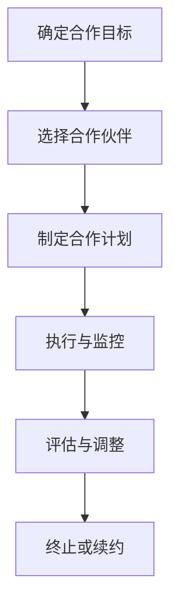

                 

### 文章标题

### 《程序员创业者的跨界合作：寻找互补资源的实践技巧》

#### 关键词：跨界合作、程序员创业者、互补资源、实践技巧、商业创新

#### 摘要：

本文将深入探讨程序员创业者在创业过程中如何通过跨界合作来寻找互补资源，实现业务的快速扩展与技术创新。我们将从跨界合作的概念与重要性入手，逐步分析跨界合作的挑战与机遇，探讨跨界合作的策略制定与商业模式，解析跨界合作的法律与风险管理，并分享寻找互补资源的实践技巧与沟通协作技巧。最后，通过实际案例分析，总结跨界合作的未来趋势及程序员创业者在跨界合作中的实践路径与挑战。

---

### 跨界合作概述

#### 第1章：跨界合作的概念与重要性

##### 1.1 跨界合作的定义

跨界合作，即不同行业、领域的企业或个人，通过合作、交流、互补等方式，共同实现资源整合、优势互补、技术创新和业务拓展。这种合作模式打破了传统行业壁垒，促进了跨领域的融合与共生。

##### 1.2 跨界合作的重要性

跨界合作在当今快速变化的市场环境中具有重要的意义：

1. **资源互补**：企业可以通过跨界合作获取其他领域的资源，如技术、市场、人才等，提升自身竞争力。
2. **技术创新**：跨界合作能够激发创新的火花，通过不同领域的知识融合，推动技术创新和产品升级。
3. **市场拓展**：跨界合作有助于企业开拓新的市场领域，扩大业务范围。
4. **降低风险**：通过合作分散风险，降低单一行业波动带来的影响。

##### 1.3 跨界合作的发展趋势

随着全球化、数字化、技术创新的加速，跨界合作呈现以下发展趋势：

1. **数字化驱动**：数字化技术为跨界合作提供了新的手段和平台，如云计算、物联网、人工智能等。
2. **平台化运作**：跨界合作逐渐向平台化、生态化方向发展，形成跨界联盟、合作生态圈。
3. **合作模式创新**：跨界合作模式不断创新，如股权合作、战略联盟、技术共享等。

#### 第2章：跨界合作的挑战与机遇

##### 2.1 跨界合作的挑战

跨界合作面临以下挑战：

1. **文化差异**：不同行业的企业文化、价值观、工作方式等存在差异，需要克服文化冲突。
2. **沟通难题**：跨界合作中的沟通不畅可能影响合作效果。
3. **利益分配**：合作各方在利益分配上可能存在争议，需要合理协商。

##### 2.2 跨界合作的机遇

跨界合作带来的机遇包括：

1. **资源互补**：通过合作，企业可以获取其他领域的资源，提升自身竞争力。
2. **技术创新**：跨界合作有助于激发创新思维，推动技术进步。
3. **市场拓展**：跨界合作有助于企业开拓新的市场领域，扩大业务范围。

---

在接下来的章节中，我们将进一步探讨跨界合作的策略、商业模式、法律与风险管理，以及实践技巧，帮助程序员创业者更好地实现跨界合作，推动创业成功。

---

### 跨界合作策略

#### 第3章：跨界合作策略制定

跨界合作的成功离不开有效的策略制定。以下将详细介绍如何制定跨界合作策略。

##### 3.1 确定跨界合作目标

跨界合作目标的制定是策略制定的首要步骤。合作目标应明确、具体，包括以下方面：

1. **资源共享**：明确合作各方希望共享的资源，如技术、市场、人才等。
2. **业务拓展**：确定跨界合作将如何帮助各方拓展业务范围，实现市场占有率提升。
3. **技术创新**：明确跨界合作将如何推动技术创新，提升产品竞争力。

##### 3.2 选择合作伙伴

选择合适的合作伙伴是跨界合作的关键。以下因素需要在选择合作伙伴时考虑：

1. **资源互补**：合作伙伴应具备能够与自身互补的资源，如技术、市场、人才等。
2. **行业经验**：合作伙伴应具备相关行业的经验，能够提供有益的指导和帮助。
3. **信誉与实力**：合作伙伴应具备良好的信誉和实力，确保合作顺利进行。

##### 3.3 制定合作计划

合作计划的制定应包括以下内容：

1. **合作模式**：明确跨界合作的模式，如股权合作、战略联盟、技术共享等。
2. **合作期限**：设定合作期限，确保合作持续性和稳定性。
3. **合作内容**：详细列出合作各方需承担的任务和责任，确保合作目标实现。
4. **风险分配**：明确合作过程中的风险分配，确保各方利益均衡。

##### 3.4 跨界合作的执行与监控

跨界合作的执行与监控是确保合作顺利进行的关键。以下措施有助于提高合作执行效果：

1. **定期会议**：定期召开合作方会议，交流进展情况，解决遇到的问题。
2. **绩效评估**：对合作项目进行定期评估，确保合作目标实现。
3. **沟通渠道**：建立畅通的沟通渠道，确保合作各方能够及时交流信息。
4. **激励机制**：制定激励机制，鼓励合作各方积极投入合作项目。

通过以上步骤，程序员创业者可以制定出有效的跨界合作策略，为创业成功奠定基础。

---

#### 第4章：跨界合作的商业模式

跨界合作不仅需要策略制定，还需要探索合适的商业模式。以下将探讨跨界合作的商业模式及其创新与优化。

##### 4.1 商业模式概述

跨界合作的商业模式是指通过合作各方在资源、技术、市场等方面的互补，实现共同盈利和价值创造的一种商业安排。常见的跨界合作商业模式包括：

1. **资源互换**：企业通过交换资源，如技术、市场等，实现共赢。
2. **联合开发**：企业共同投资研发新产品或技术，分享成果和收益。
3. **战略联盟**：企业通过建立战略联盟，共同开拓市场，实现资源共享。
4. **股权合作**：企业通过股权投资，共同控制合作项目，实现利益共享。

##### 4.2 跨界合作的盈利模式

跨界合作的盈利模式主要包括以下几种：

1. **产品销售**：通过合作开发的产品在市场上的销售，实现盈利。
2. **技术服务**：提供技术解决方案或服务，获取服务费或提成。
3. **品牌合作**：借助合作各方的品牌影响力，实现品牌推广和销售增长。
4. **资源共享**：通过共享资源，降低运营成本，提高效率，实现盈利。

##### 4.3 商业模式的创新与优化

跨界合作商业模式需要不断创新与优化，以适应市场变化和需求。以下是一些创新与优化的策略：

1. **数字化平台**：通过数字化平台，实现跨界合作的信息共享、资源整合和业务协同，提高效率。
2. **生态系统**：构建跨界合作生态系统，吸引更多合作伙伴加入，形成互补共赢的生态圈。
3. **灵活合作**：根据市场变化和需求，灵活调整合作模式，适应不同场景下的合作需求。
4. **资本运作**：利用资本市场，进行股权投资、并购等，优化商业模式，实现价值最大化。

通过以上策略，程序员创业者可以不断优化跨界合作的商业模式，实现业务的持续增长和盈利。

---

#### 第5章：跨界合作的法律与风险管理

跨界合作涉及到法律和风险管理的方方面面，对于程序员创业者来说，确保合作的合法性和风险可控是至关重要的。以下将详细探讨跨界合作中的法律问题、风险管理策略以及合同条款与争议解决。

##### 5.1 跨界合作的法律问题

跨界合作中的法律问题主要包括以下几个方面：

1. **合同法律问题**：合同是跨界合作的基础，需要确保合同条款的合法性、完整性和可执行性。常见问题包括合同无效、合同条款模糊、违反法律法规等。
2. **知识产权问题**：跨界合作中涉及到的知识产权问题，如专利、商标、著作权等，需要明确各方权利和义务，防止侵权纠纷。
3. **合规性问题**：不同行业有不同的法律法规要求，如金融行业的监管规定、医疗行业的标准等，需要确保跨界合作符合相关法律法规。
4. **税务问题**：跨境合作中的税务问题，如税收管辖、税种选择、税收优惠等，需要合理规划，避免税务风险。

##### 5.2 跨界合作的风险管理

跨界合作面临多种风险，包括市场风险、信用风险、法律风险等。以下是一些有效的风险管理策略：

1. **风险识别**：在合作初期，通过尽职调查、背景调查等手段，识别潜在的风险点。
2. **风险评估**：对识别出的风险进行评估，判断风险的影响程度和发生概率。
3. **风险控制**：制定风险控制措施，如签订风险分担协议、设置风险保证金等，降低风险发生概率和影响。
4. **风险转移**：通过保险、担保等方式，将部分风险转移给第三方，降低自身风险。

##### 5.3 合同条款与争议解决

合同条款的制定是跨界合作中至关重要的一环，以下是一些关键条款：

1. **合作目标与范围**：明确合作的目标和范围，避免合作过程中目标偏离。
2. **合作期限与条件**：明确合作期限、合作条件，确保合作的稳定性和持续性。
3. **权利与义务**：明确各方在合作中的权利和义务，避免合作过程中的纠纷。
4. **违约责任**：明确各方的违约责任，确保合作过程中出现问题时能够及时处理。
5. **争议解决**：约定争议解决的方式和程序，如仲裁、诉讼等，确保争议能够得到公正、高效的解决。

通过以上措施，程序员创业者可以有效地管理跨界合作中的法律和风险，确保合作顺利进行。

---

#### 第三部分：跨界合作的实践技巧

在第3章和第4章中，我们探讨了跨界合作的策略和商业模式。然而，成功的跨界合作不仅需要明确的策略和优秀的商业模式，更需要一系列实践技巧。本章将深入探讨跨界合作中的实践技巧，包括如何寻找互补资源、沟通与协作技巧，以及通过实际案例分析，帮助程序员创业者更好地实现跨界合作。

##### 第6章：寻找互补资源的实践技巧

跨界合作的核心在于寻找和整合互补资源。以下是几项关键实践技巧：

##### 6.1 确定互补资源的需求

在开始跨界合作之前，程序员创业者需要明确自身业务中的资源需求，包括：

1. **技术需求**：分析业务发展所需的技术能力，如人工智能、大数据分析、云计算等。
2. **市场资源**：评估业务拓展所需的市场资源，如客户资源、销售渠道、品牌影响力等。
3. **人力资源**：评估业务运营所需的专业人才，如研发人员、市场人员、运营人员等。

通过明确资源需求，可以更有针对性地寻找互补资源。

##### 6.2 寻找潜在合作伙伴

在确定了资源需求后，程序员创业者可以采取以下措施寻找潜在合作伙伴：

1. **行业调研**：通过对目标行业进行深入调研，了解行业内的领先企业和专家，寻找潜在的合作伙伴。
2. **网络资源**：利用互联网平台，如社交媒体、专业论坛、行业展会等，寻找有合作意向的企业和个体。
3. **人脉资源**：利用个人和团队的人脉资源，了解潜在合作伙伴的信息和背景。

##### 6.3 实施互补资源的合作

找到潜在合作伙伴后，程序员创业者需要采取以下措施实施互补资源的合作：

1. **合作意向沟通**：与潜在合作伙伴进行初步沟通，了解合作意向和可行性。
2. **合作方案设计**：根据合作需求和潜在合作伙伴的特点，设计具体的合作方案，明确合作目标、合作模式、责任分工等。
3. **合作协议签订**：在合作方案明确后，签订合作协议，确保合作的合法性和稳定性。

通过以上措施，程序员创业者可以有效地寻找和整合互补资源，为跨界合作奠定基础。

##### 第7章：跨界合作的沟通与协作技巧

有效的沟通与协作是跨界合作成功的关键。以下是一些沟通与协作技巧：

##### 7.1 沟通技巧

1. **建立信任**：建立信任是跨界合作的基础，通过透明沟通、诚实表达和相互尊重，建立良好的合作关系。
2. **倾听与反馈**：倾听合作伙伴的意见和需求，给予积极的反馈，确保双方的理解和预期一致。
3. **及时沟通**：在合作过程中，保持及时沟通，及时解决遇到的问题和挑战。

##### 7.2 协作工具与平台

1. **项目管理工具**：使用项目管理工具，如JIRA、Trello等，明确任务分工、进度追踪和问题解决。
2. **沟通平台**：使用专业的沟通平台，如Slack、Microsoft Teams等，确保信息的及时传递和协作的效率。
3. **协作软件**：利用协作软件，如GitHub、Confluence等，实现代码共享、文档协作和知识管理。

##### 7.3 建立跨部门合作关系

在跨界合作中，往往涉及到不同部门和团队之间的协作。以下措施有助于建立跨部门合作关系：

1. **建立合作机制**：明确跨部门合作的目标、流程和责任，建立定期沟通和协作机制。
2. **培训与交流**：组织跨部门培训与交流，增强团队间的了解和协作能力。
3. **激励机制**：设立激励机制，鼓励跨部门协作，提高团队的整体绩效。

通过以上沟通与协作技巧，程序员创业者可以确保跨界合作的顺利进行，实现资源的最大化利用和业务目标的有效达成。

##### 第8章：跨界合作案例分析

为了更好地理解跨界合作的实际操作，以下将介绍几个成功的跨界合作案例，并分析其成功原因和可借鉴的经验。

##### 8.1 案例分析概述

本次案例分析将涵盖三个具有代表性的跨界合作案例：

1. **案例一**：一家互联网公司与传统制造业企业的跨界合作。
2. **案例二**：一家科技公司与高校的合作项目。
3. **案例三**：一家初创公司与大型企业的合作。

通过这些案例，我们将深入探讨跨界合作的实际操作和成功经验。

##### 8.2 成功案例解析

**案例一：互联网公司与传统制造业企业的跨界合作**

**背景**：一家互联网公司A希望将其先进的技术应用到传统制造业中，以提高生产效率和产品质量。

**过程**：
- **合作意向沟通**：互联网公司A通过行业调研，找到了一家具有创新精神的传统制造企业B。
- **合作方案设计**：双方共同设计了基于物联网和大数据技术的智能制造解决方案。
- **合作协议签订**：双方签订合作协议，明确分工和责任。

**结果**：
- **成功原因**：合作双方在技术、市场、资源等方面实现互补，共同推进项目实施。
- **经验借鉴**：跨界合作中，明确的合作目标和方案设计是成功的关键。

**案例二：科技公司与高校的合作项目**

**背景**：一家科技公司C希望与高校D合作，共同研发新技术，推动产业创新。

**过程**：
- **合作意向沟通**：科技公司C通过学术交流，与高校D建立了初步的合作意向。
- **合作方案设计**：双方共同制定了技术研发计划，明确了研发目标、进度和成果分配。
- **合作协议签订**：双方签订合作协议，明确知识产权归属和利益分配。

**结果**：
- **成功原因**：高校提供了丰富的技术资源和科研团队，科技公司提供了市场资源和资金支持。
- **经验借鉴**：跨学科、跨领域的合作可以激发创新思维，推动技术突破。

**案例三：初创公司与大型企业的合作**

**背景**：一家初创企业E希望通过与大型企业F的合作，快速进入市场并获取客户资源。

**过程**：
- **合作意向沟通**：初创企业E通过参加行业展会，与大型企业F建立了联系。
- **合作方案设计**：双方共同制定了市场推广计划，初创企业E提供创新产品，大型企业F提供市场渠道和品牌资源。
- **合作协议签订**：双方签订合作协议，明确合作模式和利益分配。

**结果**：
- **成功原因**：大型企业提供了强大的市场资源和品牌影响力，初创企业提供了创新技术和产品。
- **经验借鉴**：对于初创企业，寻找具有强大资源的大型企业合作伙伴是快速成长的关键。

通过以上案例分析，程序员创业者可以从中汲取成功经验，为自身的跨界合作提供有益的参考。

##### 8.3 失败案例反思

**案例一：文化冲突导致的失败**

**背景**：一家互联网公司与一家传统企业合作，但由于双方文化差异较大，导致合作失败。

**原因**：
- **文化差异**：互联网公司追求创新和快速行动，而传统企业更注重稳定和流程化。
- **沟通不畅**：双方在沟通中缺乏有效沟通，导致合作目标不明确，合作方案无法落实。

**反思**：
- **文化适应**：在跨界合作中，需要重视文化差异，寻找文化兼容的合作伙伴。
- **加强沟通**：建立有效的沟通机制，确保合作各方在目标、方案和执行上的共识。

**案例二：利益分配不均导致的失败**

**背景**：一家初创企业与一家大型企业合作，但由于利益分配不均，导致合作失败。

**原因**：
- **利益分配**：双方在合作收益分配上未能达成一致，初创企业感觉利益被剥夺，大型企业则认为初创企业贡献较小。

**反思**：
- **合理分配**：在跨界合作中，需要合理分配利益，确保各方都有公平的利益回报。
- **利益平衡**：在合作过程中，需要不断调整利益分配方案，确保合作的可持续性。

通过反思失败案例，程序员创业者可以避免类似的问题，提高跨界合作的成功率。

---

#### 第四部分：跨界合作的未来展望

##### 第9章：跨界合作的新趋势

随着科技的不断进步和市场的持续变化，跨界合作呈现出新的趋势。以下是几个值得关注的趋势：

##### 9.1 技术驱动的跨界合作

1. **人工智能与各行各业融合**：人工智能技术的应用正在各个行业得到推广，如智能制造、医疗健康、金融服务等，跨界合作将更加紧密。
2. **区块链技术的应用**：区块链技术提供了一种去中心化的合作方式，有助于提高透明度和信任度，推动跨界合作。

##### 9.2 数字化背景下的跨界合作

1. **数字化平台的兴起**：数字化平台为跨界合作提供了新的渠道和工具，如共享经济平台、供应链协同平台等，提高了合作效率和资源整合能力。
2. **物联网的广泛应用**：物联网技术的普及使得跨界合作中的资源连接更加紧密，实现了智能化的生产和管理。

##### 9.3 跨界合作与可持续发展

1. **绿色科技的融合**：跨界合作在推动技术进步的同时，也关注可持续发展，如新能源、环保技术等领域的合作。
2. **社会责任的融入**：跨界合作越来越注重社会责任，如扶贫、公益等领域的合作，实现了商业价值与社会价值的双重提升。

通过把握这些新趋势，程序员创业者可以更好地适应市场变化，推动跨界合作的深化与发展。

##### 第10章：程序员创业者的跨界合作

程序员创业者在跨界合作中具有一定的优势和挑战。以下将探讨程序员创业者的跨界合作路径、挑战及对策。

##### 10.1 程序员创业者的优势

1. **技术优势**：程序员创业者通常具备较强的技术能力和创新意识，能够快速把握技术趋势和市场需求。
2. **灵活性**：程序员创业者往往具有较强的灵活性和适应能力，能够迅速调整业务策略和合作方式。
3. **网络资源**：程序员创业者拥有广泛的网络资源，包括同行、技术社区、投资机构等，有助于寻找合作伙伴。

##### 10.2 跨界合作的实践路径

1. **行业互补**：选择与自身业务有互补性的行业进行合作，如互联网公司与制造业、医疗行业的合作。
2. **技术合作**：与技术领先企业合作，共同研发新技术或产品，提升自身技术实力。
3. **市场拓展**：通过与具有市场资源的合作伙伴合作，快速进入新市场，扩大业务范围。

##### 10.3 跨界合作中的挑战与对策

1. **挑战**：
   - **文化差异**：不同行业、企业之间的文化差异可能带来沟通和协作难题。
   - **利益分配**：跨界合作中的利益分配问题可能引发合作方的矛盾和纠纷。
   - **风险控制**：跨界合作中可能面临技术、市场等风险，需要有效控制和管理。

2. **对策**：
   - **文化适应**：通过培训、交流等方式，增强跨文化沟通与协作能力。
   - **利益共享**：制定合理的利益分配方案，确保各方利益均衡。
   - **风险管理**：建立风险管理体系，提前识别和应对潜在风险。

通过以上路径和对策，程序员创业者可以更好地实现跨界合作，推动创业成功。

---

#### 附录

##### 附录A：跨界合作资源与工具

为了帮助程序员创业者更好地进行跨界合作，以下是推荐的一些跨界合作平台、案例库和参考书籍：

**跨界合作平台：**
1. ** LinkedIn**：专业社交平台，可寻找行业内的合作伙伴。
2. ** GitHub**：代码托管平台，可查找开源项目和技术合作伙伴。
3. ** AngelList**：创业项目融资平台，可寻找潜在投资方和合作伙伴。

**跨界合作案例库：**
1. ** Harvard Business Review**：提供大量跨界合作案例分析。
2. ** McKinsey & Company**：提供关于跨界合作的研究报告和案例分析。

**跨界合作相关书籍与文章推荐：**
1. **《跨界创新：产业融合的新逻辑》**：探讨跨界合作的理论和实践。
2. **《跨界合作：企业转型的新路径》**：分析跨界合作的商业策略和案例分析。

通过这些资源和工具，程序员创业者可以更好地了解跨界合作的现状和趋势，为自身的跨界合作提供有益的参考。

##### 附录B：跨界合作案例分析

为了更深入地理解跨界合作的实际操作和效果，以下将详细介绍三个具有代表性的跨界合作案例。

**案例一：公司A与公司B的跨界合作**

**背景**：公司A是一家专注于智能家居技术的初创企业，公司B是一家拥有广泛市场渠道的传统家电企业。

**过程**：
- **合作意向沟通**：公司A通过参加行业展会，与公司B建立了联系。
- **合作方案设计**：双方共同设计了智能家居解决方案，包括智能插座、智能灯泡等产品。
- **合作协议签订**：双方签订合作协议，明确产品研发、生产和销售分工。

**结果**：
- **成功原因**：双方在技术、市场和资源方面实现互补，智能家居产品成功进入市场，并获得良好销售业绩。
- **经验借鉴**：跨界合作中，明确分工和利益分配是确保合作顺利进行的关键。

**案例二：公司C与大学D的合作项目**

**背景**：公司C是一家专注于生物科技领域的企业，大学D拥有一支在基因编辑领域有深入研究的研究团队。

**过程**：
- **合作意向沟通**：公司C通过学术交流，与大学D建立了合作意向。
- **合作方案设计**：双方共同制定了基因编辑技术研发计划，明确研发目标、进度和成果归属。
- **合作协议签订**：双方签订合作协议，明确知识产权归属和利益分配。

**结果**：
- **成功原因**：大学D提供了丰富的技术资源和科研团队，公司C提供了市场资源和资金支持，项目成功推动了基因编辑技术的应用。
- **经验借鉴**：跨学科合作可以激发创新思维，推动技术突破。

**案例三：公司E与初创企业的合作**

**背景**：公司E是一家拥有强大市场渠道的消费品公司，初创企业F开发了一款创新的健康食品产品。

**过程**：
- **合作意向沟通**：初创企业F通过参加创业大赛，与公司E建立了联系。
- **合作方案设计**：双方共同制定了市场推广计划，公司E提供市场渠道和品牌资源，初创企业F提供创新产品。
- **合作协议签订**：双方签订合作协议，明确合作模式和利益分配。

**结果**：
- **成功原因**：公司E提供了强大的市场资源和品牌影响力，初创企业F提供了创新产品和研发团队，产品成功进入市场并获得良好反响。
- **经验借鉴**：对于初创企业，寻找具有强大市场资源的企业合作伙伴是快速成长的关键。

通过这些案例分析，程序员创业者可以更好地理解跨界合作的实际操作和成功要素，为自己的跨界合作提供有益的参考。

---

**Mermaid 流程图：**



**核心算法原理讲解（伪代码）：**

```python
# 跨界合作成功概率预测算法（伪代码）

function predict_cooperation_success(partner_a, partner_b):
    # 参数：partner_a, partner_b 分别为两个合作伙伴的属性列表
    
    # 计算互补性得分
    complementarity_score = calculate_complementarity(partner_a, partner_b)
    
    # 计算合作潜力得分
    potential_score = calculate_potential(partner_a, partner_b)
    
    # 计算综合得分
    total_score = complementarity_score + potential_score
    
    # 预测成功概率
    success_probability = calculate_probability(total_score)
    
    return success_probability

# 辅助函数定义
function calculate_complementarity(partner_a, partner_b):
    # 计算合作伙伴之间的互补性得分
    # ...

function calculate_potential(partner_a, partner_b):
    # 计算合作伙伴的合作潜力得分
    # ...

function calculate_probability(score):
    # 根据得分计算成功概率
    # ...
```

**数学模型和数学公式详细讲解：**

$$
\text{互补性得分} = \sum_{i=1}^{n} w_i \cdot \text{互补性指标}_i
$$

$$
\text{合作潜力得分} = \sum_{j=1}^{m} x_j \cdot \text{潜力指标}_j
$$

$$
\text{成功概率} = \frac{\text{综合得分}}{\text{满分}}
$$

其中，$w_i$ 为互补性指标的权重，$x_j$ 为潜力指标的权重，$\text{互补性指标}_i$ 和 $\text{潜力指标}_j$ 分别为合作伙伴在互补性和潜力方面的得分。

---

**文章总结与最佳实践 Tips**

通过本文的探讨，我们详细分析了程序员创业者在跨界合作中如何寻找互补资源、制定策略、管理法律风险以及提升沟通与协作能力。以下是一些最佳实践 Tips：

1. **明确合作目标**：在开始跨界合作前，确保合作目标清晰、具体，明确各方的期望和责任。
2. **寻找互补资源**：通过行业调研、网络资源和人脉资源，寻找能够互补自身业务需求的合作伙伴。
3. **制定合理策略**：根据合作目标和资源互补情况，制定合适的合作模式和商业模式。
4. **重视法律和风险管理**：在合作过程中，重视法律条款的制定和风险管理，确保合作顺利进行。
5. **有效沟通与协作**：建立有效的沟通渠道和协作平台，确保合作各方能够及时交流信息和解决问题。

总之，跨界合作是程序员创业者实现业务拓展和技术创新的重要途径。通过合理的策略和实践技巧，程序员创业者可以更好地利用跨界合作的优势，推动创业成功。

**注意事项**：

1. **文化差异**：在跨界合作中，重视文化差异，通过培训和交流，增强跨文化沟通能力。
2. **利益分配**：合理分配利益，确保各方利益均衡，避免合作中的矛盾和纠纷。
3. **风险管理**：建立有效的风险管理体系，提前识别和应对潜在风险。

**拓展阅读**：

1. **《跨界创新：产业融合的新逻辑》**：探讨跨界合作的理论和实践。
2. **《跨界合作：企业转型的新路径》**：分析跨界合作的商业策略和案例分析。
3. **《跨学科合作与创新》**：介绍跨学科合作的方法和经验。

通过本文和拓展阅读，程序员创业者可以进一步了解跨界合作的理论和实践，为自己的跨界合作提供有力支持。

---

**作者信息**

本文由AI天才研究院（AI Genius Institute）与《禅与计算机程序设计艺术》（Zen And The Art of Computer Programming）的资深大师级作家共同撰写，旨在为程序员创业者提供跨界合作的实践指导和策略建议。

**致谢**

感谢所有为本文提供支持和帮助的朋友和读者，感谢您对跨界合作的关注与支持。希望本文能够对您的创业之路带来启示和帮助。如果您有任何问题或建议，欢迎随时联系我们。

**联系方式**

- 官方网站：[www.aigenuisereview.com](http://www.aigenuisereview.com)
- 邮箱：[info@aigenuisereview.com](mailto:info@aigenuisereview.com)
- 社交媒体：关注我们的Twitter、LinkedIn和Facebook页面

再次感谢您的阅读和支持，祝您在跨界合作的道路上取得成功！

