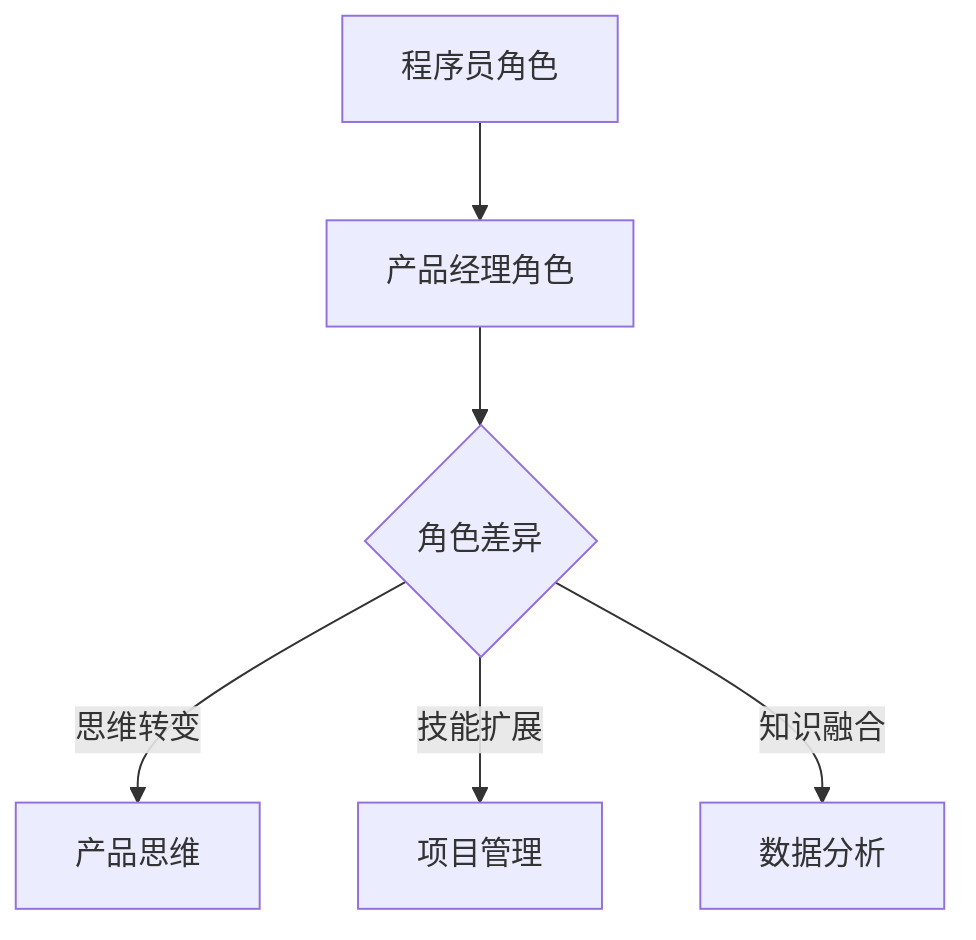

                 

# 程序员到产品经理：AI电商创业者的角色转变之路

## 关键词
- 程序员转型
- 产品经理
- AI电商
- 角色转变
- 用户思维
- 数据驱动
- 产品迭代

## 摘要
本文将探讨程序员向产品经理的角色转变过程，特别是以AI电商创业者为背景的角色转变之路。文章首先概述了程序员和产品经理的职责差异，然后深入分析了产品思维、用户体验设计、产品管理、数据分析以及AI技术在产品管理中的应用。通过实际案例和实战技巧，本文旨在帮助程序员更好地转型为产品经理，并成功推动AI电商创业。

## 第一部分：程序员到产品经理的角色转变之路

### 第1章：程序员到产品经理的角色转型概述

#### 1.1 程序员的职责与挑战

程序员的主要职责是编写、测试和维护代码，实现技术方案。然而，随着技术的发展和业务需求的变化，程序员面临着以下挑战：

- **快速迭代需求**：市场变化迅速，产品需求不断更新，程序员需要快速适应变化，确保代码质量和交付效率。
- **跨部门协作**：程序员需要与产品经理、设计师、测试人员等多个角色进行协作，沟通和协调成为重要能力。

#### 1.2 产品经理的职责与角色

产品经理的职责是定义产品愿景，规划产品路线图，并确保产品成功上市。主要角色包括：

- **需求分析**：分析用户需求，定义产品功能。
- **用户体验设计**：协调设计师，确保产品易于使用。
- **项目管理**：制定项目计划，监控进度，确保按时交付。
- **数据分析**：使用数据分析工具，优化产品性能。

#### 1.3 程序员转型产品经理的动机

程序员转型为产品经理的原因多种多样，主要包括：

- **全面能力提升**：从技术角度转向业务角度，提升综合能力。
- **职业发展**：产品经理职位通常具有较高的地位和薪酬。
- **兴趣驱动**：对产品设计和用户体验感兴趣，希望挑战新的角色。

#### 1.4 程序员到产品经理的角色差异

程序员和产品经理在角色上存在显著差异，主要体现在以下几个方面：

- **关注点**：程序员关注代码质量和技术实现，产品经理关注用户体验和业务需求。
- **工作内容**：程序员主要编写和优化代码，产品经理主要制定产品策略和路线图。
- **沟通能力**：程序员需要与技术人员沟通，产品经理需要与多个部门沟通，协调资源。

### 第2章：产品思维与产品设计

#### 2.1 产品思维的重要性

产品思维是一种以用户为中心的设计理念，它要求从用户的角度出发，全面考虑产品的设计、开发和优化。产品思维的重要性体现在以下几个方面：

- **提高用户满意度**：关注用户需求，提升产品价值。
- **优化资源利用**：明确产品目标，减少不必要的功能，提高资源利用效率。
- **推动创新**：鼓励跨部门合作，激发创新思维。

#### 2.2 产品设计方法论

产品设计方法论是指导产品设计的系统方法，主要包括以下几个步骤：

1. **需求分析**：收集用户需求，确定产品目标。
2. **原型设计**：制作产品原型，进行用户测试。
3. **迭代优化**：根据用户反馈，不断优化产品。
4. **交付上市**：确保产品按时交付，满足市场需求。

#### 2.3 用户研究与市场分析

用户研究和市场分析是产品设计的核心环节，主要包括：

- **用户调研**：通过问卷调查、用户访谈等方式，收集用户需求。
- **市场分析**：分析市场趋势，了解竞争对手，确定产品定位。

#### 2.4 产品需求与功能设计

产品需求与功能设计是产品设计的核心，主要包括：

- **需求梳理**：将用户需求转化为具体的功能需求。
- **功能设计**：设计产品功能，确保功能满足用户需求。

#### 2.5 产品迭代与优化

产品迭代与优化是产品持续改进的关键，主要包括：

- **用户反馈**：收集用户反馈，识别产品问题。
- **迭代优化**：根据用户反馈，优化产品功能。

### 第3章：用户体验设计

#### 3.1 用户体验设计的基本原则

用户体验设计的基本原则包括：

- **易用性**：确保产品易于使用，降低用户学习成本。
- **直观性**：设计直观，减少用户操作步骤。
- **一致性**：保持界面和交互一致性，提高用户体验。

#### 3.2 设计工具与技巧

设计工具与技巧包括：

- **原型设计工具**：如 Sketch、Figma，用于制作产品原型。
- **交互设计**：使用交互设计原则，设计用户流程和操作逻辑。
- **视觉设计**：运用色彩、字体、图标等元素，提升视觉效果。

#### 3.3 交互设计

交互设计是用户体验设计的重要组成部分，主要包括：

- **用户流程**：设计用户在产品中的操作流程。
- **操作逻辑**：确保用户操作逻辑合理，符合用户习惯。

#### 3.4 视觉设计

视觉设计是用户体验设计的外在表现，主要包括：

- **色彩搭配**：选择合适的色彩搭配，提升视觉效果。
- **字体设计**：选择合适的字体，提升阅读体验。

#### 3.5 用户体验评估与改进

用户体验评估与改进主要包括：

- **用户测试**：通过用户测试，评估产品用户体验。
- **数据驱动**：根据用户反馈和数据，持续优化产品。

### 第4章：产品管理与项目管理

#### 4.1 产品经理的工作流程

产品经理的工作流程包括：

- **需求分析**：收集用户需求，制定产品需求文档。
- **原型设计**：制作产品原型，进行用户测试。
- **迭代优化**：根据用户反馈，优化产品功能。
- **项目交付**：确保产品按时交付，满足市场需求。

#### 4.2 项目管理工具与技巧

项目管理工具与技巧包括：

- **敏捷开发**：采用敏捷开发方法，快速迭代，提高交付效率。
- **看板工具**：如 Jira、Trello，用于管理项目进度。

#### 4.3 时间管理

时间管理是产品经理的重要技能，主要包括：

- **优先级排序**：根据项目需求，合理分配时间。
- **任务分解**：将大任务分解为小任务，提高工作效率。

#### 4.4 团队协作与沟通

团队协作与沟通是项目成功的关键，主要包括：

- **会议管理**：合理安排会议，提高会议效率。
- **沟通渠道**：使用合适的沟通工具，确保信息传递。

#### 4.5 产品管理与项目风险控制

产品管理与项目风险控制主要包括：

- **风险评估**：识别项目风险，制定风险应对策略。
- **风险监控**：实时监控项目风险，确保项目顺利进行。

### 第5章：数据驱动决策与数据分析

#### 5.1 数据分析的基本概念

数据分析是产品管理和项目决策的重要工具，主要包括：

- **数据收集**：收集用户行为数据，市场数据等。
- **数据清洗**：清洗数据，去除噪音，确保数据质量。

#### 5.2 数据分析工具与平台

数据分析工具与平台包括：

- **数据分析工具**：如 Python、R，用于处理和分析数据。
- **数据分析平台**：如 Google Analytics、百度统计，用于实时监控和分析数据。

#### 5.3 用户行为分析

用户行为分析是了解用户需求的重要手段，主要包括：

- **用户轨迹分析**：分析用户在产品中的操作轨迹，了解用户行为模式。
- **转化率分析**：分析用户在产品中的转化路径，优化用户体验。

#### 5.4 产品性能评估与优化

产品性能评估与优化主要包括：

- **性能监控**：监控产品性能，识别性能瓶颈。
- **性能优化**：根据性能监控结果，优化产品性能。

#### 5.5 数据可视化

数据可视化是展示数据分析结果的重要手段，主要包括：

- **图表设计**：选择合适的图表，展示数据分析结果。
- **交互设计**：设计交互式数据可视化工具，提高数据可读性。

### 第6章：AI与产品经理

#### 6.1 AI在产品管理中的应用

AI在产品管理中的应用主要包括：

- **用户画像**：基于用户行为数据，构建用户画像，精准定位用户需求。
- **智能推荐**：基于用户画像，实现个性化产品推荐。

#### 6.2 AI技术基础知识

AI技术基础知识包括：

- **机器学习**：理解机器学习算法，如决策树、神经网络等。
- **深度学习**：理解深度学习原理，如卷积神经网络、循环神经网络等。

#### 6.3 人工智能在用户体验设计中的应用

人工智能在用户体验设计中的应用主要包括：

- **智能客服**：使用自然语言处理技术，实现智能客服，提升用户体验。
- **智能搜索**：使用自然语言处理技术，实现智能搜索，提高用户查找效率。

#### 6.4 数据挖掘与机器学习

数据挖掘与机器学习主要包括：

- **数据挖掘**：理解数据挖掘流程，如数据预处理、特征选择等。
- **机器学习**：理解机器学习算法，如线性回归、支持向量机等。

#### 6.5 AI技术在产品迭代中的应用

AI技术在产品迭代中的应用主要包括：

- **A/B测试**：使用机器学习算法，优化A/B测试策略，提高测试效果。
- **自动更新**：基于用户反馈和数据分析，实现产品自动更新，提高用户体验。

### 第7章：案例分析与实战技巧

#### 7.1 程序员到产品经理的转型案例

通过分析程序员到产品经理的转型案例，可以了解转型过程中的关键步骤和成功因素。

#### 7.2 成功产品案例分析

成功产品案例分析可以帮助产品经理学习优秀产品的设计理念和实践经验。

#### 7.3 产品经理的日常技巧

产品经理的日常技巧包括：

- **时间管理**：合理安排工作时间，提高工作效率。
- **沟通技巧**：掌握有效的沟通技巧，提升沟通效果。

#### 7.4 失败产品的教训与反思

通过分析失败产品的教训和反思，可以避免在产品管理过程中犯同样的错误。

#### 7.5 跨部门协作与沟通技巧

跨部门协作与沟通技巧是产品经理的重要技能，包括：

- **建立信任**：建立跨部门信任，促进合作。
- **明确目标**：明确跨部门目标，确保合作方向一致。

### 第8章：成为优秀产品经理的职业发展路径

#### 8.1 职业规划

职业规划是产品经理职业发展的重要步骤，包括：

- **自我评估**：了解自身优势和劣势，确定职业发展方向。
- **设定目标**：设定短期和长期职业目标，制定实施计划。

#### 8.2 职业技能提升

职业技能提升是产品经理职业发展的关键，包括：

- **学习与实践**：通过学习产品和项目管理知识，结合实际工作经验，不断提升技能。
- **参加培训**：参加专业培训和认证，提升专业素养。

#### 8.3 持续学习与实践

持续学习与实践是产品经理职业发展的基础，包括：

- **阅读书籍**：阅读相关书籍，了解行业动态。
- **参与项目**：参与实际项目，积累实践经验。

#### 8.4 产品经理的职业成长路径

产品经理的职业成长路径包括：

- **初级产品经理**：负责产品需求分析和项目管理。
- **中级产品经理**：负责产品策略制定和团队管理。
- **高级产品经理**：负责产品线管理和跨部门协作。

#### 8.5 成功产品经理的经验分享

成功产品经理的经验分享可以帮助其他产品经理了解成功的关键因素，包括：

- **用户思维**：以用户为中心，关注用户需求。
- **数据驱动**：使用数据驱动决策，持续优化产品。

### 附录

#### 附录A：产品经理常用工具与资源

##### A.1 产品设计与原型工具

- **Sketch**：界面设计工具，适用于Mac用户。
- **Figma**：基于网页的界面设计工具，支持多人协作。

##### A.2 项目管理工具

- **Jira**：敏捷开发管理工具，适用于团队协作。
- **Trello**：看板式项目管理工具，适用于任务管理。

##### A.3 数据分析工具

- **Python**：数据分析编程语言，适用于数据处理和分析。
- **R**：统计分析编程语言，适用于复杂数据分析。

##### A.4 持续学习资源

- **产品经理学习社区**：如知乎、人人都是产品经理等。
- **在线课程**：如网易云课堂、慕课网等。

### Mermaid 流程图



### 核心算法原理讲解

#### 伪代码：产品需求分析

```python
def 产品需求分析(需求列表):
    初始化用户调研数据
    初始化市场分析数据
    初始化竞品分析数据

    对于每一个需求：
        如果用户调研数据满足需求条件：
            需求通过
        否则：
            需求未通过

    对于每一个市场分析数据：
        如果市场趋势满足需求条件：
            需求通过
        否则：
            需求未通过

    对于每一个竞品分析数据：
        如果竞品功能满足需求条件：
            需求通过
        否则：
            需求未通过

    返回通过的需求列表
```

### 数学模型和数学公式

#### 用户满意度评分模型

$$
\text{用户满意度} = \frac{1}{N} \sum_{i=1}^{N} \text{满意度评分}
$$

其中，\(N\) 是用户评分的数量，每个用户的满意度评分为 1 到 5 之间的整数。

#### 举例说明

假设我们有 5 个用户的满意度评分，分别为 4、3、5、4、3，则用户满意度为：

$$
\text{用户满意度} = \frac{1}{5} (4 + 3 + 5 + 4 + 3) = \frac{19}{5} = 3.8
$$

### 项目实战

#### 电商产品推荐系统实战

**1. 环境搭建**

- 数据集：使用公共的电商数据集，如 Amazon 数据集。
- 环境：Python 3.8+, Pandas, Scikit-learn,

**2. 数据预处理**

- 数据清洗：处理缺失值、异常值等。
- 数据整合：合并用户数据、商品数据等。

**3. 特征工程**

- 提取用户特征：如用户年龄、性别、购买频率等。
- 提取商品特征：如商品类别、价格、销量等。

**4. 模型训练**

- 选择合适的推荐算法：如协同过滤、基于内容的推荐等。
- 训练模型：使用训练集数据进行模型训练。

**5. 模型评估**

- 使用测试集数据进行模型评估。
- 评估指标：如准确率、召回率、覆盖率等。

**6. 模型优化**

- 根据评估结果，优化模型参数。
- 使用交叉验证等方法，避免过拟合。

**7. 系统部署**

- 部署模型到生产环境。
- 实时更新用户数据和商品数据。

**8. 代码实现**

```python
# 数据预处理
data = pandas.read_csv('data.csv')
data = data.dropna()

# 特征工程
user_features = data[['user_age', 'user_gender', 'user_buy_frequency']]
item_features = data[['item_category', 'item_price', 'item_sales']]

# 模型训练
from sklearn.model_selection import train_test_split
from sklearn.neighbors import NearestNeighbors

X_train, X_test, y_train, y_test = train_test_split(user_features, item_features, test_size=0.2, random_state=42)

model = NearestNeighbors()
model.fit(X_train)

# 模型评估
distances, indices = model.kneighbors(X_test)

# 评估指标
from sklearn.metrics import accuracy_score, recall_score, coverage_error

accuracy = accuracy_score(y_test, indices)
recall = recall_score(y_test, indices)
coverage = coverage_error(y_test, indices)

print('Accuracy:', accuracy)
print('Recall:', recall)
print('Coverage:', coverage)
```

**9. 案例分析和详细讲解**

通过分析电商产品推荐系统的实战案例，可以了解数据预处理、特征工程、模型训练、模型评估等各个环节的具体实施过程。案例中，我们使用了协同过滤算法，通过用户特征和商品特征进行邻居搜索，实现了个性化推荐。

**10. 项目小结**

电商产品推荐系统是一个复杂的项目，涉及多个环节。通过本项目，我们了解了从数据预处理到模型训练、评估的全过程。在实际项目中，还需要不断优化模型参数，提高推荐效果。同时，项目中的每个环节都需要团队成员的协作，确保项目顺利进行。

### 最佳实践 Tips、小结、注意事项、拓展阅读等内容

#### 最佳实践 Tips

1. **用户需求分析**：深入了解用户需求，确保产品设计满足用户需求。
2. **数据驱动决策**：使用数据分析，驱动产品设计和优化。
3. **迭代优化**：持续迭代，根据用户反馈优化产品功能。
4. **团队协作**：建立高效的团队协作机制，提高项目效率。

#### 小结

本文探讨了程序员向产品经理的角色转变之路，包括产品思维、用户体验设计、产品管理、数据分析以及AI技术在产品管理中的应用。通过实际案例和实战技巧，本文旨在帮助程序员更好地转型为产品经理，并成功推动AI电商创业。

#### 注意事项

1. **角色认知**：了解程序员和产品经理的角色差异，明确自身定位。
2. **持续学习**：不断提升专业技能和知识，适应行业变化。
3. **用户思维**：始终以用户为中心，关注用户体验。

#### 拓展阅读

1. 《人人都是产品经理》：作者苏杰，详细介绍了产品经理的职责和实践经验。
2. 《数据分析实战》：作者谢作如，介绍了数据分析的方法和应用。
3. 《深度学习》：作者Ian Goodfellow、Yoshua Bengio和Aaron Courville，介绍了深度学习的基础知识和应用。

