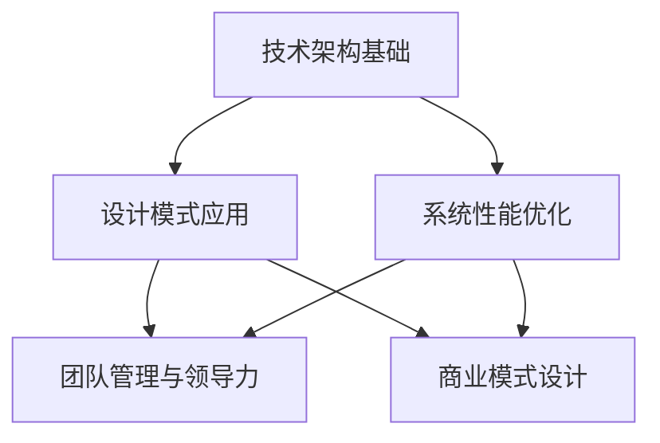

                 

### 文章标题

《程序员到企业家：技术专长与商业思维的完美结合》

程序员，作为现代科技行业的基石，他们的专业知识和技能在推动技术创新和业务发展方面起到了至关重要的作用。然而，随着科技创业浪潮的兴起，越来越多的程序员开始意识到，仅有技术专长并不足以支撑他们在商业世界中的长远发展。技术专长与商业思维的完美结合，成为了他们从程序员转型为企业家的重要路径。本文将深入探讨这一转型过程中的核心要素，分析技术专长与商业思维如何相互促进，帮助程序员在企业家的道路上走得更远、更稳。

### 关键词

- 程序员转型
- 技术专长
- 商业思维
- 企业家
- 创业
- 商业模式
- 团队管理
- 财务策略

### 摘要

本文旨在探讨程序员如何在保持技术专长的同时，构建并发展商业思维，从而成功转型为企业家。通过分析技术领域的深度探索、技术架构与设计原理、核心算法与数学模型等基础内容，以及商业策略与市场分析、团队管理与领导力、财务与投资策略等关键商业技能，本文将逐步揭示技术专长与商业思维如何相互融合，共同推动创业项目的成功。此外，本文还将结合实际案例，提供宝贵的创业实践经验和持续成长与领导力提升的建议，为那些渴望在科技创业领域大展拳脚的程序员们提供实用指南。

### 目录大纲

#### 第一部分：技术专长的深度掌握

## 第1章：技术领域的深度探索

### 1.1 技术专长的定义与重要性

### 1.2 技术领域的细分与机遇

### 1.3 技术专长的持续学习与更新

## 第2章：技术架构与设计原理

### 2.1 技术架构的基础概念

### 2.2 设计模式与最佳实践

### 2.3 系统性能优化与调优

## 第3章：核心算法与数学模型

### 3.1 数据结构与算法分析

### 3.2 机器学习与深度学习算法原理

### 3.3 数学模型在技术中的应用

#### 第二部分：商业思维的逐步构建

## 第4章：商业策略与市场分析

### 4.1 商业模式与盈利模式

### 4.2 市场研究与竞争分析

### 4.3 客户需求分析与产品定位

## 第5章：团队管理与领导力

### 5.1 团队构建与管理

### 5.2 领导力与影响力

### 5.3 项目管理与执行

## 第6章：财务与投资策略

### 6.1 财务报表与财务分析

### 6.2 投资策略与风险管理

### 6.3 创业融资与资本运营

#### 第三部分：技术专长与商业思维的完美结合

## 第7章：跨界创新与商业模式设计

### 7.1 跨界创新的案例分析

### 7.2 商业模式设计方法论

### 7.3 技术驱动下的商业创新

## 第8章：创业实践与案例分析

### 8.1 创业的准备工作

### 8.2 创业过程中的挑战与应对

### 8.3 成功创业者的经验分享

## 第9章：持续成长与领导力的提升

### 9.1 持续学习与个人成长

### 9.2 领导力的提升途径

### 9.3 职业发展路径规划

### 附录

## 附录A：相关资源与推荐阅读

### A.1 技术资源

### A.2 商业资源

### A.3 跨界创新资源

## 附录B：技术架构与设计原理的Mermaid流程图

### B.1 技术架构基础

### B.2 设计模式应用

## 附录C：核心算法与数学模型讲解

### C.1 数据结构与算法分析

### C.2 机器学习算法原理

### C.3 数学模型讲解与示例

## 附录D：创业实践案例

### D.1 案例一：技术创业公司的成功之路

### D.2 案例二：跨界创新的企业案例

### D.3 案例三：从技术到商业的华丽转型

### Mermaid 流程图示例：



### 伪代码示例：

```plaintext
// 伪代码：机器学习算法实现
Initialize model parameters
for each epoch do
    for each sample in the dataset do
        Compute predictions
        Compute loss
        Update model parameters
    end for
end for
```

### 数学模型示例（使用LaTeX格式）：

$$
\text{成本函数} = \frac{1}{2}\sum_{i=1}^{n} (\hat{y_i} - y_i)^2
$$

### 代码解读与分析

```python
# 代码示例：使用TensorFlow进行机器学习模型训练
import tensorflow as tf

# 定义模型结构
model = tf.keras.Sequential([
    tf.keras.layers.Dense(units=1, input_shape=[1])
])

# 编译模型
model.compile(optimizer='sgd', loss='mean_squared_error')

# 训练模型
model.fit(x_train, y_train, epochs=100)

# 评估模型
model.evaluate(x_test, y_test)
```

这段代码使用TensorFlow框架搭建了一个简单的线性回归模型，并对其进行了训练和评估。通过这段代码，可以学习到如何定义模型结构、编译模型、训练模型以及评估模型性能的基本方法。同时，读者可以根据代码中的注释进行更深层次的理解和实践。

---

接下来，我们将逐步深入探讨程序员如何从技术专长走向商业思维，并最终实现成功的转型。本文将分为三个主要部分：技术专长的深度掌握、商业思维的逐步构建以及技术专长与商业思维的完美结合。在每部分中，我们将详细阐述相关的核心概念、原理和技巧，并提供实用的指导和建议。

## 第1章：技术领域的深度探索

### 1.1 技术专长的定义与重要性

技术专长，是指程序员在某一特定技术领域或技能上具备的深入理解、丰富经验和高度熟练度。这些技术专长可以涵盖编程语言、框架、数据库、网络技术、人工智能等多个方面。在技术飞速发展的今天，技术专长不仅意味着对某一技术的掌握，更意味着能够持续学习和适应新技术、新趋势。

技术专长的重要性体现在以下几个方面：

1. **竞争力的提升**：技术专长使得程序员在就业市场上具备更强的竞争力。他们能够高效地解决复杂问题，为团队带来实际的价值。
2. **职业发展的基石**：技术专长是程序员职业发展的基石。通过在某一领域的深入研究和实践，程序员可以逐步成为行业专家，甚至技术领袖。
3. **创新的原动力**：技术专长使得程序员能够站在技术前沿，把握行业发展动态，从而推动创新和变革。

### 1.2 技术领域的细分与机遇

技术领域纷繁复杂，不同领域有着不同的机遇和发展方向。程序员可以根据自己的兴趣和优势，选择合适的技术领域进行深耕。以下是一些热门的技术领域及其机遇：

1. **人工智能与机器学习**：随着大数据和算法的进步，人工智能和机器学习正在改变各行各业。从自动驾驶到智能客服，从医疗诊断到金融风控，人工智能的应用场景越来越广泛。
2. **区块链技术**：区块链以其去中心化、不可篡改的特性，引起了金融、物流、供应链等多个领域的关注。区块链技术的深入研究和应用开发成为新的机遇。
3. **云计算与大数据**：云计算和大数据技术的发展为企业和个人提供了无限可能。通过云计算，程序员可以开发和部署大规模的应用程序；通过大数据，程序员可以挖掘数据价值，为企业提供决策支持。
4. **物联网（IoT）**：物联网技术的普及使得设备互联成为可能，从智能家居到智能城市，物联网的应用正在改变我们的生活方式。
5. **移动开发**：随着智能手机的普及，移动应用的开发需求持续增长。掌握移动开发技术，可以抓住这一市场的机遇。

### 1.3 技术专长的持续学习与更新

技术领域日新月异，程序员需要不断学习和更新知识，以保持技术专长的领先地位。以下是一些持续学习与更新的方法和技巧：

1. **在线课程与认证**：利用在线平台（如Coursera、Udacity、edX等）参加专业课程，获取系统性的知识体系。同时，获得专业认证（如AWS Certified Solutions Architect、Certified Kubernetes Administrator等）可以提升个人的技术权威性。
2. **技术社区与论坛**：积极参与技术社区（如Stack Overflow、GitHub、Reddit等）的讨论和贡献，了解最新的技术动态和最佳实践。
3. **阅读与研究**：定期阅读技术书籍、学术论文和博客，保持对最新技术的了解。例如，《深度学习》（Deep Learning）和《编程珠玑》（The Art of Computer Programming）都是经典的技术读物。
4. **实践与项目**：通过实际项目，将理论知识应用到实践中。参与开源项目或自主开发项目，可以提高技术水平，积累实际经验。
5. **交流与分享**：与技术同行进行交流，参加技术会议和研讨会，分享经验和学习成果。这不仅可以帮助自己成长，还可以建立有价值的人际网络。

### 总结

本章介绍了技术专长的定义与重要性，以及技术领域的细分与机遇。程序员需要根据自身兴趣和优势，选择合适的技术领域进行深耕，并通过持续学习与更新保持技术专长的领先地位。在接下来的章节中，我们将进一步探讨技术架构与设计原理、核心算法与数学模型等关键技术内容，为程序员从技术到商业的转型打下坚实的基础。

## 第2章：技术架构与设计原理

### 2.1 技术架构的基础概念

技术架构，是指一个系统或应用在技术层面上的整体设计和结构。它涵盖了系统组件的分布、数据流、功能模块的划分以及各个模块之间的交互关系。一个良好的技术架构不仅能够满足当前的业务需求，还需要具备一定的扩展性和灵活性，以适应未来的变化。

#### 技术架构的关键要素

1. **组件与模块**：技术架构由多个组件和模块组成，每个组件和模块都负责特定的功能。例如，在Web应用中，常见的组件包括前端、后端、数据库等。
2. **数据流**：数据流描述了系统内部数据传递和处理的过程。了解数据流有助于优化系统性能和提升数据处理的效率。
3. **接口与协议**：接口定义了模块之间的交互方式，协议则规定了数据传输的规则和标准。例如，HTTP协议是Web应用中常用的接口协议。
4. **安全性**：技术架构需要考虑到系统的安全性，包括数据保护、访问控制、安全审计等。

#### 技术架构的设计原则

1. **模块化**：将系统划分为多个模块，每个模块具有独立的功能和职责，便于开发、测试和维护。
2. **解耦**：减少模块之间的依赖关系，提高系统的灵活性和可扩展性。
3. **可复用性**：设计可复用的组件和模块，减少重复开发的工作量，提高开发效率。
4. **可维护性**：考虑系统的可维护性，确保代码清晰、结构合理，便于后续的修改和优化。

### 2.2 设计模式与最佳实践

设计模式是软件开发中常用的一套解决方案，用于解决特定的问题。掌握设计模式有助于提高代码的质量和可维护性，促进团队协作和开发效率。

#### 常见的设计模式

1. **工厂模式**：用于创建对象的一种模式，可以将对象的创建过程抽象出来，使得代码更加灵活和可扩展。
2. **单例模式**：确保一个类仅有一个实例，并提供一个全局访问点。适用于需要控制实例数量的场景。
3. **观察者模式**：当一个对象的状态发生变化时，会自动通知其他观察者。适用于事件驱动和消息传递的场景。
4. **策略模式**：将算法封装起来，并使它们可以互换。适用于需要在运行时选择算法的场景。
5. **职责链模式**：将请求的发送者和接收者解耦，多个接收者根据职责来处理请求。适用于多级审批和过滤的场景。

#### 最佳实践

1. **代码规范化**：遵循一致的代码规范，提高代码的可读性和可维护性。
2. **单元测试**：编写单元测试，确保每个模块的功能正确，并减少集成测试的工作量。
3. **持续集成**：使用持续集成工具（如Jenkins、GitLab CI等），自动化构建和测试代码，确保代码质量。
4. **代码审查**：定期进行代码审查，发现潜在的问题和改进点，提高代码质量。
5. **文档化**：编写详细的文档，包括设计文档、API文档和用户手册，便于团队协作和外部用户使用。

### 2.3 系统性能优化与调优

系统性能是衡量一个系统优劣的重要指标，良好的性能可以提升用户体验，增加系统的可靠性和稳定性。以下是一些常见的系统性能优化方法和调优技巧：

1. **代码优化**：通过优化算法和数据结构，减少代码的执行时间和内存占用。例如，使用哈希表代替查找表，使用快速排序代替冒泡排序等。
2. **缓存机制**：使用缓存减少数据库访问和计算时间。例如，使用Redis缓存热点数据，使用Memcached缓存页面等。
3. **数据库优化**：优化数据库查询，减少查询时间和数据传输量。例如，使用索引、预编译语句、连接优化等。
4. **分布式系统**：通过分布式系统架构，将负载分散到多个节点上，提高系统的处理能力和可用性。
5. **性能监控与调试**：使用性能监控工具（如New Relic、AppDynamics等），实时监控系统的性能指标，定位瓶颈和故障点。

### 总结

本章介绍了技术架构的基础概念、设计模式与最佳实践，以及系统性能优化与调优的方法。技术架构是系统设计的核心，良好的技术架构能够提高系统的灵活性、可扩展性和可维护性。设计模式与最佳实践则是提高代码质量和开发效率的重要手段。通过掌握这些技术和技巧，程序员可以更好地构建和优化系统，为企业的业务发展提供强有力的支持。

在接下来的章节中，我们将进一步探讨核心算法与数学模型，这些技术在现代科技应用中发挥着重要作用，是程序员技术专长的重要组成部分。

## 第3章：核心算法与数学模型

### 3.1 数据结构与算法分析

数据结构和算法是计算机科学的核心内容，它们决定了程序的性能和效率。正确选择和运用数据结构能够显著提升算法的运行速度和处理能力。

#### 常见的数据结构

1. **数组**：数组是一种基础的数据结构，它提供了快速的随机访问能力。适用于需要频繁访问和修改元素的场景。
2. **链表**：链表通过节点之间的指针关系实现数据存储。与数组相比，链表更适合动态分配和插入、删除操作。
3. **栈与队列**：栈和队列分别遵循后进先出（LIFO）和先进先出（FIFO）的原则，适用于特定的数据处理场景。
4. **哈希表**：哈希表通过哈希函数将关键字映射到数组中的位置，实现快速查找。适用于需要快速检索元素的场景。
5. **树和图**：树是一种层次结构，用于表示具有层次关系的数据。图则是一种复杂的数据结构，用于表示多对多关系。

#### 算法分析

算法分析是对算法效率和性能的评价方法。主要关注以下三个方面：

1. **时间复杂度**：描述算法运行时间与输入规模之间的关系，常用的单位是O、Ω和Θ。例如，线性搜索的时间复杂度为O(n)，二分搜索的时间复杂度为O(log n)。
2. **空间复杂度**：描述算法运行所需的空间与输入规模之间的关系。例如，排序算法的空间复杂度通常是O(n)。
3. **空间换时间**：在某些场景下，可以通过增加空间复杂度来减少时间复杂度。例如，使用哈希表可以快速查找元素，但需要额外的存储空间。

### 3.2 机器学习与深度学习算法原理

机器学习和深度学习是人工智能的重要分支，通过算法模型实现计算机对数据的自动学习和处理。

#### 机器学习算法原理

1. **监督学习**：通过已标记的训练数据学习特征，用于对新数据进行预测。常见的算法有线性回归、决策树、支持向量机（SVM）等。
2. **无监督学习**：不使用标记数据，通过数据自身的特征进行聚类、降维等操作。常见的算法有K-Means聚类、主成分分析（PCA）等。
3. **强化学习**：通过与环境交互学习最优策略，以最大化奖励。常见的算法有Q学习、深度强化学习（DRL）等。

#### 深度学习算法原理

深度学习是一种基于人工神经网络的算法，通过多层神经网络实现复杂的特征提取和建模。

1. **神经网络基础**：神经网络由输入层、隐藏层和输出层组成。每层由多个神经元（节点）组成，每个神经元通过权重和偏置进行计算。
2. **激活函数**：激活函数用于引入非线性因素，使神经网络具备分类和回归能力。常见的激活函数有Sigmoid、ReLU、Tanh等。
3. **反向传播算法**：通过反向传播算法，计算神经网络中每个神经元的误差，并更新权重和偏置，以优化网络性能。

#### 深度学习模型架构

1. **卷积神经网络（CNN）**：适用于图像和视频处理，通过卷积层提取空间特征。
2. **循环神经网络（RNN）**：适用于序列数据处理，通过循环结构处理时间序列信息。
3. **生成对抗网络（GAN）**：通过生成器和判别器的对抗训练，生成高质量的数据。
4. **变分自编码器（VAE）**：通过变分推断实现无监督学习，适用于数据降维和生成。

### 3.3 数学模型在技术中的应用

数学模型在计算机科学和工程领域有着广泛的应用，用于描述和解决问题。以下是一些常见的数学模型及其应用：

1. **线性回归模型**：用于预测连续值输出，适用于分析数据之间的关系。其公式为：
   $$
   y = \beta_0 + \beta_1x
   $$
2. **逻辑回归模型**：用于分类问题，通过回归模型推导概率分布。其公式为：
   $$
   \log\left(\frac{p}{1-p}\right) = \beta_0 + \beta_1x
   $$
3. **决策树模型**：通过递归划分特征空间，构建树形结构。其决策规则为：
   $$
   \text{如果 } x \leq x_i, \text{ 则选择分支 } t_i; \text{ 否则选择分支 } t_{i+1}
   $$
4. **支持向量机（SVM）**：通过最大化分类间隔构建最优决策边界。其公式为：
   $$
   \text{最小化 } \frac{1}{2}||\textbf{w}||^2 \text{，约束条件为 } y_i(\textbf{w} \cdot \textbf{x_i}) \geq 1
   $$
5. **贝叶斯网络**：通过概率图模型描述变量之间的依赖关系。其公式为：
   $$
   P(\textbf{X} = \textbf{x}) = \prod_{i=1}^n P(x_i | x_{i-1})
   $$

#### 数学模型的应用举例

1. **推荐系统**：通过矩阵分解模型（如SVD），预测用户对未浏览物品的评分，实现个性化推荐。
2. **图像识别**：通过卷积神经网络（CNN），提取图像特征并进行分类，实现图像识别。
3. **自然语言处理**：通过循环神经网络（RNN）和Transformer模型，处理文本数据并提取语义信息，实现语言理解、翻译等任务。
4. **优化问题**：通过线性规划、非线性规划等方法，求解优化问题，实现资源分配、路径规划等。

### 总结

本章介绍了数据结构与算法分析、机器学习与深度学习算法原理以及数学模型在技术中的应用。数据结构和算法是程序设计的核心，机器学习和深度学习则为人工智能提供了强大的工具。数学模型在各个技术领域有着广泛的应用，用于描述和解决问题。通过掌握这些核心算法和数学模型，程序员可以更好地应对复杂的业务需求，推动技术创新和业务发展。

在下一章中，我们将探讨商业策略与市场分析，帮助程序员构建商业思维，为创业和企业发展奠定基础。

## 第4章：商业策略与市场分析

### 4.1 商业模式与盈利模式

商业模式的定义和重要性

商业模式是企业创造、传递和捕获价值的系统和方法。它是企业运作的核心，决定了企业的盈利能力和市场定位。一个成功的商业模式不仅能为企业带来持续的收入，还能确保其在竞争激烈的市场中占据优势地位。

常见的商业模式

1. **广告模式**：通过为广告主提供曝光机会，收取广告费用。例如，Google和Facebook等公司通过展示个性化广告来盈利。
2. **订阅模式**：用户通过定期支付订阅费用来获取产品或服务。例如，Netflix和Spotify等公司通过提供视频和音乐订阅服务来盈利。
3. **销售模式**：通过销售产品或服务获取收入。例如，Amazon和苹果等公司通过销售各种商品来盈利。
4. **服务模式**：提供专业服务，如咨询、培训等，通过服务收费来盈利。例如，麦肯锡和IBM等公司通过提供咨询服务来盈利。
5. **会员模式**：通过会员资格提供特殊服务和优惠，吸引用户持续消费。例如，Costco通过会员制提供低价格和高品质的商品。

盈利模式的选择和策略

选择适合的盈利模式需要考虑多个因素，包括市场需求、目标客户、成本结构等。以下是一些建议和策略：

1. **明确目标市场**：了解目标客户的需求和偏好，为产品或服务定位提供依据。
2. **优化成本结构**：通过控制成本和提高效率，确保盈利模式的可持续性。
3. **创新盈利模式**：在竞争激烈的市场中，创新盈利模式可以为企业带来额外的收入来源。例如，亚马逊通过云计算服务（AWS）拓展了新的盈利渠道。
4. **多样化收入来源**：避免过度依赖单一收入来源，通过多样化的收入模式降低风险。

### 4.2 市场研究与竞争分析

市场研究的重要性

市场研究是制定商业策略的基础，它帮助企业家了解市场需求、竞争环境和潜在客户。通过市场研究，企业可以做出更明智的决策，优化资源配置，提高市场竞争力。

市场研究的主要任务

1. **需求分析**：了解目标市场的需求趋势，确定产品或服务的定位和功能。
2. **竞争分析**：分析竞争对手的市场份额、产品特点、定价策略等，找出差异化和竞争优势。
3. **客户分析**：了解目标客户的特征、行为和偏好，制定精准的市场推广策略。
4. **趋势分析**：跟踪市场动态，预测未来发展趋势，为企业创新和战略调整提供依据。

竞争分析的方法和工具

1. **SWOT分析**：通过分析企业的优势（Strengths）、劣势（Weaknesses）、机会（Opportunities）和威胁（Threats），制定相应的竞争策略。
2. **波特五力模型**：分析供应商、买家、潜在竞争者、替代品和现有竞争者的市场力量，评估企业的竞争地位。
3. **用户调研**：通过问卷调查、访谈等方式收集用户反馈，了解客户需求和满意度。
4. **数据分析**：利用大数据和数据分析工具，挖掘市场趋势和客户行为。

### 4.3 客户需求分析与产品定位

客户需求分析的方法

1. **访谈法**：与目标客户进行深入交流，了解他们的需求和痛点。
2. **问卷调查**：通过问卷调查收集大量数据，分析客户需求和偏好。
3. **用户行为分析**：通过分析用户在产品或服务中的行为数据，了解用户的互动模式和需求。
4. **焦点小组**：邀请一组具有代表性的用户，讨论产品或服务的优缺点，提出改进建议。

产品定位的策略

1. **差异化定位**：通过独特的产品特性或功能，与竞争对手区分开来。例如，苹果公司的产品以其高性价比和卓越的设计闻名。
2. **市场细分定位**：针对特定细分市场，提供定制化的产品或服务。例如，戴尔公司通过为中小企业提供定制化的电脑硬件解决方案，赢得了大量市场份额。
3. **价值定位**：强调产品或服务的价值，提升客户满意度。例如，特斯拉汽车通过强调环保和性能，吸引了大量环保意识和性能爱好者。

### 总结

本章介绍了商业模式和盈利模式、市场研究和竞争分析，以及客户需求分析和产品定位。这些商业策略和市场分析工具是企业家成功的基础。通过明确商业模式和盈利模式，企业可以确保收入来源的稳定和可持续。市场研究和竞争分析帮助企业家了解市场需求和竞争环境，制定有效的营销策略。客户需求分析和产品定位则确保产品或服务能够满足客户的需求，从而在市场上取得成功。在下一章中，我们将探讨团队管理与领导力，帮助企业家构建和管理高效的团队。

## 第5章：团队管理与领导力

### 5.1 团队构建与管理

团队构建的重要性

团队构建是企业管理的重要组成部分，一个高效的团队能够显著提升工作效率和创新能力。有效的团队构建需要从以下几个方面入手：

1. **明确目标**：团队的目标应当清晰、具体，并得到全体成员的认可。明确的目标有助于统一团队行动，提升团队凝聚力。
2. **人员匹配**：根据项目需求和团队成员的能力和兴趣，合理分配角色和职责。确保团队成员在能力上互补，形成高效的工作组合。
3. **沟通机制**：建立有效的沟通机制，确保信息流畅、透明。定期的会议、汇报和反馈机制有助于团队成员之间的沟通和理解。
4. **激励机制**：设定合理的激励机制，包括薪酬、晋升、培训等，激发团队成员的积极性和创造力。

团队管理的方法与技巧

1. **目标管理**：通过SMART原则（具体、可衡量、可达成、相关性、时限性）设定团队目标，并定期检查进度和调整策略。
2. **绩效评估**：建立科学的绩效评估体系，客观、公正地评估团队成员的工作表现。通过反馈和指导，帮助成员改进和提高。
3. **授权与赋能**：给予团队成员适当的权限和资源，鼓励他们自主决策和解决问题。通过培训和指导，提升团队成员的能力和素质。
4. **冲突管理**：及时识别和解决团队内部的冲突，确保团队成员之间能够和谐共处。采用有效的沟通技巧和调解方法，化解冲突。

### 5.2 领导力与影响力

领导力的定义与重要性

领导力是指引导和激励团队成员实现共同目标的能力。有效的领导力能够提升团队士气，激发成员潜能，从而实现团队的卓越表现。领导力的重要性体现在以下几个方面：

1. **塑造团队文化**：领导力能够塑造团队的价值观和行为规范，形成积极向上的团队氛围。
2. **推动创新和变革**：领导力能够激发团队成员的创新思维，推动企业适应市场变化，实现持续发展。
3. **提升团队凝聚力**：领导力通过建立信任和共同目标，增强团队成员之间的凝聚力，提高团队协作效率。

领导力的发展与提升

1. **自我认知**：了解自己的优点和不足，培养自我反思和自我提升的能力。
2. **情感智能**：提高对自身和他人情感的认识和管理能力，增强人际沟通和团队合作。
3. **情境领导**：根据不同情境和团队成员的特点，采取不同的领导风格和方法。
4. **终身学习**：持续学习和更新知识，保持对行业动态和新兴管理理念的敏锐感知。

### 5.3 项目管理与执行

项目管理的基本原理

项目管理是指通过计划、执行、监控和调整，确保项目顺利完成的过程。项目管理的基本原理包括：

1. **项目目标**：明确项目目标和交付成果，确保项目团队共同理解和努力。
2. **范围管理**：界定项目的范围，明确项目需要完成的工作和任务，避免范围蔓延。
3. **时间管理**：制定项目进度计划，确保项目按时完成。常用的工具包括甘特图、里程碑等。
4. **成本管理**：制定预算和成本计划，确保项目在预算范围内完成。
5. **质量管理**：制定质量标准和质量控制措施，确保项目交付物的质量。
6. **沟通管理**：建立有效的沟通机制，确保项目信息流畅、透明，减少误解和冲突。

项目执行的关键步骤

1. **启动阶段**：明确项目目标、范围、时间表和资源分配，为项目执行奠定基础。
2. **规划阶段**：制定详细的项目计划，包括任务分解、时间安排、资源分配等。
3. **执行阶段**：按照项目计划执行任务，确保项目按进度推进。采用项目管理工具（如JIRA、Trello等）可以提高执行效率。
4. **监控与控制阶段**：定期监控项目进度和成本，及时发现和解决问题，确保项目在轨道上运行。
5. **收尾阶段**：完成项目交付，进行项目总结和评估，为未来的项目管理提供经验和教训。

### 总结

本章介绍了团队构建与管理、领导力与影响力，以及项目管理的相关内容。团队管理是企业家成功的关键因素之一，通过有效的团队构建和管理，企业家可以提升团队绩效，实现共同目标。领导力则是企业家影响力的核心，通过提升领导力，企业家可以塑造团队文化，推动创新和变革。项目管理是确保项目成功交付的重要手段，通过科学的项目管理，企业家可以高效地规划和执行项目，实现预期的业务目标。在下一章中，我们将探讨财务与投资策略，帮助企业家在财务管理和投资决策中做出明智的选择。

## 第6章：财务与投资策略

### 6.1 财务报表与财务分析

财务报表是企业运营状况的重要反映，通过对财务报表的分析，企业家可以了解企业的财务状况、盈利能力和运营效率。以下是财务报表的基本构成和重要性：

#### 财务报表的基本构成

1. **资产负债表**：资产负债表展示了企业在某一特定时间点的资产、负债和所有者权益情况。它有助于分析企业的财务结构和流动性。
2. **利润表**：利润表记录了企业在一定期间内的收入、成本和费用，反映了企业的盈利能力。
3. **现金流量表**：现金流量表记录了企业在一定期间内的现金收入和支出情况，反映了企业的现金流动性和资金管理能力。
4. **所有者权益变动表**：所有者权益变动表记录了企业在一定期间内所有者权益的变化情况，反映了企业的资本结构和所有者权益变动的原因。

#### 财务报表的重要性

1. **决策支持**：财务报表为企业家提供了重要的决策依据，帮助企业制定战略规划和经营决策。
2. **投资分析**：投资者通过财务报表分析企业的财务状况和盈利能力，评估投资风险和回报。
3. **管理监督**：财务报表有助于企业管理层监督和评估企业的运营情况，发现问题和改进点。

#### 财务分析的方法

1. **比率分析**：比率分析是通过计算财务指标之间的比例关系，评估企业的财务状况。常用的比率包括流动比率、速动比率、资产负债率、净利润率等。
2. **趋势分析**：趋势分析是通过比较不同时间段的财务数据，分析企业财务状况的变化趋势和潜在风险。
3. **现金流量分析**：现金流量分析通过对现金流量表的分析，评估企业的现金流动性和资金管理能力。

### 6.2 投资策略与风险管理

投资策略是企业获取利润和增长的重要手段。有效的投资策略需要结合企业的财务状况、市场环境和风险承受能力进行制定。以下是几种常见的投资策略和风险管理方法：

#### 常见投资策略

1. **保守型投资策略**：以稳定收益为目标，投资于低风险、低回报的金融产品，如国债、定期存款等。
2. **平衡型投资策略**：在风险和收益之间寻求平衡，投资于股票、债券、基金等多种金融产品。
3. **成长型投资策略**：以长期资本增值为目标，投资于具有高增长潜力的新兴产业和公司。

#### 风险管理方法

1. **分散投资**：通过投资于多种不同的资产类别和行业，降低单一投资的风险。
2. **设置止损点**：在投资过程中设定止损点，一旦价格达到止损点，立即卖出以避免更大的损失。
3. **定期评估与调整**：定期对投资组合进行评估和调整，确保投资策略与市场环境和风险承受能力相匹配。

### 6.3 创业融资与资本运营

创业融资是企业获取资金以支持业务发展的关键环节。有效的融资策略可以确保企业在成长过程中有充足的资金支持，从而抓住市场机遇。以下是创业融资的常见方式和资本运营的策略：

#### 常见创业融资方式

1. **天使投资**：天使投资是指个人投资者在创业初期为初创企业提供资金支持。天使投资者通常关注创新性和高风险高回报的项目。
2. **风险投资**：风险投资是由专业投资机构提供的大规模资金支持，主要用于有潜力的初创企业。风险投资机构通过股权换取企业的控制权和未来收益。
3. **银行贷款**：银行贷款是企业从银行获取资金的一种方式，适用于有稳定收入和良好信用记录的企业。
4. **政府补助和补贴**：政府为支持中小企业发展，提供各种形式的补助和补贴，如税收优惠、创新基金等。

#### 资本运营策略

1. **股权融资**：通过出让股权换取资金，扩大企业规模和市场份额。股权融资有助于吸引战略投资者和提升企业知名度。
2. **债务融资**：通过借款和发行债券等方式获取资金，适用于短期资金需求。债务融资成本相对较低，但需要注意还款压力。
3. **资产重组**：通过资产重组，优化企业资产结构，提高资产利用效率。例如，通过出售非核心资产、重组子公司等，提升企业整体竞争力。
4. **并购与扩张**：通过并购其他企业，实现快速扩张和市场拓展。并购可以整合资源、提升竞争力，但需要谨慎评估并购风险。

### 总结

本章介绍了财务报表与财务分析、投资策略与风险管理，以及创业融资与资本运营。财务报表是企业家了解企业财务状况的重要工具，投资策略和风险管理方法帮助企业家在投资过程中做出明智的选择，创业融资与资本运营策略则确保企业在成长过程中有充足的资金支持。通过掌握这些财务与投资策略，企业家可以更好地管理和运营企业，实现持续发展和成功。

## 第7章：跨界创新与商业模式设计

### 7.1 跨界创新的案例分析

跨界创新，是指将不同领域的知识、技术、资源和理念结合起来，创造出新的产品、服务或商业模式。这种创新方式能够打破传统的行业界限，带来全新的商业机会。以下是一些跨界创新的经典案例：

#### 案例一：Airbnb——将共享经济应用于住宿行业

Airbnb成立于2008年，是一个在线民宿预订平台。它通过将闲置的房屋资源与寻求住宿的旅客连接起来，实现了住宿行业的革命性变革。Airbnb的成功不仅在于其技术创新，还在于其对共享经济的深刻理解。通过打破传统酒店业的垄断，Airbnb为消费者提供了更多样化、个性化的住宿选择，同时也为房东带来了额外的收入。

#### 案例二：Uber——将移动互联网应用于出租车行业

Uber成立于2009年，是一个基于移动互联网的出租车服务公司。它通过移动应用程序将乘客与司机连接起来，提供便捷、高效的出行服务。Uber的创新之处在于其结合了移动互联网、GPS定位和支付技术，改变了人们的出行习惯。Uber的成功不仅改变了出租车行业，还对城市交通和物流行业产生了深远的影响。

#### 案例三：Duolingo——将游戏化学习应用于教育行业

Duolingo成立于2011年，是一款免费的语言学习应用程序。它通过游戏化的学习方式，鼓励用户进行语言学习，同时通过用户的参与行为生成数据。Duolingo的商业模式独特，通过提供免费服务吸引大量用户，并通过广告和付费课程等方式获得收入。Duolingo的成功不仅在于其技术实现，还在于其对用户行为和数据价值的深刻理解。

### 7.2 商业模式设计方法论

跨界创新的成功离不开科学的商业模式设计。商业模式设计方法论是一种系统的方法，用于分析、设计和优化企业的商业模式。以下是一些常见的商业模式设计方法论：

#### 延伸法

延伸法，又称模式延伸法，是指将一个行业的成功模式应用到另一个行业，实现跨界创新。这种方法的核心在于找到两个行业之间的共同点，并将其结合起来。例如，将电商行业的用户体验和物流体系应用到传统零售行业，实现线上线下融合的O2O模式。

#### 整合法

整合法，是指将不同领域的资源和能力整合在一起，形成一个新的商业模式。这种方法的核心在于整合资源、优化流程，提高企业的竞争力。例如，将互联网公司的技术能力与金融机构的金融资源整合，打造互联网金融平台。

#### 创新法

创新法，是指通过技术创新、产品创新或服务创新，开创全新的商业模式。这种方法的核心在于创新思维和创新能力。例如，通过大数据分析和人工智能技术，创造新的商业模式，如个性化推荐、智能客服等。

### 7.3 技术驱动下的商业创新

技术驱动下的商业创新，是指通过技术创新推动商业模式的变革和创新。以下是一些技术驱动下的商业创新案例：

#### 案例一：区块链技术——重构信任机制

区块链技术以其去中心化、不可篡改和透明化的特性，重构了信任机制，为多个行业带来了新的商业模式。例如，在金融领域，区块链技术可以用于去中心化的交易和支付，降低交易成本和风险。在供应链管理领域，区块链技术可以用于追溯商品的生产和流通过程，提高供应链的透明度和效率。

#### 案例二：人工智能——提升决策能力

人工智能技术在商业决策中的应用，使得企业能够更加精准地预测市场趋势、优化运营流程。例如，在零售行业，人工智能可以通过分析大量消费数据，预测消费者的购买行为，从而优化库存管理和营销策略。在医疗行业，人工智能可以通过分析医学影像和患者数据，辅助医生进行诊断和治疗。

#### 案例三：物联网——实现智能化管理

物联网技术通过将物理设备与互联网连接，实现了智能化管理和远程控制。例如，在智能家居领域，物联网技术可以实现设备的远程控制、自动化管理，提升居住的便利性和舒适度。在工业制造领域，物联网技术可以实现设备的实时监控和远程维护，提高生产效率和产品质量。

### 总结

本章介绍了跨界创新的案例分析、商业模式设计方法论以及技术驱动下的商业创新。跨界创新通过结合不同领域的知识和技术，创造了全新的商业模式和商业机会。商业模式设计方法论为企业家提供了系统的方法，用于分析和设计创新的商业模式。技术驱动下的商业创新则通过技术创新，推动商业模式的变革和创新。通过掌握这些方法和案例，企业家可以更好地实现跨界创新，开创全新的商业机会。

## 第8章：创业实践与案例分析

### 8.1 创业的准备工作

创业是一项复杂而具有挑战性的任务，需要充分的准备工作。以下是一些关键的准备工作：

#### 市场调研

市场调研是创业的第一步，它帮助企业家了解市场需求、竞争环境和潜在客户。通过市场调研，企业家可以确定产品或服务的市场定位、目标客户群体和竞争对手的情况。市场调研的方法包括问卷调查、访谈、用户行为分析等。

#### 商业计划书

商业计划书是创业的指南，它详细描述了企业的业务模式、市场策略、运营计划、财务预测等。商业计划书不仅为企业家提供了一个清晰的蓝图，还可以用于吸引投资者和合作伙伴。编写商业计划书需要考虑以下几个方面：

1. **产品或服务描述**：明确产品或服务的特点和优势，描述其市场需求和竞争优势。
2. **市场分析**：分析目标市场、市场规模、市场趋势和竞争对手。
3. **营销策略**：描述营销计划，包括定价策略、推广渠道和销售策略。
4. **运营计划**：详细描述企业的运营模式、关键任务和资源配置。
5. **财务预测**：提供详细的财务预测，包括收入、成本、利润和现金流。

#### 资金筹备

创业需要充足的资金支持，企业家需要通过多种渠道筹集资金。常见的资金筹集方式包括自筹资金、天使投资、风险投资、银行贷款等。在选择资金筹集方式时，企业家需要考虑资金成本、股权稀释、还款压力等因素。

#### 团队建设

创业团队是创业成功的关键因素，企业家需要组建一支具有互补能力和共同目标的核心团队。团队建设需要考虑以下几个方面：

1. **核心成员的选拔**：选拔具有专业能力、经验和激情的核心成员。
2. **团队文化的建设**：建立积极向上、开放包容的团队文化，增强团队凝聚力。
3. **职责分工**：明确团队成员的职责和分工，确保团队高效运转。

### 8.2 创业过程中的挑战与应对

创业过程中会遇到各种挑战，以下是一些常见的挑战和应对策略：

#### 市场竞争

市场竞争是创业过程中不可避免的问题。为了在激烈的市场竞争中脱颖而出，企业家可以采取以下策略：

1. **差异化竞争**：通过独特的产品特性或服务，与竞争对手区分开来。
2. **低成本策略**：通过降低成本，提高产品的性价比，吸引价格敏感的客户。
3. **创新营销**：通过创新的营销策略和推广方式，提高品牌知名度和市场占有率。

#### 资金短缺

资金短缺是创业过程中常见的问题。为了应对资金短缺，企业家可以采取以下策略：

1. **节约开支**：严格控制成本，避免不必要的开支。
2. **多元化融资**：通过多种渠道筹集资金，降低单一融资渠道的风险。
3. **优化现金流**：通过优化现金流管理，确保企业有足够的流动资金应对突发事件。

#### 团队管理

团队管理是创业过程中的重要挑战。为了有效管理团队，企业家可以采取以下策略：

1. **明确目标**：确保团队成员明确企业的目标和职责，形成共同的愿景。
2. **沟通与反馈**：建立有效的沟通机制，及时反馈团队成员的工作表现，提供指导和支持。
3. **激励机制**：通过合理的激励机制，激发团队成员的积极性和创造力。

### 8.3 成功创业者的经验分享

成功创业者的经验分享对初创企业具有重要的借鉴意义。以下是一些成功创业者的经验：

#### 马化腾——腾讯公司创始人

1. **坚持创新**：腾讯始终坚持以用户需求为导向，不断创新，推出了一系列深受用户喜爱的产品，如QQ、微信等。
2. **合作共赢**：腾讯积极与其他企业合作，通过开放平台和生态系统，实现了共赢发展。
3. **专注核心**：腾讯在创业初期专注于即时通讯领域，通过持续优化产品和服务，奠定了市场领导地位。

#### 张一鸣——字节跳动创始人

1. **数据驱动**：字节跳动通过大数据和人工智能技术，实现精准的内容推荐，提升了用户体验和用户粘性。
2. **快速迭代**：字节跳动采用快速迭代的产品开发模式，不断优化产品功能，满足用户需求。
3. **跨界融合**：字节跳动通过跨界融合，将技术、内容、广告等多种元素相结合，实现了多元化的业务模式。

#### 王兴——美团点评创始人

1. **用户至上**：美团点评始终以用户需求为核心，通过提供优质的餐饮、外卖等服务，赢得了大量用户。
2. **本地化运营**：美团点评注重本地化运营，深入了解不同城市的市场特点和用户需求，提供定制化的服务。
3. **多元化发展**：美团点评通过多元化发展，逐步拓展到酒店、旅游、打车等领域，形成了完整的生态系统。

### 总结

本章介绍了创业的准备工作、创业过程中的挑战与应对，以及成功创业者的经验分享。创业准备工作包括市场调研、商业计划书、资金筹备和团队建设等。创业过程中的挑战包括市场竞争、资金短缺和团队管理，需要采取相应的应对策略。成功创业者的经验分享为初创企业提供了宝贵的经验和启示。通过掌握这些知识和经验，初创企业可以更好地应对挑战，实现可持续发展。

## 第9章：持续成长与领导力的提升

### 9.1 持续学习与个人成长

持续学习是个人成长和职业发展的关键。在技术迅速发展的今天，程序员和企业家需要不断更新知识和技能，以保持竞争力。以下是一些持续学习的策略：

#### 自我驱动学习

1. **设定学习目标**：明确自己的学习目标和兴趣领域，制定长期和短期的学习计划。
2. **主动寻求知识**：通过阅读书籍、参加线上课程、观看技术讲座和研讨会，主动获取新知识和技能。
3. **实践应用**：将学到的知识应用到实际工作中，通过实践检验和巩固所学。

#### 利用在线资源

1. **在线课程平台**：如Coursera、Udemy、edX等平台提供了丰富的在线课程，涵盖各种技术领域。
2. **技术社区**：参与技术社区，如Stack Overflow、GitHub、Reddit等，与同行交流，解决技术难题。
3. **博客和教程**：阅读技术博客和教程，了解最新的技术动态和实践经验。

#### 个人成长计划

1. **时间管理**：合理安排时间，确保有足够的时间进行学习和实践。
2. **反思与总结**：定期反思自己的学习过程和成果，总结经验教训，优化学习方法。
3. **建立学习网络**：与志同道合的人建立学习网络，共同进步，互相支持。

### 9.2 领导力的提升途径

领导力是企业家成功的重要素质，提升领导力有助于企业家更好地管理团队和推动企业发展。以下是一些提升领导力的途径：

#### 情感智能

1. **自我认知**：了解自己的情感状态和情绪变化，提高自我控制力。
2. **同理心**：理解和感受他人的情感和需求，增强人际沟通和团队合作。
3. **激励能力**：通过激励和奖励机制，激发团队成员的积极性和创造力。

#### 持续学习

1. **领导力课程**：参加领导力培训课程，学习领导力理论和实践技巧。
2. **读书与实践**：阅读领导力相关的书籍，结合实际工作场景进行实践。
3. **导师指导**：寻求经验丰富的导师指导，获得有针对性的建议和反馈。

#### 反思与反馈

1. **自我反思**：定期反思自己的领导行为和决策，识别不足和改进点。
2. **反馈机制**：建立有效的反馈机制，收集团队成员的反馈，改进领导风格和方式。
3. **情境领导**：根据不同情境和团队成员的特点，采取适当的领导风格，提高领导效果。

### 9.3 职业发展路径规划

职业发展路径规划是程序员和企业家实现职业目标的重要手段。以下是一些职业发展路径规划的建议：

#### 设定职业目标

1. **长期目标**：设定长期的职业目标，如成为某一领域的专家、实现企业家的梦想等。
2. **短期目标**：设定短期的职业目标，如完成某一项目、提升某一技能等，确保长期目标的实现。

#### 发展路径

1. **技术专家**：在某一技术领域深耕，成为行业内的专家，提升技术影响力。
2. **项目管理**：积累项目管理经验，提升项目管理和团队领导能力。
3. **企业领导**：逐步提升管理能力，成为企业的领导者，推动企业的发展和创新。

#### 职业规划

1. **定期评估**：定期评估自己的职业发展情况，根据市场变化和个人兴趣调整职业规划。
2. **跨领域学习**：主动学习跨领域的知识和技能，提升综合素质和竞争力。
3. **职业网络**：建立和维护职业网络，通过交流和学习，获取职业发展的机会和资源。

### 总结

持续学习与个人成长、领导力的提升以及职业发展路径规划是程序员和企业家实现职业目标的关键。通过持续学习和实践，程序员和企业家可以不断提升自己的技术和管理能力。通过提升领导力和制定职业规划，他们可以更好地应对职业发展的挑战，实现个人价值和职业梦想。在本文的最后，我们将提供一些相关的资源和推荐阅读，以供读者进一步学习和探索。

## 附录A：相关资源与推荐阅读

### A.1 技术资源

1. **在线课程平台**：  
   - Coursera：提供各种技术领域的免费和付费课程。  
   - Udemy：丰富的技术课程，涵盖编程、数据科学、人工智能等。  
   - edX：由全球知名大学和机构提供的免费在线课程。

2. **技术社区和论坛**：  
   - Stack Overflow：全球最大的开发者社区，提供技术问答和讨论。  
   - GitHub：代码托管和协作平台，拥有丰富的开源项目和技术文档。  
   - Reddit：多个技术主题的子版块，提供最新的技术动态和讨论。

3. **技术博客和网站**：  
   - Medium：多个技术主题的博客文章，涵盖编程、人工智能、云计算等。  
   - Hacker News：硅谷科技公司的新闻和讨论。  
   - TechCrunch：科技新闻和创业动态。

### A.2 商业资源

1. **商业模式和战略书籍**：  
   - 《精益创业》（The Lean Startup）by Eric Ries  
   - 《商业模式创新》（Business Model Generation）by Alexander Osterwalder and Yves Pigneur  
   - 《竞争战略》（Competitive Strategy）by Michael E. Porter

2. **商业案例研究**：  
   - Harvard Business Review：提供大量的商业案例研究，涵盖各种行业和公司。  
   - MBA Brief Case：简化的商业案例研究，适合快速学习和应用。

3. **创业和投资资源**：  
   - AngelList：寻找创业项目、天使投资和风险投资。  
   - Crunchbase：收集全球创业公司和投资数据的平台。  
   - Inc：关于创业和企业家精神的新闻和文章。

### A.3 跨界创新资源

1. **创新和设计思维书籍**：  
   - 《设计思维》（Design Thinking）by Tim Brown  
   - 《跨界创新》（Crossing the Chasm）by Geoffrey A. Moore

2. **跨界创新平台**：  
   - TED：TED演讲涵盖各种创新主题，提供启发和灵感。  
   - Singularity University：专注于科技和人类未来的教育和创新项目。  
   - MIT Innovation Initiative：MIT的创新研究和教育资源。

### 附录B：技术架构与设计原理的Mermaid流程图


### 附录C：核心算法与数学模型讲解

#### C.1 数据结构与算法分析

1. **数组与链表**：
   - 数组：通过索引快速访问元素，适用于固定大小和随机访问的场景。
   - 链表：通过指针实现动态分配和插入、删除操作，适用于动态数据和频繁操作的场景。

2. **栈与队列**：
   - 栈：后进先出（LIFO），适用于括号匹配、递归等场景。
   - 队列：先进先出（FIFO），适用于任务调度、缓冲处理等场景。

3. **哈希表**：
   - 哈希表：通过哈希函数将关键字映射到数组中的位置，实现快速查找。适用于需要高效检索元素的场景。

#### C.2 机器学习算法原理

1. **监督学习**：
   - 线性回归：预测连续值输出，适用于回归问题。
   - 决策树：通过树形结构进行分类和回归，适用于结构化数据。

2. **无监督学习**：
   - K-Means聚类：将数据分为K个簇，适用于聚类问题。
   - 主成分分析（PCA）：降维，减少数据维度，保持数据的主要特性。

3. **深度学习**：
   - 卷积神经网络（CNN）：适用于图像识别和计算机视觉。
   - 循环神经网络（RNN）：适用于序列数据处理，如自然语言处理。
   - 生成对抗网络（GAN）：生成高质量的数据。

#### C.3 数学模型讲解与示例

1. **线性回归模型**：
   $$
   y = \beta_0 + \beta_1x
   $$

2. **逻辑回归模型**：
   $$
   \log\left(\frac{p}{1-p}\right) = \beta_0 + \beta_1x
   $$

3. **决策树模型**：
   $$
   \text{如果 } x \leq x_i, \text{ 则选择分支 } t_i; \text{ 否则选择分支 } t_{i+1}
   $$

4. **支持向量机（SVM）**：
   $$
   \text{最小化 } \frac{1}{2}||\textbf{w}||^2 \text{，约束条件为 } y_i(\textbf{w} \cdot \textbf{x_i}) \geq 1
   $$

5. **贝叶斯网络**：
   $$
   P(\textbf{X} = \textbf{x}) = \prod_{i=1}^n P(x_i | x_{i-1})
   $$

### 附录D：创业实践案例

#### D.1 案例一：技术创业公司的成功之路

**公司背景**：公司成立于2010年，专注于大数据分析和人工智能技术的研发。公司创始人为一名具有丰富技术背景的程序员。

**创业过程**：
1. **市场调研**：创始人通过对市场的调研，发现大数据分析在金融、医疗、零售等行业的应用潜力巨大。
2. **团队建设**：创始人组建了一支由技术专家和业务分析师组成的团队，确保技术能力和业务理解的双重保障。
3. **产品开发**：团队开发了一款高效的大数据分析平台，结合了机器学习和数据挖掘技术，能够提供精准的业务洞察。
4. **市场推广**：公司通过参加行业展会、与客户面对面交流等方式，积极推广产品，获得客户的认可和好评。

**成功因素**：
1. **技术创新**：公司始终坚持技术创新，不断优化产品功能和性能。
2. **市场需求**：产品紧密贴合市场需求，解决了客户的实际问题。
3. **团队协作**：高效的团队协作和良好的沟通机制，确保了项目的顺利推进。

#### D.2 案例二：跨界创新的企业案例

**公司背景**：公司成立于2015年，由一名程序员和一名市场营销专家共同创办，专注于将人工智能技术应用于市场营销。

**创业过程**：
1. **市场调研**：团队发现人工智能技术在市场营销领域具有巨大的应用潜力，如客户细分、广告投放优化等。
2. **技术研发**：团队开发了一款基于人工智能的客户细分工具，能够精准识别目标客户，提高营销效率。
3. **市场推广**：通过参加行业会议、与广告代理商合作等方式，推广产品，吸引了大量客户。
4. **商业模式创新**：公司采用订阅制，客户只需支付订阅费用，即可使用产品，降低了客户的使用门槛。

**成功因素**：
1. **跨界创新**：将人工智能技术应用于市场营销，为客户提供独特的价值。
2. **商业模式创新**：通过订阅制，降低了客户使用门槛，提高了客户满意度。
3. **市场推广策略**：有效的市场推广策略，帮助公司快速获取客户。

#### D.3 案例三：从技术到商业的华丽转型

**公司背景**：公司成立于2008年，由一名资深程序员创办，最初专注于软件开发和系统运维。

**创业过程**：
1. **技术积累**：公司在软件开发和系统运维领域积累了丰富的技术经验和客户资源。
2. **商业模式探索**：公司开始探索将技术优势转化为商业机会，通过为客户提供定制化的IT解决方案，实现业务的扩展。
3. **市场拓展**：公司通过参加行业展会、拓展海外市场等方式，扩大了业务规模和影响力。
4. **技术创新**：公司持续投入技术研发，不断推出新的产品和服务，提升市场竞争力。

**成功因素**：
1. **技术优势**：公司在技术领域具有深厚的积累，能够为客户提供高质量的服务。
2. **商业模式创新**：从技术到商业的华丽转型，实现了业务的多元化和可持续发展。
3. **市场拓展策略**：积极的市场拓展策略，帮助公司实现业务的快速增长。

### 总结

通过以上创业实践案例，我们可以看到，技术专长与商业思维的完美结合是实现创业成功的关键。无论是对技术创新的深入探索，还是对市场需求的精准把握，都是创业成功的重要因素。通过学习和借鉴这些成功案例，程序员和企业家可以在自己的创业道路上走得更远、更稳。在未来的发展中，我们将继续关注技术领域的最新动态和商业模式的创新，为读者提供更多实用的指导和启示。

