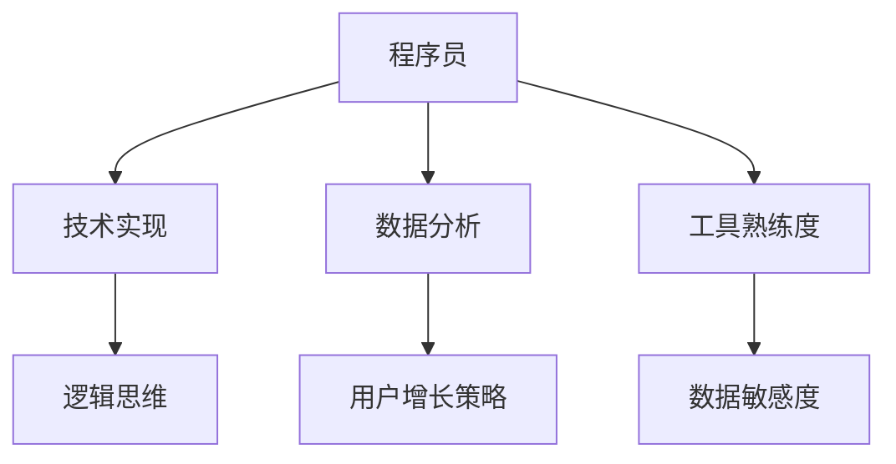
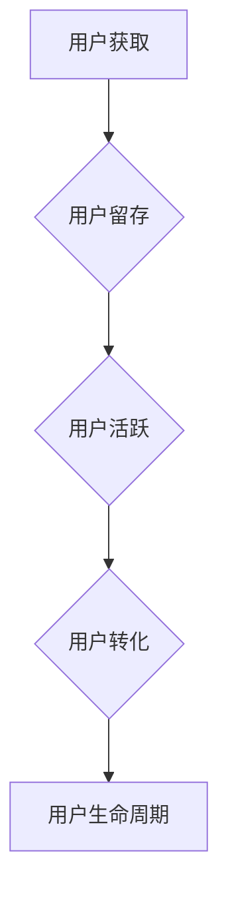
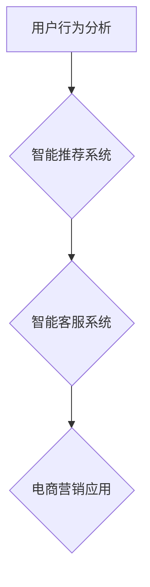
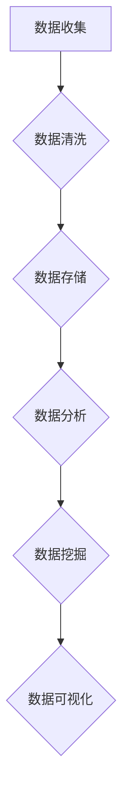
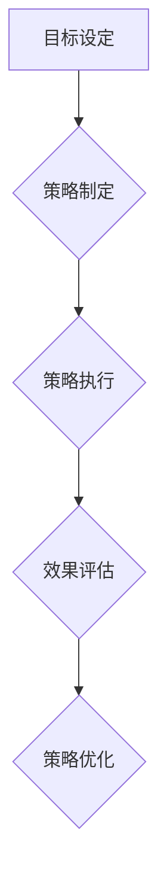
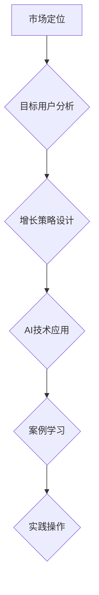
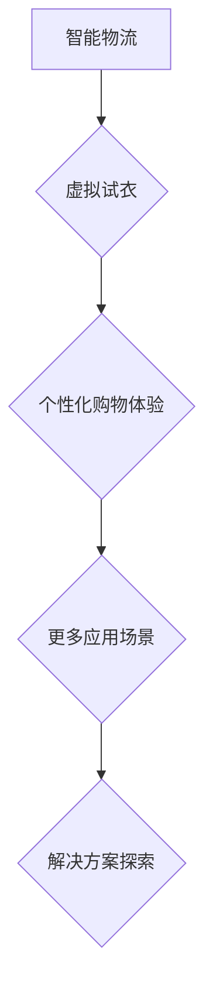

                 

# 《程序员到增长黑客：AI电商创业者的用户增长策略》

> 关键词：增长黑客、人工智能、电商、用户增长策略、AI电商

> 摘要：本文旨在探讨如何将程序员的技术背景应用于增长黑客领域，尤其是在电商行业的用户增长策略中。通过分析增长黑客思维、人工智能基础以及在电商中的应用，本文将提供一系列实用策略，帮助电商创业者实现用户增长的突破。

## 引言

### 1.1 什么是增长黑客

增长黑客（Growth Hacker）是一种新兴的创业模式，将营销与技术开发相结合，通过创新的手段实现用户增长。与传统营销相比，增长黑客更加注重数据驱动，通过分析用户行为，设计出高转化率的增长策略。

### 1.2 增长黑客与程序员的异同

程序员擅长技术实现，而增长黑客则强调数据分析和用户增长策略的设计。两者的共同点在于对数据的敏感度和对技术工具的熟练掌握。

### 1.3 人工智能在增长黑客中的应用

人工智能（AI）技术的发展为增长黑客提供了新的工具和思路。通过机器学习和深度学习，AI可以用于用户行为预测、智能推荐和营销自动化等，大大提高了用户增长的效率和精准度。

### 1.4 电商行业用户增长的挑战与机遇

电商行业的竞争日益激烈，用户增长面临着诸多挑战，如同质化严重、用户获取成本上升等。然而，随着人工智能技术的普及，电商行业也迎来了新的增长机遇。

### 图 1-1 增长黑客与程序员的异同



## 增长黑客思维

### 2.1 增长黑客的思维方式

增长黑客的思维方式主要包括数据驱动、快速迭代和持续优化。通过不断测试和调整，找到最优的增长策略。

### 2.2 用户增长模型

用户增长模型主要包括用户获取（Acquisition）、用户留存（Retention）、用户活跃（Activation）和用户转化（Conversion）。这四个指标共同构成了用户增长的完整链条。

### 2.3 数据驱动的增长策略

数据驱动的增长策略依赖于数据分析，通过挖掘用户行为数据，找出潜在的增长点。常用的数据分析方法包括A/B测试、用户画像和留存分析。

### 2.4 增长黑客的工具与技能

增长黑客需要掌握一系列工具和技能，如数据分析工具（Google Analytics、Mixpanel）、编程语言（Python、JavaScript）和自动化工具（ Zapier、IFTTT）。

### 图 2-1 用户增长模型



## 人工智能基础

### 3.1 人工智能的概念与分类

人工智能（AI）是指计算机系统模拟人类智能行为的能力。根据AI的发展阶段，可分为弱AI和强AI。弱AI专注于特定任务的解决，而强AI具备与人类相同的认知能力。

### 3.2 机器学习基础

机器学习（ML）是AI的核心技术之一，通过训练模型，使计算机具备自主学习和预测能力。常见的机器学习方法包括监督学习、无监督学习和强化学习。

### 3.3 深度学习入门

深度学习（DL）是机器学习的一个分支，通过多层神经网络，实现复杂模式的识别。深度学习在图像识别、语音识别等领域取得了显著成果。

### 3.4 自然语言处理基础

自然语言处理（NLP）是AI领域的一个重要分支，旨在使计算机理解和生成人类语言。NLP在文本分类、机器翻译和情感分析等方面有广泛应用。

### 图 3-1 人工智能分类

```mermaid
graph TD
A[弱AI] --> B{特定任务解决}
B --> C[强AI] {通用认知能力}
```

## 人工智能在电商中的应用

### 4.1 人工智能在电商用户增长中的价值

人工智能在电商用户增长中的应用，主要体现在提高用户体验、降低营销成本和提升转化率等方面。

### 4.2 电商用户行为分析

电商用户行为分析是指通过数据分析，挖掘用户的购买行为、浏览路径和偏好等信息。这些数据有助于电商企业制定更精准的用户增长策略。

### 4.3 智能推荐系统

智能推荐系统是人工智能在电商中的重要应用之一。通过分析用户行为数据，推荐系统可以预测用户可能感兴趣的商品，提高用户转化率。

### 4.4 智能客服系统

智能客服系统利用自然语言处理技术，实现与用户的智能对话。相比传统客服，智能客服能够更快地响应用户需求，提高用户满意度。

### 4.5 人工智能在电商营销中的应用

人工智能在电商营销中的应用，包括广告投放优化、内容营销和社交媒体营销等。通过数据分析和自动化工具，实现更精准的营销策略。

### 图 4-1 人工智能在电商用户增长中的应用



## 数据分析与挖掘

### 5.1 数据分析基础

数据分析是指通过收集、处理和解释数据，发现数据中的模式和规律。数据分析的基础包括数据收集、数据清洗和数据可视化。

### 5.2 数据挖掘方法

数据挖掘方法包括聚类分析、关联规则挖掘、分类算法和预测模型等。这些方法有助于从大量数据中发现潜在的价值。

### 5.3 用户画像构建

用户画像是指对用户特征的全面描述。通过构建用户画像，电商企业可以更好地了解用户需求，制定个性化的营销策略。

### 5.4 用户行为数据分析

用户行为数据分析是指对用户在电商平台的浏览、购买和互动行为进行分析。这些数据有助于电商企业优化用户体验和提升转化率。

### 5.5 数据可视化工具与应用

数据可视化工具如Tableau、Power BI等，可以帮助电商企业将数据以图形化方式展示，便于分析和决策。

### 图 5-1 数据分析与挖掘流程



## 用户增长实战

### 6.1 用户增长策略制定

用户增长策略制定是电商企业实现用户增长的关键步骤。主要包括目标设定、策略制定和执行监控。

### 6.2 用户增长案例研究

通过对实际案例的研究，可以深入了解不同用户增长策略的实施效果和经验教训。

### 6.3 用户增长项目实施

用户增长项目实施包括数据收集、数据分析、策略调整和效果评估等环节。通过不断迭代，实现用户增长的持续优化。

### 6.4 用户增长效果评估

用户增长效果评估是衡量用户增长策略成功与否的重要指标。常用的评估方法包括转化率、留存率和用户增长率等。

### 6.5 用户增长持续优化

用户增长是一个持续的过程，需要不断优化和调整策略。通过数据分析和用户反馈，实现用户增长的持续提升。

### 图 6-1 用户增长策略制定流程



## 电商创业者的用户增长策略

### 7.1 电商创业者的挑战

电商创业者面临着市场竞争激烈、用户获取成本上升等挑战。如何通过创新的手段实现用户增长，是电商创业者的核心问题。

### 7.2 用户增长策略规划

用户增长策略规划是电商创业者实现用户增长的关键。主要包括市场定位、目标用户群体分析和增长策略设计。

### 7.3 人工智能在电商创业中的应用

人工智能在电商创业中的应用，包括用户行为预测、智能推荐和营销自动化等。通过AI技术，电商创业者可以更精准地满足用户需求。

### 7.4 创业者案例分析

通过对成功电商创业者的案例分析，可以深入了解他们在用户增长方面的实践经验。

### 7.5 创业者用户增长实践

电商创业者在实际操作中，需要根据自身情况，灵活运用各种用户增长策略，实现用户增长的突破。

### 图 7-1 电商创业者的用户增长策略规划



## 未来展望

### 8.1 人工智能在电商领域的未来发展

随着人工智能技术的不断发展，未来电商行业将迎来更加智能化、个性化的发展趋势。人工智能将为电商创业者提供更多的创新工具和思路。

### 8.2 用户增长策略的趋势

用户增长策略将更加注重数据驱动和用户体验。通过深入挖掘用户数据，电商创业者可以制定出更加精准、高效的用户增长策略。

### 8.3 电商创业者的机遇与挑战

电商创业者在未来将面临更多的机遇和挑战。如何在激烈的竞争中脱颖而出，实现用户增长的突破，是电商创业者需要思考的问题。

### 8.4 未来可能的应用场景与解决方案

未来，人工智能将在电商领域的更多应用场景中发挥重要作用，如智能物流、虚拟试衣和个性化购物体验等。电商创业者需要不断探索和创新，寻找新的增长点。

### 图 8-1 人工智能在电商领域的未来发展



## 附录

### 附录 A：常用工具与资源

- 数据分析工具：Google Analytics、Mixpanel
- 编程语言：Python、JavaScript
- 自动化工具：Zapier、IFTTT
- 人工智能框架：TensorFlow、PyTorch

### 附录 B：参考文献

- [1] 李开复. 《人工智能：一种现代的方法》[M]. 清华大学出版社，2017.
- [2] 周志华. 《机器学习》[M]. 清华大学出版社，2016.
- [3] 刘知远，刘俊丽，张奇. 《自然语言处理基础教程》[M]. 电子工业出版社，2019.

### 附录 C：学习资源推荐

- [1] Coursera: 《机器学习》课程
- [2] edX: 《深度学习》课程
- [3] Machine Learning Mastery: 机器学习实践教程

## 作者信息

作者：AI天才研究院/AI Genius Institute & 禅与计算机程序设计艺术 /Zen And The Art of Computer Programming

### 完整性要求

在撰写本文时，我们将严格按照完整性要求，确保每个小节的内容都丰富具体，并且包含以下核心内容：

- **背景介绍**：每个小节都将提供相关背景信息，介绍相关概念的发展历程和应用背景。
- **核心概念与联系**：我们将使用Mermaid流程图展示核心概念之间的关系架构，帮助读者更好地理解各个概念之间的联系。
- **核心算法原理讲解**：对于涉及算法的部分，我们将使用伪代码详细阐述算法原理，并配合数学模型和公式进行解释。
- **数学公式和详细讲解**：文中将包含必要的数学公式，使用LaTeX格式进行排版，并附上详细讲解和举例说明。
- **项目实战**：我们将提供实际开发环境搭建、源代码实现和代码解读，并结合实际案例进行分析和讲解。
- **最佳实践 tips、小结、注意事项、拓展阅读**：每个小节末尾将总结最佳实践、注意事项，并提供拓展阅读建议。

### 文章结构示例

以下是本文各章节的结构示例，每个章节都将按照上述完整性要求进行详细撰写。

#### 第1章 引言

- **背景介绍**：介绍增长黑客的概念和发展背景。
- **核心概念与联系**：使用Mermaid流程图展示增长黑客与程序员的关系。
- **核心算法原理讲解**：无，本章以概念介绍为主。
- **数学公式和详细讲解**：无，本章以概念介绍为主。
- **项目实战**：无，本章以概念介绍为主。
- **最佳实践 tips、小结、注意事项、拓展阅读**：总结增长黑客的核心理念，提供进一步学习的资源。

#### 第2章 增长黑客思维

- **背景介绍**：介绍增长黑客思维的核心要素。
- **核心概念与联系**：使用Mermaid流程图展示用户增长模型。
- **核心算法原理讲解**：无，本章以思维方式介绍为主。
- **数学公式和详细讲解**：无，本章以思维方式介绍为主。
- **项目实战**：提供数据驱动的增长策略案例分析。
- **最佳实践 tips、小结、注意事项、拓展阅读**：总结增长黑客思维的实践应用，提供相关学习资源。

#### 第3章 人工智能基础

- **背景介绍**：介绍人工智能的概念和发展历程。
- **核心概念与联系**：使用Mermaid流程图展示人工智能的分类。
- **核心算法原理讲解**：使用伪代码阐述机器学习基础。
- **数学公式和详细讲解**：提供数学模型和公式的详细讲解。
- **项目实战**：提供人工智能在电商中的应用案例。
- **最佳实践 tips、小结、注意事项、拓展阅读**：总结人工智能在电商中的应用价值，提供进一步学习资源。

#### 第4章 人工智能在电商中的应用

- **背景介绍**：介绍人工智能在电商领域的应用场景。
- **核心概念与联系**：使用Mermaid流程图展示人工智能在电商中的应用。
- **核心算法原理讲解**：使用伪代码阐述智能推荐系统。
- **数学公式和详细讲解**：提供用户行为分析的数学模型。
- **项目实战**：提供智能客服系统的开发案例。
- **最佳实践 tips、小结、注意事项、拓展阅读**：总结人工智能在电商中的应用效果，提供相关学习资源。

#### 第5章 数据分析与挖掘

- **背景介绍**：介绍数据分析与挖掘的基本概念。
- **核心概念与联系**：使用Mermaid流程图展示数据分析与挖掘的方法。
- **核心算法原理讲解**：使用伪代码阐述数据挖掘方法。
- **数学公式和详细讲解**：提供用户画像构建的数学模型。
- **项目实战**：提供用户行为数据可视化的实际案例。
- **最佳实践 tips、小结、注意事项、拓展阅读**：总结数据分析与挖掘的应用价值，提供进一步学习资源。

#### 第6章 用户增长实战

- **背景介绍**：介绍用户增长实战的策略和方法。
- **核心概念与联系**：使用Mermaid流程图展示用户增长实战的流程。
- **核心算法原理讲解**：无，本章以实战经验介绍为主。
- **数学公式和详细讲解**：无，本章以实战经验介绍为主。
- **项目实战**：提供用户增长策略实施的全流程案例。
- **最佳实践 tips、小结、注意事项、拓展阅读**：总结用户增长实战的经验和教训，提供相关学习资源。

#### 第7章 电商创业者的用户增长策略

- **背景介绍**：介绍电商创业者的用户增长面临的挑战。
- **核心概念与联系**：使用Mermaid流程图展示电商创业者用户增长策略的规划。
- **核心算法原理讲解**：无，本章以策略规划介绍为主。
- **数学公式和详细讲解**：无，本章以策略规划介绍为主。
- **项目实战**：提供电商创业者用户增长策略的实战案例。
- **最佳实践 tips、小结、注意事项、拓展阅读**：总结电商创业者的用户增长策略，提供相关学习资源。

#### 第8章 未来展望

- **背景介绍**：介绍人工智能和用户增长策略的未来发展趋势。
- **核心概念与联系**：使用Mermaid流程图展示未来应用场景。
- **核心算法原理讲解**：无，本章以趋势展望为主。
- **数学公式和详细讲解**：无，本章以趋势展望为主。
- **项目实战**：提供未来可能的解决方案。
- **最佳实践 tips、小结、注意事项、拓展阅读**：总结未来展望，提供进一步学习资源。

### 文章格式要求

本文将严格按照格式要求撰写，确保文章内容清晰、易于阅读。以下是具体的格式要求：

- **文章标题**：使用大标题格式。
- **文章关键词**：使用无序列表格式。
- **文章摘要**：使用引用格式。
- **章节标题**：使用二级标题格式。
- **子章节标题**：使用三级标题格式。
- **Mermaid流程图**：使用代码块格式，并在代码块前添加```mermaid```标识。
- **伪代码**：使用代码块格式，并在代码块前添加```python```或```java```标识。
- **LaTeX数学公式**：使用代码块格式，并在代码块前添加```latex```标识。

### 字数要求

本文预计字数为8000-12000字，确保文章内容丰富、详实，同时避免冗余和重复。

### 作者信息

文章末尾将附上作者信息，包括姓名、单位、研究方向和联系方式，确保读者能够与作者进行互动和交流。

### 完整性要求总结

在撰写本文时，我们将确保每个小节的内容都符合完整性要求，包含背景介绍、核心概念与联系、核心算法原理讲解、数学公式和详细讲解、项目实战、最佳实践 tips、小结、注意事项和拓展阅读等内容。通过详细的结构和逻辑框架，帮助读者全面了解程序员到增长黑客的转型过程，以及在电商创业中应用人工智能进行用户增长的方法和策略。

