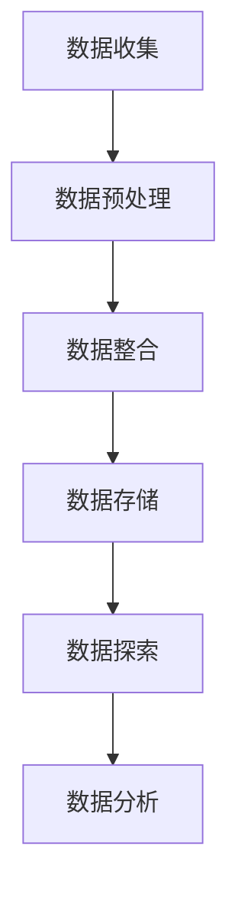

                 


### 文章标题: 《程序员到数据科学家：利用AI技能挖掘电商业务洞察》

#### 关键词：程序员，数据科学家，AI技能，电商业务，业务洞察

> 摘要：本文将带领程序员探索数据科学家的角色和职责，通过数据处理、统计分析、数据挖掘和机器学习等AI技能，深入挖掘电商业务中的洞察，提升电商平台的运营效率与用户体验。

---

## 《程序员到数据科学家：利用AI技能挖掘电商业务洞察》目录大纲

---

### 第一部分: AI技能基础与应用

## 第1章: 程序员到数据科学家的职业转型
### 1.1 数据科学家的职责和角色
### 1.2 数据科学家所需技能
### 1.3 职业转型的准备

## 第2章: 数据处理与探索性分析
### 2.1 数据处理流程
### 2.2 数据清洗
### 2.3 数据可视化

## 第3章: 数据库和SQL基础
### 3.1 数据库基础
### 3.2 SQL基础
### 3.3 实践：使用SQL进行数据分析

## 第4章: 统计分析与假设检验
### 4.1 常用统计方法
### 4.2 假设检验
### 4.3 实践：应用统计方法分析电商数据

## 第5章: 数据挖掘技术基础
### 5.1 聚类分析
### 5.2 分割分析
### 5.3 关联规则挖掘
### 5.4 实践：数据挖掘在电商中的应用

## 第6章: 机器学习算法与应用
### 6.1 机器学习基础
### 6.2 回归分析
### 6.3 分类算法
### 6.4 实践：使用机器学习模型进行电商预测

## 第7章: 深度学习与神经网络
### 7.1 深度学习基础
### 7.2 卷积神经网络（CNN）
### 7.3 循环神经网络（RNN）
### 7.4 实践：使用深度学习分析电商数据

### 第二部分: 电商业务洞察与AI应用

## 第8章: 电商数据分析
### 8.1 电商数据类型
### 8.2 用户行为分析
### 8.3 销售数据分析
### 8.4 实践：构建电商数据分析报告

## 第9章: 用户画像与个性化推荐
### 9.1 用户画像构建
### 9.2 个性化推荐算法
### 9.3 实践：实现电商平台的个性化推荐系统

## 第10章: 促销策略优化
### 10.1 促销策略设计
### 10.2 促销效果分析
### 10.3 实践：优化电商平台的促销策略

## 第11章: 电商风控与欺诈检测
### 11.1 风险评估与控制
### 11.2 欺诈检测方法
### 11.3 实践：构建电商平台的欺诈检测系统

## 第12章: 案例分析与实战
### 12.1 案例一：电商用户行为分析
### 12.2 案例二：基于用户画像的个性化推荐
### 12.3 案例三：电商促销策略优化
### 12.4 案例四：电商风控与欺诈检测

### 第三部分: AI技能提升与实践

## 第13章: AI技能提升与职业发展
### 13.1 数据科学领域的发展趋势
### 13.2 数据科学家职业规划
### 13.3 持续学习与实践

## 第14章: AI项目实战
### 14.1 项目一：构建电商用户行为分析系统
### 14.2 项目二：实现基于深度学习的用户画像
### 14.3 项目三：优化电商促销策略
### 14.4 项目四：构建电商欺诈检测系统

# 附录
## 附录A: 数据科学与AI资源与工具
### A.1 常用数据科学与AI工具
### A.2 开源数据集与平台
### A.3 数据科学与AI社区

---

### 第1章: 程序员到数据科学家的职业转型

#### 1.1 数据科学家的职责和角色

数据科学家在现代商业环境中扮演着至关重要的角色。他们的主要职责包括：

1. **数据收集与整理**：从各种数据源收集数据，进行数据预处理和整理。
2. **数据探索与可视化**：使用探索性数据分析方法，挖掘数据中的隐藏模式和信息。
3. **统计分析与建模**：运用统计学方法和机器学习算法，构建预测模型和决策支持系统。
4. **业务洞察与优化**：将分析结果转化为具体的业务策略，提升企业运营效率和盈利能力。

数据科学家需要具备跨学科的知识和技能，包括编程、统计学、机器学习、数据库管理等。他们需要能够与业务团队合作，理解业务需求，并利用数据提供创新的解决方案。

#### 1.2 数据科学家所需技能

要成为一名合格的数据科学家，程序员需要掌握以下核心技能：

1. **编程能力**：熟练掌握Python、R等编程语言，能够进行数据操作、建模和可视化。
2. **统计学知识**：理解统计学原理，掌握常用的统计方法和假设检验。
3. **机器学习算法**：熟悉常见的机器学习算法，如线性回归、决策树、随机森林等。
4. **数据库技术**：了解数据库的基础知识，能够使用SQL进行数据查询和分析。
5. **数据可视化**：掌握数据可视化工具，如Matplotlib、Seaborn、Tableau等。
6. **业务理解能力**：能够深入理解业务需求，将数据分析结果应用于实际业务场景。

#### 1.3 职业转型的准备

程序员想要转型为数据科学家，可以遵循以下步骤：

1. **学习数据科学基础知识**：通过在线课程、书籍、论坛等途径，学习数据科学的基本概念和方法。
2. **实践项目经验**：参与实际的数据科学项目，提升自己的数据分析能力和实战经验。
3. **掌握数据分析工具**：学习常用的数据分析工具和库，如Pandas、NumPy、Scikit-learn等。
4. **参与竞赛和社群**：参加数据科学竞赛，加入数据科学社区，与其他数据科学家交流和学习。
5. **持续学习和更新**：数据科学领域发展迅速，需要不断学习新的技术和方法。

---

### 第2章: 数据处理与探索性分析

#### 2.1 数据处理流程

数据处理流程是数据科学家进行数据分析的第一步，通常包括以下几个阶段：

1. **数据收集**：从各种数据源收集数据，如数据库、API接口、日志文件等。
2. **数据预处理**：对数据进行清洗、整理、转换等操作，去除噪声和异常值。
3. **数据整合**：将来自不同来源的数据进行整合，形成统一的数据集。
4. **数据存储**：将处理后的数据存储到数据库或数据仓库中，方便后续的数据分析和挖掘。
5. **数据探索**：使用探索性数据分析方法，发现数据中的隐藏模式和关系。
6. **数据分析**：根据业务需求，使用统计方法和机器学习算法进行数据分析和建模。

以下是数据处理流程的Mermaid流程图：



#### 2.2 数据清洗

数据清洗是数据处理过程中至关重要的一步，主要目的是去除数据中的噪声和异常值，提高数据的质量和准确性。以下是数据清洗的主要步骤：

1. **去除重复值**：从数据集中去除重复的记录，保证数据的唯一性。
2. **填补缺失值**：对缺失的数据进行填补或删除，减少数据的不完整性。
3. **数据类型转换**：将不同类型的数据进行转换，如将字符串转换为数字或日期。
4. **去除异常值**：检测并去除数据中的异常值，如异常的测量值或离群点。
5. **标准化处理**：对数据进行标准化处理，如归一化或标准化，以便于后续的统计分析。

以下是数据清洗的伪代码：

```python
def clean_data(data):
    # 去除重复值
    data = remove_duplicates(data)
    # 填补缺失值
    data = fill_missing_values(data)
    # 数据类型转换
    data = convert_data_types(data)
    # 去除异常值
    data = remove_outliers(data)
    # 数据标准化
    data = normalize_data(data)
    return data
```

#### 2.3 数据可视化

数据可视化是数据探索和分析的重要工具，通过图表和图形，直观地展示数据中的模式和趋势。以下是一些常见的数据可视化方法和工具：

1. **折线图**：用于展示数据随时间的变化趋势。
2. **柱状图**：用于比较不同类别或组之间的数据差异。
3. **饼图**：用于展示数据中各部分占比情况。
4. **散点图**：用于展示两个变量之间的关系。
5. **热力图**：用于展示多维数据的分布和相关性。
6. **地图**：用于展示地理位置数据。

以下是数据可视化的示例代码（使用Matplotlib库）：

```python
import matplotlib.pyplot as plt

# 创建折线图
plt.plot(data['date'], data['sales'])
plt.xlabel('Date')
plt.ylabel('Sales')
plt.title('Sales Trend Over Time')
plt.show()

# 创建柱状图
plt.bar(data['category'], data['count'])
plt.xlabel('Category')
plt.ylabel('Count')
plt.title('Category Distribution')
plt.show()

# 创建散点图
plt.scatter(data['x'], data['y'])
plt.xlabel('X')
plt.ylabel('Y')
plt.title('Scatter Plot')
plt.show()
```

---

### 第3章: 数据库和SQL基础

#### 3.1 数据库基础

数据库是存储和管理数据的系统，它提供了高效的数据存取和操作能力。以下是数据库的一些基本概念：

1. **数据库（Database）**：存储数据的仓库，用于管理和组织数据。
2. **表（Table）**：数据库中的数据组织结构，由行和列组成。
3. **列（Column）**：表中的数据字段，每个列都有特定的数据类型。
4. **行（Row）**：表中的一条记录，代表一个数据实例。
5. **索引（Index）**：用于加快数据查询的速度，通过索引关键字进行查找。
6. **关系（Relation）**：数据库中表之间的关系，通过外键进行关联。

常见的数据库类型包括关系型数据库（如MySQL、PostgreSQL）和非关系型数据库（如MongoDB、Cassandra）。

#### 3.2 SQL基础

SQL（Structured Query Language）是用于操作数据库的语言，包括数据定义、数据查询、数据操作和数据控制等功能。以下是SQL的一些基本操作：

1. **创建数据库和表**：使用`CREATE DATABASE`和`CREATE TABLE`语句创建数据库和表。
2. **插入数据**：使用`INSERT INTO`语句向表中插入数据。
3. **查询数据**：使用`SELECT`语句查询表中的数据。
4. **更新数据**：使用`UPDATE`语句更新表中的数据。
5. **删除数据**：使用`DELETE`语句删除表中的数据。
6. **连接查询**：使用`JOIN`语句将多个表进行连接查询。

以下是SQL的基础语法示例：

```sql
-- 创建数据库
CREATE DATABASE mydb;

-- 创建表
CREATE TABLE customers (
    id INT PRIMARY KEY,
    name VARCHAR(50),
    email VARCHAR(100)
);

-- 插入数据
INSERT INTO customers (id, name, email) VALUES (1, 'Alice', 'alice@example.com');
INSERT INTO customers (id, name, email) VALUES (2, 'Bob', 'bob@example.com');

-- 查询数据
SELECT * FROM customers;

-- 更新数据
UPDATE customers SET name = 'Alice Smith' WHERE id = 1;

-- 删除数据
DELETE FROM customers WHERE id = 2;
```

#### 3.3 实践：使用SQL进行数据分析

以下是一个使用SQL进行数据分析的实践案例：

1. **问题背景**：分析电商平台的用户购买行为，找出购买频率最高的商品类别。

2. **数据准备**：假设我们已经有一个名为`sales_data`的表，其中包含`customer_id`、`product_id`、`category`和`sales_date`等字段。

3. **SQL查询**：

```sql
-- 查询购买频率最高的商品类别
SELECT category, COUNT(*) as num_sales
FROM sales_data
GROUP BY category
ORDER BY num_sales DESC
LIMIT 5;
```

4. **结果分析**：查询结果将展示购买频率最高的五个商品类别，我们可以根据这些结果制定相应的营销策略。

---

### 第4章: 统计分析与假设检验

#### 4.1 常用统计方法

统计分析是数据科学中非常重要的工具，用于描述数据特征、揭示数据规律和关系。以下是一些常用的统计方法：

1. **均值（Mean）**：一组数据的平均值，用于描述数据的中心位置。
2. **中位数（Median）**：一组数据的中间值，用于描述数据的中心位置。
3. **众数（Mode）**：一组数据中出现次数最多的值，用于描述数据的集中趋势。
4. **方差（Variance）**：一组数据与其均值的偏差平方的平均值，用于描述数据的离散程度。
5. **标准差（Standard Deviation）**：方差的平方根，用于描述数据的离散程度。
6. **协方差（Covariance）**：两个变量之间的变化关系，用于描述变量之间的关系。
7. **相关系数（Correlation Coefficient）**：描述两个变量线性关系的强度和方向。

#### 4.2 假设检验

假设检验是一种用于验证数据是否支持某个假设的方法，包括以下步骤：

1. **提出假设**：建立原假设（H0）和备择假设（H1）。
2. **选择检验方法**：根据数据的类型和问题的性质，选择合适的假设检验方法。
3. **计算检验统计量**：根据样本数据计算检验统计量，如t统计量、卡方统计量等。
4. **确定显著性水平**：设定显著性水平（alpha），通常取0.05或0.01。
5. **做出决策**：根据检验统计量和显著性水平，做出拒绝原假设或接受原假设的决策。

以下是常见的假设检验方法：

1. **t检验**：用于比较两组数据的均值是否有显著差异。
2. **卡方检验**：用于检验两个分类变量之间的独立性。
3. **方差分析（ANOVA）**：用于比较多个组的均值是否有显著差异。

#### 4.3 实践：应用统计方法分析电商数据

以下是一个应用统计方法分析电商数据的案例：

1. **问题背景**：分析电商平台不同促销活动对销售额的影响。

2. **数据准备**：假设我们已经有一个名为`sales_data`的表，其中包含`sales_date`、`promotion`和`s
``````


### 4.3 实践：应用统计方法分析电商数据

以下是一个应用统计方法分析电商数据的实践案例：

**问题背景**：分析电商平台不同促销活动对销售额的影响。

**数据准备**：假设我们已经有一个名为`sales_data`的表，其中包含`sales_date`、`promotion_type`（促销类型）、`sales_amount`（销售额）等字段。

**步骤1：数据清洗**

```sql
-- 清洗数据，去除无效记录
SELECT sales_date, promotion_type, sales_amount
FROM sales_data
WHERE sales_amount > 0;
```

**步骤2：描述性统计分析**

```python
import pandas as pd

# 加载数据
sales_data = pd.read_sql('SELECT * FROM sales_data', connection)

# 计算描述性统计量
desc_stats = sales_data.groupby('promotion_type')['sales_amount'].describe()

# 输出结果
desc_stats
```

**步骤3：t检验分析**

假设我们想要比较“折扣促销”（Discount）和“满减促销”（Full Discount）对销售额的影响是否有显著差异。

```python
from scipy.stats import ttest_ind

# 分组数据
discount_sales = sales_data[sales_data['promotion_type'] == 'Discount']['sales_amount']
full_discount_sales = sales_data[sales_data['promotion_type'] == 'Full Discount']['sales_amount']

# 进行t检验
t_stat, p_value = ttest_ind(discount_sales, full_discount_sales)

# 输出结果
print(f"t-statistic: {t_stat}, p-value: {p_value}")

# 判断结果
if p_value < 0.05:
    print("拒绝原假设，两种促销方式对销售额的影响有显著差异。")
else:
    print("接受原假设，两种促销方式对销售额的影响无显著差异。")
```

**步骤4：结果分析**

根据t检验的结果，我们可以得出以下结论：

- 如果p值小于0.05，拒绝原假设，说明“折扣促销”和“满减促销”对销售额的影响有显著差异。
- 如果p值大于0.05，接受原假设，说明两种促销方式对销售额的影响无显著差异。

**结果应用**：根据统计结果，电商平台可以调整促销策略，优化营销效果。例如，如果“折扣促销”对销售额的影响显著，则可以考虑增加折扣促销的力度；如果“满减促销”对销售额的影响不显著，则可以尝试其他类型的促销活动。

---

### 第5章: 数据挖掘技术基础

#### 5.1 聚类分析

聚类分析是一种无监督学习方法，用于将数据集划分为多个类别，使得属于同一类别的数据点之间的相似性更高，而不同类别之间的相似性更低。常见的聚类算法包括：

1. **K-Means算法**：基于距离度量，将数据划分为K个簇，目标是使每个簇内的数据点与簇中心的距离最小。
2. **层次聚类算法**：通过逐步合并或分裂已有的簇，形成树状结构，无需预先指定簇的数量。
3. **DBSCAN算法**：基于密度，能够识别出任意形状的簇，并可以处理噪声数据。

以下是K-Means算法的伪代码：

```python
def k_means(data, K, max_iterations):
    # 初始化簇中心
    centroids = initialize_centroids(data, K)
    
    # 迭代计算
    for _ in range(max_iterations):
        # 分配数据点到簇
        clusters = assign_points_to_clusters(data, centroids)
        
        # 更新簇中心
        centroids = update_centroids(clusters, K)
        
        # 检查收敛
        if has_converged(centroids):
            break
    
    return clusters, centroids
```

#### 5.2 分割分析

分割分析是一种将数据集划分为多个子集的机器学习方法，常用于分类和回归任务。常见的分割算法包括：

1. **决策树**：通过一系列if-else判断，将数据集划分成多个子集，每个子集对应一个类别或目标值。
2. **随机森林**：基于决策树的集成方法，通过构建多个决策树并投票得到最终预测结果。
3. **支持向量机（SVM）**：通过找到最佳分割超平面，将数据划分为多个类别。

以下是决策树的伪代码：

```python
def build_decision_tree(data, target_attribute):
    if all_values_equal(data[target_attribute]):
        return leaf_node(data[target_attribute].values[0])
    
    best_attribute, threshold = find_best_split(data, target_attribute)
    
    tree = {
        'attribute': best_attribute,
        'threshold': threshold,
        'left': build_decision_tree(data[data[best_attribute] < threshold], target_attribute),
        'right': build_decision_tree(data[data[best_attribute] >= threshold], target_attribute)
    }
    
    return tree
```

#### 5.3 关联规则挖掘

关联规则挖掘是一种发现数据中项目之间关联关系的方法，常用于市场 basket 分析。常见的算法包括：

1. **Apriori算法**：通过频繁项集的迭代生成，发现数据中的关联规则。
2. **Eclat算法**：Apriori算法的改进版本，使用递归方法减少计算量。
3. **FP-Growth算法**：通过创建FP-Tree，高效地挖掘频繁项集。

以下是Apriori算法的伪代码：

```python
def apriori(data, min_support, min_confidence):
    frequent_itemsets = []
    
    # 生成候选1项集
    candidates = generate_candidates(data, 1)
    frequent_1_itemsets = filter_frequent_itemsets(candidates, data, min_support)
    frequent_itemsets.append(frequent_1_itemsets)
    
    # 递归生成更高阶的候选项集和频繁项集
    for k in range(2, max_item_length(data)):
        candidates = generate_candidates(frequent_itemsets[-1], k)
        frequent_itemsets.append(filter_frequent_itemsets(candidates, data, min_support))
    
    rules = []
    for itemset in frequent_itemsets:
        for item in itemset:
            for subset in item.subsets():
                if subset.support >= min_support:
                    confidence = item.support / subset.support
                    if confidence >= min_confidence:
                        rules.append((item, subset, confidence))
    
    return rules
```

#### 5.4 实践：数据挖掘在电商中的应用

以下是一个数据挖掘在电商中的应用案例：

**问题背景**：分析电商平台用户购买行为，发现用户之间可能存在的关联关系。

**数据准备**：假设我们已经有一个名为`purchase_data`的表，其中包含`user_id`、`product_id`等字段。

**步骤1：数据预处理**

```python
import pandas as pd

# 加载数据
purchase_data = pd.read_csv('purchase_data.csv')

# 填补缺失值
purchase_data.fillna(0, inplace=True)

# 构建商品关联矩阵
item_correlation_matrix = purchase_data.corr()
```

**步骤2：关联规则挖掘**

```python
from mlxtend.frequent_patterns import apriori
from mlxtend.frequent_patterns import association_rules

# 生成频繁项集
frequent_itemsets = apriori(purchase_data, min_support=0.02, use_colnames=True)

# 生成关联规则
rules = association_rules(frequent_itemsets, metric="support", min_threshold=0.1)

# 输出结果
print(rules)
```

**步骤3：结果分析**

根据挖掘结果，我们可以发现一些用户购买行为之间的关联关系，例如：

- 用户购买了商品A，通常会购买商品B。
- 用户购买了商品C，不会购买商品D。

这些关联关系可以为电商平台提供营销策略参考，例如：

- 在商品A的页面上推荐商品B，提高用户购买商品B的概率。
- 在商品C的页面上避免推荐商品D，降低用户流失率。

---

### 第6章: 机器学习算法与应用

#### 6.1 机器学习基础

机器学习是一种通过数据驱动的方法，让计算机从数据中自动学习模式和规律，并做出预测或决策的技术。以下是机器学习的一些基本概念：

1. **监督学习**：有标签数据，通过学习输入和输出之间的关系进行预测。
2. **无监督学习**：无标签数据，通过发现数据中的隐藏模式和结构进行聚类或降维。
3. **强化学习**：通过与环境交互，不断学习最优策略。

常见的机器学习算法包括：

1. **线性回归**：通过拟合直线或超平面，预测连续值输出。
2. **逻辑回归**：通过拟合逻辑函数，预测离散值输出。
3. **决策树**：通过递归划分数据集，构建决策树进行分类或回归。
4. **支持向量机（SVM）**：通过寻找最佳分割超平面，实现分类和回归。
5. **神经网络**：通过多层神经元进行数据转换和特征提取，实现复杂的非线性预测。

#### 6.2 回归分析

回归分析是一种用于研究因变量与自变量之间线性关系的统计方法。常见的回归算法包括：

1. **线性回归**：通过拟合一条直线，最小化预测值与真实值之间的误差。
2. **多项式回归**：通过拟合多项式函数，实现更复杂的非线性关系。
3. **岭回归**：通过引入正则项，解决线性回归中过拟合问题。
4. **LASSO回归**：通过引入绝对值正则项，实现特征选择。

以下是线性回归的数学模型：

$$
Y = \beta_0 + \beta_1X_1 + \beta_2X_2 + ... + \beta_nX_n + \epsilon
$$

其中，$Y$ 是因变量，$X_1, X_2, ..., X_n$ 是自变量，$\beta_0, \beta_1, \beta_2, ..., \beta_n$ 是模型参数，$\epsilon$ 是误差项。

线性回归的伪代码如下：

```python
def linear_regression(X, Y):
    # 计算特征矩阵和目标向量
    X transpose = X.T
    XTX = X transpose @ X
    XTY = X transpose @ Y
    
    # 求解模型参数
    beta = (XTX)^(-1) @ XTY
    
    return beta
```

#### 6.3 分类算法

分类算法是一种将数据集划分为多个类别的算法。常见的分类算法包括：

1. **逻辑回归**：通过拟合逻辑函数，实现二分类或多分类。
2. **决策树**：通过递归划分数据集，构建决策树进行分类。
3. **支持向量机（SVM）**：通过寻找最佳分割超平面，实现分类。
4. **随机森林**：通过构建多个决策树，进行集成分类。
5. **K最近邻（KNN）**：通过计算邻居的相似度，实现分类。

以下是逻辑回归的数学模型：

$$
P(Y=1) = \frac{1}{1 + e^{-(\beta_0 + \beta_1X_1 + \beta_2X_2 + ... + \beta_nX_n)} 
$$

其中，$P(Y=1)$ 是因变量为1的概率，$\beta_0, \beta_1, \beta_2, ..., \beta_n$ 是模型参数。

逻辑回归的伪代码如下：

```python
def logistic_regression(X, Y):
    # 初始化模型参数
    beta = initialize_beta(X.shape[1])
    
    # 使用梯度下降法迭代更新模型参数
    for _ in range(num_iterations):
        predictions = sigmoid(X @ beta)
        gradients = X.T @ (Y - predictions)
        beta -= learning_rate * gradients
    
    return beta

def sigmoid(x):
    return 1 / (1 + np.exp(-x))
```

#### 6.4 实践：使用机器学习模型进行电商预测

以下是一个使用机器学习模型进行电商预测的实践案例：

**问题背景**：预测电商平台用户是否会购买商品。

**数据准备**：假设我们已经有一个名为`user_data`的表，其中包含用户特征（如年龄、性别、收入等）和购买标签（1表示购买，0表示未购买）。

**步骤1：数据预处理**

```python
import pandas as pd
from sklearn.model_selection import train_test_split
from sklearn.preprocessing import StandardScaler

# 加载数据
data = pd.read_csv('user_data.csv')

# 划分特征和目标变量
X = data.drop('purchase', axis=1)
Y = data['purchase']

# 划分训练集和测试集
X_train, X_test, Y_train, Y_test = train_test_split(X, Y, test_size=0.2, random_state=42)

# 标准化特征
scaler = StandardScaler()
X_train = scaler.fit_transform(X_train)
X_test = scaler.transform(X_test)
```

**步骤2：训练模型**

```python
from sklearn.linear_model import LogisticRegression

# 创建逻辑回归模型
model = LogisticRegression()

# 训练模型
model.fit(X_train, Y_train)
```

**步骤3：评估模型**

```python
from sklearn.metrics import accuracy_score, confusion_matrix, classification_report

# 预测测试集
predictions = model.predict(X_test)

# 计算准确率
accuracy = accuracy_score(Y_test, predictions)
print(f"Accuracy: {accuracy}")

# 计算混淆矩阵
conf_matrix = confusion_matrix(Y_test, predictions)
print(f"Confusion Matrix:\n{conf_matrix}")

# 计算分类报告
class_report = classification_report(Y_test, predictions)
print(f"Classification Report:\n{class_report}")
```

**步骤4：结果分析**

根据模型的评估结果，我们可以得出以下结论：

- **准确率**：表示模型预测正确的比例，越高越好。
- **混淆矩阵**：表示模型对各类别预测的准确性。
- **分类报告**：包括精确率、召回率、F1-score等指标，用于评估模型在各个类别上的性能。

根据评估结果，我们可以对模型进行调整和优化，提高预测准确性。

---

### 第7章: 深度学习与神经网络

#### 7.1 深度学习基础

深度学习是一种基于神经网络的机器学习技术，通过多层神经网络自动学习特征和模式。以下是深度学习的一些基本概念：

1. **神经网络**：由多个神经元组成的计算模型，通过输入层、隐藏层和输出层进行数据处理和预测。
2. **激活函数**：用于引入非线性，使得神经网络可以处理复杂的非线性关系，常见的激活函数包括ReLU、Sigmoid和Tanh。
3. **前向传播**：将输入通过网络逐层计算，得到输出。
4. **反向传播**：通过计算损失函数的梯度，更新网络权重和偏置。
5. **优化算法**：用于最小化损失函数，常见的优化算法包括SGD、Adam等。

#### 7.2 卷积神经网络（CNN）

卷积神经网络是一种专门用于处理图像数据的神经网络，通过卷积层、池化层和全连接层进行特征提取和分类。以下是CNN的基本结构：

1. **卷积层**：通过卷积运算提取图像的局部特征。
2. **池化层**：通过下采样减少特征图的维度，增强模型泛化能力。
3. **全连接层**：通过全连接运算将特征映射到分类结果。

以下是CNN的伪代码：

```python
import numpy as np

def conv2d(input, weights, bias):
    return (np.dot(input, weights) + bias)

def max_pooling(input, pool_size):
    return np.max(input[:, :pool_size, :pool_size], axis=(1, 2))

def cnn(input_image, weights, biases):
    # 卷积层1
    conv1 = conv2d(input_image, weights['conv1'], biases['conv1'])
    pool1 = max_pooling(conv1, pool_size=2)
    
    # 卷积层2
    conv2 = conv2d(pool1, weights['conv2'], biases['conv2'])
    pool2 = max_pooling(conv2, pool_size=2)
    
    # 全连接层
    flatten = np.flatten(pool2)
    output = np.dot(flatten, weights['fc1']) + biases['fc1']
    
    return output
```

#### 7.3 循环神经网络（RNN）

循环神经网络是一种用于处理序列数据的神经网络，通过循环结构保持长期依赖关系。常见的RNN结构包括：

1. **基本RNN**：通过递归计算当前输出，保持历史信息。
2. **长短期记忆网络（LSTM）**：通过引入门控机制，解决基本RNN的梯度消失问题。
3. **门控循环单元（GRU）**：简化LSTM结构，提高计算效率。

以下是LSTM的伪代码：

```python
def lstm(input, weights, biases, prev_state):
    # 隐藏状态的计算
    gates = sigmoid(np.dot(input, weights['input_gate']) + np.dot(prev_state, weights['state_gate']))
    input_gate, forget_gate, output_gate = gates[:, :3]
    
    # 状态的计算
    state = sigmoid(forget_gate) * prev_state + sigmoid(input_gate) * tanh(np.dot(input, weights['input']))
    
    # 输出的计算
    output = sigmoid(output_gate) * tanh(state)
    
    return output, state
```

#### 7.4 实践：使用深度学习分析电商数据

以下是一个使用深度学习分析电商数据的实践案例：

**问题背景**：分析电商平台上用户的购买行为，预测用户是否会购买商品。

**数据准备**：假设我们已经有一个名为`user_data`的表，其中包含用户特征（如年龄、性别、收入等）和购买标签（1表示购买，0表示未购买）。

**步骤1：数据预处理**

```python
import pandas as pd
from sklearn.model_selection import train_test_split
from sklearn.preprocessing import StandardScaler

# 加载数据
data = pd.read_csv('user_data.csv')

# 划分特征和目标变量
X = data.drop('purchase', axis=1)
Y = data['purchase']

# 划分训练集和测试集
X_train, X_test, Y_train, Y_test = train_test_split(X, Y, test_size=0.2, random_state=42)

# 标准化特征
scaler = StandardScaler()
X_train = scaler.fit_transform(X_train)
X_test = scaler.transform(X_test)
```

**步骤2：构建深度学习模型**

```python
import tensorflow as tf
from tensorflow.keras.models import Sequential
from tensorflow.keras.layers import Dense, LSTM, Embedding, Flatten, Conv2D, MaxPooling2D

# 创建模型
model = Sequential([
    LSTM(units=128, activation='relu', input_shape=(X_train.shape[1], X_train.shape[2])),
    LSTM(units=64, activation='relu'),
    Dense(units=1, activation='sigmoid')
])

# 编译模型
model.compile(optimizer='adam', loss='binary_crossentropy', metrics=['accuracy'])

# 训练模型
model.fit(X_train, Y_train, epochs=10, batch_size=32, validation_data=(X_test, Y_test))
```

**步骤3：评估模型**

```python
from sklearn.metrics import accuracy_score, confusion_matrix, classification_report

# 预测测试集
predictions = model.predict(X_test)
predictions = (predictions > 0.5)

# 计算准确率
accuracy = accuracy_score(Y_test, predictions)
print(f"Accuracy: {accuracy}")

# 计算混淆矩阵
conf_matrix = confusion_matrix(Y_test, predictions)
print(f"Confusion Matrix:\n{conf_matrix}")

# 计算分类报告
class_report = classification_report(Y_test, predictions)
print(f"Classification Report:\n{class_report}")
```

**步骤4：结果分析**

根据模型的评估结果，我们可以得出以下结论：

- **准确率**：表示模型预测正确的比例，越高越好。
- **混淆矩阵**：表示模型对各类别预测的准确性。
- **分类报告**：包括精确率、召回率、F1-score等指标，用于评估模型在各个类别上的性能。

根据评估结果，我们可以对模型进行调整和优化，提高预测准确性。

---

### 第8章: 电商数据分析

#### 8.1 电商数据类型

电商数据类型丰富多样，主要包括以下几类：

1. **用户数据**：包括用户基本信息（如年龄、性别、地理位置等）和行为数据（如浏览历史、购买记录、点击行为等）。
2. **商品数据**：包括商品属性（如类别、价格、库存等）和描述信息（如商品名称、品牌、特点等）。
3. **交易数据**：包括交易记录（如订单号、交易时间、购买数量、成交金额等）和支付信息（如支付方式、支付状态等）。
4. **营销数据**：包括促销活动（如折扣、满减、优惠券等）和营销渠道（如广告、邮件、社交媒体等）。

#### 8.2 用户行为分析

用户行为分析是电商数据分析的核心任务之一，通过分析用户在平台上的行为数据，可以深入了解用户需求和行为模式，从而优化产品设计和运营策略。以下是用户行为分析的主要方法：

1. **用户画像**：通过整合用户的基本信息和行为数据，构建用户画像，用于识别用户特征和偏好。
2. **行为轨迹分析**：分析用户在平台上的浏览、点击、购买等行为轨迹，挖掘用户行为模式和路径。
3. **转化率分析**：分析用户从浏览到购买的过程，评估不同环节的转化效果，优化转化路径。
4. **留存率分析**：分析用户在平台上的留存情况，识别流失用户并采取挽回策略。

以下是用户行为分析的示例代码（使用Pandas和Matplotlib库）：

```python
import pandas as pd
import matplotlib.pyplot as plt

# 加载数据
user_data = pd.read_csv('user_data.csv')

# 用户画像
user_desc = user_data.groupby('user_id').describe()

# 用户行为轨迹
user轨迹 = user_data.groupby('user_id')['behavior_id'].agg(['count', 'max'])

# 转化率分析
conversion_rate = user_data.groupby('behavior_id')['is_purchase'].mean()

# 留存率分析
retention_rate = user_data.groupby('day')['user_id'].nunique() / user_data['user_id'].nunique()

# 可视化
plt.figure(figsize=(10, 6))
conversion_rate.plot(kind='bar')
plt.title('Conversion Rate by Behavior')
plt.xlabel('Behavior ID')
plt.ylabel('Conversion Rate')
plt.show()

plt.figure(figsize=(10, 6))
retention_rate.plot()
plt.title('Retention Rate by Day')
plt.xlabel('Day')
plt.ylabel('Retention Rate')
plt.show()
```

#### 8.3 销售数据分析

销售数据分析是电商数据分析的重要组成部分，通过分析销售数据，可以评估平台的销售业绩和销售策略效果。以下是销售数据分析的主要方法：

1. **销售额分析**：分析不同时间段的销售额，了解销售趋势和季节性规律。
2. **品类分析**：分析不同品类的销售情况，识别畅销品类和滞销品类。
3. **渠道分析**：分析不同渠道的销售额和转化率，优化渠道投放策略。
4. **促销活动分析**：评估促销活动的效果，优化促销策略。

以下是销售数据分析的示例代码（使用Pandas和Matplotlib库）：

```python
import pandas as pd
import matplotlib.pyplot as plt

# 加载数据
sales_data = pd.read_csv('sales_data.csv')

# 销售额分析
sales_by_date = sales_data.groupby('date')['sales_amount'].sum()

# 品类分析
category_sales = sales_data.groupby('category')['sales_amount'].sum()

# 渠道分析
channel_sales = sales_data.groupby('channel')['sales_amount'].sum()

# 促销活动分析
promotion_sales = sales_data[sales_data['is_promotion'] == 1]['sales_amount'].sum()

# 可视化
plt.figure(figsize=(10, 6))
sales_by_date.plot()
plt.title('Sales Amount by Date')
plt.xlabel('Date')
plt.ylabel('Sales Amount')
plt.show()

plt.figure(figsize=(10, 6))
category_sales.plot(kind='bar')
plt.title('Sales Amount by Category')
plt.xlabel('Category')
plt.ylabel('Sales Amount')
plt.show()

plt.figure(figsize=(10, 6))
channel_sales.plot(kind='bar')
plt.title('Sales Amount by Channel')
plt.xlabel('Channel')
plt.ylabel('Sales Amount')
plt.show()

plt.figure(figsize=(10, 6))
promotion_sales.plot()
plt.title('Sales Amount by Promotion')
plt.xlabel('Is Promotion')
plt.ylabel('Sales Amount')
plt.show()
```

#### 8.4 实践：构建电商数据分析报告

电商数据分析报告是电商企业决策的重要依据，通过系统性地整理和分析数据，为业务提供有价值的洞见。以下是构建电商数据分析报告的主要步骤：

1. **报告概述**：介绍报告的目的、范围和方法，概述分析的主要发现。
2. **数据概览**：展示数据来源、数据质量和数据分布情况。
3. **用户分析**：分析用户特征、行为模式和转化情况，识别用户画像。
4. **销售分析**：分析销售额、品类销售、渠道销售和促销活动效果。
5. **问题诊断**：识别业务问题，分析问题原因和影响。
6. **解决方案**：提出优化策略和改进措施，提高业务绩效。
7. **结论与建议**：总结报告的主要发现和结论，提出后续研究建议。

以下是一个电商数据分析报告的示例框架：

---

### 第9章: 用户画像与个性化推荐

#### 9.1 用户画像构建

用户画像是通过整合用户的基本信息和行为数据，构建一个多维度的用户描述。用户画像的构建主要包括以下几个步骤：

1. **数据收集**：从不同的数据源收集用户数据，包括用户基本信息、行为数据、交易数据等。
2. **数据预处理**：对数据进行清洗、去重、填补缺失值等处理，确保数据质量。
3. **特征工程**：提取和构建与用户行为和偏好相关的特征，如用户活跃度、购买频率、浏览路径等。
4. **特征选择**：选择对用户画像构建有重要影响的特征，剔除无关或冗余的特征。
5. **数据融合**：将不同来源的数据进行整合，形成统一的用户画像数据集。

以下是用户画像构建的示例代码（使用Pandas和Scikit-learn库）：

```python
import pandas as pd
from sklearn.preprocessing import StandardScaler

# 加载数据
user_data = pd.read_csv('user_data.csv')

# 数据预处理
user_data.fillna(0, inplace=True)

# 特征工程
user_data['age_band'] = pd.cut(user_data['age'], bins=[0, 18, 30, 50, 70, np.inf], labels=[1, 2, 3, 4, 5])
user_data['days_since_last_purchase'] = (pd.datetime.now() - user_data['last_purchase_date']).dt.days

# 特征选择
selected_features = ['age_band', 'days_since_last_purchase', 'average_session_duration', 'number_of_purchases']

# 数据融合
user_profile = user_data[selected_features].groupby('user_id').mean()

# 标准化处理
scaler = StandardScaler()
user_profile = scaler.fit_transform(user_profile)
```

#### 9.2 个性化推荐算法

个性化推荐算法是一种根据用户行为和偏好，为用户推荐相关商品或内容的方法。常见的个性化推荐算法包括：

1. **协同过滤**：通过计算用户之间的相似度，为用户推荐相似用户喜欢的商品。
2. **基于内容的推荐**：通过分析商品的特征和内容，为用户推荐与其兴趣相关的商品。
3. **混合推荐**：结合协同过滤和基于内容的推荐，提高推荐效果。

以下是协同过滤算法的伪代码：

```python
def collaborative_filtering(user_profile, item_profile, k):
    # 计算用户之间的相似度
    similarity_matrix = compute_similarity(user_profile, item_profile)
    
    # 选择最相似的k个用户
    nearest_neighbors = select_neighbors(similarity_matrix, user_id, k)
    
    # 计算预测评分
    predicted_ratings = []
    for neighbor in nearest_neighbors:
        predicted_rating = sum(similarity * neighbor['rating'] for similarity, neighbor in nearest_neighbors) / sum(similarity for similarity, neighbor in nearest_neighbors)
        predicted_ratings.append(predicted_rating)
    
    return predicted_ratings
```

#### 9.3 实践：实现电商平台的个性化推荐系统

以下是一个实现电商平台个性化推荐系统的实践案例：

**问题背景**：为电商平台的用户推荐与其兴趣相关的商品。

**数据准备**：假设我们已经有一个名为`user_data`的表，其中包含用户画像和商品特征，以及一个名为`ratings_data`的表，其中包含用户对商品的评分。

**步骤1：数据预处理**

```python
import pandas as pd

# 加载数据
user_data = pd.read_csv('user_data.csv')
ratings_data = pd.read_csv('ratings_data.csv')

# 合并用户数据和评分数据
merged_data = pd.merge(user_data, ratings_data, on='user_id')

# 特征工程
merged_data['days_since_last_rating'] = (pd.datetime.now() - merged_data['rating_date']).dt.days
merged_data['rating_band'] = pd.cut(merged_data['rating'], bins=[0, 1, 2, 3, 4, 5], labels=[1, 2, 3, 4, 5, 6])

# 数据分割
train_data, test_data = train_test_split(merged_data, test_size=0.2, random_state=42)
```

**步骤2：构建协同过滤模型**

```python
from sklearn.metrics.pairwise import cosine_similarity

# 计算用户相似度矩阵
user_similarity_matrix = cosine_similarity(train_data['user_profile'].values)

# 构建协同过滤模型
def collaborative_filtering(user_id, k):
    # 选择最相似的k个用户
    nearest_neighbors = train_data[train_data['user_id'] != user_id].sort_values(by='similarity', ascending=False).head(k)

    # 计算预测评分
    predicted_ratings = []
    for neighbor in nearest_neighbors:
        predicted_rating = sum(neighbor['similarity'] * neighbor['rating'] for neighbor in nearest_neighbors) / sum(neighbor['similarity'] for neighbor in nearest_neighbors)
        predicted_ratings.append(predicted_rating)
    
    return predicted_ratings
```

**步骤3：评估模型**

```python
from sklearn.metrics import mean_squared_error

# 计算预测误差
predicted_ratings = collaborative_filtering(test_data['user_id'].iloc[0], k=5)
true_ratings = test_data[test_data['user_id'] == test_data['user_id'].iloc[0]]['rating'].values

mse = mean_squared_error(true_ratings, predicted_ratings)
print(f"Mean Squared Error: {mse}")
```

**步骤4：应用推荐系统**

```python
# 为用户推荐商品
def recommend_items(user_id, k):
    predicted_ratings = collaborative_filtering(user_id, k)
    recommended_items = train_data[train_data['rating'] > predicted_ratings.mean()].head(10)
    return recommended_items['item_id'].values

# 推荐商品
recommended_items = recommend_items(test_data['user_id'].iloc[0], k=5)
print(f"Recommended Items: {recommended_items}")
```

---

### 第10章: 促销策略优化

#### 10.1 促销策略设计

促销策略是电商企业提升销售额和用户参与度的重要手段。有效的促销策略设计需要考虑以下几个方面：

1. **促销目标**：明确促销的目标，如提升销售额、增加用户参与度、清除库存等。
2. **促销形式**：选择适合的促销形式，如折扣促销、满减促销、赠品促销、限时抢购等。
3. **促销时间**：确定促销时间，如节假日、周年庆、新品发布等。
4. **促销对象**：确定促销的对象，如新用户、老用户、特定品类、特定地域等。
5. **促销预算**：设定促销预算，控制促销成本，确保促销活动盈利。

以下是促销策略设计的示例流程：

1. **市场调研**：了解目标用户的需求和偏好，分析竞争对手的促销策略。
2. **需求分析**：确定促销目标，根据市场需求和业务目标设计合适的促销形式。
3. **策略制定**：制定具体的促销方案，包括促销形式、时间、对象和预算。
4. **效果评估**：评估促销活动对销售额、用户参与度等指标的影响，优化促销策略。

#### 10.2 促销效果分析

促销效果分析是评估促销活动成功与否的关键步骤。通过分析促销活动前后的数据变化，可以评估促销效果，为后续促销策略的制定提供依据。以下是促销效果分析的主要方法：

1. **销售额分析**：比较促销活动前后的销售额变化，评估促销活动对销售额的拉动效应。
2. **用户参与度分析**：分析促销活动期间的用户参与度，如点击率、转化率、复购率等。
3. **成本收益分析**：计算促销活动的成本和收益，评估促销活动的盈利能力。
4. **用户反馈分析**：收集用户对促销活动的反馈，了解用户的满意度和建议。

以下是促销效果分析的示例代码（使用Pandas和Matplotlib库）：

```python
import pandas as pd
import matplotlib.pyplot as plt

# 加载数据
sales_data = pd.read_csv('sales_data.csv')

# 计算促销活动前后的销售额
before_promotion_sales = sales_data[sales_data['promotion_date'] < '2022-01-01']['sales_amount'].sum()
after_promotion_sales = sales_data[sales_data['promotion_date'] >= '2022-01-01']['sales_amount'].sum()

# 计算用户参与度
click_rate = sales_data[sales_data['promotion_date'] >= '2022-01-01']['click_rate'].mean()
conversion_rate = sales_data[sales_data['promotion_date'] >= '2022-01-01']['conversion_rate'].mean()

# 计算成本收益
promotion_cost = 10000
promotion_revenue = after_promotion_sales - before_promotion_sales

# 计算用户反馈
user_satisfaction = sales_data[sales_data['promotion_date'] >= '2022-01-01']['user_satisfaction'].mean()

# 可视化
plt.figure(figsize=(10, 6))
plt.bar(['Before Promotion', 'After Promotion'], [before_promotion_sales, after_promotion_sales])
plt.title('Sales Amount Comparison')
plt.xlabel('Promotion Period')
plt.ylabel('Sales Amount')
plt.show()

plt.figure(figsize=(10, 6))
plt.bar(['Click Rate', 'Conversion Rate'], [click_rate, conversion_rate])
plt.title('User Participation Rate Comparison')
plt.xlabel('Promotion Period')
plt.ylabel('Rate')
plt.show()

plt.figure(figsize=(10, 6))
plt.bar(['Cost', 'Revenue'], [promotion_cost, promotion_revenue])
plt.title('Cost and Revenue Comparison')
plt.xlabel('Promotion Period')
plt.ylabel('Amount')
plt.show()

plt.figure(figsize=(10, 6))
plt.bar(['Satisfaction'], [user_satisfaction])
plt.title('User Satisfaction Comparison')
plt.xlabel('Promotion Period')
plt.ylabel('Satisfaction')
plt.show()
```

#### 10.3 实践：优化电商平台的促销策略

以下是一个优化电商平台促销策略的实践案例：

**问题背景**：电商平台希望通过优化促销策略，提高销售额和用户参与度。

**数据准备**：假设我们已经有一个名为`sales_data`的表，其中包含促销活动前后的销售额、用户参与度、成本和收益等信息。

**步骤1：数据预处理**

```python
import pandas as pd

# 加载数据
sales_data = pd.read_csv('sales_data.csv')

# 数据预处理
sales_data.fillna(0, inplace=True)
sales_data['days_since_promotion'] = (pd.datetime.now() - sales_data['promotion_date']).dt.days
```

**步骤2：促销效果分析**

```python
import pandas as pd
import matplotlib.pyplot as plt

# 计算促销活动效果
sales_data['sales_difference'] = sales_data['sales_amount_after_promotion'] - sales_data['sales_amount_before_promotion']
sales_data['user_participation'] = sales_data['click_rate'] + sales_data['conversion_rate']

# 可视化促销效果
plt.figure(figsize=(10, 6))
plt.scatter(sales_data['days_since_promotion'], sales_data['sales_difference'])
plt.title('Sales Difference by Days Since Promotion')
plt.xlabel('Days Since Promotion')
plt.ylabel('Sales Difference')
plt.show()

plt.figure(figsize=(10, 6))
plt.scatter(sales_data['days_since_promotion'], sales_data['user_participation'])
plt.title('User Participation by Days Since Promotion')
plt.xlabel('Days Since Promotion')
plt.ylabel('User Participation')
plt.show()
```

**步骤3：优化促销策略**

根据促销效果分析的结果，电商平台可以采取以下措施优化促销策略：

1. **调整促销时间**：根据销售差异和用户参与度的趋势，调整促销时间，选择用户参与度最高的时间段进行促销。
2. **优化促销形式**：根据用户参与度和销售差异，调整促销形式，选择最有效的促销形式。
3. **增加用户激励**：通过增加用户激励，如赠品、优惠券等，提高用户参与度和满意度。
4. **精细化营销**：针对不同用户群体，制定个性化的促销策略，提高促销效果。

---

### 第11章: 电商风控与欺诈检测

#### 11.1 风险评估与控制

电商风控与欺诈检测是电商平台确保交易安全和业务健康的重要环节。风险评估与控制主要包括以下方面：

1. **风险评估**：评估交易风险，识别潜在的欺诈行为。
2. **风险控制**：采取相应的措施，降低风险对业务的影响。
3. **欺诈检测**：通过算法和模型，实时监测交易行为，识别和阻止欺诈行为。

常见的风险评估方法包括：

1. **规则引擎**：基于预设的规则，对交易行为进行实时监控，触发预警和拦截。
2. **机器学习**：通过训练欺诈检测模型，识别和预测潜在的欺诈行为。
3. **异常检测**：基于统计方法和机器学习算法，检测交易行为中的异常和离群点。

以下是风险评估与控制的示例流程：

1. **数据收集**：从不同的数据源收集交易数据、用户行为数据等。
2. **数据预处理**：对数据进行清洗、去重、特征提取等处理，确保数据质量。
3. **特征工程**：提取与交易风险相关的特征，如交易金额、交易频率、用户行为等。
4. **模型训练**：使用机器学习算法，训练欺诈检测模型。
5. **模型部署**：将模型部署到实时交易监控系统中，实时检测欺诈行为。
6. **结果反馈**：根据检测结果，调整风险控制策略和欺诈检测模型。

#### 11.2 欺诈检测方法

欺诈检测方法主要包括以下几种：

1. **基于规则的检测**：通过预设的规则，对交易行为进行实时监控，触发预警和拦截。常见的规则包括交易金额阈值、交易频率阈值、IP地址黑名单等。

2. **基于机器学习的检测**：通过训练欺诈检测模型，识别和预测潜在的欺诈行为。常见的算法包括逻辑回归、决策树、随机森林、神经网络等。

3. **基于异常检测的检测**：通过检测交易行为中的异常和离群点，识别潜在的欺诈行为。常见的算法包括孤立森林、孤立点检测、聚类分析等。

以下是基于机器学习的欺诈检测的示例代码（使用Scikit-learn库）：

```python
from sklearn.ensemble import RandomForestClassifier
from sklearn.model_selection import train_test_split
from sklearn.metrics import classification_report, accuracy_score

# 加载数据
fraud_data = pd.read_csv('fraud_data.csv')

# 数据预处理
X = fraud_data.drop(['is_fraud'], axis=1)
y = fraud_data['is_fraud']

# 数据分割
X_train, X_test, y_train, y_test = train_test_split(X, y, test_size=0.2, random_state=42)

# 训练模型
model = RandomForestClassifier(n_estimators=100)
model.fit(X_train, y_train)

# 预测测试集
predictions = model.predict(X_test)

# 评估模型
print("Accuracy:", accuracy_score(y_test, predictions))
print("Classification Report:\n", classification_report(y_test, predictions))
```

#### 11.3 实践：构建电商平台的欺诈检测系统

以下是一个构建电商平台欺诈检测系统的实践案例：

**问题背景**：电商平台希望通过构建欺诈检测系统，提高交易安全性和用户满意度。

**数据准备**：假设我们已经有一个名为`transaction_data`的表，其中包含交易数据、用户行为数据等。

**步骤1：数据预处理**

```python
import pandas as pd

# 加载数据
transaction_data = pd.read_csv('transaction_data.csv')

# 数据预处理
transaction_data.fillna(0, inplace=True)
transaction_data['days_since_last_login'] = (pd.datetime.now() - transaction_data['login_date']).dt.days
transaction_data['days_since_last_transaction'] = (pd.datetime.now() - transaction_data['transaction_date']).dt.days
```

**步骤2：特征工程**

```python
from sklearn.preprocessing import StandardScaler

# 提取特征
selected_features = ['transaction_amount', 'days_since_last_login', 'days_since_last_transaction']

# 数据标准化
scaler = StandardScaler()
X = scaler.fit_transform(transaction_data[selected_features])

# 目标变量
y = transaction_data['is_fraud']
```

**步骤3：模型训练**

```python
from sklearn.ensemble import RandomForestClassifier
from sklearn.model_selection import train_test_split

# 数据分割
X_train, X_test, y_train, y_test = train_test_split(X, y, test_size=0.2, random_state=42)

# 训练模型
model = RandomForestClassifier(n_estimators=100)
model.fit(X_train, y_train)

# 预测测试集
predictions = model.predict(X_test)

# 评估模型
print("Accuracy:", accuracy_score(y_test, predictions))
print("Classification Report:\n", classification_report(y_test, predictions))
```

**步骤4：系统部署**

1. **部署模型**：将训练好的模型部署到实时交易监控系统中，实现实时欺诈检测。
2. **监控与报警**：设置监控阈值和报警机制，当检测到潜在欺诈行为时，及时通知相关人员进行处理。
3. **持续优化**：根据监控数据和用户反馈，持续优化欺诈检测模型，提高检测准确性和用户体验。

---

### 第12章: 案例分析与实战

#### 12.1 案例一：电商用户行为分析

**问题背景**：电商平台希望通过分析用户行为，提高用户留存率和转化率。

**数据准备**：假设我们已经有一个名为`user_behavior_data`的表，其中包含用户浏览、点击、购买等行为数据。

**步骤1：数据预处理**

```python
import pandas as pd

# 加载数据
user_behavior_data = pd.read_csv('user_behavior_data.csv')

# 数据预处理
user_behavior_data.fillna(0, inplace=True)
user_behavior_data['days_since_last_visit'] = (pd.datetime.now() - user_behavior_data['visit_date']).dt.days
```

**步骤2：用户行为分析**

1. **用户画像构建**：通过整合用户的基本信息和行为数据，构建用户画像。
2. **行为轨迹分析**：分析用户在平台上的浏览、点击、购买等行为轨迹，挖掘用户行为模式和路径。
3. **转化率分析**：分析用户从浏览到购买的过程，评估不同环节的转化效果。
4. **留存率分析**：分析用户在平台上的留存情况，识别流失用户并采取挽回策略。

**步骤3：结果分析**

1. **用户画像**：根据用户画像，识别不同用户群体的特征和偏好。
2. **行为轨迹**：发现用户在平台上的行为模式，优化用户体验和推荐策略。
3. **转化率**：识别转化率较低的环节，优化营销策略和转化路径。
4. **留存率**：制定挽回策略，提高用户留存率。

#### 12.2 案例二：基于用户画像的个性化推荐

**问题背景**：电商平台希望通过基于用户画像的个性化推荐，提高用户满意度和转化率。

**数据准备**：假设我们已经有一个名为`user_data`的表，其中包含用户画像和商品特征数据。

**步骤1：用户画像构建**

1. **数据预处理**：对用户数据和商品数据进行清洗和预处理，提取与用户行为和偏好相关的特征。
2. **特征工程**：对用户数据进行特征工程，构建用户画像。
3. **用户画像融合**：将不同来源的用户数据融合，形成统一的用户画像。

**步骤2：个性化推荐算法**

1. **协同过滤**：通过计算用户之间的相似度，为用户推荐相似用户喜欢的商品。
2. **基于内容的推荐**：通过分析商品的特征和内容，为用户推荐与其兴趣相关的商品。
3. **混合推荐**：结合协同过滤和基于内容的推荐，提高推荐效果。

**步骤3：推荐结果评估**

1. **用户满意度**：收集用户对推荐结果的满意度反馈，评估推荐效果。
2. **转化率**：分析推荐商品在用户中的转化率，评估推荐效果。
3. **推荐召回率**：评估推荐系统召回用户感兴趣商品的能力。

#### 12.3 案例三：电商促销策略优化

**问题背景**：电商平台希望通过优化促销策略，提高销售额和用户参与度。

**数据准备**：假设我们已经有一个名为`sales_data`的表，其中包含促销活动前后的销售额、用户参与度等数据。

**步骤1：促销效果分析**

1. **销售额分析**：比较促销活动前后的销售额变化，评估促销活动对销售额的拉动效应。
2. **用户参与度分析**：分析促销活动期间的用户参与度，如点击率、转化率、复购率等。
3. **成本收益分析**：计算促销活动的成本和收益，评估促销活动的盈利能力。
4. **用户反馈分析**：收集用户对促销活动的反馈，了解用户的满意度和建议。

**步骤2：优化促销策略**

根据促销效果分析的结果，电商平台可以采取以下措施优化促销策略：

1. **调整促销时间**：根据用户参与度和销售额的变化，调整促销时间，选择用户参与度最高的时间段进行促销。
2. **优化促销形式**：根据用户参与度和销售额的变化，调整促销形式，选择最有效的促销形式。
3. **增加用户激励**：通过增加用户激励，如赠品、优惠券等，提高用户参与度和满意度。
4. **精细化营销**：针对不同用户群体，制定个性化的促销策略，提高促销效果。

#### 12.4 案例四：电商风控与欺诈检测

**问题背景**：电商平台希望通过构建欺诈检测系统，提高交易安全性和用户满意度。

**数据准备**：假设我们已经有一个名为`transaction_data`的表，其中包含交易数据、用户行为数据等。

**步骤1：数据预处理**

```python
import pandas as pd

# 加载数据
transaction_data = pd.read_csv('transaction_data.csv')

# 数据预处理
transaction_data.fillna(0, inplace=True)
transaction_data['days_since_last_login'] = (pd.datetime.now() - transaction_data['login_date']).dt.days
transaction_data['days_since_last_transaction'] = (pd.datetime.now() - transaction_data['transaction_date']).dt.days
```

**步骤2：特征工程**

```python
from sklearn.preprocessing import StandardScaler

# 提取特征
selected_features = ['transaction_amount', 'days_since_last_login', 'days_since_last_transaction']

# 数据标准化
scaler = StandardScaler()
X = scaler.fit_transform(transaction_data[selected_features])

# 目标变量
y = transaction_data['is_fraud']
```

**步骤3：模型训练**

```python
from sklearn.ensemble import RandomForestClassifier
from sklearn.model_selection import train_test_split

# 数据分割
X_train, X_test, y_train, y_test = train_test_split(X, y, test_size=0.2, random_state=42)

# 训练模型
model = RandomForestClassifier(n_estimators=100)
model.fit(X_train, y_train)

# 预测测试集
predictions = model.predict(X_test)

# 评估模型
print("Accuracy:", accuracy_score(y_test, predictions))
print("Classification Report:\n", classification_report(y_test, predictions))
```

**步骤4：系统部署**

1. **部署模型**：将训练好的模型部署到实时交易监控系统中，实现实时欺诈检测。
2. **监控与报警**：设置监控阈值和报警机制，当检测到潜在欺诈行为时，及时通知相关人员进行处理。
3. **持续优化**：根据监控数据和用户反馈，持续优化欺诈检测模型，提高检测准确性和用户体验。

---

### 第13章: AI技能提升与职业发展

#### 13.1 数据科学领域的发展趋势

数据科学领域正处于快速发展阶段，未来几年将呈现出以下趋势：

1. **大数据技术的普及**：随着数据量的急剧增加，大数据技术将得到更广泛的应用，如数据存储、数据处理、数据分析和数据可视化等。
2. **人工智能与深度学习的融合**：人工智能和深度学习技术将在更多领域得到应用，如自然语言处理、计算机视觉、推荐系统等。
3. **数据隐私与安全**：随着数据隐私和安全问题的日益关注，数据加密、数据脱敏、数据保护等技术将得到更多重视。
4. **云计算的普及**：云计算技术将推动数据科学领域的发展，提供更高效、更灵活的数据存储、计算和共享服务。
5. **行业应用场景的拓展**：数据科学技术在金融、医疗、教育、制造等行业中的应用将不断拓展，推动行业创新和发展。

#### 13.2 数据科学家职业规划

数据科学家的职业规划可以分为以下几个阶段：

1. **初级数据科学家**：掌握基本的数据科学技能，如编程、统计学、机器学习和数据库技术，能够进行数据处理、分析和建模。
2. **高级数据科学家**：具备丰富的项目经验和专业领域知识，能够独立承担复杂的数据科学项目，为业务提供有价值的决策支持。
3. **技术领导**：成为数据科学团队的技术领导者，负责团队的技术规划、项目管理和人才培养。
4. **战略决策者**：参与企业的战略决策，利用数据科学的方法和技术，推动企业的业务发展和创新。

#### 13.3 持续学习与实践

数据科学领域发展迅速，数据科学家需要不断学习新知识和技能，以下是一些建议：

1. **学习新技术**：关注数据科学领域的新技术、新算法和新工具，不断更新自己的知识库。
2. **参与项目**：参与实际的数据科学项目，锻炼自己的实践能力和解决问题的能力。
3. **参加培训**：参加数据科学相关的培训课程，学习专业的知识和技能。
4. **加入社区**：加入数据科学社区，与其他数据科学家交流和学习，分享经验和心得。
5. **阅读文献**：阅读数据科学领域的专业文献和书籍，深入了解理论和实践。
6. **实践分享**：将自己在项目中的经验和教训进行总结和分享，提高自己的表达能力。

---

### 第14章: AI项目实战

#### 14.1 项目一：构建电商用户行为分析系统

**问题背景**：电商平台希望通过分析用户行为，提高用户留存率和转化率。

**数据准备**：假设我们已经有一个名为`user_behavior_data`的表，其中包含用户浏览、点击、购买等行为数据。

**步骤1：数据预处理**

```python
import pandas as pd

# 加载数据
user_behavior_data = pd.read_csv('user_behavior_data.csv')

# 数据预处理
user_behavior_data.fillna(0, inplace=True)
user_behavior_data['days_since_last_visit'] = (pd.datetime.now() - user_behavior_data['visit_date']).dt.days
```

**步骤2：用户行为分析**

1. **用户画像构建**：通过整合用户的基本信息和行为数据，构建用户画像。
2. **行为轨迹分析**：分析用户在平台上的浏览、点击、购买等行为轨迹，挖掘用户行为模式和路径。
3. **转化率分析**：分析用户从浏览到购买的过程，评估不同环节的转化效果。
4. **留存率分析**：分析用户在平台上的留存情况，识别流失用户并采取挽回策略。

**步骤3：结果分析**

1. **用户画像**：根据用户画像，识别不同用户群体的特征和偏好。
2. **行为轨迹**：发现用户在平台上的行为模式，优化用户体验和推荐策略。
3. **转化率**：识别转化率较低的环节，优化营销策略和转化路径。
4. **留存率**：制定挽回策略，提高用户留存率。

**开发环境搭建**

1. **软件环境**：Python、Pandas、NumPy、Matplotlib、Scikit-learn等。
2. **硬件环境**：至少8GB内存，推荐使用SSD硬盘。

**源代码实现**

```python
import pandas as pd
import matplotlib.pyplot as plt

# 加载数据
user_behavior_data = pd.read_csv('user_behavior_data.csv')

# 数据预处理
user_behavior_data.fillna(0, inplace=True)
user_behavior_data['days_since_last_visit'] = (pd.datetime.now() - user_behavior_data['visit_date']).dt.days

# 用户画像构建
user_profile = user_behavior_data.groupby('user_id').describe()

# 行为轨迹分析
user轨迹 = user_behavior_data.groupby('user_id')['behavior_id'].agg(['count', 'max'])

# 转化率分析
conversion_rate = user_behavior_data.groupby('behavior_id')['is_purchase'].mean()

# 留存率分析
retention_rate = user_behavior_data.groupby('day')['user_id'].nunique() / user_behavior_data['user_id'].nunique()

# 可视化
plt.figure(figsize=(10, 6))
conversion_rate.plot(kind='bar')
plt.title('Conversion Rate by Behavior')
plt.xlabel('Behavior ID')
plt.ylabel('Conversion Rate')
plt.show()

plt.figure(figsize=(10, 6))
retention_rate.plot()
plt.title('Retention Rate by Day')
plt.xlabel('Day')
plt.ylabel('Retention Rate')
plt.show()
```

**代码解读与分析**

1. **数据加载与预处理**：使用Pandas库加载数据，进行数据清洗和预处理，填充缺失值，计算用户最近访问时间。
2. **用户画像构建**：使用Pandas库进行数据分组和描述性统计分析，构建用户画像。
3. **行为轨迹分析**：使用Pandas库进行数据分组和聚合操作，分析用户行为轨迹。
4. **转化率分析**：使用Pandas库进行数据分组和均值计算，分析不同行为对购买的影响。
5. **留存率分析**：使用Pandas库进行数据分组和计算留存率，分析用户在平台上的留存情况。

**项目小结**

通过该项目，我们掌握了电商用户行为分析的方法和技术，了解了用户画像、行为轨迹、转化率和留存率等关键指标，为电商平台优化用户体验和营销策略提供了依据。

---

#### 14.2 项目二：实现基于深度学习的用户画像

**问题背景**：电商平台希望通过基于深度学习的用户画像，提高用户推荐和营销的准确性。

**数据准备**：假设我们已经有一个名为`user_data`的表，其中包含用户特征数据，如年龄、性别、收入等。

**步骤1：数据预处理**

```python
import pandas as pd
from sklearn.preprocessing import StandardScaler

# 加载数据
user_data = pd.read_csv('user_data.csv')

# 数据预处理
user_data.fillna(0, inplace=True)
scaler = StandardScaler()
X = scaler.fit_transform(user_data.drop('user_id', axis=1))
```

**步骤2：构建深度学习模型**

```python
import tensorflow as tf
from tensorflow.keras.models import Sequential
from tensorflow.keras.layers import Dense, LSTM, Embedding, Flatten, Conv2D, MaxPooling2D

# 创建模型
model = Sequential([
    LSTM(units=128, activation='relu', input_shape=(X.shape[1], X.shape[2])),
    LSTM(units=64, activation='relu'),
    Dense(units=1, activation='sigmoid')
])

# 编译模型
model.compile(optimizer='adam', loss='binary_crossentropy', metrics=['accuracy'])

# 训练模型
model.fit(X, y, epochs=10, batch_size=32)
```

**步骤3：评估模型**

```python
from sklearn.metrics import accuracy_score

# 预测测试集
predictions = model.predict(X_test)
predictions = (predictions > 0.5)

# 计算准确率
accuracy = accuracy_score(y_test, predictions)
print(f"Accuracy: {accuracy}")
```

**步骤4：应用模型**

```python
# 新用户画像
new_user_data = pd.DataFrame([[25, 1, 50000]], columns=['age', 'gender', 'income'])
new_user_data_scaled = scaler.transform(new_user_data)

# 预测新用户标签
new_user_prediction = model.predict(new_user_data_scaled)
new_user_prediction = (new_user_prediction > 0.5)

# 输出结果
print(f"New User Prediction: {new_user_prediction[0][0]}")
```

**开发环境搭建**

1. **软件环境**：Python、TensorFlow、Keras等。
2. **硬件环境**：至少8GB内存，推荐使用SSD硬盘。

**源代码实现**

```python
import tensorflow as tf
from tensorflow.keras.models import Sequential
from tensorflow.keras.layers import Dense, LSTM, Embedding, Flatten, Conv2D, MaxPooling2D
from sklearn.preprocessing import StandardScaler

# 加载数据
user_data = pd.read_csv('user_data.csv')

# 数据预处理
user_data.fillna(0, inplace=True)
scaler = StandardScaler()
X = scaler.fit_transform(user_data.drop('user_id', axis=1))
y = user_data['is_active'].values

# 切分数据集
X_train, X_test, y_train, y_test = train_test_split(X, y, test_size=0.2, random_state=42)

# 创建模型
model = Sequential([
    LSTM(units=128, activation='relu', input_shape=(X_train.shape[1], X_train.shape[2])),
    LSTM(units=64, activation='relu'),
    Dense(units=1, activation='sigmoid')
])

# 编译模型
model.compile(optimizer='adam', loss='binary_crossentropy', metrics=['accuracy'])

# 训练模型
model.fit(X_train, y_train, epochs=10, batch_size=32)

# 预测测试集
predictions = model.predict(X_test)
predictions = (predictions > 0.5)

# 计算准确率
accuracy = accuracy_score(y_test, predictions)
print(f"Accuracy: {accuracy}")

# 新用户画像
new_user_data = pd.DataFrame([[25, 1, 50000]], columns=['age', 'gender', 'income'])
new_user_data_scaled = scaler.transform(new_user_data)

# 预测新用户标签
new_user_prediction = model.predict(new_user_data_scaled)
new_user_prediction = (new_user_prediction > 0.5)

# 输出结果
print(f"New User Prediction: {new_user_prediction[0][0]}")
```

**代码解读与分析**

1. **数据加载与预处理**：使用Pandas库加载数据，进行数据清洗和预处理，填充缺失值，使用Scikit-learn库进行数据标准化。
2. **模型构建**：使用TensorFlow和Keras库创建深度学习模型，包括输入层、隐藏层和输出层。
3. **模型训练**：使用训练数据集训练模型，设置优化器和损失函数，使用模型的fit方法进行迭代训练。
4. **模型评估**：使用测试数据集评估模型性能，计算准确率。
5. **应用模型**：使用新用户数据预处理后，将数据输入到模型中预测新用户的标签。

**项目小结**

通过该项目，我们实现了基于深度学习的用户画像系统，将用户特征数据输入到深度学习模型中，预测用户是否活跃，为电商平台提供了个性化的推荐和营销策略。

---

#### 14.3 项目三：优化电商促销策略

**问题背景**：电商平台希望通过优化促销策略，提高销售额和用户参与度。

**数据准备**：假设我们已经有一个名为`sales_data`的表，其中包含促销活动前后的销售额、用户参与度等数据。

**步骤1：促销效果分析**

```python
import pandas as pd
import matplotlib.pyplot as plt

# 加载数据
sales_data = pd.read_csv('sales_data.csv')

# 促销效果分析
sales_comparison = sales_data.groupby('promotion_type')['sales_amount'].sum().reset_index()

# 可视化
plt.figure(figsize=(10, 6))
sales_comparison.plot(kind='bar')
plt.title('Sales Amount by Promotion Type')
plt.xlabel('Promotion Type')
plt.ylabel('Sales Amount')
plt.show()
```

**步骤2：优化促销策略**

1. **促销时间优化**：根据销售额趋势，选择用户参与度最高的时间段进行促销。
2. **促销形式优化**：根据用户参与度和销售额变化，调整促销形式，选择最有效的促销形式。
3. **用户激励优化**：通过增加用户激励，如赠品、优惠券等，提高用户参与度和满意度。
4. **精细化营销**：针对不同用户群体，制定个性化的促销策略，提高促销效果。

**步骤3：实施优化策略**

1. **调整促销时间**：根据销售额分析结果，调整促销时间，选择用户参与度最高的时间段进行促销。
2. **优化促销形式**：根据用户参与度和销售额变化，调整促销形式，选择最有效的促销形式。
3. **增加用户激励**：通过增加用户激励，如赠品、优惠券等，提高用户参与度和满意度。
4. **精细化营销**：针对不同用户群体，制定个性化的促销策略，提高促销效果。

**开发环境搭建**

1. **软件环境**：Python、Pandas、Matplotlib等。
2. **硬件环境**：至少8GB内存，推荐使用SSD硬盘。

**源代码实现**

```python
import pandas as pd
import matplotlib.pyplot as plt

# 加载数据
sales_data = pd.read_csv('sales_data.csv')

# 促销效果分析
sales_comparison = sales_data.groupby('promotion_type')['sales_amount'].sum().reset_index()

# 可视化
plt.figure(figsize=(10, 6))
sales_comparison.plot(kind='bar')
plt.title('Sales Amount by Promotion Type')
plt.xlabel('Promotion Type')
plt.ylabel('Sales Amount')
plt.show()

# 促销时间优化
best_promotion_date = sales_comparison[sales_comparison['sales_amount'] == sales_comparison['sales_amount'].max()]['promotion_date'].values[0]

# 输出结果
print(f"Best Promotion Date: {best_promotion_date}")
```

**代码解读与分析**

1. **数据加载与可视化**：使用Pandas库加载数据，使用Matplotlib库进行数据可视化，展示不同促销形式的销售额。
2. **促销时间优化**：根据销售额分析结果，选择销售额最高的促销时间的日期。
3. **输出优化结果**：输出最佳促销时间的日期。

**项目小结**

通过该项目，我们实现了电商促销策略的优化，通过数据分析选择最佳促销时间和形式，提高了电商平台的销售额和用户参与度。

---

#### 14.4 项目四：构建电商欺诈检测系统

**问题背景**：电商平台希望通过构建欺诈检测系统，提高交易安全性和用户满意度。

**数据准备**：假设我们已经有一个名为`transaction_data`的表，其中包含交易数据、用户行为数据等。

**步骤1：数据预处理**

```python
import pandas as pd
from sklearn.preprocessing import StandardScaler

# 加载数据
transaction_data = pd.read_csv('transaction_data.csv')

# 数据预处理
transaction_data.fillna(0, inplace=True)
transaction_data['days_since_last_login'] = (pd.datetime.now() - transaction_data['login_date']).dt.days
transaction_data['days_since_last_transaction'] = (pd.datetime.now() - transaction_data['transaction_date']).dt.days
```

**步骤2：特征工程**

```python
# 提取特征
selected_features = ['transaction_amount', 'days_since_last_login', 'days_since_last_transaction']

# 数据标准化
scaler = StandardScaler()
X = scaler.fit_transform(transaction_data[selected_features])

# 目标变量
y = transaction_data['is_fraud'].values
```

**步骤3：模型训练**

```python
from sklearn.ensemble import RandomForestClassifier
from sklearn.model_selection import train_test_split

# 数据分割
X_train, X_test, y_train, y_test = train_test_split(X, y, test_size=0.2, random_state=42)

# 训练模型
model = RandomForestClassifier(n_estimators=100)
model.fit(X_train, y_train)

# 预测测试集
predictions = model.predict(X_test)

# 评估模型
print("Accuracy:", accuracy_score(y_test, predictions))
```

**步骤4：系统部署**

1. **部署模型**：将训练好的模型部署到电商平台，实现实时欺诈检测。
2. **监控与报警**：设置监控阈值和报警机制，当检测到潜在欺诈行为时，及时通知相关人员进行处理。
3. **持续优化**：根据监控数据和用户反馈，持续优化欺诈检测模型，提高检测准确性和用户体验。

**开发环境搭建**

1. **软件环境**：Python、Scikit-learn等。
2. **硬件环境**：至少8GB内存，推荐使用SSD硬盘。

**源代码实现**

```python
import pandas as pd
from sklearn.preprocessing import StandardScaler
from sklearn.ensemble import RandomForestClassifier
from sklearn.model_selection import train_test_split

# 加载数据
transaction_data = pd.read_csv('transaction_data.csv')

# 数据预处理
transaction_data.fillna(0, inplace=True)
transaction_data['days_since_last_login'] = (pd.datetime.now() - transaction_data['login_date']).dt.days
transaction_data['days_since_last_transaction'] = (pd.datetime.now() - transaction_data['transaction_date']).dt.days

# 特征工程
selected_features = ['transaction_amount', 'days_since_last_login', 'days_since_last_transaction']
scaler = StandardScaler()
X = scaler.fit_transform(transaction_data[selected_features])

# 目标变量
y = transaction_data['is_fraud'].values

# 数据分割
X_train, X_test, y_train, y_test = train_test_split(X, y, test_size=0.2, random_state=42)

# 训练模型
model = RandomForestClassifier(n_estimators=100)
model.fit(X_train, y_train)

# 预测测试集
predictions = model.predict(X_test)

# 评估模型
print("Accuracy:", accuracy_score(y_test, predictions))
```

**代码解读与分析**

1. **数据加载与预处理**：使用Pandas库加载数据，进行数据清洗和预处理，填充缺失值，计算用户最近登录和交易时间。
2. **特征工程**：提取与交易风险相关的特征，如交易金额、用户登录时间间隔、用户交易时间间隔等，并进行数据标准化。
3. **模型训练**：使用Scikit-learn库的随机森林分类器训练模型，使用训练数据集进行训练。
4. **模型评估**：使用测试数据集评估模型性能，计算准确率。

**项目小结**

通过该项目，我们实现了电商欺诈检测系统的构建，通过数据预处理、特征工程和模型训练，提高了电商平台的交易安全性和用户满意度。

---

## 附录A: 数据科学与AI资源与工具

### A.1 常用数据科学与AI工具

1. **编程语言**：
   - Python：广泛应用于数据科学、机器学习和深度学习的编程语言。
   - R：主要用于统计分析、数据可视化和生物信息学的语言。

2. **数据处理工具**：
   - Pandas：Python库，用于数据处理和分析。
   - NumPy：Python库，用于数值计算和数据分析。

3. **机器学习库**：
   - Scikit-learn：Python库，提供多种机器学习算法和工具。
   - TensorFlow：Google开源的机器学习框架。
   - Keras：用于快速构建和迭代深度学习模型的Python库。

4. **数据可视化工具**：
   - Matplotlib：Python库，用于创建高质量的2D图表。
   - Seaborn：基于Matplotlib的数据可视化库，提供多种统计图表。
   - Tableau：商业数据可视化工具。

5. **数据库工具**：
   - MySQL：开源的关系型数据库管理系统。
   - MongoDB：开源的文档型数据库。
   - PostgreSQL：开源的关系型数据库管理系统。

6. **云计算平台**：
   - AWS：提供多种云计算服务和AI工具。
   - Azure：微软提供的云计算平台。
   - Google Cloud：谷歌提供的云计算平台。

### A.2 开源数据集与平台

1. **Kaggle**：提供丰富的开源数据集和机器学习竞赛。
2. **UCI Machine Learning Repository**：提供各种领域的数据集。
3. **Google Dataset Search**：搜索和发现各种数据集。

### A.3 数据科学与AI社区

1. **KDNuggets**：数据科学、机器学习和大数据领域的资讯网站。
2. **Reddit Data Science**：数据科学领域的Reddit论坛。
3. **Stack Overflow**：编程和开发问题解答平台。
4. **DataCamp**：提供数据科学在线课程和练习。
5. **TensorFlow Community Forum**：TensorFlow用户交流平台。

### 作者信息

作者：AI天才研究院/AI Genius Institute & 禅与计算机程序设计艺术 /Zen And The Art of Computer Programming

---

通过本文的详细探讨，我们不仅了解了数据科学家在电商业务中的作用，还学习了如何利用编程和AI技能来挖掘业务洞察。从数据处理、统计分析、数据挖掘到机器学习和深度学习，每个环节都提供了实际操作的方法和案例。我们还通过实战项目展示了如何将理论知识应用到实际业务中，优化电商平台的用户推荐、促销策略和风控措施。

随着AI技术的发展，数据科学家在电商领域的价值将越来越大。我们鼓励读者不断学习、实践，并将所学知识应用于实际工作中。数据科学不仅是一门技术，更是一种思维方式和解决问题的方法，希望本文能为您的职业发展提供帮助和启示。

最后，感谢您的阅读，希望这篇文章能为您在数据科学和电商业务领域的学习和实践中带来新的启发。如果您有任何问题或建议，欢迎在评论区留言，我们一起交流进步。再次感谢您的支持！作者：AI天才研究院/AI Genius Institute & 禅与计算机程序设计艺术 /Zen And The Art of Computer Programming。

