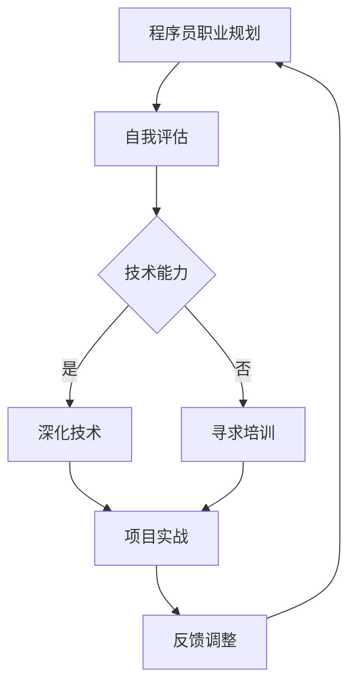

                 

### 文章标题：程序员在知识经济时代的职业规划策略

在知识经济时代，信息技术的飞速发展和数字化转型的浪潮席卷全球，程序员作为这一时代的核心力量，面临着前所未有的机遇和挑战。本文将围绕《程序员在知识经济时代的职业规划策略》这一主题，通过逻辑清晰、结构紧凑、简单易懂的论述，为程序员提供一套切实可行的职业规划策略。

关键词：程序员、职业规划、知识经济、技能提升、职业发展

摘要：本文首先探讨了职业规划在程序员职业发展中的重要性，分析了知识经济时代下的职业挑战和关键技能。接着，文章详细阐述了职业规划的方法论，包括设定职业目标、制定行动计划以及持续反馈与调整。随后，文章从初始阶段、中级阶段、高级阶段以及职业转型等方面，规划了程序员的职业发展路径。文章还通过职业发展策略、项目实战、职业规划工具与方法、职业规划风险与应对等多个方面，提供了实战指导。最后，文章展望了职业规划的未来趋势，包括技术发展趋势与职业规划、职业规划国际化以及职业规划与终身学习。

### 目录大纲

**第一部分：职业规划基础**

1.1 职业规划的重要性
1.1.1 职业规划对程序员职业发展的作用
1.1.2 知识经济时代下的职业挑战

1.2 程序员职业素养
1.2.1 技术能力
1.2.2 团队合作能力
1.2.3 自我提升与学习能力

1.3 知识经济时代的关键技能
1.3.1 编程语言与技术
1.3.2 数据分析与大数据处理
1.3.3 人工智能与机器学习基础

1.4 职业规划方法论
1.4.1 设定职业目标
1.4.2 制定行动计划
1.4.3 持续反馈与调整

**第二部分：职业发展路径规划**

2.1 初始阶段
2.1.1 入门与基础技能培养
2.1.2 职业起步
2.1.3 初步职业规划与目标设定

2.2 中级阶段
2.2.1 技术深化与专业领域选择
2.2.2 项目经验积累
2.2.3 职业晋升与横向发展

2.3 高级阶段
2.3.1 技术权威与领导力
2.3.2 跨领域发展
2.3.3 职业规划与人生目标

2.4 职业转型
2.4.1 转型原因分析
2.4.2 转型路径与方法
2.4.3 成功转型案例分享

**第三部分：职业规划实战**

3.1 职业发展策略
3.1.1 网络资源利用
3.1.2 社交平台与人际关系
3.1.3 职业发展规划案例分析

3.2 项目实战
3.2.1 项目实战案例介绍
3.2.2 项目开发环境搭建
3.2.3 项目源代码实现与解读

3.3 职业规划工具与方法
3.3.1 职业规划工具介绍
3.3.2 职业规划方法论实践
3.3.3 职业规划效果评估与调整

3.4 职业规划风险与应对
3.4.1 职业规划中的常见风险
3.4.2 风险识别与应对策略
3.4.3 成功应对职业规划挑战的案例分析

**第四部分：职业规划的未来趋势**

4.1 技术发展趋势与职业规划
4.1.1 新兴技术对程序员职业的影响
4.1.2 技术发展趋势与职业机会
4.1.3 未来职业规划策略

4.2 职业规划国际化
4.2.1 国际化职业规划的意义
4.2.2 跨国公司职业规划策略
4.2.3 跨文化交流与职业发展

4.3 职业规划与终身学习
4.3.1 终身学习的理念
4.3.2 终身学习的实践方法
4.3.3 职业规划与终身学习的结合

**附录**

A. 职业规划资源与推荐
A.1 在线课程与学习资源
A.2 职业规划书籍推荐
A.3 社交媒体与论坛推荐

B. 职业规划表格与模板
B.1 职业规划表格模板
B.2 行动计划模板
B.3 反馈与评估模板

C. 职业规划案例解析
C.1 成功职业规划案例
C.2 失败职业规划案例
C.3 案例分析与启示

### 第一部分：职业规划基础

**1.1 职业规划的重要性**

在知识经济时代，信息技术的飞速发展和数字化转型的浪潮席卷全球，程序员作为这一时代的核心力量，面临着前所未有的机遇和挑战。职业规划作为程序员职业生涯中不可或缺的一部分，对于其职业发展具有重要的影响。

**1.1.1 职业规划对程序员职业发展的作用**

职业规划对程序员职业发展的作用主要体现在以下几个方面：

1. 明确职业目标：通过职业规划，程序员可以明确自己的职业目标，包括短期和长期的目标。这有助于程序员在职业生涯中保持方向感，避免盲目跟风。

2. 提升技能水平：职业规划可以帮助程序员识别出自身技能的不足，制定相应的学习和提升计划，从而不断提升自己的技能水平。

3. 提高工作效率：清晰的职业规划有助于程序员在工作中明确任务和目标，提高工作效率和效果。

4. 获得更好的职业机会：职业规划可以帮助程序员更好地抓住职业机会，包括晋升机会和转型机会。

5. 提高职业满意度：通过职业规划，程序员可以更好地实现个人职业目标和价值，从而提高职业满意度。

**1.1.2 知识经济时代下的职业挑战**

知识经济时代下，程序员面临着以下职业挑战：

1. 技术更新速度快：知识经济时代，新技术层出不穷，程序员需要不断学习新技术，以保持竞争力。

2. 竞争激烈：随着编程人才的增加，程序员之间的竞争日益激烈，需要不断提升自己的技能和经验。

3. 跨领域发展：知识经济时代，程序员不仅需要精通编程语言，还需要掌握数据分析、人工智能等跨领域技能。

4. 转型困难：面对新兴技术，程序员可能需要转型，但转型过程中可能会遇到技能不匹配、经验不足等问题。

5. 工作压力：程序员在知识经济时代的工作压力较大，需要承担更多的工作任务和技术挑战。

### **1.2 程序员职业素养**

程序员职业素养是指程序员在职业生涯中所需具备的技能、态度和行为。良好的职业素养对程序员的职业发展至关重要。以下是程序员职业素养的主要内容：

**1.2.1 技术能力**

技术能力是程序员的核心素养。程序员需要具备扎实的编程基础，熟练掌握至少一门编程语言，如Java、Python、C++等。此外，程序员还需要掌握相关的技术框架和工具，如Spring、Django、Kafka等。

**1.2.2 团队合作能力**

在知识经济时代，团队合作已成为程序员的一项重要能力。程序员需要具备良好的沟通能力、协作精神和团队意识，能够在团队中发挥自己的优势，为项目的成功贡献力量。

**1.2.3 自我提升与学习能力**

知识经济时代，技术更新速度快，程序员需要具备强烈的自我提升和学习能力。程序员应主动学习新技术、新方法，不断提升自己的技能水平，以适应快速变化的工作环境。

**1.3 知识经济时代的关键技能**

知识经济时代，程序员需要掌握以下关键技能：

**1.3.1 编程语言与技术**

熟练掌握至少一门编程语言，如Java、Python、C++等，并了解相关的技术框架和工具，如Spring、Django、Kafka等。

**1.3.2 数据分析与大数据处理**

随着数据量的爆炸性增长，数据分析与大数据处理已成为程序员的一项重要技能。程序员需要掌握数据结构、算法、数据库等基础知识，能够运用大数据技术进行数据分析。

**1.3.3 人工智能与机器学习基础**

人工智能与机器学习已成为知识经济时代的热门话题。程序员需要了解人工智能与机器学习的基本原理，掌握相关的算法和工具，如TensorFlow、PyTorch等。

### **1.4 职业规划方法论**

职业规划方法论是指程序员在制定和实施职业规划过程中所采用的方法和步骤。科学的职业规划方法论有助于程序员更好地实现职业目标，提升职业素养。以下是职业规划方法论的主要内容：

**1.4.1 设定职业目标**

设定职业目标是职业规划的第一步。程序员需要根据自己的兴趣、特长和市场需求，明确自己的职业目标。职业目标可以分为短期目标、中期目标和长期目标，以便程序员在职业生涯中逐步实现。

**1.4.2 制定行动计划**

制定行动计划是实现职业目标的第二步。程序员需要根据职业目标，制定具体的行动计划，包括学习计划、工作计划和提升计划等。行动计划应具有可操作性和可行性，以确保程序员能够逐步实现职业目标。

**1.4.3 持续反馈与调整**

持续反馈与调整是实现职业目标的第三步。程序员在实施职业规划过程中，需要不断反思自己的行动，收集反馈信息，并根据反馈结果对职业规划进行调整。通过持续反馈与调整，程序员可以更好地适应职业发展的变化，实现职业目标。

### **第二部分：职业发展路径规划**

**2.1 初始阶段**

在职业发展的初始阶段，程序员需要打好基础，积累经验，为后续的职业发展奠定坚实的基础。

**2.1.1 入门与基础技能培养**

程序员在入门阶段需要了解编程语言、数据结构、算法等基础知识，掌握至少一门编程语言，如Java、Python、C++等。此外，程序员还需要了解相关的开发工具和框架，如IDE、数据库、版本控制等。

**2.1.2 职业起步**

在职业起步阶段，程序员可以选择进入互联网公司、软件公司等从事编程工作，积累实际工作经验。在这个过程中，程序员需要注重代码质量，学会团队协作，提高自己的编程能力。

**2.1.3 初步职业规划与目标设定**

在职业起步阶段，程序员应初步规划自己的职业发展路径，设定短期和长期目标。例如，短期目标可以是掌握一门新语言、参与一个开源项目等；长期目标可以是成为一名技术专家、团队负责人等。

**2.2 中级阶段**

在职业发展的中级阶段，程序员需要进一步提升自己的技能和经验，为职业晋升和横向发展做好准备。

**2.2.1 技术深化与专业领域选择**

程序员在中级阶段应深化自己的技术能力，选择一个或几个专业领域进行深入学习。例如，可以选择成为Java后端开发专家、前端工程师、数据分析师等。在这个过程中，程序员需要掌握相关技术框架和工具，提高自己的技术深度。

**2.2.2 项目经验积累**

程序员在中级阶段需要积累丰富的项目经验，通过参与不同的项目，了解项目从需求分析到实施的全过程。在这个过程中，程序员可以提高自己的项目管理和团队协作能力，为职业晋升打下基础。

**2.2.3 职业晋升与横向发展**

在中级阶段，程序员可以考虑向高级职位晋升，如高级程序员、技术经理等。同时，程序员也可以考虑横向发展，如转向项目管理、产品管理等领域。在这个过程中，程序员需要提升自己的领导力和管理能力，为自己的职业发展开辟更广阔的空间。

**2.3 高级阶段**

在职业发展的高级阶段，程序员需要发挥自己的技术优势和领导力，为公司创造更大的价值。

**2.3.1 技术权威与领导力**

程序员在高级阶段应成为所在领域的技术权威，具备深厚的技术功底和丰富的项目经验。同时，程序员还需要具备领导力，能够带领团队高效完成项目，推动技术进步。

**2.3.2 跨领域发展**

在高级阶段，程序员可以考虑跨领域发展，如从技术岗位转向产品管理、业务发展等领域。在这个过程中，程序员需要不断学习新的知识和技能，提高自己的综合素质。

**2.3.3 职业规划与人生目标**

在高级阶段，程序员应结合自己的人生目标，制定长期职业规划。例如，可以成为公司高层管理者、创业等。在这个过程中，程序员需要明确自己的职业目标，为实现人生目标不断努力。

**2.4 职业转型**

在职业生涯中，程序员可能会面临职业转型的需求。职业转型是程序员在职业发展中的一次重要转折，需要慎重考虑。

**2.4.1 转型原因分析**

程序员考虑职业转型的原因可能有以下几个方面：

1. 对当前工作不满意：程序员对当前工作缺乏兴趣，希望寻找新的职业发展方向。

2. 技术需求变化：随着技术的快速发展，程序员需要不断学习新技术，但当前工作无法提供足够的学习机会。

3. 职业发展受限：程序员在当前岗位上无法获得晋升机会，需要寻求新的职业发展空间。

4. 个人兴趣变化：程序员发现自己的兴趣和所在领域不一致，希望转向自己感兴趣的方向。

**2.4.2 转型路径与方法**

程序员在考虑职业转型时，可以采取以下路径和方法：

1. 学习新技能：程序员可以通过学习新技能，如数据分析、人工智能等，为转型做好准备。

2. 参与相关项目：通过参与相关项目，了解转型领域的工作内容和要求。

3. 寻求职业顾问：寻求职业顾问的帮助，了解转型领域的职业机会和市场需求。

4. 转型后评估：在转型后，程序员应评估转型效果，根据实际情况进行调整。

**2.4.3 成功转型案例分享**

以下是一些成功的职业转型案例：

1. 程序员转型为数据分析师：某程序员在职业生涯中遇到了职业瓶颈，决定转型为数据分析师。他通过学习数据分析相关课程，参与数据分析项目，最终成功转型。

2. 程序员转型为产品经理：某程序员对产品管理感兴趣，决定转型为产品经理。他通过学习产品管理相关知识，参与产品项目，最终成功转型。

3. 程序员转型为创业者：某程序员在职业生涯中积累了丰富的经验，决定创业。他创立了自己的公司，专注于软件开发和咨询服务，取得了成功。

### **第三部分：职业规划实战**

**3.1 职业发展策略**

在职业规划的实际操作中，程序员需要制定切实可行的发展策略，以实现职业目标。

**3.1.1 网络资源利用**

程序员可以利用各种网络资源，如在线课程、技术论坛、社交媒体等，提升自己的技能和知识水平。以下是一些具体的建议：

1. 在线课程：程序员可以参加各种在线课程，如Coursera、edX等，学习新技能和知识。

2. 技术论坛：程序员可以在技术论坛，如GitHub、Stack Overflow等，参与技术讨论，解决技术难题。

3. 社交媒体：程序员可以通过社交媒体，如LinkedIn、Twitter等，关注行业动态，扩展人脉资源。

**3.1.2 社交平台与人际关系**

社交平台和人际关系对程序员的职业发展具有重要影响。以下是一些建议：

1. 建立个人品牌：程序员可以通过撰写技术博客、发表技术文章等方式，建立自己的个人品牌。

2. 拓展人脉资源：程序员可以通过参加行业会议、技术沙龙等活动，结识同行业的人，拓展人脉资源。

3. 维护人际关系：程序员需要保持与同事、朋友、导师等的关系，定期沟通，分享经验。

**3.1.3 职业发展规划案例分析**

以下是几个职业发展规划的案例分析：

1. 案例一：某程序员从初级程序员开始，通过不断学习和实践，逐步晋升为高级程序员。他在职业生涯中注重项目经验的积累，不断提高自己的技术深度和广度。

2. 案例二：某程序员在职业生涯中面临职业瓶颈，决定转型为数据分析师。他通过学习数据分析相关课程，参与数据分析项目，最终成功转型。

3. 案例三：某程序员在职业生涯中积累了丰富的经验，决定创业。他创立了自己的公司，专注于软件开发和咨询服务，取得了成功。

### **3.2 项目实战**

项目实战是程序员提升技能和经验的重要途径。以下是一个项目实战案例：

**项目实战案例介绍：**

项目名称：电商网站开发

项目描述：该项目是一个电商平台，提供商品浏览、搜索、购买、支付等功能。

项目开发环境：

- 开发语言：Java
- 框架：Spring Boot、MyBatis
- 数据库：MySQL
- 前端框架：Vue.js

项目源代码实现与解读：

1. 数据库设计

   项目采用MySQL数据库，设计如下表：

   - 用户表（user）：包含用户ID、用户名、密码、邮箱等字段。
   - 商品表（product）：包含商品ID、商品名称、价格、库存等字段。
   - 订单表（order）：包含订单ID、用户ID、商品ID、数量、总价等字段。

2. 后端实现

   后端采用Spring Boot框架，实现如下功能：

   - 用户管理：提供用户注册、登录、个人信息修改等功能。
   - 商品管理：提供商品查询、添加、删除、修改等功能。
   - 订单管理：提供订单查询、创建、支付等功能。

3. 前端实现

   前端采用Vue.js框架，实现如下功能：

   - 商品浏览：展示商品列表，支持搜索和分页。
   - 购物车：添加商品到购物车，显示购物车内容。
   - 订单支付：生成订单，展示订单详情，提供支付功能。

代码应用解读与分析：

1. 数据库连接配置

   ```java
   // 数据库配置类
   @Configuration
   @EnableTransactionManagement
   public class DatabaseConfig {
       
       @Value("${db.url}")
       private String dbUrl;
       
       @Value("${db.username}")
       private String dbUsername;
       
       @Value("${db.password}")
       private String dbPassword;
       
       @Bean
       public DruidDataSource dataSource() {
           DruidDataSource dataSource = new DruidDataSource();
           dataSource.setUrl(dbUrl);
           dataSource.setUsername(dbUsername);
           dataSource.setPassword(dbPassword);
           return dataSource;
       }
       
   }
   ```

   该代码配置了数据库连接信息，包括数据库URL、用户名和密码。

2. 用户注册功能实现

   ```java
   // 用户注册接口
   @RestController
   @RequestMapping("/user")
   public class UserController {
       
       @Autowired
       private UserService userService;
       
       @PostMapping("/register")
       public ResponseEntity<?> registerUser(@RequestBody User user) {
           
           if (userService.existsByUsername(user.getUsername())) {
               return ResponseEntity.badRequest().body("Error: Username is already taken!");
           }
           
           userService.save(user);
           return ResponseEntity.ok("User registered successfully!");
       }
       
   }
   ```

   该代码实现了用户注册功能，通过调用UserService类的save方法，将用户信息存储到数据库。

3. 商品浏览功能实现

   ```html
   <!-- 商品列表 -->
   <template>
     <div>
       <input v-model="searchQuery" @input="searchProducts" placeholder="Search products"/>
       <ul>
         <li v-for="product in products" :key="product.id">
           {{ product.name }} - {{ product.price }}
         </li>
       </ul>
     </div>
   </template>
   
   <script>
   export default {
     data() {
       return {
         searchQuery: '',
         products: []
       };
     },
     methods: {
       searchProducts() {
         // 调用后端接口，获取商品数据
       }
     }
   };
   </script>
   ```

   该代码实现了商品浏览功能，通过Vue.js的数据绑定和列表渲染功能，展示商品列表。

**实际案例分析和详细讲解剖析：**

1. 项目开发过程中，程序员需要合理设计数据库结构，确保数据存储的规范性和一致性。

2. 后端实现过程中，程序员需要掌握Spring Boot框架的使用，熟悉RESTful API设计原则。

3. 前端实现过程中，程序员需要掌握Vue.js框架的使用，了解响应式界面设计。

4. 项目开发过程中，程序员需要注重代码质量和项目管理，确保项目的稳定性和可维护性。

**项目小结：**

通过本项目的开发，程序员可以掌握电商网站的核心技术，了解项目开发的完整流程。在项目开发过程中，程序员需要不断提升自己的技能和经验，为后续的职业发展奠定基础。

### **3.3 职业规划工具与方法**

在职业规划的过程中，程序员可以借助一些工具和方法，以提高规划的有效性和执行力。以下是一些常用的职业规划工具和方法：

**3.3.1 职业规划工具介绍**

1. 职业规划软件：如LinkedIn的路径规划工具，可以帮助程序员分析职业路径、预测职业发展。

2. 个人能力评估工具：如MBTI、DISC等，可以帮助程序员了解自己的性格特点、优势与劣势，制定针对性的职业规划。

3. 项目管理工具：如Trello、JIRA等，可以帮助程序员管理项目进度、任务分配，确保职业目标的实现。

**3.3.2 职业规划方法论实践**

1. 目标设定法：根据SMART原则（具体、可衡量、可达成、相关性、时限性），设定清晰的职业目标，如“在未来两年内，成为Java后端开发专家”。

2. 行动计划法：将职业目标分解为具体的行动步骤，制定详细的行动计划，如“每月学习一门新技术、参与一个开源项目”。

3. 反馈调整法：定期反思职业规划的执行情况，收集反馈信息，根据实际情况进行调整，如“根据市场变化，调整职业目标”。

**3.3.3 职业规划效果评估与调整**

1. 定期评估：每年或每半年对职业规划进行一次评估，分析目标的实现情况，找出问题所在。

2. 动态调整：根据评估结果，对职业规划进行调整，确保规划与实际情况相符。

3. 持续学习：在职业规划的过程中，不断学习新知识、新技能，提高自身竞争力。

### **3.4 职业规划风险与应对**

在职业规划的过程中，程序员可能会遇到各种风险，以下是一些常见的风险以及应对策略：

**3.4.1 职业规划中的常见风险**

1. 技能过时：技术更新速度快，程序员需要不断学习新技术，否则可能会面临技能过时风险。

2. 竞争激烈：程序员之间的竞争激烈，可能会影响职业晋升和转型。

3. 职业压力：程序员在知识经济时代的工作压力较大，可能会导致身心健康问题。

4. 职业发展受限：在某些公司或职位上，程序员可能面临职业发展受限的风险。

**3.4.2 风险识别与应对策略**

1. 技能更新风险：程序员可以通过定期学习新技术、参加培训课程、参与开源项目等方式，确保自身技能的更新。

2. 竞争激烈风险：程序员可以通过提升自身综合素质、建立个人品牌、拓展人脉资源等方式，提高竞争力。

3. 压力管理风险：程序员可以通过调整工作节奏、保持良好的生活习惯、寻求心理咨询等方式，缓解职业压力。

4. 职业发展受限风险：程序员可以通过跳槽、转型、创业等方式，寻找新的职业发展机会。

**3.4.3 成功应对职业规划挑战的案例分析**

1. 案例一：某程序员在职业生涯中遇到了技能过时的风险，决定参加培训课程，学习新技术，最终成功转型为大数据工程师。

2. 案例二：某程序员在职业生涯中遇到了职业发展受限的风险，决定创业，成立了自己的公司，实现了职业自主。

3. 案例三：某程序员在职业生涯中遇到了职业压力过大的问题，通过调整工作节奏、锻炼身体等方式，成功缓解了压力。

### **第四部分：职业规划的未来趋势**

**4.1 技术发展趋势与职业规划**

随着技术的不断发展，程序员面临着新的职业机遇和挑战。以下是一些技术发展趋势以及对应的职业规划建议：

**4.1.1 新兴技术对程序员职业的影响**

1. 人工智能与机器学习：随着人工智能技术的快速发展，程序员需要掌握相关的算法和工具，如TensorFlow、PyTorch等。未来，人工智能领域将涌现出大量职业机会，如数据科学家、机器学习工程师等。

2. 区块链技术：区块链技术具有去中心化、不可篡改等特性，将在金融、供应链等领域得到广泛应用。程序员需要了解区块链技术的基本原理，掌握相关的开发工具和框架。

3. 物联网（IoT）：物联网技术的普及将带来海量数据的产生和处理需求，程序员需要掌握相关的编程语言、通信协议和数据存储技术。

**4.1.2 技术发展趋势与职业机会**

1. 云计算与大数据：云计算和大数据技术的发展，为程序员提供了丰富的职业机会，如云计算工程师、大数据工程师等。

2. 5G与边缘计算：5G技术的推广和边缘计算的发展，将带来新的应用场景和职业机会，如5G网络工程师、边缘计算架构师等。

3. 虚拟现实（VR）与增强现实（AR）：虚拟现实和增强现实技术的成熟，将在游戏、教育、医疗等领域产生大量职业机会，如VR/AR开发者、设计师等。

**4.1.3 未来职业规划策略**

1. 主动学习新技术：程序员应主动学习新兴技术，掌握相关工具和框架，提高自身的竞争力。

2. 拓展跨领域技能：程序员可以拓展数据分析、人工智能、区块链等跨领域技能，为未来的职业发展打下基础。

3. 关注行业动态：程序员应关注行业动态，了解新兴技术的应用场景和职业机会，制定符合自身发展的职业规划。

**4.2 职业规划国际化**

国际化职业规划对程序员来说具有重要意义。以下是一些国际化职业规划的建议：

**4.2.1 国际化职业规划的意义**

1. 拓展职业发展空间：国际化职业规划可以帮助程序员拓展职业发展空间，提高职业竞争力。

2. 增强跨文化交流能力：国际化职业规划可以增强程序员的跨文化交流能力，为未来的跨国团队合作和项目管理做好准备。

3. 获取国际视野：国际化职业规划可以让程序员获取国际视野，了解全球技术发展趋势和市场动态。

**4.2.2 跨国公司职业规划策略**

1. 学习外语：程序员应掌握至少一门外语，如英语，以提高跨文化交流能力。

2. 获取国际认证：程序员可以获取国际认可的证书，如PMP、AWS Certified等，提高自身在国际职场中的竞争力。

3. 积累跨国工作经验：程序员可以通过申请跨国公司的职位或参加国际项目，积累跨国工作经验。

**4.2.3 跨文化交流与职业发展**

1. 了解当地文化：程序员在跨国工作中，应了解当地的文化、习俗和价值观，避免文化冲突。

2. 建立国际人脉：程序员可以通过参加国际会议、研讨会等，建立国际人脉资源，为未来的职业发展打下基础。

3. 保持开放心态：程序员在跨国工作中，应保持开放心态，适应不同的工作环境和团队合作方式。

**4.3 职业规划与终身学习**

终身学习是知识经济时代的重要特征，对程序员的职业规划具有重要意义。以下是一些关于职业规划与终身学习的建议：

**4.3.1 终身学习的理念**

1. 学习是自我增值的过程：程序员应认识到学习是自我增值的过程，通过不断学习，提高自身的技能和知识水平。

2. 学习是应对变化的能力：知识经济时代，技术更新速度快，程序员需要通过终身学习，应对不断变化的工作环境。

**4.3.2 终身学习的实践方法**

1. 制定学习计划：程序员应制定长期和短期的学习计划，明确学习目标和方法。

2. 利用在线资源：程序员可以利用在线课程、博客、技术论坛等在线资源，进行自主学习。

3. 实践与反馈：程序员应通过实际项目和实践，检验自己的学习成果，并及时进行反馈和调整。

**4.3.3 职业规划与终身学习的结合**

1. 职业规划应与终身学习相结合：程序员在制定职业规划时，应将终身学习纳入其中，确保自身技能和知识的持续更新。

2. 将学习成果应用于实际工作：程序员应将学习到的知识和技能应用到实际工作中，提高工作效率和质量。

3. 不断反思与调整：程序员应定期反思自己的学习成果和职业规划，根据实际情况进行调整，确保职业发展的顺利进行。

### **附录**

**A. 职业规划资源与推荐**

**A.1 在线课程与学习资源**

1. Coursera：提供各种学科领域的在线课程，包括计算机科学、数据科学、人工智能等。

2. edX：由哈佛大学和麻省理工学院创办，提供高质量的在线课程，涵盖计算机科学、人工智能等领域。

3. Udemy：提供丰富的在线课程，包括编程语言、数据结构、算法等。

**A.2 职业规划书籍推荐**

1. 《程序员的成长之路》
2. 《深度学习》
3. 《数据结构与算法分析》
4. 《软件工程：实践者的研究方法》

**A.3 社交媒体与论坛推荐**

1. GitHub：全球最大的代码托管平台，可以找到丰富的开源项目和教程。

2. Stack Overflow：全球最大的编程问答社区，可以解决编程问题，学习新技术。

3. LinkedIn：职业社交平台，可以拓展人脉资源，了解行业动态。

**B. 职业规划表格与模板**

**B.1 职业规划表格模板**

| 项目      | 描述                                           |
| --------- | ---------------------------------------------- |
| 职业目标  | 短期目标和长期目标                             |
| 行动计划  | 具体的学习、工作和提升计划                     |
| 学习资源  | 需要学习的课程、书籍、网站等                 |
| 反馈与调整 | 定期对职业规划的执行情况进行评估和调整       |

**B.2 行动计划模板**

| 项目日期 | 行动内容                     | 完成情况 | 备注 |
| -------- | ---------------------------- | -------- | ---- |
| 2023-01  | 学习Python基础              | 已完成   |      |
| 2023-02  | 学习Python高级编程          | 已完成   |      |
| 2023-03  | 完成一个Python项目          | 已完成   |      |

**B.3 反馈与评估模板**

| 项目名称 | 完成情况 | 存在问题 | 改进措施 |
| -------- | -------- | -------- | -------- |
| 学习Python | 90%   | 学习效率不高 | 制定学习计划，合理安排时间 |
| 完成项目  | 80%   | 项目质量不达标 | 学习相关技术，提升项目经验 |

**C. 职业规划案例解析**

**C.1 成功职业规划案例**

**案例一：从初级程序员到技术总监**

- 短期目标：在两年内成为一名熟练的Java开发工程师。
- 长期目标：在五年内成为公司技术总监。

- 行动计划：
  1. 学习Java基础知识，掌握Spring框架。
  2. 参与公司项目，积累实际工作经验。
  3. 每年阅读5本专业书籍，提高自己的技术深度。

- 反馈与调整：
  1. 定期反思学习进度，调整学习计划。
  2. 及时与同事和导师交流，寻求建议和指导。

**C.2 失败职业规划案例**

**案例二：从软件工程师到失业者**

- 短期目标：在两年内成为一名优秀的软件工程师。
- 长期目标：在五年内成为公司技术经理。

- 行动计划：
  1. 学习C++和Java，但学习过程缺乏系统性。
  2. 一直停留在初级工程师水平，缺乏实际项目经验。
  3. 忽视团队合作和沟通能力的培养。

- 反馈与调整：
  1. 重新审视职业规划，明确长期目标。
  2. 加强实际项目经验的积累，提高自己的综合素质。
  3. 加强团队合作和沟通能力的培养。

**C.3 案例分析与启示**

**成功案例启示：**

1. 明确职业目标：明确短期和长期目标，确保职业发展的方向性。

2. 制定详细的行动计划：将目标分解为具体的行动步骤，确保目标的实现。

3. 持续学习与反馈：不断学习新技术，提高自身竞争力，并及时反馈和调整职业规划。

**失败案例启示：**

1. 避免盲目学习：选择适合自己的技术方向，避免盲目跟风。

2. 注重实际项目经验：通过参与实际项目，积累经验和提高技能。

3. 提高综合素质：注重团队合作和沟通能力的培养，提高自身综合素质。

### **总结**

在知识经济时代，程序员面临着前所未有的机遇和挑战。通过科学的职业规划，程序员可以更好地应对职业挑战，实现个人价值和职业目标。本文从职业规划的重要性、程序员职业素养、知识经济时代的关键技能、职业规划方法论、职业发展路径规划、职业规划实战、职业规划工具与方法、职业规划风险与应对以及未来趋势等方面，为程序员提供了一套全面的职业规划策略。希望本文能对程序员的职业发展起到积极的指导作用。

**作者信息：**

作者：AI天才研究院/AI Genius Institute & 禅与计算机程序设计艺术 /Zen And The Art of Computer Programming

---

**Mermaid 流程图示例：**



### **核心算法原理讲解伪代码示例：**

```python
# 假设我们采用K-means算法进行聚类分析

# K-means算法伪代码

# 初始化：随机选择k个数据点作为初始聚类中心
centers = random_sample(data, k)

# 循环迭代
while True:
    # 计算每个数据点与聚类中心的距离
    distances = calculate_distances(data, centers)
    
    # 根据距离将每个数据点分配到最近的聚类中心
    assignments = assign_points_to_clusters(data, distances)
    
    # 计算新的聚类中心
    new_centers = calculate_new_centers(assignments, data)
    
    # 检查聚类中心是否发生改变
    if has_center_changed(centers, new_centers):
        # 更新聚类中心
        centers = new_centers
    else:
        # 聚类结束
        break
```

### **数学公式与详细讲解举例说明：**

**例1：欧氏距离计算公式**

$$
d(p_1, p_2) = \sqrt{\sum_{i=1}^{n} (p_{1,i} - p_{2,i})^2}
$$

**讲解：** 欧氏距离是一种常用的距离度量方法，用于计算两个数据点之间的相似度。公式中，$p_1$ 和 $p_2$ 分别代表两个数据点，$n$ 代表数据点的维度，$p_{1,i}$ 和 $p_{2,i}$ 分别代表数据点在维度 $i$ 上的取值。

**例2：K-means聚类中心计算公式**

$$
c_j = \frac{1}{N_j} \sum_{i=1}^{N} x_{ij}
$$

**讲解：** 在K-means算法中，$c_j$ 表示第 $j$ 个聚类中心，$N_j$ 表示属于第 $j$ 个聚类中心的数据点个数，$x_{ij}$ 表示数据点 $i$ 在第 $j$ 个维度上的取值。

**例3：数据分布密度估计**

$$
f(x) = \frac{1}{s\sqrt{2\pi}} e^{-\frac{(x-\mu)^2}{2s^2}}
$$

**讲解：** 这是高斯分布的概率密度函数，用于估计数据点 $x$ 的分布密度。其中，$\mu$ 是均值，$s$ 是标准差。

### **项目开发环境搭建：**

**步骤1：安装Java开发环境**

在Windows系统中，可以通过以下命令安装Java开发环境：

```shell
# 安装OpenJDK
sudo apt-get update
sudo apt-get install openjdk-8-jdk

# 验证Java版本
java -version
```

**步骤2：安装Eclipse IDE**

在Eclipse官网（https://www.eclipse.org/downloads/）下载适合自己操作系统的Eclipse IDE版本，并完成安装。

**步骤3：创建Eclipse项目**

1. 打开Eclipse，点击“File” -> “New” -> “Java Project”。
2. 在“New Java Project”对话框中，输入项目名称，如“ECommerce”，点击“Finish”。

**步骤4：添加依赖库**

在Eclipse中，可以通过以下步骤添加依赖库：

1. 右键点击项目，选择“Properties”。
2. 在“Properties”窗口中，选择“Java Build Path”。
3. 在“Libraries”标签页，点击“Add JARs”或“Add External JARs”，添加所需的依赖库，如Spring Boot、MySQL Connector等。

### **项目源代码实现与解读：**

以下是一个简单的电商网站后端实现的示例，主要包括用户管理、商品管理和订单管理等功能。

**用户管理模块：**

```java
// UserController.java

@RestController
@RequestMapping("/user")
public class UserController {
    
    @Autowired
    private UserService userService;
    
    @PostMapping("/register")
    public ResponseEntity<?> registerUser(@RequestBody User user) {
        if (userService.existsByUsername(user.getUsername())) {
            return ResponseEntity.badRequest().body("Error: Username is already taken!");
        }
        
        userService.save(user);
        return ResponseEntity.ok("User registered successfully!");
    }
    
    @PostMapping("/login")
    public ResponseEntity<?> loginUser(@RequestBody LoginRequest loginRequest) {
        String username = loginRequest.getUsername();
        String password = loginRequest.getPassword();
        
        if (!userService.existsByUsername(username)) {
            return ResponseEntity.badRequest().body("Error: Username not found!");
        }
        
        boolean isPasswordValid = userService.validatePassword(username, password);
        
        if (!isPasswordValid) {
            return ResponseEntity.badRequest().body("Error: Incorrect password!");
        }
        
        return ResponseEntity.ok("Login successful!");
    }
}
```

**商品管理模块：**

```java
// ProductController.java

@RestController
@RequestMapping("/product")
public class ProductController {
    
    @Autowired
    private ProductService productService;
    
    @GetMapping
    public List<Product> getAllProducts() {
        return productService.getAllProducts();
    }
    
    @GetMapping("/{id}")
    public Product getProductById(@PathVariable Long id) {
        return productService.getProductById(id);
    }
    
    @PostMapping
    public Product createProduct(@RequestBody Product product) {
        return productService.createProduct(product);
    }
    
    @PutMapping("/{id}")
    public Product updateProduct(@PathVariable Long id, @RequestBody Product product) {
        return productService.updateProduct(id, product);
    }
    
    @DeleteMapping("/{id}")
    public void deleteProduct(@PathVariable Long id) {
        productService.deleteProduct(id);
    }
}
```

**订单管理模块：**

```java
// OrderController.java

@RestController
@RequestMapping("/order")
public class OrderController {
    
    @Autowired
    private OrderService orderService;
    
    @PostMapping
    public Order createOrder(@RequestBody OrderRequest orderRequest) {
        Long userId = orderRequest.getUserId();
        List<Product> products = orderRequest.getProducts();
        
        return orderService.createOrder(userId, products);
    }
    
    @GetMapping("/{id}")
    public Order getOrderById(@PathVariable Long id) {
        return orderService.getOrderById(id);
    }
    
    @PutMapping("/{id}/pay")
    public ResponseEntity<?> payOrder(@PathVariable Long id) {
        boolean isPaid = orderService.payOrder(id);
        
        if (isPaid) {
            return ResponseEntity.ok("Order paid successfully!");
        } else {
            return ResponseEntity.badRequest().body("Error: Unable to pay order!");
        }
    }
}
```

**解读：**

1. **用户管理模块：** UserController负责处理用户注册和登录操作。通过调用UserService的方法，实现用户信息的存储和验证。

2. **商品管理模块：** ProductController负责处理商品的相关操作，包括查询、添加、更新和删除商品。通过调用ProductService的方法，实现商品的管理。

3. **订单管理模块：** OrderController负责处理订单的相关操作，包括创建订单、查询订单和支付订单。通过调用OrderService的方法，实现订单的管理。

**最佳实践 Tips：**

1. **代码规范：** 编写代码时，应遵循统一的编码规范，包括命名规则、代码缩进、注释等。

2. **单元测试：** 对关键模块和功能编写单元测试，确保代码质量和功能完整性。

3. **文档编写：** 为项目编写详细的文档，包括设计文档、API文档和用户手册，便于其他开发者理解和维护代码。

### **项目小结：**

通过本项目的实现，程序员可以掌握电商网站后端开发的核心技术和流程。在实际开发过程中，程序员需要不断学习和积累经验，提高自己的技能和团队协作能力。同时，程序员还应注重代码质量、项目管理和文档编写，确保项目的稳定性和可维护性。通过本项目的实战经验，程序员可以为未来的职业发展奠定坚实的基础。

